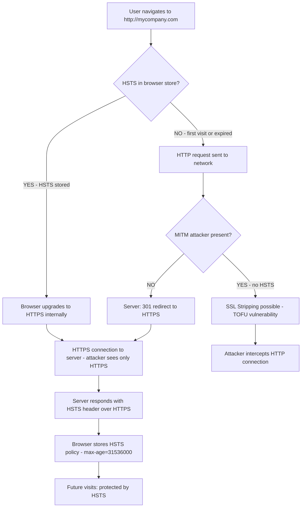

⚡ TL;DR - HSTS (HTTP Strict Transport Security, RFC 6797) is a browser security
policy where a website instructs browsers to only connect via HTTPS, never HTTP.
Once a browser sees the `Strict-Transport-Security` header, it will automatically
upgrade all future HTTP requests to HTTPS for the specified duration (max-age).
This defeats SSL stripping attacks (where a MITM downgrades HTTPS to HTTP before
the user's browser sees any HTTPS). The TOFU (Trust On First Use) weakness: the
first-ever connection could be intercepted (user hasn't seen the HSTS header yet).
HSTS preloading solves TOFU: submit your domain to the browser preload list
(hstspreload.org) - browsers ship with your domain already in their HSTS list,
so even the first-ever connection is protected. Key header values: `max-age=31536000`
(1 year - minimum recommended), `includeSubDomains` (applies to all subdomains),
`preload` (permits inclusion in browser preload lists).

---

| #097 | Category: Security | Difficulty: ★★★ |
|:---|:---|:---|
| **Depends on:** | OWASP Top 10, Session Management, IAM, TLS Configuration, OAuth 2.0 Security, Auth Migration, Heartbleed, Advanced JWT, Advanced XSS, CORS Misconfiguration, TLS Protocol Attacks, Certificate Transparency | |
| **Used by:** | Responsible Disclosure, IR Process, AWS Security Services, Security Governance, DevSecOps Pipeline Design, SSDLC, TLS 1.3 Protocol Design, Web Security Model | |
| **Related:** | OWASP Top 10, TLS Configuration, OAuth Security, Auth Migration, Heartbleed, Advanced JWT, Advanced XSS, CORS Misconfiguration, TLS Protocol Attacks, Certificate Transparency, Responsible Disclosure, TLS 1.3 Design | |

---

### 🔥 The Problem This Solves

**WHY HTTPS REDIRECTION IS NOT ENOUGH:**

```
THE SSL STRIPPING ATTACK (Moxie Marlinspike, 2009):

  SETUP:
    User has never visited mybank.com before.
    User types "mybank.com" (no https://) in browser → HTTP by default.
    MITM attacker is on the same network (public Wi-Fi).
    
  WHAT HAPPENS WITHOUT HSTS:
  
    User → (HTTP) → Attacker → (HTTPS) → Bank
    
    User's browser: sends plain HTTP GET http://mybank.com/
    Attacker receives the HTTP request (before HTTPS).
    Attacker forwards to bank via HTTPS (attacker has valid session with bank).
    Bank sends 301 Redirect → https://mybank.com/
    Attacker receives the HTTPS response from bank.
    Attacker strips the HTTPS redirect → sends HTTP 200 OK back to user.
    
    User's browser: thinks it's talking to http://mybank.com/
    User sees: the bank website (looks normal, served by attacker via HTTP).
    User: enters credentials on the bank's login page.
    User's credentials: sent in plaintext HTTP to attacker.
    
    Attacker: forwards login to bank via HTTPS (on behalf of user).
    Bank: thinks this is a normal login. Authenticates the user via attacker.
    Attacker: has the user's session.
    
  THE PROBLEM:
    The bank DOES have HTTPS. The bank DOES redirect HTTP → HTTPS.
    But: the REDIRECT happens AFTER the first HTTP request.
    The attacker intercepts the HTTP request BEFORE the redirect is visible to the user.
    The attacker "strips" the HTTPS from the communication.
    
    User's browser shows: http://mybank.com (not https://).
    User (non-technical): may not notice the lack of https://.
    
  SSL STRIPPING TOOL: SSLstrip (Moxie Marlinspike, 2009, presented at Black Hat).
  
  HOW HSTS FIXES THIS:
  
    First visit (HSTS set up):
    User visits https://mybank.com.
    Bank sends: Strict-Transport-Security: max-age=31536000; includeSubDomains
    Browser stores: "mybank.com: always use HTTPS for the next 365 days."
    
    All future visits (even if user types http://):
    Browser: "I know mybank.com requires HTTPS. Upgrade to HTTPS first."
    Browser → (HTTPS) → Bank (attacker can't intercept: HTTPS before attacker sees it)
    
    Attacker's SSLstrip: can't strip HTTPS it never sees.
    The HTTP-to-HTTPS upgrade happens in the browser (before any network request).
    Attacker only sees HTTPS connections (encrypted, can't read or modify).
```

---

### 📘 Textbook Definition

**HSTS (HTTP Strict Transport Security, RFC 6797):** A web security policy mechanism
that instructs browsers to only connect to a website via HTTPS for a specified
period. Delivered via the `Strict-Transport-Security` response header over HTTPS.
Once set, the browser enforces HTTPS for all subsequent connections to the domain
for the duration of `max-age`, preventing SSL stripping attacks.

**SSL Stripping:** A man-in-the-middle attack that intercepts plain HTTP requests
from a user's browser before the HTTPS redirect is seen. The attacker maintains
a HTTPS connection to the server and a HTTP connection to the client, transparently
proxying all requests. The user receives content over HTTP (unencrypted), believing
they are on a secure connection. First demonstrated by Moxie Marlinspike in 2009.

**TOFU (Trust On First Use):** The security limitation of HSTS. On the first-ever
visit to a domain, the browser has not yet seen the HSTS header. The first request
could be HTTP (if user typed the domain without https://), exposing that first
request to SSL stripping. After the first successful HTTPS connection that sets
the HSTS header, all future connections are protected.

**HSTS Preloading:** A mechanism that ships a list of HSTS-enabled domains
directly in browsers (Chrome, Firefox, Safari, Edge, etc.). Domains on the preload
list are enforced HTTPS even on the very first connection, eliminating the TOFU
vulnerability. Domain owners submit their domains to hstspreload.org.

**max-age:** The duration (in seconds) for which the browser should enforce HTTPS
for the domain. Minimum recommended: 31,536,000 (1 year). Required for preloading.

**includeSubDomains:** When present, the HSTS policy applies to all subdomains
(e.g., api.mycompany.com, admin.mycompany.com). Required for preloading. Risk:
if any subdomain is not ready for HTTPS, adding includeSubDomains will break it.

**preload:** A directive that indicates the domain owner consents to inclusion in
browser preload lists. Including `preload` in the header does not automatically add
the domain to the list - the domain owner must submit to hstspreload.org.

---

### ⏱️ Understand It in 30 Seconds

**One line:**
HSTS tells browsers "always use HTTPS for this domain for the next N seconds" -
stored in the browser, enforced before any network request - so attackers cannot
intercept the first HTTP request and strip it to a plain HTTP connection.

**One analogy:**
> Without HSTS: you're a customer walking into a bank.
> Bank policy: anyone who walks in with a plain envelope (HTTP) gets a redirect:
> "Please use our armored door (HTTPS) instead."
> Attacker in the lobby: "Oh, you want the armored door? I'll deliver your
> message for you." Takes your message (steals credentials), walks to the
> armored door themselves (HTTPS to bank), brings back the response.
> You never knew you were talking through an attacker.
>
> With HSTS: your browser memorized the rule from a previous visit:
> "This bank requires the armored door. ALWAYS."
> Now: you arrive at the bank. Your browser goes directly to the armored door
> (HTTPS) without going through the lobby at all.
> Attacker in the lobby sees nothing - you bypassed the lobby entirely.
> The attacker-as-middleman has no opportunity to intercept.
>
> HSTS Preloading: you've NEVER been to this bank before.
> But: your map (browser preload list) already says "this address = armored door only."
> Even your first visit: you go directly to the armored door.
> The attacker in the lobby: invisible to you from day one.

---

### 🔩 First Principles Explanation

**How HSTS works in the browser:**

```
HSTS STORAGE AND ENFORCEMENT:

  1. USER VISITS (first time, or HSTS not yet set):
     User navigates to: http://mycompany.com (or just "mycompany.com")
     
     Browser sends: GET http://mycompany.com/ HTTP/1.1
     Server responds: 301 → https://mycompany.com/
     
     Browser follows redirect to HTTPS:
     GET https://mycompany.com/ HTTP/1.1
     
     Server responds with:
     200 OK
     Strict-Transport-Security: max-age=31536000; includeSubDomains; preload
     (header set, content served)
     
     Browser stores:
     {
       "mycompany.com": {
         "hsts": true,
         "max_age": 31536000,
         "include_subdomains": true,
         "expiry": now + 31536000 seconds,
         "preload": true
       }
     }
     
     IMPORTANT: HSTS header is ONLY processed over HTTPS.
     If server sends HSTS header over HTTP: browser IGNORES it.
     (To prevent attackers from setting HSTS to break HTTPS.)
  
  2. USER VISITS (subsequent visits, within max-age):
     User navigates to: http://mycompany.com (or just "mycompany.com")
     
     Browser checks HSTS store:
     "mycompany.com is in HSTS store, expires in 365 days."
     
     Browser INTERNALLY upgrades to HTTPS:
     No HTTP request is sent to the network.
     Browser directly opens: https://mycompany.com/
     
     This upgrade happens BEFORE any network request.
     Attacker cannot intercept: there is no HTTP request to intercept.
     
  3. HSTS SUBDOMAIN BEHAVIOR (with includeSubDomains):
     HSTS for mycompany.com with includeSubDomains:
     Applies to: api.mycompany.com, admin.mycompany.com, etc.
     Browser: all subdomains are forced HTTPS.
     
     RISK: if api.mycompany.com is HTTP-only (old internal service):
     Adding includeSubDomains breaks it.
     Test ALL subdomains for HTTPS before adding includeSubDomains.
  
  4. HSTS REMOVAL (if needed):
     Server returns: Strict-Transport-Security: max-age=0
     Browser removes HSTS entry for the domain.
     Only works if browser can reach the server over HTTPS first.
     
     PRELOADED DOMAINS: cannot be de-listed easily.
     Chrome preload list removal: takes months (Chrome release cycle).
     Commitment before preloading: ensure HTTPS is permanent.

HSTS PRELOAD LIST:
  
  Browsers ship with built-in list of HSTS domains.
  Chrome: Chromium source, net/http/transport_security_state_static.json
  Contains: ~100,000+ domains (as of 2024).
  
  To get listed (hstspreload.org requirements):
  1. Valid HTTPS certificate.
  2. HTTP redirects to HTTPS.
  3. All subdomains work over HTTPS (includeSubDomains required).
  4. Header: max-age >= 31536000; includeSubDomains; preload
  5. Submit at hstspreload.org.
  
  Time from submission to browser inclusion: 2-12 weeks (Chrome release cycle).
  Once preloaded: domains in ALL browsers, not just those that visited before.
```

---

### 🧪 Thought Experiment

**SCENARIO: Public Wi-Fi SSL stripping without and with HSTS:**

```
SETUP:
  Location: Coffee shop public Wi-Fi.
  Victim: user who regularly uses mybank.com.
  Attacker: on same Wi-Fi, running SSLstrip + ARP spoofing.
  ARP spoofing: attacker makes victim's browser think the attacker is the gateway.
  All victim's traffic goes through attacker's machine.

SCENARIO A: mybank.com WITHOUT HSTS (only HTTP redirect)

  Victim types "mybank.com" → browser sends HTTP request.
  Attacker sees HTTP GET http://mybank.com/
  Attacker proxies to mybank.com via HTTPS (attacker ↔ bank = secure).
  Bank sends 301 → https://mybank.com/
  Attacker: strips the 301. Returns 200 OK with HTTP content.
  
  Victim sees: http://mybank.com/login (no padlock).
  Victim (doesn't notice): enters username/password.
  Attacker captures credentials in plain HTTP.
  
  RESULT: Victim credentials stolen. Account compromised.

SCENARIO B: mybank.com WITH HSTS (max-age=31536000)

  Sub-scenario B1: Victim has visited mybank.com before (HSTS stored).
  
  Victim types "mybank.com" → browser checks HSTS store.
  HSTS store: "mybank.com → HTTPS, expires in 300 days."
  Browser: upgrades to https://mybank.com/ INTERNALLY.
  No HTTP request sent to network.
  Attacker: sees only HTTPS connection from victim to mybank.com.
  Attacker cannot read or modify HTTPS traffic (no cert for mybank.com).
  
  RESULT: Victim connects securely. No interception possible.
  
  Sub-scenario B2: First-ever visit (TOFU vulnerability).
  
  Victim has NEVER visited mybank.com.
  No HSTS in browser for mybank.com.
  Victim types "mybank.com" → HTTP request (same as Scenario A).
  Attacker can strip SSL on this FIRST visit.
  
  PARTIAL EXPOSURE: only the first visit is unprotected.
  After first visit (if attacker chose not to attack): HSTS is set.
  All future visits: protected.

SCENARIO C: mybank.com WITH HSTS PRELOADING

  Victim has NEVER visited mybank.com.
  Browser ships with mybank.com in preload list.
  Browser: upgrades to HTTPS BEFORE first network request.
  
  Attacker: sees only HTTPS from victim. No HTTP request to intercept.
  
  RESULT: Complete protection from first visit. No TOFU vulnerability.
  
  COST: mybank.com must have reliable HTTPS for ALL subdomains before submission.
  Commitment: permanent HTTPS (preload removal takes months via browser releases).
```

---

### 🧠 Mental Model / Analogy

> HSTS is like a contact list entry for a secure phone number.
>
> When you call "Bank Customer Service," your phone checks:
> "Did I save this number with the flag 'SECURE ONLY - no voicemail, no plain calls'?"
>
> If yes (HSTS stored): your phone only connects through the encrypted line.
> Even if you accidentally dial the regular number: phone auto-routes to the encrypted line.
> A wiretapper on the regular line: hears nothing (your call never went there).
>
> If no (HSTS not stored): your call goes to whichever number first.
> If attacker redirects the regular number to their own line: your call goes there.
>
> HSTS Preloading: your phone came FROM THE FACTORY with "Bank Customer Service = SECURE ONLY."
> You've never called before. First call: still goes through the encrypted line.
> Factory-preset rules: no TOFU vulnerability.
>
> The max-age: "Keep this preference for 1 year."
> After 1 year: if you haven't visited the bank (refreshed the HSTS), preference expires.
> Next visit: go through the first-time flow again.
>
> This is why regular users of a site are better protected than one-time visitors:
> Regular visitors refresh HSTS on every visit (max-age resets on each visit with HSTS header).
> Casual or first-time visitors: TOFU window exists until HSTS is preloaded.

---

### 📶 Gradual Depth - Five Levels

**Level 1 - What it is (anyone can understand):**
HSTS is a security feature where websites tell browsers "always use the secure (HTTPS) connection for me, never the plain (HTTP) one." The browser remembers this for up to a year. This stops attackers from tricking the browser into using an unencrypted connection by pretending the website only accepts non-encrypted connections.

**Level 2 - How to use it (junior developer):**
Add this header to all HTTPS responses: `Strict-Transport-Security: max-age=31536000; includeSubDomains`. Start with a small max-age (300 seconds) to test, then increase to 31,536,000 (1 year). Verify all subdomains work over HTTPS before adding `includeSubDomains`. Add HTTP → HTTPS redirect (301) for the initial visit. Optional: submit to hstspreload.org after verifying everything works.

**Level 3 - How it works (mid-level engineer):**
Browser stores HSTS policy: domain → max_age + includeSubDomains + expiry. On navigation: browser checks HSTS before sending request. If HSTS found: upgrades http:// to https:// internally (no network HTTP request). SSL stripping defense: attacker only sees HTTPS connections (no HTTP to intercept). TOFU gap: first visit without preloading → HTTP request possible → SSL stripping window. HSTS preloading: browsers ship with a list of HSTS domains → first visit is protected. Header only processed over HTTPS (over HTTP it's ignored to prevent attackers from setting HSTS). max-age resets on every successful HTTPS response with HSTS header.

**Level 4 - Why it was designed this way (senior/staff):**
HSTS header only accepted over HTTPS: prevents an attacker from serving HSTS over HTTP to cause a denial of service (setting max-age=0 to disable HTTPS enforcement or setting a very long max-age on a domain they control). The TOFU vulnerability is inherent to any "first-use" trust mechanism. HSTS preloading is the architectural solution: move trust establishment out of runtime (first visit) into compile-time (browser build). This is a fundamental shift from reactive (learn from first visit) to proactive (know before first visit) security. The preload list is maintained by browser vendors, not CAs - different trust model. Inclusion requires the site to meet specific criteria and is a voluntary commitment. `includeSubDomains` risk: if any subdomain is HTTP-only, HSTS breaks it. This forces organizations to complete their HTTPS migration before declaring HSTS for all subdomains. This is intentional: HSTS with includeSubDomains is a forcing function for complete HTTPS adoption.

**Level 5 - Mastery (distinguished engineer):**
HSTS and mixed content: even with HSTS on the main domain, if a page loads HTTP resources (images, scripts, iframes), the HTTP resources are vulnerable to MITM. HTTPS-only enforcement requires fixing mixed content. Content Security Policy's `upgrade-insecure-requests` directive: automatically upgrades subresource HTTP requests to HTTPS. Complements HSTS. HSTS and cookie security: HSTS enforces HTTPS for the page but doesn't automatically set the Secure flag on cookies. Cookies without Secure flag are sent over HTTP if the browser makes an HTTP request. With HSTS: no HTTP requests should be made, but defense-in-depth still requires `Secure` flag on all cookies. HSTS supercookies / tracking: the HSTS store has been used as a side-channel for user tracking (evercookie technique). HSTS for domains visited/not-visited creates a bit-field uniquely identifying a user across sites. Browsers have added mitigations (clearing HSTS on cookie/cache clear, partitioning HSTS store). HSTS partition: Chrome 94+ partitions HSTS by network partition key (top-level site) to prevent cross-site tracking via HSTS oracle. HSTS bypass via network-level MiTM: if attacker controls DNS + has a trusted certificate: HSTS is bypassed. Certificate pinning addresses this case, but was deprecated (HPKP).

---

### ⚙️ How It Works (Mechanism)

```
HSTS FLOW - BROWSER DECISION:

  Navigate to "mycompany.com" or "http://mycompany.com"
  
  Browser checks HSTS store:
  ┌─────────────────────────────────────────────────────────────┐
  │ Is mycompany.com in HSTS store and not expired?             │
  │                                                             │
  │  YES → upgrade request to https://mycompany.com/           │
  │         (no HTTP request sent to network)                   │
  │  NO  → send HTTP request (TOFU risk or preload list check)  │
  └─────────────────────────────────────────────────────────────┘
  
  On successful HTTPS response with HSTS header:
  ┌─────────────────────────────────────────────────────────────┐
  │ Update HSTS store:                                          │
  │   mycompany.com → max_age=31536000, includeSubDomains       │
  │   expiry = now + 31536000                                   │
  │   (timer resets on each visit with HSTS header)             │
  └─────────────────────────────────────────────────────────────┘

HEADER SYNTAX:
  Strict-Transport-Security: max-age=31536000
  Strict-Transport-Security: max-age=31536000; includeSubDomains
  Strict-Transport-Security: max-age=31536000; includeSubDomains; preload
```



---

### 💻 Code Example

**HSTS configuration (nginx, Spring Boot, and header verification):**

```nginx
# nginx.conf - HSTS configuration

server {
    listen 80;
    server_name mycompany.com www.mycompany.com;
    
    # Redirect all HTTP to HTTPS (prerequisite for HSTS):
    return 301 https://$server_name$request_uri;
}

server {
    listen 443 ssl http2;
    server_name mycompany.com www.mycompany.com;
    
    # HSTS header - applied to all HTTPS responses:
    # max-age=31536000: 1 year
    # includeSubDomains: applies to all subdomains
    # preload: consent for preload list submission
    add_header Strict-Transport-Security \
        "max-age=31536000; includeSubDomains; preload" always;
    #                                                   ^^^^^^
    #                              "always" = set even on error responses (4xx, 5xx)
    #                              Without "always": error responses may not include HSTS.
    #                              Browser only processes HSTS from HTTPS responses.
    
    # Additional security headers (complement HSTS):
    add_header X-Content-Type-Options "nosniff" always;
    add_header X-Frame-Options "DENY" always;
    add_header Referrer-Policy "strict-origin-when-cross-origin" always;
    
    # CSP upgrade-insecure-requests: browser upgrades subresource HTTP to HTTPS
    # (complements HSTS, handles mixed content):
    add_header Content-Security-Policy \
        "upgrade-insecure-requests; default-src 'self'" always;
    
    # ... rest of server config
}

# CAUTION before enabling includeSubDomains:
# Verify ALL subdomains serve valid HTTPS:
# check: api.mycompany.com, admin.mycompany.com, staging.mycompany.com
# check: old/forgotten subdomains (check CT logs via crt.sh)
```

```java
// Spring Boot - HSTS via Security configuration

@Configuration
@EnableWebSecurity
public class SecurityConfig {
    
    @Bean
    public SecurityFilterChain filterChain(HttpSecurity http) throws Exception {
        http
            // HSTS configuration:
            .headers(headers -> headers
                .httpStrictTransportSecurity(hsts -> hsts
                    .maxAgeInSeconds(31536000)  // 1 year
                    .includeSubDomains(true)
                    .preload(true)
                )
                // Prevent clickjacking:
                .frameOptions(frame -> frame.deny())
                // Prevent MIME sniffing:
                .contentTypeOptions(Customizer.withDefaults())
            )
            
            // Redirect HTTP to HTTPS (requires separate HTTP listener or
            // handled at load balancer level - preferred):
            .requiresChannel(channel -> channel
                .anyRequest().requiresSecure()
            );
        
        return http.build();
    }
}

// STAGED ROLLOUT (safe migration to HSTS):
// Phase 1: max-age=300 (5 minutes) - monitor for issues
// Phase 2: max-age=86400 (1 day) - if no issues
// Phase 3: max-age=2592000 (30 days)
// Phase 4: max-age=31536000 (1 year) + includeSubDomains
// Phase 5: Submit to hstspreload.org (permanent commitment)

// VERIFICATION COMMANDS:
// curl -I https://mycompany.com | grep -i strict
// Expected: Strict-Transport-Security: max-age=31536000; includeSubDomains; preload

// TESTING PRELOAD STATUS:
// https://hstspreload.org/?domain=mycompany.com
```

---

### ⚖️ Comparison Table

| Mechanism | Prevents SSL Stripping? | Protects First Visit? | Works Without HTTPS? | Complexity |
|:---|:---|:---|:---|:---|
| **HTTP → HTTPS redirect (301)** | No (redirect can be stripped) | No | N/A | Low |
| **HSTS** | Yes (after first visit) | No (TOFU) | No (browser must see HSTS over HTTPS) | Low |
| **HSTS + Preloading** | Yes | Yes | No | Medium (submission) |
| **Certificate Pinning (HPKP, deprecated)** | Yes | Yes | No | High (risky) |

---

### ⚠️ Common Misconceptions

| Misconception | Reality |
|:---|:---|
| "HTTP 301 redirect to HTTPS is equivalent to HSTS." | A 301 redirect does redirect users to HTTPS. But the 301 response itself is sent over HTTP (the first request is HTTP). That HTTP response can be intercepted and modified by a MITM attacker (SSL stripping): attacker changes the 301 to a 200 OK, serves content over HTTP, user never gets to HTTPS. HSTS eliminates the HTTP request entirely: browser makes the HTTPS upgrade BEFORE any network request. The 301 redirect is still needed for the first visit (before HSTS is stored), but HSTS is what makes subsequent visits completely protected. Both are required: 301 for first visit, HSTS for all future visits. |
| "HSTS with includeSubDomains is always safe to add." | `includeSubDomains` applies HSTS to ALL subdomains - including ones you may have forgotten about or haven't configured for HTTPS. If any subdomain is HTTP-only: adding `includeSubDomains` immediately makes that subdomain inaccessible in browsers that have cached the HSTS policy. The safe approach: audit all subdomains for HTTPS before adding `includeSubDomains`. Use crt.sh to find all subdomains that have certificates. Check internal tools, staging environments, and old services. This is also why preloading (which requires `includeSubDomains`) requires careful preparation - once preloaded, removing is very difficult. |

---

### 🚨 Failure Modes & Diagnosis

**HSTS implementation verification:**

```
TESTING HSTS CONFIGURATION:

  1. VERIFY HEADER PRESENT:
    curl -sI https://mycompany.com | grep -i strict
    Expected: Strict-Transport-Security: max-age=31536000; includeSubDomains; preload
    
    If no HSTS header: check server config + verify request is HTTPS.
    
  2. VERIFY HTTP REDIRECTS TO HTTPS:
    curl -sI http://mycompany.com
    Expected: HTTP/1.1 301 Moved Permanently
    Expected: Location: https://mycompany.com/
    
    If 200 without redirect: HTTP is served directly (HSTS never triggers).

  3. VERIFY SUBDOMAIN HTTPS (before adding includeSubDomains):
    # Check all known subdomains:
    for subdomain in api admin staging dev; do
        STATUS=$(curl -s -o /dev/null -w "%{http_code}" \
            --max-time 5 https://${subdomain}.mycompany.com)
        echo "${subdomain}.mycompany.com: ${STATUS}"
    done
    # Any non-200 (or timeout): fix before adding includeSubDomains.

  4. CHECK PRELOAD STATUS:
    curl -s "https://hstspreload.org/api/v2/status?domain=mycompany.com"
    # Returns: "status": "preloaded" or "eligible" or "unknown"

  5. BROWSER HSTS CACHE INSPECTION:
    Chrome: chrome://net-internals/#hsts
    Enter domain: mycompany.com
    "Query" → shows stored HSTS policy with expiry.
    "Delete" → removes HSTS entry (testing purposes).

  COMMON MISTAKES:
    - HSTS header on HTTP response: ignored by browser.
    - Missing "always" in nginx: header not sent on error pages.
    - max-age=0 accidentally deployed: HSTS deleted from all browsers.
    - includeSubDomains without verifying all subdomains support HTTPS.
    - preload directive without submitting to hstspreload.org
      (directive alone doesn't preload, just indicates consent).

  STAGED ROLLOUT VERIFICATION:
    Week 1: max-age=300 → monitor error rates, user complaints.
    Week 2: max-age=86400 → confirm no subdomain breakage.
    Month 1: max-age=31536000; includeSubDomains → production-ready.
    When confident: add preload directive + submit to hstspreload.org.
```

---

### 🔗 Related Keywords

**Prerequisites:**
- `TLS Configuration` (SEC-041) - TLS setup that HSTS enforces
- `TLS Protocol Attacks` (SEC-095) - SSL stripping that HSTS prevents
- `Certificate Transparency Logs` (SEC-096) - complementary certificate security

**Builds on this:**
- `TLS 1.3 Protocol Design Rationale` (SEC-130) - TLS architecture for HSTS foundation
- `Web Security Model Browser Architecture` (SEC-135) - browser security context

---

### 📌 Quick Reference Card

```
┌──────────────────────────────────────────────────────────┐
│ HEADER        │ Strict-Transport-Security:               │
│               │ max-age=31536000; includeSubDomains       │
│               │ ; preload                                 │
├───────────────┼──────────────────────────────────────────┤
│ MAX-AGE       │ min 300 (test) → 31536000 (1yr, preload) │
│               │ Resets on each HTTPS visit with header   │
├───────────────┼──────────────────────────────────────────┤
│ DEFEATS       │ SSL stripping (after first HSTS visit)   │
│               │ HTTP-based MITM                          │
├───────────────┼──────────────────────────────────────────┤
│ TOFU RISK     │ First visit: still HTTP-vulnerable        │
│               │ Fix: HSTS preloading (hstspreload.org)   │
├───────────────┼──────────────────────────────────────────┤
│ PRELOAD REQS  │ max-age >= 31536000                      │
│               │ includeSubDomains (mandatory)            │
│               │ All subdomains must serve valid HTTPS    │
├───────────────┼──────────────────────────────────────────┤
│ STAGED ROLLOUT│ 300s → 86400s → 1yr → preload submit    │
└──────────────────────────────────────────────────────────┘
```

---

### 💎 Transferable Wisdom

**Reusable Engineering Principle:**
"Default-secure configuration stored client-side eliminates a class of server-side attacks."
HSTS is an example of pushing security policy enforcement to the client:
the browser stores "only HTTPS" and enforces it without any network round-trip.
The server cannot be attacked (SSL stripping) before the browser enforces HTTPS.
This client-side enforcement pattern appears in other security mechanisms:
- CSP (Content Security Policy): browser enforces script/resource loading policy
  specified by the server, cached for the page.
- CORS (Cross-Origin Resource Sharing): browser enforces cross-origin access
  policy based on server headers.
- HPKP (deprecated): browser pins expected certificates, rejects unexpected ones.
- SameSite cookies: browser enforces cross-site cookie sending policy.
- Trusted Types: browser enforces JavaScript sink policies.
In all cases: the SERVER declares the policy, the BROWSER enforces it.
The security benefit: enforcement happens before the attacker's manipulation
(SSL strip, script injection, cross-origin theft) can occur.
The risk: policy declared once, enforced everywhere.
If the policy is wrong (breaks subdomains, breaks legitimate cross-origin):
the browser enforces the wrong policy. Recovery is slow (max-age timeout).
The engineering lesson: client-side security policy declarations require careful
deployment (staged rollout) because they are easy to deploy and hard to recover from.
Security policy mistakes that break user experience have a blast radius proportional
to the number of users who have cached the policy.

---

### 💡 The Surprising Truth

HSTS preloading creates a de facto permanent HTTPS commitment.
Chrome's preload list is part of the browser source code.
Adding a domain: new browser release → all Chrome users worldwide.
Removing a domain: another new browser release → another worldwide rollout.
A Chrome release cycle: approximately 4-6 weeks.
During that 4-6 weeks: your domain is still on the preload list for billions of users.
Effective removal time from all Chrome users: months to a year.

Why does this matter? Real-world failure mode:
A company submits its domain (mycompany.com) to the HSTS preload list.
6 months later: the company is acquired. The new owner wants to move some services
back to HTTP temporarily during infrastructure migration.
But: mycompany.com is on the preload list. All Chrome users (globally)
are forced to HTTPS. The migration cannot proceed as planned.
The company must maintain HTTPS everywhere for all subdomains
until the preload list removal propagates to all users.

This is a real commitment. The hstspreload.org submission form explicitly warns:
"This action is not easily reversible. Inclusion in the preload list
should be considered a permanent commitment."

The engineering lesson: security controls that are easy to deploy and
hard to reverse require a COMMITMENT decision, not just a TECHNICAL decision.
Before deploying an irreversible security control:
"Can we sustain this forever?" If yes: proceed.
If not: don't preload (use HSTS without preloading instead).
The technical capability to deploy and the organizational commitment to sustain
must both exist before committing to permanent security postures.

---

### ✅ Mastery Checklist

**You've mastered this when you can:**
1. **EXPLAIN** SSL stripping: MITM intercepts first HTTP request, strips HTTPS redirect,
   serves content over HTTP. HSTS prevents this by upgrading HTTP→HTTPS in the browser
   before any network request is sent.
2. **DESCRIBE** TOFU and its fix: first visit exposes the browser to SSL stripping
   (HSTS not yet set). HSTS preloading ships the domain in browsers pre-populated -
   even first visit is protected.
3. **WRITE** the production HSTS header: `Strict-Transport-Security: max-age=31536000; includeSubDomains; preload`
   Explain the risk of `includeSubDomains` (breaks HTTP-only subdomains).
4. **DESCRIBE** staged rollout: start at max-age=300, gradually increase to 31536000,
   test all subdomains, then submit to preload list.

---

### 🎯 Interview Deep-Dive

**Q: What is HSTS and what security problem does it solve? What is the TOFU
vulnerability and how does preloading address it?**

*Why they ask:* Tests HTTPS security depth, ability to explain browser security mechanisms,
and understanding of attack scenarios. Common in backend, infrastructure, and security roles.

*Strong answer covers:*
- SSL Stripping (2009, Moxie Marlinspike): MITM on public Wi-Fi. User types "mybank.com".
  Browser sends HTTP GET. Attacker intercepts. Attacker proxies to bank via HTTPS.
  Attacker strips HTTPS from response. User on HTTP (unencrypted), attacker reads everything.
  A 301 redirect doesn't help: 301 is itself HTTP → can be stripped.
- HSTS: `Strict-Transport-Security: max-age=31536000; includeSubDomains`.
  Browser stores policy: "mybank.com → HTTPS only for 1 year."
  All future navigations: browser upgrades http:// → https:// internally.
  No HTTP request reaches the network. Attacker has nothing to intercept.
- TOFU (Trust On First Use): first ever visit → no HSTS stored → HTTP request sent.
  Attacker can strip on first visit. HSTS only effective after first successful HTTPS response.
- HSTS Preloading: browsers ship with list of HSTS domains in source code.
  mycompany.com appears in Chrome's preload list → even first visit is protected.
  Submit: hstspreload.org. Requirements: max-age >= 31536000, includeSubDomains, preload directive,
  all subdomains must be HTTPS. Commitment: effectively permanent (removal takes months).
- Risk of includeSubDomains: breaks any HTTP-only subdomains. Audit all subdomains first.
- Staged rollout: 300s → 86400s → 31536000s → preload. Never skip gradual increase.