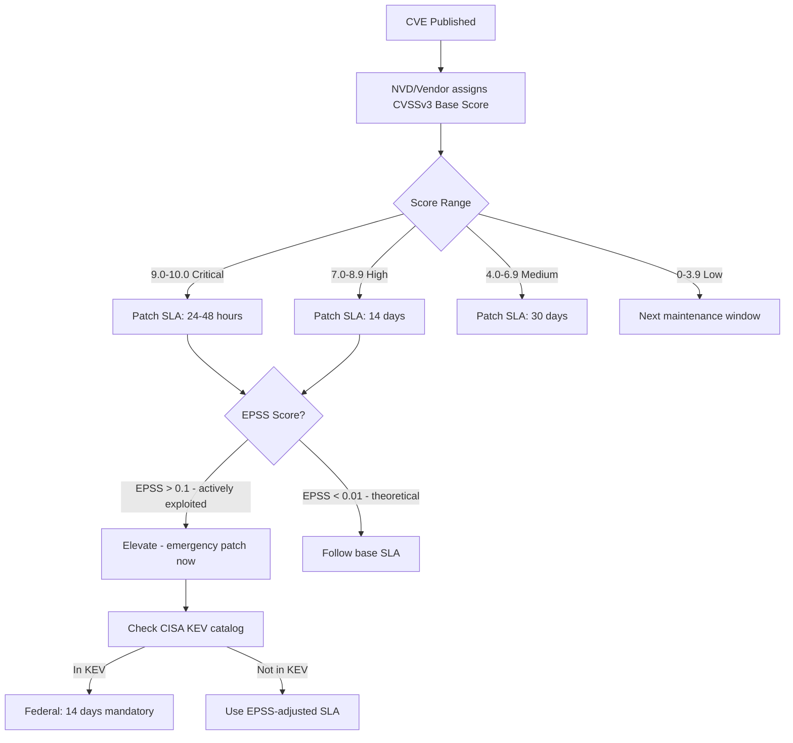

⚡ TL;DR - CVSS (Common Vulnerability Scoring System) is the industry-standard
framework for rating the severity of software vulnerabilities on a 0-10 scale.
CVSSv3.1 and v4.0 use three metric groups: Base Score (inherent vulnerability
characteristics - exploitability and impact), Temporal Score (current exploit
maturity and fix availability), and Environmental Score (customized to your
infrastructure). Score ranges: 0.0-3.9 (Low), 4.0-6.9 (Medium), 7.0-8.9 (High),
9.0-10.0 (Critical). CVSSv3 base metrics: Attack Vector (Network/Adjacent/Local/Physical),
Attack Complexity (Low/High), Privileges Required (None/Low/High), User Interaction
(None/Required), Scope (Changed/Unchanged), Confidentiality/Integrity/Availability
impact (None/Low/High). Critical flaw: CVSS rates theoretical severity, not
real-world exploitability. EPSS (Exploit Prediction Scoring System) rates
probability of exploit in the wild - use both together for patch prioritization.

---

| #098 | Category: Security | Difficulty: ★★★ |
|:---|:---|:---|
| **Depends on:** | OWASP Top 10, Authentication, Session Management, IAM, TLS Configuration, OAuth 2.0 Security, Business Logic Vulnerabilities, Heartbleed, Log4Shell, SolarWinds SUNBURST, Equifax, Advanced JWT, Advanced XSS | |
| **Used by:** | CVE + NVD, Responsible Disclosure, IR Process, Digital Forensics Basics, AWS Security Services, SAST in CICD, Security at Scale, Security Governance, Security Metrics, DevSecOps Pipeline Design | |
| **Related:** | OWASP Top 10, Authentication, TLS Configuration, OAuth Security, Business Logic, Heartbleed, Log4Shell, SolarWinds, Equifax, Advanced JWT, Advanced XSS, CVE + NVD, Responsible Disclosure, Security Metrics | |

---

### 🔥 The Problem This Solves

**WHY VULNERABILITY PRIORITIZATION REQUIRES A SCORING FRAMEWORK:**

```
THE VULNERABILITY OVERLOAD PROBLEM:

  A TYPICAL ENTERPRISE SECURITY POSTURE (2024):

    Software components: 50,000+ (including all transitive dependencies)
    New CVEs published per year: ~25,000-30,000
    New CVEs per day: ~70-80
    
    Security team bandwidth: 5-10 engineers.
    
    QUESTION: Which vulnerabilities to patch FIRST?
    
    Without CVSS: no framework. Decisions based on:
    - Which vendor sent the scariest email?
    - Which CVE got the most media coverage?
    - Which vulnerability the CEO heard about at a conference?
    - Random order.
    
    RESULT: Critical vulnerabilities missed. Non-critical ones patched first.
    
  THE CVSS ANSWER:
  
    CVSS provides a common language for vulnerability severity.
    ALL CVEs published in NVD have a CVSS score.
    Patch SLA based on CVSS score:
    
      Critical (9.0-10.0): patch within 24-48 hours
      High (7.0-8.9): patch within 7-14 days
      Medium (4.0-6.9): patch within 30-60 days
      Low (0.0-3.9): patch at next scheduled maintenance
    
    Result: every security team knows the rules.
    Operations teams understand the urgency.
    CISO can report: "% of Critical vulns patched within 24h SLA."
    
  THE CVSS LIMITATION:
  
    CVSS rates THEORETICAL severity.
    A CVSSv3 9.8 vulnerability may:
    - Have no known public exploit.
    - Affect only a very specific configuration you don't use.
    - Be unexploitable in your environment due to compensating controls.
    
    Example: Log4Shell (CVE-2021-44228): CVSSv3 10.0
    Reality: thousands of systems had log4j in test/dev environments not
    reachable from the internet. CVSS 10.0 but LOW actual risk in those environments.
    
    CVSS TELLS YOU: how bad the vulnerability is IN THE WORST CASE.
    CVSS DOESN'T TELL YOU: probability someone will actually exploit it against you.
    
    EPSS (Exploit Prediction Scoring System) fills this gap:
    EPSS = probability of exploitation in the next 30 days, based on:
    - Whether public exploit code exists.
    - Whether exploit is being used in the wild.
    - Vulnerability characteristics.
    - Historical exploitation patterns.
    
    Best practice: use CVSS (severity) + EPSS (exploitability) together.
```

---

### 📘 Textbook Definition

**CVSS (Common Vulnerability Scoring System):** An open industry standard for
assessing the severity of computer system security vulnerabilities. Maintained by
FIRST (Forum of Incident Response and Security Teams). Produces a score from 0.0
to 10.0 with qualitative ratings: None (0.0), Low (0.1-3.9), Medium (4.0-6.9),
High (7.0-8.9), Critical (9.0-10.0). Version 3.1 is widely used; v4.0 (2023)
adds finer-grained metrics.

**CVSSv3 Base Score:** A score reflecting the intrinsic characteristics of a
vulnerability, independent of time and user environment. Computed from six metrics:
Attack Vector, Attack Complexity, Privileges Required, User Interaction, Scope,
and the CIA triad impact (Confidentiality, Integrity, Availability).

**Attack Vector (AV):** How the vulnerability is exploited: Network (remotely,
across the internet - most severe), Adjacent (requires network access to the same
LAN/segment), Local (requires local access to the system), Physical (requires
physical access to hardware).

**Scope (S):** Whether exploiting the vulnerability affects resources beyond the
vulnerable component: Changed (impacts other components, e.g., OS privilege
escalation from an app-level vuln), Unchanged (impact confined to the vulnerable
component).

**Temporal Score:** Modifies the Base Score based on current exploit maturity
(Proof-of-Concept? Functional? Active exploitation?) and remediation level
(Official fix available? Workaround? No fix?). Temporal score is lower than Base
when no exploit exists; rises when active exploitation is confirmed.

**Environmental Score:** Customizes the Base Score for your specific environment.
If the vulnerable component is behind a firewall (reducing Attack Vector severity),
or if Confidentiality is less important in your context, Environmental Score adjusts.

**EPSS (Exploit Prediction Scoring System):** A probability score (0.0-1.0)
estimating the likelihood of exploitation in the next 30 days, published by FIRST.
Complements CVSS: CVSS measures worst-case severity, EPSS measures likely exploitation.

---

### ⏱️ Understand It in 30 Seconds

**One line:**
CVSS converts a vulnerability description into a 0-10 severity score using six
metrics (how it's exploited, what privileges it needs, what the impact is), giving
security teams a common language for prioritizing patching - but CVSS measures
worst-case severity, not actual exploitation probability (that's EPSS).

**One analogy:**
> CVSS is like a car crash severity rating.
>
> Crash test rating = CVSS (inherent severity):
> - High-speed frontal impact: very severe (like Network Attack Vector, no privileges needed).
> - Low-speed parking lot fender-bender: low severity (like Physical AV, limited impact).
>
> The rating tells you: "If this crash happens, how bad is it?"
> It doesn't tell you: "How likely is this crash to happen to you?"
>
> EPSS is the accident statistics:
> "Crashes of type X happen to 1 in 10,000 cars per year" (EPSS: 0.01%)
> "Crashes of type Y are happening to hundreds of cars per day" (EPSS: 95%)
>
> Rational decision: buy a car with low crash ratings (avoid high CVSS vulns),
> and prioritize crashes that actually happen frequently (high EPSS vulns).
>
> Bad decision: obsess only about the theoretical worst-case crash (CVSS 10.0)
> while ignoring the crash that's actively happening everywhere (EPSS 0.85 on a CVSS 7.0).
>
> Both metrics matter. Neither alone is sufficient.
> CVSS 9.8 + EPSS 0.01 = fix within a week.
> CVSS 7.0 + EPSS 0.85 + active exploitation = fix TONIGHT.

---

### 🔩 First Principles Explanation

**CVSSv3 metric breakdown:**

```
CVSSv3.1 BASE METRICS:

  EXPLOITABILITY METRICS:
  
    Attack Vector (AV):     Network (N)   Adjacent (A)  Local (L)  Physical (P)
    Score contribution:     Highest        ↓             ↓          Lowest
    
    Network: exploitable remotely from internet.
    Example: web app RCE accessible from internet = AV:N
    
    Adjacent: requires attacker on same network segment (LAN, Bluetooth, Wi-Fi).
    Example: ARP poisoning, Wi-Fi attacks = AV:A
    
    Local: requires attacker to be logged into the system.
    Example: privilege escalation from unprivileged user = AV:L
    
    Physical: requires physical access to hardware.
    Example: cold boot attack, JTAG exploit = AV:P
    
  ────────────────────────────────────────────────────────────
  
    Attack Complexity (AC): Low (L)          High (H)
    Score contribution:     Higher            Lower
    
    Low: no special conditions needed, attack is reliable.
    High: requires special conditions, race conditions, config prerequisites.
    
  ────────────────────────────────────────────────────────────
  
    Privileges Required (PR):  None (N)      Low (L)      High (H)
    Score contribution:        Highest        ↓            Lowest
    
    None: attacker needs no authentication.
    Low: attacker needs basic user account.
    High: attacker needs admin/root account.
    
  ────────────────────────────────────────────────────────────
  
    User Interaction (UI):  None (N)         Required (R)
    Score contribution:     Higher            Lower
    
    None: attacker can exploit without victim interaction.
    Required: victim must click a link, open a file, etc.
    
  ────────────────────────────────────────────────────────────
  
    Scope (S): Unchanged (U)              Changed (C)
    Score contribution: Lower              Higher
    
    Unchanged: exploit impacts only the vulnerable component.
    Changed: exploit impacts DIFFERENT components (e.g., OS from app vuln).
    Example: container escape (app → host OS) = S:C (Scope Changed).
    
  IMPACT METRICS:
  
    Confidentiality (C): High (H)   Low (L)   None (N)
    Integrity (I):        High (H)   Low (L)   None (N)
    Availability (A):     High (H)   Low (L)   None (N)
    
    High: complete loss of C/I/A.
    Low: partial loss.
    None: no impact.

EXAMPLE CALCULATIONS:

  HEARTBLEED (CVE-2014-0160):
    AV:N  (network-exploitable)
    AC:L  (reliable, no special conditions)
    PR:N  (no authentication needed)
    UI:N  (no user interaction)
    S:U   (scope unchanged - reads memory of same process)
    C:H   (leaks private keys, session tokens - full confidentiality loss)
    I:N   (no write capability)
    A:N   (service still runs)
    
    CVSSv3: 7.5 (High)
    (Scope unchanged reduces score vs full RCE)
    
  LOG4SHELL (CVE-2021-44228):
    AV:N  (network-exploitable via log injection)
    AC:L  (reliable, affects millions of configs)
    PR:N  (no auth - just send a log message with payload)
    UI:N  (no user interaction)
    S:C   (achieves code execution - broader than log component alone)
    C:H   (full confidentiality loss via RCE)
    I:H   (full integrity loss via RCE)
    A:H   (full availability loss via RCE)
    
    CVSSv3: 10.0 (Critical) - maximum score.
    All metrics at most severe value.
    
  SQL INJECTION (typical):
    AV:N, AC:L, PR:L (low - requires login), UI:N, S:C, C:H, I:H, A:H
    CVSSv3: ~8.8 (High) - slightly lower due to PR:L
    
    If unauthenticated (PR:N):
    AV:N, AC:L, PR:N, UI:N, S:C, C:H, I:H, A:H
    CVSSv3: 9.8 (Critical)
```

---

### 🧪 Thought Experiment

**SCENARIO: CVSS + EPSS based patch prioritization for a web application:**

```
SITUATION: Spring Boot API. Monthly vulnerability scan results.
           Security team has bandwidth for 10 patches this sprint.
           50 vulnerabilities found. How to prioritize?

VULNERABILITY SCAN RESULTS (selected):

  CVE             CVSS   EPSS    Component           Fix
  ──────────────────────────────────────────────────────────
  CVE-2021-44228  10.0   0.977   log4j-core 2.14     log4j 2.17.1
  CVE-2022-22965  9.8    0.003   Spring Framework    5.3.18
  CVE-2023-44487  7.5    0.001   HTTP/2 (RAPID RESET) nginx 1.25.3
  CVE-2022-42889  9.8    0.862   Apache Commons Text  1.10.0
  CVE-2021-42550  6.6    0.001   Logback 1.2.x       1.2.12
  CVE-2023-34035  8.6    0.001   Spring Security     6.1.3
  CVE-2022-41881  5.9    0.001   Netty HTTP2         4.1.86
  CVE-2022-1471   9.8    0.004   SnakeYAML           2.0
  
PRIORITIZATION ANALYSIS:

  STEP 1: Identify CVSS Critical (9.0+) with HIGH EPSS (> 0.1):
    CVE-2021-44228: CVSS 10.0, EPSS 0.977 → CRITICAL + ACTIVELY EXPLOITED.
    Patch FIRST. Target: same day.
    
    CVE-2022-42889: CVSS 9.8, EPSS 0.862 → CRITICAL + HIGH EXPLOIT PROBABILITY.
    (Apache Commons Text RCE - similar mechanism to Log4Shell).
    Patch SECOND. Target: today.
    
  STEP 2: CVSS Critical with LOW EPSS (0.001-0.01):
    CVE-2022-22965 (Spring4Shell): CVSS 9.8, EPSS 0.003.
    High severity but low exploitation probability in the wild.
    Note: Spring4Shell requires specific config (JDK 9+, packaged as WAR, Tomcat).
    Verify if your environment is actually vulnerable before emergency patching.
    Target: within 48 hours if environment is vulnerable.
    
    CVE-2022-1471 (SnakeYAML): CVSS 9.8, EPSS 0.004.
    Target: within 1 week.
    
  STEP 3: CVSS High (7.0-8.9):
    CVE-2023-34035 (Spring Security): CVSS 8.6, EPSS 0.001.
    Target: within 14 days.
    
    CVE-2023-44487 (HTTP/2 RAPID RESET): CVSS 7.5, EPSS 0.001.
    DoS attack, not data breach. Target: within 30 days.
    
  STEP 4: CVSS Medium:
    CVE-2022-41881 (Netty): 5.9, EPSS 0.001 → next maintenance window.
    CVE-2021-42550 (Logback): 6.6, EPSS 0.001 → next maintenance window.

PATCH SLA POLICY (example):

  Score Range   | EPSS Modifier     | SLA
  ──────────────┼───────────────────┼──────────────
  9.0-10.0      | EPSS > 0.1        | Same day (emergency)
  9.0-10.0      | EPSS < 0.1        | 48 hours
  7.0-8.9       | EPSS > 0.5        | 24 hours (emergency)
  7.0-8.9       | EPSS < 0.5        | 14 days
  4.0-6.9       | Any               | 30 days
  0.0-3.9       | Any               | Next maintenance window
  
  Additional triggers:
  - Actively exploited (CISA KEV catalog): 48h regardless of CVSS.
  - CVSS < 9 but in critical component (auth, payment): upgrade SLA tier.
```

---

### 🧠 Mental Model / Analogy

> CVSS is the "as-designed" fire risk rating of a building.
>
> An engineer assesses: "If a fire starts here, how bad is it?"
> - Does the building have a sprinkler system? (Attack Complexity)
> - Can fire spread to other buildings? (Scope Changed)
> - How many people are at risk? (Confidentiality/Integrity/Availability impact)
>
> CVSS 10.0: fire in a densely packed wooden building, no sprinklers,
> next to a school (Scope Changed to impact others).
> CVSS 3.0: small fire in a concrete room with sealed doors, isolated location.
>
> EPSS is: "How often are buildings of this type actually catching fire THIS MONTH?"
> A CVSS 10.0 building in a remote desert: high theoretical risk, low EPSS.
> A CVSS 7.0 building in a city actively targeted by arsonists: high EPSS.
>
> Rational fire marshal: patch the high-EPSS fires first, regardless of CVSS score.
> An actively-burning CVSS 7.0 matters more than an unlit CVSS 10.0.
> But don't ignore the CVSS 10.0: when it ignites, damage will be severe.
>
> The mature security posture:
> - CVSS 9+ → high urgency to patch (when it's lit, damage is catastrophic).
> - High EPSS → immediate priority (it's actively being lit right now).
> - CISA KEV → confirmed lit in someone's building (patch now regardless of CVSS).

---

### 📶 Gradual Depth - Five Levels

**Level 1 - What it is (anyone can understand):**
CVSS is a standardized way to score how dangerous a software security vulnerability is, from 0 (harmless) to 10 (most severe). A score of 9+ is "critical" and needs urgent patching. The score considers: Can it be exploited over the internet? Does the attacker need to be logged in? How much data can be stolen?

**Level 2 - How to use it (junior developer):**
Look up CVE IDs in NVD (nvd.nist.gov) for CVSS scores. Build patch SLAs: Critical (9+) within 24-48h, High (7-8.9) within 14 days, Medium within 30 days, Low at next maintenance. Check EPSS at first.org/epss for exploitation probability. Use vulnerability scanners (Trivy, Snyk, Dependabot) that surface CVSS scores automatically. Enable Dependabot alerts on GitHub repos for CVSS-scored dependency vulnerabilities.

**Level 3 - How it works (mid-level engineer):**
CVSSv3 Base Score formula uses six metrics: AV (Network/Adjacent/Local/Physical), AC (Low/High), PR (None/Low/High), UI (None/Required), S (Unchanged/Changed), and CIA impact (High/Low/None). Each metric has a numerical weight. Formula: ISS (Impact Sub-Score) + ESS (Exploitability Sub-Score), capped at 10.0. Scope=Changed increases the weight of impact metrics. Critical vulnerabilities typically have AV:N + PR:N + UI:N + S:C + High CIA impact. Temporal Score reduces Base Score when no exploit code exists; Environmental Score adjusts for your specific context. NVD (National Vulnerability Database) publishes CVSSv3 scores for all published CVEs. EPSS (first.org/epss): 0-1.0 probability score updated daily. High EPSS (> 0.1) = 10x or more exploitation likelihood vs average CVE.

**Level 4 - Why it was designed this way (senior/staff):**
CVSS was designed for comparability across vulnerability types (network vulnerabilities vs OS vulns vs app vulns). A single 0-10 scale that any organization can use with the same calculation makes cross-team communication possible: "we patch all Critical within 24h" is a policy any team can follow. The limitation: CVSS is vendor-reported. Vendors sometimes understate scores to minimize perceived impact. NVD analysts may disagree with vendor scores (NVD publishes its own score when disagreeing). The Scope metric (Changed/Unchanged) is the most controversial: it dramatically increases scores when exploiting one component affects others. Container escapes, privilege escalation across boundaries: S:C. This can make some vulns appear higher-severity than users perceive. CVSSv4.0 (2023) adds OT/ICS metrics, supplemental metrics for safety/automatable/recovery, and separates exploitation metrics more finely than v3.

**Level 5 - Mastery (distinguished engineer):**
CVSS and risk management: CVSS Base Score ≠ Risk. Risk = Likelihood × Impact. CVSS measures only Impact (worst-case). Likelihood factors (is the service internet-facing? Is there a WAF? Is the exploit public?) are partially captured in EPSS but not in CVSS. FAIR (Factor Analysis of Information Risk) provides a quantitative risk framework that incorporates both. CVSS Environmental Score allows tuning for exposure: if your app is behind a VPN (not internet-facing), modify Attack Vector appropriately. Environmental Score = organization's actual risk profile, not theoretical maximum. CVSS and compensating controls: a CVSSv3 9.8 SQL injection in an app behind a WAF with SQL injection rules = lower actual risk than the score suggests. Environmental Score can capture this. CISA KEV (Known Exploited Vulnerabilities Catalog): maintained by CISA, lists CVEs with confirmed active exploitation. CISA KEV is a better trigger for emergency patching than CVSS alone. Federal agencies required to patch KEV vulnerabilities within 14 days (BOD 22-01). Best practice: CVSS ≥ 9 → 48h SLA. CISA KEV → 14-day mandatory regardless of CVSS. EPSS ≥ 0.1 → elevate to next tier of urgency.

---

### ⚙️ How It Works (Mechanism)

```
CVSS v3.1 SCORE COMPONENTS:

  BASE SCORE FORMULA (simplified):
  
    Exploitability = 8.22 × AV × AC × PR × UI
    
    If Scope=Unchanged:
      ISS = 1 - (1-C) × (1-I) × (1-A)
      Impact = 6.42 × ISS
      Score = Roundup(min[(Impact + Exploitability), 10])
    
    If Scope=Changed (amplified):
      Impact = 7.52 × [ISS - 0.029] - 3.25 × [ISS - 0.02]^15
      Score = Roundup(min[1.08 × (Impact + Exploitability), 10])
    
  PRACTICAL LOOKUP TABLE (common patterns):
  
    Pattern                          Approx Score
    AV:N/AC:L/PR:N/UI:N/S:C/C:H/I:H/A:H   10.0  (Log4Shell, critical RCE)
    AV:N/AC:L/PR:N/UI:N/S:U/C:H/I:N/A:N    7.5   (Heartbleed, data leak)
    AV:N/AC:L/PR:L/UI:N/S:C/C:H/I:H/A:H    9.0   (Auth SQLi)
    AV:N/AC:L/PR:N/UI:R/S:C/C:L/I:L/A:N    6.1   (Reflected XSS)
    AV:L/AC:L/PR:L/UI:N/S:U/C:H/I:N/A:N    5.5   (Local info disclosure)
    AV:N/AC:H/PR:N/UI:N/S:U/C:H/I:N/A:N    5.9   (Complex remote leak)
```



---

### 💻 Code Example

**CVSSv3 score calculation and patch prioritization (Python):**

```python
# cvss_priority.py
# CVSS + EPSS-based vulnerability prioritization system.

import requests
from dataclasses import dataclass
from enum import Enum

class Severity(Enum):
    CRITICAL = "Critical"
    HIGH = "High"
    MEDIUM = "Medium"
    LOW = "Low"
    NONE = "None"

@dataclass
class VulnerabilityPriority:
    cve_id: str
    cvss_score: float
    cvss_severity: str
    epss_score: float
    epss_percentile: float
    patch_sla_hours: int
    priority_tier: int
    rationale: str

def calculate_patch_priority(cve_id: str) -> VulnerabilityPriority:
    """
    Fetch CVSS and EPSS scores and determine patch priority.
    """
    
    # 1. Get CVSS score from NVD API:
    nvd_url = f"https://services.nvd.nist.gov/rest/json/cves/2.0?cveId={cve_id}"
    nvd_response = requests.get(nvd_url, timeout=30).json()
    
    vuln = nvd_response["vulnerabilities"][0]["cve"]
    metrics = vuln.get("metrics", {})
    
    # Prefer CVSSv3.1, fallback to CVSSv3.0:
    cvss_data = None
    if "cvssMetricV31" in metrics:
        cvss_data = metrics["cvssMetricV31"][0]["cvssData"]
    elif "cvssMetricV30" in metrics:
        cvss_data = metrics["cvssMetricV30"][0]["cvssData"]
    
    if not cvss_data:
        raise ValueError(f"No CVSSv3 score found for {cve_id}")
    
    cvss_score = cvss_data["baseScore"]
    cvss_severity = cvss_data["baseSeverity"]
    
    # 2. Get EPSS score from FIRST.org API:
    epss_url = f"https://api.first.org/data/v1/epss?cve={cve_id}"
    epss_response = requests.get(epss_url, timeout=30).json()
    
    if epss_response["data"]:
        epss = epss_response["data"][0]
        epss_score = float(epss["epss"])
        epss_percentile = float(epss.get("percentile", 0))
    else:
        epss_score = 0.0
        epss_percentile = 0.0
    
    # 3. Calculate patch SLA based on CVSS + EPSS:
    # Tier 1 (Emergency - same day):
    if (cvss_score >= 9.0 and epss_score >= 0.1) or epss_score >= 0.5:
        tier = 1
        sla_hours = 24
        rationale = f"Critical/High severity + HIGH exploitation probability ({epss_score:.3f})"
    
    # Tier 2 (Urgent - 48h):
    elif cvss_score >= 9.0:
        tier = 2
        sla_hours = 48
        rationale = f"Critical severity (CVSS {cvss_score}), lower EPSS ({epss_score:.3f})"
    
    # Tier 3 (High - 14 days):
    elif cvss_score >= 7.0 and epss_score >= 0.1:
        tier = 3
        sla_hours = 24  # Elevated due to EPSS
        rationale = f"High severity + exploitable in wild ({epss_score:.3f})"
    
    elif cvss_score >= 7.0:
        tier = 3
        sla_hours = 336  # 14 days
        rationale = f"High severity (CVSS {cvss_score})"
    
    # Tier 4 (Medium - 30 days):
    elif cvss_score >= 4.0:
        tier = 4
        sla_hours = 720  # 30 days
        rationale = f"Medium severity (CVSS {cvss_score})"
    
    # Tier 5 (Low - next window):
    else:
        tier = 5
        sla_hours = 2160  # 90 days
        rationale = f"Low severity (CVSS {cvss_score})"
    
    return VulnerabilityPriority(
        cve_id=cve_id,
        cvss_score=cvss_score,
        cvss_severity=cvss_severity,
        epss_score=epss_score,
        epss_percentile=epss_percentile,
        patch_sla_hours=sla_hours,
        priority_tier=tier,
        rationale=rationale
    )

# Example usage:
# for cve in ["CVE-2021-44228", "CVE-2022-22965", "CVE-2021-42550"]:
#     priority = calculate_patch_priority(cve)
#     print(f"{priority.cve_id}: CVSS {priority.cvss_score}, "
#           f"EPSS {priority.epss_score:.3f}, "
#           f"Tier {priority.priority_tier}, SLA {priority.patch_sla_hours}h")
#
# Output:
# CVE-2021-44228: CVSS 10.0, EPSS 0.977, Tier 1, SLA 24h
# CVE-2022-22965: CVSS 9.8, EPSS 0.003, Tier 2, SLA 48h
# CVE-2021-42550: CVSS 6.6, EPSS 0.001, Tier 4, SLA 720h
```

---

### ⚖️ Comparison Table

| Score Range | Rating | Patch SLA (typical) | Example CVEs |
|:---|:---|:---|:---|
| **9.0-10.0** | Critical | 24-48 hours | Log4Shell (10.0), Spring4Shell (9.8), Heartbleed (7.5*) |
| **7.0-8.9** | High | 14 days | SSRF to RCE (8.8), SQL Injection with auth (8.8) |
| **4.0-6.9** | Medium | 30 days | Reflected XSS (6.1), Local info disclosure (5.5) |
| **0.1-3.9** | Low | 90 days / maintenance | Minor info disclosure, theoretical only |
| **0.0** | None | N/A | No security impact |

*Heartbleed: CVSSv3 7.5 (High, not Critical) because Scope=Unchanged and no Integrity/Availability impact.

---

### ⚠️ Common Misconceptions

| Misconception | Reality |
|:---|:---|
| "CVSS 9.8 means we need to drop everything and patch right now." | CVSS measures worst-case theoretical severity, not real-world exploitation probability. A CVSS 9.8 vulnerability with EPSS 0.002 (0.2% chance of exploitation in 30 days) is far less urgent than a CVSS 7.5 vulnerability with EPSS 0.85 that's actively being exploited against thousands of targets. The correct response to CVSS 9.8: (1) Check EPSS for exploitation probability. (2) Check if your component version and configuration are actually affected. (3) Check CISA KEV for confirmed active exploitation. (4) Apply your SLA policy. CVSS alone does not justify disrupting production deployments at midnight. CVSS + EPSS + CISA KEV together provide the full picture. |
| "CVSS 10.0 means the vulnerability affects all systems equally." | CVSS Base Score is assessed in a vacuum (no specific environment). A CVSS 10.0 vulnerability in a component you don't use, or that's not internet-exposed, is not a CVSS 10.0 risk IN YOUR ENVIRONMENT. CVSSv3 Environmental Score allows you to adjust for your specific context: if the vulnerable component is only accessible on an internal network (not from the internet), you can lower the Attack Vector metric to Local or Adjacent, significantly reducing the effective score. The CVSSv3 Environmental Score is the correct tool for expressing "this is CVSS 10.0 but we're not at risk because of our compensating controls." Most organizations don't use Environmental Score - they accept the Base Score as gospel and panic. Mature security teams apply Environmental Score to focus patches correctly. |

---

### 🚨 Failure Modes & Diagnosis

**CVSS scoring pitfalls in practice:**

```
COMMON CVSS APPLICATION MISTAKES:

  MISTAKE 1: Patching by CVSS alone without EPSS
  
    Result: patch CVSS 9.8 vulns with EPSS 0.001 before
    patching CVSS 7.5 vulns with EPSS 0.85.
    A CVSS 7.5 + EPSS 0.85 vuln is being exploited RIGHT NOW.
    A CVSS 9.8 + EPSS 0.001 vuln may never be exploited against you.
    
    Fix: check EPSS for every vulnerability before prioritizing.
    API: https://api.first.org/data/v1/epss?cve=CVE-XXXX-YYYY
    
  MISTAKE 2: Not using Environmental Score for non-internet-exposed components
  
    CVSS 9.8 vuln in a component only accessible via VPN to internal users.
    Base Score: 9.8 (Network-exploitable from internet).
    With Environmental Score (AV:A instead of AV:N): score drops significantly.
    
    Fix: apply Environmental Score for non-internet-exposed components.
    Document your environment-specific assessments.
    
  MISTAKE 3: Ignoring CISA KEV
  
    CISA KEV = confirmed active exploitation in the wild.
    A CVSS 6.0 vuln in KEV is more urgent than CVSS 9.0 not in KEV.
    
    Check: https://www.cisa.gov/known-exploited-vulnerabilities-catalog
    API: https://www.cisa.gov/sites/default/files/feeds/known_exploited_vulnerabilities.json
    
  MISTAKE 4: CVSS scores change after publication
  
    NVD analysts may update CVSS scores as more information becomes available.
    A vuln initially scored 7.5 may be upgraded to 9.8 when an exploit is published.
    
    Fix: re-check CVSS scores for all open vulnerabilities after major CVE updates.
    Monitor NVD feeds or use vulnerability management tools with auto-update.
    
  OPERATIONAL METRICS:
    Mean Time to Patch by Severity (MTTP-S):
      Track: MTTP for Critical, High, Medium, Low separately.
      Target: Critical < 48h, High < 14 days, Medium < 30 days.
      Report to CISO: % of CVEs patched within SLA by severity.
      
    Vulnerability backlog:
      Track: open CVEs by severity tier.
      Alert: if Critical backlog > 0 for > 48h.
      Alert: if High backlog > X for > 14 days.
```

---

### 🔗 Related Keywords

**Prerequisites:**
- `OWASP Top 10` (SEC-001) - vulnerability categories CVSS scores against

**Builds on this:**
- `CVE + NVD` (SEC-099) - how CVEs are published with CVSS scores
- `Responsible Disclosure + Bug Bounty` (SEC-100) - CVSS-based payout tiers
- `Security Metrics + FAIR` (SEC-122) - quantitative risk beyond CVSS

---

### 📌 Quick Reference Card

```
┌──────────────────────────────────────────────────────────┐
│ CVSS v3 SCALE │ Critical 9-10  │ High 7-8.9              │
│               │ Medium 4-6.9   │ Low 0-3.9               │
├───────────────┼──────────────────────────────────────────┤
│ BASE METRICS  │ AV: N/A/L/P (Network is worst)           │
│               │ AC: L/H  PR: N/L/H  UI: N/R              │
│               │ S: U/C   C/I/A: H/L/N                    │
├───────────────┼──────────────────────────────────────────┤
│ TYPICAL SLA   │ Critical: 24-48h │ High: 14 days          │
│               │ Medium: 30 days  │ Low: 90 days / maint   │
├───────────────┼──────────────────────────────────────────┤
│ EPSS          │ first.org/epss                           │
│               │ 0-1.0: probability of exploitation/30d  │
│               │ > 0.1: significantly elevated risk       │
├───────────────┼──────────────────────────────────────────┤
│ CISA KEV      │ Confirmed exploited in wild              │
│               │ Patch regardless of CVSS score           │
├───────────────┼──────────────────────────────────────────┤
│ LOG4SHELL     │ AV:N/AC:L/PR:N/UI:N/S:C/C:H/I:H/A:H    │
│ WHY 10.0?     │ All metrics at maximum severity          │
└──────────────────────────────────────────────────────────┘
```

---

### 💎 Transferable Wisdom

**Reusable Engineering Principle:**
"Standardize the metric, not the policy."
CVSS provides a standardized severity metric (the score).
Each organization applies its own policy (patch SLAs) to that metric.
This separation is correct engineering: the metric is universal,
the response is context-specific.
The mistake: treating CVSS scores as universal patch urgency signals.
"CVSS 9.8 → emergency midnight patching" is policy, not metric interpretation.
The correct policy derivation: CVSS (severity) × EPSS (exploitability probability)
× Context (is this component internet-facing? is it in production?)
× Business impact (is this the payment processing component or a dev tool?)
= actual risk response.
This principle applies across engineering metrics:
- p95 latency alone is not a user experience metric without context:
  p95 latency for checkout vs p95 latency for report generation: different policy.
- Error rate alone is not an alert threshold: 5% errors on a monitoring endpoint
  vs 5% errors on payment processing: different policy.
- CPU utilization alone is not a scaling trigger: 80% CPU on batch processing
  vs 80% CPU on a latency-sensitive API: different policy.
In all cases: standardize the measurement, contextualize the response.
CVSS is the measurement. Your SLA policy is the contextual response.
Match the response to your actual risk profile, not to the raw metric.

---

### 💡 The Surprising Truth

The most-exploited vulnerability of 2023, according to CISA and NSA, was
CVE-2023-3519: a Citrix NetScaler ADC remote code execution vulnerability.
Its CVSSv3 score: 9.8 (Critical).

But #2 on the list was CVE-2021-40539: Zoho ManageEngine ADSelfService Plus.
CVSSv3 score: 9.8. EPSS: 0.977. KEV: yes.

#3: CVE-2021-26084 (Confluence). CVSSv3: 9.8. KEV: yes.

What's remarkable: CVEs 2, 3, 4, 5 on the "most exploited" list were from
2021. Two years old. Still being actively exploited in 2023.

The implication: attackers don't target newly published vulnerabilities first.
They target UNPATCHED vulnerabilities - regardless of age.
A CVSS 9.8 from 2021 that many organizations never patched
is more valuable to an attacker than a new CVSS 9.8 that was patched within days.

EPSS captures this: the 2021 CVEs had high EPSS scores because they were
KNOWN TO BE EXPLOITED. Their EPSS percentiles: top 0.01-1% of all CVEs.

The lesson: EPSS is a better real-world risk indicator than CVSS alone.
An old, unpatched, highly-exploitable CVE is more dangerous than a new, theoretical one.
Vulnerability management programs that never check EPSS miss this entirely.
They patch the new scary Critical first and leave the actively-exploited medium around.
The attackers: exploiting the medium that everyone forgot about.

The practical security program improvement:
Add a daily EPSS check: "any CVE in our inventory with EPSS > 0.1?"
If yes: that's a patching emergency regardless of CVSS score.
This single check would have caught the most-exploited 2021 CVEs months earlier.

---

### ✅ Mastery Checklist

**You've mastered this when you can:**
1. **EXPLAIN** CVSSv3 Base Metrics: AV (Network/Adjacent/Local/Physical),
   AC (Low/High), PR (None/Low/High), UI (None/Required), S (Unchanged/Changed),
   CIA impact (High/Low/None). AV:N + PR:N + UI:N + S:C + C:H/I:H/A:H = ~10.0.
2. **DESCRIBE** why CVSS alone is insufficient: CVSS measures worst-case severity,
   not exploitation probability. A CVSS 7.5 with EPSS 0.85 is more urgent than
   CVSS 9.8 with EPSS 0.002.
3. **STATE** the standard patch SLAs: Critical (9+): 24-48h; High (7-8.9): 14 days;
   Medium: 30 days; Low: maintenance window. CISA KEV: 14 days regardless of CVSS.
4. **EXPLAIN** Log4Shell's CVSS 10.0: AV:N (network-exploitable via logged strings),
   AC:L (reliable), PR:N (no auth - just send a log message), UI:N, S:C (RCE),
   C:H/I:H/A:H.

---

### 🎯 Interview Deep-Dive

**Q: How does CVSS scoring work? Why is CVSS alone insufficient for patch
prioritization? What would you use instead?**

*Why they ask:* Tests security operations knowledge, vulnerability management maturity,
and understanding of risk vs severity. Common in security engineering, DevSecOps,
and staff engineer roles.

*Strong answer covers:*
- CVSSv3 metrics: AV (how it's exploited), AC (how hard), PR (privileges needed),
  UI (user interaction), S (blast radius), CIA impact.
  Score range: 0-10. Critical 9+, High 7-8.9, Medium 4-6.9, Low 0-3.9.
  Log4Shell example: AV:N/AC:L/PR:N/UI:N/S:C/C:H/I:H/A:H = 10.0.
  Heartbleed: AV:N/AC:L/PR:N/UI:N/S:U/C:H/I:N/A:N = 7.5 (Scope Unchanged reduces score).
- CVSS limitation: measures theoretical severity, not exploitation probability.
  A CVSS 9.8 with no public exploit and EPSS 0.003 is less urgent than
  a CVSS 7.5 actively exploited with EPSS 0.85.
- EPSS (first.org/epss): probability of exploitation in next 30 days (0-1.0).
  Based on exploit availability, active exploitation signals, CVE characteristics.
  High EPSS (> 0.1): actively targeted - elevate priority.
- CISA KEV (Known Exploited Vulnerabilities): federal mandate - confirmed active exploitation.
  Federal agencies: patch within 14 days. Industry best practice: same.
- Mature prioritization: CVSS (severity) + EPSS (exploitability) + CISA KEV (confirmed exploit)
  + Environmental context (is it internet-facing? critical component?).
- Standard SLA: Critical 24-48h, High 14 days, Medium 30 days, Low maintenance.
  Override: CISA KEV = 14 days. EPSS > 0.1 on any severity = elevate urgency.