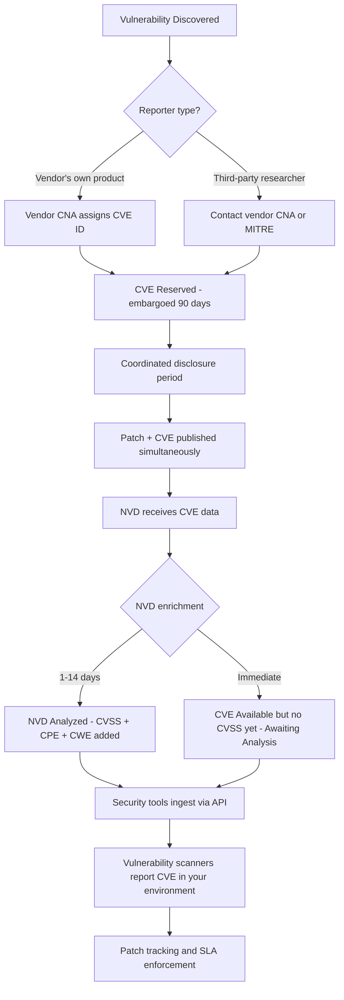

⚡ TL;DR - CVE (Common Vulnerabilities and Exposures) is a publicly maintained list
of unique identifiers (CVE-YEAR-NNNNN) for known security vulnerabilities. MITRE
Corporation maintains the CVE Program; CNA (CVE Numbering Authorities) - including
vendors, researchers, and security firms - are authorized to assign CVE IDs.
NVD (National Vulnerability Database) is NIST's enrichment layer on top of CVE:
NVD adds CVSS scores, affected versions, CPE (Common Platform Enumeration) identifiers,
CWE classifications, and references. CVE answers: "What is this vulnerability?"
NVD answers: "How severe is it and what exactly is affected?" CWE (Common Weakness
Enumeration) classifies the vulnerability TYPE (e.g., CWE-89: SQL Injection, CWE-79: XSS,
CWE-200: Information Exposure) - orthogonal to CVE (which is about a specific instance).
The CVE lifecycle: Reserved → Awaiting Analysis → Analyzed → Modified → Rejected.
NVD can take days to weeks to publish full analysis after CVE is assigned.

---

| #099 | Category: Security | Difficulty: ★★★ |
|:---|:---|:---|
| **Depends on:** | OWASP Top 10, Authentication, Session Management, IAM, TLS Configuration, OAuth 2.0 Security, Business Logic Vulnerabilities, Heartbleed, Log4Shell, SolarWinds, Equifax, Advanced JWT, Advanced XSS, CVSS Scoring | |
| **Used by:** | Responsible Disclosure, IR Process, Digital Forensics Basics, AWS Security Services, SAST in CICD, Security at Scale, Security Governance, Security Metrics, DevSecOps Pipeline Design, SSDLC, CVE Research | |
| **Related:** | OWASP Top 10, Authentication, TLS Configuration, OAuth Security, Business Logic, Heartbleed, Log4Shell, SolarWinds, Equifax, Advanced JWT, Advanced XSS, CVSS Scoring, Responsible Disclosure, IR Process, Security Metrics, CVE Research | |

---

### 🔥 The Problem This Solves

**THE VULNERABILITY NAMING CHAOS PROBLEM:**

```
BEFORE CVE (pre-1999):

  Security vulnerability disclosed:
  
  NIST calls it: "OpenSSL buffer overflow in X.509 parsing"
  RedHat calls it: "OpenSSL memory corruption bug (RHSA-1999-001)"
  Debian calls it: "OpenSSL heap overflow in SSL handshake"
  Researcher calls it: "SSL handshake exploit (Bugtraq-4231)"
  Vendor (OpenSSL) calls it: "ASN.1 BER parsing flaw"
  
  RESULT:
    Are these all the same vulnerability? 4 different ones? 2?
    
    Security team: "Are we patched against RHSA-1999-001?"
    Operations: "We applied the Debian patch last week."
    Same patch? Different patch? Who knows?
    
    Vulnerability scanner A: "CVSS 7.5 SSL flaw - openssl-overflow"
    Vulnerability scanner B: "No vulnerabilities found"
    (Scanner B uses a different name, doesn't match its database.)
    
    Enterprise with multiple security tools: no shared vocabulary.
    Impossible to determine: "Are we patched against this specific flaw?"

AFTER CVE:

  CVE-2014-0160 (Heartbleed) = ONE canonical identifier.
  EVERY vendor, tool, researcher, news article uses CVE-2014-0160.
  
  Security team: "Are we patched against CVE-2014-0160?"
  Operations: "Yes - OpenSSL 1.0.1h applied on April 10, 2014."
  
  Vulnerability scanner A: "CVE-2014-0160: not found"
  Vulnerability scanner B: "CVE-2014-0160: not found"
  Both agree: same vulnerability, same canonical ID.
  
  Enterprise tooling:
  - SIEM: alerts on CVE-2014-0160 exploitation attempts.
  - Patch management: tracks CVE-2014-0160 patch status per host.
  - Bug tracker: "CVE-2014-0160 remediation - assigned to ops team."
  All tools speak the same language.
  
  CVE ENABLES:
    Consistent cross-tool, cross-vendor vulnerability tracking.
    Clear patch status tracking: "CVE-XXXX-YYYY: patched/not patched/not affected."
    Automated vulnerability feeds into security tools.
    Regulatory compliance reporting: "% of critical CVEs patched within SLA."
```

---

### 📘 Textbook Definition

**CVE (Common Vulnerabilities and Exposures):** A public dictionary of publicly
known cybersecurity vulnerabilities, each assigned a unique identifier in the
format CVE-YEAR-NNNNN (e.g., CVE-2021-44228). Maintained by MITRE Corporation
under sponsorship from the US Department of Homeland Security (DHS). Purpose:
standardize the naming of vulnerabilities to enable consistent cross-tool,
cross-vendor communication about specific security issues.

**CVE ID Format:** CVE-[YEAR]-[NUMBER], where YEAR is the year the CVE was
reserved and NUMBER is a sequential integer (4+ digits; 5+ digits for high-volume
years). Example: CVE-2021-44228 (Log4Shell - 2021, ID 44228).

**CNA (CVE Numbering Authority):** Organizations authorized to assign CVE IDs
without going through MITRE directly. CNAs include: software vendors (Microsoft,
Google, Oracle, Red Hat, Apache), security research firms (Trend Micro, Rapid7),
bug bounty platforms (HackerOne, Bugcrowd), and coordinating bodies (CERT/CC, JPCERT).
Vendors are CNAs for their own products; they can assign CVEs for vulnerabilities
in their own software without waiting for MITRE.

**NVD (National Vulnerability Database):** NIST's enrichment and publishing platform
built on top of the CVE dataset. NVD adds: CVSS scores (v2, v3, v4), CPE identifiers
(affected software versions), CWE classifications (weakness type), references
(vendor advisories, exploit code, patches), and configuration/version matching.
Accessible at nvd.nist.gov. Also available via REST API.

**CWE (Common Weakness Enumeration):** A classification of software security weakness
TYPES maintained by MITRE. CWE-89: SQL Injection. CWE-79: Cross-Site Scripting.
CWE-200: Exposure of Sensitive Information. CWE-20: Improper Input Validation.
CVE = a specific instance; CWE = the category of weakness the CVE belongs to.

**CPE (Common Platform Enumeration):** A structured naming scheme for IT systems
and software packages. CPE 2.3 format: `cpe:2.3:a:vendor:product:version:*`.
Example: `cpe:2.3:a:apache:log4j:2.14.1:*`. NVD uses CPE to specify exactly
which software versions are affected by each CVE.

**CVSS Base Score in NVD:** NVD publishes vendor-supplied CVSS scores plus its own
independently assessed CVSS score. When the two disagree, NVD publishes both.
NVD independently scores all CVEs (regardless of whether the vendor supplied one).

---

### ⏱️ Understand It in 30 Seconds

**One line:**
CVE gives every publicly known vulnerability a unique canonical ID (CVE-YEAR-NNNNN)
so all tools, vendors, and teams can refer to the same vulnerability consistently.
NVD adds CVSS scores, affected versions, and CWE classification on top.

**One analogy:**
> Imagine every drug gets a generic name (acetylsalicylic acid) and a unique DIN
> (Drug Identification Number). Without the number, every pharmacy uses a different
> brand name for the same drug - Aspirin, Bufferin, Bayer - causing dangerous confusion.
>
> CVE = the DIN for security vulnerabilities.
> CVE-2021-44228 = the canonical ID for "the Log4Shell vulnerability."
> Every tool, vendor, scanner, SIEM, and patch manager uses the same ID.
> No confusion: "Is the RedHat patch for CVE-2021-44228?"
> Yes: it has "CVE-2021-44228" in the patch notes. Done.
>
> NVD = the pharmacopeia (drug reference manual) that comes after the DIN is assigned.
> For each DIN: dosage instructions (CVSS score = severity), which specific pill
> formulations are affected (CPE = affected versions), which class of drug
> (CWE = weakness type), and references to clinical studies (vendor advisories).
>
> CWE = the drug CLASS (NSAID, antibiotic, antiviral).
> CVE-2021-44228 belongs to CWE-917 (Improper Neutralization of Special Elements).
> All similar vulnerabilities (JNDI injection) share the same CWE class.
> Security teams can say: "We have controls for CWE-917 class vulnerabilities."

---

### 🔩 First Principles Explanation

**CVE lifecycle and ecosystem:**

```
CVE LIFECYCLE:

  STEP 1: VULNERABILITY DISCOVERED
  
    Discoverer options:
    a) Researcher finds the flaw in open-source software.
    b) Vendor's security team finds it internally.
    c) Bug bounty hunter finds it in a vendor program.
    d) CISA/government team during security review.
    
  STEP 2: CVE ID ASSIGNMENT
  
    If discoverer goes to a CNA (vendor of the affected product):
      Vendor issues CVE-YEAR-NNNNN immediately (within hours/days).
      Vendor coordinates disclosure timeline with discoverer.
      
    If no CNA available (e.g., small vendor, open-source project without CNA):
      Discoverer contacts MITRE directly.
      MITRE reviews and assigns CVE ID.
      May take longer (days to weeks).
      
    Status after assignment: "Reserved"
    CVE exists in the system but is not yet public.
    
  STEP 3: COORDINATED DISCLOSURE PERIOD
  
    Typical: 90 days (Google Project Zero standard).
    Vendor works on patch. Discoverer holds the details.
    CVE ID exists but is embargoed (details not yet public).
    
    During embargo:
    - Vendor develops and tests the fix.
    - Coordinated release date agreed with discoverer.
    - Patch may be distributed to customers before public disclosure
      (zero-day patch: patch exists before public knows the CVE details).
    
  STEP 4: PUBLIC DISCLOSURE + NVD PUBLICATION
  
    Vendor releases patch. Discoverer publishes advisory.
    CVE entry goes from "Reserved" to "Published" with full details.
    
    NVD publication timeline (IMPORTANT):
    NVD takes the CVE data and ENRICHES it (adds CVSS, CPE, CWE).
    This enrichment takes: 1-3 days for simple CVEs.
    For complex or high-volume periods: up to weeks.
    
    CRITICAL WINDOW: CVE is public → NVD enrichment pending.
    During this window:
    - CVE ID exists (you can look it up).
    - No CVSS score yet (NVD hasn't scored it).
    - Vulnerability scanners: may miss it (waiting for NVD data).
    - Security teams must assess severity themselves from the advisory.
    
    NVD Status indicators:
    "Awaiting Analysis" = NVD received CVE, not yet scored.
    "Analyzed" = CVSS score and CPE data published.
    "Modified" = data updated after initial publication.
    
  STEP 5: PATCH AND MONITORING
  
    CVE is public. CVSS score assigned. Patch available.
    Organizations: patch within SLA (per CVSS severity tier).
    Vulnerability scanners: detect CVE in your environment.
    SIEM: alert on exploitation attempts targeting this CVE.

CVE NUMBERING AUTHORITIES (CNA) HIERARCHY:

  Root CNA (MITRE) - oversees program.
  ├── Top-Level CNAs (CISA, JPCERT/CC, CERT/CC)
  │   ├── Regional coordination for their area.
  │   └── Assign CVEs when no direct vendor CNA exists.
  ├── Vendor CNAs
  │   ├── Microsoft (assigns CVEs for Windows, Azure, etc.)
  │   ├── Google (Chrome, Android, GCP)
  │   ├── Oracle (Java, databases)
  │   ├── Red Hat (RHEL components)
  │   └── Apache Software Foundation (web server, etc.)
  └── Program CNAs (bug bounty platforms)
      ├── HackerOne (for vulnerabilities submitted via HackerOne)
      └── Bugcrowd (for vulnerabilities submitted via Bugcrowd)
```

---

### 🧪 Thought Experiment

**SCENARIO: Zero-day disclosure without CVE vs with CVE:**

```
VULNERABILITY: Critical RCE in Apache Log4j (using Log4Shell as template)

WORLD A: NO CVE SYSTEM

  December 9, 2021: LunaSec blog post:
  "Log4j JNDI injection allows remote code execution via log4j-core 2.x"
  
  RedHat security advisory: "log4j critical security flaw - see RHSA-2021-5001"
  Apache advisory: "log4j 2.15.0 released - fixes JNDI injection"
  Alibaba Cloud (discoverer): "Java logging exploit - CVE pending"
  
  Security scanners (4 different vendors):
  Scanner A: "log4j-jndi-rce"
  Scanner B: "log4j-core-rce-2021-12"
  Scanner C: "RHSA-2021-5001"
  Scanner D: "apache-log4j-remote-code-execution"
  
  Security team: "Does our Nessus scan match our Qualys scan?"
  "Are RHSA-2021-5001 and 'log4j-jndi-rce' the same thing?"
  "Is the Apache advisory for the same vulnerability as the Alibaba finding?"
  
  Operations: "We applied the RedHat patch. Are we safe from the Alibaba finding?"
  
  RESULT: 72 hours of confusion. Slow response. Some systems missed.

WORLD B: WITH CVE SYSTEM

  December 9, 2021: LunaSec publishes.
  Apache (CNA) immediately assigns: CVE-2021-44228.
  
  RedHat: "RHSA-2021-5001 addresses CVE-2021-44228"
  Apache: "log4j 2.15.0 fixes CVE-2021-44228"
  LunaSec: "CVE-2021-44228 - JNDI injection in log4j-core <= 2.14.1"
  
  Scanner A: "CVE-2021-44228: CRITICAL (CVSS 10.0)"
  Scanner B: "CVE-2021-44228: CRITICAL (CVSS 10.0)"
  Scanner C: "CVE-2021-44228: CRITICAL (CVSS 10.0)"
  All scanners: same ID, same score.
  
  Security team: "All scanners report CVE-2021-44228. One ID. Clear."
  Operations: "RedHat patch applies to CVE-2021-44228. Our scanner
  shows CVE-2021-44228 clear. We're patched."
  SIEM: "Alert triggered: CVE-2021-44228 exploit pattern in logs at 10:32am"
  
  RESULT: Clear communication. Fast response.
  Actual Log4Shell: initial public disclosure to most organizations patching
  within 72-96 hours for critical internet-facing systems.
  CVE system: foundational to this speed.
```

---

### 🧠 Mental Model / Analogy

> CVE/NVD is like the international classification system for diseases (ICD).
>
> Before ICD (International Classification of Diseases):
> One country's doctors: "the patient has dropsy."
> Another country's doctors: "the patient has edema."
> Research paper: "this drug cures fluid retention."
> All the same condition: heart failure causing fluid buildup.
> But different names → statistical analysis impossible → global research coordination impossible.
>
> After ICD:
> Every condition has a universal code: ICD-10 I50 = Heart Failure.
> Doctor in Tokyo and doctor in Berlin: both say "ICD-10 I50."
> Database: every hospital in the world reports the same code.
> Research: statistically comparable global datasets.
> Insurance: "we cover ICD-10 I50 treatment."
>
> CVE = ICD-10 for security vulnerabilities.
> CVE-2021-44228 is universally understood by every security professional globally.
>
> CWE = the category system (ICD chapters).
> ICD Chapter 9 = Diseases of the Circulatory System (Heart Failure falls here).
> CWE-917 = Improper Element Neutralization (Log4Shell falls here).
> The chapter tells you the TYPE; the ICD code tells you the SPECIFIC instance.
>
> NVD = the medical reference book (Merck Manual).
> For each ICD code: symptoms (description), severity (CVSS = 1-5 star severity rating),
> affected populations (CPE = affected versions), treatment (references/patches).
> The reference book enriches the classification with actionable details.

---

### 📶 Gradual Depth - Five Levels

**Level 1 - What it is (anyone can understand):**
CVE is a globally used numbering system that gives each known security flaw its own unique ID (like CVE-2021-44228 for the Log4Shell bug). NVD is the database that stores details about each CVE including how dangerous it is (CVSS score) and which versions are affected. When someone says "you need to patch CVE-2021-44228," everyone - security tools, vendors, engineers - knows exactly which vulnerability they mean.

**Level 2 - How to use it (junior developer):**
Search CVEs for your dependencies at nvd.nist.gov or via API (services.nvd.nist.gov/rest/json/cves/2.0). Use tools that surface CVEs automatically: Dependabot (GitHub), Snyk, Trivy (container scanning), OWASP Dependency-Check (Maven/Gradle), Grype (Syft). Check the CVSS score to prioritize patching. Check CWE to understand the vulnerability type (CWE-89 = SQL Injection, you should review all SQL queries). Track patched vs unpatched CVEs per component in your vulnerability management system.

**Level 3 - How it works (mid-level engineer):**
MITRE maintains the CVE List; CNAs assign IDs within their scope. NVD enriches CVE data with CVSS scores, CPE (affected versions), CWE (weakness type), and references. NVD enrichment may lag CVE publication by 1-14 days. CPE matching: vulnerability scanners compare installed software (name + version) against CPE entries in NVD to determine if a CVE is applicable. NVD JSON feeds (legacy) and REST API 2.0 (current): security tools pull CVE data daily. MITRE's CVE schema (CVE 5.0): JSON format with state (Reserved/Published/Rejected), containers (NVD CNA), and metrics. CWE classification in NVD: each CVE tagged with 1+ CWE IDs. CWE-20 (Improper Input Validation) is the generic catch-all for unclassified vulns.

**Level 4 - Why it was designed this way (senior/staff):**
The CVE program's distributed CNA model: vendors assign their own CVEs to increase speed and reduce MITRE bottleneck. Before CNAs: all CVE requests went to MITRE → weeks-long queue → delay in public awareness of patched vulnerabilities. With CNAs: vendor patches a vulnerability → immediately assigns CVE → advisory + CVE published same day. Trade-off: CNA vendors may underestimate severity (CVSSv3 vendor score often lower than NVD analyst score). NVD publishes both and users should use NVD score when disagreement exists. CPE matching limitation: CPE requires exact product/version strings. Unofficial builds, custom compilation, version aliasing: CPE may not match correctly → false negatives in vulnerability scanners. This is why scanner accuracy varies - they have different CPE matching logic and additional heuristics beyond raw NVD data.

**Level 5 - Mastery (distinguished engineer):**
CVE data quality issues: Rejected CVEs (duplicate, disputed, not a vulnerability) - tools must handle state "Rejected" correctly or they alert on non-issues. Disputed CVEs: vendor disagrees that it's a vulnerability (CNA rejects, researcher disagrees). Split CVEs: what appears to be one vulnerability gets multiple CVEs (different attack vectors, different components). Duplicated CVEs: same vulnerability assigned two CVEs by different CNAs. NVD backlog: NIST experienced significant NVD enrichment delays in 2024 due to program changes - thousands of CVEs in "Awaiting Analysis" state for extended periods. Organizations using NVD data for compliance faced gaps. This demonstrated fragility: over-reliance on a single government database for critical security data. EPSS and KEV as supplementary data: neither CVSS (severity) nor KEV (confirmed exploitation) is in the CVE/NVD standard. They're supplementary databases maintained by FIRST.org and CISA respectively. A complete vulnerability intelligence program aggregates CVE/NVD + EPSS + KEV + threat intelligence feeds (indicating active exploitation in targeted sectors).

---

### ⚙️ How It Works (Mechanism)

```
CVE/NVD ARCHITECTURE:

  DISCOVERY
     |
     v
  CNA (Vendor or MITRE)
     | assigns CVE ID
     v
  CVE RESERVED (embargoed)
     | coordinated disclosure period (typically 90 days)
     v
  CVE PUBLISHED (details public)
     | simultaneously: vendor patch released
     v
  NVD RECEIVES CVE DATA
     |  enriches with:
     |  - CVSS v3.1 score (vendor + NVD analyst)
     |  - CPE (affected product versions)
     |  - CWE (weakness classification)
     |  - References (advisory, exploit, patch)
     v
  NVD ANALYZED (full data available via API)
     |
     v
  SECURITY TOOLS INGEST
     |  (Dependabot, Snyk, Trivy, Nessus, Qualys, SonarQube)
     |  via NVD REST API or data feeds
     v
  VULNERABILITY REPORTS + PATCH TRACKING
```



---

### 💻 Code Example

**Querying NVD API and EPSS together:**

```python
# nvd_query.py
# Query NVD REST API 2.0 for vulnerability details.
# Combine with EPSS for complete risk picture.

import requests
import time
from typing import Optional

NVD_BASE = "https://services.nvd.nist.gov/rest/json/cves/2.0"
EPSS_BASE = "https://api.first.org/data/v1/epss"

def get_cve_details(cve_id: str, api_key: Optional[str] = None) -> dict:
    """
    Fetch CVE details from NVD REST API 2.0.
    Without API key: 5 requests/30 seconds.
    With API key: 50 requests/30 seconds.
    """
    headers = {}
    if api_key:
        headers["apiKey"] = api_key
    
    response = requests.get(
        NVD_BASE,
        params={"cveId": cve_id},
        headers=headers,
        timeout=30
    )
    response.raise_for_status()
    data = response.json()
    
    if not data.get("vulnerabilities"):
        raise ValueError(f"CVE not found: {cve_id}")
    
    vuln = data["vulnerabilities"][0]["cve"]
    
    # Extract CVSS scores:
    metrics = vuln.get("metrics", {})
    
    cvss_v3 = None
    cvss_source = None
    if "cvssMetricV31" in metrics:
        # May have multiple scores (vendor + NVD). Prefer NVD.
        scores = metrics["cvssMetricV31"]
        # NVD score has type "Primary"; vendor has "Secondary"
        primary = next((s for s in scores if s.get("type") == "Primary"), scores[0])
        cvss_v3 = primary["cvssData"]
        cvss_source = primary.get("source", "unknown")
    
    # Extract CWE:
    weaknesses = vuln.get("weaknesses", [])
    cwes = [w["description"][0]["value"] for w in weaknesses if w.get("description")]
    
    # Extract affected versions (CPE):
    configurations = vuln.get("configurations", [])
    cpe_list = []
    for config in configurations:
        for node in config.get("nodes", []):
            for cpe_match in node.get("cpeMatch", []):
                if cpe_match.get("vulnerable"):
                    cpe_list.append({
                        "cpe": cpe_match.get("criteria"),
                        "version_start": cpe_match.get("versionStartIncluding"),
                        "version_end": cpe_match.get("versionEndExcluding")
                    })
    
    return {
        "cve_id": cve_id,
        "description": vuln["descriptions"][0]["value"][:200] + "...",
        "cvss_score": cvss_v3["baseScore"] if cvss_v3 else None,
        "cvss_severity": cvss_v3["baseSeverity"] if cvss_v3 else None,
        "cvss_vector": cvss_v3["vectorString"] if cvss_v3 else None,
        "cvss_source": cvss_source,
        "cwes": cwes,
        "affected_cpes": cpe_list[:5],  # first 5
        "published": vuln.get("published"),
        "last_modified": vuln.get("lastModified"),
        "vuln_status": vuln.get("vulnStatus"),
    }

def get_epss(cve_id: str) -> dict:
    """Fetch EPSS score from FIRST.org."""
    response = requests.get(EPSS_BASE, params={"cve": cve_id}, timeout=15)
    data = response.json()
    
    if data.get("data"):
        entry = data["data"][0]
        return {
            "epss": float(entry["epss"]),
            "percentile": float(entry.get("percentile", 0)),
            "date": entry.get("date"),
        }
    return {"epss": 0.0, "percentile": 0.0, "date": None}

def vulnerability_summary(cve_id: str) -> None:
    """Print complete vulnerability risk summary."""
    
    nvd = get_cve_details(cve_id)
    time.sleep(0.6)  # NVD rate limit: 5 req/30s without API key
    epss = get_epss(cve_id)
    
    # EPSS interpretation:
    epss_score = epss["epss"]
    if epss_score >= 0.5:
        epss_label = "CRITICAL - actively exploited in the wild"
    elif epss_score >= 0.1:
        epss_label = "HIGH - frequently targeted"
    elif epss_score >= 0.01:
        epss_label = "ELEVATED - some exploitation activity"
    else:
        epss_label = "LOW - limited exploitation in the wild"
    
    # Patch SLA:
    cvss = nvd.get("cvss_score")
    if cvss is None:
        sla = "Unknown - NVD not yet scored (Awaiting Analysis)"
    elif cvss >= 9.0 and epss_score >= 0.1:
        sla = "EMERGENCY: patch TODAY"
    elif cvss >= 9.0:
        sla = "URGENT: patch within 48 hours"
    elif cvss >= 7.0 and epss_score >= 0.1:
        sla = "HIGH: patch within 24 hours (elevated by EPSS)"
    elif cvss >= 7.0:
        sla = "HIGH: patch within 14 days"
    elif cvss >= 4.0:
        sla = "MEDIUM: patch within 30 days"
    else:
        sla = "LOW: patch at next maintenance window"
    
    print(f"{'='*65}")
    print(f"CVE: {cve_id}")
    print(f"Status: {nvd.get('vuln_status', 'Unknown')}")
    print(f"Published: {nvd.get('published', 'N/A')[:10]}")
    print(f"Description: {nvd.get('description', 'N/A')}")
    print(f"CVSS v3 Score: {cvss} ({nvd.get('cvss_severity', 'N/A')})")
    print(f"CVSS Vector: {nvd.get('cvss_vector', 'N/A')}")
    print(f"CVSS Source: {nvd.get('cvss_source', 'N/A')}")
    print(f"CWE: {', '.join(nvd.get('cwes', ['N/A']))}")
    print(f"EPSS Score: {epss_score:.4f} ({epss['percentile']:.1f}th percentile)")
    print(f"EPSS Label: {epss_label}")
    print(f"PATCH SLA: {sla}")

# Example:
# vulnerability_summary("CVE-2021-44228")
#
# Output:
# =================================================================
# CVE: CVE-2021-44228
# Status: Analyzed
# Published: 2021-12-10
# Description: Apache Log4j2 2.0-beta9 through 2.15.0 JNDI features...
# CVSS v3 Score: 10.0 (CRITICAL)
# CVSS Vector: CVSS:3.1/AV:N/AC:L/PR:N/UI:N/S:C/C:H/I:H/A:H
# CVSS Source: nvd@nist.gov
# CWE: CWE-917
# EPSS Score: 0.9774 (100.0th percentile)
# EPSS Label: CRITICAL - actively exploited in the wild
# PATCH SLA: EMERGENCY: patch TODAY
```

---

### ⚖️ Comparison Table

| Concept | CVE | NVD | CWE | EPSS | CISA KEV |
|:---|:---|:---|:---|:---|:---|
| **Maintained by** | MITRE | NIST | MITRE | FIRST.org | CISA |
| **Answers** | "What is this vuln?" | "How severe + what's affected?" | "What type of weakness?" | "How likely exploited?" | "Is it being exploited now?" |
| **Format** | CVE-YEAR-NNNNN | JSON + CVSS + CPE + CWE | CWE-NNN + description | 0.0-1.0 probability | URL list of confirmed exploited CVEs |
| **Update frequency** | As CVEs are published | 1-14 days after CVE | Quarterly releases | Daily | Business days |
| **Primary use** | Unique ID for tracking | Severity + impact assessment | Classify vuln TYPE | Patch prioritization | Emergency patching trigger |

---

### ⚠️ Common Misconceptions

| Misconception | Reality |
|:---|:---|
| "If there's no CVE for a vulnerability, it's not real or serious." | CVEs are only assigned to publicly disclosed vulnerabilities. A vulnerability actively exploited by a nation-state threat actor may have no CVE if it was never publicly disclosed (zero-day). Additionally, CVE assignment can lag months behind discovery - the 2024 NVD backlog showed thousands of CVEs in "Awaiting Analysis" state for extended periods. The absence of a CVE doesn't mean absence of risk: threat intelligence feeds, vendor advisories, and CISA alerts may contain vulnerabilities not yet in CVE. Also: every organization has internal security issues that will never get a CVE (business logic flaws, misconfigured services). CVE tracks public vulnerabilities in software products - it doesn't track all possible risks. |
| "A higher CVE number means a newer/more recently discovered vulnerability." | CVE IDs are assigned based on WHEN the CVE was reserved, not when the vulnerability was discovered or publicly disclosed. A vulnerability discovered in 2023 but disclosed in 2024 gets a CVE-2024-NNNNN number (year of reservation). Conversely, a CVE reserved early in a year gets a lower number regardless of when the vulnerability was actually found. Also: high CVE numbers within a year just mean more CVEs were assigned that year - not that those CVEs are more severe or more recently active. CVE-2021-44228 (Log4Shell) has a relatively high number for 2021 - this doesn't imply it was less important or discovered late. |

---

### 🚨 Failure Modes & Diagnosis

**CVE/NVD operational pitfalls:**

```
FAILURE MODE 1: NVD ENRICHMENT LAG

  Vulnerability disclosed and CVE published.
  NVD status: "Awaiting Analysis" (no CVSS score yet).
  Duration: 1 day to several weeks (2024 NVD backlog: months).
  
  Impact: vulnerability scanners that rely solely on NVD CVSS
  may report severity as "Unknown" or skip the CVE entirely.
  
  Mitigation:
    1. Monitor vendor advisories directly.
       Vendor publishes severity before NVD scores it.
    2. Use scanner vendors that maintain their own scoring
       (Snyk, Tenable, Qualys have their own severity databases).
    3. Subscribe to CISA KEV feed for confirmed critical exploits
       that bypass NVD lag.
    4. Check CVE status: if "Awaiting Analysis", use vendor
       CVSS (from advisory) not NVD CVSS.

FAILURE MODE 2: SCANNER FALSE NEGATIVES (CPE MISMATCH)

  You run log4j-core 2.14.1 (vulnerable to Log4Shell).
  Scanner reports: no vulnerable packages found.
  
  Root cause: scanner uses CPE matching.
  Your build artifact: log4j-core-2.14.1-patched.jar
  CPE entry: cpe:2.3:a:apache:log4j:2.14.1:*
  Artifact name doesn't exactly match CPE → no match → false negative.
  
  Mitigation:
    1. Use multiple scanners with different detection logic.
    2. Use SBOM (Software Bill of Materials) scanners
       that parse JAR metadata, not just filenames.
    3. Verify scanner detected the specific CVE:
       "Did our scanner find CVE-2021-44228 in log4j-core 2.14.1?"
       If not: check scanner configuration and CVE database version.
    4. Trivy, Grype: scan by content hash + JAR manifest, 
       not just filename. More accurate than CPE-only scanners.

DIAGNOSTIC COMMANDS:

  # Query NVD API for a specific CVE:
  curl "https://services.nvd.nist.gov/rest/json/cves/2.0?cveId=CVE-2021-44228"
  
  # Query EPSS:
  curl "https://api.first.org/data/v1/epss?cve=CVE-2021-44228"
  
  # Check CISA KEV (known exploited vulnerabilities):
  curl "https://www.cisa.gov/sites/default/files/feeds/\
    known_exploited_vulnerabilities.json" | \
    python3 -c "import json,sys; data=json.load(sys.stdin);
    kev=[v for v in data['vulnerabilities'] if v['cveID']=='CVE-2021-44228'];
    print(kev)"
  
  # Search for CVE in your Java dependencies with Grype:
  grype dir:. -o table | grep CVE-2021-44228
  
  # Search with Trivy:
  trivy fs . --severity CRITICAL,HIGH | grep CVE-2021-44228
```

---

### 🔗 Related Keywords

**Prerequisites:**
- `CVSS Scoring` (SEC-098) - scoring system NVD uses for each CVE

**Builds on this:**
- `Responsible Disclosure + Bug Bounty` (SEC-100) - the process that generates CVEs
- `Security Metrics + FAIR` (SEC-122) - quantifying risk beyond CVE counts
- `CVE Research + Responsible Disclosure Process` (SEC-138) - deep-dive on the research side

---

### 📌 Quick Reference Card

```
┌──────────────────────────────────────────────────────────┐
│ CVE ID        │ CVE-YEAR-NNNNN (e.g., CVE-2021-44228)   │
│               │ Assigned by: CNA (vendor) or MITRE      │
├───────────────┼──────────────────────────────────────────┤
│ NVD ADDS      │ CVSS score, CPE (versions), CWE, refs   │
│               │ Lag: 1 day - weeks after CVE published  │
├───────────────┼──────────────────────────────────────────┤
│ NVD STATES    │ Reserved → Awaiting Analysis →           │
│               │ Analyzed → Modified → Rejected           │
├───────────────┼──────────────────────────────────────────┤
│ CVE ≠ CWE     │ CVE = specific instance                  │
│               │ CWE = weakness type (CWE-89 = SQLi)      │
├───────────────┼──────────────────────────────────────────┤
│ CISA KEV      │ CONFIRMED exploited - patch regardless   │
│               │ of CVSS. 14-day federal mandate.         │
├───────────────┼──────────────────────────────────────────┤
│ NVD API       │ services.nvd.nist.gov/rest/json/cves/2.0 │
│ EPSS API      │ api.first.org/data/v1/epss               │
└──────────────────────────────────────────────────────────┘
```

---

### 💎 Transferable Wisdom

**Reusable Engineering Principle:**
"Canonical identifiers enable automation; local naming enables confusion."
CVE is an example of a universal canonical identifier solving a coordination problem.
Before CVE: every tool had its own naming convention. No automation possible across tools.
After CVE: every tool integrates via a shared canonical ID. Full automation stack possible:
code scan → CVE ID → NVD CVSS → SLA policy → Jira ticket → Slack alert → patch tracking.
This principle appears throughout software engineering:
- UUIDs vs sequential IDs for distributed systems: UUIDs are canonical, globally unique.
  Sequential IDs are local to one database - fail in distributed environments.
  (CVE is the UUID of the vulnerability world.)
- ISBN (books): canonical ID enabling any bookstore, library, or publisher to
  refer to the same edition unambiguously.
- ISIN (financial securities): canonical ID enabling global trading of the same security.
- DOI (academic papers): canonical ID for citing research, independent of URL.
- Container image digests (SHA256): canonical identifier for an exact image layer,
  independent of tag name (tags are mutable; digests are canonical).
In all cases: the canonical ID enables:
1. Automation (machine-to-machine communication without ambiguity).
2. Auditability (track the exact same thing across time and systems).
3. Deduplication (detect when two names refer to the same thing).
When designing a system where multiple tools/teams must reference the same entity:
introduce a canonical ID early. The cost of retrofitting canonical IDs
(onto a system where each team uses their own naming) is very high.

---

### 💡 The Surprising Truth

In 2024, NIST's NVD (National Vulnerability Database) faced a massive backlog
crisis. Thousands of CVEs went weeks or months without CVSS scores, CPE
configurations, or enrichment data. The "Awaiting Analysis" queue grew from
hundreds to thousands. Security tools that relied solely on NVD data for
vulnerability severity information suddenly had large gaps.

The root cause: NIST restructured its NVD operations and the previous
contractor support ended. New processes weren't in place fast enough.
A critical piece of global security infrastructure was disrupted by an
organizational change.

The practical impact: companies running compliance reports that track "% of
Critical CVEs patched within SLA" suddenly had CVEs with no severity rating.
Automated patch prioritization systems were blind to newly published CVEs.

The lesson:
Single points of failure exist even in distributed security ecosystems.
NVD appeared to be "just a database" - but it was a critical dependency
for the entire vulnerability management industry.

The resilience lesson: never rely on a single data source for critical security data.
Mature vulnerability management programs:
- Use NVD as primary (when available and enriched).
- Use scanner-vendor databases (Snyk, Tenable, Qualys maintain their own) as fallback.
- Monitor vendor security advisories directly (vendor advisory = primary source).
- Subscribe to CISA KEV (independent of NVD - CISA maintains it separately).
- Cross-reference EPSS (FIRST.org - independent of NVD).
The 2024 NVD disruption validated this multi-source approach.
Organizations with single-source NVD dependency: blind. Organizations with
multi-source approaches: continuous coverage throughout the disruption.

---

### ✅ Mastery Checklist

**You've mastered this when you can:**
1. **EXPLAIN** CVE vs NVD vs CWE: CVE = unique ID for a specific vulnerability.
   NVD = database that enriches CVEs with CVSS, CPE (affected versions), CWE.
   CWE = weakness TYPE classification (CWE-89 = SQL Injection - not a specific CVE).
2. **DESCRIBE** the CNA model: vendors (Microsoft, Google, Apache) are CNAs authorized
   to assign CVE IDs for their own products. This speeds up disclosure vs funneling
   everything through MITRE.
3. **EXPLAIN** the NVD enrichment lag: CVE published → NVD takes 1-14+ days to add
   CVSS score. During this window, vendor advisory is the source of truth for severity.
4. **STATE** the NVD API endpoint and how to query EPSS:
   NVD: `services.nvd.nist.gov/rest/json/cves/2.0?cveId=CVE-XXXX-YYYY`
   EPSS: `api.first.org/data/v1/epss?cve=CVE-XXXX-YYYY`

---

### 🎯 Interview Deep-Dive

**Q: What is the difference between CVE, NVD, and CWE? How does the CVE
assignment process work? What is a CNA?**

*Why they ask:* Tests familiarity with the vulnerability management ecosystem.
Expected for security engineering, DevSecOps, and senior backend roles that
interact with vulnerability scanners and patch management processes.

*Strong answer covers:*
- CVE = canonical unique ID for a specific publicly known vulnerability.
  Format: CVE-YEAR-NNNNN (e.g., CVE-2021-44228 = Log4Shell).
  Maintained by MITRE. Purpose: common language across all tools.
- NVD = NIST's enrichment layer on CVE data. Adds: CVSS score (severity),
  CPE (affected product versions), CWE (weakness type), references.
  NVD lag: 1-14 days (sometimes longer) after CVE publication.
  During lag: use vendor advisory for severity - not NVD.
- CWE = weakness TYPE classification. CWE-89: SQL Injection. CWE-79: XSS.
  CVE is a specific instance; CWE is the category.
  NVD tags each CVE with its CWE(s) to classify the type of weakness.
- CNA (CVE Numbering Authority): organizations authorized to assign CVE IDs.
  Includes: major vendors (Microsoft, Google, Apache - for their own products),
  security firms, bug bounty platforms (HackerOne, Bugcrowd).
  Why CNAs exist: speed. Vendors can assign CVEs immediately (same day as patch release)
  without waiting for MITRE to process the request.
- Lifecycle: Discovery → CNA assigns ID (Reserved, embargoed) → coordinated disclosure
  (typically 90 days) → patch + CVE published → NVD enriches.
- NVD vs EPSS vs CISA KEV: complementary tools.
  NVD: severity (CVSS). EPSS: exploitation probability (first.org).
  CISA KEV: confirmed active exploitation. Use all three together.