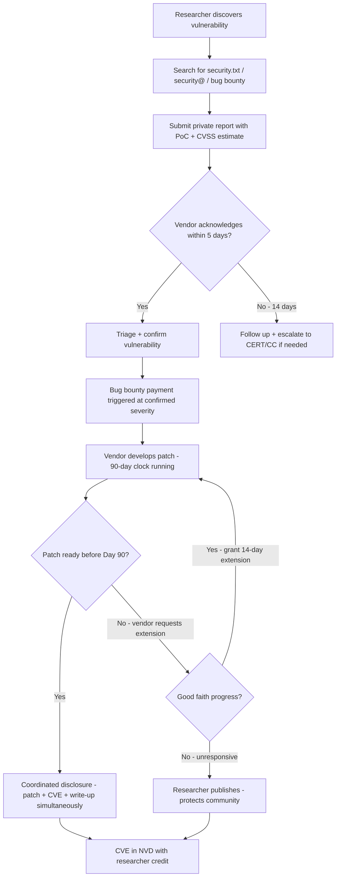

⚡ TL;DR - Responsible disclosure (also: coordinated vulnerability disclosure, CVD)
is the process where a security researcher who finds a vulnerability in someone
else's software privately notifies the vendor before going public, giving the vendor
time to patch before the vulnerability is publicly known. Google Project Zero
popularized the 90-day disclosure deadline: if no fix in 90 days, the researcher
publishes regardless. Bug bounty programs are formal programs where organizations
invite researchers to find vulnerabilities and pay them based on severity. HackerOne
and Bugcrowd are the two dominant platforms. Payout tiers are CVSS-based: Critical
($10,000-$200,000+), High ($1,000-$25,000), Medium ($500-$2,500), Low ($100-$500).
Key program elements: scope definition (what's in/out of bounds), safe harbor clause
(legal protection for good-faith researchers), response SLA (time to acknowledge,
triage, and resolve), and hall of fame (recognition for non-cash rewards).

---

| #100 | Category: Security | Difficulty: ★★★ |
|:---|:---|:---|
| **Depends on:** | OWASP Top 10, Authentication, Session Management, IAM, TLS Configuration, OAuth 2.0 Security, Business Logic Vulnerabilities, Heartbleed, Log4Shell, SolarWinds, Equifax, Advanced JWT, Advanced XSS, CVSS Scoring, CVE + NVD | |
| **Used by:** | IR Process, AWS Security Services, Security Governance, Security Metrics, DevSecOps Pipeline Design, SSDLC, CVE Research + Responsible Disclosure Process | |
| **Related:** | OWASP Top 10, Authentication, TLS Configuration, OAuth Security, Business Logic, Heartbleed, Log4Shell, SolarWinds, Equifax, Advanced JWT, Advanced XSS, CVSS Scoring, CVE + NVD, IR Process, Security Metrics, CVE Research | |

---

### 🔥 The Problem This Solves

**THE VULNERABILITY DISCLOSURE DILEMMA:**

```
CORE TENSION:

  Researcher finds a critical vulnerability in a bank's web application.
  
  Option A: FULL IMMEDIATE DISCLOSURE (no notice to vendor)
  
    Researcher: publishes technical details + working exploit immediately.
    
    Effect on security community:
    Other researchers: can now understand the vulnerability.
    Defensive security tools: can write detection signatures.
    
    Effect on attackers:
    Criminal groups: have the exploit immediately.
    Nation-state actors: weaponize within 24-48 hours.
    Script kiddies: use published exploit tools.
    
    Effect on bank:
    Bank's 10 million customers: exposed to active exploitation
    while bank scrambles to patch (days to weeks of exposure).
    Bank engineers: racing to patch under active attack.
    
    RESULT: maximum vulnerability window for users, maximum time for attackers.
    Legal risk for researcher: Computer Fraud and Abuse Act (CFAA) claims
    possible (bank may claim unauthorized access, even if not intended).
    
  Option B: SILENT NON-DISCLOSURE (never tell anyone)
  
    Researcher: doesn't report the vulnerability.
    
    Effect: vulnerability persists in production indefinitely.
    Other researchers may find the same vulnerability and sell it.
    Attackers may independently discover it.
    
    RESULT: users at risk with no remedy possible. Knowledge siloed.
    Researcher: does nothing useful for the security community.
    
  Option C: RESPONSIBLE DISCLOSURE (coordinated)
  
    Researcher: privately notifies bank via security@bank.com.
    Includes: detailed technical description, proof-of-concept (PoC).
    Agreement: bank has 90 days to patch before researcher goes public.
    
    Bank: acknowledges within 5 days, triages, patches in 60 days.
    Researcher: confirms fix, requests CVE ID from MITRE/bank CNA.
    Day 60: bank releases patch + security advisory + CVE.
    Researcher: publishes full technical write-up (after users can patch).
    
    RESULT:
    Bank customers: 60-day patch available before exploit is public.
    Attackers: no exploit available during patch window.
    Researcher: gets credit (CVE acknowledgment, hall of fame, payout).
    Security community: learns from published write-up.
    Legal protection: safe harbor clause in bank's security policy.
    
  THE 90-DAY DEADLINE (Google Project Zero):
  
    WHY 90 DAYS:
    Google Project Zero studied patch timelines across 2014-2020.
    Finding: 90% of vulnerabilities can be patched within 90 days.
    10% require extensions (complex fixes, coordination with dependencies).
    Extension policy: 14-day grace period if vendor has made progress.
    
    IF VENDOR DOESN'T PATCH IN 90 DAYS:
    Project Zero publishes the vulnerability details, patch or no patch.
    Rationale: prolonged secrecy enables vendors to deprioritize security.
    Threat of publication: forces vendors to treat security as urgent.
    
    RESULT: from 2014 to 2020, major vendors improved mean time to patch
    from >100 days to <70 days on average (Google Project Zero data).
    Accountability through deadline: demonstrably effective.
```

---

### 📘 Textbook Definition

**Responsible Disclosure (Coordinated Vulnerability Disclosure, CVD):** A process
in which a vulnerability researcher who discovers a security flaw privately notifies
the affected organization before publicly disclosing the details, allowing time for
a patch to be developed and distributed. Defined formally in ISO/IEC 29147
(vulnerability disclosure) and ISO/IEC 30111 (vulnerability handling processes).

**Disclosure Timeline Types:**
- **Responsible/Coordinated:** Private notification → fix developed → simultaneous public disclosure.
- **Full (Immediate) Disclosure:** Public disclosure immediately after discovery, no vendor notification. Maximizes community awareness but exposes users before patches exist.
- **Bug Bounty:** Formal, paid responsible disclosure. Researcher reports privately and is paid based on CVSS severity tier.
- **Zero-Day Sale:** Researcher sells vulnerability details to governments, brokers (Zerodium), or criminal groups instead of notifying vendor. Highest financial payout; no user protection.

**90-Day Disclosure Deadline:** Popularized by Google Project Zero (2014): if a vendor does not provide a patch within 90 calendar days of private notification, the researcher publishes vulnerability details regardless. Purpose: prevent vendors from ignoring security reports indefinitely. Standard practiced by: Project Zero, CERT/CC, Trend Micro ZDI, and many individual researchers.

**Bug Bounty Program:** A formal program run by an organization that invites security researchers to discover and report vulnerabilities in exchange for financial rewards. Key elements: scope (what's in-scope vs out-of-scope), reward tiers (based on CVSS severity), safe harbor clause (legal protection), response SLA, and disclosure policy.

**Safe Harbor Clause:** Legal language in a security policy that provides protection from prosecution for security researchers acting in good faith within the scope of a bug bounty program. Without safe harbor: researchers risk Computer Fraud and Abuse Act (CFAA) or equivalent local law claims even for legitimate research.

**Hall of Fame:** Non-financial recognition for researchers who responsibly disclose vulnerabilities. Used by organizations with limited bug bounty budgets (startups, open-source projects). Researchers are credited publicly on the organization's security acknowledgments page.

**VDP (Vulnerability Disclosure Policy):** A public document stating how an organization receives, handles, and responds to security vulnerability reports. A VDP without payment is the minimum viable responsible disclosure mechanism. A VDP + payment = bug bounty program.

---

### ⏱️ Understand It in 30 Seconds

**One line:**
Responsible disclosure is the agreement between researchers and vendors: "I found a bug in your system; I'll tell you first and give you 90 days to fix it before I tell everyone else." Bug bounties formalize this with payment - Critical CVEs can earn $100,000+.

**One analogy:**
> Responsible disclosure is like finding a broken lock on someone's house.
>
> Option A (Full disclosure): you announce on social media "123 Main Street has
> a broken lock on the back door." Now EVERYONE knows - including burglars.
> The homeowner is now at maximum risk while racing to fix it.
>
> Option B (Responsible disclosure): you knock on the door, tell the homeowner privately.
> "Your back door lock is broken - I know how to break in."
> Homeowner: "Thank you! Give us 2 weeks to fix it."
> After the lock is fixed: homeowner tells their neighborhood watch (public disclosure).
> Now the story is useful (others can check their locks) without creating immediate risk.
>
> Option C (Bug Bounty): the homeowner has a published program:
> "We'll pay you $500 for reporting broken locks. Must not actually enter.
> Must report only to security@homeowner.com. Safe harbor: we won't sue you
> for testing entry methods on OUR house as long as you stay in scope."
>
> The 90-day deadline: if you knock on the door and the homeowner ignores you
> for 90 days and makes no progress on fixing the lock: you publish.
> The deadline protects users by preventing vendors from indefinitely silencing researchers.
>
> Zero-day broker (Zerodium): you sell the broken lock technique to a government.
> $50,000 payout. The government uses it to enter houses.
> The homeowner never knows.

---

### 🔩 First Principles Explanation

**Responsible disclosure mechanics:**

```
RESPONSIBLE DISCLOSURE WORKFLOW:

  DAY 0: DISCOVERY
    Researcher finds vulnerability (e.g., unauthenticated SQL injection
    in api.example.com/users?id=).
    
    Researcher documents:
    - Affected URL and parameters.
    - Proof-of-concept (PoC) - minimal reproducible exploit.
    - Impact assessment (CVSS estimate: AV:N/AC:L/PR:N/UI:N/S:U/C:H/I:H → 9.1).
    - Example: able to dump database table list (no actual data read for PoC).
    
  DAY 1: INITIAL REPORT
    Researcher searches for:
    a) security.txt at /.well-known/security.txt (RFC 9116).
    b) security@example.com (standard email alias).
    c) Bug bounty program on HackerOne/Bugcrowd.
    d) Vendor's security page.
    
    Report includes:
    - Summary: "Unauthenticated SQL Injection in /api/users endpoint"
    - CVSS estimate: 9.1 (Critical)
    - Reproduction steps (exact HTTP request)
    - PoC output (table list, no sensitive data extracted)
    - Proposed CVE request
    - Disclosure timeline: 90 days (Day 91 = October X, 20XX)
    
  DAY 1-5: VENDOR ACKNOWLEDGMENT (SLA)
    Vendor responds: "Thank you. Our security team will triage."
    
    If NO acknowledgment within 5 business days:
    - Researcher follows up via alternative channel.
    - After 14 days with no response: researcher may escalate
      to CERT/CC or publish with shortened timeline.
    
  DAY 5-30: TRIAGE + SEVERITY ASSESSMENT
    Vendor triages: confirms the vulnerability.
    Vendor assigns CVSS (may differ from researcher's estimate).
    Bug bounty payment (if applicable): triggered at this point
    based on confirmed severity tier.
    
    PAYMENT TIERS (HackerOne examples, actual payouts vary by program):
    Critical (9.0-10.0): $10,000-$200,000 (Apple, Google, Microsoft at top)
    High (7.0-8.9):      $2,500-$25,000
    Medium (4.0-6.9):    $500-$2,500
    Low (0.1-3.9):       $100-$500
    Informational:       Hall of fame or swag
    
  DAY 30-90: FIX DEVELOPMENT
    Vendor develops patch, tests, prepares advisory.
    Researcher may be consulted for validation.
    CVE ID: vendor (as CNA) or MITRE assigns CVE ID.
    Researcher credited in CVE description.
    
  DAY 90 (or earlier): PUBLIC DISCLOSURE
    Vendor: releases patch + security advisory + CVE.
    Researcher: publishes technical write-up.
    Coordinated: patch available BEFORE exploit details public.
    
    TIMELINE OVERRIDE (vendor requests extension):
    "We need 14 more days - complex dependency on third-party."
    Standard: grant one 14-day extension if vendor making progress.
    Project Zero policy: published regardless at Day 90, unless genuine progress.
    
  POST-DISCLOSURE:
    CVE entry published in NVD (with researcher credit in references).
    Researcher's write-up: educational for community.
    Vendor: post-mortem to prevent similar vulnerabilities.
    
BUG BOUNTY PROGRAM STRUCTURE:

  SCOPE DEFINITION (critical for researcher safety):
  
    In-Scope:
    - *.example.com (all subdomains)
    - api.example.com
    - iOS app (com.example.app)
    - Android app (com.example.app)
    
    Out-of-Scope:
    - Third-party vendor systems
    - Social engineering attacks
    - DoS/DDoS attacks
    - Physical security attacks
    - Issues in example-partner.com (separate company)
    - Already-reported vulnerabilities (duplicates)
    
    TESTING RULES:
    - Do not access other users' data.
    - Do not perform automated scanning that degrades performance.
    - Do not modify or delete data.
    - Create test accounts; do not test on real user accounts.
    
  SAFE HARBOR:
    "Example Corp will not pursue civil or criminal action against
    researchers who: (1) comply with this policy, (2) make good-faith
    effort to avoid data access/modification, (3) report within 24h
    of discovery, (4) do not exploit beyond what is necessary to
    demonstrate the vulnerability."
    
  RESPONSE SLA (typical):
    Acknowledge: within 5 business days
    Triage: within 10 business days
    Payment: within 30 days of validation
    Resolution: within 90 days of triage
    Coordinated disclosure: within 90 days of report
```

---

### 🧪 Thought Experiment

**SCENARIO: Company receiving its first critical bug bounty report:**

```
COMPANY: Mid-size SaaS company (50,000 customers).
         No existing security program. First critical report.

DAY 0: Report arrives via security@company.com
  HackerOne researcher (H1 reputation score 850/1000):
  "SQL Injection in /api/v2/reports?customer_id=..."
  CVSS estimate: 9.8 (Critical - unauthenticated, full database dump possible)
  PoC: extracted 5 column names from information_schema (no customer data read)
  
DAY 1: Internal chaos (no process)
  
  CEO reads email: "Can we just ignore this? They can't prove they didn't steal data."
  Legal: "We should consult our CFAA attorney before responding."
  Engineering VP: "How do they even know about our SQL injection?"
  Security (none): N/A - no dedicated security team.
  
  CORRECT RESPONSE vs ACTUAL:
  
  CORRECT: Acknowledge within 5 days. "Thank you for the report. We are triaging."
  ACTUAL: 14 days pass. No acknowledgment.
  
  Result: researcher sends follow-up: "No response in 14 days. I will publish in 76 days."
  
DAY 15: Emergency triage
  Engineering finds: SQL injection confirmed. 250,000 customer records accessible.
  Payment processing data: in the same database. PCI DSS scope.
  
  Now the company understands the severity.
  
DAY 16: Acknowledgment sent (11 days late - already damaged researcher trust)
  "Thank you for your patience. We confirm the vulnerability.
  We are working on a fix. Can you grant us 90 days?"
  
  Researcher: "You already used 16 days. 74 days remain. I will publish on Day 90."
  
DAY 40: Fix deployed + tested.
  
DAY 42: Company requests coordinated disclosure.
  Researcher writes technical blog post.
  Company: security advisory + CVE request + release notes.
  
  CVE assigned: CVE-2024-XXXXX (Critical)
  
DAY 42: Coordinated public disclosure. Customers notified.
  Researcher: paid $15,000 (high-end for medium-sized program, negotiated).
  Researcher: technical write-up published (company-approved).
  CVE: acknowledged in NVD with researcher credit.

LESSON LEARNED (company):
  1. Must have a formal VDP/bug bounty before going to market.
  2. Acknowledgment SLA: must be automated and guaranteed.
  3. Triage process: engineering must have on-call security rotation.
  4. Without safe harbor: legal department creates dangerous delay.
     Safe harbor should be pre-approved and published publicly.
  5. Payment budget: reserve $50,000/year for bug bounty payouts at minimum.
  6. HackerOne/Bugcrowd program: better than manual email (tracking, SLA tools, legal).
```

---

### 🧠 Mental Model / Analogy

> Bug bounty programs are like a city's "report a pothole" program - but for security holes.
>
> Without the program: residents who see a pothole either do nothing, or blog about
> the giant pothole on Main Street (full immediate disclosure), creating a liability
> nightmare for the city before it can be repaired.
>
> With the program:
> "See a pothole? Report it at report.city.gov. We'll fix it within 30 days.
> For major road hazards (potholes wider than 12 inches, i.e. Critical severity):
> we'll respond within 24 hours and pay you a $100 reward for the report."
>
> The program incentivizes reporting over ignoring.
> The city gets early warning before residents (attackers) drive into the potholes.
> The reporter gets rewarded (not sued for walking in the road to measure the pothole).
>
> Safe harbor = the city's promise: "We won't arrest you for walking on the road
> to measure the pothole in order to report it accurately."
>
> 90-day deadline = the city's accountability: if you report a pothole and the
> city ignores it for 90 days, you're allowed to paint it bright orange and
> post signs warning drivers (publish the vulnerability).
> The city knows this, so it fixes the pothole before the 90-day deadline.
>
> Zero-day broker = selling the pothole location to a tow truck company
> that profits from towing cars that fall in. The city never gets to fix it.
> More potholes = more business for the tow company.

---

### 📶 Gradual Depth - Five Levels

**Level 1 - What it is (anyone can understand):**
Responsible disclosure is the process where a security researcher who finds a bug tells the company privately first, gives them time to fix it, then publishes their findings. Bug bounty programs are formal programs where companies pay researchers for finding bugs - like a reward program for security holes. Critical bugs can pay $100,000 or more from companies like Apple or Google.

**Level 2 - How to use it (junior developer):**
If your company receives a security vulnerability report: acknowledge within 5 business days ("Thank you, we're triaging"), confirm the finding within 10 business days, patch within 90 days, coordinate disclosure date with the researcher. If running a bug bounty: publish scope and rules clearly on HackerOne or Bugcrowd, define CVSS-based payout tiers, include a safe harbor clause in your security policy, and set up security@yourcompany.com plus a /.well-known/security.txt file. For a researcher: check the company's security policy first, only test what's in scope, don't access actual user data, document a minimal PoC only.

**Level 3 - How it works (mid-level engineer):**
Key elements of a mature VDP/bug bounty: (1) security.txt (RFC 9116) at /.well-known/security.txt with contact info. (2) Formal scope definition (in/out of bounds systems). (3) Safe harbor language (CFAA protection). (4) SLA commitments (acknowledge/triage/fix timelines). (5) CVSS-based payment tiers. (6) Duplicate handling (first valid reporter of a finding gets paid). (7) Coordinated disclosure policy (90 days default). The 90-day deadline mechanics: calendar days (not business days). Extension: vendor can request one 14-day extension if demonstrably making progress. No extension for: no response, no patch timeline. HackerOne/Bugcrowd: provide triaging infrastructure, vulnerability tracking, payment processing, reputation system, legal templates, and researcher vetting.

**Level 4 - Why it was designed this way (senior/staff):**
The economic argument for bug bounties: cost of external research < cost of breach. HackerOne's 2023 data: average critical payout $3,000-$30,000 depending on company size. Average data breach cost (IBM 2023): $4.45M. Expected value of bug bounty per critical vulnerability found and patched: prevents a statistically significant fraction of the $4.45M expected breach cost. Bug bounty ROI = straightforward. The 90-day deadline design rationale: game-theoretic. Without a deadline: vendors have no incentive to prioritize. With a hard deadline (and Project Zero's demonstrated willingness to publish): vendors respond. CERT/CC data: mean time to patch dropped significantly after Project Zero's policy became public (vendors knew Project Zero would publish regardless). The disclosure dilemma from the researcher's perspective: selling to Zerodium (broker for government agencies) pays $2.5M for iOS full-chain exploit vs. $200,000 on Apple's bug bounty. The gap shows that government offensive security spending creates market incentives for non-disclosure. Bug bounty programs compete with this market by raising the legal payout option.

**Level 5 - Mastery (distinguished engineer):**
The gray market vulnerability economy: Zerodium publicly publishes acquisition prices (Zerodium.com). iOS remote code execution with persistence: $2.5M. Android equivalent: $2.5M. Chrome sandbox escape: $500K. These prices reflect the intelligence agencies' (NSA, FBI, CIA) and allied nations' willingness to pay for offensive capabilities. Bug bounty programs (Apple: up to $1M, Google: up to $150K) compete financially but cannot match government prices for the highest-value targets. Implication: the most critical zero-days in widely deployed platforms are unlikely to be bug-bounty-reported. They flow through brokers to governments. The coordinated disclosure framework (ISO/IEC 29147) assumes the researcher's primary motivation is community benefit or modest financial reward. For vulnerabilities worth $1M+: this assumption fails. Legal frameworks: CFAA in the US is broadly interpreted. Even good-faith security research can lead to prosecution (Aaron Swartz, weev). Safe harbor clauses in bug bounty policies provide some protection but are civil law, not criminal law immunity. The Computer Fraud and Abuse Act doesn't recognize a "safe harbor" defense in criminal proceedings. True criminal immunity requires working with law enforcement or operating under explicit written legal authorization for penetration testing.

---

### ⚙️ How It Works (Mechanism)

```
VULNERABILITY DISCLOSURE TIMELINE:

  RESEARCHER                    VENDOR
     |                             |
     | --[Day 1: Private Report]-→ |
     |                             | Acknowledge (≤5 days)
     | ←-[Day 3: "Triaging"]------ |
     |                             | Triage + confirm (≤15 days)
     | ←-[Day 12: "Confirmed"]---- | (payment triggered in bug bounty)
     |                             |
     |                             | Fix development
     |                             |
     |                             | (if Day 80: vendor requests extension)
     | ←-["Need 14 more days"]---- |
     | --[Grant one 14-day ext]-→  |
     |                             | Day 90 (or 104 with extension):
     | ←-["Fix ready - Dec 10"]----- | 
     |                             |
  [Day 90: Patch + CVE Published] Coordinated disclosure
     |                             |
  Researcher publishes             Vendor advisory + CVE
  technical write-up               NVD enrichment

DISCLOSURE OUTCOME PATHS:

  Vendor responds + patches:
    → Coordinated disclosure (best outcome for users)
    
  Vendor ignores / delays > 90 days:
    → Researcher publishes (protects community via awareness)
    
  Vendor legal threats:
    → Researcher escalates to CERT/CC or EFF for support
    → CFAA risk: safe harbor clause critical
    
  Vendor disputes finding:
    → Researcher provides additional evidence
    → If still disputed: publish with vendor's rebuttal noted
```



---

### 💻 Code Example

**security.txt (RFC 9116) and VDP policy template:**

```
# /.well-known/security.txt
# RFC 9116: standard machine-readable security contact file.

Contact: mailto:security@example.com
Contact: https://hackerone.com/example
Expires: 2026-01-01T00:00:00.000Z
Encryption: https://example.com/.well-known/pgp-key.asc
Preferred-Languages: en
Canonical: https://example.com/.well-known/security.txt
Policy: https://example.com/security-policy
Acknowledgments: https://example.com/security/hall-of-fame
```

```markdown
# Vulnerability Disclosure Policy (VDP) Template

## Our Commitment

We are committed to maintaining the security of our systems and protecting
our users' data. We welcome reports from security researchers.

## Safe Harbor

We consider security research conducted under this policy to be:
1. Authorized concerning the Computer Fraud and Abuse Act (CFAA).
2. Exempt from DMCA Section 1201 restrictions.
3. Exempt from computer-use terms that conflict with this policy.

We will not initiate legal action for research that complies with this policy.
We will seek to understand and resolve issues quickly.

## Scope

IN-SCOPE:
- *.example.com (all subdomains)
- api.example.com
- iOS app (App Store: com.example.myapp)
- Android app (Play Store: com.example.myapp)

OUT-OF-SCOPE:
- Third-party services (support.zendesk.com, analytics.amplitude.com)
- Social engineering of staff or users
- Denial of service (DoS/DDoS) attacks
- Physical security
- Automated vulnerability scanning that impacts service availability

## What We Ask of Researchers

- Do not access, modify, or delete data that is not yours.
- Create test accounts for research; do not test on other users' accounts.
- Stop testing and report immediately if you discover user data.
- Provide detailed reproduction steps with your initial report.
- Allow 90 calendar days for us to patch before public disclosure.

## Response Timeline

| Milestone              | Target SLA         |
|:-----------------------|:-------------------|
| Acknowledge receipt    | 5 business days    |
| Triage confirmation    | 15 business days   |
| Patch development      | Within 90 days     |
| Payment (bug bounty)   | Within 30 days of validation |

## Reward Tiers

| Severity  | CVSS Range | Reward Range        |
|:----------|:-----------|:--------------------|
| Critical  | 9.0-10.0   | $5,000 - $50,000    |
| High      | 7.0-8.9    | $1,000 - $10,000    |
| Medium    | 4.0-6.9    | $250 - $1,500       |
| Low       | 0.1-3.9    | Hall of Fame        |

## Acknowledgments

We maintain a hall of fame at /security/acknowledgments.
```

---

### ⚖️ Comparison Table

| Disclosure Type | Vendor Notified? | Users Protected? | Researcher Paid? | Legal Risk | Community Benefit |
|:---|:---|:---|:---|:---|:---|
| **Responsible/Coordinated** | Yes (private first) | Yes (patch before public) | Optional (bug bounty) | Low (safe harbor) | High (post-patch write-up) |
| **Full Immediate Disclosure** | No | No (users exposed during patch development) | No | Medium (CFAA possible) | Medium (awareness) |
| **Bug Bounty** | Yes (via platform) | Yes (patch before public) | Yes (CVSS-tiered) | Very low (safe harbor) | High |
| **Zero-Day Broker Sale** | No | No (exploited in the wild) | Yes (very high: $500K-$2.5M) | Low (gray legal) | None (exploit used, not fixed) |
| **Silent Non-Disclosure** | No | Partial (may be found independently) | No | N/A | None |

---

### ⚠️ Common Misconceptions

| Misconception | Reality |
|:---|:---|
| "Bug bounty programs are only for large companies (Google, Apple)." | Bug bounty programs exist at all scales. HackerOne has programs for startups at $500/month managed service. Bugcrowd has self-managed options for smaller budgets. Any company with customer data should have at minimum a Vulnerability Disclosure Policy (VDP) - which is free to publish and requires no payment commitment. A VDP alone (no payment, just a defined process and acknowledgment of reports) significantly improves researcher willingness to report. The legal risk of NOT having a VDP: a researcher who finds a vulnerability and gets ignored (or threatened) may immediately publish, or - worse - sell the exploit. A VDP with safe harbor converts that researcher into an asset. The cost of a basic VDP: ~$0 (write a security policy page, create security@yourcompany.com, publish security.txt). |
| "If a researcher publishes before 90 days, it's unethical or illegal." | The 90-day timeline is a guideline, not a legal mandate. Researchers are not legally obligated to wait 90 days (or any period). The 90-day window is an industry norm created to balance researcher incentives with user protection. If a vendor ignores the researcher (no acknowledgment, no response, legal threats), the ethical position is that the researcher is released from the 90-day commitment - because the vendor has forfeited the good-faith arrangement. The researcher who publishes under these circumstances is not acting unethically; the vendor who ignored the report is. Additionally: if the researcher discovers the vulnerability is ACTIVELY BEING EXPLOITED IN THE WILD, the researcher may publish immediately (or notify CERT/CC for coordinated response) because users need to know NOW. Waiting 90 days while attackers use the vulnerability actively harms users. |

---

### 🚨 Failure Modes & Diagnosis

**Running a bug bounty program - operational pitfalls:**

```
FAILURE MODE 1: UNDEFINED SCOPE = RESEARCHER FRUSTRATION

  Researcher reports: "SQL injection in vendor-support.zendesk.com"
  Company: "That's not our infrastructure - it's Zendesk's."
  Researcher: "Your customer data is exposed through Zendesk."
  Company: "Out of scope."
  Researcher: frustrated. May publish or report to Zendesk.
  
  Fix: publish explicit out-of-scope list INCLUDING third-party domains.
  "support.zendesk.com (third-party service, not our codebase)" → out of scope.
  "api.example.com" → in scope.
  Grey area: if third-party service exposes your customer data, consider
  handling the report even if technically out of scope. Researcher rapport matters.

FAILURE MODE 2: SLOW RESPONSE DESTROYS RESEARCHER TRUST

  Day 1: researcher reports Critical SQLi.
  Day 10: no acknowledgment.
  Day 14: researcher sends follow-up.
  Day 20: first response: "We're looking into it."
  Day 45: no triage result.
  
  Researcher: loses patience. Publishes at Day 45 (before 90-day deadline).
  Company: "But we were still working on it!"
  
  Fix: automated acknowledgment within 24 hours.
  Engineering on-call: security report triage within 5 business days.
  Weekly status updates to researcher while fix is in progress.
  
FAILURE MODE 3: CVSS DOWNGRADE DISPUTES

  Researcher submits: CVSS 9.8 (unauthenticated SQL injection).
  Company triages: "Actually it's CVSS 5.5 (Medium) because
  the database only has non-sensitive data."
  Researcher: "That's the product database with customer emails."
  Company: "But emails are not financial data."
  Researcher: disputes. No payment.
  
  Fix: use NVD's CVSS calculator with researcher. Agree on scope first.
  If dispute: external third-party review (common on HackerOne).
  Downgrading to avoid payment destroys researcher reputation in community.
  Word spreads: "Company X downgrades all their findings. Don't report there."

FAILURE MODE 4: NO SAFE HARBOR = LEGAL THREATS

  Researcher discovers vulnerability in company's app.
  Company: "You accessed our systems without authorization.
  We're referring this to law enforcement under CFAA."
  Researcher: did not cause harm, used minimal PoC.
  
  Result: researcher community blacklists company.
  Company: receives fewer responsible disclosures.
  Vulnerabilities: go unreported (or sold to brokers).
  
  Fix: publish safe harbor BEFORE a researcher contacts you.
  Pre-approved legal language: CEO/legal sign off upfront.
  "We will not pursue action against researchers acting in good faith."

OPERATIONAL METRICS TO TRACK:
  - Mean time to acknowledge (MTTA): target < 5 business days
  - Mean time to triage (MTTT): target < 15 business days
  - Mean time to resolve (MTTR): target < 90 days
  - % critical findings patched within 90 days: target 100%
  - Researcher satisfaction (NPS after resolution): > 40 (HackerOne metric)
  - Duplicate rate: high rate = scope too narrow (researchers find same bugs)
```

---

### 🔗 Related Keywords

**Prerequisites:**
- `CVSS Scoring` (SEC-098) - basis for bug bounty payout tiers
- `CVE + NVD` (SEC-099) - CVE assignment that comes from responsible disclosure

**Builds on this:**
- `Security Governance + Policy` (SEC-119) - VDP as part of security governance
- `Security Metrics + FAIR` (SEC-122) - tracking disclosure program metrics
- `CVE Research + Responsible Disclosure Process` (SEC-138) - deep dive on research side

---

### 📌 Quick Reference Card

```
┌──────────────────────────────────────────────────────────┐
│ DISCLOSURE     │ Private report → 90-day fix window      │
│ TIMELINE       │ → coordinated public disclosure         │
├───────────────┼──────────────────────────────────────────┤
│ BOUNTY TIERS  │ Critical (9+): $10K-$200K               │
│ (approx)      │ High (7-8.9): $1K-$25K                  │
│               │ Medium (4-6.9): $250-$2.5K              │
│               │ Low: Hall of Fame                        │
├───────────────┼──────────────────────────────────────────┤
│ SAFE HARBOR   │ Legal protection for good-faith research │
│               │ Must be PUBLISHED BEFORE report arrives  │
├───────────────┼──────────────────────────────────────────┤
│ MINIMUM VDP   │ security.txt at /.well-known/security.txt│
│               │ security@yourcompany.com                 │
│               │ Published scope + disclosure policy      │
├───────────────┼──────────────────────────────────────────┤
│ 90-DAY RULE   │ Google Project Zero: publish at Day 90   │
│               │ regardless of fix status                 │
│               │ One 14-day extension if good-faith progress │
├───────────────┼──────────────────────────────────────────┤
│ PLATFORMS     │ HackerOne, Bugcrowd (managed + vetting)  │
└──────────────────────────────────────────────────────────┘
```

---

### 💎 Transferable Wisdom

**Reusable Engineering Principle:**
"Incentive alignment is a security control."
Bug bounty programs are, at their core, an incentive alignment mechanism.
The problem: external researchers who find vulnerabilities have multiple options:
(1) ignore, (2) publish (for fame), (3) sell to brokers (for money), (4) report (for reward).
Bug bounty programs shift the incentive structure: make option (4) financially
competitive with option (2) and socially superior to option (3).
The result: researchers choose reporting over the alternatives.
This principle applies throughout software engineering and security:
- Open source security: paying security researchers to audit open-source libraries
  (OpenSSF, OSTIF) aligns incentives. Free unpaid "good will" audits are
  undersupplied; paid audits happen at market rate.
- Code review: requiring two approvals before merge creates reviewer accountability.
  Single-approval: reviewer has low incentive to catch issues (diffused responsibility).
- Penetration testing: external pen testers paid for findings create incentive
  to find issues (vs internal teams with incentive to report clean results for budget reasons).
- Chaos engineering: paying for resilience improvements aligns team incentives
  toward reliability (vs teams measured only on feature velocity).
In all cases: the question is not "do people know about the problem?"
The question is: "are incentives aligned to surface the problem?"
Security is particularly vulnerable to misaligned incentives:
- Internal security teams: report to same leaders whose products they're auditing.
- Vendors: incentivized to understate CVSS scores of their own vulnerabilities.
- SREs: incentivized to report good uptime (not surface latent failure modes).
Bug bounty is the canonical model for external, incentive-aligned security research.
The lesson: when designing processes that require people to surface bad news,
align the incentives explicitly. Don't rely on altruism.

---

### 💡 The Surprising Truth

The Apple Security Research Device (SRD) program offers selected researchers
special iPhones with extra debugging capabilities (SSH access, debugger hooks,
custom boot arguments). These devices are on loan from Apple and must be returned.
But the payout: researchers with SRD access can earn up to $1,000,000 for a
remote code execution + persistence chain that works on the SRD configuration.

Apple's logic: give researchers the best tools to find vulnerabilities before
attackers do. Apple controls the environment (SRD is different from production iPhones).
The $1M payout: competitive with Zerodium's $2.5M for iOS 0-days.
Not quite matching the open market, but close enough to incentivize reporting.

The surprising truth: bug bounty programs from major companies have materially
reduced the supply of vulnerabilities going to intelligence agencies and criminals
by competing financially with the gray market. The effect is not zero.
A researcher who can earn $500K via Apple's bug bounty program has less
financial incentive to sell the same vulnerability to Zerodium for $2.5M.
But the gap still exists: the gray market pays more for the most critical bugs.

This is why critical OS/browser 0-days remain scarce in public bug bounty submissions:
the economics favor selling to governments.
The engineering implication for organizations running bug bounties:
you don't need to match Zerodium prices (you can't).
You need to offer enough that the reward + recognition + legal protection
is more attractive than the marginal additional payout of the gray market.
For MOST vulnerabilities at MOST companies: bug bounties succeed at this.
For iOS zero-days: Apple's program hasn't completely solved the market problem.
Understanding your threat model determines what your bug bounty needs to accomplish.
Most companies: $5K-$50K critical payout. Against financially motivated researchers: effective.
Against nation-states paying $2.5M per exploit: insufficient.
Right-size the program to your actual threat model.

---

### ✅ Mastery Checklist

**You've mastered this when you can:**
1. **EXPLAIN** responsible disclosure: private notification → 90-day fix window →
   coordinated public disclosure. Researcher gets CVE credit, company patches before exploit is public.
2. **DESCRIBE** the 90-day deadline rationale: without deadlines, vendors deprioritize.
   Project Zero demonstrated that deadlines drive faster patching across the industry.
   One 14-day extension if genuine progress. Publish regardless at deadline.
3. **LIST** the elements of a minimal VDP: security.txt, security@company.com,
   published scope, safe harbor language, response SLA.
4. **EXPLAIN** safe harbor: legal protection for good-faith researchers from CFAA/GDPR/etc.
   Must be published proactively. Without safe harbor, companies receive fewer responsible disclosures.
5. **STATE** typical bug bounty payout tiers: Critical ~$10K-$200K, High ~$1K-$25K,
   Medium ~$250-$2.5K, Low: Hall of Fame.

---

### 🎯 Interview Deep-Dive

**Q: How does responsible disclosure work? What is a bug bounty program and
what should it include? What is the 90-day deadline?**

*Why they ask:* Tests security operations maturity, understanding of the
vulnerability ecosystem, and ability to design vendor-side security programs.
Common in senior engineer, security engineering, and security program manager roles.

*Strong answer covers:*
- Responsible disclosure flow: researcher finds vulnerability, privately notifies vendor
  (via security.txt/security@/bug bounty platform), vendor has 90 days to patch,
  coordinated disclosure: patch + CVE + researcher write-up published simultaneously.
  Users: patched before exploit is public. Researcher: credit and (if bug bounty) payment.
- 90-day deadline (Google Project Zero): if vendor doesn't patch in 90 days, researcher
  publishes regardless. Rationale: prevents indefinite vendor silence/deprioritization.
  Demonstrated effect: industry mean time to patch declined significantly post-2014.
  One 14-day extension if genuine good-faith progress from vendor.
- Bug bounty program elements: scope (what's in/out of bounds), payout tiers (CVSS-based:
  Critical $10K-$200K, High $1K-$25K, Medium $250-$2.5K, Low: hall of fame), safe harbor
  (legal protection for good-faith researchers), response SLA (acknowledge ≤5 days,
  triage ≤15 days, patch ≤90 days), coordinated disclosure policy.
- Minimum viable VDP (no payment required): security.txt at /.well-known/security.txt,
  security@company.com, published scope and safe harbor. Costs $0 to implement.
- Platforms: HackerOne and Bugcrowd provide researcher vetting, tracking, payment,
  legal templates, dispute resolution, and a researcher community.
- The gray market (Zerodium, governments): pays $500K-$2.5M for critical OS/browser 0-days.
  Bug bounties partially compete with this but can't match prices for highest-value targets.
  Most company programs compete effectively with financially-motivated researchers.