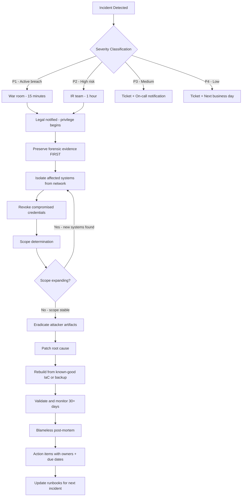

⚡ TL;DR - Incident Response (IR) is the structured process for detecting, containing,
eradicating, and recovering from a security incident. NIST SP 800-61 defines four
phases: Preparation → Detection & Analysis → Containment, Eradication & Recovery →
Post-Incident Activity. In practice: Preparation (runbooks, playbooks, on-call
rotation, communication trees), Detection (SIEM alert or user report triggers the
process), Containment (isolate the affected system NOW before any further damage),
Eradication (remove the attacker - patch the vulnerability, revoke compromised
credentials), Recovery (restore service from known-good state, validate), Post-Incident
(blameless post-mortem, timeline reconstruction, systemic improvements). SEVERITY
P1 (Critical - active breach, data theft): war room within 15 minutes. P2 (High -
containment succeeded, no confirmed exfiltration): standard escalation. P3/P4:
tracked issues. IR speed is measured: MTTD (Mean Time to Detect), MTTR (Mean Time
to Respond/Resolve). The golden rule: document everything during the incident
(forensic chain of custody). The cardinal mistake: immediately patching/rebooting
before capturing forensic evidence.

---

| #101 | Category: Security | Difficulty: ★★★ |
|:---|:---|:---|
| **Depends on:** | OWASP Top 10, Authentication, Session Management, IAM, TLS Configuration, OAuth Security, Business Logic, Insufficient Logging, Heartbleed, Log4Shell, SolarWinds, Equifax, Advanced JWT, Advanced XSS, CVSS Scoring, CVE + NVD, Responsible Disclosure | |
| **Used by:** | Digital Forensics Basics, AWS Security Services, Security Observability + SIEM, Security at Scale, DevSecOps Pipeline, Security Governance, CSIRT Design, Security Metrics, SIEM Architecture, SSDLC | |
| **Related:** | OWASP Top 10, Authentication, TLS Configuration, OAuth Security, Business Logic, Insufficient Logging, Heartbleed, Log4Shell, SolarWinds, Equifax, Advanced JWT, Advanced XSS, CVSS Scoring, CVE + NVD, Responsible Disclosure, Digital Forensics, CSIRT Design, Security Metrics | |

---

### 🔥 The Problem This Solves

**WHY AD HOC INCIDENT RESPONSE FAILS:**

```
THE UNPLANNED BREACH SCENARIO:

  Monday, 3:47 AM. On-call engineer gets a PagerDuty alert.
  SIEM: "Multiple failed login attempts followed by successful login
         from an unknown IP (1.2.3.4) for admin account."
  
  WITHOUT AN IR PROCESS:
  
    Engineer wakes up. Checks the alert.
    "Looks suspicious. Should I do something?"
    
    Engineer: calls the on-call manager.
    Manager: "Is this real? Are we actually breached?"
    No one knows: no detection criteria documented.
    
    Engineer: "Should I shut down the server?"
    Manager: "Will that break production?"
    No one knows: no containment runbook.
    
    Legal team: not called (no legal escalation procedure).
    PR team: not called (no comms plan).
    CEO: finds out 6 hours later when customers start calling.
    
    Attacker: 6 hours of uncontested access. Downloads 2M records.
    
    Day 2: emergency shutdown of production. 18 hours downtime.
    Forensics: impossible. Logs rotated. Disk imaged AFTER reboot
    (kernel state lost). Evidence chain broken.
    
    Day 30: regulators ask for breach timeline.
    Company: cannot reconstruct what happened (no documentation).
    Result: regulatory fine (GDPR: up to 4% of global annual revenue).
    
  WITH AN IR PROCESS:
  
    Monday, 3:47 AM. SIEM alert triggers Incident Response playbook.
    Automated: creates incident ticket (P1 - admin account compromise).
    PagerDuty: notifies on-call IR lead + backup + manager.
    Automated: notifies Legal (for privilege log), DPO, CISO (via SMS).
    
    IR Lead (awake in 8 minutes):
    - Follows authentication-compromise runbook.
    - Step 1: immediately revoke admin account session tokens.
      (Account disabled in 12 minutes. Attacker access cut.)
    - Step 2: take forensic snapshot of affected systems (before any changes).
    - Step 3: assess scope (what did the admin account have access to?).
    - Step 4: check CloudTrail/SIEM for all actions taken by attacker.
    
    Minutes 12-60: containment complete. Attacker access revoked.
    Hour 1-6: forensic analysis, scope determination.
    Hour 6: clear picture: no data exfiltration (network logs show no outbound transfers).
    Hour 8: CISO briefed. Legal notified (no breach notification required - no confirmed exfiltration).
    Day 2: root cause identified (credential stuffed via reused password).
    Day 3: all admin accounts migrated to MFA. Incident closed.
    Day 14: blameless post-mortem. Improvements implemented.
    
    RESULT: 12-minute containment. No data theft. Minimal downtime.
    No regulatory notification required (no confirmed exfiltration).
```

---

### 📘 Textbook Definition

**Incident Response (IR):** The organized approach to addressing and managing a
security incident (a violation or imminent threat of violation of computer security
policies, acceptable use policies, or standard security practices). Goal: minimize
damage, reduce recovery time and cost, and prevent future incidents. Defined by
NIST SP 800-61 (Computer Security Incident Handling Guide) and ISO/IEC 27035.

**NIST IR Lifecycle (SP 800-61):**
1. **Preparation:** IR team established, tools deployed, runbooks written, communication trees established.
2. **Detection and Analysis:** identify that an incident has occurred, determine its scope and severity.
3. **Containment, Eradication, and Recovery:** stop the damage, remove the threat, restore operations.
4. **Post-Incident Activity:** document lessons learned, improve defenses.

**Runbook (Playbook):** A documented set of step-by-step procedures for responding
to a specific type of security incident. Examples: "Ransomware Playbook," "Data
Breach Playbook," "Admin Account Compromise Playbook." A runbook removes the need
for decision-making under pressure - the engineer follows steps, not instincts.

**War Room:** A dedicated communication channel (Slack channel, conference call,
or physical room) where all IR stakeholders gather during an active P1/P2 incident.
Includes: IR lead, engineering, legal, communications, CISO, relevant vendors.

**MTTD (Mean Time to Detect):** Average time from when a security incident begins
to when it is detected. Industry benchmark: 2024 IBM Cost of a Data Breach report
average = 194 days. The longer the MTTD: the more damage the attacker inflicts.

**MTTR (Mean Time to Respond/Resolve):** Average time from detection to full
containment and restoration. IBM 2024 average: 64 days. Organizations with mature
IR programs: hours to days for containment; weeks for full eradication.

**Blameless Post-Mortem:** A structured review after an incident focused on
systemic causes (what allowed the incident to happen) rather than individual blame.
Based on the SRE principle that complex systems fail due to systemic issues, not
individual errors. Goal: actionable improvements, not punishment.

**Chain of Custody:** The documentation of who handled evidence during forensic
investigation, when, and how. Required for evidence to be admissible in legal
proceedings. Broken chain = evidence may be inadmissible.

---

### ⏱️ Understand It in 30 Seconds

**One line:**
Incident response is the structured playbook for what to do when you're hacked:
Contain immediately (cut attacker access), document everything (forensics),
Eradicate (patch/fix), Recover (restore clean state), Post-mortem (prevent recurrence).
Process > heroics - the runbook beats panic every time.

**One analogy:**
> IR process is like a hospital emergency room triage system.
>
> Without triage: patients arrive. Doctors scramble based on who screams loudest.
> The chest-pain patient waits because the ankle sprain arrived first and is louder.
> Critical patients die while resources go to non-critical cases.
>
> With triage: triage nurse assesses ALL patients on arrival.
> P1 (life-threatening): immediate treatment room. Drop everything.
> P2 (serious): monitored, treated within 30 minutes.
> P3/P4 (stable): waiting room. Systematic care.
>
> IR process = hospital triage for security incidents:
> P1 (active breach, data exfiltration in progress): war room NOW.
> P2 (compromised account, no confirmed exfiltration): structured response.
> P3 (malware on isolated workstation): tracked ticket, standard response.
>
> Runbooks = medical protocols: "If blood pressure drops below 90/60: [specific steps]."
> No thinking needed. Doctor follows protocol. Consistent response under stress.
>
> Blameless post-mortem = medical M&M (Morbidity and Mortality) conference:
> "What systemic factors led to this outcome? How do we improve the system?"
> Not: "Whose fault was this?" (individual blame creates hiding of errors).
>
> Chain of custody = evidence collection: blood sample labeled, who drew it,
> when, stored how. Unbroken chain = evidence admissible. Broken chain = unusable.

---

### 🔩 First Principles Explanation

**IR process phases and decision points:**

```
PHASE 1: PREPARATION (BEFORE ANY INCIDENT)

  TEAM SETUP:
    IR Lead: owns the process during an incident.
    Backup IR Lead: available when primary is unavailable.
    Communication Lead: handles external communication (customers, regulators).
    Legal Liaison: privilege protection, regulatory notification decisions.
    CISO/Executive Sponsor: escalation path.
    Technical SMEs: on-call rotation by system (infra, app, data, cloud).
    
  TOOLS DEPLOYED:
    SIEM: alert routing and correlation.
    EDR (Endpoint Detection and Response): endpoint forensics + isolation.
    Forensic tools: disk imaging (FTK Imager, dd), memory capture (Volatility).
    Network capture: NetFlow, packet capture capability.
    IR ticketing: Jira, PagerDuty, or IR-specific tools (Splunk SOAR, Palo Alto XSOAR).
    Secure communication: out-of-band channel (if primary Slack is compromised).
    
  RUNBOOKS WRITTEN:
    Per incident TYPE, not per system:
    - Ransomware Playbook
    - Data Breach (confirmed exfiltration) Playbook
    - Account Compromise (admin/service account) Playbook
    - DDoS Playbook
    - Supply Chain Compromise Playbook
    - Insider Threat Playbook
    
  CONTACT TREES ESTABLISHED:
    Who to call for P1? P2? After hours?
    Legal: always for P1 (privilege protection begins immediately).
    DPO: if personal data involved (GDPR 72-hour notification clock).
    PR: if public communication may be needed.
    Law enforcement: if attribution and prosecution planned.
    Cyber insurance carrier: for P1 (coverage begins at notification).
    
  METRICS BASELINE:
    What is NORMAL? Alert volume, login patterns, data egress rate.
    Without baseline: cannot distinguish incident from anomaly.
    
PHASE 2: DETECTION & ANALYSIS

  DETECTION SOURCES:
    Automated: SIEM alerts, IDS/IPS, WAF, EDR detections.
    User-reported: "My account is locked out," "I clicked a link - is that bad?"
    External: bug bounty researcher, pen tester, 3rd-party notification.
    Third-party: HaveIBeenPwned, FBI IC3, CISA alert.
    
  INITIAL TRIAGE (first 30 minutes):
    Is this a real incident or a false positive?
    What is the severity (P1/P2/P3/P4)?
    What systems are affected?
    Is the attacker still present (active incident) or past (already happened)?
    
  SEVERITY CLASSIFICATION:
  
    P1 (Critical):
    - Active data exfiltration in progress.
    - Ransomware encrypting production systems.
    - Admin account compromise with broad access.
    - Confirmed breach of PII/PCI/PHI data.
    Action: war room within 15 minutes. Legal notified immediately.
    
    P2 (High):
    - Account compromise detected, attacker access unclear.
    - Malware detected on production server (not yet spreading).
    - Vulnerability actively exploited in production (no confirmed exfiltration).
    Action: IR team activated within 1 hour. Standard escalation.
    
    P3 (Medium):
    - Unauthorized access attempt (blocked by WAF/IDS).
    - Vulnerability discovered (not yet exploited).
    - Phishing email identified (user did not click).
    Action: ticket created, engineering team notified.
    
    P4 (Low):
    - Informational SIEM alert requiring investigation.
    - Policy violation (no security impact).
    Action: ticket, next business day response.

PHASE 3: CONTAINMENT, ERADICATION, RECOVERY

  CONTAINMENT (priority: STOP DAMAGE FIRST):
    SHORT-TERM (first hour):
    - Isolate affected systems (remove from network, keep powered ON for forensics).
    - Revoke compromised credentials (session tokens, API keys, certificates).
    - Block attacker IP/domain at WAF/firewall.
    - Preserve evidence BEFORE any changes (snapshot, memory dump).
    
    DO NOT IMMEDIATELY REBOOT OR PATCH:
    Rebooting: wipes volatile memory (attacker tools, encryption keys, network connections).
    Patching: changes system state (forensics may require pre-patch state).
    Priority: evidence first, then remediation.
    
    LONG-TERM CONTAINMENT:
    - Temporary compensating controls (disable affected feature, add WAF rule).
    - Allow time for eradication while maintaining limited operations.
    
  ERADICATION:
    - Identify and remove ALL attacker artifacts (malware, backdoors, persistence mechanisms).
    - Identify ALL compromised accounts and credentials.
    - Determine the root cause (initial access vector).
    - Patch or reconfigure the exploited vulnerability.
    
  RECOVERY:
    - Restore from known-good backup (verified clean).
    - Rebuild affected systems from Infrastructure-as-Code (not from running compromised systems).
    - Validate: run vulnerability scans, verify system integrity.
    - Monitor closely for 30+ days post-recovery.

PHASE 4: POST-INCIDENT ACTIVITY (BLAMELESS POST-MORTEM)

  TIMELINE RECONSTRUCTION:
    - When did the attacker first gain access? (MTTD: time from first access to detection)
    - What did the attacker do? (scope of compromise)
    - What data was accessed/exfiltrated? (breach determination)
    
  POST-MORTEM FORMAT (blameless):
    1. Incident summary (5 lines max)
    2. Timeline (minute-by-minute from first indicator to resolution)
    3. Root cause analysis (5 Whys technique)
    4. Contributing factors (not individuals)
    5. Impact (systems, users, data, financial, regulatory)
    6. Action items (with owners and due dates)
    
  ROOT CAUSE ANALYSIS (5 WHYS EXAMPLE):
    Why was the admin account compromised?
    → Password was reused from another breach.
    Why was password reuse possible?
    → No MFA enforcement on admin accounts.
    Why was MFA not enforced?
    → MFA policy applied to standard users, admin exempted.
    Why were admins exempted?
    → "Admins complained it slowed down their workflow."
    Why was usability preferred over security for high-privilege accounts?
    → No security policy mandate for MFA on privileged accounts.
    
    ROOT CAUSE: No mandatory MFA policy for privileged accounts.
    ACTION: Enforce MFA for ALL accounts within 30 days.
    OWNER: Security Engineering. DUE: [date].
```

---

### 🧪 Thought Experiment

**SCENARIO: Ransomware incident response - with vs without process:**

```
SCENARIO: Midnight alert. Ransomware detected on 3 production servers.
          File extension .locked appearing. Ransom note dropped in /tmp/.
          
WITHOUT IR PROCESS:

  2:00 AM: Engineer: "Oh no. Ransomware."
  2:05 AM: Engineer immediately begins patching the server (destroys forensic evidence).
  2:07 AM: Engineer reboots server (malware removed, but so is memory evidence).
  2:08 AM: 17 other servers also encrypted (lateral movement was already happening,
            the contained server was patient zero, not the only one).
  2:15 AM: Engineering manager woken up.
  3:00 AM: CEO woken up.
  3:30 AM: Legal notified (1.5 hours AFTER the incident began).
  4:00 AM: "Should we pay the ransom?" (no backup verification done)
  
  RESULT:
    - Evidence destroyed (reboot + patch before imaging).
    - Lateral movement missed (focused on patient zero only).
    - 17 servers encrypted.
    - Legal notified late (GDPR clock may have started without legal privilege protection).
    - Ransom paid: $850,000 (decryption key provided, data not recovered due to corruption).
    - Downtime: 11 days.
    - Customer notification required (PII on encrypted servers).
    
WITH IR PROCESS:

  2:00 AM: SIEM auto-creates P1 ticket. PagerDuty fires. IR Lead notified.
           War room Slack channel #incident-2024-001 auto-created.
           Legal on-call notified (automatically). Legal privilege begins.
           
  2:03 AM: IR Lead: "Ransomware - activate Ransomware Playbook."
  
  2:04 AM (Runbook Step 1): Network isolation of affected servers.
    - Quarantine network segment (not reboot, not shutdown).
    - Servers isolated FROM network but still RUNNING.
    - Other servers: monitored for similar patterns (checked SIEM for .locked extension).
    
  2:06 AM: EDR shows: 3 servers affected. Attacker lateral movement stopped at network boundary.
            All 3 isolated. 17 other servers: checked, clean.
            
  2:10 AM (Runbook Step 2): Forensic preservation.
    - Memory dump of all 3 servers (preserves encryption keys in memory).
    - Disk snapshots before any changes.
    - NetFlow logs saved (shows attacker's command and control server IP).
    
  2:30 AM (Runbook Step 3): Scope determination.
    - What data was on the affected servers? (checked CMDB)
    - Was data exfiltrated before encryption? (NetFlow: no large outbound transfers detected)
    - No PII on affected servers (they were batch processing servers).
    
  3:00 AM: Legal briefed. "No PII. No confirmed exfiltration. Monitoring."
            GDPR notification: not required (no personal data breach confirmed).
            
  3:30 AM: Root cause from NetFlow: attacker entered via VPN (compromised contractor account).
  
  4:00 AM: Eradication.
    - Contractor VPN account disabled. All contractor accounts forced MFA re-enrollment.
    - Command and control IP blocked at firewall.
    - Malware family identified (LockBit 3.0). Known decryptor: not available.
    - Decision: restore from backup (verified 24h-old backup - clean).
    
  6:00 AM: Restore complete. Validation running.
  8:00 AM: Production restored. Normal operations.
  
  RESULT:
    - Contained in 6 minutes (network isolation at 2:04 AM).
    - 0 additional servers encrypted (lateral movement blocked).
    - Forensic evidence preserved (memory dump, disk snapshot).
    - No ransom paid (backup restore successful).
    - Downtime: 6 hours (vs 11 days).
    - No customer notification required (no PII breach).
    - Total cost: ~$50K (engineer time, forensic analysis).
    - Without process cost: ~$1.5M (ransom + legal + notification + downtime).
```

---

### 🧠 Mental Model / Analogy

> IR process is like an airplane emergency procedures checklist.
>
> Pilots are highly trained, experienced professionals. In an emergency, their
> instinct might be: "I know what to do - let me handle it."
> Research shows: under stress, even experts make mistakes. Memory fails.
> Steps are skipped. The wrong action is taken first.
>
> Aviation solution: checklists. For every emergency type:
> "Engine fire on left: (1) throttle to idle, (2) fuel shutoff, (3) extinguisher..."
> Pilot doesn't think: pilot follows the list. Consistent, complete, fast.
>
> IR runbooks = aviation emergency checklists.
> "Admin account compromise: (1) revoke all session tokens, (2) disable account,
> (3) preserve forensic evidence, (4) check SIEM for all actions by that account..."
> IR lead doesn't think under stress. Follows the runbook. Consistent, complete, fast.
>
> MTTD = the time from when the fire starts to when the pilot notices.
> Long MTTD = fire has already damaged the engine significantly.
> Short MTTD = fire extinguished quickly, minimal damage.
>
> War room = cockpit: everyone who needs to act is in communication.
> "Pilot (IR lead), co-pilot (technical lead), air traffic control (legal),
> cabin crew (communications team)." Each role knows their responsibility.
>
> Blameless post-mortem = NTSB (National Transportation Safety Board) investigation.
> Goal: understand systemic causes to prevent future crashes.
> Not: find the pilot to blame and fire them.
> "What in the system allowed this outcome? What can be changed?"
> Aviation's blameless culture (protected reporting) has been empirically shown
> to reduce accident rates. Security IR programs apply the same principle.

---

### 📶 Gradual Depth - Five Levels

**Level 1 - What it is (anyone can understand):**
Incident response is your company's plan for what to do when there's a security breach. It defines who to call, what to do first, how to stop the damage, how to clean up, and how to prevent it from happening again. Having a plan in place before something goes wrong means the difference between a contained incident and a company-ending breach.

**Level 2 - How to use it (junior developer):**
Know your company's IR process before an incident happens: Who do you call? (IR lead, security team, manager.) How do you report a suspected incident? (security@company.com or security ticketing system.) What NOT to do: don't reboot, don't patch immediately, don't wipe evidence. If you click a suspicious link or notice unusual system behavior: report immediately, don't try to investigate or fix it yourself. For on-call engineers: know where the runbooks are (Confluence, PagerDuty runbooks), know your escalation path, and know that SPEED of reporting is more valuable than certainty.

**Level 3 - How it works (mid-level engineer):**
NIST SP 800-61 lifecycle: Preparation → Detection & Analysis → Containment, Eradication & Recovery → Post-Incident. Severity classification: P1 (active breach/data exfiltration - war room 15 min), P2 (high risk, contained - standard escalation 1h), P3 (medium - tracked ticket), P4 (low - next business day). Containment priority: PRESERVE EVIDENCE before any remediation. Forensic snapshot FIRST. Isolate from network (don't power off - preserve volatile memory). Revoke compromised credentials immediately. Eradication: remove all attacker artifacts, patch root cause. Recovery: restore from known-clean baseline (IaC rebuild or verified backup). Post-mortem: blameless, 5 Whys root cause, action items with owners.

**Level 4 - Why it was designed this way (senior/staff):**
The NIST lifecycle is non-linear in practice: incidents cycle between containment and detection (as new attacker artifacts are discovered, scope expands, requiring new containment). The hardest phase: scoping. "Do we have the full picture or are there more compromised systems?" Attacker persistence mechanisms (web shells, backdoor accounts, scheduled tasks, modified binaries) mean "fully eradicated" is never certain without complete baseline comparison. For this reason: the preferred recovery strategy is "destroy and rebuild from IaC" rather than cleaning a compromised system. Rebuilt from source → known good state. Cleaned system → unknown (attacker may have modified files not detected by AV/EDR). Legal involvement timing: engage Legal at the moment an incident is declared P1 or P2 (not after). Legal privilege (attorney-client privilege) protects investigation communications from discovery in litigation if Legal is engaged from the start. If you wait to engage Legal until after the investigation: the investigation communications may be discoverable.

**Level 5 - Mastery (distinguished engineer):**
OODA Loop (Observe-Orient-Decide-Act) in IR: IR teams compete with attackers in a dynamic environment. Effective IR is faster decision-making than the attacker's lateral movement. MTTD × Dwell Time = attacker's window. IBM 2024: average dwell time 194 days. Even fast IR response after 194 days of dwell = massive scope to eradicate. Prevention must reduce MTTD (detection capabilities), not just improve response speed. Threat hunting: proactive search for attacker TTPs (Tactics, Techniques, Procedures) in your environment using MITRE ATT&CK framework. Don't wait for alerts - actively hunt for attacker behaviors. Advanced persistence: bootkits (modify bootloader, survive OS reinstall), firmware implants (survive disk wipe), hypervisor rootkits. Full eradication may require hardware replacement in nation-state-level attacks. CSIRT (Computer Security Incident Response Team) vs ad-hoc: dedicated CSIRT with 24/7 coverage, specialized forensics capability, established vendor relationships (forensics firms, law enforcement contacts, cyber insurance), tabletop exercise cadence. Mean time metrics: track MTTD (target: hours, not months), MTTR (target: days, not weeks). Publish IR metrics to board: "We detected and contained P1 incidents in an average of 4.2 hours this quarter." This is actionable governance data.

---

### ⚙️ How It Works (Mechanism)

```
IR LIFECYCLE (NIST SP 800-61):

  [PREPARATION]
    ↓ IR team + runbooks + tools + comms tree
  
  [DETECTION] ──→ [ANALYSIS]
    SIEM alert        Is it real?
    User report       Severity?
    External tip      Scope?
    ↓
  [CONTAINMENT]
    Short-term: isolate, revoke credentials
    Preserve forensic evidence FIRST
    ↓
  [ERADICATION]
    Remove attacker artifacts
    Patch root cause
    ↓
  [RECOVERY]
    Restore from known-good
    Monitor closely (30+ days)
    ↓
  [POST-INCIDENT]
    Blameless post-mortem
    Action items
    Update runbooks
    
    ↑ (feeds back into PREPARATION for next incident)

SEVERITY → ACTION MATRIX:

  P1 Critical → War room (15 min) + Legal + CISO + Comms
  P2 High     → IR team (1 hour) + Legal + CISO
  P3 Medium   → Ticket + On-call + Notify
  P4 Low      → Ticket + Next business day
```



---

### 💻 Code Example

**IR runbook structure and severity classification:**

```yaml
# runbook-admin-account-compromise.yaml
# Incident Runbook: Admin Account Compromise
# Owner: Security Engineering
# Last updated: 2024-01-01
# Version: 2.1

metadata:
  id: RUNBOOK-002
  title: "Admin Account Compromise Response"
  severity: P1-P2
  triggers:
    - SIEM rule: "Admin account login from unknown IP"
    - SIEM rule: "Admin account multiple failed logins then success"
    - User report: "My admin account is behaving strangely"

pre-execution:
  - Notify Legal via incident ticket (privilege protection begins)
  - Create war room channel: "#incident-YYYY-MM-DD-N"
  - Confirm CISO is in war room (or designee)
  - Start incident timer

phase-1-containment: # FIRST 30 MINUTES
  steps:
    1:
      action: "Preserve forensic evidence"
      commands:
        # BEFORE any changes - capture current state:
        - "take memory snapshot of affected systems (EDR or memory dumper)"
        - "snapshot EBS volumes / disk images"
        - "export last 7 days SIEM logs for affected user to S3"
        - "export CloudTrail / API audit logs for affected account"
      rollback: "N/A - evidence preservation is additive"
      owner: "On-call Security Engineer"
      time-limit: "10 minutes"

    2:
      action: "Revoke all active sessions"
      commands:
        - "aws cognito-idp admin-user-global-sign-out --user-pool-id <pool> --username <user>"
        - "aws iam delete-access-key --access-key-id <key> --user-name <user>"
        - "Revoke all OAuth tokens in token store for affected user"
        - "Invalidate all JWT tokens for affected user (blacklist or rotate signing key)"
      verification: "Confirm no active sessions in session store for user"
      owner: "On-call Security Engineer"
      time-limit: "5 minutes"

    3:
      action: "Disable compromised account"
      commands:
        - "aws iam update-login-profile --user-name <user> --password-reset-required"
        - "aws iam attach-user-policy --policy-arn arn:aws:iam::aws:policy/AWSDenyAll"
        - "In Okta/IdP: suspend account (not delete - preserve audit trail)"
      verification: "Confirm account cannot authenticate (test failed login)"
      owner: "IAM Admin"
      time-limit: "5 minutes"

    4:
      action: "Block attacker IP at WAF and security groups"
      commands:
        - "aws wafv2 update-ip-set --name block-list --addresses <attacker-ip>/32"
        - "Review other accounts for login from same IP"
      owner: "Network/Cloud Security"

phase-2-analysis: # FIRST 2 HOURS
  steps:
    5:
      action: "Reconstruct attacker actions from audit logs"
      data-sources:
        - CloudTrail (AWS API calls by compromised account)
        - Application logs (what data was accessed)
        - Database audit logs (queries executed)
        - S3 access logs (files downloaded)
      key-questions:
        - "What was accessed? (scope of compromise)"
        - "Was any data exfiltrated? (NetFlow outbound transfers)"
        - "Were any new resources created? (persistence mechanisms)"
        - "Were any other accounts accessed or modified? (lateral movement)"
      owner: "DFIR (Digital Forensics and Incident Response)"

    6:
      action: "Determine data breach status"
      decision-tree:
        - "PII accessed? → GDPR 72-hour notification clock starts"
        - "PCI data accessed? → PCI DSS forensics obligation"
        - "No sensitive data accessed? → No breach notification required"
      legal-input: "Required before determination is final"
      owner: "Legal + CISO + Security Engineering"

phase-3-eradication: # HOURS 2-8
  steps:
    7:
      action: "Identify root cause"
      # How did attacker get the credentials?
      options:
        - "Credential stuffing (password reused from another breach)"
        - "Phishing (user clicked malicious link, credential harvested)"
        - "Malware on endpoint (keylogger, stealer)"
        - "Insider threat (intentional credential share)"

    8:
      action: "Remediate root cause"
      remediation_by_cause:
        credential-stuffing: "Force all admin accounts to reset passwords + enforce MFA"
        phishing: "Email gateway rule updates + user security training notification"
        malware: "Endpoint forensics + full workstation rebuild from image"
        insider-threat: "HR involvement + legal + access revocation + evidence preservation"

phase-4-recovery: # HOURS 4-24
  steps:
    9:
      action: "Restore admin access (clean account)"
      - "Create new admin account with different name"
      - "Enforce MFA (hardware key or authenticator app)"
      - "Apply principle of least privilege (review what permissions admin actually needs)"

    10:
      action: "Extended monitoring"
      - "SIEM alerts tuned for indicators of compromise (IOCs) from this incident"
      - "Monitor for 30 days for any re-compromise indicators"

post-incident:
  post-mortem-template: runbook-templates/blameless-post-mortem.md
  sla: "Post-mortem complete within 5 business days"
  required-attendees:
    - IR Lead
    - Engineering Manager
    - CISO
    - Legal (optional but recommended)
```

---

### ⚖️ Comparison Table

| Phase | Key Actions | Common Mistake | Recovery If Mistake Made |
|:---|:---|:---|:---|
| **Detection** | Identify incident + severity triage | Dismiss alert as false positive | Hard - attacker may be active during dismissal |
| **Containment** | Isolate, revoke, preserve forensics | Reboot/patch before evidence capture | Forensic evidence gone - case may be unprovable |
| **Eradication** | Remove all attacker artifacts | Miss secondary persistence mechanism | Attacker re-enters via backdoor - repeat incident |
| **Recovery** | Rebuild from known-clean state | Restore from compromised backup | Attacker code re-deployed |
| **Post-Incident** | Blameless root cause, action items | Blame individuals (not systemic) | Team hides future issues, underreports |

---

### ⚠️ Common Misconceptions

| Misconception | Reality |
|:---|:---|
| "We should patch/reboot immediately when malware is detected." | Rebooting before forensic capture destroys volatile memory - which contains the most valuable evidence: running processes, network connections, encryption keys in memory, attacker tools resident in RAM only. The attacker's malware is GONE after a reboot. Without the in-memory evidence, forensics can only see the impact (encrypted files, changed configurations) not the cause (how the malware operated). The correct sequence: (1) isolate from the network (prevents further damage, keeps attacker out, keeps system running), (2) take memory dump + disk snapshot, (3) THEN patch/reboot. The isolation buys time for evidence capture without allowing the attacker to continue causing damage. This is the difference between knowing the attacker's tools and techniques (allowing detection of the same TTPs elsewhere) vs knowing only that something bad happened. |
| "If we detect an incident quickly, we need to notify customers immediately." | Detection alone does not trigger customer notification obligations. Notification is required when there's a CONFIRMED breach of REGULATED DATA (PII, PHI, PCI, etc.). Premature notification: creates panic, damages reputation, may provide attackers with information about your detection capabilities. The correct process: (1) detect and contain, (2) determine the scope of data accessed (forensic analysis), (3) determine if notification obligations apply (legal determination based on jurisdiction and data type), (4) notify regulators if required, then customers per regulatory timelines. GDPR: 72 hours to notify supervisory authority (not customers) if personal data breach confirmed. HIPAA: 60 days for large breaches (500+ records). US state breach notification laws vary. Legal involvement from the start ensures you notify when and how you're required to, not before (avoiding over-notification) and not after (avoiding regulatory penalties). |

---

### 🚨 Failure Modes & Diagnosis

**IR process anti-patterns:**

```
FAILURE PATTERN 1: RUNBOOK THAT'S NEVER BEEN TESTED

  Runbook written: Day 0.
  First actual use: 18 months later during a real P1 incident.
  
  Discovery: Step 6 ("revoke all OAuth tokens") assumes a tokn blacklist
  feature that was never implemented. Engineer at 3 AM: "Wait, how do
  we actually do this? There's no way to invalidate tokens."
  
  Fix: TABLETOP EXERCISES every quarter.
  Tabletop: "Hypothetical: ransomware detected on DB server at 2 AM.
  Walk through the runbook step by step. Who does what? What tools?
  Where are the credentials? What happens if the primary engineer is unavailable?"
  
  Game Day (full simulation): once a year.
  Inject a simulated incident (chaos engineering + fake IOCs).
  Run the FULL IR process. Measure MTTD, MTTR. Find gaps.

FAILURE PATTERN 2: NO OUT-OF-BAND COMMUNICATION

  Attacker compromises your Slack.
  IR team creates a Slack channel to coordinate the response.
  Attacker: reads the IR channel in real time.
  Attacker: moves faster than your response.
  
  Fix: pre-establish out-of-band communication:
  SMS group, WhatsApp group, PagerDuty mobile, or a separate
  collaboration tool the attacker can't access.
  "If primary Slack is compromised or suspected: use [backup channel]."
  
FAILURE PATTERN 3: LEGAL NOTIFIED TOO LATE

  Day 0: P1 incident detected.
  Day 14: investigation complete.
  Day 14: Legal notified for the first time.
  
  Problem: all investigation communications (Slack, email, docs) are
  potentially discoverable in litigation. Legal privilege does NOT
  retroactively protect prior communications.
  
  Result: investigation notes saying "this appears to be our fault"
  become evidence in the inevitable lawsuit.
  
  Fix: engage Legal on Day 0 of any P1/P2 incident.
  Legal coordinates investigation under privilege protection.
  All incident communications: marked "Privileged and Confidential."

OPERATIONAL METRICS:
  MTTD (Mean Time to Detect): time from incident start to detection.
    Target: < 24 hours. Industry average (IBM 2024): 194 days.
    How to improve: better SIEM tuning, threat hunting, user awareness.
    
  MTTR (Mean Time to Respond): time from detection to containment.
    Target: < 4 hours for P1. Industry average: 64 days.
    How to improve: runbooks, automation, SOAR playbooks, training.
    
  MTTC (Mean Time to Contain): time from detection to containment.
    This is the critical metric: each day of uncontained access = more damage.
    
  Report these metrics to the board quarterly. Trend over time shows
  IR program maturity improvement.
```

---

### 🔗 Related Keywords

**Prerequisites:**
- `Insufficient Logging Anti-Pattern` (SEC-085) - without logging, detection is impossible

**Builds on this:**
- `Digital Forensics Basics` (SEC-102) - technical evidence collection used in IR
- `Security Observability + SIEM` (SEC-106) - detection layer feeding IR triggers
- `CSIRT Design` (SEC-121) - scaling IR to an organizational function

---

### 📌 Quick Reference Card

```
┌──────────────────────────────────────────────────────────┐
│ NIST PHASES   │ Prepare → Detect → Contain+Eradicate     │
│               │ → Recover → Post-Incident                │
├───────────────┼──────────────────────────────────────────┤
│ SEVERITY      │ P1: War room 15min + Legal immediately   │
│               │ P2: IR team 1h + Legal                   │
│               │ P3: Ticket + On-call                     │
│               │ P4: Ticket + Next business day           │
├───────────────┼──────────────────────────────────────────┤
│ CONTAINMENT   │ EVIDENCE FIRST, then isolate, then revoke│
│ ORDER         │ DO NOT reboot/patch before memory dump   │
├───────────────┼──────────────────────────────────────────┤
│ LEGAL         │ Engage at P1/P2 declaration. Before any  │
│               │ external comms. Privilege from Day 0.    │
├───────────────┼──────────────────────────────────────────┤
│ METRICS       │ MTTD: time to detect (target < 24h)      │
│               │ MTTR: time to resolve (target < 4h P1)   │
├───────────────┼──────────────────────────────────────────┤
│ POST-MORTEM   │ Blameless. 5 Whys. Action items.         │
│               │ Due within 5 business days of closure.   │
└──────────────────────────────────────────────────────────┘
```

---

### 💎 Transferable Wisdom

**Reusable Engineering Principle:**
"Process beats heroics. Documented process beats improvisation under stress."
The IR process principle that runbooks remove decision-making under pressure
is the same principle behind other engineering safety systems:
- Pre-flight checklists (aviation): pilots follow checklists even for procedures
  they've performed thousands of times. Fatigue, stress, interruption disrupt memory.
  Checklists compensate.
- Surgical checklists (WHO Surgical Safety Checklist): introduced in 2009, reduced
  major complications by 36% and deaths by 47% across hospitals globally.
  The checklist doesn't add new medical knowledge - it ensures existing knowledge
  is applied consistently under pressure.
- Nuclear plant emergency procedures: highly formalized, operator cannot deviate
  without explicit authorization. "Apparent vs actual causes" - operators don't
  troubleshoot during an emergency (that's for later). They follow the procedure.
- Financial trading circuit breakers: automated, trigger on pre-defined conditions,
  no human judgment required at the moment of triggering. Human judgment designed
  the circuit breakers upfront (preparation), not during the crash.
The common pattern: preparation (process design) is done in calm conditions.
Execution (following the process) happens under stress without real-time decision-making.
This is counterintuitive to engineers who are trained problem-solvers:
"Surely I can figure out the best course of action in the moment?"
Research consistently shows: under high stress, cognitive performance degrades.
Novel problem-solving is particularly impaired. Experts regress to automatic behaviors.
A runbook converts novel-problem-solving (impaired under stress) into
automatic-behavior-following (not impaired under stress).
The engineering insight: invest in preparation so that execution becomes automatic.
This applies to: incident response, deployment rollbacks, database failovers,
on-call runbooks, disaster recovery. The investment is upfront preparation.
The payoff is measured in minutes of faster response during a breach.

---

### 💡 The Surprising Truth

Companies with formal IR programs have significantly lower breach costs, but
here's what's surprising: the biggest cost reduction comes from MTTD improvement
(detecting faster), not from response speed improvement.

IBM's 2024 Cost of a Data Breach report:
- Breaches detected in < 200 days: average cost $3.93M.
- Breaches detected in > 200 days: average cost $5.46M.
- Difference: $1.53M - a 39% higher breach cost for slow detection.

But also:
- Organizations with high-level IR team involvement: $1.5M lower cost than those without.
- Organizations that used AI/ML in security operations: $2.2M lower cost.

The counterintuitive lesson: the most expensive part of a breach is the DWELL TIME
before detection - not the response time after detection.

A breach detected in 1 day and contained in 1 week costs dramatically less
than a breach detected after 6 months even if both are contained at the same speed.

Implication for resource allocation:
- Invest MORE in detection (SIEM, threat hunting, EDR, user behavior analytics).
- Invest MODERATELY in response speed (runbooks, SOAR automation).
- The common error: organizations focus on response (what to do when breached)
  without investing equally in detection (when are we breached).
  
The metric that matters most for cost reduction: MTTD.
The hardest metric to improve: MTTD.
The highest ROI investment: detection capabilities (SIEM tuning, threat hunting,
user behavior analytics, cloud security posture monitoring).

---

### ✅ Mastery Checklist

**You've mastered this when you can:**
1. **NAME** the 4 NIST SP 800-61 phases: Preparation → Detection & Analysis →
   Containment, Eradication & Recovery → Post-Incident Activity.
2. **EXPLAIN** why evidence must be preserved BEFORE remediation: rebooting destroys
   volatile memory evidence (running processes, encryption keys, network connections).
   Memory dump + disk snapshot FIRST, then isolate, then patch.
3. **DESCRIBE** severity classification: P1 (active breach - war room 15 min + Legal),
   P2 (high risk - IR team 1h), P3 (medium - ticket + on-call), P4 (low - next day).
4. **EXPLAIN** why Legal must be engaged at P1/P2 declaration:
   attorney-client privilege protects investigation communications from discovery.
   Engaging Legal after investigation removes this protection retroactively.
5. **STATE** MTTD and MTTR targets and their significance:
   MTTD target < 24h (IBM average 194 days). MTTR target < 4h for P1 (IBM average 64 days).
   Lower MTTD correlates most strongly with lower breach cost ($1.53M difference per IBM 2024).

---

### 🎯 Interview Deep-Dive

**Q: Walk me through an incident response process. What are the phases?
What do you do first when you detect a potential breach? Why is legal
involvement important from the beginning?**

*Why they ask:* Tests security operations depth, process knowledge, and understanding
of the legal/business dimensions of security incidents. Common in senior, staff,
and security engineering roles. Expect follow-up: "Tell me about a time you
responded to an incident" (behavioral) or "What metrics would you track?"

*Strong answer covers:*
- NIST SP 800-61 four phases: Preparation (runbooks, team, tools), Detection & Analysis
  (triage, scope), Containment, Eradication & Recovery, Post-Incident (blameless post-mortem).
- First action on suspected breach: PRESERVE FORENSIC EVIDENCE.
  Memory dump + disk snapshot BEFORE any remediation. Never reboot/patch first.
  Then: isolate from network (not shut down - isolation preserves running state).
  Then: revoke compromised credentials (session tokens, API keys, certificates).
- Legal from day 0: attorney-client privilege protects investigation communications.
  If you engage Legal after the investigation: prior communications may be discoverable.
  GDPR: 72-hour regulatory notification clock; Legal determines if it starts.
  Legal privilege: board-level protection in litigation. Non-negotiable for P1.
- Severity: P1 (active breach/exfiltration) = war room within 15 minutes.
  P2 (compromise, no confirmed exfiltration) = IR team within 1 hour.
- Post-mortem: blameless, within 5 business days. 5 Whys for root cause.
  Action items with named owners and due dates. Update runbooks.
- Metrics: MTTD (target < 24h), MTTR (target < 4h for P1).
  IBM 2024: MTTD improvement from >200 days to <200 days saves $1.53M per breach.
  Detection investment has highest ROI vs response speed investment.