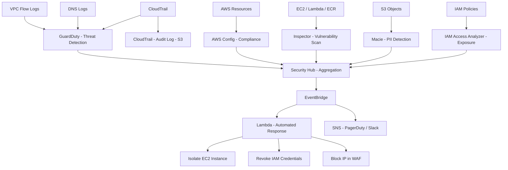

⚡ TL;DR - AWS provides a layered security services stack covering detection, audit,
compliance, network protection, and data protection. Key services by function:
GuardDuty (threat detection - analyzes VPC Flow Logs, DNS queries, CloudTrail for
malicious patterns; ML-based threat detection, no agents), Security Hub (aggregator
- centralizes findings from GuardDuty, Inspector, Macie, Config into a unified
dashboard with compliance scoring), CloudTrail (API audit log - records every AWS API
call with caller identity, time, source IP; essential for forensics), AWS Config
(compliance - continuous resource configuration tracking, managed/custom rules,
auto-remediation), Inspector (vulnerability scanning - EC2 + Lambda + container images,
CVSS-scored findings), Macie (S3 PII detection - ML-based sensitive data discovery),
IAM Access Analyzer (exposure detection - identifies externally accessible resources),
AWS WAF (L7 protection - rate limiting, SQL injection/XSS rules, managed rule groups),
Shield (DDoS - Shield Standard free automatic, Shield Advanced $3,000/month with
24/7 DRT support), KMS (key management - customer/AWS managed CMKs, envelope encryption).
Foundational: enable GuardDuty + CloudTrail + Security Hub in ALL regions.

---

| #103 | Category: Security | Difficulty: ★★★ |
|:---|:---|:---|
| **Depends on:** | OWASP Top 10, Authentication, Session Management, IAM, TLS Configuration, OAuth Security, Business Logic, Insufficient Logging, Heartbleed, Log4Shell, SolarWinds, Equifax, Advanced JWT, Advanced XSS, SSRF, CVSS Scoring, CVE + NVD, Responsible Disclosure, IR Process, Digital Forensics | |
| **Used by:** | Kubernetes Security, SAST in CICD, Security Observability + SIEM, Security at Scale, DevSecOps Pipeline, Security Governance, Security Metrics, Platform Security Engineering, Multi-Cloud Security, SIEM Architecture, SSDLC | |
| **Related:** | OWASP Top 10, Authentication, TLS Configuration, OAuth Security, Business Logic, Insufficient Logging, Heartbleed, Log4Shell, SolarWinds, Equifax, Advanced JWT, Advanced XSS, SSRF, CVSS Scoring, CVE + NVD, Responsible Disclosure, IR Process, Digital Forensics, Kubernetes Security, Security Observability, Security Metrics, Platform Security | |

---

### 🔥 The Problem This Solves

**WHY AWS SECURITY REQUIRES A LAYERED SERVICES APPROACH:**

```
THE AWS SECURITY CHALLENGE:

  PROBLEM 1: THE VISIBILITY PROBLEM
  
    Traditional security: firewall logs at the perimeter.
    AWS: 200+ services, 30+ regions, millions of API calls per day.
    One misconfigured S3 bucket: publicly readable.
    One overly permissive IAM role: grants cross-account access.
    One EC2 security group: port 22 open to the world.
    
    How do you KNOW about these? In AWS, you don't - unless you have
    continuous monitoring across all regions and services.
    
    CLOUDTRAIL: records every API call across every AWS service.
    "Who changed that security group? When? From which IP?"
    Answer in CloudTrail in < 1 minute.
    Without CloudTrail: impossible.
    
  PROBLEM 2: THE THREAT DETECTION PROBLEM
  
    The Capital One breach (2019): SSRF attack → IMDSv1 → role credentials stolen.
    The attacker: used legitimate AWS APIs (S3 GetObject, S3 ListBuckets).
    Network firewall: passed all traffic (looked legitimate).
    SIEM rules based on IP/port: missed it (legitimate API calls).
    
    GuardDuty: detects anomalies like:
    "IAM role used from IP 1.2.3.4 - Tor exit node."
    "EC2 instance calling S3 from an internal IP that matches IMDSv1 SSRF pattern."
    "DNS query for known C2 domain from EC2 instance."
    
    Without GuardDuty: breach like Capital One goes undetected for weeks.
    With GuardDuty: SSRF + unusual API call pattern → alert within minutes.
    
  PROBLEM 3: THE COMPLIANCE PROBLEM
  
    SOC 2, PCI DSS, HIPAA, ISO 27001 all require:
    - Encryption at rest (all data stores).
    - Encrypted in transit (all connections).
    - Least privilege access (IAM policies).
    - Audit logging (all API calls).
    - Vulnerability management (scan for known CVEs).
    
    Manual compliance checking across 500 AWS accounts: impossible.
    
    AWS Config: continuously checks if your resources meet these rules.
    "All S3 buckets must have server-side encryption enabled."
    Non-compliant bucket: automatic notification + optional auto-remediation.
    Compliance score: reported to Security Hub dashboard.
    Auditors: download the Config compliance report instead of manual checks.
    
  PROBLEM 4: THE SENSITIVE DATA PROBLEM
  
    S3 bucket with 50,000 files: which ones contain PII?
    Data engineer: "I think most are application logs."
    Compliance officer: "Are any of them customer credit cards?"
    
    Manual review: impossible at scale.
    
    Amazon Macie: ML-based PII detection across all S3 buckets.
    Finds: 437 files matching credit card pattern (Luhn algorithm).
    Action: encrypt them, restrict access, notify DPO.
    Without Macie: PCI DSS scope unknown. Audit finding: not knowable.
```

---

### 📘 Textbook Definition

**AWS GuardDuty:** A managed threat detection service that continuously monitors
for malicious activity using machine learning, anomaly detection, and integrated
threat intelligence. Analyzes: VPC Flow Logs, DNS logs, CloudTrail, EKS audit logs,
S3 access logs. No agents required. Severity levels: Low/Medium/High. Outputs to
Security Hub and EventBridge for automated response. Price: based on data volume analyzed.

**AWS Security Hub:** A cloud security posture management (CSPM) service that
aggregates security findings from AWS security services (GuardDuty, Inspector, Macie,
Config, Firewall Manager, IAM Access Analyzer) and third-party tools into a unified
dashboard. Provides compliance scores against standards: CIS AWS Foundations Benchmark,
AWS Foundational Security Best Practices, PCI DSS, NIST CSF.

**AWS CloudTrail:** An auditing service that records all AWS API calls (management
events, data events) with caller identity (IAM user/role/account), timestamp, source IP,
request parameters, and response. Delivers logs to S3. Can be configured: organization
trail (all accounts in AWS Organization), multi-region trail. Essential for forensics,
compliance, and investigation.

**AWS Config:** Continuously monitors and records AWS resource configurations and
evaluates them against desired configurations (Config rules). Tracks configuration
history for each resource. 250+ managed rules (CIS, PCI) + custom Lambda-based rules.
Auto-remediation: can trigger SSM Automation to fix non-compliant resources.

**Amazon Inspector:** Automated vulnerability management for EC2 instances (SSM agent),
Lambda functions, and container images (ECR). Uses CVE database to identify known
vulnerabilities. CVSS-scored findings. Integrates with Security Hub.

**Amazon Macie:** ML-powered sensitive data discovery in S3. Identifies: PII (names,
SSNs, credit cards, emails), financial data, credentials, custom data identifiers.
Classifies S3 objects with sensitive data, alerts on public access + unencrypted buckets.

**IAM Access Analyzer:** Identifies resources with policies that grant access to
external entities (outside your AWS account or organization). Analyzes: S3 buckets,
IAM roles, KMS keys, Lambda functions, SQS queues, Secrets Manager secrets.
Generates findings for external access paths.

**AWS WAF (Web Application Firewall):** L7 firewall for ALB, CloudFront, API Gateway,
AppSync. Rule groups: managed (AWS, AWS Marketplace vendors - OWASP Top 10,
IP reputation, bot control) and custom. Capabilities: rate limiting, geo-blocking,
SQL injection/XSS rules, JSON/XML body inspection.

**AWS Shield:** DDoS protection. Shield Standard: free, automatic for all AWS customers
(L3/L4 attack mitigation). Shield Advanced: $3,000/month + data transfer costs,
adds: L7 DDoS mitigation, 24/7 DRT (DDoS Response Team), financial protection
(credit for DDoS-caused scaling), advanced event visibility.

**AWS KMS (Key Management Service):** Managed service for creating and controlling
cryptographic keys. CMK (Customer Managed Key): customer creates and manages.
AWS Managed Key: AWS creates and manages per-service. KMS API: Encrypt, Decrypt,
GenerateDataKey (envelope encryption), Rotate (automatic annual key rotation).
Integrates with all AWS services that support encryption at rest.

---

### ⏱️ Understand It in 30 Seconds

**One line:**
AWS security services are a layered stack: GuardDuty detects threats (behavior analysis),
CloudTrail audits every API call, Config checks compliance, Inspector scans for CVEs,
Macie finds sensitive data in S3, IAM Access Analyzer finds external exposure,
WAF protects web apps, Shield blocks DDoS. Security Hub aggregates everything.

**One analogy:**
> AWS security services are like the security systems of a modern hospital campus.
>
> CCTV (GuardDuty): cameras everywhere, ML analyzing behavior patterns.
> "Unusual movement pattern in Ward 7 - alerting security."
> Covers all behaviors automatically, no guards needed at every door.
>
> Access control system (IAM + IAM Access Analyzer): who can enter which doors.
> IAM Access Analyzer: "the supply entrance is accessible to a vendor not on the approved list - alert."
>
> Building inspections (AWS Config): periodic compliance checks.
> "All fire extinguishers must be inspected monthly." Non-compliant unit: immediate ticket.
> Auto-remediation: "automatically schedule inspection for non-compliant units."
>
> Vulnerability scanner (Inspector): "the maintenance corridor has an old lock (CVE-2023-XXXX).
> Severity: High. Recommendation: replace with deadbolt by next maintenance window."
>
> Visitor log (CloudTrail): every person who entered, when, which door, purpose.
> "Who accessed the medication storage at 3 AM on Tuesday?" CloudTrail knows.
>
> Sensitive records scanner (Macie): "3 filing cabinets in the archive room contain
> patient SSNs in unlocked, unencrypted cabinets. HIPAA violation - immediate action required."
>
> Firewall guard at the front entrance (WAF): "no one enters with SQL injection on their clipboard."
> Rate limiting: "no visitor makes more than 100 requests per minute."
>
> Shield: "someone is flooding the parking lot with cars (DDoS).
> Shield Standard: reroutes traffic. Shield Advanced: calls reinforcements (DRT)."
>
> Security Hub: the hospital's unified security dashboard.
> All alerts from all systems: one screen. Compliance score: visible to the CISO.

---

### 🔩 First Principles Explanation

**AWS security service architecture and integration:**

```
AWS SECURITY LAYERED ARCHITECTURE:

  LAYER 1: DETECTION (Threat Identification)
  ┌──────────────────────────────────────────────────────┐
  │ GuardDuty                                            │
  │  Input sources:                                      │
  │    VPC Flow Logs (network traffic anomalies)         │
  │    DNS Logs (C2 domain lookups, data exfiltration)   │
  │    CloudTrail (API anomalies, credential misuse)     │
  │    EKS Audit Logs (Kubernetes threat detection)      │
  │    S3 Access Logs (data exfiltration patterns)       │
  │    Lambda Logs (function execution anomalies)        │
  │  Detection types (175+ finding types):               │
  │    UnauthorizedAccess (cred used from unusual IP)    │
  │    Backdoor:EC2/C&CActivity (C2 DNS queries)         │
  │    Trojan:EC2/DropPoint (malware C2 pattern)         │
  │    Recon:IAMUser/MaliciousIPCaller                   │
  │    Discovery:S3/MaliciousIPCaller                    │
  │    CryptoCurrency:EC2/BitcoinTool (crypto mining)    │
  └──────────────────────────────────────────────────────┘

  LAYER 2: AUDIT (Complete API Activity)
  ┌──────────────────────────────────────────────────────┐
  │ CloudTrail                                           │
  │  Management events: ALL API calls (IAM, EC2, S3...) │
  │  Data events: S3 object-level (Get, Put, Delete)     │
  │              Lambda function invocations             │
  │              DynamoDB table-level operations         │
  │  Organization trail: one trail → all member accounts │
  │  CloudWatch Logs integration: real-time alerts       │
  │  Integrity validation: SHA-256 hash of each log file │
  │    (detects if log files were tampered after storage) │
  └──────────────────────────────────────────────────────┘

  LAYER 3: COMPLIANCE (Continuous Configuration Checks)
  ┌──────────────────────────────────────────────────────┐
  │ AWS Config                                           │
  │  Rules (examples):                                   │
  │    s3-bucket-public-read-prohibited                  │
  │    encrypted-volumes (EBS encrypted)                 │
  │    iam-root-access-key-check (no root access keys)   │
  │    mfa-enabled-for-iam-console-access               │
  │    vpc-default-security-group-closed                 │
  │    cloudtrail-enabled                                │
  │  Conformance packs: CIS, PCI DSS, NIST, HIPAA        │
  │  Auto-remediation via SSM Automation documents       │
  └──────────────────────────────────────────────────────┘

  LAYER 4: VULNERABILITY MANAGEMENT
  ┌──────────────────────────────────────────────────────┐
  │ Amazon Inspector                                     │
  │  EC2: OS packages + software CVEs (SSM Agent req'd)  │
  │  Lambda: function package dependencies CVEs          │
  │  ECR: container image layer scanning                 │
  │  CVSS-scored findings → Security Hub                 │
  └──────────────────────────────────────────────────────┘

  LAYER 5: DATA PROTECTION
  ┌──────────────────────────────────────────────────────┐
  │ Amazon Macie (S3 PII discovery)                      │
  │  Classifiers: PII, financial, credentials, custom    │
  │  Alerts: public buckets, unencrypted sensitive data  │
  │                                                      │
  │ AWS KMS (key management)                             │
  │  Envelope encryption: KMS generates DEK              │
  │    (Data Encryption Key) wrapped by CMK              │
  │  Integration: S3, EBS, RDS, DynamoDB, Secrets Mgr   │
  └──────────────────────────────────────────────────────┘

  LAYER 6: NETWORK PROTECTION
  ┌──────────────────────────────────────────────────────┐
  │ AWS WAF (ALB, CloudFront, API Gateway)               │
  │  Rule groups: OWASP (SQLi, XSS), IP reputation, bots │
  │  Rate-based rules: 100 req/5min from same IP         │
  │  Custom rules: JSON conditions                       │
  │                                                      │
  │ AWS Shield Standard (free): L3/L4 auto-mitigated    │
  │ AWS Shield Advanced ($3K/mo): L7 + DRT support       │
  └──────────────────────────────────────────────────────┘

  AGGREGATION LAYER: SECURITY HUB
  ┌──────────────────────────────────────────────────────┐
  │ Security Hub                                         │
  │  Aggregates: GuardDuty + Inspector + Macie + Config  │
  │              + IAM Access Analyzer + 3rd party       │
  │  Compliance scores: CIS / AWS FSBP / PCI / NIST      │
  │  EventBridge integration: route findings to SOAR     │
  └──────────────────────────────────────────────────────┘
```

---

### 🧪 Thought Experiment

**SCENARIO: Detecting the Capital One SSRF breach pattern with AWS security services:**

```
BACKGROUND: Capital One 2019 breach.
  - WAF misconfiguration allowed SSRF.
  - Attacker sent request to internal IP → EC2 metadata service (IMDSv1).
  - IMDSv1 returned IAM role credentials (no authentication required).
  - Attacker used stolen credentials to call S3:ListBuckets, S3:GetObject.
  - 106 million customer records exfiltrated.
  
WITH MODERN AWS SECURITY SERVICES (would this be detected?):

  PREVENTION (IMDSv2):
    IMDSv2: PUT request first → token → GET request uses token.
    SSRF cannot obtain token (single-hop PUT can't be forwarded).
    Capital One attack: impossible with IMDSv2 enforced.
    Terraform config to enforce IMDSv2:
    resource "aws_instance" "example" {
      metadata_options {
        http_tokens = "required"  # Enforces IMDSv2
        http_put_response_hop_limit = 1
      }
    }
    AWS Config rule: ec2-imdsv2-check → auto-remediate non-compliant instances.
    
  DETECTION (GuardDuty):
    When attacker calls S3 APIs with the stolen credentials:
    
    GuardDuty finding: UnauthorizedAccess:IAMUser/InstanceCredentialExfiltration.InsideAWS
    "Credentials created on instance i-0abc123 are being used from IP 1.2.3.4
     which is not the instance's IP."
    
    Alert would fire within minutes of first API call from external IP.
    Capital One's GuardDuty status: GuardDuty was enabled but the alert was
    not actioned quickly enough. (Post-breach finding.)
    
  DETECTION (CloudTrail + Athena):
    Query: "Show all S3:GetObject calls from role FlowLogCatchall in last 7 days"
    
    SELECT eventtime, sourceipaddress, requestparameters
    FROM cloudtrail_logs
    WHERE eventname = 'GetObject'
      AND useridentity.sessioncontext.sessionissuer.username = 'FlowLogCatchall'
      AND sourceipaddress NOT LIKE '%.compute.internal'
    ORDER BY eventtime;
    
    Result: 700,000+ GetObject calls from external IP.
    
  ACCESS ANALYSIS (IAM Access Analyzer):
    IAM role FlowLogCatchall: had WAY too many permissions.
    Access Analyzer would flag: "S3 read access to 700+ buckets is unusual for a role
    used only for VPC Flow Logs. Review and reduce permissions."
    
    Prevention: least privilege enforcement before the attack.
    
  DATA DISCOVERY (Macie):
    Macie running on the S3 buckets:
    "Buckets s3://capital-one-data-X contain Social Security Numbers (400M+ objects)."
    "These buckets are accessible by role FlowLogCatchall."
    
    Alert: why does a VPC Flow Log role have access to SSN-containing buckets?
    Immediate investigation would have caught the over-permissioned role.
    
  LESSON:
    Modern AWS security posture would have:
    1. Prevented the attack (IMDSv2 enforcement).
    2. Detected it in minutes (GuardDuty).
    3. Provided forensic evidence (CloudTrail).
    4. Identified the over-permission proactively (Access Analyzer + Macie).
    Capital One had some controls. They weren't tuned correctly.
    "Enabling" services is not equivalent to "operating" them.
```

---

### 🧠 Mental Model / Analogy

> AWS security services form a defense-in-depth stack, like a data center's physical security.
>
> **Perimeter (WAF + Shield):** the front gate and fence.
> WAF = security guard checking IDs and rejecting known threats (SQLi, XSS).
> Shield = blast walls against DDoS car bombs - automatic, always on.
>
> **Access control (IAM + IAM Access Analyzer):** building access cards.
> IAM = who is allowed where.
> IAM Access Analyzer = security audit: "wait, that door is accessible to people
> outside our organization - that shouldn't be possible."
>
> **CCTV + behavior analysis (GuardDuty):** 24/7 cameras with AI.
> GuardDuty doesn't just record (that's CloudTrail). It ANALYZES behavior:
> "That person entered the server room at 3 AM and is copying drives - that's unusual for this role."
>
> **Security audit log (CloudTrail):** sign-in book at every door.
> Every person who entered any room, when, what they did.
> Forensics: "Who was in the server room between 2 AM and 4 AM on Tuesday?"
>
> **Building code compliance (AWS Config):** fire marshal inspections.
> "Every room must have a smoke detector." Non-compliant room: immediate notification.
> Auto-remediation: "automatically install the smoke detector" (if safe to do so).
>
> **Vulnerability assessment (Inspector):** structural safety inspection.
> "The east wing's fire door is damaged (CVE-2023-1234, CVSS 8.7). Replace within 14 days."
>
> **Data inventory (Macie):** knowing which filing cabinets contain classified documents.
> "Cabinet 7 in the archive room has patient records without a lock." Alert immediately.
>
> **Security Operations Center (Security Hub):** the unified security dashboard.
> All alerts from all systems flow here. One analyst can see everything.
> Compliance score visible: "we're 94% compliant with CIS AWS Foundations."

---

### 📶 Gradual Depth - Five Levels

**Level 1 - What it is (anyone can understand):**
AWS has a set of built-in security tools that work together to keep your cloud environment safe. GuardDuty watches for hackers, CloudTrail records every action anyone takes, Config checks if your settings follow security rules, Inspector finds known vulnerabilities in your servers, Macie finds personal data in your S3 buckets, WAF blocks web attacks, and Security Hub shows you everything in one dashboard.

**Level 2 - How to use it (junior developer):**
Enable in order: (1) CloudTrail in ALL regions with S3 logging, (2) GuardDuty in all regions (enable org-level), (3) Security Hub with CIS AWS Foundations benchmark, (4) AWS Config with PCI/CIS conformance pack, (5) Inspector for EC2 + Lambda + ECR, (6) Macie for S3 buckets with customer data. Route GuardDuty High severity findings to PagerDuty via EventBridge → SNS. Set up Security Hub findings in Jira for Medium/High/Critical. Add IAM Access Analyzer at org level to catch externally-exposed resources.

**Level 3 - How it works (mid-level engineer):**
GuardDuty: continuously ingests VPC Flow Logs + DNS logs + CloudTrail. ML anomaly detection (baseline per account, per region). Fixed finding types: 175+ (documented at docs.aws.amazon.com/guardduty/findings). No agent needed: reads AWS-managed logs. EventBridge integration: `aws.guardduty` event source → Lambda/SNS. CloudTrail: management events by default (all control-plane API calls). Data events: opt-in, per service/resource (S3 object level costs money). Org trail: created in management account, covers all member accounts, logs to S3. Athena + Glue: partition and query CloudTrail logs at scale. AWS Config: configuration snapshot + configuration stream to S3/SNS. Config rules: periodic (daily/hourly) or change-triggered (on resource change). Conformance packs: collection of rules + remediation actions, deploys as a unit.

**Level 4 - Why it was designed this way (senior/staff):**
The separation of GuardDuty (behavior analysis) from CloudTrail (raw audit log) reflects different use cases: CloudTrail = forensics (what happened exactly), GuardDuty = detection (is something bad happening now). CloudTrail requires human or custom query to extract insight. GuardDuty provides pre-built detection findings. Cost model: GuardDuty charges for data volume analyzed (cheaper for organizations that already have VPC Flow Logs/CloudTrail). Security Hub pricing: per finding ingested + compliance check. The "enable everywhere" cost challenge: small accounts with minimal activity may see minimal cost; large accounts with many resources need cost estimation before enabling data events in CloudTrail. IAM Access Analyzer design: policy-based external access analysis is a theorem-proving problem (given these policies, can this principal access this resource from outside the account?). AWS solves this with an automated reasoning engine that analyzes IAM policy conditions formally. This is fundamentally more accurate than rule-based approaches.

**Level 5 - Mastery (distinguished engineer):**
GuardDuty ML models: each AWS account gets its own behavioral baseline. New account: 2-week "calibration" period before findings are fully meaningful. Region-level: each region has its own baseline. This means findings from regions you don't normally use are immediately high-signal (any API calls to eu-north-1 when you only operate in us-east-1: instant alert). Shield Advanced integration with Route 53 Health Checks: automatic L7 DDoS protection when health check fails. Shield Advanced cost absorption: credits for EC2/ELB/CloudFront scaling costs caused by DDoS attacks (financial protection beyond just technical mitigation). AWS Firewall Manager: centralized WAF policy management across hundreds of accounts + regions (enforces WAF rules, Shield Advanced, Network Firewall, Security Groups via org-level policies). EventBridge + Security Hub + SOAR: complete automated response pipeline. Finding → EventBridge rule → Lambda (SOAR action): isolate EC2 instance, revoke IAM credentials, block IP in WAF. Automated response time: seconds vs manual response time: hours. GuardDuty threat intel feeds: updates every 5 minutes. IP reputation lists from CrowdStrike, ProofPoint, AWS internal threat intel.

---

### ⚙️ How It Works (Mechanism)

```
AWS SECURITY SERVICES DATA FLOW:

  Sources                Services              Aggregation
  ─────────────────────────────────────────────────────────
  VPC Flow Logs ──→ GuardDuty ──────────────────────┐
  DNS Logs ─────→ GuardDuty                          │
  CloudTrail ───→ GuardDuty                          │
  CloudTrail ───→ CloudTrail S3 bucket               │
  Resources ────→ AWS Config ─────────────────────── → Security Hub
  EC2/Lambda/ECR → Inspector ──────────────────────── →
  S3 Objects ──→ Macie ────────────────────────────── →
  IAM Policies → Access Analyzer ──────────────────── →
  
  Security Hub → EventBridge → Lambda (automated response)
                             → SNS → PagerDuty / Slack
                             → SOAR tools (Splunk SOAR, Palo Alto XSOAR)
```



---

### 💻 Code Example

**Enabling AWS security services via Terraform:**

```hcl
# aws-security-baseline.tf
# Enable core AWS security services across an organization.

# 1. CLOUDTRAIL (organization-level, all regions):
resource "aws_cloudtrail" "org_trail" {
  name                          = "org-security-trail"
  s3_bucket_name                = aws_s3_bucket.cloudtrail.bucket
  include_global_service_events = true
  is_multi_region_trail         = true  # Captures all regions
  is_organization_trail         = true  # Covers all org member accounts
  enable_log_file_validation    = true  # SHA-256 hash each log file
  
  # Data events: opt-in (costs extra, but essential for S3 forensics):
  event_selector {
    read_write_type           = "All"
    include_management_events = true
    
    data_resource {
      type   = "AWS::S3::Object"
      values = ["arn:aws:s3:::"]  # All S3 objects
    }
  }
  
  cloud_watch_logs_group_arn = "${aws_cloudwatch_log_group.cloudtrail.arn}:*"
  cloud_watch_logs_role_arn  = aws_iam_role.cloudtrail_cloudwatch.arn
}

resource "aws_s3_bucket" "cloudtrail" {
  bucket = "org-cloudtrail-logs-${data.aws_caller_identity.current.account_id}"
  
  # Prevent log deletion:
  object_lock_enabled = true
}

resource "aws_s3_bucket_object_lock_configuration" "cloudtrail" {
  bucket = aws_s3_bucket.cloudtrail.id
  
  rule {
    default_retention {
      mode = "GOVERNANCE"
      days = 365  # 1-year retention, WORM protection
    }
  }
}

# 2. GUARDDUTY (all regions, organization-level):
resource "aws_guardduty_detector" "main" {
  enable = true
  
  datasources {
    s3_logs { enable = true }
    kubernetes {
      audit_logs { enable = true }
    }
    malware_protection {
      scan_ec2_instance_with_findings {
        ebs_volumes { enable = true }
      }
    }
  }
  
  # Publish findings to EventBridge every 15 minutes (default):
  finding_publishing_frequency = "FIFTEEN_MINUTES"
}

# 3. SECURITY HUB (with CIS and AWS FSBP):
resource "aws_securityhub_account" "main" {}

resource "aws_securityhub_standards_subscription" "cis" {
  depends_on    = [aws_securityhub_account.main]
  standards_arn = "arn:aws:securityhub:::ruleset/cis-aws-foundations-benchmark/v/1.4.0"
}

resource "aws_securityhub_standards_subscription" "aws_fsbp" {
  depends_on    = [aws_securityhub_account.main]
  standards_arn = "arn:aws:securityhub:${var.region}::standards/aws-foundational-security-best-practices/v/1.0.0"
}

# 4. AWS CONFIG (with PCI DSS conformance pack):
resource "aws_config_configuration_recorder" "main" {
  name     = "security-recorder"
  role_arn = aws_iam_role.config_role.arn
  
  recording_group {
    all_supported                 = true
    include_global_resource_types = true
  }
}

resource "aws_config_conformance_pack" "pci_dss" {
  name = "pci-dss-compliance"
  
  template_s3_uri = "s3://aws-configservice-us-east-1/conformancepack/Operational-Best-Practices-for-PCI-DSS.yaml"
}

# 5. IAM ACCESS ANALYZER (organization-level):
resource "aws_accessanalyzer_analyzer" "org_analyzer" {
  analyzer_name = "org-access-analyzer"
  type          = "ORGANIZATION"  # Analyzes cross-account access
}

# 6. IMDSV2 ENFORCEMENT VIA CONFIG:
resource "aws_config_config_rule" "imdsv2" {
  name = "ec2-imdsv2-check"
  
  source {
    owner             = "AWS"
    source_identifier = "EC2_IMDSV2_CHECK"  # Managed rule
  }
}

# 7. GUARDDUTY ALERTS TO SLACK VIA EVENTBRIDGE + SNS:
resource "aws_cloudwatch_event_rule" "guardduty_high" {
  name = "guardduty-high-severity"
  
  event_pattern = jsonencode({
    source      = ["aws.guardduty"]
    detail-type = ["GuardDuty Finding"]
    detail = {
      severity = [{ numeric = [">=", 7] }]  # High + Critical
    }
  })
}

resource "aws_cloudwatch_event_target" "guardduty_sns" {
  rule      = aws_cloudwatch_event_rule.guardduty_high.name
  target_id = "SecurityTeamSNS"
  arn       = aws_sns_topic.security_alerts.arn
}
```

---

### ⚖️ Comparison Table

| Service | What It Monitors | Primary Use Case | Cost Model | Agent Required? |
|:---|:---|:---|:---|:---|
| **GuardDuty** | VPC Flow, DNS, CloudTrail, EKS | Threat detection | Per GB analyzed | No |
| **CloudTrail** | All AWS API calls | Audit + forensics | Per event (management free, data paid) | No |
| **AWS Config** | Resource configurations | Compliance | Per rule evaluation | No |
| **Inspector** | EC2, Lambda, ECR | Vulnerability management | Per instance/image | SSM (EC2 only) |
| **Macie** | S3 object contents | PII discovery | Per GB scanned | No |
| **IAM Access Analyzer** | IAM policies | External access exposure | Free (basic) | No |
| **Security Hub** | Aggregates all above | CSPM dashboard | Per finding | No |

---

### ⚠️ Common Misconceptions

| Misconception | Reality |
|:---|:---|
| "Enabling GuardDuty means we're protected." | GuardDuty is a DETECTION service, not a PREVENTION service. Enabling GuardDuty means you will be ALERTED to threats - it does not block or prevent them. A GuardDuty finding requires a human or automated response to actually stop the attack. The common failure mode: GuardDuty is enabled, generates a High severity finding, the finding sits in the Security Hub dashboard unactioned for 2 weeks. During those 2 weeks: the attacker is in your environment. GuardDuty without response automation and SLAs is expensive alerting infrastructure. The complete picture: GuardDuty (detection) + EventBridge rule (routing) + Lambda (automated response) + PagerDuty (human escalation) + defined SLAs = actual protection. Detection without response is incomplete security. |
| "CloudTrail captures everything - we don't need application logging." | CloudTrail captures AWS API calls (control plane): who created/modified/deleted AWS resources. It does NOT capture: what happened INSIDE your application (user login, data access within your app, business logic operations), what happened at the OS level (shell commands, file modifications within EC2), database queries (CloudTrail tracks RDS cluster creation, not SQL queries executed), Lambda function logic (CloudTrail tracks invocations, not what the function did with the data). Application-level events (user authentication, data access, business logic) must be captured in your own application logs, sent to CloudWatch Logs or a SIEM. CloudTrail + application logging + database audit logging = complete audit coverage. CloudTrail alone = only the AWS API layer. |

---

### 🚨 Failure Modes & Diagnosis

**AWS security service operational pitfalls:**

```
FAILURE 1: CLOUDTRAIL ENABLED BUT NOT MONITORED

  CloudTrail: enabled in us-east-1.
  Not enabled: eu-west-1, ap-southeast-1 (company has workloads there).
  
  Attacker: creates IAM user in ap-southeast-1.
  CloudTrail in ap-southeast-1: not enabled.
  IAM creation: no audit record.
  
  Fix: enable multi-region trail. Or use organization trail.
  Verification:
  aws cloudtrail describe-trails \
    --query "trailList[?IsMultiRegionTrail==\`false\`].{Name:Name,HomeRegion:HomeRegion}"
  # Should return empty (all trails should be multi-region)
  
FAILURE 2: GUARDDUTY FINDINGS NOT ACTIONED

  GuardDuty: 47 High severity findings over 3 months.
  Security team: "We check the dashboard monthly."
  3-month review: attacker had been in the environment for 11 weeks.
  
  Fix: EventBridge rule routes High+ GuardDuty findings to PagerDuty immediately.
  SLA: High severity → acknowledged within 4 hours.
  Critical severity → acknowledged within 30 minutes.
  
  aws events put-rule --name "GuardDutyHigh" \
    --event-pattern '{"source":["aws.guardduty"],"detail-type":["GuardDuty Finding"],"detail":{"severity":[{"numeric":[">=",7]}]}}'

FAILURE 3: CONFIG RULES WITHOUT REMEDIATION

  Config rule: s3-bucket-public-read-prohibited.
  Status: NON_COMPLIANT (7 buckets).
  Action: none (no remediation configured).
  Duration: 6 months. Customer data publicly readable for 6 months.
  
  Fix: attach SSM Automation remediation to Config rules.
  For s3-bucket-public-read-prohibited: auto-enable block-public-access on violation.
  
  Note: auto-remediation requires careful design.
  Some rules have legitimate exceptions. Define exception tagging:
  Tag bucket with "public-read-allowed=true" for intentionally public buckets.
  Config rule: check tag before flagging non-compliance.

USEFUL DIAGNOSTIC QUERIES (Athena + CloudTrail):

  # Find all IAM user creations in last 7 days:
  SELECT eventtime, useridentity.username, requestparameters
  FROM cloudtrail_logs
  WHERE eventname = 'CreateUser'
    AND eventtime > to_iso8601(current_timestamp - interval '7' day)
  ORDER BY eventtime DESC;
  
  # Find all Root account API calls:
  SELECT eventtime, eventname, sourceipaddress
  FROM cloudtrail_logs
  WHERE useridentity.type = 'Root'
    AND eventname != 'ConsoleLogin'
  ORDER BY eventtime DESC;
  
  # Find large S3 downloads (potential exfiltration):
  SELECT requestparameters, sourceipaddress, sum(bytessent) as total_bytes
  FROM cloudtrail_logs
  WHERE eventname = 'GetObject'
    AND eventtime > to_iso8601(current_timestamp - interval '24' hour)
  GROUP BY requestparameters, sourceipaddress
  HAVING sum(bytessent) > 1000000000  -- 1GB threshold
  ORDER BY total_bytes DESC;
```

---

### 🔗 Related Keywords

**Prerequisites:**
- `IR Process` (SEC-101) - GuardDuty findings trigger IR
- `Digital Forensics Basics` (SEC-102) - CloudTrail used for forensic timeline

**Builds on this:**
- `Kubernetes Security Fundamentals` (SEC-104) - EKS security uses GuardDuty/Security Hub
- `Security Observability + SIEM` (SEC-106) - Security Hub feeds into SIEM
- `Platform Security Engineering` (SEC-124) - AWS security as the platform layer
- `Multi-Cloud Security` (SEC-125) - extends beyond AWS

---

### 📌 Quick Reference Card

```
┌──────────────────────────────────────────────────────────┐
│ DETECTION     │ GuardDuty: VPC Flow + DNS + CloudTrail  │
│               │ Threat detection - no agent needed       │
├───────────────┼──────────────────────────────────────────┤
│ AUDIT         │ CloudTrail: ALL API calls, all regions   │
│               │ S3 + Object Lock (1yr WORM) for forensics│
├───────────────┼──────────────────────────────────────────┤
│ COMPLIANCE    │ Config + Conformance Packs (CIS/PCI)     │
│               │ Auto-remediation via SSM Automation      │
├───────────────┼──────────────────────────────────────────┤
│ VULNS         │ Inspector: EC2 + Lambda + ECR containers  │
│               │ CVSS scores → Security Hub               │
├───────────────┼──────────────────────────────────────────┤
│ PII           │ Macie: S3 PII discovery + alerts          │
│               │ IAM Access Analyzer: external exposure    │
├───────────────┼──────────────────────────────────────────┤
│ NETWORK       │ WAF: L7 rules + rate limiting + managed  │
│               │ Shield Standard: free L3/L4 DDoS         │
│               │ Shield Advanced: $3K/mo + DRT support    │
└──────────────────────────────────────────────────────────┘
```

---

### 💎 Transferable Wisdom

**Reusable Engineering Principle:**
"Platform-level security controls scale better than application-level security controls."
AWS security services (GuardDuty, Config, CloudTrail) are applied at the PLATFORM level:
they protect all applications in the AWS account uniformly without requiring
each application team to implement their own threat detection, audit logging, or
compliance checking.
This is the same principle as: infrastructure-level mTLS (service mesh) vs
application-level TLS (each service configures its own TLS).
Platform-level control: one team configures once, all services benefit.
Application-level control: each team configures separately, inconsistency inevitable.
Platform-level AWS security applied to 100 microservices: 100x the protection.
Application-level: 100 teams, 100 configurations, 100 potential gaps.
The design implication: security controls that can be implemented at the platform
layer SHOULD be (firewall rules, IAM policies, encryption, audit logging).
Security controls that MUST be at the application layer (business logic validation,
authentication, authorization, input validation) should still follow shared library
patterns rather than each team implementing independently.
The security engineering hierarchy:
1. Platform controls (AWS security services): broadest coverage, lowest maintenance.
2. Infrastructure controls (IaC-enforced security groups, IMDSv2): all instances covered.
3. Shared library controls (centralized auth library, input validation): all apps.
4. Application-specific controls (business logic security): per-application.
Build from the bottom up. Platform controls first. Application-specific controls only for what the platform can't handle.

---

### 💡 The Surprising Truth

GuardDuty has a finding called `CryptoCurrency:EC2/BitcoinTool.B` - it detects
EC2 instances mining cryptocurrency. This sounds niche, but crypto mining was the
#1 attacker objective for compromised cloud credentials from 2019-2022.

Why? Attackers who obtain AWS credentials immediately spin up the largest EC2
instances available (p3.16xlarge, p4d.24xlarge: GPU instances at $32-$100/hour)
and mine cryptocurrency. The victim: receives a $50,000-$500,000 AWS bill.

Real-world case: startup left an IAM access key in a public GitHub repo.
Attacker found it via automated GitHub scanning within 7 minutes of commit.
Spun up 80 EC2 instances in 3 regions.
4-hour window before the startup noticed: $38,000 AWS bill.

AWS has a $1,000 maximum credit policy for secret exposure incidents.
Everything above $1,000: the customer pays.
The startup: paid $37,000 out of pocket.

GuardDuty's crypto-mining detection: fires within minutes of the anomalous
EC2 usage pattern (high GPU usage + outbound connections to mining pool IPs).
With GuardDuty → EventBridge → Lambda auto-remediation (terminate suspicious instances):
the startup's 4-hour incident would have been a 5-minute incident.
Cost: $0 instead of $38,000.

This demonstrates the ROI of security automation:
GuardDuty + auto-remediation cost: ~$50/month for a startup.
One prevented crypto-mining incident: $38,000 saved.
Break-even: 1 incident per 760 months (63 years of GuardDuty cost per prevented incident).
The first year of GuardDuty pays for itself if it prevents even one crypto-mining incident.

---

### ✅ Mastery Checklist

**You've mastered this when you can:**
1. **MAP** each security service to its function: GuardDuty (threat detection),
   CloudTrail (audit), Config (compliance), Inspector (vulnerability scanning),
   Macie (PII in S3), IAM Access Analyzer (external exposure), WAF (L7 protection),
   Shield (DDoS), Security Hub (aggregation).
2. **EXPLAIN** GuardDuty's data sources: VPC Flow Logs (network anomalies), DNS logs
   (C2 domain queries), CloudTrail (API anomalies), EKS audit logs, S3 data events.
   No agents required.
3. **DESCRIBE** the Capital One IMDSv2 connection: IMDSv1 allowed SSRF → stolen role
   credentials. IMDSv2 (PUT token required) defeats SSRF. Enforce via EC2 metadata_options
   `http_tokens = "required"`. Config rule: ec2-imdsv2-check.
4. **STATE** the order to enable services: CloudTrail ALL regions → GuardDuty → Security Hub
   → Config conformance packs → Inspector → Macie → IAM Access Analyzer.
5. **DESCRIBE** GuardDuty → EventBridge → Lambda auto-remediation pattern for high severity findings.

---

### 🎯 Interview Deep-Dive

**Q: What AWS security services would you enable in a new AWS account?
What does each one do? How would you respond to a GuardDuty High severity finding?**

*Why they ask:* Tests AWS security depth, cloud security posture management knowledge,
and security operations maturity. Common in cloud engineering, security engineering,
and staff/principal engineer roles.

*Strong answer covers:*
- CloudTrail FIRST: multi-region trail, organization trail, S3 with Object Lock (1yr WORM).
  CloudTrail = the audit foundation. Everything else depends on it.
- GuardDuty: threat detection from VPC Flow Logs + DNS + CloudTrail.
  175+ finding types. No agent needed. Enable in ALL regions.
  Route High severity (score >= 7) findings to EventBridge → PagerDuty for human escalation.
- Security Hub: aggregates GuardDuty + Inspector + Macie + Config into one dashboard.
  Enable CIS AWS Foundations Benchmark + AWS FSBP standards.
- AWS Config + conformance packs (CIS, PCI DSS): continuous compliance checking.
  Auto-remediation for safe rules (e.g., enforce IMDSv2, enable S3 encryption).
- Inspector: EC2 + Lambda + ECR vulnerability scanning. CVSS-scored findings.
- Macie: S3 PII detection. Essential if storing customer data in S3.
- IAM Access Analyzer (org-level): identifies externally exposed resources.
- WAF on all public-facing ALB/CloudFront: OWASP managed rules + rate limiting.
- Responding to GuardDuty High finding:
  1. Acknowledge within SLA (4 hours for High).
  2. Identify affected resource from finding (EC2 instance, IAM user, etc.).
  3. Query CloudTrail with Athena for exact API calls by the affected resource.
  4. Contain: isolate EC2 (quarantine security group) or disable IAM credentials.
  5. Forensics: EBS snapshot before any changes.
  6. Determine scope: what data/resources were accessed?
  7. Eradicate and recover per IR runbook.
  8. Post-mortem: improve detection and prevention.