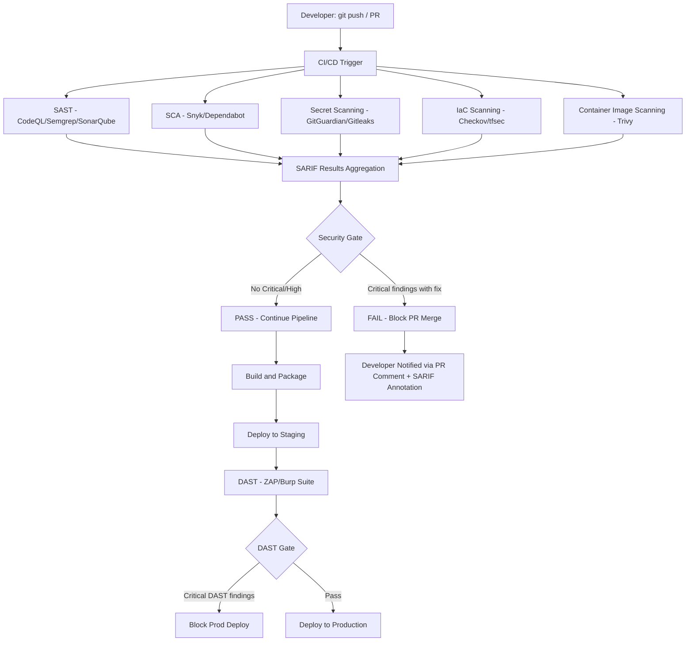

⚡ TL;DR - SAST (Static Application Security Testing) analyzes source code, bytecode,
or binary without executing it, finding security vulnerabilities during development
before they reach production. Key tools: Semgrep (open source, fast, pattern-based,
excellent for custom rules), SonarQube (quality + security combined, enterprise-wide
visibility), CodeQL (GitHub, semantic analysis across function boundaries - finds
data flow from source to sink). Integration point: pull request checks and CI/CD
pipeline gates. The critical principle is "shift-left": find vulnerabilities when
fixing them costs $100 (code review), not $10,000 (post-production breach). Pipeline
strategy: fail the build on Critical/High findings with available fixes (not on
all findings - false positive fatigue kills adoption). SARIF format: standardized
output format for IDE + CI integration. Complement with: SCA (Software Composition
Analysis - third-party dependency CVEs) and DAST (Dynamic Application Security
Testing - runtime testing). SAST finds what DAST misses (injection points in dead
code paths) and DAST finds what SAST misses (authentication/authorization flaws at
runtime). Together: 80%+ vulnerability coverage vs 40-50% for either alone.

---

| #105 | Category: Security | Difficulty: ★★★ |
|:---|:---|:---|
| **Depends on:** | OWASP Top 10, Authentication, Session Management, TLS Configuration, OAuth Security, Business Logic, Insufficient Logging, Log4Shell, Advanced JWT, Advanced XSS, SSRF, CVSS Scoring, CVE + NVD, IR Process, AWS Security Services, Kubernetes Security | |
| **Used by:** | Security Observability + SIEM, Security at Scale, DevSecOps Pipeline, Security Governance, SLSA Framework, Platform Security Engineering, SSDLC | |
| **Related:** | OWASP Top 10, Authentication, TLS Configuration, OAuth Security, Business Logic, Insufficient Logging, Log4Shell, Advanced JWT, Advanced XSS, SSRF, CVSS Scoring, CVE + NVD, IR Process, AWS Security Services, Kubernetes Security, Security Observability, Security at Scale, DevSecOps Pipeline, SLSA Framework, Platform Security | |

---

### 🔥 The Problem This Solves

**WHY SAST IS FOUNDATIONAL TO SHIFT-LEFT SECURITY:**

```
THE COST OF FINDING VULNERABILITIES LATE:

  IBM Systems Sciences Institute research on defect cost:
  
  Phase found  → Relative cost to fix
  ─────────────────────────────────────
  Requirements → 1x
  Design       → 3x
  Coding       → 6x
  Testing      → 10x
  Integration  → 15x
  Production   → 60-100x
  
  Security vulnerability example:
  SQL injection in the payment service.
  
  Found in code review (SAST): 30 minutes to fix.
    - Developer sees: "unsanitized input in SQL query at line 47"
    - Fixes: use parameterized query.
    - PR updated, no user impact, no breach.
    - Cost: ~$50 in developer time.
    
  Found in production after breach:
    - Incident response: 3 engineers × 24 hours = $7,200.
    - Forensics + external IR firm: $50,000.
    - Customer notification (if PII): $25,000.
    - Potential regulatory fine (GDPR): €10M or 2% of annual turnover.
    - Reputational damage: unmeasurable.
    - Actual remediation: still 30 minutes of developer time.
    
  The vulnerability fix: same cost.
  The surrounding cost: 1,000-100,000x higher in production.
  
WHAT SAST FINDS (that code review misses):

  Code review: humans reviewing changes in a PR.
  Effective for: design issues, obvious bugs, readability.
  Ineffective for: tracking data flow across 10 files and 3 library calls
  to find that user input ends up in an eval() without sanitization.
  
  SAST: traces data flow through the entire codebase.
  
  Example: CodeQL query for XSS (JavaScript):
  
    Source: req.body.username (user-controlled input)
    Flows through:
      getUserData(username)
      → queryDB(username)
      → sanitize(result)  ← CodeQL checks if sanitize() covers XSS
      → res.send(result)  ← Sink: HTML output
      
    If sanitize() doesn't encode HTML entities: CodeQL flags as XSS.
    Human code reviewer: would need to trace 4 files to find this.
    SAST: traces it in milliseconds across the entire codebase.
    
WHAT SAST DOES NOT FIND (requires DAST):

  Authentication bypass: SAST sees the code, not the running application.
  "Does sending an invalid JWT actually bypass auth?" - DAST only.
  Business logic flaws: "can a regular user view admin API endpoints?" - DAST.
  Configuration vulnerabilities: open S3 buckets, exposed debug endpoints - DAST.
  Race conditions in authentication: timing-dependent - DAST.
  
  SAST + DAST + SCA = comprehensive application security testing.
  SAST alone: 40-50% vulnerability coverage.
  SAST + DAST: 70-80% vulnerability coverage.
  SAST + DAST + SCA + pen test: 85-90% coverage.
```

---

### 📘 Textbook Definition

**SAST (Static Application Security Testing):** Analysis of source code, bytecode,
or compiled binaries for security vulnerabilities without executing the code.
Approaches: (1) Pattern matching (regex-like rules - fast, high false positives),
(2) Taint analysis (data flow from user-controlled sources to dangerous sinks),
(3) Abstract interpretation (models program behavior symbolically). Output: findings
with location (file, line), severity (Critical/High/Medium/Low), CWE mapping,
remediation advice. Standardized output: SARIF (Static Analysis Results Interchange
Format - JSON schema accepted by GitHub, GitLab, Azure DevOps).

**Shift-Left Security:** Moving security testing earlier in the Software Development
Lifecycle (SDLC). "Left" refers to earlier in the development timeline. Traditional:
security testing after feature development (pen test before release). Shift-left:
security testing at IDE (IDE plugins), at PR (SAST in CI), at build (dependency
scanning), at deployment (container scanning, IaC scanning). Each shift-left reduces
the cost and time to remediate vulnerabilities.

**Semgrep:** Open-source, polyglot static analysis tool that uses pattern-based rules.
Rules written in YAML with patterns that match code syntax tree patterns. Registry:
community rules, pro rules (paid). Language support: 30+ languages. Key advantage:
lightweight, fast (seconds per scan), easy custom rule creation. Integrates with
GitHub Actions, GitLab CI, pre-commit hooks. Findings: false positive rate varies by
rule quality. Use: Semgrep OSS for custom business logic rules and quick integration.

**SonarQube:** Enterprise-grade code quality and security analysis platform.
Supports 30+ languages. Quality Gates: configurable pass/fail criteria for CI/CD
integration. Security Hotspots: code requiring manual review vs Issues (definite findings).
Technical Debt: estimation of effort to fix quality issues. SonarLint: IDE plugin
providing real-time analysis. SonarCloud: SaaS version for cloud-native teams.

**CodeQL:** GitHub's semantic code analysis engine. Treats code as a database and uses
a declarative query language (QL) to express vulnerability patterns. Strength: cross-file,
cross-function data flow analysis. Finds: SQL injection, XSS, SSRF, path traversal,
command injection through complex data flows across multiple files. Integrated in
GitHub Advanced Security (GHAS). Public repos: free. Private repos: GHAS paid.

**SARIF (Static Analysis Results Interchange Format):** JSON-based format (OASIS Open
standard) for expressing static analysis results. Supported by: GitHub Code Scanning,
GitLab SAST, Azure DevOps, VS Code, JetBrains IDEs. Allows: multi-tool results in
one view, rule suppression tracking, location-based annotations in PR reviews.

**SCA (Software Composition Analysis):** Identifies known vulnerabilities in third-party
dependencies (open-source libraries). Tools: OWASP Dependency-Check, Snyk, Dependabot.
Queries: CVE/NVD database + OSS vulnerability databases. Different from SAST: SAST
finds vulnerabilities in YOUR code; SCA finds known CVEs in libraries you USE.

**DAST (Dynamic Application Security Testing):** Tests the running application by
sending crafted HTTP requests and analyzing responses. Tools: OWASP ZAP, Burp Suite
Professional, Nikto. Finds: authentication bypass, authorization flaws, runtime
misconfigurations, injection vulnerabilities that only manifest at runtime.

---

### ⏱️ Understand It in 30 Seconds

**One line:**
SAST is automated code review for security: it analyzes your source code without
running it to find SQL injection, XSS, hardcoded secrets, insecure cryptography,
and other vulnerability patterns - at PR time, before any code reaches production.

**One analogy:**
> SAST is like a spell-checker for security vulnerabilities.
>
> When you write an email, spell-check runs automatically in the background.
> You see the red underline IMMEDIATELY when you type a mistake.
> You don't wait until the email is sent to 10,000 recipients before discovering "recieve" is misspelled.
>
> SAST does the same for security vulnerabilities:
> - You type: `connection.query("SELECT * FROM users WHERE id=" + userId)`
> - SAST: immediately flags this as potential SQL injection (in IDE plugin mode)
> - Or: at PR creation, SAST blocks merge with "SQL injection at line 47"
>
> Like spell-check:
> - Not 100% accurate (false positives = "recieve" flagged but it's a proper noun)
> - Still enormously useful (catches 60-80% of common mistakes automatically)
> - Non-blocking in draft (warn mode) vs blocking at final review (fail PR mode)
> - Gets better with custom dictionaries (custom Semgrep rules for your business logic)
>
> The key analogy property:
> Spell-check catches things BEFORE the email is sent.
> SAST catches things BEFORE the code is in production.
> Once in production: fixing the bug costs 100x more than fixing it during writing.

---

### 🔩 First Principles Explanation

**How SAST engines work under the hood:**

```
SAST ENGINE APPROACHES:

  APPROACH 1: PATTERN MATCHING (simplest)
  
    Rule: detect string concatenation in SQL queries (Java):
    
    Pattern: "query" + (variable containing user input)
    
    Code:
    String sql = "SELECT * FROM users WHERE id=" + userId;  ← FLAGGED
    String sql2 = "SELECT * FROM users WHERE id=?";          ← OK
    
    Limitation: language-unaware. High false positive rate.
    "query" + variable could be a logging statement.
    Doesn't trace WHERE userId came from (maybe it's sanitized).
    
  APPROACH 2: TAINT ANALYSIS (intermediate)
  
    Taint analysis:
    1. Sources: identify user-controlled inputs
       (req.getParameter(), request.body, System.getenv(), etc.)
    2. Sinks: identify dangerous operations
       (query execution, eval(), exec(), innerHTML assignment)
    3. Propagation: track the taint as it flows through variables
    4. Sanitizers: identify sanitization functions
       (parameterizedQuery(), escapeHTML(), etc.)
    5. Finding: source → sink path without sanitizer = vulnerability
    
    Example (Semgrep taint mode):
    
    source: HttpServletRequest.getParameter(...)
    sink: Statement.execute(...)
    sanitizer: PreparedStatement.setString(...)
    
    userId = request.getParameter("id");     ← source (tainted)
    name = request.getParameter("name");     ← source (tainted)
    userId = Integer.parseInt(userId);       ← NOT a sanitizer
    sql = "SELECT * FROM users WHERE id=" + userId;  ← TAINTED
    stmt.execute(sql);                       ← sink reached with tainted data
    → FLAGGED as SQL injection
    
    stmt2.setString(1, name);               ← Sanitizer used
    → NOT flagged
    
  APPROACH 3: SEMANTIC ANALYSIS (CodeQL)
  
    CodeQL converts code to a relational database:
    - Functions, variables, expressions, control flow as database tables.
    - QL queries express vulnerability patterns as database queries.
    
    CodeQL query for reflected XSS (JavaScript):
    
    from RemoteFlowSource source, DomBasedXssSink sink
    where TaintTracking::localTaint(source, sink)
    select sink, "XSS: user input from $@ reaches DOM sink",
           source, "this user input"
    
    This finds: ANY path from user-controlled HTTP input to DOM sink
    across ANY number of function calls, files, or async operations.
    
    This is MORE powerful than taint analysis because:
    - Understands type system (sanitizers must return sanitized type)
    - Cross-file, cross-function data flow
    - Can model complex sanitizers correctly
    - Lower false positive rate than pattern matching
```

---

### 🧪 Thought Experiment

**SCENARIO: SAST catches a critical vulnerability in the payment service:**

```
CONTEXT: E-commerce platform, payment service in Java.
         SAST integrated in GitHub Actions CI.
         Pull Request: new feature - display order history.
         
DEVELOPER CODE (PR diff):
  
  @GetMapping("/orders/{userId}")
  public ResponseEntity<String> getOrders(
    @PathVariable String userId,
    HttpServletRequest request
  ) {
    // Build SQL query to get user's orders
    String sql = "SELECT * FROM orders WHERE user_id = '" 
                 + userId + "'";              // ← PROBLEM: SQLi
    List<Order> orders = jdbcTemplate.queryForList(sql, Order.class);
    
    // Return as HTML for display
    String html = "<ul>";
    for (Order o : orders) {
      html += "<li>" + o.getDescription() + "</li>";  // ← PROBLEM: XSS
    }
    html += "</ul>";
    
    return ResponseEntity.ok(html);
  }
  
SAST FINDINGS (SARIF output, displayed in GitHub PR):
  
  FINDING 1: CWE-89 SQL Injection [CRITICAL]
  File: src/main/java/OrderController.java, Line 14
  
  Message: User-controlled path variable 'userId' concatenated into SQL query.
  Attacker input: userId = "' OR '1'='1"
  Resulting query: SELECT * FROM orders WHERE user_id = '' OR '1'='1'
  Impact: Returns ALL orders for ALL users.
  
  Fix: Use parameterized queries:
    String sql = "SELECT * FROM orders WHERE user_id = ?";
    jdbcTemplate.queryForList(sql, Order.class, userId);
  
  FINDING 2: CWE-79 Cross-Site Scripting (XSS) [HIGH]
  File: src/main/java/OrderController.java, Line 19
  
  Message: Database-sourced value 'o.getDescription()' inserted into
  HTML response without encoding. If description was stored with
  malicious content (second-order XSS), attacker script executes.
  
  Fix: HTML-encode before insertion:
    html += "<li>" + StringEscapeUtils.escapeHtml4(o.getDescription()) + "</li>";
  
PIPELINE OUTCOME:
  
  CI/CD: SAST gate FAILED.
  Status check: "SAST - 2 findings: 1 Critical, 1 High. Blocking merge."
  Developer: notified in PR comments.
  Reviewer: cannot merge until findings are resolved.
  
  Developer: fixes both findings (30 min work).
  Re-runs CI: SAST passes.
  PR: merged safely.
  
WITHOUT SAST:
  Code merges. SQL injection deployed to production.
  Attacker: /orders/'+OR+'1'='1
  Response: ALL orders from ALL users (names, addresses, payment references).
  Breach. IR. $500K+ damage.
  
WITH SAST: $0 breach cost. 30 minutes developer time. PR blocked until fixed.
```

---

### 🧠 Mental Model / Analogy

> SAST tools have different strengths: think of them as different types of quality inspectors.
>
> **Semgrep = building inspector with a checklist:**
> Fast, checks specific patterns you define.
> "All fire doors must be in place." (Custom rule: no hardcoded passwords)
> Excellent for YOUR specific building codes (business-logic security rules).
> Limited to patterns you've defined - won't find things you didn't ask for.
> Speed: can inspect a 100-file building in seconds.
>
> **SonarQube = building quality + safety report card:**
> Covers both quality (code smells, complexity) and safety (security hotspots).
> Produces an overall quality gate score visible to the whole organization.
> "Building B is 92% compliant with our standards."
> Dashboard: management can see security posture across all projects.
> CISO-friendly: portfolio-level visibility.
>
> **CodeQL = structural engineer:**
> Deep analysis - doesn't just check patterns, understands the building's structure.
> "The load path from the 3rd floor through 2 intermediate beams to the foundation is compromised."
> (Data flow from HTTP request through 3 function calls to SQL sink.)
> Slower but more thorough. Finds complex vulnerabilities that pattern-based tools miss.
> Cross-file analysis = tracks problems across architectural components.
>
> **DAST = fire drill with a live building:**
> Tests what happens when you actually USE the building.
> "During the drill, the evacuation route on floor 5 is actually blocked."
> Finds runtime problems that static inspection can't detect.
> SAST says: "the code looks like it should work."
> DAST says: "when we actually sent the request, the session cookie was missing HttpOnly."
>
> Use all four: fast checklist (Semgrep) + quality report (SonarQube) + structural (CodeQL) + runtime (DAST).
> Each finds different vulnerabilities. Overlap is acceptable. Gaps are not.

---

### 📶 Gradual Depth - Five Levels

**Level 1 - What it is (anyone can understand):**
SAST is a tool that reads your code before you run it and looks for security problems, like SQL injection or cross-site scripting. Instead of waiting until your app is live (and possibly already attacked), SAST finds the problem in your code editor or when you submit a pull request - when it's cheapest and easiest to fix.

**Level 2 - How to use it (junior developer):**
Add Semgrep to your GitHub Actions workflow: `semgrep --config=auto --sarif --output=results.sarif`. Upload results with `github/codeql-action/upload-sarif`. GitHub displays findings as PR annotations. Set severity thresholds: fail PR on ERROR (Critical) findings, warn on WARNING (High/Medium). Suppress false positives with `# nosemgrep: rule-id` comment (tracked in SARIF). Install SonarLint IDE plugin for real-time feedback as you type. Run `trivy fs --severity CRITICAL,HIGH .` for dependency scanning (SCA).

**Level 3 - How it works (mid-level engineer):**
Semgrep workflow: parse source file into AST (Abstract Syntax Tree) → match patterns against AST nodes → report matches. Taint mode: mark sources (user input), propagate taint through variable assignments and function calls, report when tainted value reaches a sink without passing through a sanitizer. CodeQL: index codebase into CodeQL database (QL database = relational tables of AST nodes, data flow edges, call graph), run QL queries against the database, report results. SARIF output: JSON with `runs[].results[].locations[].physicalLocation.region` (line/column), `rules[].id` (rule ID mapping to CWE), `result.level` (error/warning/note). GitHub Code Scanning: ingests SARIF, creates check run, annotates PR diff, tracks dismissals.

**Level 4 - Why it was designed this way (senior/staff):**
The tension in SAST tool design: precision (fewer false positives) vs recall (fewer false negatives). Pattern-based tools (Semgrep): high recall, lower precision (many findings, some false positives). Semantic tools (CodeQL): higher precision, lower recall (fewer findings, but most are real). Organizations with low SAST maturity should start with pattern-based tools (Semgrep): fast to adopt, easy to configure, visible value quickly. As maturity grows: add semantic tools (CodeQL) for deeper analysis. The "fail the build" decision: failing on ALL findings → developer frustration → team disables SAST → security debt accumulates. Failing ONLY on Critical/High with available fixes: actionable findings, manageable PR workflow, trust builds. The false positive management lifecycle: initial scan → triage findings → suppress known false positives with justification (tracked in SARIF) → tune rules → re-scan. Do this quarterly. SAST rules need maintenance like any other code.

**Level 5 - Mastery (distinguished engineer):**
CodeQL data flow libraries: `DataFlow::Configuration` allows custom source/sink/sanitizer definitions for company-specific frameworks. Example: your internal DB library's `executeQuery(String)` is a sink that standard CodeQL doesn't know about → add custom sink in QL model. This dramatically reduces false negatives for internal frameworks. SAST in regulated environments (PCI DSS, SOC 2): SAST scan is a required evidence artifact. Each release: SAST scan report showing no outstanding Critical/High vulnerabilities (or documented risk acceptance). Security Hub + CodeQL integration: CodeQL findings in GitHub → Security Hub via AWS Security Hub GitHub integration → unified compliance posture. SLSA (Supply-chain Levels for Software Artifacts): SAST scan is one evidence artifact in the SLSA provenance chain (demonstrating that the code was scanned before artifact production). AI-assisted SAST: LLM-based tools (GitHub Copilot Autofix, Snyk Code) suggest fixes alongside findings - developer can apply one-click remediation. Reduces remediation time from hours to minutes for common finding types.

---

### ⚙️ How It Works (Mechanism)

```
SAST IN CI/CD PIPELINE:

  Developer
     ↓ git push / pull request
  CI/CD (GitHub Actions / GitLab CI / Jenkins)
     ↓
  ┌─────────────────────────────────────────────────────┐
  │ SECURITY SCANNING STAGE                              │
  │                                                     │
  │ 1. SAST (Source Code):                              │
  │    CodeQL / Semgrep / SonarQube                     │
  │    → SARIF results                                  │
  │                                                     │
  │ 2. SCA (Dependencies):                              │
  │    Snyk / Dependabot / OWASP Dependency-Check       │
  │    → CVE findings for your libraries                │
  │                                                     │
  │ 3. Secret Scanning:                                 │
  │    GitHub Secret Scanning / GitGuardian / Gitleaks  │
  │    → Hardcoded credentials, API keys                │
  │                                                     │
  │ 4. IaC Scanning:                                    │
  │    Checkov / Terrascan / tfsec                      │
  │    → Terraform/CloudFormation security issues       │
  │                                                     │
  │ 5. Container Image Scanning:                        │
  │    Trivy / Snyk Container / Amazon Inspector        │
  │    → CVEs in base images + OS packages              │
  └─────────────────────────────────────────────────────┘
     ↓
  SECURITY GATE EVALUATION:
  Critical findings with available fix? → FAIL (block merge)
  High findings? → FAIL or WARN (configurable)
  No Critical/High: → PASS
     ↓ (if PASS)
  Build, Test, Deploy pipeline continues
```



---

### 💻 Code Example

**SAST integration in GitHub Actions:**

```yaml
# .github/workflows/security-scan.yml
# SAST + SCA + Secret Scanning in CI/CD pipeline.

name: Security Scans

on:
  push:
    branches: [main, develop]
  pull_request:
    branches: [main]

jobs:
  # ── JOB 1: CodeQL (semantic SAST) ─────────────────────
  codeql-analysis:
    name: CodeQL SAST
    runs-on: ubuntu-latest
    permissions:
      actions: read
      contents: read
      security-events: write  # Required to upload SARIF

    strategy:
      matrix:
        language: [java]  # Adjust for your language

    steps:
    - name: Checkout repository
      uses: actions/checkout@v4

    - name: Initialize CodeQL
      uses: github/codeql-action/init@v3
      with:
        languages: ${{ matrix.language }}
        # Use standard query suite (includes OWASP Top 10):
        queries: security-extended

    - name: Build (required for compiled languages)
      run: mvn compile -q  # CodeQL needs compiled bytecode for Java

    - name: Perform CodeQL Analysis
      uses: github/codeql-action/analyze@v3
      with:
        category: "/language:${{ matrix.language }}"
        # Results uploaded automatically to GitHub Code Scanning

  # ── JOB 2: Semgrep (pattern SAST + custom rules) ──────
  semgrep:
    name: Semgrep SAST
    runs-on: ubuntu-latest
    permissions:
      security-events: write

    steps:
    - uses: actions/checkout@v4

    - name: Run Semgrep
      uses: returntocorp/semgrep-action@v1
      with:
        config: >-
          p/owasp-top-ten
          p/java
          p/secrets
          ./security/custom-semgrep-rules.yml  # Custom rules
        generateSarif: "1"
        # Fail on: error (Critical) and warning (High)
        auditOn: >
          push
          pull_request

    - name: Upload Semgrep SARIF
      uses: github/codeql-action/upload-sarif@v3
      if: always()
      with:
        sarif_file: semgrep.sarif
        category: semgrep

  # ── JOB 3: SCA (dependency vulnerabilities) ───────────
  dependency-check:
    name: Dependency Vulnerability Scan
    runs-on: ubuntu-latest

    steps:
    - uses: actions/checkout@v4

    - name: Run Snyk for Java dependencies
      uses: snyk/actions/maven@master
      env:
        SNYK_TOKEN: ${{ secrets.SNYK_TOKEN }}
      with:
        args: >
          --severity-threshold=high
          --sarif-file-output=snyk.sarif
      continue-on-error: true  # Collect findings, gate below

    - name: Upload Snyk SARIF
      uses: github/codeql-action/upload-sarif@v3
      if: always()
      with:
        sarif_file: snyk.sarif
        category: snyk-sca

  # ── JOB 4: Secret scanning (hardcoded credentials) ────
  secret-scan:
    name: Secret Scanning
    runs-on: ubuntu-latest

    steps:
    - uses: actions/checkout@v4
      with:
        fetch-depth: 0  # Full history for git-based secret scanning

    - name: Run Gitleaks
      uses: gitleaks/gitleaks-action@v2
      env:
        GITHUB_TOKEN: ${{ secrets.GITHUB_TOKEN }}
      # Gitleaks: scans git history for secrets
      # Fails if any secrets found (no threshold - zero tolerance)
```

```yaml
# security/custom-semgrep-rules.yml
# Custom Semgrep rules for application-specific security patterns.

rules:
  # Rule: detect logging of sensitive parameters
  - id: no-log-sensitive-params
    patterns:
      - pattern: log.$LEVEL($STR + $X + ...)
      - metavariable-regex:
          metavariable: $STR
          regex: ".*(password|secret|token|key|credential|ssn|card).*"
    message: >
      Possible sensitive data logged at $LEVEL.
      Logging passwords/secrets creates security exposure.
      Review and remove sensitive values from log statements.
    languages: [java]
    severity: WARNING
    metadata:
      cwe: CWE-532

  # Rule: detect MD5 / SHA1 usage for passwords (too weak)
  - id: no-weak-hash-for-passwords
    patterns:
      - pattern: MessageDigest.getInstance("MD5")
      - pattern: MessageDigest.getInstance("SHA-1")
      - pattern: MessageDigest.getInstance("SHA1")
    message: >
      MD5 and SHA-1 are cryptographically weak. Do not use for
      password hashing or integrity checking.
      Use: BCrypt, SCrypt, Argon2 for passwords.
      Use: SHA-256 or SHA-3 for integrity.
    languages: [java]
    severity: ERROR  # Critical: fail the build
    metadata:
      cwe: CWE-327
```

---

### ⚖️ Comparison Table

| Tool | Type | Approach | Speed | False Positives | Best For |
|:---|:---|:---|:---|:---|:---|
| **Semgrep** | SAST | Pattern-based + taint | Fast (seconds) | Medium | Custom rules, quick integration |
| **CodeQL** | SAST | Semantic / data flow | Slower (minutes) | Low | Cross-function vulnerability chains |
| **SonarQube** | SAST + Quality | Hybrid | Medium | Medium | Enterprise dashboards, quality + security |
| **Snyk Code** | SAST | AI-assisted + taint | Fast | Low-Medium | Developer-friendly, auto-fix suggestions |
| **OWASP ZAP** | DAST | HTTP fuzzing | Varies | Medium | Runtime, auth flaws, config issues |
| **Burp Suite** | DAST | Active scan | Slow | Low | Deep pen testing, manual + automated |
| **Snyk/Dependabot** | SCA | CVE database | Fast | Low | Known CVEs in dependencies |

---

### ⚠️ Common Misconceptions

| Misconception | Reality |
|:---|:---|
| "SAST produces too many false positives - it's not worth it." | The false positive problem is real but manageable. Untuned SAST on a large Java codebase using broad rules: 40-70% false positive rate. This is why SAST adoption fails. The fix: start with high-precision rulesets (CodeQL security-extended, Semgrep's curated OWASP rules) rather than every possible rule. Tune aggressively in the first 2 sprints: suppress known false positives with documented justification. Focus ONLY on Critical + High severity findings in the pipeline gate - Medium and Low can be in a dashboard for optional review. Goal: 10-15% false positive rate at the gate level. At this rate: every pipeline failure is likely a real issue. Developer trust in the tool increases. Disabling SAST because of false positives means your real vulnerabilities now go undetected permanently. A high false positive rate is a configuration problem, not an inherent SAST problem. |
| "SAST replaces security code review." | SAST and security code review are complementary, not alternatives. SAST excels at: finding known vulnerability patterns (SQL injection, XSS, path traversal, insecure deserialization) consistently at scale across every PR. SAST fails at: finding business logic flaws ("a regular user can access admin functionality by changing the `admin=false` parameter to `admin=true`"), missing authentication/authorization at the API design level, race conditions, and novel vulnerability classes not yet in rule databases. Security code review (by a human with security expertise) excels at: understanding the business logic, finding design-level flaws, identifying privilege escalation that requires understanding the system's authorization model. The ideal: SAST catches the boring, known-pattern vulnerabilities automatically so human code review can focus on the business logic and architectural security issues that tools can't find. SAST + security-focused code review = comprehensive coverage. Neither alone = incomplete. |

---

### 🚨 Failure Modes & Diagnosis

**Common SAST integration failure patterns:**

```
FAILURE 1: ALERT FATIGUE FROM TOO MANY FINDINGS

  Symptoms:
  - Team routinely dismisses SAST findings as "false positives"
  - PR merge blocked by 200 findings: team disables the gate
  - SAST tool runs but no one looks at the results
  
  Diagnosis:
  # Count findings by severity (SARIF):
  jq '.runs[].results | group_by(.level) |
      map({level: .[0].level, count: length})' results.sarif
  
  Fix:
  1. Start with ONLY Critical (error) gate. No High gate yet.
  2. Suppress all existing findings on first run (baseline).
     Only NEW findings block PRs.
  3. Each sprint: triage 10 suppressed findings.
     Real finding: fix it. False positive: suppress with justification.
  4. After 90 days: add High to gate.
  5. Never add Medium to blocking gate. Medium = dashboard only.
  
FAILURE 2: SAST TAKES 45 MINUTES (kills developer velocity)

  Symptoms:
  - Developers bypass: merge without waiting for SAST
  - CI/CD pipeline average duration > 20 minutes
  - SAST runs sequentially with build + test
  
  Fix:
  Run SAST in PARALLEL with build + test:
  
  CI pipeline:
    parallel:
      - build + unit tests
      - SAST scan (does not block build, only blocks deploy)
    merge result:
      - If build fails: stop
      - If SAST fails: stop
      - If both pass: deploy
  
  For large codebases: use incremental SAST (scan only changed files).
  Semgrep: `semgrep --include=$(git diff --name-only HEAD~1)`
  CodeQL: use code scanning default setup (incremental by default).
  
FAILURE 3: SAST NOT RUN ON DEPENDENCY UPGRADES

  Library: `com.fasterxml.jackson.core:jackson-databind:2.9.10`
  CVE: deserialization vulnerability (CVSS 9.8)
  
  SAST: scans your code. Does NOT scan library bytecode.
  SCA (Snyk/Dependabot): scans your pom.xml for CVEs in dependencies.
  
  If only SAST runs: the library CVE goes undetected.
  
  Fix: always run BOTH SAST (your code) and SCA (your dependencies).
  They cover different vulnerability domains.
  
USEFUL SARIF QUERIES:

  # Count Critical findings:
  jq '[.runs[].results[] | select(.level=="error")] | length' results.sarif
  
  # List unique rules triggered (for tuning):
  jq '[.runs[].results[].ruleId] | unique | sort[]' results.sarif
  
  # Find findings with no suppression justification:
  jq '.runs[].results[] |
    select(.suppressions != null) |
    select(.suppressions[].justification == null) |
    {rule: .ruleId, file: .locations[0].physicalLocation.artifactLocation.uri}' \
    results.sarif
```

---

### 🔗 Related Keywords

**Prerequisites:**
- `AWS Security Services` (SEC-103) - Security Hub ingests SAST SARIF findings
- `Kubernetes Security Fundamentals` (SEC-104) - container image scanning in CI pipeline

**Builds on this:**
- `DevSecOps Pipeline Design` (SEC-115) - SAST is one component of the full pipeline
- `SLSA Framework` (SEC-123) - SAST scan as supply chain security evidence
- `SSDLC` (SEC-129) - SAST as the primary Secure SDLC tool

---

### 📌 Quick Reference Card

```
┌─────────────────────────────────────────────────────────┐
│ TOOL CHOICE   │ Semgrep: custom rules, fast, easy        │
│               │ CodeQL: deep data flow, GitHub native    │
│               │ SonarQube: enterprise dashboards + CISO  │
├───────────────┼─────────────────────────────────────────┤
│ GATE STRATEGY │ FAIL: Critical with available fix        │
│               │ WARN: High / baseline new findings       │
│               │ DASHBOARD: Medium / Low                  │
├───────────────┼─────────────────────────────────────────┤
│ FALSE +VE     │ Start with baseline (suppress existing)  │
│               │ Triage 10/sprint → document suppressions │
│               │ Goal: < 15% false positive rate at gate  │
├───────────────┼─────────────────────────────────────────┤
│ OUTPUT FORMAT │ SARIF → GitHub Code Scanning / Security Hub│
│               │ Suppress with: # nosemgrep: rule-id     │
├───────────────┼─────────────────────────────────────────┤
│ SAST vs DAST  │ SAST: code-level, source to sink traces  │
│               │ DAST: runtime, auth/authz, config issues │
│               │ SCA: CVEs in third-party dependencies    │
└─────────────────────────────────────────────────────────┘
```

---

### 💎 Transferable Wisdom

**Reusable Engineering Principle:**
"Automate the detection of known-bad patterns so humans can focus on the novel."
Security code review is a scarce resource (trained security engineers are expensive
and rare). SAST automates detection of patterns that are well-understood and common
(SQL injection, XSS, path traversal, hardcoded secrets, weak cryptography).
These patterns appear repeatedly across every codebase, in every language.
They don't require judgment to identify once the pattern is known.
A Semgrep rule for SQL injection: defined once, runs on every PR, in every repo,
forever, for free (after the initial configuration cost).
A security engineer finding SQL injection in code review: $150/hour, requires
reading every changed file, can only review a fraction of PRs.
The calculus: automate detection of known patterns → human security review budget
shifts from "find the obvious bugs" to "find the architectural flaws."
This principle applies beyond security:
- Linting: automates detection of known style/quality issues.
- Type checking: automates detection of known type errors.
- Integration tests: automates detection of known regression patterns.
- Chaos engineering: automates detection of known resilience failures.
The theme: the more you automate detection of the known-bad,
the more human capacity you free for analysis of the unknown-hard.
Security debt accumulates fastest where known-bad patterns are not automatically caught.
SAST is a forcing function: known vulnerabilities CANNOT accumulate silently.

---

### 💡 The Surprising Truth

The most valuable use of Semgrep is NOT running the standard OWASP rules.
The standard rules find standard vulnerabilities: SQL injection, XSS.
Any mature Java project has already avoided these in their framework (Spring uses
parameterized queries by default, Thymeleaf auto-escapes by default).
The highest-value Semgrep rules are CUSTOM rules written for YOUR application.

Example: your company has a shared HTTP client library with a `makeRequest()` method.
Unknown to developers: `makeRequest()` follows redirects without verification (SSRF vector).
Standard CodeQL/Semgrep: has no rule for YOUR internal `makeRequest()`.
Custom Semgrep rule: "flag any call to `makeRequest()` where the URL comes from user input."

This finds SSRF vulnerabilities specific to your tech stack that no off-the-shelf
tool would catch.

The practice: Security engineers write custom Semgrep rules for each major security
bug found in pen tests or bug bounties. "We found SQL injection via our internal
query builder - now we write a Semgrep rule to find all other places this pattern exists."
This converts each discovered vulnerability into a permanently enforced prevention rule.
It's the application of "build the security control" rather than "fix the finding."

Netflix published their custom Semgrep rules on GitHub. Google publishes CodeQL queries.
The open-source security engineering community shares these patterns.
Building a library of custom rules specific to your tech stack: the SAST becomes
exponentially more valuable over time (unlike generic tools that have the same value
every day - custom rules grow richer with each discovered vulnerability class).

---

### ✅ Mastery Checklist

**You've mastered this when you can:**
1. **DISTINGUISH** SAST vs SCA vs DAST: SAST (your code, static), SCA (your dependencies, CVEs),
   DAST (running app, runtime behavior). All three cover different vulnerability domains.
2. **EXPLAIN** taint analysis: source (user input) → propagation through variables → sink
   (dangerous operation). Finding = source reaches sink without passing a sanitizer.
3. **DESIGN** a SAST gate strategy: fail on Critical/High (with available fix), warn on Medium,
   dashboard for Low. Baseline existing findings on first run to avoid developer revolt.
4. **IDENTIFY** the false positive management lifecycle: baseline → triage 10/sprint →
   document suppressions → tune rules → re-scan. Goal: < 15% false positive rate at gate.
5. **DESCRIBE** SARIF format and why it matters: standardized output → GitHub Code Scanning +
   Security Hub + IDE plugins all consume one format → unified vulnerability management.

---

### 🎯 Interview Deep-Dive

**Q: How would you integrate SAST into a CI/CD pipeline? What tool(s) would you choose?
How do you handle false positives? How do you avoid developer friction?**

*Why they ask:* Tests practical DevSecOps knowledge and ability to balance security
with developer velocity. Common in DevSecOps, security engineering, and staff/principal roles.

*Strong answer covers:*
- Tool selection rationale: CodeQL for semantic data flow (cross-function, cross-file),
  Semgrep for custom business-logic rules, SonarQube for CISO dashboard visibility.
  Not one tool vs another - complementary.
- Integration: GitHub Actions security-scan job running in PARALLEL with build/test.
  SARIF output uploaded to GitHub Code Scanning (or Security Hub).
  Code Scanning: findings as PR annotations - developer sees inline in the diff.
- Gate strategy: fail ONLY on Critical (error level) with available fixes.
  High findings: warn but don't block (initially). Add to gate after trust is established.
  Never block on Medium/Low - dashboard visibility only.
- False positive management: first run - baseline ALL existing findings (suppress all).
  Only NEW findings (introduced in this PR) can block. This is critical for adoption.
  Triage 10 suppressed findings per sprint. Documented justification required for suppressions.
  False positives get rule-level suppressions tracked in SARIF, reviewed quarterly.
- Avoiding friction: run SAST in parallel (doesn't add to pipeline time).
  Use incremental scanning (scan changed files only in PRs).
  Semgrep auto-fix + Snyk Code auto-fix: one-click remediation for common findings.
  SAST finding = blocked PR → developer sees inline annotation → clicks "apply fix" → pushes.
  Total friction: 2 minutes vs 30-minute code review cycle.