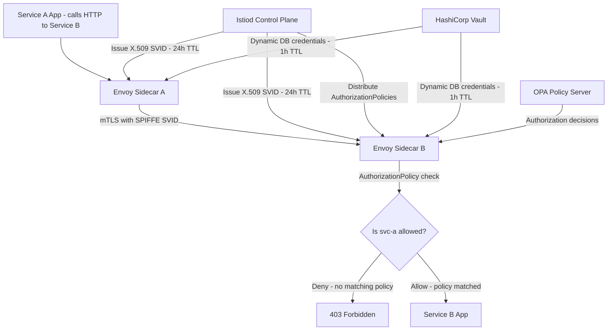

⚡ TL;DR - Security at scale is about maintaining security properties (confidentiality,
integrity, availability) as user count, service count, and data volume grow by orders
of magnitude. The fundamental shift: at 10 services, security can be configured manually.
At 100 services, manual configuration drifts. At 1,000 services, manual configuration
is impossible - security MUST be in the platform. Three scale dimensions: (1) User scale
(10x users → rate limiting, WAF throughput, DDoS capacity), (2) Service scale (100x
services → service mesh mTLS, zero-trust networking, SPIFFE/SPIRE identities), (3)
Data scale (1000x data → encryption key management scale, data classification,
access control at petabyte scale). Key solutions: WAF at edge (not per-service),
TLS termination at load balancer (TLS offloading - not in every microservice), service
mesh (Istio/Linkerd - mTLS between all services automatically), policy-as-code (OPA,
Cedar - authorization as a service, not per-service), secrets management (Vault - one
source of truth for all credentials, dynamic secrets). Security automation: automated
patching (SSM Patch Manager, Renovate), SIEM rules as code (SIGMA + CI/CD),
IAM policies generated from code (IaC), not hand-crafted.

---

| #107 | Category: Security | Difficulty: ★★★★ |
|:---|:---|:---|
| **Depends on:** | OWASP Top 10, Authentication, Session Management, TLS Configuration, OAuth Security, Business Logic, Insufficient Logging, CVSS Scoring, CVE + NVD, IR Process, Digital Forensics, AWS Security Services, Kubernetes Security, SAST in CICD, Security Observability + SIEM | |
| **Used by:** | DevSecOps Pipeline, Enterprise Security Architecture, Security Governance, Threat Intelligence Integration, CSIRT Design, Security Metrics + FAIR, SLSA Framework, Platform Security Engineering, Multi-Cloud Security, Build vs Buy Security, SIEM Architecture Design, SSDLC | |
| **Related:** | OWASP Top 10, Authentication, TLS Configuration, OAuth Security, Business Logic, Insufficient Logging, CVSS Scoring, CVE + NVD, IR Process, Digital Forensics, AWS Security Services, Kubernetes Security, SAST in CICD, Security Observability + SIEM, DevSecOps Pipeline, Enterprise Security Architecture, Security Governance, Threat Intelligence, CSIRT Design, Security Metrics, SLSA Framework, Platform Security, Multi-Cloud Security, SIEM Architecture | |

---

### 🔥 The Problem This Solves

**WHY SECURITY DOESN'T SCALE LINEARLY:**

```
THE SECURITY SCALE CLIFF:

  10 microservices:
    - Hand-configure TLS certificates on each: 2 days work.
    - Hand-configure IAM policies for each: 3 days work.
    - Review logs manually daily: 1 hour.
    - Applies security patches monthly: 2 hours.
    Total: manageable by 1 security engineer.
    
  100 microservices:
    - Hand-configure TLS certificates: 20 days work → NEVER DONE.
    - Hand-configure IAM policies: 30 days work → NEVER DONE.
    - Review logs manually: 10 hours daily → IMPOSSIBLE.
    - Apply security patches monthly: 20 hours → PARTIAL COVERAGE.
    Result: configuration drift, certificate expiry, over-permissive IAM,
    missed patches, log gaps.
    1 in 10 services will have a security misconfiguration at any time.
    
  1,000 microservices:
    - Manual security configuration: COMPLETELY IMPOSSIBLE.
    - Certificate expiry: multiple services go down monthly (they forgot).
    - IAM: copy-paste wildcard policies everywhere.
    - Logs: nobody looks at 90% of services.
    - Patches: 6-month lag on critical CVEs.
    Security posture: worse than 10-service startup.
    
  THE SOLUTION: SECURITY AS PLATFORM, NOT CONFIGURATION.
  
  At 1,000 services, security must be:
  - AUTOMATIC: no manual configuration per service.
  - ENFORCED: services cannot be deployed without security controls.
  - OBSERVABLE: all 1,000 services log to a single aggregated SIEM.
  - AUDITABLE: all configurations are code (IaC, RBAC policies).
  
  The scale security controls:
  
  Scale dimension → Security control
  ─────────────────────────────────────────────────────────
  10x users      → WAF at edge (not per-service rate limiting)
                 → TLS offloading at load balancer
                 → DDoS protection (Shield Advanced)
                 → CDN with security headers (CloudFront)
  
  100x services  → Service mesh mTLS (Istio/Linkerd)
                 → SPIFFE/SPIRE workload identity
                 → Policy-as-code (OPA, Cedar)
                 → Centralized secrets (Vault dynamic creds)
  
  1000x data     → Encryption at rest everywhere (KMS-managed)
                 → Data classification (Macie, custom)
                 → Fine-grained access control (ABAC)
                 → Data lineage + audit (Immuta, BigID)
```

---

### 📘 Textbook Definition

**WAF Throughput at Scale:** Web Application Firewall performance measured in Gbps
(throughput) and RPS (requests per second). AWS WAF: 10,000+ RPS per WebACL.
Cloudflare WAF: no stated limit (anycast distributed). At scale: WAF must be at the
EDGE (CDN/load balancer layer), not per-service. Architectural consideration: WAF rule
processing adds latency (5-15ms per request). At high throughput: rule complexity
matters. Managed rule groups (OWASP): 10-15ms. Custom complex rules: 30ms+.

**TLS Offloading:** Terminating TLS at the edge (load balancer, CDN) and forwarding
decrypted traffic internally. Benefits: reduces TLS handshake CPU cost on application
servers, enables HTTP/2 multiplexing, simplifies certificate management. Risk: internal
network is unencrypted (mitigated by: private network, mTLS for service-to-service,
or TLS re-encryption to backend). At scale: centralized certificate management
(AWS ACM, Let's Encrypt + cert-manager) vs per-server cert management.

**Service Mesh (Istio/Linkerd):** Infrastructure layer for service-to-service communication
in microservices. Security capabilities: mTLS between all services (automatic, no app
code changes), RBAC at L7 (which service can call which endpoint), traffic policies,
observability (distributed tracing, service metrics). The mTLS mechanism: each pod
has an Envoy sidecar that intercepts all network traffic, establishes mTLS using
SPIFFE-issued X.509 certificates. Certificate rotation: automatic (24-hour SVID TTL).

**SPIFFE (Secure Production Identity Framework For Everyone):** CNCF standard for
workload identity. Each service gets a SPIFFE ID: `spiffe://company.com/service/payment-api`.
Issued as X.509 SVID (SPIFFE Verifiable Identity Document) by SPIRE (SPIFFE Runtime Environment).
SVIDs rotate automatically. Services authenticate using SVID, not long-lived service accounts.
Eliminates: hardcoded credentials, long-lived service account tokens.

**Zero Trust Networking (ZTN):** Network architecture where no implicit trust is granted
based on network location. Every connection must be: authenticated (who is the caller?),
authorized (is the caller permitted to access this resource?), and encrypted.
Traditional perimeter model: "inside the firewall = trusted." ZTN: "inside the firewall = untrusted
by default." BeyondCorp (Google): pioneered ZTN. NIST SP 800-207: zero trust architecture spec.
Implementation: service mesh mTLS (encryption + authentication), OPA/RBAC (authorization),
device trust (MDM), identity-based policies.

**Policy-as-Code:** Expressing and enforcing authorization policies as code (version-controlled,
tested, deployed). Tools: OPA (Open Policy Agent) with Rego language, Cedar (AWS Verified
Permissions language), Kyverno (Kubernetes admission policies). Benefits: policies are
auditable, reviewable, testable, and consistent across all services. Alternative: per-service
authorization logic → inconsistent policies, no central visibility.

**HashiCorp Vault:** Secrets management platform with: dynamic secrets (generate
database credentials per request, revoke after use), lease-based secrets (automatic
expiry), audit log (every secret access logged), encryption-as-a-service (Transit
engine - app encrypts/decrypts without seeing the key), PKI engine (issue X.509 certs
on demand). At scale: Vault serves as the single source of truth for all credentials
across an organization. Eliminates: hardcoded credentials, static passwords in
CI/CD pipelines, manually rotated service account passwords.

**SecOps Maturity Model:** Framework for assessing and improving security operations capabilities.
Levels: (1) Ad hoc (manual, reactive), (2) Managed (processes documented, SIEM deployed),
(3) Defined (detection engineering, SOAR automation), (4) Quantitatively managed (MTTD/MTTR
measured, compliance automated), (5) Optimizing (continuous improvement, threat intel driven,
red team exercises). CMMI-based. Most organizations: Level 2-3. Target for enterprise: Level 4+.

---

### ⏱️ Understand It in 30 Seconds

**One line:**
Security at scale shifts from "configure each service securely" (10 services = possible)
to "build a platform that makes security automatic and unavoidable" (1,000 services = required).

**One analogy:**
> Security at scale is like building codes for a city vs. a house.
>
> One house: the owner can personally decide where every fire extinguisher goes,
> check every wire connection, and test every smoke detector.
> Personalized, manual, thorough.
>
> A city of 50,000 buildings: the city's building inspectors cannot personally
> audit every electrical connection. IMPOSSIBLE.
> Solution: BUILDING CODES.
> Rules that EVERY building must follow, enforced at permit time.
> Fire marshal: inspects that codes were followed, not every connection.
> The PLATFORM enforces security: the architect doesn't choose "sprinklers: yes or no."
> Sprinklers above the minimum area: REQUIRED. No opt-out.
>
> Kubernetes + Kyverno (admission policies) = building codes.
> "All pods must have resource limits." → Enforced at deploy time. No exceptions without review.
> "All images must be from our trusted registry." → Enforced. No exceptions.
> "All network traffic must use mTLS." → Istio sidecar injection: automatic.
>
> Service mesh = fire suppression system built into the infrastructure.
> The developer doesn't configure TLS per service. The PLATFORM provides TLS.
> Developer: writes application code. Platform: provides security controls.
>
> Vault = city water infrastructure.
> Each building doesn't dig its own well and manage its own water supply.
> The city provides water infrastructure. Buildings connect to it.
> Vault: provides secrets infrastructure. Services connect to it.
> "Need a database credential? Call Vault API. Get a 1-hour dynamic credential. Use it. Auto-expires."
> Nobody maintains a static password spreadsheet.

---

### 🔩 First Principles Explanation

**How security controls evolve with scale:**

```
SCALE DIMENSION 1: USER SCALE (10x → 1000x users)

  CONTROL: Rate limiting
  
  10,000 users: per-service rate limiting (Spring Bucket4j).
    Each service: 100 req/minute per user.
    Code in each service: manageable.
    
  1,000,000 users: per-service rate limiting breaks.
    Each service has different limits (inconsistent).
    Rate limit state: in-memory (not shared across pods).
    Pod A: allows request. Pod B: allows same user again.
    Effective limit: N × configured limit (N = pod count).
    
  Solution: centralized rate limiting at API gateway / WAF.
    AWS WAF rate-based rules: applied per IP, per 5-minute window.
    API Gateway usage plans: per API key (authenticated users).
    Redis-backed distributed rate limiter: shared state across all pods.
    
  CONTROL: TLS
  
  10 services: each manages its own Let's Encrypt cert.
  100 services: cert-manager (Kubernetes) issues certs from Let's Encrypt.
    Problem: Let's Encrypt has a rate limit of 50 certs/domain/week.
    Solution: AWS ACM (unlimited certs) + wildcard certs.
  1,000 services: service mesh (Istio) issues short-lived certs (24h SVIDs)
    from its internal CA. Cert rotation: automatic. No manual renewal.
    
SCALE DIMENSION 2: SERVICE SCALE (10 → 1000 services)

  CONTROL: Service-to-service authentication
  
  10 services: shared secret (API key stored in environment variable).
    Problem: secret rotation = update all services simultaneously.
    
  100 services: per-service API keys in Vault.
    Rotation: Vault handles it. Services refresh automatically.
    But: static secrets still exist (even if rotated).
    
  1,000 services: dynamic secrets + workload identity (SPIFFE/SPIRE).
    No static secrets. Each request: service proves identity via X.509 SVID.
    Istio: enforces mTLS automatically. Developer: writes no auth code.
    
  CONTROL: Authorization (who can call what)
  
  10 services: per-service authorization logic in code.
    if (user.role == "admin") { allowAccess(); }
    
  100 services: authorization library (shared code).
    Consistent logic. Still: deployed in each service.
    Policy change: redeploy 100 services.
    
  1,000 services: external authorization (OPA / Cedar).
    Single OPA deployment serves authorization decisions for all services.
    Policy change: update OPA policy (no service redeployment).
    Centralized: consistent across all 1,000 services.
    Auditable: one place to see all authorization policies.
    
SCALE DIMENSION 3: DATA SCALE (1TB → 1PB)

  CONTROL: Encryption key management
  
  1 TB: single CMK in KMS encrypts all data.
    Single key: key material accessible to broad principal.
    
  10 TB: per-service CMK (payment service: own key, user service: own key).
    Key compromise: limits to one service's data.
    
  1 PB: per-tenant CMK (SOC 2 requirement for SaaS).
    Key rotation per tenant: quarterly.
    Customer-managed keys (BYOK): customer controls their data.
    Encryption key hierarchy: CMK → DEK (data encryption key) → field-level encryption.
```

---

### 🧪 Thought Experiment

**SCENARIO: Security fails to scale - what breaks first:**

```
COMPANY: SaaS startup, growing from 10,000 to 1,000,000 users over 2 years.
         Engineering: 5 → 200 engineers. Services: 10 → 300 microservices.
         
WHAT THEY KEPT FROM STARTUP PHASE (that doesn't scale):

  Pattern 1: Hardcoded credentials in CI/CD pipelines
  
    startup@scale: 10 repos, 10 database passwords, managed manually.
    300 services: 300 repos, 300+ passwords, 15 database clusters.
    Reality: passwords not rotated since launch (18 months).
    Breach risk: one stolen CI/CD token = 300 hardcoded credentials.
    
  Pattern 2: Per-service TLS certificate management
  
    startup: 3 engineers, each knows their 3-4 services.
    300 services: 4 certificates expired last month (ops was busy).
    Payment service cert: expired on Saturday. Payments failed 4 hours.
    Monitoring: did not alert on cert expiry (too early for monitoring).
    Cost: $300,000 in lost transactions. SLA breach.
    
  Pattern 3: Manual IAM policy review
  
    startup: 2-week security review for new IAM roles.
    300 services: IAM policies generated by ChatGPT and never reviewed.
    Audit finding: 40 IAM roles with s3:* on all S3 buckets.
    PCI DSS auditor: this violates least privilege. Failure.
    Remediation: 6-month effort to right-size 300 IAM roles.
    
  Pattern 4: SIEM with no alert tuning
  
    startup: 100 alerts/day. Reviewed manually.
    300 services + 1M users: 8,000 alerts/day. 2 analysts.
    Review rate: 12% of alerts. 88% auto-closed.
    Real breach: alert fires Day 45. Reviewed: Day 46 (in the queue).
    By day 47: attacker had exfiltrated 500,000 customer records.
    
WHAT THEY NEEDED INSTEAD:
  
  Pattern 1 → Vault dynamic secrets:
    service requests credential at startup → Vault issues 1-hour DB credential.
    No static credential. No rotation needed. Automatic.
    
  Pattern 2 → cert-manager + ACM:
    cert-manager automatically renews Let's Encrypt certs 30 days before expiry.
    ACM wildcard certs for all internal services.
    Alert: cert < 14 days from expiry.
    
  Pattern 3 → IaC-generated IAM + automated least privilege:
    All IAM policies generated from Terraform (source of truth).
    IAM Access Analyzer: flags over-permissive policies.
    SAST rule: flag `s3:*` in any IAM policy.
    PR review required for IAM policy changes.
    
  Pattern 4 → Alert triage SLA + SOAR:
    Gate: only High/Critical → page.
    SOAR: routine responses automated (IP block, account lock).
    Target: < 50 actionable alerts per analyst per day.
    Measure: MTTD weekly. Investigate if > 4 hours.
```

---

### 🧠 Mental Model / Analogy

> Security at scale is like the difference between home cooking and industrial food production.
>
> Home cooking (10 services):
> You personally ensure every ingredient is fresh. You know where every knife is.
> You taste every dish. You are the quality control.
>
> Industrial kitchen (1,000 services):
> You cannot personally taste every dish (10,000/day).
> You CANNOT rely on "every chef checks their ingredients."
> Instead: HACCP (Hazard Analysis Critical Control Points) = process controls.
> "At this point in production, temperature MUST be above 165°F."
> "This ingredient MUST be sourced from certified suppliers."
> "This step REQUIRES two-person verification."
> The PROCESS enforces food safety. Individual chef vigilance doesn't scale.
>
> Security at scale works the same way:
> You cannot rely on "every developer configures their service securely."
> You MUST enforce: "at this point in deployment, TLS MUST be configured" (cert-manager).
> "This image MUST be from a trusted registry" (Kyverno admission policy).
> "This IAM role MUST follow least privilege" (IAM Access Analyzer in CI/CD).
> "This service MUST use mTLS for all internal calls" (Istio service mesh).
>
> The PLATFORM enforces security controls.
> Individual developer vigilance: still valuable, but not sufficient and not scalable.
> Shift the question from "did this developer remember to configure TLS?"
> to "can this service deploy without TLS?" (answer: NO, the platform prevents it).

---

### 📶 Gradual Depth - Five Levels

**Level 1 - What it is (anyone can understand):**
When a company grows from 10 services to 1,000 services, security has to change completely. You can't manually check each service anymore. Instead, you build security into the infrastructure itself - like having a building code that forces every building to have fire sprinklers, rather than hoping every architect remembers. The main tools: service mesh (automatic encryption between all services), Vault (central password manager for all services), and policy-as-code (automated enforcement of security rules).

**Level 2 - How to use it (junior developer):**
Enable Istio (service mesh) in your Kubernetes cluster: automatic mTLS between all pods. Use Vault agent sidecar or External Secrets Operator for credentials - never hardcode secrets. Use cert-manager for automatic TLS certificate renewal (never let a cert expire manually). Deploy OPA sidecar for authorization decisions: `kubectl annotate service my-api opa-injection: enabled`. Use AWS ACM for all load balancer certs (free, auto-renewed). Enable AWS WAF on your ALB with OWASP managed rules. Configure CloudFront in front of your ALB for DDoS protection and TLS offloading.

**Level 3 - How it works (mid-level engineer):**
Istio mTLS: Envoy proxy (sidecar) intercepts all pod network traffic. On service startup: Istiod (control plane) issues a SPIFFE X.509 SVID to each pod's Envoy. Envoy presents its SVID during TLS handshake. Both sides verify each other's SVID against Istiod's CA (mutual TLS). AuthorizationPolicy CRD: "service A can call service B's /api/payments endpoint via POST." No app code changes needed. Vault dynamic secrets: service calls Vault API → Vault calls RDS API → creates a new PostgreSQL user with limited grants → returns username/password → TTL: 1 hour → after TTL: Vault revokes the user. OPA policy server: service makes HTTP POST to OPA (`/v1/data/authz/allow`) with context (user, action, resource) → OPA evaluates Rego policy → returns `allow: true/false`. Service uses the decision (but OPA doesn't enforce - enforcement is in the service or Envoy). Rate limiting: AWS WAF rate-based rule → 1,000 requests per 5-minute window per IP → blocks IP for 5 minutes when exceeded.

**Level 4 - Why it was designed this way (senior/staff):**
The service mesh design choice (sidecar vs eBPF): Istio's original sidecar model (Envoy per pod) adds: pod startup overhead (1-2s), memory footprint (50-100MB per pod), CPU overhead (1-3% per pod). At 10,000 pods: significant cost. Ambient mesh (Istio 1.21+): eBPF-based node-level mTLS without sidecar. Same security properties, 50-70% less overhead. Trade-off: ambient mesh is newer (less mature), sidecar is proven. Vault HA architecture: active-standby with Raft consensus. Vault single point of failure: if Vault is down, no service can start (credential fetch fails). Mitigation: Vault agent cache (in-memory credential caching in the sidecar, serves requests while Vault is briefly unavailable), Vault Enterprise (multi-cluster replication, disaster recovery). OPA vs Cedar: OPA (Rego language) is expressive but Rego has a learning curve. Cedar (AWS, 2023) is newer, formal verification built-in (mathematically proveable that a policy never grants unintended access). Cedar: smaller attack surface (restricted language, no Turing-completeness). Trade-off: Cedar's formal verification provides stronger correctness guarantees but with a less expressive language.

**Level 5 - Mastery (distinguished engineer):**
The "secure by default" platform design principle in practice: every platform API that engineers call should have security properties that CANNOT be disabled without explicit, reviewed override. Example: the internal HTTP client library (`HttpClient`). Default configuration: TLS certificate validation ON, mTLS with Istio SVID, request timeout: 30 seconds, retry: with jitter, no retry on 401/403. To disable cert validation: must call `HttpClient.builder().dangerouslyDisableCertValidation(Justification.of("CUST-12345"))`. The `Justification` object creates an audit trail. No `dangerouslyDisable()` call can be silent. This is how Google designs internal libraries: the "safe by default" API principle. At 1,000 services: the security team can't audit every HTTP call. But they CAN audit all `dangerouslyDisable()` calls (via code search, SAST rules). Reducing the audit surface from "every HTTP call" to "every override of a security default" is a 100-1000x reduction in what security must review. Platform security engineering: the discipline of building platforms (libraries, infrastructure, toolchains) where the default path is the secure path and the insecure path requires intentional deviation that leaves an auditable trail.

---

### ⚙️ How It Works (Mechanism)

```
ZERO TRUST SERVICE-TO-SERVICE (ISTIO + SPIFFE):

  Service A pod                    Service B pod
  ┌─────────────────────┐         ┌─────────────────────┐
  │  App Container      │         │  App Container      │
  │  HTTP to :8080 ─────┼─→       │                     │
  ├─────────────────────┤         ├─────────────────────┤
  │  Envoy Sidecar      │         │  Envoy Sidecar      │
  │  SVID: svc-a cert   │         │  SVID: svc-b cert   │
  │  mTLS handshake ─── ┼──mTLS───┼─ verify svc-a SVID  │
  │  Present svc-a cert │         │  AuthzPolicy: allow? │
  │                     │         │  → allow if match    │
  └─────────────────────┘         └─────────────────────┘
         ↑                                  ↑
  Istiod (control plane): issues SVIDs, distributes AuthorizationPolicies
```



---

### 💻 Code Example

**Istio AuthorizationPolicy + OPA policy-as-code + Vault dynamic secrets:**

```yaml
# istio-auth-policy.yaml
# Istio L7 AuthorizationPolicy: only payment-service can call
# /api/v1/charge on order-service. All other callers: denied.

apiVersion: security.istio.io/v1beta1
kind: AuthorizationPolicy
metadata:
  name: order-service-auth
  namespace: production
spec:
  selector:
    matchLabels:
      app: order-service
  action: ALLOW
  rules:
  - from:
    - source:
        # Only payment-service SPIFFE identity allowed:
        principals:
          - "cluster.local/ns/production/sa/payment-service-sa"
    to:
    - operation:
        methods: ["POST"]
        paths: ["/api/v1/charge"]

---
# Default deny (no ALLOW policy match = denied):
apiVersion: security.istio.io/v1beta1
kind: AuthorizationPolicy
metadata:
  name: deny-all
  namespace: production
spec:
  # No selector = applies to all services in namespace.
  # No rules = deny all (only ALLOW policies above can grant access).
  {}
```

```rego
# opa/policy/authz.rego
# OPA policy for fine-grained API authorization.
# Called via HTTP: POST /v1/data/authz/allow

package authz

import future.keywords.if

default allow := false

# Allow: user with required permission calls the endpoint
allow if {
    # Input structure:
    # {"user": {"id": "u123", "roles": ["analyst"]},
    #  "action": "read",
    #  "resource": {"type": "report", "owner_id": "u123"}}
    
    has_permission(input.user, input.action, input.resource)
}

# Permission: user is the resource owner (read their own data)
has_permission(user, "read", resource) if {
    resource.owner_id == user.id
}

# Permission: admin can read any resource
has_permission(user, "read", _) if {
    "admin" in user.roles
}

# Permission: analyst can read reports but not PII fields
has_permission(user, "read_report", resource) if {
    "analyst" in user.roles
    resource.type == "report"
    # PII fields are filtered server-side based on this role
}

# DENY: analysts cannot read PII directly
deny[reason] if {
    "analyst" in input.user.roles
    input.resource.type == "pii"
    reason := "Analysts are not permitted to access raw PII data."
}
```

```hcl
# vault-policy.tf
# Vault policy: payment-service gets a 1-hour PostgreSQL credential.
# No static credentials anywhere.

# Vault database secret engine (PostgreSQL):
resource "vault_database_secret_backend_role" "payment_service_role" {
  backend = "database"
  name    = "payment-service-db-role"
  db_name = "postgresql"

  # These SQL statements are run by Vault to create/revoke creds:
  creation_statements = [
    "CREATE USER \"{{name}}\" WITH ENCRYPTED PASSWORD '{{password}}' VALID UNTIL '{{expiration}}';",
    "GRANT SELECT, INSERT, UPDATE ON TABLE orders, payments TO \"{{name}}\";"
    # Minimal grants: only the tables this service needs.
  ]

  revocation_statements = [
    "REVOKE ALL ON ALL TABLES IN SCHEMA public FROM \"{{name}}\";",
    "DROP USER IF EXISTS \"{{name}}\";"
  ]

  default_ttl = "1h"   # Credential expires after 1 hour
  max_ttl     = "4h"   # Maximum even if renewed
}

# Vault policy: payment-service can ONLY access its own role:
resource "vault_policy" "payment_service" {
  name = "payment-service"

  policy = <<-EOT
    path "database/creds/payment-service-db-role" {
      capabilities = ["read"]
    }
    # No other paths: cannot read other services' credentials.
  EOT
}

# Kubernetes auth: payment-service ServiceAccount → Vault policy:
resource "vault_kubernetes_auth_backend_role" "payment_service" {
  backend                          = "kubernetes"
  role_name                        = "payment-service"
  bound_service_account_names      = ["payment-service-sa"]
  bound_service_account_namespaces = ["production"]
  token_policies                   = ["payment-service"]
  token_ttl                        = 3600  # Vault token TTL: 1 hour
}
```

---

### ⚖️ Comparison Table

| Approach | Works at 10 Services | Works at 100 Services | Works at 1000 Services | Key Tool |
|:---|:---|:---|:---|:---|
| **Manual TLS cert management** | Yes | Partially (drift) | No (cert expiry incidents) | cert-manager / ACM |
| **Per-service rate limiting** | Yes | Partially (inconsistent) | No (bypass via multiple pods) | WAF / API Gateway |
| **Hardcoded credentials** | Yes (painful) | No (rotation impossible) | No (breach vector) | Vault dynamic secrets |
| **Per-service authz code** | Yes | Partially (inconsistent) | No (policy drift) | OPA / Cedar |
| **mTLS (Istio/Linkerd)** | Overkill | Beneficial | Required | Service mesh |
| **Manual IAM policy review** | Yes | Partially (backlog) | No (incomplete) | IaC + Access Analyzer |

---

### ⚠️ Common Misconceptions

| Misconception | Reality |
|:---|:---|
| "Service mesh adds too much complexity and overhead for our scale." | The overhead argument is real but context-dependent. Istio sidecar: 50-100MB RAM per pod, 1-3% CPU, 5ms average latency increase. At 100 pods: meaningful cost. However, the ALTERNATIVE at scale is: each development team manually implements mTLS, certificate rotation, service authentication, and L7 traffic policies in their service. This "alternative" means: inconsistent implementations, security gaps, certificate expiry incidents, and no centralized visibility. The comparison is not "service mesh vs nothing" - it's "service mesh vs 100 teams implementing their own TLS and authentication." At 100 services: service mesh almost always wins. At 10 services: the overhead may genuinely not be worth it (use API keys + application-level TLS). The break-even: typically around 20-30 services where the operational complexity of manual security exceeds the complexity of running a service mesh. Cilium (eBPF-based): achieves most service mesh security properties with significantly lower overhead (no sidecar, kernel-level processing). The complexity-vs-security trade-off shifts as tooling matures. |
| "Dynamic secrets (Vault) solve the secret management problem completely." | Dynamic secrets solve the ROTATION problem: credentials are short-lived, automatically revoked, never static. But they introduce new failure modes: (1) Vault availability: if Vault is unavailable when a service starts, the service cannot get credentials and fails to start. Mitigation: Vault agent with cache, multi-cluster Vault. (2) Vault becomes a critical single point of failure for ALL services. A Vault outage cascades: all services that need to renew credentials fail simultaneously. This is a "correlated failure" risk that static credentials don't have (static credentials survive Vault outage for their remaining TTL). (3) The Vault bootstrap problem: to authenticate to Vault, each service needs some initial identity (SPIFFE/SPIRE SVID, or Kubernetes ServiceAccount token). This initial identity mechanism must be secured correctly or it becomes the new attack vector. Dynamic secrets: better than static credentials. Not zero risk. Understand the new failure modes you're accepting. |

---

### 🚨 Failure Modes & Diagnosis

**Scale security diagnostic checks:**

```
CERTIFICATE EXPIRY CHECK (catch before production impact):

  # Kubernetes cert-manager: list certs expiring in 14 days:
  kubectl get certificates -A -o json | jq -r \
    '.items[] | 
     select(.status.notAfter != null) |
     select((
       (.status.notAfter | fromdateiso8601) - now
     ) < 1209600) |  # 14 days in seconds
     "\(.metadata.namespace)/\(.metadata.name): expires \(.status.notAfter)"'
  
  # Direct cert check on endpoints:
  echo | openssl s_client -connect api.example.com:443 2>/dev/null | \
    openssl x509 -noout -dates
  # notAfter=Jan 15 2025: if < 30 days from now, investigate

VAULT HEALTH CHECK:

  # Vault status:
  vault status
  # Initialized: true. Sealed: false. Active Node: true.
  
  # Vault audit log: who accessed what in last hour:
  vault audit list
  # If audit disabled: FINDING - all secret access is unlogged.
  
  # Check for orphaned Vault leases (secrets not properly revoked):
  vault list sys/leases/lookup/database/creds/payment-service-db-role/
  # Large number = services not revoking on shutdown (credential leak)

ISTIO MTLS VERIFICATION:

  # Check mTLS mode in namespace:
  kubectl get peerauthentication -n production
  # Expected: STRICT mode (all traffic must be mTLS)
  # If none: traffic may be unencrypted between pods
  
  # Verify mTLS between two services:
  istioctl authn tls-check payment-service.production.svc.cluster.local
  # Output: HOST, STATUS, SERVER, CLIENT
  # STATUS should be OK (mTLS enforced both directions)
  
  # Check which services have AuthorizationPolicies:
  kubectl get authorizationpolicies -A
  # Namespace with NO policies: all traffic allowed (zero trust not enforced)

OPA AUTHORIZATION AUDIT:

  # Test OPA policy before deployment:
  opa test ./opa/policy/ -v
  # All tests must pass before policy deployment to production
  
  # OPA decision log analysis:
  # Review denied requests: patterns may indicate misconfigurations
  cat /var/log/opa/decisions.jsonl | \
    jq 'select(.result.allow == false) | 
        {user: .input.user.id, action: .input.action, resource: .input.resource.type}' | \
    sort | uniq -c | sort -rn | head 20
  # Top denied patterns: legitimate gaps or misconfigurations?
```

---

### 🔗 Related Keywords

**Prerequisites:**
- `AWS Security Services` (SEC-103) - AWS primitives for scale
- `Kubernetes Security Fundamentals` (SEC-104) - K8s as the security platform
- `Security Observability + SIEM` (SEC-106) - observability at scale

**Builds on this:**
- `DevSecOps Pipeline Design` (SEC-115) - operationalizing security at scale
- `Platform Security Engineering` (SEC-124) - building the security platform
- `Multi-Cloud Security` (SEC-125) - scale across cloud providers
- `SIEM Architecture Design` (SEC-128) - SIEM at petabyte scale

---

### 📌 Quick Reference Card

```
┌──────────────────────────────────────────────────────────┐
│ USER SCALE    │ WAF at edge (not per-service)            │
│               │ TLS offloading at load balancer          │
│               │ CDN + Shield for DDoS                    │
├───────────────┼──────────────────────────────────────────┤
│ SERVICE SCALE │ Service mesh mTLS (Istio/Linkerd)        │
│               │ SPIFFE/SPIRE workload identity           │
│               │ Policy-as-code (OPA/Cedar)               │
│               │ Vault dynamic secrets (no static creds)  │
├───────────────┼──────────────────────────────────────────┤
│ DATA SCALE    │ Per-service CMK (not shared)             │
│               │ Field-level encryption for PII           │
│               │ Data classification (Macie + custom)     │
├───────────────┼──────────────────────────────────────────┤
│ AUTOMATION    │ cert-manager (auto TLS renewal)          │
│               │ IaC-generated IAM (no manual policies)   │
│               │ SOAR (automated incident response)       │
│               │ Automated patching (SSM/Renovate)        │
├───────────────┼──────────────────────────────────────────┤
│ KEY PRINCIPLE │ Default = secure. Override = auditable.  │
│               │ Platform enforces. Developer doesn't opt-in│
└──────────────────────────────────────────────────────────┘
```

---

### 💎 Transferable Wisdom

**Reusable Engineering Principle:**
"The most dangerous security gap is not the one you can see, it's the one you can't
see because you're not looking there."
At scale, the most dangerous vulnerabilities are not the ones in your most-monitored,
most-critical services. They're in the "forgotten" service that was spun up 2 years ago,
has 3,000 users, nobody owns it in the current org structure, and it hasn't been
patched since it was deployed.
This is the "long tail" security problem. Your critical services are well-monitored.
Your 800th microservice: probably not.
The solutions:
(1) Inventory automation: every service must be registered in the service catalog.
    Services not in the catalog: cannot receive production traffic (enforced at platform level).
(2) Security posture scoring: each registered service has a security score.
    Score components: last security scan date, active CVEs, certificate expiry,
    IAM policy age, last code deployment. Low score → automatic ticket to the owning team.
(3) Blast radius minimization: each service has minimal privileges and minimal network access.
    The forgotten service: if compromised, cannot reach the payment service.
(4) Automated patching: OS-level (SSM Patch Manager), container base images (Renovate),
    and dependencies (Dependabot) are automatically updated.
    Human decision required: ONLY for breaking changes. Routine patches: automated.
The "forgotten service" principle is a forcing function for organizational security hygiene:
if any service CAN be forgotten, some WILL be forgotten.
Design your platform so that "forgotten" = "taken offline" (no traffic), not "silently vulnerable."

---

### 💡 The Surprising Truth

The Google BeyondCorp network (the origin of zero trust) was built after the Aurora attacks (2010).
The attacks compromised Google systems by targeting employees' Windows laptops via a
browser exploit, then using internal network trust to reach other systems.
The key insight from Aurora: the assumption "if you're on the corporate network, you're trusted"
was fundamentally broken. Any device on the network (including a compromised laptop)
could reach production systems.

BeyondCorp's radical solution: remove the concept of a trusted network entirely.
EVERY access request - whether from a corporate office, home WiFi, or a coffee shop -
is treated IDENTICALLY: authenticate the device, authenticate the user, check device health
(MDM compliance, OS version, endpoint security software), then grant minimum required access.

The 5-year BeyondCorp rollout result: Google engineers access corporate resources
from personal coffee shop WiFi with the same security properties as from HQ.
The building firewall: now irrelevant to security (all traffic is authenticated end-to-end).
The "VPN" concept: obsolete (all traffic goes through the same zero trust access proxy).

This is why every major cloud provider now has a zero trust product:
- Google: BeyondCorp Enterprise.
- Microsoft: Zero Trust + Conditional Access.
- AWS: Verified Access (zero trust for AWS applications).
- Cloudflare: Access.

But the practical implication for enterprise engineers:
You don't need BeyondCorp to adopt zero trust principles.
Start with: require MFA everywhere, RBAC + least privilege, network segmentation
(no flat internal network), and SPIFFE-based workload identity.
These four controls eliminate most of the attack surface that BeyondCorp was designed to close.
Full zero trust: a destination. These four controls: meaningful progress today.

---

### ✅ Mastery Checklist

**You've mastered this when you can:**
1. **DESCRIBE** the three scale dimensions (user, service, data) and the security control that
   addresses each: WAF/rate limiting (user), service mesh + policy-as-code (service),
   encryption key hierarchy + data classification (data).
2. **EXPLAIN** why service mesh (Istio/Linkerd) solves the per-service TLS problem:
   automatic mTLS via SPIFFE SVIDs, no app code changes, centralized AuthorizationPolicy.
3. **COMPARE** static vs dynamic secrets (Vault): static = long-lived, rotation risk, breach persists.
   Dynamic = short-lived, automatically revoked, breach limited to TTL. Trade-off: Vault availability.
4. **DESCRIBE** the "platform enforces, developer doesn't opt-in" security principle:
   secure defaults, auditable overrides. Application: Kyverno admission policies (pods can't deploy
   without security context), Istio AuthorizationPolicy (default-deny), cert-manager (auto-renewal).
5. **IDENTIFY** the long-tail security problem: forgotten/unowned services are the highest-risk
   attack vector at scale. Solution: service registry enforcement, automated posture scoring, blast radius minimization.

---

### 🎯 Interview Deep-Dive

**Q: How does security change as a system grows from 10 to 1,000 microservices?
What breaks first? What architectural changes are needed?**

*Why they ask:* Tests staff/principal-level thinking about security architecture,
not just individual security controls. Common in senior/staff/principal engineering
interviews and security architecture roles.

*Strong answer covers:*
- What breaks first: manual processes (certificate management, credential rotation, IAM review).
  Configuration drift. The "long tail" of forgotten services.
- User scale (10x): move rate limiting from per-service to centralized (WAF, API Gateway).
  TLS offloading at load balancer. CDN + Shield for DDoS.
- Service scale (100x): service mesh (Istio) for automatic mTLS between all services.
  SPIFFE/SPIRE for workload identity (no static service account passwords).
  OPA/Cedar for centralized authorization (one policy server vs per-service authz code).
  Vault for dynamic secrets (no static credentials in env vars or CI/CD pipelines).
- Data scale (1000x): per-service CMK (not shared encryption keys), field-level encryption for PII,
  data classification (Macie + custom classifiers), ABAC (attribute-based access control) for row-level security.
- The key shift: from "developer configures security per service" to "platform enforces security,
  developer can't opt out." Kyverno admission policies: enforce PSS Restricted, image pinning,
  resource limits. Istio: automatic mTLS. cert-manager: automatic cert renewal. Service registry:
  unregistered services can't receive traffic.
- Metric to track: MTTD (Mean Time to Detect). If growing services and MTTD increases: logging and
  detection coverage not keeping pace with service growth. Fix: require new services to onboard to
  SIEM logging before production traffic is allowed.