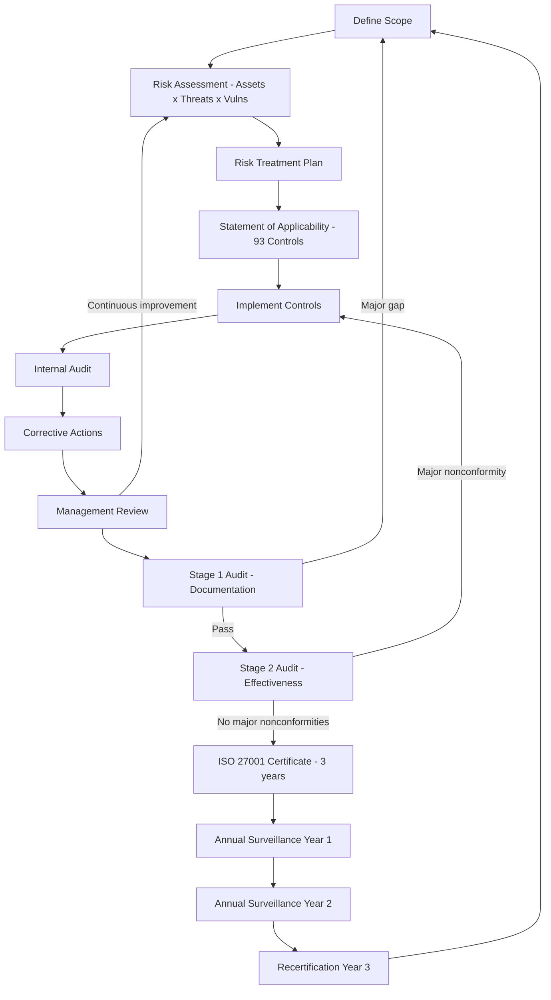

⚡ TL;DR - ISO 27001 is the international standard for Information Security Management
Systems (ISMS). It defines HOW to manage information security systematically, not just
what controls to implement. Core structure: Clauses 4-10 (mandatory requirements: context
of organization, leadership, planning, support, operation, performance evaluation,
improvement) + Annex A (93 controls in ISO 27001:2022 across 4 themes: Organizational,
People, Physical, Technological). Key process: (1) Define scope (which systems/data are
in scope?), (2) Risk assessment (identify, analyze, evaluate risks), (3) Select controls
from Annex A (and document WHY each control was included or excluded in the Statement of
Applicability), (4) Implement controls, (5) Audit and improve. Certification process:
Stage 1 audit (documentation readiness) → Stage 2 audit (controls operating effectively,
3-day minimum) → Surveillance audits annually → Recertification every 3 years. ISO 27001
vs SOC 2: ISO 27001 is international standard with formal certification body accreditation.
SOC 2 is a US audit standard (AICPA) - attestation by auditor, not certification. ISO 27001:
stronger globally recognized credibility. SOC 2: standard in US SaaS market.

---

| #108 | Category: Security | Difficulty: ★★★ |
|:---|:---|:---|
| **Depends on:** | OWASP Top 10, Authentication, Session Management, TLS Configuration, OAuth Security, Business Logic, Insufficient Logging, CVSS Scoring, CVE + NVD, IR Process, AWS Security Services, SAST in CICD, Security Observability + SIEM, Security at Scale | |
| **Used by:** | SOC 2 Type II, DevSecOps Pipeline, Enterprise Security Architecture, Security Governance, Security Metrics + FAIR, Platform Security Engineering, Multi-Cloud Security, Build vs Buy Security, SIEM Architecture Design, SSDLC | |
| **Related:** | OWASP Top 10, Authentication, TLS Configuration, OAuth Security, Business Logic, Insufficient Logging, CVSS Scoring, CVE + NVD, IR Process, AWS Security Services, SAST in CICD, Security Observability + SIEM, Security at Scale, SOC 2 Type II, Enterprise Security Architecture, Security Governance, Security Metrics | |

---

### 🔥 The Problem This Solves

**WHY ISO 27001 EXISTS:**

```
THE ENTERPRISE SECURITY CHAOS PROBLEM:

  WITHOUT A FORMAL SECURITY MANAGEMENT SYSTEM:
  
  Company A: "We use HTTPS everywhere - we're secure."
  Company B: "We do annual pen tests - we're secure."
  Company C: "Our engineers are security-aware - we're secure."
  
  None of these companies know:
  - Which assets contain sensitive data (no asset inventory).
  - What their top 5 security risks are (no risk register).
  - Who is responsible for security in each business unit (no RACI).
  - Whether their security controls are actually working (no metrics).
  - What to do when a breach occurs (untested IR plan).
  - Whether their third-party suppliers are secure (no vendor assessment).
  
  Result: when a breach occurs, the response is:
  "We didn't know that data was there."
  "We didn't know that system was accessible externally."
  "We thought IT was handling that."
  "Our backup wasn't working - we didn't know."
  
  ISO 27001 forces organizations to answer these questions BEFORE a breach:
  
  Asset inventory: what do we have? Where is the sensitive data?
  Risk assessment: what are the top threats to these assets?
  Risk treatment: what controls reduce these risks to acceptable levels?
  Statement of Applicability: which Annex A controls do we use and why?
  Management review: is security working? What needs to improve?
  Internal audit: are controls actually being followed?
  
THE CUSTOMER TRUST PROBLEM:
  
  Enterprise customer: "We need to share our customer data with your SaaS platform.
  What security guarantees do you provide?"
  
  Without certification: "Trust us, we're secure."
  Customer: not acceptable. Cannot sign contract.
  
  With ISO 27001 certification:
  "We have ISO 27001 certification from accredited body BSI. Certificate number: 12345.
  Our ISMS covers all systems that process your data. Annual surveillance audits confirm
  our controls are effective. Our last audit was November 2024. No non-conformities."
  Customer: objective evidence of systematic security management. Contract signed.
  
  ISO 27001: converts "trust us" into "third-party verified security management."
  The certification body: independent auditor assessing control effectiveness.
  The certificate: time-bound evidence (valid 3 years, annual surveillance required).
```

---

### 📘 Textbook Definition

**ISO 27001:** An international standard (ISO = International Organization for Standardization)
specifying requirements for an Information Security Management System (ISMS). Published by
ISO/IEC jointly. Current version: ISO 27001:2022. Certification: granted by accredited
certification bodies (BSI, Bureau Veritas, SGS, TÜV, LRQA) following a formal audit process.
A management system standard: defines the PROCESS for managing security, not the technical
controls directly (those are in Annex A).

**ISMS (Information Security Management System):** The systematic approach to managing
information security risks - the people, processes, and technology that protect an organization's
information assets. The ISMS is the framework ISO 27001 describes. Scope: the ISMS scope
defines which organizational units, systems, processes, and physical locations are covered by
the certification.

**Annex A Controls (ISO 27001:2022):** 93 controls across 4 themes (previously 114 controls
in 14 domains in the 2013 version). The 4 themes in :2022:
- **5. Organizational controls:** 37 controls. Policies, roles, supplier security, threat intel, incident management.
- **6. People controls:** 8 controls. Screening, training, disciplinary process, remote working.
- **7. Physical controls:** 14 controls. Physical perimeters, clean desk, equipment security.
- **8. Technological controls:** 34 controls. Access control, cryptography, network security, SIEM, DLP.

**Risk Assessment:** ISO 27001 Clause 6.1.2 requires: identify information security risks (assets
× threats × vulnerabilities), analyze risk likelihood and impact, evaluate which risks need treatment.
Risk treatment options: Mitigate (implement control), Accept (management sign-off), Transfer (insurance/contract),
Avoid (stop the activity). ISO 27001 does not prescribe a risk scoring methodology - qualitative
(High/Medium/Low) or quantitative (FAIR) are both acceptable.

**Statement of Applicability (SoA):** A required document listing all 93 Annex A controls with
justification for inclusion or exclusion. For each control: "included" (with implementation description)
or "excluded" (with documented justification). The SoA is the bridge between risk assessment results
and control implementation. Auditors review the SoA to verify that the controls match the identified risks.

**Certification Audit:** A two-stage formal audit by an accredited certification body.
Stage 1 (documentation review, 1-2 days): is the ISMS documented correctly? Does the SoA exist?
Are policies in place? Stage 2 (operational effectiveness, 3+ days): are the controls actually
working? Testing: interviews of staff, reviewing evidence of control operation, testing access controls,
reviewing incident records, sampling audit logs. Certificate validity: 3 years from Stage 2 completion.
Annual surveillance audits: confirm continued compliance between certifications.

**Plan-Do-Check-Act (PDCA) Cycle:** The continual improvement model underlying ISO 27001.
Plan: establish ISMS, define scope, risk assess, select controls.
Do: implement and operate controls.
Check: monitor, audit, measure effectiveness.
Act: improve based on findings. Repeat.

**Non-conformity:** A finding from an internal or external audit where a required control is
not implemented or not operating as documented. Minor non-conformity: the control exists but
has a gap. Major non-conformity: the control is completely missing or systematically failing.
Major non-conformities: prevent or suspend certification until resolved.

---

### ⏱️ Understand It in 30 Seconds

**One line:**
ISO 27001 is a systematic framework for managing information security risks: define what's
in scope, assess risks to your assets, implement and document controls (from 93 Annex A options),
get independently audited, and continuously improve - the result is a certified ISMS that
gives customers and regulators objective evidence that you manage security systematically.

**One analogy:**
> ISO 27001 is to information security what ISO 9001 is to quality management.
>
> A manufacturing company can say "our products are high quality" without evidence.
> OR it can achieve ISO 9001 certification, which proves:
> - They have documented quality management processes.
> - They systematically identify quality risks.
> - They implement controls and measure their effectiveness.
> - An independent auditor verified all of this is actually working.
>
> ISO 27001 does the same for information security:
> "We take security seriously" (no evidence) vs.
> "We have ISO 27001 certification from BSI, certificate number 12345,
>  covering all systems that process your data, last audited November 2024,
>  zero major non-conformities." (objective evidence)
>
> The ISMS (Information Security Management System) = the quality management system for security.
> Annex A controls = the quality procedures (what must be done and how).
> Risk assessment = the quality risk analysis (what can go wrong?).
> SoA = the quality plan (which procedures apply to our context?).
> Certification audit = ISO quality auditor visiting your facility.
>
> The PDCA cycle runs underneath both:
> Plan → Do → Check → Act → Plan (continuously improving).
> ISO 27001 is not a one-time event. Certification: lasts 3 years.
> Annual surveillance: confirms you're still doing what you said.
> You can't achieve ISO 27001, put the certificate on the wall, and stop.

---

### 🔩 First Principles Explanation

**ISO 27001 structure and implementation requirements:**

```
ISO 27001:2022 - CLAUSE STRUCTURE (all mandatory):

  Clause 4: Context of the Organization
    4.1 Understanding the organization and its context
        (what internal/external factors affect information security?)
    4.2 Understanding the needs of interested parties
        (customers, regulators, suppliers, employees - what do they expect?)
    4.3 Determining the scope of the ISMS
        (what IS and IS NOT included in the certification scope?)
    4.4 Information security management system
        (establish, implement, maintain, continuously improve the ISMS)
    
    PRACTICAL OUTPUT:
    - Scope document: "The ISMS covers the SaaS platform product,
      including all AWS infrastructure in us-east-1 and eu-west-1,
      the engineering, operations, and customer success teams.
      Excluded: HR systems, financial systems."
    
  Clause 5: Leadership
    5.1 Leadership and commitment
        (top management must actively support the ISMS)
    5.2 Policy
        (information security policy must be approved by top management)
    5.3 Organizational roles, responsibilities, and authorities
        (CISO, data owners, system owners clearly defined)
    
    PRACTICAL OUTPUT:
    - Information Security Policy approved and signed by CEO.
    - CISO appointed with documented authority.
    - Data Owner for each data classification defined.
    
  Clause 6: Planning
    6.1.2 Risk assessment process
    6.1.3 Risk treatment
    6.2 Information security objectives
    6.3 Planning of changes
    
    PRACTICAL OUTPUT:
    - Risk register: 50-100 risks identified, scored, treated.
    - Risk treatment plan: which controls mitigate which risks.
    - Statement of Applicability (SoA): 93 controls, each included or excluded.
    - Security objectives: measurable targets (MTTD < 24h, patch Critical CVEs < 48h).
    
  Clause 7: Support
    Resources, competence, awareness, communication, documented information.
    
    PRACTICAL OUTPUT:
    - Security awareness training: all staff, annually.
    - Security policy communications: all staff read and acknowledged.
    - Document control: policies versioned, reviewed annually.
    
  Clause 8: Operation
    8.1 Operational planning and control
    8.2 Information security risk assessment (performed regularly)
    8.3 Information security risk treatment
    
    PRACTICAL OUTPUT:
    - Annual risk assessment cycle.
    - Vulnerability management program (scan, remediate, track).
    - Change management for security-relevant changes.
    - Supplier assessment: security reviews for third parties.
    
  Clause 9: Performance Evaluation
    9.1 Monitoring, measurement, analysis, evaluation
    9.2 Internal audit
    9.3 Management review
    
    PRACTICAL OUTPUT:
    - Internal audit program: annual, covers all ISMS scope.
    - Management review: quarterly, reviews metrics, audit findings.
    - Security metrics dashboard: MTTD, MTTR, patch compliance rate,
      training completion rate, risk register changes.
    
  Clause 10: Improvement
    10.1 Continual improvement
    10.2 Nonconformity and corrective action
    
    PRACTICAL OUTPUT:
    - Non-conformity register: audit findings tracked to closure.
    - Corrective action process: root cause → corrective action → verify.
    - Improvement opportunities: lessons from incidents → ISMS updates.

ANNEX A CONTROLS (ISO 27001:2022) - KEY SELECTION:

  ORGANIZATIONAL (5.1 - 5.37):
    5.1  Information security policies ← MANDATORY in practice
    5.2  Roles and responsibilities ← required
    5.7  Threat intelligence
    5.19 Information security in supplier relationships ← high priority
    5.23 Information security for use of cloud services (NEW IN 2022)
    5.28 Collection of evidence ← links to IR process
    5.30 ICT readiness for business continuity ← DR/BCP
    
  PEOPLE (6.1 - 6.8):
    6.1 Screening ← background checks before hire
    6.3 Information security awareness training ← annual, mandatory
    
  PHYSICAL (7.1 - 7.14):
    7.2 Physical entry ← physical access controls
    7.12 Cabling security ← physical network protection
    
  TECHNOLOGICAL (8.1 - 8.34):
    8.2  Privileged access rights ← IAM least privilege
    8.5  Secure authentication ← MFA requirement
    8.7  Protection against malware ← endpoint protection
    8.8  Management of technical vulnerabilities ← patch management
    8.12 Data leakage prevention ← DLP (NEW IN 2022)
    8.15 Logging ← audit logging (links to SEC-106)
    8.16 Monitoring activities ← SIEM (links to SEC-106)
    8.24 Use of cryptography ← encryption standards
    8.25 Secure development lifecycle ← SSDLC (links to SEC-129)
    8.28 Secure coding ← SAST (links to SEC-105)
    8.34 Protection of information systems during audit ← testing controls
```

---

### 🧪 Thought Experiment

**SCENARIO: ISO 27001 certification process from zero to certificate:**

```
COMPANY: 80-person B2B SaaS startup, processing enterprise customer data.
         Reason for certification: losing deals to ISO 27001-certified competitors.
         Timeline: 9-12 months to certification.
         
MONTH 1-2: GAP ASSESSMENT AND SCOPE DEFINITION

  Hire ISO 27001 consultant (or experienced CISO).
  Conduct gap assessment against all clauses and Annex A controls.
  
  Gap assessment findings:
  - No formal asset inventory → HIGH GAP
  - No documented risk assessment process → HIGH GAP
  - Access control review: never done → HIGH GAP  
  - Supplier security assessment: not done → MEDIUM GAP
  - Security training: ad hoc → MEDIUM GAP
  - Incident response plan: informal → MEDIUM GAP
  - Logging: incomplete → MEDIUM GAP
  - Encryption policy: not documented → LOW GAP
  
  Scope definition (important decision):
  "ISMS scope: SaaS platform product and associated infrastructure.
   In scope: engineering, DevOps, customer success.
   Out of scope: HR system, internal financial systems."
  
  LESSON: narrow scope is faster to certify but less credible.
  Enterprise customers often ask: "is your HR data in scope?"
  If not: their employee data may transit your HR system. Gap.
  
MONTH 3-5: RISK ASSESSMENT AND SOA

  Asset inventory: list all information assets (systems, databases, data flows).
  Risk assessment: for each asset, identify threats and vulnerabilities.
  
  Example risk register entry:
  Asset: Production database (customer data)
  Threat: Unauthorized access by external attacker
  Vulnerability: Weak IAM policies, no MFA on DB admin access
  Likelihood: Medium (3/5)
  Impact: High (5/5)
  Risk score: 15/25 = HIGH
  Treatment: Implement MFA for all admin DB access (control 8.2, 8.5)
             Implement quarterly access reviews (control 5.2)
  Residual risk after controls: Medium (3/5 × 3/5 = 9/25)
  
  Statement of Applicability (SoA): 93 controls reviewed.
  Included: 78 controls (document why each is included).
  Excluded: 15 controls (document why each is excluded).
  Example exclusion: "Control 7.14 (Secure disposal of equipment):
   Excluded. All infrastructure is cloud-based (AWS). No physical
   equipment owned by the organization. AWS data destruction handled
   by AWS under shared responsibility model."
   
MONTH 6-9: CONTROL IMPLEMENTATION

  Priority: implement controls addressing HIGH risks first.
  
  Implementation projects:
  - MFA for all privileged access (8.5): 2 weeks. [Done Month 6]
  - Asset inventory tool (ServiceNow): 4 weeks. [Done Month 7]
  - Security awareness training platform (KnowBe4): 2 weeks. [Done Month 6]
  - Supplier assessment process: 3 weeks. [Done Month 7]
  - SIEM deployment (Elastic): 8 weeks. [Done Month 9]
  - Vulnerability management (Qualys): 4 weeks. [Done Month 8]
  - Incident response plan: documented and tested (tabletop exercise). [Done Month 9]
  
MONTH 9-10: INTERNAL AUDIT

  Internal auditor (not involved in ISMS implementation) conducts audit.
  Interviews: 20 staff across engineering, ops, customer success.
  Evidence review: training completion records, access logs, change management tickets.
  
  Internal audit findings:
  - Minor non-conformity: 3 user accounts with admin access have no MFA.
    (Control 8.5 implemented but 3 legacy accounts missed.)
  - Minor non-conformity: supplier assessment not completed for 2 vendors.
    (Assessment process implemented but not applied to existing vendors.)
  
  Corrective actions: resolve before Stage 2 audit.
  Resolution: MFA enforced for all 3 accounts, 2 supplier assessments completed.
  
MONTH 11: STAGE 1 AUDIT (Documentation Review - 2 days)

  Certification body auditor: reviews ISMS documentation.
  - ISMS scope document: PASS
  - Information security policy: PASS
  - Risk assessment methodology: PASS
  - Statement of Applicability: PASS (all 93 controls addressed)
  - Internal audit evidence: PASS
  
  One observation (not a non-conformity):
  "Risk assessment does not include data flow diagrams for all critical systems.
   Recommend adding for completeness before Stage 2."
  
  Action: add data flow diagrams in 2 weeks.
  
MONTH 12: STAGE 2 AUDIT (Effectiveness - 4 days)

  Day 1: Technical controls testing (auditor interviews ops team, reviews logs)
  Day 2: Process controls (change management, access reviews, supplier management)
  Day 3: People controls (security training records, hiring/offboarding)
  Day 4: Closing meeting and findings presentation
  
  Findings:
  - No major non-conformities.
  - 2 minor non-conformities (corrective action plan required within 3 months).
  - 5 observations (improvement opportunities, no corrective action required).
  
  CERTIFICATION ISSUED: ISO 27001:2022 certificate, valid 3 years.
  Next: annual surveillance audits (Year 1, Year 2).
  Recertification audit: Year 3.
```

---

### 🧠 Mental Model / Analogy

> ISO 27001 is a management system, not a checklist.
>
> The key mental model mistake: "we implement the 93 Annex A controls and we're done."
> This treats ISO 27001 as a compliance checklist. Wrong.
>
> The correct mental model: ISO 27001 is a management system (like TQM, like Six Sigma).
> The 93 controls are potential tools. You choose which ones apply to YOUR risks.
> The ISMS is the system that continuously evaluates and improves your security posture.
>
> The risk assessment is the heart of the ISMS:
> "What risks do we face? Which are most severe? Which controls reduce those risks?
>  Have we implemented those controls? Are they working? What's our residual risk?"
>
> This cycle runs continuously:
> New threat intelligence: reassess risks.
> New product launch: reassess risks for new scope.
> Breach at a peer company: reassess risks for similar attack vector.
> New regulation: reassess scope and controls.
>
> The distinction between ISO 27001 and individual security controls:
> SEC-101 (IR Process) = one security control.
> SEC-106 (SIEM) = one security control.
> ISO 27001 = the management system that ensures these controls are selected appropriately,
>             implemented correctly, operating effectively, and continuously improving.
>
> A company can deploy a world-class SIEM and still fail ISO 27001 if:
> - The SIEM is not in the ISMS scope.
> - No risk was identified that the SIEM addresses (risk assessment gap).
> - The SIEM deployment is not documented in the SoA.
> - SIEM alerts are not reviewed within defined SLAs (operational effectiveness failure).
> - Management has not reviewed SIEM effectiveness in the management review cycle.
>
> ISO 27001 connects the dots between individual controls and a coherent, auditable,
> continuously improving security program.

---

### 📶 Gradual Depth - Five Levels

**Level 1 - What it is (anyone can understand):**
ISO 27001 is an internationally recognized certificate that proves your company has a formal, systematic process for managing information security. It's not about having specific technology - it's about having a documented process for identifying security risks, implementing controls to manage those risks, and continuously improving. Companies get certified because enterprise customers require it as proof that their data will be handled securely.

**Level 2 - How to use it (junior developer):**
As a developer: (1) Complete annual security awareness training (ISO 27001 Clause 7.3, Control 6.3 - required for certification). (2) Follow the secure development lifecycle (SSDLC) documented in your company's security policies. (3) Report security incidents through the official incident reporting process (do not handle alone). (4) Complete access reviews when notified (quarterly): confirm you still need each system access you have. (5) Follow the clean desk policy: lock your screen, don't leave printed customer data visible. These actions are evidence auditors check during certification audits.

**Level 3 - How it works (mid-level engineer):**
Risk assessment methodology: asset-threat-vulnerability model. Each critical asset: identify plausible threats (e.g., unauthorized external access, insider data theft, ransomware). Identify vulnerabilities (weak authentication, unpatched OS, excessive access). Assess likelihood (1-5) × impact (1-5) = risk score. Risk register maintained in GRC tool (Archer, ServiceNow GRC, Vanta, Drata). Controls mapped to risks. SoA: for each of 93 Annex A controls, state: applicable (yes/no), implementation status, implementation description. Auditors review SoA to verify that the controls you claim to have implemented are actually in the SoA. Evidence collection: for each control, maintain evidence (screenshots, configuration exports, training completion records, access review records). Automated compliance platforms (Vanta, Drata, Tugboat Logic): continuously collect evidence via API integrations (AWS, GitHub, Okta, etc.) and surface compliance gaps.

**Level 4 - Why it was designed this way (senior/staff):**
ISO 27001 is a management system standard, not a prescriptive control standard. This is by design: a prescriptive standard (e.g., "all organizations must use Okta for identity") would be impractical given the diversity of industries, sizes, and risk profiles of organizations seeking certification. Instead: the standard defines HOW to manage security (risk-based approach, documented ISMS, management commitment, continuous improvement). The WHAT (specific controls) is tailored by the organization through the risk assessment and SoA process. This also explains why two organizations with very different control implementations can both be ISO 27001 certified: they have different risks (a fintech's top risks differ from a healthcare provider's), so their control selection and implementation legitimately differ. The audit process validates that the ISMS is correctly implemented and operating effectively, not that specific technology is used. This design makes ISO 27001 timeless: the 2022 update added threat intelligence and cloud security controls (relevant to modern threats) without invalidating the fundamental management system approach from 2005.

**Level 5 - Mastery (distinguished engineer):**
ISO 27001 integration with engineering: the most valuable integration point is Clause 8.25 (SSDLC) and Annex A 8.28 (secure coding). A mature ISMS treats every SDLC phase as a control: requirements (threat modeling), design (security architecture review), implementation (SAST/code review), testing (DAST/pen test), deployment (IaC security scanning, change management), operations (vulnerability management, SIEM). Each phase has documented evidence: JIRA tickets, PR comments, SAST reports, pen test reports. The evidence trail feeds the internal audit. Automated compliance (Drata/Vanta integration with GitHub): SAST scan results automatically populate as evidence for Annex A 8.28 compliance. No manual evidence collection. This is "compliance as code" - compliance requirements drive code controls, and code controls automatically produce compliance evidence. The ISMS risk assessment as an architectural input: risk assessment findings should drive architecture decisions. "Risk: customer PII in centralized database - HIGH." → Architectural decision: implement field-level encryption for PII fields + dedicated data encryption keys per customer. The risk register is the living document that connects security threats to engineering controls. CISO-architect collaboration: CISO maintains risk register, staff engineer designs architecture to reduce residual risk, CISO validates reduction, auditor verifies.

---

### ⚙️ How It Works (Mechanism)

```
ISO 27001 CERTIFICATION LIFECYCLE:

  ESTABLISH ISMS (Months 1-6):
  ┌───────────────────────────────────────────────────────┐
  │ Define scope → Risk assess → Risk treat → Build SoA  │
  │ Write policies → Assign roles → Train staff           │
  └───────────────────────────────────────────────────────┘
         ↓
  OPERATE ISMS (Months 6-9):
  ┌───────────────────────────────────────────────────────┐
  │ Implement controls → Monitor → Collect evidence       │
  │ Internal audit → Corrective actions → Mgmt review    │
  └───────────────────────────────────────────────────────┘
         ↓
  CERTIFICATION AUDIT:
  ┌──────────────────────┐     ┌──────────────────────────┐
  │ Stage 1 (1-2 days)   │  →  │ Stage 2 (3-5 days)       │
  │ Documentation review │     │ Operational effectiveness │
  │ Is ISMS documented?  │     │ Are controls working?     │
  └──────────────────────┘     └──────────────────────────┘
         ↓ (if no major non-conformities)
  CERTIFICATE ISSUED (valid 3 years)
         ↓
  SURVEILLANCE AUDITS (Year 1 and Year 2):
  Confirms continued compliance. Subset of controls reviewed.
         ↓
  RECERTIFICATION (Year 3):
  Full Stage 2-equivalent audit. Certificate renewed for 3 more years.
```



---

### 💻 Code Example

**Automated evidence collection for ISO 27001 compliance (Python + AWS):**

```python
# iso27001_evidence_collector.py
# Collects evidence for key ISO 27001 Annex A controls from AWS.
# Output: evidence artifacts for auditor review.

import boto3
import json
from datetime import datetime, timedelta

class ISO27001EvidenceCollector:
    """
    Collects automated compliance evidence for ISO 27001 Annex A controls.
    Run quarterly or before each surveillance/certification audit.
    """
    
    def __init__(self):
        self.iam = boto3.client("iam")
        self.config = boto3.client("config")
        self.cloudtrail = boto3.client("cloudtrail")
        self.evidence = {}
    
    # Control 8.2: Privileged access rights
    # Evidence: list of all privileged (admin) IAM users + roles
    def collect_privileged_access_evidence(self):
        """
        ISO 27001:2022 Control 8.2 - Privileged Access Rights.
        Evidence: inventory of all admin/privileged access.
        Auditor expectation: reviewed quarterly, least privilege enforced.
        """
        privileged_users = []
        
        # List all IAM users with AdministratorAccess:
        response = self.iam.list_users()
        for user in response["Users"]:
            username = user["UserName"]
            attached = self.iam.list_attached_user_policies(
                UserName=username
            )
            for policy in attached["AttachedPolicies"]:
                if policy["PolicyName"] == "AdministratorAccess":
                    privileged_users.append({
                        "user": username,
                        "type": "direct_admin",
                        "policy": "AdministratorAccess",
                        "last_activity": str(
                            user.get("PasswordLastUsed", "Never")
                        )
                    })
        
        # Check for roles with admin access (must also be reviewed):
        privileged_roles = []
        paginator = self.iam.get_paginator("list_roles")
        for page in paginator.paginate():
            for role in page["Roles"]:
                attached = self.iam.list_attached_role_policies(
                    RoleName=role["RoleName"]
                )
                for policy in attached["AttachedPolicies"]:
                    if policy["PolicyName"] == "AdministratorAccess":
                        privileged_roles.append({
                            "role": role["RoleName"],
                            "type": "admin_role",
                            "created": str(role["CreateDate"])
                        })
        
        self.evidence["8.2_privileged_access"] = {
            "control": "8.2 Privileged Access Rights",
            "collection_date": datetime.utcnow().isoformat(),
            "privileged_users": privileged_users,
            "privileged_roles": privileged_roles,
            "review_required": len(privileged_users) > 0,
            "recommendation": (
                "Each account above requires justification."
                " Review and remove if no longer needed."
            )
        }
        
        return self.evidence["8.2_privileged_access"]
    
    # Control 8.8: Management of technical vulnerabilities
    # Evidence: AWS Inspector findings + patch compliance
    def collect_vulnerability_evidence(self):
        """
        ISO 27001:2022 Control 8.8 - Technical Vulnerability Management.
        Evidence: current vulnerability findings and patch status.
        Auditor expectation: Critical CVEs patched within defined SLA.
        """
        inspector = boto3.client("inspector2")
        
        # Count active findings by severity:
        findings = inspector.list_findings(
            filterCriteria={
                "findingStatus": [
                    {"comparison": "EQUALS", "value": "ACTIVE"}
                ]
            }
        )
        
        severity_counts = {"CRITICAL": 0, "HIGH": 0, "MEDIUM": 0, "LOW": 0}
        for finding in findings.get("findings", []):
            sev = finding.get("severity", "LOW")
            severity_counts[sev] = severity_counts.get(sev, 0) + 1
        
        self.evidence["8.8_vulnerability_management"] = {
            "control": "8.8 Management of Technical Vulnerabilities",
            "collection_date": datetime.utcnow().isoformat(),
            "active_findings": severity_counts,
            "sla_policy": {
                "CRITICAL": "24-48 hours",
                "HIGH": "14 days",
                "MEDIUM": "30 days",
                "LOW": "90 days"
            },
            "audit_question": (
                "Are Critical vulnerabilities being remediated "
                "within the 24-48 hour SLA? Evidence: Inspector "
                "findings with creation date and remediation date."
            )
        }
        
        return self.evidence["8.8_vulnerability_management"]
    
    # Control 8.15: Logging
    # Evidence: CloudTrail enabled, multi-region, all regions covered
    def collect_logging_evidence(self):
        """
        ISO 27001:2022 Control 8.15 - Logging.
        Evidence: CloudTrail configured, covering all regions.
        """
        trails = self.cloudtrail.describe_trails(includeShadowTrails=False)
        
        trail_evidence = []
        for trail in trails["trailList"]:
            trail_evidence.append({
                "name": trail["Name"],
                "multi_region": trail.get("IsMultiRegionTrail", False),
                "org_trail": trail.get("IsOrganizationTrail", False),
                "log_file_validation": trail.get(
                    "LogFileValidationEnabled", False
                ),
                "home_region": trail.get("HomeRegion"),
                "s3_bucket": trail.get("S3BucketName")
            })
        
        # Check for multi-region coverage:
        multi_region_covered = any(
            t["multi_region"] for t in trail_evidence
        )
        
        self.evidence["8.15_logging"] = {
            "control": "8.15 Logging",
            "collection_date": datetime.utcnow().isoformat(),
            "cloudtrail_trails": trail_evidence,
            "multi_region_coverage": multi_region_covered,
            "compliant": multi_region_covered,
            "non_compliance_note": (
                "ISO 27001:2022 Control 8.15 requires logging of "
                "security events. Multi-region CloudTrail ensures "
                "no region is unaudited."
                if not multi_region_covered else None
            )
        }
        
        return self.evidence["8.15_logging"]
    
    def generate_audit_report(self, output_file: str):
        """Generate a JSON evidence report for the auditor."""
        self.collect_privileged_access_evidence()
        self.collect_vulnerability_evidence()
        self.collect_logging_evidence()
        
        report = {
            "report_metadata": {
                "organization": "Example Corp",
                "isms_scope": "SaaS Platform - AWS us-east-1, eu-west-1",
                "certification_standard": "ISO 27001:2022",
                "report_date": datetime.utcnow().isoformat(),
                "report_type": "Automated Evidence Collection"
            },
            "evidence_collected": self.evidence
        }
        
        with open(output_file, "w") as f:
            json.dump(report, f, indent=2, default=str)
        
        print(f"Evidence report written to: {output_file}")
        
        # Print compliance summary:
        critical_issues = [
            ctrl for ctrl, ev in self.evidence.items()
            if ev.get("compliant") == False
        ]
        if critical_issues:
            print(f"ATTENTION: {len(critical_issues)} controls non-compliant:")
            for ctrl in critical_issues:
                print(f"  - {ctrl}")


# Run quarterly before surveillance audits:
if __name__ == "__main__":
    collector = ISO27001EvidenceCollector()
    collector.generate_audit_report("iso27001_evidence_Q1_2025.json")
```

---

### ⚖️ Comparison Table

| Item | ISO 27001 | SOC 2 Type II | PCI DSS | HIPAA |
|:---|:---|:---|:---|:---|
| **Type** | International standard / certification | US audit standard / attestation | Payment card industry standard | US healthcare regulation |
| **Issued by** | ISO / Accredited certification body | AICPA / CPA auditor | PCI Security Standards Council | HHS (regulation, no certification) |
| **Scope** | Organization's ISMS | Trust Service Criteria | Cardholder data environment | Protected Health Information |
| **Output** | Certificate (3-year validity) | Attestation report | Attestation of Compliance (AoC) | No certificate (self-attestation) |
| **Global recognition** | Very high (international) | High (US market) | High (payment industry) | US healthcare specific |
| **Flexibility** | High (risk-based, 93 controls optional) | Medium (5 TSC, controls per criteria) | Low (prescriptive, must-do controls) | Medium (addressable vs required) |
| **Timeline** | 9-18 months to first certification | 6-12 months (Type II: 6-month period) | 6-12 months | Ongoing (no one-time achievement) |

---

### ⚠️ Common Misconceptions

| Misconception | Reality |
|:---|:---|
| "ISO 27001 certification means all 93 Annex A controls are implemented." | ISO 27001:2022 has 93 Annex A controls. ISO 27001 certification does NOT require all 93 to be implemented. It requires ALL 93 to be ADDRESSED in the Statement of Applicability (SoA) - either included (with justification and implementation evidence) or excluded (with documented justification). An organization that is entirely cloud-based can exclude all 14 Physical controls (Theme 7) if they have documented justification: "The organization uses cloud-based infrastructure exclusively. Physical security controls are the responsibility of AWS under the shared responsibility model. AWS SOC 2 reports confirm compliance." The SoA exclusion is legitimate. The auditor reviews whether the exclusion justification is valid. Organizations that have no employees in field sales can exclude the Remote Working controls. The key: risk-based selection. Controls are selected because they address identified risks, not because they appear in the list. Implementing controls not needed for your risk profile wastes resources and actually harms the ISMS (unneeded controls create maintenance overhead). |
| "ISO 27001 is only for large enterprises - SMBs can't achieve it." | ISO 27001 is scalable to any organization size. A 20-person SaaS startup can achieve ISO 27001 certification. The scope can be tightly defined (just the product, not the whole company). The ISMS can be lightweight (risk register in a spreadsheet, policies in Confluence, evidence in Google Drive). Automated compliance platforms (Vanta, Drata, Secureframe) reduce the compliance burden for SMBs significantly: API integrations collect evidence automatically (no manual screenshots). The realistic timeline for a 20-person startup: 6-9 months and $50,000-$100,000 in total cost (consultant + certification body + tooling + staff time). The ROI: winning enterprise contracts that require ISO 27001 certification. If each enterprise deal is $100,000+, one closed deal pays for the entire certification investment. The certification body audit cost: $10,000-$25,000 for a small organization. Large enterprise: $50,000-$150,000. SMB certification is not just feasible - it's increasingly a market requirement for B2B SaaS. |

---

### 🚨 Failure Modes & Diagnosis

**Common ISO 27001 audit findings (non-conformities):**

```
NON-CONFORMITY 1: INCOMPLETE RISK ASSESSMENT

  Finding: risk assessment does not cover cloud infrastructure.
  Clause: 6.1.2 Risk assessment process.
  
  Context: ISMS scope includes AWS infrastructure.
  Risk register: only covers application-level risks.
  AWS risks (exposed S3 buckets, over-permissive IAM): not in register.
  
  Fix:
  - Add infrastructure-level risk assessment: cloud misconfiguration risks.
  - Add AWS Config compliance as a control for infrastructure risks.
  - Risk register: include cloud-specific threats (misconfiguration, credential theft).
  
NON-CONFORMITY 2: NO EVIDENCE OF ACCESS REVIEWS

  Finding: Control 8.2 (Privileged access rights) - no access review evidence.
  Clause: Annex A 8.2.
  
  Context: policy states quarterly access reviews.
  Evidence: none found. No records of any access review conducted.
  
  This is a MAJOR non-conformity: control is documented but not operating.
  
  Fix:
  - Conduct access review immediately (document date, attendees, actions).
  - Schedule recurring calendar event: quarterly access review.
  - Evidence: meeting notes + list of accounts reviewed + actions taken.
  - Automate where possible: AWS IAM Access Advisor, Okta access certifications.
  
NON-CONFORMITY 3: SECURITY TRAINING NOT COMPLETED

  Finding: Control 6.3 (Information security awareness education) - 37% of
  staff have not completed annual security awareness training.
  Clause: 7.3 Awareness.
  
  Fix:
  - Set mandatory deadline: all staff must complete within 30 days.
  - Automated reminder escalation: manager notification after 14 days.
  - Treat as onboarding prerequisite (new hires: complete in first week).
  
AUDIT EVIDENCE CHECKLIST (prepare before Stage 2):

  □ Training completion records (all staff): last 12 months
  □ Risk register: updated within last 12 months, all risks addressed
  □ Access review records: quarterly, signed off by system owner
  □ Incident register: all security incidents logged with timestamps
  □ Supplier assessment records: all in-scope suppliers assessed
  □ Internal audit report: completed within last 12 months
  □ Management review minutes: evidence of CISO/CTO security review
  □ Vulnerability scan reports: last 3 months, remediation tracked
  □ Patch management records: critical CVEs remediated per SLA
  □ Business continuity test records: DR test completed in last 12 months
```

---

### 🔗 Related Keywords

**Prerequisites:**
- `IR Process` (SEC-101) - Annex A 5.28 (collection of evidence), 5.30 (ICT readiness)
- `Security Observability + SIEM` (SEC-106) - Annex A 8.15 (logging), 8.16 (monitoring)
- `SAST in CICD` (SEC-105) - Annex A 8.28 (secure coding)

**Builds on this:**
- `SOC 2 Type II` (SEC-109) - comparison standard, US market equivalent
- `Enterprise Security Architecture` (SEC-117) - ISMS informs architecture
- `Security Governance + Policy` (SEC-119) - ISO 27001 as governance framework
- `SSDLC` (SEC-129) - Annex A 8.25 (secure development lifecycle)

---

### 📌 Quick Reference Card

```
┌─────────────────────────────────────────────────────────┐
│ STRUCTURE     │ Clauses 4-10: ISMS requirements         │
│               │ Annex A: 93 controls (4 themes)         │
│               │ SoA: which controls in/out + justification│
├───────────────┼─────────────────────────────────────────┤
│ THEMES (2022) │ Organizational: 37 controls             │
│               │ People: 8 controls                      │
│               │ Physical: 14 controls                   │
│               │ Technological: 34 controls              │
├───────────────┼─────────────────────────────────────────┤
│ TIMELINE      │ 9-12 months startup, 12-18 months large │
│               │ Stage 1 (docs) → Stage 2 (effectiveness)│
│               │ Cert: 3 years. Surveillance: annual     │
├───────────────┼─────────────────────────────────────────┤
│ KEY ARTIFACTS │ Risk register, SoA, Internal audit rpt  │
│               │ Management review minutes, evidence pkgs│
├───────────────┼─────────────────────────────────────────┤
│ ISO vs SOC 2  │ ISO 27001: international, certification │
│               │ SOC 2: US market, attestation, AICPA   │
└─────────────────────────────────────────────────────────┘
```

---

### 💎 Transferable Wisdom

**Reusable Engineering Principle:**
"What you can't measure, you can't manage. What you can't audit, you can't trust."
ISO 27001's core contribution to security engineering is not the 93 controls.
It's the management discipline: risk-based thinking, documented evidence, continuous improvement.
These principles transfer directly to engineering management:
The risk register is the security equivalent of a technical debt register.
Just as a tech debt register makes invisible maintenance burden visible and prioritizable,
the risk register makes invisible security threats visible and prioritizable.
Without either register: teams respond to whichever crisis is loudest today.
With both registers: teams can rationally allocate capacity between new features,
technical debt reduction, and security risk reduction.
The SoA (Statement of Applicability) is the security equivalent of an ADR (Architecture Decision Record).
Both document: what decision was made, why it was made, and what alternatives were rejected.
The SoA records: which security controls were chosen and why. Which were excluded and why.
This creates institutional memory: "why don't we use vulnerability scanner X?"
Answer in the SoA: "excluded because our application is entirely cloud-native SaaS;
scanner X is designed for on-premise infrastructure." No need to re-investigate.
The PDCA cycle (Plan-Do-Check-Act) is the security equivalent of the engineering improvement cycle:
Plan = design sprint, Do = implementation, Check = retrospective, Act = process improvement.
Most engineering organizations run PDCA for engineering processes.
ISO 27001 extends it explicitly to security processes.
The most secure engineering organizations: run PDCA for BOTH. The disciplines reinforce each other.

---

### 💡 The Surprising Truth

The most common cause of ISO 27001 major non-conformity during Stage 2 audits is
not technical: it's missing meeting minutes.

Specifically: the Management Review (Clause 9.3) requires that top management (C-level
or their delegates) formally reviews the ISMS at planned intervals. ISO 27001 requires
documented evidence that this review occurred: meeting minutes listing who attended,
what was discussed, what decisions were made, and what improvement actions were assigned.

Companies spend 9 months implementing controls, training staff, building SIEMs,
and deploying vulnerability scanners. Then at Stage 2: the auditor asks for management
review evidence. Response: "we discuss security in our weekly leadership meeting."
Auditor: "I need the documented evidence with dates, attendees, and outcomes."
Response: "we don't take formal minutes." 

Major non-conformity. Certification delayed 3 months while company implements a
formal management review process and conducts a documented review.

The cost of not maintaining meeting minutes: 3 months of delay, potentially $500,000+
in lost sales (enterprise deals waiting for certification proof).
The cost of taking meeting minutes: 30 minutes per quarterly review.

This illustrates the ISO 27001 principle that security management includes processes
AND evidence that processes are followed. A process without evidence is unverifiable.
Unverifiable processes are not auditable. Non-auditable = non-certifiable.

The engineering discipline equivalent: if you implement something but don't write the ADR,
the decision is invisible to future engineers. The governance discipline equivalent: if you
hold the review but don't document it, the decision is invisible to auditors.
In both cases: the evidence matters as much as the action.

---

### ✅ Mastery Checklist

**You've mastered this when you can:**
1. **DESCRIBE** the difference between ISO 27001 clauses (4-10: mandatory ISMS requirements)
   and Annex A (93 controls: optional, selected based on risk). Both are part of certification.
2. **EXPLAIN** the Statement of Applicability: all 93 controls must be ADDRESSED (included or excluded
   with documented justification). Excluded controls are valid - cloud companies can exclude physical controls.
3. **STATE** the certification process: Stage 1 (documentation review) → Stage 2 (effectiveness audit,
   3+ days) → Certificate (3 years) → Annual surveillance → Recertification.
4. **COMPARE** ISO 27001 vs SOC 2: ISO 27001 is international certification body accredited.
   SOC 2 is AICPA attestation by CPA auditor. Both require external auditor. ISO 27001 = broader global
   recognition. SOC 2 = standard in US SaaS market. Many enterprise companies require both.
5. **IDENTIFY** the most common audit non-conformities: missing access review evidence (8.2),
   incomplete training completion (6.3), undocumented management review (9.3), incomplete risk register.

---

### 🎯 Interview Deep-Dive

**Q: What is ISO 27001? How does it differ from SOC 2? What is the Statement of Applicability
and why does it matter? What are the most common audit findings?**

*Why they ask:* Tests compliance knowledge for CISO/security engineering/GRC roles.
Common in security engineering leads, DevSecOps architects, and platform security roles.

*Strong answer covers:*
- ISO 27001: international standard for ISMS. Clauses 4-10 = mandatory management system requirements.
  Annex A = 93 controls (4 themes in 2022: Organizational/People/Physical/Technological).
  Certification by accredited certification body (BSI, Bureau Veritas, etc.).
  3-year certificate + annual surveillance. PDCA cycle of continuous improvement.
- Statement of Applicability: lists all 93 Annex A controls. Each: included (with implementation
  description) or excluded (with justification). Bridge between risk assessment and control selection.
  Auditors verify: risks identified in risk assessment → appropriate controls included in SoA →
  controls actually implemented and operating. SoA makes selection decisions visible and auditable.
- ISO 27001 vs SOC 2: ISO 27001 = international, formal certification, management system focused.
  SOC 2 = US standard, CPA attestation, Trust Service Criteria (Security/Availability/Confidentiality/
  Processing Integrity/Privacy). SOC 2 Type II = 6-12 month observation period (controls operating over time).
  ISO 27001 certification: immediately recognized internationally. SOC 2: expected by US enterprise SaaS buyers.
  Most mature SaaS companies: have both.
- Common audit findings: (1) Missing access review evidence (controls documented, not operated).
  (2) Incomplete security awareness training records (37% of staff not trained).
  (3) Undocumented management review (meetings held, minutes not taken).
  (4) Risk assessment not covering cloud infrastructure.
  (5) Supplier security assessments not completed for all in-scope vendors.