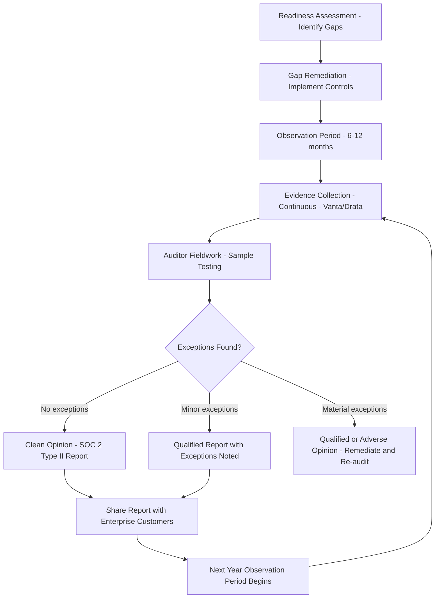

⚡ TL;DR - SOC 2 (Service Organization Controls 2) is an audit framework from the AICPA
(American Institute of Certified Public Accountants) for service organizations demonstrating
security controls to customers. Two report types: Type I (controls designed as of a point in
time - limited value) and Type II (controls operating effectively over a 6-12 month observation
period - the gold standard). Five Trust Service Criteria (TSC): Security (mandatory), Availability,
Confidentiality, Processing Integrity, Privacy (include whichever apply to your service). Most
SaaS companies: Security + Availability + Confidentiality are the minimum. Common controls
tested: logical access management (who can access what, with evidence of quarterly reviews),
change management (changes go through code review, testing, and approval before deployment),
incident management (incidents reported and resolved within defined SLAs), vendor management
(suppliers assessed for security risk), business continuity (DR tested annually). Evidence
collection: during the observation period, auditors sample your processes and request evidence.
Automation (Vanta, Drata, Secureframe): integrates with your tools (GitHub, Okta, AWS) to
continuously collect evidence. SOC 2 vs ISO 27001: SOC 2 = US standard, attestation, expected
by US SaaS buyers. ISO 27001 = international, certification, recognized globally. Many enterprise
customers require both.

---

| #109 | Category: Security | Difficulty: ★★★ |
|:---|:---|:---|
| **Depends on:** | OWASP Top 10, Authentication, Session Management, TLS Configuration, OAuth Security, Business Logic, Insufficient Logging, CVSS Scoring, CVE + NVD, IR Process, AWS Security Services, SAST in CICD, Security Observability + SIEM, Security at Scale, ISO 27001 | |
| **Used by:** | DevSecOps Pipeline, Enterprise Security Architecture, Security Governance, Security Metrics + FAIR, Platform Security Engineering, Multi-Cloud Security, Build vs Buy Security, SSDLC | |
| **Related:** | OWASP Top 10, Authentication, TLS Configuration, OAuth Security, Business Logic, Insufficient Logging, CVSS Scoring, CVE + NVD, IR Process, AWS Security Services, SAST in CICD, Security Observability + SIEM, Security at Scale, ISO 27001, Enterprise Security Architecture, Security Governance, Security Metrics, Platform Security | |

---

### 🔥 The Problem This Solves

**WHY ENTERPRISE CUSTOMERS REQUIRE SOC 2 TYPE II:**

```
THE ENTERPRISE VENDOR TRUST PROBLEM:

  Enterprise customer (Fortune 500 company):
  "We want to use your SaaS platform.
   Your platform will store our employee data and customer PII.
   How do we know your security controls are adequate?"
  
  Startup founder: "Our engineers are security-aware and we follow best practices."
  Enterprise: NOT ACCEPTABLE. Their legal and procurement teams need evidence.
  
  Startup: "We passed our own internal security assessment."
  Enterprise: NOT ACCEPTABLE. Self-assessment = no independent verification.
  
  Startup: "We have a penetration test report from last year."
  Enterprise: BETTER. But insufficient for ongoing security verification.
  
  Startup: "We have SOC 2 Type II from a Big 4 audit firm, covering the last 12 months."
  Enterprise: ACCEPTABLE. Independent auditor. Controls tested over time. Sign contract.
  
THE COST OF NOT HAVING SOC 2:

  Enterprise deal value: $500,000/year.
  Enterprise legal requirement: SOC 2 Type II report (standard procurement clause).
  Startup: no SOC 2. Deal: lost to ISO 27001/SOC 2 certified competitor.
  
  SOC 2 Type II cost: $30,000-$80,000 (audit fee + compliance platform).
  Enterprise deal won: $500,000/year.
  Break-even: one enterprise deal.
  
  Time to SOC 2 Type II: 9-12 months.
  Time to lose enterprise deals without it: immediately.
  
  Most B2B SaaS companies: required by year 2 of existence if targeting enterprise.

TYPE I vs TYPE II: WHY TYPE II IS THE STANDARD:

  SOC 2 Type I: "your controls are designed correctly as of this specific date."
  Analogy: "your fire alarm system is installed and appears functional."
  Value: low. Any company can design good controls and photograph them one day.
  
  SOC 2 Type II: "your controls have been operating effectively
  for the past 6-12 months, as verified by sample testing."
  Analogy: "your fire alarm has been tested monthly for 12 months,
  with documented test records that show it alerts within 30 seconds."
  Value: high. Independent verification that controls actually work over time.
  
  Enterprise procurement: almost universally requires Type II.
  Some procurement: "we accept Type I if you're a new company (< 2 years)."
  Target: Type II always. Type I: only as a stepping stone.
```

---

### 📘 Textbook Definition

**SOC 2 (System and Organization Controls 2):** An audit framework developed by the AICPA
(American Institute of Certified Public Accountants) for service organizations that process
customer data. SOC 2 evaluates controls related to the Trust Service Criteria (TSC). Output:
an attestation report issued by a licensed CPA firm, not a certification (unlike ISO 27001).
The report states: "In our opinion, [service organization's] controls were suitably designed
and operating effectively throughout the period [date range] in meeting the criteria for the
[Trust Service Criteria included]."

**Trust Service Criteria (TSC):** The five criteria areas for SOC 2.
- **CC (Common Criteria / Security):** MANDATORY in all SOC 2 reports. Covers: logical and physical access, system operations, change management, risk management.
- **A (Availability):** System performance commitments and SLAs. Include if you have SLA commitments to customers.
- **C (Confidentiality):** Protection of designated confidential information. Include if you handle business-sensitive customer data.
- **PI (Processing Integrity):** Complete, valid, accurate, timely, authorized processing. Include for payment processors and data processing services.
- **P (Privacy):** Personal information collected, used, retained, disclosed per the organization's privacy notice and AICPA privacy principles. Include if handling personal information subject to privacy laws.

**SOC 2 Type I:** A point-in-time report evaluating whether controls are suitably designed
(are the controls designed correctly?) as of a specific date. Lower audit fee, faster. Does not
test whether controls actually operated over time. Limited value: easy to "prepare for" one day.

**SOC 2 Type II:** A period report (typically 6-12 months) evaluating whether controls operated
effectively throughout the entire observation period. Auditors test controls through sampling:
selecting representative samples of transactions, access reviews, change management records,
and verifying they follow documented procedures. The gold standard for enterprise procurement.

**Control Exceptions:** Deviations found during auditor testing where a control did not operate
as designed in one or more sampled instances. Examples: one user access review not completed
on schedule, one change without required approvals. The SOC 2 report describes exceptions with
management's response. Minor exceptions: report is still issued (exceptions noted but opinion
not qualified). Material exceptions: report may include qualified opinion.

**Bridge Letter:** A letter from management extending the assurance of a prior SOC 2 report
to a more recent date. Example: SOC 2 Type II covers Jan-Dec 2024. Customer asks: "what about
Jan-Mar 2025?" Bridge letter from management: "We confirm that no material changes to controls
have occurred since December 31, 2024." Informal assurance only - not an auditor opinion.

**Complementary User Entity Controls (CUECs):** Controls that the service organization's
customers (user entities) are expected to implement. The SOC 2 report is only valid in
conjunction with the customer implementing these controls. Example: "The company assumes
that customers will restrict their API keys to only the IP addresses of their own systems."
If customers don't implement CUECs: the service organization's controls don't provide full protection.

---

### ⏱️ Understand It in 30 Seconds

**One line:**
SOC 2 Type II is a 6-12 month independent audit proving your controls (access management,
change management, incident response, vendor management, business continuity) operated
effectively throughout the period - the standard enterprise customers require before
trusting your SaaS platform with their data.

**One analogy:**
> SOC 2 Type II is like the inspection history of a restaurant.
>
> Type I (point-in-time): "the health inspector visited once, and the kitchen was clean that day."
> Any restaurant can clean up for one inspection. Low confidence in ongoing food safety.
>
> Type II (ongoing): "the restaurant has been inspected unannounced 12 times this year.
> Each inspection: kitchen meets code. Food temperature logs: maintained daily.
> Staff food handler certifications: current. Pest control: monthly, documented."
> This is independent, repeated verification over time. High confidence.
>
> For enterprise customers: trusting a SaaS platform with customer data is like
> contracting catering for 10,000 meals. You don't just want to see the kitchen once.
> You want 12 months of inspection records showing consistent safety.
>
> SOC 2 Type II is that record.
> The CPA auditing firm: the independent health inspector.
> The Trust Service Criteria: the food safety code.
> The observation period: the 12 months of repeated inspections.
> The attestation report: "in our professional opinion, this kitchen has consistently
> met food safety standards over the past 12 months."

---

### 🔩 First Principles Explanation

**SOC 2 Trust Service Criteria - control categories:**

```
COMMON CRITERIA (CC) - SECURITY - MANDATORY:

  CC1: Control Environment
    - Management commitment to information security
    - Risk assessment process exists
    - Code of conduct / ethics policies
    
  CC2: Communication and Information
    - Internal communication of security responsibilities
    - External communication (privacy notice, terms of service)
    
  CC3: Risk Assessment
    - Identifies risks to achieving security commitments
    - Analyzes significance of risks
    
  CC4: Monitoring
    - Monitors controls to detect deficiencies
    - Internal audit
    
  CC5: Control Activities (Policy and Procedures)
    - Policies covering all TSC areas
    - Technology controls documented
    
  CC6: Logical and Physical Access Controls
    - Unique user IDs (no shared accounts)
    - Multi-factor authentication
    - Least privilege access (need-to-know)
    - Quarterly access reviews (MOST COMMONLY TESTED)
    - Termination process (access removed within 24h of termination)
    - Physical access to data centers restricted
    
  CC7: System Operations
    - Vulnerability scanning (quarterly minimum)
    - Penetration testing (annual)
    - Threat and vulnerability management
    - Incident detection and response (SIEM-based)
    
  CC8: Change Management
    - All changes go through documented process
    - Code review required before merge
    - Testing required (unit, integration, UAT) before production
    - Emergency change process defined
    - Change approval required from authorized personnel
    
  CC9: Risk Mitigation (with Business Partners)
    - Vendor due diligence process
    - Sub-service providers assessed
    - Contracts include security requirements
    
AVAILABILITY (A) - OPTIONAL BUT COMMON:

  A1: Availability commitments (SLA) met
    - System monitoring (uptime tracking)
    - Capacity planning
    - Incident response → restoration within SLA
    - Business continuity and disaster recovery tested annually
    
CONFIDENTIALITY (C) - OPTIONAL BUT COMMON:

  C1: Confidential information protected per commitments
    - Data classification policy
    - Encryption at rest and in transit
    - NDA with employees and contractors
    - Secure disposal of data (at end of contract)

EVIDENCE COLLECTION BY CONTROL CATEGORY:

  CC6 (Access): 
    - Quarterly access review records (screenshots from Okta/JIRA)
    - New user provisioning tickets (shows approval workflow)
    - Termination tickets (shows access removal within SLA)
    
  CC8 (Change management):
    - GitHub PRs: show code review + approval before merge
    - Deployment records: show change goes through CI/CD, not direct to prod
    - Approval records: show authorized personnel approved changes
    
  CC7 (System operations):
    - Vulnerability scan reports (Qualys/Nessus) with remediation records
    - Pen test report (last 12 months)
    - SIEM alert records (showing monitoring is active and incidents reviewed)
    
  A1 (Availability):
    - Uptime monitoring reports (StatusPage, Pingdom, Datadog)
    - Incident records showing MTTR within SLA
    - DR test results (last 12 months, tested RTO/RPO)
```

---

### 🧪 Thought Experiment

**SCENARIO: Preparing for your first SOC 2 Type II audit:**

```
COMPANY: 60-person SaaS startup, 18 months post-launch.
         Enterprise customers requiring SOC 2 Type II before signing.
         CEO: "We need SOC 2. What's the plan?"
         
STEP 1: READINESS ASSESSMENT (Month 1)

  Engage compliance platform (Vanta/Drata):
  - Integrates with AWS, GitHub, Okta, Jira, Slack.
  - Automated gap analysis: which controls pass, which fail.
  
  Assessment results (typical for a startup at this stage):
  PASSING (green):
  - Encryption in transit (HTTPS everywhere): PASS
  - Logging/monitoring (CloudTrail + basic SIEM): PASS
  
  FAILING (red):
  - Quarterly access reviews: NOT DONE (never been done)
  - Vendor security assessment: NOT DONE
  - Security awareness training: 40% completion (ad hoc)
  - Change management: informal (no documented approval process)
  - Vulnerability scanning: never done
  - Business continuity testing: never done
  - Termination SLA: no documented process
  
STEP 2: GAP REMEDIATION (Months 2-4)

  Priority order (by audit risk):
  
  1. Logical access reviews (CC6) - HIGH PRIORITY:
     Conduct first-ever access review immediately.
     Document: who reviewed, what was reviewed, what actions taken.
     Schedule: quarterly recurring, calendar blocked, JIRA created automatically.
     Tool: Okta access certifications (automated access review workflows).
     
  2. Change management (CC8) - HIGH PRIORITY:
     Formalize GitHub PR requirements:
     - Minimum 1 approval required before merge to main.
     - CI/CD must pass before merge.
     - Production deploys: require release approval in Jira.
     Document the change management policy.
     
  3. Security awareness training (CC5) - MEDIUM PRIORITY:
     Deploy KnowBe4 or Proofpoint:
     Annual security awareness training + quarterly phishing simulations.
     Completion tracking: report to compliance platform.
     
  4. Vendor assessments (CC9) - MEDIUM PRIORITY:
     List all sub-processors (AWS, Stripe, SendGrid, Salesforce, etc.).
     For each: obtain their SOC 2 Type II report or equivalent.
     Annual review: confirm reports are current.
     
  5. Vulnerability scanning (CC7) - MEDIUM PRIORITY:
     Deploy Qualys or run AWS Inspector.
     Monthly scan cycle.
     Remediation tracking in Jira: Critical < 48 hours, High < 14 days.
     
  6. Business continuity testing (A1) - LOWER PRIORITY:
     Conduct DR test: simulate database failure, restore from backup.
     Document: test date, scenario, results, RTO achieved (target < 4 hours).
     Schedule: annual.
     
STEP 3: OBSERVATION PERIOD (Months 5-10, 6 months minimum)

  During observation period: every control must be consistently operated.
  Access reviews: done quarterly (one cycle during 6-month period).
  Change management: every change follows documented process.
  Vulnerability scans: monthly, remediation tracked.
  Training: all new hires trained within 30 days.
  Incidents: all incidents documented, responded to within SLA.
  
  Compliance platform: continuously monitors controls,
  flags when a control is failing (e.g., access review overdue).
  
  CRITICAL: if a control fails during the observation period,
  it WILL be found by auditors. Fix immediately and document the correction.
  Auditors prefer honest discrepancies with timely correction
  over unreported gaps that suggest lack of awareness.
  
STEP 4: AUDIT (Months 11-12)

  Auditor (CPA firm): fieldwork 1-2 weeks.
  Requests: evidence samples from the observation period.
  
  Sample requests:
  "Show me 5 access provisioning tickets from the past 6 months."
  → Show JIRA tickets with manager approval + Okta provisioning confirmation.
  
  "Show me 5 code deployments to production."
  → Show GitHub PRs with approval comments + Jira deployment tickets.
  
  "Show me the access review records from the last 6 months."
  → Show Okta certification campaign completion reports with reviewer sign-off.
  
  "Show me your vulnerability scan reports for the last 6 months."
  → Show Qualys scan reports with remediation records for Critical/High findings.
  
  FINDING: one access review was conducted 5 months ago, not quarterly.
  (Access review in February, next should be May, but occurred in June.)
  
  This becomes an EXCEPTION noted in the report:
  "During testing of Quarterly Access Reviews, 1 of 4 sampled access reviews
  occurred outside the required quarterly schedule. Management response: [your response]."
  
  This is a MINOR finding. Report is still issued.
  
STEP 5: REPORT ISSUED

  SOC 2 Type II Report:
  "For the period January 1, 2025 to June 30, 2025, in our opinion,
   [Company]'s controls were suitably designed and operated effectively
   throughout the period in meeting the criteria for the Security, Availability,
   and Confidentiality Trust Service Criteria."
  
  With 1 exception noted (the late access review).
  
  Enterprise procurement: satisfied. Contract signed.
```

---

### 🧠 Mental Model / Analogy

> SOC 2 Type II is like a credit report for your company's security practices.
>
> A credit report doesn't tell you "this person was financially responsible on December 15th."
> It tells you: "over the past 12 months, this person consistently paid their bills,
> maintained low credit utilization, had no defaults or collections."
>
> The key: PATTERN OF BEHAVIOR over time, not a single snapshot.
>
> An enterprise customer trusting you with their data is like a bank approving a mortgage.
> They want to see consistent, responsible behavior over a meaningful time period.
> Not one good day.
>
> SOC 2 Type II = the security credit report:
> - Logical access: "consistently reviewed quarterly, users removed within SLA on termination."
> - Change management: "99.7% of changes followed documented approval process throughout the period."
> - Incident response: "all incidents resolved within defined SLAs during the period."
> - Vendor management: "all sub-processors assessed annually."
>
> The exceptions (late access review, one unapproved change):
> Like a credit report with one late payment.
> Not disqualifying, but noted. Management response required.
> Pattern: one exception vs many exceptions tells different stories.
>
> The CPA firm issuing the report:
> Like a credit bureau - an independent, trusted third party.
> Not you saying "my security is good."
> A regulated professional saying "I tested their controls, and here is what I found."

---

### 📶 Gradual Depth - Five Levels

**Level 1 - What it is (anyone can understand):**
SOC 2 Type II is a security audit report that proves your company consistently followed good security practices for 6-12 months. A third-party accounting firm examines your processes (like who has access to what data, how you test changes before they go live, how you handle security incidents) and issues a report stating whether your controls actually worked throughout the period. Enterprise customers require this before trusting you with their data.

**Level 2 - How to use it (junior developer):**
As a developer, SOC 2 controls you'll touch regularly: (1) Code review: every PR requires at least one approval before merge to main. This is CC8 (Change Management). Your GitHub settings: branch protection requires approvals. (2) Access reviews: when IT sends a quarterly "please verify you still need access to X" email: respond within the SLA. This is CC6. Ignoring it creates an audit finding. (3) Security training: complete annual security awareness training and phishing simulations. CC5. (4) Incident reporting: security incidents must be reported through the official channel within the defined SLA. CC7. Never handle a security incident alone without reporting.

**Level 3 - How it works (mid-level engineer):**
Audit sampling methodology: auditors request population lists (all production deployments in the 6-month period) and select samples (typically 25-60 items). For each sample: request evidence. "Show me PR #4872: GitHub link, review comments, approval time, deployment time." Auditors look for: was the control applied? Was it applied correctly? Was it applied timely? For access management: population = all new users provisioned during the period. Sample: 25 provisioning events. Evidence needed: provisioning request ticket (shows requester and approver), provisioning completion (shows account created with correct roles). Automation (Vanta/Drata): continuously collects evidence from GitHub, Okta, AWS. Auditors can query the evidence platform directly. Reduces audit prep from weeks to hours. Exception threshold: different for each control. One late access review: minor exception. 5 of 10 sampled access reviews late: significant exception. Pattern of exceptions: qualified opinion.

**Level 4 - Why it was designed this way (senior/staff):**
SOC 2 is principles-based, not prescriptive: the Trust Service Criteria describe WHAT must be achieved (logical access managed, changes controlled) not HOW (must use Okta, must use GitHub PRs). This is intentional: a prescriptive standard for all service organizations would be impossible (a payment processor vs a collaboration SaaS vs a data analytics platform have different appropriate controls). The principles-based approach allows each organization to implement controls appropriate to their context. The AICPA Trust Service Criteria (2017) replaced the older SAS 70 standard: SAS 70 was designed for internal controls over financial reporting, not IT security. SOC 2 was specifically designed for IT service organizations. The five TSC + Common Criteria structure allows customers to select the TSC categories relevant to their service's risk profile. A pure analytics SaaS: Security + Confidentiality. A payment processor: Security + Processing Integrity. A SaaS with strict uptime SLAs: Security + Availability. This customization makes SOC 2 relevant across diverse service organizations.

**Level 5 - Mastery (distinguished engineer):**
SOC 2 + ISO 27001 integration at enterprise scale: many enterprise platforms undergo both simultaneously. The overlap: both require access management, change management, incident response, vulnerability management. The difference: ISO 27001 requires a formal ISMS management system. SOC 2 requires control operating effectiveness evidence. Efficiency: ISO 27001 risk assessment informs SOC 2 control selection. SOC 2 evidence collection serves as ISO 27001 effectiveness evidence. A unified evidence repository (GRC platform) serves both audit processes. The trend: Reciprocal frameworks (CSA STAR for cloud, FedRAMP for US government) map to SOC 2 + ISO 27001. Companies that achieve SOC 2 + ISO 27001 can quickly map to HIPAA Security Rule, NIST 800-53, and others via framework cross-walking (identifying which controls satisfy multiple standards simultaneously). The highest-maturity organizations: continuous compliance posture via real-time control monitoring + automated evidence collection. The audit becomes a review of the continuous monitoring results, not a manual evidence collection sprint. DevSecOps principle applied to compliance: compliance-as-code, with controls embedded in CI/CD and evidence generated automatically. The auditor: accesses the evidence platform, not a ZIP file of screenshots.

---

### ⚙️ How It Works (Mechanism)

```
SOC 2 TYPE II AUDIT PROCESS:

  READINESS (Months 1-3):
  Gap assessment → remediate controls → documentation

  OBSERVATION PERIOD (Months 4-9, minimum 6 months):
  Controls operate consistently → compliance platform collects evidence
  Auditor may test controls mid-period (continuous auditing)

  FIELDWORK (Months 10-11):
  Auditors request samples → test each sample → document exceptions

  REPORTING (Month 12):
  Auditor: drafts report → management reviews → report issued

  ANNUAL CYCLE:
  Next year's observation starts day after prior period ends.
  Continuous compliance: no "start" and "stop" - always being observed.
```



---

### 💻 Code Example

**GitHub branch protection policy enforcing SOC 2 CC8 change management:**

```hcl
# github-branch-protection.tf
# Enforce SOC 2 CC8 change management via GitHub branch protection.
# ALL production changes must go through PR with approvals.

resource "github_branch_protection" "main" {
  repository_id = github_repository.app.node_id
  pattern       = "main"

  # SOC 2 CC8: require PR review before merge:
  required_pull_request_reviews {
    required_approving_review_count = 2  # At least 2 approvers
    dismiss_stale_reviews            = true  # Re-review if code changes
    require_code_owner_reviews       = true  # CODEOWNERS must approve
    require_last_push_approval       = true  # Last pusher can't self-approve
    
    # Specific teams that must review security-sensitive changes:
    bypass_pull_request_allowances {
      # No one can bypass (not even admins):
      # apps  = []
      # teams = []
      # users = []
    }
  }

  # SOC 2 CC8: CI/CD must pass before merge:
  required_status_checks {
    strict = true  # Branch must be up to date with main
    contexts = [
      "ci/build",
      "ci/unit-tests",
      "ci/integration-tests",
      "ci/sast-scan",       # Security scan must pass
      "ci/dependency-scan", # SCA must pass
    ]
  }

  # SOC 2 CC8: prevent force push (preserves audit trail):
  force_push_bypassers = []
  allows_force_pushes  = false

  # SOC 2 CC8: prevent deletion of main branch:
  allows_deletions = false

  # Require linear history (easier to audit deployment sequence):
  require_linear_history = true
  
  # Require signed commits (integrity verification):
  require_signed_commits = true
}
```

```yaml
# .github/workflows/access-review-reminder.yml
# SOC 2 CC6: automated quarterly access review reminder.
# Sends JIRA ticket 2 weeks before quarterly access review due.

name: Quarterly Access Review Reminder

on:
  schedule:
    # Runs on first Monday of January, April, July, October:
    - cron: "0 9 1-7 1,4,7,10 1"

jobs:
  create-access-review-ticket:
    runs-on: ubuntu-latest
    steps:
    - name: Create Jira ticket for access review
      env:
        JIRA_API_TOKEN: ${{ secrets.JIRA_API_TOKEN }}
        JIRA_URL: ${{ secrets.JIRA_URL }}
      run: |
        QUARTER=$(date +Q%q)
        YEAR=$(date +%Y)
        DUE_DATE=$(date -d "+14 days" +%Y-%m-%d)
        
        curl -s -X POST "${JIRA_URL}/rest/api/3/issue" \
          -H "Content-Type: application/json" \
          -H "Authorization: Bearer ${JIRA_API_TOKEN}" \
          -d '{
            "fields": {
              "project": {"key": "SEC"},
              "summary": "'"${YEAR} ${QUARTER}"' - Quarterly Access Review (SOC 2 CC6)",
              "description": {
                "type": "doc",
                "version": 1,
                "content": [{
                  "type": "paragraph",
                  "content": [{
                    "type": "text",
                    "text": "Quarterly access review required for SOC 2 CC6 compliance. Review all production system access via Okta access certifications. Due: '"${DUE_DATE}"'"
                  }]
                }]
              },
              "issuetype": {"name": "Task"},
              "assignee": {"id": "${{ secrets.SECURITY_TEAM_JIRA_ID }}"},
              "duedate": "'"${DUE_DATE}"'",
              "priority": {"name": "High"}
            }
          }'
```

```python
# soc2_evidence_check.py
# Pre-audit evidence completeness check.
# Run before sending evidence package to auditors.

from dataclasses import dataclass
from typing import List, Optional
import json

@dataclass
class EvidenceItem:
    control: str
    description: str
    status: str  # "complete", "incomplete", "in-progress"
    location: Optional[str]  # Link to evidence artifact
    notes: Optional[str]

def check_soc2_evidence_completeness(
    observation_start: str,
    observation_end: str
) -> List[EvidenceItem]:
    """
    Pre-audit SOC 2 Type II evidence completeness check.
    Returns list of evidence items with their status.
    """
    
    evidence_checklist = [
        EvidenceItem(
            control="CC6.1 - Logical Access Management",
            description=(
                "Access provisioning tickets showing manager approval "
                "for all new production system access"
            ),
            status="complete",  # Update based on actual check
            location="https://jira.company.com/issues/SEC-ACCESS-*",
            notes="25+ samples available in Jira"
        ),
        EvidenceItem(
            control="CC6.1 - Access Reviews",
            description=(
                "Quarterly access review records: Q1, Q2, Q3, Q4 "
                "(or applicable quarters in observation period)"
            ),
            status="complete",
            location="https://company.okta.com/certifications",
            notes="2 cycles completed in observation period"
        ),
        EvidenceItem(
            control="CC6.2 - Termination Process",
            description=(
                "Termination tickets showing access removed within "
                "24 hours for all employee terminations"
            ),
            status="complete",
            location="https://jira.company.com/issues/HR-TERM-*",
            notes="Access removed within SLA for all 12 terminations"
        ),
        EvidenceItem(
            control="CC8.1 - Change Management",
            description=(
                "GitHub PRs for all production deployments showing "
                "2 approvals + CI/CD passing before merge"
            ),
            status="complete",
            location="https://github.com/company/app/pulls?q=merged",
            notes=(
                "All 247 deployments in period show required approvals. "
                "3 emergency changes: post-hoc approval within 24h per policy."
            )
        ),
        EvidenceItem(
            control="CC7.1 - Vulnerability Management",
            description=(
                "Monthly vulnerability scan reports and "
                "Critical/High remediation records"
            ),
            status="complete",
            location="s3://company-compliance/vuln-scans/",
            notes="6 monthly scan reports with remediation Jira tickets"
        ),
        EvidenceItem(
            control="CC7.2 - Penetration Testing",
            description="Annual penetration test report from external firm",
            status="complete",
            location="s3://company-compliance/pentest-2024.pdf",
            notes="NDA required before sharing with auditor"
        ),
        EvidenceItem(
            control="CC9.2 - Vendor Management",
            description=(
                "SOC 2 reports for all sub-processors: AWS, Stripe, "
                "SendGrid, Okta, GitHub"
            ),
            status="in-progress",
            location="s3://company-compliance/vendor-soc2/",
            notes="GitHub SOC 2 report pending - requested 2024-11-01"
        ),
        EvidenceItem(
            control="A1.2 - Business Continuity",
            description="Annual DR test results: RTO and RPO achieved",
            status="complete",
            location="s3://company-compliance/dr-test-2024.pdf",
            notes="DR test Oct 2024: RTO 2h vs target 4h. RPO 15min vs target 1h."
        ),
    ]
    
    return evidence_checklist


if __name__ == "__main__":
    evidence = check_soc2_evidence_completeness(
        observation_start="2024-01-01",
        observation_end="2024-12-31"
    )
    
    incomplete = [e for e in evidence if e.status != "complete"]
    
    print(f"Total controls checked: {len(evidence)}")
    print(f"Complete: {len([e for e in evidence if e.status == 'complete'])}")
    print(f"Incomplete/In-Progress: {len(incomplete)}")
    
    if incomplete:
        print("\nACTION REQUIRED before audit:")
        for item in incomplete:
            print(f"  - {item.control}: {item.notes}")
```

---

### ⚖️ Comparison Table

| Item | SOC 2 Type I | SOC 2 Type II | ISO 27001 | PCI DSS |
|:---|:---|:---|:---|:---|
| **Period** | Point in time | 6-12 months | Ongoing (3-year cert) | Annual |
| **Issuer** | CPA firm | CPA firm | Accredited certification body | QSA (Qualified Security Assessor) |
| **Output** | Attestation report | Attestation report | Certificate | AoC (Attestation of Compliance) |
| **Value for procurement** | Low (no time period) | High (operating over time) | High (international) | Required for card processing |
| **Focus** | Design of controls | Operating effectiveness | Management system | Cardholder data security |
| **Geographic acceptance** | US primarily | US primarily | International | Global (payment industry) |
| **Typical timeline** | 3-4 months | 9-12 months | 12-18 months | 6-12 months |

---

### ⚠️ Common Misconceptions

| Misconception | Reality |
|:---|:---|
| "SOC 2 Type II means we are secure." | SOC 2 Type II means your specified controls operated effectively during the specified period for the specified Trust Service Criteria. It is NOT a comprehensive security assessment or a guarantee of security. What it DOES NOT test: the quality of your security controls relative to actual threats to your specific business (your pen tester might find vulnerabilities your auditor didn't). What it DOES NOT cover: controls outside your scope (if you exclude Privacy, PII handling is not audited). What it DOES NOT guarantee: no breach occurred during the period (breaches can happen even when controls are functioning). What it DOES do: provide independent verification that you have a defined set of controls and that those controls operated as designed. The gap: a company could have well-documented, consistently operated controls that are still insufficient for sophisticated attackers. SOC 2 auditors test whether controls match documented procedures; they don't test whether the controls are sufficient to stop determined attackers. SOC 2 + annual penetration testing = significantly better assurance than SOC 2 alone. |
| "You can't share your SOC 2 report publicly." | SOC 2 reports can be shared. They are typically marked "CONFIDENTIAL" and shared under NDA with customers and prospects who have signed an NDA. The restriction is not legal - it's practical: SOC 2 reports include detailed descriptions of your control environment that could inform an attacker about your security architecture. The common practice: SOC 2 reports are available on request, under NDA. Some companies (particularly those with no competitive concerns about their security architecture) make their SOC 2 reports publicly available on their trust page. This is becoming more common in the transparent security culture that has developed in the SaaS industry. Bridge letters: can be shared to extend assurance to more recent periods. Summary reports: some companies publish a summary (without control detail) for broad consumption. What you should NOT do: refuse to share the SOC 2 report with enterprise prospects who request it under NDA. This is a commercial red flag and may lose the deal. The report exists to be shared with customers. That is its purpose. |

---

### 🚨 Failure Modes & Diagnosis

**Common SOC 2 audit exceptions and how to prevent them:**

```
EXCEPTION 1: QUARTERLY ACCESS REVIEWS NOT TIMELY

  Finding: "2 of 4 quarterly access reviews were completed outside
  the required 30-day window."
  
  Root cause: reminder email sent, no formal SLA tracked.
  People: busy, deprioritized.
  
  Prevention:
  - Automated JIRA ticket created 2 weeks before due date.
  - Escalation if not completed within 1 week: manager notified.
  - Okta access certifications: sends direct emails to reviewers.
  - Manager reminder if reports not certified within 5 business days.
  - Metric: access review completion rate on compliance dashboard.

EXCEPTION 2: EMERGENCY CHANGES WITHOUT POST-HOC APPROVAL

  Finding: "3 of 42 sampled production deployments lacked required
  change documentation. Management notes these were emergency changes."
  
  Root cause: emergency change process defined but not followed.
  Engineers: "it was an incident, no time for process."
  
  Prevention:
  - Emergency change process: lightweight (Slack message to #oncall-approvals)
    not heavyweight (full change request form).
  - Post-incident requirement: JIRA ticket created within 24h of emergency change.
  - Post-mortem: includes review of whether emergency was avoidable.
  - Training: "emergency change" process must be drilled quarterly.
  
EXCEPTION 3: TERMINATED USER ACCESS NOT REMOVED WITHIN SLA

  Finding: "1 of 15 terminated employees had production system access
  for 7 days after termination (SLA: 24 hours)."
  
  Root cause: IT offboarding JIRA ticket not created by HR until day 3.
  SLA measured from JIRA ticket creation (not termination date).
  Auditor measured from termination date.
  
  Prevention:
  - Automated offboarding: HR system (Workday/BambooHR) → API → Okta/JIRA.
  - No manual step: termination date in HR system triggers automated deprovisioning.
  - Same-day automation: access suspended at termination, removed within 24h.
  - Metric: access removal SLA tracked automatically.
  
EVIDENCE COMPLETENESS CHECKLIST:

  Before sending to auditors, verify:
  □ Access review records: all quarters in observation period
  □ Provisioning tickets: all new users, showing approval
  □ Termination tickets: all terminated users, showing removal date
  □ GitHub PRs: sufficient sample showing 2 approvals + CI/CD pass
  □ Vulnerability scan reports: all months in observation period
  □ Remediation records: Critical/High CVEs remediated within SLA
  □ Penetration test: dated within last 12 months
  □ Sub-processor SOC 2 reports: all in-scope vendors
  □ DR test: dated within last 12 months
  □ Security training: all employees, completion dates
  □ Incident records: all incidents with response timeline
```

---

### 🔗 Related Keywords

**Prerequisites:**
- `ISO 27001` (SEC-108) - related compliance framework, often pursued together

**Builds on this:**
- `DevSecOps Pipeline Design` (SEC-115) - CI/CD as CC8 change management evidence
- `Enterprise Security Architecture` (SEC-117) - compliance architecture integration
- `Security Governance + Policy` (SEC-119) - SOC 2 policy requirements
- `SSDLC` (SEC-129) - secure development as SOC 2 CC8 evidence

---

### 📌 Quick Reference Card

```
┌─────────────────────────────────────────────────────────┐
│ TYPE I vs II  │ Type I: point-in-time, low value        │
│               │ Type II: 6-12 month period, gold standard│
├───────────────┼─────────────────────────────────────────┤
│ TSC (5)       │ Security: MANDATORY                     │
│               │ Availability, Confidentiality: common   │
│               │ Processing Integrity, Privacy: optional │
├───────────────┼─────────────────────────────────────────┤
│ KEY CONTROLS  │ CC6: logical access + quarterly reviews  │
│               │ CC8: change mgmt (PR approvals + CI/CD) │
│               │ CC7: vuln scanning + pen test           │
│               │ CC9: vendor assessments                 │
│               │ A1: uptime + DR test                   │
├───────────────┼─────────────────────────────────────────┤
│ EXCEPTIONS    │ Minor: noted in report, still issued    │
│               │ Material: qualified opinion             │
├───────────────┼─────────────────────────────────────────┤
│ VS ISO 27001  │ SOC 2: US SaaS market standard         │
│               │ ISO 27001: international certification  │
│               │ Enterprise: often requires BOTH         │
└─────────────────────────────────────────────────────────┘
```

---

### 💎 Transferable Wisdom

**Reusable Engineering Principle:**
"Good processes leave trails. Bad processes leave surprises."
The central insight from SOC 2 Type II: auditors can only verify what is documented
and evidenced. A control that is done but undocumented: invisible to auditors.
An undocumented control is, for compliance purposes, the same as no control.
This is the same principle that drives good software engineering:
Code review (pull requests with comments) = documented code review.
Verbal code review at a whiteboard = no evidence it happened.
Formal code review: evidenced in the Git history permanently.
The SOC 2 approach to compliance operationalizes this principle:
Every security control: must produce an evidence artifact.
Access review: produces a sign-off record.
Code review: produces a GitHub PR approval.
Penetration test: produces a formal report.
DR test: produces a test results document.
This evidence-first mindset improves engineering practices beyond compliance:
When teams know their processes are auditable, they invest in making processes
that produce clean, reviewable artifacts.
The PR becomes a real review, not a rubber stamp.
The access review becomes a real review of permissions, not a checkbox.
The DR test becomes a real measurement of RTO/RPO, not an assumed success.
SOC 2's requirement for evidence improves the quality of the practices,
not just the documentation of the practices.
"If it's not documented, it didn't happen." This forces documentation discipline.

---

### 💡 The Surprising Truth

The most useful part of a SOC 2 Type II report for an enterprise customer is NOT
the auditor's opinion. It's the description of the "complementary user entity controls" (CUECs).

CUECs are the controls YOUR CUSTOMERS must implement for the SOC 2 assurance to apply to their data.
If customers don't implement CUECs, the service organization's controls are incomplete.

Example CUEC from a real SOC 2 report (paraphrased):
"The company's controls assume that customers will:
1. Implement strong authentication for their user accounts accessing the platform.
2. Restrict API key permissions to the minimum required for their use case.
3. Monitor their own audit logs for unusual activity within the platform.
4. Promptly revoke access for users who no longer require it."

Most enterprise customers reading the SOC 2 report skip to the auditor's opinion.
They miss the CUECs.

Then: a breach occurs via a customer's over-permissive API key (CUEC #2 not implemented).
Customer: "but you had SOC 2 Type II!" 
SaaS company: "we did, but your responsibility to restrict API keys is documented in the CUECs."

The legal and liability implication: CUECs distribute responsibility.
The SaaS company's controls only work if customers also meet their CUECs.
If a breach occurs because the customer didn't implement CUECs: shared or customer responsibility.

For engineers building enterprise SaaS: design your SOC 2 CUECs carefully.
They should describe the customer's security responsibilities that are:
(1) clearly within the customer's control, and
(2) genuinely necessary for the security of their data.
Vague CUECs: "customers should implement appropriate security" → unenforceable, no liability shift.
Specific CUECs: "customers must restrict API keys to specific IP addresses" → evidenced, liability clear.

---

### ✅ Mastery Checklist

**You've mastered this when you can:**
1. **DISTINGUISH** Type I (point-in-time design) from Type II (period effectiveness). State why
   enterprise customers require Type II and almost never accept Type I.
2. **LIST** the 5 Trust Service Criteria: Security (mandatory), Availability, Confidentiality,
   Processing Integrity, Privacy. State which most SaaS companies include: Security + Availability + Confidentiality.
3. **IDENTIFY** the most commonly tested controls: CC6 (logical access + quarterly reviews),
   CC8 (change management: PR approvals + CI/CD), CC7 (vulnerability scanning + pen test),
   CC9 (vendor assessments), A1 (availability + DR test).
4. **EXPLAIN** what a control exception is: a deviation found during auditor sampling.
   Minor exceptions: report issued with exceptions noted. Material exceptions: qualified opinion.
5. **DESCRIBE** the complementary user entity controls (CUECs): controls the customer must implement
   for the SOC 2 assurance to apply. Customers who skip CUECs: may share liability in a breach.

---

### 🎯 Interview Deep-Dive

**Q: What is SOC 2 Type II and why is it important for enterprise SaaS companies?
What are the most commonly tested controls? How does it differ from ISO 27001?**

*Why they ask:* Tests compliance knowledge for security engineering, CISO, and senior
engineering roles in companies selling to enterprise customers. Common in Series B+
startups and growth-stage companies where compliance is a business requirement.

*Strong answer covers:*
- SOC 2 Type II: AICPA attestation framework. CPA firm audits controls over 6-12 month observation
  period. Five Trust Service Criteria (Security mandatory + optional: Availability, Confidentiality,
  Processing Integrity, Privacy). Most SaaS: Security + Availability + Confidentiality minimum.
  Type II vs Type I: Type II proves controls OPERATED effectively over time (not just designed correctly).
  Enterprise procurement: almost universally requires Type II.
- Commonly tested controls: CC6 (logical access - quarterly reviews, provisioning with approval,
  termination within 24h SLA), CC8 (change management - PR approvals, CI/CD gates, emergency change
  process), CC7 (vulnerability scanning + annual pen test), CC9 (vendor/sub-processor assessments),
  A1 (uptime monitoring + DR test annually with RTO/RPO documented).
- Evidence collection: for each control, auditors select samples and request artifacts.
  GitHub PRs for CC8 (showing approvals). Okta certification reports for CC6.
  Qualys/Inspector reports for CC7. DR test results for A1. Missing evidence = exception.
- ISO 27001 vs SOC 2: ISO 27001 = international standard, formal certification body, management
  system focus (how you manage security). SOC 2 = US AICPA standard, CPA attestation, control
  effectiveness focus (did controls operate correctly). ISO 27001 certificate = recognized globally.
  SOC 2 = expected by US enterprise SaaS buyers. Most mature companies: pursue both.
  Timeline: SOC 2 Type II = 9-12 months. ISO 27001 = 12-18 months.
  Automation (Vanta/Drata): cuts evidence collection effort by 70-80% for both frameworks.