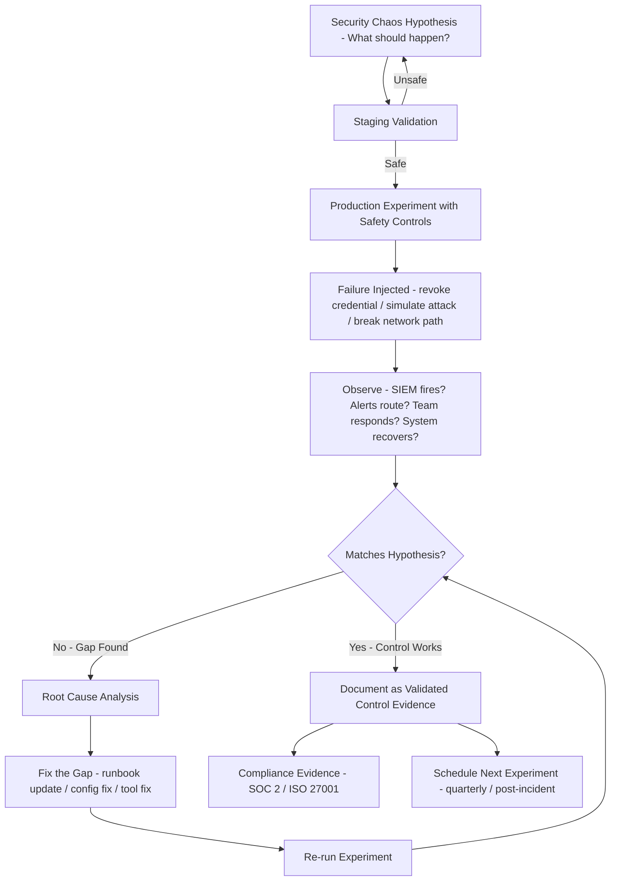

⚡ TL;DR - Security chaos engineering applies the chaos engineering principle ("intentionally
inject failure to test resilience") to security controls ("intentionally inject security
failures to test detection and response"). Key practices: credential rotation tests (revoke
a production credential, see if the system degrades gracefully, SIEM detects it, and
on-call team responds within SLA), network segmentation tests (attempt connections between
network segments that should be blocked, verify firewall/NetworkPolicy stops them), SIEM
alert validation (simulate attack scenarios, verify alerts fire within expected time),
incident response drills (GameDays that run through full IR scenarios with actual runbooks),
red team exercises (simulated adversary campaigns testing the full kill chain). The key
insight from Netflix Chaos Monkey applied to security: "if your security controls have never
been tested under realistic conditions, they may fail exactly when you need them most."
Security GameDays: structured exercises where the team deliberately triggers security
scenarios (credentials revoked, DDoS simulation, insider threat simulation) and measures:
detection time (MTTD), response time (MTTR), and playbook effectiveness. The output:
validated (or corrected) security controls, trained security team, and documented evidence
for SOC 2/ISO 27001 auditors.

---

| #110 | Category: Security | Difficulty: ★★★★ |
|:---|:---|:---|
| **Depends on:** | OWASP Top 10, Authentication, Session Management, TLS Configuration, OAuth Security, Business Logic, Insufficient Logging, CVSS Scoring, CVE + NVD, IR Process, Digital Forensics, AWS Security Services, Kubernetes Security, SAST in CICD, Security Observability + SIEM, Security at Scale, ISO 27001, SOC 2 Type II | |
| **Used by:** | Red/Blue/Purple Team, DevSecOps Pipeline, Enterprise Security Architecture, Security Governance, CSIRT Design, Security Metrics + FAIR, Platform Security Engineering, SSDLC | |
| **Related:** | OWASP Top 10, Authentication, TLS Configuration, OAuth Security, Business Logic, Insufficient Logging, CVSS Scoring, CVE + NVD, IR Process, Digital Forensics, AWS Security Services, Kubernetes Security, SAST in CICD, Security Observability + SIEM, Security at Scale, ISO 27001, SOC 2 Type II, Red/Blue/Purple Team, CSIRT Design, Security Metrics, Platform Security | |

---

### 🔥 The Problem This Solves

**WHY UNTESTED SECURITY CONTROLS ARE SECURITY THEATER:**

```
THE FIRE DRILL PROBLEM:

  A building has fire sprinklers. Fire extinguishers. Emergency exits.
  Fire marshal: "these look correct."
  Last fire drill: 4 years ago.
  
  When a real fire starts:
    - Sprinklers: triggered, but main valve was closed for maintenance.
      Nobody noticed. Water doesn't flow.
    - Emergency exit on Floor 3: jammed since the renovation 2 years ago.
      Nobody tested it.
    - Fire extinguisher: expired 18 months ago.
      Nobody checked.
    - Staff: never practiced the evacuation route.
      Panic. Confusion. Wrong direction.
    
  The fire protection system: existed but was not effective.
  
  THIS IS YOUR SECURITY POSTURE WITHOUT CHAOS ENGINEERING.
  
  Security controls that exist but have never been tested:
  
    GuardDuty: enabled. Alerts configured.
    Last test: never run a simulated attack to verify an alert fires.
    Real attack: GuardDuty alert fires. Alert routing: broken (misconfigured SNS topic).
    Alert: sits in CloudWatch unread for 4 hours.
    Analyst: checking a different dashboard.
    MTTD: 4 hours instead of 5 minutes.
    
    IR runbook: documented. "Revoke compromised IAM credentials."
    Last test: never.
    Real incident: on-call engineer: "how do I revoke credentials? Which API?"
    Scrambles to find documentation.
    Credentials remain active for 45 minutes.
    
    Network segmentation: payment-service should NOT reach user-service directly.
    NetworkPolicy: configured. "Default deny."
    Last test: never attempted the connection to verify it's actually blocked.
    Real check (pen test): payment-service CAN reach user-service.
    NetworkPolicy: had a wildcard rule that was too broad.
    Nobody knew. Never tested.
    
  CHAOS ENGINEERING FOR SECURITY:
  
    Test GuardDuty: simulate an attack → verify alert fires → verify routing → measure time.
    Test IR runbook: conduct a GameDay → run through "compromised credentials" scenario.
    Test network segmentation: attempt the forbidden connection → verify it's blocked.
    
    The difference: you find the gaps NOW, in a controlled scenario,
    not during a real incident at 3 AM when the stakes are highest.
```

---

### 📘 Textbook Definition

**Chaos Engineering for Security (Security Chaos Engineering, SCE):** The discipline
of injecting controlled, intentional security failures into production or production-like
environments to test detection, response, and recovery capabilities. Extends chaos engineering
(resilience testing) to the security domain. Hypothesis-driven: "we believe our SIEM will
detect this attack within 5 minutes and alert the SOC within 10 minutes." The chaos experiment
tests the hypothesis.

**GameDay:** A structured security exercise where a team deliberately triggers a security
scenario (or simulates one) and works through the full detection-to-recovery process using
actual systems and runbooks. Named after the practice of performing "production-like" drills.
Security GameDays: test specific scenarios (credential compromise, ransomware simulation,
insider threat, DDoS) with defined success criteria (MTTD, MTTR, runbook coverage).

**SIEM Alert Validation:** The process of generating known-malicious events (simulated attacks)
to verify that SIEM correlation rules fire correctly and alerts are routed to the right teams.
Tools: Atomic Red Team (MITRE ATT&CK-mapped attack simulations), Stratus Red Team (AWS-specific
attack simulations), Prelude Operator. Without validation: SIEM rules may be silently broken
(misconfigured routing, stale queries, wrong log source).

**Red Team Exercise:** A simulated adversary campaign where a team of attackers (red team) attempts
to breach the target organization using realistic attack TTPs (often MITRE ATT&CK-based), without
the defenders knowing specific attack timings or techniques. Goal: test the FULL security program
(detection, response, containment). Longer-running than a penetration test (weeks to months vs days).
Distinguishes from pen test: red team = continuous realistic adversary simulation, pen test = time-boxed
technical vulnerability assessment.

**Atomic Red Team:** Open-source library of small, portable tests mapped to MITRE ATT&CK techniques.
Each "atomic" test: a single technique (T1078 Valid Accounts, T1059.001 PowerShell, etc.) that can
be run individually to test detection of that specific technique. Used for: SIEM alert validation,
detection coverage gap analysis.

**Credential Rotation Test:** A chaos experiment where a production credential (API key, database
password, service account token) is deliberately revoked to test: (1) Does the system degrade
gracefully or crash? (2) Does the credential rotation procedure work as documented? (3) Does the SIEM
detect the access denial events? (4) Does the on-call team receive an alert within SLA?

---

### ⏱️ Understand It in 30 Seconds

**One line:**
Security chaos engineering deliberately triggers security failures (revoke credentials, simulate
attacks, inject misconfigurations) in controlled conditions to discover whether your detection,
response, and recovery systems actually work - before attackers discover they don't.

**One analogy:**
> Security chaos engineering is the equivalent of a military unit running live-fire training exercises.
>
> A military unit can study tactics in a classroom (read incident reports, attend security training).
> They can write detailed battle plans (IR runbooks, playbooks).
> They can deploy the right equipment (SIEM, WAF, GuardDuty).
>
> But there is no substitute for live-fire exercises:
> "Simulated ambush: team must execute contact drill within 30 seconds."
> "No notice: unit deploys to field under realistic conditions."
> "Mission: locate and neutralize the objective using only documented procedures."
>
> What the live-fire exercise reveals (that classroom study misses):
> - Procedure A doesn't work under pressure (too many steps, ambiguous language).
> - Soldier X doesn't know how to operate Radio Y (assumed training).
> - Objective location is described incorrectly on the map (documentation error).
>
> Security GameDays are the live-fire exercises:
> "Simulated compromised credential: team must revoke + rotate within 30 minutes."
> "No notice DDoS: on-call must activate WAF rate limiting within SLA."
> "Simulated insider data exfiltration: SIEM must detect within 15 minutes."
>
> The output of the exercise: gaps identified under realistic conditions.
> Better to discover these gaps in training than in combat.

---

### 🔩 First Principles Explanation

**Security chaos engineering experiment design:**

```
EXPERIMENT STRUCTURE (hypothesis-driven):

  1. DEFINE THE STEADY STATE:
     "In normal operation, our credential rotation procedure completes in
     < 30 minutes, all services continue operating, and no customer data
     is inaccessible during the rotation."
     
  2. HYPOTHESIZE:
     "We believe that revoking the payment-service IAM role credentials
     will: (a) trigger a GuardDuty alert within 5 minutes,
     (b) cause payment-service to automatically refresh credentials
        from the instance metadata service,
     (c) result in < 1% error rate during the credential refresh period."
     
  3. INJECT THE FAILURE:
     "Delete the IAM access key used by payment-service."
     (In a staging environment first, then production with safety controls.)
     
  4. OBSERVE:
     - Was a GuardDuty alert fired? Within 5 minutes?
     - Did payment-service recover automatically? How long?
     - What was the error rate during recovery?
     - Was the on-call team paged? Within what time?
     
  5. LEARN AND IMPROVE:
     - GuardDuty alert fired: 12 minutes (not 5). Investigate why.
     - payment-service: crashed (didn't handle credential refresh).
       Fix: implement retry with exponential backoff + credential refresh.
     - Error rate: 15% during 8-minute outage.
       Fix: ensure services use Instance Metadata Service (IMDSv2),
            which handles credential refresh automatically.
     - On-call: paged 2 minutes after GuardDuty alert (as expected). PASS.
     
EXPERIMENT TYPES (security-specific):

  TYPE 1: CREDENTIAL CHAOS
  
    Scope: test credential rotation and secret management controls.
    
    Experiments:
    a) Revoke API key → does service self-heal via Vault?
    b) Expire JWT token mid-session → does auth service handle gracefully?
    c) Rotate database password → does connection pool recover automatically?
    d) Revoke GitHub PAT → does CI/CD pipeline fail gracefully + alert?
    
    Safety: always test in staging first.
    Production: only if staging passes and safety controls in place
    (break-glass restore procedure documented and tested).
    
  TYPE 2: NETWORK SEGMENTATION VALIDATION
  
    Scope: verify NetworkPolicy/firewall rules block what they should.
    
    Experiments (from inside a pod in the source namespace):
    a) payment-service → user-service (should be BLOCKED)
       kubectl exec -it payment-pod -- curl http://user-service:8080
       Expected: connection refused (NetworkPolicy blocks)
       Failure case: connection succeeds → NetworkPolicy misconfigured
       
    b) any-pod → external IP (should be BLOCKED unless allowlisted)
       kubectl exec -it any-pod -- curl https://attacker.com
       Expected: connection refused (egress NetworkPolicy default-deny)
       
    c) dev-namespace → production database (should be BLOCKED)
       Attempt DB connection from dev pod
       Expected: connection refused (separate namespace, no cross-ns policy)
       
  TYPE 3: SIEM ALERT VALIDATION
  
    Scope: verify SIEM correlation rules fire as expected.
    
    Tool: Atomic Red Team (https://github.com/redcanaryco/atomic-red-team)
    
    Experiment: T1078.004 (Cloud Accounts - Valid Accounts):
    Step 1: obtain a valid IAM user credential (your own test credential).
    Step 2: call the IAM API from an unusual location (Tor exit node, or
            different region from normal operations).
    Step 3: verify GuardDuty finding fires:
            UnauthorizedAccess:IAMUser/InstanceCredentialExfiltration
    Step 4: verify EventBridge routing: alert reaches PagerDuty.
    Step 5: measure time from step 2 to PagerDuty notification.
    Expected: < 5 minutes.
    
  TYPE 4: IR RUNBOOK VALIDATION (GAMEDAY)
  
    Scope: test end-to-end incident response for a specific scenario.
    
    Scenario: "Compromised Admin Credential"
    Participants: on-call engineer + security team lead + ops.
    Duration: 2 hours.
    
    Steps:
    1. [Facilitator] Creates a test IAM user with admin access.
    2. [Facilitator] Simulates: "you have received a GuardDuty alert:
       AdminAccess IAM user credentials used from Tor exit node."
    3. [Team] Must execute IR runbook for "compromised credentials":
       a) Identify the affected account.
       b) Revoke access immediately (specific CLI commands).
       c) Notify management per escalation policy.
       d) Forensic investigation: what did the compromised account access?
       e) Determine scope of breach.
    4. [Facilitator] Measures: time to each step. Notes runbook gaps.
    5. [Team] Conducts blameless post-mortem: what was slow? What was unclear?
    6. [Output] Updated runbook addressing identified gaps.
```

---

### 🧪 Thought Experiment

**SCENARIO: A company discovers their IR runbook doesn't work during a GameDay:**

```
SETUP: Company has an IR runbook for "compromised AWS credentials."
       Runbook: 12 steps. Written 18 months ago. Never tested.
       GameDay: 2-hour exercise. Participants: on-call + security lead.
       
FACILITATOR SCENARIO INJECT (at T+0):
  "GuardDuty alert received: 
   Severity: HIGH
   Finding: UnauthorizedAccess:IAMUser/InstanceCredentialExfiltration.InsideAWS
   Credential: AKIA3EXAMPLE12345678 (IAM user 'ci-deploy-prod')
   Used from: IP 185.220.101.24 (known Tor exit node)
   Time: 14:32 UTC"
   
ON-CALL ENGINEER ACTIONS (observed, timed):

  T+00:00 - Alert received in PagerDuty. Acknowledged.
  T+00:05 - Engineer opens IR runbook in Confluence.
  T+00:08 - Step 1: "Identify affected account."
            Command: aws iam get-user --user-name ci-deploy-prod
            FINDING: command fails. Engineer doesn't have IAM permissions
            to run get-user in production. (Used staging perms by default.)
            Time lost: 12 minutes debugging permission issue.
            
  T+00:20 - Step 2: "Immediately revoke compromised access key."
            Command in runbook: aws iam delete-access-key ...
            FINDING: runbook uses wrong flag name (deprecated API syntax).
            Command fails. Engineer googles correct syntax.
            Time lost: 8 minutes.
            
  T+00:35 - Step 3: "Notify incident commander."
            Runbook: "Contact @incident-commander in Slack."
            FINDING: @incident-commander was an alias that was deleted 6 months ago
            when the on-call rotation changed. No current owner.
            Engineer: uncertain who to notify. Sends message to #security.
            Time lost: 10 minutes trying to identify who to notify.
            
  T+00:55 - Key finally revoked.
  T+00:55 - MTTD (from alert to revocation): 55 minutes.
  Target: 30 minutes.
  
  T+01:00 - Facilitator: stops the exercise. Debrief begins.
  
POST-GAMEDAY FINDINGS (blameless post-mortem):

  Issue 1: on-call engineer cannot run IAM commands in production.
  Fix: grant on-call rotation a "SecurityResponder" IAM role with
  necessary permissions for IR actions. Pre-staged, tested quarterly.
  
  Issue 2: runbook has deprecated AWS CLI syntax.
  Fix: runbook must be tested (dry run) quarterly.
  Add: "Last tested: [date]" header to runbook.
  
  Issue 3: incident commander alias is stale.
  Fix: define escalation contacts by ROLE, not by person.
  Confluence: "Incident Commander = current week's on-call security lead.
  See PagerDuty schedule: [link]."
  
  UPDATED MTTD AFTER GAMEDAY FIXES:
  Next GameDay (90 days later): same scenario.
  MTTD: 12 minutes. Target: 15 minutes. PASS.
  
  The GameDay found 3 critical runbook failures that would have cost
  43 extra minutes in a real incident. At a real compromise:
  43 additional minutes of active credential = unknown additional scope.
  
  Cost of GameDay: 2 engineer-hours + 2 hours of facilitator prep.
  Value: 43 minutes faster response in any real future incident.
```

---

### 🧠 Mental Model / Analogy

> Security chaos engineering is the discipline of "making the implicit explicit."
>
> Implicit assumption: "our SIEM will detect this attack."
> Chaos experiment: simulate the attack. Does the SIEM actually detect it?
> Result A: yes, alert fires in 3 minutes. Assumption validated. Explicit.
> Result B: no alert. Routing was broken. Assumption was WRONG. Now explicit.
>
> The entire value of security chaos engineering:
> Converting dangerous implicit assumptions into explicit, evidence-backed facts.
>
> Every security control rests on implicit assumptions:
> "GuardDuty will detect this." (Tested? Maybe not.)
> "Our runbook covers this scenario." (Dry-run tested? Maybe not.)
> "NetworkPolicy blocks this traffic." (Connection attempted? Maybe not.)
> "On-call will respond within 30 minutes." (Measured under realistic conditions? Maybe not.)
>
> The Netflix Chaos Monkey parallel:
> Netflix Chaos Monkey: kills random production instances.
> Implicit assumption: "our services are resilient to instance failure."
> Chaos Monkey converts this to: "our services ARE resilient (tested)" or
> "our services are NOT resilient (found the gap)."
>
> Security Chaos Monkey: revokes random credentials, breaks network paths,
> simulates attack events.
> Implicit assumption: "our security controls will catch this."
> Security chaos converts this to: "controls DO catch it (tested)" or
> "controls DO NOT catch it (found the gap)."
>
> The principle: the gap between "we believe our controls work"
> and "we KNOW our controls work because we tested them"
> is exactly the gap that attackers exploit.
> Security chaos engineering closes that gap.

---

### 📶 Gradual Depth - Five Levels

**Level 1 - What it is (anyone can understand):**
Security chaos engineering is like fire drills for your security team. Instead of waiting to find out if your security systems work during a real attack, you deliberately simulate attacks and failures in a controlled way - revoking credentials to see if services recover, simulating a hacking attempt to see if your monitoring catches it, running a fake "security breach" scenario to practice your incident response. The goal is to find gaps in your defenses BEFORE attackers do.

**Level 2 - How to use it (junior developer):**
Start with: (1) SIEM alert validation using Atomic Red Team. Install it on a test EC2 instance, run one MITRE ATT&CK technique (e.g., T1059.001 PowerShell), check if GuardDuty fires an alert. Document: alert fired? How long? Did PagerDuty get notified? (2) Network segmentation checks: `kubectl exec -it pod -- curl http://service.other-namespace:8080` → verify it's blocked by NetworkPolicy. (3) Credential rotation test in staging: manually delete a test API key, verify the service returns an error (not a crash), verify logs show the failure, verify monitoring detects it. Document the result. Contribute fixes for any gaps found.

**Level 3 - How it works (mid-level engineer):**
Atomic Red Team execution: `Invoke-AtomicTest T1078.004 -TestNumbers 1` → generates IAM API calls from an unusual source. GuardDuty: analyzes CloudTrail and generates finding within 5-15 minutes. EventBridge rule: routes GuardDuty High findings to SNS. SNS: notifies PagerDuty. Time measurement: from IAM API call timestamp to PagerDuty notification. This validates the entire alert pipeline end-to-end. Network segmentation validation: Cilium's NetworkPolicy enforcement can be validated with `cilium-dbg policy trace --src-k8s-pod namespace/pod-name --dst-k8s-pod other-namespace/pod-name --dport 8080`. Shows whether the policy allows or denies the connection without actually making it. Stratus Red Team (AWS-specific): pre-built attack scenarios like "Enumerate IAM permissions" or "Backdoor EC2 via SSM" that simulate realistic AWS attack techniques and generate GuardDuty findings.

**Level 4 - Why it was designed this way (senior/staff):**
The hypothesis-driven approach from chaos engineering (Netflix Resilience Engineering) applies directly to security: you must have a MEASURABLE expected outcome before the experiment. "We believe GuardDuty will fire within 5 minutes." The measurement makes the experiment falsifiable. Experiments without measurable criteria become exercises ("we ran a GameDay") rather than tests ("GuardDuty fired in 12 minutes vs target 5 minutes; investigate the delay"). The production-vs-staging debate for security chaos: security chaos experiments in staging are valuable but limited. Staging environments may have different log routing, different IAM policies, different network topology. Real attack surface exists in production. The approach: (1) All experiments start in staging. (2) Experiments that affect non-critical services (read-only access simulation) can run in production. (3) Experiments that could cause downtime (credential revocation) run in production only with break-glass restore procedure tested and safety observer present. The 2024 evolution: automated chaos (Gremlin's security module, AWS FIS security experiments) allows running experiments continuously in CI/CD without manual execution. "Security chaos as a pipeline gate" - ship to production only if security chaos experiments pass.

**Level 5 - Mastery (distinguished engineer):**
Advanced security chaos: supply chain attack simulation. Test your dependency update pipeline by injecting a "malicious" but functionally equivalent dependency update (using a private repository mirror). Does your SCA scanner catch it? Does your container image scanning catch the changed dependency? Does your SBOM (Software Bill of Materials) update trigger a review? This tests your entire supply chain security pipeline end-to-end, not just individual tools. Security chaos for compliance evidence: ISO 27001 Clause 8.6 (performance evaluation) and SOC 2 CC7.1 (monitoring activities) can both be evidenced through documented chaos experiment results. "We tested GuardDuty alert routing on [date] with scenario [X]. Result: alert fired in [Y] minutes. Finding [Z]: alert routing was misconfigured for eu-west-1 (fixed on [date])." This is stronger compliance evidence than "GuardDuty is enabled" because it demonstrates operational effectiveness, not just control existence. Red team + chaos engineering integration: red teams can use chaos engineering tooling for stealth attack simulation. Automated attack orchestration (Caldera, Prelude) + chaos experiment frameworks = realistic, repeatable, measurable adversary simulations. The purple team exercise: red team (attack), blue team (detect/respond), purple (collaborative): run a chaos experiment, blue team must detect and respond, then immediately debrief together. This is the most efficient form of security team capability development.

---

### ⚙️ How It Works (Mechanism)

```
SECURITY CHAOS ENGINEERING WORKFLOW:

  Design Hypothesis
    (what should happen?)
         ↓
  Implement in Staging
    (verify safety of experiment)
         ↓
  Run Experiment (controlled)
    (inject the security failure)
         ↓
  Observe Results
    (did alerts fire? did teams respond? did systems recover?)
         ↓
  Compare to Hypothesis
    (pass/fail per measurable criteria)
         ↓
  Identify Gaps → Fix → Re-test
         ↓
  Document (compliance evidence + team learning)
```



---

### 💻 Code Example

**Security GameDay runbook template and Atomic Red Team execution:**

```bash
#!/bin/bash
# security-gameday-runbook.sh
# GameDay: "Compromised IAM Credential" scenario.
# Run in staging environment. Document all results.
# Facilitator: runs this script. Participants: execute IR runbook.

# ── SETUP ────────────────────────────────────────────────
GAMEDAY_DATE=$(date +%Y-%m-%d)
GAMEDAY_LOG="gameday-${GAMEDAY_DATE}.log"
TARGET_SCENARIO="compromised-iam-credential"

log() {
  echo "[$(date +%H:%M:%S)] $1" | tee -a "${GAMEDAY_LOG}"
}

log "GameDay: ${TARGET_SCENARIO}"
log "Date: ${GAMEDAY_DATE}"
log "Facilitator: ${USER}"
log "Participants: [list participants]"
log "Environment: STAGING"

# ── PHASE 1: INJECT FAILURE ─────────────────────────────

log "INJECT: Creating test IAM user with elevated permissions..."

# Create a test credential (staging only):
aws iam create-user \
  --user-name "gameday-test-${GAMEDAY_DATE}" \
  --tags "[{\"Key\":\"Purpose\",\"Value\":\"GameDay\"}]"

aws iam attach-user-policy \
  --user-name "gameday-test-${GAMEDAY_DATE}" \
  --policy-arn "arn:aws:iam::aws:policy/PowerUserAccess"

KEY_RESULT=$(aws iam create-access-key \
  --user-name "gameday-test-${GAMEDAY_DATE}")

ACCESS_KEY=$(echo "${KEY_RESULT}" | jq -r '.AccessKey.AccessKeyId')
SECRET_KEY=$(echo "${KEY_RESULT}" | jq -r '.AccessKey.SecretAccessKey')

log "Test credential created: ${ACCESS_KEY}"
log "INJECT: Simulating credential use from unusual location..."

# Simulate credential use from unusual IP (Tor simulation via proxy):
# In real exercise: use a different AWS region to trigger anomaly detection.
AWS_ACCESS_KEY_ID="${ACCESS_KEY}" \
AWS_SECRET_ACCESS_KEY="${SECRET_KEY}" \
AWS_DEFAULT_REGION="eu-north-1" \  # Different from normal us-east-1
  aws s3 ls 2>&1 | head -5

log "INJECT_TIME: $(date +%H:%M:%S)"
log "Notifying participants: GuardDuty alert scenario is now active."
echo "---"
echo "GAMEDAY SCENARIO ACTIVE:"
echo "GuardDuty finding type: UnauthorizedAccess:IAMUser/InstanceCredentialExfiltration"
echo "User: gameday-test-${GAMEDAY_DATE}"
echo "Region: eu-north-1 (unexpected)"
echo "---"
echo "Participants: start the IR runbook. Timer: START."

# ── PHASE 2: OBSERVE ──────────────────────────────────────

ALERT_DETECT_TIME=""
CRED_REVOKE_TIME=""
NOTIFICATION_TIME=""

log "OBSERVE: Waiting for GuardDuty finding..."

# Poll GuardDuty for the finding:
for i in $(seq 1 12); do  # Wait up to 12 minutes
  FINDING_COUNT=$(aws guardduty list-findings \
    --detector-id "$(aws guardduty list-detectors | jq -r '.DetectorIds[0]')" \
    --finding-criteria "{
      \"Criterion\": {
        \"resource.accessKeyDetails.accessKeyId\": {
          \"Eq\": [\"${ACCESS_KEY}\"]
        }
      }
    }" | jq '.FindingIds | length')
  
  if [ "${FINDING_COUNT}" -gt "0" ]; then
    ALERT_DETECT_TIME=$(date +%H:%M:%S)
    log "ALERT DETECTED: GuardDuty finding at ${ALERT_DETECT_TIME}"
    break
  fi
  
  sleep 60
  log "Waiting for GuardDuty finding... (${i}/12 minutes)"
done

if [ -z "${ALERT_DETECT_TIME}" ]; then
  log "FAILURE: GuardDuty finding NOT detected within 12 minutes."
  log "Finding: Alert routing or detection rule may be broken."
fi

# ── PHASE 3: MEASURE RESPONSE ────────────────────────────

echo "TIMER: Press ENTER when participants have revoked the credential."
read
CRED_REVOKE_TIME=$(date +%H:%M:%S)
log "CREDENTIAL REVOKED AT: ${CRED_REVOKE_TIME}"

# ── PHASE 4: CLEANUP AND DOCUMENT ────────────────────────

log "CLEANUP: Deleting test IAM user and credentials..."
aws iam delete-access-key \
  --user-name "gameday-test-${GAMEDAY_DATE}" \
  --access-key-id "${ACCESS_KEY}"

aws iam detach-user-policy \
  --user-name "gameday-test-${GAMEDAY_DATE}" \
  --policy-arn "arn:aws:iam::aws:policy/PowerUserAccess"

aws iam delete-user --user-name "gameday-test-${GAMEDAY_DATE}"

log "CLEANUP COMPLETE."
log "---"
log "GAMEDAY RESULTS:"
log "Alert detection time: ${ALERT_DETECT_TIME:-NOT DETECTED}"
log "Credential revocation time: ${CRED_REVOKE_TIME}"
log "---"
log "ACTION ITEMS: [document gaps and fixes identified during debrief]"

echo "GameDay complete. Full log in: ${GAMEDAY_LOG}"
echo "Next steps: conduct blameless post-mortem with all participants."
```

```yaml
# atomic-red-team-execution.yml
# CI/CD-integrated SIEM alert validation using Atomic Red Team.
# Runs quarterly to verify detection coverage hasn't regressed.

name: SIEM Alert Validation - Quarterly

on:
  schedule:
    - cron: "0 10 1 */3 *"  # First day of each quarter at 10 AM UTC
  workflow_dispatch:         # Also allow manual trigger

jobs:
  validate-siem-alerts:
    runs-on: ubuntu-latest
    environment: staging  # NEVER run against production
    
    steps:
    - name: Install Atomic Red Team
      run: |
        # Install PowerShell + Atomic Red Team:
        wget https://packages.microsoft.com/config/ubuntu/22.04/packages-microsoft-prod.deb
        sudo dpkg -i packages-microsoft-prod.deb
        sudo apt-get update && sudo apt-get install -y powershell
        
        pwsh -Command "
          Install-Module -Name invoke-atomicredteam -Force;
          Import-Module invoke-atomicredteam;
          Invoke-Expression (IWR 'https://raw.githubusercontent.com/redcanaryco/invoke-atomicredteam/master/install-atomicredteam.ps1' -UseBasicParsing)
        "

    - name: Run T1078.004 - Cloud Account Enumeration
      env:
        AWS_ACCESS_KEY_ID: ${{ secrets.STAGING_AWS_ACCESS_KEY_ID }}
        AWS_SECRET_ACCESS_KEY: ${{ secrets.STAGING_AWS_SECRET_ACCESS_KEY }}
        AWS_DEFAULT_REGION: us-east-1
      run: |
        pwsh -Command "
          Import-Module invoke-atomicredteam
          # T1078.004: Cloud Accounts - Valid Accounts
          # Simulates: IAM credential used to enumerate cloud resources
          Invoke-AtomicTest T1078.004 -TestNumbers 1 -ExecutionLogPath ./execution-log.csv
        "
        echo "INJECT_TIME=$(date -u +%Y-%m-%dT%H:%M:%SZ)" >> $GITHUB_ENV

    - name: Wait and Check GuardDuty Alert
      run: |
        sleep 600  # Wait 10 minutes for GuardDuty to process
        
        # Check if GuardDuty finding was generated:
        DETECTOR_ID=$(aws guardduty list-detectors | jq -r '.DetectorIds[0]')
        FINDINGS=$(aws guardduty list-findings \
          --detector-id "${DETECTOR_ID}" \
          --finding-criteria '{
            "Criterion": {
              "createdAt": {
                "GreaterThanOrEqual": ["'"${INJECT_TIME}"'"]
              }
            }
          }')
        
        FINDING_COUNT=$(echo "${FINDINGS}" | jq '.FindingIds | length')
        
        if [ "${FINDING_COUNT}" -gt "0" ]; then
          echo "RESULT=PASS: GuardDuty generated ${FINDING_COUNT} findings" 
          echo "SIEM_RESULT=PASS" >> $GITHUB_ENV
        else
          echo "RESULT=FAIL: No GuardDuty findings generated"
          echo "SIEM_RESULT=FAIL" >> $GITHUB_ENV
          exit 1  # Fail the pipeline - detection gap found
        fi

    - name: Create Compliance Evidence Record
      if: always()
      run: |
        cat >> siem-validation-report.md << EOF
        # SIEM Alert Validation - $(date +%Y-%m-%d)
        
        **Test:** T1078.004 Cloud Account Enumeration  
        **Environment:** Staging  
        **Inject Time:** ${INJECT_TIME}  
        **Result:** ${SIEM_RESULT}  
        **Auditor Note:** This test validates SOC 2 CC7.1 (monitoring activities).
        EOF
```

---

### ⚖️ Comparison Table

| Technique | Purpose | Frequency | Scope | Evidence For |
|:---|:---|:---|:---|:---|
| **Security GameDay** | IR runbook validation | Quarterly | End-to-end scenario | SOC 2 CC7, ISO 27001 Cl.9 |
| **SIEM Alert Validation (Atomic Red Team)** | Detection coverage | Quarterly or CI | Per MITRE technique | SOC 2 CC7.1, ISO 27001 8.16 |
| **Credential Rotation Test** | Secret management resilience | Monthly | Specific credential type | SOC 2 CC6, ISO 27001 8.2 |
| **Network Segmentation Test** | NetworkPolicy validation | After each policy change | Specific connection paths | SOC 2 CC7, ISO 27001 8.20 |
| **Red Team Exercise** | Full adversary simulation | Annually | Entire kill chain | SOC 2 CC7.2, ISO 27001 Cl.9 |
| **Penetration Test** | Technical vulnerability finding | Annually (minimum) | Specific scope | SOC 2 CC7.2, ISO 27001 8.8 |

---

### ⚠️ Common Misconceptions

| Misconception | Reality |
|:---|:---|
| "We run chaos engineering for resilience - that's separate from security chaos." | Platform resilience chaos and security chaos share the same discipline (hypothesis-driven failure injection) but test different properties. Platform chaos: "our service handles instance failure." Security chaos: "our detection catches an attack" and "our response team follows the correct playbook." The tooling overlaps: AWS Fault Injection Simulator (FIS) can inject both resilience failures (terminate instance, throttle API) and security failures (revoke IAM permissions, inject malformed credentials). Netflix: explicitly extended their chaos engineering practice to security chaos (Security Monkey - now retired - was an early security chaos tool). The mental model: resilience chaos = "does our system continue when components fail?" Security chaos = "does our security detection and response continue when attacks occur?" Both must be tested. "We do chaos engineering" (for resilience only) and "we do security chaos engineering" (for security) are NOT the same capability. Organizations that do resilience chaos but not security chaos: typically have untested IR runbooks and unvalidated SIEM detection coverage. |
| "Security chaos experiments are too risky for production." | Unexecuted security chaos is riskier than carefully designed experiments. The argument "it's too risky" usually means: (1) we don't have a restore procedure if something goes wrong (fix: build the restore procedure first), (2) we don't trust our systems to degrade gracefully under failure (exactly why you need the test), or (3) we're afraid of what we'll find (this is the most valid reason and the most dangerous). The mitigation for production risk: start in staging. Run production experiments only for read-only simulations first (simulate an API call, not a credential deletion). Have a documented break-glass restore procedure for any experiment that could cause downtime. Have a safety observer with authority to abort. Set a maximum experiment duration (abort if system doesn't recover within 15 minutes). Use canary deployment-style rollout (test on 1% of services first). The actual risk of well-designed security chaos experiments: very low (well-understood failure mode, documented restore). The risk of NOT testing: unknown until a real attacker finds the gap. The asymmetry: attacker does not warn you. Chaos experiment: you control the conditions. |

---

### 🚨 Failure Modes & Diagnosis

**Post-GameDay and post-chaos-experiment diagnostics:**

```
GAMEDAY POST-MORTEM TEMPLATE:

  # Security GameDay Post-Mortem
  Date: [date]
  Scenario: [scenario name]
  Duration: [planned vs actual]
  Participants: [list]
  
  ## Timeline of Events
  [Minute-by-minute record of what happened]
  
  ## Metrics
  Alert detection time (MTTD): [actual] vs [target]
  Credential revocation time: [actual] vs [target: 30 min]
  Notification of management: [actual] vs [target: SLA]
  Full containment: [actual] vs [target]
  
  ## What Went Well
  [Controls that worked as expected - validate these]
  
  ## What Didn't Go Well
  [Controls that failed or were slower than expected]
  
  ## Action Items
  | Item | Owner | Due Date | Status |
  |------|-------|----------|--------|
  | Fix alert routing for eu-west-1 | @security-eng | 2024-11-15 | Open |
  | Update IR runbook step 3 (correct CLI syntax) | @sec-lead | 2024-11-10 | Open |
  | Add @incident-commander alias back to Slack | @devops | 2024-11-08 | Open |
  
  ## Compliance Evidence
  This GameDay constitutes evidence for:
  - SOC 2 CC7.1 (monitoring activities tested and validated)
  - ISO 27001 Clause 9.1 (performance evaluation of ISMS controls)
  - ISO 27001 Annex A 5.28 (collection of evidence)
  
  ## Next GameDay
  Date: [90 days from today]
  Scenario: [different scenario - rotate through scenarios]

SECURITY CHAOS METRICS DASHBOARD:

  Track per quarter:
  - SIEM alert validation: % of MITRE ATT&CK Tier 1 techniques with passing detection
  - Alert routing test: % of alert paths verified end-to-end
  - Credential rotation test: service recovery time (target < 5 minutes)
  - Network segmentation test: % of firewall rules verified via active testing
  - IR GameDay: MTTD achievement rate vs target
  
  Trend: these metrics should IMPROVE each quarter as gaps are found and fixed.
  Stable or declining metrics: indicate chaos experiments are not driving improvement.
```

---

### 🔗 Related Keywords

**Prerequisites:**
- `IR Process` (SEC-101) - GameDays validate IR runbooks
- `Security Observability + SIEM` (SEC-106) - SIEM alert validation is core chaos experiment

**Builds on this:**
- `Red/Blue/Purple Team` (SEC-113) - red team as advanced security chaos
- `CSIRT Design` (SEC-121) - CSIRT capabilities validated through chaos exercises
- `Security Metrics + FAIR` (SEC-122) - chaos experiment results as security metrics

---

### 📌 Quick Reference Card

```
┌──────────────────────────────────────────────────────────┐
│ EXPERIMENT    │ Hypothesis → Inject → Observe → Learn    │
│ TYPES         │ Credential chaos (rotation test)         │
│               │ Network segmentation validation          │
│               │ SIEM alert validation (Atomic Red Team)  │
│               │ GameDay (full IR scenario drill)         │
├───────────────┼──────────────────────────────────────────┤
│ TOOLS         │ Atomic Red Team: MITRE ATT&CK simulation │
│               │ Stratus Red Team: AWS attack simulation  │
│               │ AWS FIS: cloud fault injection           │
│               │ Gremlin: chaos platform with security    │
├───────────────┼──────────────────────────────────────────┤
│ FREQUENCY     │ GameDay: quarterly                      │
│               │ SIEM validation: quarterly or CI/CD     │
│               │ Network seg test: after each policy change│
│               │ Red team: annually                      │
├───────────────┼──────────────────────────────────────────┤
│ COMPLIANCE    │ SOC 2 CC7.1: monitoring activities       │
│               │ ISO 27001 Cl 9.1: performance evaluation │
│               │ GameDay results = audit evidence         │
└──────────────────────────────────────────────────────────┘
```

---

### 💎 Transferable Wisdom

**Reusable Engineering Principle:**
"Testing only in production (by attackers) is not a valid security testing strategy."
This sounds obvious but is the default state of most organizations:
security controls are deployed and never deliberately tested.
The first test: when an attacker encounters them.
In software engineering, the equivalent would be: shipping code without running tests,
then relying on user bug reports to find defects. Nobody does this deliberately for
software, yet most organizations do it for security controls.
The chaos engineering discipline provides the framework for security testing:
(1) Hypothesis: what should the control do?
(2) Experiment: test the control under realistic conditions.
(3) Measurement: did it work? Within what time? With what accuracy?
(4) Improvement: fix gaps found. Re-test.
This is the same hypothesis-test-improve cycle used in:
- A/B testing (product experiments)
- Load testing (performance engineering)
- Chaos engineering (resilience engineering)
- Penetration testing (security vulnerability finding)
Security chaos engineering extends this to the detection and response layer:
not "can an attacker get in?" (penetration testing)
but "if an attacker gets in, do we detect it, and can we respond effectively?"
The measurement creates accountability:
"MTTD target: 5 minutes. Actual: 18 minutes."
That gap has a root cause. The root cause has a fix. The fix has a measurable improvement.
This is how operational security matures: through measurement and iteration.
Chaos engineering provides the measurement mechanism.

---

### 💡 The Surprising Truth

The most valuable output of a security GameDay is NOT the discovery that a control failed.
It's the discovery that your team doesn't know what to do next.

During GameDays at mature companies, the most common failure mode is not technical:
it's decision paralysis. "The alert fired. We see the compromised credential. Now what?"

Engineers who are excellent at their technical jobs (building, debugging, deploying)
often have never practiced incident COMMAND: the specific decisions of IR.
Who declares an incident? Who is the incident commander? Who talks to legal?
Who communicates to customers? Who writes the post-mortem?

These are NOT decisions that emerge naturally under pressure.
They must be practiced. GameDays are the practice.

One enterprise gaming company ran a GameDay (credential compromise scenario).
Their most senior security engineer: paralyzed at the "notify legal" step.
"What do I say to legal? Do we have a breach? What triggers GDPR notification?"
The engineer had never had that conversation. Nobody had practiced it.
GameDay result: the "notify legal" step was updated with:
- Specific legal contact names and phone numbers.
- A pre-written "breach notification briefing" template.
- Clear criteria: "notify legal when: credential access confirmed for > 5 minutes."
- A 30-minute SLA for legal to respond with guidance.

Next GameDay: "notify legal" step completed in 4 minutes with confidence.
The runbook improvement: 4 minutes vs "undefined amount of time while engineer searches for who to call."

Security chaos engineering trains the humans as much as it validates the controls.
Technical controls can be automated. Human decision-making under pressure: can only be trained.

---

### ✅ Mastery Checklist

**You've mastered this when you can:**
1. **STATE** the security chaos engineering hypothesis-driven structure: steady state →
   hypothesis → inject failure → observe → compare to hypothesis → fix gaps → re-test.
2. **LIST** 4 security chaos experiment types: credential rotation test, network segmentation
   validation, SIEM alert validation (Atomic Red Team), IR GameDay.
3. **EXPLAIN** what a GameDay reveals that static runbook review does not: gaps in runbooks
   (wrong CLI syntax, stale contacts), missing permissions for on-call engineers,
   team unfamiliarity with decision-making under pressure, actual MTTD measurement.
4. **DESCRIBE** Atomic Red Team's purpose: MITRE ATT&CK-mapped attack simulations that generate
   real security events to validate whether SIEM correlation rules fire correctly.
5. **STATE** how security chaos experiments serve as compliance evidence: SOC 2 CC7.1 (monitoring
   activities tested), ISO 27001 Cl. 9.1 (performance evaluation of ISMS controls). Document results.

---

### 🎯 Interview Deep-Dive

**Q: How would you test whether your security controls actually work?
What is security chaos engineering and what specific experiments would you run?**

*Why they ask:* Tests security operations maturity and whether the candidate thinks about
security as a validated, measured system rather than a set-and-forget deployment. Common
in security engineering leadership, platform security, and DevSecOps roles.

*Strong answer covers:*
- The core problem: "security controls exist but are untested" = security theater.
  First real test of untested controls: when attacker encounters them.
  That's not a valid testing strategy.
- Security chaos engineering approach: hypothesis-driven failure injection.
  State what you expect → inject the failure → measure actual vs expected → fix gaps.
  Same discipline as platform chaos engineering (Netflix Chaos Monkey) applied to security layer.
- Specific experiments: (1) SIEM alert validation: use Atomic Red Team to generate T1078.004
  (cloud account credential use from unusual location). Measure: GuardDuty fires in < 5 minutes?
  Alert routes to PagerDuty? On-call acknowledged within SLA? (2) Network segmentation:
  kubectl exec → attempt connections between namespaces that NetworkPolicy should block.
  Verify connection refused. (3) IR GameDay: quarterly, scenario "compromised IAM credential."
  Participants execute IR runbook with timer. Measure MTTD and time to revocation. Find gaps.
  (4) Credential rotation: revoke a service's API key in staging. Measure service recovery time.
  Does service handle gracefully or crash? Does SIEM detect the access errors?
- Compliance evidence: GameDay results + Atomic Red Team reports = SOC 2 CC7.1 evidence
  (monitoring activities tested and validated). ISO 27001 Clause 9.1 performance evaluation.
  "Controls tested on [date], results: [outcome], gaps found: [list], corrective actions: [list]."
  Stronger compliance evidence than "control enabled" with no testing record.