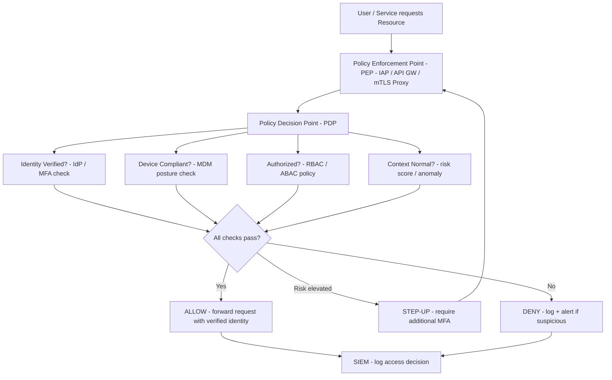

⚡ TL;DR - Zero Trust is a security architecture principle coined by John Kindervag (Forrester)
in 2010: "never trust, always verify." Traditional perimeter security: "anything inside the
corporate network is trusted." Zero Trust: "nothing is trusted by default, regardless of
network location - every access request is explicitly verified." Five pillars: Identity (verify
who is requesting), Device (verify the device is compliant), Network (micro-segment, no implicit
trust between services), Application (verify per-request, not per-session), Data (classify and
protect based on sensitivity). Key mechanisms: strong identity (MFA required, PBAC/RBAC),
continuous verification (re-auth on sensitive actions, session risk scoring), device trust
(MDM enrollment, endpoint compliance check before network access), micro-segmentation
(network policies prevent lateral movement), least privilege access (minimum permissions,
time-limited). Google's BeyondCorp (2010-2014): the foundational real-world implementation.
Removed VPN, moved access control from network perimeter to identity+device trust.
NIST SP 800-207 (2020): the US government's zero trust architecture standard.
SASE (Secure Access Service Edge): zero trust + networking delivered from the cloud edge
(Zscaler, Cloudflare One, Netskope). The key insight: the perimeter-based model collapsed
when cloud + mobile + remote work made "inside the network" meaningless.

---

| #112 | Category: Security | Difficulty: ★★★ |
|:---|:---|:---|
| **Depends on:** | OWASP Top 10, Authentication, Session Management, TLS Configuration, Business Logic, Insufficient Logging, CVSS Scoring, CVE + NVD, Kubernetes Security, Security at Scale, Privilege Escalation | |
| **Used by:** | Red/Blue/Purple Team, Zero Trust Enterprise, DevSecOps Pipeline, Enterprise Security Architecture, Security Governance, Platform Security Engineering, Multi-Cloud Security, Build vs Buy Security, SSDLC, Adversarial Thinking, Trust Boundary Analysis, Assume-Breach, Security as Contract, Threat Modeling | |
| **Related:** | OWASP Top 10, Authentication, TLS, Business Logic, Insufficient Logging, CVSS, CVE, Kubernetes Security, Security at Scale, Privilege Escalation, Red/Blue/Purple Team, Zero Trust Enterprise, DevSecOps Pipeline, Enterprise Security Architecture, Security Governance, Platform Security, Multi-Cloud Security, Adversarial Thinking, Trust Boundary Analysis, Assume-Breach | |

---

### 🔥 The Problem This Solves

**WHY THE PERIMETER MODEL FAILED:**

```
THE CASTLE-AND-MOAT MODEL (TRADITIONAL PERIMETER SECURITY):

  1990s-2000s network security assumption:
  
    INTERNET          FIREWALL          CORPORATE NETWORK
    (untrusted) ------[  GATE  ]------- (trusted)
    
    "If you're inside the network, you're a trusted employee."
    "Threats come from outside. Block the outside. Trust the inside."
    
  This model worked when:
  - All employees: in the office, on-premise.
  - All applications: in the data center.
  - All data: on servers behind the firewall.
  
  Attacker who gets INSIDE the perimeter: trusted.
  "Threat inside the walls" = not modeled.
  Lateral movement: trivially easy once inside.
  
WHAT CHANGED (AND BROKE THE PERIMETER MODEL):

  Change 1: Cloud computing (2006+)
    Applications: no longer in the data center.
    AWS, Azure, GCP: infrastructure outside the corporate network perimeter.
    Employee accessing AWS: goes through the internet.
    The "perimeter" now includes AWS, Azure, GCP.
    VPN to corporate network → internet to AWS: the model becomes meaningless.
    
  Change 2: Mobile devices (2007+)
    iPhone (2007): employees working on personal devices from home, airports, hotels.
    Corporate network: employee is "outside" the perimeter but working legitimately.
    VPN extended the perimeter to mobile, but: VPN was cumbersome + performance.
    
  Change 3: Remote work (2020 - acceleration)
    COVID-19: 100% remote overnight.
    Every employee: accessing from home network (not the corporate network).
    Home networks: not under corporate control.
    "Inside the network" became meaningless.
    
  Change 4: SaaS applications (2010+)
    Salesforce, Workday, Slack, GitHub: running on the internet, not inside the perimeter.
    Employees: authenticate directly to these services from browsers.
    No corporate network path required.
    
THE RESULT: THE PERIMETER MODEL PRODUCES INSECURE SYSTEMS

  Because the perimeter dissolved, remaining in a perimeter model means:
  
  Over-trust inside: services inside the VPN/network trust each other without auth.
  "If traffic is coming from the internal network, it must be legitimate."
  
  Once inside (via phishing, compromised endpoint, rogue insider, misconfigured VPN):
  Lateral movement: unrestricted. No authentication between internal services.
  
  The Colonial Pipeline breach (2021):
  VPN credential compromise → inside the "trusted" network.
  No MFA. No service-to-service authentication. No micro-segmentation.
  Lateral movement: IT network → OT (operational technology) network.
  Result: pipeline shutdown for 5 days. $4.4M ransom paid.
  
  Root cause: perimeter model. "Inside the VPN = trusted."
  Zero Trust model: VPN credential alone is insufficient.
  MFA required. Device trust required. Service-to-service auth required.
  Lateral movement: blocked by network micro-segmentation.

THE ZERO TRUST INSIGHT:

  "Network location is not a sufficient signal of trust."
  
  Before: access decision = "are you on the corporate network?"
  After (Zero Trust): access decision =
  "Who are you? (identity verification)
   Is your device compliant? (device trust)
   Is this access consistent with your normal behavior? (continuous verification)
   Do you have authorization for this specific resource? (least privilege)
   Is this access request from a normal context (time, location, risk score)?"
  
  All five verified on EVERY access request, not just at login.
```

---

### 📘 Textbook Definition

**Zero Trust:** A security architecture model based on the principle "never trust, always verify."
Coined by John Kindervag (Forrester Research, 2010). Core idea: trust should not be granted based
on network location (inside vs outside the corporate network). Every access request must be explicitly
authenticated, authorized, and continuously validated. NIST SP 800-207 (2020) is the US government's
formal definition: "Zero trust is a collection of cybersecurity concepts and ideas designed to minimize
uncertainty in enforcing accurate, least privilege per-request access decisions in information systems
and services in the face of a network viewed as compromised."

**BeyondCorp:** Google's internal project (2010-2014) that implemented Zero Trust before the term
was widely used. Removed the VPN entirely. Replaced the perimeter with: device trust certificates
(every company device gets a certificate from Google's CA), identity-aware proxy (all internal services
go through a proxy that verifies identity + device before forwarding), access control at the application
layer (not the network layer). Published as a research paper series (2014-2020). Inspired the zero trust
industry.

**Identity Perimeter:** The concept that in zero trust, identity (who you are, verified via strong auth)
replaces the network perimeter (where you are). The identity provider (Okta, Azure AD, Google Workspace)
becomes the trust anchor. Every access request: verified against the identity provider.

**Micro-segmentation:** Network segmentation down to the workload level, not just the VLAN level.
Traditional: segment by subnet (VLAN) - all workloads in "production VLAN" trust each other.
Micro-segmentation: each workload (pod, VM, service) has a network policy specifying exactly which
other workloads it can communicate with. Default: deny all. Lateral movement: blocked because
compromised workload A cannot reach workload B unless an explicit policy permits it.

**Continuous Verification:** In traditional security, authentication is a one-time event at login.
In zero trust, trust is continuously re-evaluated: session risk scoring, re-authentication for sensitive
operations, device compliance checks during the session. If device becomes non-compliant mid-session
(MDM reports it, OS not updated, endpoint protection disabled): session revoked.

**SASE (Secure Access Service Edge):** Zero trust + wide area networking delivered from the cloud.
Combines: cloud-delivered firewall, CASB (Cloud Access Security Broker), ZTNA (Zero Trust Network Access),
SD-WAN. Vendors: Zscaler (ZIA + ZPA), Cloudflare One, Netskope, Palo Alto Networks Prisma Access.
Replaces the corporate VPN + on-premise firewall with cloud-delivered security that follows the user.

**ZTNA (Zero Trust Network Access):** A product category that implements zero trust for network access.
Replaces VPN: instead of "you're on the network, access everything," ZTNA provides per-application
access: "you are accessing application X, we verify your identity + device + authorization for X,
then provide a direct tunnel to X only." Examples: Zscaler Private Access (ZPA), Cloudflare Access,
Google BeyondCorp Enterprise.

---

### ⏱️ Understand It in 30 Seconds

**One line:**
Zero Trust replaces "trust the network" with "verify every access request explicitly" - requiring
strong identity, device compliance, and continuous verification rather than network location as the
basis for granting access, preventing lateral movement after initial compromise.

**One analogy:**
> Traditional perimeter security is like a hotel with a lobby security guard.
>
> The lobby guard checks your key card once. You go up the elevator.
> Once you're past the lobby: you're trusted.
> You can walk into any room on any floor where a door is left open.
> You can follow a staff member through a restricted door (tailgating = insider threat).
> You can use a copied key (phished credential).
> The only check: the lobby.
>
> Zero Trust security is like every room in the hotel verifying your identity independently.
>
> You get into the elevator: verified (identity + device: MFA + MDM-enrolled phone).
> You reach Floor 5: the floor door verifies you're authorized for Floor 5.
> You reach Room 507: the room door verifies you're authorized for Room 507 specifically.
> You open the minibar: minibar verifies you've enabled that service.
> If your key card is stolen (credential compromise):
> - Traditional: attacker can access any room with an open door.
> - Zero Trust: attacker reaches the elevator. MFA challenge fails (no device).
>   Or: device compliance check fails (not enrolled phone). Access denied.
>
> Lateral movement (going from Room 507 to Room 509 without authorization):
> - Traditional: try doors until one opens.
> - Zero Trust: every door requires explicit authorization. Unauthorized rooms:
>   deny regardless of which floor you're on.
>
> The trade-off: every door verifying identity = more friction, more infrastructure.
> The payoff: stolen key card alone = much less useful to attacker.

---

### 🔩 First Principles Explanation

**NIST SP 800-207 Seven Tenets of Zero Trust:**

```
NIST SP 800-207 (2020) - Seven Tenets:

1. ALL DATA SOURCES AND COMPUTING SERVICES TREATED AS RESOURCES
   Not just servers: mobile devices, IoT sensors, laptops, printers,
   cloud services. Everything is a resource that requires access control.

2. ALL COMMUNICATION SECURED REGARDLESS OF NETWORK LOCATION
   Traffic between services inside the "corporate network" is NOT
   implicitly trusted. Service-to-service: mTLS, API key, OAuth.
   Same controls for internal traffic as external traffic.
   
3. ACCESS TO INDIVIDUAL ENTERPRISE RESOURCES GRANTED PER-SESSION
   Access is not persistent. Each access request: explicitly authorized.
   Token-based: tokens expire, must be refreshed. No permanent access.

4. ACCESS TO RESOURCES DETERMINED BY DYNAMIC POLICY
   Static "user X can access resource Y" is insufficient.
   Dynamic: user identity + device state + source network +
   behavior analytics + time of day = access decision.
   Policy engine: evaluates ALL signals continuously.
   
5. ALL ENTERPRISE-OWNED AND ASSOCIATED DEVICES MONITORED FOR POSTURE
   Device trust: MDM enrollment, OS version current, endpoint protection
   active, disk encryption enabled. Non-compliant device: access denied
   or restricted to read-only.
   
6. ALL RESOURCE AUTHENTICATION AND AUTHORIZATION DYNAMIC AND STRICTLY ENFORCED
   "Authenticate once, use session" = NOT Zero Trust.
   Step-up authentication for sensitive operations.
   Session re-evaluation on risk signal change.
   
7. ORGANIZATION COLLECTS TELEMETRY AND USES IT TO IMPROVE SECURITY POSTURE
   SIEM: log all access decisions, both allow and deny.
   Analyze: unusual access patterns → alert.
   UEBA (User Entity Behavior Analytics): model baseline behavior,
   alert on deviation.

FIVE PILLARS (often used in industry):

  Pillar 1: IDENTITY
    Who is making the request?
    - Multi-factor authentication: mandatory for all users, all resources.
    - Conditional access: if risk is high (new device, new location) → step-up auth.
    - Privileged Identity Management (PIM): just-in-time admin access.
      Admin access: not permanent. Requested for specific duration with justification.
    
  Pillar 2: DEVICE
    Is the device trustworthy?
    - MDM enrollment: all company devices managed.
    - Compliance check: OS version, patch level, endpoint protection active.
    - Certificate-based device identity: device certificate from company CA.
    - Non-compliant device: limited access (read-only) or no access.
    
  Pillar 3: NETWORK
    Is the network communication secured?
    - Micro-segmentation: each workload only communicates with authorized peers.
    - Default deny: no implicit trust between services.
    - mTLS for service-to-service: both sides verify identity.
    - DNS filtering: prevent access to malicious domains.
    
  Pillar 4: APPLICATION
    Is the application access authorized for this request?
    - Application-layer access control (not network-layer).
    - Identity-aware proxy: all apps accessed through proxy that verifies
      identity + device + authorization before forwarding.
    - Per-application access (ZTNA): access only the specific app, not the network.
    
  Pillar 5: DATA
    Is the data access appropriate for this user+context?
    - Data classification: what is the sensitivity? (public, internal, confidential, restricted)
    - DLP (Data Loss Prevention): prevent sensitive data leaving authorized channels.
    - Encryption: at rest + in transit for sensitive data.
    - Rights management: documents carry permissions with them (IRM).
```

---

### 🧪 Thought Experiment

**SCENARIO: Migrating a traditional VPN-based company to Zero Trust:**

```
CURRENT STATE (perimeter model):

  Employees: VPN to access internal applications.
  Internal applications: trusting VPN IP range, no additional auth.
  Service-to-service: internal services call each other with no auth
  (just IP filtering - same network = trusted).
  
  Security posture: depends entirely on VPN not being compromised.
  If VPN credential is phished (very common): full network access.
  Internal services: no additional auth barrier.
  Lateral movement: unrestricted.
  
ZERO TRUST MIGRATION ROADMAP (4 phases):

  PHASE 1: IDENTITY (Months 1-3)
  "Make Identity the new perimeter."
  
  Deploy: Okta (IdP) or Azure AD with:
  - MFA: mandatory for ALL users, ALL applications. No exceptions.
  - Passwordless where possible: FIDO2 hardware keys, Okta Verify push.
  - Conditional access policies:
    * New device: require device enrollment before granting access.
    * New country: require MFA step-up + notify security team.
    * Outside business hours from unusual location: restrict to read-only.
  - Privileged Identity Management (PIM):
    * No permanent admin access.
    * Admin access: requested → approved → granted for 2 hours → auto-revoked.
    
  Outcome: 80% of credential phishing attacks blocked by MFA.
  VPN credential alone: insufficient (MFA required to use VPN).
  
  PHASE 2: DEVICE (Months 3-6)
  "Trust devices, not network locations."
  
  Deploy: Intune (MDM) or Jamf for all company devices.
  Requirements: OS patched, endpoint protection active, disk encryption, screen lock.
  
  Conditional access: check device compliance before granting access.
  Non-compliant device: limited access (company email on web only, no internal apps).
  
  Outcome: compromised credentials on personal (unmanaged) device → access denied.
  Attacker needs: valid credential + enrolled compliant device.
  
  PHASE 3: APPLICATION ACCESS (Months 6-9)
  "Replace VPN with Identity-Aware Proxy."
  
  Deploy: Cloudflare Access or Google BeyondCorp Enterprise or Zscaler ZPA.
  All internal applications → behind Identity-Aware Proxy.
  Application access: authenticated + device-compliant → direct tunnel to specific app.
  NOT: access to the entire network.
  
  Outcome: VPN replaced. Attacker gets credential + device trust → accesses ONE app.
  Not the entire network. Lateral movement: blocked.
  
  PHASE 4: NETWORK MICRO-SEGMENTATION (Months 9-12)
  "Block lateral movement at the workload level."
  
  Deploy: Cilium or Calico network policies in Kubernetes.
  Default deny: all service-to-service traffic blocked unless explicitly permitted.
  mTLS: service mesh (Istio) enforces mutual authentication for service-to-service calls.
  
  Outcome: compromised service A cannot reach service B unless explicitly allowed.
  Even an attacker with root on a node: cannot pivot to other services.
  
MIGRATION CHALLENGE: THE "NEVER TRUST" CULTURAL SHIFT

  Developers: "Why do I need to re-authenticate to deploy? I'm already logged in."
  Answer: because your session may be compromised. The deployment is sensitive.
  Just-in-time access for deployments: request + approve + execute + auto-revoke.
  
  Operations: "Why can't our monitoring tool just access everything? It's internal."
  Answer: because monitoring tools are compromised frequently (lateral movement vector).
  ZTNA for monitoring: monitoring tool has a specific service identity + accesses only
  the metrics endpoints it needs, nothing else.
  
  The cultural shift: "but we trust these systems" → "we don't trust any system by default."
  Takes 6-12 months for teams to internalize.
  Zero Trust: not primarily a technology deployment. Primarily a mindset shift.
```

---

### 🧠 Mental Model / Analogy

> Zero Trust is the security architecture for the post-perimeter world.
>
> The old model: "build a strong enough wall, and inside the wall is safe."
> Modern reality: there is no wall. Cloud, mobile, SaaS, remote work.
> The "inside" is everywhere and nowhere.
>
> Zero Trust response: stop trying to build the wall.
> Instead: verify every access request as if it came from the internet.
>
> The Three Questions of Zero Trust (asked before every access grant):
>
> 1. WHO are you? (Identity + MFA)
>    Are you who you claim to be? Verified by IdP + MFA. Not just a password.
>
> 2. WHAT are you using? (Device trust)
>    Is this device managed, compliant, and trusted?
>    A legitimate employee on a compromised personal laptop: untrusted device.
>    Deny or restrict.
>
> 3. SHOULD you access THIS? (Least privilege + continuous verification)
>    Even if you are who you say and your device is trusted:
>    do you have authorization for this specific resource, at this specific time,
>    for this specific action, given your current risk score?
>
> All three must be YES. Continuously. Not just at login.
>
> The Google BeyondCorp summary:
> "We assume every request comes from an untrusted network.
>  Security depends on the identity of the user and the state of the device,
>  not the network location."
>
> This is the mental model shift:
> FROM: "network location is the security boundary"
> TO: "identity + device + authorization is the security boundary"

---

### 📶 Gradual Depth - Five Levels

**Level 1 - What it is (anyone can understand):**
Zero Trust is a security philosophy: "never trust anyone automatically - always verify." Traditional security is like a castle: the moat and walls protect you, but once inside, everyone is trusted. Zero Trust removes the walls and instead requires everyone - inside or outside - to prove who they are, prove their device is secure, and prove they're allowed to access each thing they request. Even employees connecting from the office must verify their identity for every sensitive action.

**Level 2 - How to use it (junior developer):**
As a developer, Zero Trust affects you through: (1) No more VPN-only access. You'll use an identity-aware proxy (Cloudflare Access, Google IAP) that checks who you are and device compliance before giving you access to internal services. (2) MFA: mandatory for all access. Hardware key (YubiKey) or phone app. Passwordless where possible. (3) Just-in-time (JIT) access for production: you request deployment access, it's approved, you have it for 2 hours, then it's revoked. No permanent admin access. (4) Service-to-service in Kubernetes: use mTLS (Istio) or service accounts with RBAC. Services don't trust each other by IP. They verify identity via SPIFFE/SPIRE certificates. (5) Secrets: don't put them in environment variables or config files. Use Vault or AWS Secrets Manager. Zero Trust for secrets: dynamic credentials with short TTLs.

**Level 3 - How it works (mid-level engineer):**
Identity-Aware Proxy (IAP) mechanics: user requests `https://internal-service.company.com`. DNS resolves to IAP (Cloudflare Access / Google IAP). IAP: redirects to Okta. Okta: verifies identity + MFA + conditional access policy (device compliance check via Okta Device Trust). Policy: PASS → Okta issues short-lived JWT. IAP: verifies JWT, checks authorization policy (is user in the allowed group for this service?). PASS → IAP forwards request to internal service, strips original headers, adds verified identity headers (e.g., `X-Forwarded-User: alice@company.com`). Internal service: trusts the IAP's identity header (does not need to re-authenticate itself). This replaces VPN: user never "joins the network." User accesses only the specific application, via a proxy that enforces authentication. Service mesh (Istio) for service-to-service Zero Trust: each pod gets a SPIFFE SVID (X.509 certificate). Envoy sidecar: terminates mTLS. Service A calls Service B: mTLS handshake verifies both sides' certificates. Istio AuthorizationPolicy: only allows the specific service identities that should be allowed to call each service. Default deny.

**Level 4 - Why it was designed this way (senior/staff):**
Google BeyondCorp (2014 paper series) drove the industry here. Google's insight: the VPN model creates a false sense of security. Internal network traffic was going through Google's data center networks, which were compromised (MUSCULAR NSA program, 2013 Snowden revelations). Response: "treat every request as if it comes from the internet, even if it comes from inside Google's network." The implementation: device certificates (every device gets a Google-issued certificate), access proxies (all internal services behind an access proxy that verifies identity + device), device state monitoring (continuous compliance checks). The architectural consequence: moving access control from the network layer to the application layer. Network layer ACLs: "allow traffic from IP range X." Not adequate (IP spoofing, lateral movement). Application layer policy: "allow request from user alice@google.com on device certificate DEVICE-ID-12345 with current OS patch level >= 2024-01." Specific, auditable, verifiable. The NIST SP 800-207 formalization: describes the policy decision point (PDP) and policy enforcement point (PEP) architecture. PDP: where the access decision is made (IdP + compliance engine + risk engine). PEP: where the decision is enforced (IAP, API gateway, service mesh). The two-component architecture: makes zero trust implementation modular (can implement PDP in Okta, PEP in Cloudflare Access, without coupling them).

**Level 5 - Mastery (distinguished engineer):**
Advanced Zero Trust: CARTA (Continuous Adaptive Risk and Trust Assessment - Gartner). Extends static Zero Trust to continuous risk scoring. Trust is not binary (allowed / denied). Trust is a score (0-100) that changes in real time: location changes (anomaly), access at unusual hour (risk +10), new device (risk +20), accessing sensitive data category (trigger step-up auth). Risk score feeds into dynamic access policy: normal score → standard access, elevated score → restrict to read-only or require step-up MFA, very high score → session terminated + alert SOC. User Entity Behavior Analytics (UEBA): ML baseline per user (typical access patterns, typical hours, typical applications). Deviation from baseline → risk score increase. This catches insider threats and compromised credentials that passed MFA (attacker on trusted device). Zero Trust for non-human identities: CI/CD pipelines are a major attack vector (SolarWinds breach: CI/CD compromise). OIDC federation: GitHub Actions → AWS OIDC provider → short-lived IAM role (no stored credentials). Each pipeline run: gets a fresh token for exactly the resources it needs. Workload Identity (GKE, AWS EKS): pods get SPIFFE SVID certificates via SPIRE, short-lived, bound to the workload's Kubernetes service account. No long-lived service account credentials. Zero Trust for data: attribute-based access control (ABAC). Not just "user in group X can read resource Y" but "user's clearance level >= data sensitivity level AND user's department matches data's department tag AND access is within business hours." The data carries its access policy, evaluated dynamically. This is the full realization of NIST SP 800-207 Tenet 4 (dynamic policy).

---

### ⚙️ How It Works (Mechanism)

```
ZERO TRUST ACCESS DECISION FLOW:

  User/Service requests a resource
         ↓
  Policy Enforcement Point (PEP) intercepts
  (Identity-Aware Proxy / Service Mesh Sidecar / API Gateway)
         ↓
  Policy Decision Point (PDP) evaluates:
  - Identity: is this a known user/service? MFA passed?
  - Device: is this device compliant? (MDM check)
  - Context: time, location, risk score
  - Authorization: is this identity allowed THIS resource THIS action?
         ↓
  Decision: ALLOW or DENY (or STEP-UP: require additional auth)
         ↓
  Log the decision (SIEM telemetry)
         ↓
  If ALLOW: request forwarded to resource with verified identity headers
  If DENY: 403 returned, alert generated if suspicious
```



---

### 💻 Code Example

**Cloudflare Access policy (Zero Trust application access) and Istio AuthorizationPolicy:**

```yaml
# cloudflare-access-policy.tf
# Zero Trust application access - replaces VPN for internal service access.
# Developers access internal-api.company.com without VPN.
# Cloudflare Access: verifies identity + device before forwarding.

resource "cloudflare_access_application" "internal_api" {
  zone_id          = var.cloudflare_zone_id
  name             = "Internal API"
  domain           = "internal-api.company.com"
  type             = "self_hosted"
  
  # Session duration: short (re-auth required frequently):
  session_duration = "4h"
  
  # Allowed identity providers:
  allowed_idps = [cloudflare_access_identity_provider.okta.id]
  
  # Auto-redirect to SSO (no "click to login" page):
  auto_redirect_to_identity = true
}

resource "cloudflare_access_policy" "internal_api_policy" {
  application_id = cloudflare_access_application.internal_api.id
  zone_id        = var.cloudflare_zone_id
  name           = "Allow engineering with compliant device"
  precedence     = 1
  decision       = "allow"
  
  include {
    # Require: user is in engineering Okta group:
    group = [cloudflare_access_group.engineering.id]
  }
  
  require {
    # AND: device must be managed (MDM-enrolled):
    device_posture = [cloudflare_device_posture_rule.mdm_enrolled.id]
  }
  
  # Both conditions must be true: group membership AND device compliance.
  # Compromised credential on personal device: DENIED.
}

resource "cloudflare_device_posture_rule" "mdm_enrolled" {
  zone_id     = var.cloudflare_zone_id
  name        = "Intune Managed Device"
  type        = "intune"
  description = "Device must be enrolled in Intune MDM"
  
  match {
    platform = "windows"
  }
  match {
    platform = "mac"
  }
  
  input {
    compliance_status = "compliant"  # Compliant per Intune
    is_active = true
  }
  
  schedule = "5m"  # Re-check device compliance every 5 minutes
}
```

```yaml
# istio-authorization-policy.yaml
# Zero Trust service-to-service access within Kubernetes.
# payment-service: can ONLY be called by order-service.
# All other callers: denied regardless of network location.
# (Replaces "services in the same namespace trust each other".)

apiVersion: security.istio.io/v1beta1
kind: AuthorizationPolicy
metadata:
  name: payment-service-policy
  namespace: production
spec:
  selector:
    matchLabels:
      app: payment-service
  
  # Default action: deny all traffic not matching a rule below.
  action: ALLOW
  
  rules:
  # Rule 1: Allow order-service to call /api/v1/payments (POST only):
  - from:
    - source:
        # Require mTLS identity matching order-service's SPIFFE ID:
        principals:
        - "cluster.local/ns/production/sa/order-service"
    to:
    - operation:
        methods: ["POST"]
        paths: ["/api/v1/payments"]
  
  # Rule 2: Allow observability stack to scrape Prometheus metrics:
  - from:
    - source:
        principals:
        - "cluster.local/ns/monitoring/sa/prometheus"
    to:
    - operation:
        methods: ["GET"]
        paths: ["/metrics"]

---
# Default deny all - if no AuthorizationPolicy matches: deny.
# Explicitly block everything else:
apiVersion: security.istio.io/v1beta1
kind: AuthorizationPolicy
metadata:
  name: default-deny-all
  namespace: production
spec:
  # Empty spec with no rules = deny all traffic in this namespace
  # unless a specific ALLOW policy matches.
  {}
```

```python
# zero_trust_access_checker.py
# Example: Zero Trust conditional access evaluation logic.
# In production: this is the Policy Decision Point (PDP) logic.
# Shown here to illustrate the multi-signal evaluation.

from dataclasses import dataclass
from enum import Enum
from typing import Optional
import datetime

class AccessDecision(Enum):
    ALLOW = "allow"
    DENY = "deny"
    STEP_UP_MFA = "step_up_mfa"  # Require additional MFA

@dataclass
class AccessContext:
    user_id: str
    groups: list[str]
    mfa_verified: bool
    device_id: Optional[str]
    device_compliant: bool  # From MDM
    source_country: str
    usual_countries: list[str]
    hour_utc: int  # 0-23
    risk_score: int  # 0-100
    resource: str
    action: str  # "read", "write", "admin"

def evaluate_zero_trust_access(ctx: AccessContext) -> AccessDecision:
    """
    Zero Trust Policy Decision Point.
    Every signal evaluated. Multiple signals required.
    """
    
    # DENY: not MFA-verified:
    if not ctx.mfa_verified:
        return AccessDecision.DENY
    
    # DENY: no enrolled device for sensitive actions:
    if ctx.action in ("write", "admin") and not ctx.device_id:
        return AccessDecision.DENY
    
    # DENY: device not compliant:
    if ctx.device_id and not ctx.device_compliant:
        return AccessDecision.DENY
    
    # DENY: no authorization for resource:
    # (in production: RBAC lookup against IdP groups)
    authorized = check_rbac_authorization(
        ctx.user_id, ctx.groups, ctx.resource, ctx.action
    )
    if not authorized:
        return AccessDecision.DENY
    
    # STEP_UP: unusual country (potential credential theft):
    if ctx.source_country not in ctx.usual_countries:
        return AccessDecision.STEP_UP_MFA
    
    # STEP_UP: high risk score (UEBA anomaly):
    if ctx.risk_score > 70:
        return AccessDecision.STEP_UP_MFA
    
    # STEP_UP: admin action outside business hours:
    if ctx.action == "admin" and not (8 <= ctx.hour_utc <= 20):
        return AccessDecision.STEP_UP_MFA
    
    return AccessDecision.ALLOW


def check_rbac_authorization(
    user_id: str, groups: list[str],
    resource: str, action: str
) -> bool:
    # In production: query IdP (Okta) or policy engine (OPA).
    # Simplified example:
    if action == "admin" and "security-admins" not in groups:
        return False
    if action == "write" and not any(
        g in groups for g in ["engineers", "security-admins"]
    ):
        return False
    return True  # Read access: all authenticated users
```

---

### ⚖️ Comparison Table

| Model | Trust Basis | Lateral Movement Risk | Remote Access | Cloud/SaaS Ready |
|:---|:---|:---|:---|:---|
| **Perimeter (Castle-Moat)** | Network location (inside = trusted) | Very high (no internal barriers) | VPN only | Poor (cloud is "outside") |
| **Zero Trust** | Identity + device + authorization (per request) | Low (micro-segmentation + no implicit trust) | ZTNA (app-level) | Excellent (identity-based, location-independent) |
| **Zero Trust + SASE** | Identity + device + auth + cloud-delivered enforcement | Very low | Cloud-native ZTNA | Excellent |

---

### ⚠️ Common Misconceptions

| Misconception | Reality |
|:---|:---|
| "Zero Trust means no trust anywhere - everything is suspicious." | Zero Trust means "no implicit trust based on network location." It does NOT mean "distrust everything all the time." Trust is EARNED and EXPLICIT, not automatic. After identity verification + device compliance check + authorization check: the user/service IS trusted to access that specific resource. The difference from perimeter security: that trust is earned on every request via explicit verification, not assumed because the traffic comes from the "trusted" internal network. The name is somewhat misleading. "Verify Explicitly" or "Never Assume Trust" would be more precise. NIST SP 800-207 clarifies: "Zero trust is not about making a system trustworthy - it's about making a system that grants access only when trust has been explicitly established." The practical implication: zero trust still allows access. It just requires explicit verification before allowing it. The goal is not to make everything impossible to access but to make every access decision explicit, auditable, and based on the right signals. |
| "We implemented Zero Trust by deploying MFA and a VPN upgrade." | MFA alone is Zero Trust for Identity (Pillar 1 of 5). It addresses one significant attack vector (credential phishing). It does NOT address: device trust (compromised credentials on a personal unmanaged device = MFA won't help if the device itself is malware-infected), lateral movement (once authenticated, user/service can still move laterally within the network), service-to-service trust (internal services still trust each other implicitly), data access (no attribute-based access control for sensitive data). True Zero Trust: all five pillars (Identity, Device, Network, Application, Data) must be addressed. Timeline for full zero trust: 2-4 years for a mid-sized enterprise. MFA is the correct FIRST step (highest ROI, blocks ~99% of automated attacks). It is not the complete implementation. Organizations that announce "we've implemented Zero Trust" after deploying MFA: have implemented 20% of the architecture. Vendors who sell "Zero Trust" as a single product: are selling a component. |

---

### 🚨 Failure Modes & Diagnosis

**Zero Trust implementation failures and how to detect them:**

```
FAILURE MODE 1: SHADOW IT BYPASSING THE IDENTITY-AWARE PROXY

  Symptom: users accessing internal services directly via IP address,
  bypassing Cloudflare Access or Google IAP.
  
  Cause: internal services exposed directly on internal network/VPC,
  not requiring IAP authentication when reached via internal IP.
  
  Detection: 
    - Network logs: traffic to internal service IPs NOT going through IAP.
    - Compare: IAP request logs vs actual service logs. Gap = bypass.
    
  Fix: 
    - Services: bind to 127.0.0.1 (only accessible via IAP proxy) OR
    - Add application-level authentication (verify IAP-forwarded user header).
    - Service: MUST verify the identity header even if accessed internally.

FAILURE MODE 2: DEVICE COMPLIANCE CHECK STALE

  Symptom: user's laptop has endpoint protection disabled for a week
  (manually disabled by user to speed up their machine).
  MDM compliance check: passes (stale check, not real-time).
  Cloudflare Access: allows access (device "compliance" not re-evaluated).
  
  Fix:
    - Device posture check frequency: 5 minutes (not 24 hours).
    - Revoke session immediately when device becomes non-compliant.
    - Cloudflare Access / Okta Device Trust: can integrate with MDM
      for near-real-time compliance updates.

FAILURE MODE 3: SERVICE-TO-SERVICE BYPASS OF ISTIO mTLS

  Symptom: direct pod-to-pod communication on port 8080 bypassing
  Envoy sidecar (mTLS enforcement).
  
  Cause: Istio peer authentication in PERMISSIVE mode (allows plaintext).
  
  Detection:
    - Kiali: shows non-mTLS traffic (dashed lines vs solid).
    - Istio metrics: requests_total with source_principal="unknown".
    
  Fix:
    - Set PeerAuthentication to STRICT mode (reject plaintext):
      apiVersion: security.istio.io/v1beta1
      kind: PeerAuthentication
      metadata:
        name: default-strict
        namespace: production
      spec:
        mtls:
          mode: STRICT
    - All pod-to-pod: now requires mTLS. Plaintext: rejected.
```

---

### 🔗 Related Keywords

**Prerequisites:**
- `Authentication` (SEC-013) - identity verification layer
- `Privilege Escalation` (SEC-111) - the attack Zero Trust mitigates

**Builds on this:**
- `Zero Trust Enterprise Scale` (SEC-114) - advanced zero trust implementation
- `Enterprise Security Architecture` (SEC-117) - ZTA as architectural foundation
- `Trust Boundary Analysis` (SEC-141) - formal trust boundary analysis
- `Assume-Breach Reasoning` (SEC-142) - zero trust assumes breach

---

### 📌 Quick Reference Card

```
┌──────────────────────────────────────────────────────────┐
│ PRINCIPLE     │ "Never trust, always verify" (Kindervag) │
│               │ Network location ≠ sufficient for trust  │
│               │ Identity + Device + AuthZ every request  │
├───────────────┼──────────────────────────────────────────┤
│ 5 PILLARS     │ 1. Identity - MFA, conditional access    │
│               │ 2. Device - MDM, compliance check        │
│               │ 3. Network - micro-segmentation, mTLS    │
│               │ 4. Application - IAP, ZTNA (not VPN)    │
│               │ 5. Data - classify, DLP, ABAC            │
├───────────────┼──────────────────────────────────────────┤
│ TECHNOLOGY    │ Identity-Aware Proxy (Cloudflare Access) │
│               │ ZTNA (Zscaler ZPA, Google BeyondCorp)    │
│               │ Service mesh mTLS (Istio, Linkerd)       │
│               │ MDM (Intune, Jamf) for device trust      │
│               │ PIM (just-in-time admin access)          │
├───────────────┼──────────────────────────────────────────┤
│ REFERENCE     │ BeyondCorp (Google, 2014 paper series)   │
│               │ NIST SP 800-207 (2020)                   │
│               │ Forrester ZTX (Kindervag, 2010)          │
└──────────────────────────────────────────────────────────┘
```

---

### 💎 Transferable Wisdom

**Reusable Engineering Principle:**
"Explicit is better than implicit - in code, and in security."
Python's Zen: "Explicit is better than implicit."
Zero Trust applies this to security: explicit trust is better than implicit trust.
Implicit trust ("this is the internal network, it's trusted"): fragile, unverifiable,
unauditable. Nobody can tell you WHY service A trusts service B, because there's no
explicit policy - it's just "they're in the same network."
Explicit trust (Istio AuthorizationPolicy): "service order-service, with SPIFFE identity
cluster.local/ns/production/sa/order-service, is allowed to POST to /api/v1/payments on
payment-service." Who is allowed: explicit. What they can do: explicit. Why: in the policy
(auditable). This is not just a security principle. It is a system design principle.
Implicit coupling ("this service trusts all other services in the same VPC") makes
systems fragile and insecure simultaneously. Explicit coupling ("this service accepts
calls from exactly these callers") makes systems both more secure AND more understandable.
A new engineer joining the team can read the AuthorizationPolicy and understand exactly
which services interact with payment-service. With implicit trust: they must trace through
network logs to reverse-engineer the dependency graph.
Zero Trust: better security. Also better documentation. Also better incident response
(when you have explicit policies, you can immediately see what SHOULD have happened
and compare to what DID happen). The security investment: doubles as architecture investment.

---

### 💡 The Surprising Truth

Zero Trust was invented by a network security person who realized that network security
was insufficient - and the response was to make network security irrelevant.

John Kindervag's insight at Forrester (2010): firewall engineers were spending enormous
effort making network perimeters stronger. The perimeter was getting more complex,
more expensive, and - because data and users were moving off-network - less relevant.
The more effort invested in the perimeter, the less relevant the investment became.

His counterintuitive recommendation: "Instead of making the perimeter stronger,
eliminate the concept of a trusted network entirely.
Treat ALL network traffic as potentially hostile.
Move access control to the application layer, where it can be explicit and verifiable."

This was initially controversial: "you're saying we should not trust our own network?"
Yes. Exactly. The network is untrusted. Trust is established at the application layer.

The BeyondCorp confirmation (2014): Google - a company with arguably the world's most
sophisticated network security - eliminated their trusted internal network.
If Google decided their internal network was not trustworthy enough to grant implicit trust,
the implication for organizations with less sophisticated network security is significant.

The practical result: organizations that implement Zero Trust properly often find that
their internal network becomes SIMPLER (fewer VLANs, fewer firewall rules, simpler topology),
not more complex. The network's job: route packets. The security job: application-layer
access control via identity and authorization.

Zero Trust is partly a security revolution and partly a simplification of overly complex
network security architectures that were trying to do a job they were not designed for.

---

### ✅ Mastery Checklist

**You've mastered this when you can:**
1. **STATE** the Zero Trust principle: "never trust, always verify" - network location does not
   confer trust. Every access request is explicitly verified via identity, device, and authorization.
2. **LIST** the 5 pillars: Identity (MFA, conditional access), Device (MDM, compliance check),
   Network (micro-segmentation, mTLS), Application (IAP, ZTNA), Data (classify, DLP, ABAC).
3. **EXPLAIN** BeyondCorp: Google's real-world zero trust implementation (2010-2014).
   Eliminated VPN. Access controlled by identity + device certificate, not network location.
   Published as research paper series that drove the industry.
4. **COMPARE** VPN to ZTNA: VPN = network access (once in, access all internal services).
   ZTNA = per-application access (verify identity + device + authorization → access ONE specific app).
5. **DESCRIBE** the service-to-service zero trust mechanism: Istio service mesh, mTLS with SPIFFE SVID
   certificates, AuthorizationPolicy with explicit service identity allowlists, default deny.

---

### 🎯 Interview Deep-Dive

**Q: What is Zero Trust? How does it differ from traditional perimeter security?
How would you implement it for a microservices architecture on Kubernetes?**

*Why they ask:* Tests security architecture knowledge. Very common in senior/staff engineering,
platform security, and security architecture roles. Zero Trust is now mainstream enterprise
security strategy.

*Strong answer covers:*
- Zero Trust vs perimeter: traditional = "inside network = trusted." Zero Trust = "network location
  is irrelevant, every access request explicitly verified." Problem with perimeter: cloud, mobile,
  remote work dissolved the perimeter. Once inside (phishing, VPN compromise): lateral movement
  unrestricted. Google BeyondCorp (2014) + NIST SP 800-207 (2020) as foundational references.
- Five pillars: Identity (Okta + MFA + conditional access for device compliance), Device (MDM
  enrollment, Intune/Jamf, compliance check before access), Network (micro-segmentation: default
  deny all service-to-service, explicit allow), Application (Identity-Aware Proxy for user access,
  ZTNA instead of VPN), Data (classify, DLP, ABAC).
- Kubernetes implementation: (1) Istio service mesh: mTLS for all service-to-service (STRICT mode),
  SPIFFE SVID identity, AuthorizationPolicy with explicit service identity allowlists. Default deny.
  (2) PSS Restricted profile: no privileged containers, no hostPID/hostNetwork. (3) Secrets via Vault:
  dynamic credentials, short TTLs, no long-lived secrets in YAML. (4) User access via Cloudflare Access
  or Google IAP (not VPN). (5) OIDC federation for CI/CD: no stored service account credentials.
- The lateral movement prevention: explicit AuthorizationPolicy means compromised service A cannot
  reach service B unless explicitly permitted. Traditional: same namespace = implicit trust = unrestricted
  lateral movement. Zero Trust Kubernetes: compromised pod can only reach services explicitly allowed
  in its AuthorizationPolicy + the DNS resolution is the only unrestricted path (and can be filtered).