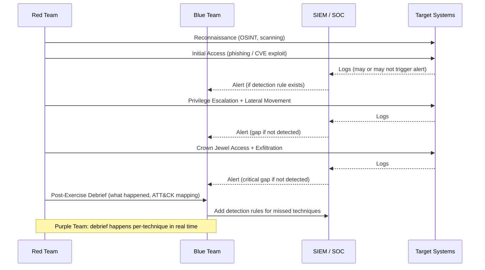

⚡ TL;DR - Red team (attackers), blue team (defenders), purple team (collaborative).
Red team: simulates a real adversary using MITRE ATT&CK-based TTPs (Tactics, Techniques,
Procedures), operates without defenders knowing exact timing/techniques, tests the FULL
security program end-to-end (detection, response, containment, recovery). Longer than a pen
test: weeks to months. Blue team: defenders who detect, investigate, and respond to red team
activity (and real attacks). Operates SOC, runs SIEM, manages CSIRT. Purple team: structured
collaboration between red and blue where both teams work together - red executes a technique,
blue immediately responds, both debrief together. More efficient than pure red/blue (faster
feedback loop, direct knowledge transfer). Key distinction from penetration test: pen test =
time-boxed (days), scoped (specific systems), technical vulnerability finding, report of
findings. Red team = continuous adversary simulation, tests people+process+technology,
goal is to test detection and response NOT just find vulnerabilities. CREST (certification
body for ethical hackers, UK/AU/SG/HK) and PTES (Penetration Testing Execution Standard):
frameworks for structured security assessments.

---

| #113 | Category: Security | Difficulty: ★★★ |
|:---|:---|:---|
| **Depends on:** | OWASP Top 10, Authentication, Session Management, TLS Configuration, Business Logic, Insufficient Logging, CVSS Scoring, CVE + NVD, IR Process, Digital Forensics, AWS Security Services, Kubernetes Security, SAST in CICD, Security Observability + SIEM, Security at Scale, ISO 27001, SOC 2 Type II, Chaos Engineering for Security, Privilege Escalation, Zero Trust Introduction | |
| **Used by:** | Zero Trust Enterprise, DevSecOps Pipeline, Enterprise Security Architecture, Security Governance, CSIRT Design, Security Metrics + FAIR, Platform Security Engineering, SSDLC, Adversarial Thinking, Trust Boundary Analysis, Assume-Breach, Security as Contract, Threat Modeling | |
| **Related:** | OWASP Top 10, Authentication, TLS, Business Logic, Insufficient Logging, CVSS, CVE, IR Process, Digital Forensics, AWS Security, Kubernetes Security, SAST in CICD, Security Observability + SIEM, Security at Scale, ISO 27001, SOC 2, Chaos Engineering for Security, Privilege Escalation, Zero Trust Introduction, Zero Trust Enterprise, DevSecOps Pipeline, Enterprise Security Architecture, Security Governance, CSIRT Design, Security Metrics, Platform Security, SSDLC, Adversarial Thinking, Trust Boundary Analysis, Assume-Breach | |

---

### 🔥 The Problem This Solves

**WHY AUTOMATED SCANNING AND PENETRATION TESTING ARE NOT ENOUGH:**

```
THE GAP BETWEEN "FINDING VULNERABILITIES" AND "VALIDATING YOUR SECURITY PROGRAM":

  Automated vulnerability scanner (Qualys/Nessus/AWS Inspector):
  Finds: known CVEs, misconfigurations, missing patches.
  Does NOT find: business logic flaws, multi-step attack chains,
  whether your SOC would detect the attack, whether your on-call team
  would respond correctly, whether your runbooks work under pressure.
  
  Penetration test (annual, external firm):
  Scope: defined, limited. "Test the web application and AWS environment."
  Duration: 5 days.
  Goal: find and document technical vulnerabilities.
  
  What a pen test finds: SQL injection, SSRF, broken access control,
  misconfigured S3 buckets, weak authentication.
  
  What a pen test does NOT find:
  - Whether your SIEM would have detected the SSRF attack.
  - Whether your on-call team would have responded within SLA.
  - Whether your network segmentation stops lateral movement.
  - Whether an attacker who gains initial access can move to sensitive systems.
  - Whether a patient, sophisticated attacker (nation-state, organized crime)
    operating over 3 months would be caught.
  
  THE TWITTER BREACH (2020):
  Attackers called Twitter employees posing as IT support.
  "We need to reset your VPN credentials."
  Employee: gave credentials. Attacker: gained access. Admin console: accessed.
  High-profile accounts (Obama, Elon Musk, Joe Biden): posted crypto scam.
  
  Did Twitter have vulnerability scanners? Yes.
  Did Twitter have penetration tests? Yes.
  What they were tested for: technical vulnerabilities in web applications.
  What the attackers used: social engineering (vishing - voice phishing).
  What the red team should have tested: can we social-engineer a Twitter employee
  to give us credentials? Does the SOC detect unusual admin console access?
  
  RED TEAM EXERCISE WOULD HAVE FOUND:
  - Social engineering susceptibility (employees giving credentials over phone).
  - Admin console access: is it monitored? Does the SOC alert?
  - Response: when unusual admin activity is detected, what happens?
  
  A red team exercise tests the SYSTEM: people + process + technology.
  Not just technology.
```

---

### 📘 Textbook Definition

**Red Team:** A group that performs adversarial simulations against an organization, operating
as a real-world attacker would. Key characteristics: operates independently of the defenders
(blue team), uses realistic TTPs (MITRE ATT&CK-based), has a specific objective (achieve
crown jewel access: exfiltrate sensitive data, gain persistent access to production), does NOT
announce the specific timing or techniques used. Duration: weeks to months. Unlike a pen test,
the red team tests whether the blue team detects and responds to the attack - not just whether
the technical vulnerability exists.

**Blue Team:** The defenders. Operates the SOC (Security Operations Center), manages SIEM (Security
Incident and Event Management), runs vulnerability management, conducts incident response. In a red
team exercise context: does NOT know the specific red team objectives or timing (this is intentional:
it must behave like defending against a real attack). After a red team exercise: conducts post-mortem
to understand what was detected, what was missed, and why.

**Purple Team:** A collaborative security testing approach where red and blue work TOGETHER.
Red team executes a specific technique. Immediately: both teams debrief. "Did blue detect this?
If not: why not? What detection rule would have caught it? Let's build it now." Then: red executes
the next technique. Faster feedback loop than pure red/blue. More educational: blue team learns
specific attack techniques and builds detection immediately. Most effective for mature security
programs that already have red/blue teams and want to accelerate detection capability development.

**Penetration Test (Pen Test):** A time-boxed (typically 3-5 days to 2 weeks), scoped security
assessment performed by ethical hackers. Goal: find and document technical vulnerabilities within
the defined scope. Delivers: written report with vulnerability findings, CVSS scores, reproduction
steps, remediation recommendations. Required for: PCI DSS, SOC 2, ISO 27001. Distinction from
red team: shorter, narrower scope, technical vulnerability focus, NOT testing detection and response.

**CREST (Council of Registered Ethical Security Testers):** A UK-based certification body for
ethical hacking professionals and security testing organizations. CREST accreditation: significant
quality assurance for pen test/red team services. Active in UK, Australia, Singapore, Hong Kong.
US equivalent: PTES (Penetration Testing Execution Standard, community standard, not certification).

**MITRE ATT&CK:** A globally accessible knowledge base of adversary tactics and techniques based
on real-world observations. Organized by Tactics (WHY: Reconnaissance, Initial Access, Execution,
Persistence, Privilege Escalation, Defense Evasion, Credential Access, Discovery, Lateral Movement,
Collection, Exfiltration, Command and Control) and Techniques (HOW: specific methods under each tactic).
Used by: red teams (which techniques to simulate), blue teams (which detections to build), purple teams
(organize exercises around specific techniques).

**Breach and Attack Simulation (BAS):** Automated, continuous adversary simulation using tools like
SafeBreach, AttackIQ, Cymulate. Automatically executes attack techniques (simulated, not real malware)
and measures whether the security controls detect/block them. Complements red team: continuous (not
annual), automated (no human attacker required), limited in sophistication (cannot simulate
creative human attackers or chain novel techniques).

---

### ⏱️ Understand It in 30 Seconds

**One line:**
Red team simulates realistic adversaries to test your full security program (detection, response,
people, process, technology) beyond what pen tests cover. Blue team defends. Purple team bridges
both for accelerated detection capability development.

**One analogy:**
> Red/Blue/Purple teams are the security program equivalent of military warfare exercises.
>
> Pen test: inspectors check your equipment and weapons.
> "Your M16 has a corroded bolt. Your Humvee has bald tires. Remediate these findings."
> Technical. Document. Remediate.
>
> Red Team exercise: a OPFOR (Opposing Force) unit attempts to take your objective.
> They don't announce when or how. They behave like a real adversary.
> The exercise tests: can your unit DETECT the OPFOR's approach?
> Can they RESPOND effectively under pressure? Do the communications work?
> Does the command structure hold up? Do the procedures work when it matters?
>
> Blue Team: your unit defending the objective using real procedures and equipment.
> Must detect the red team and respond before they achieve the objective.
>
> Purple Team: OPFOR and your unit train together. OPFOR shows "here's how we would
> approach you." Your unit immediately adapts their response. Real-time knowledge transfer.
> Less realistic (OPFOR is cooperative), but much more educational per hour invested.
>
> The key insight: even if every individual weapon, vehicle, and piece of equipment
> passes inspection (pen test finding remediated), the unit may still fail the exercise.
> Because the failure is in coordination, communication, detection, and response speed.
> The red team exercise finds THESE failures. The pen test does not.

---

### 🔩 First Principles Explanation

**MITRE ATT&CK Kill Chain - the framework red teams use:**

```
MITRE ATT&CK TACTICS (IN ORDER - THE KILL CHAIN):

  TA0043: RECONNAISSANCE
    T1590: Gather Victim Network Information
    T1589: Gather Victim Identity Information
    T1591: Gather Victim Org Information
    (passive: LinkedIn, DNS, Shodan; active: port scanning)
    
  TA0001: INITIAL ACCESS
    T1566: Phishing (most common initial vector)
    T1190: Exploit Public-Facing Application
    T1078: Valid Accounts (credential stuffing/purchased creds)
    T1133: External Remote Services (VPN, Citrix, RDP)
    
  TA0002: EXECUTION
    T1059: Command and Scripting Interpreter (PowerShell, Bash, Python)
    T1204: User Execution (user runs malicious attachment/link)
    T1053: Scheduled Task/Job (persistence + execution)
    
  TA0003: PERSISTENCE
    T1547: Boot or Logon Autostart Execution
    T1136: Create Account (backdoor user account)
    T1098: Account Manipulation (add SSH key to existing account)
    
  TA0004: PRIVILEGE ESCALATION
    T1055: Process Injection (DLL injection, reflective injection)
    T1068: Exploitation for Privilege Escalation (kernel CVEs)
    T1548: Abuse Elevation Control Mechanism (sudo, SUID, UAC bypass)
    
  TA0005: DEFENSE EVASION
    T1562: Impair Defenses (disable logging, stop security services)
    T1070: Indicator Removal (clear logs, delete files)
    T1036: Masquerading (rename malicious binary to legitimate name)
    T1027: Obfuscated Files/Information (encoded payloads)
    
  TA0006: CREDENTIAL ACCESS
    T1003: OS Credential Dumping (LSASS, /etc/shadow, AWS metadata)
    T1110: Brute Force (password spraying, credential stuffing)
    T1552: Unsecured Credentials (in files, environment variables)
    
  TA0007: DISCOVERY
    T1083: File and Directory Discovery
    T1087: Account Discovery
    T1016: System Network Configuration Discovery
    T1046: Network Service Discovery (port scanning internal network)
    
  TA0008: LATERAL MOVEMENT
    T1021: Remote Services (SSH, RDP, SMB with harvested credentials)
    T1550: Use Alternate Authentication Material (pass-the-hash, ticket)
    T1534: Internal Spearphishing (pivot to email internal users)
    
  TA0009: COLLECTION
    T1005: Data from Local System (sensitive files, configs, keys)
    T1213: Data from Information Repositories (Confluence, SharePoint)
    T1074: Data Staged (compress + stage before exfiltration)
    
  TA0010: EXFILTRATION
    T1048: Exfiltration Over Alternative Protocol (DNS tunneling, HTTPS to non-corp)
    T1041: Exfiltration Over C2 Channel
    T1567: Exfiltration to Cloud Storage (Google Drive, Dropbox)
    
  TA0011: COMMAND AND CONTROL (C2)
    T1071: Application Layer Protocol (HTTPS C2 blends with normal traffic)
    T1573: Encrypted Channel (TLS-encrypted C2)
    T1572: Protocol Tunneling (DNS tunneling)

RED TEAM PLANNING: CHOOSE AN OBJECTIVE, THEN WORK BACKWARDS

  Objective: "exfiltrate the customer PII database."
  
  Reverse-engineer the path:
  Exfil: need to get data OUT → T1567 (to S3 or GDrive)
  Collection: need to access DB → T1005, T1213
  Lateral movement: need to reach DB server → T1021 (SSH)
  Credential access: need DB credentials → T1552 (in app config)
  Initial access: need foothold → T1566 (phishing) or T1190 (web app)
  
  Red team: executes this path. Tests whether blue team detects any stage.
  If blue team detects at initial access: good. Goal achieved without crown jewels.
  If blue team doesn't detect until lateral movement: detection gap found.
  If blue team doesn't detect at all: critical detection gap. Significant finding.
```

---

### 🧪 Thought Experiment

**SCENARIO: A company conducts their first red team exercise:**

```
COMPANY: 200-person Series C fintech startup.
         SOC: 2 analysts + 1 SIEM (Datadog).
         Security team: small (3 people).
         
RED TEAM: external firm (3 people), 4-week engagement.
         Objective: gain access to production database containing customer PII.
         Rules of engagement: no DoS, no destructive actions, no social engineering.
         (First red team: limited scope. Social engineering added in year 2.)
         
WEEK 1 - RECONNAISSANCE:

  Red team: OSINT on company.
  LinkedIn: finds 4 engineers with "AWS" in their profile. Names, email patterns.
  GitHub: searches for company repos. Finds public repo (deprecated).
  In deprecated repo: .env file from 2021 with AWS access keys.
  Keys: deleted user, no longer valid.
  
  But: company uses AWS account structure from that repo.
  Account numbers exposed. Region: us-east-1.
  
  Shodan scan of company's IP ranges:
  Finds: Jenkins server exposed on port 8080 to internet.
  Jenkins: version 2.346 (CVE-2022-30946: sandbox bypass).
  
WEEK 2 - INITIAL ACCESS:

  Red team: exploits Jenkins CVE-2022-30946.
  Gains code execution as the jenkins user.
  jenkins: has AWS IAM role attached (deployment role).
  IAM role: has s3:GetObject, ecr:*, ecs:RunTask permissions.
  
  Blue team: no alert. Jenkins server: not sending logs to SIEM.
  (Jenkins was set up by a contractor 18 months ago. Never added to SIEM.)
  
WEEK 3 - LATERAL MOVEMENT:

  Red team: uses IAM role to list ECS services.
  Finds: production ECS tasks (ecs:ListTasks).
  Uses ECS exec (ecs:ExecuteCommand) to get shell in a running production container.
  
  Blue team: ALERT! CloudTrail log: ecs:ExecuteCommand from unusual IP.
  Analyst: investigates. Sees: Jenkins IP. Assumes: "probably a deployment pipeline."
  Closes alert. NOT ESCALATED.
  
  Note: this is a realistic finding. Analysts see automation-like activity
  and mentally attribute it to CI/CD pipelines.
  
WEEK 4 - CROWN JEWEL ACCESS:

  Red team: from inside the ECS container, finds database connection string.
  Connects to RDS PostgreSQL.
  Dumps customer PII table: 50,000 records.
  Exfiltrates to external S3 bucket (controlled by red team).
  
  Blue team: no alert. RDS query logs: not enabled.
  Data exfiltration to external S3: no alert (no Macie or S3 exfil detection).
  
FINDINGS REPORT:

  Critical:
  1. Jenkins exposed to internet without MFA → initial access vector.
  2. Jenkins IAM role overly permissive (ecs:ExecuteCommand not needed).
  3. ECS Exec enabled in production → container shell access.
  4. Blue team did not escalate ecs:ExecuteCommand alert → detection gap.
  
  High:
  5. RDS query logs not enabled → no visibility into database queries.
  6. No Macie or data exfiltration detection for S3.
  
  Process:
  7. Alert triage: analysts dismissing automation-like alerts → training gap.
  
  BLUE TEAM REFLECTION:
  "We detected the ECS exec. But we assumed it was pipeline activity.
   We need a rule: ecs:ExecuteCommand from IP range outside the CI/CD system → CRITICAL alert.
   Not HIGH (which can be investigated later). CRITICAL (immediate response required)."
   
  POST-EXERCISE REMEDIATION PLAN (priority order):
  1. Remove Jenkins from public internet (behind Cloudflare Access).
  2. Disable ECS Exec in production.
  3. Reduce Jenkins IAM role to deployment-only (no ecs:ExecuteCommand).
  4. Enable RDS query logs → send to SIEM.
  5. Enable Macie for S3 PII detection.
  6. Add SOC training: legitimate CI/CD vs suspicious automation activity.
```

---

### 🧠 Mental Model / Analogy

> Red/Blue/Purple teams are the security program's immune system - constantly training.
>
> The immune system: constantly exposed to pathogens (red team).
> Some pathogens cause illness (successful attack). Recovery happens (blue team response).
> Immunity is built (detection rules improved, runbooks updated).
> Future exposure to the same pathogen: detected and fought faster (purple team knowledge transfer).
>
> Red team: introduces the pathogen in controlled conditions.
> Blue team: develops the immune response.
> Purple team: accelerates immunity development by directly teaching the immune system
>              how to recognize this specific pathogen.
>
> An organization with no red team: immune system never tested.
> First real pathogen (real attack): may overwhelm the untested response.
>
> An organization with annual pen tests only: immune system tested for specific known pathogens.
> Novel pathogen (new attack technique): no prior immunity. May not detect.
>
> An organization with continuous purple team exercises:
> Immune system continuously learning new attack patterns.
> Detection rules continuously updated to cover new techniques.
> Response procedures continuously refined based on what the immune system missed.
>
> The purple team insight: instead of waiting to get sick (real attack) or
> being tested by a random pathogen (pure red team with unknown techniques),
> work together to INTENTIONALLY develop immunity to every known attack technique
> in the MITRE ATT&CK framework.
>
> Coverage goal: "for every ATT&CK technique relevant to our threat model,
>                 we have a tested detection rule."
> This is measurable. Improvable. Auditable.

---

### 📶 Gradual Depth - Five Levels

**Level 1 - What it is (anyone can understand):**
Red team vs blue team is a security practice where one group of security experts acts as attackers (red team) and tries to break into the company's systems using realistic methods - like real hackers would. Another group (blue team) defends - they must detect and stop the attack. Purple team: both groups work together, with the attackers explaining what they're doing so the defenders can immediately learn how to detect it. The goal: find gaps in the company's defenses before real attackers do, and fix them.

**Level 2 - How to use it (junior developer):**
As a developer, red/blue team exercises affect you through: (1) Findings that become your work: "SQL injection found in the order API" → you fix it. "AWS credentials in git" → you implement git-secrets in pre-commit. (2) Security awareness: red teams often test social engineering. "Will employees give credentials over the phone?" - you'll receive security training about recognizing phishing/vishing. (3) Bug bounty programs: structured way for external security researchers to report findings before red teams find them in critical systems. (4) Purple team participation: engineering teams may be invited to observe purple team exercises so they understand what detection engineering does and how their code creates (or prevents) detection opportunities.

**Level 3 - How it works (mid-level engineer):**
Red team engagement workflow: (1) Kickoff: define rules of engagement (what's in scope, what's prohibited, emergency stop signal), define crown jewel objective, agree on report format. (2) Reconnaissance: OSINT, scanning, finding attack surface. (3) Initial access attempt: phishing, CVE exploitation, credential stuffing. (4) Post-exploitation: privilege escalation, lateral movement, persistence. (5) Crown jewel access attempt. (6) Report: detailed findings with MITRE ATT&CK TTP mapping, evidence (screenshots, logs), CVSS scores, remediation. Detection coverage measurement: after the exercise, map every red team action to MITRE ATT&CK. For each action: was it detected? If not: why? Add detection rule. This creates a MITRE ATT&CK coverage heatmap: which techniques have detection coverage (green), which do not (red). Goal: cover all Tier 1 techniques (most commonly observed in real attacks) before covering Tier 2.

**Level 4 - Why it was designed this way (senior/staff):**
Red team vs pen test: the distinction is important for security maturity. Penetration tests were the industry standard for 20+ years. They serve compliance (PCI DSS, SOC 2: "annual pen test"). But the problem: pen tests find vulnerabilities. Red teams test security programs. A company can have zero critical vulnerabilities (pen test: clean) and a broken detection/response program (red team: 3 weeks undetected). The shift to red team exercises: driven by the realization that sophisticated attackers (APT, nation-state) don't use known vulnerabilities exclusively. They chain techniques. They operate patiently. They social-engineer. They use legitimate tools (living off the land). A pen test with 5 engineers in 5 days cannot simulate this. Red teams operating for 4 weeks: can. The purple team evolution: pure red/blue is efficient for finding detection gaps but not for closing them. The knowledge transfer from red to blue is slow (red team report → blue team reads report → implements detections = weeks). Purple team collapses this: attack → immediate debrief → detection built same day. More security capability per unit of time invested.

**Level 5 - Mastery (distinguished engineer):**
Advanced red team techniques: living-off-the-land (LOLbins - using legitimate OS tools: certutil, mshta, regsvr32, wmic on Windows; curl, python3, bash on Linux). These bypass signature-based detection because the executables are legitimate. Detection: behavioral analysis, not signature. "certutil downloading from an external URL" → alert. Not "certutil is present" (always present). C2 (Command and Control) evolution: modern red teams use cloud-based C2 (Cobalt Strike on Azure/AWS), domain fronting (CDN-based C2 traffic blends with legitimate CDN traffic), DNS-over-HTTPS tunneling (C2 traffic in encrypted DNS queries). Detection: requires deep packet inspection or ML-based traffic analysis. Adversary simulation platforms: Caldera (MITRE), Vectr (reporting), Covenant (C2 framework). Breach and Attack Simulation (BAS) for continuous coverage measurement: SafeBreach, AttackIQ execute hundreds of simulated attacks automatically against production-equivalent environments. BAS metrics: "82% of ATT&CK Tier 1 techniques are detected by current SIEM rules." Gap: 18% have no detection. Prioritize building detections for those. Red team intelligence (CTI) integration: what TTPs are used by the threat actors most likely to target your industry? Financial services: FIN7, Lazarus Group (North Korea). Healthcare: Fin12 (ransomware). Use CTI to select which ATT&CK techniques to prioritize in red team exercises and purple team coverage building.

---

### ⚙️ How It Works (Mechanism)

```
RED TEAM ENGAGEMENT LIFECYCLE:

  Planning                  Reconnaissance            Initial Access
  (rules, objective)  →     (OSINT, scanning)    →   (phishing, CVE)
         ↓
  Post-Exploitation    →    Crown Jewel Access   →   Report
  (privesc, lateral,        (data exfil,              (findings, CVSS,
  persistence)              persistence)              ATT&CK mapping)
  
  PARALLEL: Blue Team operates - attempting to detect and respond.
  Post-exercise: detection gap analysis (what was missed, why, fix).
```



---

### 💻 Code Example

**Purple team exercise structure and MITRE ATT&CK technique execution:**

```bash
#!/bin/bash
# purple-team-exercise.sh
# Purple team: execute ATT&CK technique, debrief immediately.
# Technique: T1552.001 - Credentials in Files
# Hypothesis: SIEM should detect grep for password-like patterns in /home and /opt.

# ── RED TEAM STEP ───────────────────────────────────────

echo "PURPLE TEAM EXERCISE"
echo "Technique: T1552.001 - Credentials in Files"
echo "Hypothesis: SIEM should alert on credential harvesting activity"
echo "---"

echo "RED TEAM: Executing credential file discovery..."

# Simulate what an attacker would do after gaining shell access:
# Search for credentials in common locations.
find /home /opt /var/www /etc -type f \
  \( -name "*.env" -o -name "*.conf" -o -name "*.config" \
     -o -name "*.yml" -o -name "*.yaml" -o -name "*.json" \) \
  -readable 2>/dev/null | head -20

grep -r "password\|passwd\|secret\|api_key\|token" \
  /home /opt /var/www 2>/dev/null | \
  grep -v ".git" | \
  grep -v "^Binary" | \
  head -20

echo "---"
echo "RED TEAM: Actions complete. Waiting for blue team to debrief."
echo "Time: $(date +%H:%M:%S)"

# ── BLUE TEAM DEBRIEF ────────────────────────────────────

cat << 'EOF'
BLUE TEAM: Check if SIEM detected this activity.

Expected detection (if rules exist):
  - Splunk/Elastic query:
    process.name="find" AND (command_line CONTAINS "/home" OR "/opt")
    AND command_line CONTAINS ".env"
  
  - OR: auditd rule detecting access to .env files:
    -a always,exit -F arch=b64 -S openat \
    -F path=/home -F name_type=PARENT \
    -k credential_access
    
If NOT detected:
  Action: add detection rule.
  
Splunk detection rule to add:
index=linux_auditd
| where process_name="grep" OR process_name="find"
| where command_line MATCHES ".*(password|passwd|secret|api_key|token).*"
| stats count by host, user, command_line
| where count > 5
| eval severity="high"
| alert when triggered

DEBRIEF QUESTIONS:
1. Was this detected? (Yes / No / Partial)
2. If yes: how quickly?
3. If no: what detection rule would catch this?
4. Can we build that rule now? (purple team: immediate action)
5. MITRE coverage update: T1552.001 - [detected / added rule / gap]
EOF
```

```python
# attack-coverage-tracker.py
# Track ATT&CK technique coverage from purple team exercises.
# Used to measure detection engineering progress over time.

from dataclasses import dataclass
from typing import Optional
from datetime import date
import json

@dataclass
class ATTACKTechnique:
    technique_id: str      # e.g., "T1552.001"
    name: str
    tactic: str            # e.g., "Credential Access"
    tier: int              # 1 = highest priority, 2 = medium, 3 = lower
    
    # Coverage status:
    detection_exists: bool
    detection_rule_id: Optional[str]  # SIEM rule ID
    last_tested: Optional[date]
    test_result: Optional[str]  # "detected", "missed", "partial"
    notes: Optional[str]


# Current ATT&CK coverage state (example for a mid-size company):
COVERAGE = [
    ATTACKTechnique(
        technique_id="T1078.004",
        name="Valid Accounts: Cloud Accounts",
        tactic="Initial Access",
        tier=1,
        detection_exists=True,
        detection_rule_id="GD-001",  # GuardDuty finding
        last_tested=date(2024, 9, 15),
        test_result="detected",
        notes="GuardDuty fires in ~12 min. Target: 5 min. Investigate."
    ),
    ATTACKTechnique(
        technique_id="T1552.001",
        name="Unsecured Credentials: Credentials In Files",
        tactic="Credential Access",
        tier=1,
        detection_exists=False,
        detection_rule_id=None,
        last_tested=date(2024, 10, 20),
        test_result="missed",
        notes=(
            "Purple team: grep for passwords not detected. "
            "Action: add auditd + Splunk rule by 2024-11-01."
        )
    ),
    ATTACKTechnique(
        technique_id="T1021.004",
        name="Remote Services: SSH",
        tactic="Lateral Movement",
        tier=1,
        detection_exists=True,
        detection_rule_id="SIEM-042",
        last_tested=date(2024, 8, 10),
        test_result="detected",
        notes="SSH from unusual source IP: detected in 3 min. PASS."
    ),
    ATTACKTechnique(
        technique_id="T1567.002",
        name="Exfiltration to Code Repository",
        tactic="Exfiltration",
        tier=1,
        detection_exists=False,
        detection_rule_id=None,
        last_tested=None,
        test_result=None,
        notes="Not yet tested. Queue for next purple team session."
    ),
]


def coverage_report(techniques: list) -> dict:
    tier1 = [t for t in techniques if t.tier == 1]
    detected = [t for t in tier1 if t.detection_exists]
    
    coverage_pct = (len(detected) / len(tier1) * 100) if tier1 else 0
    
    gaps = [t for t in tier1 if not t.detection_exists]
    not_tested = [t for t in tier1 if t.last_tested is None]
    
    return {
        "tier1_total": len(tier1),
        "tier1_with_detection": len(detected),
        "tier1_coverage_pct": round(coverage_pct, 1),
        "gaps": [{"id": t.technique_id, "name": t.name} for t in gaps],
        "not_yet_tested": [
            {"id": t.technique_id, "name": t.name} for t in not_tested
        ],
    }


if __name__ == "__main__":
    report = coverage_report(COVERAGE)
    print(f"ATT&CK Tier 1 Coverage: {report['tier1_coverage_pct']}%")
    print(f"Covered: {report['tier1_with_detection']} / {report['tier1_total']}")
    print("\nDetection Gaps:")
    for gap in report['gaps']:
        print(f"  - {gap['id']}: {gap['name']}")
    print("\nNot Yet Tested:")
    for item in report['not_yet_tested']:
        print(f"  - {item['id']}: {item['name']}")
```

---

### ⚖️ Comparison Table

| Aspect | Penetration Test | Red Team | Purple Team | BAS |
|:---|:---|:---|:---|:---|
| **Duration** | 3-5 days to 2 weeks | 4-12 weeks | 1-2 days (per session) | Continuous |
| **Goal** | Find technical vulnerabilities | Test full security program | Build detection coverage | Measure control effectiveness |
| **Blue team aware?** | Usually yes (white box/gray box) | No (tests real response) | Yes (collaborative) | Yes |
| **Output** | Vulnerability report | Detection gaps + kill chain | ATT&CK coverage map | Coverage % dashboard |
| **Compliance use** | SOC 2, PCI DSS, ISO 27001 | Optional (mature programs) | N/A | Continuous measurement |
| **Cost** | Medium ($15-50K) | High ($50-250K) | Medium ($20-80K/session) | Subscription ($50-200K/yr) |
| **Best for** | Technical vulnerability finding | Testing people+process+tech | Accelerating detection capability | Continuous measurement |

---

### ⚠️ Common Misconceptions

| Misconception | Reality |
|:---|:---|
| "We have a red team, so we don't need penetration tests." | Red teams and penetration tests serve different purposes and are COMPLEMENTARY, not substitutes. Penetration tests: technical vulnerability identification within a defined scope. Required for compliance (PCI DSS, SOC 2). Red teams: test the full security program (detection, response, lateral movement resistance). Not a compliance substitute for pen tests (auditors want the structured pen test report with CVSS scores and remediation tracking). The maturity progression: (1) Start with pen tests (compliance, technical vulnerability baseline). (2) Add red team exercises when the security program is mature enough to benefit (SOC exists and can detect things, IR runbooks exist and can be tested). (3) Add purple team when both red and blue capabilities exist and you want to accelerate detection improvement. (4) Add BAS for continuous coverage measurement. All four: different tools for different purposes. Starting red team before establishing a SOC: the red team will be completely undetected (no one is watching). The red team exercise tells you: "your SOC doesn't exist." Not useful. Pen test first. Build SOC. Then red team. |
| "Red team exercises require disclosing everything to the security vendor." | Red team disclosures to the security firm (attack surface, systems, objectives): standard practice and necessary. But WHICH EMPLOYEES know about the exercise matters significantly. The correct disclosure model for red team: (1) The person authorizing the exercise: knows (CISO, CTO, CEO). Provide "get out of jail free" letter: if the red team is caught by law enforcement or IT, they can provide this letter to prove authorization. (2) A small group of trust: the exercise coordinator (1-2 people in security who manage the engagement). These people do NOT disclose to the SOC or IT teams. (3) Everyone else: does NOT know. Why: if the blue team knows an exercise is occurring, they're in "heightened alert" mode. The exercise tests NORMAL defensive operations, not "maximum alert" mode. The red team exercise must be realistic: defenders behave as they normally would, not as they would during a known test. The exception (purple team): blue team knows the specific technique being executed (because they're collaborating). But the timing of techniques in purple team: typically not announced days in advance. "We're running T1552.001 right now" - announced at the moment of execution, not the week before. |

---

### 🚨 Failure Modes & Diagnosis

**Common red team / blue team exercise failures and lessons:**

```
FAILURE MODE 1: RED TEAM COMPLETELY UNDETECTED - NOTHING TO LEARN

  Symptom: red team operates for 4 weeks, achieves objective, zero alerts.
  
  Root cause: blue team capability is immature.
  SIEM: misconfigured or incomplete log sources.
  SOC: understaffed or not monitoring actively.
  
  This outcome: not failure of the red team exercise design.
  It's a FINDING: the detection program needs significant investment
  before a red team exercise adds value.
  
  Better approach for this maturity level:
  1. Complete SIEM log source coverage audit first.
  2. Run purple team exercises to build detection coverage.
  3. Then run a red team exercise to test detection under realistic conditions.

FAILURE MODE 2: RED TEAM DETECTED AND STOPPED TOO QUICKLY (SCOPE PROBLEM)

  Symptom: red team detected at initial access in 2 hours.
  Exercise ends. Report: "you detected us." No lateral movement tested.
  
  Root cause: overly narrow red team objective, OR blue team was tipped off.
  
  Fix: 
  - Expand scope: what happens AFTER initial access?
  - Red team: simulate a second, different initial access path.
  - Goal: not just "detected vs not detected" but full kill chain test.
  - "You detected the phishing. Did you also block the web app path?"

FAILURE MODE 3: PURPLE TEAM TOO SLOW - 30 MINUTES PER TECHNIQUE

  Symptom: purple team exercise: 4 techniques in 8 hours.
  Slow because: each debrief goes deep, detours into architecture discussions.
  
  Fix: 
  - Time-box debrief: 15 minutes per technique maximum.
  - If deeper investigation needed: JIRA ticket, offline.
  - Focus purple team on: "did it detect? Y/N. If N: what rule would catch it? Build it."
  - Target: 6-8 techniques per day.
  
ATT&CK COVERAGE METRICS TO TRACK:

  Tier 1 detection coverage %: target > 80%.
  Mean time to detect (MTTD) per ATT&CK technique:
    Initial Access: < 5 minutes (automated detection via GuardDuty/SIEM).
    Lateral Movement: < 15 minutes (anomaly-based detection).
    Exfiltration: < 5 minutes (Macie + S3 DLP detection).
  
  These metrics: tracked quarterly. Presented to CISO + board.
  Trend: improving? Security program is maturing.
  Flat or declining: investment needed.
```

---

### 🔗 Related Keywords

**Prerequisites:**
- `Security Observability + SIEM` (SEC-106) - blue team's primary tool
- `Chaos Engineering for Security` (SEC-110) - shared methodology
- `Privilege Escalation` (SEC-111) - core red team technique

**Builds on this:**
- `CSIRT Design` (SEC-121) - CSIRT responds to real attacks caught by blue team
- `Security Metrics + FAIR` (SEC-122) - ATT&CK coverage as security metric
- `Adversarial Thinking` (SEC-140) - red team exercises adversarial thinking

---

### 📌 Quick Reference Card

```
┌──────────────────────────────────────────────────────────┐
│ RED TEAM     │ Adversary simulation. MITRE ATT&CK based  │
│              │ Weeks-months. Tests people+process+tech   │
│              │ Blue team does NOT know timing/techniques │
│              │ Crown jewel objective                     │
├──────────────┼──────────────────────────────────────────-│
│ BLUE TEAM    │ Defenders. SOC + SIEM + IR.               │
│              │ Must detect + respond to red team attacks  │
│              │ Post-exercise: gap analysis + new rules   │
├──────────────┼──────────────────────────────────────────-│
│ PURPLE TEAM  │ Collaborative. Per-technique debrief.     │
│              │ Faster detection capability development   │
│              │ ATT&CK coverage % as output metric        │
├──────────────┼──────────────────────────────────────────-│
│ PEN TEST     │ Technical vuln finding. Scoped. Days.     │
│              │ SOC 2 / PCI DSS compliance required        │
│              │ NOT substitute for red team               │
├──────────────┼──────────────────────────────────────────-│
│ MITRE ATT&CK │ Tactics: what (recon, init access, etc)  │
│              │ Techniques: how (T1566 phishing, etc)     │
│              │ Coverage map: green=detected, red=gap     │
└──────────────────────────────────────────────────────────┘
```

---

### 💎 Transferable Wisdom

**Reusable Engineering Principle:**
"Test the system under adversarial conditions, not just functional conditions."
Software engineering equivalent: chaos engineering tests "what happens when components fail."
Security equivalent: red team tests "what happens when an adversary is actively attacking."
The common principle: you cannot assume a system works correctly under adversarial/failure conditions
based only on observing it work correctly under normal conditions.
This principle generalizes beyond security:
- Game theory: stress test strategies against adversarial opponents, not just cooperative ones.
- Distributed systems: test under Byzantine fault conditions (nodes acting maliciously/incorrectly).
- Machine learning: adversarial examples (inputs designed to fool ML models).
- Business strategy: war gaming (what does the competitor do if we launch this product?).
In security: the adversarial condition is a real attacker.
The only way to know whether your security program handles this condition:
test it under realistic adversarial conditions (red team) or continuous simulated adversarial conditions (BAS).
"We believe our security controls work" → not enough.
"We tested our security controls under adversarial conditions and here is the measured outcome" → the standard for mature security programs.
The shift from belief to measurement: the maturity step that red/purple team exercises enable.

---

### 💡 The Surprising Truth

The most valuable outcome of a red team exercise is often something that was NOT the primary objective.

Red team objective: "gain access to the customer PII database."
Primary outcome expected: vulnerability findings.

The most valuable actual finding from many red team exercises:
"The blue team detected us 3 times but closed the alerts as false positives."

This is more damaging than any technical vulnerability: the defenders are seeing attacks
and choosing not to act on them. Not because they're incompetent.
Because the alert was labeled HIGH (not CRITICAL), it appeared to come from internal IP ranges
(like CI/CD), and the analyst's mental model was "probably automated process."

The red team's most powerful contribution: revealing the cognitive biases that
cause defenders to dismiss real attack signals.

Common dismissals found in red team exercises:
- "This came from our CI/CD IP range" (red team was on a compromised CI server)
- "The alert fired during business hours, attackers work at night" (false assumption)
- "This would be too obvious if it were a real attack" (attackers ARE obvious sometimes)
- "We haven't been targeted before, so this is probably noise" (base rate neglect)

The fix: not a new detection rule. A training exercise for analysts.
"Here are 10 alerts. 3 are real red team activity. 7 are false positives. Identify the 3."
Practiced regularly: analysts develop better threat signal discrimination.

This is the lesson that no automated scanner or pen test report delivers.
Only a realistic adversarial exercise with human analysts in the loop.

---

### ✅ Mastery Checklist

**You've mastered this when you can:**
1. **DISTINGUISH** red team from penetration test: red team = weeks-months, adversary simulation,
   tests detection+response, blue team unaware. Pen test = days-weeks, vulnerability finding,
   defined scope, compliance evidence. BOTH needed. Not substitutes.
2. **EXPLAIN** MITRE ATT&CK structure: Tactics (why: recon, initial access, lateral movement, exfil)
   + Techniques (how: T1566 phishing, T1021 remote services). Red teams map their actions to ATT&CK.
   Blue teams build detections for each technique. Coverage % = detection maturity metric.
3. **DESCRIBE** purple team mechanics: red executes one technique, both teams debrief immediately,
   blue builds detection rule for that technique, repeat. Faster coverage development than pure red/blue.
4. **STATE** when to use each: pen test first (compliance + technical baseline). Red team when SOC
   exists and can detect things. Purple team when both red/blue capabilities exist and want to
   accelerate coverage. BAS for continuous measurement.
5. **NAME** key frameworks and certifications: MITRE ATT&CK (TTPs), CREST (UK certification body
   for ethical hackers), PTES (Penetration Testing Execution Standard).

---

### 🎯 Interview Deep-Dive

**Q: What is the difference between a red team and a penetration test?
When would you use each? How would you measure the effectiveness of your security operations team?**

*Why they ask:* Tests security operations and security program maturity understanding.
Common in CISO-reporting roles, security engineering leadership, and platform security.

*Strong answer covers:*
- Pen test vs red team: pen test = time-boxed (5-14 days), scoped, technical vulnerability finding,
  report format (CVSS scores, remediation). Red team = 4-12 weeks, adversary simulation using MITRE
  ATT&CK TTPs, tests full security program (people+process+technology), blue team unaware of timing,
  goal = test whether blue team detects and responds. BOTH needed: pen test for compliance + technical
  baseline, red team for testing operational security program.
- When to use each: pen test = annual (SOC 2 CC7.2, PCI DSS 11.3), before major architecture changes,
  when entering new compliance frameworks. Red team = once SOC is operational and can detect things
  (otherwise exercise shows nothing). Purple team = when both red/blue capabilities exist, want to
  accelerate ATT&CK coverage.
- Measuring SOC effectiveness: MITRE ATT&CK coverage % (what % of Tier 1 techniques have tested
  detection rules). MTTD (Mean Time to Detect): from event to alert. MTTR (Mean Time to Respond):
  from alert to containment. Alert fatigue rate: what % of alerts are investigated vs ignored.
  False positive rate: % of alerts that turn out to be benign. Purple team cadence: how many techniques
  covered per quarter. Red team findings trend: same finding appearing in two consecutive annual
  red team exercises = systemic program failure.
- BAS (Breach and Attack Simulation): automated continuous ATT&CK technique simulation (SafeBreach,
  AttackIQ). Complements red team: continuous (vs annual), automated (vs human). Limitation: cannot
  simulate creative human attackers or novel technique chains. Used for: monitoring detection coverage
  regression (did a SIEM rule break after an upgrade?).