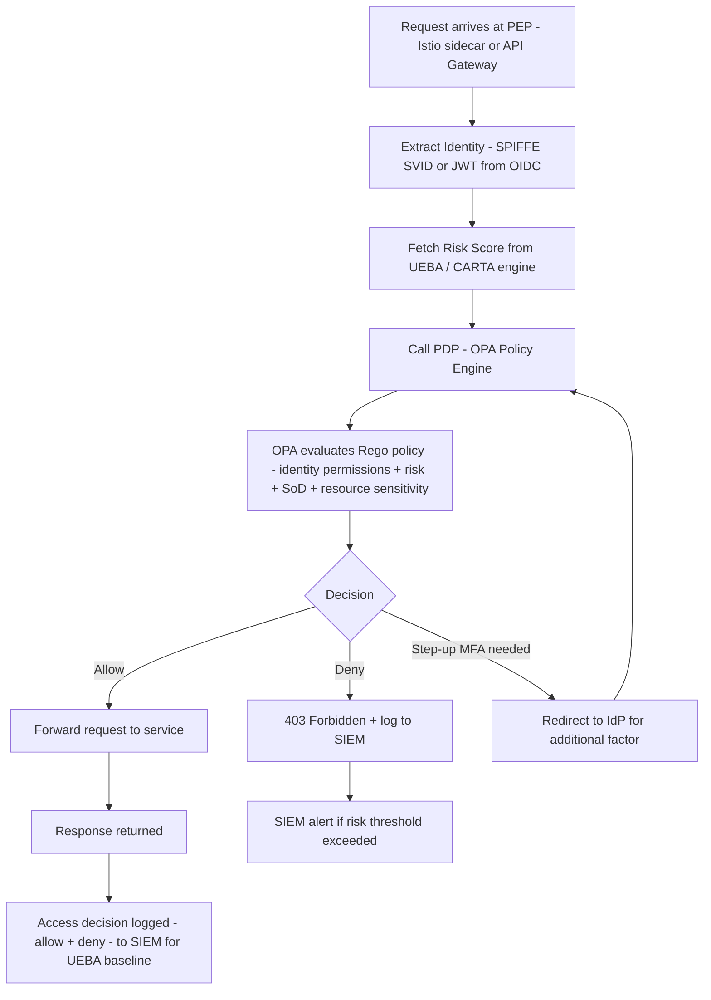

⚡ TL;DR - Zero Trust at enterprise scale introduces problems that the introduction-level
implementation (MFA + Identity-Aware Proxy + Istio) doesn't address: identity governance at
scale (thousands of identities: human, service, machine, CI/CD, IoT), privileged access
management (PAM - just-in-time admin access with approval workflows), policy engine complexity
(thousands of per-resource authorization policies that must be centrally managed), service mesh
scalability (Istio control plane bottlenecks at 1000+ services), multi-cloud consistency (enforce
the same Zero Trust policy across AWS + Azure + GCP), legacy system integration (systems without
modern auth that can't be retrofitted), UEBA (User Entity Behavior Analytics for continuous
risk scoring), and the organizational change management challenge. Key enterprise-scale patterns:
centralized policy engine (OPA/Cedar as Policy Decision Point across all environments), Vault
enterprise for dynamic secrets at scale (lease management, audit, namespacing), SPIFFE/SPIRE
for workload identity federation across clouds, identity governance platform (SailPoint/Saviynt)
for automated access reviews and SoD enforcement, PAM (CyberArk/BeyondTrust) for privileged
access. The enterprise insight: Zero Trust is not primarily a technology deployment. It is a
continuous process of driving trust decisions out of infrastructure and into explicit, auditable
policy. At enterprise scale: that process requires dedicated governance, engineering, and
executive sponsorship over a 3-5 year transformation timeline.

---

| #114 | Category: Security | Difficulty: ★★★★★ |
|:---|:---|:---|
| **Depends on:** | OWASP Top 10, Authentication, Session Management, TLS Configuration, Business Logic, Insufficient Logging, CVSS Scoring, CVE + NVD, Kubernetes Security, Security at Scale, Privilege Escalation, Zero Trust Introduction, Red/Blue/Purple Team | |
| **Used by:** | DevSecOps Pipeline, Enterprise Security Architecture, Security Governance, Security Metrics + FAIR, Platform Security Engineering, Multi-Cloud Security, Build vs Buy Security, SSDLC, Adversarial Thinking, Trust Boundary Analysis, Assume-Breach, Security as Contract, Threat Modeling | |
| **Related:** | OWASP Top 10, Authentication, TLS, Business Logic, Insufficient Logging, CVSS, CVE, Kubernetes Security, Security at Scale, Privilege Escalation, Zero Trust Introduction, Red/Blue/Purple Team, DevSecOps Pipeline, Enterprise Security Architecture, Security Governance, Security Metrics, Platform Security, Multi-Cloud Security, Adversarial Thinking, Trust Boundary Analysis, Assume-Breach | |

---

### 🔥 The Problem This Solves

**WHAT BREAKS WHEN ZERO TRUST INTRODUCTION-LEVEL CONCEPTS MEET ENTERPRISE REALITY:**

```
ENTERPRISE IDENTITY PROBLEM:

  Introduction-level Zero Trust: "verify identity with MFA."
  
  Enterprise reality at a 5,000-person company:
  
  Human identities: 5,000 employees + 2,000 contractors.
  Service identities: 3,000 microservices (each with its own service account).
  Machine identities: 10,000 server/device certificates.
  CI/CD identities: 200 pipelines (each with AWS/GitHub credentials).
  External partner identities: 500 B2B API integrations.
  
  Total identities: ~20,000+.
  
  Problems:
  1. Lifecycle management: when a contractor's contract ends,
     are ALL 7 access grants revoked? Manually? Who tracks this?
     Identity governance platform (SailPoint/Saviynt): automated lifecycle.
     
  2. Separation of Duties (SoD): user A should NOT have both
     "approve purchase orders" AND "create vendors" access.
     (Classic fraud prevention requirement.)
     SoD conflict detection: automated in identity governance.
     Without it: conflicts discovered only during audits (too late).
     
  3. Role explosion: at scale, ad-hoc permissions accumulate.
     User requests: "I need access to X."
     IT: grants X. And Y (similar). And Z (in case).
     Result: 6 months later, 1,000 unique permission combinations.
     RBAC (Role-Based Access Control): undefined when everything is ad-hoc.
     Identity governance: role mining (identify actual roles from permission data).
     
PRIVILEGED ACCESS MANAGEMENT (PAM) PROBLEM:

  Introduction-level Zero Trust: "admins use MFA."
  
  Enterprise reality:
  "Admin" is not one thing. Many privileged roles:
  - AWS account root (never used directly in mature orgs).
  - AWS IAM admin (can do anything in the AWS account).
  - Database superuser.
  - Kubernetes cluster-admin.
  - Windows Domain Admin.
  - CISO's AD account.
  - The break-glass "emergency admin" account.
  
  Problems:
  1. Permanent admin: "senior engineer has AWS admin permanently."
     Admin privilege: used 2 hours/month for maintenance.
     Available 24/7/365 as an attack surface.
     
     Just-in-Time (JIT) admin: request → approval → 2-hour window → auto-revoke.
     Attack surface: 2 hours instead of 8,760 hours (a year).
     
  2. Shared privileged accounts: "the database admin account is: admin/[shared password]."
     Multiple people using the same credentials.
     Audit log: impossible to attribute to individual.
     SOX/PCI compliance: violation.
     
     PAM (CyberArk, BeyondTrust): individual check-out of shared accounts.
     Each person: individually authenticated, individual session recorded.
     Audit log: attributable to specific individual.
     
  3. Privileged session recording: "what did the admin do during the maintenance window?"
     Without recording: only the admin's word.
     PAM with session recording: full keystroke/screen recording.
     Audit: verifiable. Insider threat: deterred.
     
POLICY ENGINE SCALE PROBLEM:

  Introduction-level Zero Trust: "Istio AuthorizationPolicy per service."
  
  Enterprise reality: 3,000 microservices × an average of 10 callers each =
  30,000 AuthorizationPolicy entries. Managed how?
  
  Problems:
  1. Policy drift: developer adds a temporary policy ("just for testing").
     Production: stays permanently. Review process: none.
     After 6 months: no one knows why payment-service allows test-harness to call it.
     
  2. Policy conflicts: Service A allows B. Policy X denies B for all services.
     Which wins? Depends on Istio evaluation order. Not obvious.
     Without central policy management: undiscoverable.
     
  3. Cross-environment consistency: 3 AWS accounts + Azure + GCP.
     Istio in each. Different teams managing each.
     Policy: "users in the 'contractor' group cannot access production data."
     How to enforce this consistently across all 3 clouds without a central policy engine?
     
  Solution: OPA (Open Policy Agent) or Cedar as centralized Policy Decision Point.
  All enforcement points (Istio, API gateways, cloud IAM, application layer): query OPA.
  Policies: defined once, enforced everywhere. Versioned in Git. Code-reviewed.
  
MULTI-CLOUD CONSISTENCY PROBLEM:

  "Zero Trust" in AWS: IAM conditions + CloudFront + Cognito.
  "Zero Trust" in Azure: Azure AD Conditional Access + API Management.
  "Zero Trust" in GCP: IAP + BeyondCorp Enterprise.
  
  Three different systems, three different policy languages, three different audit logs.
  
  How to answer: "does a user in the 'contractor' group have access to PII anywhere?"
  With three separate systems: extremely difficult. Manual reconciliation.
  
  Solution: identity federation (Okta as IdP for all three), centralized policy engine (OPA),
  cloud-agnostic audit aggregation (security lake).
```

---

### 📘 Textbook Definition

**Identity Governance and Administration (IGA):** The discipline of managing the lifecycle
of digital identities (create, provision, modify, deprovision) and governing access rights
(certify access, enforce SoD, detect and remediate over-provisioning). Enterprise platforms:
SailPoint IdentityNow, Saviynt, Omada Identity. Capabilities: automated joiner/mover/leaver
workflows, access request + approval, periodic access certification, SoD policy enforcement,
role management, audit reporting.

**Privileged Access Management (PAM):** The security discipline of managing, monitoring, and
auditing privileged accounts (accounts with elevated permissions: domain admin, root, database
superuser). Enterprise platforms: CyberArk Privileged Access Security, BeyondTrust Privileged
Remote Access, Delinea Secret Server. Capabilities: just-in-time (JIT) privilege elevation,
privileged credential vaulting (no one knows the admin password, checked out from vault),
session recording (keystroke + screen capture for all privileged sessions), session isolation
(admin sessions go through the PAM proxy, never directly to the target), least privilege
enforcement (admin rights only for the specific system and duration needed).

**Just-in-Time (JIT) Privileged Access:** Admin privileges requested on-demand, approved
(automated or by manager), granted for a specific duration (e.g., 2 hours), automatically revoked
at expiration. Reduces the window of privilege availability from permanent to time-limited.
If credentials are compromised: attacker has only the remaining time in the window.
Tools: Azure AD PIM (Privileged Identity Management), CyberArk Just-in-Time Access, Teleport.

**SPIFFE (Secure Production Identity Framework For Everyone) / SPIRE (SPIFFE Runtime Environment):**
An open standard and implementation for workload identity. Each workload (pod, VM, function) receives
a SPIFFE Verifiable Identity Document (SVID) - an X.509 certificate issued by SPIRE. Identity:
`spiffe://company.com/ns/production/sa/payment-service`. Cross-cloud: SPIRE instances in each cloud
federate to create a single trust domain. Service-to-service: verify identity regardless of cloud/cluster.

**OPA (Open Policy Agent):** An open-source, general-purpose policy engine. Policies: written in
Rego (declarative language). Input: any JSON (HTTP request context, Kubernetes admission request,
API call). Output: allow/deny + optional explanation. Deployed as: sidecar, service, or OPA Gatekeeper
in Kubernetes. Used for: Kubernetes admission control (OPA Gatekeeper), API authorization, RBAC,
infrastructure policy (Terraform plans). The "policy-as-code" principle: policies in Rego are
version-controlled, code-reviewed, and tested like application code.

**Cedar:** AWS's open-source policy language (also used in AWS Verified Permissions and Amazon AVP).
Designed specifically for authorization decisions. Advantages over Rego: simpler, easier to audit,
formally verifiable. Statement: "when principal is User Alice, resource is Document:123, action is
read, context.time is business_hours → allow." Deterministic, no side effects, can be formally
verified. Growing adoption: especially in AWS-native environments.

**UEBA (User Entity Behavior Analytics):** ML-based detection that models baseline behavior for each
user/entity and alerts on significant deviations. Baseline: typical login times, typical applications
accessed, typical data volumes, typical locations. Deviation: "user typically accesses 50 files/day,
today accessed 500 files - potential insider threat or compromised account." Tools: Splunk UBA,
Microsoft Sentinel with UEBA, Exabeam. Complements: rule-based SIEM (catches known-bad signatures)
with anomaly detection (catches unusual but not yet signature-matched behavior).

---

### ⏱️ Understand It in 30 Seconds

**One line:**
Zero Trust at enterprise scale requires solving identity governance (20,000+ identities with
automated lifecycle and SoD enforcement), privileged access management (JIT admin with session
recording), centralized policy engine (OPA/Cedar for consistent policy across clouds), and
multi-cloud consistency - problems invisible in small-scale Zero Trust implementations.

**One analogy:**
> Zero Trust introduction is like implementing a keycard system in a 10-person startup.
> One ID provider (Okta), one door, clear rules.
>
> Zero Trust at enterprise scale is like implementing a keycard system in a hospital complex:
> 5,000 employees, 2,000 contract staff, 500 visiting physicians, 10,000 connected devices,
> 150 buildings, 3 campuses, and strict compliance requirements.
>
> The keycard system works for the startup. But the hospital needs:
>
> Identity governance: when a resident's rotation ends, all 7 access grants are automatically revoked.
> (Without this: ex-residents still accessing patient records 3 months later.)
>
> Privileged access management: the surgery scheduling system admin password is vaulted.
> Surgeon needs access: checks out password for 2 hours, session recorded.
> No one knows the actual password (not even the admin). It's vaulted.
>
> Multi-building policy consistency: "residents cannot access patient financial records."
> This policy: enforced in Building A (older system), Building C (newer system), and the
> offsite clinic (third system). Three systems, one policy, centrally managed.
>
> UEBA: "Dr. Smith usually accesses 20 patient records per day.
> Tonight at 2 AM: accessed 500 records." Alert: is this an authorized night shift?
> Or a compromised credential? Investigate.
>
> The hospital keycard system: requires a team, not just a technology. A process. Governance.
> Zero Trust enterprise: same scale, same need for dedicated governance.

---

### 🔩 First Principles Explanation

**Enterprise Zero Trust architecture components:**

```
ENTERPRISE ZERO TRUST REFERENCE ARCHITECTURE:

  LAYER 1: IDENTITY PLANE

  Human Identity (Employees + Contractors):
    Okta / Azure AD (IdP)
    ↓
    MFA: hardware keys (FIDO2/YubiKey) for privileged + admin users.
         TOTP/push for standard users.
    ↓
    Conditional Access:
      New device → device enrollment required.
      New country → step-up MFA + SOC alert.
      Risk score > 70 → step-up MFA.
    ↓
    Identity Governance (SailPoint/Saviynt):
      Joiner: new employee → automated role assignment.
      Mover: role change → access review + update.
      Leaver: termination → automated deprovisioning within 24h.
      Access certifications: quarterly automated reviews.
      SoD enforcement: flag and remediate conflicts automatically.
  
  Privileged Human Access (Admins):
    PAM (CyberArk/BeyondTrust/Teleport):
      No permanent admin. All admin: JIT.
      Request → approve (manager + security) → 2-hour window → auto-revoke.
      Session recording: all privileged sessions logged.
      Credential vaulting: admin passwords unknown to humans, checked out from vault.
  
  Non-Human Identity (Services + CI/CD + Machines):
    SPIFFE/SPIRE: workload identity certificates.
    OIDC federation: CI/CD → cloud provider (no stored secrets).
    Vault enterprise: dynamic secrets (DB credentials, cloud creds, TLS certs).
    Machine certificates: PKI with auto-rotation (cert-manager / Vault PKI).
    
  LAYER 2: POLICY PLANE

  Centralized Policy Decision Point (OPA / Cedar):
    Single source of truth for authorization policies.
    Policies: written in Rego (OPA) or Cedar.
    Version-controlled: Git, code-reviewed, tested.
    
    Enforcement points that query the policy engine:
    - Istio (service mesh): sidecar queries OPA for authz decisions.
    - API gateway: Kong / Apigee queries OPA for request authorization.
    - Kubernetes admission: OPA Gatekeeper blocks non-compliant resources.
    - Application layer: custom SDK calls OPA for fine-grained decisions.
    - Infrastructure: Conftest (OPA for Terraform plans).
    
  Example OPA policy (Rego):
  
    allow if {
      input.method == "GET"
      input.path == "/api/v1/orders"
      "orders:read" in data.user_permissions[input.user_id]
      not data.suspended_users[input.user_id]
      input.risk_score < 50
    }
    
  LAYER 3: NETWORK PLANE

  External access (users → applications):
    SASE (Zscaler / Cloudflare One):
    No VPN. All user traffic: through SASE cloud.
    ZTNA (Zero Trust Network Access): per-application access.
    CASB: cloud application access control.
    DLP: prevent sensitive data leaving to unauthorized destinations.
    
  Internal access (service-to-service):
    Service mesh (Istio / Linkerd) with mTLS (STRICT mode).
    SPIFFE/SPIRE: identity for service mesh certificates.
    Default deny: all service-to-service traffic denied by default.
    AuthorizationPolicy: explicit allow per service pair + action.
    
  Multi-cloud consistency:
    SPIRE federation: single trust domain across AWS + Azure + GCP.
    OPA: same policy engine queried from all clouds.
    Okta: single IdP for all clouds (OIDC federation).
    
  LAYER 4: DATA PLANE

  Data classification: automated (Macie for AWS S3, MDCA for Microsoft 365).
  DLP: prevent sensitive data leaving authorized channels.
  Encryption: all data at rest (AES-256), all data in transit (TLS 1.3).
  Rights management: IRM for sensitive documents (access controls travel with data).
  
  LAYER 5: OBSERVABILITY PLANE

  All access decisions logged: allow AND deny.
  SIEM aggregation: all clouds, all IdPs, all enforcement points → single SIEM.
  UEBA: baseline behavior + anomaly detection.
  SOAR: automated response to high-confidence threats.
```

---

### 🧪 Thought Experiment

**SCENARIO: Zero Trust transformation at a 2,000-person company - year 1 vs year 3:**

```
YEAR 1 POSTURE (pre-Zero Trust):

  Identity: Active Directory (on-premise), 30% MFA adoption.
  Access: VPN for all remote access (FortiClient).
  Service-to-service: IP filtering (same VPC = trusted).
  Privileged access: permanent admin accounts (5 admins have permanent AWS admin).
  Audit: manual, quarterly spot checks.
  
  Security incidents in prior 12 months:
  - 3 credential compromises (phishing). VPN access: immediate after credential theft.
  - 1 insider threat: ex-contractor with access not revoked for 3 months.
  - 1 lateral movement: dev account compromised → moved to production DB (same VPC).
  
YEAR 1 EXECUTION (Pillar 1: Identity - highest ROI):

  Month 1-2:
  - Migrate to Okta (IdP). Sync with Active Directory.
  - Enable MFA: pilot with IT (100% adoption). Roll out company-wide.
  - Phishing-resistant MFA for all engineers and admin roles (hardware keys).
  
  Month 3-4:
  - Conditional access: new device → device enrollment. New country → step-up + alert.
  - Identity governance (SailPoint): joiner/leaver automation.
    Leaver process: Workday termination → Okta deprovisioning → < 4 hours (not 3 months).
    
  Month 5-6:
  - Privileged access: deploy Teleport (PAM) for SSH and Kubernetes access.
    No direct SSH to production. All access: through Teleport.
    Admin access: JIT (request → manager approval → 2-hour window → auto-revoke).
    Session recording: all production access recorded.
  
  End of Year 1 result:
  - Phishing attacks: 3 credential compromises → zero. MFA blocks credential-only attacks.
  - Insider threat: leaver deprovisioning SLA 4 hours (was 3 months).
  - PAM: no permanent admin. All privileged access: JIT + recorded.
  
  Investment: $200K (Okta + SailPoint + Teleport licenses + 1 FTE for implementation).
  ROI: eliminated 3 credential-compromise incidents (average cost: $250K each).
  
YEAR 2 EXECUTION (Pillar 3: Network + Pillar 4: Application):

  Month 7-12 (Year 1 continuation):
  - Deploy Istio service mesh in Kubernetes. Enable mTLS STRICT.
  - AuthorizationPolicy: default deny, explicit allows per service pair.
  - ZTNA (Cloudflare Access): replace VPN for user-to-application access.
    Users access specific applications, not the entire network.
    Device compliance check integrated (Intune).
    
  Year 2 (Months 13-24):
  - OPA Gatekeeper: Kubernetes admission control.
    Policy: no privileged pods, no hostPath, resource limits required.
    All non-compliant pod specs: rejected at admission (not just alerted).
  - Vault enterprise: dynamic database credentials (1-hour TTL).
    Services: no static database passwords. Vault issues credentials per session.
  - SPIFFE/SPIRE: workload identity for all production services.
    Istio certificates: issued by SPIRE (not self-signed).
  
YEAR 3 EXECUTION (Pillar 5: Data + Continuous Refinement):

  - Macie: automated PII detection in S3.
  - MDCA (Microsoft Defender for Cloud Apps): CASB for SaaS applications.
  - UEBA: Splunk UBA baselining all user behavior.
    First true anomaly detection: catches behavior that rules-based SIEM misses.
  - OPA centralized policy: all enforcement points (Istio, API GW, apps) query OPA.
    Policy changes: PR → review → merge → deployed everywhere automatically.
  - Multi-cloud: SPIRE federation with Azure (Azure AKS cluster added).
  
  Year 3 security posture:
  - All network traffic: mTLS authenticated.
  - All user access: identity-aware proxy (no direct network access).
  - All privileged access: JIT, vaulted, session-recorded.
  - All identities: governed (automated lifecycle).
  - All policies: centralized in OPA, versioned in Git.
  - MTTD for lateral movement: < 2 minutes (Istio AuthorizationPolicy blocks + logs).
  
  Year 3 incidents:
  - 0 successful lateral movement incidents (AuthorizationPolicy prevents it).
  - 1 compromised credential: JIT access meant attacker had 14 minutes of a pending window.
    UEBA detected anomaly. Access revoked in 8 minutes. Blast radius: 1 service.
    (In Year 1: same credential = full VPN network access, potentially days.)
```

---

### 🧠 Mental Model / Analogy

> Enterprise Zero Trust at full implementation is the difference between
> "every door has a lock" and "every door knows WHO you are and WHETHER you should
> be opening it, right now, for this specific reason."
>
> The technology is complex. The principle is simple:
>
> At every trust boundary - human to system, system to system, cloud to cloud -
> replace implicit trust with explicit, measured, time-limited, auditable trust.
>
> The enterprise dimension adds two hard problems:
>
> PROBLEM 1: Scale. 20,000 identities. 3,000 services. 3 clouds.
> You cannot manually manage this. Automation is not optional.
> Identity governance platforms, PAM tools, and policy engines exist
> precisely because human-scale management of Zero Trust fails at enterprise scale.
>
> PROBLEM 2: Legacy. Enterprise means 20-year-old systems.
> The mainframe. The Oracle EBS. The on-premise Active Directory.
> These don't support OIDC, mTLS, or modern auth.
> Zero Trust for legacy: use a proxy (broker authentication in front of the legacy system).
> The legacy system: doesn't know about Zero Trust. The proxy enforces it.
> The migration: decades, not years.
>
> The executive summary for Zero Trust enterprise:
> "It's a 3-5 year transformation, not a product purchase.
>  It requires dedicated teams, sustained investment, and board-level support.
>  The outcome: attacks that used to spread undetected for months
>  are now contained in minutes."
>
> That last sentence: the business case that justifies the investment.

---

### 📶 Gradual Depth - Five Levels

**Level 1 - What it is (anyone can understand):**
Enterprise Zero Trust means applying the "never trust, always verify" principle to a large company with thousands of employees, hundreds of systems, and multiple cloud providers. The challenge: doing this consistently and automatically across everything, when the scale makes manual management impossible. It requires software tools for identity governance (automatically managing who has access to what), privileged access management (ensuring only admins have admin access, and only when needed), and a central policy engine (one place that makes all security decisions across all systems).

**Level 2 - How to use it (junior developer):**
At an enterprise-scale Zero Trust company, you interact with: (1) Just-in-time access: to access production, you request access through a PAM tool (Teleport, BeyondTrust, CyberArk). Your request: approved, granted for 2 hours, auto-revoked. No permanent SSH to production. (2) OPA policy errors: when deploying via Kubernetes, OPA Gatekeeper may reject your pod spec ("privileged containers not allowed"). These are Zero Trust policies, not bugs. Fix your pod spec. (3) OIDC federation in CI/CD: your GitHub Actions pipeline doesn't use stored AWS credentials. It uses OIDC to get a short-lived role. If you see `token expired` errors: the OIDC token TTL is exceeded; the pipeline needs to re-request.

**Level 3 - How it works (mid-level engineer):**
SPIFFE/SPIRE implementation: SPIRE Server runs as a trusted server in the cluster. SPIRE Agent runs as DaemonSet on each node. When a pod starts: SPIRE Agent attests the pod's identity (verifies it matches expected workload in SPIRE's registry). Issues: X.509 SVID (certificate) with identity `spiffe://company.com/ns/production/sa/payment-service`. TTL: 1 hour (automatically rotated). Istio: configured to use SPIRE as the CA. All sidecar certificates: issued by SPIRE. Service A calls Service B: mTLS handshake, both sides present SPIRE-issued certificates. Istio AuthorizationPolicy: matches on SPIFFE identity, not IP. Cross-cloud: SPIRE Server in AWS and SPIRE Server in Azure federate. Service in AWS trusting service in Azure: uses the federated bundle. OPA integration: Istio Envoy sidecar calls OPA external authorizer for each request. OPA: evaluates the request against current policies. Response: allow/deny + optional response headers.

**Level 4 - Why it was designed this way (senior/staff):**
The separation of Policy Decision Point (PDP) from Policy Enforcement Point (PEP) is fundamental to enterprise-scale Zero Trust. PEP (enforcement): Istio sidecar, API gateway, admission webhook. PEP handles the request traffic (high volume, low latency requirements). PEP does NOT contain policy logic - it delegates to PDP. PDP (decision): OPA. Contains all policy logic. Evaluated off the hot path (cached, or async). This separation: (1) Enables policy changes without code deployment (update OPA policy → instant global effect). (2) Enables policy testing (unit test Rego policies without deploying). (3) Enables policy audit (all decisions logged by OPA, not scattered across enforcement points). (4) Enables policy reuse (same OPA policy evaluated by Istio, API gateway, Lambda - no duplicated logic). The alternative: each service implements its own authorization logic. Result at scale: 3,000 services × different authorization implementations = inconsistency, drift, and audit nightmare. Central PDP: one policy, tested, auditable, consistent. This mirrors the microservices principle of "separate what changes together": policy logic (changes with business rules) separated from enforcement infrastructure (changes with platform upgrades).

**Level 5 - Mastery (distinguished engineer):**
CARTA (Continuous Adaptive Risk and Trust Assessment): Gartner's extension of Zero Trust to real-time risk scoring. Trust is not binary (allowed/denied). Trust is a continuous score. Implementation: risk score stream (0-100) per user/session, updated in real-time from: UEBA (behavior anomaly), threat intelligence (IP reputation, user in threat database), device posture (MDM events), authentication strength (hardware key = high trust, SMS OTP = lower trust). Access policy: not "if in group X → allow" but "if risk_score < threshold_for_resource → allow." Threshold per resource: low-sensitivity endpoint → risk < 80 required. PII endpoint → risk < 30 required. Production admin → risk < 10 required. Dynamic demotion: user's risk score jumps to 60 mid-session (UEBA anomaly: unusual file access pattern). Active sessions: automatically restricted to lower-sensitivity operations until risk drops or step-up MFA clears it. This is NIST SP 800-207 Tenet 4 in practice: dynamic policy that evaluates all available signals. The hardest enterprise Zero Trust problem: the 20-year-old legacy system that cannot be retrofitted. Approach: authentication broker (modern auth in front, legacy auth behind). SAP ECC: doesn't support OIDC. Solution: Okta Identity Governance + SAP connector (translates Okta authentication to SAP session tokens). The translation layer: isolated, auditable, and allows legacy system to participate in Zero Trust ecosystem without modification. This is the long-term enterprise trajectory: every system behind a modern auth broker, even if the underlying system is decades old.

---

### ⚙️ How It Works (Mechanism)

```
ENTERPRISE ZERO TRUST - DECISION FLOW:

  Request arrives at enforcement point (Istio/API GW)
         ↓
  PEP extracts identity (from mTLS cert / JWT)
         ↓
  PEP calls PDP (OPA) with request context
  (identity, resource, action, context)
         ↓
  PDP evaluates: identity permissions + risk score + SoD + time
         ↓
  Decision: allow / deny / step-up
         ↓
  PDP logs decision to SIEM
         ↓
  PEP enforces decision
```



---

### 💻 Code Example

**OPA Rego policy for enterprise authorization and SPIRE workload identity:**

```rego
# enterprise-authz.rego
# OPA policy: enterprise Zero Trust authorization.
# Evaluated for every request at all enforcement points.
# version-controlled, code-reviewed, unit-tested.

package enterprise.authz

import future.keywords.if
import future.keywords.in

# DECISION: allow request if all conditions pass.
default allow = false

allow if {
    identity_verified
    device_compliant
    authorized_for_resource
    not sod_violation
    risk_score_acceptable
}

# 1. IDENTITY: principal must have a verified SPIFFE identity
#    or a validated JWT from the trusted IdP.
identity_verified if {
    startswith(input.principal, "spiffe://company.com/")
}

identity_verified if {
    input.jwt.iss == "https://company.okta.com"
    input.jwt.exp > time.now_ns() / 1e9  # Not expired
}

# 2. DEVICE: for human users, device must be MDM-compliant.
#    Service-to-service: always compliant (SPIFFE identity = device implicit).
device_compliant if {
    startswith(input.principal, "spiffe://")  # Service identity - skip check
}

device_compliant if {
    input.device_posture.compliant == true
    input.device_posture.last_checked_seconds_ago < 300  # <5 min stale
}

# 3. AUTHORIZATION: principal must have permission for this resource+action.
authorized_for_resource if {
    permission := sprintf("%s:%s", [input.resource_type, input.action])
    permission in data.permissions[input.principal]
}

authorized_for_resource if {
    # Group-based authorization:
    group := data.group_memberships[input.principal][_]
    permission := sprintf("%s:%s", [input.resource_type, input.action])
    permission in data.group_permissions[group]
}

# 4. SOD: detect and block Separation of Duties violations.
#    Example: user cannot have both "approve" and "create" for financial resources.
sod_violation if {
    input.resource_type == "financial_transaction"
    input.action == "approve"
    "financial_transaction:create" in data.permissions[input.principal]
}

sod_violation if {
    input.resource_type == "vendor"
    input.action == "create"
    "purchase_order:approve" in data.permissions[input.principal]
}

# 5. RISK: risk score must be below threshold for the resource's sensitivity.
risk_score_acceptable if {
    sensitivity := data.resource_sensitivity[input.resource_type]
    threshold := data.risk_thresholds[sensitivity]
    input.risk_score < threshold
}

# Resource sensitivity levels:
# (stored in OPA data, updated by risk engine):
# data.resource_sensitivity.pii_endpoint = "high"
# data.risk_thresholds.high = 30
# data.risk_thresholds.medium = 60
# data.risk_thresholds.low = 90
```

```yaml
# spire-server.yaml
# SPIFFE/SPIRE server configuration for enterprise workload identity.
# Issues SVID certificates for all workloads across the cluster.

apiVersion: v1
kind: ConfigMap
metadata:
  name: spire-server-config
  namespace: spire
data:
  server.conf: |
    server {
      bind_address = "0.0.0.0"
      bind_port = "8081"
      
      # Trust domain: company's SPIFFE domain:
      trust_domain = "company.com"
      
      # Certificate TTL: short for security, reasonable for performance:
      default_svid_ttl = "1h"
      
      # CA configuration:
      ca_subject = {
        country = ["US"],
        organization = ["Company Inc"],
        common_name = "company.com SPIRE CA",
      }
    }
    
    plugins {
      # Attestation: verify node identity via AWS instance attestation:
      NodeAttestor "aws_iid" {
        plugin_data {
          access_key_id = ""   # Uses instance profile credentials
          secret_access_key = ""
        }
      }
      
      # Workload attestation: verify pod identity via Kubernetes:
      WorkloadAttestor "k8s" {
        plugin_data {
          skip_kubelet_verification = false
        }
      }
      
      # Key manager: store keys in AWS KMS (HSM-backed):
      KeyManager "aws_kms" {
        plugin_data {
          region = "us-east-1"
          key_policy_file = "/run/spire/conf/key-policy.json"
        }
      }
    }
    
    # Federation with Azure SPIRE (cross-cloud):
    federation {
      bundle_endpoint {
        address = "0.0.0.0"
        port = 8443
      }
      federates_with "azure.company.com" {
        bundle_endpoint_url = "https://spire-azure.company.com:8443"
        bundle_endpoint_profile "https_spiffe" {
          endpoint_spiffe_id = "spiffe://azure.company.com/spire/server"
        }
      }
    }
```

```terraform
# jit-access.tf
# Just-in-time privileged access using Teleport.
# Engineers request access → approved → 2-hour window → auto-revoke.
# Session recording: all privileged sessions logged to S3.

# Teleport cluster configuration:
resource "teleport_role" "production_readonly" {
  version = "v6"
  metadata = {
    name = "production-readonly"
    description = "Read-only access to production systems"
  }
  spec = {
    allow = {
      # SSH access: only to servers tagged "env: production":
      node_labels = { "env" = ["production"] }
      logins      = ["ubuntu", "ec2-user"]
      # No write access, no exec of privileged commands:
      rules = [
        {
          resources = ["session"]
          verbs      = ["read", "list"]
        }
      ]
    }
    # Session auto-expiry: 2 hours (JIT enforcement):
    options = {
      max_session_ttl = "2h"
      record_session = {
        desktop = true
        ssh     = true
      }
    }
  }
}

resource "teleport_access_request_config" "production_access" {
  # JIT: access not permanent. Must be requested and approved.
  version = "v1"
  metadata = {
    name = "production-access-request"
  }
  spec = {
    # Who can request: all engineering staff:
    roles_to_request = [teleport_role.production_readonly.metadata.name]
    
    # Approval required from: security team + manager:
    threshold = 1  # 1 of the reviewers must approve
    
    # Max duration a request can be open before auto-deny:
    max_duration = "24h"
    
    # Notifications: send to Slack #production-access channel:
    annotations = {
      slack_channel = "#production-access"
    }
  }
}
```

---

### ⚖️ Comparison Table

| Component | Startup (< 100 people) | Mid-size (100-1000) | Enterprise (1000+) |
|:---|:---|:---|:---|
| **Identity** | Okta + MFA | Okta + conditional access + MDM | IGA (SailPoint) + Okta + FIDO2 |
| **Privileged access** | Sudo logging | Teleport JIT | CyberArk PAM + vaulting + recording |
| **Service identity** | Kubernetes RBAC | SPIFFE/SPIRE | SPIRE federation across clouds |
| **Policy engine** | Istio AuthorizationPolicy | OPA per cluster | OPA centralized PDP across all clouds |
| **Network access** | VPN or ZTNA | Cloudflare Access | SASE (Zscaler) |
| **Data governance** | Encryption + Vault | Macie + DLP | MDCA + IRM + ABAC |
| **Monitoring** | SIEM | SIEM + UEBA | SIEM + UEBA + SOAR + CARTA |

---

### ⚠️ Common Misconceptions

| Misconception | Reality |
|:---|:---|
| "Buying a Zero Trust vendor product completes Zero Trust." | No single product implements Zero Trust. Zero Trust is an architecture (identity + device + network + application + data) that requires MULTIPLE products working together AND the organizational processes to govern them. The vendor marketing problem: every security vendor (Zscaler, Okta, Palo Alto, Microsoft, Cloudflare) markets their product as "Zero Trust." Each vendor: implements one or two pillars. A SASE vendor (Zscaler, Cloudflare): implements network + application pillars. NOT identity governance, NOT PAM, NOT data governance. An IGA vendor (SailPoint): implements identity governance. NOT network segmentation, NOT PAM. The enterprise must assemble: IdP (Okta), MDM (Intune), PAM (CyberArk), ZTNA (Zscaler), service mesh (Istio), policy engine (OPA), IGA (SailPoint), secrets management (Vault), data governance (Macie/MDCA). Each component: integration work. Governance: ongoing. "We bought Zscaler, therefore Zero Trust" = a company that has addressed one of five pillars and has declared victory. The CISO who says this to the board: has created a false sense of security that is worse than acknowledging the gaps. |
| "Zero Trust removes the need for traditional security controls (firewalls, antivirus, patching)." | Zero Trust complements traditional controls - it does not replace them. Firewalls: still needed for inbound internet traffic filtering and DDoS protection (CloudFront, WAF). Antivirus/EDR: still needed for endpoint protection (one of the device trust signals in Zero Trust). Patching: still needed (unpatched systems fail device compliance checks - feeding back into Zero Trust). The relationship: traditional controls provide the "device trust" signal that Zero Trust requires. "Is the device compliant?" means: is the OS patched? Is EDR active? Is disk encrypted? If those underlying controls don't exist, the device compliance check fails. Zero Trust then denies access - which is the correct behavior. But the underlying problem (unpatched OS) still needs fixing. Zero Trust makes the problem visible and enforces consequences. It does not fix the underlying vulnerability. Defense-in-depth: Zero Trust is the most important layer for modern threats (identity-based attacks, lateral movement). Traditional controls: still the foundation that Zero Trust is built on. Removing traditional controls while adding Zero Trust: would create new gaps (endpoint malware would bypass network-level Zero Trust). |

---

### 🚨 Failure Modes & Diagnosis

**Enterprise Zero Trust failure patterns:**

```
FAILURE 1: POLICY DECISION POINT BECOMES A BOTTLENECK

  Symptom: latency spike to 200ms+. All services degraded simultaneously.
  Root cause: all enforcement points synchronously calling OPA. OPA: under load.
  
  Diagnosis:
  - OPA metrics: request_duration_seconds histogram → p99 > 100ms.
  - Enforcement points: all showing 200ms+ added latency.
  
  Fix:
  - OPA caching: cache per-policy evaluation results (with TTL).
    Most requests: same identity + same resource → cached decision.
  - OPA bundle: pre-evaluate common paths, serve as bundle to enforcement points.
  - OPA replica scaling: 3+ replicas with load balancer.
  - Async evaluation: for non-critical paths, evaluate async + cache.
  
  Architecture fix: separate sync PDP (for critical paths) from async PDP
  (for logging/analytics). Critical path: cached OPA decision (< 1ms).
  
FAILURE 2: IDENTITY GOVERNANCE MISSES ROLE ENTITLEMENT CREEP

  Symptom: access review completed quarterly, but permission explosion detected in audit.
  Root cause: IGA certifications: rubber-stamped by managers (cognitive overload,
  too many certifications per quarter).
  
  Fix:
  - Risk-based certification: flag high-risk permissions for deeper review.
    Low-risk: auto-certify if unused. High-risk: mandatory human review.
  - Certification UI improvement: show last-used date prominently.
    Manager sees: "Alice last used this permission 14 months ago" → easy to revoke.
  - SoD conflict detection: auto-flag conflicts rather than relying on human review.
  
FAILURE 3: PAM BYPASS FOR "EMERGENCY" ACCESS

  Symptom: engineers frequently using "emergency" or "break-glass" accounts
  to bypass JIT approval workflow.
  Root cause: JIT approval takes 30 minutes. Production incidents need 5-minute access.
  Engineers: legitimate need, wrong tool.
  
  Fix:
  - Fast-track approval: production incident declared → 1-click approval from on-call manager.
    SLA: < 5 minutes for incident access approval.
  - Pre-approved access: engineers on-call rotation automatically have JIT standing approval
    for the duration of their on-call week.
  - Break-glass: remains. But: heavily audited. Every break-glass use → mandatory post-mortem.
    "Why was break-glass needed instead of the incident fast-track path?"
    If break-glass overuse: design problem in the JIT system (fix the process, not the controls).
```

---

### 🔗 Related Keywords

**Prerequisites:**
- `Zero Trust Introduction` (SEC-112) - foundational concepts
- `Security at Scale` (SEC-107) - scaling security patterns

**Builds on this:**
- `Enterprise Security Architecture` (SEC-117) - ZTA as core architecture pattern
- `Multi-Cloud Security` (SEC-125) - multi-cloud Zero Trust federation
- `Platform Security Engineering` (SEC-124) - platform team implements Zero Trust infrastructure
- `Trust Boundary Analysis` (SEC-141) - Zero Trust formalizes trust boundary analysis

---

### 📌 Quick Reference Card

```
┌──────────────────────────────────────────────────────────┐
│ ENTERPRISE    │ IGA: SailPoint (identity governance)     │
│ TOOLS         │ PAM: CyberArk/Teleport (JIT admin)       │
│               │ SPIRE: workload identity federation      │
│               │ OPA: centralized policy engine (PDP)     │
│               │ SASE: Zscaler (network + app Zero Trust) │
├───────────────┼──────────────────────────────────────────┤
│ KEY PATTERNS  │ JIT admin: request → approve → 2h → gone │
│               │ PDP/PEP separation: OPA = one policy src │
│               │ SPIRE federation: cross-cloud identity   │
│               │ CARTA: continuous risk score per session │
├───────────────┼──────────────────────────────────────────┤
│ TIMELINE      │ Year 1: Identity (MFA, IGA, PAM)        │
│               │ Year 2: Network (ZTNA, Istio mTLS)      │
│               │ Year 3: Data + continuous refinement     │
│               │ Total: 3-5 year transformation           │
├───────────────┼──────────────────────────────────────────┤
│ FAILURE MODES │ Policy engine bottleneck → caching       │
│               │ Rubber-stamp access reviews → risk-based │
│               │ PAM bypass for emergencies → fast-track  │
└──────────────────────────────────────────────────────────┘
```

---

### 💎 Transferable Wisdom

**Reusable Engineering Principle:**
"Governance is not bureaucracy - it's the automation of trust decisions at scale."
At small scale: trust decisions can be made manually. "Should Alice have access to this?"
10 people: a conversation. Done in 5 minutes. No governance needed.
At enterprise scale: 20,000 identities, 3,000 services, 3 clouds.
The same decision cannot be made manually for every identity × every resource.
The choice: (1) Don't make the decision (default grant) = security catastrophe.
(2) Make the decision manually = doesn't scale, inconsistent, error-prone.
(3) Automate the decision = identity governance, PAM, OPA.
Governance automation: writes the rules once (in code: Rego, SailPoint policies),
applies them consistently at scale (every request, every identity).
The engineering principle: automation is how you scale decisions without degrading quality.
This applies beyond security:
- Feature flags: automate the decision of "who sees this feature" at scale.
- Incident response: SOAR automates the decision of "what do we do first" at scale.
- Infrastructure: policy-as-code (OPA for Terraform) automates "is this config compliant" at scale.
Zero Trust governance is the security application of this principle.
"I can't manually review 20,000 identities' permissions quarterly."
The answer: you don't have to. The governance platform does it automatically,
and surfaces only the high-risk decisions for human review.
This is not avoiding responsibility. It's scaling responsibility intelligently.

---

### 💡 The Surprising Truth

The biggest failure mode in enterprise Zero Trust transformations is not technical.
It is that the executive who sponsored the initiative left the company in year 2.

Zero Trust transformation: 3-5 years. Requires sustained investment. No immediate visible
payoff (security investments are measured by incidents that DON'T happen - hard to celebrate).
Year 1 investment: $2M (licenses + implementation staff).
Year 1 security incidents: still happening (the transformation isn't complete yet).
The business: "we spent $2M and we're still getting breached?"

New CISO arrives: "we don't need all this complexity. Let's focus on basics."
The Zero Trust initiative: defunded. Work done: abandoned or maintained minimally.

This is the actual reason most enterprise Zero Trust transformations fail.
Not the technology. Not the architecture. The sustained organizational commitment.

The mitigation: (1) Metrics that demonstrate value in year 1 (not year 3).
"Phishing attacks: 3 credential compromises in 2023. 0 in 2024 after MFA deployment.
Average cost per credential compromise: $250K. Year 1 ROI: $750K."
(2) Tie Zero Trust milestones to business outcomes the board understands.
"Our enterprise customers are asking for evidence of Zero Trust controls.
This is now a sales enablement requirement, not just a security requirement."
(3) Executive steering committee (not just CISO). CFO + CTO + CISO: quarterly review.
Board visibility: Zero Trust progress as a board risk metric.

The security architecture insight: the best technical design fails if it cannot survive
the organizational pressures that will inevitably arise over a 5-year timeline.
Zero Trust success requires designing the governance and communication strategy
with the same rigor as the technical architecture.

---

### ✅ Mastery Checklist

**You've mastered this when you can:**
1. **EXPLAIN** the enterprise-specific problems that introduction-level Zero Trust doesn't address:
   identity governance at scale (20,000+ identities), PAM (JIT admin), policy engine centralization
   (OPA/Cedar for consistent policy across clouds), UEBA for continuous risk scoring.
2. **DESCRIBE** PAM components: JIT privilege elevation (request → approve → time-window → revoke),
   credential vaulting (admin passwords unknown to humans), session recording (keystroke capture).
3. **EXPLAIN** SPIFFE/SPIRE: workload identity standard. SVID = X.509 cert with SPIFFE URI.
   SPIRE server issues SVIDs. Cross-cloud federation: SPIRE instances federate for cross-cloud mTLS.
4. **DESCRIBE** OPA's role as PDP: centralized policy engine. All enforcement points (Istio, API GW,
   Kubernetes admission, application layer) query OPA. Policies in Rego: versioned, tested.
5. **STATE** the enterprise Zero Trust transformation timeline: Year 1 = Identity (MFA, IGA, PAM).
   Year 2 = Network (ZTNA, Istio mTLS). Year 3 = Data + CARTA. Total: 3-5 years, not months.

---

### 🎯 Interview Deep-Dive

**Q: How would you design Zero Trust for a 5,000-person enterprise with 3 cloud providers?
What are the key challenges at enterprise scale vs a 50-person startup?**

*Why they ask:* Tests security architecture depth for senior/staff engineering and
security architect roles. Differentiates candidates with real enterprise experience from
those who've only seen startup-scale implementations.

*Strong answer covers:*
- Key enterprise-specific challenges: identity governance (20,000+ identities, automated
  joiner/mover/leaver lifecycle, SoD enforcement - SailPoint/Saviynt), PAM (JIT admin,
  no permanent admin, credential vaulting, session recording - CyberArk/Teleport), centralized
  policy engine (OPA as PDP across all three clouds - single source of truth for authorization policy),
  multi-cloud identity federation (Okta as IdP for all three clouds + SPIRE federation for
  service-to-service identity), UEBA for anomaly detection (rules-based SIEM alone insufficient
  for insider threats at scale).
- Architecture decision: PDP/PEP separation. OPA = centralized PDP (policy defined once, applied
  everywhere). Istio, API gateways, Kubernetes admission = PEP (enforce OPA's decisions). Critical
  requirement: OPA must be highly available and have low latency. Caching strategy for OPA decisions.
- Multi-cloud challenge: three identity systems (AWS IAM, Azure AD, GCP IAM) unified under Okta.
  SPIFFE/SPIRE federation for cross-cloud service identity. Security lake (Ocsf-based) aggregating
  audit logs from all three clouds for consistent SIEM visibility.
- Legacy system integration: authentication broker pattern (modern auth in front of legacy systems).
  Not all systems can be retrofitted. The proxy enforces Zero Trust at the boundary.
- Timeline and organizational challenge: 3-5 year transformation. Executive sponsorship required.
  Year 1 ROI demonstration (phishing attacks eliminated by MFA) essential for sustained investment.
  Technical excellence alone insufficient: governance, metrics, and communication strategy required.