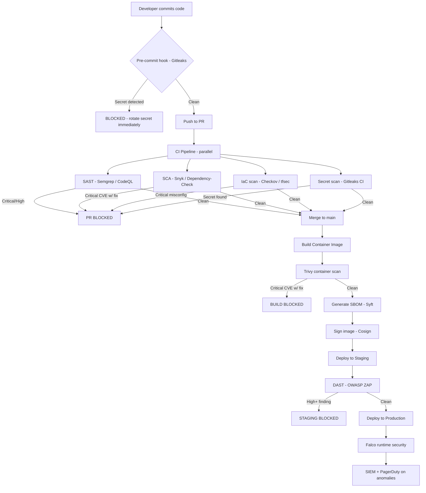

⚡ TL;DR - DevSecOps pipeline design integrates security checks throughout the software
delivery pipeline: pre-commit (secret scanning: Gitleaks, git-secrets), PR stage (SAST:
Semgrep/CodeQL, SCA: Snyk/OWASP Dependency-Check, IaC scanning: Checkov/tfsec), build stage
(container scanning: Trivy/Grype, SBOM generation: Syft, image signing: Cosign), staging deploy
(DAST: OWASP ZAP, API security testing), and production (runtime security: Falco, policy
enforcement: OPA). Security gates: fail on Critical findings, warn on High, dashboard for
Medium/Low. False positive management: baseline existing findings (don't fail on legacy code
day 1), triage 10 false positives per sprint, suppress with evidence. Supply chain security:
SLSA framework (source provenance, build provenance, signed artifacts), SBOM (Software Bill
of Materials - CycloneDX format), Sigstore for artifact signing (keyless via OIDC). The key
principle: security tools at the RIGHT gate (SAST at PR: catches early, cheap to fix; DAST at
staging: catches integration issues; runtime at production: catches what slipped through).
Cost to fix: $1 (developer finds it) vs $10 (QA finds it) vs $100 (production pentest finds it)
vs $1000+ (breach exploits it). Shift left = fix at the cheapest possible point.

---

| #115 | Category: Security | Difficulty: ★★★★ |
|:---|:---|:---|
| **Depends on:** | OWASP Top 10, Authentication, Session Management, TLS Configuration, Business Logic, Insufficient Logging, CVSS Scoring, CVE + NVD, AWS Security Services, Kubernetes Security, SAST in CICD, Security Observability + SIEM, Security at Scale, ISO 27001, SOC 2 Type II, Chaos Engineering for Security, Privilege Escalation, Zero Trust Introduction, Red/Blue/Purple Team, Zero Trust Enterprise | |
| **Used by:** | Security Champions Program, Enterprise Security Architecture, Security Governance, Security Metrics + FAIR, SLSA Framework, Platform Security Engineering, Multi-Cloud Security, Build vs Buy Security, SSDLC, Adversarial Thinking, Trust Boundary Analysis, Assume-Breach, Security as Contract, Threat Modeling | |
| **Related:** | OWASP Top 10, Authentication, TLS, Business Logic, Insufficient Logging, CVSS, CVE, AWS Security, Kubernetes Security, SAST in CICD, Security Observability + SIEM, Security at Scale, ISO 27001, SOC 2, Chaos Engineering, Privilege Escalation, Zero Trust Introduction, Red/Blue/Purple Team, Zero Trust Enterprise, Security Champions, Enterprise Security Architecture, Security Governance, Security Metrics, SLSA, Platform Security, Multi-Cloud Security, SSDLC | |

---

### 🔥 The Problem This Solves

**WHY TACKING SECURITY ONTO THE END OF THE DEVELOPMENT PIPELINE DOESN'T WORK:**

```
THE TRADITIONAL (WATERFALL) SECURITY APPROACH:

  Development: 6-week sprint.
  Feature: built, tested, ready for release.
  
  Security review: LAST STEP.
  
  Security team runs pen test: 5 days.
  Findings: 12 vulnerabilities (2 Critical, 4 High, 6 Medium).
  
  Critical findings: cannot release until fixed.
  
  IMPACT:
  - Release delayed 2 weeks (fixing critical vulnerabilities + regression testing).
  - Developer who wrote the code: moved on to next sprint. Has to context-switch back.
  - Feature: 3 months of work. Delayed by 2 weeks because of security findings.
  - Developer frustration: "security is blocking the release."
  - Security frustration: "developers don't write secure code."
  
  THE COST OF LATE DISCOVERY:
  
  Bug found by the developer who wrote it: costs $1 to fix (immediate context).
  Bug found in code review: costs $10 (context loss, back-and-forth discussion).
  Bug found in QA: costs $100 (test environment, retesting).
  Bug found in pen test (pre-release): costs $500 (full regression, delay).
  Bug found in production (breach): costs $100,000+ (incident response, PR, legal, fines).
  
  10,000x cost difference between "developer finds it" and "breach exploits it."
  
  SHIFT LEFT: move security testing to EARLIER gates.
  
  Secret scanning at pre-commit: developer's own machine catches the secret before push.
  Cost: near zero. No pipeline run. No PR. Just: "you almost committed an API key."
  
  SAST at PR: CodeQL finds the SQL injection in the PR.
  Cost: $1 (developer fixes it before merge, full context, no release deadline pressure).
  
  SCA at PR: Snyk finds the vulnerable dependency.
  Cost: PR comment. "Update lodash to 4.17.21. 1-line fix."
  
  DAST at staging: ZAP finds the reflected XSS that SAST missed.
  Cost: $100. Found before production. Regression test added. Never ships.
  
  Production runtime: Falco detects unusual process spawned by web server.
  Cost: incident response. But: it's a known-good detection vs unknown breach.
  
  THE SHIFT-LEFT ECONOMICS:
  
  100 developers × 2 vulnerabilities found per developer per sprint by pre-commit/PR tools.
  Each finding costs $1 to fix (developer context, immediate).
  Total: 100 × 2 × $1 = $200/sprint.
  
  Same vulnerabilities found in a quarterly pen test: 50 findings, each costs $500 to fix.
  Total: 50 × $500 = $25,000/quarter.
  
  Shift left saves: $25,000/quarter - ($200/sprint × 6 sprints/quarter) = ~$23,800/quarter.
  Plus: no release delays. Plus: developers learn from immediate feedback.
```

---

### 📘 Textbook Definition

**DevSecOps:** The integration of security practices into DevOps workflows. Extends DevOps
("development + operations, automated, continuous") with Security ("security, integrated, early").
Core principle: "shift left" - move security testing as early in the SDLC as possible. Security
is "everyone's responsibility," not a separate team's gate at the end.

**Shift Left Security:** Moving security activities to earlier stages of the software development
lifecycle. "Left" refers to the left side of a SDLC timeline (requirements, design, development)
vs "right" (testing, deployment, production). Earlier discovery = cheaper remediation. Key
implementations: pre-commit hooks (secret scanning), PR security gates (SAST, SCA, IaC scanning),
build security gates (container scanning, SBOM).

**SAST (Static Application Security Testing):** Security analysis of source code without running
it. Tools: Semgrep (pattern-based), CodeQL (semantic/data flow), SonarQube (enterprise dashboard).
Finds: injection vulnerabilities, insecure API usage, hardcoded secrets, dangerous function calls.
False positive challenge: no runtime context means some findings are not exploitable. Requires
triage and suppression workflow.

**SCA (Software Composition Analysis):** Analysis of open-source dependencies for known
vulnerabilities (CVEs). Tools: Snyk, OWASP Dependency-Check, Trivy (in SCA mode), GitHub
Dependabot. Output: CVE IDs, CVSS scores, fix versions. The XZ Utils backdoor (2024) and Log4Shell
(2021): examples of why SCA is critical (widely used library → exploited in thousands of systems).

**DAST (Dynamic Application Security Testing):** Security testing by making HTTP requests to a
running application. Simulates an external attacker. Tools: OWASP ZAP, Burp Suite Enterprise,
Nuclei. Finds: XSS, SQL injection in live application responses, broken authentication in a
running service. Requires: a deployed environment (staging).

**SBOM (Software Bill of Materials):** A formal list of all components in a software artifact -
open-source libraries, their versions, their licenses, and their transitive dependencies.
Formats: CycloneDX (OWASP, JSON/XML), SPDX (Linux Foundation, used in GitHub). Required by:
US Executive Order 14028 (2021) for software sold to federal government. Enables: rapid
vulnerability response ("we use Log4j 2.14.1 - immediately know if vulnerable").

**SLSA (Supply-chain Levels for Software Artifacts):** A Google-originated framework for
software supply chain security. Four levels of assurance about how software was built:
L1 (build documented), L2 (signed provenance), L3 (non-falsifiable provenance from hardened
build), L4 (two-person review, hermetic build). Addresses: SolarWinds-type attacks where
build systems are compromised to inject malicious code into legitimate software.

**Sigstore / Cosign:** A free, open-source project for signing software artifacts (containers,
SBOM, build provenance). Keyless signing: identity-based (OIDC from GitHub Actions/GitLab CI),
no long-lived private keys. `cosign sign --oidc-issuer=https://token.actions.githubusercontent.com
image:tag` → signs with ephemeral key bound to the GitHub Actions run's identity. Verification:
`cosign verify --certificate-identity-regexp=... image:tag` → confirms who signed and when.

---

### ⏱️ Understand It in 30 Seconds

**One line:**
DevSecOps pipeline design places the right security check at the right stage
(secret scanning at pre-commit, SAST+SCA at PR, container scanning at build, DAST at staging,
runtime security at production) so security findings are caught at minimum cost and don't
block releases through last-minute discoveries.

**One analogy:**
> DevSecOps pipeline security is like quality control in an automobile factory.
>
> Old approach: assemble the entire car, then inspect it at the end.
> Problem: bad weld found at final inspection → disassemble, reweld, reassemble.
> Cost: huge. Time: days.
>
> Modern approach (Toyota Production System): quality checks at every station.
> - Weld station: automated check after every weld.
> - Assembly station: automated check for correct parts.
> - Final inspection: catches only what the earlier checks missed.
>
> DevSecOps is the Toyota approach for software security:
> - Pre-commit: "you're about to use an unsafe function." Fix: 1 minute.
> - PR: "this SQL query is injectable." Fix: 30 minutes, full context.
> - Build: "this Docker base image has a critical CVE." Fix: update tag.
> - Staging: "this endpoint reflects user input unescaped." Fix: 1 hour.
> - Production: "unusual process spawned - possible exploitation." Alert: investigate.
>
> The cost decreases at each earlier gate.
> The goal: catch the most vulnerabilities at the earliest (cheapest) gate.
> Final inspection (production/pen test): should find almost nothing.
> Because everything was caught earlier.

---

### 🔩 First Principles Explanation

**DevSecOps pipeline gates - what goes where and why:**

```
GATE 1: PRE-COMMIT (Developer's Machine)

  Goal: catch secrets before they enter the git history.
  Tool: Gitleaks (detects 150+ secret patterns: API keys, tokens, credentials).
  Integration: git pre-commit hook (runs before every commit).
  
  What it catches:
  - AWS access keys (AKIA prefixed)
  - GitHub PATs (ghp_ prefixed)
  - Stripe API keys (sk_live_ prefixed)
  - JWT tokens, database connection strings
  
  Why here: secrets in git history = PERMANENT exposure (git history ≠ erasable easily).
  Cost to fix: the developer is prompted before the commit even happens.
  
  BAD approach: only scan at PR (git history already has the secret).
  GOOD approach: pre-commit hook + PR scan (defense in depth).
  
GATE 2: PR REVIEW (CI Pipeline)

  Goal: find security issues BEFORE the code is merged.
  
  SAST (Semgrep / CodeQL):
    Finds: SQL injection, XSS, path traversal, insecure deserialization,
    hardcoded credentials, use of dangerous APIs (eval, exec, pickle).
    Time: 2-5 minutes. Runs as CI check on every PR.
    Gate behavior: block merge on Critical/High. Comment on Medium.
    
  SCA (Snyk / OWASP Dependency-Check):
    Finds: known CVEs in direct and transitive dependencies.
    Time: 1-2 minutes. Runs on every PR that changes dependencies.
    Gate behavior: block on Critical unfixed CVE. Warn on High.
    
  IaC Scanning (Checkov / tfsec):
    Finds: Terraform/Kubernetes/CloudFormation misconfigurations.
    Examples: S3 bucket without encryption, security group with 0.0.0.0/0 inbound,
    Kubernetes pod without resource limits, hardcoded IP ranges.
    Time: 1-2 minutes.
    Gate behavior: block on Critical/High policy violations.
    
  Secret Scanning (Gitleaks in CI / GitHub secret scanning):
    Finds: secrets that bypassed the pre-commit hook.
    Catches: committed secrets in PR diff.
    Gate behavior: always block on detected secret.
    
GATE 3: BUILD

  Goal: ensure the built artifact (container image) is secure.
  
  Container scanning (Trivy / Grype):
    Scans: container image layers for CVEs in OS packages + application deps.
    Time: 2-5 minutes.
    Gate: block Critical CVEs with fix available.
    
  SBOM generation (Syft):
    Output: CycloneDX SBOM attached to the image.
    Signed with Cosign: provenance verifiable.
    Use: rapid vulnerability response (scan SBOM against new CVE).
    
  Image signing (Cosign with Sigstore):
    Signs: container image digest with ephemeral OIDC-based key.
    Kubernetes admission: Kyverno or Cosign policy verifies signature before deployment.
    Ensures: only CI-built, signed images run in production.
    
GATE 4: STAGING DEPLOY

  Goal: find integration-level security issues that SAST misses.
  
  DAST (OWASP ZAP in CI mode):
    Runs against: the deployed staging environment.
    Simulates: automated HTTP attack against the running application.
    Finds: XSS, CSRF, SQL injection in the LIVE application (missed by SAST).
    Time: 5-20 minutes (quick scan) to hours (deep scan).
    Gate: blocking Critical/High findings on staging deploy.
    
  API security testing (Zed Attack Proxy / Postman security collection):
    Runs: existing API integration tests WITH security assertions.
    Checks: authentication bypass, excessive data exposure, rate limiting.
    
GATE 5: PRODUCTION (RUNTIME)

  Goal: detect and respond to what slipped through all prior gates.
  
  Runtime security (Falco):
    Detects: unexpected process execution, file writes to /etc, 
    network connections to unusual destinations, privilege escalation.
    Rules: MITRE ATT&CK-aligned.
    Integration: Falco alerts → EventBridge → PagerDuty + SIEM.
    
  Policy enforcement (OPA Gatekeeper):
    Kubernetes: admission controller.
    Rejects: non-compliant pod specs (privileged containers, no resource limits, etc.)
    At admission time: last line of defense before the workload runs.
```

---

### 🧪 Thought Experiment

**SCENARIO: Building a DevSecOps pipeline from scratch - decisions and trade-offs:**

```
CONTEXT: 20-engineer startup, 3 microservices, GitHub Actions CI/CD, AWS EKS.
Security team: 1 person (security engineer). Budget: limited.
Goal: "not embarrassed by a pen test finding that a developer could have caught."

DECISION 1: Which SAST tool?

  Options: Semgrep OSS (free, pattern-based), CodeQL (free for public repos,
  GitHub Advanced Security for private - $49/seat/month).
  
  For 20 engineers: GitHub Advanced Security = $980/month.
  Semgrep OSS: free.
  
  Decision: Semgrep OSS (free) + 3 custom rules for our specific patterns.
  Custom rules: database query construction (catch SQLi), user-controlled redirects (catch open redirect).
  CodeQL: evaluate at 50+ engineers (cost justified at scale).
  
DECISION 2: How to handle false positives?

  Day 1: run Semgrep on existing codebase. 87 findings.
  20 are genuine vulnerabilities. 67 are false positives.
  
  If CI gate: fail on all 87 → developers revolt. Pipeline is useless.
  
  Decision:
  - Phase 1 (Month 1): run Semgrep in audit mode (report-only, don't block).
    Triage: 67 false positives → suppress with `# nosec` + comment why.
    67 genuine findings → create GitHub issues. Fix top priority by severity.
  - Phase 2 (Month 2): enable blocking gate on NEW code (baseline suppressed).
    New PR: Semgrep runs. Only new findings (not baselined) can block.
    
  This approach: 0 developer revolt. 20 genuine findings fixed. Legacy debt: tracked.
  
DECISION 3: Container scanning gate threshold?

  Trivy scan of our base image (node:18): 312 CVEs.
  30 are Critical. All in the OS layer. Base image: 6 months old.
  
  If gate: block on Critical → pipeline broken immediately.
  
  Decision:
  - Switch base image: node:18-slim (fewer OS packages, fewer CVEs).
  - Trivy: scan only CVEs with fix available (--ignore-unfixed flag).
  - Remaining Critical CVEs: 3 (with fixes). Update dependencies: 3 fixed.
  - Gate: block Critical with fix available. All others: report-only.
  
  Result: clean gate. New Critical CVEs (in new PRs): blocked automatically.
  
DECISION 4: DAST - how automated?

  OWASP ZAP in CI: runs against staging. Takes 8 minutes.
  8-minute gate: acceptable for staging deploy (not PR).
  
  ZAP findings on day 1: 3 High (2 were actually false positives, 1 real XSS).
  
  Decision:
  - ZAP context file: exclude known-false-positive paths.
  - Gate: block High AND above on staging deploy.
  - Real XSS: found and fixed before first production deploy.
  
RESULT AFTER 3 MONTHS:

  Security findings caught by pipeline gates (not pen test):
  - 20 SAST findings (Semgrep): all fixed.
  - 8 SCA findings (Snyk): all dependencies updated.
  - 3 Trivy critical CVEs in base image: base image updated.
  - 1 DAST XSS (ZAP): fixed before first prod deploy.
  - 2 secrets caught by Gitleaks pre-commit: rotated immediately.
  
  Annual pen test (external firm): 2 Medium findings. 0 Critical. 0 High.
  Pen tester: "your pipeline is catching most of the obvious issues."
  Developer trust in security: "security tools help us, they don't just block us."
```

---

### 🧠 Mental Model / Analogy

> DevSecOps pipeline design is the security application of "fix bugs early."
>
> Every experienced software engineer knows: the earlier a bug is found, the cheaper it is.
> A bug found before committing: 1 minute to fix (just don't commit it).
> A bug found in production: hours of debugging, hotfix, deploy, post-mortem.
>
> DevSecOps applies this to security vulnerabilities: they ARE bugs, with a security dimension.
> They follow the same economics. Fix them early.
>
> The additional insight: security bugs have a special property.
> A regular bug: crashes the application for a user. Impact: bounded.
> A security vulnerability: may be exploited by an attacker. Impact: unbounded
> (data breach, ransom, compliance fine, reputational damage).
>
> The asymmetry: the cost to fix is the same as a regular bug (maybe slightly higher).
> The cost of not fixing: orders of magnitude higher than a regular bug.
>
> This asymmetry makes the economics of DevSecOps even more compelling
> than the economics of finding bugs early in general.
>
> "We don't have time for security gates in our pipeline" translates to:
> "We prefer to discover security issues later, when they cost 1000x more to fix,
> and when they may already be exploited."
>
> Stated that way: the trade-off is obvious.
> Security gates are not overhead. They are the cheapest risk management available.

---

### 📶 Gradual Depth - Five Levels

**Level 1 - What it is (anyone can understand):**
DevSecOps pipeline design means adding automated security checks throughout your software build process, so security problems are caught by tools before they reach production. Like spell-check catches spelling errors before you publish, DevSecOps tools catch security errors before you deploy. The earlier in the process the check runs, the cheaper it is to fix (developer hasn't moved on to the next task yet).

**Level 2 - How to use it (junior developer):**
Security tools you'll encounter in a DevSecOps pipeline: (1) Pre-commit: Gitleaks runs before each commit - if you accidentally have an API key in your code, it stops you. Run `git commit` → "CRITICAL: AWS secret key detected in main.go:47." Remove it. Rotate the key. (2) PR check: Semgrep or CodeQL comments on your PR if there's a SQL injection or XSS risk. The comment: "line 47: SQL query built by string concatenation - use parameterized queries." Fix it before merge. (3) Dependency alert: Snyk or Dependabot opens a PR to update a dependency with a CVE. Review and merge it. (4) Container scan: Trivy runs in CI and fails the build if your Docker image has a critical CVE with a fix. Update the base image tag.

**Level 3 - How it works (mid-level engineer):**
GitHub Actions full DevSecOps workflow design: trigger (push/PR) → parallel jobs: (1) SAST job: `actions/checkout` → `semgrep/semgrep-action@v1` (uses SARIF output, uploaded to GitHub Security tab via `github/codeql-action/upload-sarif`). (2) SCA job: `snyk/actions/node@master` → outputs SARIF → uploaded to Security tab. (3) Secret scanning: `gitleaks/gitleaks-action@v2` (scans git history in PR). Post-merge (on push to main): (4) Build + container scan: `docker build` → `aquasecurity/trivy-action@master` (scan image) → `cosign sign` (sign image digest). (5) SBOM: `anchore/sbom-action@v0` (generate CycloneDX SBOM) → `anchore/scan-action@v3` (scan SBOM for CVEs). Staging deploy: (6) DAST: `zaproxy/action-full-scan@v0.8.0` against the staging URL. All SARIF outputs: visible in GitHub Security Advisories tab, tracked per-repo, alerted on new findings. Developer experience: PR comments + Security tab, not a separate dashboard they don't visit.

**Level 4 - Why it was designed this way (senior/staff):**
The defense-in-depth principle applied to pipelines: no single security tool catches everything. SAST: pattern-based (good for known vulnerability patterns, bad for logic flaws). SCA: dependency-based (good for known CVEs, blind to custom code). DAST: runtime-based (good for integration-level issues, requires running application). Each tool: catches a different class of vulnerabilities. Overlap is intentional - defense in depth. Pipeline stage optimization: run FAST tools at PR (SAST: 2 min, secret scan: 30 sec) because PRs are frequent and blocking is acceptable for short waits. Run SLOW tools at build or deploy (container scan: 5 min, DAST: 20 min) because build frequency is lower and wait time is less impactful. The "shift right" complement: production monitoring (Falco, RASP - Runtime Application Self-Protection) catches what all left-shift tools missed. Neither alone is sufficient. The security findings triage process: Critical with fix → fail immediately. Critical without fix (no patch yet) → accept with tracking, expedite patch when available. High → fail, but with 5-business-day SLA before mandatory block. Medium/Low → tracking dashboard, do not block (would cause too much noise, reducing developer trust).

**Level 5 - Mastery (distinguished engineer):**
Supply chain security - the hardest DevSecOps problem. SolarWinds (2020): attacker compromised the SolarWinds build system. Legitimate SolarWinds Orion software: signed with SolarWinds' valid code signing certificate. Customers: verified the signature. Signature: valid. But: the code was malicious. The signature said "this was produced by SolarWinds' build system." It did NOT say "this was produced from unmodified source code by an uncompromised build system." SLSA (Supply-chain Levels for Software Artifacts) addresses this: SLSA L3 = non-falsifiable provenance from hardened build environment. The provenance document: signed by the build system's private key. The private key: protected in an HSM (Hardware Security Module). The build environment: hardened (no network access, reproducible builds, hermetic). An attacker who compromises the developer's machine: cannot produce SLSA L3 provenance (doesn't have the HSM-backed build system key). An attacker who compromises the build system: the hardened environment limits blast radius (no network access = cannot exfiltrate, reproducible builds = tampering detected). Sigstore/Cosign keyless signing: the OIDC identity of the GitHub Actions run is bound to the signature. Verify: "this image was signed during a GitHub Actions run triggered by commit ABC on the main branch of repo XYZ." Any tampering: produces a different commit hash = signature verification fails. This is the gold standard for supply chain security: not "who has the signing key" but "was this artifact built from the expected source code via the expected build process?"

---

### ⚙️ How It Works (Mechanism)

```
DEVSECOPS PIPELINE SECURITY GATES:

  [PRE-COMMIT]
  Secret scan → block on detected secret
  
  [PR / CODE REVIEW]
  SAST → block on Critical/High new findings
  SCA → block on Critical CVE with fix
  IaC scan → block on Critical misconfig
  Secret scan (CI) → block on secret
  
  [BUILD]
  Container scan → block Critical CVE with fix
  SBOM generation → attach to image
  Image signing → sign with Cosign
  
  [STAGING DEPLOY]
  DAST → block Critical/High findings
  API security test → assert on security properties
  
  [PRODUCTION]
  Runtime (Falco) → alert + SIEM on anomalies
  Admission controller (OPA/Kyverno) → last-line reject
  Vulnerability scan (Trivy) → periodic re-scan of running images
```



---

### 💻 Code Example

**Full GitHub Actions DevSecOps pipeline:**

```yaml
# .github/workflows/devsecops-pipeline.yml
# Complete DevSecOps security gates in GitHub Actions.
# Runs on every PR and on push to main.

name: DevSecOps Security Pipeline

on:
  pull_request:
    branches: [main]
  push:
    branches: [main]

jobs:
  # ── GATE 1: SECRET SCANNING ───────────────────────────
  secret-scan:
    runs-on: ubuntu-latest
    steps:
    - uses: actions/checkout@v4
      with:
        fetch-depth: 0  # Full history for secret scanning
        
    - name: Gitleaks - detect secrets
      uses: gitleaks/gitleaks-action@v2
      env:
        GITHUB_TOKEN: ${{ secrets.GITHUB_TOKEN }}
        GITLEAKS_LICENSE: ${{ secrets.GITLEAKS_LICENSE }}
      # Blocks on any secret detection. No suppression without explicit review.

  # ── GATE 2: SAST ──────────────────────────────────────
  sast:
    runs-on: ubuntu-latest
    permissions:
      security-events: write  # Upload SARIF to GitHub Security tab
    steps:
    - uses: actions/checkout@v4
    
    - name: Semgrep SAST scan
      uses: semgrep/semgrep-action@v1
      with:
        config: >
          p/owasp-top-ten
          p/java
          p/python
          p/javascript
        # Block on Critical and High findings in NEW code:
        generateSarif: "1"
      env:
        SEMGREP_APP_TOKEN: ${{ secrets.SEMGREP_APP_TOKEN }}
        
    - name: Upload SARIF to GitHub Security
      if: always()
      uses: github/codeql-action/upload-sarif@v3
      with:
        sarif_file: semgrep.sarif

  # ── GATE 3: SCA (DEPENDENCY VULNERABILITIES) ──────────
  dependency-scan:
    runs-on: ubuntu-latest
    permissions:
      security-events: write
    steps:
    - uses: actions/checkout@v4
    
    - name: Snyk SCA scan
      uses: snyk/actions/node@master
      env:
        SNYK_TOKEN: ${{ secrets.SNYK_TOKEN }}
      with:
        args: >
          --severity-threshold=high
          --fail-on=upgradable
          --sarif-file-output=snyk.sarif
          
    - name: Upload Snyk SARIF
      if: always()
      uses: github/codeql-action/upload-sarif@v3
      with:
        sarif_file: snyk.sarif

  # ── GATE 4: IaC SCANNING ──────────────────────────────
  iac-scan:
    runs-on: ubuntu-latest
    steps:
    - uses: actions/checkout@v4
    
    - name: Checkov IaC scan
      uses: bridgecrewio/checkov-action@master
      with:
        directory: terraform/
        framework: terraform
        # Block only on High/Critical policy violations:
        soft_fail_on: LOW,MEDIUM
        output_format: sarif
        output_file_path: checkov.sarif
        
    - name: Upload Checkov SARIF
      if: always()
      uses: github/codeql-action/upload-sarif@v3
      with:
        sarif_file: checkov.sarif

  # ── GATE 5: CONTAINER BUILD + SCAN (on merge to main) ──
  container-security:
    runs-on: ubuntu-latest
    if: github.ref == 'refs/heads/main'
    needs: [secret-scan, sast, dependency-scan, iac-scan]
    permissions:
      id-token: write  # For OIDC token (Cosign keyless signing)
      packages: write
    steps:
    - uses: actions/checkout@v4
    
    - name: Build container image
      run: |
        docker build -t ghcr.io/${{ github.repository }}:${{ github.sha }} .
    
    - name: Trivy container scan
      uses: aquasecurity/trivy-action@master
      with:
        image-ref: "ghcr.io/${{ github.repository }}:${{ github.sha }}"
        format: sarif
        output: trivy.sarif
        # Block on Critical CVEs with a fix available:
        exit-code: 1
        severity: CRITICAL
        ignore-unfixed: true
        
    - name: Generate SBOM with Syft
      uses: anchore/sbom-action@v0
      with:
        image: "ghcr.io/${{ github.repository }}:${{ github.sha }}"
        format: cyclonedx-json
        output-file: sbom.cyclonedx.json
        
    - name: Sign image with Cosign (keyless via OIDC)
      uses: sigstore/cosign-installer@v3
      
    - name: Cosign sign
      run: |
        cosign sign --yes \
          --oidc-issuer=https://token.actions.githubusercontent.com \
          ghcr.io/${{ github.repository }}@${{ steps.build.outputs.digest }}
          
    - name: Attach SBOM to image
      run: |
        cosign attest --yes \
          --predicate sbom.cyclonedx.json \
          --type cyclonedx \
          ghcr.io/${{ github.repository }}@${{ steps.build.outputs.digest }}
```

**Kyverno policy: only run signed images in production:**

```yaml
# kyverno-verify-image.yaml
# Kubernetes admission: reject unsigned container images.
# Ensures only CI-built, Cosign-signed images run in production.

apiVersion: kyverno.io/v1
kind: ClusterPolicy
metadata:
  name: verify-image-signature
spec:
  validationFailureAction: Enforce  # Reject (not audit)
  background: false
  rules:
  - name: verify-cosign-signature
    match:
      resources:
        kinds: [Pod]
        namespaces:
        - production
        - staging
    verifyImages:
    - imageReferences:
      # Only enforce on company container registry:
      - "ghcr.io/company/*"
      
      attestors:
      - entries:
        - keyless:
            # Verify: signed by GitHub Actions for our repo:
            subject: "https://github.com/company/app/.github/workflows/*"
            issuer: "https://token.actions.githubusercontent.com"
            rekor:
              url: https://rekor.sigstore.dev
              
      # Also verify SBOM attestation is present:
      attestations:
      - predicateType: https://cyclonedx.org/bom
        attestors:
        - entries:
          - keyless:
              subject: "https://github.com/company/app/.github/workflows/*"
              issuer: "https://token.actions.githubusercontent.com"
```

---

### ⚖️ Comparison Table

| Tool Category | Open Source Options | Enterprise Options | What It Finds |
|:---|:---|:---|:---|
| **Secret scanning** | Gitleaks, TruffleHog, git-secrets | GitHub Advanced Security, GitLab Ultimate | API keys, tokens, credentials in code |
| **SAST** | Semgrep OSS, Bandit (Python), SpotBugs (Java) | SonarQube Enterprise, Veracode, Checkmarx | Code-level vulnerabilities (injection, insecure APIs) |
| **SCA** | OWASP Dependency-Check, Trivy (SCA mode) | Snyk, Mend (WhiteSource), GitHub Dependabot | CVEs in open-source dependencies |
| **IaC scanning** | Checkov, tfsec, kics | Prisma Cloud, Wiz | Terraform/K8s/CF misconfigurations |
| **Container scanning** | Trivy, Grype | Snyk Container, Twistlock | CVEs in container image layers |
| **DAST** | OWASP ZAP, Nuclei | Burp Suite Enterprise, HCL AppScan | Runtime vulnerabilities (XSS, injection) |
| **SBOM** | Syft, Trivy (SBOM mode) | Anchore Enterprise, Snyk | Software composition for CVE tracking |
| **Image signing** | Cosign (Sigstore), Notary v2 | Venafi CodeSign Protect | Supply chain integrity |

---

### ⚠️ Common Misconceptions

| Misconception | Reality |
|:---|:---|
| "Adding security gates to CI/CD will slow down development." | The comparison must be correct. Comparing: "development without security gates" vs "development with security gates" in ISOLATION (ignoring downstream effects). This comparison: security gates DO add 5-10 minutes per PR. Correct comparison: "development without security gates + quarterly pen tests + release delays when pen test finds critical issues" vs "development with security gates + fewer pen test findings + no release delays." With security gates: pen test findings drop 70-80% (the easy ones are caught by automation). Release delays for security reasons: near zero (issues caught at PR, not at release). Developer context-switching cost: near zero (issue found while writing the code). Without security gates: pen test finds 10 critical issues day before release. Release: delayed 2 weeks. 10 developers × 2 weeks = 20 developer-weeks lost. vs: security gates add 5 minutes per PR × 20 PRs/week × 20 developers = 33 developer-hours per week. Over 2 weeks: 66 developer-hours vs 400 developer-hours (20 developers × 2 weeks). The math: security gates are FASTER when including the cost of late discovery. |
| "SAST catches all security vulnerabilities so we don't need DAST." | SAST and DAST have complementary blind spots. SAST: analyzes code without running it. Cannot find: vulnerabilities that depend on runtime configuration, third-party service interactions, or behavior that emerges from the integration of multiple components. Examples SAST cannot find: misconfigured CORS headers (configuration, not code), authentication bypass via a specific request sequence (runtime behavior), server-side request forgery via a third-party library that generates requests based on input. DAST: finds these by making real HTTP requests and observing responses. Cannot find: code-level issues that don't produce HTTP responses (memory corruption in batch jobs, file permission issues in scheduled tasks). The XSS example: SAST finds the unescaped output in source code. DAST also finds it by injecting `<script>alert(1)</script>` and seeing it reflected. SAST: finds it earlier (in PR) and cheaper. DAST: provides confirmation and finds runtime-only vulnerabilities. Both are needed. Replace one with the other: blind spots. Defense in depth principle: multiple overlapping tools at different stages. |

---

### 🚨 Failure Modes & Diagnosis

**Common DevSecOps pipeline failures and fixes:**

```
FAILURE 1: DEVELOPER FATIGUE FROM FALSE POSITIVES (ALERT NOISE)

  Symptom: developers adding `# nosec` to every finding without reading them.
  "Just suppress it, it's probably a false positive."
  
  Root cause: too many findings, no triage process, blocking the wrong things.
  
  Fix:
  - Block only Critical/High NEW findings (not all findings).
  - Baseline existing codebase: don't fail on day 1 legacy findings.
  - Track true positive rate: what % of findings are real vulnerabilities?
    Target: > 60% true positive rate. Below 40%: retune the rules.
  - Regular rule review: remove noisy rules that generate mostly false positives.
  - Add "why this matters" context to suppression requests:
    `# nosec - this is a false positive because input is validated by X at line Y`
    
FAILURE 2: SECURITY GATE BYPASSED FOR "URGENT" RELEASES

  Symptom: critical hotfix shipped by disabling security checks.
  "We can't wait for the DAST scan for this production incident fix."
  
  Fix:
  - Exception process: security bypass requires CISO approval + ticket tracking.
  - Post-release: mandatory security scan within 24 hours.
  - Automate: after every merge to main, all security gates STILL run (even if async).
  - Track exception rate: > 5% of releases bypass security gates → process problem.
  
FAILURE 3: SBOM NOT USED FOR RAPID VULNERABILITY RESPONSE

  Symptom: Log4Shell drops. Team: manually checks every service for log4j.
  3 days to confirm 12 services are vulnerable.
  
  Fix:
  - SBOM per image: stored in artifact registry (attached to image manifest via Cosign).
  - On CVE alert: query SBOM registry for all images containing the vulnerable component.
  - Script: `cosign download attestation --predicate-type cyclonedx image:tag | \
             jq '.component[] | select(.name == "log4j")' | wc -l`
  - Target: answer "which of our services use log4j?" in < 5 minutes (not 3 days).

METRICS TO TRACK (DevSecOps pipeline health):

  Security finding rate per PR (should decrease over time as codebase improves).
  Mean time to fix Critical findings (target: < 5 days).
  False positive rate (target: < 40%).
  Pipeline bypass rate (target: < 5% of releases).
  % of images with SBOM (target: 100% of production images).
  % of images signed (target: 100% of production images).
```

---

### 🔗 Related Keywords

**Prerequisites:**
- `SAST in CICD` (SEC-105) - detailed SAST implementation
- `Kubernetes Security Fundamentals` (SEC-104) - container scanning context
- `Zero Trust Enterprise` (SEC-114) - pipeline security as Zero Trust for CI/CD

**Builds on this:**
- `Security Champions Program` (SEC-116) - champions drive DevSecOps adoption
- `SLSA Framework` (SEC-123) - supply chain security advanced topic
- `Platform Security Engineering` (SEC-124) - platform team owns the pipeline
- `SSDLC` (SEC-129) - DevSecOps as the implementation of SSDLC

---

### 📌 Quick Reference Card

```
┌──────────────────────────────────────────────────────────┐
│ PIPELINE      │ Pre-commit: Gitleaks (secrets)           │
│ GATES         │ PR: SAST (Semgrep/CodeQL), SCA (Snyk),  │
│               │     IaC scan (Checkov), secret scan      │
│               │ Build: Trivy (container), SBOM, Cosign  │
│               │ Staging: DAST (OWASP ZAP)               │
│               │ Prod: Falco (runtime), OPA (admission)  │
├───────────────┼──────────────────────────────────────────┤
│ GATE BEHAVIOR │ Critical w/ fix: BLOCK                   │
│               │ High: BLOCK (or warn with SLA)          │
│               │ Medium/Low: dashboard, don't block       │
│               │ New code only: don't fail on legacy      │
├───────────────┼──────────────────────────────────────────┤
│ SUPPLY CHAIN  │ SBOM: CycloneDX format, attached to img │
│               │ Signing: Cosign keyless (OIDC-based)    │
│               │ SLSA L2/L3: signed provenance           │
│               │ Kyverno: reject unsigned images in prod │
├───────────────┼──────────────────────────────────────────┤
│ ECONOMICS     │ Pre-commit: $1. PR: $10. Staging: $100  │
│               │ Production breach: $100,000+            │
│               │ Shift left = fix at the $1 gate         │
└──────────────────────────────────────────────────────────┘
```

---

### 💎 Transferable Wisdom

**Reusable Engineering Principle:**
"Security is a software quality property, not a separate phase."
The shift DevSecOps drives: from "security review after development" to
"security as part of every development step."
This mirrors the broader quality shift in software engineering:
FROM: "QA tests quality into the software at the end."
TO: "Quality is built in through TDD, CI, code review, automated testing."
Quality cannot be tested in. It must be built in.
Neither can security.
A pen test (or security review at release) finds security issues.
It cannot prevent them. It cannot build in security.
Security built-in: happens at design (threat modeling), development (SAST in IDE, training),
code review (security reviewers or trained developers), and pipeline (automated gates).
By the time the code reaches a pen test: if security was built in, the pen test finds almost nothing.
If security was not built in: the pen test finds everything the attacker would find.
The pen test: a quality check, not a quality injection mechanism.
Use it to MEASURE security quality, not to CREATE security quality.
DevSecOps: the process that creates security quality throughout development.
The DevSecOps principle generalizes:
"The best time to catch a problem is at the point of creation."
Applied to: database schema (schema validation at migration time), API contracts
(contract testing at PR time), security vulnerabilities (SAST at PR time).
The further from creation the problem is caught: the more expensive the fix.

---

### 💡 The Surprising Truth

The most important DevSecOps investment is not the tooling. It's the developer experience.

A security pipeline with the best tools in the world fails if developers learn to ignore it.
"SAST finding? That's always a false positive. Just suppress it."
"SCA alert? That package is never actually called. Just suppress it."
"Container scan? We'll deal with it later. Just push the image."

This pattern - security fatigue, routine suppression, pipeline workarounds - emerges when:
(1) False positive rate is too high (80%+ of findings are not real vulnerabilities).
(2) Developer context is missing ("SQL injection" → developer thinks "I don't do SQL injection").
(3) Fixing findings takes too long (update this dependency → 5 other breaking changes).
(4) Security team is not available to help with triage questions.

The most impactful DevSecOps investment: a security engineer embedded in the development team
(or a security champion in each team) who:
- Triages security findings together with developers.
- Explains WHY a finding matters in the context of THIS codebase.
- Helps fix findings, not just report them.
- Tunes rules to reduce false positives.
- Celebrates when developers catch security issues independently.

The tools are commodities. The developer security culture is the differentiator.

Google's internal measurement: "security toil reduction" - how much time do developers
spend on security activities vs engineering activities? The goal: security tools that
reduce security toil, not increase it.

If adding a security gate to the pipeline INCREASES developer security toil (endless
false positive triage): the gate is making security WORSE, not better.
Developer trust in security tooling: the prerequisite for DevSecOps success.

---

### ✅ Mastery Checklist

**You've mastered this when you can:**
1. **PLACE** each security tool at the correct pipeline gate: Gitleaks (pre-commit),
   SAST+SCA+IaC scan (PR), container scan+SBOM+signing (build), DAST (staging),
   Falco+OPA (production). Explain WHY each tool belongs at that gate.
2. **DESCRIBE** the shift-left economics: $1 (pre-commit) → $10 (PR) → $100 (staging) →
   $1,000+ (production pen test) → $100,000+ (breach). Shift left = fix at the cheapest gate.
3. **EXPLAIN** supply chain security: SBOM (CycloneDX format, lists all components),
   Cosign keyless signing (OIDC-bound signature, no long-lived keys), SLSA L3 (non-falsifiable
   build provenance). Reference: SolarWinds as the supply chain attack DevSecOps prevents.
4. **STATE** the security gate thresholds: Critical with fix → block. High → block with SLA.
   Medium/Low → track, don't block. New code only (baseline legacy, don't fail day 1).
5. **DESCRIBE** the false positive management strategy: audit mode first (don't block day 1),
   triage systematically, suppress with evidence, track true positive rate (target > 60%).

---

### 🎯 Interview Deep-Dive

**Q: How would you design a DevSecOps pipeline for a team deploying to Kubernetes?
What tools would you use at each stage and what would trigger a build block?**

*Why they ask:* Tests practical security engineering knowledge. Common in platform security,
security engineering, and staff engineering roles. DevSecOps pipeline design = the security
equivalent of designing a CI/CD pipeline.

*Strong answer covers:*
- Five stages: (1) Pre-commit: Gitleaks (blocks on any secret detection). (2) PR: SAST
  (Semgrep or CodeQL - blocks Critical/High new findings), SCA (Snyk - blocks Critical CVE
  with fix), IaC scan (Checkov for Terraform/K8s manifests - blocks Critical misconfigs),
  secret scan (CI-side Gitleaks - catches what pre-commit missed). (3) Build: Trivy container
  scan (blocks Critical CVE with fix), Syft SBOM generation (CycloneDX, attached to image),
  Cosign keyless signing (OIDC token from GitHub Actions). (4) Staging: OWASP ZAP DAST (blocks
  High+ findings on staging deploy). (5) Production: Falco runtime security (alerts → SIEM),
  Kyverno policy (reject unsigned images, reject non-compliant pod specs).
- Gate behavior philosophy: block only Critical/High on NEW code (don't fail day 1 on legacy).
  Medium/Low: dashboard, SLA-based remediation, never block (noise reduction = developer trust).
  False positive management: audit mode for 2 weeks before enabling blocking.
- Supply chain: Kyverno ClusterPolicy with cosign verify - no unsigned image runs in production
  (prevents SolarWinds-type build compromise from reaching production). SBOM enables "which of
  our services use Log4j?" answered in minutes, not days.
- Economics argument: $1 at pre-commit vs $1,000+ at pen test vs $100,000+ at breach.
  Security gates reduce cost, they don't increase it when properly tuned.