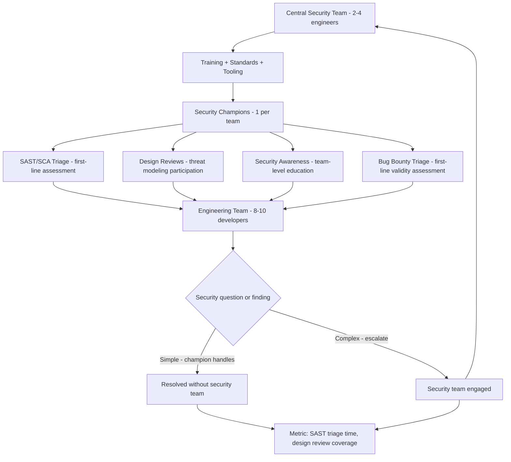

⚡ TL;DR - A Security Champions Program embeds security advocates within engineering teams
to bridge the gap between the security team (central, limited) and development teams (distributed,
many). Each engineering team has 1-2 Security Champions: senior engineers who are interested in
security, given security training (OWASP Top 10, threat modeling, secure code review), dedicated
time (10-20% of their sprint), and access to the security team. Their role: NOT to do all security
work, but to raise security awareness in their team, triage security findings from SAST/SCA tools,
participate in threat modeling for new features, and be the first line of escalation for security
questions. Program structure: monthly security champion meetings (threat sharing, case studies,
new techniques), security training path (OWASP WebGoat, HackTheBox, security certifications),
recognition and career path (security champion = visible career differentiator for promotion).
KPIs: number of teams with an active champion, champion retention rate (>80% recommended),
mean time to triage a SAST finding, security debt reduction rate. The fundamental insight:
1 security engineer cannot review all PRs and attend all design reviews across 50 teams.
Champions provide the security team's reach into every team. Without champions: security team
is a bottleneck. With champions: security scales with engineering.

---

| #116 | Category: Security | Difficulty: ★★★ |
|:---|:---|:---|
| **Depends on:** | OWASP Top 10, Authentication, Session Management, TLS Configuration, Business Logic, Insufficient Logging, CVSS Scoring, CVE + NVD, AWS Security Services, Kubernetes Security, SAST in CICD, Security Observability + SIEM, Security at Scale, ISO 27001, SOC 2 Type II, Chaos Engineering for Security, Privilege Escalation, Zero Trust Introduction, Red/Blue/Purple Team, Zero Trust Enterprise, DevSecOps Pipeline | |
| **Used by:** | Enterprise Security Architecture, Security Governance, Security Metrics + FAIR, Platform Security Engineering, SSDLC, Adversarial Thinking, Trust Boundary Analysis, Assume-Breach, Security as Contract, Threat Modeling | |
| **Related:** | OWASP Top 10, Authentication, TLS, Business Logic, Insufficient Logging, CVSS, CVE, AWS Security, Kubernetes Security, SAST in CICD, Security Observability + SIEM, Security at Scale, ISO 27001, SOC 2, Chaos Engineering, Privilege Escalation, Zero Trust Introduction, Red/Blue/Purple Team, Zero Trust Enterprise, DevSecOps Pipeline, Enterprise Security Architecture, Security Governance, Security Metrics, Platform Security, SSDLC | |

---

### 🔥 The Problem This Solves

**WHY A CENTRAL SECURITY TEAM ALONE CANNOT SCALE SECURITY ACROSS AN ENGINEERING ORG:**

```
THE SECURITY SCALING PROBLEM:

  Company: 50 engineering teams. 400 developers.
  Security team: 4 people (1 CISO, 2 security engineers, 1 compliance).
  
  Security team capacity:
  - 4 people × 40 hours/week = 160 security-hours/week.
  
  Security demand (if security team does everything):
  - Code reviews: 400 developers × 5 PRs/week × 10 min security review = 333 hours/week.
  - Design reviews: 50 teams × 1 design review/week × 1 hour = 50 hours/week.
  - Security findings triage: 400 developers × 3 SAST/SCA findings/week × 20 min = 400 hours/week.
  - Incident response: 2-5 incidents/week × 4 hours each = 8-20 hours/week.
  - Compliance: SOC 2 evidence, policy updates = 20 hours/week.
  
  Total demand: 811-823 security-hours/week.
  Total capacity: 160 security-hours/week.
  
  Gap: 5x capacity shortfall.
  
  If security team tries to cover everything:
  - 160/811 = 20% coverage.
  - 80% of security work: not done.
  - OR: security team becomes a bottleneck.
    "Waiting for security review: 3 weeks."
    Result: teams skip security review to ship faster.
    
  THE ALTERNATIVE: DON'T SCALE BY HIRING SECURITY ENGINEERS.
  
  Instead: train and activate the 400 developers who are ALREADY doing the work.
  
  Security champion model:
  50 teams × 1 champion = 50 security champions.
  Champions: each spend 10% of their time on security = 50 × 4 hours = 200 hours/week.
  
  Security team: focuses on: strategy, tooling, training, escalation, compliance.
  Champions: handle: first-line triage, team-level code review, design review participation.
  
  Total security capacity (team + champions): 160 + 200 = 360 hours/week.
  Coverage: 360/811 = 44% direct coverage + champion awareness raising = effective.
  
  The multiplier: a security champion is not a part-time security engineer.
  They raise awareness in their ENTIRE TEAM. 8 developers now think about security
  because one person in the team champions it. The ROI is not 1:1.
```

---

### 📘 Textbook Definition

**Security Champions Program:** An organizational security program that identifies and empowers
senior software engineers within each development team to serve as the security ambassador for
that team. Champions receive security training, dedicated time for security activities, direct
access to the security team, and recognition for their contribution. Goal: distribute security
knowledge and responsibility across the engineering organization, reducing the bottleneck on a
centralized security team and building a security-aware engineering culture.

**Security Champion:** A senior or lead engineer who has voluntarily taken on the role of security
advocate for their team. Key characteristics: (1) Technical credibility: they write code, they
are peers with the developers they're influencing. (2) Security interest: they WANT to learn security,
it's not imposed on them. (3) Bridge role: they translate between the security team (speaking security
language) and the development team (speaking product engineering language). (4) NOT a dedicated
security engineer: they retain their engineering role and responsibilities. Security: 10-20% of their time.

**Security Guild:** A community of practice for security champions. Champions from all teams
meet regularly (monthly or bi-weekly), share threat intelligence, discuss new vulnerabilities
relevant to the company's tech stack, review case studies (what did attackers do this month?),
and collectively advance the security practice. The guild: creates peer accountability and
knowledge sharing that the security team alone cannot replicate across all teams.

**Threat Modeling (at Champion Level):** Security champions are trained to lead threat modeling
sessions for their team's features. Using STRIDE (Spoofing, Tampering, Repudiation, Information
Disclosure, Denial of Service, Elevation of Privilege) or the 4-Question Framework: "What are we
building? What can go wrong? What are we doing about it? Did we do a good enough job?" Champions
facilitate, not necessarily deep-dive on every threat. The security team: consulted for complex cases.

**Bug Bounty Triage:** Security champions often serve as first-line triage for bug bounty reports
relevant to their team's systems. They have the domain knowledge to quickly assess validity
("this is a valid SSRF" vs "this is not exploitable in our deployment model") and the security
knowledge to assess severity. Faster response to bug bounty submissions = better bounty program
reputation = higher quality reports.

---

### ⏱️ Understand It in 30 Seconds

**One line:**
A Security Champions Program embeds trained security advocates in every engineering team to
scale security awareness, speed up security finding triage, and provide design-level security
input without requiring every team to have a dedicated security engineer.

**One analogy:**
> A Security Champions Program is like a first-aid program in a large company.
>
> The hospital (security team): expert medical care. 4 doctors.
> The company: 400 employees. 4 doctors cannot be everywhere.
>
> Solution: train 50 employees as First Aiders. Voluntary. Trained by professionals.
> One First Aider on each floor, each shift.
>
> First Aiders: NOT doctors. They cannot perform surgery.
> But: they can handle most everyday incidents (cuts, falls, allergic reactions).
> They recognize when something is serious: "this needs the hospital, not first aid."
> They are the first point of contact before the ambulance arrives.
>
> Security Champions: NOT security engineers. Cannot design cryptographic protocols.
> But: they can handle most everyday security questions (is this SAST finding a real issue?).
> They recognize when something needs the security team: "this architecture review needs an expert."
> They are the first point of contact before the security team is engaged.
>
> The result: 4 doctors (security team) focus on complex cases.
> First Aiders (champions) handle the volume.
> Most employees: more likely to call a First Aider on their floor
> than to call an ambulance for a minor cut. Faster response. Lower anxiety.
>
> Culture change: "security is everyone's business" becomes real behavior
> because there is a credible, accessible resource on every team.

---

### 🔩 First Principles Explanation

**Security Champions Program structure:**

```
PROGRAM COMPONENT 1: IDENTIFICATION AND ONBOARDING

  Ideal champion profile:
  - Senior or staff engineer (peer credibility).
  - Voluntary (not assigned - forced champions don't champion).
  - Curiosity about security (showed interest before the program).
  - Communication skills (will influence peers, facilitate design reviews).
  
  Red flags:
  - "They volunteered to avoid other work." Motivation: wrong.
  - "They're the least busy person." Motivation: wrong.
  - Junior engineers. Peer credibility: insufficient.
  
  Onboarding training (first 3 months):
  Month 1 - Foundation:
  - OWASP Top 10: not just memorization. Walk through real exploits.
    Use HackTheBox or OWASP WebGoat: "exploit this SQL injection yourself."
    Experience: more impactful than reading.
  - Secure code review basics: reading code for security issues.
    Practice: review past SAST findings and understand which are real.
    
  Month 2 - Tooling:
  - SAST tool training: how Semgrep works, how to write a rule.
    "Write a rule that catches hardcoded secrets in your codebase."
  - Dependency management: how to assess CVE severity for your context.
    "This CVE is Critical, but our code never calls the vulnerable function."
    
  Month 3 - Process:
  - Threat modeling: facilitate a STRIDE session for a simple feature.
    "Walk through a new API endpoint with your team using STRIDE."
  - Incident response: observe one security incident from start to finish.
    Understand: how the security team responds, what information they need.

PROGRAM COMPONENT 2: ONGOING SUPPORT

  Monthly Security Champion meetings:
  - Duration: 90 minutes.
  - Structure: 
    * 20 min: threat intelligence (what attacks are happening this month? relevant to our stack?)
    * 30 min: case study (debrief on one security incident or finding from the past month)
    * 20 min: tool/technique spotlight (one new technique per meeting)
    * 20 min: open Q&A and champion discussion
    
  Dedicated time:
  - Managers: informed and supported. Champions: explicitly allocated 10-20% for security.
  - Without manager support: champions deprioritized when sprints get tight.
  - Manager agreement: required before onboarding a champion.
  
  Security team access:
  - Direct Slack channel: #security-champions (security team members present).
  - No waiting for ticket system for quick questions.
  - Response SLA: < 4 hours for champion questions.
  
  Champion toolkit:
  - Security code review checklist for their tech stack (Java, Python, JS).
  - Threat modeling template (STRIDE + 4-question framework).
  - "How to triage a SAST finding" runbook.
  - Severity assessment guide for dependency vulnerabilities.

PROGRAM COMPONENT 3: RECOGNITION AND CAREER IMPACT

  Recognition: critical for program sustainability.
  Without recognition: champions de-prioritize security work → program atrophies.
  
  Recognition mechanisms:
  - Champion of the Quarter: highlighted in engineering all-hands.
    "@Alice caught a critical SSRF in the payment service design review.
     That would have been a 6-figure incident. She found it in a 45-minute session."
  - Annual security summit: champions present their team's security improvements.
  - SWAG: "Security Champion" title, shirt, conference attendance budget.
  
  Career path impact:
  - Security champion role: explicitly referenced in performance reviews.
    "Alice demonstrated security leadership this year as a Security Champion.
     Finding: 3 critical vulnerabilities before production. Impact: significant."
  - Promotion criteria: at staff engineer level, security awareness is often required.
    Security champion: direct evidence of this competency.
  - Career differentiation: security-aware senior engineers → more valuable, more promotable.
  
  Certification support:
  - Company pays for: OWASP training, Certified Application Security Engineer (CEH),
    Offensive Security certifications (OSCP for champions who want to go deep).
  - Conference attendance: DEF CON, Black Hat (1 champion per year).
    Champions share learnings with the guild.
```

---

### 🧪 Thought Experiment

**SCENARIO: Security Champions program at a 200-person engineering org:**

```
YEAR 1 - PROGRAM LAUNCH:

  Engineering org: 20 teams, 200 developers.
  Security team: 2 engineers.
  
  Month 1: Identify champions.
  - Engineering all-hands announcement: "seeking Security Champions."
  - Criteria shared: senior engineers, voluntary, interested in security.
  - Applications: 32 engineers apply (surprising - interest is high when program is well-positioned).
  - Selected: 20 champions (1 per team). Selected by security team + engineering manager criteria.
  
  Month 2: Onboarding begins.
  - Day 1 training: OWASP Top 10 workshop. 4 hours. Hands-on: WebGoat exploits.
    "Everyone tried to exploit the SQL injection. The moment it works: visceral understanding."
  
  Month 4: First champion finding.
  Champion (team: Payments):
  "The new API for bulk payment processing - I ran the threat model session.
   We found: the API accepts a filename parameter and reads the file from S3.
   Threat: SSRF. An attacker can specify any S3 path including paths they shouldn't access.
   Design fix: restrict allowed paths to the customer's folder only."
   
   Security team: "excellent find. Would have been a significant data exposure."
   
YEAR 1 METRICS:
  - 20/20 teams: active champion.
  - Champion retention: 18/20 (2 changed teams, replaced).
  - Security findings caught by champions (before SAST/pen test): 12 design issues.
  - Mean time to triage SAST finding: 4 hours (was: "not done" before program).
  - Security team bottleneck tickets waiting > 1 week: 0 (was: 15/week).
  
YEAR 2 - PROGRAM MATURITY:
  
  Champion network: active. Monthly meetings: well-attended (18/20 champions typically present).
  
  Key champion initiative: "Security Champions Review Template"
  - Champions: collectively wrote a 1-page security review checklist for new features.
  - Covers: authentication, authorization, data validation, logging, secret handling.
  - Adopted by all 20 teams as part of design review process.
  
  Champion innovation: threat modeling integrated into sprint planning.
  - Team: Marketplace.
  - Champion: @Bob. "We do 10-minute threat assessment for every new endpoint before implementation."
  - Process: "Is user input sanitized? Is authorization checked? Does this create a new attack surface?"
  - Sprint velocity: unchanged (10 minutes per endpoint, not a significant overhead).
  - Security findings caught: 4 issues per sprint across the team. All minor (caught early).
  
YEAR 2 METRICS:
  - Mean time to triage SAST finding: 45 minutes (was 4 hours in Year 1).
  - Security issues found in design review (by champions): 48 (in prior year: 0 - not done).
  - Security team capacity: 60% freed up from routine work → invested in harder problems
    (red team, threat intelligence, complex architecture reviews).
  - Annual pen test findings: 3 Medium. 0 Critical. 0 High.
    (Previous year without champion program: 2 Critical, 5 High, 12 Medium.)
  - Champion NPS (Net Promoter Score, surveyed annually): 8.2/10.
  - "This program has made me a better engineer": 94% of champions agree.
```

---

### 🧠 Mental Model / Analogy

> A Security Champions Program is the application of the "teach a man to fish" principle to security.
>
> You can give a fish (centralized security team does all security reviews).
> This works at small scale. Doesn't scale. Creates bottleneck.
>
> You can teach fishing (security champions program).
> Train champions → they fish in their own pond (team's security work).
> Central security team: teaches the teachers. Sets the curriculum. Handles the hard catches.
>
> The compound interest insight:
> Train 1 champion → they influence 10 developers in their team.
> 10 developers: each make 50 security decisions per month.
> 500 security decisions per month per team: better informed.
> 20 teams × 500 decisions = 10,000 better security decisions per month.
>
> vs.
>
> 2 security engineers × 160 hours/month = 160 security-hours/month of centralized reviews.
> At 30 minutes per review = 320 reviews per month.
>
> 10,000 improved decisions vs 320 reviews.
> Champions: 30x more security impact per investment, at scale.
>
> The crucial caveat: quality matters.
> "Teaching fishing badly" (champions who spread FUD, who block everything,
> who create bureaucracy without security value) → worse than doing nothing.
> The program design must ensure quality: good training, clear scope,
> security team availability, recognition. The champion must add value,
> not add friction.

---

### 📶 Gradual Depth - Five Levels

**Level 1 - What it is (anyone can understand):**
A Security Champions Program picks enthusiastic senior engineers from each team, gives them security training and dedicated time, and they become the go-to person for security questions in their team. They're not security experts, but they're knowledgeable enough to handle routine security questions and know when to escalate to the security team. This lets the security team (which is usually small) reach every team in the company.

**Level 2 - How to use it (junior developer):**
If your team has a Security Champion: (1) Go to them first with security questions ("is this SAST finding something I need to fix?"). They're your team, available immediately. (2) Security code review: if you're about to merge code that touches authentication, input handling, or database queries: ask your champion for a quick review. (3) Design review: working on a new feature? Ask your champion to spend 15 minutes threat modeling with you: "what could go wrong with this?" (4) Incident reports: if you see something suspicious (unexpected access, unusual error pattern): report to your champion. They'll know if it needs escalation.

**Level 3 - How it works (mid-level engineer):**
As a Security Champion: your primary responsibilities are (1) SAST/SCA finding triage: when the security scanning bot comments on a PR, you're the first to assess: "Is this a real finding? Should it be suppressed with justification? Does the developer understand what to fix?" (2) Design reviews: for features that change the attack surface (new endpoints, new data handling, new authentication flows): participate or lead a threat modeling session. Use STRIDE: "what could an attacker Spoof, Tamper with, Repudiate, disclose Information about, cause Denial of Service to, or Escalate privileges through?" (3) Pair with developers on fixes: don't just say "fix the SQL injection." Show them: "use parameterized queries. Here's how in this framework." (4) Security team escalation: if you're unsure, escalate to #security-champions Slack. Don't guess on critical security decisions.

**Level 4 - Why it was designed this way (senior/staff):**
The Security Champions model addresses the fundamental security scaling problem: security knowledge and security capacity don't scale linearly with the organization. The security team (centralized expertise) is a fixed resource. Engineering (distributed capacity) scales with hiring. Without champions: the ratio of developers to security engineers grows → security bottleneck grows → teams skip security or security quality degrades. The champion model creates a distributed security capability: security expertise (training, process, tooling) is injected into each team via the champion. The champion's leverage: they don't do all security work. They raise the security baseline of their ENTIRE TEAM through pair programming, code review, design review participation, and general awareness raising. Gojko Adzic's research on team practices: "one person on the team who is passionate about a practice raises the practice standard for the whole team, even if they're not the most expert." This applies to TDD, BDD, accessibility, and security. The structural requirement: manager support + dedicated time. Champions without manager support become the engineers who "want to do security but can't because the sprint is full." The program must be formally recognized as a legitimate use of engineering time.

**Level 5 - Mastery (distinguished engineer):**
The Security Champions program must evolve beyond "training + meetings" to become a genuine security capability. The mature champion program: (1) Champions write and maintain security runbooks for their tech stack. "How to handle a compromised API key in our service" - written by the Node.js champion for Node.js services. Better than a generic central runbook. (2) Champions lead threat modeling training for their team. Teach 8 developers STRIDE → 8x multiplier on threat modeling capacity. (3) Champions review architecture decisions for security implications. "We're switching from REST to GraphQL for the customer portal - what are the security implications?" Champion leads the assessment. (4) Champion-generated security KPIs per team: mean time to triage SAST finding, % of new features with threat model completed, security debt reduction rate. Team-level metrics: champions own. (5) Champions contribute to security tooling: "I wrote a Semgrep rule that catches our most common anti-pattern." Champion contributes to the company's security tooling, not just uses it. The advanced program challenge: keeping champions engaged over 2-3 years. Initial enthusiasm (month 1-6): high. Middle period (month 12-24): danger zone. Champions burn out when: workload is too high (>20% of sprint), manager pressure reduces security time, no visible impact of their work. Retention intervention: impact visibility ("your threat model session saved the team from a $200K incident"), program evolution (give champions harder problems as they mature, not the same triage work), alumni champions (former champions: promoted to staff/principal with security expertise - proof of career path).

---

### ⚙️ How It Works (Mechanism)

```
SECURITY CHAMPIONS PROGRAM OPERATING MODEL:

  CENTRAL SECURITY TEAM:
  Provides: training, tooling, standards, escalation, metrics
  
         ↓ training ↑ escalation
  
  SECURITY CHAMPIONS (distributed in each team):
  Provides: triage, awareness, design review, first-line response
  
         ↓ awareness ↑ questions
  
  ENGINEERING TEAMS:
  Benefit: faster triage, local security expertise, security in design
```



---

### 💻 Code Example

**Security Champion SAST triage guide and threat modeling template:**

```markdown
# Security Champion SAST Finding Triage Guide

## Step 1: Understand the finding (< 5 minutes)

Read the SAST alert:
- What vulnerability type? (SQL injection, XSS, path traversal, etc.)
- What file and line number?
- What is the actual code doing?

Open the code in context:
- Where does the input come from? (user-supplied? API parameter? hardcoded?)
- What is it used for? (database query? file path? HTML output?)

## Step 2: Assess exploitability (< 10 minutes)

Key questions:

IS THE INPUT TAINTED (user-controlled)?
  - Yes → exploitability is HIGH.
  - No (hardcoded, internal system input) → may be false positive.

IS THERE VALIDATION BEFORE THIS POINT?
  - No validation → exploitability HIGH.
  - Validation exists → check if validation is bypass-able.
    * Allowlist validation: hard to bypass → lower exploitability.
    * Denylist validation: easily bypassed → still high exploitability.

WHAT IS THE IMPACT IF EXPLOITED?
  - Data exfiltration (SQL injection → database) → CRITICAL.
  - XSS in admin panel (only admins affected) → HIGH.
  - XSS in public page (any user affected) → HIGH/CRITICAL.
  - Path traversal in file name (limited file system access) → HIGH.

## Step 3: Triage decision (one of three outcomes)

OUTCOME A: REAL FINDING - Fix it.
  Actions:
  - Assign to developer for fix.
  - GitHub issue with: vulnerability type, code location, fix approach.
  - SLA: Critical → 2 days, High → 5 days, Medium → next sprint.

OUTCOME B: FALSE POSITIVE - Suppress with evidence.
  Actions:
  - Add `// nosemgrep: rule-id` (or equivalent) with a comment explaining why:
    // nosemgrep: java.lang.security.audit.sqli.jdbc-sqli
    // False positive: PreparedStatement is used.
    // The string concatenation is only for the SQL operator (AND/OR),
    // not for user-supplied values. Parameters are bound at line 85.
  - Log: record the suppression decision in the security tracking system.
  - Champion name: associated with suppression. Accountability.

OUTCOME C: UNCERTAIN - Escalate.
  Actions:
  - Post in #security-champions: "Can I get a second opinion on this finding?"
    Include: file, line, code snippet, your initial assessment.
  - Security team: responds within 4 hours.
  - Don't block the PR for > 1 day on uncertain findings without escalation.
```

```markdown
# Threat Modeling Template (Security Champions)
# STRIDE framework - 4-Question model
# Use for: new APIs, new data handling, authentication changes, new integrations

## Feature: [Name of feature or API]
## Date: [Date of threat model]
## Champion: [Security Champion name]
## Participants: [Team members present]

---

## Q1: What are we building?
[2-3 sentences describing the feature, data flow, and trust boundaries]

Data flow diagram (simple):
[User] → [API endpoint] → [Service] → [Database]
                        ↘ [External API / Third Party]

Trust boundaries:
- Internet (untrusted) → our API: boundary 1
- Our service → database: boundary 2
- Our service → external API: boundary 3

---

## Q2: What can go wrong? (STRIDE per trust boundary)

### Boundary 1: Internet → API

| Threat | Description | Current Control? |
|--------|-------------|-----------------|
| **Spoofing** | Attacker impersonates another user | JWT authentication |
| **Tampering** | Attacker modifies request payload | Input validation (TBD) |
| **Repudiation** | User denies performing action | Audit log (TBD) |
| **Info Disclosure** | Error messages leak sensitive info | Generic errors (TBD) |
| **Denial of Service** | Flood API with requests | Rate limiting (TBD) |
| **Elevation of Privilege** | User accesses another user's data | Auth check (TBD) |

### Boundary 2: Service → Database

| Threat | Description | Current Control? |
|--------|-------------|-----------------|
| **Tampering** | SQL injection | Parameterized queries (REQUIRED) |
| **Info Disclosure** | Over-fetch of sensitive data | Column selection review (TBD) |
| **DoS** | Expensive query + many users | Query timeouts, rate limiting |

---

## Q3: What are we doing about it?

| # | Threat | Action | Owner | Due Date | Priority |
|---|--------|--------|-------|----------|----------|
| 1 | Input validation missing | Implement allowlist validation | @Dev | This sprint | HIGH |
| 2 | Audit log not implemented | Add audit log for sensitive actions | @Dev | Next sprint | HIGH |
| 3 | Rate limiting not in place | Add rate limiting at API gateway | @Ops | This sprint | HIGH |

---

## Q4: Did we do a good enough job?
[ ] All HIGH threats have a defined action.
[ ] Critical data: encrypted at rest.
[ ] Authentication: implemented and tested.
[ ] Input validation: all user inputs validated.
[ ] Error handling: generic errors to users, detailed logs internally.
[ ] Logging: sensitive operations logged (not sensitive data).

Security Champion sign-off: [Name, Date]
Reviewed by Security Team: [If escalated]
```

---

### ⚖️ Comparison Table

| Model | Coverage | Cost | Quality | Scalability |
|:---|:---|:---|:---|:---|
| **Central security team only** | Low (bottleneck) | Fixed (limited headcount) | High (experts) | Very poor |
| **Security champions program** | High (distributed) | Medium (champion time + training) | Medium (trained non-experts) | Excellent |
| **Security engineers embedded in every team** | Very high | Very high (many security headcount) | High | Poor (too expensive) |
| **No security program** | Zero | Zero | Zero | N/A |

---

### ⚠️ Common Misconceptions

| Misconception | Reality |
|:---|:---|
| "Security Champions are junior security engineers." | Security Champions are SENIOR ENGINEERS who have security awareness. The distinction matters: (1) They have engineering credibility with their peers. A junior security engineer telling a senior developer "this is SQL injection" → "who is this person?" A senior engineer who is a Security Champion saying the same thing → "Alice is right, let's fix this." Peer credibility is the most important attribute. Without it, the champion cannot influence team behavior. (2) They retain their engineering identity and responsibilities. They are NOT being reassigned to the security team. "Security Champion" is a role ON TOP OF their engineering role. This means: they understand the engineering trade-offs, they don't block for the sake of security, they find security solutions that fit the team's architecture. (3) Their authority is limited to their domain. A champion in the Payment Service team: deep context on payment security. Not an expert on infrastructure security (Kubernetes pod security) - that requires the security team or the infrastructure champion. Scope: know what you know, escalate what you don't. Treating champions as "mini security engineers expected to know everything": leads to champion burnout and program failure. |
| "Champions will find all the security issues, reducing the need for pen tests and SAST tools." | Champions are a human layer that amplifies the effectiveness of tools - they are NOT a replacement. Champions + tools: better than either alone. Tools (SAST, SCA): find known patterns automatically, at scale, consistently. Champions: triage tool findings (reduce false positives, accelerate remediation), find DESIGN-LEVEL issues that tools cannot (business logic flaws, architecture-level trust boundary issues), provide context (is this finding actually exploitable in our environment?). Without tools, champions spend too much time manually reviewing code - they're not equipped for comprehensive code security review. Without champions, tool findings pile up untriaged and developers ignore them. The three-layer security model: (1) Tools (automated, scalable, fast) + (2) Champions (human judgment, context, design-level) + (3) Security team (expertise, complex cases, compliance). Remove any layer: the remaining layers are less effective. "We have 50 champions, we don't need pen tests" is like "we have spell-check, we don't need editors." Different tools, different purposes, complementary. |

---

### 🚨 Failure Modes & Diagnosis

**Security Champions program failure patterns:**

```
FAILURE 1: CHAMPION ATTRITION IN YEAR 2

  Symptom: 80% champion retention in Year 1 → drops to 50% by Year 2.
  Champions: quietly stepping back. Not attending meetings. Doing less security work.
  
  Root causes (survey champions to diagnose):
  A. Manager pressure: "sprints are too full, cut the security work."
  B. No impact visibility: "I'm doing all this work and nobody notices or cares."
  C. Work is boring: same SAST triage, no new challenges.
  D. Not recognized in performance review.
  
  Fixes:
  A. Formal manager agreement reconfirmation every 6 months.
     CISO email to engineering VPs: "Security Champions need 10% time protected."
  B. Impact reporting: monthly email to champions + their managers.
     "This month, Security Champions: found 8 design issues, triaged 45 findings,
      contributed to 3 threat models. Highlight: @Alice's payment API threat model
      caught a data exposure issue valued at $200K+ in potential breach cost."
  C. Champion career path: new challenges in Year 2 (lead purple team exercise,
     contribute to security tooling, mentor new champions).
  D. Explicit performance review inclusion: coordinate with engineering managers.
     "Security Champion contributions: add to performance review scorecard."

FAILURE 2: CHAMPION BECOMES GATEKEEPER (NOT ENABLER)

  Symptom: developers frustrated. "I have to get @Bob's security approval for everything.
  It takes a week. He blocks things that seem fine."
  
  Root cause: champion has exceeded their scope. Trying to control all security decisions,
  not just advise and escalate.
  
  Fix:
  - Clarify champion scope: advisors, not approvers.
    Champions: consult. Security team: final authority on blocking decisions.
    Developer: can override champion recommendation (champion escalates to security team if needed).
  - Champion training: "your job is to make security EASIER, not harder."
    "Say yes with conditions, not no without alternatives."
  - Champion 360 feedback: annually, survey the champion's team.
    "Does the champion help or hinder your work?" Direct feedback loop.

PROGRAM HEALTH METRICS:

  Track monthly:
  - Champion retention rate: target > 80%.
  - Champion meeting attendance: target > 75%.
  - Mean time to triage SAST finding: target < 4 hours.
  - Security issues found in design review (champion-led): count per month.
  - Champion NPS (survey semi-annually): target > 7/10.
  
  Red flags requiring intervention:
  - Champion retention drops below 70% in a quarter: investigate.
  - 3+ champions from the same organization unit leaving: systemic issue.
  - SAST triage backlog > 1 week: champion workload or engagement problem.
```

---

### 🔗 Related Keywords

**Prerequisites:**
- `DevSecOps Pipeline Design` (SEC-115) - champions triage pipeline findings
- `Security at Scale` (SEC-107) - champions solve the security scaling problem

**Builds on this:**
- `Enterprise Security Architecture` (SEC-117) - champions as part of security architecture
- `Security Governance` (SEC-119) - champion program as governance mechanism
- `SSDLC` (SEC-129) - champions implement SSDLC practices within teams

---

### 📌 Quick Reference Card

```
┌──────────────────────────────────────────────────────────┐
│ CHAMPION      │ Senior engineer. Voluntary. 10-20% time. │
│ PROFILE       │ Peer credibility. Bridge role.           │
│               │ NOT a security engineer. NOT a gatekeeper│
├───────────────┼──────────────────────────────────────────┤
│ CHAMPION      │ SAST/SCA finding triage (first line)     │
│ ACTIVITIES    │ Threat modeling facilitation             │
│               │ Security code review for team            │
│               │ Bug bounty report triage                 │
│               │ Monthly guild meetings                   │
├───────────────┼──────────────────────────────────────────┤
│ PROGRAM       │ Monthly guild meetings (threat intel,    │
│ STRUCTURE     │   case studies, tooling)                 │
│               │ Training path (OWASP, threat modeling)  │
│               │ Dedicated time (manager agreement)       │
│               │ Recognition (perf review, awards)        │
├───────────────┼──────────────────────────────────────────┤
│ METRICS       │ Champion retention rate (target > 80%)   │
│               │ SAST triage time (target < 4 hours)      │
│               │ Design reviews with champion (count)     │
│               │ Champion NPS (target > 7/10)             │
└──────────────────────────────────────────────────────────┘
```

---

### 💎 Transferable Wisdom

**Reusable Engineering Principle:**
"Scale knowledge by distributing it, not by centralizing it."
The security champions insight: security knowledge centralized in a team of 4
cannot serve an org of 400 effectively. Distribute the knowledge → 50 champions →
300% more coverage, faster response, stronger culture.
This principle generalizes across engineering:
- Platform engineering: internal developer platform (IDP) distributes infrastructure knowledge
  to developers. Not "file a ticket for every infrastructure request." Self-service.
- Site Reliability Engineering: embedded SREs in product teams distribute reliability knowledge.
  Not "file a ticket for every reliability concern."
- Data engineering: data mesh → distribute data ownership to domain teams.
  Not centralized "data team does everything."
- Quality engineering: shift-left testing → developers write tests, not a separate QA team.
  Not "QA tests after development."
In each case: the central team's value is not doing the work.
It's setting standards, providing tooling, training distributed practitioners, and handling escalations.
The security champions program is this pattern applied to security.
The mental shift: "security team ensures security" → "security team enables developers to ensure security."
From doer to enabler. From bottleneck to multiplier.
This is the organizational design principle behind DevOps (operations knowledge distributed to developers)
and Platform Engineering (infrastructure knowledge distributed via self-service platforms).
Security champions: the organizational design behind DevSecOps.

---

### 💡 The Surprising Truth

The most successful Security Champions programs don't measure security.
They measure engagement.

The naive approach: "we'll measure security outcomes - number of vulnerabilities found,
pen test finding reduction, SAST finding triage rate."
These metrics lag by months. Champions who see no metrics: disengage by month 6.

The successful approach: leading indicators that champions can influence weekly.
"How many SAST findings did I triage this week?" → visible progress.
"Did I attend the monthly meeting?" → engagement metric.
"Did I run a threat modeling session this sprint?" → activity metric.

And the most powerful metric: champion-specific recognition.
"@Alice's threat model for the payment API caught a $200K issue."
Put that in the all-hands. In the security report to leadership.
In Alice's manager's radar for performance review.

The champion program's success depends entirely on the perceived status of being a champion.
If being a Security Champion is seen as:
- Extra work with no career benefit → attrition guaranteed.
- A recognized path to staff engineering with visible impact → retention guaranteed.

The security team's job: make championing security career-enhancing.
Not just impactful for the company. Personally career-enhancing for the individual.
When the two align: the program sustains itself.
Champions recruit other champions ("you should join - it helped my promotion case").
The program becomes self-reinforcing.

This is the organizational design insight: align the individual's career incentives
with the organizational security need. No alignment → compliance behavior (do minimum).
Full alignment → intrinsic motivation (do excellent work because it benefits the individual).

---

### ✅ Mastery Checklist

**You've mastered this when you can:**
1. **EXPLAIN** the security scaling problem: central security team of 4 cannot serve 400 developers.
   Champions distribute security capacity across the org. 50 champions × 10% time = 200 security-hours/week.
2. **DESCRIBE** the champion profile: senior engineer (peer credibility), voluntary (not assigned),
   10-20% time (formally allocated, manager agreement required), bridge role (not security engineer,
   not gatekeeper).
3. **LIST** champion activities: SAST/SCA finding triage (first line), threat modeling facilitation,
   security code review for team, monthly guild meetings, bug bounty triage.
4. **EXPLAIN** why recognition is not optional: without visible career benefit (performance review
   reference, public recognition), champions de-prioritize in Year 2. Program collapses.
5. **STATE** the failure mode: champion becomes gatekeeper (blocking) instead of advisor (enabling).
   Fix: scope clarity (advisors, not approvers) + developer 360 feedback on champion.

---

### 🎯 Interview Deep-Dive

**Q: Your engineering organization has grown to 40 teams and 350 developers.
The security team has 3 people. How do you scale security across the organization?**

*Why they ask:* Tests security leadership and organizational design thinking.
Common for CISO-track, security engineering leadership, and staff-level security engineering roles.

*Strong answer covers:*
- Security scaling problem quantified: 3 engineers × 160 hours = 480 security-hours/week.
  Demand: code review + design review + finding triage + IR + compliance = 1,500+ hours/week.
  3x gap. Central-team-only model: 30% coverage. Not viable.
- Security Champions Program: 1 champion per team = 40 champions. Each: 10% of sprint = 4 hours/week.
  Total: 160 additional security-hours/week. Combined: 640 security-hours. Better, not perfect.
  But: multiplier effect. Each champion raises security baseline of their 8-person team.
  40 champions × 8 developers = 320 developers thinking about security more.
- Champion profile: senior engineers, voluntary, peer credibility is the key attribute.
  Training: OWASP Top 10 (hands-on, not slides), threat modeling (STRIDE + 4-question framework),
  SAST triage guide, dependency vulnerability assessment.
- Ongoing program structure: monthly security guild (90 min: threat intel + case study + new technique),
  direct Slack access to security team, manager-approved 10% time allocation.
- Recognition: critical for retention. Performance review inclusion (coordinate with engineering managers),
  quarterly champion spotlight in all-hands, certification budget, conference attendance.
- Metrics to track: champion retention (> 80%), SAST triage time (< 4 hours), design reviews with
  champion participation (count per month), champion NPS (> 7/10).
- Security team focus shift: from doing routine work (triage, basic reviews) to enabling champions
  (training, tooling, standards), handling escalations, driving strategy, and doing complex
  architectural security reviews that champions cannot.