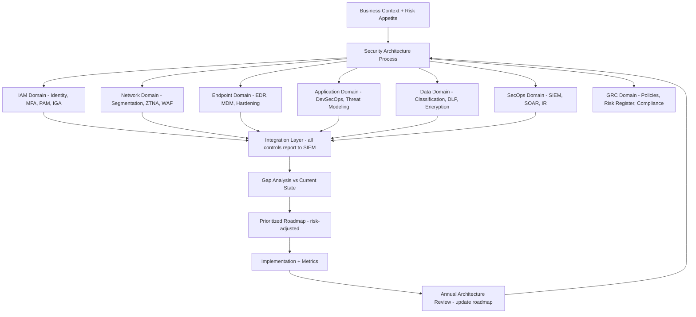

⚡ TL;DR - Enterprise Security Architecture (ESA) is the comprehensive security design framework
for an entire organization's IT systems, processes, and security controls. Unlike project-level
security design, ESA addresses the WHOLE enterprise: identity and access management (IGA + PAM),
network security (segmentation, perimeter, SASE/ZTNA), endpoint security (EDR, MDM), application
security (SAST/SCA/DAST in pipelines), data security (classification, DLP, encryption at rest/in
transit), incident response (SIEM/SOAR, IR playbooks, CSIRT), supply chain security, and security
governance (policies, risk management, compliance). Frameworks: SABSA (Sherwood Applied Business
Security Architecture - business-driven, 6-layer model), TOGAF + security extension (architecture
governance), NIST CSF (Identify, Protect, Detect, Respond, Recover - risk-based), CIS Controls 18
(prioritized implementation). The ESA process: (1) Business context - what are we protecting? Why?
What's the risk appetite? (2) Risk assessment - FAIR model, threat landscape, regulatory requirements.
(3) Target architecture - capabilities needed across all domains. (4) Gap analysis - current state vs
target. (5) Roadmap - prioritized initiatives (risk-adjusted ROI). Common ESA mistake: starting with
technology (buying tools) instead of starting with business risk. The architecture must answer:
"what is the BUSINESS RISK we are managing?" before answering "what technology controls address it?"
Security architecture without business context is a technology collection, not an architecture.

---

| #117 | Category: Security | Difficulty: ★★★★★ |
|:---|:---|:---|
| **Depends on:** | OWASP Top 10, Authentication, Session Management, TLS Configuration, Business Logic, Insufficient Logging, CVSS Scoring, CVE + NVD, AWS Security Services, Kubernetes Security, SAST in CICD, Security Observability + SIEM, Security at Scale, ISO 27001, SOC 2 Type II, Chaos Engineering, Privilege Escalation, Zero Trust Introduction, Red/Blue/Purple Team, Zero Trust Enterprise, DevSecOps Pipeline, Security Champions | |
| **Used by:** | Security Governance, Security Metrics + FAIR, Platform Security Engineering, Multi-Cloud Security, Build vs Buy Security, SSDLC, Adversarial Thinking, Trust Boundary Analysis, Assume-Breach, Security as Contract, Threat Modeling | |
| **Related:** | OWASP Top 10, Authentication, TLS, Business Logic, Insufficient Logging, CVSS, CVE, AWS Security, Kubernetes Security, SAST in CICD, Security Observability + SIEM, Security at Scale, ISO 27001, SOC 2, Chaos Engineering, Privilege Escalation, Zero Trust Introduction, Red/Blue/Purple Team, Zero Trust Enterprise, DevSecOps Pipeline, Security Champions, Security Governance, Security Metrics, Platform Security, Multi-Cloud Security, SSDLC | |

---

### 🔥 The Problem This Solves

**WHY ORGANIZATIONS WITH SECURITY TOOLS STILL GET BREACHED:**

```
THE PATCHWORK SECURITY PROBLEM:

  Company: 500 employees. 50 developers. Finance, healthcare, SaaS vertical.
  Security budget: $2M/year.
  Security tools purchased over 5 years:
  - Firewalls (perimeter): $150K/year.
  - SIEM (Splunk Enterprise): $300K/year.
  - EDR (CrowdStrike): $200K/year.
  - WAF (AWS WAF): $50K/year.
  - Vulnerability scanner (Qualys): $100K/year.
  - Email security (Proofpoint): $80K/year.
  - MFA (Okta): $120K/year.
  - DLP (Symantec): $200K/year.
  - PAM (BeyondTrust): $150K/year.
  - Security awareness training: $50K/year.
  Total: $1.4M/year. Plus $600K/year in security team salaries.
  
  RESULT: 18-month span, 3 significant security incidents.
  
  Post-incident analysis:
  
  Incident 1: Ransomware.
  Attack chain: phishing email → macro execution → lateral movement → domain admin →
  encrypted file servers.
  Why tools didn't prevent it:
  - Email security: blocked 99.9% of phishing. This one: bypassed.
  - EDR: detected macro execution. Alert: buried in 50,000 daily alerts (SIEM not tuned).
  - Network segmentation: non-existent (flat network, lateral movement unobstructed).
  - PAM: deployed but not enforced for all admin accounts.
  
  Incident 2: Data breach (customer PII).
  Attack chain: vulnerable web app (2-year-old CVE, never patched) → SQL injection →
  database dump.
  Why tools didn't prevent it:
  - Vulnerability scanner: found the CVE. Report generated. Nobody acted on it.
  - WAF: didn't have SQLi rules tuned for this specific application.
  - No patch management process: 847 open vulnerability findings, no prioritization.
  
  Incident 3: Insider threat.
  Attack chain: disgruntled employee → bulk download of customer data to personal device →
  left company.
  Why tools didn't prevent it:
  - DLP: deployed but with too many false positives (disabled by IT).
  - IGA (Identity Governance): no offboarding automation (access review: quarterly, stale).
  - UEBA: not deployed.
  
  THE ARCHITECTURE PROBLEM:
  
  Tool: present. Integration: absent.
  - Firewall logs: not in SIEM.
  - SIEM: 50,000 alerts/day. 3 analysts. 90%+ ignored.
  - EDR alerts: not correlated with SIEM events.
  - PAM: deployed on 60% of admin accounts. 40% bypassed via shared credentials.
  - DLP: disabled because false positive rate was too high (no tuning process).
  - Vulnerability scanner: generating reports nobody acts on (no process = no fix).
  
  WHAT AN ENTERPRISE SECURITY ARCHITECTURE WOULD HAVE PROVIDED:
  
  1. Coverage analysis: "which domains are we weak in?"
     Answer: network segmentation (flat network) and patch management process are gaps.
     Before spending $300K on a new SIEM: fix network segmentation for $50K.
     
  2. Integration design: "how do these controls work TOGETHER?"
     EDR alerts → SIEM. SIEM correlation rules: tuned for this organization's threats.
     Patch management: SIEM alert → ticket → SLA enforcement.
     
  3. Process architecture: not just technology. WHO acts on a SIEM alert?
     What is the playbook? What is the SLA? What escalates to what?
     
  4. Prioritization: risk-adjusted. Fix the $2M risk with a $50K control first.
     Not the $50K risk with a $300K tool.
     
  ENTERPRISE SECURITY ARCHITECTURE IS NOT ABOUT TOOLS.
  It is about: understanding what you are protecting, from what threats,
  and designing an integrated system of controls that actually reduces risk.
  Tools without architecture: expensive, partially effective, inefficient.
  Architecture without tools: theoretical.
  Both together: the 3 incidents above become 0 or 1 (residual risk, not negligence).
```

---

### 📘 Textbook Definition

**Enterprise Security Architecture (ESA):** A comprehensive framework that describes the security
design, controls, and principles for an entire organization. Addresses all security domains: identity,
network, endpoint, application, data, and physical. Includes: the current state (AS-IS), the target
state (TO-BE), a gap analysis, and a prioritized roadmap. Purpose: ensure that security controls are
designed as an integrated system (not independent, siloed tools), aligned with business risk, and
cost-effective.

**SABSA (Sherwood Applied Business Security Architecture):** An enterprise security architecture
framework with 6 layers: Contextual (business context - why?), Conceptual (architectural concept -
what?), Logical (logical design - how?), Physical (physical design - with what?), Component (product
selection - which products?), Operational (operations - how managed?). SABSA is RISK-DRIVEN:
starts with business context and risk, derives security requirements from business requirements.
Key distinction: security requirements TRACE TO business requirements. Each control: "this control
mitigates this risk, which protects this business value."

**NIST Cybersecurity Framework (CSF):** A risk-based framework for managing cybersecurity risk.
Five functions: IDENTIFY (understand what to protect), PROTECT (implement safeguards), DETECT
(identify cybersecurity events), RESPOND (take action on detected events), RECOVER (restore
capabilities). Each function: categories and subcategories (controls). Used for: maturity assessment
("where are we?"), gap analysis ("where should we be?"), and communication with executives and boards
(NIST CSF language = commonly understood).

**CIS Controls 18:** 18 prioritized security controls from the Center for Internet Security. Key
property: PRIORITIZED. Controls 1-6 (Implementation Group 1): foundational, cover 85% of common
attacks. Most organizations: should fully implement IG1 before moving to IG2 or IG3. CIS Controls
order: not alphabetical, not random. Order = by impact per unit of effort (evidence-based).

**Defense in Depth Architecture:** Layered security controls so that no single control failure
leads to a breach. Layers: perimeter (firewall, WAF), network (segmentation, IDS/IPS), endpoint
(EDR, host-based firewall), application (SAST/DAST/WAF), data (encryption, DLP, access control).
No single layer: impenetrable. Goal: multiple layers, each catching what the previous missed.
An attacker who bypasses the firewall: faces network segmentation. Who bypasses segmentation:
faces EDR on the endpoint. Who bypasses EDR: faces application-level controls.

**Security Domain Architecture:** Organizing security into domains (Identity and Access Management,
Network Security, Endpoint Security, Application Security, Data Security, Governance/Risk/Compliance).
Each domain: owns its security controls, has a domain lead, tracks maturity, has a roadmap. The
architecture connects domains: IAM controls (MFA, least privilege) → applied to Network domain
(network ACLs, VPN policies), Application domain (API authorization), Data domain (access controls).

---

### ⏱️ Understand It in 30 Seconds

**One line:**
Enterprise Security Architecture is the holistic design of all security controls, integrations,
and processes across an organization - starting from business risk and ending with a prioritized
roadmap of integrated security capabilities, not a collection of independently purchased tools.

**One analogy:**
> Enterprise Security Architecture is like city planning for security.
>
> A city without planning: buildings wherever someone wants to build them.
> Roads: added after buildings exist (work around buildings). Utilities: patched in.
> Fire hydrants: forgotten until there's a fire. Flood drainage: inadequate (not planned).
>
> A city with planning: streets first, utilities buried in streets, buildings oriented around
> streets. Flood drainage: designed for the whole catchment area. Fire hydrants: every 100m.
>
> Enterprise security WITHOUT architecture: security tools wherever someone decided to buy them.
> SIEM: purchased by the security team. DLP: purchased by compliance. EDR: by IT.
> SIEM: doesn't have DLP or EDR logs (not integrated). 50,000 alerts/day. 3 analysts.
> Most alerts: unacted on. Tools: expensive. Protection: partial.
>
> Enterprise security WITH architecture: security domains defined first (identity, network,
> endpoint, application, data). Controls designed for integration (EDR → SIEM → SOAR →
> automated response). Gaps identified (no network segmentation) → prioritized roadmap
> → segmentation project funded and executed before buying the 5th monitoring tool.
>
> The architecture provides: coherence (tools work together), prioritization
> (fix the most impactful gap first), and traceability (every control traces to a
> business risk it mitigates, so security spending can be justified to the board).
>
> A city planner doesn't build the buildings.
> They design the system the buildings fit into.
>
> An enterprise security architect doesn't configure the firewall.
> They design the system the firewall fits into.

---

### 🔩 First Principles Explanation

**ESA design process - from business to architecture:**

```
PHASE 1: CONTEXTUAL ARCHITECTURE (SABSA Layer 1)

  Questions:
  - What is the business? (SaaS platform, healthcare provider, financial services?)
  - What assets are we protecting? (customer PII, financial data, intellectual property?)
  - What are the regulatory requirements? (HIPAA, PCI-DSS, SOC 2, GDPR?)
  - What is the RISK APPETITE? (how much residual risk is acceptable?)
  - Who are the threat actors? (nation-state, financially motivated cybercriminals, insiders?)
  
  Output: business context document.
  Example (healthcare SaaS):
  - Assets: patient health records (PHI). Regulatory: HIPAA. Risk appetite: low (reputational impact).
  - Threat actors: ransomware groups (healthcare = high-value target), insider threat (staff).
  - Business impact of breach: regulatory fine (up to $1.9M/category/year) + reputational.
  
PHASE 2: CONCEPTUAL ARCHITECTURE (SABSA Layer 2)

  Translate business context to security architecture concepts.
  Security domains defined:
  
  DOMAIN 1 - Identity and Access Management (IAM):
  - What: who can access what? How is identity established and verified?
  - Controls concept: strong authentication (MFA for all users), least privilege,
    just-in-time access for privileged users, identity governance (automated provisioning/offboarding).
    
  DOMAIN 2 - Network Security:
  - What: how is network traffic controlled between systems?
  - Controls concept: network segmentation (PHI systems in isolated segment),
    ZTNA (no implicit trust based on network location), egress filtering.
    
  DOMAIN 3 - Endpoint Security:
  - What: how are user devices and servers protected?
  - Controls concept: EDR on all endpoints, MDM for mobile, hardened OS configuration,
    removable media controls.
    
  DOMAIN 4 - Application Security:
  - What: how are applications designed and tested securely?
  - Controls concept: SSDLC (secure by design), threat modeling for new features,
    DevSecOps pipeline (SAST/SCA/DAST), vulnerability management.
    
  DOMAIN 5 - Data Security:
  - What: how is data protected at rest, in transit, and in use?
  - Controls concept: encryption at rest (AES-256), encryption in transit (TLS 1.3),
    data classification, DLP, data retention and disposal policy.
    
  DOMAIN 6 - Security Operations and Incident Response:
  - What: how are threats detected and responded to?
  - Controls concept: SIEM (centralized log collection and correlation),
    SOAR (automated response to common alerts), IR playbooks for each threat scenario,
    CSIRT with defined roles.
    
  DOMAIN 7 - Governance, Risk, and Compliance (GRC):
  - What: how is security managed as a program?
  - Controls concept: security policies (reviewed annually), risk register,
    vendor security assessments, compliance monitoring, board reporting.

PHASE 3: LOGICAL ARCHITECTURE (SABSA Layer 3)

  Design the INTEGRATION of controls across domains.
  
  Data flow: all security event logs → SIEM.
  SIEM sources: firewall, EDR, IAM (Okta), application logs, DLP, network flow.
  SIEM → SOAR: automate responses for high-confidence alerts.
  SOAR actions: isolate endpoint (EDR API), suspend user account (Okta API), create ticket.
  
  Identity as the control plane:
  - All access: mediated by IAM (Okta). No direct access to systems without IAM auth.
  - Context-aware access: Okta + device trust (JAMF/InTune MDM). Access denied if: unmanaged device.
  - Privileged access: CyberArk PAM. No standing admin access. JIT (just-in-time) session.
  
  Network: zero-trust segmentation.
  - PHI systems: in isolated segment. Only IAM-authenticated, device-trusted users can access.
  - ZTNA (Cloudflare Access or Zscaler Private Access): replaces VPN.
  - East-west: microsegmentation at the workload level (Kubernetes NetworkPolicy, AWS Security Groups).

PHASE 4: GAP ANALYSIS

  Current state assessment across all domains.
  
  IAM:
  - MFA: deployed for 80% of users. 20% still without MFA. → Gap.
  - Privileged access: 40% of admin accounts have standing access (no PAM). → Critical gap.
  - Offboarding automation: quarterly access review. 3-day average to revoke access on departure. → Gap.
  
  Network:
  - Segmentation: flat network (PHI servers accessible from any internal IP). → Critical gap.
  
  Application:
  - Vulnerability management: scanner deployed, 847 open findings, no SLA for remediation. → Gap.
  
  Data:
  - DLP: deployed, disabled (too many false positives). → Gap.
  
  Security Operations:
  - SIEM: deployed, 50,000 alerts/day, not tuned, 90% ignored. → Critical gap.
  
PHASE 5: PRIORITIZED ROADMAP (RISK-ADJUSTED)

  Priority 1 (0-6 months): fix Critical gaps.
  - Network segmentation: isolate PHI systems. Cost: $80K. Risk reduction: $2.4M.
  - SIEM tuning: reduce alert volume from 50K to 3K/day (actionable). Cost: 200 engineer-hours.
  - MFA: enforce for 100% of users. Cost: $20K (additional Okta licenses). Risk reduction: significant.
  - PAM: enforce for all admin accounts. Cost: $150K (CyberArk expansion). Risk reduction: $1.5M.
  
  Priority 2 (6-12 months): address significant gaps.
  - Vulnerability management process: SLA-based remediation. Cost: process + 1 FTE.
  - Offboarding automation: Okta + HR system integration. Cost: 80 hours.
  - DLP: retune false positives. Cost: 160 hours.
  
  Priority 3 (12-24 months): target architecture completion.
  - ZTNA: replace VPN. Cost: $200K/year (Cloudflare Access).
  - SOAR: automate response for top 10 alert types. Cost: $100K/year + 400 hours playbook development.
  - Extended threat intelligence: $50K/year.
```

---

### 🧪 Thought Experiment

**SCENARIO: Designing the enterprise security architecture for a Series C startup (300 employees, 40 engineers, SaaS product, processing payment data):**

```
CONSTRAINTS:
  - Regulatory: PCI-DSS (payment card data). SOC 2 Type II (customer requirement).
  - Budget: $800K/year security budget (total: team + tools).
  - Team: 2 security engineers (architect + SecOps analyst).
  - Risk appetite: medium (aggressive growth, but data breach = existential).
  - Threat actors: financially motivated attackers (payment data = money).
  
STEP 1: WHAT ARE WE PROTECTING?

  Crown jewels:
  - Payment card data (PCI-DSS scope). In: payment processor integration (Stripe).
    Note: Stripe processes cards. We: store only last 4 digits + brand. Minimal PCI scope.
  - Customer PII: names, emails, subscription data.
  - Product source code: competitive advantage.
  - AWS credentials + CI/CD secrets: attacker access = full system access.
  
STEP 2: THREAT LANDSCAPE (for payment SaaS at this scale)

  Primary threats (by probability × impact):
  1. Ransomware via phishing (high probability, high impact).
  2. Compromised developer credentials → code repository → supply chain attack.
  3. API vulnerability → customer data exfiltration.
  4. Insider threat (disgruntled employee with database access).
  5. Third-party/vendor compromise.
  
STEP 3: CONTROLS BY DOMAIN (prioritized by threat coverage)

  DOMAIN 1 - IAM:
  - Okta SSO + MFA (FIDO2/WebAuthn) for all users and all SaaS tools.
    Cost: $15K/year. Mitigates: threats 1, 2, 3, 4.
  - Okta Privileged Access (JIT for admin access to AWS).
    Cost: included. Mitigates: threat 3, 4.
  - Automated offboarding: Okta + BambooHR integration. Access revoked in < 1 hour.
    Mitigates: threat 4.
  
  DOMAIN 2 - Application Security:
  - DevSecOps pipeline: GitHub Advanced Security (SAST + secret scanning) + Snyk SCA.
    Cost: $50K/year. Mitigates: threat 2, 3.
  - DAST (OWASP ZAP) in staging: monthly + on major releases.
    Cost: $5K/year (automation). Mitigates: threat 3.
  - Bug bounty program (HackerOne, private, $20K annual bounty budget).
    Cost: $30K/year. Mitigates: threat 3.
  
  DOMAIN 3 - Network:
  - AWS VPC: separate VPCs for production, staging, development.
    Mitigates: threats 1, 3, 4.
  - No VPN: Cloudflare Access (ZTNA) for all internal access.
    Cost: $20K/year. Mitigates: threat 1, 4.
  - AWS WAF: on API Gateway (SQLi, XSS, rate limiting rules).
    Cost: $5K/year. Mitigates: threat 3.
  
  DOMAIN 4 - Endpoint:
  - CrowdStrike EDR on all laptops (macOS + Windows).
    Cost: $60K/year. Mitigates: threat 1.
  - JAMF MDM (Mac) + InTune (Windows): enforce encryption, password policy, OS updates.
    Cost: $20K/year. Mitigates: threat 1, 4.
  
  DOMAIN 5 - Data:
  - Encryption at rest: all AWS data stores (RDS, S3: AES-256, KMS-managed keys).
    Cost: minimal (AWS KMS: $12/key/month). Mitigates: threat 3, 4.
  - AWS Macie: sensitive data discovery in S3.
    Cost: $10K/year. Mitigates: threat 4 (unexpected PII accumulation).
  
  DOMAIN 6 - Security Operations:
  - AWS Security Hub + GuardDuty + CloudTrail.
    Cost: $20K/year. Detects: threats 1, 2, 3, 4.
  - Splunk Cloud (SIEM): ingest EDR + AWS Security Hub + Okta.
    Cost: $80K/year.
  - IR playbooks: ransomware, credential compromise, data exfiltration. 5 playbooks.
    Cost: 200 hours (1-time). Maintained by SecOps analyst.
  
  TOTAL TOOL COST: ~$330K/year.
  Team (2 engineers): ~$400K/year total compensation.
  TOTAL: $730K/year. Under $800K budget. $70K headroom.
  
  COVERAGE ASSESSMENT (threat × control):
  1. Ransomware via phishing: MFA (high), EDR (high), Cloudflare Access (medium). Overall: HIGH.
  2. Developer credential compromise: MFA (high), secret scanning (high), JIT (high). Overall: HIGH.
  3. API vulnerability: DevSecOps pipeline (medium), DAST (medium), WAF (medium), bug bounty (medium). Overall: MEDIUM-HIGH.
  4. Insider threat: offboarding automation (high), UEBA via GuardDuty (medium), DLP (not deployed - gap). Overall: MEDIUM.
  5. Third-party compromise: vendor assessment (not formalized - gap). Overall: LOW.
  
  GAPS ACCEPTED (with rationale):
  - DLP: $100K/year tool, high false positive rate risk, small team cannot manage it.
    Decision: compensating controls (Macie for S3, CloudTrail for all data access).
    Accepted risk: lower than DLP cost to mitigate.
  - Vendor security assessment program: 40-hour quarterly process.
    Decision: focus on top 10 vendors. SOC 2 reports required for critical vendors.
```

---

### 🧠 Mental Model / Analogy

> Enterprise Security Architecture is like designing a hospital's safety systems.
>
> A hospital has many safety systems: fire suppression, emergency power, sterile environment
> protocols, medication dispensing controls, emergency code procedures.
>
> These systems are NOT designed independently:
> - Fire suppression: cannot use water in areas with medical equipment → halon or FM-200.
> - Emergency power: must cover life-critical systems in priority order, automatically.
> - Sterile protocols: must work within fire evacuation procedures (conflicting goals → designed together).
> - Medication controls: two-person verification rule → designed into the dispensing system AND the staffing model.
>
> If each safety system is designed in isolation: they conflict, leave gaps, or fail together.
>
> Enterprise security architecture: designs security controls as an INTEGRATED SYSTEM.
> - IAM controls (who can access what): applied consistently across network, application, and data.
> - Network segmentation: aligned with data classification (most sensitive data = most restricted segment).
> - SIEM: ingests logs from all security controls (not just some) → can correlate events across domains.
> - Incident response: defined for the full control set (what does the SIEM alert trigger? who responds?).
>
> A hospital designed by separate contractors (fire department, electrical, medical equipment, pharmacy):
> potential conflicts, gaps, inefficiencies.
>
> A hospital designed by a team with an integrated plan:
> all systems work together, gaps are identified BEFORE construction.
>
> Security architecture: the integrated planning before the systems are built or integrated.
> The alternative: buy tools, discover gaps after incidents.

---

### 📶 Gradual Depth - Five Levels

**Level 1 - What it is (anyone can understand):**
Enterprise Security Architecture is the comprehensive plan for how an organization protects itself from cyber attacks. Instead of buying security tools one at a time when a problem appears, it designs the WHOLE security system: who can access what, how the network is protected, how threats are detected, how incidents are responded to, and how all these pieces work together. Starting point: "what are we protecting and from whom?" Ending point: a prioritized list of security improvements, with the highest-risk gaps fixed first.

**Level 2 - How to use it (junior developer):**
As a developer, enterprise security architecture affects you through: (1) Policies - "all code must go through the security pipeline (SAST + SCA) before merging." Why: the architecture determined that application security is a risk domain, and the control is a DevSecOps pipeline. (2) Authentication requirements - "all services must use IAM role-based access, not hardcoded credentials." Why: IAM is an architecture domain with a "no static credentials" control. (3) Data handling requirements - "PII data must be encrypted at rest." Why: data security is a domain with encryption as a control. When you understand that these requirements come from a security architecture designed around specific business risks and threats, they are less arbitrary: each requirement traces to a risk it mitigates.

**Level 3 - How it works (mid-level engineer):**
For a security-aware engineer, ESA manifests as the reference architecture for your system designs. Before designing a new service: consult the ESA. "Our architecture requires: all services authenticate via Okta service accounts (not user credentials), log to the central SIEM (Splunk), run in the designated network segment for the data classification of the data handled, and use KMS-managed encryption for data at rest." Your service design: must comply with these architecture requirements. If you need to deviate: security exception process (security architect reviews, risk acceptance). The architecture prevents every team designing their own IAM approach, their own logging format, their own encryption key management. Consistency: a security property (inconsistency creates gaps).

**Level 4 - Why it was designed this way (senior/staff):**
ESA frameworks (SABSA, TOGAF+security, NIST CSF) exist because the alternative - ad hoc tool purchasing - empirically fails. The ESA approach: business context drives architecture. Architecture drives control selection. Control selection drives vendor/tool selection. This sequence: ensures tools are selected because they implement required controls, not because a vendor gave a good demo. The NIST CSF IDENTIFY function: many organizations skip it and go straight to PROTECT. This is the error. You cannot effectively protect what you haven't identified and understood. SABSA Layer 1 (contextual) + Layer 2 (conceptual): the layers most often skipped, most critical for architecture coherence. Defense-in-depth architecture: not "buy many tools." It's "design overlapping controls such that failure of one control does not result in a successful attack." The attacker model: assumes determined attacker who will bypass the first control layer. The architecture: assumes this and designs the second and third layers accordingly.

**Level 5 - Mastery (distinguished engineer):**
Enterprise Security Architecture at scale: the hardest problems are not technical, they are organizational. The technical architecture: a solved problem (NIST CSF, SABSA, CIS Controls provide the framework). The organizational architecture: requires solving: (1) OWNERSHIP. Who owns each domain? If network security is owned by networking (not security), the security architecture's network requirements may conflict with networking's operational priorities. Architecture ownership must be clear and backed by executive authority. (2) CHANGE MANAGEMENT. The existing organization has inertia. The security architecture requires changes to how IT operates (PAM for admin access = changed process), how developers work (DevSecOps = changed pipeline), how applications are designed (threat modeling = changed design process). Without an organizational change management plan: the technical architecture exists on paper and is implemented in 20% of the places it needs to be. (3) METRICS AND FEEDBACK. How do you know if the architecture is working? Security architecture maturity measurement: CIS Controls maturity (Implementation Group 1/2/3), NIST CSF tier assessment (Tier 1: Partial → Tier 4: Adaptive), domain-specific metrics (IAM: % of accounts with MFA, % with privileged access via PAM; Network: % of traffic microsegmented; Application: % of repos with DevSecOps pipeline). The ESA → metrics → feedback loop: the architecture is only effective if maturity is measured and the roadmap is updated based on what the metrics reveal. (4) TECHNOLOGY LIFECYCLE. The architecture designed today: outdated in 5 years. Cloud-native → SASE/ZTNA replaced VPN. Kubernetes → container security replaced VM security. AI → new attack surface and defensive capability. The ESA must be a living document, reviewed annually and updated with technology changes. Not a static design artifact produced once and ignored.

---

### ⚙️ How It Works (Mechanism)

```
ENTERPRISE SECURITY ARCHITECTURE DOMAINS:

  IDENTITY AND ACCESS MANAGEMENT (IAM)
  IGA (provisioning/governance) + PAM (privileged access) + MFA

  NETWORK SECURITY
  Segmentation + ZTNA + WAF + DDoS + DNS security

  ENDPOINT SECURITY
  EDR + MDM + hardening + patch management

  APPLICATION SECURITY
  DevSecOps pipeline + threat modeling + SSDLC + SBOM

  DATA SECURITY
  Classification + DLP + encryption at rest + encryption in transit

  SECURITY OPERATIONS (SecOps)
  SIEM + SOAR + threat intelligence + vulnerability management

  GOVERNANCE, RISK, AND COMPLIANCE (GRC)
  Policies + risk register + vendor management + audit + board reporting
```



---

### 💻 Code Example

**NIST CSF maturity assessment and security architecture gap analysis:**

```python
# enterprise_security_architecture_assessment.py
# NIST CSF-based maturity assessment across security domains.
# Produces: current-state score, target-state score, gap score,
# and prioritized remediation roadmap by risk impact.

from dataclasses import dataclass
from typing import List

# NIST CSF tier descriptions
# Tier 1: Partial (ad hoc, reactive)
# Tier 2: Risk Informed (aware but not org-wide)
# Tier 3: Repeatable (formal policy, consistent)
# Tier 4: Adaptive (continuously improving, risk-informed)

@dataclass
class SecurityControl:
    domain: str
    control: str
    current_tier: int      # 1-4
    target_tier: int       # 1-4
    risk_impact: str       # CRITICAL, HIGH, MEDIUM, LOW
    remediation: str
    cost_estimate: str

def score_domain(controls: List[SecurityControl]) -> float:
    """Average tier across all controls in domain."""
    return sum(c.current_tier for c in controls) / len(controls)

def gap_score(controls: List[SecurityControl]) -> float:
    """Average gap (target - current) across controls."""
    return sum(
        c.target_tier - c.current_tier for c in controls
    ) / len(controls)

# Example assessment for a 300-person SaaS company:
controls = [
    # IAM Domain
    SecurityControl(
        domain="IAM",
        control="Multi-Factor Authentication (all users)",
        current_tier=2,   # Deployed but not enforced for all
        target_tier=4,    # Enforced, phishing-resistant (FIDO2)
        risk_impact="CRITICAL",
        remediation="Enforce MFA for 100% users; migrate to FIDO2",
        cost_estimate="$20K/year + 40h rollout"
    ),
    SecurityControl(
        domain="IAM",
        control="Privileged Access Management (PAM)",
        current_tier=1,   # Ad hoc, shared admin credentials
        target_tier=3,    # JIT privileged access, all admin sessions recorded
        risk_impact="CRITICAL",
        remediation="Deploy CyberArk or Teleport JIT for all admin access",
        cost_estimate="$120K/year + 200h implementation"
    ),
    SecurityControl(
        domain="IAM",
        control="Automated offboarding (access revocation)",
        current_tier=2,   # Manual, 3-day average
        target_tier=4,    # Automated, < 1 hour on HR trigger
        risk_impact="HIGH",
        remediation="Okta + HR integration (BambooHR/Workday)",
        cost_estimate="80h integration"
    ),

    # Network Domain
    SecurityControl(
        domain="Network",
        control="Network segmentation (production isolation)",
        current_tier=1,   # Flat network, no segmentation
        target_tier=3,    # Separate VPCs, microsegmentation for sensitive workloads
        risk_impact="CRITICAL",
        remediation="AWS VPC redesign: prod/staging/dev VPCs + PrivateLink",
        cost_estimate="$30K/year + 120h implementation"
    ),

    # Application Security Domain
    SecurityControl(
        domain="AppSec",
        control="DevSecOps pipeline (SAST + SCA)",
        current_tier=2,   # SAST exists, SCA not deployed
        target_tier=4,    # Full pipeline: SAST + SCA + DAST + secret scan + container scan
        risk_impact="HIGH",
        remediation="Add Snyk SCA + container scanning + DAST (ZAP) to pipeline",
        cost_estimate="$50K/year + 80h setup"
    ),
    SecurityControl(
        domain="AppSec",
        control="Vulnerability management (patching SLA)",
        current_tier=1,   # 847 open findings, no SLA, no owner
        target_tier=3,    # SLA-based: Critical 2d, High 7d, tracked in JIRA
        risk_impact="CRITICAL",
        remediation="Implement VulnMgmt process: owner + SLA + JIRA integration",
        cost_estimate="200h process + 0.5 FTE ongoing"
    ),

    # Security Operations Domain
    SecurityControl(
        domain="SecOps",
        control="SIEM (centralized logging + detection)",
        current_tier=2,   # SIEM deployed, 50K alerts/day, mostly ignored
        target_tier=3,    # Tuned SIEM: < 5K alerts/day, all actionable
        risk_impact="HIGH",
        remediation="SIEM tuning engagement: reduce noise, add MITRE ATT&CK rules",
        cost_estimate="$40K consulting + 200h internal"
    ),
]

def print_assessment(controls: List[SecurityControl]) -> None:
    domains = set(c.domain for c in controls)
    
    print("=== ENTERPRISE SECURITY ARCHITECTURE ASSESSMENT ===\n")
    
    # Priority queue: CRITICAL risk + largest gap first
    critical_controls = [
        c for c in controls
        if c.risk_impact == "CRITICAL" and c.target_tier > c.current_tier
    ]
    
    print("CRITICAL GAPS (immediate action required):")
    for c in sorted(critical_controls, key=lambda x: x.target_tier - x.current_tier, reverse=True):
        gap = c.target_tier - c.current_tier
        print(f"  [{c.domain}] {c.control}")
        print(f"    Current: Tier {c.current_tier} → Target: Tier {c.target_tier} (gap: {gap})")
        print(f"    Remediation: {c.remediation}")
        print(f"    Cost: {c.cost_estimate}\n")

    print("\nDOMAIN MATURITY SCORES:")
    for domain in sorted(domains):
        domain_controls = [c for c in controls if c.domain == domain]
        current = score_domain(domain_controls)
        gap = gap_score(domain_controls)
        print(f"  {domain}: Tier {current:.1f}/4.0 (gap: {gap:+.1f})")

print_assessment(controls)
```

**Sample output:**

```
=== ENTERPRISE SECURITY ARCHITECTURE ASSESSMENT ===

CRITICAL GAPS (immediate action required):
  [Network] Network segmentation (production isolation)
    Current: Tier 1 → Target: Tier 3 (gap: 2)
    Remediation: AWS VPC redesign: prod/staging/dev VPCs + PrivateLink
    Cost: $30K/year + 120h implementation

  [AppSec] Vulnerability management (patching SLA)
    Current: Tier 1 → Target: Tier 3 (gap: 2)
    Remediation: Implement VulnMgmt process: owner + SLA + JIRA integration
    Cost: 200h process + 0.5 FTE ongoing

  [IAM] Privileged Access Management (PAM)
    Current: Tier 1 → Target: Tier 3 (gap: 2)
    Remediation: Deploy CyberArk or Teleport JIT for all admin access
    Cost: $120K/year + 200h implementation

DOMAIN MATURITY SCORES:
  AppSec: Tier 1.5/4.0 (gap: +1.5)
  IAM: Tier 1.7/4.0 (gap: +1.7)
  Network: Tier 1.0/4.0 (gap: +2.0)
  SecOps: Tier 2.0/4.0 (gap: +1.0)
```

---

### ⚖️ Comparison Table

| Framework | Driver | Layers | Best For |
|:---|:---|:---|:---|
| **SABSA** | Business risk | 6 layers (contextual to operational) | Enterprise with complex business context, regulated industries |
| **NIST CSF** | Risk-based | 5 functions (Identify, Protect, Detect, Respond, Recover) | US organizations, board communication, regulatory alignment |
| **CIS Controls 18** | Prioritization | 18 controls, 3 implementation groups | Organizations starting from scratch, prioritizing effort per impact |
| **TOGAF + security** | IT governance | Architecture development method + security extension | Organizations already using TOGAF for enterprise architecture |
| **ISO 27001** | Compliance | 93 controls in 4 themes | Certification target, customer/regulatory requirement |
| **Zero Trust Architecture (NIST 800-207)** | Identity-centric | 7 tenets, 5 pillars | Modern cloud-native organizations, perimeter-less environments |

---

### ⚠️ Common Misconceptions

| Misconception | Reality |
|:---|:---|
| "Enterprise Security Architecture is a one-time deliverable (a document)." | ESA is a living program, not a document. The error: a consulting firm produces a 200-page ESA document. Organization: files it. 18 months later: same architecture, same gaps, new incidents. The ESA document: value is proportional to how actively it is maintained and used. What an ESA document must produce to be valuable: (1) A governance mechanism: "is this new system compliant with our architecture? Who reviews?" (2) A metrics program: "are we improving? Where is maturity not moving?" (3) A roadmap: actively tracked, quarterly updates, tied to budget cycles. (4) An exception process: "we can't comply with the architecture for this system. How is the exception reviewed and accepted?" Without these governance mechanisms: the ESA document is a historical artifact that describes the state of security at the point it was written. Architecture without governance = architecture without effect. The SABSA Layer 6 (Operational): specifically addresses the operational management of security architecture. This is the most-skipped layer and the most common failure point. |
| "We implemented the architecture. We're secure." | Security architecture describes the DESIGN INTENT. Implementation gap is the primary security architecture failure mode. Common example: the architecture states "all admin access must use PAM with JIT sessions." Implementation: PAM deployed for 70% of admin accounts. 30% of admin accounts: bypass PAM via direct credential. The architecture requirement: exists on paper. The actual control: 70% effective. The gap: 30% unprotected admin access. How this is discovered: pen test attacker tests 50 admin accounts. Finds 15 with no PAM, no MFA. Domain admin: achieved in 40 minutes. The root cause: architecture compliance not measured. Nobody tracked "% of admin accounts enforced via PAM." Measurement mechanism: the architecture MUST include metrics for each control, measured continuously. Not "PAM is deployed" but "PAM enforces 99%+ of admin sessions (measured by PAM session log vs AD admin group membership)." Implementation without measurement = hope, not security. |

---

### 🚨 Failure Modes & Diagnosis

**ESA implementation failure patterns:**

```
FAILURE 1: ARCHITECTURE DESIGNED BY SECURITY TEAM ONLY (NO ENGINEERING INPUT)

  Symptom: architecture requirements conflict with engineering realities.
  "You must run all traffic through our security proxy" - breaks the application's
  WebSocket architecture. Engineering: workaround the requirement.
  
  Root cause: security architects designed requirements without understanding
  the technical constraints of the systems they are securing.
  
  Fix:
  - Architecture design: include senior engineers from each domain (networking, application, platform).
  - Each architecture requirement: engineering feasibility review.
  - Conflicting requirements: security architect + engineering agree on compensating control.
    "Can't route WebSocket through proxy → compensating control: TLS on WebSocket,
     application-level auth, traffic logged at load balancer level."
  - Architecture principle: controls that engineers will not implement are not controls.

FAILURE 2: ROADMAP NOT TIED TO RISK (TECHNOLOGY PREFERENCE DRIVING PRIORITY)

  Symptom: organization implements the "interesting" new security tool (SOAR, XDR, AI-based SIEM)
  before fixing flat network segmentation or 100% MFA enforcement.
  
  Root cause: roadmap driven by security team's technology interest, not risk quantification.
  
  Fix:
  - Risk-quantified roadmap: each initiative has a risk reduction estimate (FAIR model).
    "Network segmentation: eliminates lateral movement for ransomware. Expected risk reduction:
     $2.4M (probability × impact reduction). Cost: $150K. ROI: 16:1."
  - Roadmap priority: ranked by risk reduction per dollar, not by technology novelty.
  - Board presentation: "we are fixing $X of risk with $Y of investment."
    Not "we are implementing [technology name]."

ARCHITECTURE MATURITY TRACKING (quarterly review):

  For each domain, track:
  - Current NIST CSF tier (1-4).
  - Target tier (12-month goal).
  - % of controls implemented vs planned.
  - Security incidents attributable to gaps in this domain.
  
  Red flags:
  - Domain stuck at Tier 1 for 2+ quarters → systematic barrier. Investigate root cause.
  - Architecture compliance rate < 80% → governance mechanism not working.
  - Security incidents in a domain with "Tier 3" maturity assessment → measurement error.
    Tier 3 claim needs re-validation.
```

---

### 🔗 Related Keywords

**Prerequisites:**
- `Zero Trust Enterprise` (SEC-114) - ZTA as the modern network security architecture
- `Security Champions Program` (SEC-116) - champions implement architecture at team level
- `DevSecOps Pipeline Design` (SEC-115) - application security domain of the ESA

**Builds on this:**
- `Security Governance` (SEC-119) - governance layer of the enterprise security architecture
- `Platform Security Engineering` (SEC-124) - platform team implements ESA at infrastructure level
- `Multi-Cloud Security` (SEC-125) - ESA in multi-cloud environments

---

### 📌 Quick Reference Card

```
┌──────────────────────────────────────────────────────────┐
│ ESA DOMAINS   │ IAM: MFA, PAM, IGA, SSO                 │
│               │ Network: Segmentation, ZTNA, WAF        │
│               │ Endpoint: EDR, MDM, Hardening           │
│               │ AppSec: DevSecOps, Threat Modeling      │
│               │ Data: Classification, DLP, Encryption   │
│               │ SecOps: SIEM, SOAR, IR                  │
│               │ GRC: Policies, Risk, Compliance         │
├───────────────┼──────────────────────────────────────────┤
│ FRAMEWORKS    │ SABSA: business-driven (6 layers)       │
│               │ NIST CSF: Identify/Protect/Detect/      │
│               │   Respond/Recover                       │
│               │ CIS Controls 18: prioritized, IG1/2/3  │
│               │ Zero Trust (NIST 800-207): modern       │
├───────────────┼──────────────────────────────────────────┤
│ ESA PROCESS   │ 1. Business context (what + why)        │
│               │ 2. Threat model (who + how)             │
│               │ 3. Domain architecture (controls)       │
│               │ 4. Gap analysis (current vs target)     │
│               │ 5. Risk-adjusted roadmap                │
│               │ 6. Implement + measure + review         │
├───────────────┼──────────────────────────────────────────┤
│ ANTI-PATTERN  │ Tools without integration               │
│               │ Architecture without governance         │
│               │ Roadmap driven by technology (not risk) │
│               │ Security team designing without eng.    │
└──────────────────────────────────────────────────────────┘
```

---

### 💎 Transferable Wisdom

**Reusable Engineering Principle:**
"Integration is what turns a collection of tools into a system."
Five security tools in one organization: potentially 5 siloed tools each catching a partial view.
Five security tools INTEGRATED (all logging to SIEM, SOAR automating responses, threat intel
informing rules, patch management tied to vulnerability scanner, IAM integrated with all apps):
a security system. The same tools. The same cost. The difference: architecture (design of
integration and process). This principle: universal in engineering.
- Microservices without an API gateway, service mesh, and distributed tracing:
  are just separate services that happen to communicate.
- CI/CD pipeline stages without a shared artifact repository, unified test reporting,
  and automated promotion criteria: are just sequential scripts.
- Monitoring tools (infrastructure metrics, application traces, business metrics, logs)
  without a unified observability platform: are just separate dashboards.
In each case: the SYSTEM is more than the sum of its parts. The architecture is what creates
the system from the parts. Without architecture: the parts remain parts.
Security architects, solution architects, platform engineers: their core value is designing
the integration. Not selecting tools (commoditized). Not configuring tools (operational).
Designing how tools, processes, and people work TOGETHER to produce an outcome.
Enterprise Security Architecture: the application of this principle to the full security domain.

---

### 💡 The Surprising Truth

The most powerful security architecture capability is the ability to say no with evidence.

Security teams are often asked to approve new technology, new vendors, new processes.
Without an architecture: every approval is a judgment call. Inconsistent. Slow. Frustrating.

With an architecture: "does this comply with our security architecture?"
- Does it integrate with our central IAM (Okta SSO)? No → not approved without exception.
- Does it support TLS 1.2+ for all APIs? Yes → check.
- Does it log to our central SIEM format? No → requires a custom integration or compensating control.
- Does it store PII? Yes → requires data classification review and DLP alignment.

The architecture makes the decision criteria explicit, consistent, and fast.
"We have evaluated this vendor against our 12 security architecture requirements.
They meet 10. Gaps: IAM integration (compensating control: manual quarterly access review)
and SIEM integration (vendor provides CSV export - 6-hour SLA logging lag).
We recommend approval with these compensating controls and a 12-month reassessment."

This is not "security saying no." This is security providing a structured, evidence-based
assessment that business can act on. The decision: remains with the business. The analysis:
architecture-based, consistent, reproducible.

The CISO who can provide this type of structured analysis for every vendor/technology decision:
becomes a business enabler, not a business blocker. Business: starts CONSULTING security
(rather than avoiding security) because the analysis adds value to the decision.

Architecture: the foundation of security as a business capability, not security as a police force.

---

### ✅ Mastery Checklist

**You've mastered this when you can:**
1. **NAME** the seven security domains in an ESA: IAM, Network Security, Endpoint Security,
   Application Security, Data Security, Security Operations (SecOps), and GRC. State two
   controls in each domain.
2. **DESCRIBE** the ESA design process: Business context → threat model → domain architecture
   (controls) → gap analysis → risk-adjusted roadmap → implement + measure → annual review.
3. **CONTRAST** SABSA, NIST CSF, and CIS Controls 18: SABSA (business-driven, 6 layers, enterprise),
   NIST CSF (5 functions, risk-based, board communication), CIS Controls 18 (prioritized by impact,
   IG1 = foundational 85% coverage).
4. **EXPLAIN** the patchwork security failure: tools without integration, alerts not acted on,
   controls not enforced (PAM deployed but 40% bypass). The fix: architecture defines integration
   requirements and enforcement mechanisms, not just control selection.
5. **STATE** the key anti-pattern: roadmap driven by technology preference, not risk quantification.
   Fix: risk-adjusted roadmap (FAIR model: risk reduction per dollar of control investment).

---

### 🎯 Interview Deep-Dive

**Q: How would you design an enterprise security architecture for a company that has grown
from 50 to 500 employees over 3 years and now has significant security debt?
Where do you start and how do you prioritize?**

*Why they ask:* Tests security architecture and program leadership thinking.
Common in CISO-track, security architect, and principal security engineering roles.

*Strong answer covers:*
- Start with business context, not tools: "what are we protecting? from whom? what is the risk
  appetite?" For a 500-person company: likely PII, possibly payment data, possibly IP.
  Regulatory: GDPR, SOC 2, possibly HIPAA/PCI depending on vertical.
  Threat actors: financially motivated cybercrime (ransomware, credential theft, data extortion).
- Current-state assessment: NIST CSF maturity across 7 domains (IAM, Network, Endpoint, AppSec,
  Data, SecOps, GRC). 2-3 week assessment. Interviews with IT, engineering, ops.
  Not a tool audit - a control effectiveness assessment (is the tool actually working?).
- The "security debt" context: prioritize by risk, not by modernization.
  Common security debt items: flat network (no segmentation), no PAM (shared admin credentials),
  MFA not enforced for all users, vulnerability findings accumulating without remediation.
  These are CRITICAL gaps. Fix these before buying new tools.
- Roadmap: 3-phase, risk-adjusted.
  Phase 1 (0-6 months): Critical gaps only. Network segmentation + PAM + MFA enforcement + SIEM tuning.
  Phase 2 (6-12 months): High gaps. DevSecOps pipeline + vulnerability management process + offboarding automation.
  Phase 3 (12-24 months): Target architecture. ZTNA + SOAR + data classification + DLP.
- Governance: architecture compliance check for new systems, exception process, quarterly maturity review.
  Without governance: the architecture is a document, not a program.
- Communication to leadership: FAIR model (risk in dollars). "We are managing $4M of annual expected
  loss. Phase 1 ($350K investment) reduces it to $1.5M. ROI: 7:1." Not "we need security tools."