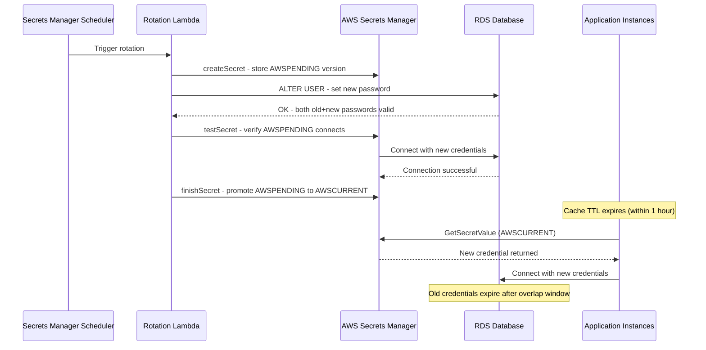

⚡ TL;DR - Secret rotation strategy defines HOW credentials (database passwords, API keys, TLS
certificates, service account tokens, SSH keys) are regularly changed across the entire
organization, so that a stolen credential has a limited validity window. Core principle:
every secret must have a defined rotation schedule, automated rotation mechanism, and a
break-glass fallback. Three rotation models: (1) Scheduled rotation - rotate every N days
(AWS Secrets Manager Lambda rotation: rotate RDS password every 30 days, application fetches
the new value automatically). (2) Triggered rotation - rotate IMMEDIATELY on suspected
compromise (GitHub secret scanning detects leaked API key → auto-rotation trigger in 60
seconds). (3) Dynamic secrets - generate per-request, short-lived credentials (HashiCorp
Vault database secrets engine: each application request → unique username/password, TTL 1 hour,
auto-revoked after TTL). Zero-downtime rotation: the hard problem. Pattern: (1) Generate new
secret. (2) Deploy new secret to all consumers (blue/green or canary). (3) Revoke old secret
ONLY AFTER all consumers are using the new one. Tooling: AWS Secrets Manager (built-in
Lambda rotation for RDS/Redshift/Elasticsearch), HashiCorp Vault (dynamic secrets + PKI),
Azure Key Vault, GCP Secret Manager. The $150M Uber breach (2022): attacker found hard-coded
AWS keys in a private GitHub repository. Zero rotation policy = credentials valid from 2016
until discovered in 2022 (6 years). Secret rotation: limits the blast radius of any credential
theft to the rotation window.

---

| #118 | Category: Security | Difficulty: ★★★★ |
|:---|:---|:---|
| **Depends on:** | OWASP Top 10, Authentication, Session Management, TLS Configuration, Business Logic, Insufficient Logging, CVSS Scoring, CVE + NVD, AWS Security Services, Kubernetes Security, SAST in CICD, Security Observability + SIEM, Security at Scale, ISO 27001, SOC 2 Type II, Chaos Engineering, Privilege Escalation, Zero Trust Introduction, Red/Blue/Purple Team, Zero Trust Enterprise, DevSecOps Pipeline, Security Champions, Enterprise Security Architecture | |
| **Used by:** | Security Governance, Security Metrics + FAIR, Platform Security Engineering, Multi-Cloud Security, Build vs Buy Security, SSDLC, Adversarial Thinking, Trust Boundary Analysis, Assume-Breach, Security as Contract, Threat Modeling | |
| **Related:** | OWASP Top 10, Authentication, TLS, Business Logic, Insufficient Logging, CVSS, CVE, AWS Security, Kubernetes Security, SAST in CICD, Security Observability + SIEM, Security at Scale, ISO 27001, SOC 2, Chaos Engineering, Privilege Escalation, Zero Trust Introduction, Red/Blue/Purple Team, Zero Trust Enterprise, DevSecOps Pipeline, Security Champions, Enterprise Security Architecture, Security Governance, Security Metrics, Platform Security, Multi-Cloud Security, SSDLC | |

---

### 🔥 The Problem This Solves

**WHY LONG-LIVED CREDENTIALS ARE AN EXISTENTIAL SECURITY RISK:**

```
THE CREDENTIAL LIFESPAN PROBLEM:

  Credential: database password for the payments service.
  Created: 2019-01-15. Password: "P@yments2019Prod!"
  Rotation: never.
  
  TIMELINE:
  2019-01-15: Password set. Shared with 3 developers (in Slack DM).
  2019-06-01: Developer 1 leaves the company. Access revoked? No.
               Their laptop: returned. Slack DM: still accessible on personal devices.
  2020-03-20: Developer 2 copies the connection string to a test script.
               Accidentally commits to public GitHub repo.
               GitHub scan detects: "no secret found" (credential inside a JDBC URL, not detected by pattern).
  2021-09-15: Developer 3 uses the password in a Postman collection.
               Shares the collection with a consultant. Contractor: leaves. Postman collection: retained.
  2022-12-01: Password: still "P@yments2019Prod!"
               Still valid. 3 ex-employees, 1 contractor, and a GitHub commit have it.
               
  THE BREACH:
  2022-12-10: Attacker: finds the Postman collection shared link (indexed by a search engine).
  Credential: valid. Database: accessed. Customer records: 2.1M records exfiltrated.
  
  WHAT ROTATION WOULD HAVE PREVENTED:
  
  Policy: rotate all production database credentials every 30 days.
  2019-01-15: Password set.
  2019-02-15: Rotated. Developer 1's Slack DM: now invalid (30 days old).
  2020-03-20: Rotated (developer 2's GitHub commit: 30-day window maximum).
               At the time of the breach (2022-12-10): the credential from 2020 March is rotated at least
               30+ times. The Postman collection credential: invalid within 30 days of sharing.
  
  BREACH PREVENTION:
  Even if the attacker finds the credential (old GitHub commit, old Postman collection):
  the credential is at most 30 days old and has been rotated since.
  The blast radius of any credential theft: bounded to the rotation window (30 days).
  
  THE HARD PROBLEM:
  
  Rotation sounds simple: "just change the password."
  The complexity: 
  - Application has 12 instances. All must get the new password simultaneously.
    If instance 1 uses the new password and instance 2 uses the old password:
    application error OR database accepts both temporarily (dual-password rotation period).
  - Zero-downtime rotation requires: (1) generate new credential, (2) deploy to all consumers,
    (3) verify all consumers are using new credential, (4) revoke old credential.
    Steps 2-4: must happen atomically from the consumer's perspective (no window where credentials are inconsistent).
  - Emergency rotation (breach suspected): even harder.
    Must rotate NOW. Cannot wait for a planned deployment window.
    All services must pick up new credentials immediately or fail with a clear error.
```

---

### 📘 Textbook Definition

**Secret Rotation:** The periodic or event-triggered replacement of credentials (passwords,
API keys, tokens, certificates, private keys) with new values. Purpose: limit the validity window
of any compromised credential. Even if an attacker obtains a credential, it becomes invalid at the
next rotation. Rotation frequency should match the risk profile: financial credentials (rotate frequently),
infrastructure API keys (rotate frequently), third-party integration keys (rotate based on vendor
capability). All rotation should be AUTOMATED: manual rotation is error-prone and often skipped.

**Dynamic Secrets:** Credentials generated on-demand for each requesting application, valid for a
short TTL (time-to-live), and automatically revoked when the TTL expires or the lease is not renewed.
HashiCorp Vault database secrets engine: each application instance requests a unique database
username/password pair (TTL: 1 hour). After 1 hour: credential auto-revoked. No shared password.
No long-lived password. The "rotation window" effectively becomes the TTL (often minutes or hours,
not days). Dynamic secrets: the gold standard for credential hygiene.

**AWS Secrets Manager Rotation:** A managed rotation service for secrets stored in AWS Secrets
Manager. Rotation Lambda: a Lambda function called by Secrets Manager on a defined schedule.
The Lambda: (1) creates a new version of the secret (AWSPENDING stage), (2) updates the resource
(e.g., RDS password changed), (3) tests the new credential (connects to RDS with new password),
(4) finalizes rotation (marks AWSPENDING as AWSCURRENT). Applications using `GetSecretValue`:
automatically get the new value (caching must be aware of rotation; use secrets caching with TTL).

**Secret Sprawl:** The uncontrolled proliferation of secrets across multiple locations (code
repositories, CI/CD pipeline variables, developer laptops, Slack messages, Jira tickets,
documentation, logs). Secret sprawl: makes rotation impossible (you must know WHERE the secret is
to rotate it). Remediation: secrets inventory → identify all locations where secrets are stored →
centralize in a secrets manager → replace all usages with references to the secrets manager.

**Break-Glass Credentials:** Emergency access credentials stored securely (often physically, in a
sealed envelope or a very restrictively accessed digital vault), used ONLY when normal access
mechanisms fail (e.g., Okta is down, PAM is unreachable). Break-glass access: always logged,
always alerted (break-glass use = pager alert to CISO + security team). Credentials: rotated
immediately after every break-glass event.

---

### ⏱️ Understand It in 30 Seconds

**One line:**
Secret rotation is the disciplined, automated replacement of credentials on a defined schedule
(or immediately on compromise), so that any stolen credential has a bounded validity window and
the damage from credential theft is limited to that window.

**One analogy:**
> Secret rotation is like changing the locks in a large office building.
>
> Office building: 200 employees, 50 rooms, 200 keys (physical).
> Key copy: given to any employee who needs access. Key copies: lost, stolen, given to contractors.
> 5 years later: nobody knows how many key copies exist or who has them.
>
> Security model without rotation: "we trust that employees are honest and copies are safe."
> One dishonest employee or one lost key: compromises that room indefinitely.
>
> Security model with rotation (key-card system, re-programmed monthly):
> Every month: key cards reprogrammed with new codes. Old codes: expired.
> Stolen key card from 6 weeks ago: no longer works.
> Ex-employee's key card: invalidated on departure (within the rotation cycle).
> Contractor's key card: expires when the contract ends.
>
> The rotation window: even if someone has a key today, they lose access within 1 month.
> Breach window: bounded to the rotation period.
>
> Digital credentials: exactly the same model.
> Database password from 3 years ago (if never rotated): valid now.
> Database password from 3 years ago (if rotated monthly): invalid after 30 days.
> The stolen credential from a 2020 breach: worth nothing in 2022.
>
> The hard part: "reprogramming" digital credentials is more complex than key cards.
> All applications that use the credential: must receive the new value simultaneously.
> This is the zero-downtime rotation problem.

---

### 🔩 First Principles Explanation

**Secret rotation architecture - full lifecycle:**

```
SECRET LIFECYCLE:

  CREATION:
  - Never in code. Never in environment variables baked into images.
  - In: AWS Secrets Manager, HashiCorp Vault, Azure Key Vault, GCP Secret Manager.
  - Permission: least-privilege IAM role for each service (only the services that NEED
    this secret can READ it).
  - Version: every secret has a version. Current version: always accessible.
    Previous version: retained for N days (rotation overlap period).

  CONSUMPTION:
  - Application: reads secret at STARTUP (not hard-coded). Caches with TTL.
  - Cache TTL: shorter than rotation period.
    Rotation period: 30 days. Cache TTL: 1 hour.
    After rotation: all cache TTLs will expire within 1 hour.
    All instances: automatically pick up the new value.
  - No restart required: application reads from secrets manager on cache miss.
    Cache miss after rotation: new value fetched. No restart needed.

  ROTATION (scheduled):
  - Day 0: current secret "old_password". All apps using it.
  - Rotation triggered (AWS Secrets Manager schedule / Vault lease TTL):
    Step 1: Generate new credential ("new_password"). Store as AWSPENDING.
    Step 2: Update the target system (RDS: change password to "new_password").
    Step 3: Promote AWSPENDING to AWSCURRENT.
    Step 4: Old credential still valid during "overlap period" (24-48h).
    Step 5: All app instances: on cache miss, fetch AWSCURRENT ("new_password").
    Step 6: Confirm all instances have migrated (monitor old credential usage in RDS logs).
    Step 7: Revoke old credential (or it expires automatically).

  ROTATION (triggered - breach suspected):
  - Alert: "API key leaked to GitHub."
  - Automated response (if configured): trigger immediate rotation within 60 seconds.
  - Manual response: rotate immediately → notify all consumers via on-call channel.
  - Old credential: revoked immediately (not an overlap period).
  - Consumer impact: apps may experience brief errors while fetching new credentials.
  - Acceptable: brief errors vs. ongoing breach.

  REVOCATION:
  - On departure of a team member: rotate all secrets they had access to.
  - On suspected breach: rotate immediately.
  - On regular schedule: scheduled rotation.
  - Audit: monthly - list all secrets. For each: when was it last rotated?
    Any secret older than 2× the rotation policy: escalate.
```

---

### 🧪 Thought Experiment

**SCENARIO: Implementing company-wide secret rotation for a 200-developer engineering organization:**

```
CURRENT STATE (starting point):
  - 200 developers, 40 services, 15 databases.
  - Secrets: stored in: environment variables (in code), Kubernetes ConfigMaps (PLAIN TEXT),
    GitHub Actions secrets, AWS Parameter Store (some), developer's ~/.bashrc (some).
  - Rotation: manual, ad hoc. "We rotate when we suspect a leak."
  - Last rotation: most secrets: never rotated. Oldest: 4 years.

STEP 1: SECRET INVENTORY (2 weeks)

  Enumerate all secrets:
  - CodeSearch: grep for common secret patterns in all repos.
    Patterns: AKIA (AWS access key), postgres://, mysql://, ://.*:.*@, API_KEY, TOKEN, PASSWORD.
  - Kubernetes: `kubectl get secret -A -o json | jq '.items[].metadata.name'`
    Result: 342 Kubernetes secrets across 12 namespaces. 43: contain plain-text credentials.
  - AWS Parameter Store: 127 parameters. 34: tagged as "sensitive."
  - CI/CD (GitHub Actions): 89 repository secrets across 30 repos.
  - Developer reports (survey): 23% of developers have secrets in their ~/.bashrc or local config.
  
  Inventory summary: 600+ secret instances, 15+ locations. Most: not centralized.

STEP 2: CENTRALIZATION (6 weeks)

  Decision: AWS Secrets Manager as the single source of truth.
  
  Migration plan:
  Week 1-2: Migrate database credentials (highest risk, highest value).
    - 15 production databases → 15 secrets in Secrets Manager.
    - Enable automatic rotation (Lambda-based, every 30 days).
    - Update 40 services: replace connection strings with `aws secretsmanager get-secret-value` calls.
    - Test: rotation dry-run (manual trigger) on staging. Verify: apps reconnect after rotation.
  
  Week 3-4: Migrate third-party API keys.
    - 89 GitHub Actions secrets → AWS Secrets Manager + GitHub Actions OIDC (no stored key needed).
    - Vendor APIs (Stripe, Twilio, SendGrid, etc.): centralized, rotation schedule set.
  
  Week 5-6: Migrate infrastructure credentials.
    - SSH keys: replaced with AWS Systems Manager Session Manager (no SSH keys needed).
    - Service account tokens: replaced with IAM role-based access (no static token needed).

STEP 3: AUTOMATED ROTATION (2 weeks per secret category)

  Database credentials (AWS RDS):
    - AWS Secrets Manager: built-in rotation Lambda for RDS MySQL/PostgreSQL.
    - Schedule: every 30 days.
    - Test: simulate rotation failure (Lambda error) → verify alerting (CloudWatch alarm → SNS → PagerDuty).
    
  API keys (vendor APIs):
    - Some vendors: support automatic key rotation via API. Stripe: yes (key rotation API).
    - Others: manual rotation required. Schedule: calendar reminder → SecOps analyst rotates + updates Secrets Manager.
    - Rotation ownership: documented per secret (who does the rotation for secrets without automation?).
    
  TLS certificates:
    - AWS Certificate Manager (ACM): automatically renews certificates (no manual renewal).
    - Third-party CAs: Certificate Manager for Kubernetes (cert-manager) → Let's Encrypt (90-day certs, auto-renewed).
    - Manual certs: inventory, alert 30 days before expiration.

STEP 4: BREAK-GLASS POLICY

  Break-glass credentials: for each critical system.
  - Storage: 1Password Secrets Automation (restricted to CISO + CTO + on-call lead).
  - Usage trigger: all normal access mechanisms unavailable.
  - Usage alert: any break-glass access → immediate PagerDuty alert + Slack notification in #security-incidents.
  - Post-use: mandatory rotation within 1 hour of break-glass use.
  - Quarterly test: simulate "IAM unavailable" scenario → verify break-glass works.

RESULT AFTER 3 MONTHS:

  - Secret centralization: 95% (580/600 secrets in Secrets Manager or equivalent).
  - Automated rotation coverage: 85% of secrets on automated schedule.
  - Manual rotation secrets (vendor APIs without API support): 15%, on documented 30-day manual schedule.
  - Oldest credential age: 32 days (worst case, just before rotation).
  - SOC 2 audit (3 months later): "credential management: no findings." (Was: 3 findings in prior audit.)
```

---

### 🧠 Mental Model / Analogy

> Secret rotation strategy is the security application of the "minimum blast radius" principle.
>
> Every long-lived credential is a potential catastrophe waiting for an attacker.
> The credential IS the attack. No credential → no attack (via that vector).
>
> You cannot guarantee credentials won't be stolen. Attack surfaces are complex.
> But you CAN guarantee that stolen credentials become worthless quickly.
>
> The blast radius formula:
> Blast radius (breach) = (Credential exposure window) × (Access scope)
>
> Long-lived credential (never rotated) + broad access (admin rights):
> = Maximum blast radius. (SolarWinds 2020: malicious code signed with valid cert → 9 months exposure.)
>
> Short-lived credential (rotated every 24h) + least-privilege access (read-only for that service):
> = Minimum blast radius. (Stolen today: invalid tomorrow. Access: limited to one service's read.)
>
> The rotation strategy: directly reduces the "exposure window" dimension of blast radius.
> The IAM/RBAC strategy: directly reduces the "access scope" dimension.
> Both together: defense in depth for credentials.
>
> The compound insight: dynamic secrets (Vault) reduce the exposure window to minutes.
> A credential that is valid for 60 minutes and auto-revoked:
> an attacker who steals it must use it within 60 minutes or it expires.
> Most attackers: don't move that fast for manual actions.
> Automated attacks: can, but also detectable (unusual access patterns in 60 minutes → SIEM alert).
>
> Dynamic secrets → rotate faster than attackers can exploit → blast radius → near zero.

---

### 📶 Gradual Depth - Five Levels

**Level 1 - What it is (anyone can understand):**
Secret rotation means regularly changing passwords, API keys, and other credentials so that if one gets stolen, it stops working soon. Like changing your ATM PIN regularly - even if someone sees you enter it once, they can't use it forever. For software systems, this is automated: a scheduler changes the database password every 30 days, and all applications automatically pick up the new password without any manual work.

**Level 2 - How to use it (junior developer):**
As a developer: (1) Never hard-code secrets in code. Use environment variables or a secrets manager (AWS Secrets Manager, HashiCorp Vault, Kubernetes Secrets). (2) Application startup: read the secret from the secrets manager, don't assume it's static. (3) Secret caching: if you cache the secret (for performance), cache with a TTL shorter than the rotation period. "TTL: 1 hour, rotation period: 30 days." On cache miss: re-fetch from secrets manager. (4) If your secret is rotated: your app should NOT crash. It should: detect auth failure → re-fetch secret from secrets manager → retry. Pattern: `try { connect(cachedSecret) } catch (AuthError) { refresh secret; connect(newSecret) }`. (5) Never log secrets. Even in error messages: "connection failed with password [REDACTED]."

**Level 3 - How it works (mid-level engineer):**
AWS Secrets Manager rotation mechanics: `SecretRotation` is triggered either on schedule (every 30 days) or manually. A Lambda function (`rotationLambda`) handles the rotation in 4 steps: (1) `createSecret` - generates a new password, stores as `AWSPENDING` version. (2) `setSecret` - updates the actual resource (RDS: `ALTER USER` command). (3) `testSecret` - connects to RDS with `AWSPENDING` credentials and verifies. (4) `finishSecret` - sets `AWSPENDING` as `AWSCURRENT`. Applications using `GetSecretValue` API: always get the current version. The dual-credential problem: during the `setSecret` step, both old and new passwords are valid (RDS supports this via the `AWSPREVIOUS` version retention period). This provides the zero-downtime window. Applications: on cache TTL expiry, fetch new credentials automatically. The rotation overlap period (default: 1 hour): both old and new passwords work. After 1 hour: old password only works if AWSPREVIOUS is still retained. After retention period: old password invalid. Zero restart required. Zero downtime.

**Level 4 - Why it was designed this way (senior/staff):**
The failure mode that rotation strategy is designed for: credential persistence. An attacker who compromises a credential (via phishing, repo scraping, insider leak) needs to PERSIST that access. Long-lived, never-rotated credentials: the attacker can persist indefinitely. Stolen in 2019, still valid in 2022: 3 years of attacker persistence. Rotation: breaks the persistence model. Even if the attacker has the credential, they lose access at the next rotation. The attacker counterstrategy: rotate with the victim. "If they rotate the credential, I will follow: steal the new credential too." Counterstrategy effectiveness: requires continued access to the credential source (code repo, CI/CD, developer laptop). If the attacker's initial access vector is closed (patched, account revoked): they cannot follow the rotation. This is why rotation + incident response + access review are defense in depth: rotation limits persistence, incident response closes the initial access vector, access review removes stale accounts that provide the pivot point. Dynamic secrets (Vault): the hardest model for attackers to follow. Each request: unique credential. TTL: 1 hour. Attacker must compromise the application process itself (not just its configuration) to steal the credential - and even then, it expires in 1 hour. Vault dynamic secrets + short TTL: effectively forces attackers to have CURRENT code execution on the target machine to maintain access. That's a much harder attack to sustain.

**Level 5 - Mastery (distinguished engineer):**
Zero-downtime secret rotation at scale: the engineering challenge. 40 services, 15 databases, 100+ pods per service across 3 AZs. Rotation event: new database password generated. All 4,000+ application instances must adopt the new password within the 1-hour overlap window. The naive approach: restart all pods on rotation. Downtime: unacceptable for critical services. The AWS Secrets Manager + caching client approach: `aws-secretsmanager-caching-java` library. Cache TTL: 1 hour. On `GetSecretValue` call: cache check first. On rotation: within 1 hour, all instances re-fetch on next cache TTL expiry. This works, but: 1-hour window means during the transition, some instances use old credentials and some use new. The dual-credential window: RDS accepts both during this 1-hour period. After 1 hour: only new credentials valid. The coordination problem: what if a pod restarts during the transition? It fetches the new credential immediately. Now: connection pool has both old-credential connections (from pre-restart) and new-credential connections (from post-restart). The connection pool must handle this gracefully (it does: each connection authenticates independently). The distributed Vault lease management problem: 4,000 pods, each with a 1-hour lease on a dynamic credential. 4,000 unique credentials at any time. Vault must renew 4,000 leases per hour (67 renewals per minute). Vault agent (sidecar): handles lease renewal automatically. But: Vault capacity must be sized for (pods × renewal_rate). 4,000 pods × 1/hour renewal = 4,000 API calls/hour to Vault. Vault HA cluster: sized accordingly. The operational implication: secret rotation architecture is a distributed systems problem. The "just change the password" mental model: applies only to applications with 1 instance. At scale: rotation is a distributed state change that must be orchestrated carefully.

---

### ⚙️ How It Works (Mechanism)

```
ZERO-DOWNTIME ROTATION SEQUENCE:

  t=0:  Rotation triggered (schedule or event).
  t=1:  New credential generated (AWSPENDING).
  t=2:  Target resource updated (RDS: new password set).
        Both old + new passwords valid (dual-credential window).
  t=3:  AWSPENDING promoted to AWSCURRENT.
  t=4:  Applications: on cache TTL expiry, fetch AWSCURRENT.
        Gradually: all instances use new credential.
  t=5:  Old credential valid window expires.
        All applications: must be using new credential by now.
  t=6:  Old credential revoked (or auto-expired).
```



---

### 💻 Code Example

**AWS Secrets Manager rotation Lambda + application-side caching:**

```python
# rotation_lambda.py
# AWS Secrets Manager rotation handler for RDS MySQL.
# Implements the 4-step rotation protocol.
# Deploy as a Lambda function, grant access to both
# Secrets Manager and the RDS instance.

import boto3
import json
import logging
import mysql.connector
import string
import secrets

logger = logging.getLogger()
logger.setLevel(logging.INFO)

def lambda_handler(event, context):
    """
    Entry point for Secrets Manager rotation.
    AWS calls this Lambda 4 times during rotation,
    once per step.
    """
    arn = event['SecretId']
    token = event['ClientRequestToken']
    step = event['Step']

    # Initialize clients
    client = boto3.client('secretsmanager')
    metadata = client.describe_secret(SecretId=arn)

    if not metadata['RotationEnabled']:
        raise ValueError(f"Secret {arn}: rotation not enabled")

    if step == 'createSecret':
        create_secret(client, arn, token)
    elif step == 'setSecret':
        set_secret(client, arn, token)
    elif step == 'testSecret':
        test_secret(client, arn, token)
    elif step == 'finishSecret':
        finish_secret(client, arn, token)
    else:
        raise ValueError(f"Unknown step: {step}")

def create_secret(client, arn, token):
    """Generate new password, store as AWSPENDING."""
    try:
        # If AWSPENDING already exists, don't create again (idempotency)
        client.get_secret_value(SecretId=arn, VersionStage='AWSPENDING',
                                VersionId=token)
        logger.info("AWSPENDING already exists: idempotent, skipping")
        return
    except client.exceptions.ResourceNotFoundException:
        pass  # Expected: create it

    # Get current secret to preserve non-password fields
    current_secret = json.loads(
        client.get_secret_value(SecretId=arn, VersionStage='AWSCURRENT')['SecretString']
    )

    # Generate cryptographically secure password
    alphabet = string.ascii_letters + string.digits + "!@#$^&*"
    new_password = ''.join(secrets.choice(alphabet) for _ in range(32))

    new_secret = {**current_secret, 'password': new_password}

    client.put_secret_value(
        SecretId=arn,
        ClientRequestToken=token,
        SecretString=json.dumps(new_secret),
        VersionStages=['AWSPENDING']
    )
    logger.info("Created AWSPENDING version")

def set_secret(client, arn, token):
    """Update RDS with new password."""
    pending_secret = json.loads(
        client.get_secret_value(SecretId=arn, VersionStage='AWSPENDING',
                                VersionId=token)['SecretString']
    )
    current_secret = json.loads(
        client.get_secret_value(SecretId=arn, VersionStage='AWSCURRENT')['SecretString']
    )

    # Connect with CURRENT credentials to change to PENDING
    conn = mysql.connector.connect(
        host=current_secret['host'],
        user=current_secret['username'],
        password=current_secret['password'],
        database=current_secret['dbname']
    )

    try:
        cursor = conn.cursor()
        # Set new password - both old and new now valid during overlap
        cursor.execute(
            "ALTER USER %s IDENTIFIED BY %s",
            (pending_secret['username'], pending_secret['password'])
        )
        conn.commit()
        logger.info("RDS password updated to AWSPENDING")
    finally:
        conn.close()

def test_secret(client, arn, token):
    """Verify new credentials connect successfully."""
    pending_secret = json.loads(
        client.get_secret_value(SecretId=arn, VersionStage='AWSPENDING',
                                VersionId=token)['SecretString']
    )

    conn = mysql.connector.connect(
        host=pending_secret['host'],
        user=pending_secret['username'],
        password=pending_secret['password'],
        database=pending_secret['dbname']
    )
    conn.close()
    logger.info("AWSPENDING credentials: verified connection successful")

def finish_secret(client, arn, token):
    """Promote AWSPENDING to AWSCURRENT."""
    metadata = client.describe_secret(SecretId=arn)
    current_version = next(
        k for k, v in metadata['VersionIdsToStages'].items()
        if 'AWSCURRENT' in v
    )

    if current_version == token:
        logger.info("Already AWSCURRENT: idempotent finish")
        return

    client.update_secret_version_stage(
        SecretId=arn,
        VersionStage='AWSCURRENT',
        MoveToVersionId=token,
        RemoveFromVersionId=current_version
    )
    logger.info(f"AWSPENDING {token} promoted to AWSCURRENT")
```

**Application-side caching with rotation awareness:**

```python
# secrets_client.py
# Application-side secrets client with rotation-aware caching.
# Key: cache with TTL shorter than rotation period.
# On AuthError: invalidate cache and re-fetch.

import boto3
import json
import time
import threading
from typing import Optional, Dict, Any

class SecretsClient:
    """
    Rotation-aware secrets client.
    - Caches secret for CACHE_TTL seconds.
    - On authentication error: clears cache, re-fetches.
    - Thread-safe.
    """
    CACHE_TTL = 3600  # 1 hour (rotation period: 30 days)

    def __init__(self, region: str = "us-east-1"):
        self._client = boto3.client('secretsmanager', region_name=region)
        self._cache: Dict[str, Dict[str, Any]] = {}
        self._lock = threading.Lock()

    def get_secret(self, secret_name: str) -> Dict[str, Any]:
        """Get secret value; uses cache if not expired."""
        with self._lock:
            if secret_name in self._cache:
                entry = self._cache[secret_name]
                if time.time() - entry['fetched_at'] < self.CACHE_TTL:
                    return entry['value']

        # Cache miss or expired: fetch from Secrets Manager
        return self._fetch_and_cache(secret_name)

    def invalidate(self, secret_name: str) -> None:
        """Force cache invalidation (call on auth error)."""
        with self._lock:
            self._cache.pop(secret_name, None)

    def _fetch_and_cache(self, secret_name: str) -> Dict[str, Any]:
        response = self._client.get_secret_value(SecretId=secret_name)
        value = json.loads(response['SecretString'])
        with self._lock:
            self._cache[secret_name] = {
                'value': value,
                'fetched_at': time.time()
            }
        return value


# Usage: rotation-resilient database connection
_secrets = SecretsClient()

def get_db_connection():
    """
    Database connection with rotation resilience.
    On auth failure: invalidate cache and retry once
    (rotation may have occurred since last cache fetch).
    """
    secret_name = "prod/payments-service/db"
    secret = _secrets.get_secret(secret_name)

    try:
        return connect_db(
            host=secret['host'],
            user=secret['username'],
            password=secret['password']
        )
    except AuthenticationError:
        # Rotation may have occurred: invalidate and retry
        _secrets.invalidate(secret_name)
        secret = _secrets.get_secret(secret_name)
        return connect_db(
            host=secret['host'],
            user=secret['username'],
            password=secret['password']
        )  # If this fails: bubble up as genuine error
```

---

### ⚖️ Comparison Table

| Approach | Rotation Frequency | Zero-Downtime | Complexity | Best For |
|:---|:---|:---|:---|:---|
| **No rotation** | Never | N/A | None | Absolutely not recommended |
| **Manual rotation** | Ad hoc (often never) | Requires coordination | Low (manual) | Small teams, non-critical secrets |
| **Scheduled rotation (Secrets Manager)** | Every N days | Yes (overlap window) | Medium | Database creds, API keys |
| **Dynamic secrets (Vault)** | Per-request (TTL: minutes/hours) | Built-in (each request = new cred) | High | High-security environments |
| **Short-lived tokens (OIDC, STS)** | Per-session (hours max) | Built-in | Medium | Cloud provider API access |
| **Certificate rotation (cert-manager)** | Every 60-90 days (Let's Encrypt) | Yes (certificate rollover) | Medium | TLS certificates |

---

### ⚠️ Common Misconceptions

| Misconception | Reality |
|:---|:---|
| "Secret rotation causes downtime." | Zero-downtime rotation is the goal and is achievable with the right pattern. The causes of rotation-related downtime: (1) Application reads the secret once at startup and hard-codes it in memory. Fix: application re-reads secret on auth error (see code example above). (2) All instances restart simultaneously. Fix: rolling restart + cache TTL approach (no restart needed). (3) No overlap window: old credential revoked before all instances have the new one. Fix: maintain the overlap window (at least 1-2× the application cache TTL). (4) Database connection pool: old connections still using old credentials after rotation. Fix: connection pool with error recovery (close bad connections on auth error, re-open with new credentials). AWS RDS: supports dual-password (old + new valid simultaneously) during the overlap period. This explicitly enables zero-downtime rotation. The statement "rotation causes downtime" describes a poorly implemented rotation, not rotation in principle. With proper implementation: rotation should be invisible to end users. |
| "We use AWS IAM roles, so we don't need secret rotation." | IAM roles (for AWS API access): use short-lived STS tokens (max 12 hours). These effectively rotate automatically - the rotation is built into the authentication mechanism. No manual rotation needed for AWS API access via IAM roles. This is CORRECT and BETTER than static access keys. However: most applications have MANY secrets beyond AWS API access: database credentials (RDS password), third-party API keys (Stripe, Twilio, SendGrid), inter-service credentials (mTLS client certificates), encryption keys (data encryption keys). IAM roles eliminate the need to rotate AWS credentials. They don't address any of the other credential categories. "We use IAM roles" → "we've solved one credential category (AWS API access) correctly." The remaining categories still require a rotation strategy. A common mistake: teams deploy IAM roles, feel secure about credentials, and then leave database passwords from 3 years ago unchanged because "we use IAM roles." IAM roles: excellent, necessary, not sufficient. |

---

### 🚨 Failure Modes & Diagnosis

**Secret rotation failure patterns:**

```
FAILURE 1: ROTATION SUCCEEDS BUT APPLICATION CRASHES

  Symptom: scheduled rotation completes. 20 minutes later:
  application errors (500 responses). Database connection errors in logs.
  
  Root cause: application hard-coded the old password (read at startup, never refreshed).
  
  Diagnosis:
  - Check application startup logs: "connecting to DB with password from config."
  - Check if the application reads from environment variable (static).
    Environment variable: set at pod start. Not refreshed during runtime.
  - Check application code: does it handle auth failure by re-fetching the secret?
  
  Fix:
  - Application: use a secrets caching client with TTL (not a static read).
  - On auth failure: invalidate cache and re-fetch (see code example).
  - Kubernetes: use Secrets Store CSI Driver (reads from Secrets Manager dynamically).

FAILURE 2: ROTATION LAMBDA FAILS SILENTLY

  Symptom: rotation scheduled for 30 days. After 60 days: secret still on original value.
  Rotation: "appears to run" but never actually changes the credential.
  
  Root cause: rotation Lambda throwing an exception that is swallowed.
  Secrets Manager: marks rotation as "failed" but doesn't alert by default.
  
  Diagnosis:
  - Check CloudWatch Logs for the rotation Lambda: look for ERROR messages.
  - Check Secrets Manager console: "Last rotated" date. If old → rotation failing.
  - `aws secretsmanager describe-secret --secret-id <name>`: check LastRotatedDate.
  
  Fix:
  - CloudWatch alarm on rotation Lambda error count > 0 → SNS → PagerDuty.
  - Secrets Manager alert: "secret has not been rotated in N days" → alarm.
  - Monthly audit: `aws secretsmanager list-secrets | jq '.SecretList[] | select(.LastRotatedDate != null) | {Name: .Name, LastRotated: .LastRotatedDate}'`
  
SECRET AGE AUDIT (monthly):

  # List all secrets and their last rotation date (PowerShell)
  aws secretsmanager list-secrets --output json | 
    ConvertFrom-Json | 
    Select-Object -ExpandProperty SecretList | 
    Where-Object {$_.LastRotatedDate -lt (Get-Date).AddDays(-35)} | 
    Select-Object Name, LastRotatedDate, RotationEnabled |
    Format-Table
    
  Red flag: any secret with LastRotatedDate > 35 days (more than 5 days overdue for 30-day policy).
  Red flag: RotationEnabled = false for any production database credential.
  Red flag: any secret with no LastRotatedDate (never rotated).
```

---

### 🔗 Related Keywords

**Prerequisites:**
- `Authentication` (SEC-013) - secrets underpin authentication
- `AWS Security Services` (SEC-103) - AWS Secrets Manager + Secrets Manager rotation
- `Kubernetes Security Fundamentals` (SEC-104) - Kubernetes Secrets and CSI driver

**Builds on this:**
- `Security Governance` (SEC-119) - rotation policy as security governance control
- `Platform Security Engineering` (SEC-124) - platform team implements rotation infrastructure

---

### 📌 Quick Reference Card

```
┌──────────────────────────────────────────────────────────┐
│ ROTATION      │ Scheduled: AWS Secrets Manager Lambda   │
│ TYPES         │ Triggered: on-demand (breach response)  │
│               │ Dynamic: Vault (per-request, short TTL) │
├───────────────┼──────────────────────────────────────────┤
│ ZERO-DOWNTIME │ 1. Generate new credential (AWSPENDING) │
│ PATTERN       │ 2. Update resource (dual-password window)│
│               │ 3. Promote to AWSCURRENT                │
│               │ 4. Apps pick up on cache TTL expiry     │
│               │ 5. Revoke old after overlap window      │
├───────────────┼──────────────────────────────────────────┤
│ APP PATTERN   │ Cache TTL < rotation period             │
│               │ On auth error: invalidate + re-fetch    │
│               │ Never hard-code. Never restart required  │
├───────────────┼──────────────────────────────────────────┤
│ POLICY        │ DB credentials: 30-day rotation         │
│               │ API keys: 90-day rotation               │
│               │ TLS certs: cert-manager auto-renew      │
│               │ Break-glass: rotate after every use     │
└──────────────────────────────────────────────────────────┘
```

---

### 💎 Transferable Wisdom

**Reusable Engineering Principle:**
"Limit the blast radius of any single failure."
Secret rotation: limits the blast radius of credential theft.
A single stolen credential: valid for at most the rotation window.
This principle - limiting blast radius - applies everywhere in engineering:
- Circuit breakers: limit the blast radius of a slow or failing downstream service
  (don't let one failing service take down the whole system).
- Feature flags: limit the blast radius of a bad release
  (enable for 1% of users, catch issues, don't affect 100%).
- Database connection pools with timeouts: limit the blast radius of a slow query
  (don't allow one slow query to exhaust all connections for all users).
- Chaos engineering (GameDay): proactively discover the blast radius of each failure type
  (before an attacker or production failure discovers it for you).
Secret rotation: the blast-radius-limiting principle applied to credentials.
"Assume credentials will be stolen. Minimize the damage when they are."
This is the security manifestation of the reliability engineering assumption:
"Assume components will fail. Minimize the impact when they do."
Both: a shift from "prevent all failures" (impossible) to "limit all blast radii" (achievable).

---

### 💡 The Surprising Truth

The hardest part of secret rotation is not the rotation itself. It is finding all the places the secret is used.

The rotation Lambda: straightforward. AWS has pre-built templates.
AWS Secrets Manager: handles the scheduling and versioning.
The hard part: knowing that your RDS password is hard-coded in a Postman collection
that a developer shared with a contractor 18 months ago.

Secret sprawl (the uncontrolled proliferation of secrets) is what makes rotation
partially or wholly ineffective in most organizations.

Real-world secret sprawl scenarios:
- Database password in: Secrets Manager (official), developer's `.env` file (local dev),
  a Docker Compose file committed 2 years ago (now removed from code, but in git history),
  a Jira ticket ("temporary credential for the consultant"), Slack DM from 2 years ago.
- API key in: CI/CD pipeline variable (official), developer's bash script
  (`~/scripts/deploy.sh`), a Google Doc shared with the old agency, a blog post
  (accidentally pasted, edited out but cached by web archive).

When you rotate the Secrets Manager entry: you've rotated the credential in one of six locations.
The attacker who found it in a Jira ticket or Wayback Machine: still has it.

The prerequisite for effective rotation: secret inventory.
"Where is this secret used? Where has it ever been stored?"
This is harder than the rotation itself. And it's the most commonly skipped step.

Secret scanning tools (Gitleaks, TruffleHog): help find secrets in code and git history.
But: they don't find secrets in Postman collections, Jira tickets, Slack, Google Docs.
The complete answer: secret inventory + secret scanning + developer education
("never put secrets anywhere except the secrets manager") + break-glass audit trail.

Rotation is the response to "a credential might be compromised."
Secret hygiene (inventory + centralization + developer culture) is the prevention.
Both are necessary. Neither alone is sufficient.

---

### ✅ Mastery Checklist

**You've mastered this when you can:**
1. **EXPLAIN** the blast radius argument: why long-lived, never-rotated credentials are dangerous.
   Stolen credential + no rotation = indefinite attacker access. Rotation bounds the window.
   30-day rotation = any stolen credential becomes invalid within 30 days.
2. **DESCRIBE** the zero-downtime rotation pattern: generate new (AWSPENDING), update resource,
   dual-credential overlap window, promote to AWSCURRENT, apps pick up on cache TTL expiry,
   revoke old after overlap. No restart required.
3. **DISTINGUISH** scheduled rotation (AWS Secrets Manager, every N days) vs triggered rotation
   (immediate, on breach detection) vs dynamic secrets (Vault, per-request, TTL in minutes/hours).
4. **CODE** a rotation-aware application pattern: cache secret with TTL shorter than rotation
   period; on auth failure, invalidate cache and re-fetch; never hard-code secret at startup only.
5. **IDENTIFY** the most common rotation failure: secret sprawl. The rotation succeeds in the
   secrets manager but the old credential exists in git history, Postman collections, Jira tickets.
   Rotation without secret inventory: partially effective at best.

---

### 🎯 Interview Deep-Dive

**Q: You discover that your company's RDS database passwords have never been rotated.
Some are 4 years old. How do you remediate this? What are the risks during rotation?**

*Why they ask:* Tests practical secrets management and zero-downtime rotation skills.
Common in senior security engineering and platform engineering roles.

*Strong answer covers:*
- Immediate response: inventory all databases + their secrets. Confirm: which are in a secrets
  manager? Which are hardcoded in application config or environment variables? Hardcoded = cannot
  rotate without application change first.
- Risk assessment: 4-year-old credential exposure risk. How many people have had access?
  Any former employees? Any third-party integrations with the credential? Any public Git commits?
  Prioritize by exposure surface: credentials that were shared broadly → highest risk → rotate first.
- Pre-rotation checklist: (1) Move all database credentials to AWS Secrets Manager (before rotation).
  (2) Update all applications to read from Secrets Manager (not environment variables). (3) Implement
  secrets caching with TTL (not startup-only read). (4) Test rotation in staging first (trigger manual
  rotation, verify all instances reconnect within the overlap window). (5) Add CloudWatch alarm for
  rotation Lambda failures.
- Zero-downtime rotation: AWS Secrets Manager + Lambda rotation handler.
  Dual-credential window: during rotation, both old and new passwords valid for the overlap period
  (configurable, default: 24 hours). All application instances: pick up new credentials on cache TTL
  expiry (< 1 hour if cache TTL set to 1 hour). No restart required. No downtime.
- Rotation schedule going forward: automated, every 30 days. Alarm on any production secret not
  rotated within 35 days (5-day buffer). Monthly audit: `aws secretsmanager list-secrets` for
  secrets with no LastRotatedDate.
- Break-glass consideration: maintain break-glass credentials for each database in a highly
  restricted vault. In case Secrets Manager is unavailable: break-glass access with mandatory alert.