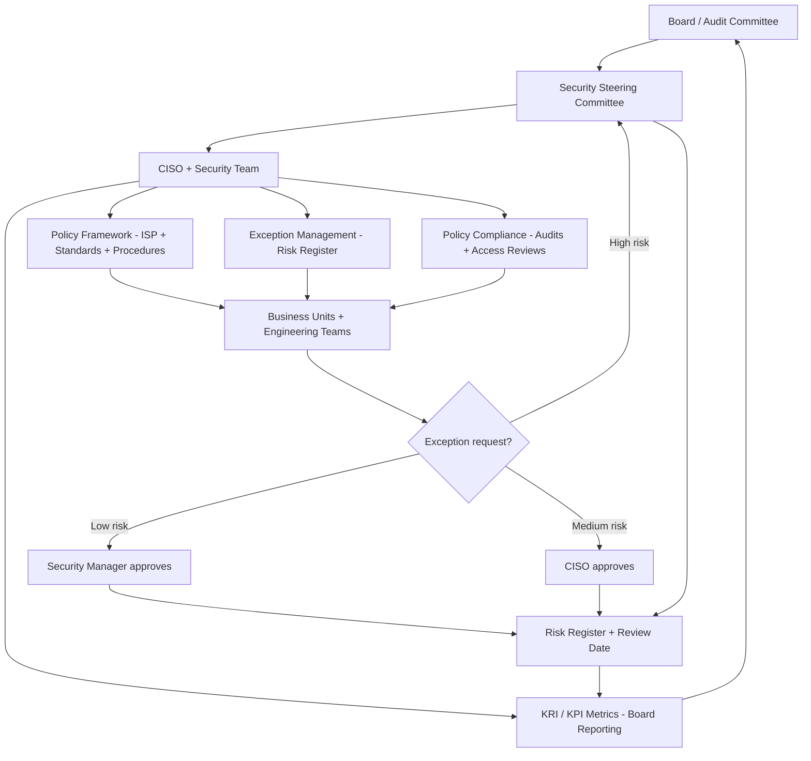

⚡ TL;DR - Security governance is the organizational framework that ensures security decisions
align with business strategy, risk appetite, and compliance requirements. It answers: "who is
accountable for security? How are security decisions made? How is compliance measured and enforced?"
Three-tier governance structure: (1) Executive: CISO + Board/Audit Committee (risk appetite,
accountability, compliance oversight). (2) Management: Security Steering Committee (policy
approval, budget allocation, cross-functional coordination). (3) Operational: Security team +
Champions (policy implementation, monitoring, exception handling). Policy framework layers:
Information Security Policy (top-level, board-approved, 1-2 pages) → Security Standards
(specific controls per domain, CISO-approved, technical detail) → Security Procedures
(step-by-step how-to, team-level, operational detail) → Security Guidelines (recommended but
not mandatory, best-practice guidance). Policy exception process: every exception documented
(who, what, why, what compensating control, when reviewed). Risk register: for each accepted
exception. Annual policy review cycle: all policies reviewed + updated each year. Security
metrics for governance: KRIs (Key Risk Indicators) and KPIs (Key Performance Indicators) reported
to board quarterly. Common KRIs: mean time to detect (MTTD), mean time to respond (MTTR),
% of critical vulnerabilities remediated within SLA, % of endpoints with current EDR. The
governance principle: "security without accountability is a hope, not a program."

---

| #119 | Category: Security | Difficulty: ★★★★ |
|:---|:---|:---|
| **Depends on:** | OWASP Top 10, Authentication, Session Management, TLS Configuration, Business Logic, Insufficient Logging, CVSS Scoring, CVE + NVD, AWS Security Services, Kubernetes Security, SAST in CICD, Security Observability + SIEM, Security at Scale, ISO 27001, SOC 2 Type II, Chaos Engineering, Privilege Escalation, Zero Trust Introduction, Red/Blue/Purple Team, Zero Trust Enterprise, DevSecOps Pipeline, Security Champions, Enterprise Security Architecture, Secret Rotation | |
| **Used by:** | Security Metrics + FAIR, Platform Security Engineering, Multi-Cloud Security, Build vs Buy Security, SSDLC, Adversarial Thinking, Trust Boundary Analysis, Assume-Breach, Security as Contract, Threat Modeling | |
| **Related:** | OWASP Top 10, Authentication, TLS, Business Logic, Insufficient Logging, CVSS, CVE, AWS Security, Kubernetes Security, SAST in CICD, Security Observability + SIEM, Security at Scale, ISO 27001, SOC 2, Chaos Engineering, Privilege Escalation, Zero Trust Introduction, Red/Blue/Purple Team, Zero Trust Enterprise, DevSecOps Pipeline, Security Champions, Enterprise Security Architecture, Secret Rotation, Security Metrics, Platform Security, Multi-Cloud Security, SSDLC | |

---

### 🔥 The Problem This Solves

**WHY SECURITY PROGRAMS FAIL WITHOUT GOVERNANCE:**

```
THE SECURITY WITHOUT GOVERNANCE FAILURE:

  Company: 300 employees, 5-year-old, Series D.
  Security investment: $1.5M/year.
  Security team: 5 people (CISO, 2 security engineers, 1 SecOps, 1 compliance).
  
  The state without governance:
  
  PROBLEM 1: SECURITY POLICY EXISTS, NOBODY FOLLOWS IT.
  
  Information Security Policy: 40-page document. Written 3 years ago.
  Approved by: nobody (CISO wrote it, filed it).
  Known by: the security team. Nobody else has read it.
  Compliance with the MFA policy (page 23): estimated 30%.
    70% of employees: no MFA. They don't know it's required.
    Managers: not aware they're responsible for enforcing it.
    
  Engineering exceptions to the policy:
  - Payment service: uses hardcoded credentials (violates secrets policy).
    Exception: filed? No. Known? Security team knows. Tracked? No.
    
  PROBLEM 2: SECURITY DECISIONS MADE WITHOUT RISK ACCOUNTABILITY.
  
  Engineering team: wants to use a new SaaS tool.
  Security assessment: "this tool doesn't support SSO."
  Engineering response: "we'll use it anyway, we have a deadline."
  Security: no authority to block. No escalation path.
  Decision: tool deployed. No SSO = shadow credential = onboarding/offboarding gap.
  
  Who made the decision? Engineering VP. Did they know the risk? No.
  Was there an exception documented? No.
  Was the risk accepted by someone with authority? No.
  
  This happens 15 times per year. 15 untracked risks.
  
  PROBLEM 3: NO METRICS. NO VISIBILITY.
  
  Board: "how is our security posture?"
  CISO: "we've been very busy. We deployed several tools."
  Board: "are we improving?"
  CISO: (no data) "we believe so."
  
  2 months later: breach. Board: "why didn't you warn us?"
  CISO: "we didn't have visibility into the risk level."
  
  WHAT GOVERNANCE PROVIDES:
  
  Policy compliance rate: tracked. "MFA: 30% → 98% over 6 months."
    Why 98%: enforcement mechanism exists (SSO required for all SaaS = no MFA = no access).
    Exceptions: documented. 2 applications pending SSO integration. Tracked in risk register.
    
  Risk acceptance process: every exception through the process.
    Engineering VP: signs off on risk (now they understand what they're accepting).
    CISO: documents the exception. Risk register: updated.
    Quarterly review: "is the exception still valid? Is the compensating control still sufficient?"
    
  Board reporting: quarterly. "Our critical vulnerability SLA compliance: 94%.
    MTTD: 4 hours (improved from 48 hours 6 months ago).
    Exceptions open: 12. 3 are high-risk (detail provided). Review requested."
    Board: has data. Can ask informed questions. Can allocate budget to risk.
```

---

### 📘 Textbook Definition

**Security Governance:** The organizational framework that defines accountability for security,
ensures security decisions align with business strategy and risk appetite, and provides oversight
of the security program's effectiveness. Governance is not security operations (doing security).
It is the MANAGEMENT AND OVERSIGHT of the security program: who decides, who is accountable,
how is progress measured, how are exceptions handled, how does the board understand the risk.

**Security Policy Hierarchy:**
(1) **Information Security Policy** (ISP): the top-level document. Approved by the board or
CEO. States the organization's commitment to security, defines scope, assigns accountability.
Short (1-2 pages). Does not contain technical detail. Reviewed annually.
(2) **Security Standards**: control-specific requirements. "All production systems must enforce
MFA." "All databases must be encrypted at rest." CISO-approved. Technical but not procedural.
Domain-specific (IAM standard, network security standard, data protection standard).
(3) **Security Procedures**: step-by-step instructions for specific tasks. "How to provision a
new user account." "How to respond to a ransomware alert." Team-level. Operational.
(4) **Security Guidelines**: recommended best practices, not mandatory. "Using parameterized
queries is the recommended approach for database queries." Guidance without enforcement.

**Security Steering Committee:** A cross-functional executive committee that provides oversight
of the security program. Members: CTO, CISO, CFO, Chief Legal Officer, Head of Engineering,
Head of Operations. Meeting frequency: quarterly (some organizations: monthly). Agenda: security
metrics and KRIs, policy review and approval, exception escalations, budget requests,
major security initiatives. Decision authority: policy approval, budget allocation, risk acceptance
for high-risk exceptions.

**Exception Management:** The process for documenting, reviewing, and tracking deviations from
security policy. Every exception: (1) Documented (what policy, what deviation, what system, who
requested, why). (2) Risk assessed (what is the risk of the exception?). (3) Compensating control
identified (what reduces the risk created by the exception?). (4) Approved by the appropriate
authority (low risk: security manager; medium risk: CISO; high risk: steering committee).
(5) Added to the risk register with a review date (not accepted indefinitely).

**Key Risk Indicators (KRIs):** Metrics that indicate the current level of security risk.
Leading indicators: % of systems with current EDR, % of accounts with MFA, critical vulnerability
remediation rate. Lagging indicators: number of breaches, mean cost per incident. KRIs: reported
to the board/steering committee to provide visibility into the security risk posture.

---

### ⏱️ Understand It in 30 Seconds

**One line:**
Security governance is the management framework that makes security accountable - defining who
decides, who is responsible, how exceptions are approved and tracked, and how the board sees the
security risk posture through metrics and reporting.

**One analogy:**
> Security governance is like a city's building code enforcement system.
>
> Building codes (security policies): specify requirements.
> "Buildings must be fire-safe. Load-bearing walls must be rated for X weight."
>
> Without enforcement (governance):
> Builders: ignore codes when inconvenient. "It costs more, we'll skip it."
> Nobody checks compliance. Codes: suggestions on paper.
> Result: buildings collapse. Fires spread. Codes: meaningless.
>
> With enforcement (governance):
> Building inspector: reviews every building plan before approval.
> Construction: inspected at each phase.
> Permit: required before occupancy.
> Variance (exception): applied for formally, reviewed, requires compensating measure.
> Statistics: tracked. "30% of buildings last year needed a fire-code variance."
> City council: reviews the statistics. "30% is too high. Enforcement needs strengthening."
>
> Security governance = the building code enforcement system for information security.
> Policies: the building codes.
> Policy review: the building inspection.
> Exception process: the variance application.
> Board reporting: the city council briefing.
> Without the enforcement system: the policies are suggestions.
> With it: the policies are reality.

---

### 🔩 First Principles Explanation

**Security governance structure and components:**

```
TIER 1: BOARD / AUDIT COMMITTEE
  Responsibility: ultimate accountability for information security risk.
  Activities:
  - Approve the Information Security Policy (annually).
  - Receive quarterly security metrics briefing (KRIs, material incidents).
  - Approve the security budget.
  - Ask: "are we managing security risk appropriately for our business?"
  
TIER 2: SECURITY STEERING COMMITTEE (executive management)
  Members: CEO/CTO, CISO, CFO, CLO, Head of Engineering.
  Frequency: quarterly (or monthly for high-risk periods).
  Responsibility: operational oversight of the security program.
  Activities:
  - Approve security standards (domain-level policies).
  - Review and approve high-risk exceptions.
  - Allocate security budget.
  - Set risk appetite: "we accept this risk because the business value outweighs it."
  - Escalation point: disputes between security and business units on exception approval.
  
TIER 3: CISO / SECURITY TEAM
  Responsibility: day-to-day security program management.
  Activities:
  - Author, maintain, and distribute policies.
  - Run the exception management process (first-line approval for medium-risk exceptions).
  - Collect and report KRIs.
  - Manage the risk register.
  - Coordinate the annual policy review cycle.
  - Escalate material risks to the steering committee.

POLICY LIFECYCLE:

  DRAFT:
  - Author: security engineer or CISO.
  - Review: legal (compliance implications), engineering (feasibility),
    affected business units (operational impact).
  - Period: 4 weeks for new policy.
  
  APPROVAL:
  - Information Security Policy: board.
  - Standards: CISO.
  - Procedures: department head.
  - Guidelines: security engineer.
  
  PUBLICATION:
  - Internal wiki or GRC platform.
  - Announced to all employees (for policies that affect everyone).
  - Training: for policies with compliance requirement (acceptable use policy → annual training + acknowledgment).
  
  ENFORCEMENT:
  - Technical controls (preferred): SSO enforces MFA policy without needing humans to check.
  - Process controls: quarterly access reviews check least-privilege policy compliance.
  - Audit: internal audit team or GRC tool checks compliance against each policy control.
  
  REVIEW:
  - Annual: all policies reviewed. Outdated content updated. New threats addressed.
  - Triggered: major security incident, regulatory change, significant technology change.
  
EXCEPTION MANAGEMENT PROCESS:

  Request received from: engineering, IT, business unit.
  
  STEP 1: Document the exception.
  - What policy is being violated?
  - What system or process is the exception for?
  - Why is the exception needed? (technical limitation, cost, business urgency?)
  - What compensating control is proposed?
  - What is the requested duration?
  
  STEP 2: Risk assessment.
  - Security team: assess the risk of the exception.
  - Risk level: Low, Medium, High, Critical.
    Basis: likelihood of exploitation × impact of exploitation.
  
  STEP 3: Approval routing.
  - Low risk: security manager approves.
  - Medium risk: CISO approves.
  - High risk: security steering committee approves.
  - Critical: exception not approved. Technical solution required.
  
  STEP 4: Risk register.
  - Approved exception: added to risk register.
  - Fields: exception ID, policy, system, requester, approver, compensating control,
    expiry date, risk level, review date.
  
  STEP 5: Review.
  - Quarterly: all open exceptions reviewed.
  - Questions: is the exception still needed? Is the compensating control still effective?
    Is the risk level the same?
  - Annual: all exceptions > 1 year old require re-approval.
  - Closed: when the technical solution is implemented or the need no longer exists.
```

---

### 🧪 Thought Experiment

**SCENARIO: Building a security governance program at a 400-person company that has grown rapidly without governance:**

```
CURRENT STATE:
  - 400 employees, 5 engineering teams, 60 services, AWS infrastructure.
  - Security: 2-person team (no CISO yet - just hired the first CISO 3 months ago).
  - Security policies: 3 documents, last updated 2 years ago. Nobody has read them.
  - Exceptions: tracked in a spreadsheet (30 entries, mostly out of date).
  - Board reporting: none. Board has never received a security report.
  
  NEW CISO FIRST 90 DAYS (governance focus):
  
  MONTH 1: FOUNDATION

  Week 1-2: Policy audit.
  - Existing policies: read and assessed.
  - Gap analysis vs. regulatory requirements (SOC 2 is the target).
  - Finding: 3 SOC 2 CC controls have no corresponding policy.
  
  Week 3-4: Stakeholder mapping.
  - Who needs to be involved in security governance?
  - CEO: yes (signature on Information Security Policy).
  - CTO: yes (engineering security requirements).
  - Head of Finance: yes (financial data protection).
  - General Counsel: yes (legal and compliance implications).
  - Engineering managers: yes (policy enforcement for their teams).
  
  MONTH 2: POLICY FRAMEWORK

  Week 1-2: Information Security Policy rewrite.
  - 2-page document. Clear commitment. Scope. Accountability assignment.
  - Approved by: CEO.
  - Published: company wiki. Emailed to all employees. Acknowledged by all managers.
  
  Week 3-4: Security Standards (per domain).
  - IAM Standard: MFA requirements, privileged access, SSO requirement.
  - Data Protection Standard: data classification, encryption, retention.
  - Vulnerability Management Standard: severity SLAs (Critical 2d, High 7d, Medium 30d).
  - Written by security team. Reviewed by CTO. Approved by CISO.
  
  MONTH 3: GOVERNANCE MECHANISMS

  Security Steering Committee: formed.
  - Members: CEO, CTO, CISO, CFO, General Counsel.
  - First meeting: present current risk posture (honest assessment).
    "We have 12 open exceptions. 3 are high risk. Here is the mitigation plan."
    "Our MFA compliance is 45%. Target: 95% within 60 days."
  - Board briefing: CISO presents first security report to board.
    "This is where we are. This is our 12-month plan. These are the KRIs we will track."
    
  Exception management process: designed.
  - Exception request form: deployed in the GRC tool (ServiceNow or Drata).
  - Approval routing: documented. Tested with 2 pending exceptions.
  - Risk register: migrated from spreadsheet to GRC tool.
  
  KRIs defined and first baseline collected:
  - MFA compliance: 45% (target: 95%).
  - Critical vulnerability remediation within SLA: 60% (target: 95%).
  - Mean time to detect (MTTD): 72 hours (target: 4 hours).
  - Open high-risk exceptions: 3 (target: 0 within 90 days).
  - % of employees completing annual security awareness: 10% (target: 100% within 60 days).
  
OUTCOME AT 6 MONTHS:
  - Information Security Policy: approved and acknowledged.
  - Security Steering Committee: meeting quarterly.
  - KRI dashboard: live. Board receives quarterly briefing.
  - Exception management: 100% of exceptions tracked. 12 → 6 open (3 high-risk → 0).
  - MFA compliance: 45% → 87%.
  - SOC 2 audit (at 9 months): no governance-related findings.
  - Board response: "for the first time, we have visibility into our security posture."
```

---

### 🧠 Mental Model / Analogy

> Security governance is the difference between a security team and a security program.
>
> Security team: a group of people doing security work.
> "We scan for vulnerabilities. We respond to incidents. We review code."
>
> Security program: the governed system that ensures security work produces business outcomes.
> "Our vulnerability management program has SLAs. Here is our SLA compliance rate.
>  Our incident response program has playbooks. Here is our MTTD and MTTR.
>  Our policy compliance rate is 94%. These are the 6% of exceptions, tracked and risk-accepted."
>
> The difference: accountability, measurement, and management.
>
> A security team without governance: works hard but cannot demonstrate effectiveness.
> "We worked on security all year." Did it improve? How do you know? What changed?
>
> A security program with governance: can answer the board's questions.
> "Our mean time to detect improved from 72 hours to 4 hours this year.
>  Our critical vulnerability SLA compliance is 95%, up from 60%.
>  We had 2 incidents. Both were below material threshold. Root cause analysis: attached."
>
> The board can fund security confidently only when it has evidence that security spending
> produces measurable risk reduction.
> Governance creates the measurement system.
> Without measurement: security is a black box that absorbs budget.
> With measurement: security is a managed business capability with a track record.

---

### 📶 Gradual Depth - Five Levels

**Level 1 - What it is (anyone can understand):**
Security governance is the management system for security. It answers: "who is responsible for security? What are the rules? How do we know the rules are being followed? What happens when they're not?" Like any management system, it needs: clear policies (the rules), enforcement mechanisms (how rules are checked), exception handling (when rules can't be followed), and reporting (how management sees the status). Without governance, security is individual effort without coordination or accountability.

**Level 2 - How to use it (junior developer):**
As a developer, security governance affects you through: (1) Policies: "all production deployments require security review for changes to authentication logic." This is a policy. It applies to you. (2) Exception requests: if you need to deviate from policy ("our vendor doesn't support SSO"), there is a formal process. Fill out the exception form. Don't just do it without documenting. (3) Compliance checks: quarterly access reviews ("does this person still need this access?"), annual security training (you'll be required to complete it), security awareness ("here's this quarter's phishing threat"). (4) Security KPIs: your team's security metrics may be tracked (SAST finding triage rate, vulnerability remediation rate). These feed the governance reporting.

**Level 3 - How it works (mid-level engineer):**
Building a governance mechanism for a specific policy: the MFA enforcement example. Policy: "all employees must use MFA for all company applications." Technical enforcement: SSO (Okta) required for all SaaS applications. SSO = MFA enforced at SSO level. Any SaaS not using SSO = cannot be used (or requires exception). Compliance measurement: Okta admin console → "users without MFA enrolled" report. Run weekly. Feed into KRI dashboard. Trend: should decrease to zero over time. Exception tracking: SaaS tools that don't support Okta SSO → exception form → compensating control: "service account with rotating password, monitored by SIEM, limited to read-only access." Exception: in risk register with 90-day review. Policy enforcement is most effective when technical controls enforce the policy (no human check required). Process controls (access reviews, audits) catch what technical controls miss.

**Level 4 - Why it was designed this way (senior/staff):**
Security governance exists because of the principal-agent problem in security. The principal (board, CEO): wants the organization to be secure. The agent (security team): is responsible for security. Without governance: the board cannot assess whether the agent is doing the right things effectively. The board cannot know if security spending is reducing risk or just buying tools. Governance creates: (1) Accountability - the CISO is accountable to the steering committee, which is accountable to the board. If the breach happens: the accountability chain is clear (not "whose fault was it?"). (2) Measurement - KRIs provide the board with objective data on security posture. Not "we feel secure" but "our critical vulnerability SLA compliance is 95%." (3) Exception transparency - every deviation from policy is documented and risk-accepted by an appropriate authority. No hidden risk. (4) Resource allocation rationality - risk register + KRI data → informed budget decisions. "This $200K initiative reduces our mean time to detect from 48 hours to 4 hours. Our risk of undetected breach drops by X%." Without governance: budget is allocated by whoever argues loudest or had the best vendor demo.

**Level 5 - Mastery (distinguished engineer):**
The mature security governance model: the GRC (Governance, Risk, and Compliance) platform as the operational backbone. Tools: ServiceNow GRC, Drata, Vanta, Hyperproof. Function: centralize policies, controls, evidence, exceptions, and risk register in one system. The key capability: control mapping. One control ("MFA required for all users") maps to: ISO 27001 A.9.4.2, SOC 2 CC6.1, NIST CSF PR.AC-7, HIPAA 164.312(d). Single control → automatically satisfies multiple compliance requirements. Evidence collection: automated where possible. "AWS Config rule: MFA-enabled-for-IAM-console-access. Checks compliance every 24 hours. Evidence automatically collected in GRC." Manual evidence: assigned to owners with due dates. Audit prep: click "generate audit package" → all controls, evidence, exception rationale, risk register → provided to auditor. This is the operational benefit of a GRC platform: compliance audits go from 6-week manual effort to 2-week review. The governance metric that matters most at the board level: "residual risk exposure" - using FAIR (Factor Analysis of Information Risk) quantification. "Our residual cyber risk (after all controls) is $2.8M annual expected loss. Last year: $4.2M. We reduced risk by $1.4M with $800K of security investment. ROI: 1.75x." This is how security governance becomes a business capability rather than a cost center: quantified risk reduction, tied to business investment.

---

### ⚙️ How It Works (Mechanism)

```
SECURITY GOVERNANCE STRUCTURE:

  BOARD / AUDIT COMMITTEE
  Annual policy approval, quarterly KRI briefing, material incident notification
  
       ↑ reports to          ↓ direction
  
  SECURITY STEERING COMMITTEE
  Policy standards approval, exception escalation, budget allocation
  
       ↑ metrics, exceptions  ↓ guidance
  
  CISO / SECURITY TEAM
  Policy authoring, exception management, risk register, KRI collection
  
       ↑ compliance data      ↓ policies, audits
  
  BUSINESS UNITS / ENGINEERING TEAMS
  Policy compliance, exception requests, incident reporting
```



---

### 💻 Code Example

**Security policy framework and exception tracking template:**

```yaml
# security-governance-framework.yaml
# Policy metadata and exception tracking structure.
# Loaded by GRC platform or used for manual tracking.

policies:
  information_security_policy:
    id: ISP-001
    title: "Information Security Policy"
    version: "3.0"
    approved_by: "CEO"
    approval_date: "2024-01-15"
    next_review: "2025-01-15"
    scope: "All employees, contractors, and systems"
    
  standards:
    - id: STD-IAM-001
      title: "Identity and Access Management Standard"
      approved_by: "CISO"
      approval_date: "2024-01-15"
      next_review: "2025-01-15"
      controls:
        - id: CTL-IAM-001
          requirement: "All users must enroll MFA within 48 hours of account creation"
          enforcement: "technical"
          enforcement_detail: "Okta MFA policy - enforced at authentication"
          compliance_check: "Okta admin report: users_without_mfa"
          check_frequency: "weekly"
          
        - id: CTL-IAM-002
          requirement: "All privileged access must use PAM with session recording"
          enforcement: "technical"
          enforcement_detail: "CyberArk - all admin sessions via vault"
          compliance_check: "CyberArk: admin accounts with direct access (not via vault)"
          check_frequency: "daily"
          
    - id: STD-VULN-001
      title: "Vulnerability Management Standard"
      controls:
        - id: CTL-VULN-001
          requirement: "Critical vulnerabilities remediated within 2 business days"
          enforcement: "process"
          enforcement_detail: "Weekly vulnerability review meeting, JIRA SLA tracking"
          compliance_check: "JIRA: critical vulns open > 2 business days"
          check_frequency: "daily"

exceptions:
  - id: EXC-2024-001
    policy: "STD-IAM-001"
    control: "CTL-IAM-001"
    system: "LegacyHRApp - on-premises"
    description: "HR application does not support SAML/OIDC; cannot integrate with Okta SSO"
    reason: "Vendor EOL announced; migration to cloud HR in Q3 2024"
    requested_by: "Head of HR"
    requested_date: "2024-02-01"
    risk_level: "HIGH"
    compensating_controls:
      - "Strong password policy enforced at application level (16 chars, complexity)"
      - "Access restricted to HR office IP range (network control)"
      - "SIEM alert on any access from outside business hours"
      - "Quarterly access review: HR manager reviews all active accounts"
    approved_by: "CISO"
    approval_date: "2024-02-05"
    expiry_date: "2024-09-30"
    review_date: "2024-05-01"
    status: "active"
    notes: "Cloud HR (Workday) migration target: Q3 2024. Exception auto-expires at migration."

kris:  # Key Risk Indicators - reported to board quarterly
  - id: KRI-001
    name: "MFA Compliance Rate"
    description: "% of active users with MFA enrolled"
    unit: "percentage"
    target: 99
    current_quarter: 94
    prior_quarter: 82
    trend: "improving"
    source: "Okta admin API"
    
  - id: KRI-002
    name: "Critical Vulnerability SLA Compliance"
    description: "% of critical vulnerabilities remediated within 2 business days"
    unit: "percentage"
    target: 95
    current_quarter: 88
    prior_quarter: 71
    trend: "improving"
    source: "JIRA vulnerability board"
    
  - id: KRI-003
    name: "Mean Time to Detect (MTTD)"
    description: "Average hours from incident start to detection"
    unit: "hours"
    target: 4
    current_quarter: 6.2
    prior_quarter: 18.4
    trend: "improving"
    source: "SIEM incident records"
    
  - id: KRI-004
    name: "Open High-Risk Exceptions"
    description: "Count of open exceptions classified as HIGH risk"
    unit: "count"
    target: 0
    current_quarter: 1
    prior_quarter: 4
    trend: "improving"
    source: "GRC platform exception tracker"
```

**Board security report summary (quarterly template):**

```markdown
# Quarterly Security Report - Q3 2024
## Security Steering Committee and Board Briefing

### Executive Summary

Security posture: IMPROVING
Risk trend: DECREASING
Open material risks: 1 (HIGH - see Risk Register item EXC-2024-001)

### Key Risk Indicators

| KRI | Target | Q3 2024 | Q2 2024 | Trend |
|-----|--------|---------|---------|-------|
| MFA compliance | 99% | 94% | 82% | ↑ Improving |
| Critical vuln SLA | 95% | 88% | 71% | ↑ Improving |
| Mean time to detect | 4h | 6.2h | 18.4h | ↑ Improving |
| High-risk exceptions | 0 | 1 | 4 | ↑ Improving |

MFA compliance gap (94% vs 99% target): 1 legacy HR application pending cloud migration (Q3).
All other systems: 100% MFA compliance.

### Incidents This Quarter

Total incidents: 2 (both below material threshold)
- INC-2024-031: Phishing email clicked by 3 employees. Credentials: not compromised (MFA blocked).
  MTTD: 2 hours. MTTR: 4 hours. Root cause: new phishing template variant. 
  Action: new rule added to email security filter. Security awareness email sent.
- INC-2024-041: Trivy found critical CVE in production container image. No exploitation.
  MTTD: automated (45 minutes). MTTR: 4 hours (image rebuilt + redeployed). Root cause: outdated base image.
  Action: base image update pipeline added (weekly automated base image refresh).

### Open Risk Items

| ID | Description | Risk | Owner | Due | Status |
|----|-------------|------|-------|-----|--------|
| EXC-2024-001 | Legacy HR app: no SSO/MFA | HIGH | Head of HR | 2024-09-30 | On track (Workday migration 70% complete) |

### Forward Look

Q4 objectives:
- MFA compliance: 99% (LegacyHRApp migration completing September).
- Critical vuln SLA compliance: 95% (additional engineering sprint allocated).
- Security Champions: expand to remaining 3 teams (12 → 15 teams covered).
- Annual penetration test: scheduled November. Results: Q1 2025 board briefing.

Budget status: $1.2M of $1.5M annual budget consumed (80%).
Remaining $300K: allocated to Q4 penetration test and Workday integration costs.
```

---

### ⚖️ Comparison Table

| Component | Purpose | Audience | Approval | Review |
|:---|:---|:---|:---|:---|
| **Information Security Policy** | Top-level commitment and scope | All employees | Board/CEO | Annual |
| **Security Standards** | Control-specific requirements per domain | IT, Engineering, Operations | CISO | Annual |
| **Security Procedures** | Step-by-step operational instructions | Security team, IT | Department head | Annual |
| **Security Guidelines** | Recommended best practices (not mandatory) | Developers, IT | Security engineer | As needed |
| **Exception** | Documented deviation from policy | Requester, approver, CISO | Risk-based (manager→CISO→steering) | Quarterly |

---

### ⚠️ Common Misconceptions

| Misconception | Reality |
|:---|:---|
| "Security governance is bureaucracy that slows things down." | The comparison must be honest. "Governance creates bureaucracy vs. no governance = faster." The real comparison: "governance with process" vs "no governance + incidents that require emergency response." The exception management process: 5-10 minutes to fill out an exception form. Alternative: no process → exception deployed → breach → 200+ hours of incident response + $500K+ in breach costs. The 5-10 minutes of process prevented 200 hours of crisis management. Governance creates structured, predictable delays (exception review: 48-72 hours) vs. unstructured, unpredictable delays (breach response: days to weeks). The objection "governance slows us down" is often about POORLY DESIGNED governance (approvals that take 3 weeks, policies that are 40 pages of legalese). Well-designed governance: lightweight, automated where possible, proportional to risk (low-risk exceptions: 24-hour approval). The DevOps principle applied to governance: "if it's painful, do it more often and make it fast." Exception process: if engineers avoid it because it's painful → simplify the form, reduce approval time. Make compliance the path of least resistance. |
| "Policy compliance means we are secure." | Policy compliance is a NECESSARY but not SUFFICIENT condition for security. Policy compliance = "we are doing what we said we would do." Security = "we are actually protected from the threats we face." These are related but not identical. Counter-example: 100% compliance with MFA policy + 0 security monitoring → a compromised account using MFA can act maliciously for months undetected. MFA is in policy. Monitoring is not (or is not effectively implemented). Policy: complied with. Security: inadequate. The risk that compliance creates false confidence: compliance frameworks (SOC 2, ISO 27001, PCI-DSS) define MINIMUM baseline controls, not optimal security. An organization can be fully compliant with SOC 2 and still be breached (many examples exist). Compliance = "we met the minimum standard." Security = "we are protected against the actual threats targeting our specific organization." The security governance maturity progression: Tier 1: compliance-focused ("are we meeting the standard?"). Tier 2: risk-focused ("what are the actual threats? Are our controls addressing them?"). Tier 3: adaptive ("how do we detect when our controls are insufficient? How do we improve continuously?"). Most organizations at Tier 1 believe they are more secure than they are because their policy says so. Tier 3 organizations know what they can't see and have processes to improve. |

---

### 🚨 Failure Modes & Diagnosis

**Security governance failure patterns:**

```
FAILURE 1: POLICY WITHOUT ENFORCEMENT MECHANISM

  Symptom: policy says "MFA is required." MFA compliance: 30%.
  CISO: "we have the policy." Board: "30% compliance is not a policy; it's a suggestion."
  
  Root cause: policy exists without a technical or process enforcement mechanism.
  "MFA required" in a document ≠ MFA required in practice.
  
  Fix:
  - For every policy control: define the enforcement mechanism at policy creation time.
  - Technical enforcement: Okta MFA policy → enforced at SSO level → non-negotiable.
  - Process enforcement: quarterly access review → manager signs off on each access right.
  - Audit: GRC tool checks compliance. Non-compliance → ticket created automatically.
  
  Design principle: "policy enforcement should not rely on humans remembering to check."
  Automated enforcement → compliance as a side effect of using systems normally.

FAILURE 2: RISK REGISTER USED FOR STORAGE, NOT MANAGEMENT

  Symptom: risk register has 80 entries. Last review: 14 months ago.
  Half the entries: systems that have been decommissioned.
  Risk owners: for 40 entries, the risk owner has left the company.
  
  Root cause: risk register is a filing system, not a management tool.
  Nobody is reviewing it. Nobody is closing completed items. Nobody is updating stale items.
  
  Fix:
  - Quarterly risk register review meeting: 60 minutes, cross-functional.
  - Agenda: close resolved risks, update stale risks, re-assess risk level, assign new risks.
  - Risk owner: must be a current employee. Automated check on owner active status.
  - Stale risk (not reviewed in > 90 days): automatically escalated to CISO.
  - Size management: aim for < 30 OPEN risk register items. Too many = unmanageable.
    If > 30: prioritize and focus on top 20 by risk level.

GOVERNANCE HEALTH INDICATORS:

  Healthy:
  - Board receives quarterly security briefing (evidence: meeting minutes, reporting).
  - All security policies: reviewed within the last 12 months.
  - Exception approval SLA met (target: < 72 hours for medium risk).
  - KRIs: trending in the right direction (improving quarter-over-quarter).
  - Risk register: < 30 open items, all reviewed within 90 days.
  
  Unhealthy (requires intervention):
  - Board hasn't received security report in > 6 months.
  - Any policy last reviewed > 18 months ago.
  - Exception backlog > 2 weeks for any risk level.
  - KRIs: stagnant or worsening for 2+ quarters without remediation plan.
  - Risk register > 60 items or items > 6 months without review.
```

---

### 🔗 Related Keywords

**Prerequisites:**
- `ISO 27001 Overview` (SEC-108) - ISO 27001 = governance framework for ISMS
- `Enterprise Security Architecture` (SEC-117) - ESA defines what governance must oversee

**Builds on this:**
- `Security Metrics + FAIR` (SEC-122) - governance reporting requires metrics and risk quantification
- `SSDLC` (SEC-129) - governance framework that governs secure development lifecycle

---

### 📌 Quick Reference Card

```
┌──────────────────────────────────────────────────────────┐
│ POLICY        │ ISP (board, 2 pages) → Standards (CISO) │
│ HIERARCHY     │ → Procedures (team) → Guidelines (eng.) │
├───────────────┼──────────────────────────────────────────┤
│ GOVERNANCE    │ Board: risk appetite, annual policy,     │
│ TIERS         │   quarterly KRI briefing                 │
│               │ Steering committee: standard approval,   │
│               │   high-risk exception, budget            │
│               │ CISO: day-to-day, risk register,        │
│               │   exception management, KRI reporting    │
├───────────────┼──────────────────────────────────────────┤
│ EXCEPTION     │ Document → risk assess → route by level │
│ PROCESS       │ Low: security manager. Med: CISO.       │
│               │ High: steering committee.                │
│               │ Add to risk register. Quarterly review.  │
├───────────────┼──────────────────────────────────────────┤
│ KEY KRIs      │ MFA compliance rate                     │
│               │ Critical vuln SLA compliance            │
│               │ MTTD / MTTR                              │
│               │ Open high-risk exceptions                │
└──────────────────────────────────────────────────────────┘
```

---

### 💎 Transferable Wisdom

**Reusable Engineering Principle:**
"Measurement creates accountability; accountability drives improvement."
Security governance applies this principle: you cannot improve what you don't measure.
The KRI system: makes security performance visible, comparable, and improvable.
Without KRIs: CISO says "we're doing well." Board has no way to evaluate.
With KRIs: "MTTD was 72 hours Q2. It's 4 hours Q3. This improvement cost $80K (SIEM tuning).
We reduced our breach detection window by 18x." Board: can evaluate the investment.
This principle: universal in engineering management.
- Software delivery: DORA metrics (deployment frequency, MTTR, change failure rate, lead time).
  Without them: "our team is agile." With them: "our deployment frequency is 5/day. Industry leading."
- System reliability: SLO/SLA/error budget. Without them: "our system is reliable."
  With them: "we consumed 40% of our monthly error budget in 3 days due to the database incident."
- Product quality: NPS, retention, support ticket rate.
  Without them: "users seem happy." With them: "NPS dropped 15 points month-over-month."
Security governance = metrics + accountability structures for security.
The governance framework is the management infrastructure.
The KRIs are the measurement system.
Both together: the conditions for systematic, evidence-based improvement.

---

### 💡 The Surprising Truth

The most important security governance document is not the Information Security Policy.
It is the exception register.

The ISP describes the ideal world. The exception register describes the real world.
Every exception is a gap between the policy (what we intend) and the reality (what we have).
The exception register: the most honest document in the security governance system.

An organization with 5 exceptions that are tracked, risk-assessed, have compensating controls,
and are reviewed quarterly: more secure than an organization with 0 exceptions documented
(because it ACTUALLY has 50 exceptions, all informal and untracked).

The 0-exception organization: false confidence. "We comply with all policies."
Reality: they comply with all policies except the 50 cases that were never formally excepted.
Those 50 cases: untracked, unreviewed, no compensating control, no expiry date.
The 50 informal exceptions: the attack surface that attackers find.

The 5-exception organization: realistic. "We have 5 policy exceptions."
Each exception: documented. Risk: assessed. Compensating control: in place. Review: scheduled.
The exceptions: the security team knows about them. The steering committee: approved them.
They are MANAGED RISK, not UNKNOWN RISK.

The governance principle: "unknown risk is worse than known risk."
Known risk can be managed. Unknown risk manages you.

The CISO who presents 15 open exceptions to the board: more trustworthy than the one who says "we have no exceptions."
"We have no exceptions" means either: "we have perfect compliance" (implausible) or "we don't track exceptions" (alarming).
"We have 15 exceptions, here they are, here's the risk for each, here's the plan to close 8 of them by Q4":
demonstrates a functioning governance program.

---

### ✅ Mastery Checklist

**You've mastered this when you can:**
1. **DESCRIBE** the policy hierarchy: Information Security Policy (board-approved, 2 pages) →
   Security Standards (CISO-approved, control-specific) → Security Procedures (team-level,
   how-to) → Security Guidelines (recommended, not mandatory).
2. **EXPLAIN** the three-tier governance structure: Board (risk appetite, annual policy,
   quarterly KRI briefing) → Steering Committee (standard approval, budget, high-risk exceptions)
   → CISO/Security team (day-to-day, risk register, KRI collection, exception management).
3. **WALK THROUGH** the exception management process: document (what policy, what system, why,
   compensating control) → risk assess → route by level (low: manager; medium: CISO; high: steering
   committee) → add to risk register with review date.
4. **NAME** four critical KRIs: MFA compliance rate, critical vulnerability SLA compliance,
   MTTD (mean time to detect), open high-risk exceptions. Explain why each matters.
5. **EXPLAIN** why the exception register is the most important governance document: it documents
   the gap between policy and reality. Unknown exceptions = unmanaged risk. Documented exceptions
   = managed risk with compensating controls and review dates.

---

### 🎯 Interview Deep-Dive

**Q: As CISO at a 400-person company, you've been asked to present the company's security
posture to the board of directors for the first time. What do you present, and how do you
structure it?**

*Why they ask:* Tests ability to communicate security to a non-technical audience with governance
maturity. Common in CISO-track and senior security leadership roles.

*Strong answer covers:*
- Frame: board of directors communicates in business risk language, not security technical language.
  Never lead with "we deployed a WAF and Semgrep." Lead with: "we reduced our estimated annual
  cyber risk exposure by $1.4M this year."
- Structure of the board security briefing (25-30 minutes max):
  * Current risk posture (5 min): NIST CSF tier assessment per domain. "IAM: Tier 2.5 (above average).
    Network: Tier 1.5 (below average, improvement plan in Q4). We are tracking toward Tier 3 by mid-next-year."
  * Key Risk Indicators (5 min): 4-5 KRIs with trends. "MFA compliance: 94% (up from 82%).
    Critical vuln SLA compliance: 88% (up from 71%). MTTD: 6.2h (down from 18.4h). Trend: improving."
  * Material risks (10 min): top 3 open risks. Specific. Risk level. Mitigation plan. Owner. Timeline.
    "Risk 1: Legacy HR application without SSO. Risk level: HIGH. Mitigation: Workday migration
    (70% complete, Q3 target). Compensating control: IP restriction + SIEM alerting."
  * Incidents (5 min): incidents from the quarter. For each: what happened, impact, MTTD/MTTR, root cause, fix.
    If no material incidents: state it. "No material incidents. 2 minor incidents: both below materiality threshold."
  * Forward look (5 min): Q4 priorities. Annual pen test schedule. Budget status.
- What NOT to include: technical tool names (Splunk, CrowdStrike), specific CVE IDs,
  configuration details, architecture diagrams. This is not the audience for technical depth.
- Board questions to be prepared for: "are we more secure than last year?" (answer with KRI trends).
  "What keeps you up at night?" (answer with top open risk). "What do you need?" (answer with
  specific budget request tied to risk reduction).
- The governance meta-point: "this is our first quarterly briefing. We will present this format
  every quarter. You will see the trends over time. Security posture improves with consistent
  measurement and reporting. This briefing is the start of that consistency."