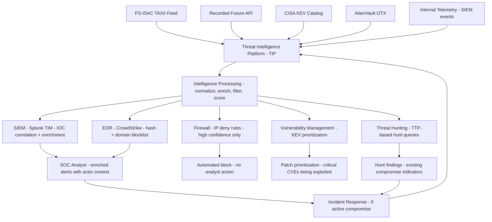

⚡ TL;DR - Cyber Threat Intelligence (CTI) is the collection, processing, and application of
knowledge about threat actors, their tactics, techniques, and procedures (TTPs), and their
indicators of compromise (IOCs) to improve security defenses. Three intelligence types:
(1) Strategic - high-level trends for executives ("ransomware groups targeting healthcare up 45%
this year" → budget decisions). (2) Operational - upcoming attack campaigns ("APT29 launching
spearphishing campaign against European financial institutions" → alert defenders, tighten controls).
(3) Tactical - actionable IOCs for detection (IP addresses, domains, file hashes, email subjects
of current campaigns → import into SIEM/EDR for blocking). STIX/TAXII: the standard format
(Structured Threat Information eXpression) and protocol (Trusted Automated eXchange of Indicator
Information) for sharing threat intelligence between organizations. MITRE ATT&CK: the framework
that classifies threat actor TTPs (14 tactics, 200+ techniques) - used to map IOCs to adversary
behavior, measure detection coverage, and guide threat hunting. Integration points: SIEM (IOC
feeds → match against log events → alert), EDR (malicious hashes/domains → block at endpoint),
Firewall (malicious IP/domain → block at network). The key challenge: IOC quality vs. quantity.
Free threat feeds: millions of IOCs, high false positive rate. Commercial threat intelligence
(Recorded Future, Mandiant, CrowdStrike CTI): curated, high-confidence, context-rich. The metric
that matters: detection rate of actual attacks, not the number of IOCs ingested.

---

| #120 | Category: Security | Difficulty: ★★★★ |
|:---|:---|:---|
| **Depends on:** | OWASP Top 10, Authentication, Session Management, TLS Configuration, Business Logic, Insufficient Logging, CVSS Scoring, CVE + NVD, AWS Security Services, Kubernetes Security, SAST in CICD, Security Observability + SIEM, Security at Scale, ISO 27001, SOC 2 Type II, Chaos Engineering, Privilege Escalation, Zero Trust Introduction, Red/Blue/Purple Team, Zero Trust Enterprise, DevSecOps Pipeline, Security Champions, Enterprise Security Architecture, Secret Rotation, Security Governance | |
| **Used by:** | CSIRT Design, Security Metrics + FAIR, Platform Security Engineering, Multi-Cloud Security, Adversarial Thinking, Trust Boundary Analysis, Assume-Breach, Security as Contract, Threat Modeling | |
| **Related:** | OWASP Top 10, Authentication, TLS, Business Logic, Insufficient Logging, CVSS, CVE, AWS Security, Kubernetes Security, SAST in CICD, Security Observability + SIEM, Security at Scale, ISO 27001, SOC 2, Chaos Engineering, Privilege Escalation, Zero Trust Introduction, Red/Blue/Purple Team, Zero Trust Enterprise, DevSecOps Pipeline, Security Champions, Enterprise Security Architecture, Secret Rotation, Security Governance, CSIRT Design, Security Metrics, Platform Security, Multi-Cloud Security | |

---

### 🔥 The Problem This Solves

**WHY SECURITY WITHOUT INTELLIGENCE IS REACTIVE (AND LOSING):**

```
THE DEFENDER'S ASYMMETRY WITHOUT THREAT INTELLIGENCE:

  ATTACKER:
  - Has months to plan. Researches the specific target organization.
  - Knows which email addresses to target (LinkedIn, HaveIBeenPwned).
  - Knows which software the target runs (Shodan, Censys, job ads listing tech stack).
  - Has existing tools and infrastructure from prior campaigns.
  - Shares intelligence with other attackers (dark web forums, eCrime groups).
  - Knows which industry is being targeted by which threat group.
  - Has weeks of undetected dwell time (average: 207 days in 2022, IBM X-Force).
  
  DEFENDER WITHOUT THREAT INTELLIGENCE:
  - Reacts to every attack as if it's the first time seen.
  - "Was this attack a targeted campaign or opportunistic?"
  - "Is this IP associated with a threat actor or a false positive?"
  - "Why is this malware variant different from what we've seen before?"
  - No early warning of upcoming campaigns.
  - No context: "is this the Lazarus Group or an amateur?"
  - Each attack: analyzed from scratch.
  
  THE RESULT:
  Without intelligence: the defender is always surprised.
  Every attack: "we've never seen this before."
  Mean time to detect: 207 days (average). Why? No intelligence to recognize the patterns.
  
  DEFENDER WITH THREAT INTELLIGENCE:
  
  Week 1: Threat intel feed detects: "APT29 running spearphishing campaign with Subject:
  'Q4 Financial Review - Action Required.' Targeting: finance and accounting staff.
  Attachment: Excel macro. C2: 185.234.X.X."
  
  Action BEFORE any attack:
  - Email security: block emails with that subject line.
  - Firewall: block 185.234.X.X and associated ASN.
  - Finance team: targeted security awareness message.
    "We have intelligence that attackers are sending fake finance emails this week."
  - EDR: hunt for existing Excel macro execution across all endpoints.
  - SIEM: alert on any connection to 185.234.X.X.
  
  Outcome:
  - Attack attempt: detected at email security layer (never reached user's inbox).
  - 3 employees: received the email (personal email, not corporate). Reported it.
  - Intel confirmed: attackers were targeting this organization.
  - Zero compromise. Zero dwell time.
  
  Without intelligence: 1 finance user would have opened the attachment.
  Average dwell time: 207 days of undetected attacker access.
  Intelligence advantage: prevented the attack entirely.
  Cost: $30K/year commercial threat intel subscription.
```

---

### 📘 Textbook Definition

**Cyber Threat Intelligence (CTI):** The collection, processing, and analysis of information
about existing or potential threats to an organization, with the goal of enabling informed security
decisions. CTI answers: "who is attacking us (or likely to)? How do they attack? What are they
after? What evidence do they leave?" Intelligence is distinct from raw data: it has been analyzed,
contextualized, and made actionable.

**Intelligence Taxonomy (types):**
(1) **Strategic intelligence**: for senior executives and board. Long-term trends.
"Nation-state actors are increasingly targeting supply chain (SolarWinds, XZ Utils). We should
assess our supply chain security." Decision: budget allocation, risk appetite.
(2) **Operational intelligence**: for security managers. Current or upcoming campaigns.
"Ransomware group LockBit is actively targeting healthcare organizations in the EU this quarter.
They use RDP exploitation as the initial access vector." Decision: tighten RDP controls, alert IR team.
(3) **Tactical intelligence**: for SOC analysts and security engineers. Technical IOCs (Indicators
of Compromise) for immediate detection and blocking. File hashes, IP addresses, domains,
email subjects, YARA rules, SIGMA detection rules for specific malware families.

**IOC (Indicator of Compromise):** A forensic artifact that, with high confidence, indicates a
system has been compromised or is under attack. IOC types: file hashes (MD5/SHA256 of malware),
IP addresses (C2 servers), domains (malware distribution or C2), email addresses (phishing senders),
URL paths (exploit delivery). IOC limitation: easily changed by attackers (a new hash, a new domain).
Defenders who rely ONLY on IOCs: always behind the attacker. TTP-based detection (MITRE ATT&CK)
is more durable than IOC-based detection.

**TTP (Tactics, Techniques, and Procedures):** The behaviors attackers use, distinct from the
specific tools they use. Tactic: "lateral movement." Technique: T1021 - Remote Services.
Sub-technique: T1021.001 - Remote Desktop Protocol. Procedure: "the attacker uses a compromised
admin account to RDP from the initial access host to domain controller servers during business hours
to avoid detection." TTPs: harder for attackers to change than IOCs (changing a file hash is trivial;
changing your attack methodology is costly). TTP-based detection = durable defense.

**STIX (Structured Threat Information eXpression):** The standard format for representing threat
intelligence as machine-readable structured data. STIX objects: indicators (IOCs), threat actors,
attack patterns (MITRE ATT&CK techniques), malware, campaigns, courses of action (mitigations).
STIX 2.1: the current version. JSON-based.

**TAXII (Trusted Automated eXchange of Indicator Information):** The protocol for sharing STIX
objects between threat intelligence platforms and consumers. Enables automated, machine-to-machine
sharing of threat intelligence. TAXII 2.1: the current version. REST-based.

**ISAC (Information Sharing and Analysis Center):** Sector-specific organizations for sharing
threat intelligence among peers. FS-ISAC (financial services), H-ISAC (healthcare), E-ISAC (energy).
Members: receive threat intelligence relevant to their sector. Share intelligence about attacks
they experience. Community defense: what one member detects helps defend all members.

---

### ⏱️ Understand It in 30 Seconds

**One line:**
Cyber Threat Intelligence is the application of structured knowledge about who is attacking,
how they attack, and what they leave behind - used to shift from reactive (detect attacks as
they happen) to proactive (block attacks before they succeed, based on advance knowledge
of attacker TTPs and IOCs).

**One analogy:**
> Threat intelligence in cybersecurity is like intelligence in military defense.
>
> An army without intelligence: responds to attacks only after they happen.
> "The enemy is at the gates." React. Defend.
>
> An army with intelligence: knows the enemy's plans, capabilities, and typical tactics.
> "The enemy is massing 5 miles north. They typically attack at dawn using armor first,
>  infantry second. They have air support. They've used this tactic in 3 prior engagements."
> Preparation: air defense ready. Anti-armor positions. Reinforcements pre-positioned.
> The attack: neutralized before it penetrates the perimeter.
>
> Cyber threat intelligence: the same principle.
> Without CTI: "we've been breached." React. Contain. Remediate. 207 days later.
> With CTI: "APT29 is targeting our sector with spearphishing. Expected subject line:
>  'Q4 Financial Review.' C2 infrastructure: these IP ranges."
> Preparation: email filter updated. Finance team warned. SIEM alert created. Firewall rule added.
> The attack: detected at the email gateway. User never opens the attachment.
>
> Intelligence converts security from reactive to proactive.
> Reactive defense: always responds after the attack has started.
> Proactive defense: disrupts the attack before it achieves its goal.
>
> The attacker's advantage: time and information asymmetry.
> CTI partially equalizes both: defenders get earlier warning and better information.

---

### 🔩 First Principles Explanation

**Threat intelligence integration architecture:**

```
INTELLIGENCE LIFECYCLE:

  DIRECTION (what do we need to know?):
  - Priority Intelligence Requirements (PIRs): questions the security program needs answered.
  - Example PIRs:
    * "Are any threat actors currently targeting our sector?"
    * "What vulnerabilities are being actively exploited this month?"
    * "What are the IOCs for the LockBit ransomware family?"
    * "Is our technology stack being targeted by any active campaigns?"
  - PIRs: drive what intelligence to collect. Without PIRs: collecting everything → noise.

  COLLECTION (where do we get intelligence?):
  - Open Source (OSINT): free threat feeds, security blogs, vendor reports.
    * AlienVault OTX (Open Threat Exchange): community IOC sharing.
    * VirusTotal: file reputation + IOC enrichment.
    * Shodan: attacker reconnaissance data (what can attackers see about us?).
    * CISA Known Exploited Vulnerabilities (KEV) catalog.
    * MITRE ATT&CK: publicly available TTP framework.
  - Commercial: paid, curated, high-confidence intelligence.
    * Recorded Future: real-time threat intelligence + risk scores.
    * Mandiant Advantage: nation-state and eCrime threat actor intelligence.
    * CrowdStrike Intelligence: adversary tracking (150+ named threat groups).
  - Community sharing: sector ISACs (FS-ISAC, H-ISAC), trust circles, peer sharing.
  - Internal: our own telemetry (SIEM events, EDR detections, incident reports).
    The most trusted source: our own environment's data.

  PROCESSING (make it usable):
  - Normalize: convert different IOC formats to a common schema.
  - Enrich: add context to raw IOCs.
    "IP 185.234.X.X → registered ASN: CriminalHostingAS → associated threat actor: APT29 →
    seen in 3 campaigns targeting finance sector → confidence: HIGH → associated malware: Cobalt Strike."
  - Filter: remove low-confidence, outdated, or irrelevant IOCs.
    "IP 1.2.3.4 → last seen: 2021 → confidence: LOW → likely false positive." → discard.
  - Prioritize: which intelligence is most relevant to our specific environment?
    "We run on-premises Windows → Windows-targeting TTPs: high priority.
     We don't use VMware ESXi → ESXi ransomware: lower priority for us."

  ANALYSIS (what does it mean for us?):
  - Context: "is this attack targeting our sector? Our technology stack? Our geographic region?"
  - Attribution: "which threat actor? What are their capabilities and objectives?"
  - Impact: "if this threat actor compromises us, what would they do? Data exfiltration? Ransomware?"
  - Coverage: "do our current controls detect or prevent this TTP? Map to MITRE ATT&CK.
    Which of our SIEM detection rules cover T1021.001 (RDP lateral movement)?"

  DISSEMINATION (getting intelligence to decision-makers):
  - SOC analysts: tactical IOCs → SIEM import, EDR block list update.
  - Incident response team: operational TTPs → hunt for signs of compromise NOW.
  - CISO: strategic briefing → "this threat actor has our sector in scope this quarter."
  - Board: strategic trend → "nation-state threats are increasing in frequency targeting our vertical."

  FEEDBACK (improve the process):
  - Did the IOC generate false positives? Reduce confidence. Remove if too noisy.
  - Did a detection based on intel catch a real attack? Increase confidence. Expand coverage.
  - Were there attacks we didn't detect? What intelligence would have helped?
    Feed back into Direction phase: add to PIRs.

TECHNICAL INTEGRATION POINTS:

  SIEM integration:
  - IOC feeds (STIX/TAXII) → Splunk Threat Intelligence Management.
  - Every log event: enriched with IOC match score.
  - SIEM alert: "event from IP 185.234.X.X (ThreatScore: 95, associated: APT29) → HIGH alert."
  
  EDR integration:
  - Malicious file hashes → EDR block list.
  - Malicious domains → EDR DNS blocking.
  - YARA rules → EDR memory scanning for malware patterns.
  
  Firewall/Proxy integration:
  - Malicious IP ranges → firewall deny rule (automated via API).
  - Malicious domains → proxy category block.
  - Commercial feeds: updated hourly. Firewall: synced hourly.
```

---

### 🧪 Thought Experiment

**SCENARIO: Building a threat intelligence program for a FinTech company:**

```
CONTEXT:
  FinTech company: 200 engineers, payment processing, EU + US customers.
  Industry: financial services. Threat profile: eCrime (ransomware, card fraud), nation-state (EU).
  Security team: 3 people. Budget for threat intelligence: $30K/year.
  Current state: no threat intelligence program. IOC sources: none.

STEP 1: DEFINE PRIORITY INTELLIGENCE REQUIREMENTS (PIRs)

  PIR-1: Which eCrime groups are targeting payment processors this quarter?
  PIR-2: What vulnerabilities in our tech stack (AWS, Kubernetes, Python, React) are being
          actively exploited in the wild?
  PIR-3: What are the current phishing campaigns targeting our employees (finance, engineering)?
  PIR-4: Is our brand being impersonated (typosquatting domains, fake apps)?

STEP 2: INTELLIGENCE SOURCES SELECTION ($30K budget)

  Free (OSINT, $0):
  - MITRE ATT&CK: always on. Baseline for all detection logic.
  - CISA KEV catalog: critical. Subscribe to email updates.
  - FS-ISAC membership: $15K/year (financial sector specific intelligence).
    Covers PIR-1 and PIR-3 well (eCrime targeting financial sector).
  - AlienVault OTX: free community IOC sharing. 1M+ IOC daily volume (high noise, lower confidence).
  - VirusTotal API: $0 basic, used for hash enrichment.
  
  Commercial ($15K remaining):
  - Recorded Future Essential: $15K/year. Covers PIR-2 (vulnerability intelligence, actively exploited).
    "Log4Shell: detected in active exploitation 48 hours before CISA added to KEV." → 48-hour warning.
    Also covers PIR-4 (brand monitoring for typosquatting).
  
  Total: $30K budget (FS-ISAC $15K + Recorded Future $15K).
  PIR coverage: PIR-1 (FS-ISAC), PIR-2 (Recorded Future), PIR-3 (FS-ISAC), PIR-4 (Recorded Future).

STEP 3: TECHNICAL INTEGRATION

  SIEM (Splunk):
  - FS-ISAC TAXII feed → Splunk Threat Intelligence Management (TIM).
    TAXII endpoint: provided by FS-ISAC. Splunk pulls every 4 hours.
    IOC types imported: IP, domain, file hash, email sender.
    Splunk: automatically correlates all events against imported IOCs.
    Alert: "Event matched threat intelligence IOC from FS-ISAC feed." → HIGH priority alert.
    
  - Recorded Future Splunk integration:
    Splunk lookup enrichment: every IP in logs → enriched with Recorded Future risk score (0-100).
    Alert: any event from IP with RiskScore > 75.
    
  EDR (CrowdStrike Falcon):
  - Custom IOC list: file hashes from FS-ISAC + Recorded Future.
  - CrowdStrike Falcon Intelligence: included in our license tier (not additional cost).
    Pre-populated with malware hashes for 150+ named threat actors.
    
  Firewall:
  - High-confidence malicious IP ranges → automated firewall rule via AWS Security Hub.
  - Confidence threshold: only block if RiskScore > 90 AND classification = "Malware C2."
    Avoid false positives: too many false blocks = business impact.

STEP 4: OPERATIONALIZE (SOC WORKFLOW)

  Daily intelligence review (30 minutes):
  - Review new FS-ISAC alerts from prior 24 hours.
  - Check Recorded Future dashboard for high-priority items (new critical CVEs being exploited).
  - Import new IOCs into SIEM and EDR (automated for structured feeds, manual for unstructured reports).
  
  Weekly threat hunt:
  - Based on new intelligence: hunt for existing indicators of compromise.
    "FS-ISAC report: FIN11 group active, using Outlook exploitation. Hunt: any Outlook child processes."
  - MITRE ATT&CK coverage review: do we have SIEM rules for the TTPs used by active threat actors?

RESULT AT 6 MONTHS:

  Intelligence-driven detections:
  - Week 3: FS-ISAC alert: phishing campaign targeting FinTechs with fake SWIFT notification.
    Action: email filter updated, 2 employees reported receiving the email (blocked).
    Without intelligence: 2 employees would have seen the email. Likely 1 would have opened it.
    
  - Month 4: Recorded Future: Log4Shell variant (JNDI over Elasticsearch) detected in exploitation.
    Our stack: uses Elasticsearch. Log4j version: 2.14.1 (vulnerable).
    Action: emergency patching. Completed: 6 hours. CISA KEV: added 2 days later.
    Intelligence advantage: 2-day early warning vs. waiting for CISA notification.
    
  - Month 5: Recorded Future: typosquatting domain "paymentco-app.com" (mimics our brand).
    Action: domain takedown request filed. Potential credential phishing of our customers: prevented.
    
  MTTD improvement: 48 hours → 4 hours (intelligence-driven detection rules in SIEM).
  False positive rate for intelligence-based alerts: 12% (acceptable: commercial feeds are high-confidence).
  Security team estimate: "the FS-ISAC and Recorded Future alerts: 3 incidents prevented.
   Estimated breach cost: $500K each. Prevention value: $1.5M. Intelligence cost: $30K. ROI: 50:1."
```

---

### 🧠 Mental Model / Analogy

> Threat intelligence is the difference between security and "security theater."
>
> Security theater: deploying the same defenses regardless of the actual threat.
> "We have a firewall. We have antivirus. We're secure."
> But: the actual threats targeting your organization might be:
> (1) spearphishing targeting your CFO (firewall doesn't help).
> (2) exploitation of a specific CVE in your outdated Apache version (AV doesn't help).
> (3) insider threat (perimeter defenses: irrelevant).
>
> Security theater: defends against yesterday's generic threats, not today's specific ones.
>
> Threat intelligence: changes the defensive posture to match the ACTUAL threat.
> "Who is attacking organizations like ours? How? What are they after?"
> Defenses: calibrated to actual threats, not theoretical ones.
>
> The MITRE ATT&CK analogy:
> An attacker using T1059.001 (PowerShell) → your SIEM has no detection rule for it.
> After intelligence: "APT29 relies heavily on PowerShell for execution. T1059.001 is their
>  most-used technique. Add detection rule: PowerShell with encoded command executed by a
>  non-admin user outside business hours → HIGH alert."
> Now: that specific attacker's technique → detected. Not because you thought of it generally.
> Because intelligence told you SPECIFICALLY what to watch for.
>
> Intelligence: converts "defend everything generally" to "defend specifically against
> the actual threats targeting us right now."
> The difference in security outcomes: orders of magnitude.

---

### 📶 Gradual Depth - Five Levels

**Level 1 - What it is (anyone can understand):**
Threat intelligence is structured knowledge about who is trying to hack organizations like yours, how they do it, and what evidence they leave behind. Instead of waiting to be attacked and then figuring out what happened, threat intelligence tells you in advance: "these attackers are targeting companies like yours using this method." You can then block those specific attack methods before they reach you. It turns security from a reactive (respond after attack) to a proactive (prevent before attack) discipline.

**Level 2 - How to use it (junior developer):**
At the developer level, threat intelligence shows up as: (1) CVE prioritization - not all vulnerabilities are equal. The CISA Known Exploited Vulnerabilities (KEV) catalog tells you which CVEs are ACTIVELY being exploited right now. These: patch first. Others: patch on your normal schedule. (2) Secret scanning alerts - GitHub's secret scanning uses known-secret patterns (maintained by GitHub + commercial partners as threat intelligence). (3) SAST rules - Semgrep rule sets are informed by threat intelligence about common attack techniques (OWASP Top 10 = threat intelligence distilled into SAST rules). (4) Security awareness training content - "this month, attackers are using fake DocuSign emails targeting HR teams" → your security awareness training references current threat intelligence.

**Level 3 - How it works (mid-level engineer):**
SIEM integration with a TAXII threat intelligence feed: Splunk TAXII connector → configured with the feed URL and authentication. Splunk pulls new STIX bundles every N hours. The bundle: contains STIX indicator objects (each with a `pattern` field: `[ipv4-addr:value = '185.234.X.X']`). Splunk TIM (Threat Intelligence Management): imports patterns, creates lookup tables. Splunk correlation search: `lookup threatintel_ips ip AS src_ip OUTPUT threat_actor, confidence | where confidence > 70 | eval severity="HIGH"`. Every event: matched against threat intelligence lookup. A connection from `185.234.X.X` to your webserver → SIEM alert: "Source IP matched threat intelligence: APT29 C2 infrastructure. Confidence: 95." This enables detection without a specific signature: the attacker's IP was in the intelligence feed → automatic detection. Enrichment: every IP in every log enriched with: threat actor, malware family, geolocation, ASN. Analyst context: dramatically improved.

**Level 4 - Why it was designed this way (senior/staff):**
The intelligence cycle is modeled on military and national-security intelligence doctrine (CIA triadel cycle: collection, analysis, dissemination). This is deliberate: the same principles apply. (1) Intelligence must serve decision-making. Collecting intelligence that nobody acts on: wasted effort. Each piece of intelligence: must have a consumer (SOC analyst, IR team, CISO, board). (2) Intelligence has a perishability curve. IOCs (domains, IPs): often valid for hours to days. Attackers rotate infrastructure rapidly. Consuming stale IOCs: generates false positives (legitimate site now using an old malicious IP). TTPs: valid for months to years. Attackers change their procedures more slowly (changing methodology is expensive). Intelligence lifecycle management: purge stale IOCs, maintain fresh feeds. (3) Confidence scoring is critical. Low-confidence IOC in a blocking rule: false positive blocks legitimate traffic → business impact. High-confidence IOC in a detection rule: acceptable. Confidence score: determines the response action. Score > 90: block. Score 70-90: alert + review. Score < 70: enrich-only, no alert. (4) The intelligence program improves over time through feedback. False positive rate per feed: measured. High-false-positive feeds: reduced confidence weighting or removed. Low-false-positive, high-detection-rate feeds: increase investment.

**Level 5 - Mastery (distinguished engineer):**
The frontier of threat intelligence: moving from IOC-based to TTP-based detection and from reactive to predictive. IOC-based detection: "this IP was malicious yesterday, alert if we see it today." Limitation: IOCs age out in days. Attackers rotate infrastructure in hours for targeted attacks. TTP-based detection: "APT29's typical behavior includes PowerShell with base64-encoded commands, lateral movement via WMI, credential dumping via LSASS access." These behaviors: detectable even with novel infrastructure. SIGMA rules (standard detection rule format equivalent to SNORT for SIEM): express TTP-based detections as portable rules. MITRE ATT&CK → SIGMA rule mapping: "T1003.001 (OS Credential Dumping: LSASS Memory) → SIGMA rule: process accessing lsass.exe with PROCESS_VM_READ permission." The emerging frontier: predictive intelligence. "We observe this threat actor doing reconnaissance (scanning our public infrastructure via Shodan/Censys). Historical pattern: their reconnaissance precedes an attack by 7-14 days. We are likely to be attacked in the next 2 weeks." Pre-attack indicators: exposed via MITRE PRE-ATT&CK framework (pre-attack TTPs like reconnaissance, resource development). Organizations tracking these signals: can harden defenses BEFORE the attack begins. This is where threat intelligence goes from "what happened" to "what is likely to happen" - the true value of a mature CTI program.

---

### ⚙️ How It Works (Mechanism)

```
THREAT INTELLIGENCE INTEGRATION ARCHITECTURE:

  FEEDS:
  FS-ISAC (TAXII/STIX) → SIEM + EDR + Firewall
  Recorded Future → SIEM enrichment + SIEM alerts + vulnerability prioritization
  CISA KEV → vulnerability management priority list
  AlienVault OTX → SIEM enrichment (lower confidence)
  
  SIEM:
  Every log event → match against IOC lookup tables
  IOC match → enriched alert with: threat actor, campaign, confidence
  
  EDR:
  IOC file hashes + domains → block list
  YARA rules → memory scanning
  
  FIREWALL:
  High-confidence malicious IPs → automated deny rule
  Updated every 1-4 hours from feeds
```



---

### 💻 Code Example

**Threat intelligence SIEM integration and IOC enrichment:**

```python
# threat_intel_integration.py
# Demonstrates CTI integration patterns:
# 1. Pulling IOCs from a TAXII 2.1 feed
# 2. Enriching SIEM events with threat intelligence
# 3. Scoring events by IOC confidence

import requests
import json
from typing import Optional, Dict, List
from dataclasses import dataclass

@dataclass
class IOC:
    type: str          # "ip", "domain", "hash", "email"
    value: str
    confidence: int    # 0-100
    threat_actor: str
    malware_family: str
    source: str
    last_seen: str

class ThreatIntelClient:
    """
    Integrates with TAXII 2.1 and STIX 2.1 threat intelligence feeds.
    Normalizes IOCs for SIEM enrichment lookup.
    """
    
    def __init__(self, taxii_url: str, api_key: str):
        self._taxii_url = taxii_url
        self._headers = {
            "Authorization": f"Bearer {api_key}",
            "Accept": "application/taxii+json;version=2.1",
            "Content-Type": "application/taxii+json;version=2.1"
        }
        self._ioc_cache: Dict[str, IOC] = {}
    
    def pull_indicators(self, collection_id: str) -> List[IOC]:
        """
        Pull STIX Indicator objects from a TAXII collection.
        Returns normalized IOC list for SIEM lookup.
        """
        url = (
            f"{self._taxii_url}/collections/{collection_id}/objects"
            f"?types=indicator"
        )
        response = requests.get(url, headers=self._headers, timeout=30)
        response.raise_for_status()
        
        stix_bundle = response.json()
        iocs = []
        
        for obj in stix_bundle.get("objects", []):
            if obj.get("type") != "indicator":
                continue
            
            ioc = self._parse_stix_indicator(obj)
            if ioc:
                iocs.append(ioc)
                # Cache for fast lookup during enrichment
                self._ioc_cache[ioc.value.lower()] = ioc
        
        return iocs
    
    def _parse_stix_indicator(self, stix_obj: dict) -> Optional[IOC]:
        """
        Parse STIX indicator pattern to extract IOC type and value.
        STIX pattern example:
          "[ipv4-addr:value = '185.234.1.1']"
          "[domain-name:value = 'evil.example.com']"
          "[file:hashes.'SHA-256' = 'abc123...']"
        """
        pattern = stix_obj.get("pattern", "")
        confidence_raw = stix_obj.get("confidence", 50)
        
        # Extract IOC type and value from STIX pattern
        ioc_type = None
        ioc_value = None
        
        if "ipv4-addr:value" in pattern:
            ioc_type = "ip"
            ioc_value = pattern.split("'")[1]
        elif "domain-name:value" in pattern:
            ioc_type = "domain"
            ioc_value = pattern.split("'")[1]
        elif "file:hashes.'SHA-256'" in pattern:
            ioc_type = "hash"
            ioc_value = pattern.split("'")[3]
        elif "email-message:from_ref" in pattern:
            ioc_type = "email"
            ioc_value = pattern.split("'")[1]
        
        if not ioc_type:
            return None
        
        # Extract threat actor from labels or extensions
        threat_actor = "unknown"
        labels = stix_obj.get("labels", [])
        for label in labels:
            if label.startswith("actor:"):
                threat_actor = label.split(":")[1]
        
        return IOC(
            type=ioc_type,
            value=ioc_value,
            confidence=min(100, max(0, confidence_raw)),
            threat_actor=threat_actor,
            malware_family=stix_obj.get("name", "unknown"),
            source=stix_obj.get("created_by_ref", "unknown"),
            last_seen=stix_obj.get("modified", "unknown")
        )
    
    def enrich_event(self, event: Dict) -> Dict:
        """
        Enrich a SIEM event dict with threat intelligence.
        Checks src_ip, dest_ip, domain, file_hash against IOC cache.
        Returns enriched event with threat_score.
        """
        enriched = {**event, "threat_intel": None, "threat_score": 0}
        
        # Fields to check for IOC matches
        check_fields = {
            "src_ip": event.get("src_ip", ""),
            "dest_ip": event.get("dest_ip", ""),
            "domain": event.get("domain", ""),
            "file_hash": event.get("sha256", ""),
        }
        
        for field, value in check_fields.items():
            if not value:
                continue
            
            ioc = self._ioc_cache.get(value.lower())
            if ioc:
                enriched["threat_intel"] = {
                    "matched_field": field,
                    "ioc_type": ioc.type,
                    "ioc_value": ioc.value,
                    "confidence": ioc.confidence,
                    "threat_actor": ioc.threat_actor,
                    "malware_family": ioc.malware_family,
                    "source": ioc.source,
                }
                enriched["threat_score"] = ioc.confidence
                break  # First match wins
        
        return enriched
    
    def should_block(self, enriched_event: Dict) -> bool:
        """
        Blocking decision: block if threat_score > 90.
        High confidence only - avoid business impact from false positives.
        """
        return enriched_event.get("threat_score", 0) > 90
    
    def should_alert(self, enriched_event: Dict) -> bool:
        """
        Alert SOC analyst if threat_score > 70.
        Mid-confidence: analyst reviews, decides on action.
        """
        return enriched_event.get("threat_score", 0) > 70


# VULNERABILITY INTELLIGENCE: CISA KEV integration
def get_cisa_kev_cves() -> set:
    """
    Fetch the CISA Known Exploited Vulnerabilities catalog.
    Returns set of CVE IDs being actively exploited.
    Use: prioritize patching of these CVEs above all others.
    """
    url = "https://www.cisa.gov/sites/default/files/feeds/known_exploited_vulnerabilities.json"
    response = requests.get(url, timeout=30)
    response.raise_for_status()
    
    kev_data = response.json()
    return {v["cveID"] for v in kev_data.get("vulnerabilities", [])}


def prioritize_vulnerabilities(
    vuln_list: List[Dict], kev_cves: set
) -> List[Dict]:
    """
    Re-prioritize vulnerability findings using CISA KEV.
    KEV CVEs: highest priority (actively exploited).
    Non-KEV CVEs: CVSS score-based prioritization.
    
    BAD approach:
      Sort by CVSS score only.
      CVE-2023-XXXX: CVSS 9.8. In KEV? No. Patched: 3 weeks.
      CVE-2021-44228 (Log4Shell): CVSS 10.0. In KEV. Patched: 3 weeks.
      Same priority. Both 3-week SLA.
      
    GOOD approach:
      CVE in KEV = actively exploited = patch in 24-48 hours.
      CVE CVSS >= 9.0, not in KEV = patch in 7 days.
      CVE CVSS 7.0-8.9 = patch in 14 days.
      CVE CVSS < 7.0 = patch in 30 days.
    """
    for vuln in vuln_list:
        cve_id = vuln.get("cve_id", "")
        cvss = vuln.get("cvss_score", 0)
        
        if cve_id in kev_cves:
            vuln["priority"] = "CRITICAL"
            vuln["sla_days"] = 2
            vuln["reason"] = "Actively exploited per CISA KEV"
        elif cvss >= 9.0:
            vuln["priority"] = "HIGH"
            vuln["sla_days"] = 7
            vuln["reason"] = f"CVSS {cvss} (not in KEV)"
        elif cvss >= 7.0:
            vuln["priority"] = "MEDIUM"
            vuln["sla_days"] = 14
            vuln["reason"] = f"CVSS {cvss}"
        else:
            vuln["priority"] = "LOW"
            vuln["sla_days"] = 30
            vuln["reason"] = f"CVSS {cvss}"
    
    return sorted(vuln_list, key=lambda v: v["sla_days"])
```

---

### ⚖️ Comparison Table

| Intelligence Source | Cost | Quality | Coverage | Best For |
|:---|:---|:---|:---|:---|
| **CISA KEV catalog** | Free | Very high (actively exploited CVEs) | Vulnerability | Vulnerability prioritization |
| **MITRE ATT&CK** | Free | Very high (peer-reviewed TTPs) | TTP framework | Detection rule development, threat hunting |
| **AlienVault OTX** | Free | Medium (community, mixed quality) | IOCs | Supplemental IOC enrichment |
| **FS-ISAC** | $15K/year | Very high (sector-specific, curated) | FinTech threats | Sector-specific organizations |
| **Recorded Future** | $15-100K/year | Very high (ML-processed, risk scored) | Broad (CVEs, actors, brands) | Enterprise threat intelligence |
| **Mandiant Advantage** | $50-200K/year | Best-in-class (nation-state intel) | Advanced persistent threats | Nation-state-targeted organizations |

---

### ⚠️ Common Misconceptions

| Misconception | Reality |
|:---|:---|
| "More IOCs = better security." | The inverse is often true. An organization that ingests 10 million low-confidence IOCs: (1) SIEM: overwhelmed with matches (most are false positives). (2) SOC analysts: alert fatigue (90% of alerts are noise). (3) Blocking rules: block legitimate traffic (false positives cause business impact). (4) Firewall: performance degraded (millions of IP rules). The correct metric: true positive rate of intelligence-based alerts (not IOC volume). A curated feed of 50,000 high-confidence IOCs (true positive rate: 85%) → far more valuable than 10 million low-confidence IOCs (true positive rate: 5%). Volume is not quality. Quality is signal-to-noise ratio. The intelligence program should REDUCE alert volume by improving signal quality, not INCREASE alert volume by adding more low-quality feeds. The "IOC firehose" problem: common with free feeds. Solution: confidence scoring + threshold-based action (only block on > 90 confidence, alert on > 70, enrich-only on lower). |
| "Threat intelligence is only useful for large enterprises with dedicated threat intel teams." | Threat intelligence adds value at any security maturity level, and many sources are free or low-cost. For a 50-person company with a 1-person security team: (1) CISA KEV (free): tells you which CVEs are being exploited RIGHT NOW. Patch these immediately. Ignore CVSS rankings of non-exploited CVEs. This alone: dramatically improves vulnerability prioritization. (2) MITRE ATT&CK (free): informs your SIEM detection rule development. "Write rules for the top 10 techniques used by ransomware groups." More effective than generic rules. (3) FS-ISAC ($15K) or sector ISAC: targeted intelligence for your industry. For a FinTech: this is the most valuable $15K spend in security. (4) GitHub secret scanning + Dependabot (free with GitHub): effectively threat intelligence applied to code. These are all "threat intelligence" at different levels of sophistication. A dedicated threat intelligence team: needed at 500+ employees, nation-state risk, or high-value target industries. At smaller scales: free tools + one sector-specific feed + CISA KEV = meaningful threat intelligence capability. |

---

### 🚨 Failure Modes & Diagnosis

**Threat intelligence program failure patterns:**

```
FAILURE 1: IOC FEED POISONING (ADVERSARIAL INTELLIGENCE)

  Scenario: threat actor submits false IOCs to a public threat intelligence platform.
  "IP 1.2.3.4 is a Cobalt Strike C2 server." In reality: 1.2.3.4 is a Cloudflare IP.
  Organizations that import this IOC and block it: block access to hundreds of legitimate sites.
  
  Real example: similar incidents have occurred with AlienVault OTX and community IOC feeds.
  
  Mitigation:
  - Never auto-block based on community/free feeds alone.
  - Block only: feeds with verified quality + confidence > 90.
  - Allowlist: known good IPs (Cloudflare, AWS, Google) override threat intelligence blocks.
  - Review blocking rules: any IP in a cloud provider's ASN → verify before blocking.
  
FAILURE 2: STALE IOC GENERATING FALSE POSITIVES

  Symptom: SIEM generates 500 alerts/day for one IOC (185.234.X.X).
  Investigation: 185.234.X.X is now a legitimate CDN provider's IP.
  The IOC: added 18 months ago when the IP was a malicious C2.
  IP: reassigned since.
  
  Diagnosis:
  - Check IOC "last seen" date. If > 90 days: flag for review.
  - Verify: VirusTotal, Shodan, Recorded Future risk score check on the IP.
  - If false positive: remove from SIEM lookup, add to allowlist.
  
  Prevention:
  - IOC lifecycle management: automatically age out IOCs not refreshed in > 90 days.
  - Feed quality metric: false positive rate per feed (track monthly).
  - Confidence decay: reduce confidence score over time if not refreshed.
  
PROGRAM EFFECTIVENESS METRICS:

  - Intelligence-driven detection rate: % of security incidents detected because of
    threat intelligence (vs. generic signature match). Target: > 20%.
  - IOC true positive rate: % of IOC-based alerts that are genuine threats. Target: > 60%.
  - Intelligence-to-action time: hours from new intelligence received to blocking/alerting.
    Target: < 4 hours for critical IOCs (automated), < 24 hours for lower priority.
  - PIR coverage: % of priority intelligence requirements answered by current feeds.
    Target: > 80%.
```

---

### 🔗 Related Keywords

**Prerequisites:**
- `Security Observability and SIEM` (SEC-106) - SIEM is the primary integration point for CTI
- `Security Governance and Policy` (SEC-119) - intelligence informs policy and risk decisions
- `Red/Blue/Purple Team` (SEC-113) - threat intelligence used in red team simulations

**Builds on this:**
- `CSIRT Design` (SEC-121) - CSIRT uses threat intelligence for incident response
- `Adversarial Thinking` (SEC-140) - TTP-based threat intelligence applied to adversarial reasoning

---

### 📌 Quick Reference Card

```
┌──────────────────────────────────────────────────────────┐
│ INTEL TYPES   │ Strategic: trends for executives        │
│               │ Operational: current campaigns, actors  │
│               │ Tactical: IOCs (IP, domain, hash)       │
├───────────────┼──────────────────────────────────────────┤
│ FREE SOURCES  │ CISA KEV: actively exploited CVEs       │
│               │ MITRE ATT&CK: TTP framework             │
│               │ AlienVault OTX: community IOC sharing   │
│               │ VirusTotal: file/IP/domain reputation   │
├───────────────┼──────────────────────────────────────────┤
│ INTEGRATION   │ SIEM: IOC correlation + enrichment      │
│               │ EDR: hash + domain blocklist            │
│               │ Firewall: high-confidence IP deny       │
│               │ Vuln mgmt: KEV-driven prioritization    │
├───────────────┼──────────────────────────────────────────┤
│ QUALITY RULES │ > 90 confidence: block                  │
│               │ 70-90 confidence: alert + review        │
│               │ < 70 confidence: enrich only            │
│               │ Age out IOCs > 90 days without refresh  │
└──────────────────────────────────────────────────────────┘
```

---

### 💎 Transferable Wisdom

**Reusable Engineering Principle:**
"Act on signal, not noise. The value of information is its signal-to-noise ratio."
Threat intelligence: the challenge is not getting more data (millions of IOCs available for free).
The challenge is: finding the SIGNAL in the noise. Curated, high-confidence, context-rich
intelligence enables decision and action. Raw, high-volume, low-confidence IOC dumps: create
paralysis and false positives.
This principle: applies across data-intensive domains:
- Log analysis: not more logs, better signal (SIEM tuning, log sampling for noisy sources).
- Monitoring: not more metrics, better indicators (RED metrics: Rate, Errors, Duration).
- Product analytics: not more tracking, better behavioral signals (retention, activation rate).
- Machine learning: not more features, better features (feature engineering > feature volume).
The "more data = more insight" fallacy: pervasive. Reality: "better signal = better insight."
For threat intelligence: this means:
- Curated feeds > raw IOC firehose.
- TTP-based detection > IOC-based detection (more durable, fewer false positives).
- Sector-specific intelligence > generic internet threat landscape.
- High-confidence blocking > low-confidence blocking (false positives cost business).
Intelligence quality: determined by the collection, processing, analysis, and dissemination
quality - not by volume. A program that ingests 50,000 high-quality IOCs with 80%+ true
positive rate: more valuable than one that ingests 10 million low-quality IOCs with 10% true
positive rate. Invest in quality. Prune aggressively.

---

### 💡 The Surprising Truth

The most valuable threat intelligence is often the intelligence you generate yourself from your own incidents.

External threat intelligence tells you what's happening to the industry.
Internal intelligence tells you what's happening to YOU.

After every security incident (or near-miss):
- What was the initial access vector?
- What TTPs did the attacker use (or attempted to use)?
- Which controls worked? Which didn't?
- What SIEM detection rule would have caught this earlier?

This intelligence: more specific to your environment than any commercial feed.
"In our environment, attackers who compromise developer laptops always pivot to AWS
via the developer's AWS CLI credentials stored in ~/.aws/credentials."
This is intelligence about your specific attack surface, derived from your specific incidents.

The highest-maturity threat intelligence programs: combine external intelligence (commercial
feeds, ISACs, MITRE ATT&CK) with internal intelligence (incident analysis, threat hunting
findings, red team exercise results). The combination: "what are attackers doing generally"
+ "what have they done specifically to us" = the most accurate threat model for your organization.

The practical implication: invest in incident documentation and post-incident analysis.
Every incident: a free threat intelligence contribution to your own program.
Organizations that don't document incidents rigorously: miss this loop.
Organizations that do: improve detection speed, improve controls, and improve resilience
with each incident. Over 3-5 years: the cumulative effect of this internal intelligence
feedback loop is often larger than the cumulative value of external feeds.

---

### ✅ Mastery Checklist

**You've mastered this when you can:**
1. **DISTINGUISH** strategic (executive trends), operational (current campaigns), and tactical
   (IOCs for detection/blocking) threat intelligence. Explain who consumes each and what decisions
   it informs.
2. **EXPLAIN** why IOC volume does not equal quality: false positive rate is the key metric.
   High-confidence blocking threshold (>90), alert threshold (>70), enrich-only (<70).
3. **DESCRIBE** the intelligence lifecycle: Direction (PIRs) → Collection → Processing → Analysis
   → Dissemination → Feedback. Explain why PIRs are the foundation (without them: collecting noise).
4. **NAME** free intelligence sources and their use cases: CISA KEV (vulnerability prioritization),
   MITRE ATT&CK (TTP framework for detection), AlienVault OTX (community IOC enrichment).
5. **EXPLAIN** TTP-based detection advantage over IOC-based detection: TTPs are durable (attackers
   can't easily change their methodology). IOCs are ephemeral (attackers rotate infrastructure in
   hours). MITRE ATT&CK → SIGMA rules → TTP-based detection = detection that outlasts the campaign.

---

### 🎯 Interview Deep-Dive

**Q: Your organization is considering a $30K/year threat intelligence subscription.
How do you evaluate whether it provides value? What would you expect it to improve?**

*Why they ask:* Tests ability to evaluate security investments and operationalize intelligence.
Common in senior security engineering, security architecture, and CISO-track roles.

*Strong answer covers:*
- Start with PIRs (Priority Intelligence Requirements), not with the vendor's feature list.
  "Does this subscription answer our specific intelligence questions?" For a FinTech:
  PIR-1: eCrime groups targeting payment processors. PIR-2: exploited CVEs in our stack.
  PIR-3: phishing campaigns targeting our employees. PIR-4: brand impersonation.
  Match the vendor's coverage to the PIRs. If they answer 3/4 PIRs well: evaluate.
- Evaluate quality, not volume: "how many IOCs do you provide?" is the wrong question.
  Right question: "what is your true positive rate for your IOC feeds against your customer
  incident data?" "How current is your intelligence on threat groups targeting financial services?"
- Proof of concept (PoC): ask for 30-day trial. Import IOCs into SIEM.
  Measure: how many alerts generated? What % are true positives? Any missed detections compared
  to what the vendor's intelligence covers? Ask: "look at our last 3 incidents. Would your
  intelligence have detected or prevented any of them?"
- Quantify the expected value: "what incidents would this have prevented over the last year?"
  If the FinTech had Log4Shell unpatched for 2 weeks (breach cost: $500K) and the vendor's
  vulnerability intelligence would have given 48-hour early warning → prevented. ROI: $500K/$30K = 16:1.
- Integration cost: the subscription is not the only cost. Who integrates it into the SIEM?
  Who reviews alerts daily? Who manages the IOC lifecycle (aging out stale IOCs)? If no
  operational capacity to use the intelligence: the subscription generates noise, not value.
  People + process cost: must be included in the total cost of the CTI program.