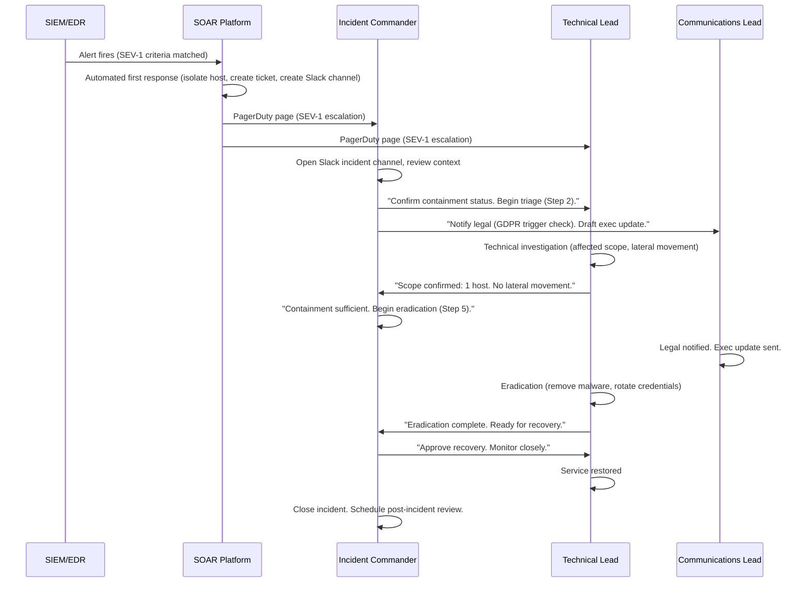

⚡ TL;DR - A Computer Security Incident Response Team (CSIRT) is the organizational structure
and process for detecting, analyzing, containing, eradicating, and recovering from security
incidents. CSIRT design elements: (1) Roles: Incident Commander (IC) - coordinates response,
single point of command; Technical Lead - directs investigation and containment; Communications
Lead - manages stakeholder communication (executives, legal, PR, customers); Scribe - documents
all actions and decisions with timestamps. (2) Severity levels: SEV-1 (critical - confirmed breach,
data loss, or production outage caused by attack: call all hands), SEV-2 (high - confirmed
compromise, actively spreading: on-call paged), SEV-3 (medium - potential compromise, under
investigation: notify IR team), SEV-4 (low - suspicious activity, monitoring). (3) Playbooks:
pre-written, step-by-step response guides for specific incident types (ransomware, credential
compromise, data exfiltration, DDoS, insider threat). Playbook structure: detection criteria,
initial triage steps, containment options (isolate host, block IP, suspend account), eradication
steps, recovery steps, post-incident review. SOAR automation: automate first-response actions
(auto-isolate compromised host via EDR API, auto-suspend compromised account via Okta API,
auto-create incident ticket in JIRA). Key metrics: MTTD (mean time to detect), MTTR (mean time
to respond), mean time to contain, mean time to recover. The fundamental principle: "in an
incident, you don't rise to the occasion - you fall to the level of your preparation."
Playbooks written and drilled BEFORE incidents produce better outcomes than improvisation during.

---

| #121 | Category: Security | Difficulty: ★★★★ |
|:---|:---|:---|
| **Depends on:** | OWASP Top 10, Authentication, Business Logic, Insufficient Logging, CVSS Scoring, CVE + NVD, AWS Security Services, Kubernetes Security, Security Observability + SIEM, Security at Scale, ISO 27001, Chaos Engineering, Privilege Escalation, Zero Trust Introduction, Red/Blue/Purple Team, Zero Trust Enterprise, DevSecOps Pipeline, Security Champions, Enterprise Security Architecture, Secret Rotation, Security Governance, Threat Intelligence | |
| **Used by:** | Security Metrics + FAIR, Platform Security Engineering, Multi-Cloud Security, Adversarial Thinking, Trust Boundary Analysis, Assume-Breach, Security as Contract, Threat Modeling | |
| **Related:** | OWASP Top 10, Authentication, Business Logic, Insufficient Logging, CVSS, CVE, AWS Security, Kubernetes Security, Security Observability + SIEM, Security at Scale, ISO 27001, Chaos Engineering, Privilege Escalation, Zero Trust Introduction, Red/Blue/Purple Team, Zero Trust Enterprise, DevSecOps Pipeline, Security Champions, Enterprise Security Architecture, Secret Rotation, Security Governance, Threat Intelligence, Security Metrics, Platform Security, Multi-Cloud Security | |

---

### 🔥 The Problem This Solves

**WHY IMPROVISED INCIDENT RESPONSE FAILS UNDER PRESSURE:**

```
THE IMPROVISED INCIDENT RESPONSE FAILURE:

  3:47 AM. PagerDuty alert: "SIEM: Unusual data transfer from payments-db to external IP."
  
  On-call engineer: woken up. First instinct: "is this a false positive?"
  Check Splunk: "unknown IP. High confidence IOC. 4GB transferred."
  Calls the on-call security person.
  
  45 minutes later: CISO on the call.
  Questions being asked simultaneously by 5 people:
  - "Should we take down the payments service?"
  - "Do we notify customers?"
  - "Have we alerted legal?"
  - "What data was exfiltrated?"
  - "Should we call the FBI?"
  - "Is this still ongoing?"
  
  Problems:
  1. No incident commander: 5 people on the call, all asking questions, nobody decides.
  2. Containment delayed 90 minutes (debating taking the service down).
  3. No scribe: actions taken are not recorded. 3 days later: "what exactly did we do?"
  4. Legal: notified 8 hours into the incident (GDPR: 72-hour reporting window - already compressed).
  5. Containment: network block placed. But: the lateral movement happened 6 hours earlier.
     The block: contained the wrong system (the attacker had pivoted to another host).
  6. Media: customer service receives 200 calls about service outage. PR: not prepared.
     "We're experiencing technical difficulties" (the actual message: unauthorized access).
     Customer trust: damaged by both the breach AND the communication failure.
  
  POST-INCIDENT REVIEW:
  "We lost 90 minutes because nobody knew who was in charge.
   We lost another 2 hours because we didn't know what the attacker had done.
   We spent 4 hours investigating the wrong host.
   Legal was notified 8 hours late (compliance risk).
   We have no clear record of what happened (forensics challenge)."
   
  WHAT A CSIRT WITH PLAYBOOKS WOULD HAVE DONE:
  
  3:47 AM. PagerDuty alert: "Data exfiltration from payments-db."
  
  Alert: SEV-1 criteria matched (confirmed data exfiltration from production database).
  
  Automated response (SOAR, < 60 seconds):
  - Payments-db: network isolated (block all inbound/outbound except monitoring).
  - JIRA incident: created, tagged SEV-1, assigned to IR team.
  - Incident channel: created in Slack (#incident-2024-12-01).
  - Runbook link: posted in incident channel.
  - On-call list: paged (IC, Technical Lead, Communications Lead).
  
  3:50 AM (3 minutes after alert): IR team assembled in #incident-2024-12-01.
  
  Incident Commander (IC): @SecurityLead.
  First IC action: "runbook is linked. Technical Lead: begin triage (Step 2). 
  Communications Lead: notify legal immediately (Step 7: GDPR notification trigger).
  Scribe: @IR-Analyst, you're on documentation."
  
  4:15 AM (28 minutes after alert):
  Technical Lead: "Attacker accessed payments-db via compromised service account.
  Lateral movement: not detected. Scope: only payments-db. Contained."
  
  IC: "Containment confirmed. Begin eradication (Step 5)."
  
  4:45 AM (1 hour after alert):
  Legal: notified within GDPR window (72 hours = abundant margin).
  Communications Lead: customer communication drafted, approved by Legal.
  Technical Lead: service account rotated, malware removed, backups verified.
  
  5:30 AM (1 hour 43 minutes after alert):
  Payments service: restored with clean credentials.
  Customer communication: sent.
  
  Result: 1h43m vs 6+ hours (improvised). Complete documentation. Legal: within window.
  Customers: proactively notified. Media: no leak (because communication was controlled).
```

---

### 📘 Textbook Definition

**CSIRT (Computer Security Incident Response Team):** A formal team and process for managing
security incidents. FIRST (Forum of Incident Response and Security Teams): the global community
for CSIRTs. CSIRT types: (1) Organizational CSIRT: serves one organization. (2) National CSIRT:
national capability (US-CERT, CERT/CC). (3) Vendor CSIRT: product vendors (Microsoft MSRC,
Google Project Zero). A well-designed CSIRT: provides capability (trained responders),
process (playbooks, escalation paths), and tools (SIEM, EDR, forensic tools, SOAR).

**Incident Severity Classification:** A tiered system for assessing incident impact and determining
response urgency. Common 4-tier model:
- SEV-1: Critical. Confirmed breach with active data exfiltration OR complete service outage
  caused by attack. Response: immediate all-hands, executive notification, legal notification.
- SEV-2: High. Confirmed compromise with ongoing attacker activity OR partial service degradation.
  Response: on-call IR team paged, escalate to IC.
- SEV-3: Medium. Suspected compromise under investigation OR intermittent security-related
  service degradation. Response: IR team notified, monitor closely.
- SEV-4: Low. Suspicious activity, likely false positive, no confirmed impact. Response:
  IR team monitors, resolves within normal business hours.

**Incident Response Phases (NIST SP 800-61):** (1) Preparation - build the capability BEFORE
incidents (playbooks, tools, training, contact lists). (2) Detection and Analysis - identify
and assess the scope and severity of the incident. (3) Containment, Eradication, and Recovery -
stop the attack, remove attacker presence, restore service. (4) Post-Incident Activity - learn
from the incident to prevent recurrence.

**SOAR (Security Orchestration, Automation, and Response):** A platform that automates security
response actions. Examples: "alert fired for compromised credential → SOAR automatically: suspends
the account in Okta, creates an IR ticket in JIRA, posts to #security-incidents, pages the on-call
IR engineer." Tools: Splunk SOAR (formerly Phantom), PagerDuty, Cortex XSOAR, IBM QRadar SOAR.
SOAR: automates the first-response actions that otherwise take 20-60 minutes of manual steps.

**Incident Commander:** The single person with authority to make decisions during an incident.
Modeled on military and emergency response command structures. IC responsibilities: coordinate
the response team, make containment decisions, approve communications, manage stakeholder updates,
escalate to executive team if needed. The critical rule: in an incident, there is ONE commander.
Multiple people trying to lead simultaneously → chaos → delayed decisions → extended breach.

---

### ⏱️ Understand It in 30 Seconds

**One line:**
A CSIRT provides the pre-designed organizational structure (incident commander, technical lead,
communications lead), defined severity tiers, automated first-response (SOAR), and step-by-step
playbooks for each incident type so that a security incident is managed like a known situation
rather than improvised under pressure at 3 AM.

**One analogy:**
> CSIRT design is the application of the fire department model to cybersecurity.
>
> A city doesn't design its fire response when a fire breaks out.
> The response is designed, drilled, and ready BEFORE any fire.
>
> When the alarm sounds:
> - Incident Commander: the Chief. Has command authority. Makes decisions.
> - Technical team: firefighters, each with a defined role (hose, ladder, search-and-rescue).
> - Communications: public affairs officer. Controls what is said publicly.
> - Equipment: trucks positioned at known locations. Equipment: pre-selected for incident types.
> - Playbook: "structure fire" → specific approach. "Chemical fire" → different approach.
>   Different incident types: different playbooks. All drilled regularly.
>
> Result: a city block fire → organized, coordinated response in < 5 minutes.
> No fire → same crew has run this drill 50 times in the last 12 months.
>
> Contrast: a volunteer response to the same fire, with no training, no commander, no playbook.
> Each person: doing what they think is right. Conflicting actions. Delayed containment.
> Fire: spreads to adjacent buildings.
>
> CSIRT = the fire department model for security incidents.
> The incident: controlled because the response was designed and drilled before it happened.
> The playbook: the difference between "organized response" and "improvised chaos."
> The incident commander: the difference between "one decision" and "debate under pressure."

---

### 🔩 First Principles Explanation

**CSIRT structure and playbook design:**

```
CSIRT ROLES (required for every SEV-1/SEV-2 incident):

  INCIDENT COMMANDER (IC):
  - Single point of authority. Makes all response decisions.
  - Owns: stakeholder communication, escalation decisions, IC handoff (if multi-hour incident).
  - Does NOT: investigate technically. IC coordinates, doesn't execute.
  - Rotation: on-call IC rotation across senior security engineers / CISO.
  
  TECHNICAL LEAD (TL):
  - Owns: technical investigation, containment, eradication, recovery.
  - Reports to IC. Makes technical recommendations. IC decides (not TL).
  - Does NOT: communicate with stakeholders. Focused on technical work.
  
  COMMUNICATIONS LEAD:
  - Owns: internal stakeholder updates (executives, legal, PR), external communications
    (customers, regulators), media inquiries.
  - Ensures: right message, right audience, right timing.
  - Works from: pre-drafted communication templates for each incident type.
  
  SCRIBE:
  - Documents: every action taken, every decision made, every evidence collected.
    Timestamp: every entry. "2024-12-01 03:52 UTC - TL: isolated payments-db host (10.0.5.22)."
  - Output: incident timeline. Used for: post-incident review, legal documentation, forensics.
  - Does NOT: investigate or communicate. Only documents.
  
  SUPPORTING ROLES (called in as needed):
  - Legal: data breach notification requirements. Called in: any SEV-1 with potential data loss.
  - PR/Comms: media response. Called in: any incident that may become public.
  - Engineering: system owners for affected systems. Called in: for containment and recovery.
  - Forensics (external): for nation-state or complex incidents requiring deep forensic analysis.

SEVERITY CLASSIFICATION FLOWCHART:

  Is there confirmed unauthorized access? Yes → SEV-2 minimum.
  Is there confirmed data exfiltration? Yes → SEV-1.
  Is production service down due to attack? Yes → SEV-1.
  Is the attacker actively present (ongoing activity)? Yes → SEV-1.
  Is the impact contained to one non-critical system? Yes → SEV-2 or SEV-3.
  Is this likely a false positive? Yes → SEV-4. Monitor and investigate.

PLAYBOOK STRUCTURE (ransomware example):

  RANSOMWARE INCIDENT PLAYBOOK v2.1
  Trigger: EDR detects mass file encryption OR ransom note found OR storage indicates unusual activity.
  Classification: SEV-1 (always - ransomware = critical).
  
  PHASE 1: IMMEDIATE CONTAINMENT (first 15 minutes)
  
  1. Page IC and TL immediately (SOAR triggers PagerDuty).
  2. Identify patient zero: which host first showed encryption activity?
     Splunk: `source="crowdstrike" EventType="ransomware" | stats earliest(timestamp) BY hostname | sort earliest(timestamp)`
  3. Isolate patient zero: EDR containment (CrowdStrike: Contain Host).
     DO NOT REBOOT: memory forensics needed. DO NOT DISCONNECT NETWORK manually (use EDR containment).
  4. Identify lateral movement: did the ransomware spread? Which other hosts are affected?
     Splunk: `source="crowdstrike" EventType="ransomware" | stats count BY hostname | where count > 0`
  5. Isolate ALL affected hosts (EDR containment).
  6. Disable affected service accounts and compromised credentials.
     DECISION: IC approves (may impact services). TL executes.
  7. Block attacker C2: malicious IP/domain identified → firewall block (SOAR auto-executes).
  
  PHASE 2: ASSESSMENT (15-60 minutes)
  
  8. Scope: what data is on the affected systems? Is it encrypted? Exfiltrated?
  9. Variant identification: ransom note analysis → identify ransomware variant → check decryption tools.
     NoMoreRansom.org: free decrypters for some variants.
  10. Backup verification: are backups available and not affected?
     CRITICAL: verify backups are offline and not connected to the infected environment.
     Ransomware groups specifically target backup systems.
  11. Regulatory trigger check: was PII or PHI on affected systems? If yes: legal notification required.
  
  PHASE 3: COMMUNICATION (within first hour)
  
  12. Executive notification: CISO briefs CEO/CTO (if > 30 minutes, escalate to IC to do this).
  13. Legal notification: if any data exposure possible.
  14. Customer communication: DRAFT (do not send until legal review). Template: [link].
  15. Internal notification: "systems affected by security incident. Avoid saving new data to
      shared drives until notified." (if necessary to prevent further spread).
  
  PHASE 4: ERADICATION (1-24 hours, depends on scope)
  
  16. Rebuild affected systems from clean images (NOT restore from potentially infected backup).
  17. Apply all security patches (exploit used for initial access → patched immediately).
  18. Reset all credentials on affected systems (service accounts, admin accounts, user accounts).
  19. Network scan: verify no other affected systems (look for encryption activity, unusual file writes).
  
  PHASE 5: RECOVERY (1-72 hours, depends on scope)
  
  20. Restore from CLEAN VERIFIED backups to rebuilt systems.
  21. Monitor closely: 72-hour post-recovery intensive monitoring (confirm no reinfection).
  22. Service restoration: gradual, with monitoring at each step.
  23. Customer notification (if required): send approved communication.
  
  PHASE 6: POST-INCIDENT REVIEW (within 5 business days)
  
  24. Timeline review: complete timeline from detection to recovery.
  25. Root cause analysis: how did the attacker get in? What vulnerability was exploited?
  26. Control gap analysis: what controls would have prevented or detected this earlier?
  27. Action items: assigned, tracked in JIRA, reviewed in next security team meeting.
  28. Metrics: update MTTD, MTTR, cost of incident. Add to security KRI dashboard.
```

---

### 🧪 Thought Experiment

**SCENARIO: Designing a CSIRT for a 300-person fintech company from scratch:**

```
STARTING STATE: 2 security engineers, no formal CSIRT, no playbooks.
GOAL: functioning CSIRT within 90 days.

STEP 1: ROLES AND CONTACTS (week 1-2)

  Define the CSIRT members:
  - Incident Commander (primary): Head of Security.
  - Incident Commander (backup): Senior Security Engineer.
  - Technical Lead: Security Engineer 1.
  - Technical Lead (backup): Security Engineer 2 (+ on-call rotation with engineers).
  - Communications Lead: Head of PR/Comms (briefed on incident communication).
  - Legal: General Counsel (briefed, knows IR protocol).
  
  Establish:
  - Emergency contacts: personal cell for each CSIRT member (for 3 AM scenarios).
  - PagerDuty escalation policy: SEV-1 → page IC + TL simultaneously. No response in 5 min → escalate.
  - Incident channel convention: #incident-YYYY-MM-DD in Slack. Auto-created by SOAR.
  
STEP 2: PLAYBOOKS (weeks 2-6)

  Priority order (by likelihood × impact):
  1. Credential compromise playbook (most common - phishing + credential stuffing).
  2. Ransomware playbook (highest impact - see detailed example above).
  3. Data exfiltration playbook (regulatory impact - GDPR 72h window).
  4. DDoS playbook (operational impact - customer-facing service outage).
  5. Insider threat playbook (complex - legal considerations).
  
  Each playbook: written by the security team, reviewed by legal, reviewed by engineering.
  Stored in: internal wiki (Confluence). Linked in PagerDuty alert runbook field.
  
STEP 3: SOAR AUTOMATION (weeks 4-8)

  Automate first-response for the top 3 incident types:
  
  Credential compromise trigger: "SIEM: successful login from unusual geolocation + new device."
  SOAR actions (automated, < 60 seconds):
  - Okta: suspend user account (prevents further access while investigating).
  - JIRA: create incident ticket (SEV-3 initial, escalate if confirmed).
  - Slack: post in #security-incidents with context (user, IP, geolocation, device).
  - Playbook link: posted.
  - On-call: paged (non-urgent for SEV-3 - alerts team, doesn't page at 3 AM unless escalated).
  
  Ransomware trigger: "CrowdStrike: mass file encryption detected."
  SOAR actions:
  - CrowdStrike: contain affected host (network isolation, no commands executed).
  - PagerDuty: SEV-1 - page IC + TL simultaneously.
  - Slack: create #incident channel, post context + playbook link.
  - JIRA: create SEV-1 ticket.
  
STEP 4: TRAINING AND DRILL (weeks 6-12)

  Tabletop exercise 1: ransomware.
  Scenario: "You receive a CrowdStrike alert at 2 AM. Ransomware detected on 3 hosts."
  Exercise: walk through the playbook, step by step, discussing decisions.
  
  Key decisions tested:
  - "Do we take down the payments service to contain?" (IC decision)
  - "At what point do we call the CEO?" (Communications Lead + IC decide)
  - "Do we pay the ransom?" (NEVER during the exercise - the answer is always "CSIRT recommends no, legal and insurance decide")
  - "How do we know the backups are clean?" (TL verifies)
  
  Lessons from the tabletop:
  - "Our backup verification process doesn't have a documented step for checking if backups are online." → Add to playbook.
  - "Legal doesn't know the GDPR 72-hour window starts at detection, not at confirmation." → Brief legal.
  - "We don't have the storage team's 24/7 emergency contact." → Add to emergency contacts.

RESULT: functioning CSIRT at day 90.
  - 5 playbooks written and reviewed.
  - SOAR automation live for top 3 scenarios.
  - 1 tabletop exercise completed.
  - CSIRT members: briefed, PagerDuty configured.
  - MTTD baseline: measured (72 hours average before CSIRT).
  - Target MTTD at 6 months: 4 hours.
```

---

### 🧠 Mental Model / Analogy

> "In an incident, you don't rise to the occasion. You fall to the level of your preparation."
>
> This is the core insight behind CSIRT design and playbook development.
>
> Every security professional who has worked through a real incident knows this is true.
> The training, the drill, the playbook: these determine performance under pressure.
> Not intelligence. Not experience in general. Specifically: preparation for THIS type of incident.
>
> The sports analogy: an elite athlete doesn't perform better under pressure because they're
> more relaxed. They perform better because their preparation is more thorough.
> They've practiced the free throw 10,000 times. Under pressure, muscle memory executes.
> They don't think. They execute.
>
> CSIRT playbooks: muscle memory for incident response.
> The analyst at 3 AM: doesn't need to think about what to do first.
> They open the playbook. Step 1. Execute. Step 2. Execute.
> The IC doesn't need to invent the containment strategy.
> The options are in the playbook. The IC selects the appropriate one.
>
> The tabletop exercise: the practice run. "Muscle memory" for decisions.
> The first time you make the "do we take down the payments service?" decision:
> not at 3 AM with the actual breach in progress.
> In a comfortable meeting room, 3 weeks ago, in the tabletop.
> "At 3 AM, I've made this decision before. I know what factors to weigh.
>  I know what questions to ask. I execute."
>
> Preparation → execution. No preparation → improvisation. Improvisation under pressure → failure.

---

### 📶 Gradual Depth - Five Levels

**Level 1 - What it is (anyone can understand):**
A CSIRT is the team and process for handling security incidents. Like a fire brigade: the CSIRT has defined roles (who does what), plans for different types of emergencies, and practices those plans regularly. Without a CSIRT, security incidents are handled by improvisation - which is slow, chaotic, and often misses important steps (like notifying legal within the required timeframe). With a CSIRT, every security incident follows a known process, which is faster and more effective.

**Level 2 - How to use it (junior developer):**
As a developer, you interact with the CSIRT when: (1) Reporting an incident: "I think I accidentally committed an API key to GitHub." → Report to your Security Champion or the #security-incidents Slack channel. Don't try to solve it yourself - the CSIRT process has steps for this. (2) Assisting in an incident: "the IR team needs logs from the service you own." → Provide the logs immediately. The incident has a defined priority; your normal sprint work: paused until you've helped. (3) Post-incident: you'll be part of the post-incident review for incidents involving your systems. Your job: help the IR team understand what happened, not defend your code.

**Level 3 - How it works (mid-level engineer):**
SOAR integration in practice: PagerDuty incident response policy for SEV-1. Triggered by: Splunk saved search that matches the SEV-1 criteria (e.g., "CrowdStrike ransomware event"). PagerDuty: fires the escalation policy ("Incident Commander" on-call). The IC: opens the PagerDuty incident on their phone. PagerDuty: shows the runbook link (playbook URL in Confluence). The IC: in Slack within 3 minutes of the alert. SOAR (Splunk SOAR) automation: parallel to the IC page, SOAR runs the automated first-response playbook: contain the host in CrowdStrike (API call), create JIRA ticket (API call), create Slack channel #incident-2024-12-01 (API call), post context in the channel (alert details, runbook link). By the time the IC is in the Slack channel (3-5 minutes after alert): automated containment is already in progress and the context they need is already in the channel. IC: reviews containment status, confirms with TL, begins the playbook from Step 2 (Step 1 = automated containment: done).

**Level 4 - Why it was designed this way (senior/staff):**
CSIRT design is borrowed from incident command systems (ICS) used by fire departments, FEMA, and the military. The core ICS principle: Unified Command with a single Incident Commander. Why a single IC? Under stress, humans default to tribal decision-making (everyone pitches in, nobody decides). Multiple commanders → conflicting orders → execution delays → incident spreads. A single IC who makes the final call: better outcomes even if some individual decisions are imperfect. The "all decisions through IC" rule: not bureaucracy. It's the mechanism that ensures the response team moves in one direction. The playbook design principle: "playbooks are for the first 30 minutes." After 30 minutes: the incident has enough context for improvisation. The playbook's value: providing the structured, systematic first response before full context is available. "What do I do in the first 30 minutes when I know almost nothing?" is the question playbooks answer. Good playbooks: not prescriptive beyond initial containment. They provide decision trees: "if X, do A; if Y, do B; if uncertain, call Z." Bad playbooks: assume too much about the incident ("step 3: shut down the affected server" - what if shutting down the server destroys forensic evidence?).

**Level 5 - Mastery (distinguished engineer):**
The advanced CSIRT challenge: managing incidents that span multiple organizations. Supply chain incidents (SolarWinds, Log4Shell): thousands of organizations affected simultaneously. Your CSIRT: must coordinate with: your cloud provider (AWS: affected?), your SaaS vendors (are they compromised?), your sector ISAC (what intelligence is available?), law enforcement (FBI: may be investigating), your cyber insurance carrier (incident notification required), and potentially your customers (if you're a vendor and they need to know). This multi-party coordination: the most difficult IR scenario. Pre-planning: essential. "If we're affected by a supply chain compromise, who do we call and in what order?" This is not in most playbooks. At the enterprise CSIRT level: tabletop exercises for supply chain scenarios are annual practice (not quarterly). The CSIRT maturity model: Level 1 - ad hoc (improvised response). Level 2 - defined (playbooks exist, not always followed). Level 3 - managed (playbooks followed consistently, metrics tracked). Level 4 - quantitatively managed (MTTD/MTTR targets, variance analysis). Level 5 - optimizing (continuous improvement from each incident, threat intelligence drives playbook updates). Most organizations are at Level 2. Target: Level 3 within 12 months, Level 4 within 24 months.

---

### ⚙️ How It Works (Mechanism)

```
INCIDENT RESPONSE FLOW (NIST SP 800-61):

  [DETECTION]
  SIEM alert / EDR alert / user report / threat intel trigger
  
  [TRIAGE]
  Severity classification (SEV-1 to SEV-4)
  SOAR: automated first response (isolate, page, ticket, channel)
  
  [CONTAINMENT]
  IC: command. TL: contain affected systems.
  Short-term: isolate. Long-term: limit attacker's ability to spread.
  
  [ERADICATION]
  Remove attacker presence (malware, persistence mechanisms, compromised accounts).
  
  [RECOVERY]
  Restore systems from clean state. Verify integrity. Restore service.
  
  [POST-INCIDENT]
  Timeline. Root cause. Lessons. Action items. Metrics.
```



---

### 💻 Code Example

**SOAR automation playbook (Splunk SOAR / Python-based):**

```python
# csirt_soar_playbook.py
# Splunk SOAR automation playbook for credential compromise.
# Triggered by: SIEM alert "Successful login from unusual geolocation."
# Auto-executes first-response actions, then pages IC.

# In Splunk SOAR: this is a Python-based playbook.
# Acts against configured assets (Okta, JIRA, Slack, PagerDuty).

import phantom.rules as phantom
import json

def on_start(container):
    """
    Entry point: called by SOAR when the playbook triggers.
    container: the incident artifact from the SIEM alert.
    """
    phantom.debug("Credential compromise playbook starting")
    
    # Extract context from the SIEM alert
    user_email = container.get("data", {}).get("user_email")
    src_ip = container.get("data", {}).get("src_ip")
    user_agent = container.get("data", {}).get("user_agent")
    geolocation = container.get("data", {}).get("geolocation")
    
    phantom.debug(f"Affected user: {user_email}, Source IP: {src_ip}, Location: {geolocation}")
    
    # Step 1: SUSPEND THE USER IN OKTA (immediate containment)
    # This prevents further access while the IR team investigates.
    # NOTE: auto-suspend on SEV-1/SEV-2. SEV-3: alert only (don't auto-suspend).
    severity = classify_severity(container)
    
    if severity in ["SEV-1", "SEV-2"]:
        okta_suspend_user(user_email, container)
        phantom.debug(f"User {user_email}: suspended in Okta")
    
    # Step 2: CREATE JIRA INCIDENT TICKET
    jira_create_ticket(
        summary=f"[{severity}] Credential compromise: {user_email}",
        description=f"""
        Source IP: {src_ip}
        Location: {geolocation}
        User Agent: {user_agent}
        Severity: {severity}
        Runbook: https://wiki.internal/sec/playbooks/credential-compromise
        
        Automated actions taken:
        - Okta account suspended: {"Yes" if severity in ["SEV-1", "SEV-2"] else "No (SEV-3)"}
        - This ticket created
        - Slack channel created
        - PagerDuty paged
        """,
        priority=severity,
        container=container
    )
    
    # Step 3: CREATE SLACK INCIDENT CHANNEL
    from datetime import datetime
    channel_name = f"incident-{datetime.utcnow().strftime('%Y-%m-%d')}-{user_email.split('@')[0]}"
    slack_create_channel(channel_name, container)
    
    slack_post_message(
        channel=channel_name,
        message=f"""
:rotating_light: *{severity} Security Incident - Credential Compromise*

*Affected User:* {user_email}
*Source IP:* {src_ip} (Location: {geolocation})
*Timestamp:* {container.get("start_time")}

*Automated actions taken:*
- Okta account: {"SUSPENDED" if severity in ["SEV-1", "SEV-2"] else "NOT suspended (SEV-3: confirm manually)"}
- JIRA ticket: created (link below)

*Playbook:* https://wiki.internal/sec/playbooks/credential-compromise

*Next steps for IC:* 
1. Confirm user account suspension (Okta admin console)
2. Check for other suspicious activity for this user in SIEM
3. Contact the user to verify if this was them
4. If confirmed compromise: escalate to SEV-1 and begin eradication
        """,
        container=container
    )
    
    # Step 4: PAGE PAGERDUTY (IC + TL for SEV-1/SEV-2)
    if severity == "SEV-1":
        pagerduty_trigger_incident(
            summary=f"SEV-1 Credential Compromise: {user_email}",
            escalation_policy="security-incident-response",  # IC + TL on-call
            container=container
        )
    elif severity == "SEV-2":
        pagerduty_trigger_incident(
            summary=f"SEV-2 Credential Compromise: {user_email}",
            escalation_policy="security-on-call",  # On-call security engineer
            container=container
        )
    # SEV-3: Slack notification only, no page. IR team reviews in business hours.
    
    phantom.debug("Credential compromise playbook: automated actions complete")


def classify_severity(container) -> str:
    """
    Classify incident severity based on alert context.
    
    SEV-1: Confirmed compromise (additional indicators present).
    SEV-2: High-confidence compromise (unusual geo + new device).
    SEV-3: Suspicious activity (single anomaly, could be legit travel).
    """
    # In SOAR: enrichment data from threat intel, Okta risk score, etc. would inform this.
    
    # For this example: simple heuristic
    risk_score = container.get("data", {}).get("okta_risk_score", 0)
    
    if risk_score >= 90:
        return "SEV-1"
    elif risk_score >= 70:
        return "SEV-2"
    else:
        return "SEV-3"


# POST-INCIDENT REVIEW TEMPLATE (metrics collection)
def post_incident_metrics(incident_id: str) -> dict:
    """
    Calculate post-incident metrics from incident timeline.
    Used for KRI dashboard and quarterly security reporting.
    """
    # In production: query JIRA incident timeline events
    # For illustration: example data structure
    return {
        "incident_id": incident_id,
        "metrics": {
            "mttd_hours": 0.75,        # 45 minutes to detect
            "mttr_hours": 2.25,        # 2h15m to contain and restore
            "mttr_recover_hours": 4.5, # 4.5h to full recovery
            "severity": "SEV-2",
            "root_cause": "Phishing email → credential theft → unauthorized login",
            "controls_that_worked": ["SIEM geolocation anomaly detection", "Okta risk scoring"],
            "controls_that_failed": ["MFA: not enforced on the affected application"],
            "action_items": [
                "Enforce MFA on LegacyApp (ETA: Q4 sprint 3)",
                "Add phishing-resistant MFA (FIDO2) for high-risk users"
            ]
        }
    }
```

---

### ⚖️ Comparison Table

| Maturity Level | Playbooks | SOAR Automation | Metrics | Drills |
|:---|:---|:---|:---|:---|
| **Level 1 (Ad hoc)** | None | None | None | None |
| **Level 2 (Defined)** | 2-3 basic playbooks | Email/Slack notification only | MTTD/MTTR tracked manually | Annual tabletop |
| **Level 3 (Managed)** | Playbooks for top 5 scenarios | First-response automation (isolate, page, ticket) | Dashboard with KRIs | Quarterly tabletop |
| **Level 4 (Quantitative)** | Playbooks for top 10 scenarios + decision trees | Full automation for common scenarios | MTTD/MTTR targets with variance analysis | Monthly drills + bi-annual red team |
| **Level 5 (Optimizing)** | Living playbooks updated from incidents + intel | Adaptive automation informed by threat intel | Predictive risk indicators | Continuous improvement from every incident |

---

### ⚠️ Common Misconceptions

| Misconception | Reality |
|:---|:---|
| "Playbooks are too rigid for the unpredictable nature of security incidents." | A well-designed playbook acknowledges unpredictability and is designed for it. The criticism "incidents are unique, playbooks can't cover them all" is a criticism of BAD playbooks (rigid, overly prescriptive). Good playbook design: the playbook covers the FIRST 15-30 MINUTES of response, not the entire incident. The first 15 minutes: despite incident uniqueness, are remarkably consistent. For credential compromise: ALWAYS contain the account (suspend), ALWAYS collect the context (source IP, geolocation, timestamp), ALWAYS alert the IC. The specific details vary. The first actions: consistent. After 30 minutes: the response team has enough context to improvise intelligently. The playbook's job: get you to "30 minutes of context collected" in an organized, systematic way. Beyond that: judgment, improvisation. The playbook enables the improvisation by removing cognitive load for the first-response steps. "Did I suspend the account? Yes - playbook step 1. Did I collect context? Yes - step 2. Now: what's unusual about this incident?" Freed cognitive capacity: applied to the unique aspects of the incident. |
| "SOAR automation is dangerous - what if it takes the wrong action?" | The correct question is: "compared to what?" The alternative: manual first-response. Manual first-response during an active incident: takes 20-60 minutes per action (engineer woken up, accesses tools, executes commands). During those 20-60 minutes: the attacker is still active. An attacker with 20-60 minutes of uninterrupted access: significant additional damage. SOAR automation: takes 30-60 SECONDS per action. The trade-off: occasional false positive automation action (account suspended for a legitimate geo-anomaly during travel) vs. consistently delayed response when the incident is real. False positive action: engineer manually unsuspends the account. Cost: 5 minutes + one apologetic message to the user. True positive incident without automation: 20-60 minutes of additional attacker dwell time. The comparison makes the trade-off clear. SOAR automation: scoped to HIGH-CONFIDENCE, LOW-BLAST-RADIUS actions. "Suspend a user account" (reversible, low blast radius) → automate. "Shut down the payments database" (irreversible, high blast radius) → require IC approval. The automation scope: bounded to the reversible, high-confidence, time-sensitive first-response actions. |

---

### 🚨 Failure Modes & Diagnosis

**CSIRT failure patterns:**

```
FAILURE 1: "MANY COMMANDERS" PROBLEM

  Symptom: SEV-1 incident call has 8 people on it.
  3 people simultaneously trying to contain: duplicated efforts, missed coordination.
  "Alice: isolate host A. Bob: also isolating host A (didn't know Alice was doing it).
  Both work for 15 minutes on the same host → wasted time → host B still not isolated."
  
  Root cause: unclear IC designation. Multiple senior people defaulting to command behavior.
  
  Fix:
  - IC: designated BEFORE incidents (on-call rotation). Not chosen during the incident.
  - First thing said on incident call: "I'm [name], I'm IC for this incident."
    This is literally step 1 in the playbook.
  - Others: execute what IC directs. Don't execute independently for SEV-1 actions.
  - If IC needs help: "I need a second pair of eyes. @Bob: please join TL."
    Directed collaboration. Not everyone doing everything simultaneously.

FAILURE 2: POST-INCIDENT REVIEW NEVER HAPPENS

  Symptom: 3 similar incidents in 12 months. Each: same root cause (unpatched vulnerability
  in a specific service). No fix between incidents.
  
  Root cause: post-incident review: promised but never scheduled. After the incident:
  "we'll debrief next week." Next week: another sprint. Debrief: deprioritized.
  Same vulnerability: exploited again.
  
  Fix:
  - PIR (Post-Incident Review): SCHEDULED in JIRA at incident close. Not optional.
  - SEV-1: PIR within 48 hours. SEV-2: within 5 business days. SEV-3: within 2 weeks.
  - PIR action items: tracked in JIRA. Assigned to owners. Status: reviewed in weekly security meeting.
  - "Did we close the action items from the last PIR?" → asked at every weekly security meeting.
  - If the same root cause appears twice: escalate. This is a systemic process failure.

CSIRT HEALTH METRICS:

  - MTTD: mean time to detect (from incident start to SIEM alert). Target: < 4 hours.
  - MTTR (contain): mean time to containment. Target: SEV-1 < 1 hour, SEV-2 < 4 hours.
  - MTTR (recover): mean time to service recovery. Target: SEV-1 < 4 hours, SEV-2 < 24 hours.
  - Playbook adherence rate: % of incidents where playbook was followed. Target: > 90%.
  - PIR completion rate: % of incidents with completed PIR. Target: 100%.
  - PIR action item closure rate: % of PIR action items closed within SLA. Target: > 80%.
```

---

### 🔗 Related Keywords

**Prerequisites:**
- `Security Observability and SIEM` (SEC-106) - SIEM is the detection layer for CSIRT
- `Threat Intelligence Integration` (SEC-120) - threat intel informs incident classification and response
- `Digital Forensics` (SEC-102) - forensics techniques used during CSIRT investigations

**Builds on this:**
- `Security Metrics + FAIR` (SEC-122) - CSIRT metrics (MTTD/MTTR) feed security KRIs

---

### 📌 Quick Reference Card

```
┌──────────────────────────────────────────────────────────┐
│ CSIRT ROLES   │ IC: command + decisions                  │
│               │ TL: technical investigation + response   │
│               │ Comms Lead: stakeholders + legal + PR    │
│               │ Scribe: document everything + timestamps │
├───────────────┼──────────────────────────────────────────┤
│ SEVERITY      │ SEV-1: breach + data loss → all-hands    │
│ LEVELS        │ SEV-2: confirmed compromise → on-call    │
│               │ SEV-3: suspected compromise → notify     │
│               │ SEV-4: suspicious activity → monitor     │
├───────────────┼──────────────────────────────────────────┤
│ PLAYBOOK      │ Trigger → immediate containment          │
│ PHASES        │ → assessment → communication             │
│               │ → eradication → recovery → PIR           │
├───────────────┼──────────────────────────────────────────┤
│ METRICS       │ MTTD: < 4 hours                          │
│               │ MTTR (contain): SEV-1 < 1h, SEV-2 < 4h  │
│               │ MTTR (recover): SEV-1 < 4h, SEV-2 < 24h │
│               │ PIR completion: 100%                     │
└──────────────────────────────────────────────────────────┘
```

---

### 💎 Transferable Wisdom

**Reusable Engineering Principle:**
"Under pressure, humans execute their training, not their intentions."
The CSIRT design insight: security incidents create cognitive pressure (high stakes, time pressure,
incomplete information, fatigued responders). Under these conditions, complex real-time decision-making
is degraded. What persists: trained behaviors. What degrades: novel problem-solving.
This principle: applies across high-stakes, time-pressured domains:
- Surgery: surgeons use checklists (the Atul Gawande "Checklist Manifesto" insight).
  Even expert surgeons: under time pressure, skip steps. Checklists: prevent the skips.
- Aviation: pilots follow checklists even for routine procedures.
  The checklist: not because they don't know. Because under pressure, even experts make errors.
- Military: battle drills. Practiced until automatic. So that under fire, the body executes
  without the brain needing to deliberate.
Security incident response: the same principle.
The playbook = the checklist = the battle drill.
Not a sign of inadequacy ("I need a playbook because I don't know what to do").
A sign of maturity ("I use a playbook because I know human performance degrades under pressure").
Organizations that resist playbooks ("we're experienced, we don't need them"):
typically have worse incident outcomes than organizations with well-drilled, less-experienced teams.
Experience helps. Playbooks help more. Both together: optimal.

---

### 💡 The Surprising Truth

The most important CSIRT capability is NOT the technology (SIEM, SOAR, EDR).
It is the ability to COMMUNICATE clearly under pressure.

A 3 AM incident with 8 people on the call and nobody running the communication:
- Engineers: getting conflicting instructions.
- Executives: demanding updates every 10 minutes.
- Legal: uncertain if they need to act.
- PR: not aware of the incident.
- Customers: experiencing an outage, getting no explanation.

The technology (SOAR, EDR containment, SIEM) often works perfectly.
The incident still goes badly because the communication is chaotic.

The Communications Lead role: often the undervalued CSIRT role.
Engineers focus on the technical problem. Communication: feels like overhead.
The reality: for SEV-1 incidents, 50% of the damage is from COMMUNICATION failure.
- GDPR fine: for missing the 72-hour notification window. Communication failure.
- Customer trust damage: from finding out about a breach from the media, not the company. Communication failure.
- Executive panic: because they didn't get an update for 4 hours. Communication failure.

The most impactful playbook improvement at most organizations:
not better technical containment steps. Better communication workflows.
"At T+15 min: IC sends first exec update (3 sentences: what happened, what we're doing, when next update).
 At T+60 min: IC sends second exec update (status of containment, scope confirmed or unconfirmed, next update).
 At T+close: IC sends incident summary (timeline, scope, actions taken, next steps)."

Communication as a system: like containment. Scheduled, templated, executed regardless of technical status.
The result: executives trust the CSIRT. Legal is within compliance windows.
Customers are notified appropriately. PR is prepared. The technical work: same.
The organizational response: dramatically better.

---

### ✅ Mastery Checklist

**You've mastered this when you can:**
1. **NAME** the four CSIRT roles and their responsibilities: Incident Commander (command, decision),
   Technical Lead (investigation, containment, eradication), Communications Lead (stakeholders,
   legal, PR), Scribe (documentation with timestamps).
2. **CLASSIFY** incidents by severity: SEV-1 (confirmed breach/data loss → all-hands), SEV-2
   (confirmed compromise → on-call), SEV-3 (suspected → notify team), SEV-4 (suspicious → monitor).
3. **DESCRIBE** the five IR phases (NIST 800-61): Detection → Containment → Eradication → Recovery
   → Post-Incident Review. For each: what is the primary goal and who owns it?
4. **EXPLAIN** SOAR automation scope: automate reversible, high-confidence, time-sensitive
   first-response actions (suspend account, isolate host, page IC). Do NOT automate irreversible,
   high-blast-radius actions without IC approval.
5. **STATE** the principle: "you don't rise to the occasion, you fall to the level of your
   preparation." Apply it to CSIRT: playbooks + regular drills = trained response execution
   under pressure. Without training: improvisation under cognitive load = failures.

---

### 🎯 Interview Deep-Dive

**Q: Walk me through how you would handle a ransomware detection at 2 AM.
What are your first 30 minutes of actions?**

*Why they ask:* Tests incident response practical knowledge and ability to execute under pressure.
Common in security engineering, SecOps, and incident response roles.

*Strong answer covers:*
- First 5 minutes (automated + immediate manual): SOAR has already triggered (CrowdStrike detects
  ransomware → SOAR auto-isolates affected host via EDR API, pages IC). I've received the PagerDuty
  page. Open Slack incident channel (created by SOAR). Review context: which host, when, user activity.
  Confirm I'm IC. "I'm [name], I'm IC. TL: join the call. Scribe: start the timeline document now."
- Minutes 5-15: Technical Lead begins triage. "Identify patient zero: which host showed first encryption
  activity? Are other hosts affected?" Splunk query for CrowdStrike ransomware events across all hosts.
  IC: makes the first decision: "if patient zero is isolated and no lateral movement confirmed: hold on
  bringing down the payments service. If lateral movement confirmed: isolate all affected immediately."
  TL: provides the data. IC: makes the call.
- Minutes 15-30: IC: notify legal (GDPR trigger check: is there PII on the encrypted hosts?).
  "Our payments DB: contains card data. PII: confirmed. Legal: notified." Comms Lead:
  draft executive update (3 sentences, T+15 min). Send to CTO/CISO.
  "Incident ongoing: ransomware detected on X hosts. Containment: Y status. Next update: T+60 min."
  TL: ransom note analysis (identify variant). NoMoreRansom.org: check for decryptor.
  Backup verification: "are our backups online and potentially encrypted too? Verify immediately."
- Key decisions I document as IC: each containment action, who authorized it, when.
  "2:17 AM - IC decision: isolate hosts X, Y, Z via EDR. TL to execute."
  "2:31 AM - TL confirmed: backups are offline and unaffected. Restore path available."
  These decisions: logged by the scribe in real-time.
- What I don't do: try to decrypt myself. Try to negotiate with the attacker (IC decision: always no).
  Reboot the host (destroys forensic evidence: memory artifacts, process tree). Connect the backup to
  the infected environment before verification.
- Post-containment: "TL: begin eradication. Scribe: timeline is complete to this point.
  Comms: send T+60 exec update." Shift handoff if multi-hour: "TL: you're IC from 5 AM. I'll be back at 7 AM."