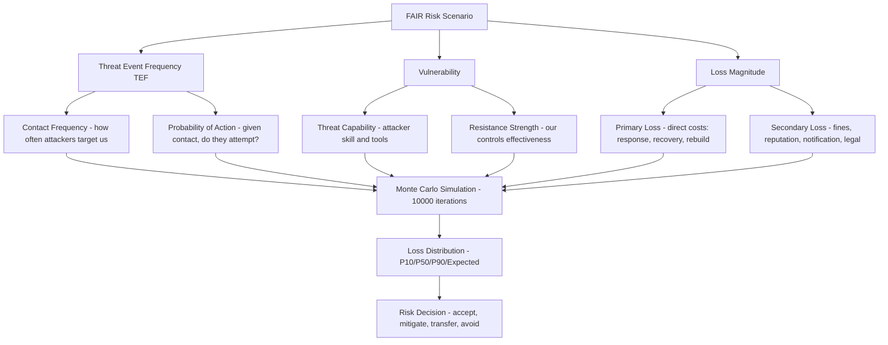

⚡ TL;DR - Security Metrics are quantitative measures of the effectiveness and health of a
security program. Without metrics, security is invisible: the board doesn't know if the program
is working, the CISO can't prioritize investments, and engineers don't know if controls are
effective. Three metric categories: (1) Leading indicators (KRIs - Key Risk Indicators): measure
risk BEFORE incidents. "% of critical systems with MFA enforced" → low MFA coverage predicts
future credential compromise incidents. (2) Lagging indicators (outcome metrics): measure what
happened. "MTTD: 72 hours" (mean time to detect). MTTR: 4 hours. Number of incidents this quarter.
(3) Activity metrics: work performed. "Vulnerabilities patched: 847 this month." (Often misleading
without context: 847 of how many total?) FAIR (Factor Analysis of Information Risk): a standard
model for quantifying cyber risk in financial terms. "The risk of ransomware on the payments system
is $2.4M annually (expected loss)" - calculated from: Threat Event Frequency (how often attackers
target systems like this) × Vulnerability (probability they succeed given our controls) × Loss
Magnitude (Primary + Secondary losses if the event occurs). FAIR enables: comparing security
investments ("$50K MFA enforcement reduces ransomware risk by $400K annually - ROI: 8:1"), risk
appetite discussion with the board ("we accept risks below $100K annually; escalate risks above
$500K"), and prioritization ("which risk scenario has the highest expected annual loss?"). The
key shift: from "security is good/bad" to "security risk is $X million, and we can reduce it by $Y
with an investment of $Z." This is how security gets board-level investment: by speaking the
language of financial risk.

---

| #122 | Category: Security | Difficulty: ★★★★ |
|:---|:---|:---|
| **Depends on:** | OWASP Top 10, Authentication, Business Logic, Insufficient Logging, CVSS Scoring, CVE + NVD, AWS Security Services, Kubernetes Security, Security Observability + SIEM, Security at Scale, ISO 27001, Chaos Engineering, Privilege Escalation, Zero Trust Introduction, Red/Blue/Purple Team, Zero Trust Enterprise, DevSecOps Pipeline, Security Champions, Enterprise Security Architecture, Secret Rotation, Security Governance, Threat Intelligence, CSIRT Design | |
| **Used by:** | Platform Security Engineering, Multi-Cloud Security, Build vs Buy Security, Adversarial Thinking, Trust Boundary Analysis, Assume-Breach, Security as Contract, Threat Modeling | |
| **Related:** | OWASP Top 10, Authentication, Business Logic, Insufficient Logging, CVSS, CVE, AWS Security, Kubernetes Security, Security Observability + SIEM, Security at Scale, ISO 27001, Chaos Engineering, Privilege Escalation, Zero Trust Introduction, Red/Blue/Purple Team, Zero Trust Enterprise, DevSecOps Pipeline, Security Champions, Enterprise Security Architecture, Secret Rotation, Security Governance, Threat Intelligence, CSIRT Design, Platform Security, Multi-Cloud Security, Build vs Buy | |

---

### 🔥 The Problem This Solves

**WHY "TRUST US, SECURITY IS IMPORTANT" DOESN'T WORK:**

```
SCENARIO: CISO budget meeting, no security metrics.

  CISO: "We need $500K more for the security program this year."
  
  CFO: "What did the $1.2M we spent last year achieve?"
  
  CISO: "We deployed a new SIEM. We ran phishing simulations.
         We hired two security engineers. We implemented a vulnerability
         management program."
  
  CFO: "Did these investments reduce our risk?"
  
  CISO: "Yes, absolutely. Security is better."
  
  CFO: "How much better? By how much did risk decrease?"
  
  CISO: "... it's hard to quantify security outcomes."
  
  CFO: "Then how do I know if the $500K will be well spent?"
  
  RESULT: $500K budget request: approved at $250K (CISO lost the negotiation
  because they couldn't demonstrate ROI or quantify the residual risk).
  
  2 YEARS LATER: ransomware incident. $3.2M in damages.
  "Why didn't you have the controls in place to prevent this?"
  CISO: "We requested the budget. We didn't get it approved."
  
  The problem: security without metrics = invisible program.
  Security with metrics = visible risk, defensible investments, clear accountability.

SAME SCENARIO WITH SECURITY METRICS AND FAIR:

  CISO: "We need $500K more for the security program this year.
  
  Last year's $1.2M investments delivered:
  - MTTD: improved from 72 hours to 8 hours (89% reduction).
    Each 1-hour reduction in MTTD: estimated $8K in reduced incident cost (based on FAIR analysis).
    Total MTTD value: ~$512K in reduced expected loss.
  - MFA enforcement: from 61% to 94% of critical systems.
    FAIR analysis: each 10% MFA improvement reduces credential-compromise risk by ~$180K.
    MFA improvement: ~$594K in reduced expected annual loss from credential compromise.
  - Critical vulnerabilities: median time-to-patch reduced from 21 days to 6 days.
    CISA KEV: 3 vulnerabilities patched before exploitation in prior 12 months.
    Estimated breach prevention value: $1.1M (based on average breach cost × probability).
  
  Current risk posture (FAIR):
  - Ransomware risk: $2.4M expected annual loss.
  - Credential compromise risk: $890K expected annual loss.
  - Data exfiltration risk: $1.2M expected annual loss.
  - Total: $4.5M expected annual loss.
  
  Proposed $500K investment targets:
  - EDR upgrade ($200K): reduces ransomware risk by $800K annually (ROI: 4:1).
  - Zero Trust network segmentation ($300K): reduces ransomware and data exfiltration
    risk by $1.2M annually (ROI: 4:1).
  - Total risk reduction: $2M annually from $500K investment (ROI: 4:1).
  
  Without this investment: ransomware risk at $2.4M annually.
  The question is: do we accept $2.4M expected annual loss, or invest $500K to reduce it by $800K?"
  
  CFO: "$500K approved. Include the risk reduction in Q4 board report."
  
  The difference: FAIR + security metrics = language the business understands.
```

---

### 📘 Textbook Definition

**Security Metrics:** Quantitative measurements of security posture, program effectiveness,
risk levels, and operational performance. Three categories: (1) Activity metrics - what the
security team does ("123 vulnerabilities patched this month"). Often measured but often
misleading without context. (2) Outcome metrics - what resulted ("MTTD: 4 hours," "zero
critical incidents this quarter"). Show impact of security work. (3) Risk metrics (KRIs) -
the current state of risk factors ("MFA coverage: 94%," "critical systems with unpatched
CVEs > 30 days: 3"). Predict future security outcomes.

**FAIR (Factor Analysis of Information Risk):** A quantitative risk analysis framework that
calculates cyber risk as expected financial loss. Developed by Jack Jones. FAIR is the
international standard for quantitative cyber risk management (Open Group standard: O-RA).
Core formula: Risk = Threat Event Frequency × Vulnerability × Loss Magnitude. All three
factors: expressed as ranges (Monte Carlo simulation generates a probability distribution
of loss, not a single point estimate). Output: "there is a 90% probability that annual
loss from this scenario will be between $800K and $3.5M, with expected value $1.8M."

**FAIR Model Components:**
- TEF (Threat Event Frequency): how often threat agents attempt to cause harm.
  Example: "credential stuffing attacks: daily (365 events/year)."
- Vulnerability: probability that a threat event results in loss given current controls.
  Example: "with MFA enforced and WAF: 0.3% probability that a credential stuffing
  attack results in unauthorized access."
- Loss Magnitude: the cost of a successful attack event.
  Primary loss: investigation, containment, recovery costs (direct).
  Secondary loss: regulatory fines, lawsuit settlements, reputation damage (indirect).

**KRIs (Key Risk Indicators):** Metrics that measure the current level of specific risk factors.
Unlike KPIs (Key Performance Indicators - measure the performance of a process), KRIs predict
future security outcomes. Examples:
- MFA enforcement coverage: low MFA = high credential compromise risk.
- Critical CVE mean time to patch (MTTP): high MTTP = high exploitation risk.
- Phishing click rate: high click rate = high credential phishing success rate.
- Data exfiltration volume anomaly: unexpected data movement = possible ongoing exfiltration.

**Risk Appetite:** The level of risk an organization is willing to accept without further mitigation.
Board-approved risk appetite statement: "We accept residual risks with expected annual loss < $100K.
Risks with expected annual loss $100K-$500K: require CISO approval. Risks > $500K: require board
awareness and approval." FAIR quantification: enables mapping risks to the risk appetite framework.

---

### ⏱️ Understand It in 30 Seconds

**One line:**
Security metrics and FAIR transform security from "we're doing security things" to "our security
program reduces risk by $X million, our residual risk is $Y million, and an investment of $Z will
reduce the highest-priority remaining risk by $W" - giving the board, CFO, and engineering teams
the specific, quantified information needed to make decisions.

**One analogy:**
> Security metrics are the engineering equivalent of a health metrics dashboard.
>
> An engineer without server metrics: "the server is running. I think it's okay."
> An engineer with metrics: "CPU: 87%. Memory: 94%. P99 latency: 4.2 seconds (SLO: 2s).
> Error rate: 1.2% (SLO: 0.1%). Alert: P99 latency breach. Cause: memory pressure.
> Action: scale up or restart high-memory process."
> The metrics don't just measure; they drive decisions.
>
> FAIR is the equivalent of that latency/error rate for security:
> "Ransomware risk: $2.4M expected annual loss. Current controls: EDR + backups.
>  If we add network segmentation: risk reduces to $1.4M. Cost: $300K. ROI: $1M/$300K = 3.3:1.
>  Should we invest $300K? Yes: the expected return exceeds the cost."
>
> Without metrics: "we should improve security because ransomware is bad."
> With metrics: "we should invest $300K in network segmentation because it reduces a
>  specific $2.4M expected annual loss to $1.4M, generating $1M in annual expected savings."
>
> The first argument: ignored (too vague, competing with other $300K asks).
> The second argument: wins (clear ROI, quantified risk reduction, defensible methodology).
>
> Metrics: the difference between security as a cost center and security as a risk management function.

---

### 🔩 First Principles Explanation

**Security metrics framework and FAIR model:**

```
SECURITY METRICS FRAMEWORK:

  LAYER 1: OPERATIONAL METRICS (track daily/weekly)
  
  MTTD (Mean Time to Detect): from attack start to security team awareness.
    How measured: SIEM alert timestamp - (estimated attack start time from forensics).
    Why it matters: attacker dwell time = damage accumulation time.
      IBM X-Force: 207 days average MTTD (undetected for 207 days = huge damage).
      Target: < 4 hours for SEV-1 scenarios.
    
  MTTR (Mean Time to Respond/Contain): from alert to containment.
    Target: SEV-1 < 1 hour, SEV-2 < 4 hours.
    
  MTTPA (Mean Time to Patch - Asset):
    For critical vulnerabilities (CVSS >= 9 or CISA KEV): target < 48 hours.
    Measure per vulnerability class, not aggregate.
    Aggregate MTTP: often misleading (1 fast patch of CVSS 5 + 1 slow patch of CVSS 9.8
    → average looks fine, but the critical one is overdue).
  
  LAYER 2: RISK INDICATORS (KRIs, track weekly/monthly)
  
  MFA Coverage: % of critical systems enforcing MFA.
    "Critical systems": production workloads + admin consoles + privileged accounts.
    Target: 100%. Alert threshold: < 95%.
    
  Vulnerability Exposure Window:
    % of critical assets with unpatched CVEs > 30 days (CVSS >= 7.0).
    Target: 0%. Alert threshold: > 5%.
    Leading indicator: future exploitation likelihood.
    
  Phishing Click Rate:
    % of employees who click phishing simulation links in quarterly simulations.
    Target: < 5%. Alert threshold: > 15%.
    
  Privileged Account Review Coverage:
    % of privileged accounts reviewed in last 90 days.
    Target: 100%. Alert threshold: < 90%.
    Leading indicator: excess privilege and insider threat risk.
  
  LAYER 3: PROGRAM HEALTH (track monthly/quarterly)
  
  Security Training Completion Rate: % of employees up to date on annual security training.
  Penetration Test Finding Closure Rate: % of pentest high/critical findings closed within SLA.
  SOC 2 Control Effectiveness: % of tested controls passing (for compliance programs).
  Security Debt: number of accepted risk exceptions (growing exceptions = degrading posture).

FAIR MODEL WORKED EXAMPLE:
  
  RISK SCENARIO: Ransomware attack on the payments processing system.
  
  THREAT EVENT FREQUENCY (TEF):
    Contact frequency: how often threat actors target payment processors?
      Research: ransomware groups actively target FinTechs. Average: 200+ attempts/year per target.
    Probability of action: given contact, how often do they attempt active exploitation?
      30% (they attempt 30% of the targets they contact).
    TEF: 200 × 0.30 = 60 threat events/year.
    
  VULNERABILITY (given a threat event, what's the probability of success?):
    Current controls: EDR (CrowdStrike), vulnerability management, network segmentation.
    Resistance strength: MEDIUM-HIGH (EDR blocks most commodity ransomware).
    Threat capability: HIGH (advanced ransomware groups bypass commodity EDR).
    Estimated vulnerability: 8% (8% of ransomware attempts succeed given current controls).
    
  LOSS MAGNITUDE (given a successful event):
    Primary loss:
      Response and recovery: $150K (IR team, forensics, recovery labor, 5 days down).
      Replacement/rebuild: $50K (systems rebuild).
      Productivity loss: $200K (5 days × $40K/day revenue impact on payments).
    Secondary loss:
      Customer notification: $30K.
      Regulatory fines (GDPR if data exfiltrated): $0-$500K (uncertain, depends on scope).
      Reputation/customer churn: $200K (3% customer churn × lifetime value).
    Loss magnitude range: $630K to $1.13M (Monte Carlo P10-P90).
    Loss magnitude expected value: $800K.
    
  RISK CALCULATION:
    Expected Loss = TEF × Vulnerability × Loss Magnitude
    Expected annual loss = 60 × 0.08 × $800K = $3.84M (simplified point estimate).
    
    Monte Carlo with ranges: 10th percentile = $800K, 90th percentile = $7.2M.
    Expected value: $2.4M annually.
    
  CONTROL INTERVENTION:
    Add: network micro-segmentation ($300K investment).
    Effect: attacker who compromises one host can't move laterally.
    Vulnerability reduction: 8% → 3% (lateral movement = main ransomware impact driver).
    Loss magnitude reduction: $800K → $300K (blast radius limited to one segment).
    
    New risk = 60 × 0.03 × $300K = $540K expected annual loss.
    Risk reduction: $2.4M - $540K = $1.86M per year.
    ROI: $1.86M / $300K = 6.2:1.
```

---

### 🧪 Thought Experiment

**SCENARIO: Building a security metrics program from scratch for a Series B FinTech:**

```
MONTH 1: ESTABLISH BASELINE

  Current state (no metrics): "we do security, but we don't have visibility into how well."
  
  Step 1: instrument MTTD and MTTR.
    All incidents: time of attack start (from forensics), time of detection (SIEM alert),
    time of containment (JIRA ticket status change to "Contained").
    Month 1 baseline: MTTD average = 18 hours, MTTR average = 6 hours.
    
  Step 2: MFA coverage scan.
    Okta report: "how many critical applications enforce MFA?"
    Baseline: 62% MFA enforcement on critical systems.
    
  Step 3: Vulnerability exposure scan.
    Qualys report: "critical systems with unpatched CVSS >= 7.0 vulnerabilities > 30 days?"
    Baseline: 23% of critical systems have overdue critical vulnerabilities.
    
  Step 4: Phishing simulation.
    KnowBe4 simulation: fake "IT security policy update" email.
    Baseline: 22% click rate (22% of employees clicked the phishing link).
    
  Month 1 dashboard:
    MTTD: 18 hours (target: 4 hours) [RED]
    MFA coverage: 62% (target: 95%) [RED]
    Vulnerability exposure: 23% (target: 0%) [RED]
    Phishing click rate: 22% (target: 5%) [RED]

MONTH 3: IMPROVEMENTS VISIBLE

  MTTD improvements:
    SIEM tuning: 3 new detection rules added for MITRE ATT&CK high-priority techniques.
    MTTD: 18 hours → 9 hours. Still above target. Continue tuning.
    
  MFA improvements:
    MFA enforcement: pushed to all remaining critical systems (2 legacy apps required
    app integration work: 3 weeks).
    MFA coverage: 62% → 91%.
    
  Vulnerability improvements:
    Vulnerability management SLA: enforced. Engineering sprint ceremony added:
    "patch critical CVEs this sprint."
    Vulnerability exposure > 30 days: 23% → 11%.
    
  Month 3 dashboard:
    MTTD: 9 hours (target: 4 hours) [YELLOW]
    MFA coverage: 91% (target: 95%) [YELLOW]
    Vulnerability exposure: 11% (target: 0%) [YELLOW]
    Phishing click rate: training completed, re-simulation pending.

MONTH 6: BOARD REPORTING

  FAIR risk quantification complete:
    Ransomware risk: $2.4M expected annual loss.
    Credential compromise risk: $890K expected annual loss.
    Data exfiltration risk: $1.2M expected annual loss.
    Total expected annual loss: $4.5M.
    
  Security program ROI (for board):
    "MFA enforcement from 62% to 94%: reduced credential compromise risk by $594K annually.
     Vulnerability remediation SLA: reduced exploitation risk by ~$380K annually.
     SIEM tuning: MTTD improvement reduces expected breach cost by ~$300K annually.
     Total: $1.27M risk reduction from security program investments."
     
  Board conversation:
    "Current residual risk: $4.5M expected annual loss. We've reduced it by $1.27M.
     The risk appetite threshold (risks above $500K): ransomware ($2.4M) and data
     exfiltration ($1.2M) both exceed the threshold.
     Proposed investment: $500K in network segmentation and EDR upgrade reduces these
     two risks by a combined $2M annually. Recommended: approve $500K investment."
     
  Board decision: "approve."
  
  The metrics program: transformed the security discussion.
  Before: "we need more security budget." (subjective)
  After: "here is the specific risk we're accepting, here is the ROI of the proposed investment." (objective)
```

---

### 🧠 Mental Model / Analogy

> Security metrics are the equivalent of financial accounting for risk.
>
> A CFO who says "we're profitable, trust me" - would be replaced.
> Financial statements: quantitative, auditable, comparable, trend-trackable.
> "Revenue: $12M. Margin: 23%. EPS: $0.45. Year-over-year growth: 18%."
> Decisions: based on specific numbers, not vague assessments.
>
> Security without metrics: "we're secure, trust us."
> Security with metrics: "Expected annual loss: $4.5M. MFA coverage: 94%.
>  MTTD: 4 hours. Phishing click rate: 8%. Residual risk: within board-approved appetite."
>
> FAIR: the GAAP of security risk.
> Just as GAAP provides standard principles for financial reporting,
> FAIR provides a standard methodology for security risk quantification.
> Different organizations using FAIR: can compare risk postures.
> "Our $2.4M ransomware risk vs. industry peer benchmarks: are we above or below average?"
> Investors and boards: can assess security risk just as they assess financial risk.
>
> The key shift: security risk = a financial metric.
> Not qualitative ("high, medium, low" without definition).
> Not ordinal ("risk score 72 out of 100" - what does that mean in dollars?).
> Financial: "$2.4M expected annual loss for ransomware."
> This number: fits naturally into the CFO's risk register, the insurance actuarial model,
> the board risk committee discussion, and the investment ROI calculation.
>
> Financial accounting was invented because "trust us, the business is healthy" wasn't
> good enough for investors. Security metrics follow the same necessity:
> "trust us, security is adequate" isn't good enough for boards, auditors, or customers.

---

### 📶 Gradual Depth - Five Levels

**Level 1 - What it is (anyone can understand):**
Security metrics are the numbers that tell you how well your security is working. Like a dashboard for your car: speed, fuel, engine warning lights. Without security metrics, you're driving blind - you don't know if you're going fast enough, if you're almost out of fuel (controls that are degrading), or if there's an engine problem (rising risk). FAIR is a specific way to translate security risks into dollar amounts. Instead of saying "ransomware is a high risk," FAIR says "ransomware costs us an expected $2.4 million per year based on how often attackers try, how likely they are to succeed, and what the damage would be." Dollar numbers: much easier for non-security people (boards, CFOs) to make decisions with.

**Level 2 - How to use it (junior developer):**
As a developer, security metrics affect you when: (1) Vulnerability SLAs - "critical CVEs in your service must be patched within 48 hours." This is a metric-driven SLA. The security team tracks it. If you miss it: the "vulnerability exposure" KRI degrades. (2) Security review velocity - "90% of security reviews completed within 5 business days." If the security team is measuring this: you benefit because reviews happen faster. (3) Phishing simulation - "quarterly phishing simulations." Your click rate contributes to the company's phishing KRI. Training: mandatory for anyone who clicks. (4) Code security metrics - SAST findings in your PR: tracked in the security dashboard. "Open critical SAST findings by team" - a visible metric. If your team has the most open critical findings: the security team will come talk to you.

**Level 3 - How it works (mid-level engineer):**
FAIR analysis in practice: using the PyFAIR library. `from pyfair import FairModel`. Create a model: `model = FairModel(name="Ransomware - Payments System")`. Set parameters: `model.input_data('Threat Event Frequency', mean=60, stdev=20)`. `model.input_data('Vulnerability', mean=0.08, stdev=0.03)`. `model.input_data('Primary Loss', low=400000, mode=700000, high=1200000)`. `model.calculate_all()`. `results = model.export_results()`. The model runs Monte Carlo simulation (10,000 iterations): generates a probability distribution. Output: `results['risk']['mean']` → $2.4M expected annual loss. `results['risk']['percentile_90']` → $5.1M (90th percentile, used for cyber insurance sizing). The distribution: shows the uncertainty. "We don't know it's exactly $2.4M. We know there's a 90% chance it's between $700K and $5.1M." This is more honest than a single number and more useful for insurance and risk appetite discussions.

**Level 4 - Why it was designed this way (senior/staff):**
FAIR was designed to solve a fundamental problem: "high/medium/low" risk ratings are not comparable, not meaningful, and not actionable. An organization that rates every risk as "high" is providing no information. An organization that rates some risks as "low" when they have million-dollar expected losses is misinforming decision-makers. FAIR's quantitative approach: forces the analyst to specify exactly what they mean by "high risk." The discipline of the FAIR model: the analyst must specify Threat Event Frequency (how often?), Vulnerability (probability of success?), and Loss Magnitude (how much?). Each requires research (threat intel for TEF, control effectiveness data for Vulnerability, breach cost data for Loss Magnitude). This research process alone: surfaces assumptions that qualitative risk assessments leave implicit. "We assumed our EDR prevents 92% of ransomware. Is that true?" FAIR forces that question. The uncertainty ranges: also valuable. "We're uncertain about the TEF (it could be 20 or 100 events/year)" → the wide confidence interval in the output reflects that uncertainty. Risk decisions: should account for uncertainty, not pretend it doesn't exist. FAIR's Monte Carlo approach: embeds uncertainty explicitly.

**Level 5 - Mastery (distinguished engineer):**
The advanced challenge in security metrics: Goodhart's Law. "When a measure becomes a target, it ceases to be a good measure." Applied to security: "mean time to patch critical vulnerabilities target: 48 hours." Engineers: mark vulnerabilities as "accepted risk" to remove them from the metric, rather than patching them. The metric: achieves its target. The risk: increased (more accepted risks, not fewer vulnerabilities). Good metric design: resistant to gaming. "% of critical systems with zero unpatched CVSS >= 7.0 vulnerabilities" is harder to game than "mean time to patch" (because you can't accept a risk without an approval process that appears in a different metric). The metric governance challenge: who reviews the accepted-risk list? A growing accepted-risk list: a lagging indicator of metric gaming. Address by measuring: "accepted risk count trend" as a separate KRI. If it's growing: investigate. Another mastery-level insight: the difference between risk metrics and security theater metrics. Security theater metrics: "number of security scans run this month," "number of security training courses completed," "number of firewall rules." These measure activity, not risk reduction. Risk metrics: "MTTD is decreasing - we're detecting attacks faster," "MFA coverage is increasing - credential compromise risk is lower." The test: "does a good value of this metric mean the company is safer?" If yes: it's a risk metric. If it could be high even if attackers are succeeding: it's a theater metric.

---

### ⚙️ How It Works (Mechanism)

```
FAIR MODEL FACTOR TREE:

  RISK
    = TEF (Threat Event Frequency)
      × Vulnerability
      × Loss Magnitude
  
  Where:
  TEF = Contact Frequency × Probability of Action
  Vulnerability = Threat Capability > Resistance Strength
  Loss Magnitude = Primary Loss + Secondary Loss
  Primary = Response + Recovery + Replacement + Productivity
  Secondary = Fines + Reputation + Notification + Legal
```



---

### 💻 Code Example

**FAIR risk model and security metrics dashboard:**

```python
# security_metrics_fair.py
# Demonstrates:
# 1. FAIR risk quantification using Monte Carlo simulation
# 2. Security KRI dashboard computation
# 3. ROI calculation for security investments

import random
import statistics
from typing import List, Dict
from dataclasses import dataclass

@dataclass
class FairScenario:
    name: str
    # TEF components
    contact_frequency_mean: float   # events/year
    contact_frequency_stdev: float
    prob_of_action: float           # 0.0-1.0
    # Vulnerability
    vulnerability_mean: float       # 0.0-1.0
    vulnerability_stdev: float
    # Loss magnitude (USD)
    primary_loss_low: float
    primary_loss_mode: float
    primary_loss_high: float
    secondary_loss_low: float
    secondary_loss_mode: float
    secondary_loss_high: float


def triangular_sample(low: float, mode: float, high: float) -> float:
    """
    Sample from a triangular distribution.
    Used for loss magnitude (FAIR standard).
    """
    return random.triangular(low, high, mode)


def normal_sample(mean: float, stdev: float, min_val: float = 0) -> float:
    """
    Sample from a normal distribution (clamped at min_val).
    Used for TEF and Vulnerability (FAIR standard).
    """
    return max(min_val, random.gauss(mean, stdev))


def run_fair_simulation(
    scenario: FairScenario,
    iterations: int = 10_000
) -> Dict:
    """
    Run Monte Carlo FAIR simulation.
    Returns loss distribution statistics.
    """
    annual_losses: List[float] = []
    
    for _ in range(iterations):
        # Sample TEF (Threat Event Frequency)
        contact_freq = normal_sample(
            scenario.contact_frequency_mean,
            scenario.contact_frequency_stdev
        )
        tef = contact_freq * scenario.prob_of_action
        
        # Sample Vulnerability
        vulnerability = min(1.0, normal_sample(
            scenario.vulnerability_mean,
            scenario.vulnerability_stdev,
            min_val=0.001
        ))
        
        # Sample Loss Magnitude
        primary_loss = triangular_sample(
            scenario.primary_loss_low,
            scenario.primary_loss_mode,
            scenario.primary_loss_high
        )
        secondary_loss = triangular_sample(
            scenario.secondary_loss_low,
            scenario.secondary_loss_mode,
            scenario.secondary_loss_high
        )
        loss_magnitude = primary_loss + secondary_loss
        
        # Annual loss for this iteration
        # Number of loss events = Poisson(TEF * Vulnerability)
        # Simplified: TEF * Vulnerability = expected events/year
        # Annual loss = expected events × average loss
        expected_events = tef * vulnerability
        annual_loss = expected_events * loss_magnitude
        annual_losses.append(annual_loss)
    
    sorted_losses = sorted(annual_losses)
    n = len(sorted_losses)
    
    return {
        "scenario": scenario.name,
        "expected_annual_loss": statistics.mean(annual_losses),
        "p10": sorted_losses[int(n * 0.10)],
        "p50": sorted_losses[int(n * 0.50)],
        "p90": sorted_losses[int(n * 0.90)],
        "iterations": iterations
    }


def calculate_control_roi(
    baseline_risk: float,
    residual_risk: float,
    control_cost: float
) -> Dict:
    """
    Calculate ROI for a security control investment.
    
    BAD approach: "this control improves security" (no quantification).
    GOOD approach: quantify risk reduction vs. control cost.
    """
    annual_risk_reduction = baseline_risk - residual_risk
    roi_ratio = annual_risk_reduction / control_cost if control_cost > 0 else 0
    payback_months = (control_cost / annual_risk_reduction * 12
                      if annual_risk_reduction > 0 else float("inf"))
    
    return {
        "baseline_risk": baseline_risk,
        "residual_risk": residual_risk,
        "annual_risk_reduction": annual_risk_reduction,
        "control_cost": control_cost,
        "roi_ratio": round(roi_ratio, 2),
        "payback_months": round(payback_months, 1),
        "recommended": roi_ratio >= 2.0  # 2:1 ROI minimum threshold
    }


# SECURITY KRI DASHBOARD
class SecurityKRIDashboard:
    """
    Computes security KRIs from raw security tool data.
    Provides RAG (Red/Amber/Green) status per KRI.
    """
    
    THRESHOLDS = {
        "mttd_hours":          {"green": 4, "amber": 12, "red": float("inf")},
        "mttr_hours":          {"green": 1, "amber": 4,  "red": float("inf")},
        "mfa_coverage_pct":    {"green": 95, "amber": 85, "red": 0},
        "vuln_exposure_pct":   {"green": 0,  "amber": 5,  "red": float("inf")},
        "phishing_click_pct":  {"green": 5,  "amber": 15, "red": float("inf")},
        "priv_review_pct":     {"green": 100, "amber": 90, "red": 0},
    }
    
    def compute_rag(self, metric: str, value: float) -> str:
        """
        Compute RAG status for a metric.
        Metrics where higher = better (coverage): reverse comparison.
        Metrics where lower = better (times, rates): standard comparison.
        """
        t = self.THRESHOLDS.get(metric)
        if not t:
            return "UNKNOWN"
        
        # Coverage metrics: higher is better
        if metric in ("mfa_coverage_pct", "priv_review_pct"):
            if value >= t["green"]:
                return "GREEN"
            elif value >= t["amber"]:
                return "AMBER"
            return "RED"
        
        # Time/rate metrics: lower is better
        if value <= t["green"]:
            return "GREEN"
        elif value <= t["amber"]:
            return "AMBER"
        return "RED"
    
    def generate_dashboard(self, metrics: Dict) -> List[Dict]:
        """
        Generate KRI dashboard rows with RAG status.
        """
        dashboard = []
        for metric, value in metrics.items():
            dashboard.append({
                "metric": metric,
                "value": value,
                "status": self.compute_rag(metric, value),
            })
        return dashboard


# EXAMPLE USAGE
if __name__ == "__main__":
    # FAIR analysis: ransomware scenario
    ransomware = FairScenario(
        name="Ransomware - Payments System",
        contact_frequency_mean=200,
        contact_frequency_stdev=50,
        prob_of_action=0.30,
        vulnerability_mean=0.08,
        vulnerability_stdev=0.03,
        primary_loss_low=400_000,
        primary_loss_mode=700_000,
        primary_loss_high=1_200_000,
        secondary_loss_low=100_000,
        secondary_loss_mode=300_000,
        secondary_loss_high=600_000,
    )
    
    result = run_fair_simulation(ransomware)
    print(f"Ransomware EAL: ${result['expected_annual_loss']:,.0f}")
    print(f"P90: ${result['p90']:,.0f}")
    
    # ROI for network segmentation control
    roi = calculate_control_roi(
        baseline_risk=result["expected_annual_loss"],
        residual_risk=result["expected_annual_loss"] * 0.25,
        control_cost=300_000
    )
    print(f"Segmentation ROI: {roi['roi_ratio']}:1")
    print(f"Payback: {roi['payback_months']} months")
    
    # KRI dashboard
    dashboard = SecurityKRIDashboard()
    kris = {
        "mttd_hours": 8,
        "mttr_hours": 2.5,
        "mfa_coverage_pct": 91,
        "vuln_exposure_pct": 11,
        "phishing_click_pct": 14,
        "priv_review_pct": 87,
    }
    rows = dashboard.generate_dashboard(kris)
    for row in rows:
        print(f"{row['status']:6} {row['metric']:30} {row['value']}")
```

---

### ⚖️ Comparison Table

| Metric Type | Examples | Strengths | Weaknesses |
|:---|:---|:---|:---|
| **Activity metrics** | CVEs scanned, training completions, firewall rules added | Easy to collect, visible effort | Don't measure outcomes. Can be high while risk is growing. Gameable. |
| **Outcome metrics (lagging)** | MTTD, MTTR, incidents per quarter, breach cost | Direct measure of security program effectiveness | Look backward. Don't predict future risk. Require incidents to generate data. |
| **Risk indicators (KRIs)** | MFA coverage, MTTP, phishing click rate | Predict future incidents. Actionable before incidents occur. | Require baseline to be meaningful. Can be gamed. |
| **Financial risk (FAIR)** | Expected annual loss per scenario, P90 loss | Board-ready language. Enables ROI calculations. Comparable across scenarios. | Requires data and expertise. Monte Carlo uncertainty must be explained. |

---

### ⚠️ Common Misconceptions

| Misconception | Reality |
|:---|:---|
| "CVSS score = risk." | CVSS measures SEVERITY of a vulnerability (technical impact if exploited), not RISK to your organization. CVSS 10.0 vulnerability in software you don't run: zero risk to you. CVSS 7.5 vulnerability in your production internet-facing service: critical risk. Risk requires context: asset exposure (internet-facing?), asset criticality (payments system vs. internal wiki?), exploitability (is there a working exploit in the wild? Is it in CISA KEV?), existing controls (does your WAF mitigate it?). FAIR: provides this context. CVSS: just one input into the "threat capability" and "vulnerability" factors. The CVSS-as-risk confusion: leads to organizations patching CVSS 9.0 vulnerabilities in isolated test systems while leaving CVSS 7.5 vulnerabilities unpatched in internet-facing production services. Risk-based prioritization: CVSS + context (asset criticality, internet-facing, exploit availability) → much more effective than CVSS alone. |
| "Security metrics are only for large enterprises." | Every organization making security investment decisions needs metrics, regardless of size. A 30-person startup: "should we spend $15K on a threat intelligence subscription or $15K on an additional security engineer?" This is a resource allocation decision. Without metrics: it's a gut-call. With FAIR (even a simple back-of-envelope): "threat intelligence subscription: reduces credential compromise risk by $100K annually. Additional engineer: reduces vulnerability exposure by $200K annually. If we can only do one: engineer first." Even simple metrics enable better decisions: MTTD (how fast do we detect attacks?), MFA coverage (are we exposed to credential theft?), vulnerability exposure window (are we leaving doors open?). These three metrics take 2 hours/month to collect and provide meaningful insight. The complexity of FAIR: scales with the stakes and resources available. A startup: can do back-of-envelope FAIR. An enterprise: needs full Monte Carlo with external data. The principle: always the same. |

---

### 🚨 Failure Modes & Diagnosis

**Security metrics program failure patterns:**

```
FAILURE 1: GOODHART'S LAW - METRIC GAMING

  Symptom: "mean time to patch" KRI: improving month over month.
  Actual vulnerability posture: degrading (more unpatched critical CVEs).
  
  Investigation:
    Vulnerability management tool: "accepted risks" count growing rapidly.
    Teams: accepting risks (marking CVEs as "accepted") instead of patching.
    Accepted risk: removed from the MTTP calculation.
    MTTP metric: improves. Actual exposure: worse.
    
  Root cause: metric is gameable. Accepted risks: not tracked separately.
  
  Fix:
    Metric redesign: "% of critical assets with zero unpatched CVSS >= 7.0 vulnerabilities."
    This metric: can't be improved by accepting risks (accepted risks still count as unpatched).
    OR: track "accepted risk count trend" as a separate KRI.
    Growing accepted risk list: triggers review and approval requirement.
    
FAILURE 2: ACTIVITY METRICS MASKING RISK

  Symptom: "security program: very active this year. 
  Vulnerabilities scanned: 12,847. Training sessions: 1,247.
  Security reviews: 384." (Reported to the board as evidence of security effectiveness.)
  
  Same period: 2 security incidents (1 credential compromise, 1 unauthorized API access).
  
  Board question: "were these incidents prevented? Are they related to the metrics?"
  
  CISO: "...the metrics measure our activities, not our outcomes."
  
  Root cause: reporting activity metrics to the board. Board needs outcome and risk metrics.
  
  Fix:
    Board report: KRIs (MFA coverage, MTTD, MTTP) + FAIR risk quantification.
    "This quarter: 2 incidents. Credential compromise: MTTD 4 hours, cost $15K (below threshold).
    API access: MTTD 18 hours, cost $45K (above MTTD target, improvement needed).
    Risk posture: $4.5M expected annual loss vs. $500K risk appetite threshold.
    Action: MTTD improvement program Q4, targeting < 8 hours."
```

---

### 🔗 Related Keywords

**Prerequisites:**
- `Security Governance and Policy` (SEC-119) - governance framework uses metrics for accountability
- `CSIRT Design` (SEC-121) - MTTD and MTTR originate from CSIRT operations

**Builds on this:**
- `Platform Security Engineering` (SEC-124) - platform security investments evaluated using FAIR ROI
- `Multi-Cloud Security` (SEC-125) - risk quantification across cloud environments

---

### 📌 Quick Reference Card

```
┌──────────────────────────────────────────────────────────┐
│ KEY METRICS   │ MTTD: < 4h (detect fast)                 │
│               │ MTTR: SEV-1 < 1h (contain fast)          │
│               │ MFA coverage: > 95%                      │
│               │ Vuln exposure > 30d: < 5%                │
│               │ Phishing click rate: < 5%                │
├───────────────┼──────────────────────────────────────────┤
│ FAIR FORMULA  │ EAL = TEF × Vulnerability × Loss Mag     │
│               │ TEF = Contact Freq × Prob of Action      │
│               │ Vulnerability = Cap > Resistance         │
│               │ Loss = Primary + Secondary               │
├───────────────┼──────────────────────────────────────────┤
│ CONTROL ROI   │ Risk Reduction / Control Cost            │
│               │ Minimum threshold: 2:1 ROI               │
│               │ Payback < 24 months: preferred           │
├───────────────┼──────────────────────────────────────────┤
│ AVOID         │ CVSS score = risk (missing context)      │
│               │ Activity metrics to board (not outcomes) │
│               │ Gaming: watch accepted-risk count trend  │
└──────────────────────────────────────────────────────────┘
```

---

### 💎 Transferable Wisdom

**Reusable Engineering Principle:**
"You can't improve what you can't measure. You can't prioritize what you can't compare.
You can't justify what you can't quantify."
This principle: applies across engineering and business disciplines.
In product development: "which feature do we build next?" Without metrics (user engagement,
conversion, retention by feature), you guess. With metrics: "Feature A: 15% engagement lift.
Feature B: 3% engagement lift. Build Feature A."
In infrastructure: "which reliability investment gives the most uptime improvement?"
Without MTTF/MTTR data: you guess. With data: "Investment A: reduces MTTR by 40 minutes/incident.
Investment B: reduces MTTF from 30 days to 60 days. At 10 incidents/year: A gives 400 minutes = 6.7 hours.
At 1 failure/year: B gives 1 incident prevented = 30 MTTF × 40-min MTTR = 20 hours saved. Choose B."
In security (FAIR): "should we invest in MFA or endpoint detection this quarter?"
Without quantification: it's the loudest voice in the room. With FAIR:
"MFA: reduces credential compromise risk by $594K. ROI: 4:1 on $150K investment.
 EDR upgrade: reduces ransomware risk by $800K. ROI: 4:1 on $200K investment.
 Same ROI. If we have $200K: EDR. If we have $150K: MFA first. If we have $350K: both."
The engineer who can quantify: has the most credible voice in prioritization discussions.
Quantification is a skill - in security, product, infrastructure, anywhere.
Build it deliberately: it's the difference between persuasive and merely opinionated.

---

### 💡 The Surprising Truth

The most important insight from FAIR: risk is a rate, not an event.

The instinctive view of security risk: "will we get breached?" (binary - yes or no).
FAIR reframes it: "we will experience losses. The question is how much, how often, and whether
the expected loss justifies the investment to reduce it."

This reframing has profound implications:

(1) "We haven't been breached in 3 years" is NOT evidence of low risk.
It might be evidence of good luck. FAIR: separates the observation (no incident)
from the underlying risk (expected annual loss of $2.4M is unchanged by good luck).
A high-risk posture with no incident so far: still a high-risk posture.

(2) Cyber insurance is FAIR applied by actuaries.
Insurance companies: use their own loss frequency and magnitude data to price cyber insurance.
They are essentially running FAIR on your organization when they quote your premium.
If your premium is $300K/year: the insurer has implicitly estimated your expected annual loss
is significantly higher (they need to cover expected losses + expenses + profit margin).
Your own FAIR analysis: should be consistent with your insurance premium.
If your FAIR EAL is $500K but your insurance quotes $800K/year premium: reconcile the gap.

(3) Risk appetite is a business decision, not a security decision.
FAIR quantifies risk. Risk appetite: set by the board, not by the security team.
The CISO's job: inform the board of the risk level (FAIR). Not to decide what's acceptable.
The board decides: "we accept risks below $100K. We require mitigation for risks above $500K."
Security program: aligns with that decision. Doesn't make the decision unilaterally.
This separation: critical for CISO effectiveness. CISOs who confuse "my job is to reduce risk"
with "my job is to tell the business what risk is acceptable" - often struggle at the board level.
The CISO's most valuable skill: communicating risk in financial terms so the board can make
an informed decision about the level of risk they're willing to fund mitigating.

---

### ✅ Mastery Checklist

**You've mastered this when you can:**
1. **DISTINGUISH** activity metrics ("vulnerabilities scanned"), outcome metrics (MTTD, MTTR,
   incidents), and KRIs (MFA coverage, MTTP, phishing click rate). Explain why the board needs
   outcome and risk metrics, not activity metrics.
2. **CALCULATE** a simple FAIR expected annual loss: TEF × Vulnerability × Loss Magnitude.
   Know that FAIR uses Monte Carlo simulation to produce a probability distribution (P10/P50/P90),
   not a single point estimate.
3. **COMPUTE** a security control ROI: risk reduction (before minus after FAIR EAL) divided by
   control cost. Know the minimum recommended ROI threshold (2:1 or better).
4. **EXPLAIN** Goodhart's Law applied to security metrics: when a measure becomes a target,
   it ceases to be a good measure. Know how to design metrics resistant to gaming
   (outcome-based, not activity-based; supplemented by anti-gaming secondary metrics).
5. **STATE** 5 essential KRIs with their targets: MTTD (< 4 hours), MTTR SEV-1 (< 1 hour),
   MFA coverage (> 95%), critical vulnerability exposure > 30 days (< 5%), phishing click rate (< 5%).

---

### 🎯 Interview Deep-Dive

**Q: Our board asks: "how do you know if the security program is working?"
How do you answer, and what metrics would you present?**

*Why they ask:* Tests ability to communicate security effectiveness to a non-technical audience.
Critical for CISO-track, security architecture, and any senior security role.

*Strong answer covers:*
- Start with the board's frame: "is our risk at an acceptable level? Is it getting better or worse?
  Are our investments producing results?" Not "are we doing lots of security things?"
- Present three types of metrics with a narrative:
  (1) Program health KRIs: "MFA coverage: 94% (up from 62% a year ago, target: 95%).
  Mean time to detect attacks: 8 hours (down from 18 hours, target: 4 hours).
  Critical vulnerability exposure window: 11% (down from 23%, target: 0%)."
  The trend matters as much as the absolute value. "We're improving in the right direction."
  (2) Incident outcome metrics: "3 security incidents this quarter. Average cost: $22K each.
  Industry average: $180K. Our faster MTTD (8 hours vs. 207-day average) is reducing breach cost.
  1 incident: prevented by threat intelligence (phishing campaign identified before users were targeted)."
  (3) FAIR risk quantification: "Our total expected annual loss across modeled scenarios: $4.5M.
  This compares to our $100K risk appetite threshold. Three scenarios exceed threshold: ransomware
  ($2.4M), data exfiltration ($1.2M), credential compromise ($890K). Proposed investment: $500K
  in network segmentation and EDR → reduces top two risks by $2M annually. ROI: 4:1."
- Close with risk appetite alignment: "the board sets risk appetite. Our current risk posture:
  $4.5M total expected annual loss. Proposed path to $2.5M: $500K investment with 4:1 ROI.
  This is a board decision: do we invest to reduce to $2.5M, or do we accept the current level?
  My recommendation: invest. The expected return ($2M/year) far exceeds the cost ($500K once)."
- What NOT to say: "we ran 1,247 training sessions" (activity, not outcome). "We've never been
  breached" (luck is not a metric). "Our security posture is strong" (vague, not quantified).