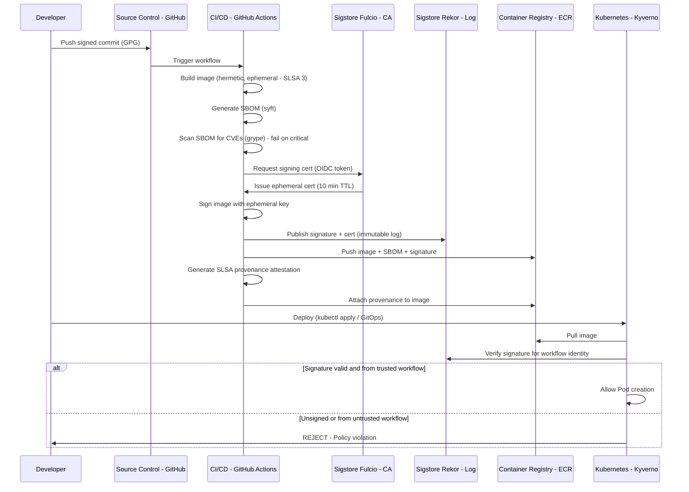

⚡ TL;DR - Software supply chain security protects the integrity of your software from source
code to production deployment, including third-party dependencies and build pipelines.
The threat model: attackers compromise software before it reaches you - by injecting malicious
code into an open-source dependency (XZ Utils backdoor, 2024), compromising a vendor's build
system (SolarWinds, 2020: Sunburst malware injected into the build process), or typosquatting
popular packages (malicious `cryptography-utils` vs. legitimate `cryptography`). SLSA (Supply
Levels for Software Artifacts) framework: a Google-created, CNCF-adopted framework with 4
levels of supply chain integrity. SLSA 1: provenance (the build system generates a signed
provenance document - who built it, from which source, at what time). SLSA 2: hosted build
platform (using a hosted CI/CD platform, provenance signed by the platform's key). SLSA 3:
hardened builds (build environment is hermetic, ephemeral, auditable; no access to production
secrets from build). SLSA 4: the full chain of custody is verifiable from source to artifact.
SBOM (Software Bill of Materials): a structured inventory of all components in your software
(like a nutritional label for software: every library, version, license, known vulnerability).
SBOM formats: SPDX (Linux Foundation standard) and CycloneDX. Sigstore/Cosign: free, open-source
keyless signing infrastructure - developers sign artifacts using their OIDC identity (GitHub Actions
workflow identity), no key management required. Container images: signed with Cosign, verified
by Kyverno admission controller (unsigned images: rejected from production). The key defense:
don't just scan for known-malicious dependencies. Also verify WHERE the dependency came from
(provenance), WHAT's in it (SBOM + vulnerability scan), and WHETHER it was tampered with
(signature verification).

---

| #123 | Category: Security | Difficulty: ★★★★ |
|:---|:---|:---|
| **Depends on:** | OWASP Top 10, Authentication, Business Logic, Insufficient Logging, CVSS Scoring, CVE + NVD, AWS Security Services, Kubernetes Security, Security Observability + SIEM, Security at Scale, ISO 27001, Chaos Engineering, Privilege Escalation, Zero Trust Introduction, Red/Blue/Purple Team, Zero Trust Enterprise, DevSecOps Pipeline, Security Champions, Enterprise Security Architecture, Secret Rotation, Security Governance, Threat Intelligence, CSIRT Design, Security Metrics | |
| **Used by:** | Platform Security Engineering, Multi-Cloud Security, Build vs Buy Security, SSDLC, Adversarial Thinking, Trust Boundary Analysis, Assume-Breach, Security as Contract, Threat Modeling | |
| **Related:** | OWASP Top 10, Authentication, Business Logic, Insufficient Logging, CVSS, CVE, AWS Security, Kubernetes Security, Security Observability + SIEM, Security at Scale, ISO 27001, Chaos Engineering, Privilege Escalation, Zero Trust Introduction, Red/Blue/Purple Team, Zero Trust Enterprise, DevSecOps Pipeline, Security Champions, Enterprise Security Architecture, Secret Rotation, Security Governance, Threat Intelligence, CSIRT Design, Security Metrics, Platform Security, Multi-Cloud Security, Build vs Buy, SSDLC | |

---

### 🔥 The Problem This Solves

**WHY TRADITIONAL SECURITY FAILS AGAINST SUPPLY CHAIN ATTACKS:**

```
THE SOLARWINDS ATTACK (2020) - THE WAKE-UP CALL:

  Traditional security model: "protect your perimeter. Trust your vendors."
  
  SolarWinds: a network monitoring software vendor. Customers: 18,000+.
  Customers: include the US Treasury, Pentagon, NSA, thousands of Fortune 500 companies.
  
  The attack:
  - Attackers (Cozy Bear / APT29 - Russian SVR) compromise SolarWinds' build system.
  - The build system: the CI/CD pipeline that compiles the SolarWinds Orion product.
  - Attackers: inject the SUNBURST backdoor into the Orion source code.
    BEFORE the compiled build. After SolarWinds' own development process.
    In the build system itself.
  - SolarWinds: compiles Orion. Signs the binary (their legitimate signing key signs it).
  - SolarWinds: distributes the signed Orion update to 18,000+ customers.
    As a legitimate, signed software update.
    
  Customer security controls: ALL bypass.
  - Antivirus: the binary is signed by SolarWinds (a trusted vendor). Passes.
  - Network security: traffic from the SolarWinds update server is whitelisted. Passes.
  - Endpoint security: SolarWinds Orion is trusted software. Passes.
  - SBOM/dependency scanning: the binary is FROM SolarWinds, not a dependency. No scan.
  
  Result:
  - 18,000+ organizations: received and installed the backdoored update.
  - US Treasury, Pentagon, NSA: compromised. Attackers: months of undetected access.
  - Detection: 8 months after the malicious update was first distributed.
  - MTTD: 8 months. Because: traditional security assumes trusted vendors = safe.
  
  ROOT CAUSE: The build system was compromised. The compiled artifact was tampered with.
  There was no way for customers to verify: "does this binary exactly match the source code?"
  SolarWinds had no mechanism to prove it, customers had no mechanism to verify it.
  
  SLSA + SBOM WOULD HAVE CHANGED THIS:
  
  SLSA provenance: every Orion build → signed provenance document.
  "This binary was built from source commit ABC123 by build job 12345 at CI system XYZ."
  
  The SUNBURST injection: happened IN the build system, AFTER the source commit.
  SLSA binary hash: the binary hash would NOT match the expected hash from source.
  The provenance: would show a discrepancy.
  
  Customer verification: "verify that the Orion binary I downloaded matches the SLSA provenance
  attestation from SolarWinds." Discrepancy detected: build system was tampered with.
  
  SBOM: "what components are in the Orion binary?"
  The SUNBURST DLL: added in the build. Would appear in the SBOM as an unknown component.
  Customer SBOM scanning: "DLL `SolarWinds.Orion.Core.BusinessLayer.dll` changed. Not in prior SBOM.
  Not in the source. Unexpected component." Alert.
  
  With SLSA + SBOM + provenance verification: SolarWinds supply chain attack would have been
  detectable - before 18,000 organizations installed the backdoor.
  Cost of not having supply chain security: estimated $100 billion total economic impact.

THE XZ UTILS BACKDOOR (2024) - THE NEAR-MISS:

  XZ Utils: a compression library. Present in almost every Linux distribution.
  
  The attack:
  - Attacker (Jia Tan, believed to be nation-state) spent 2 years building trust in the
    XZ Utils open-source project as a contributor.
  - Gained maintainer access (trust through sustained contribution).
  - Injected a backdoor into XZ Utils 5.6.0 (released Feb 2024).
    The backdoor: affected systemd-linked sshd on Linux systems.
    Effect: allowed RSA key-based authentication bypass (attacker could log in as any user).
    
  Discovery: by Andres Freund (Microsoft engineer) who noticed unusual CPU load in sshd.
  MTTD: approximately 3 weeks (from release to discovery).
  
  Impact: near-miss. The backdoored version: not yet included in stable distributions.
  If it had: EVERY Linux server using the affected distributions would have been
  remotely exploitable via SSH. Potentially billions of servers.
  
  ROOT CAUSE: No supply chain verification of the maintainer identity.
  "A trusted contributor said this is safe" = the only verification.
  
  Defense that would have helped: SBOM diffing (detecting unexpected changes in the binary
  between 5.5.x and 5.6.0 releases), reproducible builds (anyone can verify the binary
  matches the source), behavioral analysis (the SUNBURST-style obfuscation in the code).
```

---

### 📘 Textbook Definition

**Software Supply Chain:** The chain of people, processes, and tools that produce software:
source code management → build system → CI/CD pipeline → dependency repositories → artifact
registry → deployment. Each link: a potential attack surface. Supply chain security: ensuring
integrity at every link.

**SLSA (Supply Levels for Software Artifacts):** A framework for supply chain integrity,
graduated across 4 levels. Developed by Google, donated to the OpenSSF (Open Source Security
Foundation). SLSA focuses on BUILD INTEGRITY: proving that a software artifact was produced
by a specific build system from a specific source, without tampering.

SLSA levels:
- **SLSA 0**: No guarantees. No provenance. (Current state of most software.)
- **SLSA 1**: Provenance generated. Build process generates a provenance document (who, what,
  when, from which source). Not yet signed or verified. Lowest barrier.
- **SLSA 2**: Provenance signed by a hosted build platform. The CI/CD platform (GitHub Actions,
  Google Cloud Build) signs the provenance with its own key. Provides protection against
  individual developer tampering (but not platform compromise).
- **SLSA 3**: Hardened builds. Build environment: ephemeral (disposable, not reused), hermetic
  (no network access during build beyond declared dependencies), parameterized (build params
  are in source control, not injected at build time). Significantly harder to tamper with.
- **SLSA 4**: Two-person review of all build platform changes. Complete supply chain protection.
  Extremely high assurance. Appropriate for critical infrastructure software.

**SBOM (Software Bill of Materials):** A formal, machine-readable inventory of all components
in a software artifact. Includes: package names, versions, licenses, known vulnerabilities (CVE
references), source code hashes. US Executive Order 14028 (2021): mandates SBOM for software
sold to the US federal government. Formats: SPDX 2.3 (Linux Foundation) and CycloneDX 1.4
(OWASP). Both are JSON/XML based. SBOM enables: vulnerability impact analysis ("which of our
products use Log4j 2.14.1?"), license compliance, dependency audit.

**Sigstore/Cosign:** Keyless signing infrastructure for software artifacts. Sigstore is the
public good infrastructure (transparency log: Rekor, certificate authority: Fulcio). Cosign:
the signing/verification CLI. Keyless signing flow: developer identity (or CI/CD workflow OIDC
token) → short-lived certificate from Fulcio → sign artifact → signature + certificate published
to Rekor (public, immutable transparency log). Verification: anyone can verify the artifact was
signed by a specific identity at a specific time, without the signer managing private keys.

**Dependency Confusion Attack:** An attacker registers a public package with the same name
as a private internal package on a public registry (npm, PyPI). If the package manager is
misconfigured: it downloads the public (attacker-controlled) package instead of the internal one.
Discovered by Alex Birsan (2021). Affected: Apple, Microsoft, PayPal, Shopify, and 30+ other organizations.

**Typosquatting:** Registering package names similar to popular packages: `reqeusts` instead of
`requests`, `colourama` instead of `colorama`. Targets developers who make typos.

---

### ⏱️ Understand It in 30 Seconds

**One line:**
Supply chain security ensures that the software you deploy is exactly what was authored,
built, and reviewed - not tampered with in the build system, not a malicious look-alike
package, and not embedding a backdoored dependency - using provenance attestations (SLSA),
component inventories (SBOM), and artifact signing (Sigstore/Cosign) to create a verifiable
chain of custody from source code to production container.

**One analogy:**
> Software supply chain security is the food safety analogy.
>
> You don't trust a hamburger just because a restaurant served it.
> You want to know: where did the beef come from? (source)
> Was the processing facility inspected? (build environment)
> Was the cold chain maintained from farm to table? (transport integrity)
> Was it handled correctly in the kitchen? (deployment integrity)
>
> A food recall works because of traceability:
> "E. coli outbreak → traced to beef from XYZ processing facility → lot number ABC123 →
> shipped to 3,400 restaurants on specific dates → recalled from all locations."
> This traceability: requires an SBOM equivalent (chain of custody documentation).
> Without it: "we have E. coli somewhere in the food supply.
>  We don't know where. Every restaurant: stop serving beef until we figure it out."
>
> Software without supply chain security: same problem.
> "Log4Shell is in our products. Which ones? We don't know - no SBOM.
>  Scan everything. Stop all deployments until we figure it out." (4 days of chaos)
>
> Software with an SBOM:
> "Log4Shell (Log4j 2.14.1) is in our products. Which ones? Checking SBOM...
>  Products A, C, and G contain log4j-core-2.14.1. Products B, D, E, F: clean.
>  Patch A, C, G immediately. No disruption to B, D, E, F." (4 hours of targeted work)
>
> SLSA = the food safety inspection certification for your build system.
> SBOM = the ingredient label for your software.
> Sigstore = the tamper-evident seal on the packaging.

---

### 🔩 First Principles Explanation

**Supply chain attack surface and defense layers:**

```
SUPPLY CHAIN ATTACK SURFACE:

  1. SOURCE CODE (developer workstations, SCM)
     Attack: insider threat injects malicious code, developer account compromise.
     Defense: code review (two-person rule), branch protection, signed commits (GPG).
  
  2. DEPENDENCIES (npm, PyPI, Maven Central)
     Attack: malicious package (typosquatting, dependency confusion, compromised maintainer).
     Defense: pinned dependencies (hash lock), private registry (Nexus/Artifactory),
              SCA (Software Composition Analysis): Snyk, Dependabot.
  
  3. BUILD SYSTEM (CI/CD pipeline)
     Attack: SolarWinds-style: compromise the build environment, inject during compilation.
     Defense: SLSA 3 (ephemeral, hermetic builds), reproducible builds, provenance attestation.
  
  4. ARTIFACT REGISTRY (container registry, artifact repo)
     Attack: push malicious image under a trusted tag.
     Defense: Cosign signing (sign image on push), Kyverno admission control (verify signature on deploy).
  
  5. DEPLOYMENT (Kubernetes admission, app startup)
     Attack: deploy unsigned/unverified image.
     Defense: Kyverno/OPA policy: reject unverified images.

SLSA FRAMEWORK LEVELS (PRACTICAL IMPLEMENTATION):

  SLSA 1: GENERATE PROVENANCE
  
    GitHub Actions job generates SLSA provenance:
    
    - uses: slsa-framework/slsa-github-generator/.github/workflows/generator_generic_slsa3.yml
      with:
        base64-subjects: "${{ needs.build.outputs.hashes }}"
    
    Output: attestation file (provenance JSON).
    Contains: source commit hash, build workflow, build timestamp, output artifact hash.
    
  SLSA 2: SIGNED BY PLATFORM
  
    GitHub Actions: uses OIDC token to request short-lived signing cert from Fulcio (Sigstore).
    Provenance: signed with ephemeral cert tied to the GitHub workflow identity.
    Verification: anyone can verify "this artifact was built by github.com/org/repo
    workflow .github/workflows/build.yml at commit abc123."
    
  SLSA 3: HERMETIC BUILDS
  
    GitHub Actions restrictions for SLSA 3:
    - Build: no outbound network access (except declared package registries).
    - Build environment: ephemeral (new GitHub Actions runner per build).
    - Build inputs: from source control only (no manual injection).
    - Secret access: build jobs cannot access production secrets.
    - Result: build cannot be tampered with even if one contributor is compromised.

SBOM GENERATION AND VERIFICATION:

  SBOM generation in CI/CD:
  
    # After building container image:
    syft ghcr.io/org/app:v1.2.3 -o cyclonedx-json > sbom.json
    
    # Attach SBOM to image in registry:
    cosign attach sbom --sbom sbom.json ghcr.io/org/app:v1.2.3
    
  SBOM vulnerability scan:
  
    # Scan SBOM against vulnerability database:
    grype sbom:sbom.json --fail-on critical
    
    # Output: list of vulnerabilities in the SBOM components.
    # CVE-2021-44228 (Log4Shell): found in log4j-core-2.14.1
    # Severity: CRITICAL. Fix: upgrade to 2.17.1.
    
  SBOM querying for incident response:
  
    # "Which of our container images contain log4j < 2.17.1?"
    # Query all SBOMs in the registry for this component.
    
    grype db check
    grype image_list.txt --output json \
      | jq '.matches[] | select(.vulnerability.id == "CVE-2021-44228")'
```

---

### 🧪 Thought Experiment

**SCENARIO: Implementing SLSA 2 + SBOM for a FinTech company's container images:**

```
CURRENT STATE:
  - Container images: built in GitHub Actions, pushed to ECR.
  - No provenance. No SBOM. No signing.
  - Log4Shell incident: took 4 days to identify affected images.
    (Manual process: "go look at every Dockerfile and pom.xml")
  - Risk: a dependency compromise similar to XZ Utils could go undetected.

GOAL: SLSA 2 + SBOM for all container images. Cosign signing. 6-week implementation.

WEEK 1-2: SBOM GENERATION

  Modify GitHub Actions workflow for each service:
  
  steps:
    - name: Build container image
      run: docker build -t $IMAGE_NAME .
      
    - name: Generate SBOM
      uses: anchore/sbom-action@v0
      with:
        image: $IMAGE_NAME
        artifact-name: sbom.spdx.json
        output-file: ./sbom.spdx.json
        format: spdx-json
        
    - name: Scan SBOM for vulnerabilities
      uses: anchore/scan-action@v3
      with:
        sbom: ./sbom.spdx.json
        fail-build: "true"
        severity-cutoff: critical
        
    - name: Attach SBOM to image
      run: |
        cosign attach sbom \
          --sbom ./sbom.spdx.json \
          $IMAGE_REGISTRY/$IMAGE_NAME:$IMAGE_TAG
          
  Result: every image pushed to ECR → SBOM attached → vulnerability-scanned.
  Log4Shell recurrence: "which images contain log4j < 2.17.1?"
  → Query all SBOMs in registry. 15 minutes. Not 4 days.

WEEK 3-4: COSIGN IMAGE SIGNING (SLSA 2)

  In GitHub Actions:
  
    - name: Sign container image
      uses: sigstore/cosign-installer@v3
      
    - name: Sign with keyless (OIDC)
      run: |
        cosign sign \
          --yes \
          $IMAGE_REGISTRY/$IMAGE_NAME:$IMAGE_TAG
      env:
        COSIGN_EXPERIMENTAL: 1
        
  The signing:
  - Cosign requests an OIDC token from GitHub Actions.
  - Cosign requests a short-lived cert from Fulcio (tied to the workflow identity).
  - Artifact signed with the ephemeral key.
  - Signature + cert: published to Rekor transparency log.
  - In ECR: attached signature artifact.

WEEK 5-6: KYVERNO POLICY (ADMISSION CONTROL)

  Deploy Kyverno ClusterPolicy to the Kubernetes cluster:
  
  apiVersion: kyverno.io/v1
  kind: ClusterPolicy
  metadata:
    name: require-signed-images
  spec:
    validationFailureAction: Enforce
    rules:
      - name: check-image-signature
        match:
          any:
          - resources:
              kinds: [Pod]
        verifyImages:
        - imageReferences:
          - "123456789.dkr.ecr.us-east-1.amazonaws.com/*"
          attestors:
          - entries:
            - keyless:
                subject: "https://github.com/myorg/*/.github/workflows/*.yml@refs/heads/main"
                issuer: "https://token.actions.githubusercontent.com"
                
  Effect:
  - Any pod that uses an unsigned image from ECR: REJECTED at admission.
  - Any pod that uses an image signed by a workflow other than main branch: REJECTED.
  - Attacker pushing an unverified image to ECR and deploying it: BLOCKED.
  
RESULT:
  - Every container image: SBOM generated and attached.
  - Every container image: vulnerability-scanned before push (critical = fail build).
  - Every container image: signed with Cosign keyless signing.
  - Every container deployment: verified at Kubernetes admission (unsigned = rejected).
  - Log4Shell-style response: 15 minutes vs. 4 days (SBOM query).
  - Unverified/tampered image: blocked at deployment.
  - Implementation time: 6 weeks (mostly workflow changes, no infrastructure additions).
  - Cost: $0 (GitHub Actions, Cosign/Sigstore are free, Syft/Grype are open source).
```

---

### 🧠 Mental Model / Analogy

> Supply chain security is the chain of custody model from evidence law.
>
> In a criminal trial, physical evidence (a weapon, a document) is admissible only if:
> chain of custody is documented from discovery to trial.
> Every person who handled the evidence: recorded.
> Every transfer: logged, with signatures.
> Any gap in the chain of custody: the evidence is challenged. "Who had this between
> Monday and Tuesday? We don't know. It could have been tampered with."
>
> Software without supply chain security: no chain of custody.
> "Where did this container image come from?" → "ECR."
> "Who built it?" → "GitHub Actions." (probably)
> "From which source commit?" → "We think main branch."
> "Was anything injected into the build?" → "We don't know."
> "Are all the components in it what we expect?" → "We haven't checked."
>
> The supply chain attacker: exploits the gap in chain of custody.
> "Nobody checks between source code and the running binary.
>  I'll modify the binary in the build system. Nobody will know."
>
> SLSA + SBOM + Sigstore: the chain of custody for software.
> SLSA provenance: "this binary was produced from commit abc123 by workflow X."
> SBOM: "this binary contains exactly these components with these hashes."
> Sigstore signature: "this binary has not been modified since it was signed."
> Kyverno verification: "I will not deploy any binary without a valid chain of custody."
>
> Every gap in the chain: a potential SolarWinds moment.
> Every verified link: a detection point for tampering.
> The chain is only as strong as its weakest link.
> Supply chain security: identifies and strengthens every link.

---

### 📶 Gradual Depth - Five Levels

**Level 1 - What it is (anyone can understand):**
Software supply chain security ensures that the software you use is actually what its creators intended, and hasn't been tampered with anywhere along the way from source code to your servers. The threat: attackers don't just try to hack into your network directly. They also try to compromise the software you download and trust - like injecting malware into a popular software update (SolarWinds) or a widely used open-source library (XZ Utils). SLSA is a certification system for software build processes (like food safety certifications), SBOM is a complete ingredient list for your software, and Sigstore is a digital signature system that proves software wasn't tampered with.

**Level 2 - How to use it (junior developer):**
As a developer, supply chain security affects your daily work: (1) Pinned dependencies: don't use `latest` or `^1.0.0` for production code. Pin to exact versions AND checksums (lock files: `package-lock.json`, `Pipfile.lock`, `go.sum`). A checksum lock means if anyone swaps the package for a malicious version with the same version number - your build fails. (2) Dependabot/Renovate: automated dependency update PRs. Each update: should be reviewed for unexpected changes. (3) Signed commits: use GPG signing for commits (`git commit -S`). Proves your commits come from you, not an attacker who compromised your account. (4) SBOM in CI: your pipeline probably generates an SBOM and scans it. A failing SBOM scan: means a critical vulnerability in one of your dependencies. Fix: upgrade to the fixed version.

**Level 3 - How it works (mid-level engineer):**
Cosign keyless signing deep dive: when the GitHub Actions workflow runs `cosign sign`, it uses the ACTIONS_OIDC_REQUEST_TOKEN environment variable to request an OIDC token from GitHub's token endpoint. This OIDC token: asserts the workflow identity (`https://github.com/org/repo/.github/workflows/build.yml@refs/heads/main`). Cosign sends this token to Fulcio (Sigstore's certificate authority): "please issue me a short-lived signing certificate tied to this identity." Fulcio: verifies the OIDC token, issues a certificate valid for 10 minutes. Cosign: signs the artifact with the ephemeral private key. Signature + certificate + timestamp: published to Rekor (immutable public transparency log). The ephemeral private key: immediately discarded. Verification: Cosign fetches the signature from the registry, fetches the certificate chain from Rekor, verifies the certificate was issued by Fulcio for the expected workflow identity, verifies the signature against the artifact hash. Result: artifact verified as built by the specific GitHub Actions workflow, at a specific time, from a specific commit.

**Level 4 - Why it was designed this way (senior/staff):**
The SLSA framework design principle: "trust, but verify" is insufficient for the build system. The SolarWinds lesson: even a trusted, well-resourced vendor with good security practices can have their build system compromised. The SLSA response: make tampering DETECTABLE, not just difficult. SLSA provenance: creates a verifiable record of every build. If the build system is compromised and the artifact is tampered with, the provenance hash won't match the artifact. The tampering: detectable post-hoc (similar to how a CT log makes TLS certificate misissuance detectable). SLSA levels are graduated because: the attack surface and implementation cost vary. SLSA 1 (generate provenance): adds minimal friction, provides value against source-level tampering. SLSA 3 (hermetic builds): adds significant friction, provides value against build system compromise. Not every piece of software justifies SLSA 3. The decision: tier your supply chain requirements. Critical, internet-facing software in production: SLSA 2+. Internal tools: SLSA 1 is fine. Dependencies that go into critical software: require SLSA 2+ from the provider (or build from source).

**Level 5 - Mastery (distinguished engineer):**
The XZ Utils backdoor revealed a gap that SLSA alone doesn't address: the maintainer trust problem. SLSA proves that the artifact was built from source X by workflow Y. But if source X is malicious (the XZ Utils maintainer was the attacker), SLSA does not help. The defense against compromised maintainer is different: reproducible builds (anyone can verify the artifact from source), security audits of high-criticality dependencies, behavioral analysis of new contributors (2-year social engineering is difficult to detect from code alone), and minimizing the number of critical dependencies. The emerging defense: "critical dependencies" tracking - organizations like CNCF and OpenSSF are creating security assessments and scorecards (OpenSSF Scorecard) for popular open-source projects. "Does this project have good practices: CI/CD security, code review policy, vulnerability disclosure process, active maintainers?" Organizations consuming open-source: run Scorecard on their direct dependencies. A low-scoring critical dependency: warrants either: (1) contributing to improve it, (2) vendoring it (own the source, build from your own fork), or (3) replacing it. At the platform engineering level: the supply chain security questions are: "which open-source dependencies are truly critical to us? What's our exposure if one is compromised? How quickly can we respond to a supply chain compromise?" The FAIR analysis of XZ Utils for a Linux-based company: "100% of our servers run systemd + sshd. If XZ Utils is compromised: total compromise of all servers. TEF: 1 event (it almost happened). Vulnerability: 100% (all servers affected if in stable release). Loss: catastrophic." That FAIR analysis: justifies significant investment in supply chain security even for "free" open-source.

---

### ⚙️ How It Works (Mechanism)

```
SUPPLY CHAIN SECURITY LAYERS:

  SOURCE:  signed commits, branch protection, two-person review
      |
  DEPS:    dependency lock files (checksums), SCA scan, private registry
      |
  BUILD:   SLSA provenance, hermetic/ephemeral env, no prod secrets
      |
  ARTIFACT: Cosign sign → Rekor transparency log
      |
  REGISTRY: signed image stored with SBOM attached
      |
  DEPLOY:  Kyverno policy: reject unsigned / unverified images
```



---

### 💻 Code Example

**GitHub Actions workflow with SLSA 2, SBOM, and Cosign signing:**

```yaml
# .github/workflows/build-sign.yml
# Supply chain secure build pipeline:
# 1. Hermetic build with pinned action versions (supply chain)
# 2. SBOM generation (Syft)
# 3. Vulnerability scan (Grype) - fail on critical
# 4. Cosign keyless signing (Sigstore/SLSA 2)
# 5. SLSA provenance attestation

name: Build, Sign, and Attest

on:
  push:
    branches: [main]
    tags: ["v*"]

permissions:
  contents: read
  id-token: write   # Required for keyless signing (OIDC)
  packages: write   # Required for pushing to GHCR

jobs:
  build:
    runs-on: ubuntu-latest
    outputs:
      image: ${{ steps.build.outputs.image }}
      digest: ${{ steps.build.outputs.digest }}
    
    steps:
      # Pin ALL actions to full commit SHA - not floating tags.
      # "uses: actions/checkout@v4" is NOT supply-chain safe.
      # An attacker who compromises the action repo can push a malicious
      # "v4" tag pointing to malicious code. SHA pins prevent this.
      - uses: actions/checkout@11bd71901bbe5b1630ceea73d27597364c9af683
        # ^ This is actions/checkout@v4 pinned to commit SHA
        
      - name: Set up Docker Buildx
        uses: docker/setup-buildx-action@c47758b77c9736f4b2ef4073d4d51994fabfe349
        
      - name: Build container image
        id: build
        uses: docker/build-push-action@4f58ea79222b3b9dc2c8bbdd6debcef730109a75
        with:
          context: .
          push: true
          tags: |
            ghcr.io/${{ github.repository }}:${{ github.sha }}
          # Reproducible: --no-cache ensures clean build
          no-cache: true
          # Multi-platform: amd64 only for determinism
          platforms: linux/amd64
          
      - name: Generate SBOM
        uses: anchore/sbom-action@e8d2a6937ecead383dfe75190d104edd1f9c5751
        with:
          image: ghcr.io/${{ github.repository }}@${{ steps.build.outputs.digest }}
          artifact-name: sbom.spdx.json
          output-file: ./sbom.spdx.json
          format: spdx-json
          
      - name: Scan SBOM for vulnerabilities
        uses: anchore/scan-action@3343887d815d7b07465f6fdcd395bd66508d486a
        with:
          sbom: ./sbom.spdx.json
          # FAIL the build on any CRITICAL CVE.
          # Prevents deploying images with actively exploited vulnerabilities.
          fail-build: "true"
          severity-cutoff: critical
          
      - name: Attach SBOM to image
        run: |
          cosign attach sbom \
            --sbom ./sbom.spdx.json \
            ghcr.io/${{ github.repository }}@${{ steps.build.outputs.digest }}
            
      - name: Sign image (keyless, SLSA 2)
        # Keyless signing: no key management required.
        # Cosign uses OIDC token to get ephemeral cert from Fulcio.
        # Signature + cert: published to Rekor transparency log.
        uses: sigstore/cosign-installer@dc72c7d5c4d10cd6bcb8cf6e3fd625a9e5e537da
        
      - name: Sign
        run: |
          cosign sign \
            --yes \
            ghcr.io/${{ github.repository }}@${{ steps.build.outputs.digest }}
        env:
          COSIGN_EXPERIMENTAL: "1"
          
  # SLSA provenance generation (after build)
  provenance:
    needs: [build]
    permissions:
      actions: read
      id-token: write
      packages: write
    uses: slsa-framework/slsa-github-generator/.github/workflows/generator_container_slsa3.yml@v2.0.0
    with:
      image: ghcr.io/${{ github.repository }}
      digest: ${{ needs.build.outputs.digest }}
      registry-username: ${{ github.actor }}
    secrets:
      registry-password: ${{ secrets.GITHUB_TOKEN }}
```

```python
# verify_supply_chain.py
# Verify supply chain integrity of a container image before deployment.
# Run as a pre-deployment gate in staging/production pipelines.

import subprocess
import json
import sys

def verify_image_signature(image_ref: str, expected_workflow: str) -> bool:
    """
    Verify Cosign signature for an image.
    Checks: signed by the expected GitHub Actions workflow.
    
    BAD approach: trust the image tag / registry location alone.
    GOOD approach: verify the cryptographic signature and workflow identity.
    """
    result = subprocess.run(
        [
            "cosign", "verify",
            "--certificate-identity-regexp", expected_workflow,
            "--certificate-oidc-issuer", "https://token.actions.githubusercontent.com",
            image_ref
        ],
        capture_output=True,
        text=True
    )
    
    if result.returncode != 0:
        print(f"SIGNATURE VERIFICATION FAILED: {result.stderr}")
        return False
    
    print(f"Signature verified: {image_ref} was signed by {expected_workflow}")
    return True


def check_sbom_for_critical_cves(image_ref: str) -> bool:
    """
    Scan the attached SBOM for critical vulnerabilities.
    Returns True if no CRITICAL CVEs found.
    """
    # Download SBOM from image
    sbom_result = subprocess.run(
        ["cosign", "download", "sbom", image_ref],
        capture_output=True,
        text=True
    )
    
    if sbom_result.returncode != 0:
        print(f"No SBOM found for {image_ref}. Failing: SBOM required.")
        return False
    
    # Write SBOM to temp file
    with open("/tmp/sbom.json", "w") as f:
        f.write(sbom_result.stdout)
    
    # Scan SBOM with Grype
    grype_result = subprocess.run(
        ["grype", "sbom:/tmp/sbom.json", "--output", "json", "--fail-on", "critical"],
        capture_output=True,
        text=True
    )
    
    if grype_result.returncode != 0:
        try:
            grype_output = json.loads(grype_result.stdout)
            critical_matches = [
                m for m in grype_output.get("matches", [])
                if m.get("vulnerability", {}).get("severity") == "Critical"
            ]
            print(f"CRITICAL CVEs found in {image_ref}:")
            for match in critical_matches:
                vuln = match["vulnerability"]
                print(f"  {vuln['id']}: {vuln.get('description', 'n/a')[:60]}")
        except json.JSONDecodeError:
            print(f"Grype scan failed: {grype_result.stderr}")
        return False
    
    print(f"SBOM scan passed: no CRITICAL CVEs in {image_ref}")
    return True


def run_pre_deployment_verification(image_ref: str) -> None:
    """
    Run all supply chain verification checks.
    Fails (exits non-zero) if any check fails.
    """
    expected_workflow = (
        "https://github.com/myorg/myrepo/.github/workflows/build-sign.yml"
        "@refs/heads/main"
    )
    
    checks = [
        ("Signature verification", lambda: verify_image_signature(
            image_ref, expected_workflow)),
        ("SBOM CVE scan", lambda: check_sbom_for_critical_cves(image_ref)),
    ]
    
    all_passed = True
    for check_name, check_fn in checks:
        print(f"Running: {check_name}...")
        passed = check_fn()
        status = "PASS" if passed else "FAIL"
        print(f"{status}: {check_name}")
        if not passed:
            all_passed = False
    
    if not all_passed:
        print("Pre-deployment verification FAILED. Deployment blocked.")
        sys.exit(1)
    
    print("All supply chain checks passed. Deployment approved.")
```

---

### ⚖️ Comparison Table

| Control | Protects Against | Implementation Cost | Coverage |
|:---|:---|:---|:---|
| **Dependency lock files (checksums)** | Dependency tampering, version substitution | Very low (already in most stacks) | Direct deps only |
| **SCA (Snyk, Dependabot)** | Known-CVE dependencies | Low (automated PR-based) | Known vulnerabilities in deps |
| **SBOM (Syft + CycloneDX)** | Unknown vulnerable components, incident response | Low (add CI step) | Complete component inventory |
| **Cosign signing (SLSA 2)** | Image tampering post-build, unauthorized image push | Low (CI step + Kyverno policy) | Artifact integrity |
| **SLSA 3 hermetic builds** | Build system compromise (SolarWinds-class attacks) | Medium (CI workflow changes) | Build-time tampering |
| **Reproducible builds** | Compromised maintainer (XZ Utils-class attacks) | High (requires deterministic build toolchain) | Source-to-binary verification |

---

### ⚠️ Common Misconceptions

| Misconception | Reality |
|:---|:---|
| "SCA (dependency scanning) = supply chain security." | SCA (Software Composition Analysis) scans for KNOWN VULNERABILITIES in dependencies (CVEs from NVD). It does NOT detect: (1) malicious packages that don't have a CVE yet (XZ Utils backdoor: had no CVE until after discovery). (2) Dependency confusion attacks (a malicious package with the same name as your internal package). (3) Build system compromise (the artifact has the right components but was tampered with in the build). (4) Typosquatting (malicious `reqeusts` doesn't have a CVE - it's a new, clean-looking package). Supply chain security is multi-layered: SCA addresses one layer (known CVEs in dependencies). SLSA addresses build integrity. SBOM enables comprehensive inventory and rapid response. Cosign addresses artifact integrity. Private registry + package name scoping addresses dependency confusion. Supply chain security requires ALL layers, not just SCA. Organizations that say "we have Snyk, we're covered": are addressing one out of five supply chain attack vectors. |
| "Pinning to a package version (e.g., `log4j-core:2.14.1`) means we know what we're getting." | Version pinning prevents UNINTENDED updates. It does NOT prevent: (1) The package registry from serving a different artifact under the same version tag (most registries do NOT prevent this). (2) A transitive dependency of log4j-core:2.14.1 being malicious. (3) A build system compromise that injects code at compile time. True supply chain integrity requires hash pinning, not version pinning. `log4j-core:2.14.1` can silently change. `log4j-core:2.14.1` with SHA256 hash `abc123...` CANNOT change without breaking the hash verification. In Maven: `<dependencyLockfilePlugin>` or checksums. In npm: `package-lock.json` with `integrity` field (SHA-512 hash). In Python: `Pipfile.lock` with `hash` values. In Go: `go.sum` (SHA-256 of each module's zip). These lock files: verify the CONTENT of the package, not just its version label. A malicious package pushed under the same version number: fails hash verification. |

---

### 🚨 Failure Modes & Diagnosis

**Supply chain security failure patterns:**

```
FAILURE 1: ACTION PINNING BYPASS (GITHUB ACTIONS SUPPLY CHAIN)

  Vulnerable workflow:
    - uses: actions/setup-java@v3
    
  Attack: attacker compromises the actions/setup-java repository.
  Pushes malicious code tagged as v3.
  All workflows using actions/setup-java@v3: now run malicious code.
  CI/CD: compromised without any changes to the target repository.
  
  Detection:
    - GitHub Actions: all jobs that used the action start failing or behaving unexpectedly.
    - GitHub security advisory: issued for the compromised action.
    
  Prevention:
    Pin all actions to commit SHA:
    - uses: actions/setup-java@387ac29b308b003ca37ba93a6cab5eb57c8f5f93
    
    StepSecurity Harden-Runner: detects unexpected network calls from actions.
    
FAILURE 2: PRIVATE REGISTRY NOT ENFORCED

  Developer: `pip install payment-utils` (an internal package).
  Package manager: searches PyPI first (public). Finds malicious `payment-utils` on PyPI.
  Downloads attacker-controlled `payment-utils`. Installs.
  
  Root cause: private registry not configured as the ONLY source.
  
  Fix:
    In pip.conf or .pip/pip.conf:
    [global]
    index-url = https://nexus.internal/repository/pypi-proxy/simple
    trusted-host = nexus.internal
    # No fallback to public PyPI. If not in private registry: fail, don't fall back.
    
    In pyproject.toml (PEP 518):
    [tool.poetry]
    [[tool.poetry.source]]
    name = "private"
    url = "https://nexus.internal/repository/pypi-proxy/simple"
    priority = "default"
    # No public PyPI source listed.

SUPPLY CHAIN MATURITY CHECKLIST:

  Basic (must have):
  - Dependency lock files with checksums for all languages.
  - Dependabot/Renovate: automated dependency update PRs.
  - Private registry for internal packages: PyPI, npm, Maven.
  - Private registry for dependency proxying: Nexus or Artifactory.
    All package installs: go through the proxy (no direct public registry).
    Proxy: audit log of every package downloaded.
  
  Intermediate:
  - SBOM generation: attached to every container image artifact.
  - SBOM vulnerability scanning: in CI (fail on CRITICAL).
  - Container image signing: Cosign in CI.
  - Admission control: Kyverno policy enforces signed images in production.
  - GitHub Actions: all actions pinned to commit SHA.
  
  Advanced (SLSA 3+):
  - Hermetic builds: no outbound network during build.
  - SLSA provenance attestations: attached to all artifacts.
  - OpenSSF Scorecard: run on all critical open-source dependencies.
  - Reproducible builds: independently verifiable artifact hashes.
```

---

### 🔗 Related Keywords

**Prerequisites:**
- `DevSecOps Pipeline Design` (SEC-115) - CI/CD pipeline is where supply chain controls are implemented
- `Security Champions Program` (SEC-116) - champions drive supply chain security adoption in teams

**Builds on this:**
- `SSDLC` (SEC-129) - Secure SDLC incorporates supply chain security requirements
- `Platform Security Engineering` (SEC-124) - platform teams enforce supply chain policy at scale

---

### 📌 Quick Reference Card

```
┌──────────────────────────────────────────────────────────┐
│ ATTACK TYPES  │ Typosquatting: fake similar package name  │
│               │ Dependency confusion: private name on pub │
│               │ Compromised maintainer: XZ Utils style    │
│               │ Build system: SolarWinds style            │
│               │ Tampered artifact: post-build injection   │
├───────────────┼──────────────────────────────────────────┤
│ SLSA LEVELS   │ L1: provenance generated                  │
│               │ L2: provenance signed by CI platform      │
│               │ L3: hermetic/ephemeral build env          │
│               │ L4: full chain of custody verifiable      │
├───────────────┼──────────────────────────────────────────┤
│ KEY TOOLS     │ Syft: SBOM generation                     │
│               │ Grype: SBOM vulnerability scan            │
│               │ Cosign: artifact signing                  │
│               │ Kyverno: admission control (K8s)          │
│               │ Fulcio + Rekor: Sigstore infra (keyless)  │
├───────────────┼──────────────────────────────────────────┤
│ PIN ACTIONS   │ BAD: uses: actions/checkout@v4            │
│               │ GOOD: uses: actions/checkout@11bd71901... │
└──────────────────────────────────────────────────────────┘
```

---

### 💎 Transferable Wisdom

**Reusable Engineering Principle:**
"Trust, but verify. Better: verify, then trust, then re-verify periodically."
The zero-trust principle applies to software artifacts, not just network access.
"Signed by a trusted party" is NOT a sufficient trust basis if the trusted party's signing
infrastructure can be compromised. The verification must cover:
(1) Who built it (workflow/builder identity - SLSA provenance).
(2) From what source (source commit hash in provenance).
(3) What it contains (SBOM - complete component inventory).
(4) That it hasn't changed since signing (Cosign signature verification).
This verification stack: applies in other domains:
- Financial auditing: don't just trust the numbers. Verify the audit trail.
  Enron: "trusted" numbers. The audit trail: would have revealed the fraud.
- Infrastructure as Code: don't just trust that Terraform state matches reality.
  Drift detection: verify periodically that actual state = declared state.
- Database backups: don't trust that backup succeeded. Restore-test quarterly.
  "The backup was running" is not "the backup is restorable."
- API contracts: don't trust that the provider sends the documented schema.
  Schema validation at the consumer: catches contract violations early.
The pattern: every "trusted" input has a verification mechanism.
Verification: implemented systematically, not just when you feel suspicious.
In supply chain security: the verification is automatic (CI step, Kyverno policy).
Not a manual check before each deployment.

---

### 💡 The Surprising Truth

The most dangerous supply chain vulnerability is the one that looks most legitimate.

SolarWinds: the Sunburst backdoor was signed by SolarWinds' own signing key.
It looked more legitimate than any unsigned software. The signature: designed to increase trust.
The very thing that made it trustworthy (a valid vendor signature): was the mechanism of deception.

XZ Utils: the malicious maintainer had 2 years of legitimate contributions before inserting the backdoor.
The prior contributions: made the backdoor commit look trustworthy. "Jia Tan has a good track record."

The lesson: security controls that rely on identity (who signed it? who authored it?) without
verifying the process (HOW was it built? WHAT does it contain? DOES it match the source?) are
insufficient against sophisticated supply chain attackers.

SLSA provenance: doesn't just say "SolarWinds signed this." It says:
"this binary was produced from source commit abc123 by build job 12345
at 2020-10-01T14:23:01Z using build system X."
If the build system was compromised after producing that attestation:
the binary hash in the attestation won't match the distributed binary.
The tampering: detectable.

This is why supply chain security focuses on BUILD INTEGRITY (SLSA), not just IDENTITY:
"who signed it" is necessary but insufficient.
"Was the build process intact?" is the question SLSA answers.
And it's the question that SolarWinds-class attacks are designed to bypass.

The practical implication: for any critical dependency or critical software you produce:
verify the BUILD PROCESS, not just the signature.
"Does this artifact's hash match the hash in the SLSA provenance?
Does the provenance reference the source commit I reviewed?
Does the SBOM match what I expect to be in this artifact?"
Answering these three questions: supply chain security for critical artifacts.

---

### ✅ Mastery Checklist

**You've mastered this when you can:**
1. **EXPLAIN** the SolarWinds attack mechanism: build system compromise → malicious code injected
   AFTER source review → compiled into legitimate binary → signed with vendor's key → distributed
   as a trusted update. Explain why traditional security controls (AV, firewall, code review) all failed.
2. **DESCRIBE** SLSA levels 1-3: L1 (provenance generated), L2 (signed by CI platform), L3
   (hermetic, ephemeral, parameterized build). Know what each level protects against.
3. **EXPLAIN** what an SBOM contains (component inventory: name, version, hash, license, CVEs)
   and its two practical uses: vulnerability impact analysis during incidents (Log4Shell response)
   and continuous vulnerability scanning in CI/CD.
4. **DESCRIBE** Cosign keyless signing: OIDC token → Fulcio issues ephemeral cert → artifact signed →
   signature + cert published to Rekor. Explain why no key management is required (ephemeral cert).
5. **STATE** the dependency confusion attack: attacker registers a public package with the same name
   as an internal private package. Defense: configure package managers to use ONLY the private registry
   with no public fallback.

---

### 🎯 Interview Deep-Dive

**Q: How would you approach securing your software supply chain after a SolarWinds-style alert
from your threat intelligence provider saying "organizations similar to yours are being targeted
with build system attacks"?**

*Why they ask:* Tests supply chain security knowledge and ability to prioritize practical
defenses against a sophisticated threat. Common in senior security engineering and platform security roles.

*Strong answer covers:*
- Immediate assessment (this week): "what is our current build system security posture?"
  (1) Map all build pipelines: where are builds happening? GitHub Actions, Jenkins, internal CI?
  (2) For each build job: can a developer with CI/CD write access inject code into the build
  without triggering code review? If yes: that's a SolarWinds-class risk.
  (3) Check: are build jobs producing artifacts that are signed? If not: tampering is undetectable.
  (4) Check: are all GitHub Actions pinned to commit SHA? If not: action compromise = build compromise.
- Short-term (this month): implement the detectable controls first.
  (1) Cosign signing for all container images in CI. Cost: 1 day to add to CI workflow.
  (2) Kyverno admission policy: reject unsigned images in production. Cost: 1 day to configure.
  (3) SBOM generation and attachment. Cost: 1 day per service.
  Now: if an attacker injects a new component in the build: it appears in the SBOM unexpectedly.
  SBOM diff between builds: detect new/changed components.
- Medium-term (this quarter): harden the build system.
  SLSA 2: ensure provenance is signed by the CI platform. GitHub Actions: native SLSA 2 with the
  slsa-github-generator workflow.
  SLSA 3: hermetic builds (no outbound network from build jobs except declared registries).
  This prevents the SolarWinds scenario where the build system pulls a malicious tool mid-build.
- Monitoring: SBOM diffing between consecutive builds.
  "The SBOM for this service changed between build #452 and build #453. Which component was added?"
  Alert: any new component added without a corresponding dependency file change (Dockerfile,
  pom.xml, package.json). This detects build-time injection.
- For our own software consumed by others: publish SLSA provenance and SBOMs.
  Customers: can verify our artifacts against published provenance.
  This is also increasingly a procurement requirement (US EO 14028).