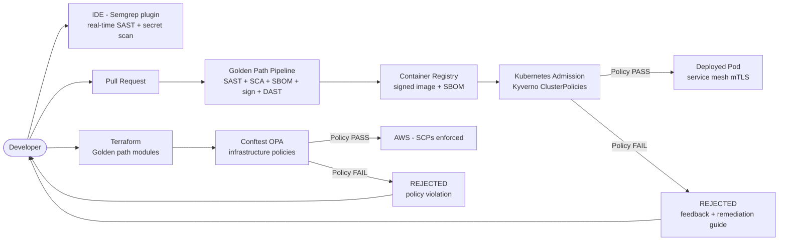

⚡ TL;DR - Platform Security Engineering embeds security directly into the internal developer
platform (IDP) so that secure-by-default is the path of least resistance for developers.
Instead of the security team reviewing every deployment ("security as a gate"), the platform
provides "golden paths" - pre-configured, pre-approved templates, pipelines, and infrastructure
patterns that are secure by construction. The developer who uses the golden path: gets security
for free. The developer who deviates: faces friction (policy enforcement, review requirements).
Key mechanisms: (1) Secure-by-default templates: service scaffolding that includes HTTPS, auth,
secrets management, SAST, SBOM generation, Cosign signing automatically. No developer action
required. (2) Policy as code: OPA/Kyverno policies that enforce security requirements at
admission time (Kubernetes admission controller). Unsigned image = rejected. Resource without
network policy = rejected. (3) Guardrails not gates: instead of rejecting and blocking,
guardrails redirect to the right path. "This service is using a deprecated vulnerable base image.
Here is the golden path base image. Use this instead." (4) Golden path incentives: the golden
path is not just secure - it's faster to use than rolling your own. Pre-configured observability,
auto-scaling, service mesh, automated deployments. Security: a side effect of better DX.
Platform security engineering at scale: Google's BeyondCorp, Netflix's Paved Road, Spotify's
Backstage. The fundamental insight: at 500+ engineers, security policies enforced by human
review are not scalable. Security policies enforced by the platform (policy as code, admission
controllers, automated guardrails) scale to 5,000 engineers with the same security team.

---

| #124 | Category: Security | Difficulty: ★★★★★ |
|:---|:---|:---|
| **Depends on:** | OWASP Top 10, Authentication, Business Logic, Insufficient Logging, CVSS Scoring, CVE + NVD, AWS Security Services, Kubernetes Security, Security Observability + SIEM, Security at Scale, ISO 27001, Chaos Engineering, Privilege Escalation, Zero Trust Introduction, Red/Blue/Purple Team, Zero Trust Enterprise, DevSecOps Pipeline, Security Champions, Enterprise Security Architecture, Secret Rotation, Security Governance, Threat Intelligence, CSIRT Design, Security Metrics, Supply Chain Security | |
| **Used by:** | Multi-Cloud Security, Build vs Buy Security, SSDLC, Adversarial Thinking, Trust Boundary Analysis, Assume-Breach, Security as Contract, Threat Modeling | |
| **Related:** | OWASP Top 10, Authentication, Business Logic, Insufficient Logging, CVSS, CVE, AWS Security, Kubernetes Security, Security Observability + SIEM, Security at Scale, ISO 27001, Chaos Engineering, Privilege Escalation, Zero Trust Introduction, Red/Blue/Purple Team, Zero Trust Enterprise, DevSecOps Pipeline, Security Champions, Enterprise Security Architecture, Secret Rotation, Security Governance, Threat Intelligence, CSIRT Design, Security Metrics, Supply Chain Security, Multi-Cloud Security, Build vs Buy, SSDLC | |

---

### 🔥 The Problem This Solves

**WHY SECURITY TEAM AS GATEKEEPER BREAKS AT SCALE:**

```
THE SCALING FAILURE OF REVIEW-BASED SECURITY:

  Company: 400 engineers. 40 services. 20 deployments/day on average.
  Security team: 4 people.
  
  Security model: "all significant changes require security review."
  
  YEAR 1 (50 engineers, 10 services):
  - Security reviews: 2/week. Security team: handles easily.
  - Security: effective. Bottleneck: not yet felt.
  
  YEAR 3 (400 engineers, 40 services):
  - Security reviews requested: 30/week.
  - Security team: 4 people (headcount growth lagged engineering growth).
  - Security review SLA: "5 business days" (was 1 day in Year 1).
  - Engineering: frustrated. "Security is blocking our deployments."
  - Solutions engineers create: bypass security review (expedite process, "low risk" self-certification).
  - Result: 60% of changes skip security review (self-certified as "low risk").
  - The "low risk" changes: include authentication changes, data handling changes.
  - Security team: burned out. "We're reviewing tickets, not doing real security work."
  - Security posture: DEGRADING. More changes, less oversight, burned-out team.
  
  YEAR 5 (1,000 engineers, 120 services):
  - Security review model: completely broken.
  - Security team: 8 people (vs. 1,000 engineers = 125:1 ratio).
  - Only "critical" changes reviewed: < 10% of changes.
  - Security incidents: increasing. Root cause: security controls not applied consistently.
  - Post-incident: "why wasn't this service using MFA?" "The developer thought it was low risk."
  
  ROOT CAUSE: Security as a manual review process.
  Manual reviews: don't scale. As engineering grows: security degrades unless the security model changes.
  
  THE PLATFORM SECURITY SOLUTION:
  
  Same company. Same 1,000 engineers. Different model.
  
  Platform security team (4 engineers) builds:
  - Service template: new service scaffold includes auth (OIDC), secrets (Vault), logging, SAST,
    SBOM generation, Cosign signing. ALL BY DEFAULT. Developer creates a new service: security included.
  - Kubernetes admission controller (Kyverno): policies enforced automatically.
    Every deployment: policy checked at admission. Unsigned image → rejected.
    No network policy → rejected. Privileged container → rejected.
    Policy check: 0 human time. Happens at every deployment. 20/day. 1,000 engineers.
  - Golden path CI/CD pipeline: pre-built, pre-approved. Developer uses the golden path:
    their pipeline includes SAST, SCA, SBOM, signing automatically.
    "Golden path" adoption rate: 90% (because it's faster than building your own).
  - Security guardrails in the platform: developer tries to use a deprecated vulnerable base image?
    Platform: "this image has CVE-XXXX (CVSS 9.8). Use `ubuntu:22.04-security-hardened` instead.
    Here is the migration guide." Developer: fixes the issue. Platform: handles 99% of cases.
  
  Security team (4 engineers at platform, 4 at security operations):
  - No longer reviewing individual deployments.
  - Instead: building platform controls that apply to ALL deployments.
  - "One engineer writes a Kyverno policy. Policy applies to all 1,000 engineers immediately."
  
  Security posture at 1,000 engineers:
  - MFA: enforced by default in the service template. 100% coverage.
  - Container signing: Kyverno policy. 100% coverage (except explicit exceptions).
  - SAST: run in every golden path pipeline. ~90% of services.
  - Vulnerability scanning: automated. 100% of container images.
  - Security incidents: fewer. Root cause: consistent security controls, not dependent on
    individual developer security knowledge.
  
  Ratio improved: 8 security engineers: effective for 1,000 developers.
  Previously: 4 security engineers: overwhelmed by 50 developers.
  Platform leverage: 1 security engineer = 125 developers (vs. 1:12 in review model).
```

---

### 📘 Textbook Definition

**Platform Security Engineering:** A discipline that embeds security requirements, controls,
and guardrails into the internal developer platform (IDP) so that developers get security
by default, without requiring security expertise or security team review for routine work.
Platform security engineers build the systems (templates, pipelines, policies, libraries)
that make the secure path the easiest path.

**Internal Developer Platform (IDP):** A curated set of tools, templates, and self-service
capabilities that developers use to build, test, deploy, and operate software. Examples:
Backstage (Spotify, open-source), Cortex, Port, or custom-built platforms. The IDP: the
central point of leverage for platform security - security embedded in the IDP applies to
every team that uses the IDP.

**Golden Path (Paved Road):** A pre-built, pre-approved, pre-configured template or pipeline
that represents the recommended way to build/deploy a service. The golden path: designed to
be both secure AND developer-friendly. It is NOT just a security checklist - it includes
production-ready observability, auto-scaling, and deployment automation. Security is a
property of the path, not an additional requirement. Teams that use the golden path: deploy
faster AND more securely than teams that don't.

**Policy as Code:** Security requirements expressed as machine-executable code (policies),
rather than documentation or manual review. Policy as code: runs at every deployment, consistently,
without human involvement. Tools: Open Policy Agent (OPA), Kyverno, AWS Service Control
Policies (SCPs), Azure Policy, Google Organization Policy Constraints. The policy as code
model: replaces "the security team reviews this" with "the admission controller enforces this."

**Secure by Default:** A design principle where the default configuration of a system is
the most secure configuration. The developer who does nothing special: gets security.
The developer who wants an insecure configuration: must explicitly opt out (which requires
justification, creating a record, and security team awareness). Examples: HTTPS by default
(opt-out is HTTP), authentication required by default (opt-out is anonymous access),
encrypted secrets by default (opt-out is plaintext env vars).

---

### ⏱️ Understand It in 30 Seconds

**One line:**
Platform security engineering solves the scaling problem of security - by building security
directly into the developer platform so that secure defaults are automatic, policy enforcement
is automated via admission controllers and CI/CD gates, and the "golden path" is both the
fastest AND the most secure way to build and deploy software at any scale.

**One analogy:**
> Platform security engineering is the building code model applied to software.
>
> Building codes define what's required in every building: fire exits, electrical wiring standards,
> structural requirements. Builders: don't need to become safety experts. They use standard
> materials and approved designs that already comply. The building inspector: doesn't review
> the safety theory of every building. They check: does it follow the code?
>
> Before building codes: builders made individual safety decisions.
> Some buildings: very safe. Others: fire hazards, structural failures.
> The variation: correlated with the builder's expertise and cost pressure.
>
> With building codes: even the cheapest builder, working quickly to cut costs:
> cannot legally build an unsafe structure (fire exits: required, no choice).
> The safety floor: raised. Not by individual expertise. By systemic code.
>
> Platform security engineering: the building code for software.
> The golden path template = the approved design that already meets code.
> Kyverno admission controller = the building inspector (automated, no exceptions).
> Policy as code = the building code itself (machine-executable, consistent).
>
> Developer who uses the golden path:
> "This scaffold already has auth, secrets management, TLS. I don't need to think about it."
> Like: "this approved floor plan already includes fire exits. I don't need to design them."
>
> Developer who deviates: faces friction.
> "You're using a deprecated base image with CVSS 9.8. Use this instead."
> Like: "your electrical plan doesn't meet code. Use standard wiring."
>
> The platform: the code. The golden path: the approved design. The developer: builds features.
> Security: a property of the platform, not a responsibility of each individual developer.

---

### 🔩 First Principles Explanation

**Platform security engineering architecture and key mechanisms:**

```
PLATFORM SECURITY ARCHITECTURE:

  DEVELOPER EXPERIENCE LAYER:
  
    Service template (Backstage template):
    - When: developer creates new service.
    - Provides: pre-configured Dockerfile (hardened base image), CI/CD pipeline
      (includes SAST, SCA, SBOM, signing), Kubernetes manifests (network policy, resource limits,
      security context), application bootstrap (auth middleware, structured logging, health checks).
    - Security included: developer gets SAST in every PR, signed images, network policy BY DEFAULT.
    - Developer task: write business logic. Security: already there.
    
    IDE security plugin (VSCode / IntelliJ):
    - Real-time security feedback in IDE.
    - Snyk / Semgrep IDE: "this SQL query is vulnerable to injection (line 23)."
    - Secret scanning: "API key detected in code (line 45). Remove before committing."
    - Dependency advisory: "this package has a known vulnerability. Update to 2.1.3."
    - Feedback before commit: shift-left to the earliest possible point.

  PIPELINE LAYER:
  
    Golden path CI/CD pipeline (GitHub Actions / GitLab CI):
    - SAST (Semgrep): on every PR. Fail on CRITICAL findings.
    - SCA (Snyk): on every PR. Fail on HIGH+ CVEs in deps.
    - Secret scanning (Gitleaks): on every PR. Fail on any detected secret.
    - SBOM generation (Syft): on every build. Attached to artifact.
    - Container scan (Trivy): on every build. Fail on CRITICAL.
    - Cosign signing: on every push to main. Signed before push to registry.
    - DAST (OWASP ZAP): on staging deployment. Fail on CRITICAL findings.
    
    90% adoption target: the golden path is faster than configuring your own.
    Teams that use it: get all of the above for free.
    Teams that build their own: must include the same controls or get policy violations.
    
  ADMISSION CONTROL LAYER:
  
    Kyverno ClusterPolicies (Kubernetes admission controller):
    - "require-image-signed": images must be signed by Cosign. Unsigned → rejected.
    - "require-network-policy": namespace must have NetworkPolicy. None → rejected.
    - "restrict-privileged-containers": privileged: true → rejected.
    - "require-resource-limits": CPU/memory limits required. None → rejected.
    - "disallow-latest-tag": image:latest → rejected (must pin exact version).
    - "require-approved-base-images": only whitelisted base images allowed.
    
    These policies: apply at every deployment. All 1,000 engineers. All 120 services.
    Zero human review time.
    
  INFRASTRUCTURE LAYER:
  
    Terraform modules (golden path for infrastructure):
    - Secure S3 bucket module: encryption, versioning, no public access BY DEFAULT.
    - Secure RDS module: encryption at rest, no public access, automated backups BY DEFAULT.
    - Secure EKS module: RBAC configured, audit logging enabled, managed node groups BY DEFAULT.
    - Developer uses the module: security properties inherited automatically.
    
    AWS SCPs (Service Control Policies):
    - "Deny: s3:PutBucketAcl where ACL = 'public-read'."
    - "Deny: CreateSecurityGroup with ingress 0.0.0.0/0 from port 22."
    - "Deny: DisableCloudTrail."
    These SCPs: apply to all AWS accounts in the organization.
    Even an admin cannot override them. True "secure by default" at the cloud level.

  SECURITY OPERATIONS LAYER:
  
    Exception management:
    - Developer needs to deviate from a policy? File an exception request.
    - Exception: reviewed by security team. Approved with time limit and compensating controls.
    - Exception: tracked in JIRA. Auto-expires. Generates a KRI (growing exceptions = posture risk).
    
    Drift detection:
    - Continuous: compare deployed state vs. declared golden path state.
    - Detect: policy violations introduced post-deployment (config drift).
    - Alert: security team + service owner if drift detected.
```

---

### 🧪 Thought Experiment

**SCENARIO: Platform security program at a FinTech scaling from 100 to 500 engineers:**

```
STARTING STATE (100 engineers):
  - Security model: security team reviews "significant" changes.
  - 1 security engineer. Overwhelmed at 100 engineers.
  - Security debt: services without auth, services without HTTPS, 
    containers running as root, no network policies.
  
TARGET STATE (500 engineers, 12 months):
  - Security team: 3 engineers (1 security ops, 2 platform security).
  - Security reviews: 0/week (all automated via platform controls).
  - Golden path adoption: 90% of new services.
  - Policy violations: all blocked at admission.

IMPLEMENTATION ROADMAP:

  QUARTER 1: FOUNDATIONS (automated enforcement)
  
    Priority 1: Stop the bleeding (enforce today's minimums).
    
    Deploy Kyverno with 3 policies:
    a. require-image-signed: all new deployments require Cosign-signed images.
       (Existing services: 6-month grace period with migration path.)
    b. restrict-privileged-containers: no new privileged containers in production.
    c. require-resource-limits: all pods must declare CPU/memory limits.
    
    Impact:
    - Platform engineer: 1 week to write and deploy policies.
    - All 100 engineers: affected by policies from day 1.
    - Leverage: 1 engineer: created controls for 100 engineers.
    - Violations: visible immediately in the policy dashboard.
    
    Golden path pipeline: start with one team (pilot).
    Pick a friendly team: security champion present, open to collaboration.
    Build the pipeline template. Iterate with the team. Time: 4 weeks.
    
  QUARTER 2: GOLDEN PATH (scale the good patterns)
  
    Deploy golden path service template (Backstage):
    - Create Backstage software template for a new Python service.
    - Template includes: Dockerfile (non-root, hardened base image),
      GitHub Actions pipeline (SAST + SCA + SBOM + signing), Kubernetes manifests
      (NetworkPolicy, PodDisruptionBudget, HPA, resource limits).
    - Developer creates a service from the template: all security included.
    - Time to first deployment: 2 hours (vs. 2 days for manual setup).
    - Security: automatic.
    
    Golden path adoption strategy: make it better than DIY.
    - Observability: pre-configured (Datadog agent sidecar, structured logging).
    - Auto-scaling: pre-configured (HPA based on CPU/RPS).
    - Deployment: GitOps pre-configured (ArgoCD syncs from main).
    - Secret management: Vault integration pre-configured.
    - Developer: "why would I configure this manually? The template is better."
    
  QUARTER 3: TERRAFORM MODULES (infrastructure golden path)
  
    Create Terraform security modules:
    - secure-s3-bucket: encryption, versioning, no public access, server-access logging.
    - secure-rds: encryption at rest, multi-AZ, automated backups, no public access.
    - secure-vpc: private subnets, no default VPC usage, VPC Flow Logs enabled.
    
    Mandate via Terraform policy (Conftest/OPA):
    "If S3 bucket doesn't use the secure-s3-bucket module: plan fails."
    
    AWS SCPs: deploy "deny public S3," "deny root account usage," "require encryption" SCPs.
    All AWS accounts: covered. No exemptions.
    
  QUARTER 4: METRICS AND CONTINUOUS IMPROVEMENT
  
    Platform security metrics dashboard:
    - Golden path adoption rate: 90% target (track per team).
    - Kyverno policy violation rate: track by policy and team.
      High violation rate for a team: trigger a 30-minute consultation.
    - SAST finding trend: are teams addressing findings quickly?
    - Unsigned image exceptions: count (target: 0 exceptions in production).
    
    Continuous improvement:
    - Monthly: review top 3 policy violation types. Are they preventable by the platform?
    - "Teams repeatedly violate 'require-network-policy': template doesn't include it by default."
      Fix: add NetworkPolicy to the golden path template. Violations: disappear.

RESULT AT 500 ENGINEERS (12 months):
  Security team: 3 engineers (1:167 ratio).
  Previously: 1 engineer at 1:100 (overwhelmed).
  
  Coverage:
  - Image signing: 95% (5% legacy services with exceptions, tracked).
  - Resource limits: 99%.
  - SAST: 90% (golden path adoption rate).
  - Privileged containers: 0% (policy blocks any new ones).
  - Public S3 buckets: 0% (SCP blocks creation).
  
  Security incidents: down 40% year over year.
  Root cause of reduction: consistent security controls, not dependent on individual developer.
  
  Security team workload: shifted.
  Before: reviewing individual changes.
  After: building platform controls that apply to all changes.
```

---

### 🧠 Mental Model / Analogy

> Platform security engineering is the "paved road" metaphor.
>
> Two ways to get from A to B in a city:
> (1) Go off-road: faster in theory, but: rocks, mud, obstacles. You need expertise.
>     You might get there faster or much slower, depending on the terrain.
> (2) Use the paved road: predictable, fast, smooth. You don't need off-road skills.
>
> The paved road: DESIGNED to be faster for most journeys. Not a compromise.
> The incentive: "use the road because it's better, not because we're forcing you."
>
> Platform security engineering: build the paved road for software development.
> The golden path: the paved road. Smooth. Fast. All security included.
> The DIY path: off-road. Possible, but: you need to build your own security controls,
> and you'll face admission controller rocks and policy walls unless you do it right.
>
> The paved road metaphor: captures the crucial difference between GATES and GUARDRAILS.
>
> A GATE: "you can't proceed until the security team reviews this." (Off-road blocked.)
> Security as a gate: creates the bottleneck. Engineers resent it. Find workarounds.
>
> A GUARDRAIL: "this path has automatic safety mechanisms. You drive; the guardrails keep you safe."
> Kyverno policies: guardrails. They don't block you from driving.
> They prevent you from driving off the cliff.
> The difference: "you can't go that way" (gate) vs. "going that way auto-corrects" (guardrail).
>
> The golden path + guardrails: the paved road model.
> The developer: drives fast on the paved road. Security: built into the road.
> Nobody: reviews every car that uses the road. The road design: ensures safety.
> This: the platform security engineering mental model.

---

### 📶 Gradual Depth - Five Levels

**Level 1 - What it is (anyone can understand):**
Platform security engineering means building security into the tools that developers use every day, so that they don't have to think about security separately. Instead of a security team reviewing every change (which is slow and doesn't scale), the platform itself is designed to make secure choices automatic. When a developer creates a new service using the company's template, it already has HTTPS, authentication, and vulnerability scanning set up. When they deploy, automated policies check for security requirements. The developer focuses on features; the platform handles security.

**Level 2 - How to use it (junior developer):**
As a developer, platform security engineering means: (1) Use the service template. Don't start from scratch. The template includes security configuration that you'd otherwise forget or misconfigure. (2) The CI/CD pipeline is already there. SAST runs on your PRs automatically. If it fails: there's a security finding in your code. Fix it before merging. (3) Kyverno will reject your deployment if it violates policy. Common violations: no resource limits declared, using an unsigned base image, running as root. The Kyverno error message: tells you what to fix and how. (4) When you get a Dependabot PR: merge it. It's the platform's automated supply chain security. Don't leave them open for weeks.

**Level 3 - How it works (mid-level engineer):**
Kyverno admission control deep dive: Kyverno is a Kubernetes admission webhook. When `kubectl apply` or a GitOps sync (ArgoCD) creates/modifies a resource, the Kubernetes API server calls the Kyverno webhook BEFORE persisting the resource. Kyverno evaluates the resource against all matching ClusterPolicies. `validationFailureAction: Enforce` → if the policy check fails: the API server rejects the resource creation. The developer sees: `Error from server: admission webhook "validate.kyverno.svc" denied the request: resource Deployment/default/my-app was blocked due to the following policies: require-image-signed: ... The image ghcr.io/org/app:latest does not have a valid cosign signature.` The deployment: not created. The developer: sees the error in their terminal or GitOps sync status. They fix it: sign the image, or use a pinned tag with a signature. The fix: typically takes < 5 minutes. The policy: enforced consistently for all deployments, all teams, all environments.

**Level 4 - Why it was designed this way (senior/staff):**
Platform security engineering is the application of the "Force Multiplier" principle to security. A security team that reviews individual changes: linear scaling (10x more reviews = 10x more security headcount). A security team that builds platform controls: logarithmic scaling (10x more developers = same security headcount, because the platform enforces for all). Google's BeyondCorp and Netflix's Chaos Monkey/Paved Road are both examples. The key design decision: don't build security tools that require security expertise to use. Build security INTO tools that developers already use and love. A Semgrep IDE plugin: developers see security feedback in their existing IDE, no new tool to learn. A Backstage service template: developers use the service creation flow they already use (Backstage). A Kyverno policy: enforcement happens at `kubectl apply`, the workflow developers already use. Platform security engineering: invisible to the developer when it's working. They're deploying services; security is just there. It's only visible when something violates policy: "your image isn't signed, sign it first." That friction: intentional and proportional to the actual security risk.

**Level 5 - Mastery (distinguished engineer):**
The frontier of platform security engineering: treating security controls as platform features, not restrictions. The mature model: the platform security team works like a product team. "Customers" are developers. The product: the golden path and security controls. User research: "what security friction is causing developers to bypass controls?" Design: "can we eliminate the friction without eliminating the control?" If SAST generates 30% false positives: developers ignore it. Platform response: tune Semgrep rules to 95%+ precision. Developers: stop ignoring it. If Cosign signing is complex: 20% of teams avoid it. Platform response: build the signing into the CI template (zero developer action required). Adoption: 90%. The security outcome: better because the adoption is higher, despite the control being "softer" (no friction). Platform security engineering at the staff level: designing for BEHAVIOR, not just CAPABILITY. A policy that CAN block all unsigned images but ISN'T being applied (exceptions everywhere) provides less security than a policy that only applies to new deployments but has 100% adoption (no exceptions). The design question: "what compliance rate achieves my security objective?" Sometimes: 90% with no exceptions is better than 100% with 15% exceptions (because exceptions are tracked and eventually forgotten).

---

### ⚙️ How It Works (Mechanism)

```
PLATFORM SECURITY LAYERS:

  DEVELOPER            PIPELINE             RUNTIME
  ─────────────────   ────────────────────  ──────────────────
  IDE plugin          SAST (Semgrep)        Kyverno admission
  (real-time)         SCA (Snyk)            OPA/Rego policies
  Secret scanning     SBOM (Syft)           Network policies
                      Container scan        Service mesh mTLS
                      Cosign sign           RBAC enforcement
                      DAST (ZAP)            SCPs (AWS/GCP)
```



---

### 💻 Code Example

**Platform security: Kyverno policies and Terraform security module:**

```python
# backstage_service_template_generator.py
# Generates a secure-by-default service scaffold for new services.
# Used by the platform team to maintain the golden path template.
# Run by: Backstage scaffolder action when a developer creates a new service.

import os
from pathlib import Path

SECURE_DOCKERFILE_TEMPLATE = """
# Golden path Dockerfile - secure by default
# Platform security team approved. Do not modify base image without approval.

# Stage 1: Build
FROM eclipse-temurin:21-jdk-alpine AS builder

WORKDIR /app
COPY pom.xml .
COPY src ./src

RUN ./mvnw -B package -DskipTests --no-transfer-progress

# Stage 2: Runtime (non-root, minimal attack surface)
FROM eclipse-temurin:21-jre-alpine AS runtime

# Security: non-root user (UID 1001 reserved for applications)
RUN addgroup --system --gid 1001 appgroup && \\
    adduser --system --uid 1001 --ingroup appgroup appuser

WORKDIR /app

COPY --from=builder --chown=appuser:appgroup /app/target/*.jar app.jar

# Security: run as non-root
USER appuser

# Security: use exec form (signals propagate correctly)
# Do NOT use shell form: "CMD java -jar app.jar"
ENTRYPOINT ["java", "-jar", "app.jar"]

# Security: expose only required port (not 8080 publicly)
EXPOSE 8080
"""

KYVERNO_NAMESPACE_POLICY_TEMPLATE = """
# Kyverno ClusterPolicy: enforce security requirements for this service.
# Applied to all pods in namespace: {service_name}

apiVersion: kyverno.io/v1
kind: NetworkPolicy
metadata:
  name: default-deny-all
  namespace: {service_name}
spec:
  podSelector: {{}}
  policyTypes:
    - Ingress
    - Egress
  # Default deny all. Services: add explicit Ingress/Egress as needed.
  # This NetworkPolicy must exist before any pod can be scheduled.
  # Forces: developers to declare intent for all network access.
---
apiVersion: kyverno.io/v1
kind: NetworkPolicy
metadata:
  name: allow-dns
  namespace: {service_name}
spec:
  podSelector: {{}}
  policyTypes:
    - Egress
  egress:
    # Allow DNS resolution (required for all services)
    - ports:
        - port: 53
          protocol: UDP
        - port: 53
          protocol: TCP
"""

KUBERNETES_DEPLOYMENT_TEMPLATE = """
apiVersion: apps/v1
kind: Deployment
metadata:
  name: {service_name}
  namespace: {service_name}
spec:
  replicas: 2
  selector:
    matchLabels:
      app: {service_name}
  template:
    metadata:
      labels:
        app: {service_name}
    spec:
      # Security: explicitly set non-root at pod spec level
      securityContext:
        runAsNonRoot: true
        runAsUser: 1001
        fsGroup: 1001
        seccompProfile:
          type: RuntimeDefault
      containers:
        - name: {service_name}
          image: "ghcr.io/myorg/{service_name}:latest"
          securityContext:
            # Security: minimal capabilities, read-only root filesystem
            allowPrivilegeEscalation: false
            capabilities:
              drop:
                - ALL
            readOnlyRootFilesystem: true
          # Security: resource limits (required by Kyverno policy)
          resources:
            requests:
              cpu: "250m"
              memory: "256Mi"
            limits:
              cpu: "1000m"
              memory: "512Mi"
          # Security: health checks required (liveness and readiness)
          livenessProbe:
            httpGet:
              path: /health/live
              port: 8080
            initialDelaySeconds: 30
          readinessProbe:
            httpGet:
              path: /health/ready
              port: 8080
            initialDelaySeconds: 10
          # Security: secrets from Vault (not env vars)
          # Platform injects: VAULT_ADDR, VAULT_ROLE automatically
          # Do NOT: inject secrets as env vars.
          env:
            - name: SPRING_PROFILES_ACTIVE
              value: "production"
          # Temp directory for non-root apps that need scratch space
          volumeMounts:
            - mountPath: /tmp
              name: tmp-dir
      volumes:
        - name: tmp-dir
          emptyDir: {{}}
"""


def generate_service_scaffold(service_name: str, output_dir: Path) -> None:
    """
    Generate secure-by-default service scaffold for a new service.
    Called by Backstage scaffolder action.
    All security requirements: baked into generated files.
    Developer: does not need to add security configuration.
    """
    # Create directory structure
    dirs = [
        output_dir / "src/main/java",
        output_dir / ".github/workflows",
        output_dir / "k8s",
    ]
    for d in dirs:
        d.mkdir(parents=True, exist_ok=True)
    
    # Write secure Dockerfile
    (output_dir / "Dockerfile").write_text(
        SECURE_DOCKERFILE_TEMPLATE.format(service_name=service_name)
    )
    
    # Write Kubernetes manifests (deployment + network policies)
    (output_dir / "k8s" / "deployment.yaml").write_text(
        KUBERNETES_DEPLOYMENT_TEMPLATE.format(service_name=service_name)
    )
    (output_dir / "k8s" / "network-policy.yaml").write_text(
        KYVERNO_NAMESPACE_POLICY_TEMPLATE.format(service_name=service_name)
    )
    
    print(f"Service scaffold generated: {output_dir}")
    print("Security included: non-root container, read-only root FS,")
    print("  minimal capabilities, resource limits, network policy.")
    print("Next: add CI/CD pipeline from golden path template.")
```

---

### ⚖️ Comparison Table

| Security Model | Scales to 500+ Engineers? | Developer Experience | Consistency | When to Use |
|:---|:---|:---|:---|:---|
| **Ad hoc (individual responsibility)** | No (chaos) | Variable (security burden on dev) | Low | < 20 engineers |
| **Review-based (security team gates)** | No (bottleneck) | Frustrating (waits, blockers) | Medium | 20-100 engineers |
| **Security Champions program** | Partially (bottleneck at champions) | Better (closer to dev team) | Medium-high | 100-300 engineers |
| **Platform security (golden path + policies)** | Yes (scales to thousands) | Best (secure = fast path) | High | 300+ engineers |

---

### ⚠️ Common Misconceptions

| Misconception | Reality |
|:---|:---|
| "Platform security reduces security team control." | The opposite is true. Review-based security: the security team reviews 10% of changes (the rest: reviewed by overloaded engineers or self-certified). Platform security: policies enforced on 100% of deployments, automated, without exceptions. Coverage: dramatically HIGHER than review-based security. The security team's control: better because it's systematic (every deployment checked) rather than sampled (random review of some changes). The perception of loss of control: comes from "the security engineer is not in the loop for each change." But: "security engineer in the loop" ≠ "security enforced." A burned-out security engineer reviewing 30 tickets/week: missing security issues because of fatigue. A Kyverno policy: never fatigued, never distracted, never misses a check. Platform security: replaces incomplete human review with complete automated enforcement. |
| "The golden path limits developer freedom." | A well-designed golden path: does the opposite. It removes friction. The freedom to innovate: increased because infrastructure choices (how to do TLS, how to handle secrets, how to configure observability) are pre-made. The developer: focuses on the business problem, not the infrastructure/security problem. If a developer WANTS to deviate: they can. They need to explain why and get an exception. This is not "no freedom" - it's "deliberate, reviewed deviation." The freedom to build insecure systems: not the freedom that needs protecting. The freedom to build features without security expertise being a prerequisite: that's the freedom the golden path enables. Developers in organizations with mature golden paths: consistently report better developer satisfaction, faster onboarding of new engineers, and fewer production incidents - because the platform handles the decisions that don't need to be made fresh each time. |

---

### 🚨 Failure Modes & Diagnosis

**Platform security failure patterns:**

```
FAILURE 1: GOLDEN PATH ABANDONED (ADOPTION COLLAPSE)

  Symptom: golden path was adopted by 50% of teams initially.
  6 months later: only 20% of new services use it.
  Engineers: "the golden path is outdated and too slow."
  
  Investigation:
    Golden path template: created 18 months ago. Not updated since.
    Language runtime: still pinned to Java 11 (current: Java 21).
    CI pipeline: takes 25 minutes (teams doing it themselves: 8 minutes).
    Network policy template: blocks access to internal services that were added after template creation.
    
  Root cause: the golden path requires ongoing maintenance. It is a product.
  If the security team ships it once and moves on: it becomes a legacy burden.
  
  Fix:
    Assign: a platform security engineer as the golden path product owner.
    Quarterly: update runtime versions to latest LTS.
    Monthly: review golden path pipeline performance. Optimize.
    Feedback loop: monitor which teams abandoned the golden path and why.
    Treat abandonment: as a product failure, not an engineering failure.

FAILURE 2: POLICY EXCEPTIONS AS PERMANENT WORKAROUNDS

  Symptom: Kyverno "require-image-signed" policy has 45 active exceptions.
  Security dashboard: "92% compliance." But 45 services: permanently unsigned.
  Exception list: 90% are "we'll fix it later." Average age: 8 months.
  
  Root cause: exceptions without expiry dates and enforcement become permanent.
  "We'll fix it later" = we will never fix it.
  
  Fix:
    All exceptions: maximum 90-day term. Auto-expires.
    Renewal: requires CISO or security team approval (not service owner self-approval).
    Exception count: a KRI. Growing exception list = degrading posture.
    Report to CISO: "X exceptions approaching expiry this month."
    For legacy services: create a dedicated migration program.
    "All legacy services: signed images by end of Q2. Platform team: assists."
    Don't accept permanent exceptions. All exceptions: have a resolution path.

PLATFORM SECURITY METRICS:

  - Golden path adoption rate: % of services using the golden path template.
    Target: > 80% for services < 1 year old. Growing: healthy.
    Shrinking: investigate abandonment reasons.
    
  - Policy compliance rate: % of deployments passing Kyverno policies (no exceptions).
    Target: > 95% for each policy. Below 90%: policy may be too strict or
    golden path doesn't support compliance.
    
  - Policy exception count: number of active exceptions.
    Target: trending toward 0. Growing: investigate root cause.
    
  - Security debt: number of services not on the golden path AND not in a migration program.
    Target: 0 after 12 months of platform security program.
```

---

### 🔗 Related Keywords

**Prerequisites:**
- `DevSecOps Pipeline Design` (SEC-115) - the CI/CD pipeline is the golden path's execution environment
- `Supply Chain Security and SLSA` (SEC-123) - supply chain controls are built into the golden path

**Builds on this:**
- `Multi-Cloud Security` (SEC-125) - platform security applied across cloud providers
- `SSDLC` (SEC-129) - secure SDLC depends on platform security as its enforcement mechanism

---

### 📌 Quick Reference Card

```
┌──────────────────────────────────────────────────────────┐
│ LAYERS        │ Developer: IDE plugin, secret scanning    │
│               │ Pipeline: SAST, SCA, SBOM, sign, DAST     │
│               │ Admission: Kyverno policies (Kubernetes)  │
│               │ Infra: Terraform modules, AWS SCPs        │
├───────────────┼──────────────────────────────────────────┤
│ GOLDEN PATH   │ Faster than DIY + security included      │
│               │ Non-root container, resource limits       │
│               │ NetworkPolicy, Cosign signing             │
│               │ SAST + SCA + SBOM in every pipeline       │
├───────────────┼──────────────────────────────────────────┤
│ POLICY        │ Kyverno: enforce at Kubernetes admission  │
│ AS CODE       │ OPA/Conftest: enforce at Terraform plan   │
│               │ SCPs: enforce at AWS organization level   │
├───────────────┼──────────────────────────────────────────┤
│ METRICS       │ Golden path adoption: > 80%               │
│               │ Policy compliance: > 95%                  │
│               │ Exceptions: trending toward 0             │
└──────────────────────────────────────────────────────────┘
```

---

### 💎 Transferable Wisdom

**Reusable Engineering Principle:**
"The secure path must be the path of least resistance."
This is the foundational axiom of platform security engineering.
Security controls that are harder to use than insecure alternatives: will be bypassed.
Security controls that are embedded in the tools developers already use: will be adopted.
The history of security: is full of controls that were bypassed because they were harder than
the alternatives. Password complexity rules → passwords written on sticky notes.
MFA with a separate device → "disable MFA for this application, it's internal only."
Security review gates → "it's low risk, self-certify."
Each bypass: not a developer failure. A design failure. The secure path: was harder than insecure.
Platform security engineering: the systematic correction of this design failure.
"How do we make the secure path easier than the insecure path?"
- SAST findings: shown in the IDE (where developers already work). Easier to fix now than at code review.
- Signed images: done by the CI pipeline automatically. Zero developer action required. Easier than not signing.
- Network policy: included in the golden path template. Developer gets it for free. Easier than configuring manually.
The question: always "how do we make doing this securely the path of least effort?"
Not: "how do we force developers to do this."
Force: generates resentment and workarounds. Design: generates adoption and leverage.
Apply this to any security initiative: "does our design make the secure choice easier than the insecure choice?
If not: redesign before deploying."

---

### 💡 The Surprising Truth

The highest-impact security improvement at most organizations is not a new security tool.
It is improving the developer experience of existing security controls.

A SAST tool that generates 200 findings per PR (90% false positives):
developers disable it, add it to their gitignore, or stop reading its output.
Coverage: technically 100%. Effective coverage: 0%.

The same SAST tool, tuned to 95% precision with 30 findings per PR (all actionable):
developers read and fix findings. Coverage: 100%. Effective coverage: 95%.

The tool didn't change. The signal-to-noise ratio changed.
The investment: 1 engineer, 2 weeks, tuning Semgrep rules.
The outcome: 10x more effective than the original deployment.

This pattern: universal in platform security engineering.
- MFA with FIDO2 security keys (no friction once configured) → 95% adoption.
  MFA with TOTP on a phone (context-switching friction) → 70% adoption.
  The same security requirement. The DX makes the difference.
- Kyverno policy with a clear error message and remediation link → 80% self-remediation.
  Kyverno policy with a cryptic error message → 40% self-remediation, 60% open a ticket.
  The same policy. The error message DX makes the difference.
- Cosign signing built into the CI template (zero developer action) → 95% adoption.
  Cosign signing requiring developer configuration → 30% adoption.
  The same control. The integration DX makes the difference.

Platform security engineering investment principle:
"A 1-week DX improvement on an existing security control: worth more than a new security tool."
Before adding new controls: make existing controls more effective.
Before adding new tools: make existing tools more usable.
The leverage: in the adoption, not the capability. Capability unused: zero security value.

---

### ✅ Mastery Checklist

**You've mastered this when you can:**
1. **EXPLAIN** why review-based security breaks at scale: linear security team growth required
   vs. exponential engineering growth. Platform security: logarithmic (one engineer builds
   controls that apply to all engineers).
2. **DESCRIBE** the golden path design principle: the secure path must be faster and easier
   than the insecure alternative. Security: a side effect of better DX, not an additional burden.
3. **NAME** the four platform security layers: Developer (IDE plugin), Pipeline (SAST/SCA/SBOM/signing),
   Admission (Kyverno/OPA), Infrastructure (Terraform modules/SCPs). Know what each layer protects.
4. **DISTINGUISH** gates vs. guardrails: a gate blocks progress until approved (creates bottleneck).
   A guardrail redirects to the right path automatically (enables developers while preventing unsafe choices).
5. **EXPLAIN** why policy exceptions become permanent if not managed: "fix it later" = never.
   All exceptions: require expiry dates, renewal approval, and a resolution path.

---

### 🎯 Interview Deep-Dive

**Q: You're a security engineer joining a 300-person company that has no platform security program.
Developers are frustrated with security reviews taking 2 weeks. How would you approach building
a platform security program?**

*Why they ask:* Tests ability to design a scalable security program and balance security with developer experience.
Common in senior security engineering, platform security, and staff engineer roles.

*Strong answer covers:*
- Start with developer pain research. "Why are reviews taking 2 weeks? What are reviewers finding?
  Are the same issues found repeatedly? Which teams are fastest/slowest?" Before building anything:
  understand the problem from the developer perspective. "We find SQL injection in 30% of PRs.
  That means developers are writing SQL injection-vulnerable code because they don't know not to."
  That's a platform problem: SAST in the IDE would catch it BEFORE the developer writes the full PR.
- Quick wins first (week 1-2): implement automated enforcement for the highest-frequency issues
  found in reviews. "30% of reviews find: no resource limits. 20%: running as root. 15%: hardcoded
  secrets." These three → Kyverno policies (resource limits, non-root) + Gitleaks in CI (secrets).
  Implemented in a week. Reduces review volume by ~50% (reviewers no longer flag these manually).
  Developer communication: "we've automated the detection of the top 3 issues we find in reviews.
  Your PR will fail early instead of waiting 2 weeks. This is faster for you."
- Build the golden path (month 2-3): with the quick wins in place, attention turns to the
  structural fix. Service template that includes all security requirements.
  Key: work WITH developer representatives on the design. "What would make this template
  worth using vs. your current setup?" The answer: it must be better DX, not just more secure.
  If the template is slower to use: low adoption. Design the DX first. Security: baked in.
- Measure and iterate (ongoing): golden path adoption, policy compliance, review turnaround time.
  "Reviews now take 3 days (was 2 weeks) because Kyverno handles 70% of what reviewers checked.
  Target: eliminate reviews entirely for teams on the golden path." This becomes the north star:
  "if your service is on the golden path: no review required for routine changes.
  Only architectural changes or exception requests require security team review."
  This is the carrot: "use the golden path, skip the review queue."
  That incentive: drives golden path adoption faster than any mandate.