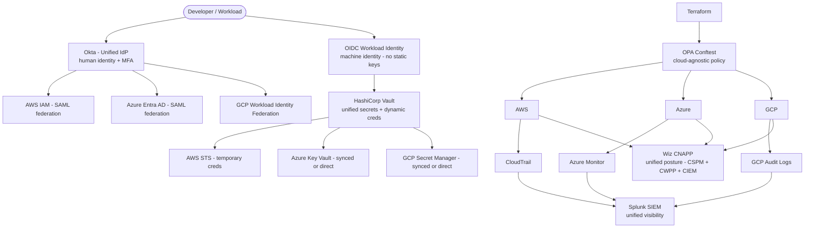

⚡ TL;DR - Multi-cloud security addresses the specific challenges of securing workloads that
span multiple cloud providers (AWS + Azure + GCP, or cloud + on-premises). The core problem:
each cloud provider has a different IAM model, a different security service naming, a different
compliance tool - and the security team must achieve consistent security posture across all of
them without becoming experts in every platform. Five key challenges and their solutions:
(1) Identity silos: AWS IAM roles, Azure Entra AD, GCP Service Accounts - each different.
Solution: federate identity (OIDC workload identity federation, Entra as IdP for AWS).
(2) Visibility gaps: separate logging (CloudTrail, Azure Monitor, GCP Cloud Audit Logs) - no
unified view. Solution: SIEM ingestion of all cloud logs, CSPM (Cloud Security Posture
Management) across all clouds (Wiz, Prisma Cloud). (3) Policy inconsistency: AWS SCPs,
Azure Policy, GCP Organization Policies - all different languages. Solution: OPA/Rego for
cloud-agnostic policy as code, or a CNAPP (Cloud-Native Application Protection Platform).
(4) Data sovereignty: data in EU must stay in EU (GDPR). AWS `eu-west-1` AND Azure
`West Europe` AND GCP `europe-west3` → compliance requires per-cloud region enforcement.
(5) Secret sprawl: each cloud has its own secret store (AWS Secrets Manager, Azure Key Vault,
GCP Secret Manager). Solution: HashiCorp Vault as the centralized secret store with cloud
provider authentication (no cross-cloud secret duplication). The fundamental principle:
don't try to become a security expert in every cloud. Build cloud-agnostic security layers
(unified identity, unified SIEM, unified CSPM, unified secrets) that work across all clouds.

---

| #125 | Category: Security | Difficulty: ★★★★★ |
|:---|:---|:---|
| **Depends on:** | OWASP Top 10, Authentication, Business Logic, Insufficient Logging, CVSS Scoring, CVE + NVD, AWS Security Services, Kubernetes Security, Security Observability + SIEM, Security at Scale, ISO 27001, Chaos Engineering, Privilege Escalation, Zero Trust Introduction, Red/Blue/Purple Team, Zero Trust Enterprise, DevSecOps Pipeline, Security Champions, Enterprise Security Architecture, Secret Rotation, Security Governance, Threat Intelligence, CSIRT Design, Security Metrics, Supply Chain Security, Platform Security Engineering | |
| **Used by:** | Build vs Buy Security, SSDLC, Adversarial Thinking, Trust Boundary Analysis, Assume-Breach, Security as Contract, Threat Modeling | |
| **Related:** | OWASP Top 10, Authentication, Business Logic, Insufficient Logging, CVSS, CVE, AWS Security, Kubernetes Security, Security Observability + SIEM, Security at Scale, ISO 27001, Chaos Engineering, Privilege Escalation, Zero Trust Introduction, Red/Blue/Purple Team, Zero Trust Enterprise, DevSecOps Pipeline, Security Champions, Enterprise Security Architecture, Secret Rotation, Security Governance, Threat Intelligence, CSIRT Design, Security Metrics, Supply Chain Security, Platform Security Engineering, Build vs Buy, SSDLC | |

---

### 🔥 The Problem This Solves

**WHY MULTI-CLOUD MULTIPLIES SECURITY COMPLEXITY:**

```
THE MULTI-CLOUD SECURITY TRAP:

  Company: uses AWS (primary, 70% of workload), Azure (acquired company, 20%),
  GCP (ML/data science team, 10%).
  
  SECURITY TEAM: 6 people. Asked: "are we secure across all three clouds?"
  
  IDENTITY CHAOS:
  - AWS: 1,200 IAM roles. 84 users with direct IAM keys (should be 0).
    340 roles: have admin or wildcard permissions.
  - Azure: Entra AD (100 service principals). 23 have Contributor role on subscriptions.
    Service principal key rotation: last done 18 months ago.
  - GCP: 156 service accounts. 12 have "roles/editor" (overprivileged).
    GCP service account key files: stored in developer laptops (should be keyless).
  
  VISIBILITY GAPS:
  - AWS CloudTrail: enabled (3 of 5 accounts - 2 accounts: CloudTrail disabled).
  - Azure Monitor: enabled (only the 3 subscriptions managed by the central team -
    the acquired company's 8 subscriptions: not sending logs anywhere).
  - GCP Cloud Audit Logs: enabled (all projects).
  - SIEM: only receives AWS CloudTrail from 3 accounts.
    Azure: 8 subscriptions, 0 logs in SIEM.
    GCP: 0 logs in SIEM.
    
  RESULT: the security team has 30% visibility into the actual cloud footprint.
  
  COMPLIANCE:
  - AWS: runs CIS AWS Foundations Benchmark scans (AWS Security Hub). Score: 72%.
  - Azure: no compliance scanning. "We'll get to it."
  - GCP: no compliance scanning.
  
  INCIDENT: Azure acquired-company subscription - attacker uses stolen service principal key
  (18-month-old key, never rotated) to exfiltrate data from Azure SQL.
  
  Detection: 47 days after the incident. Why?
  "Azure security events: not in our SIEM. We had no visibility into that subscription."
  
  COST: $1.8M investigation + recovery + regulatory notification.
  
  POST-INCIDENT ROOT CAUSES:
  1. No centralized SIEM coverage for Azure (8 subscriptions unmonitored).
  2. Service principal keys: never rotated. 18-month-old key still valid.
  3. No CSPM for Azure: misconfiguration went undetected.
  4. No cross-cloud IAM visibility: excessive permissions in Azure unknown.
  
  THE MULTI-CLOUD SECURITY PRINCIPLE VIOLATED:
  "Each additional cloud provider: multiplies attack surface and complexity."
  "If you can't secure one cloud well, you can't secure three clouds at all."
  Multi-cloud requires: UNIFICATION, not repetition. You don't run 3 separate security programs.
  You build one security program that covers all three.
```

---

### 📘 Textbook Definition

**Multi-cloud security:** The practice of applying consistent security controls, visibility,
compliance, and governance across workloads running in two or more cloud providers (AWS, Azure,
GCP) and/or on-premises infrastructure. Multi-cloud security: must address identity federation,
unified logging and visibility, consistent policy enforcement, data sovereignty, and secret management
without requiring the security team to maintain separate expertise in each cloud's specific tools.

**CSPM (Cloud Security Posture Management):** A tool category that continuously monitors cloud
configurations across one or more cloud providers for security misconfigurations and compliance
violations. Examples: Wiz, Prisma Cloud (Palo Alto), Orca Security, AWS Security Hub (AWS-only).
CSPM detects: S3 buckets with public access, security groups open to 0.0.0.0/0, unencrypted
storage volumes, excessive IAM permissions, disabled audit logging. CSPM: the automated compliance
scanner for cloud infrastructure.

**CNAPP (Cloud-Native Application Protection Platform):** A unified platform that combines
CSPM + CWPP (Cloud Workload Protection Platform, for containers/serverless/VMs) + CIEM (Cloud
Infrastructure Entitlement Management) + supply chain security. Wiz, Prisma Cloud, Defender for
Cloud (Azure) are CNAPPs. A CNAPP: provides a single pane of glass for cloud security across
the full stack (infrastructure, workloads, identities, data).

**CIEM (Cloud Infrastructure Entitlement Management):** Visibility and analysis of what permissions
cloud identities (IAM roles, service accounts) actually have and use. CIEM identifies: over-privileged
roles (granted admin but only ever use S3:GetObject), unused service accounts (haven't been used
in 180 days), cross-cloud privilege escalation paths (identity in GCP → assumes role in AWS via OIDC
federation → escalates via AWS IAM).

**Workload Identity Federation (OIDC):** A mechanism that allows cloud workloads to authenticate
to another cloud provider or service using OIDC tokens instead of long-lived credentials.
Example: GitHub Actions workflow → generates OIDC token → exchanges for AWS STS temporary
credentials → accesses AWS resources. No static credentials stored. No credential rotation needed.
The OIDC token: short-lived (minutes). If stolen: minimal blast radius.

**Data Sovereignty:** Legal requirement that data must reside in and be processed in a specific
geographic jurisdiction. GDPR: EU personal data must be processed in the EU (or in countries with
adequacy decisions). Multi-cloud data sovereignty: each cloud provider must have the relevant
region configured AND data replication must be restricted to the compliant region.

---

### ⏱️ Understand It in 30 Seconds

**One line:**
Multi-cloud security's fundamental challenge is maintaining consistent security posture, visibility,
and identity management across cloud providers with fundamentally different security models, solved
by building cloud-agnostic abstraction layers: unified SIEM (cloud-agnostic log aggregation),
unified CSPM (Wiz scans all three clouds), federated identity (OIDC workload identity, Vault for
secrets), and cloud-agnostic policy (OPA/Rego), rather than running three separate security programs.

**One analogy:**
> Multi-cloud security is the multinational legal compliance problem.
>
> A company operating in US + EU + Japan: doesn't need three completely separate legal teams.
> It needs a compliance framework that covers the requirements of all three jurisdictions.
> Some rules are universal (contract law, anti-fraud). Some rules are jurisdiction-specific
> (GDPR in EU, CCPA in California, APPI in Japan).
>
> The effective approach: build a BASE compliance program that satisfies all jurisdictions.
> On top: jurisdiction-specific additions for local requirements.
>
> Multi-cloud security: the same architecture.
> BASE security layer: works across all clouds (unified SIEM, universal policy framework,
> federated identity, centralized secrets management).
> Cloud-specific layer: AWS-specific controls (SCPs), Azure-specific controls (Entra AD
> Conditional Access), GCP-specific controls (VPC Service Controls).
>
> The mistake: running three separate security programs.
> "We have an AWS security team, an Azure security team, and a GCP security team."
> Cost: 3x headcount, 3x tool spend, 3x risk of inconsistency.
>
> The effective model: one security program with cloud-specific adapters.
> Like: one legal team with local counsel in each jurisdiction.
> Not: three completely separate legal departments.

---

### 🔩 First Principles Explanation

**Multi-cloud security architecture layers:**

```
MULTI-CLOUD SECURITY REFERENCE ARCHITECTURE:

  LAYER 1: UNIFIED IDENTITY (prevent credential chaos)

  Problem: 3 clouds, 3 IAM systems, 3 service account models.
  Solution: federated identity center.
  
  For human identity:
    IdP: Azure Entra AD (if Microsoft-centric) or Okta (cloud-neutral).
    AWS: SAML federation to Entra. Human: logs into Okta → AWS SAML federation.
    GCP: OIDC federation to Entra.
    Net: one directory. One MFA. One access review. All clouds.
  
  For machine identity (workloads, CI/CD):
    OIDC workload identity federation: no static credentials anywhere.
    GitHub Actions → OIDC token → AWS STS (assume role via web identity).
    GitHub Actions → OIDC token → GCP Workload Identity Federation.
    GitHub Actions → OIDC token → Azure Workload Identity (via Entra AD).
    Net: zero long-lived machine credentials across all three clouds.
  
  LAYER 2: UNIFIED SECRETS MANAGEMENT

  Problem: AWS Secrets Manager + Azure Key Vault + GCP Secret Manager = secret sprawl.
  Applications: need different secrets per cloud.
  
  Solution: HashiCorp Vault as the centralized secret store.
  Vault: supports AWS IAM, Azure MSI, GCP service account for auth (no cross-cloud creds).
  Application: authenticates to Vault using its cloud-native identity.
    AWS Lambda: uses IAM role → Vault AWS auth → receives secret.
    Azure App Service: uses Managed Identity → Vault Azure auth → receives secret.
    GCP Cloud Run: uses service account → Vault GCP auth → receives secret.
  Net: one secret store. One rotation policy. One audit trail. All clouds.
  
  LAYER 3: UNIFIED VISIBILITY (SIEM + CSPM)
  
  SIEM:
    AWS CloudTrail → log aggregation (S3 → Kinesis → SIEM).
    Azure Monitor → Diagnostic Settings → Event Hub → SIEM.
    GCP Cloud Audit Logs → Cloud Pub/Sub → SIEM.
    All security events: in one SIEM (Splunk, Microsoft Sentinel, or Datadog).
    Cross-cloud correlation: "AWS event + Azure event, same time, same IP → investigation."
    This cross-cloud correlation: impossible if logs stay in separate cloud-specific tools.
    
  CSPM:
    Wiz: connects to AWS + Azure + GCP. Scans all resources. Unified posture score.
    Single dashboard: shows all misconfigurations across all clouds.
    "Azure SQL server: public access enabled. GCP GKE: legacy metadata API enabled.
     AWS S3: public access block not enabled on 3 buckets." All in one view.
    No: "check AWS Security Hub. Then check Azure Defender. Then check GCP SCC."
  
  LAYER 4: UNIFIED POLICY ENFORCEMENT
  
  Cloud-native policy: SCPs (AWS), Azure Policy, GCP Organization Policy.
  These: use different languages, different syntax, different enforcement models.
  
  For critical cross-cloud policies (e.g., "require encryption everywhere"):
  OPA (Open Policy Agent) + Rego: can express cloud-agnostic policies.
  Terraform + Conftest (OPA): enforce policies at infrastructure-as-code plan time.
  "Before any Terraform plan applies to ANY cloud: run Conftest policy check."
  
  Plus: cloud-native policies for cloud-specific requirements.
  AWS SCPs: "deny CloudTrail disable" (AWS-specific control).
  Azure Policy: "require HTTPS for storage accounts" (Azure-specific control).
  GCP Org Policy: "require OS config agent" (GCP-specific control).
  
  LAYER 5: DATA SOVEREIGNTY CONTROLS
  
  Data classification: tag all data with sovereignty requirements.
  "PII" → EU only. "Health data" → HIPAA jurisdiction.
  
  AWS: "DenyResourceCreation for eu-west-1 if data-classification=PII and region != eu-*"
  Azure: DLP policy + storage service endpoint restrictions to EU regions only.
  GCP: VPC Service Controls perimeter (restrict data exfiltration from EU projects).
  
  Cross-cloud data movement: default DENY.
  "PII data in AWS eu-west-1 cannot be replicated to AWS us-east-1 or Azure or GCP."
  Enforced via: S3 bucket policy (no cross-region replication for PII buckets),
  Azure Entra Conditional Access (restrict access to PII resources from non-EU IPs),
  GCP VPC Service Controls (restrict API access to EU projects to EU networks).
```

---

### 🧪 Thought Experiment

**SCENARIO: FinTech acquires a company using Azure (primary company: AWS):**

```
PRE-ACQUISITION SECURITY POSTURE:
  Primary company (AWS):
  - AWS: well-managed. 95% CIS score. Centralized logging in Splunk.
  - IAM: federated via Okta. No long-lived keys. 100% MFA.
  
ACQUIRED COMPANY SECURITY POSTURE:
  - Azure: 8 subscriptions. 23 service principals with Contributor role.
  - Long-lived service principal keys: 14 months old on average.
  - Azure Monitor: enabled but logs not sent to any SIEM.
  - No CSPM running.
  
INTEGRATION ROADMAP (90 days):

  DAY 1-30: STOP THE BLEEDING (high-risk immediate actions)
  
  Task 1: Audit and rotate all Azure service principal keys.
    az ad sp list --all | jq -r '.[] | select(.servicePrincipalType == "Application") | .appId'
    For each: create new credential, rotate, delete old credential.
    Timeline: 2 weeks.
    
  Task 2: Enable Azure Monitor → Sentinel (or Splunk) log forwarding.
    All 8 subscriptions: configure Diagnostic Settings to forward to Event Hub.
    Event Hub → Splunk Azure Event Hub input → Splunk SIEM.
    Timeline: 1 week.
    
  Task 3: Deploy CSPM on Azure.
    Wiz: already licensed for AWS. Add Azure connector.
    Wiz scan: identifies top 10 critical misconfigurations in Azure.
    Begin remediation: by priority.
    Timeline: 1 day to connect, 2 weeks to remediate top findings.
    
  DAY 31-60: IDENTITY FEDERATION
  
  Task 4: Federate Azure Entra AD to Okta.
    Azure AD: add Okta as an external IdP.
    Service principal authentication: migrate from key-based to OIDC workload identity.
    Human access: via Okta SSO (same as AWS access).
    
  Task 5: Migrate service principal keys to OIDC workload identity.
    Workloads running in GitHub Actions → OIDC to Azure (no service principal keys).
    Workloads running in Azure VM → Azure Managed Identity (no service principal keys).
    After migration: service principal keys deleted.
    
  DAY 61-90: POLICY AND COMPLIANCE UNIFICATION
  
  Task 6: Apply Azure Policy to match AWS baseline.
    Deploy Azure Policy initiative: "require HTTPS," "require encryption at rest,"
    "deny public network access on SQL servers," "require Azure Defender for Servers."
    
  Task 7: Import Azure resources into HashiCorp Vault.
    Azure Key Vault secrets: migrate to Vault (or leave in Azure Key Vault + Vault sync).
    
  Task 8: Unify CSPM posture score.
    Wiz: unified posture score for AWS + Azure combined.
    Board reporting: one number for both clouds.

RESULT AT 90 DAYS:
  - Azure service principal keys: eliminated. OIDC workload identity: deployed.
  - Azure logs: in Splunk (same SIEM as AWS).
  - Azure CSPM score: improved from "unknown" to 78% (target: 90% in 6 months).
  - Cross-cloud correlation: enabled.
    "AWS IAM event + Azure AD sign-in event, same time, same IP" → correlation alert.
  - Identity: federated via Okta (one directory, one MFA, both clouds).
```

---

### 🧠 Mental Model / Analogy

> Multi-cloud security is the global IT infrastructure model applied to security.
>
> A global company with 50 offices: doesn't have 50 separate IT teams with 50 separate networks.
> It has ONE IT infrastructure with local presence (branch offices).
> ONE directory (Active Directory/Okta). ONE VPN. ONE helpdesk system. ONE endpoint management.
> Local office: connects to the global infrastructure.
>
> Multi-cloud security: the same principle.
> Not: THREE separate security programs (one per cloud).
> ONE security program with cloud-specific adapters.
>
> The "global IT infrastructure" components and their cloud security equivalents:
>
>   Global directory (Okta/Entra) = Unified cloud identity federation.
>   Global network monitoring (NetFlow/SIEM) = Unified cloud logging (all logs → one SIEM).
>   Global endpoint management (JAMF/Intune) = CSPM (all clouds → one posture view).
>   Global secret management (PAM tool) = HashiCorp Vault (all clouds → one secret store).
>   Global policy framework (GPO/compliance) = OPA/Rego + cloud-native policies.
>
> The organization that treats each cloud as a separate kingdom:
> 3 separate security teams, 3 separate tools, 3 separate policies.
> Coordination: ad hoc and manual. Coverage: inconsistent. Cost: 3x.
>
> The organization that treats multi-cloud like global IT:
> One security program. Cloud-agnostic abstractions. Cloud-specific adapters.
> Coverage: consistent. Cost: 1x. Visibility: unified.
>
> The cloud providers: different kingdoms. Your security program: the empire.
> Don't let the kingdoms set the rules for the empire.

---

### 📶 Gradual Depth - Five Levels

**Level 1 - What it is (anyone can understand):**
Multi-cloud security is the challenge of keeping data and systems secure when they're spread across multiple cloud providers (like Amazon AWS, Microsoft Azure, and Google Cloud) that all have different security systems. The problem: each cloud has its own way of managing who can access what, its own security monitoring tools, and its own compliance requirements. If you run security separately for each cloud, you get gaps (an attacker can hide in the cloud you're watching less carefully). The solution: build security tools and processes that work across all clouds, giving you one unified view instead of three separate ones.

**Level 2 - How to use it (junior developer):**
As a developer in a multi-cloud environment: (1) Don't use cloud-specific credential files for your applications. Use the platform's OIDC workload identity or Vault. "I need to access AWS from this GCP Cloud Run job" → don't create an AWS IAM user and put the key in an env var. Use GCP → Vault → AWS STS workload identity federation. (2) Your secrets: should come from Vault, not from each cloud's native secret store directly. Consistency: if you use Vault's API, your code works the same regardless of which cloud it's deployed to. (3) Terraform: use the platform team's cloud-specific security modules. Don't create AWS S3 buckets or Azure storage accounts directly - use the secure module that already has encryption and access controls configured correctly for both clouds.

**Level 3 - How it works (mid-level engineer):**
OIDC workload identity federation for multi-cloud: a service running in GCP Cloud Run needs to access an AWS S3 bucket. Traditional approach: create AWS IAM user with S3 permissions → generate access key → store in GCP Secret Manager → deploy to Cloud Run. Problems: long-lived credential, rotation required, if GCP Secret Manager is compromised → AWS S3 exposed. Workload identity federation: configure AWS IAM to trust GCP's OIDC provider (`https://accounts.google.com`). Create AWS IAM role with policy: `"Condition": {"StringEquals": {"accounts.google.com:sub": "SERVICE_ACCOUNT_ID"}}`. In GCP Cloud Run: the service account automatically receives a JWT from GCP metadata service. The JWT: presented to AWS STS `AssumeRoleWithWebIdentity`. STS: validates the JWT against GCP's OIDC discovery endpoint. Returns temporary credentials (valid 1 hour). The Cloud Run job: accesses S3 using temporary credentials. No stored credentials. No rotation. If Cloud Run instance is compromised: credentials expire in 1 hour.

**Level 4 - Why it was designed this way (senior/staff):**
The cloud security responsibility model compounds in multi-cloud. In a single cloud: you're responsible for a known set of security responsibilities (the Shared Responsibility Model). AWS is responsible for the cloud's physical infrastructure; you're responsible for IAM, data, network configuration. In multi-cloud: you're responsible for CONSISTENCY between clouds. AWS's security services are not compatible with Azure's. There is no native cross-cloud IAM policy. There is no native cross-cloud audit log correlation. The cloud providers: designed their security systems to be deep within their own ecosystem, not interoperable. This is intentional (vendor lock-in) but creates the multi-cloud security gap. The abstraction layer design (Vault for secrets, OPA for policy, SIEM for logs) solves this by treating cloud-specific services as backends to a cloud-agnostic interface. Vault: doesn't care whether it's backed by AWS Secrets Manager or Azure Key Vault. The application uses Vault's API. The backend: a configuration detail. This is the UNIX philosophy ("everything is a file") applied to cloud security: "everything is a policy/secret/log event, cloud specifics are implementation details."

**Level 5 - Mastery (distinguished engineer):**
The hardest multi-cloud security problem: cross-cloud privilege escalation. An attacker compromises a low-privileged identity in Cloud A. That identity: has permission to assume a role in Cloud B (via OIDC federation or cross-cloud access key). The Cloud B role: has excessive permissions. The attacker: pivots from Cloud A (low privilege) to Cloud B (high privilege). This is invisible to Cloud B's native security tools (the assume-role action: looks legitimate - came from Cloud A's OIDC provider). CIEM (Cloud Infrastructure Entitlement Management) tools like Wiz CIEM or CrowdStrike Fusion: map cross-cloud entitlement graphs. "GCP service account X → can assume AWS role Y → AWS role Y has IAM:* (admin)." The attack path: visualized. The remediation: scope down the AWS role or add conditions restricting which GCP identities can assume it. At the enterprise architect level: the multi-cloud security design must model these cross-cloud blast radius scenarios. "If Cloud A is fully compromised: what is the maximum damage an attacker can do in Cloud B and Cloud C using the cross-cloud trust relationships we've established?" This analysis: should inform the minimal cross-cloud trust model. Generally: cross-cloud access should be READ ONLY or narrowly scoped write access (specific S3 bucket, not the entire AWS account). The principle of least privilege: must be applied to CROSS-CLOUD TRUST, not just within a single cloud's IAM.

---

### ⚙️ How It Works (Mechanism)

```
MULTI-CLOUD SECURITY CONTROL PLANE:

  IDENTITY: Okta/Entra (human) + OIDC (machine) + Vault (secrets)
  VISIBILITY: All cloud logs → SIEM; CSPM (Wiz) → posture
  POLICY: OPA/Rego (code-time) + cloud SCPs/Policies (runtime)
  
  AWS      Azure       GCP
   |         |          |
   |  OIDC   |  OIDC    |  OIDC
   |   ↑     |   ↑      |   ↑
   └───┴─────┴───┴──────┴───┴
              Vault / Okta
              (unified layer)
```



---

### 💻 Code Example

**Multi-cloud OIDC federation and Vault authentication:**

```python
# multi_cloud_vault_auth.py
# Demonstrates cloud-agnostic secret retrieval from HashiCorp Vault.
# Applications: use the same code pattern regardless of which cloud they run on.
# Auth method: determined by the cloud the app is running on.
# No long-lived credentials anywhere.

import os
import boto3
import hvac  # HashiCorp Vault SDK
from typing import Optional

class MultiCloudVaultClient:
    """
    Vault client that auto-detects the cloud environment
    and uses the appropriate authentication method.
    
    Supported:
    - AWS: IAM role authentication (EC2, ECS, Lambda, EKS IRSA)
    - GCP: GCE service account authentication
    - Kubernetes: JWT service account authentication
    
    In all cases: no static credentials. Vault auth uses cloud-native identity.
    """
    
    def __init__(self, vault_addr: str, vault_role: str, vault_mount: str = "secret"):
        self._vault_addr = vault_addr
        self._vault_role = vault_role
        self._mount = vault_mount
        self._client: Optional[hvac.Client] = None
    
    def _get_client(self) -> hvac.Client:
        if self._client and self._client.is_authenticated():
            return self._client
        
        client = hvac.Client(url=self._vault_addr)
        cloud = self._detect_cloud()
        
        if cloud == "aws":
            # AWS IAM auth: uses EC2/Lambda/ECS execution role.
            # No credentials needed - boto3 picks up the IAM role automatically.
            auth_response = client.auth.aws.iam_login(
                role=self._vault_role,
                use_token=True
            )
        elif cloud == "gcp":
            # GCP GCE auth: uses compute instance service account JWT.
            import google.auth
            import google.auth.transport.requests
            credentials, project = google.auth.default()
            request = google.auth.transport.requests.Request()
            credentials.refresh(request)
            
            auth_response = client.auth.gcp.login(
                role=self._vault_role,
                jwt=credentials.token
            )
        elif cloud == "kubernetes":
            # Kubernetes JWT auth: uses the service account token
            # mounted at /var/run/secrets/kubernetes.io/serviceaccount/token
            with open("/var/run/secrets/kubernetes.io/serviceaccount/token") as f:
                jwt = f.read()
            auth_response = client.auth.kubernetes.login(
                role=self._vault_role,
                jwt=jwt
            )
        else:
            raise RuntimeError(f"Unsupported cloud environment: {cloud}")
        
        client.token = auth_response["auth"]["client_token"]
        self._client = client
        return client
    
    def _detect_cloud(self) -> str:
        """
        Detect the current cloud environment via metadata service.
        AWS, GCP, and Kubernetes: each has a distinct metadata endpoint.
        """
        import urllib.request
        
        # Kubernetes: service account token present
        if os.path.exists("/var/run/secrets/kubernetes.io/serviceaccount/token"):
            return "kubernetes"
        
        # AWS: IMDS v2 metadata
        try:
            req = urllib.request.Request(
                "http://169.254.169.254/latest/meta-data/instance-id",
                headers={"X-aws-ec2-metadata-token-ttl-seconds": "21600"}
            )
            urllib.request.urlopen(req, timeout=2)
            return "aws"
        except Exception:
            pass
        
        # GCP: GCE metadata
        try:
            req = urllib.request.Request(
                "http://metadata.google.internal/computeMetadata/v1/instance/id",
                headers={"Metadata-Flavor": "Google"}
            )
            urllib.request.urlopen(req, timeout=2)
            return "gcp"
        except Exception:
            pass
        
        raise RuntimeError("Cannot detect cloud environment")
    
    def get_secret(self, path: str) -> dict:
        """
        Retrieve a secret from Vault.
        Same API regardless of which cloud the application runs on.
        """
        client = self._get_client()
        response = client.secrets.kv.v2.read_secret_version(
            mount_point=self._mount,
            path=path
        )
        return response["data"]["data"]


# CSPM POSTURE SCORE AGGREGATION
# Aggregates CSPM findings across multiple clouds for unified reporting.

def aggregate_cspm_findings(wiz_api_token: str) -> dict:
    """
    Aggregate CSPM posture findings from Wiz across all connected clouds.
    Returns: per-cloud posture scores and top findings.
    
    BAD approach: check AWS Security Hub (AWS-only), then Azure Defender
    (Azure-only), then GCP SCC (GCP-only), then manually aggregate.
    Each: different severity scale, different finding format.
    
    GOOD approach: Wiz API provides unified findings across all clouds.
    Same severity scale. Same finding format. Cross-cloud correlation.
    """
    import requests
    
    headers = {
        "Authorization": f"Bearer {wiz_api_token}",
        "Content-Type": "application/json"
    }
    
    # Wiz GraphQL API: query posture findings across all clouds
    query = """
    {
      issues(
        filterBy: {severity: [CRITICAL, HIGH]}
        first: 100
      ) {
        nodes {
          id
          severity
          status
          entitySnapshot {
            id
            type
            name
            cloudPlatform
            region
          }
          control {
            id
            name
            description
          }
        }
      }
    }
    """
    
    response = requests.post(
        "https://api.wiz.io/graphql",
        headers=headers,
        json={"query": query},
        timeout=30
    )
    response.raise_for_status()
    
    issues = response.json()["data"]["issues"]["nodes"]
    
    # Group by cloud platform
    by_cloud: dict = {}
    for issue in issues:
        platform = issue["entitySnapshot"]["cloudPlatform"]
        if platform not in by_cloud:
            by_cloud[platform] = {"CRITICAL": 0, "HIGH": 0, "findings": []}
        by_cloud[platform][issue["severity"]] += 1
        by_cloud[platform]["findings"].append({
            "resource": issue["entitySnapshot"]["name"],
            "control": issue["control"]["name"],
            "severity": issue["severity"],
            "region": issue["entitySnapshot"]["region"]
        })
    
    return by_cloud
```

---

### ⚖️ Comparison Table

| Security Area | AWS-Only Approach | Multi-Cloud Approach |
|:---|:---|:---|
| **Identity** | AWS IAM native | Okta/Entra federated + OIDC workload identity |
| **Secrets** | AWS Secrets Manager | HashiCorp Vault (Secrets Manager as backend) |
| **Logging** | CloudTrail + Security Hub | All cloud logs → SIEM (Splunk/Sentinel) |
| **Posture (CSPM)** | AWS Security Hub | Wiz / Prisma Cloud (all clouds) |
| **Policy enforcement** | AWS SCPs + Config Rules | OPA/Conftest + cloud-native SCPs/Policies |
| **Data sovereignty** | S3 bucket policy + region SCPs | Cross-cloud tagging + per-cloud data controls |

---

### ⚠️ Common Misconceptions

| Misconception | Reality |
|:---|:---|
| "Multi-cloud means you duplicate all security controls in each cloud." | Duplication is the wrong model. Duplication creates 3x cost, 3x operational burden, and inconsistency between clouds (the controls will inevitably drift over time - they're separate). The right model is abstraction: ONE control with cloud-specific adapters. Vault for secrets: one control, multiple cloud backends. SIEM for logging: one control, multiple cloud log sources. CSPM for posture: one control, multiple cloud APIs. OPA for policy: one control, multiple cloud enforcement points. The goal: not to make each cloud equally secure in isolation, but to apply consistent security across all clouds through unified tooling. This is 1x cost, 1x operational burden, and guaranteed consistency. |
| "Cloud providers' native security tools are good enough for multi-cloud." | AWS Security Hub: AWS-only. Azure Defender for Cloud: Azure-only. GCP Security Command Center: GCP-only. Each: excellent within its own cloud. None: provides cross-cloud visibility or cross-cloud correlation. A real attack scenario: attacker uses compromised credentials in Azure to enumerate AWS resources via a cross-cloud trust relationship. In AWS Security Hub: "an IAM role was assumed via web identity." Looks legitimate (it came from Azure's OIDC). No alert. In Azure Defender: "service principal used to enumerate IAM." Looks like normal activity. No alert. In a unified SIEM with cross-cloud correlation: "Azure AD sign-in for this service principal at 2 AM from an unusual IP → AWS role assumption from the same IP 30 seconds later → AWS resource enumeration." Combined: suspicious. Alert. Cross-cloud correlation: requires a unified security layer that no single cloud provider offers. This is the core value of multi-cloud security tooling. |

---

### 🚨 Failure Modes & Diagnosis

**Multi-cloud security failure patterns:**

```
FAILURE 1: SHADOW CLOUD (UNDISCOVERED CLOUD USAGE)

  Symptom: security team maintains AWS + Azure + GCP security.
  Incident: unauthorized access to data in Oracle Cloud Infrastructure (OCI).
  
  Root cause: a team (engineering, data science) started using OCI for a specific tool
  (Oracle Autonomous DB) without going through the procurement/security review process.
  Security team: was unaware OCI was in use.
  
  The "shadow cloud" problem: as organizations grow, teams acquire cloud accounts
  directly (credit cards, trial accounts, startup credits). Security: not involved.
  
  Detection:
  - Finance/FinOps: review all cloud vendor invoices. Unrecognized vendor: investigate.
  - CASB (Cloud Access Security Broker): detect corporate identity (SSO) signing into
    cloud providers that aren't in the approved list.
  - Network: unusual outbound connections to cloud provider IP ranges.
  
  Prevention:
  - Cloud governance: all cloud provider accounts must be registered with IT/security.
  - Corporate card: blocked for direct cloud vendor charges (must go through procurement).
  - CASB: alerts on corporate identity accessing non-approved cloud SaaS.

FAILURE 2: IAM PERMISSION EXPLOSION ACROSS CLOUDS

  Symptom: CIEM audit finds: 1,400 IAM identities across 3 clouds.
  87% have permissions they've never used.
  Cross-cloud escalation paths: 12 identified (low-priv GCP → admin AWS).
  
  Root cause: 
  - Each cloud: grew independently. Permissions: granted generously "to avoid issues."
  - Cross-cloud trust: established for CI/CD convenience. Never scope-reviewed.
  - No IAM access reviews: were performed cross-cloud.
  
  Remediation:
  1. Revoke unused permissions (CIEM "last accessed" data + 90-day threshold).
  2. Eliminate cross-cloud escalation paths (scope IAM role trust policies).
  3. Quarterly CIEM review: all identities with cross-cloud access.

MULTI-CLOUD SECURITY METRICS:

  - CSPM posture score per cloud: target > 85% for each. Measure monthly.
  - Unified log coverage: % of cloud accounts/subscriptions/projects sending logs to SIEM.
    Target: 100%. Any gap: blind spot.
  - Long-lived credential count: target: 0 service account keys, 0 IAM user access keys.
  - Cross-cloud escalation paths: number identified by CIEM. Target: 0.
  - Cloud account inventory coverage: % of cloud accounts tracked in the governance system.
    Target: 100%. Any untracked account: shadow cloud risk.
```

---

### 🔗 Related Keywords

**Prerequisites:**
- `AWS Security Services` (SEC-084) - understanding AWS-native security is prerequisite
- `Platform Security Engineering` (SEC-124) - platform security principles applied across clouds

**Builds on this:**
- `Build vs Buy Security` (SEC-126) - multi-cloud CSPM and Vault: make-vs-buy decisions

---

### 📌 Quick Reference Card

```
┌──────────────────────────────────────────────────────────┐
│ 5 CHALLENGES  │ Identity silos → OIDC federation + Vault │
│               │ Visibility gaps → unified SIEM + CSPM    │
│               │ Policy inconsistency → OPA + cloud-native│
│               │ Data sovereignty → regional data controls │
│               │ Secret sprawl → HashiCorp Vault           │
├───────────────┼──────────────────────────────────────────┤
│ KEY TOOLS     │ Wiz / Prisma: CSPM across all clouds     │
│               │ HashiCorp Vault: unified secrets          │
│               │ Okta / Entra: federated human identity    │
│               │ OIDC WIF: federated machine identity      │
│               │ OPA/Conftest: cloud-agnostic policy       │
├───────────────┼──────────────────────────────────────────┤
│ AVOID         │ 3 separate security programs (1x per cloud│
│               │ Long-lived service account keys           │
│               │ Cloud-specific secret stores only         │
│               │ Shadow cloud accounts                     │
├───────────────┼──────────────────────────────────────────┤
│ METRICS       │ CSPM score: > 85% per cloud              │
│               │ Log coverage: 100% of accounts            │
│               │ Long-lived credentials: 0                 │
│               │ Cross-cloud escalation paths: 0           │
└──────────────────────────────────────────────────────────┘
```

---

### 💎 Transferable Wisdom

**Reusable Engineering Principle:**
"Abstractions that hide implementation details create portability. Security abstractions
that hide cloud-specific details create consistent security posture."
The HashiCorp Vault design: not specific to security. It's the same principle as JDBC (Java
Database Connectivity). JDBC abstracts the database (MySQL, PostgreSQL, Oracle) behind a
common API. Your Java code: uses JDBC, not MySQL-specific APIs. Switch the database:
change the JDBC driver, not the application code.
Vault abstracts the secret backend (AWS Secrets Manager, Azure Key Vault, GCP Secret Manager)
behind a common API. Your application: uses the Vault API. Switch or add cloud providers:
change the Vault backend configuration, not the application code.
This "abstraction as portability" pattern: applies broadly:
- Kubernetes: abstracts the compute infrastructure (AWS EKS, Azure AKS, GCP GKE, on-premises).
  Your workloads: use Kubernetes APIs. The infrastructure: an implementation detail.
- OpenTelemetry: abstracts observability backends (Datadog, Grafana, Honeycomb, New Relic).
  Your instrumentation: uses OTel APIs. The backend: an implementation detail.
- OPA/Rego: abstracts policy enforcement targets (Kubernetes admission, Terraform, API gateways).
  Your policies: expressed in Rego. The enforcement point: an implementation detail.
The pattern: consistent. Use abstraction layers to prevent vendor-specific lock-in.
In multi-cloud security: the abstraction layers are the architecture.
Not the specific cloud services (which change) but the abstraction layer (which stays stable).

---

### 💡 The Surprising Truth

The most significant multi-cloud security risk is not a sophisticated attacker exploiting
cross-cloud trust relationships. It is a misconfigured resource that nobody knows exists.

Multi-cloud sprawl: organizations running 3 clouds accumulate resources rapidly.
AWS: 5 accounts (prod, staging, dev, security, shared). Azure: 15 subscriptions (historic from M&A).
GCP: 40 projects (ML teams create projects easily, old projects never deleted).

Total: 60 separate cloud accounts/subscriptions/projects.
Security team: monitors 20 of them (the ones they know about and set up logging for).
The other 40: monitored by nobody.

The attacker: doesn't need to compromise a well-monitored production account.
They look for the 2-year-old GCP project that an ML intern created, forgot about, and left with
a service account key in a public GitHub repository. That project: still has IAM permissions
to a shared VPC that connects to production.

Cloud asset inventory: the foundational multi-cloud security control that is most often skipped.
"We don't know what we have, so we can't secure it."
CSPM is only useful for the accounts/subscriptions/projects you've connected to it.
The accounts/subscriptions/projects you haven't connected: invisible.

The first multi-cloud security question: not "which CSPM tool should we use?"
The first question: "what cloud accounts do we have? All of them. Including the ones we forgot about."

Cloud organization structure: the structural fix.
AWS Organizations, Azure Management Groups, GCP Resource Hierarchy:
these structures ensure ALL accounts/subscriptions/projects are parented in a single hierarchy.
Every new account/subscription/project: automatically falls under the organization.
CSPM connected to the organization level: automatically discovers all new resources.
No manual connection required.

If your cloud organization structure is enforced: shadow cloud accounts within those providers
are impossible (a standalone AWS account created with a corporate email: goes into the organization
automatically or is blocked). If your cloud organization structure has gaps: every team that creates
their own account becomes a potential blind spot.
The multi-cloud security foundation: enforce cloud organization membership BEFORE deploying any
security tooling. Without the foundation: the tooling monitors a fraction of the real attack surface.

---

### ✅ Mastery Checklist

**You've mastered this when you can:**
1. **NAME** the five multi-cloud security challenges and their solutions: identity silos (OIDC
   federation), visibility gaps (unified SIEM + CSPM), policy inconsistency (OPA + cloud-native),
   data sovereignty (regional controls + data classification), secret sprawl (HashiCorp Vault).
2. **EXPLAIN** OIDC workload identity federation: how a GCP workload gets temporary AWS credentials
   without storing a static AWS IAM key. OIDC token → AWS STS AssumeRoleWithWebIdentity → temporary
   credentials valid 1 hour.
3. **DISTINGUISH** CSPM, CWPP, and CIEM: CSPM = cloud infrastructure configuration posture (S3
   bucket public? Security group open?). CWPP = workload runtime protection (container threats,
   malware, vulnerability scanning). CIEM = identity entitlement analysis (over-privileged roles,
   unused permissions, cross-cloud escalation paths).
4. **DESCRIBE** the shadow cloud problem: teams create cloud accounts outside IT governance.
   Security team: unaware. Solution: enforce cloud organization membership, CASB for SSO-based
   cloud access detection, FinOps review of all cloud vendor invoices.
5. **EXPLAIN** why cloud-native security tools are insufficient for multi-cloud: each tool is
   cloud-specific. Cross-cloud attack correlation requires a unified security layer (SIEM, CSPM)
   that spans all clouds. No single cloud provider offers this for competitors' clouds.

---

### 🎯 Interview Deep-Dive

**Q: Your organization runs workloads on AWS and is acquiring a company that runs on Azure.
What are the top 3 security risks from the acquisition and how do you address them?**

*Why they ask:* Tests multi-cloud security knowledge and ability to prioritize in a real-world scenario.
Common in security architecture, cloud security engineering, and senior security roles.

*Strong answer covers:*
- Risk 1: Identity and access sprawl. "The acquired company has 23 service principals with
  Contributor-level access in Azure. These are immediately a high-risk finding."
  Assessment: audit all service principals - when were credentials last rotated? Are any keys
  stored in code repos or developer laptops? Any that have been unused > 90 days: disable immediately.
  Action: rotate all keys within 30 days, migrate to OIDC workload identity within 90 days,
  federate Azure Entra AD to our Okta (one identity system). Until federation is complete:
  treat the acquired company's Azure subscriptions as untrusted and monitor heavily.
- Risk 2: Visibility gap. "We have zero visibility into the acquired company's Azure subscriptions."
  This is the SolarWinds-scale risk: we have attackers that may already be in those subscriptions,
  and we can't detect them because no logs are in our SIEM.
  Action: Azure Monitor → Splunk log forwarding for ALL subscriptions, day 1.
  Deploy Wiz CNAPP: add Azure subscriptions to our existing CSPM.
  This takes 1 week for the log forwarding, 1 day for CSPM.
  First CSPM scan: will surface the most critical misconfigurations.
- Risk 3: Data classification and sovereignty. "The acquired company may process EU personal data
  in Azure. We need to verify this data doesn't get replicated to our AWS us-east-1 environment
  during integration."
  Assessment: data mapping audit with the acquired company's data team.
  "What data is in Azure SQL, Azure Blob? Is any of it EU personal data subject to GDPR?"
  Action: tag all data stores with classification (PII, PHI, internal). Establish data residency
  policies before any integration begins. If EU PII is present: it stays in Azure EU regions.
  No cross-cloud replication until sovereignty requirements are documented and enforced.
- Bonus risk I'd mention: "The acquired company may have a different security posture overall.
  Before completing the acquisition: commission a security assessment. If there's a breach in the
  acquired company post-acquisition: it's our breach too. The M&A security due diligence:
  should happen before the acquisition closes, not after."