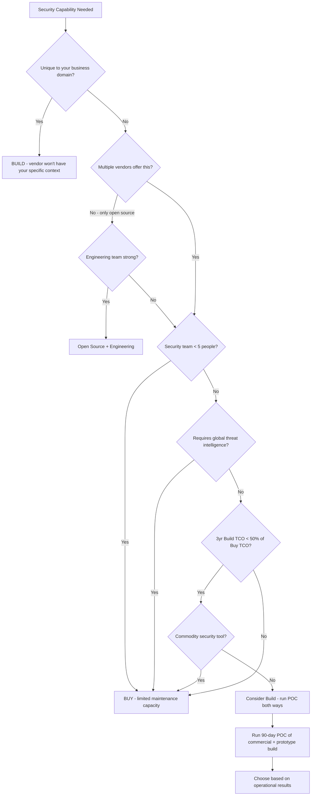

⚡ TL;DR - The build vs. buy decision for security capabilities is one of the most consequential
decisions a security leader makes. Buy almost always wins for commodity security tooling (SIEM,
EDR, CSPM, WAF, vulnerability scanners) - the vendor has 50+ engineers working on the product,
threat intelligence that no single company can match, and a customer base providing signal from
millions of endpoints. Build wins only for differentiated security capabilities that are specific
to your business domain, where no vendor product fits, or where the security capability IS your
product (you're a security company). The decision framework: (1) Is this a commodity capability?
(SIEM, EDR, CSPM, MFA, WAF) → Buy. You can't build Splunk or CrowdStrike with 3 engineers.
(2) Does the vendor have access to threat intelligence you can't replicate? (Threat feeds,
malware analysis at scale, red team research) → Buy. (3) Is this specific to your business
domain, your internal systems, your threat model in a way that no vendor addresses? → Consider
build. (4) Is your security team small relative to the capability needed? → Buy. You're not
going to build and maintain a SIEM with a 4-person security team. (5) Will you be building
against a moving threat landscape that requires constant product updates? → Buy (vendor has
dedicated product team). The TCO (Total Cost of Ownership) reality: "building your own SIEM"
frequently costs $500K-$2M in engineering time before reaching feature parity with a $200K
commercial SIEM - and then requires ongoing maintenance. The hidden build cost: integration,
alerting, maintenance, debugging, training, and keeping up with new attack techniques.

---

| #126 | Category: Security | Difficulty: ★★★★ |
|:---|:---|:---|
| **Depends on:** | OWASP Top 10, Authentication, Business Logic, Insufficient Logging, CVSS Scoring, CVE + NVD, AWS Security Services, Kubernetes Security, Security Observability + SIEM, Security at Scale, ISO 27001, Chaos Engineering, Privilege Escalation, Zero Trust Introduction, Red/Blue/Purple Team, Zero Trust Enterprise, DevSecOps Pipeline, Security Champions, Enterprise Security Architecture, Secret Rotation, Security Governance, Threat Intelligence, CSIRT Design, Security Metrics, Supply Chain Security, Platform Security Engineering, Multi-Cloud Security | |
| **Used by:** | SSDLC, Adversarial Thinking, Trust Boundary Analysis, Assume-Breach, Security as Contract, Threat Modeling | |
| **Related:** | OWASP Top 10, Authentication, Business Logic, Insufficient Logging, CVSS, CVE, AWS Security, Kubernetes Security, Security Observability + SIEM, Security at Scale, ISO 27001, Chaos Engineering, Privilege Escalation, Zero Trust Introduction, Red/Blue/Purple Team, Zero Trust Enterprise, DevSecOps Pipeline, Security Champions, Enterprise Security Architecture, Secret Rotation, Security Governance, Threat Intelligence, CSIRT Design, Security Metrics, Supply Chain Security, Platform Security Engineering, Multi-Cloud Security, SSDLC | |

---

### 🔥 The Problem This Solves

**WHY BAD BUILD-VS-BUY DECISIONS DESTROY SECURITY PROGRAMS:**

```
FAILURE 1: BUILDING WHAT SHOULD BE BOUGHT

  Company: 200-person SaaS startup. 3-person security team.
  
  Decision: "we'll build our own SIEM. Commercial SIEM is too expensive.
  We'll use ELK (Elasticsearch/Logstash/Kibana) and write our own detection rules."
  
  Year 1:
  - ELK stack deployed: 3 months of engineering time.
  - Basic log ingestion: AWS CloudTrail, VPC Flow Logs.
  - Detection rules: 12 (written by security team).
  - Splunk equivalent: 500+ out-of-the-box rules, ML-based anomaly detection, threat intelligence feeds.
    
  Year 2:
  - ELK: version upgrades. Breaking changes. 2 weeks of engineering time.
  - Alert noise: 40% false positive rate (homegrown rules: not tuned by SIEM vendor experts).
  - SOC analyst: burned out triaging false positives.
  - Detection gaps: cloud-specific attack techniques (e.g., IAM role chaining) → no detection rule.
    (Splunk: added detection for this technique in a product update. ELK: still waiting for someone
     to write the rule.)
  
  Security incident:
  - Attacker: exfiltrates data via EC2 instance role (IAM role chaining technique).
  - SIEM: no detection rule for this technique.
  - Detection: 3 weeks later. Via a different tool.
  
  Post-incident cost:
  - Investigation: $180K.
  - Customer notification: $30K.
  - Regulatory fine: $90K.
  Total: $300K.
  
  SIEM TCO comparison:
  - ELK self-build: 18 months of 1 engineer (40% time) = ~$120K + ongoing maintenance.
  - Commercial SIEM (Splunk): $80K/year. Includes: 500+ detection rules, ML anomaly detection,
    threat intelligence integration, 40+ platform integrations, 24/7 vendor support.
  
  "We saved $80K/year on Splunk. We lost $300K in one incident because our homegrown SIEM
  didn't have the detection rule."
  
  The math: commercial SIEM was the right answer. By a large margin.

FAILURE 2: BUYING WHAT SHOULD BE BUILT (WRONG CASE)

  Company: payments processor. PCI DSS compliance required.
  Decision: buy a commercial transaction fraud detection platform ($400K/year).
  
  Problem: the vendor's model is trained on industry-wide data.
  Their anomaly detection: flags generic patterns (unusual transaction volume, unusual geolocation).
  
  The payments company's transactions:
  - Unique business pattern: bulk B2B payments on the 15th and last business day of each month.
    (Payroll processing). These are 10x normal volume.
  - The commercial vendor: has never seen this pattern. Flags it as fraud. Every month.
  - False positive rate: 35% on payroll days.
  - Operations team: manually approves $15M in payroll transactions every payroll cycle.
    2 engineers, 4 hours each = 16 person-hours per payroll cycle = $960/cycle = $23K/year.
    
  The right decision:
  - The fraud detection: specific to THIS company's transaction patterns.
  - No vendor can model their specific payroll patterns without extensive customization.
  - Better approach: buy the commodity layer (rules-based fraud detection), build the
    business-specific anomaly detection (train on their own transaction history, own payroll pattern).
    Cost: $150K one-time engineering + $100K/year ops vs. $400K/year commercial + $23K/year false-positive ops.
  
  The rule: when your business pattern is unique enough that commercial tools have high false positive
  rates: you need a custom model trained on your data. This is the case for build.
```

---

### 📘 Textbook Definition

**Build vs. Buy Security Decision:** The strategic choice between developing security capabilities
in-house (engineering effort, ongoing maintenance) and purchasing commercial solutions (subscription
cost, vendor dependency). Security tools exist on a spectrum from fully open-source (Suricata, OPA,
Falco) to commercial (Crowdstrike, Splunk, Wiz) to fully custom (internal-only tools for unique
business domains). The decision: based on capability uniqueness, cost comparison, team size, threat
model specificity, and vendor lock-in risk.

**Total Cost of Ownership (TCO):** The complete cost of a security capability over its lifetime.
For bought tools: license + integration engineering + training + ongoing tuning + vendor support.
For built tools: engineering (initial development) + infrastructure + maintenance + security of
the tool itself (the tool can be a vulnerability if not maintained) + training + recruiting.
The common mistake: comparing ONLY license cost (buy) vs. ONLY development cost (build). The
correct comparison: license + integration + ongoing ops (buy) vs. development + maintenance + infra +
recruiting (build) over 3-5 years.

**Vendor Evaluation Criteria for Security Tools:**
- Coverage: does it cover the threat scenarios relevant to our environment?
- Integration: does it integrate with our SIEM, SOAR, ticketing, identity systems?
- False positive rate: what is the ratio of true positives to total alerts?
- Threat intelligence: does the vendor update detection based on new threat research?
- Compliance mapping: does it provide evidence for our compliance requirements?
- Operational overhead: how much engineering/analyst time to operate it per week?
- Vendor risk: what is the vendor's security posture? (You're giving a vendor access to your
  security data. If they're breached, you're breached.)

**Open Source Security Tools:** Fully open-source security tools (OPA, Falco, Trivy, Suricata,
OSSEC, TheHive, Velociraptor) can provide significant value at zero license cost. Trade-off:
they require engineering investment to deploy, configure, integrate, and maintain. Support:
community-based, not contractual. For organizations with strong engineering capability: open
source often provides the best TCO for specific tool categories (container security, policy as code,
network IDS). For organizations with limited security engineering: commercial tools with managed
support are typically more cost-effective despite higher license cost.

---

### ⏱️ Understand It in 30 Seconds

**One line:**
Buy commodity security capabilities (SIEM, EDR, CSPM, WAF) where vendors have multi-year
head starts, deep threat intelligence, and 50+ engineers improving the product - and the cost
of building to parity far exceeds the license fee. Build only for business-domain-specific
security capabilities where no vendor addresses your specific use case, or where the security
capability IS your competitive product.

**One analogy:**
> Build vs. buy in security is the restaurant vs. cooking analogy.
>
> You need to eat dinner. Options: (1) Cook from scratch. (2) Order from a restaurant.
>
> When to cook: you have a specific dietary requirement no restaurant nearby handles.
>  Or: cooking is your hobby and you're actually better at it than the restaurants.
>  Or: you're cooking for 200 people (scale changes the economics).
>
> When to go to the restaurant: the restaurant has professional chefs with years of training.
>  They have equipment you don't have. They get ingredients in bulk (cheaper).
>  Your cooking would be worse AND more expensive than the restaurant.
>  Going to the restaurant: lets you spend your time on something you're better at.
>
> Security tool build vs. buy: the same reasoning.
> CrowdStrike: 3,000 engineers, threat intelligence from 1 billion endpoints globally,
>  red team researchers discovering 0-days, 24/7 support infrastructure.
> Building your own EDR: 3 security engineers, access to your own endpoints,
>  no threat intelligence feed, no professional support.
> The restaurant analogy: go to CrowdStrike. Your engineers: do security work only they can do
>  (internal tools, business-domain security, threat modeling YOUR systems).
>
> When do you cook? When you're a Michelin-star restaurant (you ARE a security company).
>  When the restaurant doesn't serve your specific dietary need.
>  When you need to feed 200,000 people (scale changes economics again - enterprise license vs. build).

---

### 🔩 First Principles Explanation

**The build vs. buy decision framework:**

```
TIER 1: ALWAYS BUY (commodity capabilities, vendor head-start too large)

  SIEM (Security Information and Event Management):
  - Splunk, Microsoft Sentinel, Datadog SIEM.
  - Vendor advantage: 500+ out-of-box detection rules, ML anomaly detection,
    threat intelligence integration, 40+ native integrations.
  - Build cost to parity: $500K+ engineering time + $200K/year ops.
  - Commercial cost: $50K-$200K/year depending on data volume.
  - Decision: BUY. The vendor head-start is insurmountable with a typical security team.
  
  EDR (Endpoint Detection and Response):
  - CrowdStrike Falcon, SentinelOne, Microsoft Defender for Endpoint.
  - Vendor advantage: threat intelligence from hundreds of millions of endpoints,
    behavioral AI models trained on petabytes of endpoint data, 0-day detection research.
  - Build cost: impossible. This requires millions of endpoints for threat intelligence.
  - Decision: BUY. No company except a tier-1 cloud provider can build this.
  
  WAF (Web Application Firewall):
  - AWS WAF, Cloudflare, Imperva.
  - Vendor advantage: rule updates from global threat intelligence (Cloudflare sees 20%
    of global web traffic), managed rule sets updated within hours of new attack disclosure.
  - Decision: BUY. Use vendor WAF + customize rules for application-specific patterns.
  
  CSPM (Cloud Security Posture Management):
  - Wiz, Prisma Cloud, Orca.
  - Vendor advantage: coverage of AWS + Azure + GCP + hundreds of resource types,
    continuously updated for new cloud service security requirements.
  - Decision: BUY.
  
  Identity/MFA:
  - Okta, Azure Entra AD, Ping Identity.
  - Decision: BUY. Do not build your own authentication system. Ever.

TIER 2: CONSIDER CAREFULLY (open source + commercial, depends on team)

  Container/Kubernetes Security:
  - Options: Falco (open source), Aqua Security (commercial), Twistlock/Prisma Cloud.
  - Falco: excellent open source. Requires engineering time to write/maintain detection rules.
  - Commercial: pre-built rules, threat intelligence, support.
  - Decision: if engineering team is strong → Falco. If limited security engineering → commercial.
  
  Network IDS/IPS:
  - Suricata (open source), Snort (open source), Darktrace (commercial).
  - Decision: commodity network IDS (rules-based) → Suricata (free, strong community rules).
    AI behavioral network detection → Darktrace (commercial, unique capability).
  
  Threat Intelligence Platform:
  - OpenCTI, MISP (open source), Anomali, ThreatConnect (commercial).
  - Decision: small team / tight budget → OpenCTI (open source, community feeds).
    Large team, sector-specific intel → commercial with ISAC integration.

TIER 3: BUILD (business-domain specific, no vendor alternative)

  Fraud detection for your specific business model:
  - No vendor has your transaction patterns. Train on your data.
  
  Internal access request automation:
  - Your internal RBAC model + business rules + approval workflows: specific to your org.
  - No vendor knows your team structure, approval chains, and access model.
  
  Business logic abuse detection:
  - Detecting abuse of YOUR API's specific business logic (promo code stacking,
    account sharing, inventory manipulation): requires knowledge of YOUR business rules.
  - Build: a rules engine + anomaly model trained on your traffic patterns.
  
  Security tooling that IS your product (security vendor):
  - You're building a security product. Build it.

DECISION MATRIX:

  Is the capability unique to your business domain? YES → Build.
  Do multiple vendors offer this capability? YES → shortlist vendors, evaluate TCO.
  Is the vendor's product updated for new threats automatically? YES → strong Buy signal.
  Is your security team < 5 people? YES → strong Buy signal (limited maintenance capacity).
  Is the TCO of build < 0.5x of buy over 3 years? YES → consider Build.
  Does the tool require threat intelligence you can't generate yourself? YES → Buy.
  
POC (PROOF OF CONCEPT) EVALUATION CRITERIA:

  For any Buy decision > $50K/year: run a 30-day POC.
  
  Evaluate:
  1. False positive rate: run the tool for 30 days. What % of alerts are actionable?
     Target: < 20% false positives. > 30% → unacceptable alert noise.
  2. Integration: does it integrate with your SIEM? Your SOAR? Your ticketing?
     A security tool that doesn't integrate: creates manual work and data silos.
  3. Coverage of your specific environment: does it detect the threats relevant to YOUR stack?
     (AWS-heavy? Container-heavy? Windows-heavy?) Evaluate against real attack scenarios.
  4. Operational overhead: how many hours/week to operate it properly?
     "It takes 2 hours/day to tune" → that's 40-50 hours/month of analyst time = costly.
  5. Vendor security: can the vendor demonstrate their own security posture?
     "You're about to give this vendor your SIEM data / endpoint data / cloud logs."
     Vendor SOC 2 Type II report: minimum requirement. Penetration test results: ask for them.
```

---

### 🧪 Thought Experiment

**SCENARIO: Security tooling evaluation for a 500-person FinTech company:**

```
CONTEXT:
  Security team: 6 engineers (2 SecOps, 2 platform security, 1 AppSec, 1 threat intel).
  Budget: $800K/year for security tooling.
  Current state: AWS Security Hub (free), Splunk (basic, $80K/year), no EDR, no CSPM.
  
  Security incidents last year:
  - 1 compromised developer laptop → credential theft → AWS console access.
    (No EDR: incident detected by CloudTrail anomaly, 18 hours MTTD.)
  - 1 Log4Shell exploitation: Splunk had no detection rule, detected by pen test 3 weeks later.

TOOL EVALUATION DECISION 1: EDR

  Options:
  a. Build: custom endpoint monitoring agent.
  b. Open source: OSSEC (host-based IDS, endpoint detection).
  c. Commercial: CrowdStrike Falcon (EDR + threat intelligence), $200K/year for 500 endpoints.
  
  Evaluation:
  - Build: requires 2 engineers full-time for 18+ months to reach basic EDR capability.
    No threat intelligence. No behavioral AI. Cost: ~$400K engineering time.
  - OSSEC: open source, good for specific use cases. Not a full EDR.
    No threat intelligence. No behavioral AI. Alert quality: limited.
  - CrowdStrike: threat intelligence from 1B+ endpoints. Behavioral AI detects novel malware.
    The compromised developer laptop incident: CrowdStrike would have detected malware in < 5 min.
    MTTD: 18 hours → 5 minutes with CrowdStrike.
    Annual cost: $200K.
    
  Decision: CrowdStrike. The threat intelligence advantage is non-replicable.
  ROI: prevented credential theft incidents (at $300K estimated cost each) pay for 1.5 years of CrowdStrike.

TOOL EVALUATION DECISION 2: CSPM

  Options:
  a. AWS Security Hub (already have, free): AWS-only, good CIS benchmark coverage.
  b. Open source: Scout Suite (multi-cloud, manual scans, no continuous monitoring).
  c. Commercial: Wiz ($150K/year): AWS + Azure + GCP, continuous monitoring, CIEM.
  
  Evaluation:
  - AWS Security Hub: free but AWS-only. Future: multi-cloud. Limitation: vendor lock-in.
  - Scout Suite: open source, good for point-in-time audits. Not continuous.
    Requires manual effort each scan. No CIEM.
  - Wiz: multi-cloud continuous monitoring, CIEM (finds over-privileged roles),
    container security, agentless (no agent deployment required).
    Coverage: AWS (now) + Azure/GCP (if/when acquired).
    
  Decision: Wiz. Future-proofs for multi-cloud. Agentless means zero engineering deployment effort.
  The CIEM alone: identifies over-privileged AWS roles (a finding from the first scan: 42 roles
  have admin permissions. 38 of them: never used in 90 days. Immediate risk reduction by scoping).

TOOL EVALUATION DECISION 3: FRAUD DETECTION

  Options:
  a. Commercial fraud detection platform: $400K/year, pre-built ML models.
  b. Build: custom anomaly detection on transaction data.
  
  Evaluation:
  - Commercial: pre-built models for generic fraud patterns. As shown in the thought experiment:
    high false positive rate for this company's specific payroll patterns.
  - Build: $120K one-time engineering (3 months, 1 ML engineer + 1 platform engineer).
    Train on 2 years of their specific transaction history. False positive rate: 5% (vs. 35%).
    Ongoing: $40K/year ops.
    
  Decision: Build. This is a business-domain-specific problem.
  The company's transaction patterns are unique: commercial tool doesn't model them.
  TCO 3-year: Build ($120K + $120K ops) = $240K vs. Buy ($1.2M + $69K false-positive ops) = $1.27M.

TOTAL TOOLING BUDGET ALLOCATION:
  CrowdStrike EDR: $200K/year
  Wiz CSPM/CNAPP: $150K/year
  Splunk SIEM (upgraded): $120K/year
  FS-ISAC + Recorded Future: $30K/year
  Fraud detection (build amortized): $40K/year + $40K/year one-time
  Misc (Okta, email security, WAF): $170K/year
  
  Total: $750K/year (within $800K budget).
  Remaining $50K: SOC 2 audit, penetration test, security training.
```

---

### 🧠 Mental Model / Analogy

> The build vs. buy decision is the "comparative advantage" principle from economics.
>
> David Ricardo's comparative advantage: even if one country is better at producing BOTH
> wheat and cloth, both countries benefit if each specializes in what they're RELATIVELY
> better at and trades with each other.
>
> Applied to security tooling:
> CrowdStrike: absolutely better at EDR than your 3-person security team.
> Your 3-person security team: absolutely better at understanding your business-specific
> fraud patterns than CrowdStrike.
>
> The efficient allocation:
> CrowdStrike: does EDR (absolute and relative advantage).
> Your team: does business-domain fraud detection (your relative advantage - you have the data).
> Both: trade (you pay CrowdStrike; CrowdStrike provides threat intelligence you couldn't build).
>
> The mistake: trying to do BOTH.
> "We'll build our own EDR AND our own fraud detection."
> Result: mediocre EDR (far behind CrowdStrike) + mediocre fraud detection (no business-domain data).
> Neither is done well because the team's time is split.
>
> Comparative advantage in security tooling:
> Buy what vendors have absolute AND relative advantage in (commodity security tools).
> Build what you have a unique relative advantage in (your business domain, your data, your scale).
> Trade (license fees) to get the commodity capabilities.
> Focus your engineering effort where you have an unfair advantage.
>
> The security team's time: their scarcest resource.
> Every hour on building/maintaining a SIEM: one less hour on the unique security work
> that only your team can do.
> Comparative advantage: directs that time to the highest-value, uniquely-yours work.

---

### 📶 Gradual Depth - Five Levels

**Level 1 - What it is (anyone can understand):**
The build vs. buy security decision is about whether to create your own security tools or purchase commercial products. The key question: can you build it better than the specialists who do this full-time? For most security tools (like endpoint protection or SIEM), the commercial vendors have hundreds of engineers, global threat intelligence from millions of customers, and years of development. Building a comparable tool with a small team: takes far more time and money than buying, and the result is usually inferior. Build only when the security need is so specific to your business that no vendor tool can address it.

**Level 2 - How to use it (junior developer):**
As a developer, you encounter build vs. buy in security in several ways: (1) "Should we use JWT libraries or write our own JWT implementation?" Always use the library. Cryptographic implementations are exactly where you should use the well-tested, widely-reviewed library. (2) "Should we implement our own rate limiting?" For most cases: use your cloud provider's WAF rate limiting or a library. For unusual business logic (complex quota systems): custom code may be appropriate. (3) "Should we roll our own authentication?" Never. Use Okta, Auth0, Firebase Auth, or Cognito. Authentication has security properties (constant-time comparison, secure storage, MFA) that are easy to get wrong and hard to verify. The vendor: has already gotten them right and been tested by millions of users.

**Level 3 - How it works (mid-level engineer):**
Running a security tool POC effectively: define evaluation criteria BEFORE the POC. Common mistake: run the POC and be impressed by the demo features, not the operational metrics. Evaluation criteria that matter: (1) False positive rate: enable the tool for 30 days, count the alerts, have a junior analyst assess each - what % were actionable? (2) Integration time: how long to connect to your SIEM? Your ticketing? Your notification system? A tool that doesn't integrate creates manual work that erodes its value. (3) Coverage gap analysis: map the vendor's detections to MITRE ATT&CK. Which ATT&CK techniques are covered? Which are not? Are the uncovered techniques relevant to your threat model? (4) Operational overhead: time the analyst work per week to operate it. "It generates 50 alerts/day at 2 minutes per alert = 1.7 hours/day." Multiply by analyst cost. Include in TCO. (5) Vendor questionnaire: before the POC completes, send the vendor their security questionnaire. Shared responsibility: if the vendor is breached, your data is breached. Their security posture: part of your risk.

**Level 4 - Why it was designed this way (senior/staff):**
The "build your own security tool" instinct is strong in engineering cultures that value self-sufficiency and distrust external dependencies. But the economics of security tooling are fundamentally different from general engineering. Security tools must: (1) be updated continuously as new attack techniques emerge (EDR: new malware signatures, new behavioral patterns, daily updates). (2) be integrated with global threat intelligence (a single company: never has enough endpoints to build statistically meaningful threat models). (3) be operated by a team focused exclusively on that product. Commercial security vendors: have these properties by design. Your in-house team: cannot. The correct frame: your security team's comparative advantage is understanding YOUR environment, YOUR threat model, YOUR business domain. A vendor's comparative advantage: building a product used by thousands of customers, with the threat intelligence that comes from that scale. The build vs. buy decision: a resource allocation decision. Every engineering hour spent building/maintaining commodity security tools: one less hour applying your team's unique knowledge to your specific security challenges.

**Level 5 - Mastery (distinguished engineer):**
The advanced build vs. buy considerations: vendor consolidation vs. best-of-breed, and vendor lock-in risk. Vendor consolidation (fewer vendors, more integrated products): reduces operational complexity. A CNAPP that does CSPM + CWPP + CIEM + supply chain security in one platform: simpler to operate than 4 separate tools. CrowdStrike's platform strategy (EDR + threat intel + identity protection + cloud security): reduces the integration burden. The risk: single-vendor dependency. "If CrowdStrike is breached: all security endpoints for thousands of customers are compromised" (this happened in July 2024 with the CrowdStrike Falcon sensor update outage). Best-of-breed (best tool per category): maximizes capability at the cost of integration complexity. The staff-level decision: balance consolidation (operational simplicity) vs. best-of-breed (maximum capability). Typically: consolidate on 2-3 platform vendors (reducing integration burden), with specific best-of-breed tools for unique requirements. The second advanced consideration: open source as a third option between build and buy. Falco, OPA, Trivy, Semgrep (open source version): commercial-quality capability at $0 license cost. Trade-off: community support vs. commercial support, engineering for integration vs. vendor-provided connectors. For organizations with strong engineering capability: open source + engineering time can be a better TCO than commercial. The framework: add open source as a third option in every build vs. buy evaluation.

---

### ⚙️ How It Works (Mechanism)

```
BUILD VS BUY DECISION FLOWCHART:

  Is this capability unique to YOUR business domain?
    YES → Build (no vendor alternative that fits your use case)
    NO → Continue

  Do multiple vendors offer this capability?
    YES → Evaluate commercial options
    NO (open source only) → Evaluate open source + engineering cost

  Is your security team < 5 people?
    YES → Strong Buy signal (limited engineering/maintenance capacity)

  Does the tool require global threat intelligence?
    YES → Strong Buy signal (vendor has scale advantage you can't replicate)

  Is 3-year TCO of Build < 0.5x TCO of Buy?
    YES → Build may be justified
    NO → Buy

  Is this commodity security (EDR/SIEM/WAF/CSPM/MFA)?
    YES → Buy (vendor head-start is insurmountable)
```



---

### 💻 Code Example

**Vendor evaluation scoring framework:**

```python
# vendor_security_eval.py
# Structured vendor evaluation for security tool selection.
# Run during POC phase to produce a scored, comparable evaluation.

from dataclasses import dataclass, field
from typing import List, Dict
import json

@dataclass
class EvaluationCriterion:
    name: str
    weight: float       # 0.0 - 1.0, all weights must sum to 1.0
    score: float = 0.0  # 0-10 after POC
    notes: str = ""


@dataclass
class VendorPOCResult:
    vendor_name: str
    annual_cost_usd: int
    integration_days: int
    criteria: List[EvaluationCriterion] = field(default_factory=list)
    
    @property
    def weighted_score(self) -> float:
        """Weighted average score across all criteria."""
        return sum(c.weight * c.score for c in self.criteria)
    
    @property
    def cost_per_score_point(self) -> float:
        """Annual cost divided by weighted score. Lower = better value."""
        if self.weighted_score == 0:
            return float("inf")
        return self.annual_cost_usd / self.weighted_score


def create_edr_evaluation() -> List[EvaluationCriterion]:
    """
    Standard EDR evaluation criteria with weights.
    Weights: sum to 1.0. Adjust per organization's priorities.
    
    BAD approach: evaluate based on demo features and vendor marketing.
    GOOD approach: evaluate on operational metrics from 30-day POC.
    """
    return [
        EvaluationCriterion(
            "Detection rate (true positives in simulated attacks)",
            weight=0.25,
            notes="Run MITRE ATT&CK test scenarios. Count detections vs. total."
        ),
        EvaluationCriterion(
            "False positive rate",
            weight=0.20,
            notes="30-day POC: total alerts / actionable alerts. Target: < 20% FP rate."
        ),
        EvaluationCriterion(
            "SIEM / SOAR integration",
            weight=0.15,
            notes="Time to connect to Splunk. Data quality. Alert format."
        ),
        EvaluationCriterion(
            "Operational overhead (analyst hours/week)",
            weight=0.15,
            notes="Track analyst time for tuning, investigation, maintenance."
        ),
        EvaluationCriterion(
            "Threat intelligence update frequency",
            weight=0.10,
            notes="How quickly were test malware samples detected after public disclosure?"
        ),
        EvaluationCriterion(
            "Vendor security posture",
            weight=0.10,
            notes="SOC 2 Type II report, pentest results, breach history, data handling."
        ),
        EvaluationCriterion(
            "Support quality",
            weight=0.05,
            notes="Response time during POC, technical depth of support engineers."
        ),
    ]


def evaluate_build_option(
    annual_license_cost: int,
    engineering_cost_year1: int,
    engineering_cost_ongoing: int,
    years: int = 3
) -> Dict:
    """
    Calculates 3-year TCO comparison for build vs. buy.
    
    BAD approach: compare license cost only vs. initial engineering cost.
    GOOD approach: include ongoing maintenance, integration, and opportunity cost.
    """
    buy_tco = annual_license_cost * years
    
    # Build TCO: initial engineering + ongoing maintenance + infra
    # Common mistake: forget ongoing maintenance (typically 30-40% of initial build annually)
    build_tco = engineering_cost_year1 + (engineering_cost_ongoing * (years - 1))
    
    # Opportunity cost: engineering time spent on this = not spent on other work
    # Assume: 1 FTE at $200K/year fully loaded
    opportunity_cost_per_year = 200_000 * 0.5  # 50% of an engineer's time
    total_opportunity_cost = opportunity_cost_per_year * years
    
    build_total = build_tco + total_opportunity_cost
    
    return {
        "buy_tco": buy_tco,
        "build_direct_tco": build_tco,
        "opportunity_cost": total_opportunity_cost,
        "build_total_tco": build_total,
        "buy_wins": buy_tco < build_total,
        "buy_savings": build_total - buy_tco,
        "years": years
    }


def generate_vendor_evaluation_report(results: List[VendorPOCResult]) -> str:
    """
    Generate a vendor evaluation report for decision-makers.
    """
    report_lines = [
        "# Vendor Evaluation Report",
        "",
        "## Summary",
        ""
    ]
    
    # Sort by weighted score descending
    sorted_results = sorted(results, key=lambda r: r.weighted_score, reverse=True)
    
    for i, result in enumerate(sorted_results, 1):
        report_lines.extend([
            f"### {i}. {result.vendor_name}",
            "",
            f"**Weighted Score:** {result.weighted_score:.1f}/10",
            "",
            f"**Annual Cost:** ${result.annual_cost_usd:,}",
            "",
            f"**Integration Time:** {result.integration_days} days",
            "",
            f"**Cost per Score Point:** ${result.cost_per_score_point:,.0f}",
            "",
            "**Criteria Breakdown:**",
            ""
        ])
        
        for criterion in result.criteria:
            report_lines.append(
                f"- {criterion.name}: {criterion.score:.1f}/10 "
                f"(weight {criterion.weight:.0%})"
                + (f" - {criterion.notes}" if criterion.notes else "")
            )
        report_lines.append("")
    
    report_lines.extend([
        "## Recommendation",
        "",
        f"Recommended vendor: **{sorted_results[0].vendor_name}**",
        f"Rationale: highest weighted score ({sorted_results[0].weighted_score:.1f})",
        f"with acceptable cost (${sorted_results[0].annual_cost_usd:,}/year).",
    ])
    
    return "\n".join(report_lines)


# BUILD DECISION EVALUATION
def should_build(
    is_domain_specific: bool,
    team_size: int,
    requires_global_threat_intel: bool,
    buy_annual_cost: int,
    build_year1_cost: int,
    build_annual_maintenance: int,
    years: int = 3
) -> Dict:
    """
    Apply the build vs. buy decision framework.
    Returns recommended decision and justification.
    """
    reasons_to_buy = []
    reasons_to_build = []
    
    if not is_domain_specific:
        reasons_to_buy.append("Commodity capability: multiple vendors offer this.")
    else:
        reasons_to_build.append("Domain-specific: vendor tools don't fit your use case.")
    
    if team_size < 5:
        reasons_to_buy.append(f"Small team ({team_size}): limited maintenance capacity.")
    
    if requires_global_threat_intel:
        reasons_to_buy.append("Requires global threat intelligence: only vendors have this.")
    
    tco = evaluate_build_option(buy_annual_cost, build_year1_cost, build_annual_maintenance, years)
    if tco["buy_wins"]:
        reasons_to_buy.append(
            f"TCO: Buy ${tco['buy_tco']:,} < Build ${tco['build_total_tco']:,} over {years} years."
        )
    else:
        reasons_to_build.append(
            f"TCO: Build ${tco['build_total_tco']:,} < Buy ${tco['buy_tco']:,} over {years} years."
        )
    
    buy_weight = len(reasons_to_buy)
    build_weight = len(reasons_to_build)
    
    return {
        "recommendation": "BUY" if buy_weight > build_weight else "BUILD",
        "confidence": "HIGH" if abs(buy_weight - build_weight) >= 2 else "LOW",
        "reasons_to_buy": reasons_to_buy,
        "reasons_to_build": reasons_to_build,
        "tco_analysis": tco
    }
```

---

### ⚖️ Comparison Table

| Tool Category | Recommendation | Reason |
|:---|:---|:---|
| **EDR** | Always Buy | Global threat intelligence; behavioral AI requires billion-scale endpoints |
| **SIEM** | Buy (or open source + engineering) | 500+ detection rules; ML models; native integrations |
| **CSPM** | Buy | Covers 100+ resource types per cloud; continuously updated |
| **WAF** | Buy | Global attack pattern intelligence; managed rule updates |
| **MFA/SSO** | Always Buy | Never build authentication. Ever. |
| **Container security (Falco)** | Open Source or Buy | Falco: excellent open source; commercial adds support + threat intel |
| **Policy as Code (OPA)** | Open Source | OPA: free, CNCF-graduated, industry standard; no commercial equivalent |
| **Fraud detection (custom)** | Build | Business-domain specific; vendor tools have high false positive rates |
| **Internal access automation** | Build | Your RBAC + approval workflows; no vendor knows your org structure |

---

### ⚠️ Common Misconceptions

| Misconception | Reality |
|:---|:---|
| "Open source is free." | Open source has zero license cost, not zero total cost. Open source security tools require: engineering time to deploy, configure, integrate, and maintain; engineering time to write and tune detection rules; community support (not contractual SLA); security review of the tool itself (open source tools can have vulnerabilities). For a small security team with limited engineering resources: the total cost of running open source tools (engineering time) often exceeds the cost of commercial alternatives. For a team with strong engineering capability: open source can be the best TCO. The decision: based on total cost including engineering time, not license cost. |
| "Vendor consolidation always reduces cost." | Vendor consolidation reduces operational complexity (fewer integrations, fewer contracts, fewer training needs). It does NOT necessarily reduce total cost: platform vendors often charge more for bundled capabilities than point solutions. More importantly: consolidation creates single-vendor risk. CrowdStrike July 2024: a single faulty sensor update caused 8.5 million Windows machines to blue-screen globally. Organizations that had consolidated all endpoint security on CrowdStrike: had no alternative endpoint protection during the outage. The right approach: consolidate where it meaningfully reduces operational burden. But: maintain defense-in-depth. Don't put every security capability into one vendor's platform. A meaningful breach of that single vendor: disables your entire security program. |

---

### 🚨 Failure Modes & Diagnosis

**Build vs. buy failure patterns:**

```
FAILURE 1: TOOL SPRAWL (BOUGHT TOO MANY OVERLAPPING TOOLS)

  Symptom: security budget review reveals: 23 active security tool subscriptions.
  12 of them: have overlapping functionality. Analysts: confused about which tool to use.
  
  Common causes:
  - Different teams bought different tools independently.
  - Vendor pushed "add-on" modules to existing subscriptions.
  - Acquisitions brought additional tools.
  - Nobody tracked the full tool inventory.
  
  Resolution:
  - Annual tool rationalization: list every security tool + function + cost.
  - Map to security control framework (NIST CSF, CIS Controls).
  - Identify overlaps: 2 tools doing the same job → evaluate which is better, cancel the other.
  - Target: 1 tool per security function (with deliberate exceptions for defense-in-depth).

FAILURE 2: BUILD PROJECT NEVER REACHES PARITY

  Symptom: "we've been building the internal SIEM for 14 months.
  It covers AWS, but Azure and GCP integrations: still on the roadmap.
  Detection rules: 47 (vs. Splunk's 500+)."
  
  Root cause: initial scope was achievable. Real operational needs: much larger.
  The "minimum viable SIEM" that was scoped: didn't include the vendor's 10 years of
  incremental improvements (integrations, detection rules, ML models, UI/UX).
  
  Decision point: after 18 months and $400K engineering investment:
  "should we keep building or switch to commercial?"
  
  The correct answer: switch. The sunk cost: ignore it. The future cost comparison:
  another 18 months to reach parity ($400K more) vs. Splunk at $100K/year.
  The switching cost: 3 months of migration + new training = $100K.
  Over 3 years: continue build → $400K + $100K/year ops = $700K.
                 Switch to Splunk → $100K migration + $300K license = $400K.
  Switch: saves $300K over 3 years AND provides better capability.
  
  Lesson: define "done" BEFORE starting a build project.
  And: define "when to abandon" criteria before you start. 
  "If we haven't reached feature parity with commercial tools by month 18: we abandon and buy."
```

---

### 🔗 Related Keywords

**Prerequisites:**
- `Security Metrics and Risk Quantification` (SEC-122) - FAIR quantifies the value of security tools
- `Multi-Cloud Security Architecture` (SEC-125) - multi-cloud increases tool evaluation complexity

**Builds on this:**
- `SSDLC` (SEC-129) - secure SDLC tools (SAST, SCA) use build vs. buy principles

---

### 📌 Quick Reference Card

```
┌──────────────────────────────────────────────────────────┐
│ ALWAYS BUY    │ EDR, WAF, MFA/SSO, SIEM (usually)        │
│               │ CSPM, email security, threat intel       │
│               │ Reason: vendor scale + threat intel      │
├───────────────┼──────────────────────────────────────────┤
│ CONSIDER OSS  │ Policy as code (OPA), container sec (Falco│
│               │ Network IDS (Suricata), secrets (Vault)  │
│               │ Requires: engineering capacity           │
├───────────────┼──────────────────────────────────────────┤
│ BUILD         │ Business-domain fraud detection           │
│               │ Internal access automation               │
│               │ Business logic abuse detection           │
│               │ Security capability = your product       │
├───────────────┼──────────────────────────────────────────┤
│ TCO FORMULA   │ Buy: license + integration + ops (3yr)   │
│               │ Build: dev + maintenance + infra + oppty │
│               │ Compare TOTAL, not just license vs. dev  │
└──────────────────────────────────────────────────────────┘
```

---

### 💎 Transferable Wisdom

**Reusable Engineering Principle:**
"Build what makes you different. Buy what makes you the same."
Jeff Bezos: "buy commodity. Build differentiation."
In security: your unique differentiation is YOUR knowledge of your business,
your threat model, your application behavior, your fraud patterns.
Vendors can't replicate that. Your team: has an unfair advantage there.
The commodity: EDR, SIEM, WAF, CSPM. Every company needs these.
The vendor: has thousands of customers' data to train on. Their models: better.
Your team: has 1 company's data. Your model: worse.
Don't compete with vendors on commodity tools.
This principle: applies everywhere:
- Infrastructure: buy cloud (AWS, Azure, GCP). Don't build your own data center.
  (Unless you're at a scale where you must, like Google and Facebook.)
- Developer tooling: buy GitHub, Jira, Datadog. Don't build your own.
  Your engineers: write product code, not developer tooling.
- Payments: buy Stripe. Don't build your own payment processor.
  (Unless payments IS your business.)
The invariant: build what gives you competitive differentiation.
Buy everything else.
The security equivalent: build fraud detection unique to your business model.
Buy everything that every other company also needs.
Your engineers' time: the most valuable resource.
Spend it on the work only you can do.

---

### 💡 The Surprising Truth

The most dangerous build-vs-buy mistake is not buying when you should build, or building when
you should buy. It is delaying the decision.

"We haven't decided whether to build or buy our SIEM yet."
"We're evaluating options for EDR. We'll start a POC next quarter."
"We're not sure if the commercial tool is worth the cost."

While the decision is pending: you have no SIEM, no EDR.
Every week of delay: attack surface un-monitored.
Average breach cost at month-6 of MTTD: $500K.
The cost of the commercial tool: $80K/year.

Decision velocity: as important as decision quality.
A "wrong" build vs. buy decision that is quickly reversible (cancel a license, stop a build):
less expensive than a "correct" decision delayed 6 months.

The decision framework: designed for speed, not perfection.
"Is it a commodity capability? Buy. Is it domain-specific? Build.
Am I unsure? Run a 30-day commercial POC. Make the decision after the POC."

POC: the mechanism that converts "I'm not sure" into "I have data."
After 30 days of real operational data: the right decision is usually obvious.
"30 days of data: 25% false positive rate, 3 days to integrate, $150K/year.
Build estimate: 9 months of engineering, ongoing maintenance. Buy wins easily."

The failure mode: agonizing over the decision without collecting data.
Solution: define the POC criteria, run the POC, make the decision.
Time-box: 30 days maximum. Not 6 months of evaluations.
Most security tool decisions: clearcut after 30 days of operational data.
The ones that aren't: have a genuine tradeoff that more time won't resolve.
In that case: choose the reversible option (commercial license is more reversible than a build commitment).

---

### ✅ Mastery Checklist

**You've mastered this when you can:**
1. **STATE** the rule: always buy commodity security capabilities (EDR, SIEM, WAF, CSPM, MFA)
   where vendor scale and threat intelligence cannot be replicated by a typical security team.
2. **IDENTIFY** the right cases for building: business-domain-specific capabilities (fraud
   detection with unique transaction patterns), internal automation (access request workflows),
   or where the security capability IS your product.
3. **CALCULATE** a 3-year TCO comparison: include buy (license + integration + ongoing ops)
   vs. build (development + ongoing maintenance + infrastructure + opportunity cost of engineering time).
4. **DESCRIBE** a POC evaluation framework: define evaluation criteria BEFORE the POC (false
   positive rate, integration time, operational overhead, vendor security posture). 30-day duration.
5. **EXPLAIN** why open source is a third option between build and buy: zero license cost, but
   engineering time required for deployment, integration, and maintenance. Appropriate for
   organizations with strong engineering capability (Falco, OPA, Trivy, Semgrep open source).

---

### 🎯 Interview Deep-Dive

**Q: Your CISO asks: "we're spending $1.2M/year on security tools. How do you know if we're
spending it in the right places?" How do you approach this evaluation?**

*Why they ask:* Tests security investment prioritization, financial thinking, and ability to
evaluate security program effectiveness. Common in senior security roles and security architecture.

*Strong answer covers:*
- Map all spending to security capabilities: "first, I'd audit the full tool inventory.
  What are we paying for? What is each tool doing? Are any overlapping in function?"
  Goal: eliminate tool sprawl and redundancy. Common finding: 30% of tools overlap or underperform.
- Evaluate each tool against outcomes, not features: "not 'does it have these features' but
  'did it generate any true-positive detections in the last year?' A $200K tool that generated
  0 confirmed detections in 12 months: underperforming its cost. Investigate: are we using it?
  Is it misconfigured? Is the coverage gap in an area we're not being attacked in (lucky)?
  Or do we need to reconfigure it?"
- Apply FAIR to top spend areas: "take the top 5 security tools by spend. For each: what security
  risk does it address? Run a FAIR scenario for that risk. Does the expected annual loss exceed the
  tool cost? If a $150K CSPM tool reduces a $500K expected annual loss: strong ROI. If a $200K tool
  reduces a $100K expected annual loss: questionable ROI."
- Compare against market alternatives: "for each major tool: is this the best product for the
  function at a comparable price? Security tool market: evolves rapidly. A tool purchased 3 years
  ago: may have better alternatives now. Annual review: benchmark against market."
- Identify gaps: "which security capabilities do we lack? Where are the detection gaps in our
  MITRE ATT&CK coverage? What risks are in our top FAIR scenarios that aren't addressed by any
  current tool? A gap analysis: sometimes more valuable than an optimization of existing spend."
- Present to CISO with data: "here's where I'd recommend reallocating:
  Cancel tool X ($80K/year - 0 detections, overlaps with tool Y).
  Upgrade tool Y ($50K additional - fills the detection gap we discovered).
  Add EDR for the 200 endpoints that currently aren't covered ($100K/year - reduces the
  highest-FAIR-risk scenario by $400K annually)."
  Data-driven reallocation: more persuasive than "I think we should change this."