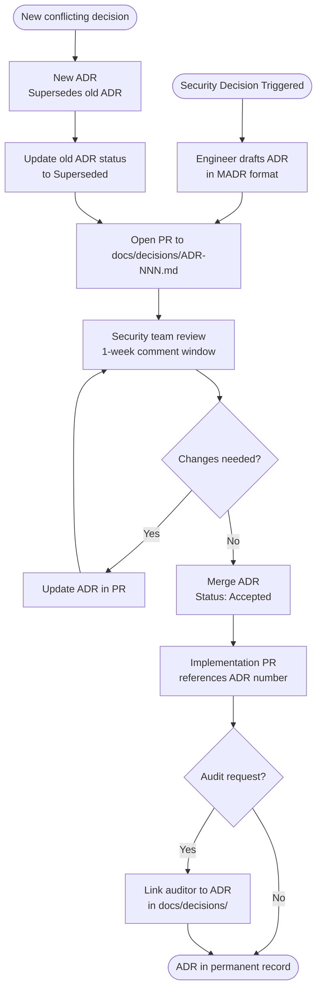

⚡ TL;DR - An Architecture Decision Record (ADR) for security documents a significant security
decision: the context (what problem are we solving?), the decision options considered, the
decision made, the rationale (why this option?), and the consequences (what does this decision
trade off? what does it make harder?). Security ADRs: solve a systemic problem in security
architecture. Security decisions are made in meetings, tribal knowledge is lost when people
leave, new team members can't understand why things are built the way they are, and auditors
can't verify that decisions were made thoughtfully. ADRs: create the permanent record.
The core format (MADR - Markdown Architecture Decision Records): (1) Title: short noun phrase
describing the decision. "Use mTLS for service-to-service communication." (2) Status: proposed,
accepted, deprecated, superseded. (3) Context: what problem? What constraints? What triggered
this decision? (4) Decision: what was decided? One clear sentence. (5) Options considered:
each option with pros and cons. (6) Rationale: why this option over alternatives? (7) Consequences:
what does this enable? What does it make harder? What does it NOT address? Security ADRs matter
especially when: (a) the decision will be reviewed by auditors (PCI DSS, SOC 2, ISO 27001).
"We require MFA for all privileged access" → ADR documents the decision, implementation scope,
and exceptions (if any). (b) The decision has significant security trade-offs. "We use client-side
encryption: this protects against server-side breaches but means lost keys → lost data."
(c) Reversing the decision later would be expensive. "We chose JWT over opaque tokens: to reverse
would require re-engineering all service authentication." The format: lightweight by design. One
markdown file per decision. Stored in `docs/decisions/` in the repository. Version-controlled.
Readable by all engineers without a special tool.

---

| #127 | Category: Security | Difficulty: ★★★★ |
|:---|:---|:---|
| **Depends on:** | OWASP Top 10, Authentication, Business Logic, Insufficient Logging, CVSS Scoring, CVE + NVD, AWS Security Services, Kubernetes Security, Security Observability + SIEM, Security at Scale, ISO 27001, Chaos Engineering, Privilege Escalation, Zero Trust Introduction, Red/Blue/Purple Team, Zero Trust Enterprise, DevSecOps Pipeline, Security Champions, Enterprise Security Architecture, Secret Rotation, Security Governance, Threat Intelligence, CSIRT Design, Security Metrics, Supply Chain Security, Platform Security Engineering, Multi-Cloud Security, Build vs Buy | |
| **Used by:** | Security Champions Program, SSDLC, Adversarial Thinking, Trust Boundary Analysis, Assume-Breach, Security as Contract, Threat Modeling | |
| **Related:** | All preceding SEC entries, SEC-128, SSDLC, Adversarial Thinking, Trust Boundary, Assume-Breach, Security as Contract, Threat Modeling | |

---

### 🔥 The Problem This Solves

**WHY UNDOCUMENTED SECURITY DECISIONS DESTROY SECURITY PROGRAMS:**

```
THE TRIBAL KNOWLEDGE PROBLEM:

  Company: 3 years old. Engineering team: 40 engineers.
  Security decisions made: hundreds. Over 3 years. In meetings, Slack, email.
  
  Key security architect: leaves the company.
  
  Month 1 after departure:
  New engineer: "why do we use symmetric encryption for inter-service communication?
  JWT with public-key verification seems better."
  Answer: "uhh... Mike decided that 2 years ago. Not sure why."
  
  Month 3 after departure:
  Security audit: "why is your user session token not HTTP-only cookie?"
  Answer: "our SPA needs to read it for the authorization header."
  Auditor: "why did you decide to use localStorage instead of secure cookie?"
  Answer: "not sure. That's how it was built."
  Auditor: flags as finding. "Cannot demonstrate that this security decision was made thoughtfully."
  
  Month 6 after departure:
  New engineer: "I'm changing the session storage from localStorage to sessionStorage.
  That should be more secure."
  Senior engineer: "wait, why did we choose localStorage over sessionStorage in the first place?"
  Nobody knows. The change: made. Breaks a feature (persist login across tabs, required for
  the enterprise customer's multi-tab workflow).
  Rollback required. Incident.
  
  Root cause: no ADR for "Session Token Storage Decision".
  Had an ADR existed: it would have documented:
  - Context: SPA requires cross-tab session persistence for enterprise customers.
  - Options: HTTP-only cookie (XSS-resistant, but SameSite issues for iframe embedding),
    sessionStorage (tab-isolated, breaks enterprise multi-tab requirement),
    localStorage (persistent, XSS-risk mitigated by CSP + token expiry).
  - Decision: localStorage with short expiry (15 min), XSS mitigated by strict CSP.
  - Consequence: accepted XSS risk in localStorage; mitigated by CSP. Loses session if
    browser storage is cleared. Does NOT work if strict CSP is relaxed.
  
  New engineer: sees the ADR → understands the context → makes an informed decision.
  Auditor: sees the ADR → sees the decision was made thoughtfully → passes the review.
  
  THE UNDOCUMENTED DECISION COST:
  - Engineer time to re-research the decision: $5K.
  - Incident from ill-informed change: $15K.
  - Audit finding: $10K to remediate + $5K audit cost.
  - Total: $35K. One missing ADR. One security decision.

THE AUDIT DOCUMENTATION FAILURE:

  PCI DSS audit.
  Auditor: "document your cryptographic key management decisions.
  What algorithm do you use? Why? What are your key rotation periods? Why?"
  
  Security team: scrambles for 2 weeks to produce the documentation.
  Most of it: written from memory. Some: incorrect (the actual implementation
  differs from what was remembered, because it was changed 8 months ago without updating docs).
  Auditor: notices inconsistency between documentation and actual implementation.
  Audit: extended 30 days for remediation. Cost: $40K.
  
  Had security ADRs existed for the cryptographic decisions: the documentation would have been
  version-controlled, accurate, and immediately available. $40K problem → 1 hour problem.
```

---

### 📘 Textbook Definition

**Architecture Decision Record (ADR):** A document that captures a significant architectural
decision, its context, the options considered, the decision made, the rationale, and the
consequences. ADRs: first popularized by Michael Nygard ("Documenting Architecture Decisions",
2011). Format: typically a short Markdown file stored alongside the code in the repository.
Key property: an ADR is immutable once accepted (except to mark it as superseded). The history
of decisions: preserved, not overwritten.

**Security ADR:** An ADR specifically addressing a security decision: choice of authentication
mechanism, session management approach, encryption algorithm, secret management strategy,
network security architecture, or security governance decision. Security ADRs serve dual purpose:
(1) internal decision documentation for engineering continuity, (2) audit evidence that security
decisions were made with appropriate due diligence (relevant for PCI DSS, SOC 2, ISO 27001, HIPAA).

**MADR (Markdown Architectural Decision Records):** A specific ADR format with a structured
template. Sections: Title, Status, Context and Problem Statement, Decision Drivers, Considered Options,
Decision Outcome, Pros and Cons of the Options. MADR: the most widely used ADR format.
Available at: https://adr.github.io/madr/

**Decision Log vs. ADR:** A decision log: a chronological list of decisions. An ADR: a document
for a SINGLE decision with structured analysis of alternatives. Decision logs: easier to maintain,
less analytical. ADRs: slower to produce, but contain the rationale that makes decisions
understandable years later. Security: use ADRs for significant security decisions (reversing
is costly), decision logs for minor security configuration choices.

**Lightweight Architecture Governance:** Using ADRs instead of heavyweight architecture review
boards (ARBs) for security decision governance. The ADR process: engineers draft an ADR for
significant security decisions, the security team reviews it, the ADR is merged into the
repository. More agile than ARBs (which require scheduling, quorum, formal voting) while
preserving the decision rationale.

---

### ⏱️ Understand It in 30 Seconds

**One line:**
A security ADR is a permanent, version-controlled, structured document of a significant security
decision, explaining what was decided, what alternatives were considered, why this option was
chosen over alternatives, and what the decision trades off - creating the institutional memory
that survives team changes, satisfies auditors, and prevents engineers from unknowingly reversing
hard-won security decisions.

**One analogy:**
> A security ADR is the "case law" system applied to engineering decisions.
>
> In law: each significant court decision: written down as a case.
> Future lawyers: can read the case to understand the ruling, the precedent, and the reasoning.
> "Why does the law say X?" Answer: "here's the case from 1973. Here's the reasoning.
>  Here's what the alternatives were. Here's why this interpretation prevailed."
>
> Without case law: every judge reinvents the law from scratch. Inconsistency. Unpredictability.
> Enormous waste (every legal question re-researched and re-argued each time).
>
> Security ADRs: case law for security decisions.
> "Why do we use mTLS for service-to-service communication instead of API keys?"
> Answer: "here's ADR-007 from 2022. Here's the context. Here's what we considered.
>  Here's why mTLS won. Here's what we accepted as the trade-off."
>
> Without ADRs: every new engineer asks the same question. No institutional memory.
> The answer: depends on who they ask. Inconsistent. Sometimes wrong.
> Mistakes: made when someone changes the implementation without understanding why it was built
> that way. The same security analysis: repeated from scratch each time.
>
> Case law: creates precedent and institutional memory.
> ADRs: create precedent and institutional memory for security decisions.
> The engineering equivalent: not optional for security architecture at scale.

---

### 🔩 First Principles Explanation

**Security ADR anatomy and workflow:**

```
WHEN TO WRITE A SECURITY ADR:

  Write when the decision is:
  1. Significant: if reversed, it would require substantial engineering effort.
     "Use JWT for session tokens" → reversal requires re-engineering auth across all services.
     "Name the config variable 'jwt_secret'" → NOT ADR-worthy. Config detail.
     
  2. Has genuine alternatives: there were real options, and you chose one.
     If there's only one realistic option: not ADR-worthy.
     
  3. Has non-obvious rationale: the reasoning wouldn't be clear from reading the code.
     "We store sessions in Redis" → WHY Redis and not DB? Non-obvious. ADR-worthy.
     "We hash passwords with bcrypt" → OBVIOUS to any security-aware engineer. Not ADR-worthy.
     
  4. Has audit relevance: auditors will ask about it.
     "Our encryption algorithm", "our key rotation policy", "our MFA enforcement scope".
     All: audit-relevant. All: need ADRs.

ADR TRIGGER EVENTS (common security ADR prompts):
  - New authentication mechanism introduced.
  - Encryption algorithm or key management approach chosen.
  - Session management strategy selected.
  - Secret management approach decided (Vault vs. cloud-native vs. env vars).
  - Network security architecture decided (mTLS, API gateway, service mesh).
  - MFA enforcement scope decided (all users? privileged only? exception process?).
  - Third-party security vendor selected (see SEC-126 build vs. buy).
  - Security policy exception approved (exception: needs an ADR to document the risk accepted).
  - Cryptographic primitive chosen (AES-256 vs. ChaCha20, RSA-2048 vs. ECDSA P-256).

MADR FORMAT FOR SECURITY ADRS:

  # ADR-NNN: [Title - noun phrase describing the decision]
  
  Date: YYYY-MM-DD
  Status: [Proposed | Accepted | Deprecated | Superseded by ADR-NNN]
  Deciders: [names or teams who made the decision]
  Technical Story: [Jira ticket or GitHub issue that triggered this ADR]
  
  ## Context and Problem Statement
  
  [What problem are we solving? What constraints exist?
  What is the threat model context? What triggered this decision now?]
  
  ## Decision Drivers
  
  * [Most important factor]
  * [Second most important factor]
  * [Security requirement: e.g., MUST satisfy PCI DSS requirement 3.5]
  
  ## Considered Options
  
  * Option A: [name]
  * Option B: [name]
  * Option C: [name]
  
  ## Decision Outcome
  
  Chosen option: "Option B", because [one sentence - the most important reason].
  
  ### Consequences
  
  * Good: [what does this enable?]
  * Bad: [what does this make harder?]
  * Risk accepted: [what security risk does this decision accept?]
  * Constraint: [what must be true for this decision to remain valid?]
  
  ## Pros and Cons of the Options
  
  ### Option A: [name]
  
  [Brief description of Option A]
  
  * Good, because [...]
  * Good, because [...]
  * Bad, because [...]
  * Bad, because [security concern: ...]
  
  ### Option B: [name]
  
  [Brief description of Option B]
  
  * Good, because [...]
  * Bad, because [...]
  
ADR NUMBERING AND FILING:
  
  File location: docs/decisions/ADR-NNN-short-title.md
  Numbering: sequential. ADR-001, ADR-002, etc.
  Never: delete or modify an accepted ADR.
  Superseding: create ADR-NNN+1 "Supersedes ADR-NNN". Update ADR-NNN status to "Superseded".
  
ADR REVIEW PROCESS (security-specific):

  1. Engineer drafts ADR (in a PR / branch).
  2. Security team: mandatory review for security ADRs.
  3. Comment period: 1 week for async feedback.
  4. Decision: merges the ADR (status: Accepted).
  5. Implementation: follows the ADR. ADR and implementation: reviewed together in code review.
  
AUDIT EVIDENCE:
  ADRs as audit evidence: mention the ADR in the audit response.
  "How was your encryption algorithm selected?" 
  Response: "ADR-007, dated 2023-03-15. Decision: AES-256-GCM. Alternatives: AES-256-CBC
  (rejected: no authentication), ChaCha20-Poly1305 (rejected: limited hardware support in
  our HSM vendor). Reviewed and accepted by CISO and security architecture team."
  Auditor: sees a structured, reasoned decision. Passes. No finding.
```

---

### 🧪 Thought Experiment

**SCENARIO: Applying the ADR process to a real security decision:**

```
TRIGGER: Engineering team proposes replacing username+password with passkeys.
This is a significant security decision. Triggers ADR.

=== ADR-042: Replace Password Authentication with Passkeys ===

Date: 2024-06-15
Status: Accepted
Deciders: Head of Engineering, CISO, Lead Security Architect, UX Lead
Technical Story: SEC-2187 (Move away from password-based authentication)

## Context and Problem Statement

Our user authentication currently uses email + password.
In the last 12 months: 3 account takeovers via credential stuffing.
Root cause: users reuse passwords from breached sites.
Our MFA rate: 23% of users (opt-in). 77% of users: password-only authentication.
We must reduce account takeover risk without significantly degrading user experience.
Regulatory context: GDPR applies; no specific authentication regulation.

## Decision Drivers

* Eliminate credential stuffing: passkeys are phishing-resistant, unphishable.
* Improve authentication UX: passkeys eliminate password memory burden.
* Increase MFA coverage: passkeys provide inherent second factor (device possession).
* MUST NOT break authentication for users without passkey-capable devices.

## Considered Options

* Option A: Enforce MFA for all users (TOTP or push).
* Option B: Implement passkeys as a replacement for passwords (FIDO2/WebAuthn).
* Option C: Implement magic links (email-based passwordless).

## Decision Outcome

Chosen option: "Option B - Passkeys", because passkeys provide the strongest
phishing-resistant authentication with the best user experience at the cost of
acceptable browser/device compatibility complexity.

### Consequences

* Good: eliminates credential stuffing attacks (passkeys: not reusable, not phishable).
* Good: removes password storage from our server-side (no password hashes to protect).
* Good: device biometric becomes MFA (something you have + something you are).
* Bad: users on older browsers/devices: need a fallback (magic link + TOTP).
* Bad: implementation complexity: we must maintain the passkey + fallback path.
* Risk accepted: if a user's device is stolen without biometric lock: attacker can authenticate.
  Mitigated by: account recovery process, session device fingerprinting, suspicious activity alerts.
* Constraint: this decision remains valid only if our user base has > 85% passkey-capable devices.
  If device support drops (enterprise customers with locked-down browsers): revisit.

## Pros and Cons of the Options

### Option A: Enforce MFA (TOTP or push)

Enforce TOTP or push-based MFA for all users. Current: opt-in (23% coverage).
Move to mandatory for all users.

* Good: proven technology, widely understood.
* Good: eliminates credential stuffing (requires device possession).
* Bad: TOTP: user friction (copy 6-digit code), app download required.
* Bad: Push-based MFA: SIM swap attack allows bypass of SMS MFA.
* Bad: does NOT eliminate phishing: password can still be phished (TOTP: real-time relay).
* Bad: does not eliminate password storage risk.

### Option B: Passkeys (FIDO2/WebAuthn)

Replace passwords with passkeys. User: authenticates with device biometric (Touch ID, Face ID,
Windows Hello) or hardware security key (YubiKey). Server: stores public key only.

* Good: phishing-resistant (passkeys: origin-bound, unphishable).
* Good: eliminates credential stuffing (no reusable credential).
* Good: no server-side password hash (reduces breach impact).
* Good: better UX than TOTP (biometric faster than TOTP code entry).
* Bad: requires passkey-capable browser + platform authenticator. Fallback needed.
* Bad: account recovery: more complex (passkey lost → recovery flow needed).

### Option C: Magic Links (email-based passwordless)

Replace passwords with email magic links. User: receives email with one-time authentication link.

* Good: eliminates password memory burden.
* Good: eliminates credential stuffing.
* Bad: dependent on email security. If email is compromised: authentication is compromised.
* Bad: email delivery delays: cause authentication failure. UX poor.
* Bad: magic links: can be phished (user can be tricked into clicking a malicious link instead).
* Bad: corporate email filtering: often blocks or delays magic links (enterprise customer risk).

=== END ADR-042 ===

OUTCOME:
- Passkeys implemented for 85% of users (passkey-capable devices).
- Fallback: magic link + TOTP for 15% (older devices, enterprise with locked browsers).
- Account takeover rate: 0 in 6 months post-implementation.
  (Previous: 3 in 12 months.)
- Auditor review (SOC 2 Type II): "authentication decision well-documented. No finding."
```

---

### 🧠 Mental Model / Analogy

> A security ADR is a flight data recorder for engineering decisions.
>
> After an aviation incident: the flight data recorder (black box) tells investigators
> EXACTLY what happened: what the pilots did, what the instruments showed, in what order,
> at what time. Without it: investigators guess. With it: they know.
>
> Before a flight: the crew uses a checklist to make and document critical decisions.
> "Fuel load: checked and documented." "Pre-flight inspection: completed." "Weather: reviewed."
> The documentation: mandatory. Not because the crew is untrustworthy, but because
> documentation creates accountability and enables post-incident analysis.
>
> Security ADRs: the pre-flight checklist and the flight data recorder combined.
>
> Pre-flight (ADR creation): forces structured thinking BEFORE the decision.
> "What are the options? What are the trade-offs? What do we accept as risk?"
> This process: often surfaces risks that wouldn't have been noticed without the structure.
> "Writing the ADR for our session token choice: we realized we hadn't considered the XSS risk
>  of localStorage. That realization: changed the decision."
>
> Flight data recorder (ADR archive): tells future investigators what happened and why.
> "Why did we choose OAuth 2.0 device flow for the CLI tool?"
> "ADR-031. Context: CLI tools can't open browsers on headless servers.
>  Decision: device flow. Alternatives: API keys (rejected: too broad), browser-based PKCE
>  (rejected: no browser on headless). Risk accepted: device authorization polling."
>
> Without the flight data recorder: every incident investigation starts from zero.
> Without the ADR: every engineering change starts from zero.
> Security decisions: accumulate over years. The institutional memory: priceless.

---

### 📶 Gradual Depth - Five Levels

**Level 1 - What it is (anyone can understand):**
A Security Architecture ADR is a document that records an important security decision. It answers: what problem were we solving? what options did we consider? what did we decide? why? and what does this decision trade off? The document: stored alongside the code in version control, readable by any engineer, and never deleted. Its purpose: ensure that engineers in the future can understand WHY security decisions were made, rather than just seeing that a decision was made. Auditors: can read it to confirm security decisions were deliberate and well-reasoned.

**Level 2 - How to use it (junior developer):**
If you're making a security decision that affects how the system handles authentication, authorization, encryption, or secret storage: check if an ADR already exists for this area. If it does: read it before making changes. The ADR: explains the context and constraints. Changing a decision documented in an ADR: requires a new ADR (not just code changes). "I want to change session storage from localStorage to sessionStorage" → check if ADR-015 says why localStorage was chosen → if the reason is still valid: discuss with the security team before changing → if you proceed: write ADR-047 superseding ADR-015 explaining why the constraint changed. This process: prevents well-intentioned changes from breaking security properties that were carefully decided.

**Level 3 - How it works (mid-level engineer):**
Running a security ADR workshop: a structured session to document security decisions for an existing system (where ADRs were never written). Process: (1) List the significant security decisions in the system (30 min). Brainstorm: how is authentication done? how are sessions managed? how are secrets stored? how is encryption handled? (2) Prioritize: audit-relevant first, then most-likely-to-be-changed. (3) For each: assign an owner to draft the ADR. (4) Drafts: reviewed in the next security review meeting. (5) Accepted ADRs: merged to `docs/decisions/`. Timeline: a 2-day workshop to identify and draft 10-15 ADRs. One week for review and acceptance. Result: the institutional memory of the security architecture captured permanently.

**Level 4 - Why it was designed this way (senior/staff):**
The ADR process: a lightweight governance mechanism designed to fit into engineering workflow without creating bureaucratic overhead. The key design properties: (1) Immutability - once accepted, an ADR is never modified. New decision → new ADR (superseding the old). This preserves the decision history. You can trace how a decision evolved over time. (2) Co-location - ADRs live in the repository alongside the code. Not in a separate wiki, not in Confluence. Result: ADRs evolve with the codebase (they're in the same PR as the implementation). Code that implements an ADR: references the ADR number. (3) Minimal format - the MADR format is intentionally short. Long documents: not written, not read. The ADR: forces the author to be precise and brief. (4) Version control - ADRs in git: have an audit trail. Who wrote it, who approved it, when, what changed. This is exactly what auditors want. The insight: the ADR process is more powerful than it appears. Writing the ADR BEFORE making the decision (not after, to document what was already decided) forces the team to think through alternatives they might otherwise skip. Many teams report: the ADR writing process changed their decision at least once in 10 ADRs.

**Level 5 - Mastery (distinguished engineer):**
Security ADRs as a compliance automation tool: the ADRs that address compliance-relevant decisions (encryption algorithms, key management, access control scope, audit logging) can be linked directly to compliance controls. A compliance control mapping document: maps each PCI DSS requirement to the relevant ADR. "PCI DSS 3.4 (render PAN unreadable): → ADR-012 (Tokenization of Payment Card Data)." During audit: "can you demonstrate that your cardholder data protection decision was made deliberately?" Response: "ADR-012, accepted by CISO and Lead Security Architect on 2022-11-20." The auditor: satisfied. No further elaboration needed. This compliance mapping: transforms a compliance audit from a 3-week documentation scramble into a 2-hour exercise. At the distinguished engineer level: the ADR framework is designed to satisfy not just current compliance requirements but future ones. "If we're asked to demonstrate SOC 2 Type II audit evidence for our security decisions in 2 years: will our ADRs provide sufficient evidence?" This forward-looking design: means writing ADRs for decisions that MIGHT become audit-relevant, not just the ones that currently are. Data retention ADRs, third-party vendor selection ADRs, security exception ADRs: all have potential future compliance relevance. The meta-principle: decisions that are worth documenting are decisions worth making carefully. The ADR writing process: a forcing function for careful security decision-making. Organizations that adopt ADRs: report fewer security incidents caused by ill-informed changes to well-designed security controls, because engineers understand the context before they change it.

---

### ⚙️ How It Works (Mechanism)

```
SECURITY ADR WORKFLOW:

  TRIGGER: significant security decision identified
      |
      v
  Engineer drafts ADR (MADR format)
  - Context, options, decision drivers
  - Pros/cons per option
  - Proposed decision + consequences
      |
      v
  PR opened to docs/decisions/ADR-NNN.md
      |
      v
  Security team reviews (mandatory for security ADRs)
  - 1-week comment window
  - Questions → answered in PR → ADR updated
      |
      v
  ADR merged → Status: Accepted
      |
      v
  Implementation follows ADR
  (ADR referenced in implementation PR: "implements ADR-042")
      |
      v
  Auditor request → link to ADR in docs/decisions/
  
  SUPERSEDING AN ADR:
  
  Old ADR-015: "Store sessions in localStorage"
  Status: Accepted (2022-03-10)
      |
      v  [new constraint: strict CSP blocks localStorage in iframe embedding]
      v
  New ADR-058: "Migrate sessions from localStorage to HTTP-only cookie"
  Status: Proposed → Accepted
  References: "Supersedes ADR-015"
      |
      v
  Update ADR-015: Status: Superseded by ADR-058
  (Original text preserved - never deleted)
```



---

### 💻 Code Example

**Security ADR template and example:**

```markdown
# ADR-007: Use AES-256-GCM for Data at Rest Encryption

Date: 2023-08-22
Status: Accepted
Deciders: CISO (Alice Chen), Lead Security Architect (Bob Kumar),
          Backend Engineering Lead (Carol Smith)
Technical Story: SEC-1142 (Encryption algorithm selection for PII fields)

## Context and Problem Statement

We store PII (name, email, date of birth, national ID) in PostgreSQL.
Regulatory requirement: GDPR Article 32 requires "appropriate technical measures"
to protect personal data. PCI DSS: does not apply (we don't store card data).
Compliance auditors have asked us to document our encryption algorithm selection.
We must select an encryption algorithm for field-level encryption of PII columns.
The encrypted fields: must be searchable (equality, not range queries).
Performance: < 5ms overhead per read/write for typical PII field sizes (< 1KB).

## Decision Drivers

* MUST be NIST-approved and considered cryptographically secure as of 2023.
* MUST provide authenticated encryption (prevent tampering, not just confidentiality).
* MUST support 256-bit keys (GDPR recommendation for "strong encryption").
* MUST work with the AWS KMS master key for key management.
* SHOULD have < 5ms per-operation overhead at our data volumes.

## Considered Options

* Option A: AES-256-CBC (with separate HMAC for integrity)
* Option B: AES-256-GCM (authenticated encryption, AEAD)
* Option C: ChaCha20-Poly1305

## Decision Outcome

Chosen option: "Option B - AES-256-GCM", because it provides authenticated
encryption (AEAD) without requiring a separate HMAC step, is NIST-approved,
is hardware-accelerated on our AWS instance types, and has excellent library support.

### Consequences

* Good: authenticated encryption in a single primitive
  (no MAC-then-encrypt confusion, no padding oracle risk).
* Good: hardware acceleration on AWS (AES-NI): < 1ms overhead.
* Good: directly supported by AWS KMS for envelope encryption.
* Bad: GCM nonce reuse is catastrophic (nonce collision → key recovery).
  Mitigated: use a CSPRNG nonce (12 bytes) per encryption.
  Risk accepted: at our data volume (< 10M encryptions/day), nonce collision
  probability is < 1 in 10^27. Acceptable.
* Bad: ciphertexts are not deterministic (different ciphertext per encryption,
  even for the same plaintext). Consequence: equality search requires
  storing a deterministic secondary index (HMAC of plaintext) for lookup.
* Constraint: this decision requires nonce uniqueness guarantee. If we
  migrate to a distributed encryption service: nonce coordination required.

## Pros and Cons of the Options

### Option A: AES-256-CBC

AES-256 in Cipher Block Chaining mode. Requires separate HMAC for integrity.

* Good: widely supported. Long track record.
* Bad: does NOT provide authenticated encryption natively.
  Requires separate HMAC → easy to get MAC-then-encrypt vs.
  Encrypt-then-MAC ordering wrong. Wrong ordering: padding oracle.
* Bad: padding oracle attacks (POODLE, BEAST) on CBC mode.
* Bad: more complex implementation (cipher + MAC vs. single AEAD primitive).

### Option B: AES-256-GCM (selected)

AES-256 in Galois/Counter Mode. AEAD (Authenticated Encryption with Associated Data).

* Good: AEAD: confidentiality + integrity in a single operation.
  No MAC ordering errors. No padding oracle.
* Good: NIST SP 800-38D approved. Industry standard for authenticated encryption.
* Good: hardware acceleration (AES-NI) → < 1ms on AWS instance types.
* Good: AWS KMS supports AES-256-GCM directly for data key encryption.
* Bad: nonce reuse catastrophic. Requires strict nonce management (CSPRNG).
* Bad: ciphertexts not deterministic (see consequences above).

### Option C: ChaCha20-Poly1305

ChaCha20 stream cipher with Poly1305 MAC. AEAD.

* Good: AEAD. Nonce reuse: less catastrophic than GCM (but still undesirable).
* Good: excellent performance on CPUs without AES-NI.
* Bad: our AWS instances HAVE AES-NI. AES-256-GCM is faster on these.
* Bad: AWS KMS does NOT natively support ChaCha20-Poly1305.
  Using ChaCha20: requires implementing envelope encryption manually.
  Risk: manual envelope encryption implementation → higher error probability.
* Bad: less widely implemented in ORM/database libraries vs. AES-256-GCM.
```

```python
# Implementation that follows ADR-007:
# References ADR-007 in the module docstring.
# Implements the nonce management constraint identified in ADR-007.

"""
Field-level encryption for PII data.
Implements ADR-007: AES-256-GCM for data at rest encryption.
See docs/decisions/ADR-007-aes256gcm-data-at-rest.md
"""

import os
from cryptography.hazmat.primitives.ciphers.aead import AESGCM

def encrypt_pii_field(plaintext: str, data_key: bytes) -> bytes:
    """
    Encrypt a PII field with AES-256-GCM.
    Returns: nonce (12 bytes) + ciphertext + tag (16 bytes).
    
    ADR-007 constraint: nonce MUST be unique per encryption.
    Implementation: CSPRNG 12-byte nonce (os.urandom).
    Collision probability: < 1/10^27 at < 10M encryptions/day. Acceptable.
    """
    if len(data_key) != 32:
        raise ValueError("Data key must be 32 bytes (AES-256)")
    
    aesgcm = AESGCM(data_key)
    # CSPRNG nonce: 12 bytes. Never reuse for the same key.
    nonce = os.urandom(12)
    
    ciphertext_with_tag = aesgcm.encrypt(
        nonce,
        plaintext.encode("utf-8"),
        None  # No additional data (AAD) for field-level encryption
    )
    
    # Store: nonce || ciphertext || tag (GCM tag is last 16 bytes)
    return nonce + ciphertext_with_tag


def decrypt_pii_field(encrypted: bytes, data_key: bytes) -> str:
    """
    Decrypt an AES-256-GCM encrypted PII field.
    Raises: InvalidTag if ciphertext was tampered (AEAD integrity check).
    This is the ADR-007 "authenticated encryption" property in action.
    """
    if len(data_key) != 32:
        raise ValueError("Data key must be 32 bytes (AES-256)")
    
    nonce = encrypted[:12]
    ciphertext_with_tag = encrypted[12:]
    
    aesgcm = AESGCM(data_key)
    # Raises InvalidTag if tampered - AEAD property of GCM.
    plaintext_bytes = aesgcm.decrypt(nonce, ciphertext_with_tag, None)
    return plaintext_bytes.decode("utf-8")
```

---

### ⚖️ Comparison Table

| Documentation Type | ADR | Wiki/Confluence | Code Comments |
|:---|:---|:---|:---|
| **Survives code changes** | Yes (separate file) | Sometimes | No (removed with code) |
| **Documents alternatives** | Yes | Usually not | Rarely |
| **Audit evidence** | Excellent (structured + version-controlled) | Poor (no immutability) | Not applicable |
| **Search/discoverability** | Good (in repo) | Good (with good org) | Poor |
| **Decision history** | Preserved (superseding model) | Often lost (overwritten) | Lost |
| **Forces careful thinking** | Yes (structured format) | Sometimes | No |

---

### ⚠️ Common Misconceptions

| Misconception | Reality |
|:---|:---|
| "ADRs are for major architectural decisions only. Security configuration decisions don't need ADRs." | Security configuration decisions are often the ones most in need of ADR documentation. Cryptographic algorithm choice, session token storage, MFA enforcement scope, secret management approach: these are configuration decisions that appear simple but have complex security trade-offs. "We use bcrypt for password hashing" → WHY bcrypt? What iterations? Why not Argon2? What changed our decision (bcrypt → Argon2id) and when? Without an ADR: "we use bcrypt because we use bcrypt." With an ADR: "we chose bcrypt at N=12 work factor in 2021 (ADR-005). In 2023, we superseded to Argon2id (ADR-023) because Argon2id is memory-hard and more resistant to GPU-based brute force at equivalent cost to the server." The ADR: documents the evolution of the decision, the reasoning, and the trigger. Security configuration decisions: often the most audit-relevant. Always ADR-worthy. |
| "Once written, ADRs are rarely read. It's documentation theater." | ADRs are read in three specific, high-value moments: (1) When a new engineer joins and is trying to understand WHY the system is built the way it is. Without ADRs: they ask around, get inconsistent answers, make ill-informed changes. With ADRs: `docs/decisions/` is the first thing to read for security context. (2) When someone is about to change an existing security decision. "I want to migrate from localStorage to sessionStorage." Before making the change: read ADR-015. Discover the constraint (cross-tab enterprise customer requirement). Either honor the constraint or write a new ADR explaining why the constraint changed. (3) During an audit. The auditor asks about encryption algorithm selection. The ADR: the answer. Prepared, structured, immediately available. The failure mode: writing ADRs but not pointing to them. Solution: link ADRs from the README, reference ADR numbers in code comments at the relevant implementation, and mention ADRs during security reviews and onboarding. |

---

### 🚨 Failure Modes & Diagnosis

**Security ADR failure patterns:**

```
FAILURE 1: ADR DRIFT (implementation diverges from ADR)

  Symptom: ADR-007 says "AES-256-GCM for all PII field encryption."
  Code review finds: 3 PII fields using AES-256-CBC (old implementation, never migrated).
  
  Root cause: ADR accepted. Migration: started but not completed. ADR: not tracked against
  implementation completeness.
  
  Detection: code search for encryption primitives.
  "grep -r 'AES.CBC\|DES\|MD5\|SHA1' src/ -- check vs ADR list"
  
  Prevention:
  - After ADR accepted: create a tracking ticket for full implementation.
  - In code review: reference the ADR. "Does this change comply with ADR-007?"
  - Annual ADR compliance audit: verify implementation matches accepted ADRs.

FAILURE 2: ADR PROLIFERATION (too many ADRs, nobody reads them)

  Symptom: 200 ADRs in docs/decisions/. Engineers: don't know which are relevant.
  "Just write a new one. Nobody knows what's already documented anyway."
  
  Root cause: ADRs written for decisions too small to warrant them.
  ADR for "name the configuration variable 'jwt_algorithm'": too small.
  ADR for "migrate linting library from ESLint v7 to v8": not security-relevant. Clutter.
  
  Fix: ADR scope criteria. Only write for:
  - Security decisions with audit relevance.
  - Decisions reversing would cost > 1 week of engineering.
  - Decisions with genuine alternatives considered.
  Otherwise: document in code comments or commit messages, not ADRs.
  
  Recovery: ADR triage. Review all ADRs. Deprecate those that are: no longer relevant,
  too minor to warrant ADR status, or for features since removed.
```

---

### 🔗 Related Keywords

**Prerequisites:**
- `Security Governance and Policy Lifecycle` (SEC-108) - governance creates the mandate for ADR processes
- `Build vs Buy Security Decision Framework` (SEC-126) - vendor selection is a prime ADR candidate

**Builds on this:**
- `SSDLC` (SEC-129) - SSDLC embeds ADR checkpoints into the software development lifecycle

---

### 📌 Quick Reference Card

```
┌──────────────────────────────────────────────────────────┐
│ WHEN TO WRITE │ Reversing costs > 1 week engineering     │
│               │ Genuine alternatives were considered     │
│               │ Non-obvious rationale                    │
│               │ Audit relevance (crypto, auth, secrets)  │
├───────────────┼──────────────────────────────────────────┤
│ FORMAT        │ Title, Status, Date, Deciders            │
│               │ Context, Decision Drivers                │
│               │ Considered Options (pros/cons each)      │
│               │ Decision + Consequences                  │
├───────────────┼──────────────────────────────────────────┤
│ STORAGE       │ docs/decisions/ADR-NNN-short-title.md    │
│               │ In the repository (same git history)     │
│               │ Never delete. Supersede, don't overwrite │
├───────────────┼──────────────────────────────────────────┤
│ AUDIT VALUE   │ Structured + version-controlled evidence │
│               │ "Who decided? When? What alternatives?"  │
│               │ Answer: ADR in git with review history   │
└──────────────────────────────────────────────────────────┘
```

---

### 💎 Transferable Wisdom

**Reusable Engineering Principle:**
"The most valuable documentation is the documentation of decisions not taken."
The accepted ADR decision is visible in the code.
The rejected options are NOT visible in the code.
An engineer reading the code: sees AES-256-GCM.
They don't see: "we considered ChaCha20-Poly1305 and rejected it because AWS KMS
doesn't natively support it, and implementing envelope encryption manually increases risk."
Without the ADR: the engineer may think "ChaCha20 is newer, let me switch to that."
With the ADR: they see the rejection reason. They keep AES-256-GCM (or they
have a new reason to supersede the decision, which they document in a new ADR).
This principle: applies everywhere.
Git commit messages: should explain WHY, not WHAT.
"Fix session bug" → bad. "Fix session bug: sessionStorage was used instead of localStorage
because of the enterprise multi-tab requirement (see ADR-015)" → excellent.
Code comments: "don't use sessionStorage here (see ADR-015)" →
the most valuable comment is the one that explains why you CAN'T do the obvious thing.
API design: the version history in a changelog should explain why API fields were removed,
not just that they were removed. "Removed the 'user_role' field from the auth token because
it caused authorization bypass when the role changed between token issuance and use."
The pattern: document the rejected options and the reasons they were rejected.
This is the knowledge that doesn't survive in the code.
This is the knowledge that saves engineers from re-discovering painful mistakes.
In security: the "rejected options" documentation is especially valuable because
the rejected options are often insecure options. Documenting them: explicitly prevents
future engineers from accidentally implementing the insecure approach.

---

### 💡 The Surprising Truth

The most valuable moment for writing a security ADR is NOT after the decision is made.
It is WHILE making the decision - before the meeting ends or the PR is merged.

The standard ADR workflow: "make the decision, then document it afterward."
This produces documentation of what was decided, but often not WHY alternatives were rejected.
Post-decision ADR writing: memory is fading. The nuances of the debate: already lost.
"We considered X" → why was X rejected? "I think it was something about performance...
or maybe compatibility... I'm not sure anymore."

The better process: write the ADR DRAFT before the decision meeting.
The draft: forces you to articulate the options and decision drivers BEFORE the meeting.
The meeting: uses the draft as the agenda.
"Here are the three options we identified. Here are the pros/cons. Which do we choose?"
The meeting: fills in the "Decision Outcome" section.
ADR complete: before the meeting ends.

Two benefits:
1. The decision meeting: better. More structured. More options considered. Less "let's go with
   what's familiar" and more "let's evaluate what's actually best."
2. The ADR: more accurate. Written during the decision, not reconstructed from memory afterward.

The insight: the ADR writing process is not just documentation.
It is a decision-making tool that, when used before the decision, improves the quality of
the decision AND produces accurate documentation simultaneously.

This is why high-performing security teams require a draft ADR BEFORE approving significant
security decisions. Not "write the ADR to document the decision." Rather:
"you can't make the decision until you've written the draft ADR showing you've considered alternatives."
The ADR gate: prevents "we just went with what we knew" without any structured analysis.

The surprising result: teams that adopt pre-decision ADR writing report that they change
their initial instinct in approximately 1 of 5 significant security decisions after
completing the structured options analysis. 20% of the time: the ADR process saves you
from a security decision you would have regretted.

---

### ✅ Mastery Checklist

**You've mastered this when you can:**
1. **STATE** when to write a security ADR: when reversing costs > 1 week of engineering,
   when genuine alternatives were considered, when the rationale is non-obvious, and when
   the decision has audit relevance (cryptography, authentication, secret management).
2. **WRITE** a complete MADR-format ADR: Title, Status, Date, Deciders, Technical Story,
   Context, Decision Drivers, Considered Options, Decision Outcome, Consequences, and
   Pros/Cons of each option. All sections complete.
3. **DESCRIBE** the superseding model: ADRs are never deleted or modified. New decision →
   new ADR with "Supersedes ADR-NNN" reference. Old ADR updated to "Superseded by ADR-NNN".
   History: preserved.
4. **EXPLAIN** the audit value: structured, version-controlled, decision-with-rationale
   documentation. Auditor asks "how did you select your encryption algorithm?" → ADR.
   SOC 2, PCI DSS, ISO 27001: all satisfied by well-written ADRs for relevant decisions.
5. **IDENTIFY** the "decision not taken" principle: the most valuable content in an ADR
   is the rejected options section, because the accepted decision is visible in code,
   but the reasoning for NOT using alternatives is only in the ADR.

---

### 🎯 Interview Deep-Dive

**Q: Your engineering team of 50 people has never used ADRs. How would you introduce the
ADR practice to improve security decision documentation?**

*Why they ask:* Tests change management skills, ability to introduce process without bureaucracy,
and understanding of how to get organizational buy-in for security practices.

*Strong answer covers:*
- Start with the problem, not the solution: "I wouldn't start by saying 'we're going to use ADRs.'
  I'd start with specific pain points: 'remember when we had to re-research why we chose AES-256-CBC
  over AES-256-GCM? That cost us 2 weeks. Or when the audit found our encryption documentation
  didn't match the implementation?' Those are the problems ADRs solve. Show the problem first."
- Start small: "identify 5 significant security decisions that are already made and document them
  retroactively as ADRs. Show the format. Show that it takes 1-2 hours to produce a quality ADR.
  That's the proof of concept. Not a policy announcement. An example people can read."
- Make the template available: "add `docs/decisions/ADR-template.md` to the repository.
  A simple copy-paste starting point removes the friction of 'how do I format this?'"
- Tie to the existing process: "we require security review for significant PRs. Add: 'if this PR
  implements a new authentication/encryption/secret management approach: an ADR is required.'
  Not a standalone process - it's part of the PR review checklist we already use."
- Celebrate early ADRs: "when the first engineer writes a high-quality ADR: mention it in the
  engineering all-hands. 'ADR-001 was written last week. It's a great example of security thinking
  and documentation. Here's a link.' Recognition: drives adoption more than mandates."
- Track the audit win: "when the first auditor asks about a security decision and the ADR is the
  answer: share that story. 'Our SOC 2 audit: auditor asked about our encryption algorithm.
  We sent ADR-007. Auditor: satisfied. 10 minutes. Previously, it would have taken 2 weeks to
  produce that documentation.' Real outcome: the strongest argument for continued adoption."
- Gradually expand scope: "after 6 months with ADRs for security decisions: expand to significant
  architectural decisions (database selection, API design patterns). ADRs for security: the pilot.
  If successful: the rest of engineering sees the value and adopts naturally."