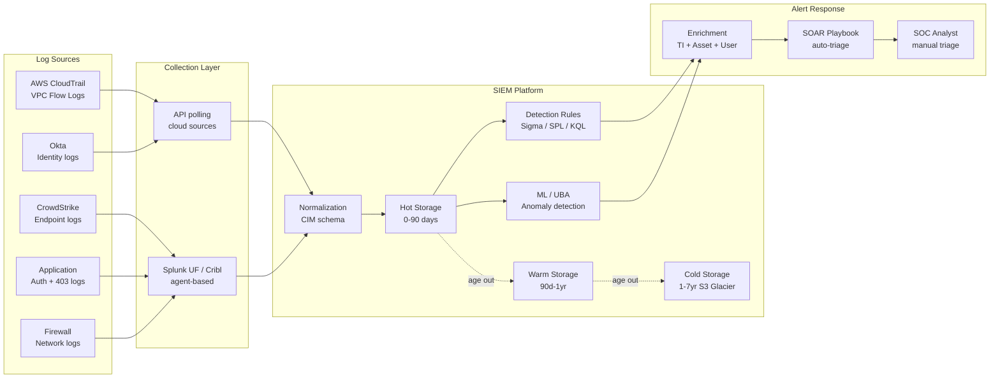

⚡ TL;DR - A SIEM (Security Information and Event Management) architecture has three core concerns:
(1) COLLECTION - getting all the right logs into the SIEM (AWS CloudTrail, VPC Flow Logs,
application logs, endpoint logs, network logs, identity logs). The failure mode: blind spots.
If a log source is missing, attacks in that source are invisible. (2) DETECTION - converting
logs into actionable alerts. Detection rules: either signature-based (exact pattern match,
high fidelity but misses novel attacks) or behavioral/ML-based (anomaly detection, catches novel
attacks but higher false positive rate). Good SIEM architecture uses both. The key metric:
alerts-per-analyst-per-day. Target: < 20. At 50+: alert fatigue → analysts stop caring →
incidents missed. (3) INVESTIGATION - enrichment and context. Raw log entries are low signal.
A good SIEM architecture: enriches every alert with context (asset owner, user department,
recent similar events, threat intelligence match). The engineer who investigates an alert should
have enough context to make a triage decision in < 10 minutes. Without enrichment: each alert
requires 30-60 minutes of manual context gathering. The SIEM pipeline: log sources → collection
agent/API → normalization (common schema) → storage (hot/warm/cold tiering) → detection
(rules + ML) → alert enrichment → SOAR integration (auto-triage + response). The SIEM data
model: every event has at minimum: timestamp, source IP, destination IP, user (if applicable),
action (what happened), outcome (success/failure), and severity. This common schema: makes
detection rules portable across log source types.

---

| #128 | Category: Security | Difficulty: ★★★★ |
|:---|:---|:---|
| **Depends on:** | OWASP Top 10, Authentication, Business Logic, Insufficient Logging, CVSS Scoring, CVE + NVD, AWS Security Services, Kubernetes Security, Security Observability + SIEM, Security at Scale, ISO 27001, Chaos Engineering, Privilege Escalation, Zero Trust Introduction, Red/Blue/Purple Team, Zero Trust Enterprise, DevSecOps Pipeline, Security Champions, Enterprise Security Architecture, Secret Rotation, Security Governance, Threat Intelligence, CSIRT Design, Security Metrics, Supply Chain Security, Platform Security Engineering, Multi-Cloud Security, Build vs Buy, Security ADR | |
| **Used by:** | SSDLC, Adversarial Thinking, Trust Boundary Analysis, Assume-Breach, Security as Contract, Threat Modeling | |
| **Related:** | All preceding SEC entries, SSDLC, Adversarial Thinking, Trust Boundary, Assume-Breach, Security as Contract, Threat Modeling | |

---

### 🔥 The Problem This Solves

**WHY NAIVE SIEM ARCHITECTURES FAIL:**

```
SIEM FAILURE 1: THE ALERT FLOOD PROBLEM

  Setup: Splunk SIEM deployed. 30 log sources connected. 500+ out-of-box detection rules enabled.
  
  Day 1: 8 alerts. Engineers: investigate all. Reasonable.
  Week 2: 50 alerts/day. Engineers: start skipping alerts. "We'll get to those later."
  Month 2: 200 alerts/day. Engineers: triage only "critical" severity. Medium/low: ignored.
  Month 4: security incident. Attacker's lateral movement: generated 15 "medium" alerts
  over 3 days. All 15: not investigated. Incident: detected 3 weeks later via a different source.
  
  Root cause: out-of-box detection rules enabled without tuning.
  "Create admin user" rule: fires on every legitimate admin operation.
  "New service account" rule: fires on every new microservice deployment.
  "Unusual login time" rule: fires every morning when US team starts work (timezone mismatch in rule).
  
  The alert flood: not a SIEM capacity problem. A detection quality problem.
  Out-of-box rules: not tuned for the environment. False positive rate: 85%.
  
  Resolution:
  1. Disable all out-of-box rules initially.
  2. Enable rules one at a time. For each: run for 2 weeks. Measure false positive rate.
  3. Tune: add exceptions for known-good behavior. Lower sensitivity of noisy rules.
  4. Target: < 20 alerts/day per analyst. < 10% false positive rate.
  
  This is detection engineering: a separate skill from SIEM deployment.

SIEM FAILURE 2: THE MISSING LOG SOURCE PROBLEM

  Security team: confident in SIEM coverage.
  SIEM: receives AWS CloudTrail, VPC Flow Logs, application logs.
  
  Security incident: attacker compromises developer laptop (no EDR).
  From laptop: accesses internal GitHub repository.
  From GitHub: downloads production database backup script.
  From script: discovers database credentials stored in a comment (a security violation).
  From credentials: accesses production database directly (bypassing application).
  
  SIEM: logs the database connection (database query logs ARE in SIEM).
  But the connection: looks like a legitimate developer access (from a known corporate IP).
  The laptop: compromised. The developer's credentials: used.
  No alert: because the SIEM had no baseline for "developer directly querying production DB."
  
  The missing log sources:
  - GitHub audit logs: not in SIEM. "Who downloaded the backup script?" Invisible.
  - Endpoint logs: no EDR on developer laptops. The compromise: invisible.
  - Database query content logs: not configured. Only connection logs. "What was queried?" Unknown.
  
  The lesson: SIEM effectiveness = (detection quality) × (log coverage).
  Missing log source: a blind spot. No detection rule compensates for missing log data.
  
  Log source inventory: mandatory for SIEM architecture.
  "What are all the places where security-relevant events occur?
  Which of those are in the SIEM? Which are not?"
  Gap: each un-ingested source: a potential blind spot for that attack vector.
```

---

### 📘 Textbook Definition

**SIEM (Security Information and Event Management):** A platform that collects, normalizes, stores,
and analyzes security events from multiple sources in real time, generating alerts when events
match detection rules. SIEM combines: SIM (Security Information Management, log storage and
analysis) and SEM (Security Event Management, real-time event correlation and alerting). The core
value proposition: correlation across sources that individually appear normal, but combined indicate
an attack (alert X from source A + alert Y from source B → detection Z that neither A nor B could
generate alone).

**Log Normalization:** The process of converting logs from different sources (each with different
formats, field names, and data models) into a common schema. Without normalization: writing a detection
rule requires source-specific knowledge. "AWS CloudTrail: `eventSource` = `iam.amazonaws.com` and
`eventName` = `CreateUser`" is different from "Azure Monitor: `operationName` = `Microsoft.Authorization/
roleAssignments/write`." With normalization (Common Information Model or similar): both events
become `action = "create_user", target_type = "identity"` → one detection rule covers both.

**Detection Engineering:** The discipline of designing, implementing, testing, and maintaining
detection rules in a SIEM. Detection engineering: a software engineering practice applied to
security detection. Detection rules: have a development lifecycle (write → test → deploy → tune →
deprecate). Testing: against known-good traffic (false positive measurement) and simulated attacks
(true positive measurement). Detection engineers: write rules in SPL (Splunk), KQL (Sentinel),
YARA-L, Sigma, or vendor-specific query languages.

**Sigma Rules:** An open, vendor-neutral format for SIEM detection rules. A Sigma rule:
describes a detection in a generic format that can be converted to SPL (Splunk), KQL (Sentinel),
Lucene (Elasticsearch), and other SIEM-specific query languages. Sigma: enables detection sharing
across organizations and SIEM platforms. Analogous to YARA for file-based threat signatures.

**SOAR (Security Orchestration, Automation, and Response):** A platform that automates security
operations workflows triggered by SIEM alerts. When a SIEM alert fires: the SOAR executes a
playbook automatically (query threat intelligence, isolate a compromised host, create a ticket,
notify the on-call analyst). SIEM: detects. SOAR: responds. Common SOAR platforms: Splunk SOAR
(formerly Phantom), Palo Alto XSOAR, Microsoft Sentinel (has built-in automation rules).

**Hot/Warm/Cold Log Storage Tiering:** A cost optimization strategy for log storage:
Hot: recent logs (last 30-90 days) stored in fast, queryable storage (high cost, < 1s query).
Warm: 90 days to 1 year, slower storage (medium cost, seconds-to-minutes query latency).
Cold: 1-7 years (compliance retention), cheapest storage (S3 Glacier, Azure Archive), query latency hours.
Most SIEM investigations: use hot data. Compliance audits: sometimes require warm/cold data.
Tuning retention per tier: significant cost reduction (80% of storage cost in hot tier for long-tail logs).

---

### ⏱️ Understand It in 30 Seconds

**One line:**
A SIEM architecture must solve three linked problems: collection (get all relevant logs from all
sources, because missing logs = blind spots), detection (convert log volume into high-fidelity,
low-false-positive alerts through detection engineering, because alert flood = alert fatigue = missed
attacks), and investigation (enrich alerts with context so an analyst can triage in < 10 minutes
rather than 60, because slow triage = increased MTTD = larger breach impact).

**One analogy:**
> A SIEM is the air traffic control system for security events.
>
> Air traffic control: takes radar signals from hundreds of aircraft.
> The raw signal: position, altitude, heading, speed, transponder code.
> The ATC system: normalizes the signal (all aircraft: same data format regardless of aircraft type).
> Then: applies rules. "Two aircraft on converging paths, separation < 3 miles, altitude delta < 1000ft.
> Alert: traffic conflict resolution required."
>
> Without ATC: pilots individually track hundreds of aircraft manually. Impossible.
> With ATC: thousands of aircraft managed by a small team of controllers.
>
> The SIEM parallel:
> Radar signals = log events (from hundreds of sources).
> Transponder normalization = log normalization (common schema).
> Traffic conflict rule = detection rule (correlated events across sources).
> ATC controller = SOC analyst (triages alerts).
>
> The ATC failure modes parallel SIEM failure modes:
> Radar blind spot (a radar station is down) = missing log source (a log source isn't in SIEM).
>  Aircraft in that sector: invisible. Security events in that source: invisible.
> Alert flood (every minor deviation triggers an alert) = excessive SIEM false positives.
>  Controllers: overwhelmed. Miss the real conflicts. Analysts: overwhelmed. Miss real attacks.
> No context (radar blip without flight info) = unenriched SIEM alert.
>  Controller: must look up each flight manually. Slow. Analyst: must research each alert manually.
>
> The SIEM: the air traffic control system for an organization's security events.
> Properly designed: enables a small SOC team to track hundreds of event sources.
> Poorly designed: overwhelms analysts with noise and blind spots.

---

### 🔩 First Principles Explanation

**SIEM architecture components and design decisions:**

```
SIEM REFERENCE ARCHITECTURE:

  TIER 1: LOG COLLECTION

  Priority log sources (in order of security value):
  1. Identity/authentication logs (highest priority: all attacks need identity)
     - AWS CloudTrail (IAM events), Azure Entra ID sign-in logs, Okta system log.
     - Active Directory / LDAP: authentication events, group membership changes.
  2. Network flow/firewall logs
     - AWS VPC Flow Logs, Azure NSG Flow Logs.
     - Firewall accept/deny logs (Palo Alto, Fortinet, pfSense).
  3. Endpoint logs (if EDR present: prefer EDR's enriched events over raw OS logs)
     - CrowdStrike FDR, SentinelOne DataSet.
     - Without EDR: Windows Event Log (Security channel), Linux auditd.
  4. Cloud infrastructure logs
     - AWS Config, AWS S3 access logs, Azure Activity Log.
     - Kubernetes API server audit log (critical: records all API calls to the control plane).
  5. Application logs
     - Authentication events (login, logout, failed login, password reset).
     - Authorization failures (403 responses, access denied).
     - Privileged actions (admin operations, bulk data access).
  6. Database logs
     - Query logs for sensitive tables (if enabled - high volume, filter aggressively).
     - Connection events, failed authentication.
  
  NOT priority (but complete the coverage):
  - DHCP logs (useful for attribution: "which device had this IP at this time?").
  - DNS query logs (detect DNS tunneling, DGA domains, C2 communication).
  - Email security logs (phishing detection, malicious attachment delivery).
  
  COLLECTION METHODS:
  - Agent-based: Splunk UF (Universal Forwarder), Elastic Agent, Cribl.
    Best for: structured sources (endpoints, servers). Agent manages buffering + delivery.
  - API-based: poll cloud provider APIs (CloudTrail S3 export, Azure Event Hub, GCP Pub/Sub).
    Best for: cloud services that don't allow agent installation.
  - Syslog: UDP/TCP syslog from network devices (firewalls, switches, WAF).
    Caveat: syslog UDP: no guaranteed delivery. Use TCP syslog for critical sources.

  TIER 2: LOG NORMALIZATION AND ENRICHMENT
  
  Normalization: convert source-specific formats to a common schema.
  Common schemas: CIM (Splunk Common Information Model), ECS (Elastic Common Schema).
  
  Example: authentication events from different sources:
    AWS CloudTrail IAM login:
      {eventSource: "signin.amazonaws.com", eventName: "ConsoleLogin", userIdentity: {...}}
    Okta system log:
      {eventType: "user.session.start", actor: {alternateId: "user@company.com"}, ...}
    CIM normalized:
      {action: "success", app: "aws_console", src: "1.2.3.4", user: "arn:aws:...",
       sourcetype: "aws:cloudtrail"}
  
  Enrichment: add context to raw events.
    IP → geolocation + ASN + threat intelligence reputation.
    User → HR data (department, title, manager, last login).
    Hostname → asset inventory (business unit, criticality, patch level).
    File hash → VirusTotal lookup (known malware?).
    Domain → Alexa rank + domain age (newly registered domain = suspicious).
  
  Enrichment: the difference between "authentication from 5.6.7.8" (meaningless) and
  "authentication from 5.6.7.8 (Russia, TOR exit node, TI: high confidence C2)"
  (actionable in seconds).

  TIER 3: STORAGE TIERING
  
  Hot (0-90 days): fast indexed storage. Full-text search, < 1s query latency.
    Cost: highest. Splunk: licensed by GB/day ingest.
    Design: store only relevant logs in hot (not ALL logs: use filtering).
    Filter aggressively: "DEBUG application logs" → cold only (low security value, high volume).
    
  Warm (90 days - 1 year): slower indexed storage. Query: seconds to minutes.
    Splunk SmartStore (S3 backend), Sentinel hot vs. analytics vs. basic tiers.
    
  Cold (1-7 years): cheapest. Archive storage. For compliance retention.
    AWS S3 Glacier, Azure Archive, GCP Nearline. Query: hours. Restore before querying.
    Most compliance requirements: 1-3 years log retention.
    Store everything (unfiltered) in cold. Store filtered in hot.
    
  Cost optimization example:
    1TB/day log ingest. $150/GB/year hot storage.
    Without tiering: $150/GB × 365 days × 1TB = $54,750/year for ONE year of hot storage.
    With tiering: keep 90 days hot (90GB × $150 = $13,500/year), 275 days warm ($0.03/GB-month × 275TB × 12 = $990/year).
    Tiering: 85% cost reduction.
  
  TIER 4: DETECTION RULES
  
  Detection rule categories:
  
  Category 1: SIGNATURE-BASED (high fidelity, known threats)
    Match specific patterns: IP addresses, file hashes, domain names.
    Source: threat intelligence feeds, MITRE ATT&CK detection guidance.
    False positive rate: very low (exact match).
    Miss rate: 100% for novel/unknown attacks.
    
  Category 2: THRESHOLD-BASED (detect abnormal volume)
    "10 failed logins for the same user in 60 seconds" = brute force.
    "1,000 S3 GetObject calls from single IP in 5 minutes" = data exfiltration.
    False positive rate: low if thresholds are calibrated.
    
  Category 3: BEHAVIORAL / ML-BASED (detect anomalies)
    User Behavior Analytics (UBA): baseline normal user behavior.
    Anomalies: "user who usually works 9-5 in New York logged in at 3 AM from Romania."
    False positive rate: higher than signature/threshold. Requires tuning.
    Catches: novel attacks that don't match known signatures.
    
  Category 4: CORRELATION (cross-source detection)
    "Event A from source X + Event B from source Y within time window T → alert."
    Example: "AWS IAM escalation (source: CloudTrail) + large S3 download (source: S3 logs) + 
    IP geolocation mismatch (source: enrichment) → probable data exfiltration."
    Correlation: the core value of SIEM over individual tools.

  TIER 5: ALERT MANAGEMENT + SOAR
  
  Alert routing: severity-based.
    Critical: page on-call SOC analyst immediately (PagerDuty).
    High: create ticket in JIRA/ServiceNow, notify SOC analyst next available.
    Medium: create ticket, weekly triage.
    Low: log only. Reviewed in monthly trending report.
  
  SOAR automation (reduces analyst load):
    Automated enrichment: every alert → auto-query threat intelligence, IPDB, HR systems.
    Automated triage: "if IP is in known-good allowlist → close as false positive."
    Automated response: "if endpoint has malware → isolate from network (EDR API call)."
    Automated notification: "if critical alert → notify SOC channel in Slack."
```

---

### 🧪 Thought Experiment

**SCENARIO: Designing a SIEM for a 1,000-person SaaS company:**

```
ENVIRONMENT:
  Infrastructure: AWS (primary), 200 EC2 instances, 40 ECS services, RDS.
  Identity: Okta for SSO. AWS IAM for cloud.
  Endpoints: 1,000 laptops (Mac + Windows). CrowdStrike EDR deployed.
  Applications: 5 customer-facing services. 3 internal tools.
  
SIEM PLATFORM SELECTION:
  Options: Splunk Enterprise (on-prem), Splunk Cloud, Microsoft Sentinel.
  Decision: Splunk Cloud (SaaS, no infrastructure to manage; team has Splunk expertise).
  Cost estimate: 50GB/day ingestion × $150/GB/year = $7,500/year. (Conservative estimate.)
  
LOG SOURCE PRIORITY:
  P1 (Day 1): Okta system log, AWS CloudTrail (all accounts), CrowdStrike FDR.
  P2 (Week 2): AWS VPC Flow Logs (sampled, not all - cost control), RDS query logs.
  P3 (Month 1): Application authentication logs, Kubernetes API server audit.
  P4 (Quarter 2): DNS query logs, DHCP logs, network device syslog.
  
INGESTION VOLUME MANAGEMENT:
  CrowdStrike FDR: can generate 100GB+/day raw.
  Strategy: filter at source. Only forward security-relevant event categories:
    - Process creation, network connections, file modifications in sensitive paths.
    - NOT: all process events, all file events (too noisy, too expensive).
  AWS VPC Flow Logs: sample at 10% for non-production accounts.
  Application logs: forward only: auth events (login/logout/failure), 403 responses, admin actions.
  NOT: DEBUG logs, health check responses, successful read operations (low security value).
  
DETECTION RULE STRATEGY:
  Week 1-2: deploy 20 high-fidelity detection rules only.
    - 10 failed logins for same user in 60 seconds.
    - AWS IAM: CreateUser, AttachUserPolicy, CreateAccessKey (admin actions).
    - CrowdStrike: known malware detection (vendor provides these).
    - Okta: impossible travel (login from 2 geographies within 30 minutes).
    - AWS: CloudTrail disabled (immediate critical alert).
    
  Month 1-3: tune the 20 rules. Remove false positives. Establish baselines.
  
  Month 3-6: add behavioral detection.
    - Splunk ML Toolkit: unusual login hours for each user.
    - Unusual AWS API call patterns (ML baseline).
    - Unusual volume of S3 downloads (threshold + time-of-day context).
  
  Target: 10-15 alerts/day total. < 15% false positive rate. Achievable by month 6.
  
COST OPTIMIZATION:
  Initial: 50GB/day estimate. After log filtering: actual ingestion: 20-25GB/day.
  Hot: 30 days for all sources. 60 days for identity/cloud logs.
  Cold: all raw logs in S3 (12 months). Cost: minimal ($0.023/GB/month for S3 Standard).
  Result: compliance retention met cheaply. Investigation capability in hot tier.
  
PHASE 1 SUCCESS METRICS (90 days):
  Log coverage: CloudTrail 100%, Okta 100%, CrowdStrike 100%.
  Alert volume: < 20/day per analyst.
  False positive rate: < 20%.
  MTTD for simulated attack: < 4 hours (vs. baseline: not measured previously).
```

---

### 🧠 Mental Model / Analogy

> A SIEM is a water filtration system for the river of security events.
>
> A river: carries enormous volumes of water (log events) continuously.
> Most of the water: clean (benign events). A small fraction: contaminated (attacks).
> The job: detect the contamination without being overwhelmed by the volume.
>
> BAD approach: inspect every water molecule individually.
> Result: overwhelmed. The contamination: missed in the noise.
>
> Water filtration system:
> Step 1: Intake (collection). What gets into the river? All sources. If a tributary is missed:
>  contamination from that tributary: not detected.
> Step 2: Settling tanks (normalization). Large particles settle out.
>  The water: a common form regardless of which tributary it came from.
> Step 3: Filtration (detection rules). Specific contaminants: filtered by specific detectors.
>  Signature filter: known contaminant types. Threshold filter: contamination above a level.
>  Anomaly detector: contamination that doesn't match anything expected.
> Step 4: Chemical testing (enrichment). Samples: tested for context.
>  "This sample: from a known contaminated source upstream" (threat intelligence).
> Step 5: Alert (SOC analyst). When a filter triggers: a specific, contextualized alarm.
>  Not: "something in the water." But: "elevated lead level, sector 7, above safe threshold,
>  likely source: the pipe replacement project upstream."
>
> The river is the security event stream.
> The filtration: the SIEM architecture layers.
> The alert: specific, contextualized, actionable.
>
> The failure mode: a filtration system that generates 500 alarms per hour.
> The operators: turn off the alarm. The contamination: goes undetected.
> Same as: a SIEM generating 200 alerts/day with 80% false positive rate.
> Analysts: stop investigating. The real attack: goes undetected.
>
> The filtration goal: detect the specific contamination, not generate maximum alarms.
> The SIEM goal: detect attacks, not generate maximum alerts.

---

### 📶 Gradual Depth - Five Levels

**Level 1 - What it is (anyone can understand):**
A SIEM is a security system that collects log files from all of your organization's computers, servers, and cloud services and analyzes them to detect attacks. Each system produces log files that record what happened: "user logged in at 2:15 AM," "firewall blocked connection from 5.6.7.8," "file deleted." Individually, each log is just a record. The SIEM connects them: "a user logged in at 2 AM from Russia (unusual), then immediately downloaded 50,000 files (unusual), then deleted the logs (very unusual)." Each event alone: might not trigger an alarm. Combined: clearly an attack. The SIEM's job is to make these connections across thousands of systems simultaneously.

**Level 2 - How to use it (junior developer):**
As a developer, your application's logging directly affects SIEM effectiveness. Security-relevant events your application MUST log: (1) Authentication events - login success AND failure (with username and source IP). Login failures: used for brute force detection. Without failure logs: no detection. (2) Authorization failures - when a user tries to access something they don't have permission to (403 responses). Pattern of 403s: indicates enumeration or privilege escalation attempt. (3) Privileged operations - admin actions, bulk data access, password reset, role change. These: used to detect insider threats and account compromise. (4) Never log: passwords, credit card numbers, social security numbers, health records, session tokens, API keys. These: sensitive data in logs → logs exfiltrated → sensitive data compromised. Use structured logging (JSON): "action": "login_failure", "username": "bob@example.com", "ip": "1.2.3.4", "timestamp": "2024-01-15T08:23:12Z". Structured: queryable. Prose: not.

**Level 3 - How it works (mid-level engineer):**
Building a Sigma detection rule and deploying it to Splunk: (1) Write the Sigma rule (vendor-neutral). (2) Convert to SPL using sigma-cli. (3) Test the converted SPL against historical data. (4) Measure false positive rate (run for 1 week with no incident). Tune if FP rate > 10%. (5) Deploy as a saved search with alert action. Example Sigma rule for AWS IAM key creation (indicator of compromise: attacker creates a new access key): `detection: keywords: selection: eventSource: 'iam.amazonaws.com' eventName: 'CreateAccessKey' condition: selection`. SPL conversion: `sourcetype=aws:cloudtrail eventSource=iam.amazonaws.com eventName=CreateAccessKey | stats count by userIdentity.userName, sourceIPAddress`. Alert: "any CreateAccessKey event from non-provisioning source IP → high severity." False positive tuning: add exceptions for the provisioning IAM role that legitimately creates keys during new user onboarding.

**Level 4 - Why it was designed this way (senior/staff):**
The SIEM data tiering model (hot/warm/cold) is a direct consequence of the security investigation workflow. 95% of security investigations focus on events from the last 30 days (active incidents). 5%: require events from 30-365 days ago (compliance audits, long-running attack chain reconstruction). < 1%: require events > 1 year old (regulatory investigation, legal hold). The storage cost structure: hot storage is 10-100x more expensive than cold storage. Storing all logs in hot: prohibitively expensive. Tiering: stores data at the cost tier appropriate to its expected query frequency. The trade-off: query latency. An investigation requiring 6-month-old data: waits hours to restore from cold. For active incident response (30-day data): sub-second response time. This design: optimizes for the common case (< 30-day investigations) while satisfying the rare requirement (regulatory review of historical data). The detection rule architecture similarly reflects the investigation funnel: behavioral rules generate many alerts (high recall, lower precision). Threshold rules: generate fewer alerts, higher precision. Signature rules: very few alerts, very high precision. Alert routing: behavioral alerts → lower severity, analyst review in batch. Signature alerts → high severity, immediate paging. This tiered alert model: concentrates analyst time on the highest-confidence detections.

**Level 5 - Mastery (distinguished engineer):**
The hardest SIEM design problem at scale is detection latency vs. correlation window trade-off. Real-time detection: low latency (seconds to minutes). But correlation across sources requires a time window. "AWS IAM escalation + subsequent S3 download" - these two events might be 20 minutes apart. A 5-minute correlation window: misses them. A 60-minute window: catches them, but stores all events for 60 minutes before correlation can be evaluated (latency). At petabyte scale (1B events/day): the correlation computation is expensive. Splunk's correlation searches: run every 5-15 minutes against a time window. Long correlation windows: very expensive queries at scale. The architectural solutions: (1) Micro-batch streaming (Kafka + Flink): correlate in near-real-time with stateful stream processing, sub-minute latency, but requires more infrastructure. (2) Index-time enrichment: enrich events at ingestion time (not at query time), so correlation queries are lighter. (3) Tiered detection: first-pass rules at ingestion (sub-second, stateless), second-pass correlation as batch (every 15 minutes). High-confidence, high-urgency detections: first-pass (real-time). Multi-event correlations: second-pass (batch). The further architectural concern: SIEM as a single point of failure in security operations. If the SIEM is down: detections stop. "Defense in depth for the SIEM" means: maintaining fallback alerting for critical detections (CloudTrail metric filter alarms independent of SIEM), ensuring log forwarding is not single-hop (use a durable message queue between log sources and SIEM so log sources don't drop events if SIEM is temporarily down), and regularly testing SIEM detection by running purple team exercises against the SIEM to verify that attacks generate expected alerts.

---

### ⚙️ How It Works (Mechanism)

```
SIEM DATA PIPELINE:

  Log Sources  →  Collection  →  Normalization  →  Storage
   AWS, Okta       Agents/API     Common schema     Hot/Warm/Cold
   EDR, App          |                |
   Firewall    ──────┤           Detection Engine
                     |           Rules + ML + Correlation
                     |                |
                     └──────────── Alerts
                                      |
                                  Enrichment
                                  TI + Asset + User context
                                      |
                                  SOAR Playbook
                                  Auto-triage + Response
                                      |
                                  Analyst Triage
```



---

### 💻 Code Example

**SIEM log normalization and detection rule examples:**

```python
# siem_log_normalizer.py
# Normalizes authentication events from different sources to a common schema.
# Enables a single detection rule to cover all authentication sources.

import json
from datetime import datetime
from typing import Optional
from dataclasses import dataclass, field

@dataclass
class NormalizedAuthEvent:
    """
    Common Information Model (CIM) compatible authentication event.
    All auth events from any source normalize to this schema.
    This enables a single Sigma/SPL detection rule to cover:
    - AWS IAM console login
    - Okta login
    - Azure AD login
    - Application login
    """
    timestamp: str
    action: str          # "success" | "failure" | "logout"
    src_ip: str
    user: str
    app: str             # "aws_console" | "okta" | "application"
    failure_reason: Optional[str] = None
    geo_country: Optional[str] = None
    mfa_used: Optional[bool] = None
    raw_event: dict = field(default_factory=dict)


class SIEMNormalizer:
    """
    Normalizes security logs from multiple sources to common CIM schema.
    
    BAD approach: write separate detection rules per log source.
      "CloudTrail: eventSource=signin.amazonaws.com and eventName=ConsoleLogin"
      "Okta: eventType=user.session.start"
      "App logs: message='login' and status=200"
    
    GOOD approach: normalize all sources to common schema.
      Write ONE detection rule: action=failure, count > 10 in 60 seconds.
      Covers ALL sources automatically.
    """
    
    def normalize_aws_cloudtrail(self, event: dict) -> Optional[NormalizedAuthEvent]:
        """Normalize AWS CloudTrail console login events."""
        if event.get("eventName") != "ConsoleLogin":
            return None
        
        return NormalizedAuthEvent(
            timestamp=event["eventTime"],
            action="success" if event.get("responseElements", {}).get(
                "ConsoleLogin") == "Success" else "failure",
            src_ip=event.get("sourceIPAddress", ""),
            user=event.get("userIdentity", {}).get("arn", ""),
            app="aws_console",
            failure_reason=event.get("additionalEventData", {}).get("LoginTo"),
            mfa_used=event.get("additionalEventData", {}).get("MFAUsed") == "Yes",
            raw_event=event
        )
    
    def normalize_okta(self, event: dict) -> Optional[NormalizedAuthEvent]:
        """Normalize Okta system log authentication events."""
        event_type = event.get("eventType", "")
        if not event_type.startswith("user.session"):
            return None
        
        action_map = {
            "user.session.start": "success",
            "user.session.end": "logout",
            "user.authentication.auth_via_mfa": "success",
        }
        action = action_map.get(event_type, "unknown")
        
        # Okta failures: separate event type
        if event.get("outcome", {}).get("result") == "FAILURE":
            action = "failure"
        
        client = event.get("client", {})
        geo = client.get("geographicalContext", {})
        
        return NormalizedAuthEvent(
            timestamp=event["published"],
            action=action,
            src_ip=client.get("ipAddress", ""),
            user=event.get("actor", {}).get("alternateId", ""),
            app="okta",
            failure_reason=event.get("outcome", {}).get("reason"),
            geo_country=geo.get("country"),
            mfa_used=event_type == "user.authentication.auth_via_mfa",
            raw_event=event
        )
    
    def normalize_application_log(self, event: dict) -> Optional[NormalizedAuthEvent]:
        """Normalize application authentication log events (structured JSON format)."""
        if event.get("event_type") != "authentication":
            return None
        
        return NormalizedAuthEvent(
            timestamp=event["timestamp"],
            action=event.get("status", "unknown"),
            src_ip=event.get("client_ip", ""),
            user=event.get("user_id", event.get("email", "")),
            app=event.get("service_name", "application"),
            failure_reason=event.get("failure_reason"),
            raw_event=event
        )


# SIGMA RULE EXAMPLE (vendor-neutral format)
# This Sigma rule, after normalization, detects brute force across ALL sources.

BRUTE_FORCE_SIGMA_RULE = """
title: Multiple Authentication Failures (Brute Force Detection)
id: a34f8f4a-9b7c-4e2d-8f1a-3b6c9d5e2a1f
status: production
description: >
    Detects multiple authentication failures for the same user
    from the same source IP within a 60-second window.
    After normalization: covers AWS, Okta, and application sources.
author: Security Engineering
date: 2024/01/15
tags:
    - attack.credential_access
    - attack.t1110
    - attack.brute_force
logsource:
    category: authentication
detection:
    selection:
        action: 'failure'
    timeframe: 60s
    condition: selection | count(user) by src_ip, user > 10
falsepositives:
    - Automated testing tools
    - Batch password change scripts (add to allowlist)
level: high
"""

# Converted SPL (for Splunk):
BRUTE_FORCE_SPL = """
sourcetype=normalized:auth action=failure
| bucket _time span=60s
| stats count by _time, src_ip, user
| where count > 10
| eval severity="high"
| table _time, src_ip, user, count, severity
"""

# DETECTION RULE TESTING
def test_detection_rule_against_known_attack(events: list, rule_fn) -> dict:
    """
    Test a detection rule against a simulated attack sequence.
    
    BAD approach: deploy rule, wait for an incident to validate it.
    GOOD approach: test against known attack sequences before production deployment.
    """
    triggered = rule_fn(events)
    
    simulated_attack = [
        {"action": "failure", "user": "alice@example.com", "src_ip": "1.2.3.4"}
        for _ in range(15)  # 15 failures in < 60 seconds = brute force
    ]
    
    # Verify: rule fires on simulated attack
    attack_triggered = rule_fn(simulated_attack)
    
    # Verify: rule does NOT fire on normal activity
    normal_activity = [
        {"action": "failure", "user": "alice@example.com", "src_ip": "1.2.3.4"},
        {"action": "success", "user": "alice@example.com", "src_ip": "1.2.3.4"},
    ]
    fp_triggered = rule_fn(normal_activity)
    
    return {
        "true_positive_detected": attack_triggered,
        "false_positive_on_normal": fp_triggered,
        "rule_effective": attack_triggered and not fp_triggered
    }
```

---

### ⚖️ Comparison Table

| SIEM Platform | Pricing Model | Best For | Weakness |
|:---|:---|:---|:---|
| **Splunk Cloud** | GB/day ingest | Mature SOC, strong detection engineering | Expensive at high volume |
| **Microsoft Sentinel** | GB/day ingest | Azure-native environments, SOAR built-in | Higher learning curve |
| **Datadog SIEM** | Events/month | DevOps teams, already use Datadog for observability | Less mature SOC features |
| **Elastic SIEM (ELK)** | Infrastructure cost | Cost-sensitive, strong engineering team | Requires engineering to build detection rules |
| **CrowdStrike Falcon LogScale** | Compressed GB | High-volume telemetry, EDR integration | Vendor lock-in to CrowdStrike |

---

### ⚠️ Common Misconceptions

| Misconception | Reality |
|:---|:---|
| "More log sources = better security." | More log sources = more data. More data: not inherently more security. Without detection rules calibrated to those log sources, the additional data generates additional noise or sits uninspected. The effective question is not "how many sources are in the SIEM?" but "for each security risk in my threat model, which log sources would generate evidence of that risk, and are those sources in my SIEM with detection rules?" Adding DNS logs to a SIEM without writing detection rules for DNS tunneling: adds cost, not security. Log source coverage: should be driven by the threat model and detection requirements, not by "let's ingest everything." |
| "SIEM tuning is a one-time task at deployment." | SIEM detection rules require continuous tuning throughout their operational lifetime. Three reasons: (1) Environment change. Every new service, new IAM policy, new cloud account, new deployment pattern: can generate new legitimate events that trigger existing rules (new false positives). Without tuning: false positive rate increases over time. (2) Threat landscape change. New attack techniques emerge. Existing rules: not written for them. New rules: needed. Old rules: may no longer catch the variants attackers use. (3) Organizational change. New business processes (acquisitions, new geographic presence, new products) change what "normal" looks like. Behavioral detection rules: need their baselines updated. SIEM detection engineering: an ongoing operational discipline, not a deployment task. A SIEM without continuous tuning: degrades in effectiveness over time. Allocation: dedicate at least 25% of SOC analyst time to detection engineering (tuning + new rule development). |

---

### 🚨 Failure Modes & Diagnosis

**SIEM operational failure patterns:**

```
FAILURE: LOG PIPELINE BREAKAGE (SILENT)

  Symptom: security incident. Investigation finds: the log source relevant to the incident
  stopped forwarding logs to the SIEM 3 weeks ago.
  
  Root cause: Splunk UF (Universal Forwarder) agent: stopped due to a system update.
  Service: not restarted after update. Logs: not forwarding. SIEM: showed no data gap alarm.
  The SIEM: had no monitoring for "expected log volume from source X dropped to 0."
  
  Resolution:
  1. SIEM health monitoring: create an alert for each critical log source:
     "if log volume from [source] drops > 50% vs. 7-day average → alert."
     This alert: runs continuously. If a log source goes silent: alert within 5 minutes.
  2. Log source inventory: maintain a list of all expected log sources + expected volume/day.
     Weekly automated check: current volume vs. expected. Deviation report to security team.
  3. Agent health monitoring: if using Splunk UF → Splunk infrastructure app monitors agent status.
     Dead agents: alerted immediately.
     
SIEM HEALTH METRICS TO MONITOR:

  - Events per second (EPS) per source: drop > 30% vs. baseline → investigate.
  - Alert count per day: increase > 50% vs. 7-day average → investigate (attack or noise spike).
  - Alert-to-investigation ratio: what % of alerts are investigated? < 80%: understaffed or too noisy.
  - False positive rate per rule: monthly review. Rules > 30% FP: tune or disable.
  - MTTD (Mean Time to Detect) for simulated attacks: run quarterly purple team exercise.
    Target: < 4 hours for critical attack techniques.
  - Log indexing lag: time from log generation to SIEM availability.
    Target: < 5 minutes for real-time detection. > 15 minutes: pipeline issue.
```

---

### 🔗 Related Keywords

**Prerequisites:**
- `Security Observability + SIEM` (SEC-089) - foundational SIEM concepts before this deep-dive architecture
- `CSIRT Design and Playbook Development` (SEC-121) - CSIRT uses SIEM as its primary detection platform
- `Security Architecture ADR Workshop` (SEC-127) - SIEM architecture decisions warrant ADRs

**Builds on this:**
- `SSDLC` (SEC-129) - SSDLC requires SIEM integration for production security monitoring

---

### 📌 Quick Reference Card

```
┌──────────────────────────────────────────────────────────┐
│ 3 CORE PROBLEMS│ Collection: all logs in? Missing = blind│
│                │ Detection: high fidelity, low FP alerts  │
│                │ Investigation: enriched, < 10min triage │
├────────────────┼─────────────────────────────────────────┤
│ LOG PRIORITY   │ P1: Identity (Okta, AD, AWS IAM)        │
│                │ P2: Network flow + firewall              │
│                │ P3: EDR endpoint events                  │
│                │ P4: Application auth + 403               │
├────────────────┼─────────────────────────────────────────┤
│ DETECTION TYPES│ Signature: known IOC, lowest FP         │
│                │ Threshold: brute force, volume anomaly   │
│                │ Behavioral/ML: novel attacks, higher FP  │
│                │ Correlation: cross-source attack chains  │
├────────────────┼─────────────────────────────────────────┤
│ METRICS        │ Alerts/analyst/day: target < 20         │
│                │ False positive rate: target < 15%        │
│                │ Log coverage: 100% critical sources      │
│                │ MTTD (purple team): target < 4 hours    │
└──────────────────────────────────────────────────────────┘
```

---

### 💎 Transferable Wisdom

**Reusable Engineering Principle:**
"Signal to noise ratio determines system effectiveness, not raw volume."
A SIEM generating 200 alerts/day with 80% false positive rate: 40 true positives, 160 noise.
A SIEM generating 15 alerts/day with 5% false positive rate: 14.25 true positives, 0.75 noise.
The first SIEM: generates 5x more alerts. The second: generates nearly the same number of
true positives. But the first: requires 200/day analyst triage. The second: 15/day.
Signal-to-noise ratio determines the USEFUL output of the system, not the volume.
This principle: applies universally in engineering.
Logging: more logs are NOT more observability. More signal-to-noise logs are.
"Log everything at DEBUG level in production" → log volume that makes searching impossible,
log storage cost that exceeds the system's own infrastructure cost. The useful logs:
the ones that help diagnose real problems. Not the ones that record every trivial event.
Monitoring: 200 Prometheus metrics per service are NOT better visibility than 20.
200 metrics: too much to display on a dashboard. 20 metrics selected for the key
health indicators: the ones that actually drive action.
Alerting: 50 PagerDuty alerts/day is NOT more responsive operations than 5.
50 alerts: alert fatigue. Engineers: start ignoring. 5: each investigated seriously.
The invariant: the signal-to-noise ratio is the design target.
Not the volume of data, alerts, or metrics.
A system that generates less signal with less noise: more valuable than
one that generates more signal with much more noise.
This is the core design principle of SIEM detection engineering,
and it is the correct design principle for any system that generates events for human review.

---

### 💡 The Surprising Truth

The most dangerous SIEM is not an absent SIEM. It is an actively monitored SIEM with
an 80% false positive rate that hasn't been tuned.

Why: the SIEM with 80% FP rate gives the security team a false sense of security.
"We have a SIEM. We have 200 alerts/day. We are monitoring."
But: analysts are triaging 200 alerts/day → alert fatigue → missing the real attacks
in the noise. The SIEM is "on" but not effective.

An organization with NO SIEM: knows it has no SIEM. It does not assume it is protected.
It plans accordingly: invest in other controls, accept the visibility risk, or acknowledge
that detection is not mature.

An organization with an untuned SIEM: believes it has security monitoring. It doesn't realize
that the real attacks are hiding in the 160 false positives per day. The belief in protection:
false. The actual protection: near-zero. This is worse than knowing you have no protection.

The clinical term: "security theater." A security control that appears to provide protection
but doesn't. The untuned SIEM is the most common form of security theater in organizations
that have invested in security tooling.

The fix: detection engineering. Measure false positive rate. Disable rules with > 30% FP rate.
Tune rules to specific environment. Enable rules one by one, measured, before enabling more.
Target: < 20 alerts/day per analyst. < 15% FP rate. These are operational targets, not ideals.

The counterintuitive result: a SIEM with 20 carefully curated, tuned detection rules
is significantly more effective at detecting attacks than a SIEM with 500 out-of-box,
untuned rules. Less is more. Signal is more valuable than volume.

---

### ✅ Mastery Checklist

**You've mastered this when you can:**
1. **IDENTIFY** the three core SIEM architecture concerns: collection (all relevant log sources
   in SIEM - missing = blind spot), detection (high-fidelity, low-false-positive rules through
   detection engineering), and investigation (enriched alerts with enough context for < 10-min triage).
2. **DESCRIBE** the hot/warm/cold storage tiering model: hot (0-90 days, fast, expensive), warm
   (90 days-1 year, slower, medium cost), cold (1-7 years, archive, compliance retention). Why:
   95% of investigations use < 30-day data; tiering reduces storage cost by 80%+ vs. all-hot.
3. **DISTINGUISH** the four detection rule categories: signature (exact pattern, high fidelity,
   misses novel attacks), threshold (volume anomaly, brute force), behavioral/ML (anomaly
   detection, higher FP, catches novel attacks), correlation (cross-source, the core SIEM value).
4. **EXPLAIN** Sigma rules: a vendor-neutral detection rule format that can be converted to
   SPL (Splunk), KQL (Sentinel), or Lucene. Enables detection sharing across organizations
   and portability across SIEM platforms.
5. **STATE** the key SIEM operational metrics: alerts/analyst/day target < 20 (above: alert fatigue),
   false positive rate target < 15%, log coverage 100% of critical sources, MTTD via quarterly
   purple team exercise target < 4 hours.

---

### 🎯 Interview Deep-Dive

**Q: Your SOC analysts are experiencing alert fatigue - they receive 300 alerts/day with a
60% false positive rate. How do you approach fixing this?**

*Why they ask:* Tests operational security knowledge, problem-solving approach, and ability to
improve security program effectiveness. Common in senior SOC engineer, detection engineer,
and security operations manager roles.

*Strong answer covers:*
- Diagnose first: "before fixing, I'd understand the root cause. Which rules are generating the
  most alerts? What is the FP rate per rule? Run a 2-week analysis: for every alert, the analyst
  records 'true positive' or 'false positive' and which rule fired. After 2 weeks: sort rules by
  FP rate descending. Typically: 10-20% of rules generate 80% of the false positive volume."
- Immediate relief: "identify the top 5 rules by false positive rate. For each: either disable
  (if generating 0 true positives in the 2-week analysis) or add exceptions (add known-good IP
  addresses, service accounts, automated systems to an allowlist for that rule). Within 1 week:
  this should reduce alert volume by 40-60%."
- Medium-term: detection engineering program: "establish a quarterly review cycle. Each rule:
  reviewed for FP rate, true positive count, and relevance. Rules not triggering true positives
  in 6 months: disabled. Rules with FP > 30%: tuned or disabled. New attack techniques: add
  new rules via detection engineering."
- Process change: "require each analyst to mark alerts as TP/FP in the ticketing system.
  This data: feeds the monthly rule review. Without data: you're guessing. With data:
  you know exactly which rules to tune."
- Culture: "alert fatigue is an operational signal, not an analyst performance issue.
  'Analysts aren't investigating alerts' → the system is generating too much noise.
  Fix the system. Don't blame the analysts. The goal: analysts should investigate
  ALL alerts. If they're not: the alert volume exceeds their capacity OR the quality
  is too low to warrant investigation. Both: system design problems, not people problems."
- Target metrics: "at 90 days: < 50 alerts/day (from 300). < 20% FP rate (from 60%).
  At 180 days: < 20 alerts/day, < 10% FP rate. These are achievable with sustained
  detection engineering effort."