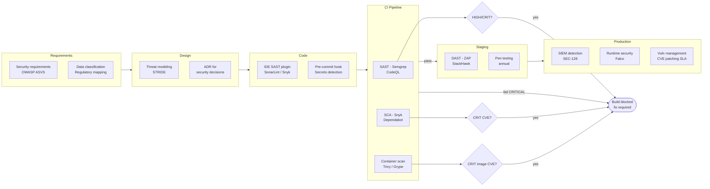

⚡ TL;DR - A Secure Software Development Lifecycle (SSDLC) embeds security practices into every
phase of the software development lifecycle - requirements, design, development, testing, deployment,
and operations - rather than treating security as a final gate before release. The core problem it
solves: security teams reviewing software PRE-RELEASE have no ability to influence design or
architecture (already built), limited testing time (release pressure), and incomplete context
(security team doesn't know the business logic). By the time security is "bolted on" at release,
the only options are: ship insecure code, do an expensive redesign, or delay the release.
SSDLC shifts security left: security is embedded in design (threat modeling), in development
(IDE plugins, pre-commit hooks with secrets scanning), in CI (SAST + SCA automated gates), in
CD (DAST against staging, container scanning), and in operations (SIEM detection, monitoring).
The five security gates: (1) DESIGN: threat modeling (SEC-144) for features with trust boundary
changes. Security requirements: OWASP ASVS or similar checklist. (2) CODE: SAST (static analysis:
Semgrep, CodeQL, Checkmarx) in CI - fails build on high/critical findings. SCA (software
composition analysis: Snyk, Dependabot, OWASP Dependency-Check) - fails build on
critical CVEs in dependencies. (3) BUILD: container scanning (Trivy, Grype) for known CVEs in
base images + installed packages. (4) PRE-PRODUCTION: DAST (dynamic analysis: OWASP ZAP, Burp
Suite Pro) against the staging environment. Penetration testing (annual minimum). (5) PRODUCTION:
SIEM monitoring, runtime security (Falco), vulnerability management (patch critical CVEs in
< 15 days). The ROI: finding a vulnerability in requirements costs $100 to fix. In code: $1,000.
In testing: $10,000. In production: $100,000. SSDLC: the cost-effectiveness argument for
building security early.

---

| #129 | Category: Security | Difficulty: ★★★★ |
|:---|:---|:---|
| **Depends on:** | OWASP Top 10, Authentication, Business Logic, Insufficient Logging, CVSS Scoring, CVE + NVD, AWS Security Services, Kubernetes Security, Security Observability + SIEM, Security at Scale, ISO 27001, Chaos Engineering, Privilege Escalation, Zero Trust Introduction, Red/Blue/Purple Team, Zero Trust Enterprise, DevSecOps Pipeline, Security Champions, Enterprise Security Architecture, Secret Rotation, Security Governance, Threat Intelligence, CSIRT Design, Security Metrics, Supply Chain Security, Platform Security Engineering, Multi-Cloud Security, Build vs Buy, Security ADR, SIEM Architecture | |
| **Used by:** | Security Program Maturity (SEC-130), Adversarial Thinking, Trust Boundary Analysis, Assume-Breach, Security as Contract, Threat Modeling | |
| **Related:** | All preceding SEC entries, SEC-130, Adversarial Thinking, Trust Boundary, Assume-Breach, Security as Contract, Threat Modeling | |

---

### 🔥 The Problem This Solves

**WHY BOLT-ON SECURITY FAILS:**

```
THE BOLT-ON SECURITY FAILURE:

  Company: 150-person SaaS startup. 3 security engineers (vs. 120 developers).
  Process: developers build features. Security team: reviews code before release.
  
  SPRINT VELOCITY: 2-week sprints. 12 features shipped per sprint.
  SECURITY REVIEW CAPACITY: 3 security engineers × 40h/sprint = 120 hours.
  Feature review time: 5-10 hours per feature (non-trivial features).
  
  MATH: 12 features × 7.5h average = 90h needed.
  Capacity: 120h. Barely sustainable at current pace.
  
  SPRINT 23: 15 features (sprint scope crept). 15 × 7.5h = 112h needed.
  Actual available: 80h (one security engineer: out sick; another: incident response).
  
  Result: 7 features reviewed. 8 features: not reviewed. Shipped anyway.
  (Release pressure: "security can review post-release.")
  
  Feature 14: new payment integration.
  Not reviewed. Shipped.
  Contains: SQL injection in the discount code validation (OWASP A03:2021).
  
  3 weeks later: SQL injection exploited. Customer payment data: accessed.
  Breach: 50,000 customers. Cost: $2.2M.
  
  POST-INCIDENT ANALYSIS:
  
  The SQL injection: discoverable in < 5 minutes with SAST (Semgrep).
  The SAST tool: would have caught it during CI. Costs: $0.03 (CI compute time).
  
  Reason it wasn't caught: no SAST in CI. Security review: the only gate.
  Security review: overwhelmed. Review skipped for that sprint. Vulnerability: shipped.
  
  THE FUNDAMENTAL PROBLEM:
  
  "3 security engineers reviewing all code from 120 developers is not scalable."
  
  Ratio: 1:40 (security:developer). Industry benchmark: 1:8 to 1:20.
  At 1:40: security review is always the bottleneck. Always skipped under pressure.
  
  THE SSDLC SOLUTION:
  
  Automation does what people can't scale to do:
  - SAST in CI: Semgrep runs on every PR. Finds SQL injection in 30 seconds. Costs $0.03.
  - SCA: Snyk checks every dependency for known CVEs. Runs in CI automatically.
  - Pre-commit hooks: secrets scanning catches API keys before they reach git.
  
  Security engineers: freed from reviewing every PR.
  Security engineers: focus on threat modeling (design-level review), 
  penetration testing (deep manual testing), security architecture decisions.
  
  Ratio becomes: 3 security engineers × automation = coverage for 120 developers.
  SAST catches: the SQLi, the XSS, the path traversal. Automatically.
  Security engineers: review the SAST findings report, NOT every line of code.
```

---

### 📘 Textbook Definition

**SSDLC (Secure Software Development Lifecycle):** A development framework that integrates
security activities, controls, and reviews into each phase of the Software Development Lifecycle
(SDLC): requirements, design, implementation, testing, deployment, and maintenance. SSDLC:
ensures security is considered at each stage rather than added after development is complete.
Microsoft's SDL (Security Development Lifecycle), OWASP's SAMM (Software Assurance Maturity Model),
and NIST SSDF (Secure Software Development Framework) are established SSDLC frameworks.

**SAST (Static Application Security Testing):** Automated analysis of source code (or compiled
code) for security vulnerabilities without executing the code. SAST: finds vulnerabilities like
SQL injection, XSS, path traversal, insecure cryptography, hardcoded secrets by analyzing the
code structure and data flows. SAST tools: Semgrep (open source), CodeQL (GitHub), Checkmarx,
Fortify, Veracode. SAST: typically run in CI (on every PR or commit). False positives: common.
SAST: best at finding known vulnerability patterns.

**SCA (Software Composition Analysis):** Automated analysis of open-source dependencies for
known vulnerabilities (CVEs), license compliance issues, and outdated versions. SCA: scans
the dependency manifest (pom.xml, package.json, requirements.txt, go.mod) against NVD (National
Vulnerability Database) and commercial vulnerability databases. SCA tools: Snyk, Dependabot
(GitHub), OWASP Dependency-Check, Socket. SCA: finds Log4Shell-type vulnerabilities automatically.

**DAST (Dynamic Application Security Testing):** Automated testing of a running application
by sending malicious requests and analyzing responses, simulating an external attacker. DAST:
finds vulnerabilities that only manifest at runtime (authentication flaws, injection in processed
inputs, insecure configuration). DAST tools: OWASP ZAP (open source), Burp Suite Pro, Checkmarx
DAST, StackHawk. DAST: typically run against a staging/QA environment. False negative rate: higher
than SAST for code-level issues, but catches runtime-specific vulnerabilities SAST misses.

**IAST (Interactive Application Security Testing):** A testing approach that instruments the
running application (via agent or proxy) to detect vulnerabilities during functional testing.
IAST: combines benefits of SAST (code-level analysis) and DAST (runtime detection). Lower false
positive rate than either SAST or DAST alone. IAST tools: Contrast Security, Seeker (Synopsys).
IAST: less common due to complexity of instrumentation.

**Security Requirements:** Explicit security properties a system must satisfy, derived from:
business requirements (data protection), regulatory requirements (GDPR, PCI DSS, HIPAA), and
threat model (what attacks must the system resist?). OWASP ASVS (Application Security Verification
Standard): a framework for security requirements organized by verification level (1=basic, 2=standard,
3=advanced). Security requirements: written before design (not as a check on existing design).

---

### ⏱️ Understand It in 30 Seconds

**One line:**
SSDLC embeds security into every SDLC phase (requirements → design → code → test → deploy →
operate) so that security controls are designed in (not bolted on), automated tools (SAST, SCA,
container scanning) catch common vulnerabilities at near-zero cost during CI/CD, and the 3
security engineers can focus on the security work that requires human judgment (threat modeling,
penetration testing, security architecture) rather than reviewing every line of code from 120 developers.

**One analogy:**
> SSDLC is the food safety system applied to software manufacturing.
>
> BAD food safety: inspect every meal just before it's served to customers.
>  3 inspectors for 1,000 meals per day. Impossible. Either: food goes uninspected,
>  or: service stops while the 3 inspectors review 1,000 meals.
>  Contaminated food: makes it to customers before detection.
>
> GOOD food safety: multi-stage quality control.
>  Stage 1 (ingredients - REQUIREMENTS): suppliers are certified. Ingredients: tested on delivery.
>  Stage 2 (recipe - DESIGN): recipes designed to prevent contamination (cooking temps, separation).
>  Stage 3 (preparation - CODE): hand-washing required. Prep surfaces: sanitized automatically.
>  Stage 4 (cooking - TEST): temperature sensors. Automatic alerts if temp drops below safety threshold.
>  Stage 5 (serving - PRODUCTION): random sampling. Customer feedback monitoring.
>  
>  The 3 inspectors: focused on: certifying suppliers, reviewing recipes, responding to customer feedback.
>  NOT: inspecting every plate before service.
>  Automated controls: handle the high-volume, repeatable checks.
>  Human inspectors: handle the judgment-requiring, complex analysis.
>
> The restaurant that only inspects food just before serving:
>  - Scaling failure: can't inspect every meal.
>  - Late detection: problem found only after contamination is already in the food.
>  - Expensive: inspectors are expensive; automated sensors are cheap.
>
> SSDLC: the food safety system for software.
> SAST/SCA = temperature sensors (automated, runs on every build).
> Security requirements = recipes (security by design).
> Threat modeling = recipe review (design-level security analysis).
> Penetration testing = health inspector (periodic, deep, expert human review).
> Security review of every PR = inspecting every meal before serving (doesn't scale).

---

### 🔩 First Principles Explanation

**SSDLC: phase-by-phase security integration:**

```
SSDLC FRAMEWORK:

  PHASE 1: REQUIREMENTS
  
  Security activities:
  - Define security requirements for the feature/system.
  - Use OWASP ASVS as a security requirements checklist.
  - Map to regulatory requirements: GDPR (data minimization, retention), PCI DSS (card data), HIPAA.
  - Define: "what security properties MUST this feature have?"
    Example: payment feature requirements:
    - MUST encrypt card data at rest (AES-256-GCM, ADR-007).
    - MUST NOT log card numbers anywhere (logs: scrubbed at application level).
    - MUST rate-limit payment attempts (100/user/hour).
    - MUST audit all payment operations (who, what, when, outcome).
  
  Output: security requirements section in the feature spec/ticket.
  Time: 30-60 minutes for a senior engineer or security champion.
  When: before design begins. Constraints inform design. Post-design security requirements:
  often require redesign.
  
  PHASE 2: DESIGN (THREAT MODELING)
  
  Security activities:
  - Threat model features with significant trust boundary changes.
    (Not every feature: small features within existing boundaries don't need full threat model.)
  - Apply STRIDE (Spoofing, Tampering, Repudiation, Information Disclosure, DoS, Escalation).
  - Identify mitigations for each threat. Map mitigations to security requirements.
  - Create/update the system's data flow diagram (DFD) showing trust boundaries.
  
  Output: threat model document (or ADR for significant security decisions).
  Time: 2-4 hours for significant features. 30 minutes for minor features.
  Who: the engineer building the feature + security champion or security engineer.
  
  PHASE 3: IMPLEMENTATION (IDE + PRE-COMMIT)
  
  Security activities:
  - IDE security plugins: real-time SAST in the IDE.
    Semgrep LSP, SonarLint, Snyk IDE plugin: flag vulnerabilities as the developer types.
    "You're concatenating user input into a SQL string. Use a parameterized query instead."
    Catches the vulnerability before it's committed. Cheapest possible fix.
  
  - Pre-commit hooks: mandatory for secrets detection.
    git-secrets, detect-secrets (Yelp), TruffleHog, GitLeaks: scan every commit for secrets.
    "AWS_ACCESS_KEY_ID pattern detected in payment_service.py. Commit blocked."
    Cost: if a secret is committed: rotation required (+ potential breach). 
    Cost if caught at pre-commit: 10 seconds to remove. Free.
  
  PHASE 4: CI (AUTOMATED SECURITY GATES)
  
  SAST (Static Analysis):
    Run: on every PR. Fail build: on high or critical severity findings.
    Tool: Semgrep (open source, fast, customizable rules) or CodeQL (GitHub, free for public repos).
    Configuration: start with OWASP Top 10 ruleset. Add custom rules for your business logic.
    Tuning: disable noisy rules. Add suppressions (with justification) for known false positives.
    
  SCA (Dependency Analysis):
    Run: on every PR and daily scheduled scan (new CVEs appear any day, not just on PRs).
    Tool: Snyk, Dependabot, or OWASP Dependency-Check.
    Policy: fail build on CRITICAL severity CVEs (CVSS ≥ 9.0) with a fix available.
           Create ticket (but don't fail build) for HIGH severity without immediate fix.
    SBOM: generate SBOM (Software Bill of Materials) on each build.
    
  Secrets Scanning:
    CI-level: Gitleaks, TruffleHog in CI (in addition to pre-commit, as a safety net).
    GitHub Advanced Security: secret scanning built into GitHub (if on GitHub Enterprise).
    
  Container Scanning (BUILD/PACKAGE PHASE):
    Run: on container image build.
    Tool: Trivy or Grype. Scan the base image + installed packages.
    Policy: fail build on CRITICAL CVEs in the final image. Use distroless or slim base images.
    Example: Trivy scan of nginx:latest found 47 CVEs. Trivy scan of nginx:alpine: 3 CVEs.
    Choice of base image: significant security impact.
  
  PHASE 5: STAGING (DAST + PENETRATION TESTING)
  
  DAST:
    Run: against the staging environment, after each deployment to staging.
    Tool: OWASP ZAP (open source, free) or StackHawk (commercial, CI-integrated).
    Scope: the application's API endpoints + UI.
    Coverage: tests for OWASP Top 10 vulnerabilities at runtime.
    False positive handling: DAST FP rate is higher than SAST. Findings: triaged by security team.
    
  Penetration Testing:
    Frequency: annual minimum. After major architectural changes: ad hoc.
    Scope: external pen test (attacker perspective) + web application pen test.
    Finding severity: critical and high → fix before release. Medium/low → fix within 90 days.
    
  PHASE 6: PRODUCTION (OPERATE SECURELY)
  
  Runtime security:
    Falco: detect anomalous behavior in containers (exec in container, unexpected outbound connection).
    SIEM: detect attacks in production (see SEC-128 SIEM Architecture).
    
  Vulnerability management:
    Ongoing SCA: scan production images continuously. New CVEs: appear any day.
    SLA: CRITICAL CVE → patch within 15 days. HIGH → 30 days. MEDIUM → 90 days.
    
  Security monitoring:
    Application-level: log auth events, authorization failures, admin operations (for SIEM).
    Infrastructure: cloud security posture management (CSPM).
```

---

### 🧪 Thought Experiment

**SCENARIO: Retrofitting SSDLC into an existing 150-person SaaS company:**

```
CURRENT STATE:
  - No security in CI (no SAST, no SCA, no container scanning).
  - Security review: manual, done by 3 security engineers pre-release.
  - Penetration test: conducted once 2 years ago. No follow-up.
  - Secret management: environment variables in .env files (some committed to git accidentally).
  - Threat modeling: not practiced.
  
SSDLC ROLLOUT ROADMAP (PHASED - 12 months):

  MONTH 1-2: STOP THE BLEEDING (quick wins, high impact)
  
  Week 1: Secret rotation + prevent new leaks.
    - Audit git history: search for leaked secrets (GitLeaks, TruffleHog).
    - Any found: rotate immediately (not tomorrow: today).
    - Deploy git-secrets pre-commit hook: mandatory for all developers.
    - Brief engineering team: "pre-commit hook is now installed. It prevents secret commits.
      If it blocks a legitimate commit: contact security team."
  
  Week 2: SCA for critical CVEs.
    - Run Snyk on all repos. Identify dependencies with CRITICAL CVEs.
    - Create tickets for each. Priority: fix within 30 days.
    - Enable Dependabot for all repos: automatic PRs for dependency updates.
    - Configure: fail CI on CRITICAL CVE with available fix.
  
  Week 3-8: SAST deployment.
    - Deploy Semgrep to CI for all repos.
    - Configuration: OWASP Top 10 ruleset only. NOT all rules (too noisy at first).
    - First 4 weeks: report mode only (don't fail builds). Engineers: see findings, not blocked.
    - Review report weekly. Triage: true positive vs. false positive.
    - Week 5: enable build failure for HIGH and CRITICAL true positive findings only.
    - Suppress confirmed false positives with justification comments.
    
  MONTH 3-6: SYSTEMATIC IMPROVEMENT
  
  Container scanning:
    - Trivy or Grype: in CI, on image build.
    - Fail build on CRITICAL CVEs in the final image.
    - Switch base images: FROM ubuntu:latest → FROM ubuntu:22.04-minimal or distroless.
    
  Security champions program:
    - Recruit 1 security champion per team (SEC-113 pattern).
    - Security champions: serve as the first line for security questions on their team.
    - Monthly security champions meeting: share knowledge, triage findings.
    
  Threat modeling (for new features):
    - Define trigger: "features that introduce a new trust boundary, new data type, or
      new authentication/authorization mechanism require a threat model."
    - Template: lightweight STRIDE template in Confluence.
    - Security champions: lead the threat models for their team's features.
    
  MONTH 7-12: MATURITY
  
  DAST:
    - Deploy OWASP ZAP against staging environment.
    - Run after each staging deployment.
    - Security engineer reviews findings weekly.
    
  Penetration testing:
    - Annual external pen test. Scope: all customer-facing applications.
    - Mid-year: web application pen test (internal scope + customer APIs).
    - Findings: tracked to closure with SLA enforcement.
    
  Security metrics:
    - SAST findings trend (decreasing = improving code security).
    - CRITICAL CVE MTTR (mean time to remediate).
    - Secret leak incidents (should trend to zero).
    - Coverage: % of repos with SAST + SCA + container scanning.
    Target at 12 months: 100% of repos covered.

IMPACT MEASUREMENT (12 months):
  - SAST findings discovered and fixed in CI: 340 (would have been: shipped to production).
  - CRITICAL CVEs remediated: 47 (average MTTR: 12 days).
  - Secret leaks detected at pre-commit (not shipped): 23.
  - Manual security review burden: reduced 65% (automated gates handle what reviewers did manually).
```

---

### 🧠 Mental Model / Analogy

> SSDLC is the Toyota Production System (lean manufacturing) applied to software security.
>
> Toyota Production System: stop the production line if a defect is found.
> "Build in quality at each step. Don't pass defects to the next step."
> The insight: fixing a defect at step 7 of a 10-step process costs 10x more than fixing it
> at step 1. Most of the cost: rework of the 6 steps that came after the defect was introduced.
>
> The pre-TPS approach (mass production): produce first, inspect at the end.
> Quality inspectors: at the end of the production line. Find defects, scrap or rework.
> The problem: defect is found after all the manufacturing steps are complete.
> All those steps: wasted on a defective unit.
>
> SSDLC: the Toyota approach.
> Find security defects at the step where they're introduced:
> - Requirements: security requirement missing → fix the requirement now ($100).
>   Alternative: discover the missing requirement in production ($100,000 breach).
> - Code: SAST finds SQL injection → fix it now ($1,000 dev time to review and fix).
>   Alternative: attacker exploits SQL injection in production ($1,000,000 breach).
> - CI: SCA finds critical CVE in dependency → update it now ($100 dependency update).
>   Alternative: Log4Shell exploited in production.
>
> The Toyota "jidoka" (automation with human intelligence):
> Machines: detect defects automatically. Humans: address root causes.
> SSDLC equivalent: SAST/SCA/container scanning = automatic defect detection.
> Security engineers = address root causes (why are we still introducing these patterns?
> Do we need training? Better libraries? Better templates?).
>
> The lean principle: quality is everyone's responsibility, not just the quality inspector's.
> The SSDLC principle: security is every developer's responsibility, not just the security team's.
> Security champions: the "quality at the source" mechanism. Each team: owns its security.

---

### 📶 Gradual Depth - Five Levels

**Level 1 - What it is (anyone can understand):**
SSDLC means security is part of software development from the beginning, not an afterthought at the end. Instead of building a feature completely and then asking "is it secure?", SSDLC asks security questions at every step: during planning ("what security requirements does this need?"), during design ("what could go wrong?"), during coding (automatic scans find common security mistakes), during testing (simulated attacks against the staging version), and during operation (monitoring for attacks in production). It's the difference between building security into a house's foundation vs. adding a deadbolt after the house is built.

**Level 2 - How to use it (junior developer):**
As a developer in an SSDLC environment, your security contributions happen at the code level. Three practical actions: (1) Run your IDE's security plugin. SonarLint or Snyk IDE plugin: gives you real-time feedback as you type. "This input is going into a SQL query without parameterization." Fix it before you finish writing the function. (2) Check the CI SAST report before merging your PR. If SAST flags a finding: read the explanation. Sometimes it's a false positive (add a suppression comment with justification: `# nosec - parameterized query, false positive`). Sometimes it's real: fix it. (3) Never bypass the pre-commit hook. If the secret scanner blocks your commit: don't use `--no-verify`. The secret detector is right - you're trying to commit something sensitive. Remove it from the code, use environment variables or Vault, then commit. The pre-commit hook exists to prevent a secret from being in git history (where it stays forever even after deletion).

**Level 3 - How it works (mid-level engineer):**
Configuring Semgrep SAST in GitHub Actions: (1) Create `.semgrep.yml` with rules targeting your tech stack. Start with the OWASP Top 10 ruleset: `p/owasp-top-ten`. (2) GitHub Actions workflow: `semgrep --config p/owasp-top-ten --json --output findings.json src/`. (3) Parse findings, filter by severity. (4) Fail the workflow on HIGH or CRITICAL findings (exit code 1). (5) Generate a PR comment with findings for the developer. (6) For false positives: add `# nosec` inline comment or `semgrep --exclude-rule [rule-id]` for rules that don't apply to your stack. False positive handling: document every suppression with a justification comment. "Why is this suppressed?" should be answerable from the code. This suppressions log: reviewed in the monthly security review to ensure suppressions are legitimate.

**Level 4 - Why it was designed this way (senior/staff):**
The "shift left" principle: security defects are exponentially cheaper to fix the earlier they're found. IBM Systems Science Institute research: defect found in design = $130 to fix. In code = $980. In testing = $7,600. In production = $14,102 (and up to $100K+ for security vulnerabilities with breach costs). The SSDLC design: optimizes for this economic reality. SAST/SCA in CI: finds defects at the code phase ($980 average) vs. production ($100K+). Pre-commit hooks: find defects at the design/code boundary ($130). The economic argument: a SAST tool at $50K/year that prevents 50 vulnerabilities from reaching production (each costing $50K to fix post-breach) saves $2.45M. ROI: 49:1. This is why SSDLC is not primarily a security argument - it's an economic argument. Security-aware CTOs approve SSDLC investment based on this math, not on security principles alone. The design insight: automation (SAST, SCA) handles the repeatable, pattern-matching parts of security review. Humans (security engineers) handle the judgment-requiring, context-dependent parts (threat modeling, penetration testing, security architecture review). The automation makes humans more effective: instead of reviewing every PR for SQL injection (automatable), security engineers review the architecture (requires judgment). This is the correct allocation of the scarcest resource (security engineer time) to the highest-value activities (security architecture, adversarial thinking, threat modeling).

**Level 5 - Mastery (distinguished engineer):**
The SSDLC maturity model (OWASP SAMM): five maturity levels across five business functions (Governance, Design, Implementation, Verification, Operations). Level 1 (initial): ad hoc security practices. Level 2 (managed): defined security practices, inconsistently applied. Level 3 (defined): security practices consistently applied, measured. Level 4 (quantitatively managed): metrics-driven security improvement. Level 5 (optimizing): continuous improvement, advanced capabilities (internal bug bounty, security game days). Most organizations: Level 1-2. Target for Year 1 of SSDLC: reach Level 2 (defined practices) across all five functions. The most difficult SSDLC challenge at scale: keeping security gates fast enough to not block developer velocity. SAST runs: must complete in < 5 minutes to not become a CI bottleneck. Semgrep: typically 1-3 minutes for most codebases. CodeQL: 5-20 minutes for large codebases. Container scanning: 30 seconds to 2 minutes. At 1,000 developers with 1,000 CI runs/day: SAST must be fast AND scalable. Caching (Semgrep caches results for unchanged files), incremental analysis (analyze only changed files), and parallel execution: the engineering solutions. The further challenge: developer experience. Security gates that are slow, noisy (many false positives), or disruptive: developers find workarounds (`--no-verify`, suppression spam, skip CI). The security gate's effectiveness: depends on developer adoption and trust. Security teams that deploy SAST as a blocking gate with 30% false positive rate: create adversarial relationships with developers. Security teams that deploy with low false positive rates, fast feedback, clear fix guidance, and a support channel: create collaborative relationships. The SSDLC: a developer experience program as much as a security program.

---

### ⚙️ How It Works (Mechanism)

```
SSDLC GATES ACROSS SDLC PHASES:

  REQUIREMENTS   DESIGN        CODE          CI            STAGING       PRODUCTION
      |              |            |             |               |              |
  Security       Threat        IDE SAST    SAST gate      DAST scan     SIEM monitoring
  requirements   modeling      plugin      SCA gate       Pen testing   Vuln management
  (ASVS)         (STRIDE)    Pre-commit   Container      Bug bounty    Falco runtime
                              secrets     scanning
```



---

### 💻 Code Example

**CI/CD security gates configuration:**

```yaml
# .github/workflows/security.yml
# SSDLC security gates for CI/CD pipeline.
# Runs: on every PR and push to main.
# Gates: SAST (Semgrep), SCA (Snyk), Container scanning (Trivy).
# Policy: fail on HIGH or CRITICAL findings.

name: Security Gates

on:
  pull_request:
    branches: [main]
  push:
    branches: [main]

jobs:
  sast:
    name: "SAST - Semgrep"
    runs-on: ubuntu-latest
    container:
      image: semgrep/semgrep:latest
    steps:
      - uses: actions/checkout@v4
        with:
          ref: ${{ github.ref }}
      
      - name: Run Semgrep SAST
        run: |
          semgrep \
            --config p/owasp-top-ten \
            --config p/python \
            --severity ERROR \
            --severity WARNING \
            --json \
            --output findings.json \
            --no-git-ignore \
            src/
        env:
          SEMGREP_APP_TOKEN: ${{ secrets.SEMGREP_APP_TOKEN }}
      
      - name: Parse findings and fail on HIGH/CRITICAL
        run: |
          python3 - <<'EOF'
          import json, sys
          with open("findings.json") as f:
              findings = json.load(f)
          
          critical_high = [
              r for r in findings.get("results", [])
              if r.get("extra", {}).get("severity") in ("ERROR", "WARNING")
          ]
          
          if critical_high:
              print(f"SECURITY GATE FAILED: {len(critical_high)} SAST findings")
              for f in critical_high[:10]:  # Show first 10
                  print(f"  [{f['extra']['severity']}] "
                        f"{f['check_id']} - "
                        f"{f['path']}:{f['start']['line']}")
              sys.exit(1)
          print("SAST gate passed: no HIGH/CRITICAL findings")
          EOF
      
      - name: Upload SAST report
        if: always()
        uses: actions/upload-artifact@v4
        with:
          name: sast-findings
          path: findings.json

  sca:
    name: "SCA - Dependency Scanning"
    runs-on: ubuntu-latest
    steps:
      - uses: actions/checkout@v4
      
      - name: Snyk SCA scan
        uses: snyk/actions/python@master
        env:
          SNYK_TOKEN: ${{ secrets.SNYK_TOKEN }}
        with:
          args: >
            --severity-threshold=critical
            --fail-on=all
        # Fails on CRITICAL CVEs with a fix available.
        # Creates ticket (via Snyk) for HIGH CVEs without immediate fix.
  
  container-scan:
    name: "Container Scan - Trivy"
    runs-on: ubuntu-latest
    needs: [build-image]  # Runs after Docker build
    steps:
      - name: Pull built image
        run: docker pull ${{ env.IMAGE_NAME }}:${{ github.sha }}
      
      - name: Trivy container scan
        uses: aquasecurity/trivy-action@master
        with:
          image-ref: "${{ env.IMAGE_NAME }}:${{ github.sha }}"
          format: "table"
          exit-code: "1"           # Fail the job if vulnerabilities found
          severity: "CRITICAL"      # Only fail on CRITICAL CVEs
          ignore-unfixed: true      # Only fail if a fix exists
      
      - name: Generate SBOM
        uses: aquasecurity/trivy-action@master
        with:
          image-ref: "${{ env.IMAGE_NAME }}:${{ github.sha }}"
          format: "cyclonedx"
          output: "sbom.json"
      
      - name: Upload SBOM
        uses: actions/upload-artifact@v4
        with:
          name: sbom
          path: sbom.json

  secrets-scan:
    name: "Secrets Detection - Gitleaks"
    runs-on: ubuntu-latest
    steps:
      - uses: actions/checkout@v4
        with:
          fetch-depth: 0  # Full history needed for secret detection
      
      - name: Run Gitleaks
        uses: gitleaks/gitleaks-action@v2
        env:
          GITHUB_TOKEN: ${{ secrets.GITHUB_TOKEN }}
        # Gitleaks scans git history for secrets.
        # Fails if any secrets are detected.
        # Configure custom rules in .gitleaks.toml for internal patterns.
```

```python
# Pre-commit hook configuration (.pre-commit-config.yaml)
# Install: pre-commit install (adds hooks to .git/hooks/pre-commit)
# Runs: before every git commit. Blocks commit if secrets are found.

"""
# .pre-commit-config.yaml
repos:
  - repo: https://github.com/gitleaks/gitleaks
    rev: v8.18.4
    hooks:
      - id: gitleaks
        name: "Detect hardcoded secrets (Gitleaks)"
        # Blocks commit if secrets detected.
        # Configure .gitleaks.toml to suppress false positives.
        
  - repo: https://github.com/pre-commit/pre-commit-hooks
    rev: v4.6.0
    hooks:
      - id: detect-private-key
        name: "Detect private keys"
      - id: check-added-large-files
        args: ['--maxkb=1000']
        
  - repo: https://github.com/semgrep/semgrep
    rev: v1.70.0
    hooks:
      - id: semgrep
        name: "SAST (Semgrep)"
        args: ["--config", "p/owasp-top-ten", "--error"]
        # Fails commit on SAST findings.
        # Note: this can be slow for large repos.
        # Alternative: run SAST in CI only (pre-commit: secrets only).
"""

# OWASP ASVS SECURITY REQUIREMENTS TEMPLATE
# Used during requirements phase to define security properties.

ASVS_LEVEL_2_REQUIREMENTS_TEMPLATE = {
    "V1_Architecture": [
        "All application components are identified and known to be needed.",
        "Security controls enforced server-side, not relying on client-side enforcement.",
        "A high-level architecture defined for the application and all connected components.",
    ],
    "V2_Authentication": [
        "User credentials not logged.",
        "Passwords stored using bcrypt, Argon2id, or PBKDF2 with sufficient work factor.",
        "Account lockout: 5 failed attempts → 15-minute lockout.",
        "Password reset tokens: single-use, expire within 1 hour.",
        "MFA: available for all user accounts.",
    ],
    "V3_Session_Management": [
        "Session tokens: > 64 bits of entropy.",
        "Session tokens: invalidated on logout.",
        "Session tokens: invalidated after inactivity (30-minute server-side timeout).",
        "Session tokens: regenerated after authentication level change (login, MFA).",
    ],
    "V5_Input_Validation": [
        "All user input validated server-side.",
        "SQL queries use parameterized queries or stored procedures.",
        "HTML output: escaped to prevent XSS.",
        "XML/JSON parsers: configured to reject external entity expansion.",
    ],
    "V6_Cryptography": [
        "Random number generation: uses CSPRNG (os.urandom, SecureRandom).",
        "Encryption: AES-256-GCM for data at rest.",
        "Transport: TLS 1.2+ with HSTS.",
        "Keys: stored in secrets manager, not in code or environment variables.",
    ],
    "V8_Data_Protection": [
        "PII identified and classified in the data model.",
        "Sensitive data: not logged in log files.",
        "Sensitive data: not cached in browser storage (LocalStorage/SessionStorage).",
        "Backup data: encrypted with the same standards as production data.",
    ],
}
```

---

### ⚖️ Comparison Table

| SSDLC Phase | Tool | Coverage | Cost | When to Run |
|:---|:---|:---|:---|:---|
| **Requirements** | OWASP ASVS (checklist) | Security properties | Human time | Feature planning |
| **Design** | STRIDE + DFD | Architecture threats | 2-4 hours | New features |
| **Code** | SonarLint, Snyk IDE | Common vulnerabilities | IDE plugin | While coding |
| **Pre-commit** | Gitleaks, detect-secrets | Secrets | Near-zero | Every commit |
| **CI - SAST** | Semgrep, CodeQL | Code vulnerabilities | < 5 min/build | Every PR |
| **CI - SCA** | Snyk, Dependabot | Known CVEs in deps | < 2 min/build | Every PR + daily |
| **CI - Container** | Trivy, Grype | Image CVEs | < 2 min/build | Every image build |
| **Staging - DAST** | OWASP ZAP, StackHawk | Runtime vulnerabilities | 10-60 min | Each staging deploy |
| **Annual** | Penetration test | Full attack surface | $20K-$100K | Annually |
| **Production** | SIEM + Falco + CSPM | Active attacks | Ongoing | Continuous |

---

### ⚠️ Common Misconceptions

| Misconception | Reality |
|:---|:---|
| "SSDLC slows down development velocity." | Poorly implemented SSDLC (slow CI, high false positive rate, blocking gates for every finding) slows development. Well-implemented SSDLC: SAST completes in < 5 minutes, false positive rate < 15%, gates block only CRITICAL findings (not all findings). With well-implemented SSDLC: developers spend LESS time on security because (a) they catch vulnerabilities earlier when they're cheaper to fix, (b) automated tools catch the common patterns so developers don't need to manually review every PR for SQL injection, (c) security review pre-release becomes faster because automated tools already cleared the common vulnerability types. The data: organizations with mature SSDLC report FASTER time-to-production for features because security-related rework is eliminated. The velocity slowdown: only visible if you measure the CI security gate time without measuring the time saved in post-production security remediation. |
| "100% SAST coverage means we're secure." | SAST: finds known vulnerability patterns in code. SAST CANNOT find: business logic vulnerabilities (logic that is syntactically correct but functionally wrong from a security standpoint), authentication flaws (correct code that still allows authentication bypass through flow exploitation), authorization logic errors (the RBAC check is implemented correctly but the wrong resources are checked), race conditions (require understanding of concurrent execution, not just code patterns), and vulnerabilities that only manifest with specific runtime state. SAST is one layer of the SSDLC. It is not a replacement for threat modeling (design-level), penetration testing (holistic runtime attack simulation), or security architecture review (system-level trust boundaries). SAST: catches the common, automatable vulnerability classes. Threat modeling + pen testing: catches the business-specific, context-dependent vulnerabilities that SAST cannot. Both: necessary. Neither: sufficient alone. |

---

### 🚨 Failure Modes & Diagnosis

**SSDLC implementation failure patterns:**

```
FAILURE 1: SAST DEPLOYED, NOBODY REVIEWS FINDINGS

  Symptom: SAST enabled in CI (report mode). 6 months later: 800 open findings.
  Developers: stopped reading SAST reports. "It's always full of noise."
  
  Root cause: SAST enabled with default rules without tuning.
  False positive rate: 60%. True positive rate: 40%.
  Developers: can't tell real from false. Stopped trusting the tool.
  
  Resolution:
  1. Triage all existing 800 findings: true positive vs. false positive.
     Any CRITICAL/HIGH true positive: fix immediately.
  2. Disable rules with > 30% false positive rate for this codebase.
  3. Add suppressions for confirmed false positives with justification.
  4. Enable BLOCKING mode (fail CI) only after false positive rate < 15%.
  5. Before re-enabling: team communication. "We fixed the noise. The tool now works.
     When it blocks your PR: there's a real finding. Here's how to evaluate."
  
FAILURE 2: SECURITY GATES BYPASSED

  Symptom: developers routinely use `--no-verify` to bypass pre-commit hooks.
  CI security gates: bypassed with `[skip ci]` in commit messages.
  
  Root cause: security gates are too disruptive.
  Pre-commit hook: takes 3 minutes per commit (Semgrep is slow).
  CI SAST: blocks PRs for false positives with no easy path to resolve.
  
  Developer experience failure: gates are friction, not safety nets.
  
  Resolution:
  1. Speed: pre-commit hooks must complete in < 30 seconds.
     Move SAST to CI only. Pre-commit: secrets detection only (fast).
  2. False positive escape hatch: clear process to suppress false positives.
     "If SAST blocks your PR and it's a false positive: add a suppression comment,
     then request security team confirmation within 24 hours. PR can proceed."
  3. Enforce bypass prevention: GitHub branch protection + required CI checks.
     `[skip ci]`: disabled for security workflow.
     `--no-verify`: git hook cannot be disabled for secrets hooks.

SSDLC HEALTH METRICS:

  - SAST findings per sprint (trending down = improving security posture).
  - False positive rate per tool: target < 15%.
  - Mean time to remediate CRITICAL SAST findings (target < 3 days).
  - Secret leaks detected at pre-commit vs. CI (pre-commit catch rate should be > 90%).
  - SCA CRITICAL CVE MTTR: target < 15 days.
  - Container image CRITICAL CVE rate: target 0 in production images.
  - SSDLC coverage: % of repos with SAST + SCA + container scanning (target: 100%).
```

---

### 🔗 Related Keywords

**Prerequisites:**
- `DevSecOps Pipeline` (SEC-107) - DevSecOps is the CI/CD-level implementation; SSDLC is the full lifecycle
- `Security Champions Program` (SEC-113) - champions carry SSDLC practices into development teams
- `Supply Chain Security and SLSA Framework` (SEC-123) - SLSA + SBOM: SSDLC supply chain components

**Builds on this:**
- `Security as Contract` (SEC-143) - SSDLC security requirements become security contracts in APIs
- `Threat Modeling` (SEC-144) - threat modeling: the design-phase component of SSDLC

---

### 📌 Quick Reference Card

```
┌──────────────────────────────────────────────────────────┐
│ 5 SSDLC GATES  │ Requirements: OWASP ASVS checklist      │
│                │ Design: threat modeling (STRIDE)         │
│                │ CI: SAST + SCA + container scan          │
│                │ Staging: DAST + pen test                 │
│                │ Production: SIEM + Falco + patch SLA     │
├────────────────┼─────────────────────────────────────────┤
│ AUTOMATION     │ Semgrep: SAST (< 5 min, every PR)       │
│                │ Snyk: SCA (every PR + daily scan)        │
│                │ Trivy: container scan (every image build)│
│                │ Gitleaks: secrets (pre-commit + CI)      │
├────────────────┼─────────────────────────────────────────┤
│ FAIL POLICY    │ CRITICAL SAST → fail build immediately   │
│                │ CRITICAL CVE (fix available) → fail build│
│                │ HIGH findings → ticket, SLA 30 days      │
├────────────────┼─────────────────────────────────────────┤
│ ROI            │ Req fix: $100 | Code fix: $1,000         │
│                │ Test fix: $10,000 | Prod breach: $100K+  │
│                │ SAST at CI = 100x cheaper than prod fix  │
└──────────────────────────────────────────────────────────┘
```

---

### 💎 Transferable Wisdom

**Reusable Engineering Principle:**
"Quality cannot be inspected in. It must be built in."
W. Edwards Deming: the founding principle of quality management.
The mass production model: manufacture first, inspect at the end.
Result: defects shipped, expensive rework, late detection.
The TPS/lean model: build quality at each step. Stop at first defect.
Result: fewer defects, lower cost, earlier detection.
SSDLC: Deming's principle applied to software security.
"Security cannot be audited in at release. It must be built in."
The pre-SSDLC model: security review at the end of development.
Result: security vulnerabilities shipped, expensive post-production fixes, late detection.
The SSDLC model: build security at each step.
Requirements: security properties defined. Design: threats modeled.
Code: automatic scanning. CI: gates. Staging: dynamic testing. Production: monitoring.
Result: fewer security vulnerabilities, lower cost, earlier detection.
This principle: applies to any quality attribute, not just security.
Performance: measure performance at each step, not only in production load testing.
Reliability: define reliability requirements, test reliability in staging (chaos engineering).
Maintainability: code review, linting, complexity metrics in CI.
The invariant: quality attributes that are only measured post-production are the most
expensive to fix and the most likely to become incidents. Build them in. Measure them early.
Every engineering team: can apply this principle to their quality concern.
The mechanism: automated gates in CI, human review at design phase.
Not: "we'll review it before we ship."
Not: "if it breaks in production, we'll fix it then."
At: each step where the defect is cheapest to detect and fix.

---

### 💡 The Surprising Truth

The most effective security improvement in SSDLC is not the best SAST tool.
It is the pre-commit secrets detection hook.

Reasoning: SAST catches code vulnerabilities. These: take hours to exploit.
Attacker: must discover the vulnerability, understand the code path, craft a payload.

Secrets in code: immediately exploitable.
An AWS key committed to a public GitHub repository: automated scanners find it within minutes.
CredAlert, GitGuardian, TruffleHog (automated): continuously scan GitHub for exposed secrets.
A committed key: typically exploited within 15 minutes of the commit.

The time to detection by the organization: measured in hours or days (next code review,
next security scan). The time to exploitation by attackers: 15 minutes.

The pre-commit hook: stops the secret from reaching git. Zero exposure.
The CI secret scan: a safety net if the pre-commit is bypassed.
The post-commit rotation: the expensive response when both were bypassed.

In 2023, GitHub detected and blocked 3.37 million secrets across 1 million repositories.
Of those that were NOT blocked: exploitation commonly occurred within minutes.

The ROI of secrets detection:
- Cost of pre-commit hook deployment: 1 hour of engineering time.
- Cost prevented: AWS key exploit → exfiltrated data → $500K breach.
- ROI: infinite (the cost is near-zero; the prevented cost is near-unbounded).

The SSDLC insight: not all security controls are equal.
Pre-commit secrets detection: the highest ROI security control in an SSDLC.
Cheap to implement, immediately effective, prevents the fastest-exploited vulnerability class.
This should be the FIRST security control deployed, not the last.
In many SSDLC rollouts: it is deployed last, after SAST and SCA.
This is backwards. Secrets detection: day 1. SAST: month 1. DAST: month 3.

---

### ✅ Mastery Checklist

**You've mastered this when you can:**
1. **NAME** the five SSDLC phases and their primary security activity: requirements (OWASP ASVS
   security requirements), design (threat modeling with STRIDE), code/CI (SAST + SCA + container
   scanning + secrets detection), staging (DAST + penetration testing), production (SIEM + Falco
   + CVE patching SLA).
2. **DISTINGUISH** SAST, SCA, DAST, and IAST: SAST = static code analysis (no execution, finds
   code vulnerabilities). SCA = dependency analysis (finds known CVEs in third-party libraries).
   DAST = runtime testing of running application (simulates attacker). IAST = instrumented
   runtime (agent in the application, combines SAST + DAST coverage).
3. **EXPLAIN** the "shift left" economic argument: IBM research - defect found in requirements
   = $100 to fix. In code = $1,000. In testing = $10,000. In production = $100,000+. SSDLC:
   shifts detection left to requirements and code phase (100x cheaper than production).
4. **DESCRIBE** the CI security gate policy: fail build on CRITICAL SAST findings and CRITICAL
   CVEs with available fixes. Create tickets for HIGH findings (SLA: 30 days). Report mode for
   LOW/MEDIUM. This policy: blocks the most critical vulnerabilities without excessive friction.
5. **IDENTIFY** the most important SSDLC control to deploy first: pre-commit secrets detection.
   Reason: fastest-exploited vulnerability class (automated scanners find GitHub secrets within
   minutes; key exploited within 15 minutes). Cost: near-zero. ROI: highest in SSDLC.

---

### 🎯 Interview Deep-Dive

**Q: You're joining a company as their first security hire. They have 80 developers and no SSDLC
in place. How do you prioritize and roll out SSDLC in the first 90 days?**

*Why they ask:* Tests SSDLC knowledge, prioritization, change management, and ability to operate
with limited resources. Common in senior security engineer, AppSec engineer, and CISO roles.

*Strong answer covers:*
- Week 1: assessment before action. "I don't assume I know all the risks. First: understand the
  current state. Run GitLeaks or TruffleHog across all repos (how many secrets are already in git
  history?). Run Snyk or OWASP Dependency-Check on the main repos (what CRITICAL CVEs are
  already in production dependencies?). Review the recent git history for evidence of security
  incidents. Talk to developers: 'what security pain points do you have? What slows you down?'"
- Week 2: emergency response if needed. "If the GitLeaks scan found secrets: rotate them
  immediately. Before any new tooling: stop the bleeding. This demonstrates that security is
  practical, not theoretical."
- Weeks 2-4: highest ROI first. "Deploy pre-commit secrets detection. This is the highest ROI
  security control, takes 1-2 hours to deploy, and immediately prevents the fastest-exploited
  vulnerability class. Communicate to all developers: 'a pre-commit hook has been added. Here
  is how it works. Here is what to do if it blocks you.' Make it easy to get help."
- Month 1-2: CI security gates. "Deploy SCA (Snyk/Dependabot) for the highest-risk repos
  (customer-facing, payment handling). Configure: fail CI on CRITICAL CVEs with fix available.
  Send a daily Slack digest of new findings. This builds security visibility without being
  disruptive. After 4 weeks of data: enable CI SAST (Semgrep with OWASP Top 10 ruleset).
  Start in report mode. Tune based on 2 weeks of false positive data. Then: enable blocking
  for CRITICAL SAST findings only."
- Month 2-3: education and champions. "Security is not sustainable if it's only the security
  team's job. Identify 2-3 security-minded developers who want to learn. Brief security champion
  program. Monthly meeting. Security-specific context in code review for their team. This begins
  the cultural shift: security as everyone's responsibility."
- Month 3+: deeper capabilities. "After the quick wins: assess. What vulnerabilities are being
  caught by SAST? What CVEs are being found? What are the most common patterns? This data:
  informs Month 3+. Maybe: container scanning is next (if containers are heavily used).
  Maybe: threat modeling training (if architectural decisions are the main risk). The roadmap:
  data-driven, not template-driven."
- Measure and communicate: "At 90 days: report to leadership. 'Here is what we deployed.
  Here is what was caught that would otherwise have been shipped. SAST found 47 findings in
  3 months. 12 were HIGH or CRITICAL. All fixed before reaching production. Estimated cost
  of those 12 vulnerabilities if exploited in production: $600K. Cost of SSDLC deployment:
  $20K engineering time. ROI: 30:1.' This secures budget and headcount for the next phase."