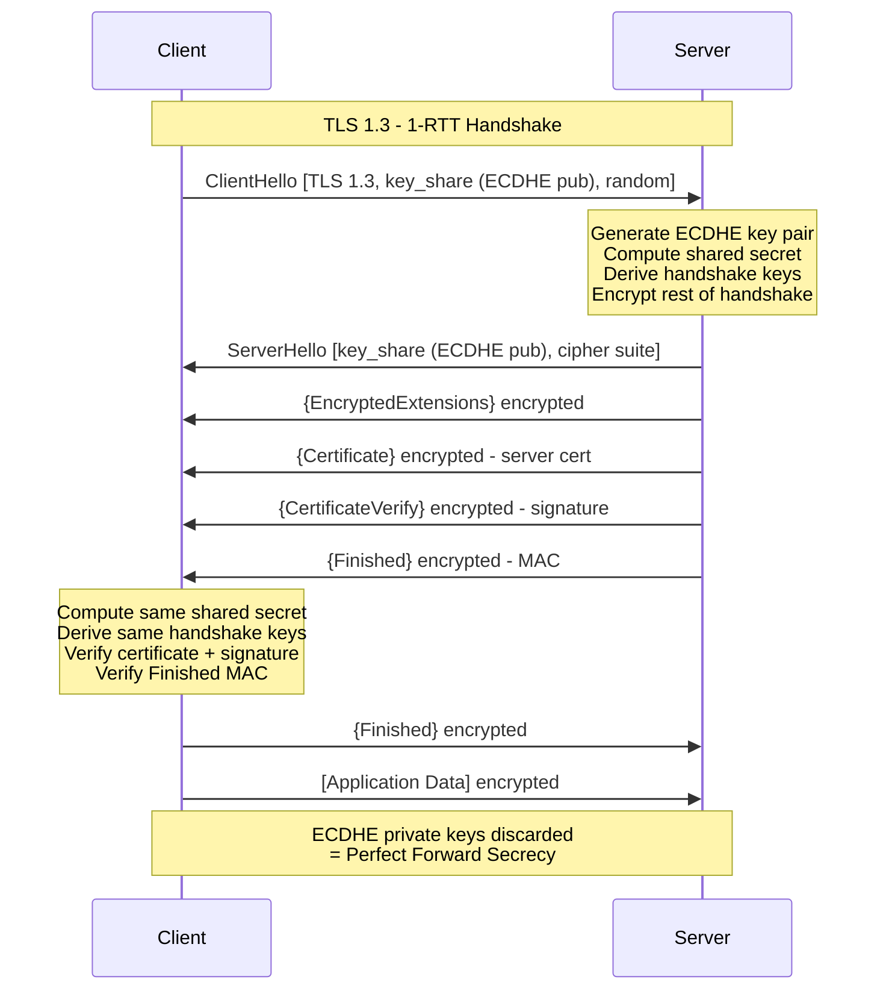

⚡ TL;DR - TLS 1.3 (RFC 8446, 2018) is a complete redesign of the TLS protocol, not an
incremental update. The five major changes and their security rationale: (1) ELIMINATED ALL
WEAK ALGORITHMS. TLS 1.2 supported 37+ cipher suites including RC4, 3DES, MD5, SHA-1,
RSA key exchange, CBC mode. TLS 1.3: only 5 cipher suites, all using AEAD (authenticated
encryption) and ECDHE (forward secrecy). No weak algorithms: nothing to misconfigure.
(2) MANDATORY PERFECT FORWARD SECRECY. TLS 1.2: RSA key exchange was common (and allowed).
RSA key exchange: the server's long-term private key can decrypt ALL past sessions if captured.
TLS 1.3: RSA key exchange is gone. Only ECDHE (ephemeral). Each session: a new key pair.
Past sessions: cannot be decrypted even if the server's private key is compromised.
(3) 1-RTT HANDSHAKE (vs. 2-RTT in TLS 1.2). TLS 1.2 full handshake: 2 round trips before
the first application data byte. TLS 1.3: 1 round trip. Result: faster connection establishment.
For high-latency connections (100ms RTT): TLS 1.3 saves 100ms per connection establishment.
(4) ENCRYPTED HANDSHAKE. In TLS 1.2: server certificate was sent in plaintext. An observer
could see which server the client is connecting to. TLS 1.3: encrypts the server certificate
(and extensions). Only the SNI (Server Name Indication) remains observable (needed for routing).
ECH (Encrypted Client Hello) is working to encrypt even the SNI in future versions.
(5) 0-RTT (ZERO ROUND-TRIP TIME) RESUMPTION. A client who previously connected can send
application data in the first flight without waiting for the handshake. Performance benefit:
100ms per resumed connection. Security cost: 0-RTT data is not forward-secret and is
vulnerable to replay attacks. 0-RTT must be used carefully with idempotent requests only.

---

| #130 | Category: Security | Difficulty: ★★★★ |
|:---|:---|:---|
| **Depends on:** | OWASP Top 10, Authentication, Business Logic, Insufficient Logging, CVSS Scoring, CVE + NVD, AWS Security Services, Kubernetes Security, Security Observability + SIEM, Security at Scale, ISO 27001, Chaos Engineering, Privilege Escalation, Zero Trust Introduction, Red/Blue/Purple Team, Zero Trust Enterprise, DevSecOps Pipeline, Security Champions, Enterprise Security Architecture, Secret Rotation, Security Governance, Threat Intelligence, CSIRT Design, Security Metrics, Supply Chain Security, Platform Security Engineering, Multi-Cloud Security, Build vs Buy, Security ADR, SIEM Architecture, SSDLC | |
| **Used by:** | Adversarial Thinking, Trust Boundary Analysis, Assume-Breach, Security as Contract, Threat Modeling | |
| **Related:** | All preceding SEC entries, Adversarial Thinking, Trust Boundary, Assume-Breach, Security as Contract, Threat Modeling | |

---

### 🔥 The Problem This Solves

**WHY TLS 1.2 NEEDED A REPLACEMENT:**

```
TLS 1.2 DESIGN FLAWS (accumulated over time):

  PROBLEM 1: TOO MANY CIPHER SUITES = MISCONFIGURATION SURFACE

  TLS 1.2 standard supports: 37+ cipher suites.
  Each: a different combination of:
    - Key exchange: RSA, ECDHE, DHE, DH, ECDH.
    - Authentication: RSA, ECDSA, DSA.
    - Bulk cipher: AES-256, AES-128, 3DES, RC4, DES, CAMELLIA, ARIA.
    - MAC: SHA-384, SHA-256, SHA, MD5.
    - Mode: GCM, CBC, CCM.
  
  NGINX TLS 1.2 default config: enabled 22 cipher suites.
  Some included: 3DES (SWEET32 attack, birthday attack at 768 MB).
  Some included: RC4 (multiple known attacks, NIST deprecated 2013).
  Some included: RSA key exchange (no forward secrecy - see PROBLEM 2).
  Some included: CBC mode (padding oracle attacks - BEAST, POODLE).
  
  Security engineer's job: configure NGINX with only the safe cipher suites.
  Easy to get wrong. Many production systems: got it wrong.
  
  TLS 1.3 solution: 5 cipher suites total. ALL safe. No misconfiguration possible.
  The only choice: which of the 5 to prefer (all are secure).
  
  PROBLEM 2: RSA KEY EXCHANGE (NO FORWARD SECRECY)

  TLS 1.2 RSA key exchange:
  1. Server: sends its certificate (containing RSA public key).
  2. Client: generates random pre-master secret. Encrypts with server's RSA public key.
  3. Server: decrypts pre-master secret with its RSA private key.
  4. Both: derive session key from pre-master secret + random nonces.
  
  ATTACK: network adversary records ALL TLS 1.2 RSA sessions.
  Later: obtains server's RSA private key (via breach, NSL, compulsion, or quantum computing).
  Result: ALL past sessions can be decrypted.
  This is NOT hypothetical:
  - NSA PRISM: collected encrypted TLS traffic with the intent to decrypt later.
  - QUANTUM THREAT: RSA is vulnerable to quantum computers (Shor's algorithm).
    A quantum computer with sufficient qubits: decrypts all historically collected RSA sessions.
    "Harvest now, decrypt later" attack: NSA-scale adversaries store encrypted traffic.
    When quantum computers are available: retroactively decrypt.
  
  TLS 1.3 solution: RSA key exchange eliminated.
  Only ECDHE (Elliptic Curve Diffie-Hellman Ephemeral).
  Ephemeral: new key pair per session. Old sessions: cannot be decrypted even with private key.
  Forward secrecy: the defining property of ECDHE.
  
  PROBLEM 3: 2-RTT HANDSHAKE LATENCY
  
  TLS 1.2 full handshake:
  RTT 1: ClientHello → ServerHello + Certificate + ServerHelloDone.
  RTT 2: ClientKeyExchange + ChangeCipherSpec + Finished → ChangeCipherSpec + Finished.
  First application data: after RTT 2.
  
  At 50ms RTT: 100ms minimum handshake overhead per new connection.
  For a mobile user (100ms RTT to CDN): 200ms overhead.
  For a global user (200ms RTT): 400ms overhead. Before the first byte of content.
  
  TLS 1.3 solution: 1-RTT handshake.
  Key share in ClientHello → server processes → sends encrypted response immediately.
  First application data: after 1 RTT. 50% reduction in handshake latency.
```

---

### 📘 Textbook Definition

**TLS (Transport Layer Security):** A cryptographic protocol that provides authentication,
confidentiality, and integrity for communications over a network (most commonly HTTPS over TCP).
TLS: two main components: (1) handshake protocol - authenticates the server (and optionally client),
negotiates protocol version and cipher suite, establishes shared session keys. (2) record protocol -
encrypts and authenticates application data using the session keys from the handshake. TLS: successor
to SSL (Secure Sockets Layer, deprecated due to multiple vulnerabilities).

**TLS 1.3 (RFC 8446):** Published in August 2018. Major changes from TLS 1.2: (1) removed all
weak cipher suites and algorithms (RC4, 3DES, CBC mode, RSA key exchange, DH key exchange, SHA-1,
MD5). (2) Reduced handshake to 1 round trip (vs. 2 in TLS 1.2). (3) Mandatory forward secrecy
(all key exchanges use ECDHE or DHE - both ephemeral). (4) Encrypted handshake (server certificate
sent encrypted). (5) 0-RTT resumption (performance optimization for resumed sessions, with security
trade-offs).

**Perfect Forward Secrecy (PFS):** A property of a key exchange where the compromise of the
server's long-term private key does not enable decryption of past session data. Achieved via
ephemeral key pairs (ECDHE, DHE): a new key pair generated per session. Old key pairs: discarded.
Even if the current private key is compromised: past sessions (with old ephemeral keys) cannot
be decrypted. PFS is mandatory in TLS 1.3, optional (but recommended) in TLS 1.2.

**ECDHE (Elliptic Curve Diffie-Hellman Ephemeral):** A key exchange algorithm that uses elliptic
curve cryptography for the Diffie-Hellman key exchange, with ephemeral (per-session) key pairs.
The "elliptic curve" component: provides equivalent security to traditional DH with smaller key
sizes (256-bit ECDHE is equivalent to 3072-bit RSA in security). The "ephemeral" component:
provides forward secrecy. TLS 1.3 supports: X25519 (Curve 25519), P-256 (NIST P-256), P-384,
P-521, X448.

**0-RTT (Zero Round-Trip Time):** A TLS 1.3 optimization for resumed sessions. A client with a
previously established session can send application data in the first flight (without waiting for
the handshake to complete). The server processes the data before the handshake is complete.
Security trade-offs: (1) 0-RTT data is vulnerable to replay attacks. An adversary can capture
and re-send the first flight → the server processes the request twice. Must be used ONLY with
idempotent requests. (2) 0-RTT data lacks forward secrecy (uses the resumption pre-shared key,
not a new ephemeral key). (3) The server cannot prevent replay without maintaining state.

**AEAD (Authenticated Encryption with Associated Data):** Encryption that provides both
confidentiality AND integrity/authentication in a single operation. TLS 1.3 exclusive
cipher suites: all use AEAD. AES-128-GCM, AES-256-GCM (AES-GCM AEAD), ChaCha20-Poly1305
(ChaCha20 stream cipher with Poly1305 MAC). AEAD eliminates the MAC-then-Encrypt vs.
Encrypt-then-MAC ambiguity present in CBC mode (which led to padding oracle attacks in TLS 1.2).

---

### ⏱️ Understand It in 30 Seconds

**One line:**
TLS 1.3 was a deliberate security redesign that eliminated all the cryptographic weaknesses
accumulated in TLS 1.2 (weak cipher suites, RSA key exchange without forward secrecy, CBC mode
padding oracles) while simultaneously improving performance (1-RTT vs. 2-RTT handshake, 0-RTT
resumption) - demonstrating that security and performance are not inherently in conflict when
protocols are designed correctly from the start.

**One analogy:**
> TLS 1.2 vs. TLS 1.3 is the old hotel keycard vs. modern contactless keycard.
>
> Old hotel keycard (TLS 1.2 era):
> - 37 different key formats available. Some: secure. Some: easily copied.
>   Hotel staff: must know which formats to use. Easy to misconfigure.
> - The key: a copy of the master key.
>   If the master key is stolen: ALL old keys that were derived from it can be duplicated.
>   No forward secrecy: compromise of the master → compromise of all past keys.
> - Check-in: slow (2 trips to front desk - TLS 1.2's 2-RTT handshake).
> - In-room safe: combination is visible from outside (certificate sent in plaintext).
>
> Modern contactless keycard (TLS 1.3):
> - 5 secure key formats only. All equally secure. No misconfiguration possible.
> - The key: a single-use code, derived fresh for each stay.
>   Master key compromised: past stays' keys: useless (ephemeral, already discarded).
>   This is forward secrecy.
> - Check-in: streamlined (1 trip to front desk - TLS 1.3's 1-RTT handshake).
>   Returning guest: walks straight in (0-RTT, pre-shared key from last stay).
>   Replay risk: if someone copies the returning guest's keycard exactly (0-RTT replay).
>   Hotel solution: only accept this keycard for idempotent actions (entering the room),
>   not for charging the minibar (non-idempotent).
> - In-room safe: combination hidden from outside (encrypted certificate).
>
> The old key system: 37 formats, accumulated over 20 years of incremental changes.
> The new system: designed from scratch for security, with performance built in.

---

### 🔩 First Principles Explanation

**TLS 1.3 handshake deep-dive:**

```
TLS 1.2 FULL HANDSHAKE (2-RTT):

CLIENT                              SERVER
  |                                    |
  |---ClientHello {TLS 1.2,           |
  |    supported cipher suites,        |
  |    random nonce}----------------->|
  |                                    |
  |<--ServerHello {cipher suite,      |
  |    random nonce}                  |
  |<--Certificate {RSA public key}    |
  |<--ServerHelloDone-----------------| RTT 1
  |                                    |
  |---ClientKeyExchange               |
  |   {PreMasterSecret encrypted      |
  |    with server's RSA public key}  |
  |---ChangeCipherSpec                |
  |---Finished-{MAC of handshake}---->|
  |                                    |
  |<--ChangeCipherSpec                |
  |<--Finished---{MAC of handshake}--| RTT 2
  |                                    |
  |---[Application Data]------------->| DATA
  
  Total: 2 RTT before first data byte.
  RSA key exchange: CLIENT sends encrypted pre-master secret.
  If server's RSA private key is captured later: ALL past sessions decryptable.
  No forward secrecy.

TLS 1.3 HANDSHAKE (1-RTT):

CLIENT                              SERVER
  |                                    |
  |---ClientHello {TLS 1.3,           |
  |    supported cipher suites,        |
  |    key_share (ECDHE public key),   |
  |    random nonce}----------------->|
  |                                    |
  |     [Server performs ECDHE KA]     |
  |     [Derives handshake keys]       |
  |     [Encrypts remaining handshake] |
  |                                    |
  |<--ServerHello {key_share,         |
  |    (ECDHE server public key)}     |
  |<--{EncryptedExtensions}           |
  |<--{Certificate (encrypted!)}      |
  |<--{CertificateVerify (signature)} |
  |<--{Finished}---------------------| RTT 1
  |                                    |
  |   [Client derives same keys]       |
  |   [Verifies certificate + sig]     |
  |                                    |
  |---Finished----------------------->|
  |---[Application Data]------------->| DATA

  Total: 1 RTT before first data byte.
  ECDHE key exchange: server and client both generate ephemeral key pairs.
  After handshake: ephemeral private keys DISCARDED.
  Past sessions: cannot be decrypted. FORWARD SECRECY.
  Certificate: sent ENCRYPTED (inside encrypted handshake). Privacy improvement.

TLS 1.3 0-RTT RESUMPTION:

CLIENT                              SERVER
  |                                    |
  |---ClientHello {                   |
  |    pre_shared_key (from last session),
  |    early_data (app data)}-------->|
  |                                    |
  |     [Server: identifies PSK]       |
  |     [Derives early_data keys]      |
  |     [Processes early_data]         |
  |                                    |
  |<--ServerHello {key_share, PSK}    |
  |<--early_data accepted/rejected    |
  |<--{EncryptedExtensions}           |
  |<--{Certificate}                   |
  |<--{Finished}---------------------| RTT 1
  |---Finished----------------------->|
  |---[More application data]-------->|

  0-RTT DATA SENT BEFORE SERVER RESPONDS.
  No forward secrecy for 0-RTT data (uses PSK from last session).
  Replay attack risk: server sees early_data twice if adversary replays.
  MITIGATION: only use 0-RTT for idempotent requests (GET, not POST).
  SERVER OPTION: reject 0-RTT ("early_data rejected") → client falls back to 1-RTT.

TLS 1.3 CIPHER SUITES (all 5 are AEAD):

  TLS_AES_256_GCM_SHA384        (AES-256 in GCM + SHA-384)
  TLS_CHACHA20_POLY1305_SHA256  (ChaCha20 + Poly1305 + SHA-256)
  TLS_AES_128_GCM_SHA256        (AES-128 in GCM + SHA-256)
  TLS_AES_128_CCM_SHA256        (AES-128 in CCM + SHA-256)
  TLS_AES_128_CCM_8_SHA256      (AES-128 in CCM with 8-byte tag)

  ALL: use ECDHE for key exchange (mandatory in TLS 1.3, not in cipher suite string).
  ALL: are AEAD (no separate MAC needed, no CBC mode, no padding oracle possible).
  0 weak options. Nothing to misconfigure.
```

---

### 🧪 Thought Experiment

**SCENARIO: Evaluating TLS 1.2 vs. TLS 1.3 for a high-traffic API gateway:**

```
CONTEXT:
  API gateway: 100,000 requests/second.
  Connection pattern: most clients: long-lived connections (HTTP/2 multiplexing).
  Some clients: mobile apps, short-lived connections (one request, reconnect).
  RTT: avg 50ms (domestic), avg 150ms (international).
  
TLS HANDSHAKE COST ANALYSIS:

  TLS 1.2 (RSA key exchange, 2-RTT):
  Domestic: 2 × 50ms = 100ms per new connection.
  International: 2 × 150ms = 300ms per new connection.
  
  TLS 1.2 (ECDHE, session resumption, ~1 RTT if session ticket cached):
  Domestic resumed: ~50ms.
  International resumed: ~150ms.
  
  TLS 1.3 (full handshake, 1-RTT):
  Domestic new: 50ms.
  International new: 150ms.
  
  TLS 1.3 (0-RTT resumption, domestic):
  Domestic resumed: near-0ms (data in first flight, server processes before RTT completes).
  International resumed: near-0ms.
  
  PERFORMANCE WINNER: TLS 1.3.
  For mobile clients with short-lived connections + 150ms RTT:
  TLS 1.2: 300ms per connection establishment.
  TLS 1.3 with 0-RTT: near-0ms per resumed connection.
  
0-RTT SECURITY POLICY:

  Enable 0-RTT only for: HTTP GET requests (idempotent, safe to replay).
  Disable 0-RTT for: POST, PUT, DELETE, PATCH (non-idempotent).
  
  Implementation:
  NGINX TLS 1.3 0-RTT configuration:
    ssl_early_data on;              # Enable 0-RTT
    add_header Early-Data $ssl_early_data;  # Pass to app
  
  Application: check the Early-Data header.
  If request is POST/PUT/DELETE and Early-Data: 1 → reject with 425 Too Early.
  If request is GET and Early-Data: 1 → process (idempotent, replay-safe).
  
CERTIFICATE CONFIGURATION COMPARISON:

  TLS 1.2 + RSA certificate:
  RSA-2048 signature: ~3ms server-side compute per handshake.
  RSA key exchange: server must decrypt pre-master secret.
  RSA-2048 decryption: ~2ms. Total: ~5ms server-side per TLS 1.2 RSA handshake.
  At 10,000 new connections/second: 50,000ms (50 seconds of compute) per second.
  Requires: dedicated hardware (HSM or SSL offload card) at scale.
  
  TLS 1.3 + ECDSA certificate (P-256):
  ECDSA P-256 signature verify: ~0.2ms. ECDHE key generation: ~0.1ms.
  Total: ~0.3ms per TLS 1.3 ECDSA handshake. 16x faster than TLS 1.2 RSA.
  At 10,000 new connections/second: 3,000ms (3 seconds of compute) per second.
  Handles: 3x the TLS connection rate at the same CPU cost.
  
  RECOMMENDATION: TLS 1.3 + ECDSA P-256 certificate.
  Performance: 16x faster per handshake than TLS 1.2 + RSA.
  Security: stronger (ECDHE mandatory, AES-256-GCM AEAD only).
  Forward secrecy: guaranteed (no RSA key exchange possible in TLS 1.3).
```

---

### 🧠 Mental Model / Analogy

> TLS 1.3's elimination of weak algorithms is the principle of "secure by default."
>
> A gun safety: secure by default means the safety is ON until you explicitly switch it OFF.
> A car door lock: secure by default means the doors lock automatically when you start driving.
> A security camera: secure by default means it requires authentication before live viewing.
>
> TLS 1.2: was "secure by configuration."
> 37 cipher suites: available. Some: secure. Some: weak.
> The administrator: must configure the server to use only the secure ones.
> Many administrators: didn't. Production servers: ran with RC4, 3DES, SHA-1, MD5.
> Security researchers: published papers. Attacks followed. Patches required. Repeat.
>
> TLS 1.3: "secure by default."
> 5 cipher suites: all secure. There is no "insecure option to disable."
> The administrator: cannot misconfigure TLS 1.3 into an insecure state.
> (They can configure an insecure TLS version, but that's a configuration of a different protocol.)
>
> The "secure by default" principle: the most reliable way to achieve security at scale.
> If the default state is secure: most deployments are secure (most admins use defaults).
> If the default state is insecure: most deployments are insecure.
>
> The broader principle:
> API keys in code vs. secret manager: environment variable (insecure default) vs.
>  secret manager (secure, requires opt-out to be insecure).
> Open network ACL vs. deny-by-default: allow all (insecure default) vs. deny all (secure,
>  must explicitly allow what's needed).
> Admin by default vs. least privilege: new user = admin (insecure default) vs.
>  new user = least privilege (secure, must explicitly grant more).
>
> Security by default: ensures that the common case (most deployments, most users, most configs)
> is the secure case. Security by configuration: relies on every administrator making correct choices.
> At scale: some will not. The secure default: eliminates that risk.

---

### 📶 Gradual Depth - Five Levels

**Level 1 - What it is (anyone can understand):**
TLS 1.3 is the latest version of the security protocol that protects HTTPS connections. Every time your browser shows a padlock icon, TLS is protecting that connection. TLS 1.3 is safer than the older TLS 1.2 for two main reasons: (1) it eliminated all the weak encryption options that were still available in TLS 1.2 and had been attacked by security researchers. With TLS 1.3, there are only safe options - nothing to misconfigure. (2) It added a property called "perfect forward secrecy" to ALL connections, meaning that even if someone recorded all your encrypted traffic for years and then later got the server's private key, they still couldn't read those past conversations. Each connection's encryption keys are unique and are never saved.

**Level 2 - How to use it (junior developer):**
As a developer, you interact with TLS through configuration. In NGINX: `ssl_protocols TLSv1.3;` (restrict to TLS 1.3 only, if compatibility allows) or `ssl_protocols TLSv1.2 TLSv1.3;` (TLS 1.2 as fallback for old clients). For TLS 1.3: `ssl_ciphers 'TLS_AES_256_GCM_SHA384:TLS_CHACHA20_POLY1305_SHA256:TLS_AES_128_GCM_SHA256';` For TLS 1.2 (if you must support it): use only: `ECDHE-ECDSA-AES256-GCM-SHA384:ECDHE-RSA-AES256-GCM-SHA384:ECDHE-ECDSA-CHACHA20-POLY1305:ECDHE-RSA-CHACHA20-POLY1305`. Never include: RC4, DES, 3DES, MD5, NULL cipher, EXPORT ciphers. Test your configuration with: `testssl.sh` (free) or SSL Labs (online). Grade: A+ requires TLS 1.3 support + no TLS 1.0/1.1 + HSTS + no weak cipher suites.

**Level 3 - How it works (mid-level engineer):**
The TLS 1.3 handshake - what actually happens: (1) Client sends ClientHello with: supported cipher suites, the client's ECDHE public key share (key_share extension), random nonce. The client GUESSES which ECDHE curve the server will accept and includes the key share pre-emptively. If the guess is right: 1 RTT handshake. If wrong: server sends HelloRetryRequest (adds 1 RTT). Servers: typically accept X25519 and P-256. Clients: include both in the first flight. (2) Server: receives ClientHello, selects cipher suite and key share curve, generates its own ECDHE key pair, computes the shared secret (ECDH(client_pub_key, server_priv_key)), derives handshake keys, sends ServerHello (with server's key_share) + sends EncryptedExtensions + Certificate + CertificateVerify + Finished - ALL encrypted with the handshake keys. (3) Client: receives ServerHello, computes same shared secret (ECDH(server_pub_key, client_priv_key)), derives same handshake keys, decrypts and verifies the certificate and Finished MAC, sends its own Finished. (4) Both: derive the application traffic keys from the handshake. ECDHE private keys: discarded. Forward secrecy established.

**Level 4 - Why it was designed this way (senior/staff):**
The TLS 1.3 design process (2014-2018): a deliberate response to accumulated protocol weaknesses. NIST conducted a formal analysis of TLS 1.2 in 2013-2014. Findings: 37+ cipher suites create a massive misconfiguration surface. RSA key exchange has no forward secrecy and is vulnerable to retroactive decryption. CBC mode is vulnerable to padding oracle attacks (BEAST, POODLE, LUCKY13). SSL and TLS negotiation downgrade attacks (POODLE, FREAK, DROWN): allow an attacker to force a connection to use an older, weaker protocol version. The TLS 1.3 response to each: eliminate weak algorithms (not restrict - eliminate). Mandatory ECDHE (forward secrecy by default, not by configuration). AEAD only (eliminating CBC mode and its padding oracle attacks). Strict version negotiation (no downgrade to TLS 1.2 or earlier via the TLS 1.3 protocol). This design philosophy: "secure by design, not secure by configuration." The performance improvement (1-RTT vs. 2-RTT) was a design requirement, not a bonus. The TLS working group: recognized that slower security protocols are avoided. Performance: a security feature - if the secure protocol is also the faster protocol, adoption is not a tradeoff.

**Level 5 - Mastery (distinguished engineer):**
The "harvest now, decrypt later" threat model and TLS 1.3's forward secrecy: at the highest level, the design of TLS 1.3's mandatory forward secrecy is a response to a specific advanced persistent threat scenario. Nation-state adversaries with large-scale passive network monitoring capabilities (as revealed by the Snowden documents in 2013) collected and stored encrypted TLS traffic. The intention: decrypt it when either (a) the server's RSA private key is obtained via legal compulsion, theft, or purchase, or (b) quantum computers become available (Shor's algorithm decrypts RSA in polynomial time). TLS 1.2 with RSA key exchange: fully vulnerable to this attack. All historically collected traffic from TLS 1.2 RSA sessions: potentially decryptable with a sufficiently powerful quantum computer or a compromised RSA key. TLS 1.3's mandatory ECDHE: specifically designed to defeat this threat model. Ephemeral ECDHE keys: discarded after each session. Even if a nation-state stores all TLS 1.3 session traffic AND later obtains the server's certificate private key AND deploys a quantum computer: they cannot decrypt TLS 1.3 ECDHE sessions, because the ephemeral ECDHE keys (needed to reproduce the session key) were discarded immediately after the handshake. The quantum component: TLS 1.3 uses ECDHE, which IS vulnerable to quantum computers (Shor's algorithm applies). Post-quantum cryptography (ML-KEM, formerly Kyber, specified in NIST FIPS 203) is being integrated into TLS via hybrid key exchange: ECDHE + ML-KEM together. Chrome and Cloudflare began deploying ECDHE + ML-KEM hybrid TLS in 2024. The intent: "harvest now, decrypt later" with quantum computers: defeated even against the hybrid ECDHE + ML-KEM session, because breaking the combined key exchange requires breaking BOTH ECDHE AND ML-KEM.

---

### ⚙️ How It Works (Mechanism)

```
TLS 1.3 VS TLS 1.2 HANDSHAKE COMPARISON:

  TLS 1.2:                TLS 1.3:
  Client → Server         Client → Server
  (ClientHello)           (ClientHello + key_share) ← includes ECDHE key
  
  Server → Client         Server → Client
  (ServerHello            (ServerHello + key_share +
   + Certificate            {Encrypted: Certificate,
   + ServerHelloDone)        CertificateVerify, Finished})
  
  Client → Server         Client → Server
  (ClientKeyExchange       (Finished)
   + ChangeCipherSpec      + [Application Data] ← DATA HERE
   + Finished)
  
  Server → Client         ---no more roundtrips needed---
  (ChangeCipherSpec
   + Finished)
  
  Client → Server
  + [Application Data]
  
  = 2 RTT               = 1 RTT
  = No forward secrecy  = Perfect Forward Secrecy (ECDHE)
  (if RSA key exchange)
```



---

### 💻 Code Example

**TLS configuration and verification:**

```python
# tls13_configuration.py
# Demonstrates how to configure and verify TLS 1.3 in Python.
# Shows: cipher suite verification, certificate inspection, forward secrecy check.

import ssl
import socket
import json
from datetime import datetime

def create_tls13_context() -> ssl.SSLContext:
    """
    Create an SSL context that enforces TLS 1.3.
    
    BAD approach: use the default SSL context (allows TLS 1.0, 1.1, 1.2).
    GOOD approach: explicitly restrict to TLS 1.3 (or 1.2 as fallback with
    secure cipher suites only).
    """
    # WRONG: default context allows weak TLS versions
    # bad_ctx = ssl.create_default_context()  # allows TLS 1.0, 1.1, 1.2
    
    # CORRECT: restrict minimum version to TLS 1.2 (1.3 preferred)
    ctx = ssl.SSLContext(ssl.PROTOCOL_TLS_CLIENT)
    ctx.minimum_version = ssl.TLSVersion.TLSv1_2
    ctx.maximum_version = ssl.TLSVersion.TLSv1_3
    
    # Prefer TLS 1.3 cipher suites; for TLS 1.2 fallback: only ECDHE + AEAD
    # Python uses OpenSSL's cipher string for TLS 1.2:
    ctx.set_ciphers(
        "ECDHE-ECDSA-AES256-GCM-SHA384:"
        "ECDHE-RSA-AES256-GCM-SHA384:"
        "ECDHE-ECDSA-CHACHA20-POLY1305:"
        "ECDHE-RSA-CHACHA20-POLY1305:"
        "ECDHE-ECDSA-AES128-GCM-SHA256:"
        "ECDHE-RSA-AES128-GCM-SHA256"
        # No: RSA key exchange, 3DES, RC4, CBC without AEAD, NULL
    )
    
    # Certificate verification: mandatory
    ctx.check_hostname = True
    ctx.verify_mode = ssl.CERT_REQUIRED
    
    return ctx


def verify_tls_connection(host: str, port: int = 443) -> dict:
    """
    Connect to a server and inspect TLS properties.
    Returns: TLS version, cipher suite, key exchange algorithm, and forward secrecy status.
    
    Useful for verifying that a server is correctly configured for TLS 1.3.
    """
    ctx = create_tls13_context()
    
    with socket.create_connection((host, port), timeout=10) as sock:
        with ctx.wrap_socket(sock, server_hostname=host) as ssl_sock:
            # Get the negotiated TLS version
            tls_version = ssl_sock.version()
            
            # Get the negotiated cipher suite
            cipher_name, protocol, bits = ssl_sock.cipher()
            
            # Get the server's certificate
            cert = ssl_sock.getpeercert()
            
            # Check: is this TLS 1.3?
            is_tls13 = tls_version == "TLSv1.3"
            
            # Check: is this cipher suite AEAD?
            # TLS 1.3 ciphers: all AEAD. TLS 1.2: only GCM/CCM/Poly1305 are AEAD.
            is_aead = any(
                aead in cipher_name
                for aead in ["GCM", "CCM", "POLY1305"]
            )
            
            # Check: does this cipher suite have forward secrecy?
            # TLS 1.3: always (ECDHE mandatory).
            # TLS 1.2: only ECDHE and DHE cipher suites have forward secrecy.
            has_forward_secrecy = is_tls13 or cipher_name.startswith("ECDHE") or \
                                   cipher_name.startswith("DHE")
            
            # Check certificate validity
            not_before = datetime.strptime(
                cert["notBefore"], "%b %d %H:%M:%S %Y %Z"
            )
            not_after = datetime.strptime(
                cert["notAfter"], "%b %d %H:%M:%S %Y %Z"
            )
            days_until_expiry = (not_after - datetime.utcnow()).days
            
            return {
                "host": host,
                "tls_version": tls_version,
                "cipher_suite": cipher_name,
                "key_bits": bits,
                "is_tls13": is_tls13,
                "is_aead": is_aead,
                "has_forward_secrecy": has_forward_secrecy,
                "certificate_subject": dict(x[0] for x in cert["subject"]),
                "certificate_expires": not_after.isoformat(),
                "days_until_expiry": days_until_expiry,
                "certificate_expired": days_until_expiry < 0,
                "certificate_expiring_soon": 0 <= days_until_expiry < 30,
            }


def check_tls_configuration_health(
    results: dict
) -> list:
    """
    Evaluate TLS configuration health. Returns a list of findings.
    """
    findings = []
    
    if not results["is_tls13"]:
        findings.append({
            "severity": "MEDIUM",
            "finding": f"TLS version {results['tls_version']} in use (prefer TLS 1.3)",
            "remediation": "Configure server to support TLS 1.3"
        })
    
    if not results["has_forward_secrecy"]:
        findings.append({
            "severity": "HIGH",
            "finding": (
                f"Cipher suite {results['cipher_suite']} has no forward secrecy. "
                f"RSA key exchange: server private key compromise → all sessions decryptable."
            ),
            "remediation": "Use only ECDHE or DHE cipher suites (TLS 1.3: automatic)"
        })
    
    if not results["is_aead"]:
        findings.append({
            "severity": "MEDIUM",
            "finding": (
                f"Cipher suite {results['cipher_suite']} is not AEAD. "
                "CBC mode: vulnerable to padding oracle attacks."
            ),
            "remediation": "Use only AES-GCM or ChaCha20-Poly1305 cipher suites"
        })
    
    if results["certificate_expired"]:
        findings.append({
            "severity": "CRITICAL",
            "finding": "Certificate is EXPIRED",
            "remediation": "Renew certificate immediately"
        })
    elif results["certificate_expiring_soon"]:
        findings.append({
            "severity": "HIGH",
            "finding": (
                f"Certificate expires in {results['days_until_expiry']} days"
            ),
            "remediation": "Renew certificate before expiry"
        })
    
    return findings


# NGINX TLS 1.3 CONFIGURATION EXAMPLE
NGINX_TLS13_CONFIG = """
# NGINX TLS 1.3 configuration with security best practices.
# Only TLS 1.2 and 1.3. No TLS 1.0, 1.1 (both: deprecated).

server {
    listen 443 ssl http2;
    server_name example.com;
    
    ssl_certificate     /etc/ssl/certs/example.com.crt;
    ssl_certificate_key /etc/ssl/private/example.com.key;
    
    # TLS versions: only 1.2 and 1.3 (TLS 1.0, 1.1: deprecated)
    ssl_protocols TLSv1.2 TLSv1.3;
    
    # TLS 1.3 ciphers: all 3 preferred ciphers (NGINX selects based on server preference)
    # TLS 1.2 ciphers: only ECDHE + AEAD (no RSA key exchange, no CBC mode)
    ssl_ciphers 'TLS_AES_256_GCM_SHA384:TLS_CHACHA20_POLY1305_SHA256:TLS_AES_128_GCM_SHA256:ECDHE-ECDSA-AES256-GCM-SHA384:ECDHE-RSA-AES256-GCM-SHA384:ECDHE-ECDSA-CHACHA20-POLY1305:ECDHE-RSA-CHACHA20-POLY1305';
    ssl_prefer_server_ciphers on;
    
    # ECDH curves: X25519 first (fastest, 128-bit security), then P-256 (NIST, widely supported)
    ssl_ecdh_curve X25519:P-256:P-384;
    
    # Session resumption: TLS session tickets (performance: resumption without 0-RTT replay risk)
    ssl_session_timeout 1d;
    ssl_session_cache shared:MozSSL:10m;
    ssl_session_tickets off;  # Session tickets: forward secrecy concern. Disable if PFS is critical.
    
    # TLS 1.3 0-RTT: disabled by default (replay attack risk).
    # ssl_early_data on;  # Only enable if application handles Early-Data header correctly.
    
    # HSTS: tell browsers to always use HTTPS for this domain (1 year).
    add_header Strict-Transport-Security "max-age=31536000; includeSubDomains" always;
    
    # OCSP Stapling: performance optimization (avoid client OCSP request during handshake)
    ssl_stapling on;
    ssl_stapling_verify on;
    resolver 8.8.8.8 8.8.4.4 valid=300s;
}
"""
```

---

### ⚖️ Comparison Table

| Property | TLS 1.2 (default config) | TLS 1.2 (hardened) | TLS 1.3 |
|:---|:---|:---|:---|
| **Weak cipher suites** | Yes (RC4, 3DES, CBC) | No (configured out) | Impossible (not in spec) |
| **Forward secrecy** | Optional (if ECDHE configured) | Yes (ECDHE only) | Always (ECDHE mandatory) |
| **AEAD only** | No (CBC allowed) | Yes (GCM/CCM/Poly1305) | Always (only AEAD cipher suites) |
| **Handshake RTTs** | 2 (full), ~1 (resumed) | 2 (full), ~1 (resumed) | 1 (full), 0 (resumed with 0-RTT) |
| **Certificate encrypted** | No (plaintext) | No | Yes (inside encrypted handshake) |
| **Downgrade attacks** | Possible (POODLE, FREAK) | Mitigated (with TLS_FALLBACK_SCSV) | Not possible via TLS 1.3 protocol |
| **Misconfiguration risk** | High (37+ cipher suites) | Medium (must select carefully) | Near-zero (5 cipher suites, all safe) |

---

### ⚠️ Common Misconceptions

| Misconception | Reality |
|:---|:---|
| "TLS 1.2 is still secure if properly configured." | This is technically true but operationally misleading. TLS 1.2 properly configured means: only ECDHE cipher suites (no RSA key exchange), only AES-GCM or ChaCha20-Poly1305 cipher suites (no CBC mode), no TLS 1.0/1.1 fallback, HSTS enabled. This configuration: correctly implements TLS 1.2 at a secure level. But "properly configured TLS 1.2" describes a tiny minority of production TLS 1.2 deployments. The majority: still have RC4, 3DES, or CBC mode enabled because the default nginx/Apache/IIS configurations include them. TLS 1.3: eliminates the "properly configured" requirement. There is no improperly configured TLS 1.3 from a cipher suite perspective - all 5 cipher suites are secure. The practical argument for TLS 1.3: not "TLS 1.2 is insecure" but "TLS 1.2 is secure only when correctly configured, and most deployments are not correctly configured." |
| "0-RTT is always a security risk and should never be used." | 0-RTT has a specific replay vulnerability: an attacker can capture the client's first flight and replay it, causing the server to process the same request twice. For non-idempotent operations (POST/PUT/DELETE): this is catastrophic (a payment request replayed = double charge). For idempotent operations (GET with no side effects): replay is harmless (reading the same resource twice). The correct policy: enable 0-RTT, but have the application reject it for non-idempotent operations. NGINX: passes the `Early-Data` header to the application when 0-RTT data arrives. The application: checks for `Early-Data: 1` on non-idempotent requests and returns 425 Too Early. This allows: the performance benefit of 0-RTT for GET requests (safe) while preventing replay on POST/PUT/DELETE (unsafe). The blanket "never use 0-RTT": discards significant performance gains for idempotent requests unnecessarily. |

---

### 🚨 Failure Modes & Diagnosis

**TLS configuration failure patterns:**

```
FAILURE 1: TLS 1.0/1.1 STILL ENABLED (PCI DSS COMPLIANCE FAILURE)

  Symptom: PCI DSS audit finding: "TLS 1.0 is enabled. Non-compliant since June 2018."
  PCI DSS 3.2.1 requirement: TLS 1.0 must be disabled by June 30, 2018.
  TLS 1.1: not recommended, should be disabled.
  
  Detection:
  testssl.sh example.com | grep "TLS 1.0"
  nmap --script ssl-enum-ciphers -p 443 example.com | grep "TLSv1.0"
  
  Root cause: load balancer or NGINX default config.
  "ssl_protocols TLSv1 TLSv1.1 TLSv1.2;" → includes TLS 1.0 and 1.1.
  
  Fix:
  ssl_protocols TLSv1.2 TLSv1.3;  # Remove TLSv1 and TLSv1.1
  
  After fixing: test with older browsers (IE 11 on Windows XP: TLS 1.2 capable but must be enabled).
  If enterprise customers require TLS 1.0: document the exception, apply compensating controls.
  But: target is TLS 1.2+ for all traffic.

FAILURE 2: RSA KEY EXCHANGE STILL ENABLED (NO FORWARD SECRECY)

  Symptom: Qualys SSL Labs: grade A- (not A+). Reason: "Forward Secrecy is not supported by
  all cipher suites." One cipher suite: TLS_RSA_WITH_AES_256_GCM_SHA384 (RSA key exchange).
  
  Root cause: cipher string includes RSA key exchange ciphers as fallback.
  ssl_ciphers includes: RSA (no prefix) cipher suite.
  
  Detection:
  openssl s_client -connect example.com:443 -cipher "aRSA" 2>/dev/null | grep "Cipher"
  If output shows a cipher: RSA key exchange is still possible.
  
  Fix: explicitly exclude RSA key exchange in cipher string:
  ssl_ciphers 'ECDHE-ECDSA-AES256-GCM-SHA384:ECDHE-RSA-AES256-GCM-SHA384:...';
  Cipher strings starting with "ECDHE": only ECDHE key exchange (forward secrecy).
  Never include: cipher strings starting with "AES" or "RSA" (no ECDHE prefix = RSA key exchange).
  
  For TLS 1.3: not needed (RSA key exchange not in TLS 1.3 at all).

TLS HEALTH CHECK COMMANDS:

  # Test TLS versions supported
  testssl.sh --protocols example.com
  
  # Test cipher suites
  testssl.sh --ciphers example.com
  
  # Full SSL Labs equivalent (free, open source)
  testssl.sh example.com | grep -E "MEDIUM|WEAK|VULNERABLE|OK"
  
  # Check specific cipher
  openssl s_client -connect example.com:443 \
    -cipher "ECDHE-RSA-AES256-GCM-SHA384" -tls1_2 2>/dev/null \
    | grep "Cipher is"
  
  # Verify TLS 1.3 works
  openssl s_client -connect example.com:443 \
    -tls1_3 2>/dev/null \
    | grep "Protocol"
```

---

### 🔗 Related Keywords

**Prerequisites:**
- `Authentication and Session Management` (SEC-013) - TLS secures the transport for authentication
- `Enterprise Security Architecture` (SEC-099) - TLS configuration is part of enterprise security architecture

**Builds on this:**
- `Trust Boundary Analysis` (SEC-141) - trust boundaries: where TLS termination decisions occur
- `Security as Contract` (SEC-143) - TLS configuration as a security contract in service communication

---

### 📌 Quick Reference Card

```
┌──────────────────────────────────────────────────────────┐
│ TLS 1.3 WINS  │ 5 cipher suites (all AEAD, all safe)    │
│               │ ECDHE mandatory (forward secrecy always) │
│               │ 1-RTT vs 2-RTT (faster handshake)        │
│               │ Encrypted certificate (more privacy)      │
│               │ No downgrade to weak algorithms           │
├───────────────┼──────────────────────────────────────────┤
│ 0-RTT         │ Enable for idempotent GET requests only  │
│               │ Reject for POST/PUT/DELETE (replay risk) │
│               │ Check Early-Data header in application   │
├───────────────┼──────────────────────────────────────────┤
│ CONFIG        │ ssl_protocols TLSv1.2 TLSv1.3;          │
│               │ ECDHE-only cipher suites for TLS 1.2    │
│               │ Disable: TLS 1.0, TLS 1.1, RSA key exch│
├───────────────┼──────────────────────────────────────────┤
│ TEST          │ testssl.sh + Qualys SSL Labs: grade A+   │
│               │ Verify: TLS 1.3 works, no RC4/3DES/CBC  │
│               │ Verify: ECDHE forward secrecy confirmed  │
└──────────────────────────────────────────────────────────┘
```

---

### 💎 Transferable Wisdom

**Reusable Engineering Principle:**
"Protocol design must account for the threat model over the protocol's entire lifetime."
TLS 1.2 was designed in 2008. By 2015: multiple cipher suites in the spec were broken.
By 2020: the "harvest now, decrypt later" threat with quantum computers changed the RSA
key exchange risk model retroactively.
The lesson: a protocol's security properties must be evaluated not just at design time but
over the 10-20 year lifetime the protocol will be in use.
TLS 1.3's design: incorporated this lesson.
Mandatory forward secrecy: ensures that even a future quantum computer cannot decrypt
historical TLS 1.3 traffic (because the ephemeral ECDHE keys were discarded).
AEAD only: ensures that future research on CBC mode attacks cannot affect TLS 1.3.
Only 5 cipher suites: ensures that future weak algorithm discoveries (like RC4 in TLS 1.2)
cannot be present in TLS 1.3 (because the algorithm is not in the spec).
This "design for the future threat model" principle: applies to all security protocol design.
The threat model in 5 years will include: quantum computers (NIST post-quantum: 2024 standards).
The threat model in 10 years: potentially powerful enough to affect current elliptic curves.
The protocol design: must account for these.
The TLS working group: incorporated hybrid post-quantum key exchange (ECDHE + ML-KEM) into
experimental TLS deployments in 2024. Not because quantum computers exist today.
Because the "harvest now, decrypt later" adversary is collecting TLS 1.3 traffic TODAY,
and the 10-year forward timeline for quantum computers means some of that data
will be decryptable before the expiry of the 10-year-old connections.
Design for the threat model over the lifetime of the protocol.
Not just the threat model at design time.

---

### 💡 The Surprising Truth

TLS 1.3 is simultaneously more secure AND faster than TLS 1.2. This defies the conventional
wisdom that security and performance are in tension. Understanding how this is possible: reveals
a design principle that applies broadly.

TLS 1.2's 2-RTT handshake was not a performance necessity. It was an artifact of the protocol
design: the server needed to authenticate to the client BEFORE the key exchange could complete.
But TLS 1.2 RSA key exchange could not provide authentication and key exchange in one step.
So: the server authenticated (sent certificate), then the key exchange happened (client sends
pre-master secret encrypted with server's public key). Two trips. Unavoidable in the TLS 1.2
RSA key exchange design.

TLS 1.3's ECDHE: provides key exchange AND authentication in one step.
The client sends its ECDHE key share in the first message. The server: simultaneously
- performs ECDHE (key agreement, using the client's key share),
- derives the session keys,
- signs the transcript (authentication, proving it has the private key),
- sends everything in one response.

The 1-RTT handshake: not a performance optimization AT THE COST of security.
It is the natural consequence of a BETTER security design (ECDHE).
The RSA key exchange REQUIRED 2 RTTs because it was a weaker design.
The ECDHE design: allows 1 RTT and provides forward secrecy simultaneously.

The principle: security and performance are in conflict when security is added to a
performance-optimized design. But when security is the foundational design principle,
security and performance often improve together. The secure design (ECDHE) happened to be
more efficient than the insecure design (RSA key exchange). This is not accidental.
Well-designed cryptographic primitives (like ECDHE) are efficient because they do exactly
what is needed, no more. Weak designs (like RSA key exchange without forward secrecy) often
require additional round trips and computation to compensate for their weaknesses.

The lesson: when security constraints feel like they're hurting performance, ask whether
the security design itself is optimal. The performance problem may be a signal that the
security design has unnecessary complexity or weakness that a better design would eliminate.

---

### ✅ Mastery Checklist

**You've mastered this when you can:**
1. **NAME** the five major TLS 1.3 changes and their security rationale: eliminated all weak
   algorithms (only 5 AEAD cipher suites), mandatory ECDHE forward secrecy (no RSA key exchange),
   1-RTT handshake (vs. 2-RTT), encrypted handshake (certificate inside encrypted record), and
   0-RTT resumption (with replay vulnerability - idempotent requests only).
2. **EXPLAIN** perfect forward secrecy: ECDHE generates ephemeral key pairs per session. Keys
   are discarded after use. Even if the server's long-term private key is compromised: past sessions
   cannot be decrypted (the ephemeral keys needed to reproduce the session key: gone).
3. **DESCRIBE** the "harvest now, decrypt later" threat: nation-state adversaries record encrypted
   TLS traffic. Plan to decrypt retroactively when: (a) the server's RSA key is obtained, or
   (b) quantum computers are available (Shor's algorithm breaks RSA). TLS 1.3 with mandatory ECDHE:
   defeats this attack (ephemeral keys: discarded, irreproducible).
4. **STATE** the 0-RTT policy: enable only for idempotent requests (GET). Reject (425 Too Early)
   for POST/PUT/DELETE. Reason: 0-RTT data is vulnerable to replay attacks.
5. **CONFIGURE** NGINX for TLS best practices: `ssl_protocols TLSv1.2 TLSv1.3;` with ECDHE-only
   TLS 1.2 cipher suites and TLS 1.3 preferred. No RC4, 3DES, CBC mode, RSA key exchange.

---

### 🎯 Interview Deep-Dive

**Q: What is perfect forward secrecy and why does TLS 1.3 make it mandatory?**

*Why they ask:* Tests depth of cryptographic protocol understanding. Distinguishes candidates who
have implemented TLS configurations from those who understand the underlying security properties.
Common in senior security engineer, security architect, and protocol design roles.

*Strong answer covers:*
- Define PFS precisely: "perfect forward secrecy is a property where the compromise of a server's
  long-term private key does not enable decryption of past session data. It's achieved by using
  ephemeral key pairs for key exchange - each session uses a new key pair that is discarded after
  the session ends."
- Contrast with RSA key exchange (no PFS): "in TLS 1.2 with RSA key exchange, the client encrypts
  the pre-master secret with the server's RSA public key. The server decrypts it with its private key.
  If that private key is later compromised - through a breach, legal compulsion, or theft - an attacker
  with a recording of the encrypted session can retroactively decrypt the pre-master secret and then
  derive the session key. All past RSA key exchange sessions: decryptable."
- Explain ECDHE: "ECDHE generates a new ephemeral key pair for each session. Both parties perform
  Diffie-Hellman with their ephemeral keys. After the handshake: the ephemeral private keys are
  discarded. Even if the server's long-term certificate private key is later compromised: the attacker
  cannot reproduce the ephemeral key pairs from that session. The session key: irrecoverable."
- Why TLS 1.3 made it mandatory: "TLS 1.2 allowed RSA key exchange - it was optional but common.
  Many production servers: used RSA key exchange because it was the default in many TLS libraries.
  The 'harvest now, decrypt later' threat - where nation-state adversaries collect encrypted traffic
  and plan to decrypt it retroactively - makes RSA key exchange a long-term strategic risk.
  TLS 1.3 eliminated RSA key exchange from the spec. Not restricted - eliminated. No server can
  negotiate RSA key exchange under TLS 1.3. PFS: mandatory, not configurable."
- Practical implication: "organizations that have been using TLS 1.2 with RSA key exchange
  and someone has been collecting their traffic: should not assume that traffic is permanently
  confidential. Migrating to TLS 1.3 - and ensuring TLS 1.2 fallback also uses only ECDHE -
  protects future traffic. It cannot retroactively protect past RSA key exchange sessions."