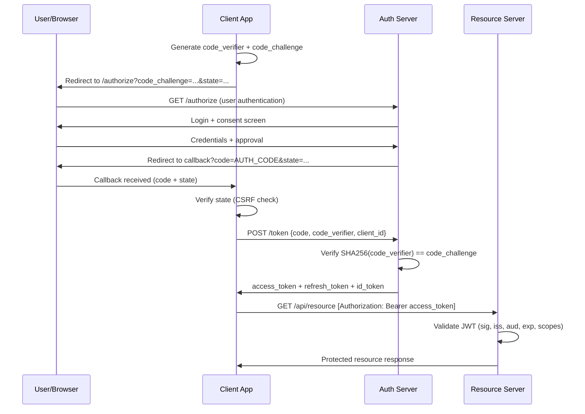

⚡ TL;DR - OAuth 2.0 is an authorization framework (who can access what resource) and OIDC
(OpenID Connect) is an authentication layer built on top of OAuth 2.0 (who is the user). The
most important design decisions and their security rationale: (1) WHY AUTHORIZATION CODE FLOW
over Implicit Flow? Implicit Flow: returned access tokens directly in the URL fragment. URL
fragments: stored in browser history, sent in Referer headers, visible to JavaScript. Access
token in the URL = access token leakage. Authorization Code Flow: returns a short-lived code
(usable once), which the backend exchanges for tokens over a secure backchannel (server-to-server).
Tokens: never appear in the URL. Implicit Flow is now deprecated (OAuth 2.1). (2) WHY PKCE
(Proof Key for Code Exchange)? Authorization code interception attack: a malicious app registers
the same redirect URI scheme as the legitimate app. Intercepts the authorization code. Exchanges
it for tokens. PKCE: the client generates a random code_verifier, sends hash (code_challenge)
with the authorization request. At token exchange: must provide code_verifier. Intercepted code:
useless without the code_verifier (which the attacker never saw). PKCE is mandatory for public
clients and mobile apps. (3) WHY OPAQUE TOKENS vs. JWT? JWT: self-contained (resource server
validates without contacting auth server). Opaque: resource server must call auth server to
validate. JWT advantage: no network call per request. JWT disadvantage: no revocation (JWT is
valid until expiry - if user logs out, JWT is still valid for 15 minutes if that's the TTL).
Opaque advantage: instant revocation. The right choice: short-lived JWTs (15 minutes) with
refresh tokens, OR opaque tokens if revocation speed matters more than performance.

---

| #131 | Category: Security | Difficulty: ★★★★ |
|:---|:---|:---|
| **Depends on:** | OWASP Top 10, Authentication, Business Logic, Insufficient Logging, CVSS Scoring, CVE + NVD, AWS Security Services, Kubernetes Security, Security Observability + SIEM, Security at Scale, ISO 27001, Chaos Engineering, Privilege Escalation, Zero Trust Introduction, Red/Blue/Purple Team, Zero Trust Enterprise, DevSecOps Pipeline, Security Champions, Enterprise Security Architecture, Secret Rotation, Security Governance, Threat Intelligence, CSIRT Design, Security Metrics, Supply Chain Security, Platform Security Engineering, Multi-Cloud Security, Build vs Buy, Security ADR, SIEM Architecture, SSDLC, TLS 1.3 | |
| **Used by:** | Remaining SEC-132 through SEC-144 entries | |
| **Related:** | All preceding SEC entries, remaining SEC entries through SEC-144 | |

---

### 🔥 The Problem This Solves

**WHY OAUTH 2.0 DESIGN DECISIONS MATTER:**

```
FAILURE 1: IMPLICIT FLOW TOKEN IN URL (DEPRECATED)

  Developer: implementing OAuth 2.0 for a SPA (Single Page Application).
  2018: many OAuth 2.0 tutorials still show Implicit Flow.
  "Use Implicit Flow for SPAs. It's designed for browser-based apps."
  
  Implementation:
  redirect_uri: https://app.example.com/callback#access_token=eyJ...&token_type=Bearer
  
  The access token: in the URL fragment (#access_token=eyJ...).
  
  LEAK VECTORS:
  1. Browser history: URL stored including fragment. "view history" → access token visible.
  2. Referer header: if the callback page loads any third-party resource (analytics, CDN, fonts),
     the FULL URL (including fragment) is sent in the Referer header.
     Google Analytics, Hotjar, Intercom: all receive the access token in Referer.
  3. Server logs: many web frameworks log the full URL. Access token: in the log file.
  4. JavaScript: window.location.hash contains the token.
     Any third-party JavaScript on the page (ads, analytics, widgets) can read it.
  
  Result: access tokens routinely leaked to analytics services and server logs.
  
  The Authorization Code Flow solution:
  redirect_uri: https://app.example.com/callback?code=SplxlOBeZQQYbYS6WxSbIA&state=...
  
  The code: short-lived (typically 60 seconds), single-use.
  The backend: exchanges the code for tokens over HTTPS (server-to-server, no URL leakage).
  Tokens: NEVER appear in any URL. NEVER in browser history. NEVER in Referer headers.
  
  OAuth 2.1 (draft): REQUIRES Authorization Code + PKCE for ALL clients.
  Implicit Flow: REMOVED from the spec.

FAILURE 2: MISSING PKCE - AUTHORIZATION CODE INTERCEPTION

  Mobile app: implements Authorization Code Flow (correct!). But: no PKCE.
  
  Android URL scheme: "myapp://oauth/callback"
  ANY app on the device can register "myapp://oauth/callback" (no Android restriction).
  Malicious app: registered the same URL scheme.
  
  Attack flow:
  1. User: taps "Login" in the legitimate app.
  2. Browser: opened with authorization URL.
  3. User: authenticates at authorization server.
  4. Authorization server: redirects to myapp://oauth/callback?code=...
  5. Android: "multiple apps registered this scheme. Which one?" OR: malicious app intercepts.
  6. Malicious app: has the authorization code.
  7. Malicious app: calls /token with the code. Receives access token.
  8. Malicious app: accesses user's resources.
  
  PKCE solution:
  Legitimate app: generates code_verifier = random(64 bytes) → code_challenge = SHA256(code_verifier).
  Sends code_challenge with authorization request.
  Authorization server: stores code_challenge with the code.
  
  Malicious app: intercepts the code. But does NOT have the code_verifier.
  When malicious app calls /token with the code: authorization server asks for code_verifier.
  Malicious app: cannot provide it. Token exchange: FAILS.
  
  PKCE: mandatory for mobile apps. Mandatory for SPAs. 
  OAuth 2.1: mandates PKCE for ALL Authorization Code Grant flows.
```

---

### 📘 Textbook Definition

**OAuth 2.0 (RFC 6749):** An authorization framework that enables a user to grant a third-party
application limited access to a service without sharing the user's credentials. Core roles:
Resource Owner (the user), Client (the application requesting access), Authorization Server (issues
tokens, e.g., Auth0, Okta, Google), Resource Server (the API protecting the resource). Core concepts:
Authorization Grant (mechanism by which Client obtains authorization), Access Token (credential for
accessing the Resource Server), Refresh Token (long-lived credential for obtaining new Access Tokens).

**OIDC (OpenID Connect, v1.0 2014):** An authentication layer on top of OAuth 2.0. OAuth 2.0:
provides authorization (what can the app access?). OIDC: adds authentication (who is the user?).
OIDC: introduces the ID Token (a JWT containing user identity information: sub, name, email,
issued at, expiry, audience). The ID Token: proof that the user authenticated with the
Authorization Server. The Access Token: proof of authorization to access resources.

**Authorization Code Flow:** The recommended OAuth 2.0 flow for web applications.
Steps: (1) Client redirects user to Authorization Server with client_id, redirect_uri, scope,
state (CSRF protection). (2) User authenticates at Authorization Server, approves scope.
(3) Authorization Server redirects to redirect_uri with authorization code. (4) Client exchanges
code for tokens (POST to token endpoint, code + client_secret). (5) Authorization Server returns
access_token, refresh_token, id_token (if OIDC). The code: single-use, short-lived.
Tokens: never appear in URLs.

**PKCE (Proof Key for Code Exchange, RFC 7636):** An OAuth 2.0 extension that prevents
authorization code interception attacks. The client generates: code_verifier (random 32-96 bytes,
base64url-encoded). code_challenge = BASE64URL(SHA256(code_verifier)).
Sends code_challenge with authorization request. Sends code_verifier with token request.
Authorization Server: verifies SHA256(code_verifier) == code_challenge. If not: rejects.
The intercepted code: useless without code_verifier (which only the legitimate client knows).

**Refresh Token Rotation:** A security pattern where each use of a refresh token invalidates it
and issues a new refresh token. Prevents refresh token replay: if a refresh token is stolen and
used, the original user's next use (with the same refresh token, now invalidated) detects the
theft. The authorization server: detects "this refresh token was already used → possible theft →
invalidate all sessions for this user."

**Client Credentials Flow:** An OAuth 2.0 grant type for machine-to-machine (M2M) communication.
No user involved. The Client: authenticates directly with the Authorization Server using its
client_id + client_secret (or client assertion/JWT). Receives an access token. Used by: microservices,
CI/CD pipelines, background jobs. The "OIDC workload identity federation" used in SEC-125 (Multi-Cloud
Security): based on this flow with a JWT client assertion instead of client_secret.

---

### ⏱️ Understand It in 30 Seconds

**One line:**
OAuth 2.0 is the protocol for "I allow this app to access MY data on that service." OIDC is
the layer that adds "and here's who I am." The Authorization Code + PKCE flow is the current
recommended implementation for all clients: the code (not the token) goes through the URL,
and PKCE prevents an intercepted code from being usable without the code_verifier only the
legitimate client generated.

**One analogy:**
> OAuth 2.0 is the hotel concierge model for third-party access.
>
> You're staying at the Grand Hotel. A friend (the Client) wants to pick up a package from the front desk.
> You don't want to give your friend your room key (your credentials).
> But you want them to be able to pick up the package.
>
> Hotel process (OAuth 2.0 Authorization Code Flow):
> 1. You go to the front desk (Authorization Server). Show your ID (authenticate).
> 2. You say: "I authorize my friend [name] to pick up packages from the front desk on my behalf."
>    Front desk: gives YOU a ticket (authorization code).
> 3. You give your friend the ticket (redirect with code).
> 4. Your friend: takes the ticket to the concierge desk (token endpoint).
>    Shows the ticket + their own concierge ID card (client_id + client_secret).
>    Concierge: verifies the ticket is valid, hasn't been used, matches their ID.
> 5. Concierge: gives your friend a package claim token (access token).
>    "This token lets you pick up ONE package from Room 412."
> 6. Your friend: uses the token at the package room (Resource Server).
>
> PKCE in this analogy:
> Your friend can only use the ticket if they also know the secret phrase you whispered to them
> privately when you gave them the ticket (code_verifier). If someone else intercepts the ticket:
> they don't know the phrase. The concierge: asks for the phrase. The interceptor: can't answer.
>
> OIDC in this analogy:
> The concierge also gives your friend an IDENTITY CARD about YOU ("this package belongs to Guest
> Alice Chen, staying in Room 412"). The friend: now knows WHO authorized them, not just THAT they
> were authorized.
>
> Your room key (password): never shared. Your friend: accesses only what you authorized.
> Limited scope: "pick up packages" not "access my entire room." Revocable at any time.

---

### 🔩 First Principles Explanation

**OAuth 2.0 flows and when to use each:**

```
FLOW SELECTION GUIDE:

  CLIENT TYPE                     → RECOMMENDED FLOW
  
  Web app (server-side rendering) → Authorization Code Flow
                                    (client_secret on server, PKCE optional but recommended)
  
  SPA (frontend-only)             → Authorization Code + PKCE
                                    (no client_secret possible - code is public)
                                    (PKCE: mandatory - no client_secret to protect the exchange)
  
  Mobile app                      → Authorization Code + PKCE
                                    (no secure client_secret storage on device)
                                    (custom URL scheme interception → PKCE mandatory)
  
  Machine-to-machine (M2M)        → Client Credentials Flow
  (service, CI/CD, background)      (no user involved, client authenticates directly)
  
  CLI tool (device without browser) → Device Authorization Grant (RFC 8628)
                                     (user completes auth on a different device)
  
  DEPRECATED (do not use):
  Implicit Flow                    → Access token in URL. Deprecated. Use Authorization Code + PKCE.
  Resource Owner Password Grant    → Client receives user's password. Never use for third-party.
  (ROPG)                            Only acceptable for first-party clients (your own app, your own IdP).

AUTHORIZATION CODE FLOW WITH PKCE - FULL SEQUENCE:

  CLIENT (SPA or mobile app)

  Step 1: Generate PKCE values.
    code_verifier = base64url(random(32 bytes))
    code_challenge = base64url(sha256(code_verifier))
    # Store code_verifier in memory (not localStorage - XSS risk)

  Step 2: Redirect to Authorization Server.
    GET /authorize
      ?response_type=code
      &client_id=CLIENT_ID
      &redirect_uri=https://app.example.com/callback
      &scope=openid profile email
      &state=RANDOM_CSRF_TOKEN
      &code_challenge=BASE64URL_SHA256_CODE_VERIFIER
      &code_challenge_method=S256

  AUTHORIZATION SERVER:
    - Authenticates user (login page, MFA).
    - Displays consent screen ("app wants to access your profile and email").
    - User approves.
    - Stores: {code → client_id, redirect_uri, code_challenge, scopes}.
    - Redirects to: https://app.example.com/callback?code=AUTH_CODE&state=CSRF_TOKEN

  CLIENT:
    - Verifies state == RANDOM_CSRF_TOKEN (CSRF protection).
    - Has: code, code_verifier (in memory from step 1).

  Step 3: Exchange code for tokens (backend call).
    POST /token
    Content-Type: application/x-www-form-urlencoded
    
    grant_type=authorization_code
    &code=AUTH_CODE
    &redirect_uri=https://app.example.com/callback
    &client_id=CLIENT_ID
    &code_verifier=CODE_VERIFIER
    # Note: no client_secret for public clients (SPAs, mobile).
    # For confidential clients (server-side): include client_secret.

  AUTHORIZATION SERVER:
    - Verifies code is valid, not expired, not used.
    - Verifies redirect_uri matches registered.
    - Verifies sha256(code_verifier) == code_challenge stored with this code.
    - Returns: {access_token, refresh_token, id_token, expires_in}.

REFRESH TOKEN ROTATION:

  Client: access_token expires (e.g., 15 minutes).
  Client: uses refresh_token to get a new access_token.
  
  POST /token
  grant_type=refresh_token
  &refresh_token=REFRESH_TOKEN
  &client_id=CLIENT_ID
  
  Authorization Server WITH ROTATION:
    - Verifies refresh_token is valid, not used.
    - Issues: new access_token + NEW refresh_token.
    - INVALIDATES the old refresh_token.
  
  If the old refresh_token is used again (by an attacker who stole it):
    Authorization Server: "This refresh token was already used.
    Possible token theft. Invalidating ALL sessions for this user."
    → User must re-authenticate.
  
  Without rotation: stolen refresh token is valid indefinitely (until explicit logout).
  With rotation: stolen refresh token is used once → detected → sessions revoked.

OPAQUE TOKENS vs. JWTs:

  JWT (self-contained):
    Signature: verified with public key (no network call).
    Claims: expiry, scopes, user ID, tenant ID, all in the token.
    Advantage: no network call per resource server request.
    Disadvantage: revocation requires token expiry.
    "User was fired at 9 AM. Their JWT: valid until 9:15 AM (15-minute TTL)."
    During those 15 minutes: they can still access protected resources.
    
    Solution: SHORT TTL (15 minutes max for access tokens).
    If 15-minute access window after termination is unacceptable: use opaque tokens.
  
  Opaque tokens (reference tokens):
    The resource server: calls the authorization server to validate each token.
    POST /token/introspect → {active: true, scope: ..., sub: ..., exp: ...}
    Revocation: instant. Authorization server returns {active: false} immediately after revocation.
    Disadvantage: network call per request. Latency. AuthServer SPOF.
    
    Solution: cache introspection results for 30-60 seconds (reduces calls, acceptable revocation delay).
```

---

### 🧪 Thought Experiment

**SCENARIO: Choosing the right OAuth 2.0 implementation for a FinTech API:**

```
CONTEXT:
  FinTech company: building an API platform.
  Clients: (1) their own web app, (2) their own mobile app, (3) third-party developer apps,
  (4) internal microservices (background jobs, batch processing).
  
DECISION 1: FLOW PER CLIENT TYPE

  Web app (server-side, session-based):
  → Authorization Code Flow with client_secret.
  → Short-lived JWTs (15-minute access token, 24-hour refresh token, rotation enabled).
  → client_secret: stored on server. Never in JavaScript.
  
  Mobile app (iOS, Android):
  → Authorization Code + PKCE (no client_secret - not safe on device).
  → Redirect URI: registered as universal link (iOS) or verified app link (Android).
    PKCE mandatory (custom scheme interception mitigation).
  
  Third-party developer apps:
  → Authorization Code + PKCE (they're building both web and mobile integrations).
  → Require redirect_uri pre-registration. Strict validation.
  → Scopes: granular. "read:transactions", "write:transfers", "read:profile".
    Third-party app: requests only what it needs (user sees scope in consent screen).
  
  Internal microservices:
  → Client Credentials Flow.
  → Each service: its own client_id + client_secret (stored in HashiCorp Vault).
  → Service A calls Service B: gets an access token with scope "service-b:read".
  → No user in the loop. M2M authentication.

DECISION 2: JWT vs. OPAQUE TOKENS

  Use case: payment API.
  A compromised access token: could be used to initiate transfers.
  "If a token is stolen: how quickly can we revoke it?"
  
  JWT (15-minute TTL): 15-minute window after theft before it expires. Acceptable?
  For payments: likely NOT acceptable. A $10,000 transfer can happen in 15 minutes.
  
  Decision: opaque tokens for financial operations.
  Resource server: introspects each token with the auth server.
  Revocation: instant.
  Performance: cache introspection results for 30 seconds (acceptable for financial API).
  
  Trade-off: auth server becomes critical path for ALL payment API requests.
  Solution: auth server: highly available (3 replicas, multi-region, <5ms SLA per introspection).

DECISION 3: SCOPE DESIGN

  BAD scope design:
  "read" and "write" - too broad.
  Third-party app requests "write" → can modify any resource. Too permissive.
  
  GOOD scope design (principle of least privilege in OAuth):
  "transactions:read" - read transaction history.
  "accounts:read" - read account balances.
  "transfers:initiate" - initiate a transfer.
  "transfers:approve" - approve a transfer (separate scope, requires step-up auth).
  "profile:read" - read user profile.
  "profile:update" - update user profile.
  
  Third-party app (spending tracker): requests "transactions:read", "accounts:read".
  No access to initiate transfers. User: sees exactly what the app can do in consent screen.
  
  STEP-UP AUTHENTICATION:
  High-value operations (transfer > $5,000): require fresh authentication.
  Access token for "transfers:initiate:high_value":
    issued only if user authenticated within last 5 minutes (auth_time claim in OIDC).
  If auth_time is older: redirect user to re-authenticate. Then issue the scoped token.
```

---

### 🧠 Mental Model / Analogy

> OAuth 2.0 scopes are the concept of delegated power of attorney.
>
> Power of attorney (full): you give someone complete legal authority to act on your behalf.
> They can sign contracts, sell property, access bank accounts - everything you can do.
> Risk: enormous. If the person is malicious or their authorization is stolen: catastrophic.
>
> Limited power of attorney: you authorize someone for a specific purpose.
> "I authorize this person to pick up mail from my PO box, only during September."
> The authorization: limited in scope (mail pickup only) and time (September only).
> Risk: bounded. If the authorization is stolen or misused: limited damage possible.
>
> OAuth 2.0 scopes: limited power of attorney for apps.
> "I authorize Mint (budgeting app) to READ my transaction history, for 90 days."
> Scope: "transactions:read". Duration: refresh token TTL (90 days with rotation).
> 
> Mint: cannot initiate transfers (no "transfers:initiate" scope).
> Mint: cannot access your profile (no "profile:read" scope).
> If Mint is breached: attacker gets your transaction history. NOT your ability to transfer money.
>
> The principle: each OAuth client should be granted exactly the scopes it needs.
> No more. The consent screen: shows the user EXACTLY what the app can do.
> User: can make an informed decision. "This budgeting app wants to read my transactions.
> That makes sense. I'll approve." vs. "This budgeting app wants to initiate transfers.
> That's suspicious. I'll reject."
>
> The security property: compromise of the Client → limited blast radius.
> The attacker: gets what the Client was authorized for. Nothing more.
> Fine-grained scopes: minimize the blast radius of any single token compromise.

---

### 📶 Gradual Depth - Five Levels

**Level 1 - What it is (anyone can understand):**
OAuth 2.0 is the standard that lets you click "Sign in with Google" or "Connect to Spotify" on a website without giving that website your Google password. Instead: Google verifies who you are, then gives the website a special temporary pass (an access token) that allows it to do specific things (read your profile, not access your email). OIDC adds the piece that tells the website who you are (not just what you can do). Together: they're the foundation of "Sign in with" buttons and third-party API access across the internet.

**Level 2 - How to use it (junior developer):**
Implementing Authorization Code + PKCE for a SPA: (1) In your OAuth client library (e.g., `@auth0/auth0-spa-js`, `oidc-client-ts`): set `usePkce: true` (most modern libraries default to this). (2) Configure `redirect_uri` to match exactly what's registered with your auth server. (3) After redirect back to your app: verify the `state` parameter matches what you sent (CSRF check). (4) Exchange the code in your backend (or use the library's `handleCallback()`). (5) Store the access token in memory (not localStorage). Refresh tokens: if the library supports it, in an HTTP-only cookie (not accessible to JavaScript, XSS-resistant). Common mistake: storing access tokens in localStorage. A single XSS vulnerability: steals all localStorage content including tokens.

**Level 3 - How it works (mid-level engineer):**
Implementing a resource server that validates JWTs: (1) Obtain the Authorization Server's public keys from `{issuer}/.well-known/jwks.json`. (2) Verify: the JWT signature with the public key. (3) Verify: `iss` (issuer) matches your Authorization Server's URL. (4) Verify: `aud` (audience) matches your API's identifier. (5) Verify: `exp` (expiration) is in the future. (6) Verify: `nbf` (not before, if present) is in the past. (7) Check: required scopes are present in the `scope` claim. Only after ALL checks pass: process the request. The most common implementation error: checking the signature but not the `aud` claim. An access token from the same Authorization Server but for a different API: valid signature, wrong audience. Without aud check: accepted. This allows cross-API token reuse.

**Level 4 - Why it was designed this way (senior/staff):**
The OAuth 2.0 "bearer token" model: any bearer of a token can use it. No cryptographic binding between the token and the client that requested it. This is intentional simplicity: bearer tokens work like cash - present it, get access. The alternative: holder-of-key tokens (DPoP, RFC 9449). DPoP: the client generates an asymmetric key pair, sends the public key with the token request. The access token: bound to that key pair. At the resource server: the client must sign each request with the private key. Stolen DPoP token: useless (the attacker doesn't have the private key). DPoP: adopted by bank APIs and high-security implementations where token theft is a significant risk. The OAuth 2.0 working group made a pragmatic choice: bearer tokens are simple and work for the vast majority of use cases. DPoP is available for use cases where token theft is a significant risk model (financial APIs, healthcare data). Understanding this design trade-off: distinguishes engineers who understand OAuth 2.0 at a specification level from those who only understand it as "the thing we use for login."

**Level 5 - Mastery (distinguished engineer):**
The OAuth 2.0 trust model and its implications for microservice security: when a user authenticates and gets an access token, that token: represents the user's authorization. When Service A receives the request with the user's access token and needs to call Service B on the user's behalf: Service A can forward the user's access token to Service B (token passthrough) OR Service A can use its own service credentials (Client Credentials) to call Service B with no user context. Token passthrough: preserves user context (Service B knows which user), but exposes user's token to Service A (if Service A is compromised: all its users' tokens are exposed). Client Credentials: Service A calls Service B as itself (no user context), but Service B loses the user authorization context. The OAuth 2.0 Token Exchange (RFC 8693) solves this: Service A exchanges the user's token for a NEW token that represents "Service A acting on behalf of User X." The new token: can have different scopes, different audience, different expiry. Service B: receives a token it can validate directly. User context: preserved. Service A's principal: identified. The lateral movement risk (if Service A is compromised: attacker can exchange any user's token for Service B access): mitigated by strict scope enforcement at the token exchange endpoint. This is the architecture-level OAuth 2.0 decision that most security-aware engineers at senior level don't know exists, but that matters significantly in microservice security.

---

### ⚙️ How It Works (Mechanism)

```
AUTHORIZATION CODE + PKCE FLOW:

  CLIENT          BROWSER         AUTH SERVER     RESOURCE SERVER
    |                |                |                |
    |--1. Generate   |                |                |
    |  code_verifier |                |                |
    |  code_challenge|                |                |
    |                |                |                |
    |--2. Redirect-->|                |                |
    |   (with        |                |                |
    |  code_challenge|                |                |
    |   + state)     |                |                |
    |                |--3. Auth req-->|                |
    |                |  user login    |                |
    |                |  + consent     |                |
    |                |<--4. Auth code-|                |
    |                |   ?code=...    |                |
    |                |   &state=...   |                |
    |<--5. Callback--|                |                |
    |   (verify state)               |                |
    |                                |                |
    |--------6. POST /token--------->|                |
    |   {code, code_verifier,        |                |
    |    client_id, redirect_uri}    |                |
    |                                |                |
    |       [Verify: SHA256(verifier)|                |
    |        == code_challenge]      |                |
    |                                |                |
    |<------7. access_token, --------|                |
    |       refresh_token, id_token  |                |
    |                                |                |
    |---8. GET /api/resource --------|--------------->|
    |   Authorization: Bearer <token>|                |
    |                                |   [Validate JWT|
    |                                |    sig + claims]
    |<--9. Protected resource--------|----------------|
```



---

### 💻 Code Example

**OAuth 2.0 Authorization Code + PKCE implementation:**

```python
# oauth2_pkce.py
# Server-side token exchange for Authorization Code + PKCE.
# Validates the callback, exchanges the code, and verifies the ID token.
# Used in a web backend that receives the redirect from the Authorization Server.

import hashlib
import base64
import os
import secrets
import time
import jwt  # PyJWT
import requests
from typing import Optional
from dataclasses import dataclass

@dataclass
class OAuthConfig:
    client_id: str
    client_secret: Optional[str]     # None for public clients (SPAs, mobile)
    redirect_uri: str
    auth_server_url: str             # e.g., https://auth.example.com
    audience: str                    # Your API identifier
    scopes: list[str]


def generate_pkce_pair() -> tuple[str, str]:
    """
    Generate a PKCE code_verifier and code_challenge.
    
    Returns: (code_verifier, code_challenge)
    code_verifier: 43-128 character URL-safe string (RFC 7636).
    code_challenge: base64url(sha256(code_verifier))
    """
    # 32 bytes = 43 characters base64url (minimum PKCE length per RFC 7636)
    code_verifier = base64.urlsafe_b64encode(os.urandom(32)).rstrip(b'=').decode()
    
    # S256 method: code_challenge = BASE64URL(SHA256(ASCII(code_verifier)))
    digest = hashlib.sha256(code_verifier.encode()).digest()
    code_challenge = base64.urlsafe_b64encode(digest).rstrip(b'=').decode()
    
    return code_verifier, code_challenge


def build_authorization_url(config: OAuthConfig, code_challenge: str, state: str) -> str:
    """
    Build the authorization URL to redirect the user to.
    
    BAD approach: include code_verifier in the URL (defeats the purpose of PKCE).
    GOOD approach: include only the code_challenge (hash of the verifier).
    """
    params = {
        "response_type": "code",
        "client_id": config.client_id,
        "redirect_uri": config.redirect_uri,
        "scope": " ".join(config.scopes),
        "state": state,  # CSRF protection: must match when callback arrives
        "code_challenge": code_challenge,
        "code_challenge_method": "S256",
        "audience": config.audience,  # Specific to Auth0-style AS implementations
    }
    
    query_string = "&".join(f"{k}={v}" for k, v in params.items())
    return f"{config.auth_server_url}/authorize?{query_string}"


def exchange_code_for_tokens(
    config: OAuthConfig,
    code: str,
    code_verifier: str
) -> dict:
    """
    Exchange authorization code for tokens.
    Includes code_verifier for PKCE validation.
    
    SECURITY: This call happens server-to-server (backend → authorization server).
    The code_verifier: never sent to the browser or stored in URLs.
    """
    body = {
        "grant_type": "authorization_code",
        "client_id": config.client_id,
        "code": code,
        "redirect_uri": config.redirect_uri,
        "code_verifier": code_verifier,  # PKCE: proves we generated the code_challenge
    }
    
    # For confidential clients (server-side web apps): include client_secret.
    # For public clients (SPAs, mobile): client_secret is NOT included.
    if config.client_secret:
        body["client_secret"] = config.client_secret
    
    response = requests.post(
        f"{config.auth_server_url}/oauth/token",
        data=body,
        headers={"Content-Type": "application/x-www-form-urlencoded"},
        timeout=10
    )
    
    if response.status_code != 200:
        raise ValueError(
            f"Token exchange failed: {response.status_code} {response.text}"
        )
    
    return response.json()


def validate_id_token(
    id_token: str,
    config: OAuthConfig,
    jwks_client: jwt.PyJWKClient
) -> dict:
    """
    Validate an OIDC ID Token.
    ALL checks are mandatory. Skipping any check: security vulnerability.
    
    BAD approach:
    payload = jwt.decode(id_token, options={"verify_signature": False})
    # Never skip signature verification in production!
    
    GOOD approach: validate ALL claims.
    """
    # Get the signing key from the JWKS endpoint
    signing_key = jwks_client.get_signing_key_from_jwt(id_token)
    
    payload = jwt.decode(
        id_token,
        signing_key.key,
        algorithms=["RS256", "ES256"],  # Allow RSA and ECDSA signatures
        audience=config.client_id,  # ID token audience = client_id (not API audience)
        issuer=config.auth_server_url,  # Must match exactly
        options={
            "verify_exp": True,      # Verify expiration
            "verify_nbf": True,      # Verify not-before
            "verify_iat": True,      # Verify issued-at
            "require": ["sub", "iat", "exp", "aud", "iss"],  # Required claims
        }
    )
    
    # Additional OIDC-specific validation
    # nonce: must match the nonce sent in the authorization request (if used)
    # Not implemented here: depends on whether nonce was sent.
    
    return payload


def validate_access_token(
    access_token: str,
    config: OAuthConfig,
    required_scopes: list[str],
    jwks_client: jwt.PyJWKClient
) -> dict:
    """
    Validate an OAuth 2.0 Access Token (JWT format).
    Resource server: validates before processing any request.
    """
    signing_key = jwks_client.get_signing_key_from_jwt(access_token)
    
    payload = jwt.decode(
        access_token,
        signing_key.key,
        algorithms=["RS256", "ES256"],
        audience=config.audience,  # Access token audience = API identifier
        issuer=config.auth_server_url,
        options={"verify_exp": True, "verify_nbf": True}
    )
    
    # Verify required scopes are present
    token_scopes = set(payload.get("scope", "").split())
    missing_scopes = set(required_scopes) - token_scopes
    if missing_scopes:
        raise PermissionError(
            f"Token missing required scopes: {missing_scopes}"
        )
    
    return payload


# REFRESH TOKEN ROTATION EXAMPLE
def refresh_access_token(
    config: OAuthConfig,
    refresh_token: str
) -> dict:
    """
    Use a refresh token to get a new access token.
    Authorization servers with rotation: return a new refresh token.
    Client: must replace the old refresh token with the new one.
    
    If the old refresh token is used again (by an attacker):
    authorization server detects reuse → invalidates all sessions.
    """
    body = {
        "grant_type": "refresh_token",
        "client_id": config.client_id,
        "refresh_token": refresh_token,
    }
    if config.client_secret:
        body["client_secret"] = config.client_secret
    
    response = requests.post(
        f"{config.auth_server_url}/oauth/token",
        data=body,
        headers={"Content-Type": "application/x-www-form-urlencoded"},
        timeout=10
    )
    
    if response.status_code == 400:
        # Refresh token invalid or already used (rotation violation).
        # Must require re-authentication.
        raise ValueError("Refresh token invalid or already used. Re-authentication required.")
    
    response.raise_for_status()
    result = response.json()
    
    # result["refresh_token"] = the NEW refresh token (if rotation enabled)
    # Store result["refresh_token"] (replacing the old one) + result["access_token"]
    return result
```

---

### ⚖️ Comparison Table

| OAuth 2.0 Flow | Client Type | client_secret | PKCE | User Interaction |
|:---|:---|:---|:---|:---|
| **Authorization Code + PKCE** | SPA, Mobile | No (public client) | Required | Yes |
| **Authorization Code** | Server-side web | Yes (confidential) | Recommended | Yes |
| **Client Credentials** | M2M, microservice | Yes | No | No |
| **Device Authorization** | CLI, TV, IoT | Optional | Optional | Yes (on separate device) |
| ~~Implicit~~ (deprecated) | ~~SPA~~ | ~~No~~ | ~~No~~ | ~~Yes (don't use)~~ |
| ~~ROPC~~ (deprecated) | ~~First-party only~~ | ~~Yes~~ | ~~No~~ | ~~Yes (don't use)~~ |

---

### ⚠️ Common Misconceptions

| Misconception | Reality |
|:---|:---|
| "Client Credentials flow is secure for machine-to-machine without any additional protection." | Client Credentials uses a client_id + client_secret that, if compromised, allows any system to impersonate the service. Three critical protections often missing: (1) client_secret rotation: secrets that never rotate are increasingly risky over time. Rotate quarterly or use short-lived client assertions (JWT instead of static secret). (2) IP allowlisting at the authorization server: the Client Credentials endpoint should only accept requests from known service IP ranges. (3) Scope restriction: the access token issued for Client Credentials should have the minimum scopes needed. "admin:*" scope for a background job that only needs to read a specific resource: violates least privilege. The more secure alternative to static client_secret for M2M: client assertions (JWT signed with a private key, verified with the service's registered public key). No static secret. Rotation: key rotation (new key pair, de-register old public key). This is the OIDC workload identity model (used in multi-cloud federation). |
| "The JWT signature is the only validation needed." | JWT signature validation is necessary but not sufficient. Five checks are ALL required: (1) signature: verify with the Authorization Server's public key. (2) issuer (iss): verify it's the expected Authorization Server. A valid JWT from a DIFFERENT authorization server: valid signature, wrong issuer → should be rejected. (3) audience (aud): verify the token is intended for THIS resource server. Cross-API token confusion: a token for API A used at API B. Valid signature, correct issuer, WRONG audience → must be rejected. (4) expiration (exp): verify the token is not expired. (5) scopes: verify the token has the required permissions for the requested operation. Skipping ANY of these checks: a potential authorization bypass. The most commonly skipped: `aud` verification. A resource server that accepts any JWT from the trusted issuer without checking `aud`: vulnerable to cross-API token reuse. |

---

### 🚨 Failure Modes & Diagnosis

**OAuth 2.0 implementation failure patterns:**

```
FAILURE 1: STATE PARAMETER MISSING (CSRF ON OAUTH FLOW)

  Symptom: An attacker can force a victim to authenticate an app with the attacker's
  authorization code (session fixation via OAuth).
  
  Attack:
  1. Attacker: starts OAuth flow on their own account. Gets authorization code.
  2. Attacker: crafts a URL to the victim's callback with the attacker's code.
     https://victim-app.com/callback?code=ATTACKER_CODE&state=...
  3. Victim: visits this URL (via email link, social engineering).
  4. Victim-app: exchanges the code. Gets access token for attacker's account.
  5. Victim: now logged into the app as the attacker.
  6. If the victim enters their credit card: it goes to the attacker's account.
  
  The state parameter: a random nonce generated by the client BEFORE the authorization request.
  Stored in the user's session. Verified on callback.
  
  "If state in callback != state in session: abort. CSRF attack detected."
  
  Without state: OAuth CSRF possible. Authorization Code + PKCE spec requires state.

FAILURE 2: INSUFFICIENT REDIRECT_URI VALIDATION

  Authorization server: registered redirect_uri: "https://app.example.com/callback"
  Attacker: sends authorization request with:
  redirect_uri=https://app.example.com/callback%2F..%2Fattacker.com/collect
  
  If the AS validates with prefix match or URL decoding issues:
  Authorization code: sent to attacker.com.
  
  Fix: EXACT match validation for redirect_uri. Not prefix. Not regex. Exact string match.
  "https://app.example.com/callback" ≠ "https://app.example.com/callback/anything".
  All redirect URIs: pre-registered. No wildcards (wildcards are a RFC violation for non-localhost).

OAUTH 2.0 SECURITY DIAGNOSTIC CHECKLIST:

  Flow selection:
  [ ] SPAs and mobile: Authorization Code + PKCE (no Implicit Flow).
  [ ] Server-side web apps: Authorization Code + client_secret.
  [ ] M2M: Client Credentials (with secret rotation).
  
  Token handling:
  [ ] Access tokens NOT in URLs, NOT in logs, NOT in browser history.
  [ ] Access tokens: stored in memory (SPA) or HTTP-only cookies (server-side).
  [ ] Refresh tokens: NOT in localStorage. HTTP-only cookie or secure device storage.
  
  Validation:
  [ ] JWT: signature + iss + aud + exp + scopes (ALL 5 checks).
  [ ] state parameter: verified on callback.
  [ ] redirect_uri: exact match validation at AS.
  
  Advanced:
  [ ] PKCE: S256 method (not plain).
  [ ] Refresh token rotation: enabled at Authorization Server.
  [ ] Token lifetimes: access = 15 min, refresh = 24 hours to 30 days.
  [ ] Scope: minimum necessary per client (least privilege).
```

---

### 🔗 Related Keywords

**Prerequisites:**
- `Authentication and Session Management` (SEC-013) - OAuth is an authentication/authorization protocol
- `TLS 1.3 Protocol Design Rationale` (SEC-130) - TLS secures all OAuth token exchanges

**Builds on this:**
- `Trust Boundary Analysis` (SEC-141) - OAuth authorization boundaries are trust boundaries
- `Security as Contract` (SEC-143) - OAuth scopes define the security contract for API access

---

### 📌 Quick Reference Card

```
┌──────────────────────────────────────────────────────────┐
│ FLOW SELECTION │ SPA/Mobile: Auth Code + PKCE (mandatory)│
│               │ Server web: Auth Code + client_secret    │
│               │ M2M: Client Credentials + secret/JWT     │
│               │ Never: Implicit, ROPC (deprecated)       │
├───────────────┼──────────────────────────────────────────┤
│ PKCE          │ S256 method (code_challenge = SHA256)     │
│               │ code_verifier: in memory only            │
│               │ Prevents: code interception attacks       │
├───────────────┼──────────────────────────────────────────┤
│ JWT VALIDATION│ sig + iss + aud + exp + scopes (all 5)  │
│               │ Skip aud → cross-API token reuse vuln    │
├───────────────┼──────────────────────────────────────────┤
│ TOKEN STORAGE │ Access: memory or HTTP-only cookie       │
│               │ Refresh: HTTP-only cookie (not localStorage)│
│               │ Never: URL, server logs, localStorage    │
└──────────────────────────────────────────────────────────┘
```

---

### 💎 Transferable Wisdom

**Reusable Engineering Principle:**
"Delegated authorization is safer than shared credentials."
The core OAuth 2.0 insight: instead of sharing a master credential (password) with every
third party that needs access, issue limited, revocable, scoped delegated authorization.
The scope: limits the blast radius of compromise. The revocability: limits the duration.
The delegation: means the third party never learns the master credential.
This principle: applies broadly beyond authentication.
API key management: instead of one global API key per client, issue per-service API keys
with specific scopes. If one service's key is compromised: rotated in isolation.
Service mesh authorization: instead of "service A trusts service B" (network-level),
use token-based authorization ("service A sends JWT with scope 'read:config' to service B").
Credential delegation: instead of sharing a database password with every service,
use HashiCorp Vault dynamic credentials (each service gets its own credential, short-lived, scoped).
Database role segregation: instead of all services using the same DB user, each service has
its own DB role with only the tables it needs (SELECT on orders_table for the order service;
SELECT + INSERT on orders_table for the payment service).
The invariant: shared credentials are single points of compromise.
Delegated, scoped, revocable credentials: bounded blast radius.
When designing any access control system: ask "can this be delegated, scoped, and revoked?"
If yes: do it. The operational cost of managing more credentials: worth the security benefit.

---

### 💡 The Surprising Truth

The most common OAuth 2.0 security failure is not a cryptographic weakness or a sophisticated
protocol attack. It is the `redirect_uri` that is too permissive.

OAuth 2.0 security property: authorization code and tokens are sent to the registered
`redirect_uri`. If the `redirect_uri` is controllable by the attacker: they receive the code.

Three common misconfiguration patterns:

1. Wildcard subdomain matching: `https://*.example.com/callback`.
   If the attacker can create a subdomain (attacker.example.com via DNS misconfiguration,
   subdomain takeover, forgotten CNAME): the code goes to their subdomain.

2. Path prefix matching: `https://example.com/callback` matches any path starting with
   `/callback` (like `/callback/../evil`). URL path traversal in redirect_uri validation.

3. Open redirectors: the callback page has an open redirect.
   `https://example.com/callback?redirect=ATTACKER_URL`
   Authorization server: sends code to `https://example.com/callback?redirect=...` (registered).
   The callback page: redirects to `ATTACKER_URL` with the full query string (including the code).

The fix in all three cases: EXACT match validation of redirect_uri.
The registered value: a static string. The incoming value: must match character-for-character.
No wildcards. No prefix matching. No redirect after receiving the code.

This is the spec requirement: "The authorization server MUST compare the two URIs using
simple string comparison as defined in [RFC3986], Section 6.2.1."

Simple string comparison. Not regex. Not prefix. Not decoded URL. Simple string comparison.
Most authorization server vulnerabilities involving redirect_uri: traced back to not following
this single sentence from the RFC.

---

### ✅ Mastery Checklist

**You've mastered this when you can:**
1. **STATE** why Implicit Flow was deprecated: access token returned in URL fragment → stored
   in browser history, sent in Referer headers to third-party resources, readable by JavaScript.
   Replaced by: Authorization Code + PKCE (tokens via secure backchannel, never in URLs).
2. **EXPLAIN** PKCE: client generates code_verifier (random), sends code_challenge = SHA256(verifier)
   with authorization request. At token exchange: provides code_verifier. Authorization server verifies
   SHA256(verifier) == stored challenge. Intercepted code: useless without code_verifier.
3. **DISTINGUISH** OAuth 2.0 and OIDC: OAuth 2.0 = authorization framework (what can this app do?).
   OIDC = authentication layer on OAuth 2.0 (who is this user?). OIDC adds the ID Token (JWT with
   user identity claims: sub, name, email). Access Token = authorization. ID Token = authentication.
4. **LIST** the five JWT validation checks: signature (with AS public key), issuer (iss), audience
   (aud), expiration (exp), scopes. Missing any one: authorization bypass vulnerability.
5. **DESCRIBE** refresh token rotation: each refresh token use issues a new refresh token and
   invalidates the old. Stolen refresh token reused: detected (already invalidated) → all sessions
   revoked → user must re-authenticate.

---

### 🎯 Interview Deep-Dive

**Q: You're designing OAuth 2.0 for a mobile banking app. What flows and security measures
do you choose and why?**

*Why they ask:* Tests OAuth 2.0 flow selection, PKCE understanding, and ability to apply
security principles to a high-stakes use case. Common in mobile security, backend, and API security roles.

*Strong answer covers:*
- Flow: "Authorization Code + PKCE. The mobile app is a public client - we can't store a
  client_secret safely on a device (it can be extracted from the APK or IPA). PKCE is mandatory
  for mobile apps to prevent authorization code interception via URL scheme hijacking.
  We'd use Universal Links (iOS) or Verified App Links (Android) for the redirect_uri instead
  of custom URL schemes - these are bound to the domain's ownership verification, harder to spoof."
- Token design: "Short-lived access tokens (10 minutes for a banking app - even shorter than
  standard 15 minutes). Refresh tokens: 24-hour expiry, rotation enabled. Reason: banking
  operations need stronger revocation guarantees. If a refresh token is stolen and rotated:
  the original user's next request detects the reuse → all sessions revoked → user must
  re-authenticate with full MFA."
- Step-up authentication: "high-value operations (transfers > $5,000, adding a new payee):
  require step-up authentication. The access token for these operations: issued only if the
  user authenticated within the last 5 minutes (check auth_time claim in OIDC ID token).
  If auth_time is older: prompt the user to re-authenticate (biometric or MFA). Then issue a
  scoped access token for the high-value operation."
- Token storage on device: "access token: in memory only (not on disk, not in UserDefaults/
  SharedPreferences). Refresh token: in iOS Keychain or Android Keystore (hardware-backed
  secure storage). If the device is compromised: the secure enclave-backed storage is the
  last line of defense."
- Opaque tokens: "for payment API calls: opaque tokens (not JWT). The authorization server
  validates each token introspection call. Revocation: instant. If an account is compromised
  and we need to revoke access: the next API call is rejected immediately, not after the JWT TTL."