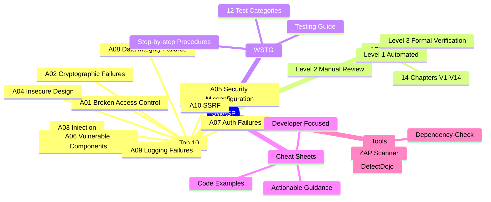

⚡ TL;DR - OWASP (Open Worldwide Application Security Project) is the most widely cited
source of web application security guidance. Three documents every engineer must know:
(1) OWASP TOP 10: The 10 most critical web application security risk categories, updated
periodically (2017, 2021, next update pending). Not a compliance checklist - a risk
ranking. Each category: a class of vulnerabilities (e.g., A03:2021-Injection) mapped to
CWEs. Used by: PCI DSS, SOC 2 auditors, SAST tools, and security teams as a baseline.
(2) OWASP ASVS (Application Security Verification Standard): A detailed requirements
framework with 3 levels. Level 1: basic security testing, automated scanning. Level 2:
most applications (manual review, architectural analysis, comprehensive testing). Level 3:
critical applications (formal verification, penetration testing, architectural assurance).
ASVS: maps requirements to NIST 800-53 controls. Used in: contracts ("this API must meet
ASVS Level 2"), security reviews, and audit scope definition. (3) OWASP WSTG (Web Security
Testing Guide): The step-by-step manual for how to test each security control. Organized by
test category (WSTG-IDNT for identity, WSTG-SESS for sessions). Reference for: penetration
testers, developers writing security tests, and security engineers reviewing code. OWASP
methodology: evidence-based (requirements mapped to CWEs and CVEs), open (published,
community-vetted), and structured (tiered requirements per use case).

---

| #132 | Category: Security | Difficulty: ★★★ |
|:---|:---|:---|
| **Depends on:** | OWASP Top 10, Authentication, Business Logic, Insufficient Logging, CVSS Scoring, CVE + NVD, AWS Security Services, Kubernetes Security, Security Observability + SIEM, Security at Scale, ISO 27001, Chaos Engineering, Privilege Escalation, Zero Trust Introduction, Red/Blue/Purple Team, Zero Trust Enterprise, DevSecOps Pipeline, Security Champions, Enterprise Security Architecture, Secret Rotation, Security Governance, Threat Intelligence, CSIRT Design, Security Metrics, Supply Chain Security, Platform Security Engineering, Multi-Cloud Security, Build vs Buy, Security ADR, SIEM Architecture, SSDLC, TLS 1.3, OAuth 2.0 + OIDC | |
| **Used by:** | Remaining SEC-133 through SEC-144 entries | |
| **Related:** | All preceding and remaining SEC entries | |

---

### 🔥 The Problem This Solves

**WHY A STRUCTURED SECURITY METHODOLOGY MATTERS:**

```
WITHOUT OWASP: SECURITY BY INTUITION

  Dev team: "We take security seriously. We review all code.
             We use parameterized queries. We have HTTPS."
  
  Auditor: "Have you tested for IDOR vulnerabilities?"
  Dev: "What's IDOR?"
  Auditor: "Insecure Direct Object Reference. A user changes their user ID in a request
            and accesses another user's data. Your API: /api/orders/{orderId}.
            Does /api/orders/12345 require that the requesting user OWNS order 12345?"
  Dev: "...we check authentication. We don't check ownership."
  Auditor: "Every authenticated user can view any order. OWASP A01:2021 - Broken Access Control."
  
  Result: critical vulnerability found. Was "security aware." Missing one class of vulnerability.
  
  WITH OWASP ASVS:
  
  ASVS V4.1.3 (Access Control): "Verify that the principle of least privilege exists - users
  should only be able to access functions, data files, URLs, controllers, services, and other
  resources, for which they possess specific authorization."
  
  ASVS V4.1.5: "Verify that access controls fail securely, including when an exception occurs."
  
  Developer: reads ASVS V4 (Access Control) during design.
  Writes: authorization check = "does this user own this order?"
  Every /api/orders/{orderId} request: verify order.userId == requestingUser.id.
  No IDOR vulnerability.
  
  OWASP ASVS: a complete checklist of what "security aware" actually means.
  Not intuition. Not experience only. A structured, evidence-based specification.

OWASP TOP 10 AS COMMUNICATION TOOL:

  Security engineer → product manager:
  "We have an injection vulnerability. The API: not sanitizing inputs.
  Attacker: can exfiltrate all user data."
  
  Product manager: "How serious is this?"
  Security engineer: "It's OWASP A03:2021 - Injection. The #3 most critical web
  security risk category. Maps to CWE-89 (SQL Injection), CWE-79 (XSS), etc.
  PCI DSS Requirement 6.4.1 references OWASP as the standard for vulnerability classification.
  If we have a PCI audit: this finding would be a critical finding."
  
  Product manager: now has context. Prioritizes the fix. Schedules immediately.
  
  OWASP: provides a shared vocabulary. "A03:2021-Injection" means the same thing to
  security engineers worldwide. Eliminates ambiguity in risk communication.
```

---

### 📘 Textbook Definition

**OWASP (Open Worldwide Application Security Project):** A non-profit foundation that works to
improve software security. Founded in 2001. Best known for: the OWASP Top 10, OWASP ASVS, OWASP
WSTG, OWASP Cheat Sheet Series, OWASP Dependency Check, OWASP ZAP (Zed Attack Proxy). All OWASP
projects: open source and freely available. OWASP: the primary standard reference for web application
security in the industry. Referenced by: PCI DSS, NIST SSDF, ISO 27002, SOC 2, HIPAA audits, vendor
security questionnaires, and penetration testing scopes.

**OWASP Top 10 (2021):** A ranking of the 10 most critical web application security risk categories.
The 2021 list: A01-Broken Access Control, A02-Cryptographic Failures, A03-Injection, A04-Insecure
Design, A05-Security Misconfiguration, A06-Vulnerable and Outdated Components, A07-Identification
and Authentication Failures, A08-Software and Data Integrity Failures, A09-Security Logging and
Monitoring Failures, A10-Server-Side Request Forgery (SSRF). Each category: mapped to multiple CWEs.
The Top 10: based on incidence rate (how commonly the vulnerability is found in tested applications)
combined with severity weighting.

**OWASP ASVS (Application Security Verification Standard, v4.0):** A requirements framework for
application security with three levels: Level 1 (low assurance, automated testing), Level 2
(standard assurance, manual testing), Level 3 (high assurance, formal verification). Contains 286
requirements across 14 chapters (V1-V14). Each requirement: has a unique identifier (e.g., V4.1.3),
a description, and a CWE mapping. Used as: security requirements in contracts, audit scope definition,
security review checklists, and compliance mapping to NIST 800-53 and PCI DSS.

**OWASP WSTG (Web Security Testing Guide):** The comprehensive manual for how to test web
application security controls. Organized into 12 categories (WSTG-INFO, WSTG-CONF, WSTG-IDNT,
WSTG-AUTHN, WSTG-AUTHZ, WSTG-SESS, WSTG-INPV, WSTG-ERRH, WSTG-CRYP, WSTG-BUSLOGIC,
WSTG-CLNT, WSTG-APIT). Each test: test ID, description, objective, test steps, expected results.
Used by: penetration testers to structure engagements, developers to write security tests, and
security engineers to verify security controls.

**OWASP Proactive Controls (Top 10 Proactive Controls):** The developer-facing companion to the
Top 10. Not "here are 10 vulnerabilities" but "here are 10 security techniques to prevent them."
Current list: C1-Define Security Requirements, C2-Leverage Security Frameworks, C3-Secure Database
Access, C4-Encode and Escape Data, C5-Validate All Inputs, C6-Implement Digital Identity,
C7-Enforce Access Controls, C8-Protect Data Everywhere, C9-Implement Security Logging, C10-Stop
Using Insecure Components.

---

### ⏱️ Understand It in 30 Seconds

**One line:**
OWASP is the industry-standard vocabulary and methodology for web application security: the Top
10 provides a common risk language, the ASVS provides structured security requirements, and the
WSTG provides the testing playbook - together they transform "we care about security" from a
vague claim into a verifiable specification.

**One analogy:**
> OWASP is the building code for software security.
>
> A building code (IBC - International Building Code): specifies exactly what "safe" means
> for a physical structure. Load-bearing requirements. Fire egress width. Staircase dimensions.
> Electrical wiring standards. Plumbing pressure requirements.
>
> Without a building code: every contractor decides what "safe" means.
> Some: good. Some: take shortcuts. Resulting buildings: unpredictably safe.
> With a building code: every building passes the same baseline inspection.
> "Safe" is defined, measurable, and enforceable.
>
> OWASP is the building code for web applications:
> - OWASP Top 10 = the categories of structural failure (analogous to: "buildings must withstand
>   wind loads up to X mph" - a risk category definition).
> - OWASP ASVS = the detailed specifications (analogous to: "staircase minimum width: 36 inches,
>   handrail height: 34-38 inches" - specific, measurable requirements).
> - OWASP WSTG = the building inspector's checklist (analogous to: "inspector checks: is the
>   handrail actually 34-38 inches? Here is the measuring procedure").
>
> Without OWASP: every security review uses different criteria.
> "This app is secure" = unmeasurable claim.
>
> With OWASP ASVS Level 2: "this app meets 286 security requirements from ASVS Level 2,
> as verified by a manual security review against the WSTG testing guide."
> Measurable. Repeatable. Auditable.
>
> The building inspector doesn't decide on the day of inspection what "safe" means.
> The security reviewer shouldn't either.
> OWASP: makes security reviewable by any qualified party against the same standard.

---

### 🔩 First Principles Explanation

**OWASP Top 10 2021 - each category and its security principle:**

```
A01:2021 - BROKEN ACCESS CONTROL (most common; 34 CWEs mapped)

  Core issue: authentication verifies IDENTITY. Authorization verifies PERMISSION.
  Most apps: get authentication right. Miss authorization cases.
  
  CWE-284: Improper Access Control.
  CWE-285: Improper Authorization.
  CWE-639: Authorization Bypass Through User-Controlled Key (IDOR).
  
  Examples:
  - IDOR: GET /api/invoices/12345 → does not verify requester owns invoice 12345.
  - Privilege escalation: normal user changes URL to /admin/panel.
  - CORS misconfiguration: API accepts requests from untrusted origins.
  - Missing function-level access control: /api/admin/deleteUser available to any authenticated user.
  
  Fix: server-side authorization check for EVERY request. Deny by default.
  "If not explicitly authorized: deny." Not "if not explicitly forbidden: allow."

A02:2021 - CRYPTOGRAPHIC FAILURES (was "Sensitive Data Exposure")

  Core issue: data in transit or at rest without appropriate encryption.
  Or: encryption present but using weak algorithms (MD5, SHA-1, DES, RC4, ECB mode).
  
  CWE-261: Weak Cryptography for Passwords (MD5/SHA-1 for password hashing).
  CWE-327: Use of a Broken or Risky Cryptographic Algorithm.
  CWE-331: Insufficient Entropy.
  
  Examples:
  - Passwords hashed with MD5 (not bcrypt/Argon2). Crackable in minutes.
  - Credit card numbers stored in plaintext in database.
  - TLS 1.0/1.1 enabled (weak protocol, padding oracle attacks).
  - AES in ECB mode (same plaintext block → same ciphertext block, patterns visible).
  - API key logged in plaintext in application logs.

A03:2021 - INJECTION (SQLi, XSS, Command Injection, LDAP Injection)

  Core issue: untrusted data sent to an interpreter as code.
  
  CWE-79: Cross-site Scripting (XSS).
  CWE-89: SQL Injection.
  CWE-78: OS Command Injection.
  CWE-77: Command Injection.
  
  Root cause: interpolating user input directly into a command or query string.
  Fix: parameterized queries (SQLi), encoding for context (XSS), 
       avoid shell commands with user input (command injection).
  
  Query query = Query.parameterized("SELECT * FROM users WHERE id = ?").bind(userId);
  // Not: "SELECT * FROM users WHERE id = " + userId;

A04:2021 - INSECURE DESIGN (new in 2021)

  Core issue: design-level flaws, not implementation bugs.
  Cannot be fixed with code changes alone. Requires architectural redesign.
  
  CWE-209: Generation of Error Message Containing Sensitive Information.
  CWE-256: Plaintext Storage of a Password.
  CWE-501: Trust Boundary Violation.
  CWE-522: Insufficiently Protected Credentials.
  
  Examples:
  - Password reset via "security questions" (answers: guessable from social media).
  - No rate limiting on login attempts (password brute force possible by design).
  - All business logic in the client (JavaScript) with no server-side validation.
  - "Trust the client" architecture: server accepts whatever the client sends.

A05:2021 - SECURITY MISCONFIGURATION

  Core issue: wrong configuration. The software is secure; the deployment is not.
  
  CWE-16: Configuration.
  CWE-611: Improper Restriction of XML External Entity Reference (XXE).
  CWE-915: Improperly Controlled Modification of Dynamically-Determined Object Attributes.
  
  Examples:
  - Default credentials (admin/admin, postgres/postgres).
  - Debug mode enabled in production (stack traces exposed to users).
  - Unnecessary services enabled (FTP on a web server).
  - S3 bucket set to public read (contains private data).
  - No security headers (Content-Security-Policy, X-Frame-Options).
  - XXE: XML parser with external entity expansion enabled.

A06:2021 - VULNERABLE AND OUTDATED COMPONENTS

  Core issue: third-party libraries and frameworks with known CVEs.
  
  CWE-1104: Use of Unmaintained Third-Party Components.
  
  Examples:
  - Log4Shell (CVE-2021-44228): Log4j 2.x before 2.15.0.
    CVSS 10.0 (Critical). RCE via JNDI lookup in log messages.
    If any user-controlled data was logged: affected.
  - Equifax breach (2017): Apache Struts CVE-2017-5638. Known for months before breach.
    Patch: available. Deployed: no. Result: 147 million records exposed.
  
  Fix: Software Composition Analysis (SCA) in CI/CD pipeline.
  SBOM (Software Bill of Materials): know every dependency.
  Automated alerts when a dependency has a new CVE.

A07:2021 - IDENTIFICATION AND AUTHENTICATION FAILURES

  Core issue: broken authentication mechanisms.
  
  CWE-287: Improper Authentication.
  CWE-384: Session Fixation.
  CWE-798: Use of Hard-coded Credentials.
  
  Examples:
  - No MFA for privileged accounts.
  - Passwords stored without salting (rainbow table attack possible).
  - Session token predictable (sequential IDs, short entropy).
  - Credential stuffing: no rate limiting on login attempts.
  - Hard-coded admin credentials in application code.
```

---

### 🧪 Thought Experiment

**SCENARIO: Using OWASP ASVS Level 2 for a FinTech API security review:**

```
CONTEXT:
  FinTech startup: API for bank account management. ASVS Level 2 target.
  Security review scope: verify ASVS Level 2 requirements.

SAMPLE ASVS V4 REQUIREMENTS BEING VERIFIED:

  V1.2.1 (Architecture): Verify that all application components use the same
  authentication framework.
  Test: Does the mobile API and web API both use the same auth service? YES.
  Finding: none.
  
  V2.1.1 (Passwords): Verify that user set passwords are at least 12 characters in length.
  Test: Attempt to set password "abc123456" (9 characters). Accepted? YES.
  Finding: FAIL. Password policy: minimum 9 characters (should be 12). ASVS V2.1.1 violation.
  Severity: MEDIUM. Fix: update password validator to minimum 12 characters.
  
  V2.4.1 (Credential Storage): Verify that passwords are stored using an adaptive
  one-way function (bcrypt, Argon2id, scrypt, PBKDF2).
  Test: Check the auth service code. Which hash is used?
  Finding: passwords hashed with SHA-256 (no salt, no work factor). FAIL.
  Severity: HIGH. Fix: migrate to Argon2id. Rehash on next login.
  
  V3.3.1 (Session Logout): Verify that logout and expiration invalidate the session token.
  Test: Login, capture session token, logout, use old session token.
  Finding: after logout, the old session token still works for 15 minutes. FAIL.
  Severity: HIGH. Fix: invalidate session server-side on logout. Not just expire client-side.
  
  V4.1.3 (Access Control): Verify the principle of least privilege.
  Test: Create user account A. List bank accounts (GET /accounts).
  Note the account ID of user B (another test account). 
  GET /accounts/{account_id_of_user_B}
  Finding: returns user B's account details. IDOR. FAIL.
  Severity: CRITICAL. Fix: every /accounts/{id} request: verify account.userId == requestingUser.id.

ASVS PRIORITIZATION:

  Out of 286 requirements for ASVS Level 2:
  Critical findings: 2 (IDOR, session invalidation on logout).
  High findings: 1 (weak password hashing).
  Medium findings: 1 (password length policy).
  
  Report: "The application fails ASVS Level 2 at 4 requirements.
  Critical issues require immediate remediation before production launch."
  
  This structured output: from ASVS methodology.
  Without ASVS: "we found some security issues" (vague).
  With ASVS: "we found failures at ASVS V2.4.1, V3.3.1, V4.1.3 - here are the exact requirements
  that failed, the evidence, and the fix required." (precise, auditable, contractually useful).
```

---

### 🧠 Mental Model / Analogy

> OWASP Top 10 vs. OWASP ASVS vs. OWASP WSTG is the difference between a newspaper,
> a legal code, and a court procedure manual.
>
> OWASP Top 10 = a newspaper article: "10 most common security risks."
> Tells you what matters. Raises awareness. Good for priority communication.
> Not: the source you cite in a contract or use to verify a specific control.
> Readable by a product manager. Useful for executive briefings.
>
> OWASP ASVS = a legal code: "Requirement V4.1.3: every resource access must be
> authorized for the specific requester. Failure to implement is a compliance violation."
> Precise. Testable. Contractually binding ("the application must meet ASVS Level 2").
> Specifies WHAT is required. Not HOW to test it.
> Readable by: engineers, architects, auditors, legal teams in contracts.
>
> OWASP WSTG = a court procedure manual: "WSTG-AUTHZ-01: Test authorization bypass.
> Step 1: Create two test accounts. Step 2: List resources owned by Account A.
> Step 3: Use Account B's session to request Account A's resources.
> Expected result: HTTP 403. If HTTP 200: IDOR vulnerability present."
> Specifies HOW to test each ASVS requirement. Step-by-step procedure.
> Readable by: penetration testers, security engineers writing test cases.
>
> Using all three together:
> Communication: "We're targeting OWASP Top 10 compliance." (newspaper: shared vocabulary)
> Requirements: "Specifically: we must meet ASVS Level 2 requirements V4.x for access control." (legal code)
> Testing: "We'll test V4.1.3 using WSTG-AUTHZ-01 procedure." (procedure manual)
> Report: "V4.1.3 FAILED. Evidence: WSTG-AUTHZ-01 test procedure, HTTP 200 response, Account B data exposed."
>
> Each layer: has a specific role. Using the wrong one for the wrong purpose:
> OWASP Top 10 in a contract: too vague. "We comply with OWASP Top 10" - unmeasurable.
> ASVS in executive communications: too detailed. 286 requirements: loses the audience.
> WSTG as the requirements source: it's a testing guide, not a requirements spec.

---

### 📶 Gradual Depth - Five Levels

**Level 1 - What it is (anyone can understand):**
OWASP is a free, open organization that publishes the most widely used web security standards. The OWASP Top 10 is a list of the 10 most common types of security problems in web applications - things like SQL injection, weak passwords, and insecure configurations. When a company says their security team follows "OWASP standards," they mean they use OWASP's guidance to decide what to protect against and how to test that protection is working. It's the security industry's shared language: when a security engineer says "this is an OWASP A03 issue," every other security engineer knows exactly what class of problem they're describing.

**Level 2 - How to use it (junior developer):**
OWASP Cheat Sheet Series: the most immediately useful OWASP resource for developers. A collection of one-page references for specific security topics. Key cheat sheets: SQL Injection Prevention (use parameterized queries, ORMs), XSS Prevention (encode output for context: HTML, JavaScript, CSS, URL), Authentication (PBKDF2/bcrypt for passwords, MFA, account lockout), CSRF Prevention (synchronizer token, SameSite cookies), Secrets Management (never in code, use environment variables or secret managers). Each cheat sheet: written for developers, not security specialists. Short. Actionable. Code examples. Start here: identify the security feature you're implementing → find the OWASP Cheat Sheet for it → follow the guidance.

**Level 3 - How it works (mid-level engineer):**
Using OWASP ASVS in a security review: download ASVS 4.0 (the Excel/CSV version from GitHub). Filter by: Level 2 (most applications). Sort by chapter: V4 (Access Control), V2 (Authentication), V3 (Session Management), V7 (Error Handling), V8 (Data Protection). For each requirement: write a test case. Document: pass/fail, evidence, finding if fail. The ASVS CSV: 286 rows, each a specific requirement with its ID, description, test approach, and CWE mapping. The output: a structured security review report where every finding references a specific ASVS requirement. This makes the report: contractually citable, comparable across reviews, and prioritized by severity (not by the reviewer's intuition).

**Level 4 - Why it was designed this way (senior/staff):**
OWASP Top 10 methodology: the ranking is not subjective. The 2021 list was produced by analyzing a dataset of over 500,000 tested applications. Each category: ranked by incidence rate (fraction of tested apps with at least one CVE in this category) combined with weighted severity (CVSSv3 base score). This evidence-based approach: means the Top 10 reflects real-world vulnerability prevalence, not security researcher opinion. The 2021 addition of A04-Insecure Design: recognized that an entire class of vulnerabilities (design flaws: business logic errors, missing rate limiting, insecure defaults) could not be found or fixed with automated scanning. DAST/SAST tools: find implementation bugs. Insecure design: requires threat modeling at the design phase. The Top 10's evolution (2013 → 2017 → 2021): reflects changes in real-world attack patterns. SSRF (A10:2021): rose to the Top 10 because cloud metadata endpoints (AWS IMDS, GCP metadata) made SSRF dramatically more impactful (SSRF + IMDS = cloud credential theft = cloud breach). The methodology: follows the threat landscape.

**Level 5 - Mastery (distinguished engineer):**
OWASP ASVS Level 3 and formal verification: ASVS Level 3 is targeted at "critical applications where failures significantly impact operations, handling high-value transactions, containing sensitive medical data, safety-critical applications, applications that require the highest level of trust." The requirements at Level 3: include architectural verification ("verify the application requires only the minimum OS capabilities needed"), formal documentation requirements ("verify that documentation explicitly addresses which cryptographic algorithms and ciphersuites are used, with security rationale"), and formal verification of security controls. The distinction between Level 2 and Level 3: Level 2 verifies that security controls exist and work. Level 3 verifies that the entire system architecture is designed so that security controls CANNOT be bypassed by any design-level change. This is the difference between "the access control is implemented correctly" and "the architecture makes it impossible to deploy the application without access control." Level 3: requires a separate threat model review, architectural documentation, and formal verification by an independent security team. Used in: payment processors (PCI DSS SAQ D), medical devices, critical infrastructure control systems. Most commercial applications: target Level 2. Level 3: reserved for where failure means regulatory penalties, patient harm, or critical infrastructure disruption.

---

### ⚙️ How It Works (Mechanism)

```
OWASP ECOSYSTEM MAP:

  INPUT                   OWASP RESOURCE          OUTPUT
  
  "What to protect against" → OWASP Top 10      → Risk categories, CWE mapping
  "What to require"          → OWASP ASVS        → 286 specific requirements
  "How to test"              → OWASP WSTG        → Step-by-step test procedures
  "How to fix"               → OWASP Cheat Sheets → Developer-facing remediation
  "Proactive controls"       → OWASP PROACTIVE C → 10 security engineering practices
  "Testing tools"            → OWASP ZAP         → Free DAST scanner
  "Dependency scanning"      → OWASP Dep-Check    → SCA tool for known CVEs
  
OWASP ASVS STRUCTURE:

  Chapter V1  - Architecture (cross-cutting requirements)
  Chapter V2  - Authentication (passwords, MFA, credential storage)
  Chapter V3  - Session Management (token generation, expiry, logout)
  Chapter V4  - Access Control (authorization, IDOR, privilege)
  Chapter V5  - Validation, Sanitization, Encoding (injection prevention)
  Chapter V6  - Stored Cryptography (algorithms, key management)
  Chapter V7  - Error Handling and Logging
  Chapter V8  - Data Protection (privacy, data minimization)
  Chapter V9  - Communication (TLS requirements)
  Chapter V10 - Malicious Code (supply chain, secrets in code)
  Chapter V11 - Business Logic (rate limiting, workflow protection)
  Chapter V12 - Files and Resources (file upload security)
  Chapter V13 - API and Web Service (REST/SOAP/GraphQL)
  Chapter V14 - Configuration (headers, secrets, dependencies)
```



---

### 💻 Code Example

**OWASP ASVS verification examples in Python:**

```python
# owasp_asvs_verification.py
# Code patterns that either PASS or FAIL specific OWASP ASVS requirements.
# Each example: referenced by its ASVS requirement ID.
# Demonstrates both the violation (BAD) and the correct implementation (GOOD).

import hashlib
import secrets
import bcrypt  # pip install bcrypt
import argon2  # pip install argon2-cffi
from argon2 import PasswordHasher
from typing import Optional
import re

# ============================================================
# ASVS V2.4.1: Passwords hashed with adaptive one-way function
# ============================================================

# BAD: ASVS V2.4.1 FAILURE
# SHA-256 without salt: violates V2.4.1 and V2.4.4 (no salt, no work factor).
# Rainbow table attacks: trivial. Cracked in seconds on GPU.
def hash_password_bad(password: str) -> str:
    return hashlib.sha256(password.encode()).hexdigest()

# GOOD: ASVS V2.4.1 PASS
# Argon2id: memory-hard, time-cost, parallelism configurable.
# OWASP recommendation: Argon2id (preferred), bcrypt (acceptable), scrypt (acceptable).
ph = PasswordHasher(
    time_cost=3,          # Number of iterations
    memory_cost=65536,    # Memory in kibibytes (64 MB)
    parallelism=4,        # Parallel threads
    hash_len=32,          # Hash output length
    salt_len=16           # Random salt length
)

def hash_password_good(password: str) -> str:
    # Automatically generates a random salt, uses Argon2id algorithm.
    return ph.hash(password)

def verify_password_good(stored_hash: str, password: str) -> bool:
    try:
        return ph.verify(stored_hash, password)
    except argon2.exceptions.VerifyMismatchError:
        return False


# ============================================================
# ASVS V3.2.1: Session token entropy (128-bit minimum)
# ============================================================

# BAD: ASVS V3.2.1 FAILURE
# Sequential integers as session tokens: predictable.
# Attacker: increment the token → access any session.
def generate_session_token_bad(user_id: int) -> str:
    return str(user_id * 1000 + 42)  # Predictable. Not secure.

# GOOD: ASVS V3.2.1 PASS
# 256 bits of cryptographically secure random data. Unpredictable.
def generate_session_token_good() -> str:
    return secrets.token_urlsafe(32)  # 32 bytes = 256 bits of entropy


# ============================================================
# ASVS V4.1.3: Authorization per request (IDOR prevention)
# ============================================================

# BAD: ASVS V4.1.3 FAILURE
# Only checks authentication (is user logged in?).
# Does NOT check authorization (does THIS user own THIS document?).
def get_document_bad(document_id: int, requesting_user_id: int, db) -> dict:
    # IDOR VULNERABILITY: any authenticated user can access any document.
    document = db.query("SELECT * FROM documents WHERE id = ?", document_id)
    if not document:
        raise ValueError("Document not found")
    return document  # Returns even if requesting_user_id != document.user_id

# GOOD: ASVS V4.1.3 PASS
# Checks authorization: the requesting user must own the document.
def get_document_good(document_id: int, requesting_user_id: int, db) -> dict:
    # Parameterized query with ownership check (prevents IDOR and SQLi simultaneously)
    document = db.query(
        "SELECT * FROM documents WHERE id = ? AND user_id = ?",
        document_id,
        requesting_user_id  # BOTH conditions must match
    )
    if not document:
        # Same error for "not found" and "not authorized" (information disclosure prevention)
        raise PermissionError("Document not found or access denied")
    return document


# ============================================================
# ASVS V5.1.3: Input validation (positive allowlist)
# ============================================================

# BAD: ASVS V5.1.3 FAILURE
# Blocklist approach: trying to block known bad characters.
# Blocklists: always incomplete. Encoding bypasses.
def validate_username_bad(username: str) -> bool:
    bad_chars = ["<", ">", "'", '"', ";", "--", "/*", "*/"]
    for char in bad_chars:
        if char in username:
            return False
    return True  # Allows many injection characters not in the blocklist

# GOOD: ASVS V5.1.3 PASS
# Allowlist approach: only permit known-good characters.
# Alphanumeric + underscore + hyphen: everything else is denied.
def validate_username_good(username: str) -> bool:
    if not 3 <= len(username) <= 30:
        return False
    # Positive allowlist: ONLY these characters are permitted.
    pattern = re.compile(r'^[a-zA-Z0-9_-]+$')
    return bool(pattern.match(username))


# ============================================================
# ASVS V7.1.1: No sensitive data in logs
# ============================================================

import logging

# BAD: ASVS V7.1.1 FAILURE
# Logs the full request including sensitive fields.
def log_auth_request_bad(email: str, password: str, ip_address: str) -> None:
    logging.info(
        f"Auth attempt: email={email}, password={password}, ip={ip_address}"
        # PASSWORD IN LOG: ASVS V7.1.1 violation. Log files are often:
        # - Shared with log aggregation services (Splunk, Datadog, ELK)
        # - Accessible to SREs who should not see passwords
        # - Retained for 90+ days (long exposure window)
    )

# GOOD: ASVS V7.1.1 PASS
# Logs event with context, without sensitive values.
def log_auth_request_good(
    email: str,
    password: str,
    ip_address: str
) -> None:
    logging.info(
        "Auth attempt",
        extra={
            "email_masked": email.split("@")[0][:3] + "***@" + email.split("@")[1],
            "password": "[REDACTED]",  # Never log the actual value
            "ip_address": ip_address,  # IP: logged for rate limiting and audit
            "event": "authentication_attempt"
        }
    )
```

---

### ⚖️ Comparison Table

| OWASP Resource | Primary Audience | Granularity | Use Case |
|:---|:---|:---|:---|
| **Top 10** | Everyone (executives to developers) | Low (10 risk categories) | Communication, priority, compliance baseline |
| **ASVS Level 1** | Developers, automated testing | Medium (automated-testable requirements) | Low-risk apps, initial baseline |
| **ASVS Level 2** | Security engineers, architects | High (286 requirements) | Most applications, manual security review |
| **ASVS Level 3** | Security architects, auditors | Very high (formal verification) | Critical apps: payments, healthcare, infrastructure |
| **WSTG** | Penetration testers, security QA | Very high (step-by-step test procedures) | Security testing, pen test scoping, security regression tests |
| **Cheat Sheets** | Developers | Medium (per-feature guidance) | Implementation reference, developer education |

---

### ⚠️ Common Misconceptions

| Misconception | Reality |
|:---|:---|
| "We comply with the OWASP Top 10." | The OWASP Top 10 is a risk category list, not a compliance specification. Saying "we comply with the OWASP Top 10" is like saying "we comply with the weather forecast." The Top 10 describes categories of risk (A01-Broken Access Control); it does not specify what specifically must be done to mitigate that risk. "Compliance" with the Top 10: meaningless without a specific standard (ASVS) that defines what "mitigated" means for each category. Correct statement: "We've implemented OWASP ASVS Level 2 requirements for the Top 10 risk categories, as verified by a manual security review in Q3 2024." This is measurable and auditable. "We comply with OWASP Top 10": is a marketing claim, not a security claim. |
| "OWASP ASVS Level 2 means we're done with security." | ASVS Level 2 is a verification standard for a specific point in time. The application passes ASVS Level 2: at the time of the review. New code added, dependencies updated, configurations changed: ASVS Level 2 status may no longer hold. Security is a continuous process, not a one-time certification. ASVS: must be re-verified periodically (annually, or after major releases). Additionally: ASVS covers application-layer security. It does NOT cover: infrastructure security, network security, physical security, social engineering, or operational security. A PCI DSS audit: requires ASVS-equivalent application security AND infrastructure, personnel, and process controls. ASVS Level 2: a necessary component of a comprehensive security program, not a sufficient one. |

---

### 🚨 Failure Modes & Diagnosis

**OWASP methodology failure patterns:**

```
FAILURE 1: USING OWASP TOP 10 AS A COMPLETE CHECKLIST

  Team: "Our security review is: we check for all 10 OWASP items."
  Review: "No SQL injection found. No XSS found. No CSRF found.
            No broken auth found. Passed OWASP Top 10!"
  
  Missing from review:
  - ASVS V4.1.3: IDOR (authorization bypass) - not just "broken auth" (A07).
    IDOR: the user is authenticated. Just not authorized for the specific resource.
    Top 10 A01 mentions it. But "testing for A01" without ASVS: what exactly was tested?
  - ASVS V3.3.1: session invalidation on logout.
  - ASVS V2.4.1: password hashing algorithm.
  - ASVS V7.1.1: sensitive data in logs.
  
  The OWASP Top 10: 10 CATEGORIES. Not 10 test cases.
  A01-Broken Access Control alone: 34 CWEs. Some need IDOR tests. Some need RBAC tests.
  Some need CORS tests. Some need privilege escalation tests.
  
  Fix: use OWASP ASVS as the checklist. Not the Top 10.
  The Top 10: for prioritization and communication. ASVS: for actual review.

OWASP SECURITY REVIEW TOOLCHAIN:

  Static Analysis (SAST):
  - Semgrep: rules for OWASP Top 10 patterns (injection, crypto failures, insecure deserialization).
    semgrep --config p/owasp-top-ten .
  - SpotBugs + FindSecBugs (Java): OWASP Top 10 patterns in Java bytecode.
  - Bandit (Python): security issues in Python code.
  
  Dynamic Analysis (DAST):
  - OWASP ZAP: free DAST scanner. Active scan = attempts common injections, XSS, CSRF.
    zap-cli active-scan --scanners all --recursive http://localhost:8080
  - Burp Suite Professional: manual DAST, more comprehensive than ZAP.
  
  Dependency Scanning (SCA):
  - OWASP Dependency-Check: scan dependencies for known CVEs.
    dependency-check --project "myapp" --scan ./ --format HTML
  - Snyk: SCA with fix suggestions. GitHub integration.
  
  ASVS Verification:
  - Manual: ASVS spreadsheet + WSTG test procedures.
  - Automated partial: OWASP ASVS Automation project (limited automated coverage of ASVS).
  
  Full ASVS Level 2 requires manual testing. Automated tools: cover ~40% of ASVS requirements.
  The remaining 60%: require: code review, architecture review, manual penetration testing.
```

---

### 🔗 Related Keywords

**Prerequisites:**
- `OWASP Top 10 Vulnerabilities Deep Dive` (SEC-001) - the Top 10 categories in detail
- `Authentication and Session Management` (SEC-013) - ASVS V2 and V3 requirements

**Builds on this:**
- `Trust Boundary Analysis` (SEC-141) - ASVS V1 architecture requirements relate to trust boundaries
- `Threat Modeling` (SEC-144) - OWASP threat modeling integrates with ASVS requirements

---

### 📌 Quick Reference Card

```
┌──────────────────────────────────────────────────────────┐
│ WHICH OWASP? │ Communication: Top 10                     │
│              │ Requirements: ASVS Level 2 (most apps)    │
│              │ Testing: WSTG + OWASP ZAP                 │
│              │ Dev guidance: Cheat Sheet Series           │
├──────────────┼───────────────────────────────────────────┤
│ TOP 10 2021  │ A01 Broken Access Control (IDOR, authz)  │
│              │ A02 Cryptographic Failures (algo, keys)   │
│              │ A03 Injection (SQL, XSS, command)         │
│              │ A04 Insecure Design (logic flaws)         │
│              │ A05 Security Misconfiguration             │
├──────────────┼───────────────────────────────────────────┤
│ ASVS LEVELS  │ L1: Automated scanning baseline           │
│              │ L2: Manual review, most apps (286 reqs)   │
│              │ L3: Formal verification, critical apps    │
├──────────────┼───────────────────────────────────────────┤
│ KEY REQS     │ V2.4.1: Argon2id/bcrypt for passwords    │
│              │ V3.2.1: 128-bit session token entropy     │
│              │ V4.1.3: Per-request authorization (IDOR) │
│              │ V5.1.3: Input allowlist (not blocklist)   │
└──────────────────────────────────────────────────────────┘
```

---

### 💎 Transferable Wisdom

**Reusable Engineering Principle:**
"A security standard is only as good as its specificity."
OWASP's evolution from the Top 10 (awareness tool) to ASVS (requirements tool) to WSTG
(verification tool) illustrates a fundamental principle in systems design:
Awareness ≠ Requirements ≠ Verification.
Knowing what can go wrong (Top 10): necessary but not sufficient.
Specifying what must be true (ASVS): necessary for contractual and audit use.
Verifying it is actually true (WSTG + pen test): the only way to know.
This three-layer structure applies beyond security:
- Infrastructure reliability: awareness (postmortem reports) ≠ requirements (SLOs) ≠ verification (chaos engineering + load testing).
- Software quality: awareness (code review feedback) ≠ requirements (definition of done) ≠ verification (test coverage + static analysis).
- Data integrity: awareness (data quality issues log) ≠ requirements (data quality rules in dbt) ≠ verification (automated data quality checks in pipeline).
The failure pattern: organizations implement the awareness layer ("we've read about OWASP"),
claim the requirements layer ("we're OWASP compliant"), and skip the verification layer
("we haven't actually tested it"). The result: security theatre.
The discipline: be explicit about which layer you're operating at.
"We're aware of this class of vulnerability" is honest.
"We have requirements that address this" is better.
"We've verified those requirements are met" is the only thing that counts.

---

### 💡 The Surprising Truth

OWASP's most impactful contribution to security engineering is not a vulnerability list, a testing guide,
or a verification standard. It is the normalization of public, evidence-based security disclosure.

Before OWASP (early 2000s): web application security was often handled by: (1) vendors claiming
their software was "secure" without evidence, (2) proprietary security assessments that could not
be compared across organizations, (3) security through obscurity (don't tell attackers what's broken;
maybe they won't find it).

OWASP introduced the opposite approach: publish everything. The Top 10: published openly.
The test procedures: published openly. The requirements: published openly.
The tools: open source.

This had a counterintuitive effect: by making the attack patterns publicly available (here's how SQL
injection works, here's how to test for it), OWASP accelerated the DEFENSE more than it accelerated
the offense.

Why? Because attackers already knew these techniques. Security forums, underground communities, and
nation-state research had documented these attack patterns for years before OWASP published them.
The information was NOT symmetric: attackers shared knowledge; defenders did not.

OWASP: made the knowledge symmetric. Now developers, security engineers, and architects all
had access to the same attack knowledge that attackers had. The result: defensive tooling,
secure coding practices, and security verification became accessible to the industry.

The counterintuitive principle: in security, obscuring attack techniques from defenders is MORE
harmful than making them available to attackers. The attackers already know. The defenders don't.
Transparency: benefits defenders more than attackers.
This is why bug bounty programs, CVE disclosure, and responsible disclosure: all improve overall security.
And why "security through obscurity" as a primary defense: is recognized as ineffective.
OWASP proved this empirically: 20+ years of public vulnerability disclosure → measurably improved
web application security across the industry.

---

### ✅ Mastery Checklist

**You've mastered this when you can:**
1. **NAME** the OWASP Top 10 2021 categories: A01 Broken Access Control, A02 Cryptographic Failures,
   A03 Injection, A04 Insecure Design, A05 Security Misconfiguration, A06 Vulnerable Components,
   A07 Auth Failures, A08 Software and Data Integrity Failures, A09 Logging Failures, A10 SSRF.
2. **DISTINGUISH** ASVS Level 1 / Level 2 / Level 3: L1 = automated scanning baseline; L2 = manual
   security review (286 requirements, most applications); L3 = formal verification (critical applications:
   payments, healthcare, critical infrastructure).
3. **STATE** why "we comply with OWASP Top 10" is meaningless: Top 10 = risk categories, not
   testable requirements. Compliance requires ASVS (testable requirements) + WSTG (test procedures).
4. **APPLY** ASVS to a specific vulnerability: V2.4.1 (Argon2id for passwords), V3.2.1 (256-bit
   session entropy), V4.1.3 (per-request authorization - IDOR prevention), V5.1.3 (input allowlist).
5. **EXPLAIN** OWASP's evidence-based methodology: Top 10 ranking is based on incidence rates from
   500,000+ tested applications weighted by severity. Not opinion. Not vendor input. Empirical data.

---

### 🎯 Interview Deep-Dive

**Q: Walk me through how you would conduct a security review of a web API using OWASP methodology.**

*Why they ask:* Tests whether the candidate can turn OWASP knowledge into a structured process.
Distinguishes candidates who "know about OWASP" from those who have actually used it. Common in
security engineer, application security, and DevSecOps roles.

*Strong answer covers:*
- Start with scope: "First, I'd establish which ASVS level we're targeting - L1 for automated
  baseline, L2 for most APIs with sensitive data, L3 for financial or medical data. The scope:
  determines what verification activities are required."
- Automated first: "Run automated tools: SAST (Semgrep with OWASP Top 10 ruleset), SCA (OWASP
  Dependency-Check or Snyk for known CVE dependencies), DAST (OWASP ZAP active scan against a
  staging environment). These: cover ~40% of ASVS Level 2 requirements automatically."
- Manual review by ASVS chapter: "Then manual review against ASVS chapters V2 (authentication),
  V3 (sessions), V4 (access control), V5 (input validation), V7 (logging), V8 (data protection),
  V9 (TLS). For each ASVS requirement: a test case from WSTG. For example: ASVS V4.1.3 (IDOR
  prevention) → WSTG-AUTHZ-01 test procedure (create two test accounts, test cross-account access
  to each resource type)."
- Threat model integration: "For insecure design issues (OWASP A04): automated scanning won't find
  them. I'd run a threat model against the API: what are the trust boundaries? What happens if an
  attacker controls any value in a request? Are there rate limits on sensitive operations? Does the
  business logic have assumptions about request ordering that can be violated?"
- Report format: "Every finding: ASVS requirement ID, WSTG test ID used, evidence (request/response
  pair), CWE mapping, severity (using CVSS v3.1 base score as a starting point), and specific remediation.
  No ambiguity. Each finding: independently verifiable with the documented evidence."
- Prioritization: "Critical (CVSS >= 9.0) and High (CVSS >= 7.0): must be fixed before launch.
  Medium: fixed within the next sprint. Low: tracked in the security backlog. This maps to the
  organization's risk tolerance and release process."