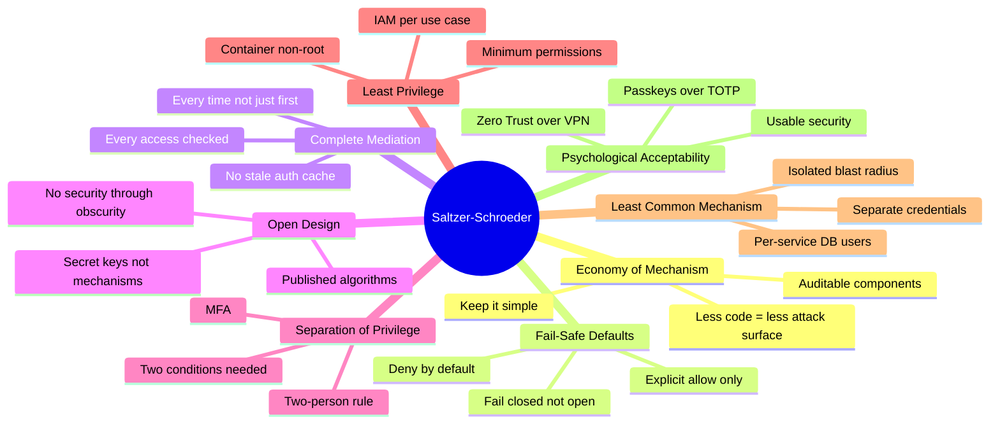

⚡ TL;DR - Saltzer and Schroeder's 8 principles of information protection (1975, MIT) remain
the most cited foundational principles in computer security. 50 years later: every OWASP
requirement, every zero trust control, every security architecture decision traces back to one
or more of these 8 principles. The eight principles: (1) ECONOMY OF MECHANISM: keep it simple.
Complexity is the enemy of security (more code = more attack surface). (2) FAIL-SAFE DEFAULTS:
deny by default. If there is no explicit permission: deny. (3) COMPLETE MEDIATION: check EVERY
access, EVERY time. No cached authorizations. (4) OPEN DESIGN: security must not depend on
secrecy of the mechanism. Known algorithm, unknown key. Kerckhoffs's principle. (5) SEPARATION
OF PRIVILEGE: require multiple conditions to be satisfied for access. Two-person rule. MFA.
(6) LEAST PRIVILEGE: run with the minimum permissions needed. Nothing extra. (7) LEAST COMMON
MECHANISM: minimize shared resources between users/processes. Shared state = shared vulnerability.
(8) PSYCHOLOGICAL ACCEPTABILITY: security mechanisms must be usable. Unusable security = bypassed
security. Applied today: (1) = microservices with bounded interfaces, (2) = default-deny firewall
rules and RBAC, (3) = JWT validation on every request, (4) = open-source cryptographic libraries
(OpenSSL, libsodium) vs. proprietary, (5) = MFA + step-up authentication, (6) = IAM least
privilege, Kubernetes RBAC, container read-only filesystems, (7) = database connection per service
not shared pool with admin rights, (8) = passwordless authentication (passkeys over complex TOTP setup).

---

| #133 | Category: Security | Difficulty: ★★★★ |
|:---|:---|:---|
| **Depends on:** | OWASP Top 10, Authentication, Business Logic, Insufficient Logging, CVSS Scoring, CVE + NVD, AWS Security Services, Kubernetes Security, Security Observability + SIEM, Security at Scale, ISO 27001, Chaos Engineering, Privilege Escalation, Zero Trust Introduction, Red/Blue/Purple Team, Zero Trust Enterprise, DevSecOps Pipeline, Security Champions, Enterprise Security Architecture, Secret Rotation, Security Governance, Threat Intelligence, CSIRT Design, Security Metrics, Supply Chain Security, Platform Security Engineering, Multi-Cloud Security, Build vs Buy, Security ADR, SIEM Architecture, SSDLC, TLS 1.3, OAuth 2.0 + OIDC, OWASP Methodology | |
| **Used by:** | Remaining SEC-134 through SEC-144 entries | |
| **Related:** | All preceding and remaining SEC entries | |

---

### 🔥 The Problem This Solves

**WHY FOUNDATIONAL PRINCIPLES MATTER MORE THAN RULES:**

```
SECURITY BY RULES (INCOMPLETE):
  
  Rule list approach:
  - "Use parameterized queries" (prevents SQL injection)
  - "Hash passwords with bcrypt" (prevents password cracking)
  - "Use HTTPS for all connections" (prevents eavesdropping)
  - "Validate all inputs" (prevents injection)
  - "Set Content-Security-Policy headers" (mitigates XSS)
  
  Problem: new technology, new attack vector → need a new rule.
  GraphQL emerges → is there a rule for GraphQL injection?
  AI/LLM integration → is there a rule for prompt injection?
  WebAssembly → is there a rule for WASM security?
  gRPC → is there a rule for gRPC security?
  
  Rules: never complete. Always lagging behind technology.
  
SECURITY BY PRINCIPLES (COMPLETE):

  Principle: FAIL-SAFE DEFAULTS.
  Applied to GraphQL: deny-by-default. Only expose fields that are explicitly authorized.
  Applied to LLM integration: treat LLM output as untrusted input. Validate before use.
  Applied to WASM: run in sandboxed environment with explicit capability grants.
  Applied to gRPC: require authenticated caller identity for every service method.
  
  The principle: applies to ALL technologies. New technology = apply the principle.
  No new rule needed. The existing principle: covers it.
  
  Saltzer and Schroeder recognized in 1975 what the security industry rediscovers every decade:
  security is not a list of rules. It is a set of invariants that hold regardless of
  the specific technology or attack technique.
  The principles: derived from first principles of information protection.
  They are as valid for OAuth 2.0 as they are for time-sharing systems in 1975.
```

---

### 📘 Textbook Definition

**Saltzer and Schroeder (1975):** Jerome Saltzer and Michael Schroeder published "The Protection
of Information in Computer Systems" in the Proceedings of the IEEE, 1975. The paper: defined a
framework for thinking about security in multi-user computer systems. The 8 principles enumerated:
became the canonical foundation for computer security design. Cited by: every major security
textbook, NIST guidelines, ISO 27001, OWASP, and virtually every security framework. Often
described as "50-year-old principles that the industry keeps rediscovering."

**Economy of Mechanism:** The protection system should be as simple as possible. Each additional
component adds attack surface and complexity that must be understood and defended. Simple systems:
easier to analyze, verify, and audit for security properties. Complexity: introduces unexpected
interactions and emergent behaviors that create vulnerabilities.

**Fail-Safe Defaults:** The default state of a protection system should be "no access."
Access: granted only when explicitly permitted. A missed case in the access control logic: results
in denial (safe) rather than access (unsafe). Contrast with "fail-open": if the access control
check fails or times out, access is granted. Fail-open: catastrophic security failure. Fail-safe:
inconvenient but safe.

**Complete Mediation:** Every access to every resource must be checked against an access control
mechanism. No caching of authorization decisions that might have changed. No shortcuts for
performance. The check: must happen on EVERY request, not just the first.

**Open Design (Kerckhoffs's Principle):** The security of the mechanism must not depend on the
secrecy of its design. The algorithm: publicly known. The key or secret: private. If the mechanism
must be kept secret to be secure: its security is fragile (the secret can leak). If the mechanism
is publicly known and still secure: true security.

**Separation of Privilege:** A protection mechanism that requires two separate conditions to be
satisfied is more robust than one that only requires one. Access: only when multiple independent
conditions are met. Example: MFA (something you know + something you have). Example: two-person
rule for deployments (one approver is not sufficient).

**Least Privilege:** Every program, user, and service should run with the minimum set of privileges
necessary for its function. A component with excess privilege: creates unnecessary risk.
If that component is compromised: the attacker gains only what the component had, not everything.

**Least Common Mechanism:** The mechanisms used to access resources should be minimized for
sharing among multiple users. Shared mechanisms: create shared vulnerabilities. Separate processes,
separate databases, separate API keys: isolate the blast radius of a compromise.

**Psychological Acceptability:** Security controls must not make the protected system significantly
harder to use for authorized users. If the security mechanism is too onerous: users find ways
around it. Unusable security: bypassed security. Design for the human, not just the attack.

---

### ⏱️ Understand It in 30 Seconds

**One line:**
The 8 Saltzer-Schroeder principles (1975) are the "laws of thermodynamics" of computer security
- not implementation rules that change with technology, but foundational invariants that hold across
all systems: deny by default, check every access, minimize shared state, require multiple conditions
for privilege, run with minimum needed permissions, keep mechanisms simple, keep them open, and
make them usable.

**One analogy:**
> The Saltzer-Schroeder principles are the engineering laws for security, like Newton's laws for physics.
>
> Newton's laws: not "here is the rule for a ball rolling down a ramp."
> Newton's laws: "here are three fundamental principles of motion that apply to ALL objects."
> New object? Apply the laws. New technology? Apply the laws.
>
> Similarly: Saltzer-Schroeder are not "here is the rule for SQL injection."
> Saltzer-Schroeder: "here are 8 fundamental principles of protection that apply to ALL systems."
>
> Physics example: "Does this design fail safe?"
> - A traffic light loses power. FAIL-SAFE DEFAULT: shows red in all directions (deny-by-default).
>   Not: all lights go green (fail-open). Fail-open = cars collide = catastrophe.
>
> - A nuclear plant's control rod system. FAIL-SAFE DEFAULT: control rods DROP under gravity (deny power)
>   if power to the electromagnets holding them fails. Not: rods stay elevated (fail-open = Chernobyl).
>
> - An elevator's braking system. FAIL-SAFE DEFAULT: brakes ENGAGE if the cable tension drops.
>   Not: brakes release on cable loss.
>
> FAIL-SAFE DEFAULT is a physical engineering principle before it is a software security principle.
> Saltzer-Schroeder: translated this physical engineering wisdom into software security.
>
> Each principle: an engineering law with a clear physical analog.
> LEAST PRIVILEGE = only give the surgeon the scalpel, not the entire instrument supply room.
> SEPARATION OF PRIVILEGE = nuclear launch requires TWO keys, simultaneously turned.
> COMPLETE MEDIATION = ID checked at EVERY door in a secure facility, not just the entrance.
> ECONOMY OF MECHANISM = a simpler lock with fewer parts is easier to verify and harder to pick.

---

### 🔩 First Principles Explanation

**All 8 principles - modern application:**

```
PRINCIPLE 1: ECONOMY OF MECHANISM

  1975 formulation: "Keep the design as simple and small as possible."
  
  2024 application:
  VIOLATION: A monolithic authorization service with 50,000 lines of code,
  handling authentication, RBAC, ABAC, audit logging, and session management.
  50,000 lines: impossible to fully audit for security properties.
  Any hidden interaction: potential vulnerability.
  
  CORRECT: A focused authentication service (5,000 lines).
  A separate authorization service (3,000 lines).
  Each: fully auditable. Interactions: explicit.
  
  In microservices: each service should have ONE security responsibility.
  Authentication: the auth service. Authorization: the authorization policy engine.
  Audit logging: the audit service. Not mixed. Not shared.
  
  TLS 1.3 economy: 5 cipher suites (not 37+). Simpler. Fewer choices. Fewer wrong choices.

PRINCIPLE 2: FAIL-SAFE DEFAULTS

  1975 formulation: "Unless a subject is given explicit access to an object,
  it should be denied access to that object."
  
  2024 application:
  VIOLATION: AWS Security Group default = ALLOW ALL OUTBOUND.
  A new security group: allows all outbound traffic by default.
  Developer: "I don't need to configure outbound. It just works."
  Attacker: exfiltrates data via outbound HTTP/HTTPS to their server.
  Default was ALLOW = fail-open.
  
  CORRECT: Default-deny outbound. Explicitly allow:
  - TCP/443 to S3 VPC endpoint (for S3 access).
  - TCP/443 to specific third-party API ranges.
  Everything else: denied. Egress filtering.
  
  VIOLATION: NGINX default configuration.
  Default config serves files from /etc/nginx/html.
  If not configured: serves any file accessible to the nginx user.
  Default = potentially too permissive.
  
  CORRECT: start from a deny-all config. Explicitly define every location block.
  
  VIOLATION: RBAC role with "*" permissions as the starting point.
  Developer: "I'll restrict it later. For now, admin access."
  Later: never happens.
  
  CORRECT: Start with no permissions. Grant only what is needed for the current sprint.
  Escalate deliberately. Deny by default.

PRINCIPLE 3: COMPLETE MEDIATION

  1975 formulation: "Every access to every object must be checked for authority."
  
  2024 application:
  VIOLATION: JWT validated once at the API gateway. Not re-validated at microservices.
  "We trust traffic from inside the cluster."
  If the JWT is forged or modified after the gateway (by a compromised internal service):
  the internal microservices accept it without checking.
  
  CORRECT: Each microservice validates the JWT independently.
  Even if the gateway already validated it.
  Complete mediation: checks at every trust boundary.
  
  VIOLATION: Authorization check on the first request of a session.
  "User is authorized at login. Cache the authorization decision for the session."
  If the user's role changes (terminated, privilege reduced) mid-session:
  cached authorization is stale. Old role still in effect until session expires.
  
  CORRECT: Authorization check on EVERY request.
  Role: read from the authorization source (JWT claim, RBAC database) on each request.
  Not cached in the session.

PRINCIPLE 4: OPEN DESIGN

  1975 formulation: "The design should not be secret."
  Also known as: Kerckhoffs's principle (1883, precedes Saltzer-Schroeder).
  
  2024 application:
  VIOLATION: "We use our own encryption algorithm. We won't publish it.
  Attackers can't break what they don't know."
  This is security through obscurity. The algorithm:
  - Cannot be peer-reviewed (hidden bugs accumulate).
  - Will be reverse-engineered (disassembly of the binary).
  - Has no cryptographic proofs of security.
  
  CORRECT: AES-256-GCM (standard, peer-reviewed, published).
  The algorithm: public. The KEY: secret. Security: in the key, not the algorithm.
  
  VIOLATION: "We use a proprietary authentication scheme."
  Published security standards (OAuth 2.0, OIDC, SAML): vetted by thousands of experts.
  Proprietary schemes: vetted by your team alone. Security: opaque.
  
  CORRECT: Use published, peer-reviewed standards (OAuth 2.0 + OIDC for authentication,
  JWT for tokens, TLS 1.3 for transport). The design: open. The secrets (keys, tokens): private.

PRINCIPLE 5: SEPARATION OF PRIVILEGE

  1975 formulation: "Where feasible, a protection mechanism that requires two keys
  to unlock it is more robust and flexible than one that allows access to the presenter
  of only a single key."
  
  2024 application:
  MFA: something you KNOW (password) + something you HAVE (TOTP, passkey, hardware token).
  Two independent conditions. One compromised: insufficient.
  
  DEPLOYMENT APPROVAL: code change must be approved by BOTH:
  - Automated CI pipeline (all tests pass, SAST clean, no CVEs in dependencies).
  - Human reviewer (understands the change, approves the risk).
  One alone: insufficient for production deployment.
  
  DATABASE SCHEMA CHANGES: require BOTH:
  - A DBA review (correct schema, backward compatible, migration plan).
  - A lead engineer sign-off (business requirement validated).
  
  NUCLEAR LAUNCH RULE: two officers, two keys, simultaneous turn. Not one.

PRINCIPLE 6: LEAST PRIVILEGE

  1975 formulation: "Every program and every privileged user of the system should
  operate using the least amount of privilege necessary to complete the job."
  
  2024 application:
  AWS IAM: don't use AdministratorAccess for a Lambda function that only reads from S3.
  Correct: IAM policy with ONLY: s3:GetObject on arn:aws:s3:::my-bucket/* (and no more).
  
  Kubernetes RBAC: don't give a pod the "cluster-admin" ClusterRole.
  Correct: a Role with ONLY: get and list on the specific ConfigMaps needed.
  
  Database: don't connect as the "root" user from the application.
  Correct: a dedicated user with SELECT on the specific tables the app reads,
  INSERT on the specific tables the app writes. No DROP, no GRANT, no CREATE.
  
  Container: don't run as root.
  securityContext: runAsNonRoot: true, runAsUser: 1001, readOnlyRootFilesystem: true.

PRINCIPLE 7: LEAST COMMON MECHANISM

  1975 formulation: "Minimize the amount of mechanism common to more than one user
  and depended on by all users."
  
  2024 application:
  VIOLATION: All microservices share a single database connection pool with admin privileges.
  If Service A is compromised: attacker accesses all databases via the shared admin connection.
  
  CORRECT: Each service has its own database user with only the tables it needs.
  Service A compromised: attacker gets only Service A's tables. Not Service B's.
  
  VIOLATION: All services share a Kubernetes namespace with permissive RBAC.
  A pod breakout in one service: attacker has access to all pods in the namespace.
  
  CORRECT: Separate Kubernetes namespaces per service (or tier). NetworkPolicies: deny by default.
  Service A pod: cannot access Service B pod by default (must be explicitly allowed).

PRINCIPLE 8: PSYCHOLOGICAL ACCEPTABILITY

  1975 formulation: "It is essential that the human interface be designed for ease of use,
  so that users routinely and automatically apply the protection mechanisms correctly."
  
  2024 application:
  VIOLATION: Complex TOTP MFA with 6-digit rotating codes + backup codes + device registration.
  User reaction: "MFA is too hard. I'll disable it." Or: writes codes on a sticky note.
  
  CORRECT: Passkeys (FIDO2/WebAuthn).
  User action: tap fingerprint sensor. Done.
  Same security level as TOTP. 10x better usability.
  User: adopts it because it's EASIER than a password.
  
  VIOLATION: VPN required for every access to internal tools (even for simple resources).
  Developer: "The VPN is slow and I'm just checking the wiki. I'll find a workaround."
  Workaround: copying the wiki content to a public Google Doc for easy access.
  
  CORRECT: Zero Trust access control with SSO. Access: based on identity + device posture.
  No VPN required. Seamless for authorized users.
  
  PRINCIPLE: if the security control makes the WRONG thing easy and the RIGHT thing hard,
  users will do the wrong thing. Design: make the secure behavior the easy behavior.
```

---

### 🧪 Thought Experiment

**SCENARIO: Evaluating a new feature design against all 8 principles:**

```
FEATURE: User-uploaded document processing.
Users upload PDF/DOCX files. Backend: extracts text, stores in database, runs NLP analysis.

PRINCIPLE 1 - ECONOMY OF MECHANISM:
  Is the design simple?
  PROBLEM: single service handling upload, parsing, storage, NLP, and access control.
  RECOMMENDATION: separate services:
    - Upload service: accepts file, validates type, stores in object storage.
    - Parser service: reads from object storage, extracts text. No network calls.
    - NLP service: receives text (not files). No file system access.
    - Storage service: writes extracted text to database.
  Simpler components. Easier to audit. Less coupling.

PRINCIPLE 2 - FAIL-SAFE DEFAULTS:
  If parsing fails: what happens?
  PROBLEM: on parsing error, the code returns an empty string and continues.
  The empty string: stored in database as "document content." User: never informed.
  Attacker: uploads a file that causes parsing to fail → content not extracted → 
  NLP analysis skipped → document passes content filtering with empty content.
  
  RECOMMENDATION: on parsing failure, REJECT the document. Return error to user.
  Do not silently continue with empty content.

PRINCIPLE 3 - COMPLETE MEDIATION:
  Does every access to the document check authorization?
  
  The document: uploaded by User A. Can User B access it?
  PROBLEM: access check at upload (User A uploads → their document).
  But: GET /documents/{id} does not re-check ownership. IDOR vulnerability.
  
  RECOMMENDATION: every GET /documents/{id}: verify document.userId == requestingUser.id.
  Every time. Not cached from the upload authorization check.

PRINCIPLE 4 - OPEN DESIGN:
  Does the security depend on secrecy of the mechanism?
  
  PROBLEM: File type validation: check the file extension.
  Security assumption: ".pdf" extension → PDF file. SECRET mechanism: we accept .pdf, reject .exe.
  Attacker: renames malicious.exe to malicious.pdf. Extension check: passes. File: executed.
  
  RECOMMENDATION: validate the file MAGIC BYTES (actual file format). Open, published standard.
  PDF magic bytes: %PDF (25 50 44 46). Not dependent on the filename.
  Security: in the parsing library and magic byte check, not in the "secret" extension list.

PRINCIPLE 5 - SEPARATION OF PRIVILEGE:
  Does any single condition grant full access?
  
  PROBLEM: uploading a file + being authenticated → document is processed immediately.
  One condition: authenticated user. That's it.
  
  RECOMMENDATION:
  - For untrusted document types (e.g., executable content embedded in Office macros):
    require BOTH: authentication + document passes content policy scan (antivirus, macro check).
  - For high-risk operations (share document externally): require BOTH: authentication + 
    explicit "external sharing" permission in the user's role.

PRINCIPLE 6 - LEAST PRIVILEGE:
  What permissions does each component need?
  
  Parser service:
  - Needs: read from object storage bucket (uploaded files).
  - Does NOT need: database write, network access, other buckets.
  
  PROBLEM: parser service running as a Linux user with write access to /tmp AND the database.
  If the parser library has a vulnerability (PDF parsing CVE): attacker can write to /tmp
  and the database.
  
  RECOMMENDATION:
  - Parser runs as a non-root user.
  - Parser: read-only filesystem (can't write to /tmp).
  - Parser: no network access (outbound denied).
  - Parser: publishes extracted text to a queue (SQS/RabbitMQ) - no direct DB access.
  Compromise of the parser: limited to reading the current file. Nothing else.

PRINCIPLE 7 - LEAST COMMON MECHANISM:
  What is shared between document processing and other services?
  
  PROBLEM: document processing service uses the same database connection (and user)
  as the user profile service and the billing service.
  If the parser has a SQL injection vulnerability: all three databases accessible.
  
  RECOMMENDATION: separate database user per service. Parser → document_db_user (INSERT on documents).
  Billing → billing_db_user (SELECT/INSERT on billing tables). No cross-service DB access.

PRINCIPLE 8 - PSYCHOLOGICAL ACCEPTABILITY:
  Is the security mechanism usable for legitimate users?
  
  PROBLEM: file upload requires: login + MFA + selecting a "document category" from a 20-item list +
  accepting a terms-of-service dialog on every upload.
  Users: skip the category selection (select "Other" for everything).
  Result: categorization is useless. Security analysis based on category: fails.
  
  RECOMMENDATION: optional category (auto-detected by NLP). MFA only on first daily session.
  Progress indicator for upload. Feedback on completion. Designed for the workflow, not for the
  security team's audit requirements.
```

---

### 🧠 Mental Model / Analogy

> The 8 principles as a single system: security is a property of the architecture, not a feature.
>
> Consider a bank vault. The security of the vault is NOT from:
> - "We hope no one tries to break in." (not a property)
> - "We trust the bank employees." (not a property)
> - "We have a guard sometimes." (not consistently applied)
>
> The security of a vault IS from:
> - ECONOMY OF MECHANISM: thick steel door + combination lock + time lock. Three mechanisms.
>   Simple and well-understood. Not 50 mechanisms that might interfere with each other.
> - FAIL-SAFE DEFAULTS: the lock: locked unless the correct combination is presented.
>   Default = locked. Not: unlocked unless the alarm is triggered.
> - COMPLETE MEDIATION: the combination is required EVERY time the vault is opened.
>   Not just the first time of the day.
> - OPEN DESIGN: the locking mechanism is standard (published by Sargent & Greenleaf).
>   Security: in the combination (the key), not the design of the lock.
> - SEPARATION OF PRIVILEGE: time lock + combination. BOTH required.
>   The combination alone (even correct) cannot open the vault before 9 AM.
> - LEAST PRIVILEGE: only the bank manager has the combination.
>   The teller: accesses the teller drawer (smaller, separate). Not the main vault.
> - LEAST COMMON MECHANISM: the main vault and the safety deposit boxes: separate mechanisms.
>   Compromise of a safety deposit box key: does not open the main vault.
> - PSYCHOLOGICAL ACCEPTABILITY: the combination is 4-5 digits (memorable).
>   Not 50 digits. The time lock: set once per day. Not per transaction.
>
> The bank vault has been physically implementing these 8 principles for over a century.
> Software systems: often do not. The principles: not new. The application: inconsistent.
>
> The mental model: every security decision is an implementation of one or more of these 8 principles.
> When a security decision feels wrong: identify which principle it violates.
> "We cache authorization decisions for performance" → violates COMPLETE MEDIATION.
> "We run the container as root" → violates LEAST PRIVILEGE.
> "Our proprietary encryption" → violates OPEN DESIGN.
> "No default deny in our firewall" → violates FAIL-SAFE DEFAULTS.
> The principle violation: the root cause. The specific vulnerability: the symptom.

---

### 📶 Gradual Depth - Five Levels

**Level 1 - What it is (anyone can understand):**
In 1975, two MIT researchers named Saltzer and Schroeder published a paper listing 8 principles that every secure computer system should follow. Fifty years later: these same 8 principles still explain why almost every security failure happens. The most important three: (1) deny by default - if you haven't explicitly said "yes," the answer is "no." (2) Use the minimum privilege needed - if a program only needs to read one file, it shouldn't have access to delete any file. (3) Check every access every time - don't assume that because someone was allowed in yesterday, they should be allowed in today. These aren't rules for a specific technology. They're principles that work for any system, any language, any decade.

**Level 2 - How to use it (junior developer):**
The two principles you violate most often as a junior developer: (1) Fail-safe defaults. When writing an access control check, the DEFAULT case should be DENY. If your if-else logic has a path that doesn't explicitly check permissions: make that path return a 403, not grant access. Review every access control function: is there any path that "falls through" to granting access without an explicit check? (2) Least privilege. In your development environment: you use your personal AWS account with admin access. In staging and production: the service should have an IAM role with ONLY the permissions it actually calls. Document every AWS API call your service makes → create an IAM policy with exactly those permissions, nothing more. Same for database: what tables does your service read? What does it write? Create a database user with exactly those permissions.

**Level 3 - How it works (mid-level engineer):**
Complete mediation: the most commonly violated principle in distributed systems. The failure mode: authorization is checked at the API gateway (or the frontend) but not re-checked at the microservice. Pattern: frontend sends a JWT to the API gateway → gateway validates the JWT and routes to the service → the service trusts traffic from the gateway without further validation. If the gateway is misconfigured (wrong routing rule), if a service is exposed directly (port scan finds it), or if an attacker compromises an internal service: the unguarded microservice is accessible without authorization. The correct pattern: every microservice validates the JWT independently. The JWT: verified at every trust boundary. Complete mediation: checked at every boundary, not just the first. In Kubernetes: each pod should validate the calling service's identity (using SPIFFE/SPIRE workload identity or mutual TLS). Not just "traffic from inside the cluster is trusted."

**Level 4 - Why it was designed this way (senior/staff):**
The psychological acceptability principle is the most underappreciated and the most violated. Security teams: often design security for the threat model, not for the user. The result: security controls that are technically correct but behaviorally ineffective. Example: complex MFA (TOTP + backup codes + device registration) → 20% of users don't complete registration → 20% of users have no MFA. Passkeys (FIDO2/WebAuthn) → 95% adoption rate in deployments that offer it alongside password (Google's data). The passkey: more secure than TOTP (phishing-resistant, hardware-bound, no code to intercept). AND: easier to use. Security improved by making the mechanism more psychologically acceptable. This is Saltzer-Schroeder in action: the principle predicts that less acceptable mechanisms will be bypassed, reducing effective security below the intended level. Security architects who ignore psychological acceptability: design systems that are theoretically secure and practically insecure. The correct design approach: start with the user workflow, identify the friction points, design the security mechanism to minimize friction while maintaining the security property. Not: design for maximum security and accept the usability cost.

**Level 5 - Mastery (distinguished engineer):**
The tension between Complete Mediation and Economy of Mechanism: a fundamental design trade-off that reveals the depth of the principles. Complete Mediation: check EVERY access EVERY time. This implies: for 10 million requests per second, there are 10 million authorization checks per second. If each check: 1ms (database query for role lookup), the system: needs 10,000 cores just for authorization. Economy of Mechanism: keep it simple. A simple caching mechanism dramatically reduces the authorization cost. But: violates Complete Mediation (cached authorizations may be stale). The resolution: time-bounded caching (30-second TTL on role lookups) is a deliberate, bounded violation of Complete Mediation in exchange for economy. The violation: documented, understood, and bounded. Acceptable for most use cases (30-second window for a terminated user to continue accessing the API → acceptable risk for most systems). NOT acceptable for: high-security operations (payment initiation, privileged command execution → always re-check, no caching). Understanding that the principles are in tension and that the correct design resolves the tension with bounded, intentional trade-offs: the mark of a security architect who understands the principles at a foundational level, not just as a checklist. The Saltzer-Schroeder principles: not absolutes. They are design goals that must be balanced against each other and against the system's operational requirements.

---

### ⚙️ How It Works (Mechanism)

```
THE 8 PRINCIPLES - VIOLATION TO CORRECT PATTERN:

  PRINCIPLE          VIOLATION PATTERN        CORRECT PATTERN
  ─────────────────────────────────────────────────────────
  Economy of         Single service with      Separate services,
  Mechanism          100K+ lines, all mixed   focused responsibility
  
  Fail-Safe          Default ALLOW, restrict  Default DENY, explicit
  Defaults           what to block            allow only
  
  Complete           Auth check at entry,     Auth check at EVERY
  Mediation          trust internal traffic   service boundary
  
  Open Design        Proprietary algorithm    Published standard,
                     or encoding as security  secret key/credential
  
  Separation         Single password grants   MFA, two-person rule,
  of Privilege       full access              multiple conditions
  
  Least Privilege    Admin access everywhere  Minimum IAM/RBAC per
                     for convenience          component's need
  
  Least Common       Shared DB user/pool      Per-service credentials,
  Mechanism          across all services      separate DB users
  
  Psychological      Complex, friction-heavy  Seamless, SSO, passkeys,
  Acceptability      security UX              progressive security
```



---

### 💻 Code Example

**8 principles in code - violation and correct patterns:**

```python
# saltzer_schroeder_examples.py
# Each example: one principle. BAD code → GOOD code.
# All examples: real production patterns, not toy examples.

# ============================================================
# PRINCIPLE 2: FAIL-SAFE DEFAULTS
# ============================================================

from typing import Optional
import functools

# BAD: Fail-open. If authorization check raises an exception: access granted.
def get_user_data_bad(user_id: int, requesting_user: dict) -> dict:
    try:
        if requesting_user["id"] == user_id:
            return fetch_user_data(user_id)
        # What if there are more conditions here and one throws?
        # Falls through to return None - but should be 403!
    except Exception:
        pass  # Exception: ignored. Access state: undefined.
    return {}  # Empty dict returned instead of raising PermissionError


# GOOD: Fail-safe. If authorization check fails for ANY reason: access denied.
def get_user_data_good(user_id: int, requesting_user: dict) -> dict:
    try:
        # Explicit authorization check
        if requesting_user.get("id") != user_id and \
           "admin" not in requesting_user.get("roles", []):
            raise PermissionError(
                f"User {requesting_user.get('id')} cannot access user {user_id} data"
            )
        return fetch_user_data(user_id)
    except PermissionError:
        raise  # Re-raise: let the caller handle the 403
    except Exception as e:
        # Unexpected error in authorization logic: fail safe (deny)
        raise PermissionError(
            f"Authorization check failed unexpectedly. Access denied."
        ) from e


# ============================================================
# PRINCIPLE 3: COMPLETE MEDIATION
# ============================================================

# BAD: Authorization checked once (at session start). Subsequent requests: trusted.
class SessionBad:
    def __init__(self, user_id: int, roles: list):
        self.user_id = user_id
        self.roles = roles  # Cached at session start. Never re-checked.
        self.authorized = True  # Set once, trusted forever in the session.
    
    def can_access_resource(self, resource_id: int) -> bool:
        return self.authorized  # Returns cached state. Stale if role changed.


# GOOD: Authorization checked on every request.
class ResourceGuard:
    def __init__(self, user_repository, role_repository):
        self._user_repo = user_repository
        self._role_repo = role_repository
    
    def is_authorized(
        self,
        user_id: int,
        resource_id: int,
        required_permission: str
    ) -> bool:
        # Fetch current user state - not from session cache
        user = self._user_repo.get_user(user_id)
        if not user or not user.is_active:
            return False  # User may have been deactivated since last request
        
        # Fetch current role assignments - not from session cache
        current_roles = self._role_repo.get_user_roles(user_id)
        
        # Check permission against current (not cached) roles
        for role in current_roles:
            if required_permission in role.permissions:
                # Also check: does this user own this specific resource?
                if self._user_repo.user_owns_resource(user_id, resource_id):
                    return True
        return False  # Default: deny (fail-safe)


# ============================================================
# PRINCIPLE 6: LEAST PRIVILEGE (AWS IAM Example)
# ============================================================

# BAD: Lambda function with AdministratorAccess.
# In CloudFormation/CDK:
BAD_IAM_POLICY = {
    "Version": "2012-10-17",
    "Statement": [{
        "Effect": "Allow",
        "Action": "*",  # ALL AWS actions. Never appropriate for a Lambda function.
        "Resource": "*"
    }]
}
# This function: can create EC2 instances, delete S3 buckets, modify IAM policies.
# If compromised: full AWS account control.

# GOOD: Lambda function with exactly what it needs.
# Function: reads messages from SQS, writes results to DynamoDB.
GOOD_IAM_POLICY = {
    "Version": "2012-10-17",
    "Statement": [
        {
            "Effect": "Allow",
            "Action": ["sqs:ReceiveMessage", "sqs:DeleteMessage", "sqs:GetQueueAttributes"],
            "Resource": "arn:aws:sqs:us-east-1:123456789:my-specific-queue"
            # ONLY this queue. Not all queues.
        },
        {
            "Effect": "Allow",
            "Action": ["dynamodb:PutItem", "dynamodb:UpdateItem"],
            "Resource": "arn:aws:dynamodb:us-east-1:123456789:table/ProcessingResults"
            # ONLY PutItem and UpdateItem on ONE specific table. Not GetItem, not DeleteItem.
        }
    ]
}
# If compromised: attacker can only read from one SQS queue and write to one DynamoDB table.
# Blast radius: bounded by the function's granted permissions.


# ============================================================
# PRINCIPLE 7: LEAST COMMON MECHANISM
# ============================================================

# BAD: All services share one database connection with admin privileges.
# Connection in a shared module imported by all services:
# db_connection = connect(host="db", user="root", password="...", database="*")
# Service A uses it. Service B uses it. Service C uses it.
# Compromise of any service → access to all databases as root.

# GOOD: Each service has its own connection with scoped permissions.
# service_a/database.py:
# db = connect(host="db", user="service_a_user", password="...", database="service_a_db")
# Permissions for service_a_user: SELECT, INSERT, UPDATE on service_a_db.orders
# NO access to: service_b_db, service_c_db, any system tables.

# service_b/database.py:
# db = connect(host="db", user="service_b_user", password="...", database="service_b_db")
# Permissions: SELECT on service_b_db.customers, INSERT on service_b_db.events.

# Compromise of service_a: attacker accesses service_a_db.orders only.
# service_b_db: inaccessible (different user, no cross-database permission).


def fetch_user_data(user_id: int) -> dict:
    # Placeholder for actual implementation
    return {"user_id": user_id, "name": "Example User"}
```

---

### ⚖️ Comparison Table

| Principle | Common Violation | Security Impact | Fix Pattern |
|:---|:---|:---|:---|
| **Economy of Mechanism** | Monolithic auth service, 37 TLS cipher suites | Harder to audit, unexpected interactions | Separate concerns, TLS 1.3's 5 suites |
| **Fail-Safe Defaults** | Default-allow firewall, fail-open auth | Unexpected access on misconfiguration | Default-deny, explicit allow only |
| **Complete Mediation** | API gateway validates JWT, services trust internal traffic | IDOR if internal routing bypassed | Validate at every service boundary |
| **Open Design** | Proprietary crypto, home-built auth | Unreviewed vulnerabilities, reverse engineering trivial | AES-256-GCM, OAuth 2.0, TLS 1.3 |
| **Separation of Privilege** | Single password for admin access | One stolen credential = full compromise | MFA, approval workflows, two-person rule |
| **Least Privilege** | Admin IAM for Lambda, root DB user | Full compromise on any vuln | Scoped IAM, per-service DB user |
| **Least Common Mechanism** | Shared DB connection across services | Lateral movement on service compromise | Per-service credentials, network isolation |
| **Psychological Acceptability** | Complex TOTP, VPN for everything | Users bypass security, shadow IT | Passkeys, Zero Trust, SSO |

---

### ⚠️ Common Misconceptions

| Misconception | Reality |
|:---|:---|
| "These are 1975 principles. Modern systems need modern principles." | Every modern security framework - Zero Trust, NIST SSDF, OWASP, ISO 27001, NIST 800-53, PCI DSS - is an elaboration of Saltzer-Schroeder. Zero Trust: is Complete Mediation (never trust, always verify) + Fail-Safe Defaults (deny by default) applied to network architecture. NIST SSDF (Secure Software Development Framework): includes "PS.1 Identify and Confirm Conformance to Security Requirements" (Economy of Mechanism) and "PO.5 Implement and Maintain Secure Environments" (Least Common Mechanism). The principles don't change. The technology they're applied to changes. TLS 1.3's 5 cipher suites is Economy of Mechanism. Container security contexts with readOnlyRootFilesystem is Least Privilege. Kubernetes NetworkPolicies with default-deny is Fail-Safe Defaults. If you can clearly articulate which Saltzer-Schroeder principle a modern security control implements: you understand why the control exists, not just what it does. |
| "Economy of Mechanism means microservices with hundreds of tiny services." | Economy of Mechanism means "as simple as possible, no simpler." A monolith with clear internal separation of concerns: can be more economical than 200 microservices each with its own communication overhead, service mesh, and failure mode. The principle: about simplicity and auditability, not about the deployment pattern. A well-structured monolith with bounded internal modules: can be simpler to reason about securely than a microservices system where authorization spans 15 service-to-service calls. Economy of Mechanism applied to microservices: each service should have ONE clearly defined security boundary, ONE responsibility, and ONE data domain. Not: "split everything into the smallest possible service." The measure: can you fully audit the security properties of each component? If a microservice is too complex to fully audit: Economy of Mechanism says simplify it. If a monolith is structured enough to be fully audited: Economy of Mechanism is satisfied. |

---

### 🚨 Failure Modes & Diagnosis

**Diagnosing principle violations in production systems:**

```
PATTERN: SECURITY INCIDENT ROOT CAUSE ANALYSIS

  Incident: attacker accessed customer data from a compromised background job.
  
  Root cause analysis:
  Q: Which Saltzer-Schroeder principle was violated?
  
  Investigation:
  1. How did the attacker get in?
     - Background job: running as root (LEAST PRIVILEGE violation).
     - Root: can read all files on the container.
     - Found: API key in environment variable (LEAST PRIVILEGE violation at credential level).
  
  2. What did the attacker access after getting in?
     - The API key: had admin scope for the entire user database (LEAST PRIVILEGE violation).
     - Not: scoped to only the records the background job needed to process.
  
  3. Why wasn't the access detected earlier?
     - Background job: not in the audit log scope (COMPLETE MEDIATION violation).
     - Only user-facing API calls were logged. Background jobs: bypassed logging.
  
  4. Why could the background job access all customer data?
     - No data isolation: background job used the same DB connection as the API (LEAST COMMON MECHANISM violation).
     - DB user had SELECT on all tables.
  
  Principle violations: FOUR (Least Privilege x2, Complete Mediation, Least Common Mechanism).
  
  Correct design:
  - Background job: non-root container user (runAsNonRoot: true).
  - API key: scoped to only: read unprocessed records from one specific table.
  - Background job: ALL operations logged. Same audit trail as user-facing API.
  - Separate DB user for background jobs: SELECT on unprocessed_records only.
  
  Each violation: one principle. Each fix: one principle applied.

DIAGNOSTIC QUESTIONS FOR SECURITY REVIEW:

  Economy: "Can I read and fully understand every line of this security-critical code in 30 minutes?"
  Fail-Safe: "If this check throws an exception: what is the default? Is it deny?"
  Complete Mediation: "Is there any path through the code that accesses a resource without checking auth?"
  Open Design: "Does any security property depend on an attacker not knowing how we implemented it?"
  Separation of Privilege: "Can any single credential, key, or person gain the most sensitive access?"
  Least Privilege: "What is the MINIMUM access this component needs? Does it have EXACTLY that?"
  Least Common Mechanism: "What is shared between different trust levels? How can that sharing be reduced?"
  Psychological Acceptability: "Does the security mechanism require extra steps that users will find ways around?"
```

---

### 🔗 Related Keywords

**Prerequisites:**
- `OWASP Methodology and Security Science` (SEC-132) - OWASP requirements map to Saltzer-Schroeder principles
- `Zero Trust Introduction` (SEC-085) - Zero Trust is Complete Mediation + Fail-Safe Defaults applied to networks

**Builds on this:**
- `Trust Boundary Analysis` (SEC-141) - applies Least Privilege and Least Common Mechanism to boundary design
- `Assume-Breach Reasoning` (SEC-142) - assumes violations of Economy, Fail-Safe Defaults occur; designs for it
- `Security as Contract` (SEC-143) - formalizes Fail-Safe Defaults and Least Privilege as explicit contracts

---

### 📌 Quick Reference Card

```
┌──────────────────────────────────────────────────────────┐
│ 8 PRINCIPLES  │ Economy: keep it simple                  │
│               │ Fail-Safe Defaults: deny by default      │
│               │ Complete Mediation: check EVERY access   │
│               │ Open Design: security in keys not algos  │
│               │ Separation of Privilege: two conditions  │
│               │ Least Privilege: minimum permissions     │
│               │ Least Common Mechanism: isolate sharing  │
│               │ Psychological Acceptability: usable      │
├───────────────┼──────────────────────────────────────────┤
│ TODAY AS      │ Fail-Safe = default-deny firewall/RBAC  │
│               │ Complete = JWT check at every microservice│
│               │ Least Privilege = scoped IAM/RBAC       │
│               │ Open Design = TLS 1.3, OAuth 2.0, AES   │
│               │ Psych = passkeys, Zero Trust, SSO        │
├───────────────┼──────────────────────────────────────────┤
│ ROOT CAUSE    │ Most security failures: one of these 8  │
│               │ Identify which principle was violated    │
│               │ Fix the principle, not just the symptom  │
└──────────────────────────────────────────────────────────┘
```

---

### 💎 Transferable Wisdom

**Reusable Engineering Principle:**
"First principles beat rules, because principles compose."
Saltzer and Schroeder derived their 8 principles from first principles of information protection.
They asked: "What fundamental properties must a protection mechanism have?"
The result: 8 principles that compose to explain virtually every security control.
This composability: the key property that makes principles more valuable than rules.
A rule: "use parameterized queries for SQL." Specific, correct, but limited.
The principle: "never treat user input as trusted code" (derived from Fail-Safe Defaults +
Complete Mediation). This principle: applies to SQL injection AND XSS AND command injection AND
LDAP injection AND template injection AND prompt injection in LLMs.
The rule requires a new rule for each attack vector. The principle: applies automatically.
This pattern - derive principles from first principles, not rules from observed attacks -
applies beyond security:
Database design: derive from the ACID properties (atomicity, consistency, isolation, durability).
Not: "here is a rule for every kind of transaction." Apply the properties, get the rule.
API design: derive from REST constraints (statelessness, uniform interface, layered system).
Not: "here is a rule for every kind of endpoint." Apply the constraints, get the design.
The principle of principles: derive from first principles whenever possible.
Rules: the output. Principles: the input. Collect principles, generate rules as needed.
The engineer who understands Saltzer-Schroeder: can generate the correct security rule for
any new technology (LLMs, quantum communication, augmented reality).
The engineer who only knows rules: waits for someone to publish the right rule for the new technology.

---

### 💡 The Surprising Truth

The 8 Saltzer-Schroeder principles were published in 1975 for time-sharing systems (Multics at MIT).
The concept of a web application did not exist. The concept of cloud computing: 30+ years away.
Containers: 40 years away. LLMs: 50 years away.

Yet: every security principle that modern security engineers apply to these technologies
is a direct application of one of the 8 principles. How is this possible?

The answer reveals something fundamental about the nature of security: security is a
property of the relationship between a principal (who wants access), a resource (what is
accessed), and a mechanism (how access is controlled). The specific TECHNOLOGY changes.
The structure of the relationship: does not.

A Multics process requesting access to a file in 1975. A microservice requesting access to
another microservice's API in 2024. A prompt injection attack in an LLM in 2024.
Different technologies. Same structure: principal, resource, mechanism.

Fail-safe defaults (1975): a Multics process that doesn't have explicit permission is denied.
Fail-safe defaults (2024): an LLM that receives a prompt it doesn't have explicit authorization
to execute (a "jailbreak" attempt) should default to denial, not compliance.

Complete mediation (1975): every file access is checked.
Complete mediation (2024): every LLM request is validated against the user's authorization scope,
not just the first request of the session.

Least privilege (1975): a Multics process runs with only the file permissions it needs.
Least privilege (2024): a RAG (Retrieval-Augmented Generation) pipeline accesses only the
document corpus the authenticated user is authorized to see.

The principles: not specific to any technology. They are specifications of what the
authorization relationship requires. When you understand them at this level of abstraction,
you don't need to wait for "LLM security guidelines" to be published. You apply the principles.
This is what it means to "understand security" vs. "know security rules."

---

### ✅ Mastery Checklist

**You've mastered this when you can:**
1. **NAME all 8 principles**: Economy of Mechanism, Fail-Safe Defaults, Complete Mediation,
   Open Design, Separation of Privilege, Least Privilege, Least Common Mechanism, Psychological
   Acceptability.
2. **IDENTIFY violations** in code or architecture: "This service runs as root" → Least Privilege.
   "Authorization cached in session" → Complete Mediation. "Custom encryption" → Open Design.
   "Default-allow security group" → Fail-Safe Defaults.
3. **MAP modern controls to principles**: Zero Trust = Complete Mediation + Fail-Safe Defaults.
   MFA = Separation of Privilege. IAM scoped policies = Least Privilege. TLS 1.3's 5 cipher suites
   = Economy of Mechanism. Passkeys = Psychological Acceptability.
4. **APPLY to new technology**: given a new technology (LLMs, quantum key distribution, AR systems),
   derive the security requirements by applying each principle systematically.
5. **EXPLAIN the tension**: Complete Mediation (check everything, every time) vs. Economy of Mechanism
   (keep it simple, minimize overhead). Resolution: time-bounded caching (deliberate, documented,
   bounded violation of Complete Mediation for performance).

---

### 🎯 Interview Deep-Dive

**Q: You're reviewing a new microservice architecture. How do you apply Saltzer-Schroeder principles
to identify security issues?**

*Why they ask:* Tests depth of security architecture knowledge. Distinguishes candidates who know
security rules from those who understand security principles. Common in senior security engineer,
security architect, and principal engineer roles.

*Strong answer covers:*
- Economy of Mechanism: "I'd look at the service boundary complexity first. If a service handles
  authentication, authorization, business logic, data storage, and audit logging in one component:
  it violates Economy of Mechanism. I'd recommend separating security-critical functions. An auth
  service should do authentication. An authorization service should evaluate permissions. Separation:
  makes each component auditable and testable in isolation."
- Fail-Safe Defaults and Complete Mediation: "I'd trace every API endpoint and ask: what happens
  if the authorization check fails or throws an exception? If the default is to proceed: fail-open,
  a violation. I'd also check: is authorization re-evaluated at every service, or is it done once
  at the gateway and trusted internally? If internal traffic is trusted: Complete Mediation is
  violated. Every microservice should validate the caller's JWT independently."
- Least Privilege: "I'd audit the IAM roles and database users. Every Lambda, every EC2, every
  ECS task: what IAM permissions does it have? If any has 'Action: *' or 'Resource: *':
  Least Privilege violation. Every database user: what tables and operations does it have?
  If a read service has INSERT/DELETE: Least Privilege violation."
- Least Common Mechanism: "I'd look at what's shared between services. Shared database connection
  pool? Shared API key? Shared message queue with broad read permissions? Each shared mechanism:
  a potential lateral movement path if one service is compromised. Recommend: per-service credentials,
  per-service database users, separate queues."
- Psychological Acceptability: "Finally: do engineers actually use the security mechanisms? If MFA
  is optional and 30% of engineers haven't enabled it: Psychological Acceptability violation.
  If accessing internal tools requires VPN + re-authentication every hour: engineers find workarounds.
  The security mechanism should make the secure behavior the easiest behavior."