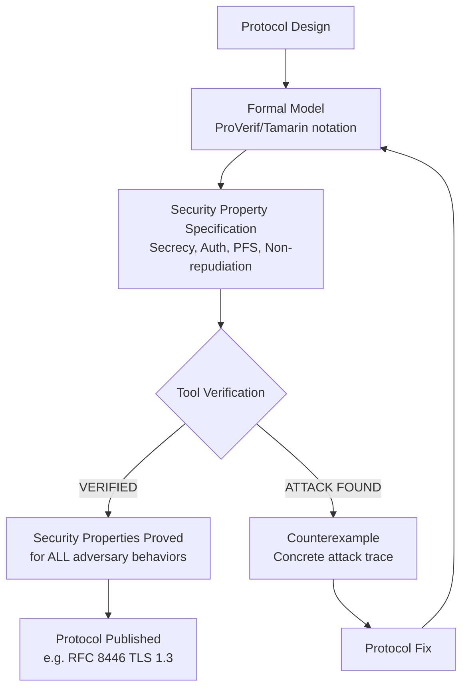

⚡ TL;DR - Formal verification of security protocols is the use of mathematical methods to
prove (or disprove) that a communication protocol achieves specified security properties
(secrecy, authentication, perfect forward secrecy, non-repudiation) for ALL possible
behaviors of an adversary. Why this matters: security protocols are notoriously hard to
analyze manually. The Needham-Schroeder protocol (1978): used for authentication in
distributed systems. Seemed correct. Gavin Lowe found a man-in-the-middle attack in 1995
using formal analysis - 17 YEARS after the protocol was published. The attack: not found
by manual review in 17 years. Lowe: used FDR (Failures-Divergences Refinement, a model
checker) and found it in automated analysis. The lesson: security protocols contain subtle
flaws that human review misses. Formal methods: find them systematically. Tools: ProVerif
(symbolic, automatic), Tamarin (symbolic, interactive), CryptoVerif (computational, automatic).
The Dolev-Yao adversary model: the standard attacker model for formal protocol verification.
Assumptions: the attacker controls the network completely (can intercept, modify, replay,
drop any message). The attacker: cannot break cryptographic primitives (they are modeled
as perfect). The formal analysis: proves properties hold against ALL Dolev-Yao adversaries,
not just the ones the designer thought about. Results: TLS 1.3 was formally verified with
Tamarin before publication of RFC 8446. Signal Protocol: verified with ProVerif. The
verification: found and fixed issues BEFORE deployment. Not after a breach.

---

| #134 | Category: Security | Difficulty: ★★★★★ |
|:---|:---|:---|
| **Depends on:** | OWASP Top 10, Authentication, Business Logic, Insufficient Logging, CVSS Scoring, CVE + NVD, AWS Security Services, Kubernetes Security, Security Observability + SIEM, Security at Scale, ISO 27001, Chaos Engineering, Privilege Escalation, Zero Trust Introduction, Red/Blue/Purple Team, Zero Trust Enterprise, DevSecOps Pipeline, Security Champions, Enterprise Security Architecture, Secret Rotation, Security Governance, Threat Intelligence, CSIRT Design, Security Metrics, Supply Chain Security, Platform Security Engineering, Multi-Cloud Security, Build vs Buy, Security ADR, SIEM Architecture, SSDLC, TLS 1.3, OAuth 2.0 + OIDC, OWASP Methodology, Secure by Design Principles | |
| **Used by:** | Remaining SEC-135 through SEC-144 entries | |
| **Related:** | All preceding and remaining SEC entries | |

---

### 🔥 The Problem This Solves

**THE NEEDHAM-SCHROEDER ATTACK: 17 YEARS OF MISSED VULNERABILITY:**

```
NEEDHAM-SCHROEDER PUBLIC KEY PROTOCOL (1978):

  Purpose: mutual authentication between A and B using a shared key server.
  Published: 1978. Used in: Kerberos-inspired systems, distributed authentication.
  
  Protocol:
  1. A → B: {Na, A}Kb         (Na = nonce of A, encrypted with B's public key)
  2. B → A: {Na, Nb}Ka        (Nb = nonce of B, encrypted with A's public key)
  3. A → B: {Nb}Kb            (A returns Nb, proving A decrypted the previous message)
  
  Designers' intent: A proves identity to B (in step 2, B encrypts Na which only A can decrypt).
  B proves identity to A (in step 3, A returns Nb which only B decrypted from step 2).
  
  FOR 17 YEARS: used in implementations. Analyzed manually by experts.
  No attack found.
  
  LOWE'S 1995 ATTACK (found by formal analysis with FDR model checker):
  
  C (attacker) can impersonate A to B:
  
  1.  A → C: {Na, A}Kc        (A starts protocol with C, thinking C is B)
  2.  C → B: {Na, A}Kb        (C forwards the message to B, pretending to be A)
  3.  B → C: {Na, Nb}Ka       (B sends its response to the claimed sender, A)
  4.  C → A: {Na, Nb}Ka       (C forwards B's response to A, pretending to be B)
  5.  A → C: {Nb}Kc           (A decrypts and returns Nb, thinking it's talking to B)
  6.  C → B: {Nb}Kb           (C forwards Nb to B - completing B's authentication of A!)
  
  RESULT: B believes it is talking to A. But: actually talking to C.
  C: never had A's private key. Yet: B has "authenticated" A. Complete impersonation.
  
  The attack: a man-in-the-middle attack where C leverages A's ongoing session with C
  to extract valid authentication messages to use with B. Subtle. Requires a concurrent
  session assumption. Human review: missed it for 17 years.
  
  Lowe's fix (Lowe 1995): include B's identity in message 2.
  2. B → A: {Na, Nb, B}Ka    (B includes its own identity in the encrypted response)
  Now: A can verify it's talking to B (not a relay through C).
  
  Why the formal analysis found it: the model checker exhaustively explored ALL interleavings
  of concurrent sessions. The attack requires TWO concurrent sessions: A-C and C-B.
  Human analysis: typically considers one session at a time. The concurrent interleaving:
  invisible to human review. Model checker: explores all concurrency automatically.
```

---

### 📘 Textbook Definition

**Formal Verification of Security Protocols:** The application of formal mathematical methods to
prove that a communication protocol satisfies specified security properties. The proof: holds for
ALL possible behaviors of a defined adversary model, not just the behaviors the designer considered.
Distinct from: testing (which checks specific behaviors, not all behaviors), code review (which checks
implementation, not protocol design), and penetration testing (which checks a specific instantiation).

**Dolev-Yao Adversary Model (1983):** The standard adversary model for formal protocol analysis.
The adversary: controls the network. Can: intercept any message, drop any message, replay any message,
modify any message, inject new messages. Cannot: break cryptographic primitives (hash functions, symmetric
encryption, asymmetric encryption are modeled as perfect). The Dolev-Yao model: conservative. If a
protocol is secure against a Dolev-Yao adversary: it is secure against any adversary who cannot break
the underlying cryptographic primitives.

**Security Properties Formally Verified:**
- **Secrecy (confidentiality):** a specific value (session key, nonce) is never known to the adversary.
- **Authentication:** if principal A believes it communicated with B, then B actually participated.
- **Non-injective agreement:** A and B agree on the values exchanged.
- **Perfect Forward Secrecy (PFS):** compromise of long-term keys does not enable decryption of past sessions.
- **Non-repudiation:** A cannot deny having sent a message.

**Symbolic Verification:** Cryptographic primitives are modeled as black boxes (perfect encryption,
unbreakable hash functions). The adversary: can compose messages from known components but cannot
"break" encryption. Tools: ProVerif, Tamarin. More scalable than computational verification.
May miss attacks that exploit computational properties (e.g., hash collisions).

**Computational Verification:** Cryptographic primitives are modeled as probabilistic algorithms with
concrete security parameters. Proofs: hold in the "computational model" (probabilistic polynomial-time
adversaries). Tools: CryptoVerif. More precise but: more complex, harder to automate for complex protocols.

**ProVerif:** An automatic protocol verifier based on an abstract interpretation of the pi-calculus.
Input: protocol described in a formal language. Output: "OK" (property holds for all traces) or
"attack found" (with a concrete counterexample). Used by: Signal Protocol designers, TLS 1.3 RFC authors
(partial), QUIC protocol designers.

**Tamarin:** A protocol security analysis tool based on multiset rewriting systems and constraint
solving. More expressive than ProVerif (handles complex properties like PFS, different session models).
But: requires interactive guidance for complex protocols. Used for: TLS 1.3 full verification.

---

### ⏱️ Understand It in 30 Seconds

**One line:**
Formal verification of security protocols uses model checkers (ProVerif, Tamarin) to exhaustively
prove that a protocol's security properties (secrecy, authentication, forward secrecy) hold for
ALL possible adversary behaviors - not just the ones the designer anticipated - closing the gap
between "we believe this is secure" and "we have proved this is secure."

**One analogy:**
> Formal protocol verification is the difference between "the bridge looks solid" and "we have proved
> the bridge can withstand all loads up to X using structural engineering mathematics."
>
> Informal protocol review: "We looked at the protocol. It seems secure. We couldn't think of an attack."
> This is: "The bridge looks solid. We tried standing on it. It didn't collapse."
>
> Formal verification: "We modeled the protocol in a mathematical framework.
> We proved that for ALL possible adversary behaviors (within the Dolev-Yao model),
> the protocol achieves authentication and secrecy."
> This is: "We calculated the load distribution, stress analysis, and resonance frequency.
> We proved the bridge can withstand 1,000 tons at all points, wind speeds up to 120 mph,
> and earthquake loads up to 0.3g. The proof: holds. The bridge: safe to open."
>
> The Needham-Schroeder attack: "The bridge looks solid. 17 years of engineers walked across it.
> Until someone calculated the resonance frequency and found: at a specific wind speed + load
> combination that occurred rarely, the bridge oscillates to failure."
> (Analogy: like the Tacoma Narrows Bridge, 1940 - failed due to aeroelastic flutter, not static load.)
> Lowe's ProVerif analysis: found the resonance mode (concurrent session attack) that human
> review missed for 17 years.
>
> The lesson: for critical infrastructure (bridges, cryptographic protocols), "looks secure"
> is insufficient. Mathematical proof: the standard for high-assurance systems.
> TLS 1.3: carries the private communications of billions of people.
> A protocol-level flaw in TLS 1.3: would be catastrophic.
> The TLS 1.3 working group: used Tamarin to formally verify the protocol before RFC publication.
> Not because they couldn't trust their own analysis. Because formal verification: provably complete.
> Human analysis: provably incomplete (cannot explore all concurrent session interleavings).

---

### 🔩 First Principles Explanation

**How ProVerif works - the Dolev-Yao model in practice:**

```
PROVERIF PROTOCOL MODEL:

  Protocol: TLS 1.3 handshake simplified (conceptual, not actual ProVerif syntax)
  
  SECURITY PROPERTY TO PROVE:
  "If the server believes it completed a handshake with client C,
  then C actually participated in the handshake (authentication).
  AND: the session key is secret (only known to C and S, not the adversary)."
  
  DOLEV-YAO NETWORK MODEL:
  The adversary: can intercept ANY message between C and S.
  The adversary: can send ANY message from any principal.
  The adversary: CANNOT compute SHA256^-1 (invert hash functions).
  The adversary: CANNOT decrypt AES(k, m) without knowing k.
  The adversary: CANNOT compute ECDH(xB, yA) from only the public values (discrete log assumption).
  
  PROVERIF FORMAL SPECIFICATION:
  (* Principal: Client *)
  let Client(c: channel, ssk: skey, spk: pkey) =
    new nonce_c: nonce;             (* Generate random nonce *)
    new ecdhe_priv: ecdhe_key;      (* Generate ephemeral ECDHE key pair *)
    let ecdhe_pub = pubkey(ecdhe_priv) in  (* Derive public key *)
    out(c, (nonce_c, ecdhe_pub));   (* Send ClientHello *)
    in(c, (nonce_s, ecdhe_pub_s, cert_s, sig_s));  (* Receive ServerHello + cert *)
    (* Verify server's signature *)
    if verify(sig_s, (ecdhe_pub, ecdhe_pub_s), getpk(cert_s)) then
      (* Compute shared secret *)
      let shared_secret = ecdh(ecdhe_priv, ecdhe_pub_s) in
      (* Derive session key *)
      let session_key = prf(shared_secret, (nonce_c, nonce_s)) in
      (* session_key is the result: we can verify it's secret *)
      out(c, encrypt(session_key, "ClientFinished"))
  
  (* Principal: Server *)
  let Server(c: channel, sk: skey) =
    in(c, (nonce_c, ecdhe_pub_c));  (* Receive ClientHello *)
    new nonce_s: nonce;
    new ecdhe_priv_s: ecdhe_key;
    let ecdhe_pub_s = pubkey(ecdhe_priv_s) in
    let shared_secret = ecdh(ecdhe_priv_s, ecdhe_pub_c) in
    let session_key = prf(shared_secret, (nonce_c, nonce_s)) in
    let sig = sign(sk, (ecdhe_pub_c, ecdhe_pub_s)) in
    out(c, (nonce_s, ecdhe_pub_s, cert(sk), sig))
  
  (* Query: is session_key secret? *)
  query attacker(session_key)
  (* ProVerif attempts to find a trace where attacker knows session_key. *)
  (* If no trace found: "VERIFIED: session_key is secret." *)
  
  (* Query: authentication *)
  query event(ServerCompletedHandshake(session_key)) ==>
        event(ClientInitiatedHandshake(session_key))
  (* ProVerif proves: if server completed a handshake with key k, *)
  (* then the client with that key k actually started the handshake. *)
  (* No impersonation possible. *)

WHAT PROVERIF EXPLORES:
  
  Not just: the "happy path" where both parties follow the protocol.
  
  ALL of:
  - The adversary drops message 1 and replays an old message 1.
  - The adversary modifies the ECDHE public key in flight.
  - The adversary starts multiple concurrent sessions.
  - The adversary learns the session key from an old session and tries to use it.
  - The adversary combines messages from different sessions.
  - The adversary knows some past session keys (forward secrecy test).
  
  For EACH: ProVerif proves that the security property still holds.
  
  "NO ATTACK FOUND" from ProVerif:
  Not: "we didn't find an attack in the test cases we tried."
  It means: "we proved that NO attack exists within the Dolev-Yao model."
  This is a formal proof. Mathematical. Complete within the model's assumptions.
```

---

### 🧪 Thought Experiment

**SCENARIO: Designing a new mutual authentication protocol and using formal verification:**

```
CONTEXT:
  New protocol: service-to-service mutual authentication for microservices.
  (Simplified for illustration. Not an actual production protocol.)
  
  PROTOCOL DESIGN V1 (before formal verification):
  
  Service A wants to authenticate to Service B:
  
  1. A → B: {Na, A}Kb        (Na = nonce, encrypt with B's public key)
  2. B → A: {Na, Nb, B}Ka   (return Na, new nonce Nb, B's identity; encrypt with A's pub key)
  3. A → B: {Nb}Kb           (return Nb, proving A decrypted message 2)
  
  Designer's analysis (manual):
  "In step 2, B returns Na encrypted with A's public key. Only A can decrypt it.
  So A proves it has A's private key. B is authenticated because it signed its response with B's key.
  Looks good."
  
  RUNNING PROVERIF (simplified result):
  
  Query: "Is this protocol immune to impersonation attacks?"
  ProVerif output: ATTACK FOUND.
  
  COUNTEREXAMPLE (replay attack with prior nonce):
  Attacker: records a previous (legitimate) session between A and B.
  Previous session: A used nonce N_old.
  Attacker: replays message 2 from the previous session: {N_old, Nb_old, B}Ka.
  
  If A doesn't track used nonces: A accepts the replayed message 2 as a fresh one.
  A: sends {Nb_old}Kb → B receives it → B is confused (Nb_old was already used).
  
  But if A sends the replayed Nb_old to a DIFFERENT service C: C might accept it.
  The attack: depends on nonce reuse across sessions, which the manual analysis missed.
  
  FIX V2:
  Add timestamps or session IDs to prevent nonce replay.
  1. A → B: {Na, A, timestamp}Kb
  2. B → A: {Na, Nb, B, session_id}Ka
  3. A → B: {Nb, session_id}Kb
  
  B tracks (session_id, Nb) pairs. Replayed messages: rejected.
  
  RUNNING PROVERIF ON V2:
  Query: "Is V2 immune to replay attacks and impersonation?"
  ProVerif output: VERIFIED. No attack found.
  
  Query: "Does V2 have perfect forward secrecy?"
  ProVerif output: ATTACK FOUND. (PFS property not satisfied)
  
  Reason: the protocol uses B's long-term public key for encryption.
  If B's private key is compromised later: all recorded past sessions can be decrypted.
  (The message 2 ciphertext can be decrypted with the long-term private key.)
  No ECDHE ephemeral key exchange: no PFS.
  
  FIX V3 (adding ECDHE for forward secrecy):
  Add ephemeral ECDHE key exchange before the nonce exchange.
  This makes the session key independent of the long-term private key.
  
  PROVERIF ON V3: VERIFIED. Authentication + secrecy + forward secrecy.
  Total: 3 protocol revisions. Each: found by formal analysis BEFORE deployment.
  In the Needham-Schroeder case: the first issue wasn't found for 17 years.
  Formal verification: finds issues in minutes.
```

---

### 🧠 Mental Model / Analogy

> Formal verification is "exhaustive exploration of all paths" vs. "testing known paths."
>
> Software testing: tests specific inputs and checks specific outputs.
> Input: [1, 2, 3]. Expected output: [1, 2, 3] sorted. Test: pass.
> But: does not prove correctness for ALL inputs.
> There may be an input where the sort fails. Testing: does not find it.
>
> Formal verification: proves correctness for ALL inputs within the specification.
> "For all lists of integers: the output is sorted and contains the same elements."
> Proof: checked by a theorem prover. No enumeration of inputs needed.
>
> For security protocols: the "inputs" are adversary actions.
> Testing: "we tried these specific attacks. None succeeded."
> Formal verification: "we proved that NO adversary action within the Dolev-Yao model succeeds."
>
> The Dolev-Yao adversary: not a specific attacker with known capabilities.
> It's the MOST POWERFUL adversary who cannot break cryptographic primitives.
> If the protocol is secure against the Dolev-Yao adversary: it's secure against every
> real-world attacker who cannot break the underlying cryptography (which is what we assume).
>
> The limitation: Dolev-Yao does NOT account for:
> - Side channels (timing attacks, power analysis, cache timing).
> - Implementation bugs (buffer overflow in the TLS library).
> - Weak random number generators (Na is generated with poor entropy).
> - Cryptographic primitive failures (SHA-256 broken by future research).
>
> Formal verification: proves protocol-level security.
> It does NOT prove: implementation security, side-channel security, or
> cryptographic primitive security.
>
> This is why: TLS 1.3 was formally verified (protocol level, Tamarin) AND
> separately: implementations are audited (OpenSSL, BoringSSL code review) AND
> separately: cryptographic primitives are analyzed (ECDHE, AES-GCM formal security proofs).
> All three levels: needed. Formal verification covers the protocol level.

---

### 📶 Gradual Depth - Five Levels

**Level 1 - What it is (anyone can understand):**
Security protocols (the rules for how computers prove identity and keep secrets) can have hidden bugs that are nearly impossible to find by just looking at them carefully. In 1978, two famous cryptographers published an authentication protocol. It looked correct. Experts reviewed it for 17 years. In 1995, a researcher used a computer program (a model checker) to automatically check ALL possible attack scenarios and found a way to break the protocol in minutes. "Formal verification" is this process - using mathematical proofs and automated tools to check that a security protocol is actually safe, not just that we can't think of an attack.

**Level 2 - How to use it (junior developer):**
As a developer, you rarely design cryptographic protocols from scratch. But you use the results of formal verification every day: TLS 1.3 (formally verified with Tamarin), Signal Protocol (verified with ProVerif), OAuth 2.0 (RFC has been analyzed with formal tools). What this means for you: (1) Prefer formally verified protocols over custom-designed ones. If TLS 1.3 is formally verified and you're tempted to design a custom "secure channel" for performance: don't. The savings are not worth the unverified security. (2) Use formally verified cryptographic libraries (libsodium, BoringSSL): their implementations have been audited in addition to the protocol-level verification. (3) When you see a protocol design that "looks secure": remember the 17-year gap between Needham-Schroeder being published and the attack being found. Security proofs are not intuition.

**Level 3 - How it works (mid-level engineer):**
The Dolev-Yao model: the key to understanding what formal verification proves. The model assumes: the adversary controls the network. Can intercept, modify, replay, inject any message. Cannot break cryptographic primitives. Within this model: a formally verified protocol is provably secure against ALL adversaries. The implication: if a formally verified protocol is broken in practice, one of two things happened: (1) an implementation bug (buffer overflow, timing attack, nonce reuse in the code, not the protocol). (2) a cryptographic primitive was broken (the hash function or cipher was broken - not assumed in the Dolev-Yao model). The protocol design itself: sound. This allows focusing: implementation audits and cryptographic primitive reviews, not re-analysis of the protocol logic. Without formal verification: it's unclear whether a protocol vulnerability is a design flaw or an implementation bug.

**Level 4 - Why it was designed this way (senior/staff):**
Why isn't formal verification used for everything? Three constraints: (1) Scalability: ProVerif and Tamarin scale well to handshake protocols (10-30 messages). They struggle with complex stateful protocols (thousands of state transitions). Full formal verification of HTTP/2 (with multiplexing, flow control, header compression): computationally infeasible with current tools. (2) Abstraction gaps: formal models abstract away details. The Dolev-Yao model: perfect encryption. Real encryption: timing side channels (e.g., AES cache timing in non-constant-time implementations). The formal proof: does not cover side channels. (3) Specification correctness: the formal model must correctly capture the intended protocol. If the specification is wrong (incomplete, ambiguous), the proof may be correct about the wrong thing. The TLS 1.3 formal analysis: required close collaboration between the formal methods researchers and the TLS working group to ensure the ProVerif/Tamarin model correctly captured RFC 8446's semantics. The current practice: formal verification for NEW protocol designs (high value, one-time cost) and for high-assurance claims (payment protocols, national security systems). Not: a general engineering practice for every microservice endpoint.

**Level 5 - Mastery (distinguished engineer):**
The compositionality problem: formal verification proves security for a protocol in isolation. Real systems: compose multiple protocols. A TLS connection + an OAuth 2.0 authorization flow + a JWT validation. Each: formally verified in isolation. The composition: not necessarily secure. Counter-example: TLS provides channel confidentiality. OAuth 2.0 provides delegation. But: a TLS channel termination at a load balancer + internal HTTP (no TLS) + OAuth 2.0 token in an HTTP header → the token is visible on the internal unencrypted leg. Each protocol: correct in isolation. The composition: violates channel confidentiality. The formal verification of composition: an active research area (Universal Composability framework, Computational Soundness). The UC framework (Ran Canetti, 2001): provides compositional security guarantees. A protocol proven UC-secure: remains secure when composed with other UC-secure protocols. But: applying UC to real protocols requires significant expertise and is computationally intensive. The gap between "individually verified protocols" and "compositionally verified systems": a fundamental open problem in security engineering. Engineers who understand this limitation: know when to trust formal verification results and when to be appropriately skeptical of composed systems, even if each component is individually verified.

---

### ⚙️ How It Works (Mechanism)

```
FORMAL VERIFICATION WORKFLOW:

  Step 1: FORMALIZE THE PROTOCOL
  Write the protocol in a formal language (ProVerif's pi-calculus notation or
  Tamarin's multiset rewriting rules).
  
  Step 2: SPECIFY SECURITY PROPERTIES
  State what "secure" means formally:
  query attacker(session_key)  (* secrecy *)
  query A B key; event(ServerAuth(B, key)) ==> event(ClientInit(A, key))  (* auth *)
  
  Step 3: DEFINE THE ADVERSARY MODEL
  ProVerif/Tamarin: automatically apply the Dolev-Yao adversary.
  The adversary: can use all messages it has observed plus generate new ones
  using the operations available (encrypt, decrypt with known keys, hash, etc.).
  
  Step 4: VERIFY (AUTOMATICALLY)
  The tool: explores all possible execution traces.
  For ProVerif: based on abstract interpretation (polynomial-time for many protocols).
  For Tamarin: constraint solving (may require user interaction for complex protocols).
  
  Step 5: RESULT
  VERIFIED: property holds for all traces. Formal proof.
  ATTACK FOUND: a specific trace that violates the property (counterexample).
                The counterexample: a concrete attack sequence.

PROVERIF VS TAMARIN COMPARISON:

  ProVerif:
  - Automatic (no user guidance needed for most protocols).
  - Based on Horn clauses and abstract interpretation.
  - May produce false positives (says "ATTACK FOUND" when none exists) for complex protocols.
  - Cannot prove: equivalence properties (e.g., "two sessions are indistinguishable").
  
  Tamarin:
  - Interactive (complex protocols need user-provided lemmas).
  - Based on multiset rewriting + constraint solving.
  - No false positives (sound and complete within the model).
  - CAN prove: equivalence properties (important for privacy protocols).
  - Used for: TLS 1.3 full verification (all properties from RFC 8446).
```



---

### 💻 Code Example

**ProVerif-style formal model (illustrative syntax):**

```proverif
(* 
  ILLUSTRATIVE PROVERIF MODEL - simplified Diffie-Hellman key exchange.
  Purpose: demonstrate the structure of a formal protocol model.
  This is simplified for educational clarity; actual ProVerif syntax is more complex.
  
  Protocol: 
  1. A → B: g^a (Diffie-Hellman public value of A)
  2. B → A: g^b (Diffie-Hellman public value of B)
  3. Both: compute shared_secret = g^(ab)
  
  Security property to prove:
  - shared_secret is secret (adversary who sees g^a and g^b cannot compute g^ab)
  - Assuming: computational Diffie-Hellman hardness (Dolev-Yao: adversary cannot solve DH)
*)

(* Declare types *)
type exponent.    (* Private DH exponent: a, b *)
type dhvalue.     (* Public DH value: g^a, g^b *)

(* Declare functions (cryptographic primitives - treated as perfect) *)
fun exp(dhvalue, exponent): dhvalue.   (* exp(g, a) = g^a *)
fun dh(dhvalue, exponent): dhvalue.    (* dh(g^a, b) = g^(ab) = shared secret *)

(* Declare the adversary-accessible channel *)
free net: channel.   (* The network: adversary can intercept all messages on 'net' *)

(* Declare the secret we want to prove secret *)
free shared_secret: dhvalue [private].  (* This should never be known to the adversary *)

(* PRINCIPAL A *)
let processA(a: exponent, g: dhvalue) =
  (* Step 1: A sends g^a *)
  out(net, exp(g, a));
  (* Step 2: A receives g^b from B *)
  in(net, gb: dhvalue);
  (* Step 3: A computes shared secret *)
  let shared = dh(gb, a) in
  (* A now has the shared secret. We claim it is secret. *)
  (* (In a real protocol, A would use 'shared' for encryption.) *)
  0.   (* Process ends *)

(* PRINCIPAL B *)
let processB(b: exponent, g: dhvalue) =
  (* Step 2: B receives g^a from A *)
  in(net, ga: dhvalue);
  (* B sends g^b *)
  out(net, exp(g, b));
  (* Step 3: B computes shared secret *)
  let shared = dh(ga, b) in
  0.

(* MAIN PROCESS: run A and B in parallel *)
process
  new a: exponent;   (* A's private exponent: never on the network *)
  new b: exponent;   (* B's private exponent: never on the network *)
  new g: dhvalue;    (* The generator g: public *)
  (
    processA(a, g) | processB(b, g)
  )

(* SECURITY QUERY:
  Can the adversary learn the shared secret?
  query attacker(dh(exp(g, b), a)).
  
  EXPECTED RESULT: VERIFIED - the adversary cannot compute g^(ab) from g^a and g^b
  (computational Diffie-Hellman assumption, modeled as "the adversary cannot compute dh(ga, b)
  without knowing b or a").
  
  NOTE: Basic unauthenticated DH is NOT verified for AUTHENTICATION.
  Basic DH: secure against PASSIVE eavesdroppers (secrecy: VERIFIED).
  Basic DH: NOT secure against MitM (authentication: ATTACK FOUND).
  
  An adversary C can:
  1. Intercept g^a from A. Send g^c to B instead.
  2. Intercept g^b from B. Send g^c to A instead.
  3. C shares one DH session with A and a different one with B.
  4. C can decrypt and re-encrypt all traffic.
  
  This is why TLS adds server authentication (certificate + signature) on top of ECDHE.
  ProVerif analysis of TLS 1.3: VERIFIED (secrecy + authentication + forward secrecy).
*)

(*
  TAMARIN RESULT FOR TLS 1.3 (from Cremers et al. 2017 paper):
  
  Property                          Result
  ─────────────────────────────────────────
  Session key secrecy               VERIFIED
  Authentication (server)           VERIFIED
  Authentication (client, mTLS)     VERIFIED
  Perfect forward secrecy           VERIFIED
  Downgrade resistance              VERIFIED
  
  The Tamarin analysis: took weeks of computation and required expert guidance.
  The result: formal proof that TLS 1.3 (as specified in RFC 8446) achieves all
  claimed security properties against all Dolev-Yao adversaries.
  This is the strongest security guarantee achievable at the protocol design level.
*)
```

---

### ⚖️ Comparison Table

| Method | What It Proves | Coverage | Tooling | When Used |
|:---|:---|:---|:---|:---|
| **Manual Review** | "We couldn't think of an attack" | Partial (human imagination) | None | Always (insufficient alone for high-assurance) |
| **Penetration Testing** | "These specific attacks failed" | Partial (pentester's toolkit) | Burp Suite, Metasploit | Pre-launch for implementation |
| **ProVerif** | Properties hold for all Dolev-Yao adversary traces (symbolic) | Complete within Dolev-Yao model | ProVerif tool | New protocol design, automatic |
| **Tamarin** | Properties hold for all Dolev-Yao adversary traces (symbolic, with PFS) | Complete within Dolev-Yao model | Tamarin Prover | Complex protocols, TLS 1.3, Signal |
| **CryptoVerif** | Properties hold for probabilistic polynomial-time adversaries (computational) | Complete within computational model | CryptoVerif | Highest assurance, computational proofs |

---

### ⚠️ Common Misconceptions

| Misconception | Reality |
|:---|:---|
| "If ProVerif says 'VERIFIED', the system is secure." | ProVerif proves protocol-level security within the Dolev-Yao model. What it does NOT prove: (1) implementation security. The protocol is sound; the code implementing it may have buffer overflows, timing side channels, or nonce reuse bugs. (2) Cryptographic primitive security. ProVerif assumes AES, SHA-256, and ECDHE are perfect (unbreakable). If ECDHE is broken by a future algorithm: the protocol-level proof does not save you. (3) Composition security. The protocol is secure in isolation. When composed with other protocols (TLS + OAuth + JWT): the composition may have vulnerabilities at the interaction boundary. (4) Side channels. A perfect protocol implemented in non-constant-time code: vulnerable to timing attacks. Heartbleed (2014): an implementation bug (buffer over-read) in OpenSSL. The TLS 1.2 protocol: was not at fault. The implementation: was. A "VERIFIED" ProVerif result: a formal guarantee at the protocol level only. Still needed: code audits, penetration testing, and monitoring. |
| "Formal verification is only for academic researchers." | TLS 1.3, used to secure HTTPS traffic for every browser on the planet, was formally verified with Tamarin before RFC 8446 was published (Cremers et al., "A Comprehensive Formal Security Analysis of TLS 1.3," CCS 2017). The Signal Protocol (used by WhatsApp, Signal, and iMessage in E2EE mode) was formally verified with ProVerif (Cohn-Gordon et al., "A Formal Security Analysis of the Signal Messaging Protocol," EuroS&P 2017). Amazon Web Services uses formal methods (TLA+) for designing distributed systems protocols (AWS key management, S3 consistency). Formal verification: a tool used in production security design at industry scale. It requires expertise. It is not universal (does not apply to all engineering tasks). But: it is NOT only academic. The correct framing: formal verification is the appropriate tool for high-assurance protocol design, where the cost of a protocol-level flaw (affecting billions of sessions) justifies the investment. |

---

### 🚨 Failure Modes & Diagnosis

**Protocol vulnerabilities and their detection method:**

```
HISTORICAL PROTOCOL FAILURES AND HOW FORMAL ANALYSIS HELPS:

FAILURE 1: NEEDHAM-SCHROEDER (1978-1995)
  Vulnerability type: concurrent session attack (impersonation).
  How long undetected: 17 years.
  Detection method: FDR model checker (Lowe, 1995).
  Manual review: insufficient (concurrent session interleaving not considered).
  
FAILURE 2: WEP (802.11 Wired Equivalent Privacy, 1997)
  Vulnerability type: IV (Initialization Vector) reuse enabling key recovery.
  Root cause: Protocol design flaw (24-bit IV space: 2^24 = 16 million unique IVs.
  In a busy network: IVs repeat within hours. Repeated IV + RC4: key recovery possible.)
  Formal analysis: would have found this (the security property "IVs must be unique
  for encryption to be secure" could be stated and verified).
  WEP: was deprecated and replaced by WPA2 (AES-CCMP with 128-bit nonce space).

FAILURE 3: TLS RENEGOTIATION ATTACK (CVE-2009-3555)
  Vulnerability type: protocol composition flaw.
  Details: TLS allows renegotiating the session within an established connection.
  The new handshake: not cryptographically bound to the original.
  An attacker: could inject data at the start of a session (before renegotiation)
  and have the server attribute it to the client post-renegotiation.
  Formal analysis: a compositional analysis (verifying that TLS renegotiation composes
  securely with initial TLS) would have revealed the binding requirement.
  Fix: RFC 5746 - TLS Renegotiation Indication Extension (binds the renegotiation
  cryptographically to the original handshake).

TOOL USAGE - PROVERIF SETUP:

  # Install ProVerif (macOS)
  brew install proverif
  
  # Run ProVerif on a protocol specification
  proverif my_protocol.pv
  
  # Tamarin (Tamarin Prover)
  # Install from tamarin-prover.github.io
  tamarin-prover my_protocol.spthy --prove
  
  # Online tools for learning:
  # ProVerif web playground: prosecco.gforge.inria.fr/personal/bblanche/proverif/
  # Tamarin case studies: tamarin-prover.github.io/case-studies/

WHEN TO USE FORMAL VERIFICATION:

  YES - formal verification warranted:
  - Designing a new authentication or key exchange protocol.
  - Extending an existing protocol (new handshake feature, new grant type in OAuth).
  - Protocol for high-value data (payment processing, medical records, national security).
  - A protocol that will be deployed at scale (billions of sessions, many years).
  
  NO - formal verification not the right tool:
  - Verifying an implementation (use code review + fuzzing + penetration testing).
  - Verifying application-layer security (use OWASP ASVS + WSTG).
  - Verifying network configuration (use misconfiguration scanners).
  - Everyday REST API design (use standard protocols: OAuth 2.0, TLS 1.3).
```

---

### 🔗 Related Keywords

**Prerequisites:**
- `Secure by Design Principles (Saltzer and Schroeder)` (SEC-133) - principles that formal verification proves hold
- `TLS 1.3 Protocol Design Rationale` (SEC-130) - TLS 1.3 was formally verified with Tamarin

**Builds on this:**
- `Threat Modeling` (SEC-144) - formal threat modeling extends informal threat modeling toward provability
- `Assume-Breach Reasoning` (SEC-142) - formal verification defines the assumed adversary capability

---

### 📌 Quick Reference Card

```
┌──────────────────────────────────────────────────────────┐
│ WHAT IT PROVES│ Protocol properties (secrecy, auth, PFS)│
│               │ Against ALL Dolev-Yao adversary behaviors│
│               │ NOT: implementation, side channels, code │
├───────────────┼──────────────────────────────────────────┤
│ DOLEV-YAO     │ Adversary controls the network           │
│ ADVERSARY     │ Cannot break crypto primitives           │
│               │ Can intercept/replay/modify/inject       │
├───────────────┼──────────────────────────────────────────┤
│ TOOLS         │ ProVerif: automatic, symbolic            │
│               │ Tamarin: interactive, symbolic, PFS      │
│               │ CryptoVerif: automatic, computational    │
├───────────────┼──────────────────────────────────────────┤
│ KEY EXAMPLES  │ TLS 1.3: Tamarin verified (CCS 2017)    │
│               │ Signal Protocol: ProVerif verified       │
│               │ N-S attack: found by FDR after 17 years  │
└──────────────────────────────────────────────────────────┘
```

---

### 💎 Transferable Wisdom

**Reusable Engineering Principle:**
"For critical shared infrastructure: exhaustive proof > expert review."
The Needham-Schroeder lesson: expert review has a fundamental limitation.
Humans analyze protocols linearly: one session at a time, one message exchange at a time.
The concurrent session attack: requires holding TWO sessions in mind simultaneously and seeing
their interaction. Human working memory: not designed for this. Model checkers: are.
This principle generalizes:
Distributed system consistency: Jepsen tests (Kyle Kingsbury) do what human analysis cannot -
explore concurrent operation interleavings that human analysis misses.
TLA+ models (Amazon, Microsoft): formally verify distributed protocol designs before implementation.
Theorem provers (Coq, Isabelle): used for safety-critical software (CompCert C compiler:
formally verified to produce correct machine code for all inputs).
The invariant: for systems where failure is catastrophic (security protocols, safety-critical code,
distributed consensus), the scale of deployment (billions of users) justifies the investment in
formal methods. The asymmetry: finding a protocol flaw in ProVerif before deployment: days of
expert time. Finding the same flaw after deployment in TLS 1.3 (used by billions): catastrophic
breach + years of protocol migration work. The investment case for formal verification: proportional
to the impact of the protocol and the cost of post-deployment failure.

---

### 💡 The Surprising Truth

The most important formal verification result in security history was NOT a proof that a protocol
is secure. It was a proof that a protocol is INSECURE - the Needham-Schroeder attack found by
Lowe in 1995.

The reason this was surprising: the protocol had been published and peer-reviewed for 17 years.
It had been reviewed by some of the brightest minds in cryptography and distributed systems.
Nobody found the attack. Because: nobody used a model checker.

The deeper surprise: this reveals that human expert analysis of concurrent protocols is fundamentally
limited, not just practically limited. The concurrent session interleaving that enables the attack
is not an obscure edge case - it's an everyday behavior of any distributed authentication system
where multiple sessions run simultaneously. ANY deployed implementation of Needham-Schroeder:
ran multiple concurrent sessions. The attack was ALWAYS exploitable. Just: nobody knew.

The implication for modern security engineering: which current protocols have undetected vulnerabilities
that have been "reviewed by experts" for years? The answer is: probably some. The heuristic is:
protocols that have NOT been formally verified have only been reviewed by human experts. Given the
Needham-Schroeder precedent: some of them likely have flaws that will only be found when a model
checker is applied.

This is why the security community increasingly requires formal verification for high-value protocols:
not because we distrust expert analysis, but because we understand its inherent limitations. Expert
analysis + formal verification: more complete than either alone. For protocols securing billions of
users: both are warranted.

---

### ✅ Mastery Checklist

**You've mastered this when you can:**
1. **EXPLAIN** the Needham-Schroeder attack: C impersonates A to B by using A's concurrent session
   with C to extract valid authentication messages (Na, Nb) that it then relays to B. The concurrent
   session interleaving: undetected by manual analysis for 17 years, found by model checker in minutes.
2. **DESCRIBE** the Dolev-Yao adversary model: controls the network (intercept/modify/replay/inject),
   cannot break cryptographic primitives. A protocol proved secure against Dolev-Yao: secure against
   all real-world adversaries who cannot break the underlying cryptography.
3. **DISTINGUISH** what formal verification proves vs. does not prove: proves protocol-level security
   (design). Does NOT prove: implementation security, side-channel security, cryptographic primitive
   security, or composition security.
4. **NAME** the major tools: ProVerif (automatic, symbolic, pi-calculus), Tamarin (interactive,
   symbolic, supports PFS, used for TLS 1.3), CryptoVerif (automatic, computational model).
5. **STATE** when formal verification is warranted: new high-value protocol design, extension of
   deployed protocols, protocols at global scale (TLS, Signal, OAuth). Not warranted: implementation
   verification, application-layer security, API design using standard protocols.

---

### 🎯 Interview Deep-Dive

**Q: Why is the Needham-Schroeder attack considered important to security engineers who never
work on cryptographic protocols?**

*Why they ask:* Tests depth of security thinking. The question sounds cryptography-specific but
reveals general security engineering insights. Common in senior security engineer and security
architect roles.

*Strong answer covers:*
- The specific lesson: "The Needham-Schroeder attack was found 17 years after publication by a
  model checker, not by expert review. The attack requires concurrent session interleaving - two
  sessions happening simultaneously and one being used to bootstrap the other. Human analysis:
  tends to consider one session at a time. Model checkers: explore all concurrency. This reveals
  a fundamental limitation of expert review for concurrent systems."
- Generalization to distributed systems: "Most security failures in distributed systems are not
  'the cryptography is broken.' They're 'the protocol has an unexpected behavior under concurrent
  operation.' Race conditions in access control: if two requests arrive simultaneously, does the
  authorization check happen for both? TOCTOU (time of check to time of use): if a permission is
  checked at time T1 and used at time T2, can the permission change between T1 and T2? These are
  the same class of problem as the Needham-Schroeder attack: concurrent interleaving creating
  unexpected emergent behavior."
- The practical implication: "For concurrent security-critical code (distributed lock acquisition,
  OAuth token validation under concurrent requests, database row-level security under concurrent
  transactions): I apply the same skepticism as I would to an unverified cryptographic protocol.
  Not 'does this look correct?' but 'can I construct a concurrent scenario where this fails?'
  Jepsen testing, fuzzing concurrent flows, and property-based testing are the practical equivalents
  of model checking for distributed system security."
- The meta-lesson: "Expert review is necessary but not sufficient for security-critical concurrent
  systems. For the highest-value cases: automated exhaustive analysis (model checkers, formal methods,
  Jepsen) finds what expert review misses. The investment: proportional to the cost of post-deployment
  failure."