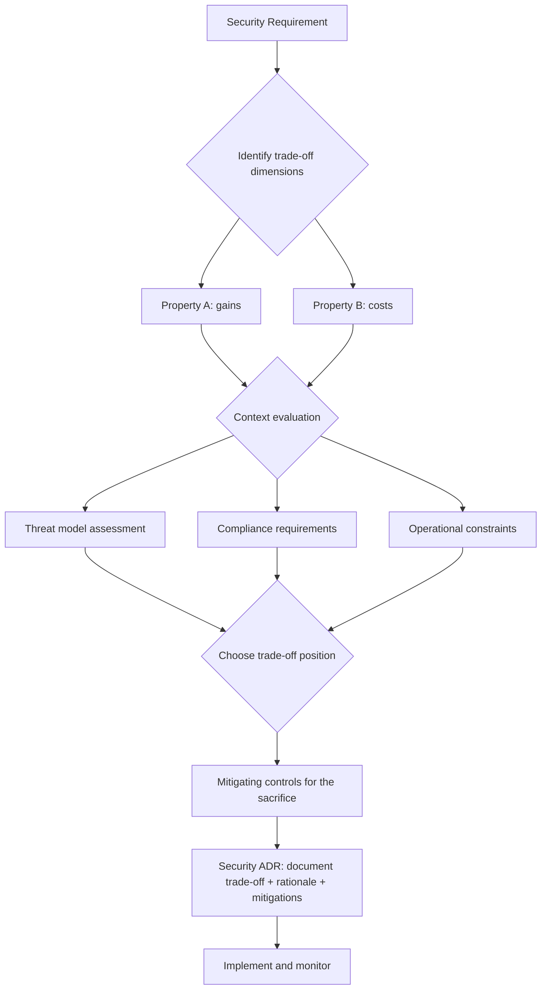

⚡ TL;DR - Security protocol design always involves fundamental trade-offs.
Understanding these trade-offs - not just memorizing "use TLS 1.3" - is what distinguishes
a security architect from a security implementer. Six critical trade-off dimensions:
(1) FORWARD SECRECY vs. AUDITABILITY: end-to-end encryption with per-session keys (like
Signal Protocol) means past sessions cannot be decrypted even if keys are compromised.
But: enterprises need to inspect TLS traffic for DLP, compliance, and incident response.
TLS inspection (via MITM proxy) breaks forward secrecy. The choice: user privacy vs.
organizational visibility. (2) PERFORMANCE vs. SECURITY: smaller key sizes (RSA-2048 vs.
RSA-4096) are faster to compute but offer less security margin. Shorter JWT TTLs improve
revocation speed but require more token refreshes. Longer PBKDF2 iterations are harder to
crack but slower at login. Each: a specific trade-off point on the security-performance curve.
(3) USABILITY vs. STRENGTH: complex passwords are stronger but remembered badly (written on
sticky notes). Passkeys are stronger AND more usable. Not all trade-offs are unavoidable.
(4) CRYPTOGRAPHIC AGILITY vs. SIMPLICITY: a system that can switch cipher suites (cryptographic
agility) can respond to broken algorithms. But: agility increases complexity and attack surface
(downgrade attacks target algorithm negotiation). TLS 1.3: chose simplicity (5 fixed cipher
suites) over agility. (5) CENTRALIZATION vs. DECENTRALIZATION: a centralized CA (Certificate
Authority) trust model is simple but creates a single point of failure (a compromised CA can
issue fraudulent certificates for any domain - as happened with DigiNotar in 2011).
Certificate Transparency (CT) + CAA records: mitigate CA compromise without full
decentralization. (6) REVOCATION SPEED vs. PERFORMANCE: CRL (Certificate Revocation List):
downloaded once, fast at validation time. OCSP (Online Certificate Status Protocol): real-time
check, slow. OCSP Stapling: server includes OCSP response in TLS handshake, eliminates the
round trip. Each approach: a different point on the revocation-speed vs. performance trade-off.

---

| #136 | Category: Security | Difficulty: ★★★★ |
|:---|:---|:---|
| **Depends on:** | OWASP Top 10, Authentication, Business Logic, Insufficient Logging, CVSS Scoring, CVE + NVD, AWS Security Services, Kubernetes Security, Security Observability + SIEM, Security at Scale, ISO 27001, Chaos Engineering, Privilege Escalation, Zero Trust Introduction, Red/Blue/Purple Team, Zero Trust Enterprise, DevSecOps Pipeline, Security Champions, Enterprise Security Architecture, Secret Rotation, Security Governance, Threat Intelligence, CSIRT Design, Security Metrics, Supply Chain Security, Platform Security Engineering, Multi-Cloud Security, Build vs Buy, Security ADR, SIEM Architecture, SSDLC, TLS 1.3, OAuth 2.0 + OIDC, OWASP Methodology, Secure by Design, Formal Verification, Web Security Model | |
| **Used by:** | SEC-137 through SEC-144 | |
| **Related:** | All preceding and remaining SEC entries | |

---

### 🔥 The Problem This Solves

**THE ENTERPRISE TLS INSPECTION DILEMMA:**

```
SCENARIO: A financial services company processes customer transactions over HTTPS.

SECURITY REQUIREMENT 1 (User Privacy / Forward Secrecy):
  Customers use TLS 1.3 to connect to the bank's API.
  TLS 1.3: mandatory perfect forward secrecy (ECDHE).
  Each session: unique ephemeral key. Past sessions: irrecoverable even if keys are stolen.
  
  Result: the bank's TLS sessions are end-to-end secure against passive collection.
  "Harvest now, decrypt later" attacks: defeated.

SECURITY REQUIREMENT 2 (Enterprise Visibility / Compliance):
  The bank: must comply with PCI DSS 12.3.3.
  "Examine policies and procedures... to verify that the organization has defined
  and implemented controls... to detect and prevent unauthorized software or files
  from being introduced into the network."
  
  DLP (Data Loss Prevention): requires inspecting traffic leaving the network.
  SOC: requires seeing plaintext content for malware detection.
  Incident response: requires decrypting past traffic logs.
  
  Tool: a TLS inspection proxy (Zscaler, Symantec Blue Coat, Palo Alto).
  The proxy: terminates TLS from the client, re-encrypts to the server.
  The proxy: sees plaintext. Can apply DLP rules.

THE CONFLICT:
  
  TLS inspection REQUIRES breaking the TLS 1.3 forward secrecy property.
  The proxy: generates its own ECDHE key pair. Signs the fake server certificate with
  an enterprise root CA certificate (installed on all employee devices).
  
  From the employee's perspective: the padlock shows a valid certificate.
  From the network perspective: ALL TLS traffic is decryptable by the proxy.
  Forward secrecy: "protected from external attackers." But the PROXY has the plaintext.
  
  If the proxy is compromised: all employee TLS traffic is exposed.
  The forward secrecy guarantee: not fully honored. The proxy sees everything.
  
RESOLUTION: the trade-off is acknowledged, documented, and mitigated.

  Mitigations:
  1. The proxy: in a highly secured network segment. Access audited.
  2. Proxy decryption: selective (bypass for known banking URLs: https://mybank.com).
     Employees' personal banking: not inspected.
  3. Proxy logs: encrypted at rest with HSM-protected keys. Access requires MFA + approval.
  4. Certificate transparency: employee devices check for unexpected cert issuers.
     The enterprise CA: registered in CT logs.
  
  The trade-off is not resolved. It is managed.
  "Forward secrecy vs. organizational visibility" is an irreducible tension.
  The design: chooses organizational visibility for work traffic (regulatory requirement)
  while minimizing the scope and protecting the proxy's data.
```

---

### 📘 Textbook Definition

**Security Trade-off:** A fundamental conflict between two desirable security or system properties,
where improving one necessarily degrades the other. Security trade-offs: distinct from security
bugs (which can be fixed) and security misconfigurations (which can be corrected). Trade-offs:
inherent in the design of the system. Can be managed and mitigated but not eliminated.

**Forward Secrecy vs. Auditability trade-off:** End-to-end encryption with ephemeral key
derivation (TLS 1.3, Signal Protocol) means past sessions are irrecoverable, even by the
service provider. Auditability requires that authorized parties (compliance, legal, incident
response) can decrypt past communications. These goals: directly in conflict. Every enterprise
E2E encryption policy: must make a deliberate choice between them.

**Cryptographic Agility:** A design property where an implementation can switch between
cryptographic algorithms without a protocol redesign. Advantage: can respond to broken algorithms
(move from SHA-1 to SHA-256). Disadvantage: increases complexity (more code, more configuration,
more testing), creates downgrade attack surface (an attacker can force negotiation to a weaker
algorithm). TLS 1.3's choice: less agility (only 5 cipher suites) for more simplicity and
resistance to downgrade attacks.

**Certificate Authority (CA) Trust Model:** The X.509 PKI model where browser trust is derived
from a small set of root CAs (about 100-150 trusted by major browsers). If ANY root CA is
compromised: the attacker can issue fraudulent certificates for ANY domain. DigiNotar (2011):
a Dutch CA was compromised by Iranian state actors. Issued 531 fraudulent certificates,
including for google.com, cia.gov, and mi6.gov.uk. DigiNotar: revoked from all browser trust
stores. All DigiNotar-signed certificates: immediately untrusted worldwide. Certificate
Transparency (CT): requires all CAs to log every certificate they issue. Domain owners: can
monitor CT logs for unauthorized certificates for their domain.

**OCSP Stapling:** A TLS extension where the web server includes a pre-fetched OCSP response
(certificate validity check) in the TLS handshake. The browser: does not need to contact the
OCSP responder. Eliminates: the latency and privacy exposure of per-request OCSP checks (OCSP
responders: learn which sites the browser visits). Performance: equivalent to CRL (pre-fetched).
Privacy: browser does not contact OCSP responder.

**Key Escrow:** A system where encryption keys are stored by a third party (the escrow agent)
so they can be recovered for authorized purposes (law enforcement, corporate key recovery,
disaster recovery). Advantage: key recovery is possible. Disadvantage: the escrow agent is
a high-value target. If the escrow system is compromised: all escrowed keys are exposed.
The Clipper chip (1993): a US government proposal for key escrow in encryption hardware.
Rejected by the security community due to the escrow security risk.

---

### ⏱️ Understand It in 30 Seconds

**One line:**
Security protocol design trade-offs are the irreducible conflicts between desirable properties
(forward secrecy vs. auditability, security vs. performance, usability vs. strength, centralization
vs. resilience) where no design eliminates the tension - only manages it through deliberate,
documented choices.

**One analogy:**
> Security protocol trade-offs are the "speed vs. fuel economy" tension in car design.
>
> You want a car that is: fast AND fuel-efficient AND safe AND comfortable AND cheap.
> BUT:
> - Faster engine: more fuel consumption (speed vs. economy).
> - More airbags: more weight: slower (safety vs. speed).
> - Larger fuel tank: more weight: slower (range vs. speed).
> - Sports suspension: stiffer: less comfortable (performance vs. comfort).
> - Cheaper materials: less safe (cost vs. safety).
>
> There is no car design that is simultaneously best in all dimensions.
> Every car: a set of deliberate trade-offs.
> A Formula 1 car: maximum speed, minimum fuel economy, minimum comfort.
> A family sedan: balanced trade-offs.
> A safety-first design (Volvo): safety maximized, some performance and economy sacrificed.
>
> Security protocol trade-offs work the same way:
> - Maximum forward secrecy (TLS 1.3 E2E): no auditability possible.
> - Maximum auditability (TLS inspection proxy): forward secrecy broken.
> - Maximum password strength (NIST 800-63B 15+ character requirement + no dictionary words):
>   users forget passwords + write them down = less usable = less secure in practice.
> - Maximum cryptographic agility (support 10 cipher suites): more downgrade attack surface.
>
> The job of the security architect: not to find a design that avoids trade-offs.
> The trade-offs are unavoidable. The job: make the right trade-offs for the specific context,
> document them explicitly, and mitigate the costs of the chosen trade-off position.

---

### 🔩 First Principles Explanation

**Six fundamental security trade-off dimensions:**

```
TRADE-OFF 1: FORWARD SECRECY vs. LAWFUL INTERCEPTION / AUDITABILITY

  Strong forward secrecy (Signal Protocol, TLS 1.3 direct E2E):
  - Past messages: irrecoverable. Perfect for user privacy.
  - Enterprise auditability: impossible.
  - Law enforcement access: impossible (by design).
  
  Managed auditability (TLS inspection proxy, key escrow):
  - Past messages: recoverable by authorized parties.
  - Enterprise DLP, compliance, incident response: enabled.
  - Attack surface: the escrow/proxy becomes a high-value target.
  
  CHOOSING:
  For consumer messaging (WhatsApp, iMessage, Signal):
  Signal/E2E is the right choice. Users' private communications:
  should not be accessible to the platform.
  
  For enterprise email with eDiscovery requirements (HIPAA, financial regulations):
  Key escrow or S/MIME with centrally managed keys: required by regulation.
  The enterprise: legally required to produce records in litigation.
  
  TRADE-OFF DOCUMENTATION:
  "We chose not to implement forward secrecy for internal email because
  [REGULATION] requires email retention and production for [N] years.
  Mitigation: email keys stored in HSM with [N]-person MFA access control.
  Key access: audited. Access requires [APPROVAL_PROCESS]."
  
  (Not: "we disabled forward secrecy because it was hard to implement.")

TRADE-OFF 2: REVOCATION SPEED vs. PERFORMANCE

  CRL (Certificate Revocation List):
  - The CA: publishes a list of revoked certificate serial numbers.
  - The browser: downloads the CRL (cached, valid for 24 hours typically).
  - Validation: local lookup against cached CRL. Fast.
  - Problem: CRL can be up to 24 hours stale. A revoked certificate: valid for up to 24h.
    Intermediate CA CRLs: sometimes megabytes in size. Download: slow first time.
  
  OCSP (Online Certificate Status Protocol):
  - For each certificate: the browser contacts the OCSP responder.
  - The responder: checks real-time certificate status.
  - Advantage: near-real-time revocation.
  - Disadvantages:
    a) Privacy: the OCSP responder logs which certificates the browser checked.
       OCSP responders learn which sites users visit.
    b) Performance: an additional network round trip per connection.
    c) Availability: if the OCSP responder is down, browsers soft-fail (accept the cert).
  
  OCSP Stapling:
  - Server: pre-fetches OCSP response, includes in TLS handshake.
  - Browser: no OCSP responder round trip.
  - Privacy: preserved (browser doesn't contact OCSP responder).
  - Performance: no additional latency (OCSP response included in existing handshake).
  - Freshness: limited by OCSP response TTL (typically 24-48 hours).
  
  OCSP Must-Staple:
  - Certificate: includes must-staple extension.
  - Browser: rejects the certificate if no OCSP response is stapled.
  - Hard fail (not soft fail): if OCSP is unavailable, the site is unreachable.
  - Advantage: revoked certificates cannot be used even if OCSP responder is down.
  - Risk: if the server fails to renew the stapled response, legitimate site is unreachable.
  
  SHORT-LIVED CERTIFICATES (the emerging approach):
  - Certificate validity: 90 days (Let's Encrypt) → 30 days → (proposed) 1-7 days.
  - Revocation: less critical. The cert expires soon anyway.
  - A compromised certificate: valid for at most 1-7 days before expiry.
  - Trade-off: more frequent certificate renewal (automated via ACME protocol).
  - Advantage: eliminates the revocation problem entirely for short-lived certs.
  
TRADE-OFF 3: CRYPTOGRAPHIC AGILITY vs. SIMPLICITY/DOWNGRADE RESISTANCE

  High agility (TLS 1.2 with 37 cipher suites):
  - When MD5 was broken: could remove it from the cipher suite list. Without protocol redesign.
  - When RC4 was attacked: could remove it. Config change.
  - Disadvantage: 37 cipher suites. Misconfiguration surface enormous.
    POODLE: downgrade to SSLv3 (attacker negotiates the weakest available).
    FREAK: downgrade to EXPORT ciphers (not disabled by default).
    LOGJAM: downgrade to 512-bit DH (not disabled by default).
    Each downgrade attack: exploits the agility (negotiation of weaker algorithms).
  
  Low agility (TLS 1.3 with 5 cipher suites):
  - Only 5 cipher suites. All AEAD. All secure.
  - Downgrade attack: impossible via cipher suite negotiation (no weak suites to negotiate).
  - If AES-GCM is broken: requires a protocol update, not just a config change.
  - NIST post-quantum: adding ML-KEM to TLS 1.3 requires a TLS extension update.
    This is harder than in TLS 1.2 (where it would be "add a new cipher suite").
  
  THE TLS WORKING GROUP CHOICE: simplicity and downgrade resistance over agility.
  Rationale: the history of TLS 1.2 showed that agility is weaponized via downgrade attacks.
  The cost of low agility (harder algorithm transition): worth the benefit of no downgrade attacks.

TRADE-OFF 4: TOKEN LIFETIME vs. REVOCATION SPEED

  Long-lived JWT (24-hour TTL):
  - Fewer token refreshes. Less load on the auth server.
  - Revocation window: up to 24 hours after a user is compromised or terminated.
  - A stolen access token: valid for up to 24 hours.
  
  Short-lived JWT (15-minute TTL):
  - More token refreshes. More auth server load.
  - Revocation window: up to 15 minutes.
  - A stolen access token: valid for at most 15 minutes.
  
  Opaque tokens with real-time introspection:
  - Every API call: contacts auth server for token validation.
  - Revocation: instant.
  - Auth server: single point of failure and bottleneck. High availability required.
  
  THE CHOICE:
  Consumer app (social media): 24-hour JWT. Revocation speed: not critical.
  Enterprise app (internal tools): 15-minute JWT. Revocation: reasonable for most use cases.
  Financial API (payments, transfers): opaque tokens. Instant revocation required.
  
  (The appropriate choice: determined by the impact of a 15-minute or 24-hour revocation window,
  not by what is easiest to implement.)
```

---

### 🧪 Thought Experiment

**SCENARIO: Designing the authentication system for a healthcare platform:**

```
CONTEXT:
  Healthcare platform: stores patient records (PHI - Protected Health Information).
  HIPAA requirements: access controls, audit logging, encryption.
  Users: 50,000 clinicians. Frequent access (every few minutes during a shift).
  
  TRADE-OFF 1: PASSWORD COMPLEXITY vs. USABILITY
  
  High-security password policy (hospital's old policy):
  - Minimum 12 characters, uppercase, lowercase, number, symbol.
  - Change every 90 days.
  - No reuse of last 12 passwords.
  - Account lockout after 5 failed attempts.
  
  Result in practice:
  - 23% of nurses: wrote passwords on their badge ID or workstation.
  - 15%: shared passwords with colleagues during busy shifts.
  - 40%: used a pattern like "Summer2024!" that satisfied the rules but was predictable.
  - Account lockout: 200 calls/day to the help desk for unlocks.
  - Each unlock: ~10 minutes of clinician time lost.
  
  NIST 800-63B guidance (2020): "verifiers SHOULD NOT impose other composition rules
  (e.g., requiring mixtures of different character types) on memorized secrets" and
  "verifiers SHOULD NOT require that memorized secrets be changed arbitrarily (e.g., periodically)."
  
  NIST rationale: complexity requirements cause predictable patterns (Summer2024!).
  Periodic rotation: causes incremental changes (Password1, Password2, Password3).
  Both: counterproductive to security.
  
  NEW POLICY (NIST-aligned):
  - Minimum 15 characters (length, not complexity).
  - No mandatory rotation (change only if compromised).
  - MFA required (FIDO2/passkey for clinicians, TOTP for contractors).
  - Breach credential checking: block known-compromised passwords.
  
  TRADE-OFF 2: STRONG MFA (FIDO2) vs. CLINICAL WORKFLOW
  
  FIDO2 (passkey): tap fingerprint. Strongest MFA. Phishing-resistant.
  But: clinicians share workstations. Each workstation: needs a fingerprint reader.
  Cost: $50/device × 5,000 workstations = $250,000.
  
  TOTP (6-digit code): cheaper. Phone-based.
  But: clinicians don't carry phones in some sterile environments.
  
  COMPROMISE:
  - FIDO2 on workstations used by single clinicians (ICU, offices).
  - Shared workstations: different approach needed.
  
  SHARED WORKSTATION APPROACH:
  - Fast switching: clinician taps their ID badge (NFC) → workstation identifies them.
  - ID badge = proof of identity (issued by hospital, badged by security).
  - On badge tap: limited-scope access token issued (read-only access to assigned patients).
  - For write operations (prescriptions, notes): requires FIDO2 or TOTP as second factor.
  - Idle timeout: 2 minutes. Badge tap: re-authenticates.
  
  TRADE-OFF 3: AUDIT LOGGING vs. PERFORMANCE
  
  HIPAA: every access to PHI must be logged.
  Every record view: logged.
  
  10 clinicians × 50 records/hour × 8 hours = 4,000 log events/hour per clinician.
  50,000 clinicians: 200 million log events/hour.
  
  Naive approach: synchronous write to audit log on every record access.
  Performance: 50ms extra latency per record access (log write is slow).
  At 200 million events/hour: the log write is a significant bottleneck.
  
  DESIGN: asynchronous audit log with guaranteed delivery.
  Record access: synchronous (returns to clinician immediately).
  Audit event: published to a Kafka topic (< 1ms).
  Kafka consumer: writes to the audit database (asynchronous, batched).
  
  TRADE-OFF: audit log is eventually consistent (up to a few seconds delay).
  If a clinician accesses a record and the system crashes before the Kafka consumer writes:
  the access may not appear in the audit log.
  
  MITIGATION: Kafka replication factor 3. At-least-once delivery.
  The audit log: eventually consistent but not lost.
  HIPAA does not require real-time audit; it requires audit availability for review.
  The trade-off: acceptable. Documented. Mitigated.
```

---

### 🧠 Mental Model / Analogy

> Security trade-offs are the "three-body problem" of engineering: no perfect solution,
> only managed approximations.
>
> The three-body problem: three astronomical bodies interacting gravitationally.
> No closed-form solution. The system: chaotic over long time scales.
> The physicist: cannot find the "correct" solution. Can only compute approximations.
> The approximation quality: depends on the time scale and precision needed.
>
> Security trade-offs:
> Three bodies: Security. Performance. Usability. (Or: Privacy. Auditability. Compliance.)
> No closed-form solution. Improving any one: perturbs the others.
>
> The security architect: cannot find the "correct" design. Can only find approximations.
> The approximation quality: depends on the threat model and operational context.
>
> The trap: treating security trade-offs as problems to be solved, not tensions to be managed.
> "We need strong security AND instant revocation AND low latency AND no extra infrastructure."
> This is asking for the closed-form solution to the three-body problem. It doesn't exist.
>
> The right approach:
> - Define the MOST IMPORTANT security property for this context.
>   (For payments: revocation speed. For messaging: forward secrecy. For compliance: auditability.)
> - Make that property as strong as possible.
> - Explicitly identify what was sacrificed (the other side of the trade-off).
> - Mitigate the sacrifice with compensating controls.
> - Document the trade-off decision and its rationale.
>
> The architect who pretends trade-offs don't exist: makes implicit trade-offs
> (usually: sacrificing security for convenience, without documentation).
> The architect who acknowledges trade-offs: makes deliberate trade-offs with compensating controls.
> The difference: intentionality and documentation. Both may arrive at the same implementation.
> But only one can defend the decision in an audit, justify it to a security team,
> or revisit it when the threat model changes.

---

### 📶 Gradual Depth - Five Levels

**Level 1 - What it is (anyone can understand):**
Security protocol design always involves choices between competing goals. You usually can't have maximum security AND maximum performance AND maximum convenience - choosing more of one often means less of another. For example: a very strong, unique password for every website is maximally secure, but maximally inconvenient (people forget passwords and write them on sticky notes - actually less secure). A password manager is slightly less "pure" (you're trusting one piece of software) but dramatically more practical, resulting in better real-world security. Security trade-offs: the discipline of making these choices deliberately, with full awareness of what you're giving up.

**Level 2 - How to use it (junior developer):**
The most important trade-off you'll encounter as a developer: JWT token lifetime. Longer-lived tokens (24 hours): fewer refreshes, better performance. But: if a token is stolen, it's valid for up to 24 hours. Shorter-lived tokens (15 minutes): stolen tokens expire quickly. But: more auth server requests. The right choice: depends on the sensitivity of the resource. For a low-stakes public API: 24-hour tokens are fine. For an internal HR system with sensitive data: 15-minute tokens. For a payment API: opaque tokens with real-time validation. Don't just set TTL to "1 hour" because it's a common default. Decide based on the risk of a stolen token being used during the validity window.

**Level 3 - How it works (mid-level engineer):**
The PBKDF2/bcrypt iteration count trade-off: password hashing work factor directly trades security against login performance. PBKDF2 with 1,000 iterations: cracked at 1 billion attempts per second on a GPU (cost: trivial). PBKDF2 with 600,000 iterations (NIST 2023 recommendation): cracked at ~1,600 attempts per second on the same GPU (cost: ~600x harder). But: 600,000 iterations per login = 600ms per user login. At 10,000 logins/second: 6,000 CPU cores dedicated to password validation. The correct choice: the minimum work factor that makes offline dictionary attacks computationally infeasible given current hardware. OWASP current recommendation (2024): PBKDF2-HMAC-SHA256 with 600,000 iterations. Or: Argon2id with 64MB memory cost (memory-hard, harder to parallelize on GPUs). The trade-off: explicit. The choice: based on the attacker's GPU budget, not the developer's preference for fast tests.

**Level 4 - Why it was designed this way (senior/staff):**
The certificate revocation problem: a fundamental tension between availability and security that has not been fully solved in 30+ years. The problem: when a certificate is revoked (server private key compromised), every browser worldwide must learn about it before trusting the certificate again. CRLs: slow (24-hour cache). OCSP: fast but creates privacy risk and availability dependency. OCSP Must-Staple: fast, no privacy risk, but risks legitimate site outages if staple renewal fails. Short-lived certificates (the current trend toward 90-day, then 30-day, then potentially 1-day certificates): elegant: revocation is less important if the cert expires in 24 hours. But: certificate management complexity increases dramatically. Auto-renewal (ACME protocol) is required at this scale. The residual problem: even 24-hour certificates can be abused for 24 hours after a private key compromise. Certificate pinning: addressed this by hard-coding expected certificates in the app. But: pinning creates availability risk (cert change → app breaks if pins not updated). Google deprecated HPKP (HTTP Public Key Pinning) in 2018 after multiple legitimate sites accidentally pinned the wrong key and made themselves permanently inaccessible. The revocation problem: still unsolved. Each approach: a different trade-off position. The industry: migrating toward shorter-lived certificates as the least-bad option.

**Level 5 - Mastery (distinguished engineer):**
The fundamental tension between "post-quantum security now" and "backward compatibility." NIST standardized ML-KEM (Kyber), ML-DSA (Dilithium), and SLH-DSA (SPHINCS+) in 2024 as post-quantum cryptographic algorithms. These should replace RSA and ECDH/ECDSA when quantum computers capable of running Shor's algorithm become available. But: deploying post-quantum algorithms in production requires: all TLS implementations to be updated, all HSMs to support the new key types, all certificate issuance infrastructure to support ML-KEM/ML-DSA certificates. The migration: years to complete across the entire internet. The threat model: "harvest now, decrypt later" (quantum-capable adversaries are collecting TLS traffic today for future decryption). For data that needs to remain secret for 10+ years (government secrets, medical records, intellectual property): the migration to post-quantum algorithms is urgent. For data that needs to remain secret for 2 years (a credit card transaction, a session token): current ECDHE is sufficient (quantum computers capable of breaking ECDHE are not imminent, estimated 10-15+ years away). The "harvest now, decrypt later" adversary changes the urgency: "is the data I'm protecting today still sensitive in 10 years when quantum computers might be available?" If yes: migrate to post-quantum NOW. If no: migrate within the normal cryptographic deprecation timeline. This is the forward-looking application of the forward secrecy vs. auditability trade-off: the relevant question is not "how long is the current session?" but "how long does the data need to remain secret?"

---

### ⚙️ How It Works (Mechanism)

```
SECURITY TRADE-OFF DECISION FRAMEWORK:

  For every security design decision:
  
  1. IDENTIFY THE TRADE-OFF DIMENSIONS
     - What is gained by this choice?
     - What is sacrificed by this choice?
     - What is the magnitude of the gain and sacrifice?
  
  2. DETERMINE THE CONTEXT
     - What is the threat model? (who is the adversary? what are they capable of?)
     - What is the impact of the sacrificed property being exploited?
     - What is the operational context? (compliance, user base, traffic volume)
  
  3. CHOOSE THE TRADE-OFF POSITION
     - Which property is MORE important in this context?
     - What is the specific trade-off point? (e.g., 15-minute JWT, not 24-hour or 1-minute)
  
  4. MITIGATE THE SACRIFICE
     - What compensating controls reduce the cost of the sacrificed property?
     (e.g., 15-minute JWT + refresh token rotation mitigates revocation window AND
     provides a mechanism to detect stolen refresh tokens)
  
  5. DOCUMENT THE DECISION
     - Record: the trade-off, the context, the chosen position, the mitigations.
     - This is the Security ADR (Architecture Decision Record) for the trade-off.
```



---

### 💻 Code Example

**Security trade-off analysis in JWT token design:**

```python
# token_design_trade_offs.py
# Demonstrates the security trade-off between JWT TTL, performance, and revocation speed.
# Shows: three design options and their characteristics.

import time
import jwt
import secrets
import hashlib
from abc import ABC, abstractmethod
from datetime import datetime, timedelta, timezone
from typing import Optional, Tuple
import redis  # pip install redis

# ============================================================
# OPTION 1: LONG-LIVED JWT (24 hours)
# Trade-off: PERFORMANCE favored, revocation window 24 hours
# ============================================================

class LongLivedJWTTokenService:
    """
    24-hour JWT. High performance (no database check per request).
    Revocation: up to 24 hours delay.
    
    Use case: low-sensitivity APIs, public data, developer platforms.
    NOT suitable: financial operations, medical records, HR data.
    """
    
    def __init__(self, secret_key: str):
        self._secret = secret_key
    
    def issue_token(self, user_id: str, scopes: list[str]) -> str:
        now = datetime.now(timezone.utc)
        payload = {
            "sub": user_id,
            "scopes": scopes,
            "iat": int(now.timestamp()),
            "exp": int((now + timedelta(hours=24)).timestamp()),
            "jti": secrets.token_urlsafe(16)  # JWT ID for uniqueness
        }
        return jwt.encode(payload, self._secret, algorithm="HS256")
    
    def validate_token(self, token: str, required_scope: str) -> dict:
        # Validates cryptographic signature and expiry.
        # Does NOT check revocation (no database lookup = fast, but no revocation).
        payload = jwt.decode(token, self._secret, algorithms=["HS256"])
        if required_scope not in payload.get("scopes", []):
            raise PermissionError(f"Scope {required_scope} not in token")
        return payload
    
    # TRADE-OFF ANALYSIS:
    # Stolen 24-hour token: valid for up to 24 hours. Significant window.
    # No extra infrastructure. Fast (cryptographic verify only: ~0.1ms).


# ============================================================
# OPTION 2: SHORT-LIVED JWT WITH REFRESH TOKEN ROTATION
# Trade-off: BALANCED (15-minute revocation window + stolen token detection)
# ============================================================

class ShortLivedJWTWithRefreshService:
    """
    15-minute access JWT + refresh token rotation in Redis.
    Revocation: 15-minute window for access token.
    Refresh token rotation: detects stolen refresh tokens.
    
    Use case: most enterprise applications, user-facing apps with sensitive data.
    """
    
    def __init__(self, secret_key: str, redis_client: redis.Redis):
        self._secret = secret_key
        self._redis = redis_client
    
    def issue_token_pair(
        self, user_id: str, scopes: list[str]
    ) -> Tuple[str, str]:
        now = datetime.now(timezone.utc)
        access_token = jwt.encode({
            "sub": user_id,
            "scopes": scopes,
            "iat": int(now.timestamp()),
            "exp": int((now + timedelta(minutes=15)).timestamp()),
            "jti": secrets.token_urlsafe(16)
        }, self._secret, algorithm="HS256")
        
        # Refresh token: stored in Redis (allows instant invalidation)
        refresh_token = secrets.token_urlsafe(32)
        refresh_token_hash = hashlib.sha256(refresh_token.encode()).hexdigest()
        
        # Store: hash of refresh token (not plaintext) → (user_id, scopes)
        self._redis.setex(
            f"rt:{refresh_token_hash}",
            timedelta(days=30),  # Refresh token valid for 30 days
            f"{user_id}:{','.join(scopes)}"
        )
        
        return access_token, refresh_token
    
    def rotate_refresh_token(
        self, refresh_token: str
    ) -> Tuple[str, str]:
        """
        Exchange refresh token for new access + refresh token pair.
        Rotation: old refresh token is invalidated.
        
        If old refresh token is reused: it was already deleted.
        The Redis lookup: fails. → Detect possible token theft.
        → Invalidate all sessions for this user (require re-authentication).
        """
        refresh_token_hash = hashlib.sha256(refresh_token.encode()).hexdigest()
        stored = self._redis.get(f"rt:{refresh_token_hash}")
        
        if not stored:
            # Token not found: either expired OR already used (rotation violation).
            # POSSIBLE THEFT DETECTED: could be an attacker using a stolen token
            # that was already rotated by the legitimate user.
            # Safe action: force re-authentication for this user.
            raise ValueError("Refresh token invalid or already used. Login required.")
        
        user_id, scopes_str = stored.decode().split(":", 1)
        scopes = scopes_str.split(",")
        
        # Invalidate the old refresh token (rotation)
        self._redis.delete(f"rt:{refresh_token_hash}")
        
        # Issue new pair
        return self.issue_token_pair(user_id, scopes)
    
    def revoke_all_sessions(self, user_id: str) -> None:
        """
        Revoke all refresh tokens for a user.
        Access tokens: still valid for up to 15 minutes.
        Refresh tokens: immediately invalid.
        """
        # Pattern-based deletion: all refresh tokens for this user
        # (In practice: store a per-user "revocation_timestamp" in Redis.
        # Validate: refresh token's issue time > revocation_timestamp.)
        # Simplified here for clarity.
        pass


# ============================================================
# OPTION 3: OPAQUE TOKENS WITH REAL-TIME INTROSPECTION
# Trade-off: SECURITY (instant revocation), performance cost
# ============================================================

class OpaqueTokenService:
    """
    Opaque tokens: validated by calling the auth server on every request.
    Revocation: instant.
    
    Use case: financial APIs, medical records, any high-value operation
    where 15-minute revocation window is unacceptable.
    
    Performance cost: 1 network round-trip per API request to auth server.
    Mitigation: cache introspection results for 30 seconds.
    """
    
    def __init__(self, redis_client: redis.Redis):
        self._redis = redis_client
    
    def issue_token(self, user_id: str, scopes: list[str]) -> str:
        token = secrets.token_urlsafe(32)  # Opaque: no claims, no structure
        token_hash = hashlib.sha256(token.encode()).hexdigest()
        
        # Store token metadata in Redis
        self._redis.hset(f"token:{token_hash}", mapping={
            "user_id": user_id,
            "scopes": ",".join(scopes),
            "issued_at": int(time.time()),
            "active": "true"
        })
        self._redis.expire(f"token:{token_hash}", 3600)  # 1 hour max lifetime
        
        return token
    
    def introspect_token(self, token: str) -> Optional[dict]:
        """
        Validate token. Called by resource server on every request.
        Optionally cache for 30 seconds to reduce load.
        """
        token_hash = hashlib.sha256(token.encode()).hexdigest()
        
        # Check 30-second cache first
        cached = self._redis.get(f"introspect_cache:{token_hash}")
        if cached:
            return {"active": True, "cached": True, **eval(cached.decode())}
        
        # Full lookup from token store
        metadata = self._redis.hgetall(f"token:{token_hash}")
        if not metadata or metadata.get(b"active") != b"true":
            return {"active": False}
        
        result = {
            "active": True,
            "sub": metadata[b"user_id"].decode(),
            "scopes": metadata[b"scopes"].decode().split(","),
        }
        
        # Cache for 30 seconds (30-second revocation window)
        self._redis.setex(f"introspect_cache:{token_hash}", 30, str(result))
        return result
    
    def revoke_token(self, token: str) -> None:
        """Instant revocation. Next introspection check: returns active=false."""
        token_hash = hashlib.sha256(token.encode()).hexdigest()
        self._redis.hset(f"token:{token_hash}", "active", "false")
        # Also invalidate the 30-second cache
        self._redis.delete(f"introspect_cache:{token_hash}")


# TRADE-OFF COMPARISON TABLE:
#
# Design               | Revocation | Perf (per req) | Infrastructure | Use case
# ─────────────────────────────────────────────────────────────────────────────
# 24-hour JWT          | 24h window | ~0.1ms         | None           | Low-risk APIs
# 15-min JWT + refresh | 15m window | ~0.1ms (+refresh) | Redis       | Most enterprise apps
# Opaque + introspect  | ~30s       | ~1ms + network | Redis + HA     | Financial, medical
```

---

### ⚖️ Comparison Table

| Trade-off | Maximum Security Option | Maximum Performance Option | Balanced Approach |
|:---|:---|:---|:---|
| **JWT Lifetime** | Opaque tokens, real-time introspection | 24-hour JWT, no revocation check | 15-min JWT + refresh token rotation |
| **Certificate Revocation** | OCSP Must-Staple (hard fail) | CRL (24h cache, no round trip) | OCSP Stapling (fast + private) |
| **Password Hashing** | Argon2id, 64MB memory cost | PBKDF2 with 1,000 iterations (fast, weak) | Argon2id, 19MB / PBKDF2 600K iterations |
| **Cipher Suite Agility** | Maximum agility (many cipher suites) | Minimum agility (TLS 1.3: 5 suites) | TLS 1.3 (simplicity wins) |
| **E2E Encryption** | Signal Protocol (perfect E2E) | No encryption (fast, insecure) | TLS with organizational proxy + controls |
| **TLS Inspection** | Full plaintext inspection (no forward secrecy) | No inspection (max privacy) | Selective inspection (bypass personal sites) |

---

### ⚠️ Common Misconceptions

| Misconception | Reality |
|:---|:---|
| "More security is always better; there's no downside to adding more controls." | Every security control has a cost: implementation complexity (more code = more bugs), performance overhead (latency, CPU, memory), operational burden (more things to configure, maintain, and monitor), and usability friction (security controls that are too onerous are bypassed). Adding controls without regard for these costs: security theatre (the control exists but doesn't work well in practice) OR operational brittleness (too many controls → something breaks, the fix breaks a security control → incident). The correct principle: add security controls that provide sufficient security benefit relative to their cost. A control with high cost and minimal marginal security benefit: worse than not having it. Example: complex password rotation every 30 days + TOTP + IP allowlisting + certificate-based auth for a public blog with no sensitive data. Each control individually: valid. The combination: excessive for the risk, drives behavior to circumvent, and creates operational complexity that results in misconfigurations. Security: proportional to the risk. Not maximized regardless of cost. |
| "Forward secrecy always wins over auditability." | Forward secrecy is a critical security property for user privacy. But: not all systems have user privacy as the primary requirement. Enterprise email systems, financial transaction records, legal communications, and medical records: all have regulatory requirements for long-term retention and auditability. HIPAA: requires 6-year retention of medical records. SEC Rule 17a-4: requires 3-7 year retention of financial communications. eDiscovery: requires production of communications in litigation. For these systems: forward secrecy in the sense of "irrecoverable past messages" directly conflicts with legal requirements. The correct approach: acknowledge the trade-off, make the deliberate choice (auditability for regulated data), implement the strongest possible security for the escrow/retention system (HSM-protected keys, multi-person access control, comprehensive audit logging), and document the decision. "Forward secrecy always wins" is a principle from the user privacy domain. It does not apply uniformly to all regulated enterprise systems. |

---

### 🚨 Failure Modes & Diagnosis

**Security trade-off failure patterns:**

```
FAILURE: IMPLICIT TRADE-OFFS (UNDOCUMENTED SECURITY DECISIONS)

  What happened:
  Developer: set JWT TTL to 24 hours "because that was in the example code."
  No threat model. No consideration of the revocation window.
  No documentation.
  
  3 months later: employee terminated for data breach. Their JWT: valid for 24 more hours.
  In those 24 hours: accessed sensitive customer data. Exported it.
  
  Root cause: implicit trade-off (24-hour TTL for performance) made without considering
  the risk of a 24-hour revocation window for terminated employees.
  
  Prevention:
  Document every security trade-off as a Security ADR:
  
  SECURITY ADR: JWT Token Lifetime
  Status: Decided
  Date: 2024-01-15
  Deciders: [names]
  
  Context: We need to choose a JWT access token TTL.
  Longer TTL = fewer auth server requests.
  Shorter TTL = faster revocation.
  
  Decision: 15-minute JWT + 30-day refresh token with rotation.
  
  Consequences:
  - Access token: revocation window of up to 15 minutes.
  - For terminated employees: 15-minute risk window.
  - Mitigated by: immediate refresh token revocation (Redis delete) on termination.
  - Monitoring: alert on unusual token refresh patterns (potential stolen refresh token use).
  
  REJECTED OPTIONS:
  - 24-hour JWT: unacceptable 24-hour window for terminated employees.
  - Opaque tokens: would require a Redis HA cluster with < 5ms p99 latency.
    Current infrastructure: not ready. Revisit in Q2.
  
  The documented ADR: captures the trade-off, the context, and the mitigations.
  A future security review: can evaluate whether the trade-off is still appropriate.
  An audit: can see that the decision was deliberate, not accidental.

DIAGNOSTIC QUESTIONS FOR SECURITY TRADE-OFF REVIEW:

  1. Is every security design decision documented as an ADR with explicit trade-off acknowledgment?
  2. For every "we chose X": is "we sacrificed Y" also documented, along with mitigations for Y?
  3. Is the threat model current? Were the trade-offs made with the current threat model in mind,
     or a threat model from 3 years ago?
  4. Are the mitigating controls for the sacrificed property actually deployed and working?
     (If the mitigation is "monitoring for stolen token reuse": is that monitoring actually set up?)
  5. Have the trade-offs been reviewed after major system changes?
     (New feature: does it change the risk profile of any existing trade-off?)
```

---

### 🔗 Related Keywords

**Prerequisites:**
- `TLS 1.3 Protocol Design Rationale` (SEC-130) - TLS 1.3's trade-offs (simplicity vs. agility)
- `Security Architecture ADR Workshop` (SEC-127) - the documentation mechanism for trade-offs

**Builds on this:**
- `Security as Contract` (SEC-143) - trade-offs formalized as explicit security contracts
- `Trust Boundary Analysis` (SEC-141) - trust boundaries are where trade-off decisions are applied

---

### 📌 Quick Reference Card

```
┌──────────────────────────────────────────────────────────┐
│ KEY TRADE-OFFS │ Forward secrecy vs. auditability        │
│                │ Revocation speed vs. performance        │
│                │ Agility vs. simplicity/downgrade resist.│
│                │ Usability vs. credential strength       │
├────────────────┼─────────────────────────────────────────┤
│ JWT LIFETIME   │ Low-risk: 24h JWT                       │
│ GUIDE          │ Enterprise: 15min JWT + refresh rotation│
│                │ Financial: opaque + real-time introspect│
├────────────────┼─────────────────────────────────────────┤
│ CERT REVOC.    │ CRL: cached, fast, 24h staleness        │
│                │ OCSP: real-time, privacy risk           │
│                │ OCSP Stapling: fast + private (prefer)  │
│                │ Short-lived certs: emerging best practice│
├────────────────┼─────────────────────────────────────────┤
│ DOCUMENT       │ EVERY trade-off: Security ADR           │
│                │ Gained: ___ / Sacrificed: ___           │
│                │ Mitigations for the sacrifice: ___      │
└──────────────────────────────────────────────────────────┘
```

---

### 💎 Transferable Wisdom

**Reusable Engineering Principle:**
"Every security decision is a trade-off decision. Make them explicit."
The most common source of security technical debt: implicit trade-offs.
A developer sets a JWT TTL of 24 hours not because they thought about revocation windows,
but because 24 hours was in the tutorial example. An implicit trade-off was made.
The cost of the trade-off: unquantified. The mitigation: not implemented.
The decision: not documented.
When the first incident occurs related to that implicit trade-off (terminated employee
accesses data for 24 hours): the response is "how did this happen?" not "we knew about
this risk and mitigated it."
The discipline: for every security design decision, ask:
"What property am I gaining? What property am I sacrificing?"
If you cannot answer this question: you are making an implicit trade-off.
Implicit trade-offs: the security engineer's equivalent of technical debt.
They accumulate silently and manifest as incidents.
The mitigation: make every trade-off explicit. Document it. Review it periodically.
This applies beyond security: performance optimizations, API design choices, data model decisions.
Every design decision: a trade-off between competing properties.
The engineer who makes them explicitly: can evaluate them against the current context.
The engineer who makes them implicitly: cannot defend them, revisit them, or explain them.
Explicit trade-offs: the mark of professional engineering.

---

### 💡 The Surprising Truth

The most counterintuitive security trade-off: password complexity requirements make systems LESS secure,
not more. This was established empirically and formalized in NIST SP 800-63B (2020).

The mechanism: password complexity requirements (uppercase + lowercase + number + symbol + 8-12 characters)
push users toward predictable patterns. Research by Carnegie Mellon University (Ur et al., 2015):
users satisfying complexity requirements: often use "keyboard walks" (Qwerty1!), word + number + symbol
(Password1!), or seasonal patterns (Summer2024!). These patterns: crack quickly despite satisfying
the complexity rule.

Password rotation requirements (change every 90 days): drive incremental changes (Password1! → Password2!
→ Password3!). Users satisfying the rotation requirement while minimizing cognitive load. The rotation:
doesn't actually make the password harder to guess.

The NIST reversal (2020): based on empirical data showing that complexity requirements + rotation
resulted in weaker actual passwords (in terms of crack resistance) compared to: longer passwords
without complexity requirements + no rotation unless compromised + MFA.

The trade-off insight: "security theater" is a real failure mode. A control that APPEARS to improve
security (complexity requirement: harder-looking passwords) but in practice REDUCES security (predictable
patterns + circumvention via sticky notes) is worse than no control. The control's apparent strength:
misleads both the user and the security team into thinking the system is more secure than it is.

The Saltzer-Schroeder principle: Psychological Acceptability (Principle 8). Controls that users find
unacceptable: are circumvented. The circumvention: often creates a worse security outcome than no control.
The empirical validation: NIST's 2020 reversal of 2 decades of password complexity guidance.

---

### ✅ Mastery Checklist

**You've mastered this when you can:**
1. **NAME** six fundamental security trade-off dimensions: forward secrecy vs. auditability,
   revocation speed vs. performance, agility vs. simplicity, usability vs. strength, centralization
   vs. resilience, performance vs. security.
2. **CHOOSE** the right JWT TTL for a given context: 24-hour JWT for low-risk APIs, 15-minute JWT
   with refresh token rotation for enterprise, opaque tokens for financial/medical APIs. Justify
   the choice with the revocation window risk analysis.
3. **EXPLAIN** why NIST reversed password complexity requirements: complexity requirements drive
   predictable patterns (Summer2024!) that are weaker than long passphrases without complexity.
   Psychological Acceptability: controls users circumvent are worse than no controls.
4. **DESCRIBE** the forward secrecy vs. auditability tension: E2E encryption (Signal) = irrecoverable
   past messages (perfect forward secrecy). Enterprise compliance (HIPAA, SEC) = long-term retention
   required. These are directly in conflict. The choice: depends on the regulatory context.
5. **DOCUMENT** a security trade-off as an ADR: context (why is this trade-off present?), decision
   (which property is prioritized?), consequences (what is sacrificed?), mitigations (how is the
   sacrifice managed?).

---

### 🎯 Interview Deep-Dive

**Q: Your team is designing token authentication for a healthcare API that serves 50,000 clinicians.
Walk through the security trade-offs in your token design decision.**

*Why they ask:* Tests whether the candidate can reason about security trade-offs in context, not
just recite generic recommendations. Healthcare adds HIPAA compliance context. Scale adds performance
context. Common in senior backend, security engineer, and architect roles.

*Strong answer covers:*
- Identifying the core trade-offs: "Three dimensions matter most for healthcare: (1) Revocation
  speed: if a clinician's credentials are compromised, how long does the attacker have access?
  (2) Performance: 50,000 clinicians × frequent access = potentially millions of token validations
  per hour. (3) Compliance: HIPAA requires audit logging and access controls."
- Choosing the trade-off position: "For healthcare, I'd lean toward shorter-lived tokens than
  the default. PHI access with a 24-hour stolen token window is high-impact - medical record
  exfiltration is a HIPAA breach. I'd choose 15-minute JWT access tokens + 8-hour refresh tokens
  (matching a clinical shift). On shift end: refresh tokens expire or are revoked."
- Refresh token rotation: "For clinical workflows, I'd implement refresh token rotation in Redis.
  If a clinician's session token is compromised and used by an attacker, the rotation detection
  (old token reused after rotation) triggers immediate session invalidation. The clinician: gets
  logged out. The attacker: token is invalid."
- Shared workstation consideration: "50,000 clinicians often share workstations. The token:
  tied to the clinician's identity, not the workstation. Fast-switch authentication: badge tap
  re-authenticates the new clinician. The previous clinician's token: revoked on re-authentication
  at that workstation."
- HIPAA audit: "Every token issuance and validation: logged (asynchronously via Kafka to avoid
  adding latency to clinical workflows). The 15-minute token window: creates more log events than
  a 24-hour token. But: HIPAA requires audit trails. The trade-off is justified by compliance."
- Performance mitigation: "15-minute tokens with refresh: the auth server sees more refresh
  requests than 24-hour tokens. But: the access token itself is validated cryptographically (no
  auth server round-trip per request). Only the 15-minute refresh is a server round-trip.
  With 50,000 clinicians: roughly 200,000 refresh requests per hour (manageable with Redis HA)."