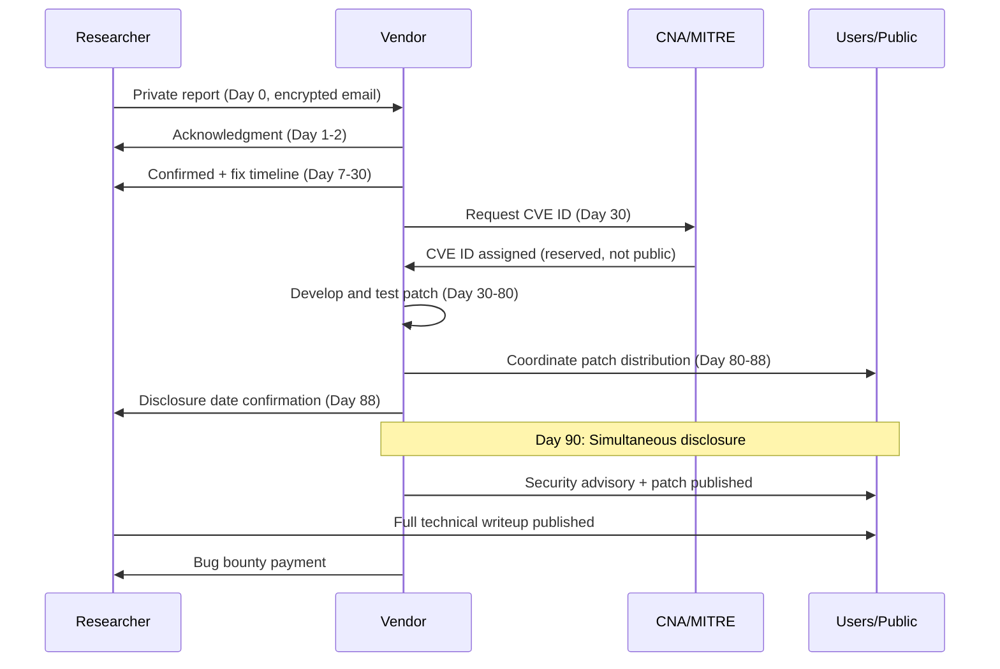

⚡ TL;DR - The CVE (Common Vulnerabilities and Exposures) system and responsible disclosure are the
mechanisms by which security vulnerabilities are discovered, reported, assigned identifiers, patched,
and publicly disclosed. Understanding this process is essential for both vulnerability reporters and
organizations receiving vulnerability reports. Four key concepts: (1) CVE ID: a unique identifier
(CVE-YEAR-NNNNN) assigned by a CNA (CVE Numbering Authority) to a specific vulnerability. The CVE ID:
enables unambiguous reference across all security tools, advisories, and databases. (2) CVSS Score:
the Common Vulnerability Scoring System score (0.0-10.0) that quantifies severity. CVSS v3.1:
scores on Base (exploitability + impact), Temporal (exploit code availability + remediation status),
and Environmental (specific deployment context) vectors. Critical: 9.0-10.0. High: 7.0-8.9.
Medium: 4.0-6.9. Low: 0.1-3.9. The Base score: published by the CNA. The Environmental score:
MUST be calculated by the DEPLOYING organization based on their specific exposure, because a
CVSSv3 9.8 vulnerability in a library used only in a batch processing pipeline (no network exposure)
has dramatically lower actual risk than the same vulnerability in a perimeter-facing API.
(3) RESPONSIBLE DISCLOSURE: the process where a security researcher who finds a vulnerability
contacts the vendor PRIVATELY, gives the vendor reasonable time to produce and distribute a patch
(typically 90 days, per Google Project Zero policy), and only then publishes full details publicly.
This protects users: they can patch before the vulnerability is weaponized. Full immediate disclosure
("full disclosure") gives users information but also gives attackers a ready-made weapon. (4) BUG BOUNTY
PROGRAMS: vendor-run programs that pay researchers for reporting vulnerabilities. HackerOne and Bugcrowd:
the major platforms. Payouts: $100-$1,000,000+ depending on severity and vendor. The tradeoff:
a well-run bug bounty program channels researcher effort toward finding bugs in the vendor's products
rather than selling to zero-day brokers. Google paid $10 million+ to researchers in 2023.

---

| #138 | Category: Security | Difficulty: ★★★★ |
|:---|:---|:---|
| **Depends on:** | Full SEC library (SEC-001 through SEC-137) | |
| **Used by:** | SEC-139 through SEC-144 | |
| **Related:** | Full SEC library | |

---

### 🔥 The Problem This Solves

**WHY COORDINATED DISCLOSURE EXISTS:**

```
BEFORE COORDINATED DISCLOSURE (Full Disclosure era, 1990s-2000s):

  Researcher finds a critical vulnerability in OpenSSH.
  Researcher: publishes full technical details + working exploit code on a public mailing list.
  Reason: "Users deserve to know." "Vendors won't fix without public pressure."
  
  DAY 0: Vulnerability published.
  DAY 0: Attackers read the mailing list too. Immediately weaponize the exploit.
  DAY 0-30: OpenSSH maintainers scramble to develop a patch. It takes weeks.
  During that time: every internet-facing server running OpenSSH is vulnerable.
  Attackers: automated scanning. Within 48 hours: thousands of servers compromised.
  
  The researcher: meant to protect users. Effectively: gave attackers a 30-day window
  with full technical details before users could protect themselves.

RESPONSIBLE DISCLOSURE (coordinated, with 90-day deadline):

  Researcher finds the same critical vulnerability in OpenSSH.
  Researcher: contacts the OpenSSH security team privately (security@openssh.com).
  Provides: full technical details, proof-of-concept, affected versions.
  Sets: a 90-day disclosure deadline (per Google Project Zero standard).
  
  OpenSSH security team:
  - Confirms the vulnerability.
  - Develops and tests a patch. (Days 1-60.)
  - Coordinates with Linux distributions (Debian, Red Hat, Ubuntu, Alpine) for
    simultaneous package updates. (Days 60-85.)
  - Prepares a security advisory with CVE ID, CVSS score, affected versions, patch.
  - On day 90: publishes the advisory AND releases the patch simultaneously.
  
  Result: users have a patch available when the vulnerability details are published.
  The window between "vulnerability known to attackers" and "patch available": minimized.
  (Not zero: attackers may reverse-engineer the patch on day 90. But: the patch is available.)
  
  Researcher: credited in the advisory. May receive a bug bounty payment.
  Users: protected. Vendor: given time to fix. Researcher: recognition + payment.
  Everyone: incentivized to cooperate.

THE DEADLINE RATIONALE:
  
  Without a deadline: vendors can delay indefinitely. The vulnerability: stays unpatched.
  Users: unprotected for months or years.
  
  With a deadline: vendors have a specific date by which they MUST have a patch ready,
  OR the vulnerability details are published (creating pressure to patch quickly after).
  
  Google Project Zero's 90-day policy: most vendors can develop and deploy a patch in 90 days.
  If a vendor misses the deadline: Project Zero publishes (after a possible 14-day extension).
  This has happened: Microsoft has had vulnerabilities published by Project Zero after missing
  the 90-day window. The public pressure: significant. Patches: follow quickly.
  
  The 90-day standard: reflects the industry's experience of what is reasonable.
  For critical actively exploited vulnerabilities: sometimes shortened to 7-14 days.
  For complex vulnerabilities requiring protocol changes (not just code fixes): sometimes extended.
```

---

### 📘 Textbook Definition

**CVE (Common Vulnerabilities and Exposures):** A public registry of security vulnerabilities
maintained by MITRE, funded by the US Department of Homeland Security (CISA). Each CVE entry:
a unique CVE ID (CVE-YEAR-NNNNN), a brief description of the vulnerability, and references
to advisories and patches. CVE IDs: the universal reference used in patch management, SIEM tools,
vulnerability scanners, and security advisories to unambiguously identify specific vulnerabilities.

**NVD (National Vulnerability Database):** The US NIST database that enriches CVE data with
CVSS scores, CWE classifications, and detailed analysis. NVD: built on top of CVE. Most
security tools (Trivy, Grype, Snyk, Dependabot) use NVD as their data source.

**CNA (CVE Numbering Authority):** An organization authorized to assign CVE IDs.
MITRE: the root CNA. Major vendors (Google, Microsoft, Apple, Canonical, Red Hat, Oracle): each
are CNAs for their own products. Security research firms (GitHub Security, HackerOne): also CNAs.
A CNA: assigns a CVE ID before disclosure, allows the vulnerability to be referenced before
full details are public.

**CVSS (Common Vulnerability Scoring System):** A numerical scoring system (0.0-10.0) for
vulnerability severity. CVSS v3.1: three metrics groups. Base Metrics: Exploitability (Attack
Vector, Complexity, Privileges Required, User Interaction) and Impact (Confidentiality, Integrity,
Availability). Temporal Metrics: Exploit Code Maturity, Remediation Level, Report Confidence.
Environmental Metrics: organization-specific scoring adjustments. The Base score: intrinsic severity.
The Environmental score: actual risk in a specific deployment.

**Responsible Disclosure / Coordinated Vulnerability Disclosure (CVD):** A process where a
researcher reports a vulnerability to the affected vendor before public disclosure, allowing
the vendor time to prepare a patch. The researcher: agrees to a disclosure embargo period
(typically 90 days). After the embargo: the researcher may publish full details. The goal:
maximize user protection by ensuring a patch is available when the vulnerability is publicly known.

**Bug Bounty Program:** A vendor-run program that compensates security researchers for responsibly
disclosing vulnerabilities in their products. Typical structure: an in-scope definition (which products
and vulnerability types qualify), severity-based payout tiers, a response SLA, and safe harbor
language (the reporter is not sued for good-faith security research).

**VDP (Vulnerability Disclosure Policy):** A formal policy published by an organization that
describes how it receives and processes vulnerability reports. All US Federal civilian agencies:
required to have a VDP since 2020 (CISA Binding Operational Directive 20-01). A VDP without a bug bounty:
the organization accepts reports but does not pay for them. A VDP with a bug bounty: pays.

---

### ⏱️ Understand It in 30 Seconds

**One line:**
The CVE/responsible disclosure system is the mechanism by which security vulnerabilities are
discovered, privately reported to vendors with a 90-day fix deadline, assigned unique CVE IDs with
CVSS severity scores, patched, and then publicly disclosed with the patch available - coordinating
the interests of researchers (credit, payment), vendors (time to fix), and users (protected when informed).

**One analogy:**
> Responsible disclosure is the "building code violation" report, not a newspaper exposé.
>
> You're a building inspector. You find that a major office building has a structural defect:
> under specific conditions (heavy snow load), the roof could collapse.
>
> FULL DISCLOSURE approach: call a press conference TODAY.
> "The ACME tower at 100 Main Street will collapse in a snowstorm. Here's the technical details."
> Result: thousands of occupants panic and flee. Competing building inspection firms
> publish similar reports for other buildings (the press attention: now every inspector
> wants publicity). Building owners: sued. No systematic remediation.
> Users: informed but not safe (the roof is still defective).
>
> RESPONSIBLE DISCLOSURE approach:
> 1. Contact the building owner PRIVATELY: "Here is the structural defect. Here is the proof.
>    You have 90 days to repair it before I report it to the public."
> 2. Building owner: hires structural engineers, plans the repair.
> 3. Day 60: repair is underway.
> 4. Day 90: building owner announces: "We identified and repaired a structural defect.
>    The building is now safe. Here is the engineering report."
> 5. You (the inspector): simultaneously publish your original report
>    (full technical details, photos). With the repair completed.
>
> Result: users are informed. The building is already repaired. No panic.
> The inspector: credited. The building owner: trusted (disclosed the issue, fixed it).
> The public: protected because the fix came before the public knowledge of the risk.
>
> The 90-day deadline: what happens if the building owner refuses to repair?
> You publish on day 90 anyway. The public: warned. The owner: faces legal and regulatory
> consequences. The deadline: prevents vendors from burying the vulnerability indefinitely.

---

### 🔩 First Principles Explanation

**The full CVE lifecycle:**

```
CVE LIFECYCLE - FROM DISCOVERY TO PATCH:

  PHASE 1: DISCOVERY
  
  Who discovers vulnerabilities:
  - Security researchers (independent, firm-employed, academia).
  - Bug bounty hunters (motivated by bounty payments).
  - Internal security teams (vendor's own employees).
  - Malicious actors (nation-state, criminal, researchers who sell to brokers).
  
  Discovery methods:
  - Manual code review and security testing.
  - Fuzzing (automated input mutation to find crashes).
  - Symbolic execution and formal analysis.
  - Binary reverse engineering of vendor software.
  - Network protocol analysis.
  
  PHASE 2: REPORTER'S DECISION
  
  A researcher finds a critical vulnerability. Options:
  
  A. RESPONSIBLE DISCLOSURE (coordinated with vendor):
     Report privately. Allow vendor time to patch. Disclose after patch.
     Outcome: users protected. Researcher: credited, possible bounty.
     
  B. FULL DISCLOSURE (immediate public release):
     Publish immediately (Bugtraq, Full-Disclosure mailing list, Twitter).
     Reason: vendor unresponsive, systemic irresponsibility, user urgency.
     Risk: weaponizable before patch.
     
  C. BROKER SALE (zero-day market):
     Sell to a broker (Zerodium, Crowdfenders, Exodus Intelligence).
     Zerodium price list (2024): iOS full chain RCE: $2.5M. Chrome/Firefox: $500K.
     Buyer: government intelligence agencies, law enforcement (legitimate).
     Or: criminal actors (illegal).
     Risk: the vulnerability: used for surveillance, espionage, or attacks.
     The vendor: never notified. Users: never protected.
  
  PHASE 3: RESPONSIBLE DISCLOSURE MECHANICS
  
  Researcher contacts vendor:
  - Email to security@vendor.com (most vendors publish this).
  - Encrypted: ideally via PGP (vendor's public key on their security page).
    Why encrypted: the vulnerability details are sensitive. An unencrypted email
    to security@vendor.com: readable by anyone in the email path.
  - Content: vulnerability description, affected versions, proof-of-concept,
    technical details sufficient for the vendor to reproduce and fix.
  - Deadline: researcher states the 90-day disclosure deadline.
  
  Vendor response SLA (expected):
  Day 1-7:   Acknowledge receipt. Confirm they're investigating.
  Day 7-30:  Confirm vulnerability, initial severity assessment, fix timeline.
  Day 30-80: Patch development and testing.
  Day 80-90: Coordinated disclosure preparation (advisory, CVE request, distribution coordination).
  Day 90:    Simultaneous: vendor publishes advisory + patch. Researcher may publish full details.
  
  PHASE 4: CVE ASSIGNMENT
  
  Who assigns the CVE ID:
  - If the vendor is a CNA (Microsoft, Google, Oracle, Red Hat): the vendor assigns the CVE ID.
  - If the vendor is not a CNA: the researcher requests a CVE ID from MITRE (the root CNA).
  - Bug bounty platforms (HackerOne, Bugcrowd): also CNAs for reports through their platforms.
  
  CVE ID assignment: typically before public disclosure. The ID: used in the advisory.
  
  CVE entry contents:
  - CVE ID: CVE-2024-12345
  - Description: "A heap buffer overflow in libfoo versions < 2.3.1 allows a remote
    unauthenticated attacker to execute arbitrary code via a crafted [protocol] packet."
  - References: link to vendor advisory, NVD entry, researcher's disclosure.
  - Affected versions: specific version ranges.
  - Status: RESERVED (pre-disclosure) → PUBLISHED (post-disclosure).
  
  PHASE 5: CVSS SCORING
  
  Who scores: the CNA (vendor or MITRE). NVD analysts may re-score.
  
  CVSS v3.1 Base Score calculation:
  
  Attack Vector (AV): Network=best for attacker, Adjacent, Local, Physical
  Attack Complexity (AC): Low vs. High
  Privileges Required (PR): None vs. Low vs. High
  User Interaction (UI): None vs. Required
  Scope (S): Unchanged vs. Changed (does exploit affect other components?)
  Confidentiality (C): None vs. Low vs. High
  Integrity (I): None vs. Low vs. High
  Availability (A): None vs. Low vs. High
  
  Example: CVE-2021-44228 (Log4Shell):
  AV:N (Network) / AC:L (Low) / PR:N (None) / UI:N (None) / S:C (Changed)
  / C:H (High) / I:H (High) / A:H (High)
  Base Score: 10.0 (Critical)
  
  Rationale: attackable over the network, no complexity, no privileges, no user interaction,
  affects the JVM (scope change), full confidentiality/integrity/availability impact.
  Textbook Critical score.
  
  CVSS ENVIRONMENTAL SCORE (the DEPLOYING organization's responsibility):
  
  A CVSSv3.1 9.8 vulnerability in a library used only in an internal batch processing job
  (no network exposure, no sensitive data, not in any external-facing service):
  
  Environmental modifier: Confidentiality Requirement: Low, Integrity Requirement: Low,
  Availability Requirement: Low (the batch job's downtime is low-impact).
  
  Modified Attack Vector: Local (the service is not network-accessible).
  
  Environmental score: significantly lower (perhaps 4.0-5.0 vs. 9.8 base).
  
  Practical implication: PATCH PRIORITY is based on the ENVIRONMENTAL score, not the Base score.
  A security team that treats all CVSS 9.8 vulnerabilities as "patch immediately" without
  computing the environmental score: may be over-prioritizing low-exposure vulnerabilities
  while missing a CVSS 6.0 vulnerability in a critical, internet-facing service.
```

---

### 🧪 Thought Experiment

**SCENARIO: Your organization receives a responsible disclosure report for a critical vulnerability
in your payment API:**

```
REPORT RECEIVED (Day 0):

  From: security-researcher@example.com (known researcher, HackerOne H2 account)
  Subject: Critical Authentication Bypass in /api/v1/payments - CVE Pending
  
  "I have discovered an authentication bypass vulnerability in your /api/v1/payments
  endpoint. By sending a specific malformed JWT with a blank key field, the signature
  verification is bypassed. This allows any unauthenticated user to initiate payments
  from any account.
  
  Attached: proof-of-concept code. Tested on api.example.com (production).
  I have not conducted any unauthorized transactions.
  
  I am following responsible disclosure. I will publish in 90 days.
  I request acknowledgment within 48 hours."

YOUR RESPONSE PROCESS:

  DAY 0-1: ACKNOWLEDGMENT
  
  Send: acknowledgment within 24 hours (per VDP commitment).
  Content: "We have received your report. We are investigating. We will provide
  an initial assessment within 7 business days. We take security seriously and
  appreciate responsible disclosure."
  
  Simultaneously (internal):
  - Escalate to CISO and engineering lead immediately.
  - Do NOT run the proof-of-concept on production (you don't know the full scope).
  - Reproduce in a staging environment.
  
  DAY 1-3: VERIFICATION
  
  Reproduce the vulnerability in staging. Confirm: authentication bypass is real.
  
  CVSS Assessment:
  AV:N / AC:L / PR:N / UI:N / S:C / C:H / I:H / A:H = 10.0 (Critical)
  
  Environmental Assessment:
  The payment API: internet-facing, handles real transactions.
  Environmental score: also ~10.0 (no reduction - this IS critical in our context).
  
  DAY 3: INITIAL RESPONSE TO RESEARCHER
  
  "We have reproduced the vulnerability you reported. This is a critical severity issue.
  We are working on a fix. We can confirm we have not observed exploitation.
  We anticipate a fix within [14 days] and will coordinate disclosure with you.
  Are you interested in our bug bounty program?"
  
  DAY 3-14: REMEDIATION
  
  Fix: strict JWT validation. The "blank key" bypass: caused by using jwt.decode()
  without specifying the algorithm explicitly (a known vulnerability in some JWT libraries).
  
  WRONG (vulnerable):
  token_data = jwt.decode(token, options={"verify_signature": False})
  
  CORRECT FIX:
  token_data = jwt.decode(
      token,
      key=PUBLIC_KEY,
      algorithms=["RS256"],  # Explicitly specify algorithm
      options={"verify_exp": True, "verify_iss": True}
  )
  
  Test: pen test the fix. Verify the PoC no longer works.
  Deploy: to production with emergency change process.
  
  DAY 14: COORDINATED DISCLOSURE
  
  Vendor Advisory:
  Title: "Critical Authentication Bypass in Payment API - CVE-2024-XXXXX"
  CVSS: 10.0 (Critical)
  Affected Versions: Payment API v2.1.0 - v2.3.4
  Fixed In: v2.3.5 (released [date])
  Researcher Credit: [researcher name] via responsible disclosure
  
  If bug bounty: pay at the Critical tier.
  
  LESSON:
  The researcher was already on production. Responsible disclosure: they reported first.
  Patching happened before publication. No known exploitation.
  Without responsible disclosure: the researcher could have sold to a broker.
  The same vulnerability: exploited for months before discovery.
  The bug bounty: the economic incentive that makes responsible disclosure viable.
```

---

### 🧠 Mental Model / Analogy

> The CVE/responsible disclosure system is a coordination protocol for competing interests.
>
> Three parties: researchers, vendors, users. Each: different interests.
>
> RESEARCHER'S INTEREST:
> Recognition (credit for the discovery).
> Compensation (bug bounty, speaking fees, reputation).
> Impact (preventing harm to users).
> 
> VENDOR'S INTEREST:
> Time to fix (don't want a vulnerability published before a patch is ready).
> Reputation management (want to control the narrative: "we fixed it promptly").
> Legal protection (don't want to be sued for the vulnerability or the response).
>
> USER'S INTEREST:
> Protection (want a patch available before the vulnerability is public knowledge).
> Transparency (want to know what happened and what to do).
>
> COORDINATED DISCLOSURE: the protocol that aligns all three interests:
>
> Researcher gets: credit (named in the advisory), compensation (bug bounty),
> and the ability to publish full technical details after the embargo.
>
> Vendor gets: 90 days to fix, controlled disclosure timing, ability to credit the researcher
> and manage the announcement. Reputation: "we responded promptly and professionally."
>
> Users get: a patch available when the vulnerability is disclosed.
> The most important protection: not "knowing about the vulnerability" but "having a fix."
>
> The DEADLINE (90 days): the enforcement mechanism.
> Without the deadline: vendors can delay indefinitely. The researcher: waits forever.
> The users: unprotected for an indefinitely long time.
> With the deadline: vendors MUST fix within 90 days or face public disclosure.
> The deadline: aligns the vendor's interest in controlling disclosure
> with the user's interest in receiving a timely fix.
>
> When coordination breaks down:
> - Vendor is unresponsive: researcher publishes early (justified).
> - Vendor is hostile (legal threats): researcher publishes (legal safe harbor in VDP protects them).
> - Vendor lies about the fix: researcher tests and publishes if unpatched.
> - Vulnerability is being actively exploited: researcher publishes immediately
>   (the secrecy no longer protects users; transparency does).

---

### 📶 Gradual Depth - Five Levels

**Level 1 - What it is (anyone can understand):**
CVE (Common Vulnerabilities and Exposures) is a public database of security bugs in software. Each bug gets a unique number like CVE-2021-44228 (that's the Log4Shell vulnerability). When a security researcher finds a bug, they usually tell the software maker privately first - this is "responsible disclosure." The software maker has 90 days to fix it before the researcher can tell everyone. This way, by the time users hear about the bug, there's already a fix available. The CVSS score (0-10) rates how serious the bug is: 10 is "can be exploited over the internet with no password needed, and can take full control of the system" (like Log4Shell). A CVSS 10: you patch as soon as possible. A CVSS 3: you patch in the next regular maintenance cycle.

**Level 2 - How to use it (junior developer):**
In practice: you encounter CVE IDs in security scanner output (Dependabot alerts, Trivy, Snyk). When you see one: (1) look it up in NVD (nvd.nist.gov) for the full description, affected versions, and CVSS score. (2) Check if your version is affected. (3) Check if a fixed version is available. (4) Prioritize based on CVSS: Critical/High: patch in the next deploy. Medium: patch in the next sprint. Low: patch in the next quarterly cycle. But: always look at whether the vulnerability is actually exploitable in your context. A CVSS 9.8 vulnerability in a library you use only for XML parsing, and you have no attacker-controlled XML input: the actual risk is lower than the score suggests. The Environmental CVSS score accounts for this.

**Level 3 - How it works (mid-level engineer):**
Running a bug bounty program: the scope definition is critical. An overly narrow scope (only example.com/login) excludes vulnerabilities in other parts of the app. An overly broad scope (all of example.com and any of its APIs) invites irrelevant reports. Best practice: start with your highest-value and most-exposed systems. Typical scope: the production web application, the public APIs, the mobile apps. Out of scope: social engineering, DDoS, rate limiting without impact, third-party services. Response SLA: acknowledge within 24 hours, triage within 7 days. Pay in the Critical tier: $5,000-$50,000+ (depends on your program's budget). Not paying competitive rates: researchers go to Zerodium instead. The economics: a $50,000 payment for a Critical authentication bypass is cheaper than the cost of a breach (regulatory fines, remediation costs, reputation damage).

**Level 4 - Why it was designed this way (senior/staff):**
The 90-day standard: not arbitrary. Google Project Zero published research in 2015 showing that the average time-to-fix for critical vulnerabilities was 60 days when a 90-day deadline was enforced. Before Project Zero's policy: many vendors delayed months to years. The 90-day deadline: created industry-wide pressure for faster patching. Microsoft: historically the most resistant. Google Project Zero: published Microsoft vulnerabilities after the 90-day window (plus 14-day extension), creating public embarrassment. Microsoft: accelerated patching. The 14-day active exploitation exception: for vulnerabilities already being exploited in the wild, the disclosure embargo is reduced (sometimes to 7 days) because the vulnerability is already weaponized. Secrecy: no longer protecting users. Transparency: enables mitigation (WAF rules, network blocks, monitoring for the specific exploit pattern). The edge cases: (1) complex vulnerabilities requiring protocol changes (not just code fixes): may get extended embargoes (90 → 120 days). (2) Critical infrastructure vulnerabilities (ICS/SCADA systems with slow update cycles): separate disclosure standards (ICS-CERT coordinates with industry). (3) "Dual-use" research: some vulnerabilities are found and reported to government agencies (intelligence services) rather than vendors. The Zero Day Initiative and similar programs: pay researchers to report to vendors, not to governments. Different economic incentives for different outcomes.

**Level 5 - Mastery (distinguished engineer):**
The CVE system's systemic limitations: (1) Coverage: there are more vulnerabilities than CVEs. Many vulnerabilities in small open-source projects never receive CVE IDs because no one requests them. The GitHub Advisory Database (GHSA) and OSV (Open Source Vulnerabilities) database: fill some of the gap, but coverage is incomplete. A SBOM with CVE scanning: misses vulnerabilities that were never reported to MITRE. (2) CVSS accuracy: the CVSS Base score is calculated by the vendor (or the researcher), not by an independent party. Vendors: sometimes underestimate CVSS scores for their own vulnerabilities (reputation management). The NVD: re-analyzes some CVEs and may disagree with vendor scores. The practical implication: CVSSv3.1 scores from vendors: should be verified against independent sources (NVD, security research firms). (3) The ghost CVE problem: vulnerabilities in abandoned open-source projects. The project: has no maintainer to contact for responsible disclosure. The CNA: MITRE (for projects without their own CNA). The fix: no one to write it. The CVE: published without a patch. Organizations: must find mitigations (remove the dependency, add WAF rules, isolate the affected service) rather than patches. This is increasingly common as open-source ecosystems grow faster than maintainers. (4) Coordinated multi-vendor disclosure: a vulnerability affects OpenSSL (used in thousands of products). Every product vendor must be notified, given time to patch, and coordinated for simultaneous release. The OpenSSL security team: manages this. But: coordination with 500+ vendors simultaneously is complex. Some vendors miss the embargo. Some patch ahead of schedule (their patch, visible in their git history, reveals the vulnerability before the official disclosure date). These cases are known in the industry as "pre-patch disclosure" and are considered a coordination failure.

---

### ⚙️ How It Works (Mechanism)

```
CVSS v3.1 SCORING - LOG4SHELL EXAMPLE (CVE-2021-44228):

  Base Score Vector: AV:N/AC:L/PR:N/UI:N/S:C/C:H/I:H/A:H

  METRIC         VALUE     MEANING
  ─────────────────────────────────────────────────────────
  Attack Vector  Network   Exploitable over the internet
  Complexity     Low       No special conditions or knowledge
  Privileges     None      No login required
  User Interact. None      Victim doesn't need to do anything
  Scope          Changed   Affects the JVM, not just Log4j
  Confidentiality High     Full data access
  Integrity      High      Full code execution (write anything)
  Availability   High      Full service disruption possible
  ─────────────────────────────────────────────────────────
  BASE SCORE:    10.0 (CRITICAL)

  ENVIRONMENTAL SCORE EXAMPLE (for an isolated batch processing system):

  Confidentiality Req: Low  (batch system, no user PII)
  Integrity Req:       Low  (reprocessable, not critical data)
  Availability Req:    Low  (batch job can be delayed)
  Modified Attack Vec: Local (not internet-facing)
  
  Environmental Score: ~4.0 (MEDIUM)
  
  Priority: patch in next maintenance window, not emergency patch.
  (The same CVE-2021-44228: CRITICAL for a public-facing web app,
   MEDIUM for an isolated internal batch job.)
```



---

### 💻 Code Example

**Secure vulnerability report triage and CVSS environmental score calculation:**

```python
# vuln_triage.py
# Tools for processing vulnerability reports and calculating
# organization-specific risk scores from base CVSS scores.

import re
import datetime
from enum import Enum
from dataclasses import dataclass
from typing import Optional

class Severity(Enum):
    CRITICAL = "CRITICAL"   # 9.0 - 10.0
    HIGH = "HIGH"            # 7.0 - 8.9
    MEDIUM = "MEDIUM"        # 4.0 - 6.9
    LOW = "LOW"              # 0.1 - 3.9
    INFORMATIONAL = "INFO"   # 0.0


@dataclass
class VulnerabilityReport:
    """
    Represents an incoming vulnerability disclosure report.
    Fields required for proper triage.
    """
    reporter_email: str
    affected_component: str        # e.g. "payment-api", "authentication-service"
    vulnerability_type: str        # e.g. "Authentication Bypass", "SQLi", "RCE"
    cvss_base_score: float         # Vendor/researcher-provided base score
    cve_id: Optional[str]          # May be None if CVE not yet assigned
    has_proof_of_concept: bool     # Is working PoC included?
    is_actively_exploited: bool    # Has reporter seen active exploitation?
    disclosure_deadline: Optional[datetime.date] = None  # Reporter's stated deadline


@dataclass
class EnvironmentalContext:
    """
    Organization-specific context that modifies vulnerability priority.
    MUST be assessed for each vulnerability. Do NOT use base score alone.
    """
    is_internet_facing: bool       # Is the component exposed to the internet?
    handles_sensitive_data: bool   # PII, financial, medical data?
    has_authentication_bypass: bool # Does the vuln bypass authentication?
    can_be_exploited_without_auth: bool  # No credentials needed?
    blast_radius: str              # "isolated", "service", "platform", "full"
    has_compensating_controls: bool  # WAF rule, network isolation, etc.?
    criticality: str               # "low", "medium", "high", "critical"


def calculate_priority_score(
    report: VulnerabilityReport,
    context: EnvironmentalContext
) -> dict:
    """
    Calculate the actual patch priority for a vulnerability,
    incorporating environmental context into the base CVSS score.
    
    BAD approach: use base CVSS score directly for all patching decisions.
    CVSS 9.8 in an internal batch job = emergency patch? No.
    CVSS 6.0 in an internet-facing payment API = wait? No.
    
    CORRECT approach: environmental score overrides base score for prioritization.
    """
    base_score = report.cvss_base_score
    
    # Start with base score, apply environmental modifiers
    env_score = base_score
    
    # DOWNWARD modifiers (lower actual risk than base score)
    if not context.is_internet_facing:
        env_score *= 0.6  # Not reachable from internet: significant reduction
    if not context.handles_sensitive_data:
        env_score *= 0.8  # No sensitive data: lower impact
    if context.has_compensating_controls:
        env_score *= 0.7  # Compensating control: reduces effective risk
    
    # UPWARD modifiers (higher actual risk than base score)
    if report.is_actively_exploited:
        env_score = min(10.0, env_score * 1.3)  # Active exploitation: urgent
    if report.has_proof_of_concept and context.is_internet_facing:
        env_score = min(10.0, env_score * 1.1)  # PoC + internet-facing: higher urgency
    if context.blast_radius == "full":
        env_score = min(10.0, env_score * 1.2)  # Platform-wide impact: higher priority
    
    # Determine severity and SLA
    if env_score >= 9.0 or report.is_actively_exploited:
        severity = Severity.CRITICAL
        patch_sla_days = 1   # Emergency: 24 hours
    elif env_score >= 7.0:
        severity = Severity.HIGH
        patch_sla_days = 7   # High: 1 week
    elif env_score >= 4.0:
        severity = Severity.MEDIUM
        patch_sla_days = 30  # Medium: 1 sprint
    else:
        severity = Severity.LOW
        patch_sla_days = 90  # Low: next quarterly cycle
    
    # Calculate disclosure deadline response
    if report.disclosure_deadline:
        days_until_deadline = (
            report.disclosure_deadline - datetime.date.today()
        ).days
        if days_until_deadline <= 0:
            deadline_status = "DEADLINE PASSED - IMMEDIATE DISCLOSURE EXPECTED"
        elif days_until_deadline < 14:
            deadline_status = f"URGENT: {days_until_deadline} days to deadline"
        else:
            deadline_status = f"{days_until_deadline} days remaining"
    else:
        deadline_status = "No researcher deadline stated"
    
    return {
        "cve_id": report.cve_id or "Pending assignment",
        "base_cvss_score": base_score,
        "environmental_score": round(env_score, 1),
        "severity": severity.value,
        "patch_sla_days": patch_sla_days,
        "patch_sla": f"Patch within {patch_sla_days} day(s)",
        "disclosure_deadline_status": deadline_status,
        "recommended_actions": _get_recommended_actions(severity, context)
    }


def _get_recommended_actions(
    severity: Severity,
    context: EnvironmentalContext
) -> list[str]:
    """Generate recommended actions based on severity and context."""
    actions = []
    
    if severity == Severity.CRITICAL:
        actions.append("IMMEDIATE: Escalate to CISO and CTO")
        actions.append("Verify if active exploitation is occurring (check WAF/SIEM logs)")
        if context.is_internet_facing:
            actions.append("Consider temporary WAF rule or network block while patching")
        actions.append("Begin patch development NOW (emergency change process)")
    elif severity == Severity.HIGH:
        actions.append("Escalate to security team lead and engineering manager")
        actions.append("Schedule patch deployment in next 7 days")
    
    if not context.has_compensating_controls and context.is_internet_facing:
        actions.append("Implement temporary compensating control (WAF rule, rate limit)")
    
    actions.append(
        f"Acknowledge researcher within 24 hours of receiving report"
    )
    actions.append(
        "Assign CVE ID if not yet assigned (contact MITRE or your CNA)"
    )
    
    return actions


def validate_cve_id_format(cve_id: str) -> bool:
    """
    Validate CVE ID format: CVE-YYYY-NNNNN (4-digit year, 4-8 digit sequence).
    
    BAD: accepting any string as a CVE ID without validation
    GOOD: validate format to prevent injection into CVE tracking systems
    """
    pattern = r'^CVE-\d{4}-\d{4,8}$'
    return bool(re.match(pattern, cve_id, re.IGNORECASE))


# EXAMPLE USAGE:

def example_log4shell_triage():
    """Example: Log4Shell (CVE-2021-44228) in a production search API."""
    
    report = VulnerabilityReport(
        reporter_email="researcher@example.com",
        affected_component="search-api",
        vulnerability_type="Remote Code Execution via JNDI injection",
        cvss_base_score=10.0,
        cve_id="CVE-2021-44228",
        has_proof_of_concept=True,
        is_actively_exploited=True,  # Log4Shell was immediately weaponized
        disclosure_deadline=datetime.date(2021, 12, 9)  # Historical: same day
    )
    
    context = EnvironmentalContext(
        is_internet_facing=True,      # Search API is public
        handles_sensitive_data=True,  # Returns product and user data
        has_authentication_bypass=False,  # Still requires auth for user data
        can_be_exploited_without_auth=True,  # JNDI injection: no auth needed
        blast_radius="platform",      # Can reach internal services via JNDI
        has_compensating_controls=False,  # No WAF rule for this yet
        criticality="critical"
    )
    
    result = calculate_priority_score(report, context)
    # Expected: CRITICAL, patch in 1 day, immediate escalation
    return result
```

---

### ⚖️ Comparison Table

| Disclosure Model | Researcher Gets | Vendor Gets | Users Get | Risk |
|:---|:---|:---|:---|:---|
| **Full Disclosure** | Recognition, community respect | Forced immediate response | Information immediately | Weaponizable before patch |
| **Coordinated/Responsible** | Credit, bug bounty, technical writeup rights | 90 days to fix, controlled narrative | Patch available at disclosure | Minimal: small window between patch and knowledge |
| **Zero-Day Broker Sale** | High payment ($100K-$2.5M) | Nothing (not notified) | Nothing (no patch, no disclosure) | Exploited for months/years before discovery |
| **No Disclosure (buried)** | Nothing | Vulnerability stays secret | No protection, no patch | Discovered and exploited by others independently |

---

### ⚠️ Common Misconceptions

| Misconception | Reality |
|:---|:---|
| "A CVSS 9.8 vulnerability must be patched immediately, regardless of context." | The CVSS Base score is a measure of intrinsic vulnerability severity, not organizational risk. A CVSS 9.8 vulnerability in a library used only in a batch processing job with no network exposure, no sensitive data, and no internet connectivity has a dramatically lower actual risk than a CVSS 6.0 vulnerability in a public-facing authentication endpoint. CVSS Environmental and Temporal scores exist specifically to allow organizations to calculate context-specific risk. CISA KEV (Known Exploited Vulnerabilities) catalog: a more accurate "patch immediately" list than CVSS > 7.0 - it lists vulnerabilities actively being exploited in the wild. Patching every CVSSv3.1 9.8 as an emergency: misallocates resources. Calculating environmental scores and cross-referencing CISA KEV: the correct approach. Security teams that use only base CVSS for prioritization: consistently under-patch high-business-value systems with modest CVSS scores and over-patch low-exposure systems with critical CVSS scores. The tool exists for a reason: use it. |
| "Responsible disclosure protects researchers from legal action." | Responsible disclosure is not a legal safe harbor unless the vendor has an explicit VDP (Vulnerability Disclosure Policy) with safe harbor language. Without a VDP: researchers face potential prosecution under the Computer Fraud and Abuse Act (CFAA, US), the Computer Misuse Act (UK), or equivalent laws. The act of accessing a system to test for vulnerabilities: technically "unauthorized access" under many laws even if no damage was done. A VDP with safe harbor language: "We will not pursue legal action against researchers who: discover and report vulnerabilities in good faith, do not access or modify user data, do not disrupt services, and follow our VDP process." Without this language: a researcher who responsibly discloses may still be sued or prosecuted. The practical advice: before testing any production system: verify the vendor has a published VDP with safe harbor. If no VDP exists: use only publicly available information (no testing), or contact the vendor before any testing. HackerOne's platform: includes safe harbor by default for vendors on the platform. |

---

### 🚨 Failure Modes & Diagnosis

**Failure patterns in vulnerability disclosure:**

```
FAILURE: VENDOR NON-RESPONSE (the researcher's nightmare)

  Researcher: sends encrypted vulnerability report to security@example.com.
  Day 7: no acknowledgment. Researcher sends follow-up.
  Day 14: still no response.
  Day 30: still no response.
  Day 90: researcher publishes. Vendor: "We were not given sufficient notice."
  
  Why this happens:
  - security@ email not monitored (common in smaller organizations).
  - Report was caught in spam filter.
  - No security team; report bounced internally without assignment.
  - Vendor: hoped the researcher would give up.
  
  Prevention:
  - Publish a clear VDP with contact email, PGP key, response SLAs.
  - Test security@ email monthly (send a test message, verify receipt).
  - Assign security reports to a specific team with an SLA.
  - Acknowledge within 24 hours: non-negotiable. The researcher: will wait
    if acknowledged. Will publish if ignored.

FAILURE: CVSS SCORE UNDERREPORTING

  Vendor: receives a report for an authentication bypass. CVSS Base score: clearly 9.8.
  Vendor: publishes advisory with CVSS 6.5 "Medium."
  Rationale: "Exploitation requires specific conditions" (that the vendor minimizes).
  
  Customer security teams: see "Medium," schedule for the next quarterly patch cycle.
  
  Reality: the "specific conditions" are: any internet request to the login endpoint.
  Attackers: discover the advisory. Reverse-engineer the patch. Exploit the vulnerability.
  Customer systems: compromised before the quarterly patch cycle.
  
  Detection:
  - Cross-check vendor CVSS with NVD analyst re-scores.
  - Cross-check vendor CVSS with independent security firm assessments (often more accurate).
  - CISA KEV list: if a vulnerability appears there, it's being actively exploited,
    regardless of the vendor's CVSS score.
  
  Command to check CISA KEV:
  # Download the KEV catalog (CISA provides it in JSON):
  curl https://www.cisa.gov/sites/default/files/feeds/known_exploited_vulnerabilities.json |
    python3 -c "
  import json,sys
  kev = json.load(sys.stdin)
  for v in kev['vulnerabilities']:
    if v['cveID'] == 'CVE-2024-XXXXX':
      print('ACTIVE EXPLOITATION:', v)
  "
```

---

### 🔗 Related Keywords

**Prerequisites:**
- `CVSS Scoring Mechanics` (SEC-041) - the CVSS scoring system detailed
- `CVE and NVD System` (SEC-055) - the database infrastructure underlying CVE
- `Open Problems in Application Security` (SEC-137) - zero-day vulnerabilities as open problems

**Builds on this:**
- `Adversarial Thinking` (SEC-140) - how attackers exploit the window between patch and disclosure
- `Threat Intelligence` (SEC-119) - CVE data as threat intelligence input

---

### 📌 Quick Reference Card

```
┌──────────────────────────────────────────────────────────┐
│ CVE LIFECYCLE  │ Discovery → Private report → CNA assigns│
│                │ Vendor fixes → Coordinated disclosure   │
│                │ Patch + advisory → Published            │
├────────────────┼─────────────────────────────────────────┤
│ CVSS TIERS     │ 9.0-10.0 CRITICAL: emergency patch      │
│                │ 7.0-8.9 HIGH: 7-day SLA                 │
│                │ 4.0-6.9 MEDIUM: 30-day SLA              │
│                │ <4.0 LOW: quarterly cycle               │
├────────────────┼─────────────────────────────────────────┤
│ ENVIRONMENTAL  │ Base score = intrinsic severity         │
│ SCORE          │ Environmental = YOUR actual risk        │
│                │ Always compute both. Use environmental  │
│                │ score for patching priority decisions   │
├────────────────┼─────────────────────────────────────────┤
│ VDP MUST-HAVE  │ Contact email + PGP key                 │
│                │ Response SLA (24h ack, 7d triage)       │
│                │ Safe harbor language                    │
│                │ Bug bounty tiers (if paid program)      │
└──────────────────────────────────────────────────────────┘
```

---

### 💎 Transferable Wisdom

**Reusable Engineering Principle:**
"The party that controls information controls the timeline. The disclosure deadline inverts that control."
In responsible disclosure, the vendor has informational advantage: they know about the vulnerability
before the public. Left unchecked: the vendor delays indefinitely (fixing is expensive and
disclosure damages reputation). The researcher: waiting indefinitely is not viable.
The deadline: transfers timeline control from the vendor to the researcher.
"You have 90 days. After 90 days, I publish regardless."
The vendor: must fix within 90 days or face uncontrolled public disclosure.
This is the exact same mechanism as deadline-driven project delivery:
without a deadline, work expands to fill available time.
With a deadline: the minimum viable fix is delivered within the constraint.
The analogy extends: the deadline must be credible (Google Project Zero: has published on
missed deadlines). A deadline without consequence: not a deadline.
Applied beyond security: any coordination problem where one party has informational advantage
and incentive to delay: needs a credible deadline with consequence. Contract negotiations,
vendor SLAs, service level commitments: all operate on this principle.
The consequence: must be real and enforced. An SLA with no penalty is not an SLA.
A disclosure deadline that has never been enforced: not a deadline.
The researcher's reputation for publishing on missed deadlines: is their enforcement mechanism.
The organization's track record of honoring SLAs: is their enforcement mechanism.
Information asymmetry + incentive to delay + credible deadline = the coordination protocol.

---

### 💡 The Surprising Truth

The zero-day market has explicit, published price lists. Zerodium (a US-based vulnerability broker)
publishes its acquisition prices: iOS full chain remote code execution: $2,500,000. Android: $1,500,000.
Windows remote code execution via 0-click: $1,000,000. Chrome or Firefox + OS sandbox escape: $500,000.

These prices: based on supply and demand for weaponizable vulnerabilities. The demand:
from government intelligence agencies (US, European allies, and others) and law enforcement agencies
globally. The supply: from security researchers who choose the market over responsible disclosure.

The economic implication: a security researcher who finds a critical iOS vulnerability has a choice.
Report to Apple (Apple Security Research Device Program pays up to $2,000,000 for full iOS RCE in
their bug bounty program, approximately matching Zerodium). Or: sell to Zerodium for $2,500,000
(slightly more, with fewer legal obligations). The choice: economic.

The policy implication: a vendor whose bug bounty does not compete economically with the zero-day
market: has no way to attract the most valuable vulnerability disclosures through responsible channels.
The most sophisticated vulnerabilities: go to the highest bidder.

Apple's $2,000,000 maximum bounty: a deliberate attempt to compete with the zero-day market
for the highest-severity vulnerabilities. Google's $10+ million total payouts in 2023: similar strategy.

The ethical dimension: who buys from Zerodium? Government intelligence agencies (including
agencies from countries with human rights concerns). The purchased vulnerabilities: used for
surveillance of journalists, dissidents, and political opponents (as documented in the Pegasus
Project, which identified NSO Group, a Zerodium customer, as responsible for targeting activists
and journalists). The security researcher who sells to Zerodium: may not know who the end buyer is
or how the vulnerability will be used. This ethical uncertainty: a real consideration for researchers
who choose between responsible disclosure and the broker market.

---

### ✅ Mastery Checklist

**You've mastered this when you can:**
1. **EXPLAIN** the responsible disclosure process: researcher contacts vendor privately,
   vendor acknowledges within 24-48 hours, patches in 90 days, simultaneous coordinated
   disclosure on day 90 (patch + advisory + researcher's technical writeup).
2. **INTERPRET** a CVSS v3.1 vector string: identify the eight base metrics (AV, AC, PR, UI, S, C, I, A),
   their values, and what each means for exploitability and impact. Calculate approximate severity tier.
3. **CALCULATE** why Environmental CVSS score matters: CVSS 9.8 for an internet-facing payment API =
   emergency patch. Same CVSS 9.8 for an isolated internal batch job with no sensitive data =
   patch in the next maintenance window. Base score: intrinsic. Environmental: actual risk.
4. **DESIGN** a VDP: must include: contact email + PGP key, response SLA (24h ack, 7d triage),
   safe harbor language, in-scope / out-of-scope definition, and (for paid programs) bounty tiers.
5. **DESCRIBE** the zero-day broker market: Zerodium publishes prices ($500K-$2.5M for critical
   platform bugs). Buyers: government intelligence agencies. Sellers: researchers who choose
   economic return over responsible disclosure. Vendors compete via bug bounty programs
   (Apple $2M max, Google $10M+ annual payouts).

---

### 🎯 Interview Deep-Dive

**Q: A security researcher reports a critical authentication bypass in your payment API with a 90-day
disclosure deadline. Walk through how you would handle this from receipt to resolution.**

*Why they ask:* Tests process knowledge and decision-making for security incident response.
Relevant for security engineer, senior developer, CISO, or any engineer with security responsibilities.
Tests: do they know responsible disclosure standards? Do they know CVSS context? Do they know patching
process?

*Strong answer covers:*
- Immediate response: "I'd acknowledge the report within 24 hours. No later. Even if I haven't
  had time to verify it. The researcher: needs to know we're taking it seriously. Silence: leads
  them to publish early."
- Verification (in staging, not production): "I'd reproduce the vulnerability in a staging
  environment. Not production. If we confirm it: I'd notify the CISO and engineering lead within
  the same day. This is a payment API authentication bypass: it's critical regardless of CVSS."
- Environmental CVSS: "The researcher may have given a CVSS 9.8 Base score. I'd calculate
  our Environmental score. A payment API that's internet-facing and handles real financial data:
  the Environmental score is also critical. But I'd want to know: is exploitation currently happening?
  Check WAF logs for the specific exploit pattern."
- Compensating controls: "While patching is in progress: implement a temporary WAF rule if possible.
  If the bypass requires a specific malformed JWT: signature-based blocking in the WAF buys time.
  Don't rely solely on the WAF: it's a temporary measure while the real fix is developed."
- Coordinated disclosure: "On day 90 (or earlier if we're ready): simultaneous release of the
  advisory, the patch, and we give the researcher clearance to publish their full technical writeup.
  We credit them in the advisory. If we have a bug bounty program: pay at the Critical tier."
- VDP and legal: "If we don't have a VDP with safe harbor: this disclosure creates legal ambiguity.
  The researcher tested our production API. Technically: unauthorized access. Our response:
  commit in writing that we're treating this as good-faith security research, no legal action.
  Then: create a proper VDP if we don't have one."