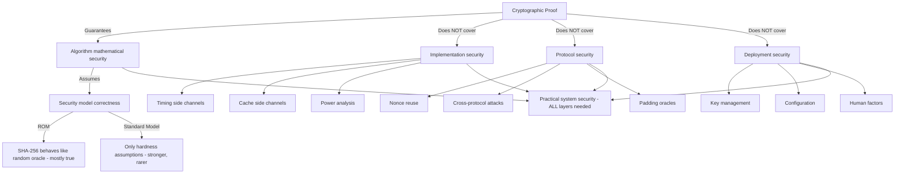

⚡ TL;DR - Provable security is a formal framework where the security of a cryptographic
construction is PROVED to be equivalent to a well-studied hard mathematical problem (like
integer factorization or discrete logarithm). "If you can break this scheme, you can solve
RSA problem - which no one has solved in 50 years." But: provable security has critical
limitations that every practitioner must understand. (1) REDUCTION TIGHTNESS: a proof says
"breaking the scheme requires solving Problem X." But the proof may be LOOSE - breaking the
scheme might only require solving an easier version of X, or the reduction may have an
exponential security loss. A "provably secure" scheme can have actual security weaker than its
advertised key size. (2) SECURITY MODELS: most proofs are in the Random Oracle Model (ROM),
where hash functions are idealized as perfect random functions. Real hash functions (SHA-256)
are NOT random oracles. The ROM proof does not directly apply to real implementations.
Schemes proved secure in ROM: may be broken in the Standard Model (no idealization).
(3) SIDE CHANNELS: no formal security proof covers side channels (timing attacks, power analysis,
cache attacks, EM emissions). A mathematically proven-secure algorithm + a timing-vulnerable
implementation = a broken system. AES: provably secure against differential/linear cryptanalysis.
AES with a non-constant-time implementation: broken by timing analysis in minutes.
(4) THE SYSTEMS SECURITY GAP: formal cryptographic proofs prove the ALGORITHM is secure.
Not the implementation. Not the key management. Not the protocol. Not the deployment.
TLS 1.3 has excellent formal security proofs. A TLS 1.3 server with a misconfigured CORS policy:
still vulnerable to cross-origin attacks. Provable security: a necessary but insufficient
component of practical security.

---

| #139 | Category: Security | Difficulty: ★★★★★ |
|:---|:---|:---|
| **Depends on:** | Full SEC library (SEC-001 through SEC-138) | |
| **Used by:** | SEC-140 through SEC-144 | |
| **Related:** | Full SEC library | |

---

### 🔥 The Problem This Solves

**THE IMPLEMENTATION GAP - WHY PROVABLE SECURITY ISN'T ENOUGH:**

```
RSA-OAEP: a provably secure encryption scheme.
Proof: Bellare and Rogaway (1994) proved RSA-OAEP secure in the Random Oracle Model.
If RSA-OAEP is broken: you can solve RSA (invert the RSA function). No one can.
Therefore: RSA-OAEP is computationally secure (assuming RSA hardness).

PKCS#1 v1.5: an older RSA encryption padding scheme. NOT provably secure.
BLEICHENBACHER (1998): Daniel Bleichenbacher published an adaptive chosen-ciphertext attack
on PKCS#1 v1.5 RSA encryption. Given a PKCS#1 v1.5 padding oracle (a server that tells you
whether decryption succeeded), you can recover any RSA-encrypted message in ~1 million queries.

THE ROBOTS ATTACK (2017-2018):
Nineteen years after Bleichenbacher's paper: Hanno Bock, Juraj Somorovsky, and Craig Young
discovered that a significant fraction of HTTPS servers on the internet still supported
PKCS#1 v1.5 RSA encryption in TLS (for legacy key exchange: TLS_RSA ciphersuites).
Testing: they scanned the top 1 million Alexa sites. Found: Cisco, Palo Alto, F5, IBM,
Radware, Citrix products all contained the padding oracle.
The attack: required ~1 million TLS handshakes to decrypt a session. Against most servers:
~100ms latency × 1 million queries = 28 hours. Against optimized setups: under 8 hours.
The result: an attacker could decrypt any TLS session protected by RSA key exchange
(no forward secrecy, as is the case with TLS_RSA). This was NOT a flaw in RSA itself.
This was NOT a flaw in PKCS#1 v1.5 as a DEFINITION. The flaw: in the implementation.
Specifically: in the server's RESPONSE TIME to invalid padding (a timing oracle).
The server: took slightly longer to process incorrectly padded plaintexts (or responded with
a slightly different error message). The timing/error difference: the oracle.

THE LESSON:
RSA-OAEP has a proof of security. PKCS#1 v1.5 doesn't.
Using the provably secure RSA-OAEP: would have prevented ROBOT.
But: even with RSA-OAEP, a server that leaks timing information in its OAEP error handling
could create a similar oracle. The proof: protects the algorithm. Not the implementation.

PRACTICAL SECURITY REQUIRES:
1. A provably secure algorithm (or a well-analyzed heuristic).
2. A constant-time, side-channel-resistant implementation.
3. Correct usage (no PKCS#1 v1.5 ciphersuite support even alongside OAEP).
4. Correct key management (private key never exposed to unauthorized parties).
5. Correct protocol design (no padding oracles, no decryption oracles).

All five: necessary. None: sufficient alone.
```

---

### 📘 Textbook Definition

**Provable Security:** A formal methodology in cryptography where the security of a construction
(encryption scheme, signature scheme, protocol) is mathematically proven to be at least as
hard to break as a specific well-studied computational problem (RSA, discrete logarithm,
finding hash preimages). The proof: a reduction. "If there exists an efficient algorithm A that
breaks our scheme, then there exists an efficient algorithm B that solves the hard problem."
Since no efficient algorithm for the hard problem is known: no efficient algorithm for breaking
the scheme can exist (under the hardness assumption).

**Random Oracle Model (ROM):** A security model where hash functions are idealized as perfectly
random functions. In the ROM: every hash function call returns a uniformly random value (with
the constraint that the same input always produces the same output). Proofs in the ROM:
mathematically cleaner (the idealized hash function is much easier to reason about than real
SHA-256). The limitation: real hash functions are NOT random oracles. ROM proofs: "heuristic"
security arguments. Schemes with ROM proofs: generally considered secure in practice (because
SHA-256 behaves like a random oracle for the relevant properties), but the proof doesn't directly
apply to real deployments.

**Standard Model:** A security model that uses only complexity-theoretic assumptions (hardness
assumptions like RSA or DDH) and makes no idealization of hash functions or other primitives.
Standard model proofs: stronger guarantees but harder to construct. Many practical schemes
(including some widely deployed ones) have ROM proofs but no known standard model proof.
Finding standard model proofs for ROM-secure schemes: an active research area.

**Information-Theoretic Security:** Security that holds even against computationally UNLIMITED
adversaries. The one-time pad: information-theoretically secure (given a truly random key of
the same length as the plaintext). No amount of computation can break it: not because breaking
it is hard, but because breaking it provides zero information. In practice: information-theoretic
security requires keys as long as the message (impractical for most applications). Modern
symmetric encryption (AES-256): NOT information-theoretically secure. It's computationally
secure (breaking it requires 2^256 operations).

**Side Channel Attack:** An attack that exploits information leaked by the PHYSICAL IMPLEMENTATION
of a cryptographic algorithm: timing differences, power consumption, electromagnetic emissions,
acoustic emissions, or cache access patterns. Side channel attacks: not modeled in standard
cryptographic proofs. A mathematically secure algorithm with a side-channel-vulnerable
implementation: broken by side channel attacks, regardless of the proof.

**Constant-Time Implementation:** A cryptographic implementation where the execution time is
independent of secret values (key bits, plaintext). Prevents timing side channel attacks.
Implementing constant-time code: requires avoiding data-dependent branches and memory accesses
on secret values. Difficult to achieve with standard compilers (compilers optimize for speed,
potentially creating timing variations).

---

### ⏱️ Understand It in 30 Seconds

**One line:**
Provable security provides mathematical guarantees that an ALGORITHM is as hard to break as a
well-studied problem, but makes no guarantee about the IMPLEMENTATION (side channels), the
PROTOCOL DESIGN (oracles, misuse), or the DEPLOYMENT CONTEXT - creating a gap that real attacks
consistently exploit.

**One analogy:**
> Provable security is like a proof that a vault lock mechanism is theoretically unbreakable.
>
> A locksmith: designs a vault lock with a formal mathematical proof.
> "This lock can only be opened by someone who can solve the discrete logarithm problem.
>  No computer in the world can solve discrete logarithm in feasible time.
>  Therefore: this lock is provably secure."
>
> The proof: correct. The discrete logarithm problem IS hard. The mathematical reduction: valid.
>
> But now consider the deployment:
>
> SIDE CHANNEL: The lock SOUNDS different when the correct digit is entered (click vs. no click).
> An attacker: listens carefully and determines the combination by acoustic side channel.
> The proof: doesn't cover acoustic emissions. The lock: broken.
>
> IMPLEMENTATION BUG: The lock's firmware has a buffer overflow in the keypad input handler.
> An attacker: inputs 1,000 digits and crashes the firmware into an "unlocked" state.
> The proof: covers the mathematical lock mechanism. Not the firmware.
>
> PROTOCOL MISUSE: The vault is "provably secure" when used alone.
> But in this bank: the vault can be queried with a test combination and returns "right" or "wrong."
> An attacker: uses binary search with the oracle. Opens the vault in 10 queries (divide and conquer).
> The proof: assumed no oracle access. The deployment: provides an oracle.
>
> DEPLOYMENT CONTEXT: The vault is behind a reception desk.
> A receptionist tells visitors: "The combination is 7-3-9" (social engineering bypass).
> The proof: doesn't cover human factors.
>
> ALL FOUR ATTACKS: broken the lock without touching the mathematical proof.
> The proof: still correct. The vault: still broken.
>
> Provable security: proves the algorithm is hard to break mathematically.
> It does NOT prove the implementation, the deployment, the protocol, or the humans are secure.
> ALL of these: necessary components of a secure system.

---

### 🔩 First Principles Explanation

**Four layers of the provable security gap:**

```
LAYER 1: PROOF ASSUMPTIONS (what the proof actually guarantees)

  A proof of security is always conditional:
  "ASSUMING that Problem X is hard, our scheme is secure."
  
  The assumption: may be wrong.
  RSA: assumed hard for 50+ years. Still hard (as far as we know).
  If P=NP: RSA is easy. All RSA-based "provably secure" schemes: broken.
  (The proof is still correct. The assumption was wrong.)
  
  The discrete logarithm problem in Z_p: assumed hard. But:
  For specific prime p sizes (below 768 bits): not hard anymore (LOGJAM, 2015).
  The Logjam attack: precomputed discrete logs for 512-bit and 768-bit primes.
  Many TLS servers at the time: used these sizes (legacy configuration).
  The proof: assumed large enough primes. The deployment: used small primes.
  
  Lesson: the proof guarantees security relative to the assumption.
  The assumption: must be checked in context (key sizes, prime selection, etc.).

LAYER 2: SECURITY MODELS (what the proof models vs. what exists in practice)

  RANDOM ORACLE MODEL (ROM):
  The proof: assumes the hash function is a perfect random function.
  SHA-256: not a perfect random function. It has internal structure.
  
  The gap: in practice, SHA-256 behaves "close enough" to a random oracle
  for the purposes of most scheme security proofs. The ROM is a useful heuristic.
  
  But: there are known gaps. SHA-256 is NOT a random oracle because:
  - SHA-256 has length extension: H(x || m) can be computed from H(m) without knowing x.
  - A construction that relies on H(key || message) as a MAC: broken.
    HMAC: designed specifically to avoid this (H(key || H(key || message))).
  
  The proof: assumes no structure in H. The real H: has structure.
  The specific structure: exploitable in specific constructions.
  
  IDEAL CIPHER MODEL:
  AES: often modeled as an ideal cipher (a random permutation for each key).
  Real AES: a specific algorithm with algebraic structure. Not a random permutation.
  Attacks on AES: use the algebraic structure (differential cryptanalysis).
  
  AES has a formal proof of security against differential and linear cryptanalysis
  (via the Wide Trail Strategy). This is NOT "provably secure against all attacks."
  It is "provably secure against these specific attack classes, under this security model."
  
  SELECTIVE OPENING ATTACKS, MULTI-USER SECURITY:
  Many classic proofs: single-user, single-message model.
  Modern deployment: billions of TLS sessions, multiple users sharing sessions.
  Proofs in single-user models: don't directly apply to multi-user scenarios.
  Research: extending proofs to multi-user settings (active area).

LAYER 3: REDUCTION TIGHTNESS (how much security is actually guaranteed)

  A reduction: "If attacker A breaks our scheme with probability p,
  then algorithm B solves RSA with probability p / T."
  
  If T is large (a loose reduction): the actual security is much lower than the key size suggests.
  
  Example: RSA-OAEP proof in the ROM has a reduction with security loss proportional to
  q_hash^2 (square of the number of hash oracle queries).
  If the attacker can make 2^40 hash queries: the security loss = 2^80.
  For a 2048-bit RSA key (claiming 112-bit security): the actual security after the reduction
  loss is 112 - 80 = 32 bits. Equivalent to a 32-bit security parameter. Brute-forceable.
  
  This is a known concern with RSA-OAEP. In practice: the attack model requires q_hash^2
  queries which is unrealistic at large q_hash. But: the mathematical security guarantee
  is weaker than "2048-bit RSA gives you 112 bits of security."
  
  NIST's FIPS standards: include specific security parameter recommendations (key sizes)
  that account for reduction tightness. Following NIST recommendations: correct practice.
  Computing your own key size from first principles based on the proof: requires understanding
  the reduction tightness.

LAYER 4: IMPLEMENTATION AND DEPLOYMENT (what proofs never cover)

  TIMING SIDE CHANNELS:
  AES: provably secure against differential/linear cryptanalysis.
  AES with a table-lookup implementation:
  
  # VULNERABLE (non-constant-time AES table lookup):
  def aes_round(state, round_key):
      # The table lookup index (state[i]) is secret data.
      # CPU cache behavior: table entry not in cache → cache miss → slightly slower.
      # An attacker: measures timing to infer which table entries were accessed.
      # From the table entries accessed: determines the round key bits.
      # This is the "cache timing attack" on AES (Bernstein, 2005).
      result = [S_BOX[state[i]] for i in range(16)]  # S_BOX: AES S-box table
      return xor(result, round_key)
  
  # CORRECT (constant-time using AES-NI hardware instructions):
  # Use AES-NI (Intel/ARM hardware accelerated AES) which is constant-time.
  # Python's cryptography library: uses AES-NI on supported platforms.
  from cryptography.hazmat.primitives.ciphers import Cipher, algorithms, modes
  from cryptography.hazmat.backends import default_backend
  # This uses AES-NI if available: hardware-constant-time.
  cipher = Cipher(
      algorithms.AES(key),
      modes.GCM(nonce),
      backend=default_backend()
  )
  
  The proof covers the AES algorithm. Not the implementation. Not the hardware.
  "Provably secure" AES: still requires a constant-time implementation.
  
  KEY MANAGEMENT:
  RSA-OAEP is provably secure. A private key stored unencrypted in a world-readable file:
  not secure. The proof: covers the algorithm. Not the key storage.
  
  PROTOCOL DESIGN:
  A provably secure signature scheme used in a protocol where signatures from one context
  are accepted in another (cross-protocol attack): broken.
  
  HUMAN FACTORS:
  Provable security: does not prevent social engineering, phishing, or insider threats.
```

---

### 🧪 Thought Experiment

**SCENARIO: Evaluating a cryptographic library's "provably secure" claims:**

```
CLAIM: "Our library uses provably secure cryptographic primitives."

WHAT TO ASK:

  Q1: "Provably secure under which security model?"
  Expected answer: "In the Random Oracle Model" or "In the Standard Model."
  
  If Random Oracle Model: the proof is a heuristic (but a good one).
  SHA-256 behaves like a random oracle for most purposes.
  The relevant question: does your specific construction have any known ROM gaps?
  (e.g., does it use H(key || message) without HMAC's double-hashing? If so: length extension.)
  
  If Standard Model: stronger. But: standard model proofs are rare and often have
  looser reductions (less tight = less security guarantee per key bit).
  
  Q2: "What hard problem does the proof reduce to?"
  Expected: RSA, DDH (Decisional Diffie-Hellman), ECDLP (Elliptic Curve Discrete Log),
  LWE (Learning With Errors - post-quantum), etc.
  
  RSA: 50 years, strong confidence. Key sizes: 2048+ bits (NIST recommends).
  DDH in elliptic curves: 30 years, strong confidence. Key sizes: 256+ bits (NIST P-256).
  LWE: 15 years, post-quantum secure. NIST standardized ML-KEM (Kyber) in 2024.
  
  Q3: "Does your implementation use constant-time arithmetic for secret data?"
  Expected: "Yes, we use [specific constant-time library/hardware instruction]."
  If they can't answer: be concerned. Side channels are the #1 practical attack vector.
  
  Q4: "Do you have independent security audits of the implementation?"
  A proof covers the algorithm. An audit covers the implementation.
  Both: needed.
  
  Q5: "What is your key management approach?"
  Keys derived from provably secure schemes: still need secure storage, rotation, and deletion.
  
EVALUATING THE LIBRARY:

  A good answer: "We use ECDHE (P-256, provably secure under DDH in the ROM) for key
  agreement and AES-256-GCM (provably secure against bounded queries in the ideal cipher model)
  for symmetric encryption. Our implementation uses hardware AES-NI (constant-time) and
  platform-provided ECDH (constant-time via OS crypto libraries). We have a security audit
  by [reputable firm] completed [date]. Our keys are stored in an HSM with [key rotation policy]."
  
  A concerning answer: "Our algorithms are all provably secure." (No specifics.)
  Or: "We don't need side-channel mitigations because we're provably secure." (Completely wrong.)
  Or: "The math proves it's secure, so the implementation doesn't matter." (Dangerously wrong.)
```

---

### 🧠 Mental Model / Analogy

> Provable security is a "certificate of structural integrity" for an algorithm.
>
> A structural engineer: produces a certificate.
> "This bridge design can support 100,000 tons. I can mathematically prove it."
> The math: correct. The certificate: valid.
>
> But the bridge can still fail if:
> - The steel used has impurities (implementation defect - analogy: buggy AES implementation).
> - The workers made assembly errors (integration defect - analogy: misused API).
> - The foundation is on bad soil (deployment context - analogy: key management failure).
> - Someone drills holes in the support beams (side channel - analogy: timing attack).
> - The bridge is used to carry 200,000 tons (assumption violation - analogy: key size too small).
>
> The structural engineer's certificate: necessary but not sufficient for a safe bridge.
> The construction company: must also use good materials, skilled workers, proper inspection,
> and correct use guidelines.
>
> Similarly: a cryptographic proof is necessary but not sufficient for a secure system.
> The proof: guarantees the algorithm's mathematical core.
> The engineering: must also provide correct implementation, constant-time code,
> correct key management, correct protocol design, and correct deployment.
>
> The dangerous mindset: "we used a provably secure algorithm, so we're fine."
> The safe mindset: "we used a provably secure algorithm AND we audited the implementation
> for side channels AND we verified the key management AND we tested the protocol for
> misuse vulnerabilities."
>
> The proof: one layer of assurance. Not the only layer.

---

### 📶 Gradual Depth - Five Levels

**Level 1 - What it is (anyone can understand):**
"Provably secure" in cryptography means mathematicians have proved that breaking a specific algorithm is as hard as solving a famous mathematical problem (like factoring very large numbers) that no one has solved despite decades of trying. It's a strong guarantee for the algorithm itself. But: "provably secure algorithm" does not mean "provably secure system." The same way a mathematically perfect lock design doesn't make your house secure if you leave the key under the doormat. The proof covers the lock mechanism. Not where you store the key, not the strength of the door frame, not whether your neighbor has a copy of your key. Real security: requires both a provably secure algorithm AND correct implementation AND correct key management AND correct usage.

**Level 2 - How to use it (junior developer):**
Practical implications for developers: (1) Use algorithms with strong security proofs: AES-256-GCM, RSA-OAEP, ECDHE (P-256 or X25519), HMAC-SHA256. Don't invent your own crypto (no proof = unknown security). (2) Use standard, well-audited libraries (OpenSSL, libsodium, BouncyCastle): they implement the algorithm correctly, including side-channel mitigations. A DIY AES implementation: likely not constant-time. (3) Proof doesn't cover misuse: AES-GCM with a reused nonce is broken (the proof assumes unique nonces). The proof: valid for AES-GCM with unique nonces. Your code that reuses nonces: violates the proof's assumption. (4) Key management: never in the proof. Use a KMS or HSM for production key storage, never hardcoded keys.

**Level 3 - How it works (mid-level engineer):**
The Bleichenbacher/ROBOT attack on PKCS#1 v1.5 RSA: PKCS#1 v1.5 has no formal proof of security (RSA-OAEP does). The practical consequence: PKCS#1 v1.5 is vulnerable to adaptive chosen-ciphertext attacks if any information about padding validity is leaked. The "information about padding validity" can be: an error message ("bad padding" vs. "decrypt success"), a timing difference (padding validation takes slightly longer for certain invalid paddings), or any other side-channel. The ROBOT attack (2017): exploited timing differences in TLS servers' processing of RSA key exchange. Servers: returned TLS handshake errors at different speeds for valid vs. invalid PKCS#1 v1.5 padding. This timing difference: ~microseconds. Over 1 million queries with a tool: determined the plaintext. Practical fix: disable TLS_RSA cipher suites (RSA key exchange without forward secrecy). All modern TLS configurations should have TLS_RSA ciphersuites disabled. Checking your server: `openssl s_client -connect host:443 | grep 'Cipher'`. If the cipher includes RSA key exchange (not ECDHE_RSA): vulnerable.

**Level 4 - Why it was designed this way (senior/staff):**
The tension between "provable security" and "practical security" stems from the fundamental limits of formal proof. A proof: reasons about an abstraction (the algorithm, the model). Reality: the algorithm is implemented in hardware/software, uses specific libraries, runs in a specific environment, is operated by humans. The proof: cannot reason about all of these without becoming intractable. This is not a failure of cryptographic theory. It's a fundamental limit: you cannot formally verify an infinite, changing, human-operated system. The response: layered assurance. Layer 1: formal proofs for algorithms (provable security). Layer 2: formal verification for critical implementations (CompCert for C compilation, Coq proofs for TLS implementation: miTLS, HACL*, verified in F*). Layer 3: security audits (human expert review). Layer 4: fuzz testing, symbolic execution (automated analysis). Layer 5: penetration testing (adversarial testing). Layer 6: runtime monitoring. Each layer: catches a different class of issues. No single layer: sufficient. The cost: each layer takes time and money. The trade-off: proportional to the value of what's being protected. HACL* (a formally verified implementation of modern cryptographic primitives): used in Firefox, Linux kernel. The formal verification: one layer. The deployment context (Firefox extension security model): not formally verified.

**Level 5 - Mastery (distinguished engineer):**
The post-quantum transition and the limits of provable security: NIST standardized ML-KEM (formerly Kyber), ML-DSA (formerly Dilithium), and SLH-DSA (formerly SPHINCS+) in 2024. These algorithms: provably secure under the Learning With Errors (LWE) assumption or hash function security assumptions. The LWE assumption: post-quantum secure (no quantum algorithm is known to solve LWE efficiently). But: LWE is 15 years old (Regev, 2005). The confidence level in LWE hardness: not as high as RSA (50 years) or ECDLP (30 years). The argument for LWE: it has survived intense scrutiny since 2005, and lattice problems are structurally different from number-theoretic problems (Shor's algorithm doesn't apply). But: history suggests humility. MD5: considered secure in 1990, broken for collision resistance in 2004. SHA-1: considered secure until 2005, broken for practical collision finding in 2017. The 2025 recommendation: deploy ML-KEM in hybrid mode (classical ECDHE + ML-KEM). The hybrid: if ML-KEM is broken (unknown vulnerability in LWE), ECDHE still provides classical security. If a quantum computer breaks ECDHE, ML-KEM still provides post-quantum security. Hybrid: pays a performance cost (~10% overhead) for security assurance under uncertainty. This is the practical application of "provable security is not absolute security": use the best proofs available, deploy defensively (hybrid), and plan for the possibility that today's assumptions may be wrong in 10 years.

---

### ⚙️ How It Works (Mechanism)

```
THE SECURITY REDUCTION - HOW PROOFS WORK:

  GOAL: Prove that Scheme S is secure.
  METHOD: Show that breaking S is as hard as solving Problem X.
  
  Construction: A reduces to B means:
  If adversary A breaks S → we can use A to solve X.
  Since no one can solve X → no adversary can break S.
  
  Example: RSA-OAEP security proof (simplified):
  
  THEOREM: RSA-OAEP is IND-CCA2 secure in the ROM,
           assuming RSA is a one-way function.
  
  PROOF SKETCH:
  Suppose adversary A breaks IND-CCA2 security of RSA-OAEP:
  → A must query the hash oracle with specific values related to the RSA secret.
  → We can observe A's hash queries.
  → From A's queries and the IND-CCA2 game, we extract a solution to RSA.
  
  THEREFORE: If RSA is hard (no efficient RSA inverter exists),
             then RSA-OAEP is IND-CCA2 secure.
  
  THE GAP: "IND-CCA2 secure in the Random Oracle Model" means:
  1. The proof is valid in the ROM. SHA-256 is not a ROM. (Model gap.)
  2. The proof covers the algorithm. Not a PKCS#1 v1.5-vulnerable fallback. (Protocol gap.)
  3. The proof covers the math. Not timing side channels. (Implementation gap.)
  4. The proof covers correct usage. Not nonce reuse or key mismanagement. (Usage gap.)
```



---

### 💻 Code Example

**Demonstrating the gap between provable and practical security:**

```python
# provable_vs_practical.py
# Demonstrates: RSA-OAEP (provably secure algorithm) vs. timing side channel
# (not covered by proof). Shows the gap between algorithmic and practical security.
#
# Also: a constant-time comparison function, and the AES-NI safe usage pattern.

import time
import secrets
import hmac
import hashlib
from cryptography.hazmat.primitives.asymmetric import rsa, padding
from cryptography.hazmat.primitives import hashes
from cryptography.hazmat.primitives.ciphers.aead import AESGCM
from cryptography.hazmat.primitives.kdf.hkdf import HKDF

# ============================================================
# RSA-OAEP: provably secure algorithm (in ROM under RSA assumption)
# ============================================================

def generate_rsa_keypair():
    """RSA-OAEP: provably secure. Correct usage: 2048-bit minimum."""
    private_key = rsa.generate_private_key(
        public_exponent=65537,
        key_size=4096,  # 4096-bit: 140-bit security level
    )
    return private_key, private_key.public_key()


def rsa_oaep_encrypt(public_key, plaintext: bytes) -> bytes:
    """
    RSA-OAEP: IND-CCA2 secure in ROM under RSA assumption.
    OAEP padding: prevents the adaptive chosen-ciphertext attacks that break
    PKCS#1 v1.5 (the Bleichenbacher/ROBOT attack).
    
    BAD: rsa.PKCS1v15() - vulnerable to Bleichenbacher attack
    GOOD: OAEP with SHA-256 for both padding hash and MGF
    """
    return public_key.encrypt(
        plaintext,
        padding.OAEP(
            mgf=padding.MGF1(algorithm=hashes.SHA256()),
            algorithm=hashes.SHA256(),
            label=None  # Standard: no label
        )
    )


def rsa_oaep_decrypt(private_key, ciphertext: bytes) -> bytes:
    """
    RSA-OAEP decryption. The proof covers this operation.
    
    IMPORTANT: The Python cryptography library's OAEP decryption is
    designed to be resistant to timing side channels (constant-time
    padding validation). This is part of practical security that the
    proof alone does not guarantee.
    """
    return private_key.decrypt(
        ciphertext,
        padding.OAEP(
            mgf=padding.MGF1(algorithm=hashes.SHA256()),
            algorithm=hashes.SHA256(),
            label=None
        )
    )


# ============================================================
# AES-256-GCM: provably secure (ideal cipher model) + correct usage
# ============================================================

def aes_gcm_encrypt(key: bytes, plaintext: bytes, aad: bytes) -> tuple:
    """
    AES-256-GCM: provably secure against adaptive chosen-ciphertext attacks
    under the ideal cipher assumption.
    
    REQUIREMENT: nonce MUST be unique per message (same key, different nonce).
    PROOF ASSUMPTION: all nonces are unique.
    
    BAD pattern (nonce reuse):
    FIXED_NONCE = b'\\x00' * 12  # Never do this!
    # Reusing nonce: breaks GCM security completely.
    # With two ciphertexts using the same (key, nonce): XOR them to cancel the keystream.
    # Then: differential analysis on the XOR reveals both plaintexts.
    
    CORRECT pattern: random nonce per encryption.
    """
    # Generate a random 96-bit (12 byte) nonce.
    # 96 bits is the NIST-recommended size for GCM.
    # With random nonces and 2^96 possible values: collision probability
    # is negligible for reasonable message counts (< 2^32 messages per key).
    nonce = secrets.token_bytes(12)
    
    aesgcm = AESGCM(key)
    # AESGCM.encrypt: uses AES-NI hardware instructions (constant-time)
    # on supported platforms via the Python cryptography library.
    ciphertext_tag = aesgcm.encrypt(nonce, plaintext, aad)
    
    return nonce, ciphertext_tag  # Return nonce + ciphertext (nonce is NOT secret)


def aes_gcm_decrypt(key: bytes, nonce: bytes, ciphertext_tag: bytes, aad: bytes) -> bytes:
    """
    AES-256-GCM decryption with authentication tag verification.
    The authentication tag: ensures ciphertext integrity.
    If ciphertext was modified: decryption raises InvalidTag exception.
    
    DO NOT: catch and ignore InvalidTag exceptions.
    An invalid tag: indicates tampering or decryption with wrong key.
    """
    aesgcm = AESGCM(key)
    # This will raise InvalidTag if authentication fails.
    return aesgcm.decrypt(nonce, ciphertext_tag, aad)


# ============================================================
# CONSTANT-TIME COMPARISON: a critical implementation requirement
# not covered by any cryptographic proof.
# ============================================================

def constant_time_compare_bad(a: bytes, b: bytes) -> bool:
    """
    BAD: naive comparison. Early-exit on first mismatch.
    Timing: proportional to the position of the first mismatch.
    An attacker: measures timing to learn how many bytes are correct.
    This is a timing oracle. Use in MAC validation or auth token comparison:
    allows byte-by-byte brute force via timing analysis.
    """
    if len(a) != len(b):
        return False
    for x, y in zip(a, b):
        if x != y:
            return False  # Early exit: timing reveals mismatch position
    return True


def constant_time_compare_correct(a: bytes, b: bytes) -> bool:
    """
    CORRECT: constant-time comparison. Always examines all bytes.
    Python's hmac.compare_digest: specifically designed for constant-time comparison.
    Use for: HMAC verification, session token comparison, API key validation,
    any comparison involving secret values.
    
    Timing: identical regardless of how many bytes match.
    No timing oracle: timing-based brute force is not possible.
    """
    # hmac.compare_digest: uses a constant-time comparison algorithm.
    # Works for both bytes and str.
    return hmac.compare_digest(a, b)


# ============================================================
# KEY DERIVATION: a practical security requirement the proof doesn't model
# ============================================================

def derive_encryption_keys(
    shared_secret: bytes,
    info: bytes
) -> tuple[bytes, bytes]:
    """
    HKDF: extract-and-expand key derivation function.
    Use case: derive multiple keys from a single shared secret
    (e.g., an ECDHE shared secret → encryption key + MAC key).
    
    BAD pattern:
    encryption_key = shared_secret[:32]  # First 32 bytes
    mac_key = shared_secret[32:64]       # Next 32 bytes
    # This: may not provide the right distribution. Use HKDF.
    
    CORRECT pattern: HKDF with domain separation.
    """
    # HKDF: RFC 5869. Extract + Expand.
    # Salt: optional but recommended (prevents weak shared secret bias).
    # Info: domain separation (different keys for different purposes).
    hkdf = HKDF(
        algorithm=hashes.SHA256(),
        length=64,     # 64 bytes: 32 for encryption key, 32 for MAC key
        salt=None,     # In practice: provide a random salt
        info=info,     # Domain separation: b"encryption" or b"mac"
    )
    
    key_material = hkdf.derive(shared_secret)
    encryption_key = key_material[:32]
    mac_key = key_material[32:64]
    return encryption_key, mac_key
```

---

### ⚖️ Comparison Table

| Security Layer | What It Guarantees | What It Does NOT Cover | Example Failure |
|:---|:---|:---|:---|
| **Formal Proof (ROM)** | Algorithm unbreakable given hardness assumption | Implementation, side channels, key management | PKCS#1 v1.5 (no ROM proof) → ROBOT attack |
| **Standard Model Proof** | Algorithm unbreakable without ROM idealization | Same as above, but stronger algorithm guarantee | Fewer known construction failures |
| **Constant-Time Implementation** | No timing side channels from secret-dependent branches | EM, power side channels; logical vulnerabilities | Timing oracle → byte-by-byte brute force |
| **Security Audit** | Known vulnerabilities reviewed by experts | Unknown/novel vulnerabilities; human reviewer fatigue | Post-audit vulnerability discovered by fuzz testing |
| **Penetration Testing** | Adversarial testing of deployed system | Vulnerabilities not in tester's repertoire | Zero-day CVE found after pentest |
| **Runtime Monitoring** | Anomalous behavior detection | Low-and-slow attacks below detection threshold | Multi-month APT exfiltration within normal traffic |

---

### ⚠️ Common Misconceptions

| Misconception | Reality |
|:---|:---|
| "If it's provably secure, the implementation doesn't matter." | This is one of the most dangerous misconceptions in applied cryptography. The proof covers the ALGORITHM under specific mathematical assumptions. It makes zero statements about the implementation. AES is provably secure against differential and linear cryptanalysis. An AES implementation with a table-lookup approach (using byte substitution tables cached in CPU L1/L2 cache) leaks information via cache timing attacks - even though the algorithm is provably secure. The ROBOT attack: exploited timing differences in server responses to invalid PKCS#1 padding - an implementation-level behavior not covered by any proof. Every security proof explicitly states its model and assumptions. Implementation artifacts (timing, cache state, power consumption) are NOT in these models. A "provably secure algorithm with an insecure implementation" is as insecure as "no algorithm at all" for the attacks that exploit the implementation. |
| "The Random Oracle Model is fine because SHA-256 is close enough to a random oracle." | SHA-256 is a good heuristic approximation of a random oracle for most purposes, and the vast majority of ROM-based proofs translate to real security in practice. However: there are specific, exploitable differences. The length extension property of SHA-256 (Merkle-Damgard construction): an attacker who knows H(m) can compute H(m || padding || m') without knowing m. This is not possible for a true random oracle. Any construction that uses H(key || message) as a MAC is broken by length extension. HMAC was specifically designed to prevent this: H(key XOR opad || H(key XOR ipad || message)) - the double hashing eliminates the length extension vulnerability. If you see code computing `hashlib.sha256(key + message).hexdigest()` as a MAC: it's vulnerable to length extension, regardless of the ROM proof for HMAC. SHA-3 (Keccak): does NOT have the length extension property. SHA-3-based MACs (KMAC): safe from length extension without the HMAC double-hashing. The lesson: know the specific non-ROM properties of your hash function and whether your construction relies on properties the real hash function doesn't have. |

---

### 🚨 Failure Modes & Diagnosis

**Diagnosing provable vs. practical security failures:**

```
FAILURE: NON-CONSTANT-TIME COMPARISON IN AUTHENTICATION

  Code (Python):
  
  def verify_api_key(provided_key: str, stored_key: str) -> bool:
      return provided_key == stored_key  # BAD: timing oracle
  
  Symptom:
  An automated attack sends API keys with known prefixes:
  - Keys starting with "A..." → average response: 1.001ms
  - Keys starting with "B..." → average response: 1.000ms
  - Keys starting with "AA.." → average response: 1.002ms
  ...
  
  The slight timing difference (nanoseconds to microseconds): detectable by averaging
  many measurements. Result: byte-by-byte determination of the correct API key.
  
  Detection:
  Log analysis: unusually high rate of failed API key validation attempts from one IP.
  Each attempt: slightly faster or slower based on how many bytes match.
  
  Fix:
  def verify_api_key(provided_key: str, stored_key: str) -> bool:
      import hmac
      return hmac.compare_digest(provided_key.encode(), stored_key.encode())
  
  Verification:
  # Test timing uniformity (should see no correlation between key prefix and timing):
  import time, hmac
  key = b"test-api-key-1234"
  wrong_key_no_match = b"AAAAAAAAAAAAAAAA"  # No bytes match
  wrong_key_partial   = b"test-AAAAAAAAAAA"  # First 5 bytes match
  
  times_no_match = [time.perf_counter() - (t := time.perf_counter()) +
    hmac.compare_digest(key, wrong_key_no_match) * 0 for _ in range(10000)]
  times_partial = [time.perf_counter() - (t := time.perf_counter()) +
    hmac.compare_digest(key, wrong_key_partial) * 0 for _ in range(10000)]
  
  # With hmac.compare_digest: average times should be statistically indistinguishable.
  # With == operator: partial match times are slightly longer.

CHECKING FOR ROBOT-VULNERABLE CIPHERSUITES:

  # Test for TLS_RSA ciphersuites (no forward secrecy + PKCS#1 v1.5 risk):
  nmap --script ssl-enum-ciphers -p 443 example.com | grep -i "rsa"
  
  # If output includes ciphers like TLS_RSA_WITH_AES_128_GCM_SHA256:
  # These use RSA key exchange (no ECDHE prefix) = ROBOT-vulnerable configuration.
  
  # Fix: in NGINX, disable TLS_RSA ciphersuites:
  ssl_ciphers 'ECDHE-ECDSA-AES128-GCM-SHA256:ECDHE-RSA-AES128-GCM-SHA256:...';
  # Exclude any cipher not beginning with ECDHE.
  
  # Modern recommendation: TLS 1.3 only, which does NOT support TLS_RSA ciphersuites.
  ssl_protocols TLSv1.3;  # TLS 1.3 only: eliminates TLS_RSA entirely.
```

---

### 🔗 Related Keywords

**Prerequisites:**
- `Formal Verification of Security Protocols` (SEC-134) - formal methods applied to protocols
- `Security Protocol Design Trade-offs` (SEC-136) - where provable security intersects with trade-offs

**Builds on this:**
- `Adversarial Thinking` (SEC-140) - attackers exploit the provable-practical gap
- `Security as Contract` (SEC-143) - formalizing the provable security guarantees as contracts

---

### 📌 Quick Reference Card

```
┌──────────────────────────────────────────────────────────┐
│ PROVABLE       │ Algorithm security given hard problem   │
│ SECURITY       │ ROM: SHA-256 not ideal but practical    │
│ GUARANTEES     │ Reduction tightness: key size matters   │
├────────────────┼─────────────────────────────────────────┤
│ NOT COVERED    │ Timing / cache / power side channels    │
│ BY PROOFS      │ Nonce reuse, IV misuse, padding oracles │
│                │ Key management, configuration, humans   │
│                │ Protocol-level misuse                   │
├────────────────┼─────────────────────────────────────────┤
│ PRACTICAL      │ + Constant-time implementation          │
│ SECURITY       │ + Correct usage (unique nonces, etc.)   │
│ REQUIRES       │ + Secure key management (KMS/HSM)       │
│                │ + Security audit                        │
│                │ + Penetration testing                   │
├────────────────┼─────────────────────────────────────────┤
│ SAFE           │ Disable TLS_RSA (ROBOT prevention)      │
│ DEFAULTS       │ Use hmac.compare_digest for secrets     │
│                │ AES-NI (hardware constant-time AES)     │
│                │ RSA-OAEP not PKCS#1 v1.5               │
└──────────────────────────────────────────────────────────┘
```

---

### 💎 Transferable Wisdom

**Reusable Engineering Principle:**
"A proof covers the model. A system extends beyond the model."
Every formal proof: operates within a model. The model: is an abstraction of reality.
The abstraction: excludes details that make the proof intractable or the model too complex.
The exclusions: the source of real-world attacks.
In cryptography: the model excludes timing (algorithms run in constant time). Reality: they don't.
The model excludes key management (keys are always secret). Reality: they're sometimes mismanaged.
The model excludes protocol composition (schemes are used in isolation). Reality: they're composed.
Each exclusion: a gap. Each gap: exploited by real attacks.
This principle: applies to all formal methods in engineering.
A finite element analysis of a bridge: models the material as uniform. Real steel: has impurities.
A formal verification of software: models the hardware as faithful. Real CPUs: speculative execution.
The Meltdown and Spectre attacks (2018): exploited speculative execution in CPUs.
Formal software proofs: did not cover speculative execution (it's in the hardware model, not the software model).
The lesson: formal proofs are valuable, necessary, and limited.
Their value: establishing that the abstracted model is correct.
Their limitation: the abstracted model is not the full reality.
The engineer: must understand what the model covers AND what it doesn't.
Then: apply additional verification methods for what the formal model excludes.
This is engineering with intellectual honesty: "this proof tells us X. We still need to verify Y,
because Y is outside the proof's scope."

---

### 💡 The Surprising Truth

AES has a security proof - but not the kind most people assume.

The common belief: "AES is proven secure." What this actually means: AES has a formal resistance proof
against two specific attack classes: differential cryptanalysis and linear cryptanalysis.
The Wide Trail design strategy (Daemen and Rijmen, who designed AES) formally proves that AES's
specific S-box choice and linear diffusion layer make it highly resistant to differential and linear
cryptanalysis. The proof: quantifies the maximum differential/linear characteristic probability,
showing that these attacks require more than 2^100 AES evaluations for 128-bit keys.

What it does NOT prove: AES is secure against ALL attacks. It specifically proves resistance against
differential and linear cryptanalysis. These are the most powerful general structural attacks known
against block ciphers. The proof: assumes these are the dominant attacks. Other attacks:

Related-key attacks on AES-256 (Biryukov and Khovratovich, 2009): a theoretical 2^99 attack on
AES-256 in a related-key model. Not a practical attack (related-key attacks: not relevant in
most standard deployment models). But: shows that the proof is attack-class-specific.

Algebraic attacks: AES has elegant algebraic structure (in GF(2^8)). Some researchers worried
this could enable efficient algebraic attacks. So far: no successful algebraic attack on full AES.
But: the formal security proof does not preclude an algebraic attack. It simply doesn't apply to them.

The practical consequence: AES is not "mathematically proven secure against all possible attacks."
It is "mathematically proven highly resistant to the most powerful known structural attacks,
and has withstood 25 years of intense cryptanalysis." That is an excellent security foundation.
But: the appropriate interpretation is "the best cryptographic algorithm we have, with very high
confidence in its security," not "mathematically proven unbreakable by any attack." The distinction:
matters when someone claims an "AES vulnerability" or a "new algebraic attack on AES." The correct
response: "What attack model? Is it covered by the existing proof? What are the actual security parameters?"

---

### ✅ Mastery Checklist

**You've mastered this when you can:**
1. **EXPLAIN** what a cryptographic proof guarantees: "Breaking the scheme requires solving
   Problem X (e.g., RSA inversion). Under the hardness of Problem X, the scheme is secure
   in Model Y (e.g., ROM). The proof does not cover implementation, side channels, or key management."
2. **IDENTIFY** three things NOT covered by cryptographic proofs: timing side channels
   (code is constant-time is an implementation concern), key management (proof assumes keys are secret),
   protocol composition (proof may assume isolated use).
3. **EXPLAIN** the ROBOT attack in 2-3 sentences: PKCS#1 v1.5 RSA padding has no IND-CCA2 proof.
   A server that leaks any timing information about padding validity: creates a Bleichenbacher
   oracle. An attacker with ~1 million adaptive queries: recovers the RSA plaintext.
4. **USE** constant-time comparison: `hmac.compare_digest()` for any secret value comparison.
   Explain WHY: naive `==` exits early on first mismatch, creating a timing oracle.
5. **DESCRIBE** the Random Oracle Model gap: proofs in ROM assume hash functions are perfectly random.
   SHA-256 has length extension (H(m) reveals information about H(m || m')). Constructions
   that use SHA-256 where a random oracle would prevent length extension: vulnerable if they
   don't account for this specific non-ROM property.

---

### 🎯 Interview Deep-Dive

**Q: A developer says "our system uses AES-256-GCM, which is provably secure, so we don't
need a security audit of the implementation." How do you respond?**

*Why they ask:* Tests practical cryptography knowledge and understanding of the gap between
algorithmic security and system security. Common for security engineer, cryptography engineer,
or senior backend roles at companies handling sensitive data.

*Strong answer covers:*
- Acknowledging the partial truth: "AES-256-GCM IS a strong algorithm with solid security
  analysis. They're right that the algorithm is well-studied and there are no known practical
  attacks against it when used correctly. That's a good foundation."
- The implementation gap: "But 'provably secure algorithm' and 'provably secure implementation'
  are different things. AES-256-GCM requires: a unique, never-reused nonce per encryption.
  If the nonce is ever reused (even once), GCM security collapses completely - an attacker
  can XOR two ciphertexts with the same (key, nonce) and cancel the keystream, enabling
  plaintext recovery and forgery. The proof assumes unique nonces. The implementation: must
  guarantee this."
- The constant-time issue: "AES implementations that use table lookups can be vulnerable to
  cache timing attacks. A security audit would verify whether the library in use employs
  hardware AES-NI instructions (constant-time) or a software fallback that might not be.
  The cryptographic proof of AES: does not cover cache timing."
- The misuse question: "What's the associated data (AAD) being used for GCM authentication?
  If it's empty or incorrectly used: the authentication tag may not cover all the information
  it needs to cover. A security audit would verify GCM is being used correctly."
- The key management gap: "Where is the AES key stored? How is it rotated? A 256-bit key
  stored in an environment variable in a Docker container: not as secure as the same key
  in an HSM. The algorithm is strong. The key management may not be."
- Closing: "I'd tell them: 'Great that you chose AES-256-GCM. Now let's make sure it's
  implemented correctly: unique nonce generation, AES-NI usage, correct AAD usage, and
  secure key storage. A security audit covers these implementation aspects that the
  cryptographic proof doesn't address.'"