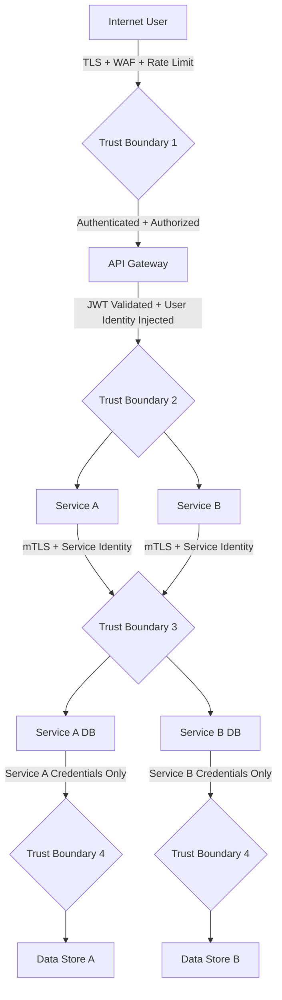

⚡ TL;DR - A trust boundary is the line in a system where the level of trust changes: data or
control passes from a more-trusted context to a less-trusted context (or vice versa). Every
security vulnerability is, at its root, a violation of a trust boundary - data from a
less-trusted source is treated as if it came from a more-trusted source. Trust boundary
analysis: systematically identifying all trust boundaries in a system and verifying that the
appropriate security controls exist at each boundary. Three principles: (1) EVERY trust boundary
requires: authentication (who is on the other side?), authorization (are they allowed to do this?),
and input validation (is this data safe to process, regardless of who sent it?). (2) TRUST IS NOT
TRANSITIVE: if Service A trusts Service B, and Service B trusts Service C, Service A does NOT
automatically trust Service C. Trust chains: must be explicitly analyzed. A common microservices
mistake: Service A receives a JWT from a user, calls Service B with the JWT, Service B calls Service C
with its own service account (not the user's JWT). Service C: makes decisions as if the service account
(B) is the actor, but the real actor is the user. The user's permissions: not checked by Service C.
(3) TRUST BOUNDARIES IN DATA FLOW DIAGRAMS (DFDs): the standard tool for trust boundary analysis.
A DFD: shows all data flows in a system. Trust boundaries: drawn as dashed lines crossing data flows.
Every dashed line: a location where security controls must exist. The STRIDE methodology:
applied per trust boundary crossing in the DFD. Data flows that cross trust boundaries without
visible security controls: the attack surface.

---

| #141 | Category: Security | Difficulty: ★★★★ |
|:---|:---|:---|
| **Depends on:** | Full SEC library (SEC-001 through SEC-140) | |
| **Used by:** | SEC-142, SEC-143, SEC-144 | |
| **Related:** | Full SEC library | |

---

### 🔥 The Problem This Solves

**THE TRUST CONFUSION ATTACK:**

```
VULNERABLE DESIGN - IMPLICIT TRUST AT INTERNAL BOUNDARIES:

  Architecture:
  Internet → Load Balancer → API Gateway → [Service A] → [Service B] → Database
  
  SECURITY ASSUMPTION (implicit, unverified):
  "The API Gateway validates all requests. Services behind the gateway are trusted.
  Service-to-service communication: trusted. No additional auth needed."
  
  ATTACK SCENARIO (server-side request forgery / compromised internal service):
  
  1. Attacker finds an SSRF vulnerability in Service A.
     (Service A: fetches a URL from user input. User sends URL pointing to Service B's internal address.)
  
  2. Attacker uses SSRF to call: http://service-b.internal/admin/users
     Service B: sees a request from Service A's IP address.
     Service B: trusts all requests from internal IP ranges (implicit trust).
     Service B: returns ALL user records.
  
  WHAT WENT WRONG:
  Trust boundary between Service A and Service B: NOT enforced.
  Service B: assumed "if the request came from inside the network, it must be authorized."
  This is NETWORK TRUST (based on source IP). Not IDENTITY TRUST.
  
  A compromised Service A, or any service that can forge requests to Service B's IP:
  can call Service B without authentication.
  
  THE ZERO TRUST PRINCIPLE:
  Zero Trust: "Never trust the network. Always verify the identity."
  Explicitly rejects network-based trust (IP address = trusted).
  Requires: every service-to-service call must carry a verifiable identity credential
  (mutual TLS / mTLS, or a JWT with a service identity claim).
  Service B: validates that the caller's certificate or JWT belongs to an authorized service.
  Not: "did this request come from inside the network?"
  But: "can this caller PROVE they are who they claim to be?"

CORRECT DESIGN - EXPLICIT TRUST AT EVERY BOUNDARY:

  Boundary 1: Internet → API Gateway
  Control: TLS termination, WAF, rate limiting, DDoS protection, authentication.
  
  Boundary 2: API Gateway → Service A
  Control: API Gateway issues a request-scoped JWT with user's identity and scopes.
  Service A: validates the JWT cryptographically.
  
  Boundary 3: Service A → Service B (internal)
  Control: Service A presents a service identity (mTLS client certificate or
  service account JWT signed by an internal CA).
  Service B: validates that Service A is the caller AND that the operation is authorized
  for the user on whose behalf Service A is acting.
  
  Result: even if Service A is compromised via SSRF:
  The attacker's forged request to Service B: lacks Service A's mTLS certificate or JWT.
  Service B: rejects requests without valid service identity.
  The SSRF attack: cannot reach Service B.
```

---

### 📘 Textbook Definition

**Trust Boundary:** A boundary in a system design where the trust level of data, requests, or
principals changes. Specifically: the line across which less-trusted data or callers interact with
more-trusted components. At every trust boundary: a decision must be made about what is trusted,
what is validated, and what is rejected. In a Data Flow Diagram (DFD): trust boundaries are drawn
as dashed lines. All data flows that cross a dashed line: require explicit security controls
(authentication, authorization, input validation).

**Trust Level:** The degree to which a component, user, or data source is considered reliable
and authorized. Typical trust levels: (1) Untrusted (external users, internet traffic); (2) Partially
trusted (authenticated users, partners); (3) Trusted (internal services with valid service identity);
(4) Highly trusted (privileged services, administrators, HSMs). Trust levels: should decrease with
distance from the core system.

**Implicit Trust:** An assumption that a caller or data source is trusted without explicit verification.
Example: trusting all requests from a specific IP range. Implicit trust: the source of many
security vulnerabilities. Network-based trust (IP address trust): routinely exploited via
SSRF, ARP spoofing, and compromised internal services.

**mTLS (Mutual TLS):** A TLS configuration where both the CLIENT and SERVER present certificates.
Standard TLS: only the server presents a certificate (proves server identity). mTLS: both sides
present certificates (proves both identities). Used for: service-to-service authentication. Replaces:
network-based trust. With mTLS: "I trust this request because the caller presented a valid certificate
signed by our internal CA, not because they came from an internal IP address."

**Data Flow Diagram (DFD):** A diagram showing how data flows through a system between external entities,
processes, and data stores. Trust boundaries: shown as dashed lines on the DFD. Required annotation:
every data flow that crosses a trust boundary must have an associated security control (or a
documented risk acceptance). The DFD with trust boundary markings: the standard artifact for
threat modeling (Microsoft SDL, STRIDE methodology).

**Privilege Separation:** A design principle where a system's components are divided such that
each operates with the minimum privilege necessary and no single component has elevated privilege
across all boundaries. Trust boundaries: the mechanism for privilege separation. A monolithic
service with access to all resources: no trust boundaries internally. A microservices architecture
with per-service credentials and explicit authorization: well-defined trust boundaries.

---

### ⏱️ Understand It in 30 Seconds

**One line:**
A trust boundary is where trust levels change in a system - every crossing of a trust boundary
requires authentication, authorization, and input validation, because data from a less-trusted
source must never be processed as if it came from a more-trusted source.

**One analogy:**
> Trust boundaries are like border crossings, not city limits.
>
> A city: has an address (where you are). But: crossing from the parking lot into the
> airport terminal is a trust boundary (security checkpoint). Inside the terminal: another
> trust boundary at the departure gates (passport + boarding pass check).
> In the international zone: another trust boundary (passport + customs at arrival).
>
> IMPLICIT TRUST (the mistake): "You're inside the terminal. You must have cleared security."
> Someone who tailgated through the security checkpoint: is inside the terminal.
> If the gate only checks "are you inside the terminal?": security theater. Not security.
>
> EXPLICIT TRUST (the correct model): "Show me your boarding pass at EVERY gate."
> Not: "You're already in the terminal, so I trust you've been verified."
>
> Software trust boundaries:
> "You're behind the load balancer (inside the network), so I trust you."
> → IMPLICIT TRUST. An attacker who gets past the load balancer: trusted everywhere inside.
>
> "Show me your service identity certificate at EVERY service boundary."
> → EXPLICIT TRUST. An attacker past the load balancer: still must prove service identity at each call.
>
> The boarding pass: the service identity credential (mTLS certificate, JWT).
> The passport: the user identity (authentication token).
> The gate agent: the authorization check.
>
> The security breakdown: happens when you trust the LOCATION (inside the terminal,
> inside the network) instead of the IDENTITY (show me your boarding pass, show me your certificate).
> Location-based trust: IMPLICIT (wrong). Identity-based trust: EXPLICIT (correct).

---

### 🔩 First Principles Explanation

**Trust boundary analysis step by step:**

```
STEP 1: ENUMERATE ALL PRINCIPALS AND TRUST LEVELS

  For a typical web application with microservices:
  
  UNTRUSTED:
  - Internet users (unauthenticated)
  - Internet users (authenticated but potentially malicious)
  - Third-party webhooks
  
  PARTIALLY TRUSTED:
  - Authenticated users (limited to their own data)
  - API partners (limited to their agreed-upon scope)
  
  TRUSTED (with verification):
  - Internal services (with valid mTLS certificate or service JWT)
  - CI/CD pipeline (with specific pipeline identity)
  - Operators (with privileged access management credentials)
  
  HIGHLY TRUSTED:
  - Database (only receives structured queries, not raw user input)
  - Key management service (accessed only by specific service accounts)
  - Audit logging system (write-only; no service can read or modify audit logs)

STEP 2: BUILD THE DATA FLOW DIAGRAM (DFD)

  COMPONENTS:
  [Internet] → [WAF/Load Balancer] → [API Gateway] → [User Service]
                                                    → [Payment Service]
                                                    → [Document Service]
  [User Service] → [User Database]
  [Payment Service] → [Payment Database]
  [Document Service] → [S3 Object Storage]
  [Services] → [Audit Log]
  
  TRUST BOUNDARY MARKINGS (dashed lines):
  
  Boundary 1: Internet ←→ WAF/Load Balancer
  Boundary 2: WAF/Load Balancer ←→ API Gateway
  Boundary 3: API Gateway ←→ [Services]
  Boundary 4: [Services] ←→ [Databases]
  Boundary 5: [Services] ←→ [S3]
  Boundary 6: [Services] ←→ [Audit Log]
  Boundary 7: [User Service] ←→ [Payment Service] (internal service-to-service)

STEP 3: FOR EACH BOUNDARY, VERIFY CONTROLS

  BOUNDARY 1 (Internet → WAF):
  AuthN: N/A (WAF inspects all traffic before authentication)
  AuthZ: N/A
  Input Validation: WAF rules. Rate limiting. DDoS mitigation.
  TLS: TLS 1.3 terminates at WAF (or pass-through to load balancer)
  Status: CONTROLLED
  
  BOUNDARY 3 (API Gateway → Services):
  AuthN: API Gateway validates user JWT, forwards user identity in X-Auth-User header
  AuthZ: Service validates user has permission for the requested operation
  Input Validation: Each service validates its own inputs (not relying on gateway alone)
  TLS: Internal TLS or mTLS depending on service mesh configuration
  Status: PARTIALLY CONTROLLED - input validation must be per-service, not only at gateway
  
  BOUNDARY 7 (User Service → Payment Service):
  AuthN: MISSING - User Service calls Payment Service with no service identity credential
  AuthZ: MISSING - Payment Service trusts all requests from internal network
  Input Validation: Payment Service validates data structure, but not caller identity
  Status: UNCONTROLLED - trust boundary not enforced. Attack vector: SSRF or compromised User Service
  
  BOUNDARY 4 (Services → Databases):
  AuthN: Database credentials (username/password or IAM role)
  AuthZ: Limited to the service's own tables/data (separate credentials per service)
  Input Validation: ORM-level parameterized queries (SQL injection prevention)
  Status: CONTROLLED (assuming per-service credentials and no shared DB access)

STEP 4: IDENTIFY TRUST BOUNDARY VIOLATIONS

  VIOLATION 1: BOUNDARY 7 - Service-to-service without identity verification.
  Attack: SSRF in User Service → calls Payment Service without auth → accesses payment data.
  Fix: mTLS between services (mutual certificate authentication). Or: service JWTs.
  
  VIOLATION 2: USER-CONTROLLED DATA FLOWING UNCHECKED TO DATABASE.
  Pattern: API Gateway validates JWT → Service receives request → Service passes user input 
           to DB query without parameterization.
  Fix: Input validation at the service boundary (not just at the API Gateway).
  The API Gateway validation: covers the HTTP layer. Not SQL injection.
  Each service: validates its own specific inputs against its own specific expectations.

STEP 5: REMEDIATE AND DOCUMENT

  For each uncontrolled boundary: add the missing control or document the risk acceptance.
  
  mTLS between User Service and Payment Service:
  - Issue certificates from an internal CA (cert-manager in Kubernetes, or Vault PKI).
  - Configure Service Mesh (Istio, Linkerd) to enforce mTLS between all services.
  - Service Mesh: automatic certificate rotation, no application code change.
  
  Per-service input validation:
  - Each service: validates inputs against its own schema.
  - Do NOT rely on upstream services to validate. Assume: any caller may be compromised.
  - "Defense in depth at every trust boundary": validate at the boundary, not upstream.
```

---

### 🧪 Thought Experiment

**SCENARIO: Analyzing trust boundaries in a multi-tenant API platform:**

```
ARCHITECTURE:
  - 500 enterprise customers (tenants) share the same API.
  - Each tenant: has multiple users.
  - All tenants: share the same microservices (multi-tenant design).
  
  PRINCIPAL HIERARCHY:
  Platform Admin > Tenant Admin > Tenant User

TRUST BOUNDARIES:

  B1: Platform Admin actions (admin.platform.com)
  Controls: MFA required, IP allowlist (admin VPN only), HSM-protected admin credentials,
            all actions logged to immutable audit log, 4-eye principle for critical operations.
  Trust level: HIGHLY TRUSTED (with verification)
  
  B2: Tenant Admin actions (tenant.platform.com/admin)
  Controls: MFA required, RBAC restricted to own tenant's resources.
  Trust level: TRUSTED within the tenant's namespace.
  A Tenant Admin: TRUSTED for their own tenant. UNTRUSTED for other tenants.
  
  B3: Tenant User actions (api.platform.com with API key)
  Controls: API key authentication, role-based access within the tenant.
  Trust level: PARTIALLY TRUSTED (authenticated, limited scope).

TRUST BOUNDARY VIOLATIONS (what to look for):

  VIOLATION TYPE 1: VERTICAL PRIVILEGE ESCALATION
  Can a Tenant User impersonate a Tenant Admin?
  → Test: POST /admin/users with a Tenant User's API key.
  → Expected: 403 Forbidden.
  → If 200: vertical privilege escalation.
  
  Can a Tenant Admin access Platform Admin functionality?
  → Test: POST /platform/admin/tenants with a Tenant Admin credential.
  → Expected: 403. Admin VPN check should block this.
  
  VIOLATION TYPE 2: HORIZONTAL PRIVILEGE ESCALATION (IDOR)
  Can Tenant A access Tenant B's data?
  → Test: with Tenant A's API key, GET /api/tenant/{tenant_B_id}/users
  → Expected: 403 or empty response.
  → If returns Tenant B's users: horizontal privilege escalation (IDOR).
  
  Can Tenant A's admin modify Tenant B's configuration?
  → Test: PUT /admin/tenant/{tenant_B_id}/settings with Tenant A's admin credentials.
  → Expected: 403.
  
  VIOLATION TYPE 3: TRUST CHAIN CONFUSION
  When a Tenant User calls Service A, and Service A calls Service B:
  Does Service B enforce the Tenant User's permissions?
  Or does Service B make decisions based on Service A's service identity (higher trust)?
  
  Pattern (WRONG - trust elevation through service chain):
  - User request: GET /api/v1/reports (Tenant User, limited scope)
  - Service A: calls Service B as the SERVICE ACCOUNT (not as the user)
  - Service B: receives the request from Service A (TRUSTED service)
  - Service B: returns ALL reports for ALL tenants (service has full access)
  - Service A: filters to the user's tenant and returns.
  
  Problem: if Service A has a bug (or is compromised):
  it receives all reports from Service B and may return more than the user is authorized to see.
  Service B: should enforce the user's permissions, not the service account's.
  
  Pattern (CORRECT - token propagation):
  - User request: GET /api/v1/reports with JWT (user identity + tenant + scopes)
  - Service A: forwards the user's JWT to Service B (not its own service account token)
  - Service B: validates the user's JWT, enforces user's tenant boundary and scope
  - Service B: returns ONLY the reports the user is authorized to see
  - Service A: receives already-filtered response. No filtering needed.
  
  Result: even if Service A is compromised, the compromised service cannot retrieve
  data that the user is not authorized to see, because Service B enforces user-level authorization.
  
TRUST BOUNDARY ANALYSIS OUTPUT:
  - Documented trust boundaries (DFD with dashed lines)
  - Control status for each boundary (CONTROLLED / PARTIAL / UNCONTROLLED)
  - Identified violations with severity and remediation
  - Test cases for each boundary (boundary invariant tests)
```

---

### 🧠 Mental Model / Analogy

> Trust boundaries are "tollbooths on a highway."
>
> A highway system: designed for flow. Cars enter and exit.
> A highway with no toll booths: fast, but anyone can drive anywhere.
> A highway with toll booths at strategic points: slower (you must stop and pay),
> but you know exactly who passed each toll booth, in which direction, and at what time.
> Revenue: collected. Unauthorized vehicles: stopped.
>
> Software trust boundaries:
> Without them: data flows freely. Fast. No friction.
> Any component: can call any other. Any user: can reach any resource.
> A compromised component: has unfettered access to everything.
>
> With trust boundaries (toll booths):
> Each data flow crossing a boundary: must stop and verify.
> Authentication: who are you? (Show me your toll tag / certificate.)
> Authorization: can you go here? (Is your account valid for this road? Does your JWT have the scope?)
> Input validation: is this data safe? (Do you have prohibited goods? Is this SQL injection?)
>
> The friction cost: real. Every boundary check: latency, infrastructure, complexity.
> The security benefit: real. A compromised component: cannot cross boundaries without credentials.
>
> The Zero Trust insight: don't trust the highway (the network). Trust the toll booth (the boundary check).
> A car on the highway: could be from anywhere. But if it has a valid toll tag: it's authorized.
> A service on the internal network: could be compromised. But if it has a valid mTLS cert: its identity is verified.
>
> The location (inside the network / on the highway) tells you nothing about authorization.
> The credential (certificate / toll tag) tells you everything.
>
> "Never trust the network, always verify the identity": the Zero Trust principle.
> In highway terms: "Never trust that a car is on the highway; always check the toll tag."

---

### 📶 Gradual Depth - Five Levels

**Level 1 - What it is (anyone can understand):**
A trust boundary is the line in your system where "more trusted" meets "less trusted." The internet is untrusted. Your company's internal network: more trusted. But there are also trust boundaries INSIDE the internal network: between your web server and your payment service, between your regular users and your admin users. Security controls go at trust boundaries. When data crosses from "less trusted" to "more trusted" (like user input entering your API): you validate and authenticate. When you skip those controls: you're assuming trust that isn't there. The most common security mistake: assuming that "if it's inside the network, it must be safe." Modern systems: attack from inside the network (SSRF, compromised services). Trust boundary analysis: finds all the places where trust is assumed but not verified.

**Level 2 - How to use it (junior developer):**
Practical trust boundary thinking in code: for every function that receives input, ask "where did this data come from?" If the data came from: the database (your own data, previously validated) - probably safe. A network request from another service - verify the caller's identity (mTLS or service JWT). User-controlled input (form, API parameter, file upload) - validate everything, trust nothing. The rule: "The farther from your own controlled code the data came from, the more you must validate." `user_input = request.json.get("value")` - untrusted. Validate type, length, format, range. `internal_config = config.get("max_retries")` - trusted (your own code set this). No extra validation needed.

**Level 3 - How it works (mid-level engineer):**
Implementing trust boundary controls in a microservices system: the service mesh (Istio, Linkerd) is the practical tool. The service mesh: automatically enforces mTLS between all services. Without service mesh: each service must implement its own certificate-based authentication. With service mesh: configure a policy "all service-to-service calls must use mTLS, all services must have a certificate from the cluster CA." The mesh: enforces this transparently. Application code: unchanged. The trust boundary control: at the infrastructure layer. For user identity propagation: the JWT propagation pattern. The API gateway: validates the user's JWT. Extracts the user's identity and scopes. Adds them to the downstream request as claims (a new JWT signed by the API gateway, or forwarded headers signed with a gateway key). Each downstream service: validates the user identity from the propagated JWT. Makes authorization decisions based on the USER's claims, not the calling service's identity.

**Level 4 - Why it was designed this way (senior/staff):**
The trust non-transitivity principle: why implicit trust chains are dangerous. Service A trusts Service B. Service B trusts Service C. Does Service A implicitly trust Service C? NO. In security: trust is explicit, not transitive. The reason: transitivity allows trust confusion. An attacker who compromises Service B: inherits ALL trust that was given to Service B. If Service B trusts Service C, the attacker (as the compromised Service B) can call Service C with full trust. If Service C then calls Service D with full trust: the attacker (via compromised Service B) can reach Service D. This is lateral movement through trust chain exploitation. The defense: every service validates the ORIGINAL principal (the user, or the first-party service), not the intermediate caller. OAuth 2.0 token propagation: the user's access token travels through the entire call chain. Each service: validates the user's token directly, not just "did the calling service say this is valid?" The intermediate service: cannot elevate the user's trust level by making a call on their behalf. The user's claims (scopes, tenant, role): preserved throughout the chain.

**Level 5 - Mastery (distinguished engineer):**
Trust boundaries and the Byzantine Generals problem: in a distributed system with multiple services, some of which may be compromised, how do you establish trust? Byzantine fault tolerance: a system that functions correctly even if some nodes are actively malicious (not just failing). In microservices: if any service can be compromised, the system must function correctly even in the presence of a compromised service. The solution: cryptographic trust boundaries. Every service: signs its outputs with its private key. Every service: verifies the signatures of its inputs against the known public keys of authorized callers. A compromised service: cannot forge a signature from another service's key. Its malicious outputs: rejected by services that verify signatures. This is the PKI-based trust model for microservices: the same model that TLS uses for web servers, applied to service-to-service communication. Practical implementation: SPIFFE/SPIRE (Secure Production Identity Framework for Everyone) assigns X.509 SVIDs (SPIFFE Verifiable Identity Documents) to every workload in a cluster. Each workload: cryptographically signed identity. Service-to-service calls: present SVIDs. The receiving service: verifies the SVID against the SPIFFE trust bundle. No compromised service can forge another service's SVID. The trust boundary control: cryptographic identity verification, not network location. This is Zero Trust at the cryptographic level: not "I trust you because you're on the internal network" but "I trust you because you have a cryptographic proof of identity that I can verify independently."

---

### ⚙️ How It Works (Mechanism)

```
DATA FLOW DIAGRAM WITH TRUST BOUNDARIES - MICROSERVICES EXAMPLE:

  [Internet User]
       |
       | (untrusted: TLS, WAF, rate limiting)
       ↓
  .......... TRUST BOUNDARY 1 ..........
       |
       ↓
  [API Gateway]
       |
       | (authenticated: JWT validation, scope check, user identity injected)
       ↓
  .......... TRUST BOUNDARY 2 ..........
       |           |
       ↓           ↓
  [Service A]   [Service B]
       |    \       |
       |     \      | (service identity: mTLS)
       |      .......... TRUST BOUNDARY 3 ..........
       |             |
       ↓             ↓
  [Svc A DB]     [Svc B DB]
       |               |
  ..... TB 4 .....  ..... TB 4 .....
       |               |
     (svc A          (svc B
      credentials)    credentials)
```



---

### 💻 Code Example

**Trust boundary enforcement in a microservices request handler:**

```python
# trust_boundary.py
# Demonstrates trust boundary enforcement at the service layer.
# Shows: correct identity verification + authorization at each boundary crossing.

import jwt
import time
from functools import wraps
from flask import Flask, request, g, abort
import ssl
import certifi

app = Flask(__name__)

# Service identity: this service's allowed callers
ALLOWED_SERVICE_IDENTITIES = {
    "api-gateway.internal",
    "user-service.internal",
    "payment-service.internal"
}

# Internal CA public key: used to verify service-to-service mTLS certs
# (In production: loaded from a file or KMS, not hardcoded)
INTERNAL_CA_CERT = "... internal CA certificate ..."

# JWT public key: used to verify user JWTs issued by the API gateway
API_GATEWAY_PUBLIC_KEY = "... RSA public key ..."


def verify_service_identity(f):
    """
    Middleware: verify the calling service's mTLS certificate identity.
    
    In a service mesh (Istio/Linkerd): this verification is done transparently.
    In a custom setup: the application must verify the client certificate.
    
    BAD: trusting all requests from the internal network without identity verification.
    GOOD: verify the client certificate's Common Name against allowed service identities.
    
    This enforces the trust boundary between services.
    An SSRF attack from Service A impersonating Service X: rejected here
    (the forged request lacks Service X's mTLS certificate).
    """
    @wraps(f)
    def decorated(*args, **kwargs):
        # In a real deployment with a proper TLS terminator:
        # The client certificate is available via the wsgi environ or a proxy header.
        # Nginx: passes $ssl_client_s_dn in X-Client-Cert-CN header (after verification).
        # The nginx config: verifies the cert against the internal CA.
        client_cert_cn = request.headers.get("X-Verified-Client-CN")
        
        if not client_cert_cn:
            # No service identity presented. Reject.
            abort(401, "Service identity required (mTLS)")
        
        if client_cert_cn not in ALLOWED_SERVICE_IDENTITIES:
            # Service identity not in allowed list. Reject.
            # Even if a service has a valid certificate: it must be in the allowlist.
            abort(403, f"Service {client_cert_cn} not authorized to call this service")
        
        # Service identity verified. Store for audit logging.
        g.caller_service = client_cert_cn
        return f(*args, **kwargs)
    
    return decorated


def verify_user_jwt_and_inject_claims(f):
    """
    Middleware: verify the user's JWT and inject identity claims into the request context.
    
    Trust boundary: user identity flows through the service chain.
    Each service: must independently verify the user's claims.
    Do NOT trust: claims injected by an upstream service without cryptographic verification.
    
    BAD pattern: trust X-User-ID header set by API Gateway without signature verification.
    Anyone can set an HTTP header. A compromised gateway or SSRF: spoofs the header.
    
    GOOD pattern: verify the JWT cryptographically. Extract claims from the verified JWT.
    """
    @wraps(f)
    def decorated(*args, **kwargs):
        auth_header = request.headers.get("Authorization", "")
        
        if not auth_header.startswith("Bearer "):
            abort(401, "User JWT required")
        
        token = auth_header.removeprefix("Bearer ")
        
        try:
            # Verify cryptographically against the API gateway's public key.
            # This ensures: the JWT was issued by the API gateway (not forged by an attacker).
            # algorithms: explicitly specified - prevent algorithm confusion attacks.
            claims = jwt.decode(
                token,
                API_GATEWAY_PUBLIC_KEY,
                algorithms=["RS256"],
                options={"verify_exp": True, "verify_iss": True},
                issuer="api-gateway.internal"
            )
            
            # Inject verified user claims into the request context.
            # These claims: cryptographically verified. Safe to trust.
            g.user_id = claims["sub"]
            g.tenant_id = claims["tenant_id"]
            g.scopes = claims.get("scopes", [])
            
        except jwt.ExpiredSignatureError:
            abort(401, "JWT expired")
        except jwt.InvalidTokenError as e:
            abort(401, f"Invalid JWT: {e}")
        
        return f(*args, **kwargs)
    
    return decorated


def require_scope(scope: str):
    """Verify that the user JWT has the required scope for this operation."""
    def decorator(f):
        @wraps(f)
        def decorated(*args, **kwargs):
            if not hasattr(g, "scopes"):
                abort(401, "No scopes found. JWT verification must run first.")
            if scope not in g.scopes:
                abort(403, f"Scope '{scope}' required for this operation")
            return f(*args, **kwargs)
        return decorated
    return decorator


def enforce_tenant_boundary(tenant_id_param: str):
    """
    Enforce that a user can only access resources in their own tenant.
    
    This is the IDOR / horizontal privilege escalation check.
    A user from Tenant A cannot access Tenant B's resources.
    
    Checks the tenant_id from the URL parameter against the user's tenant from the JWT.
    """
    def decorator(f):
        @wraps(f)
        def decorated(*args, **kwargs):
            if not hasattr(g, "tenant_id"):
                abort(401, "No tenant identity. JWT verification must run first.")
            
            # Get the tenant_id from the URL
            url_tenant_id = kwargs.get(tenant_id_param)
            
            if url_tenant_id and url_tenant_id != g.tenant_id:
                # User is requesting a different tenant's data.
                # Return 403 (not 404 to prevent tenant enumeration - debated).
                abort(403, "Access to this tenant's resources is not authorized")
            
            return f(*args, **kwargs)
        return decorated
    return decorator


# ============================================================
# ENDPOINT: all trust boundary checks applied
# ============================================================

@app.route("/api/tenant/<tenant_id>/reports", methods=["GET"])
@verify_service_identity          # Boundary: service must have valid mTLS cert
@verify_user_jwt_and_inject_claims  # Boundary: user must have valid JWT
@require_scope("reports:read")    # AuthZ: user must have read scope for reports
@enforce_tenant_boundary("tenant_id")  # AuthZ: user can only see own tenant's reports
def get_tenant_reports(tenant_id: str):
    """
    Get reports for a tenant.
    
    Every trust boundary is checked:
    1. Service identity (mTLS cert) - enforced
    2. User identity (JWT) - enforced
    3. User authorization (scope) - enforced
    4. Tenant boundary (IDOR prevention) - enforced
    
    Data returned: ONLY what the authenticated, authorized user's tenant owns.
    No implicit trust at any layer.
    """
    # By here: all trust boundaries verified.
    # g.tenant_id: the authenticated user's tenant (from verified JWT).
    # url tenant_id: matches g.tenant_id (enforced by enforce_tenant_boundary).
    
    # Safe to query: only tenant's own reports.
    reports = query_reports_for_tenant(g.tenant_id)  # Data layer function
    return {"reports": reports, "tenant_id": g.tenant_id}


def query_reports_for_tenant(tenant_id: str) -> list:
    """
    Query reports. Always scoped to a specific tenant.
    
    The SQL: parameterized (prevents SQL injection - a trust boundary at the DB layer).
    The tenant_id: from the VERIFIED JWT claim (not from user input directly).
    """
    # In production: use an ORM or parameterized query.
    # The tenant_id is from the VERIFIED JWT, not from user-controlled URL parameters
    # (the URL param was verified to match the JWT claim by enforce_tenant_boundary).
    # cursor.execute("SELECT * FROM reports WHERE tenant_id = %s", (tenant_id,))
    return []  # Placeholder
```

---

### ⚖️ Comparison Table

| Trust Model | How Trust Is Established | Attack Resistance | Complexity |
|:---|:---|:---|:---|
| **Network Trust (IP-based)** | Source IP address is "trusted" | Low: SSRF, ARP spoof, compromised internal service | Low: no infrastructure needed |
| **Shared Secret (API key)** | Pre-shared secret | Medium: stolen key → full access. No per-caller identity | Low: simple to implement |
| **JWT with signing** | Cryptographically signed token with expiry | High: forgery requires private key. Claims verifiable | Medium: requires key management |
| **mTLS (Mutual TLS)** | Both sides present certificates from trusted CA | Very High: forgery requires CA compromise or key theft | High: PKI infrastructure, cert rotation |
| **SPIFFE/SPIRE SVIDs** | Workload identity with automatic cert rotation | Very High: same as mTLS + automatic rotation | High: requires SPIFFE-compatible infrastructure |
| **Service Mesh (Istio/Linkerd)** | mTLS + SPIFFE + policy enforcement | Very High: automatic, transparent to application | Medium: infrastructure layer, no app changes |

---

### ⚠️ Common Misconceptions

| Misconception | Reality |
|:---|:---|
| "The internal network is trusted. External network is untrusted. That's the boundary." | This is the classic "hard shell, soft interior" perimeter security model. It has been definitively proven insufficient. When an attacker gets past the perimeter (phishing, supply chain, stolen VPN credentials), they have full lateral movement on the "trusted" internal network. All internal services: accessible without further authentication. This is why every major breach in the 2010s-2020s (Target 2013, SolarWinds 2020, Colonial Pipeline 2021) involved attackers who got past the perimeter and then moved freely inside. Zero Trust: the architectural response to this failure. "The network is untrusted everywhere, including inside." Every service: authenticates every caller, regardless of network location. The perimeter: is not the only trust boundary. It's one trust boundary of many. |
| "If I use a service mesh, my trust boundaries are automatically enforced." | A service mesh (Istio, Linkerd) enforces transport-layer trust (mTLS between services). It does NOT enforce: (1) authorization (which services can call which endpoints with what arguments). (2) User-level authorization (which users can access which resources). (3) Input validation (whether the data received is safe to process). (4) Business logic authorization (whether the user is allowed to perform this specific operation on this specific resource). The service mesh: addresses ONE type of trust boundary check (caller service identity via mTLS). It is a necessary but not sufficient component of trust boundary enforcement. Authorization policy (what each service can call in each other service): requires additional tools (OPA, Istio AuthorizationPolicy, or application-level authorization). User-level authorization: requires application-level JWT validation and RBAC/ABAC checks in each service. The service mesh reduces the implementation burden for mTLS. It does not replace application-level trust boundary controls. |

---

### 🚨 Failure Modes & Diagnosis

**Common trust boundary failures:**

```
FAILURE: IDOR (INSECURE DIRECT OBJECT REFERENCE) - HORIZONTAL PRIVILEGE ESCALATION

  Symptom:
  GET /api/invoices/12345 - authenticated as user A (tenant A)
  GET /api/invoices/12346 - authenticated as user A (tenant A)
  → Invoice 12346: belongs to tenant B. Response: returns invoice 12346 data.
  
  Root cause: the invoice endpoint checks "is the user authenticated?"
  but NOT "does this invoice belong to the user's tenant?"
  Trust boundary: the tenant boundary was not enforced at the invoice endpoint.
  
  Fix:
  When fetching invoice 12345:
  SELECT * FROM invoices WHERE id = 12345 AND tenant_id = g.tenant_id
  
  The tenant_id: from the authenticated JWT (trusted). Not from user input.
  The query: always scoped to the user's tenant (enforced at the database layer).
  An IDOR attempt: the SELECT returns no rows for invoice 12346 (different tenant).
  Response: 404 (not found) - does not reveal that the invoice exists for another tenant.
  
TRUST BOUNDARY AUDIT COMMANDS:

  # Check for JWT algorithm confusion vulnerability:
  # Attempt JWT with algorithm: "none" (should be rejected)
  python3 -c "
  import jwt, base64, json
  header = base64.urlsafe_b64encode(
    json.dumps({'alg': 'none', 'typ': 'JWT'}).encode()
  ).rstrip(b'=').decode()
  payload = base64.urlsafe_b64encode(
    json.dumps({'sub': 'admin', 'role': 'admin'}).encode()
  ).rstrip(b'=').decode()
  forged = f'{header}.{payload}.'
  print('Forged token:', forged)
  # Submit to the API: should return 401, not 200
  "
  
  # Test horizontal privilege escalation (IDOR):
  # Authenticate as user in Tenant A
  # Attempt to access a known resource from Tenant B
  curl -H "Authorization: Bearer ${TENANT_A_JWT}" \
       https://api.example.com/api/tenant/${TENANT_B_ID}/reports
  # Expected: 403 Forbidden
  # If 200: trust boundary violation (IDOR)
```

---

### 🔗 Related Keywords

**Prerequisites:**
- `Zero Trust Introduction` (SEC-099) - the architecture that trust boundary analysis implements
- `Adversarial Thinking` (SEC-140) - the mindset used to find trust boundary violations

**Builds on this:**
- `Assume-Breach Reasoning` (SEC-142) - trust boundary analysis from the post-breach perspective
- `Security as Contract` (SEC-143) - formalizing trust boundary controls as security contracts
- `Threat Modeling` (SEC-144) - trust boundary analysis formalized as the DFD methodology

---

### 📌 Quick Reference Card

```
┌──────────────────────────────────────────────────────────┐
│ BOUNDARY       │ Every crossing requires:                 │
│ REQUIREMENTS   │ Authentication (who?)                    │
│                │ Authorization (allowed?)                 │
│                │ Input Validation (safe?)                 │
├────────────────┼─────────────────────────────────────────┤
│ FIVE BOUNDARY  │ Internet → Perimeter (WAF, TLS)         │
│ LAYERS         │ Perimeter → App (JWT validation)        │
│                │ Service → Service (mTLS)                │
│                │ App → Database (parameterized queries)  │
│                │ Tenant A → Tenant B (IDOR prevention)   │
├────────────────┼─────────────────────────────────────────┤
│ TRUST IS NOT   │ A trusts B, B trusts C ≠ A trusts C     │
│ TRANSITIVE     │ Each boundary: verified independently   │
├────────────────┼─────────────────────────────────────────┤
│ ZERO TRUST     │ Never trust location (network)          │
│ PRINCIPLE      │ Always verify identity (mTLS, JWT)      │
└──────────────────────────────────────────────────────────┘
```

---

### 💎 Transferable Wisdom

**Reusable Engineering Principle:**
"Every security vulnerability is a trust boundary violation. Find the boundary. Find the missing control."
This principle: unifies almost all application security vulnerabilities into a single framework.
SQL injection: user input (untrusted) crosses the boundary into the database layer (trusted) without validation.
IDOR: user A's request crosses the boundary into user B's data without authorization.
SSRF: a server-side URL fetch crosses the boundary from the controlled application network to
internal services without authentication.
XSS: user content (untrusted) crosses the boundary into the browser's DOM execution context (trusted) without sanitization.
JWT algorithm confusion: an external claim (alg header, untrusted) crosses into the algorithm selection (trusted) without verification.
Path traversal: user input (untrusted) crosses into the filesystem path resolution (trusted) without validation.
The pattern: always the same. Untrusted data crosses into a trusted context without the required controls (authentication, authorization, or validation).
The diagnostic question: "What is less trusted? What is more trusted? What controls are at the boundary?"
Applied to any vulnerability description: reveals the specific missing control.
This framework: dramatically simplifies security architecture review.
Instead of memorizing hundreds of vulnerability types: understand the ONE underlying pattern.
Every vulnerability: find the boundary. Find the missing control. Add the control.

---

### 💡 The Surprising Truth

The most violated trust boundary in enterprise microservices is the one INSIDE the service: between the HTTP handler layer (which receives user input) and the business logic layer (which processes it).

The typical pattern: the HTTP handler validates the JWT, checks authentication, and calls the service method. The service method: assumes the inputs have already been validated. "I trust the handler to have validated everything."

This is the LAYERED TRUST FALLACY: "The previous layer validated this, so I don't need to."

What happens when:
- The service method is called from a different handler (a new feature added later) that doesn't validate the same way?
- The service method is called from a test or an admin tool that skips validation?
- The handler has a bug and an invalid value reaches the service method?

Each case: the service method processes invalid or malicious data because it trusted the handler.

The correct pattern: each layer validates its own inputs. The service method: validates that the inputs it receives are valid for the operations it performs. Not because the handler might be buggy. But because each component's trust boundary is its own inputs - regardless of who called it.

This is the Single Responsibility Principle applied to security: each component is responsible for validating its own inputs, not trusting that upstream components did it correctly.

"Defense in depth at every layer": not just "defense at the outermost layer."

The HTTP handler: validates HTTP-level concerns (authentication, rate limiting, content type).
The service method: validates business logic concerns (field values within expected ranges, references to actual entities, business rule constraints).
The database query: validates data persistence concerns (parameterized queries, constraint enforcement).

Each: validates what it knows about. None: trusts that "the previous layer validated this."

---

### ✅ Mastery Checklist

**You've mastered this when you can:**
1. **DRAW** a DFD with trust boundary markings for a 3-tier web application: browser → API → database,
   showing what is verified at each boundary crossing (auth, authz, input validation).
2. **IDENTIFY** a trust boundary violation given a vulnerability description: "Service A calls Service B
   using the source IP address as the authentication mechanism" - name the violation (implicit network
   trust, missing service identity verification) and the fix (mTLS or service JWT).
3. **EXPLAIN** why trust is not transitive: A trusts B, B trusts C does not mean A trusts C.
   Describe the attack: compromise B, use B's trust to reach C with elevated privileges.
4. **IMPLEMENT** tenant boundary enforcement: an API endpoint must verify that the authenticated
   user's tenant_id (from JWT) matches the tenant_id in the URL parameter before returning data.
5. **DESCRIBE** the difference between network trust and identity trust: network trust (IP-based)
   is defeated by SSRF, ARP spoof, and compromised internal services. Identity trust (mTLS/JWT)
   requires cryptographic compromise of the credential. Zero Trust: always identity trust, never network trust.

---

### 🎯 Interview Deep-Dive

**Q: Describe how you would design the trust model for a multi-tenant SaaS application with
microservices. What are the critical trust boundaries and how would you enforce them?**

*Why they ask:* Tests architecture-level security thinking. Multi-tenant + microservices:
maximally complex trust model. Common for senior/staff engineer, security architect roles.

*Strong answer covers:*
- Three-level principal hierarchy: "I'd identify three trust tiers: Platform Admin (manages all tenants),
  Tenant Admin (manages their own tenant), and Tenant User (accesses their own tenant's data).
  Each tier: different trust level, different authentication requirements, different authorization scope."
- Boundary enforcement: "At each service, I'd enforce: (1) Service identity: mTLS between services
  (service mesh or manually). Any service that calls without a valid cert: rejected. (2) User identity:
  JWT issued by the API gateway, forwarded through the call chain, cryptographically verified at each
  service. Not just 'did the API gateway forward this?' but 'can I verify this JWT's signature?' (3)
  Tenant boundary: every query to a database is scoped to the authenticated user's tenant_id from the
  verified JWT. The tenant_id: never comes from user-controlled input."
- Trust non-transitivity: "When Service A calls Service B on behalf of a user, Service B must verify
  the USER's identity (their JWT), not just accept Service A's service account. If Service A is
  compromised, the attacker can call Service B. But Service B won't return Tenant B's data if the
  forwarded JWT only has Tenant A's claims."
- IDOR prevention: "For every endpoint that takes a resource ID: verify that the resource belongs
  to the authenticated user's tenant BEFORE returning it. Never: fetch the resource first, then check.
  Always: include the tenant_id in the WHERE clause. 'SELECT * FROM reports WHERE id=? AND tenant_id=?'
  The tenant_id: from the JWT, not the URL."
- Monitoring: "I'd log every trust boundary crossing with the caller identity, the resource accessed,
  the authorization decision, and the tenant context. Any access to a resource from a different tenant:
  should be a SIEM alert. The tenant_id mismatch: a security event, not a 404."