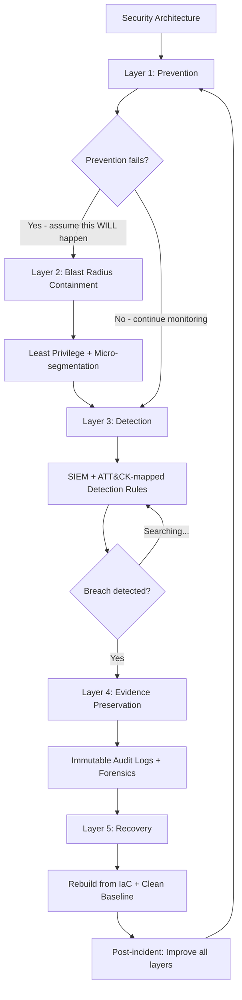

⚡ TL;DR - Assume-breach reasoning is a security design philosophy that starts from the premise:
"A determined attacker WILL compromise at least one component of our system. Given that, how do we
design the system so that a breach of one component does not lead to catastrophic loss of the whole system?"
The shift: from "prevent all breaches" (prevention-only model, proven to fail) to "prevent all
breaches AND limit the damage when prevention fails" (prevention + resilience model). Five
design imperatives of assume-breach reasoning: (1) MINIMIZE BLAST RADIUS: compartmentalize so a
compromised component cannot reach unrelated resources. If the image processor is compromised:
it should not be able to reach the payment database. If an employee's workstation is compromised:
they should not be able to move laterally to all servers. (2) MAXIMIZE DETECTION: if prevention fails,
detect the breach quickly. Time-to-detect is the most important metric after a breach. Average breach
dwell time (2023): 197 days. 197 days before the organization knows the attacker is inside.
In those 197 days: the attacker maps the network, escalates privileges, exfiltrates data, implants
persistence mechanisms. Every day of undetected dwell time: more damage. (3) MINIMIZE DWELL TIME:
design systems so that persistent access is hard. Credential rotation, ephemeral credentials,
frequent re-authentication. An attacker who compromised a credential that rotates every 1 hour:
has 1 hour of access (if they succeed before rotation). An attacker who compromised a credential
with no expiry: has indefinite access. (4) PRESERVE EVIDENCE: ensure that attack activity is logged
in a way that cannot be tampered with by the attacker. If the attacker can delete logs: the
organization cannot determine what happened, cannot prove the breach scope to regulators, cannot
improve defenses. Immutable audit logging: a requirement, not an option. (5) ENABLE RECOVERY:
design for rapid recovery. If a component is confirmed compromised: it can be rebuilt from
a known-good baseline in minutes (container image, IaC, golden AMI), not days (manual rebuild).

---

| #142 | Category: Security | Difficulty: ★★★★★ |
|:---|:---|:---|
| **Depends on:** | Full SEC library (SEC-001 through SEC-141) | |
| **Used by:** | SEC-143, SEC-144 | |
| **Related:** | Full SEC library | |

---

### 🔥 The Problem This Solves

**THE "PREVENT ALL BREACHES" FALLACY:**

```
CASE STUDY: PERIMETER-ONLY DEFENSE MODEL

  Organization's security strategy (common pre-2015 model):
  - Strong perimeter (next-gen firewall, IDS/IPS, email filtering)
  - VPN for remote access (trusted network when connected)
  - Annual penetration tests
  - Antivirus on workstations
  - "Our perimeter is strong. Attackers can't get in."
  
  ATTACKER'S APPROACH:
  
  Day 1:
  - Spear phishing email to employee (HR team member).
    Subject: "Job Application - Resume Attached"
    Attachment: malicious PDF exploiting Acrobat vulnerability (0-day).
    Employee: opens the PDF. JavaScript executes. Cobalt Strike beacon implanted.
    Detection: NONE. Email filter: passed (the PDF looked legitimate). AV: no signature.
  
  Day 2-7:
  - Beacon: calls out to attacker's C2 (command and control) server via HTTPS.
    HTTPS to known-good domain (attacker's C2 uses domain fronting via CDN).
    Outbound HTTPS: allowed (employees need internet access).
    Detection: NONE. The C2 traffic: looks like normal web browsing.
  
  Day 8-30:
  - Attacker: dumps credentials from the HR workstation (Mimikatz).
    Gets NTLM hashes. Cracks weak password. Gets the HR user's AD credentials.
  - Uses HR credentials: accesses Active Directory. Maps all users, groups, hosts.
    Active Directory: no restrictions on which users can enumerate the directory.
    Detection: NONE. This is normal AD usage.
  - Moves laterally: uses PsExec with the HR credentials to log into a developer workstation.
    Developer: member of the local admin group on all developer machines (common policy).
    Detection: NONE. This looked like a legitimate admin login.
  - On developer workstation: finds hardcoded database credentials in a `.env` file.
    Database credentials: for the production customer database.
    Detection: NONE.
  
  Day 31:
  - Attacker: dumps the entire customer database. 2.5 million customer records.
    Exfiltrated over HTTPS (encrypted, looks like web traffic).
    Detection: NONE.
  - Data: appears on a dark web forum 3 months later.
    Organization: first learns of the breach when a researcher finds the forum post.
    BREACH DETECTION: Day 121.
  
  WHAT WENT WRONG:
  Every perimeter control: bypassed by a legitimate-looking attack vector.
  The phishing email: not detected. The C2 traffic: not detected.
  The lateral movement: not detected. The data exfiltration: not detected.
  
  The security model: "Our perimeter is strong. Attackers can't get in."
  Reality: attackers got in on Day 1. 120 days of undetected dwell time.
  
  ASSUME-BREACH DESIGN WOULD HAVE:
  
  1. WORKSTATION ISOLATION:
     HR workstation: can only reach HR-specific services. Not developer machines.
     The lateral move from HR → Developer workstation: blocked by network segmentation.
     Even with valid HR credentials: developers' machines are on a different network segment.
     HR workstation: has no route to developer machines.
  
  2. JUST-IN-TIME CREDENTIALS:
     The `.env` file: should not exist. Database credentials:
     obtained via Vault at runtime, expire after 1 hour, rotated automatically.
     Hardcoded credentials in files: policy violation, detected by secret scanning in CI/CD.
  
  3. ANOMALY DETECTION:
     HR workstation: runs AD enumeration queries (unusual for HR).
     SIEM rule: alert when non-admin accounts run large AD enumeration queries.
     Detection: Day 8-30 (lateral movement phase), not Day 121.
  
  4. DATABASE EGRESS CONTROLS:
     Database server: has no outbound internet access (no route to external IPs).
     Data exfiltration via HTTPS from the database network: impossible.
     Attacker must route exfiltration through an application server (additional barrier).
  
  5. IMMUTABLE AUDIT LOGS:
     All database queries: logged to an immutable log (AWS CloudTrail + CloudWatch Logs
     with write-once policy). Attacker cannot delete logs.
     Even if attacker knew about the logs: cannot cover tracks.
     Forensics: complete record of all data accessed.
```

---

### 📘 Textbook Definition

**Assume-Breach (also: "Assume Compromise"):** A security design philosophy and operational
posture that treats as given: that a determined attacker will successfully breach at least one
component of the system at some point. Rather than relying solely on prevention controls to
stop all attacks, assume-breach design focuses on: (1) limiting the damage after a breach
occurs (blast radius minimization), (2) detecting the breach quickly (detection engineering),
(3) limiting the time the attacker can operate (dwell time reduction), (4) preserving evidence
(immutable logging), and (5) enabling rapid recovery. Formally codified in: Microsoft's Security
Development Lifecycle (SDL), Zero Trust Architecture (NIST SP 800-207), and the MITRE ATT&CK framework.

**Blast Radius:** The extent of the damage an attacker can cause after compromising a single
component. A large blast radius: a single compromised service can reach many other services,
databases, and resources. A small blast radius: a compromised service can only access the specific
resources it legitimately needs (least privilege). Blast radius reduction: the primary design
goal of assume-breach architecture.

**Dwell Time:** The time between when an attacker first successfully compromises a system and when
the breach is detected. Shorter dwell time: less damage. IBM's Cost of a Data Breach Report (2023):
average breach dwell time is 197 days. Each day of dwell time: an order of magnitude more damage
potential than the day before (more data exfiltrated, more persistence mechanisms planted, more
systems reached). Assume-breach design: minimize dwell time through detection engineering and
credential expiry.

**Lateral Movement:** An attacker's progression from an initial foothold (one compromised component)
to other components in the system. Using the compromised component's credentials, trust relationships,
or network access to reach additional resources. Assume-breach design: network segmentation, least
privilege, and mTLS to limit lateral movement.

**Detection Engineering:** The systematic design of security monitoring to detect specific attacker
behaviors. Based on: the MITRE ATT&CK framework (a comprehensive taxonomy of attacker tactics and
techniques), detection rules are written for specific techniques that appear in the attack kill chain.
Assume-breach design: instrumentation for detection is a first-class requirement, not an afterthought.

**Ephemeral Credentials:** Credentials (passwords, API keys, tokens) that expire after a short
time (minutes to hours). In contrast to long-lived credentials (passwords that never expire, API
keys with no expiry). Ephemeral credentials: limit the window of attacker access after a credential
is compromised. An attacker who steals an ephemeral credential valid for 15 minutes: must use it
within 15 minutes before it expires. An attacker who steals a credential with no expiry: has
indefinite access.

---

### ⏱️ Understand It in 30 Seconds

**One line:**
Assume-breach reasoning accepts that some attacks will succeed and designs systems to minimize
blast radius, detect breaches quickly, limit dwell time, preserve evidence, and enable rapid
recovery - rather than betting everything on prevention.

**One analogy:**
> Assume-breach is the "defense-in-depth insurance policy."
>
> A bank: wants to prevent all robberies. But it ALSO designs for "what if prevention fails?"
> Multiple safes, time-lock mechanisms, dye packs, silent alarms, CCTV, GPS trackers in bills.
> Not because the bank expects to be robbed. But because the cost of being unprepared for a robbery
> (losing everything) is so much higher than the cost of preparing for it (a few extra controls).
>
> "Prevention only" bank: no fallback if the front door lock is defeated.
> "Assume breach" bank: even if the attacker gets through the front door,
> the vault has a separate time lock (30 minutes), the safe requires a second key,
> the bills have GPS trackers, the CCTV has already captured the attacker's face,
> and law enforcement is already en route.
>
> The attacker got in. But the damage: limited. The detection: fast.
> The recovery: in hours, not weeks.
>
> In software:
> Prevention only: "Our firewall will stop the attacker."
> Assume breach: "Even if the attacker gets past the firewall:
> each service can only reach the resources it needs (blast radius: small),
> anomaly detection: fires within hours of the breach (detection: fast),
> credentials expire every hour (dwell time: limited),
> audit logs are immutable (evidence: preserved),
> infrastructure is defined as code (recovery: hours, not days)."
>
> The attacker got in. And found: a system designed for exactly this scenario.

---

### 🔩 First Principles Explanation

**Five design imperatives with worked examples:**

```
IMPERATIVE 1: MINIMIZE BLAST RADIUS

  PRINCIPLE: A compromised component can access ONLY the resources it legitimately needs.
  No component has access to resources outside its specific domain.
  
  BAD (large blast radius):
  - API service: connects to BOTH the user database AND the payment database.
    (Single shared database connection credentials.)
  - File service: has read/write access to ALL S3 buckets.
  - Background worker: has IAM role with "AdministratorAccess" policy.
  
  CORRECT (minimal blast radius):
  - API service: reads/writes ONLY the users table in the user database.
    Separate service account with ONLY SELECT + INSERT + UPDATE on users table.
  - File service: has access to ONE specific S3 bucket (file-service-uploads-bucket).
    Policy: s3:PutObject on arn:aws:s3:::file-service-uploads-bucket/* ONLY.
  - Background worker: has minimal IAM permissions for exactly the resources it processes.
    Policy: defined with the least-privilege principle. Reviewed quarterly.
  
  BLAST RADIUS ANALYSIS:
  BAD: compromise the API service → access the payment database → exfiltrate all payments.
  CORRECT: compromise the API service → can only access the users table. No payment data visible.
  
  Network-level blast radius control:
  Production private subnets: segmented by service.
  Security groups: restrict which services can communicate.
  API service security group: ONLY allows inbound from the load balancer.
    ONLY allows outbound to the users database (port 5432) and the user cache (port 6379).
  Cannot: reach the payment database (different security group, no rule allowing API service).

IMPERATIVE 2: MAXIMIZE DETECTION (DETECTION ENGINEERING)

  DETECTION MODEL: MITRE ATT&CK framework → detection rules.
  
  EXAMPLE: Detecting "Credential Dumping" (MITRE ATT&CK T1003)
  
  Attack technique: an attacker on a compromised Windows host runs Mimikatz to dump
  credentials from LSASS process memory.
  
  Detection rule (simplified):
  - Alert on: process access to LSASS (lsass.exe) from non-OS processes.
  - Alert on: execution of known credential dumping tool hashes (Mimikatz signatures).
  - Alert on: sudden spike in NTLM authentication failures (attacker testing dumped credentials).
  
  EXAMPLE: Detecting "Lateral Movement via PsExec" (MITRE ATT&CK T1021.002)
  
  Attack technique: an attacker uses PsExec or similar remote execution to move
  from the initially compromised host to other hosts on the internal network.
  
  Detection rule:
  - Alert on: creation of PSEXESVC service on a remote host from a workstation.
  - Alert on: user account logging into multiple hosts in a short time window.
    (A compromised credential: used to move laterally often shows multiple simultaneous logins.)
  - Alert on: successful logins from workstations to servers outside business hours.
  
  EXAMPLE: Detecting "Unusual Data Volume Exfiltration" (MITRE ATT&CK T1041)
  
  Attack technique: the attacker, having found the target data, exfiltrates it
  via HTTPS to an external server.
  
  Detection rule:
  - Baseline: average data uploaded per day from the database server: ~100MB.
  - Alert on: data transfer from database subnet > 1GB in 1 hour (10x baseline).
  - Alert on: database server making outbound connections to external IPs (should NEVER happen
    if egress is properly controlled - this should be blocked AND alerted).
  
  ASSUME-BREACH DETECTION PHILOSOPHY:
  - Alert on BEHAVIORS (what an attacker does), not just signatures (known malware).
  - A 0-day or novel attack: no known signature. But: attackers must still move laterally,
    dump credentials, and exfiltrate data. These behaviors: detectable regardless of the
    attack vector.
  - The MITRE ATT&CK framework: 14 tactic categories, 200+ techniques.
    Detection rules: written to cover the most critical techniques for the specific environment.

IMPERATIVE 3: MINIMIZE DWELL TIME VIA EPHEMERAL CREDENTIALS

  COMPARISON:
  
  LONG-LIVED CREDENTIALS (bad for assume-breach):
  Database password: "correct-horse-battery-staple" - set during deployment. Never rotated.
  API key: "sk-prod-1234567890abcdef" - in the .env file. 2 years old.
  Service account JWT: no expiry (exp: none). Issued at service creation.
  
  ATTACKER SCENARIO:
  Attacker compromises a CI/CD pipeline. Extracts the .env file (secret scanning was disabled).
  Gets: database password + API key + JWT.
  Dwell window: INDEFINITE. These credentials never expire.
  Attacker: connects to the database from their own machine. 2 weeks after the compromise.
  
  EPHEMERAL CREDENTIALS (correct for assume-breach):
  Database credentials: generated by Vault at container startup. Valid for 1 hour.
    Vault renews automatically while the container is healthy.
    When the container is killed: credentials are revoked immediately.
  API key: short-lived (1 hour), obtained from the secrets manager at runtime.
    Not stored in .env files. Not in source control.
  Service-to-service JWT: 15-minute lifetime. Automatically renewed by the service.
    Refreshed before expiry. If not renewed (service is down): the JWT expires and is useless.
  
  ATTACKER SCENARIO (with ephemeral credentials):
  Attacker compromises a CI/CD pipeline. Extracts the runtime secrets.
  Gets: database credentials valid for 1 more hour, API key valid for 30 more minutes.
  Dwell window: maximum 1 hour before both credentials expire.
  Within 1 hour: the attacker must use the credentials AND exfiltrate the data.
  If detection fires within the hour (anomaly: unusual CI/CD access pattern):
  credentials can be revoked immediately. Dwell time: minutes.

IMPERATIVE 4: PRESERVE EVIDENCE (IMMUTABLE AUDIT LOGGING)

  CHALLENGE:
  An attacker who knows they're being detected: will attempt to cover their tracks.
  "shred -u /var/log/auth.log" - deletes auth logs on Linux.
  "Clear-EventLog -LogName Security" - clears Windows security event log.
  "aws cloudtrail delete-trail" - if the attacker has IAM permissions.
  
  ASSUME-BREACH LOG ARCHITECTURE:
  
  Logs: streamed to a SEPARATE, WRITE-ONLY account (AWS CloudTrail + S3 + Object Lock).
  Object Lock: S3 objects cannot be deleted or overwritten for the lock period (365 days).
  Even if: an attacker compromises the production AWS account and has full Administrator access,
  they cannot delete logs in the separate security account (different account, no cross-account delete).
  
  For on-premise: rsyslog to a hardened, network-isolated log server.
  The compromised server: can send logs TO the log server.
  Cannot: connect back to the log server to delete them (one-way network rule).
  
  Critical logs to preserve:
  - Authentication events (all login attempts, successes, failures)
  - Authorization events (access denials and grants for sensitive resources)
  - Data access events (especially for PII/PCI-scoped databases)
  - Administrative actions (configuration changes, user creation/deletion, privilege changes)
  - Network flow logs (for lateral movement reconstruction)

IMPERATIVE 5: ENABLE RAPID RECOVERY

  BASELINE: Infrastructure as Code + immutable deployments.
  
  BAD (slow recovery):
  Production server: configured manually over 2 years by 3 different engineers.
  No documentation. Configuration: in the engineer's head.
  If compromised: "rebuild from scratch" takes 2-3 days.
  During which: the service is down (revenue impact) or running the compromised version.
  
  CORRECT (rapid recovery):
  All infrastructure: defined in Terraform + Ansible + Docker.
  Container image: built from a known-good base image in a pipeline with verified build inputs.
  
  RECOVERY SCENARIO:
  Service compromise detected (Day 1, 14:32):
  14:32 - Alert fires: unusual database access pattern from service X.
  14:40 - On-call engineer: confirms compromise. Kills all instances of service X (kubectl scale).
  14:42 - All instances terminated. Credentials revoked (Vault revoke-prefix /secret/service-x).
  14:50 - Forensics: snapshot taken of the last running container image for analysis.
  15:00 - Rebuild: CI/CD pipeline triggered. Builds a new container image from the known-good
          source code at the last verified commit (before the compromise vector was introduced).
  15:30 - New container: deployed. New credentials: issued.
  15:45 - Service: operational. Recovery time: 1 hour 13 minutes.
  
  Key enablers:
  - Container images: rebuilt from source on every deployment. Not patched in place.
  - Credentials: short-lived (Vault). New credentials on startup: automatic.
  - IaC: environment rebuilt from code, not manual steps. Deterministic.
  - Incident runbook: pre-written. Engineer knows exactly what to do. No guessing.
```

---

### 🧪 Thought Experiment

**SCENARIO: Applying assume-breach reasoning to a healthcare API:**

```
CONTEXT:
  - Healthcare API storing PHI (Protected Health Information)
  - HIPAA compliance required
  - Breach notification required within 60 days of discovery
  
ASSUME-BREACH DESIGN REVIEW:

  QUESTION 1: "If our API server is compromised, what can the attacker reach?"
  
  CURRENT DESIGN: API server has a database connection string for the PHI database.
  ASSUME-BREACH ANALYSIS: All PHI accessible. Catastrophic. HIPAA violation.
  
  REDESIGN: API server has credentials only for the specific stored procedures it calls.
  Row-level security: each query automatically restricted to the authenticated user's patient records.
  The API server: cannot do a full table scan. Cannot SELECT *.
  A compromised API server: can access only the records it would have accessed legitimately.
  
  QUESTION 2: "If our database administrator's workstation is compromised, what can the attacker do?"
  
  CURRENT DESIGN: DBA workstation has direct access to production database.
  ASSUME-BREACH ANALYSIS: Full PHI database accessible from the DBA's laptop. Catastrophic.
  
  REDESIGN: Privileged Access Workstation (PAW) for DBA. 
  PAW: network-isolated. Separate VM. Only accessible from corporate VPN with MFA + device cert.
  All DBA sessions: recorded (session recording via a bastion host). 
  Production database: accessible ONLY from the PAW's IP. Not from the DBA's regular workstation.
  Just-In-Time (JIT) access: DBA requests access, access granted for 4 hours, then auto-revoked.
  
  QUESTION 3: "If an attacker is inside our network for 30 days undetected, what would we see in logs?"
  
  CURRENT DESIGN: Application logs to local disk.
  ASSUME-BREACH ANALYSIS: attacker deletes logs on compromised hosts. No evidence trail.
  
  REDESIGN:
  - All application and system logs: streamed in real-time to an immutable log aggregator.
  - Log aggregator: in a separate network segment. Application hosts cannot DELETE logs.
    Only WRITE.
  - SIEM correlation rules: fire on behavioral anomalies within hours, not 197 days.
  - Backup: logs exported to WORM storage (AWS S3 Object Lock, compliance mode, 7-year retention).
  
  QUESTION 4: "What is our evidence if HIPAA asks what was accessed during a breach?"
  
  CURRENT DESIGN: No database-level query logging.
  ASSUME-BREACH ANALYSIS: cannot determine what PHI was accessed. HIPAA violation.
  
  REDESIGN:
  - PostgreSQL audit logging: every SELECT on PHI tables logged with the user, timestamp, query.
  - Logs: immutable. Retained for 7 years (HIPAA safe harbor period).
  - Breach scope determination: query the audit logs to find all records accessed
    by the attacker's session. Notify only the affected patients.
  
  QUESTION 5: "How long would it take to rebuild this system after a confirmed compromise?"
  
  CURRENT DESIGN: manual server configuration. Estimated rebuild: 3-5 days.
  ASSUME-BREACH ANALYSIS: 3-5 days of downtime or operating a potentially compromised system.
  
  REDESIGN:
  - All infrastructure: Terraform + Kubernetes.
  - All application images: rebuilt from source in CI/CD.
  - Recovery test: quarterly, simulate a full environment teardown and rebuild.
    Target: < 2 hours from "declare compromise" to "fully operational from clean baseline."
    Measured and tracked.
```

---

### 🧠 Mental Model / Analogy

> Assume-breach is "disaster recovery thinking, applied to security."
>
> Business continuity planning: "What if our data center floods? How do we recover?"
> The answer: NOT "our data center is flood-proof, we don't plan for floods."
> The answer: "Our data center has redundancy. Our data: replicated to a different region.
> Our recovery: tested quarterly. If the data center floods: we're operational in 2 hours."
>
> Prevention (flood-proofing): important. But NOT the only strategy.
> Recovery capability: equally important.
> Detection (flood sensors): equally important.
> Evidence preservation (backed-up data): equally important.
>
> Assume-breach: apply the same thinking to security events.
> "What if our authentication service is compromised? How do we recover?"
> NOT: "Our authentication service is behind a firewall. We don't plan for compromise."
> "Our authentication service has short-lived credentials (rotation: 1 hour).
> If compromised: all credentials revoked within 1 hour. Service rebuilt from IaC in 30 minutes.
> Detection: anomaly alerts fire within 15 minutes of unusual behavior.
> Evidence: all auth events logged to immutable storage."
>
> The operational playbook for a security incident:
> Same structure as a disaster recovery playbook.
> Step 1: Detect. Step 2: Contain (limit blast radius). Step 3: Eradicate (remove the attacker).
> Step 4: Recover (rebuild from clean baseline). Step 5: Learn (improve controls).
>
> Organizations with disaster recovery plans but no security incident response playbooks:
> have a blind spot. The floods they planned for: might never happen.
> The security breach they didn't plan for: will happen.
>
> Assume-breach: the disaster recovery plan for the security event you haven't had yet.
> The question is not IF. The question is: when it happens, are you ready?

---

### 📶 Gradual Depth - Five Levels

**Level 1 - What it is (anyone can understand):**
Assume-breach means: "We accept that attackers will get in sometimes, so we design the system so that getting in doesn't mean losing everything." A bank doesn't design ONLY the lock on the front door. It also has: a safe inside (blast radius), CCTV (detection), a silent alarm (alert), time-lock mechanisms (dwell time), and police response (recovery). Software assume-breach: even if an attacker gets past your firewall, they can only reach the one service they compromised (blast radius), you detect them quickly (detection), their access expires soon (dwell time), you have records of what they did (evidence), and you can rebuild the service in 30 minutes (recovery).

**Level 2 - How to use it (junior developer):**
Practical assume-breach checklist for a developer: (1) Least privilege: does this service have access to resources it doesn't use? If yes: reduce the permissions. (2) Credential expiry: do the credentials this service uses expire? If they never expire, they create an indefinite access window for an attacker. (3) Logging: does the service log all sensitive actions (data access, authentication, state changes)? Are logs sent off the host to a separate system? (4) Hardcoded secrets: are there any credentials in the source code, .env files, or config files that an attacker who reads the code could use? (Detect: run `git grep -r "password\|secret\|api_key"`. Prevent: use a secrets manager.) (5) Blast radius: if this service is compromised, what can the attacker access? Document it. If the answer is "everything": the blast radius is too large.

**Level 3 - How it works (mid-level engineer):**
Assume-breach operations: the SIEM + detection rules pipeline. Log collection: all services log structured events (JSON with timestamp, service_name, event_type, user_id, tenant_id, resource_id, action, outcome). Logs: shipped to a SIEM (Splunk, Elastic SIEM, AWS Security Hub). Detection rules: correlated across log sources. Example rule: "If the same user_id appears in BOTH a failed MFA event AND a successful login event from a DIFFERENT IP within 5 minutes, alert: possible ATO (Account Takeover)." This rule: fires on MFA bypass + password compromise + login from the attacker's IP. Multiple log sources combined: reveals the attack pattern that no single log source would reveal. The MITRE ATT&CK framework: provides a taxonomy of attacker techniques. Each technique: has recommended detection methods. Map your SIEM rules to ATT&CK techniques. "How many of the 200+ ATT&CK techniques can our detection rules catch?" The coverage gap: your detection blind spots.

**Level 4 - Why it was designed this way (senior/staff):**
Assume-breach and the kill chain model: Lockheed Martin Cyber Kill Chain (2011) models the stages of a cyber attack: Reconnaissance → Weaponization → Delivery → Exploitation → Installation → Command & Control → Actions on Objectives. Assume-breach design: places controls at EVERY stage of the kill chain, not just at Delivery (the perimeter). Prevention controls: focused on Reconnaissance to Delivery. Assume-breach controls: focused on Exploitation onward. The key insight: the further into the kill chain an attacker progresses before being detected, the more damage they cause. Stop them at Exploitation: little or no data exposed. Detect at Actions on Objectives: data may already be exfiltrated. Every stage has specific detection signals. Exploitation: host-level anomalies (process injection, unusual file access). Installation: persistence mechanism creation (new startup entry, cron job, service). C2: unusual outbound connections (to new IPs, at odd times, with unusual protocols). Actions on Objectives: database query spikes, large data transfers, credential access. The kill chain model: maps the attack stages to detection opportunities. Assume-breach: maximizes detection coverage across all stages.

**Level 5 - Mastery (distinguished engineer):**
Assume-breach at the economic level: the cost-benefit analysis of security controls. The attacker: has a budget (time, money, tools, skill). Every control the defender adds: increases the attacker's cost. When the attacker's cost exceeds the value of the target: they move on. This is the "raising the cost" security model. Assume-breach: focused on the correct cost-raising controls. Prevention-only (raise the cost of initial access): important, but has diminishing returns. A sufficiently well-funded attacker (nation-state, organized crime) WILL get initial access. The marginal cost of preventing the 10th way to get initial access: very high. The value: limited (the attacker uses the 11th way). Blast radius reduction: raises the cost of achieving the attack objective AFTER initial access. The attacker who gets initial access: must now work much harder to reach the target data. Each segmentation boundary: a new cost. Each least-privilege restriction: a new obstacle. The marginal cost of blast radius reduction: low (IAM policy changes, network ACLs). The value: high (the attacker must compromise 5 separate services with 5 separate credential chains, not 1 service with access to everything). Detection: raises the cost of remaining undetected. Each additional detection rule: forces the attacker to use noisier, slower techniques to avoid triggering it. Or: get out faster. Shorter attacker dwell time → less damage. The economic model: allocate security investment where the marginal cost-raising value is highest. Often: blast radius reduction and detection engineering. Not: the 10th layer of perimeter defense.

---

### ⚙️ How It Works (Mechanism)

```
ASSUME-BREACH SECURITY ARCHITECTURE LAYERS:

  LAYER 1: PREVENTION (stop most attacks)
  ┌────────────────────────────────────────┐
  │ WAF, Firewall, Patch Management,       │
  │ MFA, Strong Authentication, EDR,       │
  │ Email Security, Vulnerability Scanning │
  └────────────────────────────────────────┘
  WHEN PREVENTION FAILS (assume this will happen):
  ↓
  LAYER 2: BLAST RADIUS CONTAINMENT
  ┌────────────────────────────────────────┐
  │ Network segmentation (micro-seg)       │
  │ Least privilege (IAM, DB, API)         │
  │ Service isolation (containers)         │
  │ Ephemeral credentials (Vault)          │
  │ Zero trust (mTLS, no implicit trust)   │
  └────────────────────────────────────────┘
  ↓
  LAYER 3: DETECTION
  ┌────────────────────────────────────────┐
  │ SIEM + detection rules (ATT&CK-mapped) │
  │ Behavioral analytics (UBA)             │
  │ Network flow analysis                  │
  │ Honeytokens + honeypots                │
  └────────────────────────────────────────┘
  ↓
  LAYER 4: EVIDENCE PRESERVATION
  ┌────────────────────────────────────────┐
  │ Immutable audit logs (WORM)            │
  │ Separate log account                   │
  │ Network flow logs                      │
  │ Host forensics capability              │
  └────────────────────────────────────────┘
  ↓
  LAYER 5: RECOVERY
  ┌────────────────────────────────────────┐
  │ IaC (Terraform, Ansible)               │
  │ Immutable container images             │
  │ Incident response playbooks            │
  │ Quarterly recovery drills              │
  └────────────────────────────────────────┘
```



---

### 💻 Code Example

**Implementing assume-breach principles in a service: blast radius + detection + ephemeral creds:**

```python
# assume_breach_service.py
# Demonstrates assume-breach design patterns:
# 1. Minimal blast radius via least-privilege DB access
# 2. Ephemeral credentials from Vault
# 3. Structured audit logging for detection engineering
# 4. Honeytoken: detects unauthorized access to sensitive data

import os
import json
import logging
import hashlib
import time
from datetime import datetime, timezone
from typing import Optional
import hvac  # HashiCorp Vault client

# ============================================================
# STRUCTURED AUDIT LOGGER (detection engineering)
# ============================================================

# BAD: logging to local disk only
# logging.basicConfig(filename="/var/log/app.log", ...)
# An attacker who compromises the host: deletes this file. Evidence lost.
# GOOD: structured JSON logging to stdout → shipped to immutable SIEM by the container runtime.

def setup_audit_logger() -> logging.Logger:
    """
    Audit logger: structured JSON to stdout.
    Container runtime (Docker, Kubernetes): ships stdout to the centralized log aggregator.
    The application: has no direct access to modify logs after they're shipped.
    Immutability: enforced at the log aggregator level (AWS CloudWatch + S3 Object Lock).
    """
    logger = logging.getLogger("audit")
    logger.setLevel(logging.INFO)
    handler = logging.StreamHandler()
    
    class JSONFormatter(logging.Formatter):
        def format(self, record):
            return json.dumps({
                "timestamp": datetime.now(timezone.utc).isoformat(),
                "level": record.levelname,
                "service": "patient-api",
                "event_type": getattr(record, "event_type", "unknown"),
                "user_id": getattr(record, "user_id", None),
                "patient_id": getattr(record, "patient_id", None),
                "tenant_id": getattr(record, "tenant_id", None),
                "action": getattr(record, "action", None),
                "outcome": getattr(record, "outcome", None),
                "message": record.getMessage(),
                # Include source IP, request ID for correlation
                "request_id": getattr(record, "request_id", None),
                "source_ip": getattr(record, "source_ip", None)
            })
    
    handler.setFormatter(JSONFormatter())
    logger.addHandler(handler)
    return logger


audit_log = setup_audit_logger()


def log_data_access(
    user_id: str, tenant_id: str, patient_id: str,
    action: str, outcome: str, request_id: str = None
):
    """
    Log every access to patient data (PHI).
    
    This log: enables HIPAA breach notification.
    After a breach: query these logs to determine EXACTLY which patient records
    were accessed by the attacker's session. Notify only affected patients.
    
    Without this log: must notify ALL patients (worst case). With this log: notify only affected.
    """
    audit_log.info(
        f"PHI access: {action} on patient {patient_id}",
        extra={
            "event_type": "phi_access",
            "user_id": user_id,
            "patient_id": patient_id,
            "tenant_id": tenant_id,
            "action": action,
            "outcome": outcome,
            "request_id": request_id
        }
    )


# ============================================================
# EPHEMERAL CREDENTIALS VIA VAULT (dwell time reduction)
# ============================================================

class EphemeralDatabaseCredentials:
    """
    Obtains short-lived database credentials from HashiCorp Vault.
    
    Contrast with: hardcoded credentials in .env files.
    
    Vault dynamic secrets: Vault creates a temporary database user with a short TTL.
    When the TTL expires: Vault revokes the user automatically.
    If the service is compromised: the attacker's window is at most 1 lease_duration (e.g., 1 hour).
    When the compromise is detected: revoke the credential immediately via Vault.
    
    Hardcoded credentials: compromised → attacker has indefinite access.
    Vault credentials: compromised → attacker has at most 1 hour. Revocation: immediate.
    """
    
    def __init__(self, vault_addr: str, vault_role: str):
        self.vault_addr = vault_addr
        self.vault_role = vault_role
        self._client = None
        self._lease_id = None
        self._credentials = None
        self._lease_expires_at = 0
    
    def _get_vault_client(self) -> hvac.Client:
        """Connect to Vault using Kubernetes service account token (in production)."""
        if self._client is None:
            # In Kubernetes: use the service account token for Vault authentication.
            # The pod's service account: has only the specific Vault role it needs.
            # Not a human's token. Not a root token.
            sa_token_path = "/var/run/secrets/kubernetes.io/serviceaccount/token"
            with open(sa_token_path) as f:
                sa_token = f.read()
            
            self._client = hvac.Client(url=self.vault_addr)
            self._client.auth.kubernetes.login(
                role=self.vault_role,
                jwt=sa_token
            )
        return self._client
    
    def get_credentials(self) -> dict:
        """
        Get current credentials. Renew if within 5 minutes of expiry.
        The application: always uses fresh credentials. No stale credentials persist.
        """
        now = time.time()
        if self._credentials is None or now > (self._lease_expires_at - 300):
            self._renew_credentials()
        return self._credentials
    
    def _renew_credentials(self):
        client = self._get_vault_client()
        # Vault database secrets engine: creates a temporary user in PostgreSQL.
        # Role "patient-api-readonly": configured in Vault to allow SELECT on patient tables only.
        # TTL: 3600 seconds (1 hour). Vault renews automatically while the lease is renewed.
        result = client.secrets.database.generate_credentials(
            name=self.vault_role
        )
        self._credentials = {
            "username": result["data"]["username"],
            "password": result["data"]["password"]
        }
        self._lease_id = result["lease_id"]
        lease_duration = result["lease_duration"]
        self._lease_expires_at = time.time() + lease_duration
        
        audit_log.info(
            "Database credentials renewed",
            extra={
                "event_type": "credential_renewal",
                "vault_role": self.vault_role,
                "lease_duration_seconds": lease_duration,
                "action": "renew",
                "outcome": "success"
            }
        )
    
    def revoke(self):
        """
        Immediately revoke credentials (call during shutdown or incident response).
        Incident: "Service X is compromised" → call revoke() → attacker's credentials: dead.
        """
        if self._client and self._lease_id:
            self._client.sys.revoke_lease(lease_id=self._lease_id)
            audit_log.info(
                "Database credentials revoked",
                extra={
                    "event_type": "credential_revocation",
                    "action": "revoke",
                    "outcome": "success"
                }
            )


# ============================================================
# HONEYTOKEN DETECTION (detect unauthorized data access)
# ============================================================

# A "honeytoken" is a piece of data that should never be accessed in normal operation.
# Any access to the honeytoken: an indicator of an attacker probing the system.
# Similar to: canary tokens (web beacons), honeypots (fake network resources).

HONEYTOKEN_PATIENT_ID = "HONEY-PATIENT-0000"  # A patient ID that doesn't exist for real patients.
# If ANY query for this patient ID appears in the audit logs:
# it's either a security researcher, a penetration test, OR an attacker probing the system.
# Alert: fire immediately when this patient ID is queried.

def check_honeytoken(patient_id: str, user_id: str, request_id: str):
    """
    Alert if a honeytoken resource is accessed.
    Normal users: never access patient HONEY-PATIENT-0000 (it's not a real patient).
    Attacker probing: likely to enumerate patient IDs sequentially and hit it.
    """
    if patient_id == HONEYTOKEN_PATIENT_ID:
        # This is a HIGH SEVERITY security event.
        # Alert immediately. Do not just log.
        audit_log.warning(
            "HONEYTOKEN ACCESSED - possible unauthorized probe or attacker",
            extra={
                "event_type": "honeytoken_triggered",
                "user_id": user_id,
                "patient_id": patient_id,
                "request_id": request_id,
                "action": "read",
                "outcome": "alert"
            }
        )
        # send_pagerduty_alert(severity="critical", message=f"Honeytoken accessed by {user_id}")


def get_patient_data(
    patient_id: str,
    user_id: str,
    tenant_id: str,
    db_creds: EphemeralDatabaseCredentials,
    request_id: str = None
) -> Optional[dict]:
    """
    Fetch patient data. Demonstrates:
    - Honeytoken detection
    - Audit logging (phi_access event for every access)
    - Ephemeral credentials (blast radius: one patient's data per call, credentials expire in 1hr)
    - Tenant boundary enforcement (query scoped to tenant_id)
    """
    check_honeytoken(patient_id, user_id, request_id)
    
    creds = db_creds.get_credentials()
    
    # In production: use the credentials to establish a PostgreSQL connection.
    # Query: parameterized, scoped to tenant_id (prevents IDOR).
    # The service account (from Vault role): has SELECT only on patient columns it needs.
    # Not: SELECT * on all tables. Not: INSERT, UPDATE, DELETE (read-only role).
    # cursor.execute(
    #     "SELECT patient_id, name, dob, diagnosis FROM patients "
    #     "WHERE patient_id = %s AND tenant_id = %s",
    #     (patient_id, tenant_id)
    # )
    # row = cursor.fetchone()
    
    row = None  # Placeholder for the DB call
    
    if row:
        log_data_access(
            user_id=user_id, tenant_id=tenant_id,
            patient_id=patient_id, action="read", outcome="success",
            request_id=request_id
        )
        return {"patient_id": row[0], "name": row[1]}
    else:
        log_data_access(
            user_id=user_id, tenant_id=tenant_id,
            patient_id=patient_id, action="read", outcome="not_found",
            request_id=request_id
        )
        return None
```

---

### ⚖️ Comparison Table

| Security Posture | Detection Capability | Blast Radius | Dwell Time | Recovery Time | Coverage |
|:---|:---|:---|:---|:---|:---|
| **Prevention only** | Low (detects known signatures) | Large (flat network) | Long (197 days avg) | Days to weeks | External attacks only |
| **Detection focus** | High (behavioral detection) | Large | Short (hours to days) | Days | Internal + external |
| **Zero Trust** | Medium | Small (per-service access) | Medium | Days | Internal + external |
| **Assume-Breach (all 5 imperatives)** | High | Small | Short | Hours | Internal + external + insider + supply chain |

---

### ⚠️ Common Misconceptions

| Misconception | Reality |
|:---|:---|
| "Assume-breach means accepting that we'll be breached. We're giving up on prevention." | Assume-breach does NOT mean abandoning prevention. It means adding a second layer of strategy that applies when prevention fails, which it will. Prevention: absolutely essential. Firewall rules, patch management, MFA, WAF - all critical. Without prevention: the blast radius controls, detection, and recovery are overwhelmed by constant intrusions. Assume-breach: the complement to prevention, not the replacement. The analogy: a car has seatbelts AND brakes. Adding seatbelts (assume-crash design) does not mean "we accept that crashes will happen." It means "brakes prevent most crashes, AND seatbelts protect you if prevention fails." An organization that installs seatbelts (assume-breach) AND improves its brakes (prevention) is more secure than one that only improves brakes. Assume-breach: the seatbelt. Prevention: the brakes. The false dichotomy "it's either prevention OR assume-breach": a cognitive trap that leads to organizations investing exclusively in prevention and being completely unprepared for breaches that do occur. |
| "Assume-breach is just for large enterprises with huge security teams." | The core techniques are applicable at any scale, and some are even simpler to apply early in a project than to retrofit later. Least privilege IAM policies: the same effort as broad policies, done correctly from the start. Short-lived JWT tokens: one config change (exp: 15 minutes instead of 30 days). Structured JSON logging to stdout (instead of local files): a single-line logging configuration change. Immutable S3 log bucket: 10 minutes to configure (S3 Object Lock). The expensive parts of assume-breach: the SIEM and detection engineering. But even here: cloud providers offer managed SIEM services (AWS Security Hub, Azure Sentinel, Google Security Command Center) that handle the infrastructure. Detection rules: community-maintained open-source rule sets (Sigma rules, MITRE ATT&CK detection playbooks). A 3-person startup: cannot afford a 24/7 SOC. But it CAN: apply least privilege, use short-lived credentials, log all data access, enable AWS GuardDuty ($5/month), and have an incident response checklist ready. The core of assume-breach: a design mindset, not a budget line item. The most impactful controls (least privilege, credential expiry, structured logging, IaC): low cost, high value, applicable at any scale. |

---

### 🚨 Failure Modes & Diagnosis

**Common assume-breach failures:**

```
FAILURE: OVERLY BROAD IAM PERMISSIONS (large blast radius)

  Symptom: service account has AdministratorAccess on AWS.
  
  aws iam list-attached-role-policies --role-name my-service-role
  → AmazonEC2FullAccess, S3FullAccess, RDSFullAccess, IAMFullAccess...
  
  Blast radius if compromised: full AWS account. All data. All services.
  
  Fix: enumerate what the service ACTUALLY uses. Grant ONLY that.
  
  # What resources does this role actually access?
  aws cloudtrail lookup-events \
    --lookup-attributes AttributeKey=Username,AttributeValue=my-service-role \
    --max-results 100 | jq '.Events[].CloudTrailEvent' | jq 'select(.eventName
    | startswith("Get","List","Put","Create","Delete"))' | jq .eventName
  
  # Use the actual access pattern to create a least-privilege policy.
  # IAM Access Analyzer: generates least-privilege policies from actual usage:
  aws accessanalyzer create-access-preview \
    --analyzer-arn ${ANALYZER_ARN} \
    --principal-arn ${ROLE_ARN} \
    --configuration {}

DETECTION RULE EXAMPLE: Behavioral anomaly (lateral movement):

  # SIEM rule pseudocode (Sigma format):
  title: Lateral Movement - Same Account, Multiple Hosts, Short Window
  description: Detects credential reuse across multiple hosts in a short time window
  logsource:
    product: aws
    service: cloudtrail
  detection:
    selection:
      eventName: "ConsoleLogin"
      responseElements.ConsoleLogin: "Success"
    condition: selection
  timeframe: 5m
  threshold:
    count(sourceIPAddress) > 2  # Same account, >2 IPs, within 5 minutes
  level: high
  # More than 2 successful logins from different IPs in 5 minutes:
  # Possible stolen credential being used from multiple attacker machines.
```

---

### 🔗 Related Keywords

**Prerequisites:**
- `Zero Trust Introduction` (SEC-099) - the architecture that assume-breach implements
- `Trust Boundary Analysis` (SEC-141) - the design tool for blast radius reduction

**Builds on this:**
- `Security as Contract` (SEC-143) - formalizing assume-breach guarantees as security contracts
- `Threat Modeling` (SEC-144) - systematic threat enumeration that informs assume-breach design

---

### 📌 Quick Reference Card

```
┌──────────────────────────────────────────────────────────┐
│ FIVE DESIGN    │ 1. Minimize Blast Radius                 │
│ IMPERATIVES    │ 2. Maximize Detection (ATT&CK-mapped)    │
│                │ 3. Minimize Dwell Time (ephemeral creds) │
│                │ 4. Preserve Evidence (immutable logs)    │
│                │ 5. Enable Rapid Recovery (IaC)           │
├────────────────┼─────────────────────────────────────────┤
│ KEY METRICS    │ Dwell Time: avg 197 days (reduce to hrs) │
│                │ Blast Radius: # resources reachable      │
│                │ MTTD: Mean Time To Detect breach         │
│                │ MTTR: Mean Time To Recover               │
├────────────────┼─────────────────────────────────────────┤
│ NOT            │ Prevention: still essential              │
│ INSTEAD OF     │ Assume-breach: the complement, not       │
│ PREVENTION     │ replacement for prevention               │
├────────────────┼─────────────────────────────────────────┤
│ DETECTION      │ MITRE ATT&CK framework + SIEM            │
│ ENGINE         │ Behavioral: not just signature-based     │
└──────────────────────────────────────────────────────────┘
```

---

### 💎 Transferable Wisdom

**Reusable Engineering Principle:**
"Design for the breach that will happen, not the breach that won't."
The most dangerous security assumption: "Our controls are good enough. We won't be breached."
This assumption: leads to no detection engineering (no plan for when it fails), no blast radius
limits (one foothold = full access), no credential rotation (stolen credentials: valid forever),
no incident response playbooks (team discovers the breach and has no idea what to do).
The concrete outcome: when the breach does happen (and statistically, it will), the organization
discovers it 197 days later (after the attacker has exfiltrated everything), cannot determine
what was accessed (no audit logs), cannot recover quickly (no IaC, manual rebuild takes days),
cannot notify the right stakeholders (no precise evidence), and faces maximum regulatory fines
(no evidence of reasonable security measures).
Contrast: an organization that applied assume-breach principles.
Breach detected: within hours (behavioral detection, not 197 days).
Blast radius: the one compromised service (not the full platform).
Dwell time: hours (ephemeral credentials expired).
Evidence: complete and immutable (WORM audit logs).
Recovery: 2 hours (IaC rebuild, not manual).
Regulatory outcome: "Reasonable security measures were in place. Notification within 72 hours."
The principle: resilience engineering applied to security.
Just as a reliable distributed system: assumes nodes will fail and designs for graceful degradation,
a secure system: assumes components will be compromised and designs for graceful breach containment.
The engineering discipline: the same. The domain: security instead of availability.

---

### 💡 The Surprising Truth

The most impactful assume-breach control is not a technology. It's the INCIDENT RESPONSE PLAYBOOK.

The engineering insight: you cannot reason clearly about an ongoing security incident in real time.
The cognitive load: extreme. The time pressure: extreme. The stakes: extreme.
Decision-making under these conditions: notoriously poor. Studies of incident response:
show that teams without playbooks: spend 60-80% of their time on activities that don't reduce the breach impact
(debugging symptoms, trying to understand what happened, having meetings about what to do).

An incident response playbook: pre-computed decisions.
"If we detect a compromised service: Step 1 is X. Step 2 is Y. Step 3 is Z."
The engineer: executes the playbook. Does not invent the response in real time.
Mean Time To Respond (MTTR): 3x faster with a playbook than without.
Errors: 5x fewer (no wrong decisions under pressure).

What the playbook must contain:
- Specific detection criteria: "This alert means: Component X is compromised."
- Immediate containment: "Kill all instances of X (kubectl scale --replicas=0 service/X). Revoke credentials (vault lease revoke-prefix secret/service/x)."
- Blast radius assessment: "What can X reach? Check: [list of resources]. Assess if they are also compromised."
- Evidence collection: "Take memory snapshot. Copy audit logs from the security account."
- Recovery: "Rebuild X from the known-good image at commit [tag]. Issue new credentials. Deploy."
- Communication: "Notify the security team. Notify the data protection officer. Notify regulators if PHI was exposed."

The playbook: tested quarterly (tabletop exercises, or actual drills where the team kills a non-production service and runs through the playbook).
The untested playbook: a false comfort. The tested playbook: a genuine reduction in breach impact.

Assume-breach is not just infrastructure controls. It's also: "When the breach happens, we know exactly what to do."

---

### ✅ Mastery Checklist

**You've mastered this when you can:**
1. **ENUMERATE** the five design imperatives of assume-breach and give one concrete technical
   control for each: blast radius (least-privilege IAM policy example), detection (SIEM rule for
   lateral movement), dwell time (Vault dynamic secrets with 1-hour TTL), evidence (S3 Object Lock
   for CloudTrail logs), recovery (Terraform + immutable container images, 2-hour recovery target).
2. **ANALYZE** a service architecture for blast radius: given a service with its IAM role and
   network security groups, enumerate all resources the attacker can reach if the service is compromised.
   Identify which are excessive (permissions the service doesn't need).
3. **DESIGN** a detection rule: given a specific ATT&CK technique (e.g., T1003 credential dumping),
   identify the log sources that would show evidence of this technique and write a SIEM correlation rule
   that would fire with low false-positive rate.
4. **EXPLAIN** why the "prevent all breaches" model is insufficient without assume-breach:
   97% of organizations that suffered a breach had "good" perimeter controls. The breach: happened
   via spear phishing, 0-day, supply chain, or insider. The perimeter: not the only layer.
5. **WRITE** an incident response playbook for a specific scenario (e.g., "a Kubernetes pod is
   confirmed compromised"): detection criteria, containment steps, blast radius assessment,
   evidence collection, recovery, and communication with stakeholders.

---

### 🎯 Interview Deep-Dive

**Q: Our security team tells us we've just detected an active breach. A microservice has been
compromised and the attacker appears to be inside the cluster. Walk me through your immediate
response and what architectural decisions you wish were in place before this happened.**

*Why they ask:* Tests assume-breach fluency. The candidate must demonstrate: incident response
discipline, understanding of containment vs. recovery vs. evidence, and the ability to retrospectively
identify the design gaps that the breach revealed. Relevant for all senior/staff roles.

*Strong answer covers:*
- Immediate containment (not recovery): "First: contain, don't eradicate yet. Killing the service
  might destroy evidence. First: isolate it from the network. Apply a Kubernetes NetworkPolicy that
  blocks all egress from the compromised pod except to the log aggregator. This: stops lateral movement
  and data exfiltration, while the pod is still running and collectible."
- Evidence preservation: "While the pod is isolated: take a memory dump and copy the container
  filesystem for forensic analysis. Collect all audit logs before anyone can tamper with them.
  If logs were only local: they may be compromised. This is why I would want logs in an immutable
  external system before this happens."
- Blast radius assessment: "What did this service have access to? Review its IAM role, its database
  credentials, its Kubernetes service account. Assume all of those are compromised and revoke them
  immediately. Then: check whether those resources show any unusual access in the logs."
- Kill and rebuild: "After evidence is collected: kill the compromised pod. Rebuild from the known-good
  container image at the last verified commit. Issue new credentials from Vault (not the compromised ones).
  Validate the rebuilt service against expected behavior before returning it to traffic."
- Retrospective design gaps: "What I wish existed before this happened: (1) Network policies that
  limited the blast radius before I had to manually apply them during an incident. (2) Short-lived
  credentials from Vault that would already be expired if the attacker waited. (3) SIEM detection
  rules that would have caught the lateral movement attempt before I was told about it by an external
  researcher. (4) An incident response playbook so my team knows what to do without me having to
  explain it in real-time at 2am. The breach: happened despite our prevention controls. These assume-breach
  controls would have caught it faster and limited the damage."