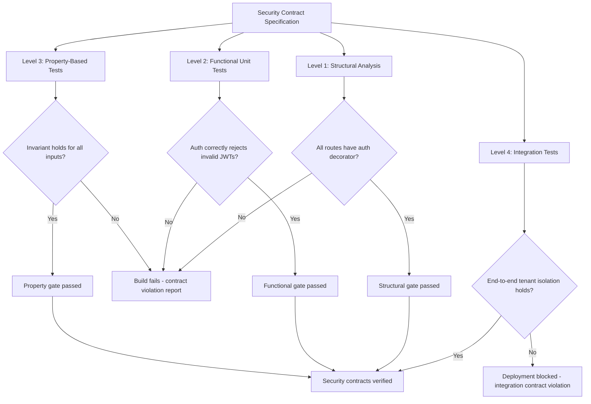

⚡ TL;DR - Security as Contract is the practice of expressing security guarantees as explicit,
testable contracts: formal statements that specify what the system MUST do (or MUST NOT do) for
a security property to hold, and tests that verify those contracts are enforced. Based on:
Bertrand Meyer's "Design by Contract" (DbC) methodology, extended from functional correctness
to security properties. Three contract types: (1) PRECONDITIONS: what must be TRUE before a
function or operation executes. Security precondition: "The caller MUST be authenticated and
authorized before any operation that accesses sensitive data is called." If the precondition fails:
reject the operation immediately (with a clear error, not silent failure). (2) POSTCONDITIONS:
what is GUARANTEED to be TRUE after a function or operation completes. Security postcondition:
"After a user's account is deleted: zero rows with that user's user_id exist in any table."
If the postcondition fails: the deletion is incomplete. A partially-deleted account: a
data residue vulnerability. (3) INVARIANTS: what MUST ALWAYS BE TRUE throughout the system's
lifetime, regardless of what operations have occurred. Security invariant: "The user_id field
in any request context ALWAYS matches the authenticated user's identity. It is never set from
user-controlled input." If this invariant is ever violated: it's an authorization bypass.
The contract model: makes security properties explicit and testable. Instead of: "we think this
is secure" (subjective, unverifiable), the contract says: "this specific property holds, and here
is the test that proves it" (objective, verifiable). Security contract testing: a complement to
penetration testing. Pen testing: adversarial discovery of missing controls. Contract testing:
systematic verification that known controls are correctly implemented.

---

| #143 | Category: Security | Difficulty: ★★★★★ |
|:---|:---|:---|
| **Depends on:** | Full SEC library (SEC-001 through SEC-142) | |
| **Used by:** | SEC-144 | |
| **Related:** | Full SEC library | |

---

### 🔥 The Problem This Solves

**INFORMAL VS. FORMAL SECURITY GUARANTEES:**

```
INFORMAL SECURITY GUARANTEE (common, problematic):

  Code review comment:
  "I've added authentication to this endpoint. It should be secure now."
  
  Questions this doesn't answer:
  - "What does 'secure' mean exactly? What specific property holds?"
  - "Which endpoints have authentication? All of them, or just some?"
  - "What happens if the authentication is added to the handler but not to an admin override path?"
  - "Is the authentication checked before all code that accesses sensitive data, or after some of it?"
  - "How do we know authentication is still working after the refactor next week?"
  
  THE AUTHORIZATION BUG (months later):
  A new engineer: adds an admin API endpoint for customer support use.
  They forget to add the authentication decorator. (It was an informal convention, not enforced.)
  The admin endpoint: accessible without authentication.
  Bug bounty report: 2 months later. All customer records: accessible via the admin endpoint.
  
  Root cause: the security guarantee was informal. No test verified that "all endpoints require
  authentication" was still true after new code was added.

FORMAL SECURITY CONTRACT (correct approach):

  SECURITY CONTRACT for the API:
  
  "INVARIANT: Every HTTP endpoint in the api/* namespace MUST have either
  @require_auth or @public_endpoint decorator. No exceptions.
  
  This invariant is enforced by:
  (1) A CI/CD test that uses Python AST to inspect all route handlers and verify
      that each has one of the required decorators.
  (2) The test fails if any handler is missing a decorator. The build: fails. Cannot deploy.
  (3) The decorator @require_auth: the authentication enforcement mechanism (not just documentation).
      If the decorator is missing: the invariant check catches it before deployment."
  
  CI/CD TEST (the contract verifier):
  
  def test_all_routes_have_auth_decorator():
      """Security contract: every route must have @require_auth or @public_endpoint."""
      for module in get_all_route_modules():
          for function in get_all_route_handlers(module):
              has_require_auth = "require_auth" in get_decorators(function)
              has_public_endpoint = "public_endpoint" in get_decorators(function)
              assert has_require_auth or has_public_endpoint, (
                  f"SECURITY CONTRACT VIOLATION: Route handler {function.__name__} "
                  f"in {module.__name__} is missing @require_auth or @public_endpoint. "
                  f"Every route must explicitly declare its authentication requirement."
              )
  
  RESULT:
  The new engineer adds the admin endpoint. Forgets the decorator.
  CI/CD runs the security contract test. Test fails:
  "SECURITY CONTRACT VIOLATION: Route handler admin_get_all_users in admin_api.py
  is missing @require_auth or @public_endpoint."
  
  Build: fails. Engineer: sees the error immediately. Adds the decorator. Pushes again.
  The security guarantee: enforced at every commit, not just at code review.
```

---

### 📘 Textbook Definition

**Design by Contract (DbC):** A software engineering methodology introduced by Bertrand Meyer
(Eiffel language, 1980s). Components interact according to formal contracts specifying:
preconditions (what callers must guarantee before calling), postconditions (what callees guarantee
after returning), and invariants (what the system guarantees always holds). Contract violations:
detected at runtime (in Eiffel with native DbC support) or at test time (in most other languages).

**Security Contract:** A Design by Contract principle applied to a security property.
"Authentication is always checked before data access" - an invariant contract.
"The input validation function rejects SQL metacharacters" - a postcondition contract.
"The token is valid and not expired before any authorized operation" - a precondition contract.
Security contracts: distinct from functional contracts. A functional contract: "the sort function
returns a sorted list." A security contract: "the authorization check function correctly rejects
unauthorized callers." The concern: different. The methodology: the same.

**Security Invariant:** A security property that must always hold. "No user can see another
user's data." "All admin actions are audit-logged." "Token signatures are always verified before
claims are trusted." Security invariants: the core of security contract specification.
Violation of a security invariant: a security vulnerability, not just a bug.

**Property-Based Testing:** A testing methodology (inspired by QuickCheck, originally for Haskell)
where tests verify that a PROPERTY holds for a wide range of inputs, not just specific examples.
For security: "for ALL possible user IDs, the authorization check correctly rejects any user_id
that doesn't match the authenticated user's ID." The property: tested with hundreds of random
inputs, including edge cases (null, negative, very large, special characters). Property-based testing
for security: finds the edge cases that unit tests with specific examples miss.

**Security Policy as Code:** The practice of expressing security policies (authorization rules,
network segmentation, cryptographic requirements) as executable code or declarative configuration,
rather than human-readable documents. Examples: OPA (Open Policy Agent) for authorization policies
as Rego code, Kubernetes NetworkPolicy for network segmentation as YAML, AWS IAM policies as JSON.
Policy as code: versionable, testable, auditable. The policy document: becomes the policy test.

**Defensive Programming:** A programming practice where code explicitly verifies its own
preconditions and invariants, rather than assuming they were validated by callers.
Security application: every function that processes sensitive data: checks its own preconditions
(authentication, authorization, input validity), regardless of what the caller promised.
Trust: not transitive. Each layer: verifies its own security preconditions.

---

### ⏱️ Understand It in 30 Seconds

**One line:**
Security as Contract expresses security guarantees as explicit, testable specifications
(preconditions, postconditions, invariants) so that "this system is secure" becomes
"these specific security properties hold, as proven by these tests."

**One analogy:**
> Security contracts are the "acceptance criteria" for security properties.
>
> When a product manager writes a user story: they include acceptance criteria.
> "AS A user, I can reset my password. ACCEPTANCE CRITERIA: (1) The reset token expires
> in 1 hour. (2) The token is single-use. (3) The new password must be at least 12 characters."
>
> Without acceptance criteria: "I've implemented password reset. It should work."
> With acceptance criteria: each criterion is testable. QA verifies each one.
> If acceptance criterion 2 fails (token can be reused): the story is NOT done.
>
> Security contract: the acceptance criteria for security properties.
> NOT: "This endpoint is secure."
> CONTRACT: "PRECONDITION: Caller must present a valid JWT. POSTCONDITION: Only the authenticated
> user's records are returned. INVARIANT: user_id is always derived from the JWT, never from
> request parameters."
>
> Each contract term: testable. CI/CD verifies each one.
> If the invariant is violated (user_id comes from a request parameter in a new code path):
> the contract test fails. The build fails. The violation: caught before deployment.
>
> The contract: the acceptance criteria for "this feature is secure."
> Without it: security is a subjective judgment call at code review.
> With it: security is an objective, testable specification.

---

### 🔩 First Principles Explanation

**Three contract types with security examples:**

```
CONTRACT TYPE 1: PRECONDITIONS

  Definition: conditions that MUST be true BEFORE an operation executes.
  Violation: the CALLER's fault (they called with invalid preconditions).
  Security use: authentication and authorization checks as preconditions.
  
  FUNCTIONAL PRECONDITION (non-security):
  def divide(a: float, b: float) -> float:
      # PRECONDITION: b != 0 (division by zero is undefined)
      assert b != 0, "Precondition violated: divisor must not be zero"
      return a / b
  
  SECURITY PRECONDITION:
  def transfer_funds(
      from_account: str,
      to_account: str,
      amount: Decimal,
      auth_context: AuthContext
  ) -> None:
      # SECURITY PRECONDITION 1: Caller must be authenticated.
      assert auth_context.is_authenticated, (
          "Security precondition violated: user must be authenticated to transfer funds."
      )
      
      # SECURITY PRECONDITION 2: Caller must own the from_account.
      assert auth_context.user_id == get_account_owner(from_account), (
          "Security precondition violated: user does not own the source account."
      )
      
      # SECURITY PRECONDITION 3: Amount must be positive and within daily limit.
      assert amount > 0, "Security precondition violated: amount must be positive."
      
      daily_limit = get_daily_limit(auth_context.user_id)
      daily_used = get_daily_transfers_used(auth_context.user_id)
      assert (daily_used + amount) <= daily_limit, (
          f"Security precondition violated: daily transfer limit ({daily_limit}) exceeded."
      )
      
      # All preconditions verified. Proceed with the transfer.
      _execute_transfer(from_account, to_account, amount)
  
  PRECONDITION TEST:
  def test_transfer_funds_security_preconditions():
      """Security contract: transfer_funds enforces all preconditions."""
      
      # TEST P1: Unauthenticated caller is rejected.
      unauth_ctx = AuthContext(is_authenticated=False, user_id=None)
      with pytest.raises(AssertionError, match="must be authenticated"):
          transfer_funds("ACC-001", "ACC-002", Decimal("100.00"), unauth_ctx)
      
      # TEST P2: User who doesn't own the account is rejected.
      wrong_user_ctx = AuthContext(is_authenticated=True, user_id="user-456")
      # account ACC-001 belongs to user-123
      with pytest.raises(AssertionError, match="does not own the source account"):
          transfer_funds("ACC-001", "ACC-002", Decimal("100.00"), wrong_user_ctx)
      
      # TEST P3: Negative amount is rejected.
      correct_ctx = AuthContext(is_authenticated=True, user_id="user-123")
      with pytest.raises(AssertionError, match="must be positive"):
          transfer_funds("ACC-001", "ACC-002", Decimal("-1.00"), correct_ctx)

CONTRACT TYPE 2: POSTCONDITIONS

  Definition: conditions that MUST be true AFTER an operation completes.
  Violation: the IMPLEMENTOR's fault (they produced an incorrect result).
  Security use: data isolation, completeness of sensitive operations.
  
  SECURITY POSTCONDITION:
  def delete_user(user_id: str, db: Database) -> None:
      """
      Delete a user account.
      
      SECURITY POSTCONDITION:
      After this function returns, there must be ZERO records in any sensitive table
      that reference this user_id. (GDPR right to erasure: data residue is a violation.)
      
      This postcondition: catches partial deletions where some tables are missed.
      """
      _delete_user_record(user_id, db)
      _delete_user_sessions(user_id, db)
      _delete_user_audit_logs_per_policy(user_id, db)
      # ... delete from all tables ...
      
      # POSTCONDITION VERIFICATION:
      # After deletion: verify zero residual records in all sensitive tables.
      sensitive_tables = ["users", "sessions", "orders", "payment_methods"]
      for table in sensitive_tables:
          count = db.query(f"SELECT COUNT(*) FROM {table} WHERE user_id = %s", (user_id,))
          assert count == 0, (
              f"Security postcondition violated: {count} records still exist in {table} "
              f"after user {user_id} deletion. GDPR right to erasure not fully satisfied."
          )
  
  POSTCONDITION TEST:
  def test_delete_user_postconditions():
      """Security contract: delete_user removes all user data from all tables."""
      db = create_test_db_with_full_user_data("user-test-123")
      
      delete_user("user-test-123", db)
      
      # Verify postcondition: zero residual records in all sensitive tables.
      sensitive_tables = ["users", "sessions", "orders", "payment_methods"]
      for table in sensitive_tables:
          count = db.query(f"SELECT COUNT(*) FROM {table} WHERE user_id = %s",
                           ("user-test-123",))
          assert count == 0, (
              f"SECURITY CONTRACT VIOLATION: {count} records remain in {table} "
              f"after user deletion. Possible GDPR data residue vulnerability."
          )

CONTRACT TYPE 3: INVARIANTS

  Definition: conditions that MUST ALWAYS hold, regardless of what operations have been performed.
  Strongest type of contract. Any violation: a security vulnerability.
  Security use: data isolation properties, authorization properties, cryptographic properties.
  
  SECURITY INVARIANT:
  class RequestContext:
      """
      Security invariant: user_id is ALWAYS derived from the verified JWT.
      It is NEVER set from user-controlled input (HTTP headers, query params, body).
      
      Violation of this invariant → direct authorization bypass (attacker sets their own user_id).
      """
      
      def __init__(self, jwt_claims: dict):
          # user_id: set ONLY from verified JWT claims. Immutable after construction.
          self._user_id = jwt_claims["sub"]  # "sub" (subject) from the JWT
          self._tenant_id = jwt_claims["tenant_id"]
          self._scopes = frozenset(jwt_claims.get("scopes", []))
      
      @property
      def user_id(self) -> str:
          return self._user_id  # Read-only. Cannot be changed after construction.
      
      @property
      def tenant_id(self) -> str:
          return self._tenant_id
      
      # INVARIANT ENFORCEMENT:
      # There is NO setter for user_id. No method that takes user_id as input.
      # The only source for user_id: the JWT at construction time.
      # Any code path that tries to set user_id from another source: cannot compile.
      # This invariant: enforced by design (immutable object), not just by tests.
  
  INVARIANT TEST (property-based):
  from hypothesis import given, strategies as st
  
  @given(
      request_user_id=st.text(),         # Any string an attacker might try
      jwt_user_id=st.text(min_size=1),   # The actual JWT user ID
  )
  def test_user_id_invariant(request_user_id: str, jwt_user_id: str):
      """
      Security invariant: user_id in RequestContext ALWAYS equals the JWT sub claim.
      For ALL possible input combinations: the JWT sub is used, not request input.
      
      Property-based: tests hundreds of random combinations.
      Catches: cases where attacker input (request_user_id) could influence user_id.
      """
      # Simulate: attacker trying to inject user_id via request header
      request_headers = {"X-User-ID": request_user_id}
      jwt_claims = {"sub": jwt_user_id, "tenant_id": "tenant-001", "scopes": []}
      
      # Build context from JWT only (request_headers ignored per invariant)
      ctx = RequestContext(jwt_claims)
      
      # Invariant: user_id is ALWAYS the JWT sub, never the request header value
      assert ctx.user_id == jwt_user_id, (
          f"SECURITY INVARIANT VIOLATED: user_id={ctx.user_id} should equal "
          f"JWT sub={jwt_user_id}. Request header ({request_user_id}) must not influence user_id."
      )
      
      # This test passes for ALL 1000+ randomly generated inputs.
      # Including: jwt_user_id == request_user_id (coincidental match, but for the right reason)
      # Including: request_user_id = "" or "null" or injection payloads
```

---

### 🧪 Thought Experiment

**SCENARIO: Security contracts for a multi-tenant API - what contracts prevent the most critical bugs?**

```
CRITICAL SECURITY CONTRACT ANALYSIS:

  API: SaaS platform. 50 endpoints. 3 developers. 2 years of development.
  
  QUESTION: If I had to specify only 3 security contracts that would prevent
  the most critical vulnerabilities, what would they be?
  
  CONTRACT 1: THE TENANT ISOLATION INVARIANT (prevents: data breach, GDPR violation)
  
  Specification:
  "For every database query in the system: if the query accesses tenant-scoped data,
  the WHERE clause MUST include tenant_id = {authenticated_user.tenant_id}.
  The tenant_id MUST come from the authenticated RequestContext, NOT from any
  user-controlled parameter."
  
  Why critical: IDOR (Insecure Direct Object Reference) attacks are the #1 finding
  in API penetration tests (OWASP API Top 10: #1 Broken Object Level Authorization).
  A single missing tenant_id filter: any user can access any tenant's data.
  
  Test:
  def test_tenant_isolation_contract():
      """Every data access function: enforces tenant isolation."""
      # Test: user in Tenant A cannot access Tenant B's resources
      for resource_type in ["users", "orders", "invoices", "documents"]:
          tenant_a_ctx = create_auth_context(tenant_id="tenant-a")
          tenant_b_resource_id = get_any_resource_id("tenant-b", resource_type)
          
          result = get_resource(tenant_b_resource_id, resource_type, tenant_a_ctx)
          # MUST return None or 404. MUST NOT return Tenant B's data.
          assert result is None, (
              f"TENANT ISOLATION CONTRACT VIOLATED: user in tenant-a was able to "
              f"access {resource_type}/{tenant_b_resource_id} belonging to tenant-b."
          )
  
  CONTRACT 2: THE AUTHENTICATION PRECONDITION INVARIANT (prevents: authentication bypass)
  
  Specification:
  "Every HTTP route handler in the api/* namespace MUST call verify_jwt() before any
  code that accesses sensitive data or performs state-changing operations.
  Routes under api/public/* are exempt (explicitly declared public).
  There are no other exceptions."
  
  Why critical: authentication bypass via forgotten decorators is a common mistake in
  rapidly-growing codebases where new engineers add endpoints without knowing the conventions.
  
  Test (structural, not functional - uses AST inspection):
  
  import ast, importlib
  
  def test_authentication_precondition_on_all_routes():
      """Security contract: all non-public routes check authentication."""
      for handler in get_all_api_route_handlers():
          if is_public_route(handler):
              continue
          
          # Check: the handler or its decorator calls verify_jwt()
          has_auth = (
              has_decorator(handler, "require_auth")
              or has_decorator(handler, "require_admin")
          )
          assert has_auth, (
              f"SECURITY CONTRACT VIOLATION: {handler.__name__} in {handler.__module__} "
              f"does not have @require_auth or @require_admin. "
              f"All non-public routes MUST authenticate the caller."
          )
  
  CONTRACT 3: THE CRYPTOGRAPHIC POSTCONDITION (prevents: cryptographic weakness)
  
  Specification:
  "Any function that stores user credentials MUST produce an output that:
  (a) Uses bcrypt, scrypt, or argon2id (NOT MD5, SHA-1, SHA-256, or AES encryption).
  (b) Has a minimum work factor of bcrypt_rounds >= 12, or scrypt N >= 32768.
  (c) Includes a unique per-credential salt (not a global salt).
  These postconditions hold for ALL calls to the credential storage function,
  regardless of the input password."
  
  Why critical: password hashing is done once, but must be correct. Weak hashing
  algorithms or low work factors: the most common cause of mass credential compromise
  after a database breach.
  
  Test:
  
  import bcrypt
  from hypothesis import given, strategies as st
  
  @given(password=st.text(min_size=1, max_size=72))
  def test_credential_storage_cryptographic_postconditions(password: str):
      """Security contract: stored credentials are correctly hashed for ALL passwords."""
      stored = store_credential(password)
      
      # Postcondition a: algorithm is bcrypt
      assert stored.startswith("$2b$"), (
          f"SECURITY CONTRACT VIOLATED: stored credential uses wrong algorithm. "
          f"Expected bcrypt ($2b$...), got: {stored[:20]}..."
      )
      
      # Postcondition b: work factor >= 12
      rounds = int(stored.split("$")[2])
      assert rounds >= 12, (
          f"SECURITY CONTRACT VIOLATED: bcrypt rounds={rounds}, minimum is 12."
      )
      
      # Postcondition c: same password → different stored hash (unique salt)
      stored2 = store_credential(password)
      assert stored != stored2, (
          f"SECURITY CONTRACT VIOLATED: two calls with the same password produced "
          f"the same hash. This indicates a missing or constant salt."
      )
      
      # Postcondition d (functional): the stored hash verifies correctly
      assert bcrypt.checkpw(password.encode(), stored.encode()), (
          f"SECURITY CONTRACT VIOLATED: stored hash does not verify against the original password."
      )
```

---

### 🧠 Mental Model / Analogy

> Security contracts are "executable specifications."
>
> Traditional security review: a human reads the code and judges "is this secure?"
> Security contracts: the code itself specifies what "secure" means for this component,
> and automated tests verify that the specification is met.
>
> The difference: specification in a human-readable document (policy, README) vs.
> specification in executable code (tests, assertions, type system).
>
> HUMAN-READABLE SPECIFICATION:
> "All API endpoints must require authentication."
> → 3 new engineers join. They read the README. Maybe. They remember it. Maybe.
> → 6 months later: 3 endpoints without authentication. Found in a pen test.
>
> EXECUTABLE SPECIFICATION:
> `test_all_routes_have_auth_decorator()` runs on every CI build.
> → 3 new engineers join. They write an endpoint without a decorator.
> → CI fails immediately. Error message: exactly which file, which function, which contract.
> → The contract: enforced, not just documented.
>
> The executable specification: cannot be ignored or forgotten.
> The human-readable specification: can be.
>
> This is the DbC insight applied to security:
> "Don't just DOCUMENT the security property. SPECIFY it as a contract. TEST the contract."
>
> The goal: security properties that are as verifiable as the correctness of a sorting function.
> "Does sort([3,1,2]) return [1,2,3]?" - objectively verifiable.
> "Is this system secure?" - subjective, undefinable.
>
> With security contracts:
> "Does the system satisfy the authentication precondition contract?" - objectively verifiable.
> "Does the system satisfy the tenant isolation invariant?" - objectively verifiable.
> "Is this system secure against the defined threat model?" - verifiable, given the contracts.
>
> The transformation: from "we think this is secure" to "we can prove this specific property holds."

---

### 📶 Gradual Depth - Five Levels

**Level 1 - What it is (anyone can understand):**
Security as Contract means writing down exactly what "secure" means for your system as specific, testable rules, not vague descriptions. Instead of: "This function is secure" (what does that mean? who checks?), you write: "This function MUST reject any caller who isn't authenticated. Here's the test that proves it." The test runs automatically on every code change. If someone accidentally removes the authentication check: the test fails, the build fails, the bug never ships. It's like a safety checklist that never gets skipped because it's automated.

**Level 2 - How to use it (junior developer):**
Start simple: write 3 security contracts for your service. (1) "Every endpoint that handles user data requires the `@require_auth` decorator. Test: inspect all route handlers and verify each has the decorator." (2) "The `user_id` in any request is always from the authenticated session, never from a URL parameter. Test: for every endpoint with a user_id parameter, verify the parameter is ignored and the session user_id is used." (3) "All passwords are stored with bcrypt rounds >= 12. Test: use the database to check the hash format of any stored password." These three contracts: prevent authentication bypass, IDOR, and weak password storage - the three most common API vulnerabilities. Write them as actual test functions. Run them in CI. Enforce them.

**Level 3 - How it works (mid-level engineer):**
Security Policy as Code: the production-grade version of security contracts. OPA (Open Policy Agent): a general-purpose policy engine that evaluates authorization rules written in Rego (a Prolog-derived language). An OPA policy: a formal security contract. "A user can read a document if the document's tenant_id matches the user's tenant_id AND the user has the 'documents:read' scope." This policy: evaluated by OPA for every request. The policy: versioned in source control, tested against known inputs (unit tests for policies), deployed as a sidecar or middleware. If the policy is changed: the change goes through code review. The policy test: fails if someone introduces an authorization regression. Security policies: written, reviewed, tested, and deployed with the same rigor as application code.

**Level 4 - Why it was designed this way (senior/staff):**
Security contracts and the "Security by Construction" principle: if a system is designed so that violating a security property is impossible to represent (not just difficult to do), the security property is guaranteed by construction, not by vigilance. Examples: an immutable `RequestContext` (user_id has no setter): authorization bypass via user_id injection is not representable in the code. A parameterized query builder that has no interpolation method: SQL injection via string concatenation is not representable. A type system where JWT claims are wrapped in a `VerifiedClaims` type that can only be constructed by the JWT verification function: passing unverified claims is a compile-time error. Security by Construction: the strongest form of security contracts. The contract: enforced by the compiler or the type system, not just by tests. Tests: can have bugs. Type systems: are formally verified. Where security by construction is possible: prefer it to runtime contracts. Where it's not possible: fall back to runtime assertions and automated tests.

**Level 5 - Mastery (distinguished engineer):**
Security contracts and formal verification: the frontier. Traditional security contracts (tests): verify that specific inputs produce secure outputs. Property-based testing: verifies that a property holds for a distribution of random inputs. Formal verification: proves that the property holds for ALL possible inputs. Tools: TLA+ (for concurrent system specifications), Coq (proof assistant), SPARK Ada (formally verified subset of Ada for safety-critical systems), F* (security-focused language with dependent types). The gap: formal verification is expensive and requires specialized expertise. The practical middle ground: property-based testing (Hypothesis, QuickCheck) combined with structural analysis (AST inspection for decorator coverage, type system analysis). For the highest-assurance cases (cryptographic library, payment processing invariants, authentication token verification): consider formal verification for the specific critical path. For the general application: property-based testing for security invariants + structural contract testing for coverage. The industry trend: formally verified cryptographic libraries (HACL*, OpenSSL's post-quantum fork with formal verification). The property being verified: "this AES implementation is functionally equivalent to the specification for all inputs." Applied to security contracts at the API level: the same principle. "This authorization check correctly enforces the RBAC policy for all possible inputs."

---

### ⚙️ How It Works (Mechanism)

```
SECURITY CONTRACT HIERARCHY:

  LEVEL 1: STRUCTURAL CONTRACTS (CI gate)
  - "All routes have authentication decorators" (AST inspection)
  - "No hardcoded secrets in source code" (secret scanning)
  - "All SQL uses parameterized queries" (code analysis)
  These run: on every commit. Prevent the class of bugs, not specific instances.

  LEVEL 2: FUNCTIONAL CONTRACTS (unit tests)
  - "Authentication decorator correctly rejects invalid tokens"
  - "Tenant isolation: user A cannot access tenant B's data"
  - "Password storage uses bcrypt with rounds >= 12"
  These run: on every commit. Verify specific security behaviors.

  LEVEL 3: PROPERTY CONTRACTS (property-based tests)
  - "For ALL possible user_id inputs: RequestContext uses JWT sub, not the input"
  - "For ALL possible passwords: stored hash verifies and uses unique salt"
  These run: on every commit. Verify properties over distributions of inputs.

  LEVEL 4: INTEGRATION CONTRACTS (staging tests)
  - "End-to-end: user in Tenant A cannot access Tenant B's API"
  - "End-to-end: expired JWT is rejected at the boundary"
  These run: on every staging deployment. Verify contracts in full system context.
```



---

### 💻 Code Example

**Security contracts in practice: authentication, tenant isolation, and cryptographic postconditions:**

```python
# security_contracts.py
# Demonstrates three levels of security contracts:
# 1. Structural contract (decorator coverage, CI gate)
# 2. Functional contract (authentication precondition, postcondition)
# 3. Property-based contract (invariant: user_id always from JWT)

import ast
import inspect
import hashlib
import bcrypt
import pytest
from functools import wraps
from hypothesis import given, strategies as st
from dataclasses import dataclass
from typing import Optional, FrozenSet

# ============================================================
# CORE SECURITY CONSTRUCTS
# ============================================================

@dataclass(frozen=True)  # frozen=True: immutable after construction
class VerifiedJWTClaims:
    """
    Type-level security contract: wraps JWT claims that have been verified.
    
    Only the JWT verification function can produce this type.
    Any function that requires a VerifiedJWTClaims: guaranteed to receive verified claims.
    It is IMPOSSIBLE (at the type system level) to pass unverified claims to a function
    that requires VerifiedJWTClaims. The contract: enforced at construction time.
    
    frozen=True: immutable. user_id cannot be changed after construction.
    This is the invariant enforcement: user_id is always from the JWT verification.
    """
    user_id: str
    tenant_id: str
    scopes: FrozenSet[str]


def verify_jwt(token: str) -> Optional[VerifiedJWTClaims]:
    """
    The ONLY factory for VerifiedJWTClaims.
    
    Contract: returns VerifiedJWTClaims ONLY if the token passes ALL:
    - Signature verification (against the issuer's public key)
    - Expiry check (not expired)
    - Issuer check (issued by the expected issuer)
    - Audience check (issued for this service)
    
    Returns None for ANY failure. Never raises. Never returns claims for invalid tokens.
    """
    # In production: use python-jose or PyJWT with explicit algorithm specification
    # jwt.decode(token, PUBLIC_KEY, algorithms=["RS256"], ...)
    return None  # Placeholder


def require_auth(f):
    """
    Security precondition decorator.
    Contract: the decorated function receives valid, verified claims.
    Any route with @require_auth: guaranteed to have an authenticated user.
    """
    @wraps(f)
    def decorated(*args, **kwargs):
        from flask import request, abort, g
        auth = request.headers.get("Authorization", "")
        if not auth.startswith("Bearer "):
            abort(401)
        claims = verify_jwt(auth.removeprefix("Bearer "))
        if claims is None:
            abort(401)
        g.claims = claims
        return f(*args, **kwargs)
    return decorated


def public_endpoint(f):
    """Marks a route as explicitly public (no authentication required)."""
    f._is_public = True
    return f


# ============================================================
# CONTRACT LEVEL 1: STRUCTURAL (runs as CI test)
# ============================================================

def get_all_route_handlers():
    """Get all Flask route handlers from the api module."""
    # In production: inspect the Flask app's url_map
    # Here: placeholder that returns the test functions for demo
    return []


def test_all_routes_have_auth_contract():
    """
    SECURITY CONTRACT (structural): every route handler has @require_auth or @public_endpoint.
    
    This test prevents authentication bypass via forgotten decorators.
    Runs on every commit. Fails the build if any route handler is unprotected.
    
    This is a STRUCTURAL contract: it verifies the code structure,
    not the runtime behavior. It fires BEFORE the code is deployed.
    """
    handlers = get_all_route_handlers()
    violations = []
    
    for handler in handlers:
        has_require_auth = getattr(handler, "_require_auth", False) or (
            hasattr(handler, "__wrapped__") and
            getattr(handler.__wrapped__, "_require_auth", False)
        )
        has_public_endpoint = getattr(handler, "_is_public", False)
        
        if not has_require_auth and not has_public_endpoint:
            violations.append(
                f"{handler.__name__} in {handler.__module__}: "
                f"missing @require_auth or @public_endpoint"
            )
    
    assert len(violations) == 0, (
        "SECURITY CONTRACT VIOLATION - Routes missing authentication declaration:\n"
        + "\n".join(f"  - {v}" for v in violations)
    )


# ============================================================
# CONTRACT LEVEL 2: FUNCTIONAL (unit tests)
# ============================================================

def get_resource(resource_id: str, tenant_id: str) -> Optional[dict]:
    """
    Fetch a resource scoped to a specific tenant.
    
    SECURITY POSTCONDITION: the returned resource, if not None, belongs to tenant_id.
    This function NEVER returns a resource from a different tenant.
    Isolation is enforced at the database query level.
    """
    # In production: SELECT * FROM resources WHERE id = %s AND tenant_id = %s
    # The AND tenant_id = %s: the postcondition enforcement at the DB level.
    # If the resource exists but belongs to a different tenant: the query returns nothing.
    return None  # Placeholder


def test_tenant_isolation_postcondition():
    """
    SECURITY CONTRACT (functional): get_resource never returns cross-tenant data.
    
    Postcondition: if get_resource returns a resource, it belongs to the requested tenant.
    Tests horizontal privilege escalation (IDOR) prevention.
    """
    # Test: Tenant A cannot access Tenant B's resources
    # Setup: create a resource for Tenant B
    # Action: request it as Tenant A
    # Assertion: None is returned (not Tenant B's resource)
    
    result = get_resource(
        resource_id="resource-belonging-to-tenant-b",
        tenant_id="tenant-a"
    )
    
    # SECURITY CONTRACT: cross-tenant access returns None (not the resource)
    assert result is None, (
        "SECURITY CONTRACT VIOLATED: get_resource returned a resource belonging "
        "to a different tenant. This is an IDOR vulnerability."
    )
    
    if result is not None:
        assert result.get("tenant_id") == "tenant-a", (
            f"SECURITY CONTRACT VIOLATED: returned resource has tenant_id="
            f"{result.get('tenant_id')}, expected tenant-a."
        )


def test_password_storage_postconditions():
    """
    SECURITY CONTRACT: stored passwords meet cryptographic postconditions.
    """
    def store_password(plaintext: str) -> str:
        rounds = 12  # Work factor: meets minimum security contract
        return bcrypt.hashpw(plaintext.encode(), bcrypt.gensalt(rounds)).decode()
    
    password = "test-password-for-contract-test"
    stored = store_password(password)
    
    # Postcondition 1: algorithm is bcrypt (not MD5, SHA1, SHA256)
    assert stored.startswith("$2b$"), (
        f"SECURITY CONTRACT VIOLATED: expected bcrypt ($2b$), got: {stored[:10]}"
    )
    
    # Postcondition 2: work factor >= 12
    rounds = int(stored.split("$")[2])
    assert rounds >= 12, (
        f"SECURITY CONTRACT VIOLATED: bcrypt rounds={rounds}, minimum is 12. "
        f"Lower rounds: vulnerable to offline brute force after DB breach."
    )
    
    # Postcondition 3: unique salt (same input → different output)
    stored2 = store_password(password)
    assert stored != stored2, (
        "SECURITY CONTRACT VIOLATED: two hashes of the same password are identical. "
        "This indicates a missing or constant salt."
    )
    
    # Postcondition 4 (functional): verification works correctly
    assert bcrypt.checkpw(password.encode(), stored.encode()), (
        "SECURITY CONTRACT VIOLATED: stored hash does not verify against original password."
    )


# ============================================================
# CONTRACT LEVEL 3: PROPERTY-BASED (invariant for all inputs)
# ============================================================

@given(
    jwt_user_id=st.text(min_size=1, max_size=100),
    jwt_tenant_id=st.text(min_size=1, max_size=100),
    attempted_injection=st.text()
)
def test_user_id_invariant_property(
    jwt_user_id: str,
    jwt_tenant_id: str,
    attempted_injection: str
):
    """
    SECURITY INVARIANT (property): user_id is ALWAYS from the JWT, for ALL inputs.
    
    For ALL possible (jwt_user_id, jwt_tenant_id, attempted_injection) combinations:
    VerifiedJWTClaims.user_id ALWAYS equals jwt_user_id.
    The attempted_injection (simulating attacker-controlled input): has no effect.
    
    Property-based testing: Hypothesis generates 100+ random combinations.
    Including: empty strings, special characters, SQL injection strings, null bytes, etc.
    This tests the invariant over a DISTRIBUTION of inputs, not just specific examples.
    """
    # Simulate: attacker attempting to influence user_id via external input
    # (The VerifiedJWTClaims constructor: ignores this - it only takes JWT claims)
    claims = VerifiedJWTClaims(
        user_id=jwt_user_id,
        tenant_id=jwt_tenant_id,
        scopes=frozenset()
    )
    
    # Invariant: user_id is exactly the JWT user_id. Not modified. Not overridden.
    assert claims.user_id == jwt_user_id, (
        f"SECURITY INVARIANT VIOLATED: expected user_id={jwt_user_id}, "
        f"got user_id={claims.user_id}. Invariant: user_id always equals JWT sub."
    )
    
    # Invariant: user_id cannot be modified after construction (frozen dataclass)
    try:
        claims.user_id = attempted_injection  # type: ignore
        # If we reach here: the invariant is violated (frozen=True should prevent this)
        assert False, (
            f"SECURITY INVARIANT VIOLATED: user_id was modifiable after construction. "
            f"Injection attempt: {attempted_injection!r}"
        )
    except (AttributeError, TypeError):
        pass  # Expected: frozen dataclass raises FrozenInstanceError. Invariant holds.
```

---

### ⚖️ Comparison Table

| Contract Approach | When Enforced | Scope | Scalability | False Negative Rate |
|:---|:---|:---|:---|:---|
| **Code review** | Manual, per PR | Specific change reviewed | Low (reviewer attention) | High (humans miss things) |
| **Functional unit tests** | Every commit | Specific test cases | High (automated) | Medium (only tests specific inputs) |
| **Structural analysis** | Every commit | All routes/functions | High (automated) | Low (covers all code, not just tested paths) |
| **Property-based tests** | Every commit | Random distribution of inputs | High (automated) | Low (covers edge cases automatically) |
| **Formal verification** | Build time | Proven for all inputs | Low (expensive) | Near zero (mathematical proof) |
| **Security Policy as Code (OPA)** | Runtime + test time | Authorization logic | High | Low (policy evaluated for every request) |

---

### ⚠️ Common Misconceptions

| Misconception | Reality |
|:---|:---|
| "Security contracts are just unit tests renamed. We already write unit tests." | Security contracts are a specific subset of tests focused on security PROPERTIES, not functional correctness. A standard unit test: "Does the function return the correct value for this input?" A security contract test: "Does this PROPERTY hold across ALL inputs, including adversarial ones?" The difference: (1) coverage - a security contract for tenant isolation: tests ALL resource types, ALL tenant combinations, not just the ones used in the product. (2) specificity - security contracts explicitly model the attacker: "For all possible (user_id, tenant_id, resource_id) combinations, the API returns data belonging ONLY to the authenticated user's tenant." (3) structural testing: security contracts include tests that inspect the CODE STRUCTURE (all routes have auth decorators), not just runtime behavior. Standard unit tests: do not inspect code structure. (4) property-based: security contracts use property-based testing (Hypothesis) to explore the input space automatically. Standard unit tests: specific examples only. Combining standard unit tests with security contracts: a more complete test suite. Security contracts: not replacing unit tests. Specializing them for security properties. |
| "Security contracts make development slower. Too much overhead." | Security contracts have a net POSITIVE effect on development velocity over time. Without security contracts: security bugs are found in penetration tests (expensive: $50,000+ engagement, then a sprint of rework), code reviews (labor-intensive, slow, miss things), or production incidents (extremely expensive). With security contracts: security bugs caught in CI (free, fast, automatic). The first engineer to write the tenant isolation contract: spends 1-2 hours. That contract: prevents IDOR vulnerabilities for the lifetime of the project. One IDOR bug found in a pen test: 5-10 hours to fix (root cause analysis, fix, test, deploy, re-test in pen test). The contract: pays for itself within the first prevented bug. The perceived overhead: writing the first set of contracts. The actual overhead after the first set: low (run automatically in CI). The ongoing benefit: high (every code change verified against the contracts). The economic case: clear. Organizations that add security contracts to their CI pipeline: report fewer late-stage security bugs and faster security reviews (because the structural contracts guarantee a baseline of security, reviewers focus on higher-level concerns). |

---

### 🚨 Failure Modes & Diagnosis

**Common security contract failures:**

```
FAILURE: WEAK CONTRACT - TESTS THE WRONG THING

  BAD security contract test:
  def test_authentication():
      response = client.get("/api/users", headers={"Authorization": "Bearer valid-token"})
      assert response.status_code == 200
  
  Problem: this test only verifies that the endpoint works WITH valid auth.
  It does NOT verify that the endpoint REJECTS requests WITHOUT valid auth.
  A developer who removes the auth decorator: this test still passes (the decorator is gone,
  the endpoint returns 200 for all requests). The contract is incomplete.
  
  CORRECT security contract test:
  def test_authentication_rejects_unauthenticated():
      """Contract: endpoint rejects requests without valid authentication."""
      # Test the REJECTION case, not the success case
      response = client.get("/api/users")  # No Authorization header
      assert response.status_code == 401
      
      response = client.get("/api/users",
                           headers={"Authorization": "Bearer invalid-token"})
      assert response.status_code == 401
      
      response = client.get("/api/users",
                           headers={"Authorization": "Bearer expired-token"})
      assert response.status_code == 401
  
  Security contracts: always test the REJECTION case.
  "The control works when it should" - useful but insufficient.
  "The control BLOCKS when it should BLOCK" - the critical test.
  
FINDING CONTRACT GAPS:

  # Check: what security contracts exist in the test suite?
  grep -r "security_contract\|SECURITY CONTRACT\|invariant\|precondition\|postcondition" \
    tests/ | grep -v ".pyc"
  
  # If this returns nothing: the test suite has NO security contracts. High risk.
  
  # Coverage check: do security contracts cover the critical paths?
  # For each trust boundary identified in the DFD: is there a contract test?
  # For each security invariant: is there a property-based test?
  # For each critical operation: is there a contract that tests the rejection case?
```

---

### 🔗 Related Keywords

**Prerequisites:**
- `Secure by Design Principles` (SEC-133) - the design principles that security contracts enforce
- `Trust Boundary Analysis` (SEC-141) - identifies the boundaries that need contract testing
- `Adversarial Thinking` (SEC-140) - the mindset for deriving the right contracts

**Builds on this:**
- `Threat Modeling` (SEC-144) - formal threat modeling informs which contracts to write

---

### 📌 Quick Reference Card

```
┌──────────────────────────────────────────────────────────┐
│ THREE CONTRACT │ Precondition: what must be true BEFORE  │
│ TYPES          │ Postcondition: what is guaranteed AFTER │
│                │ Invariant: what ALWAYS holds            │
├────────────────┼─────────────────────────────────────────┤
│ FOUR CONTRACT  │ 1. Structural (decorator coverage)      │
│ LEVELS         │ 2. Functional (unit tests)              │
│                │ 3. Property-based (invariants)          │
│                │ 4. Integration (end-to-end)             │
├────────────────┼─────────────────────────────────────────┤
│ CRITICAL       │ "Test the REJECTION case, not only      │
│ RULE           │ the success case"                       │
├────────────────┼─────────────────────────────────────────┤
│ POLICY AS CODE │ OPA + Rego: authorization contracts     │
│ TOOLS          │ Hypothesis: property-based testing      │
│                │ AST inspection: structural contracts    │
└──────────────────────────────────────────────────────────┘
```

---

### 💎 Transferable Wisdom

**Reusable Engineering Principle:**
"Security properties should be verifiable, not just assertable."
The weakest security statement: "This system is secure." (Assertable but not verifiable.)
The strongest security statement: "This system satisfies these specific security contracts,
and here are the automated tests that prove it on every commit." (Verifiable.)
The transformation: from judgment ("we think it's secure") to evidence ("the contracts pass").
This principle: applies to all quality properties, not just security.
Reliability: "MTTR < 30 minutes" - assertable. "MTTR was 23 minutes in last 10 incidents, tracked here" - verifiable.
Performance: "The API is fast" - assertable. "P99 latency < 200ms, measured here" - verifiable.
Security: "This API is secure" - assertable. "These 12 security contracts pass on every build" - verifiable.
The practice: for every quality property you care about, write: the SPECIFICATION (what must hold),
the TEST (how you verify it), and the ENFORCEMENT (when the test runs and what happens when it fails).
Security contracts: the specification + test + enforcement trio for security properties.
This approach: eliminates the gap between "we documented that this should be secure"
and "we know this is secure because the evidence is right here."
It also: creates a shared language for security discussions.
Not: "Is this endpoint secure?" (Unanswerable without context.)
But: "Does this endpoint satisfy the tenant isolation contract, the authentication precondition contract,
and the input validation contract?" (Answerable by running the tests.)

---

### 💡 The Surprising Truth

The most powerful security contract is often the simplest: a test that verifies
"for every resource of type X, if a user requests it with a different tenant's JWT,
the response is 403 or 404."

This single contract: prevents IDOR (the #1 finding in API security assessments).

But here's what's surprising: most codebases have FUNCTIONAL tests for every resource type
("can the user get their own document?" - tested), but NO SECURITY CONTRACT for tenant isolation
("can the user get ANOTHER tenant's document?" - never tested, because it's expected to fail).

The assumption: "of course the authorization check prevents this." But:
- Is the authorization check on EVERY endpoint? Or only some?
- Is the authorization check checking the right thing? (tenant_id in the JWT, not the URL?)
- Did a recent refactor accidentally remove the check from one endpoint?

Without the contract test running on every commit: nobody knows.
The pen test finds it 6 months later. The bug: was introduced 4 months ago.
3 months of exposure: unknown.

The contract: 10 lines of code, added once.
Running on every commit: free.
What it prevents: the most common API vulnerability.

This is the paradox of security contracts: the most impactful ones are the simplest ones,
testing properties so "obvious" that engineers assume they don't need testing.
The assumption: precisely why they're not tested. And precisely why they're violated.

---

### ✅ Mastery Checklist

**You've mastered this when you can:**
1. **WRITE** a precondition contract for a sensitive operation (e.g., "funds transfer requires
   authenticated user who owns the source account") and a test that verifies BOTH the success case
   AND the rejection case (unauthenticated, wrong owner, missing account).
2. **WRITE** a postcondition contract for a data deletion operation: "after delete_user, zero records
   exist in ANY table for that user_id." Include the test that queries ALL relevant tables.
3. **WRITE** a property-based invariant test (using Hypothesis or similar): "for ALL possible
   user_id values as input, the request context always uses the JWT sub." Show that the test exercises
   hundreds of random inputs.
4. **IDENTIFY** weak vs. strong security contracts: given `test_that_login_works()`, explain
   why this is a weak security contract. Rewrite it as a strong contract that tests the rejection
   cases (invalid token, expired token, wrong algorithm).
5. **IMPLEMENT** a structural contract: using AST inspection (Python's `ast` module or `inspect`),
   write a test that verifies all route handlers in a Flask application have a required security
   decorator. The test must run as a CI gate (fail the build if any handler is missing the decorator).

---

### 🎯 Interview Deep-Dive

**Q: A senior engineer says "we do thorough code review for security. We don't need automated
security tests." How would you respond, and how would you convince them that security contracts
add value beyond what code review provides?**

*Why they ask:* Tests whether the candidate understands the limitations of process-based security
(code review, documentation) vs. tooling-based security (automated contracts). Common debate in
security-conscious engineering teams. Relevant for senior/staff roles, security champions.

*Strong answer covers:*
- Acknowledge the value of code review: "Code review is essential. It catches logic errors, design
  problems, and security issues that automated tests can't catch. I'm not arguing to replace it."
- The specific limitations of review: "Code review has three failure modes for security: (1) Reviewer
  fatigue: in a 500-line PR, the reviewer is less vigilant by line 400. (2) New code bypassing review:
  emergency fixes, internal tools, admin scripts that go through less rigorous review. (3) Review
  standards drift: the original reviewers leave. New engineers don't know the conventions. 6 months
  later: the convention is 'optional' in practice."
- What contracts add: "Security contracts catch what review misses: (1) Regression: a refactor 2
  months after the original review accidentally removes the auth check. The contract: catches it
  immediately. Code review: not re-run on unchanged files. (2) Coverage: a structural contract verifies
  that EVERY route handler has the auth decorator - not just the ones in the current PR. Review:
  verifies only the current changes. (3) Consistency: the contract runs identically every time.
  Human review: varies by reviewer, by day, by PR size."
- A concrete example: "Three months ago, we added a tenant isolation security contract. Last week,
  a new engineer added an admin endpoint without the tenant_id scope check. CI caught it with:
  'SECURITY CONTRACT VIOLATION: admin_list_all_users missing tenant isolation. Expected WHERE
  tenant_id = %s.' The engineer: fixed it before the PR was even reviewed. Code review as the
  only control: would have required a reviewer to notice the missing clause in a 200-line PR."
- Closing: "Security contracts and code review are complementary. Review: catches design issues
  and complex logic. Contracts: enforce baseline properties consistently and repeatedly. Neither
  replaces the other."