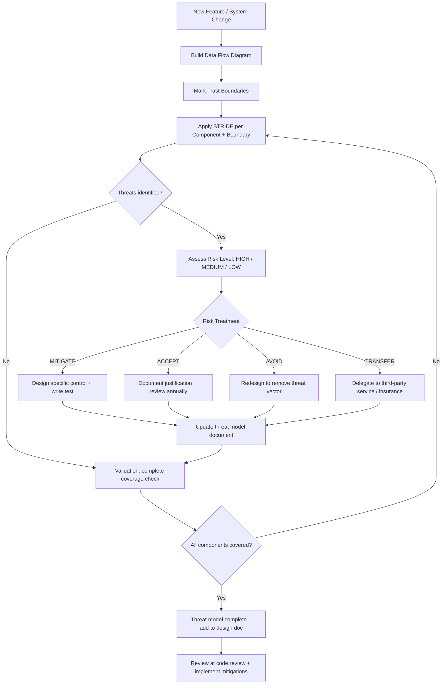

⚡ TL;DR - Threat modeling is the systematic, structured process of identifying threats to a system,
analyzing their likelihood and impact, and designing controls to mitigate the highest-priority threats.
It formalizes and scales the adversarial thinking that a senior security engineer does naturally into
a process that entire teams can follow consistently. Four fundamental questions (Adam Shostack,
"Threat Modeling: Designing for Security"): (1) WHAT ARE WE BUILDING? (system model: DFD with
trust boundaries, components, data flows, external entities). (2) WHAT CAN GO WRONG? (threat enumeration:
STRIDE categories applied to each component, or attack trees, or PASTA). (3) WHAT ARE WE GOING TO
DO ABOUT IT? (control design: mitigations, accept, transfer, avoid, for each identified threat).
(4) DID WE DO A GOOD JOB? (validation: did we model all components? Are the mitigations adequate?
Are new threats introduced by the mitigations?). Two failure modes of threat modeling: (a) too informal
(ad-hoc security review: inconsistent, incomplete, loses institutional knowledge) and (b) too formal
(bureaucratic, 100-page threat model document that nobody reads: the process becomes the goal instead
of the security outcome). The practical middle ground: a "good enough" threat model that is: (i) done
for every significant feature and architecture change, not just once for the entire system, (ii) documented
in the design doc (not a separate 100-page document), (iii) actionable (each threat: a specific mitigation
or explicit risk acceptance), and (iv) iterated (revisited when the system changes). Four threat
modeling methodologies: STRIDE (Microsoft, component-focused), PASTA (attacker-goal-focused),
LINDDUN (privacy-focused), Attack Trees (hierarchical attack decomposition). STRIDE: most widely used.
PASTA: most attacker-realistic. LINDDUN: required for GDPR/privacy-critical systems. Attack Trees:
best for specific attack path analysis. Most teams: start with STRIDE. Supplement with PASTA for
high-value targets.

---

| #144 | Category: Security | Difficulty: ★★★★★ |
|:---|:---|:---|
| **Depends on:** | Full SEC library (SEC-001 through SEC-143) | |
| **Used by:** | (capstone entry - no successors) | |
| **Related:** | Full SEC library | |

---

### 🔥 The Problem This Solves

**THE SECURITY REVIEW AS FOLKLORE:**

```
SCENARIO: Security review for a new payment feature.

  WITHOUT THREAT MODELING:
  "Let's do a security review of the new payment API."
  
  Engineer 1: "Make sure we use HTTPS."
  Engineer 2: "Add rate limiting."
  Security Engineer: "Don't forget SQL injection protection."
  Tech Lead: "Also need to log transactions."
  
  Result: ad hoc security checklist. What's wrong with it?
  
  PROBLEMS:
  
  1. COMPLETENESS: covers only what each reviewer remembered to mention.
     What was MISSED: CSRF on the payment form. Replay attack protection.
     Idempotency key missing (double-charge risk). Amount parameter validation
     (negative amount → negative charge → "pay" the attacker). Webhook signature
     verification for payment provider callbacks.
  
  2. INSTITUTIONAL KNOWLEDGE LOSS: the security knowledge: in the reviewers' heads.
     6 months later: new engineer adds a new payment endpoint. Asks:
     "What security does the payment API require?" Answer: "Look at the old endpoints."
     Copies the old endpoints. Misses three controls that were discussed verbally but
     never documented. New vulnerability introduced.
  
  3. NO RISK PRIORITIZATION: which missing control is most critical?
     "Use HTTPS" (already done) vs. "amount validation" (business logic bypass, critical).
     Without a risk framework: all findings feel equal. Teams fix easy ones. Skip hard ones.
  
  WITH THREAT MODELING (STRIDE):
  
  Component: Payment Processing Service
  
  STRIDE analysis:
  
  SPOOFING:
  T1: Attacker spoofs a payment provider webhook to credit their account.
  Risk: CRITICAL. Control: webhook signature verification (HMAC-SHA256 with shared secret).
  Test: webhook without valid signature → rejected (HTTP 401).
  
  TAMPERING:
  T2: Attacker modifies the payment amount in transit.
  Risk: CRITICAL. Control: TLS in transit. Amount validated server-side (not from URL param).
  T3: Attacker replays a valid payment request to charge twice.
  Risk: HIGH. Control: idempotency key (unique per payment attempt, stored, deduplicated).
  T4: Attacker submits negative amount to receive credit.
  Risk: HIGH. Control: amount > 0 validation. Maximum amount limit per transaction.
  
  REPUDIATION:
  T5: User claims they didn't authorize a payment.
  Risk: MEDIUM. Control: immutable transaction log with user ID, timestamp, IP, device.
  
  INFORMATION DISCLOSURE:
  T6: Payment card number visible in API logs.
  Risk: CRITICAL. Control: PAN masking in all logs (show only last 4 digits).
  
  DENIAL OF SERVICE:
  T7: Attacker floods the payment endpoint to prevent legitimate payments.
  Risk: HIGH. Control: rate limiting (per user: 10 payment attempts/minute).
  Token bucket: allows bursts but prevents sustained flooding.
  
  ELEVATION OF PRIVILEGE:
  T8: Attacker gains access to payment admin functions via horizontal privilege escalation.
  Risk: CRITICAL. Control: admin payment functions on a separate endpoint, separate auth scope.
  Regular user JWT: cannot call admin payment functions.
  
  Result: 8 specific threats, each with a risk level, specific control, and a test.
  All 8: documented in the design doc. Reviewed at code review. Verified in testing.
  New engineers: read the design doc. The security knowledge: not in heads. In documents.
```

---

### 📘 Textbook Definition

**Threat Modeling:** A structured, systematic process for identifying threats to a system and
designing mitigations for the highest-priority threats. Performed during the design phase of a
feature or system. The four-question framework (Shostack): What are we building? What can go
wrong? What are we going to do about it? Did we do a good job? Produces: a documented list of
threats, their risk levels, and the specific mitigations designed to address them.

**STRIDE:** A threat categorization methodology developed by Microsoft's Security Development
Lifecycle (SDL) team. Six categories: Spoofing (impersonating another identity), Tampering
(modifying data), Repudiation (denying having performed an action), Information Disclosure
(leaking data), Denial of Service (preventing access), Elevation of Privilege (gaining
unauthorized capabilities). Applied per component and per trust boundary crossing in the DFD.

**PASTA (Process for Attack Simulation and Threat Analysis):** A risk-centric threat modeling
methodology that starts from the attacker's goals (not the system's components). Seven stages:
(1) Define objectives. (2) Define technical scope. (3) Application decomposition (DFD).
(4) Threat analysis (ATT&CK mapping). (5) Vulnerability analysis. (6) Attack modeling
(attack trees for top threats). (7) Risk and impact analysis. PASTA: more attacker-realistic
than STRIDE. Better for high-value targets where attacker motivation is high.

**LINDDUN:** A privacy-focused threat modeling methodology. Six categories: Linkability,
Identifiability, Non-repudiation, Detectability, Disclosure of Information, Unawareness,
Non-compliance. Required for GDPR-regulated systems. Complements STRIDE (which focuses on
security properties; LINDDUN focuses on privacy properties).

**DFD (Data Flow Diagram):** The standard artifact for threat modeling. Shows: external entities
(users, third-party systems), processes (services, components), data stores (databases, caches),
data flows (APIs, queues). Trust boundaries: dashed lines. The DFD: provides a complete model
of the system that STRIDE or PASTA can be systematically applied to.

**Risk Treatment:** The decision made for each identified threat. Four options: (1) MITIGATE
(add a control that reduces the risk to acceptable level), (2) ACCEPT (explicitly acknowledge
the risk; document the decision), (3) TRANSFER (move the risk to a third party: insurance,
third-party service), (4) AVOID (redesign the system to eliminate the threat entirely).
Every identified threat: requires an explicit risk treatment decision.

---

### ⏱️ Understand It in 30 Seconds

**One line:**
Threat modeling is the systematic process of asking "what can go wrong?" for every component
of a system, prioritizing the answers by risk, and designing specific mitigations - transforming
ad hoc security thinking into a repeatable, documentable engineering process.

**One analogy:**
> Threat modeling is the "safety analysis" used in aviation for new aircraft designs.
>
> A new aircraft system: the engineering team does a formal FMEA (Failure Modes and Effects Analysis).
> For every component: "What happens if this fails?" For every failure: "What is the consequence?
> How likely? What is the mitigation?"
> Landing gear: "Failure mode: gear fails to deploy." Consequence: CATASTROPHIC. Mitigation:
> redundant hydraulic systems, manual backup, warning systems, alternative landing procedures.
> Each failure mode: formally documented. Mitigated. Verified in testing.
>
> Aviation safety record: extraordinary (0.2 fatal accidents per million flights, commercial).
> This record: not from hoping the plane won't fail. From systematically analyzing every failure mode
> and designing mitigations for the highest-consequence failures.
>
> Threat modeling: the security equivalent of FMEA.
> For every component, every trust boundary, every data flow: "What is the threat?"
> For every threat: "What is the risk level? What is the mitigation?"
> The mitigation: designed, tested, documented.
>
> Security: improving toward the aviation standard.
> Not "hope the system isn't attacked." But "systematically analyze every attack possibility
> and design mitigations for the highest-risk ones."
>
> The aviation industry: cannot afford informal safety reviews ("make sure the wings don't fall off").
> High-risk software systems: cannot afford informal security reviews ("add a firewall, it'll be fine").
> Threat modeling: the formal safety analysis for software security.

---

### 🔩 First Principles Explanation

**The four threat modeling methodologies with worked examples:**

```
METHODOLOGY 1: STRIDE (Microsoft SDL)

  APPLY TO: each component and each trust boundary crossing in the DFD.
  STRENGTH: systematic, covers all STRIDE categories, tool support (OWASP Threat Dragon,
            Microsoft Threat Modeling Tool).
  WEAKNESS: component-centric (can miss emergent threats that arise from component interactions).
  
  APPLIED TO: User Authentication Service
  
  Data Flow:
  [Browser] ---(HTTPS POST /auth/login {email, password})---> [Auth Service]
                                                                    |
                                                          [User Database]
                                                          (query: email lookup)
  
  STRIDE per data flow:
  
  S (SPOOFING):
  T1: Attacker spoofs the auth service to intercept credentials.
     Likelihood: LOW (HTTPS with cert validation prevents MITM). Risk: LOW.
     Control: HSTS + cert pinning (mobile). Status: MITIGATED.
  
  T2: Attacker uses stolen credentials (credential stuffing).
     Likelihood: HIGH (credential leaks from other breaches are common). Risk: HIGH.
     Control: (a) Bcrypt with rounds=12 (slow hash - limits stuffing rate).
              (b) CAPTCHA after 5 failed attempts (friction for automated attacks).
              (c) Anomaly detection: flag login from new country/device → MFA challenge.
     Status: MITIGATED (controls implemented).
  
  T (TAMPERING):
  T3: Attacker tampers with the session token to escalate privileges.
     Likelihood: LOW (JWT with RS256 signature). Risk: CRITICAL if successful.
     Control: JWT signed with RSA private key. Verification: RSA public key.
              Algorithm hardcoded to RS256 (prevents algorithm confusion).
     Status: MITIGATED.
  
  R (REPUDIATION):
  T4: User denies having logged in from a specific IP (for fraud investigation).
     Likelihood: MEDIUM (fraud investigation scenario). Risk: MEDIUM.
     Control: Immutable auth log: user_id, timestamp, IP, device, success/failure.
     Retained: 2 years. WORM storage. Status: MITIGATED.
  
  I (INFORMATION DISCLOSURE):
  T5: Error message reveals whether an email is registered.
     Example: "Email not found" vs. "Wrong password" → email enumeration.
     Likelihood: HIGH (common implementation mistake). Risk: MEDIUM.
     Control: Always return: "Invalid email or password" (no differentiation).
     Status: MITIGATED.
  
  T6: Timing difference reveals whether an email is registered.
     "Email not found" path: no DB query (fast). "Wrong password" path: DB query + hash (slow).
     Attacker: measures response time to enumerate valid emails.
     Likelihood: LOW but non-zero. Risk: MEDIUM.
     Control: Hash a dummy value even when email not found (constant time for both paths).
     Status: MITIGATED.
  
  D (DENIAL OF SERVICE):
  T7: Attacker floods /auth/login to lock out all users or exhaust database connections.
     Likelihood: MEDIUM. Risk: HIGH.
     Control: Rate limit per IP (10 attempts/minute). Per account (5 attempts, then 15-min lockout).
     Status: MITIGATED.
  
  E (ELEVATION OF PRIVILEGE):
  T8: Attacker bypasses password check and obtains a valid admin session.
     Likelihood: LOW. Risk: CRITICAL.
     Control: No path that returns admin JWT without password verification.
              Admin JWT: separate claim requiring separate elevated authentication.
     Status: MITIGATED.

METHODOLOGY 2: PASTA (Process for Attack Simulation and Threat Analysis)

  APPLY TO: high-value systems where attacker motivation is high (payment, authentication, PII).
  STRENGTH: starts from attacker goals (more realistic), maps to ATT&CK framework, produces
            attack trees for specific high-priority threats.
  WEAKNESS: more complex, takes longer.
  
  APPLIED TO: Payment Processing System
  
  STAGE 1: Define Objectives
  Business risk tolerance: payment fraud < 0.1% of transaction volume. Zero unauthorized charges.
  
  STAGE 2: Define Technical Scope
  In scope: payment API, payment database, webhook endpoint, admin payment API.
  Out of scope: payment processor's internal systems (Stripe, PayPal - treated as trusted).
  
  STAGE 3: Application Decomposition (DFD)
  [User Browser] → [Payment API] → [Payment DB]
  [Stripe Webhook] → [Webhook Handler] → [Order Service]
  
  STAGE 4: Threat Analysis
  Threat Actors: Opportunistic fraudster (low skill), Organized fraud ring (high skill),
                 Malicious insider (employee with DB access).
  
  STAGE 5: Vulnerability Analysis
  OWASP Top 10 applied: Broken Access Control (IDOR on payment IDs), Cryptographic Failures
  (unencrypted card data in logs), Security Misconfiguration (Stripe webhook not validated).
  
  STAGE 6: Attack Modeling (Attack Tree for top threat)
  
  Root: "Attacker causes unauthorized payment charges."
  
  OR:
  ├─ A. Attacker replays a valid payment request.
  │   → Control: idempotency keys. Leaf attack: MITIGATED.
  ├─ B. Attacker forges a Stripe webhook.
  │   → Control: HMAC-SHA256 webhook signature verification. Leaf attack: MITIGATED.
  ├─ C. Attacker exploits IDOR to charge another user's saved card.
  │   → Control: payment method ID validated against authenticated user's account. MITIGATED.
  └─ D. Attacker compromises admin API → creates fraudulent refunds in reverse.
     AND:
     ├─ D1: Attacker obtains admin credentials.
     │   Control: MFA + PAM. Likelihood: LOW.
     └─ D2: Admin API lacks fraud detection for large refunds.
        Control: Large refund (> $500) requires 4-eye approval. Status: MITIGATED.
  
  STAGE 7: Risk and Impact Analysis
  All attack paths: MITIGATED. Residual risk accepted: within business tolerance.
  
METHODOLOGY 3: LINDDUN (Privacy-Focused)

  APPLY TO: any system that handles personal data (GDPR, CCPA, HIPAA).
  
  Categories:
  Linkability: can data from different contexts be linked to the same person?
  Identifiability: can a pseudonymous record be traced to a real person?
  Non-repudiation: can the system prove that a person performed an action?
  Detectability: can an attacker determine whether a specific person's data exists?
  Disclosure of Information: data accessible to unauthorized parties.
  Unawareness: users not informed about how their data is used.
  Non-compliance: violation of applicable regulations.
  
  APPLIED TO: Analytics System collecting user behavior data:
  
  L (LINKABILITY):
  T1: Session IDs link browsing behavior across sessions.
  Privacy risk: user can be profiled over time. Control: session ID rotation. Anonymization.
  
  I (IDENTIFIABILITY):
  T2: Combination of browser fingerprint, viewport size, timezone, and language uniquely
  identifies 90% of users (Panopticlick study).
  Privacy risk: de-anonymization without explicit identifier. Control: limit fingerprinting
  signals collected. k-anonymity grouping before storage.
  
  D (DETECTABILITY):
  T3: API returns different response times for existing vs. non-existing user IDs
  (timing oracle for user enumeration).
  Privacy risk: attacker can determine whether a specific email is registered.
  Control: constant-time responses for user existence checks.
  
  U (UNAWARENESS):
  T4: Data collected and used for ML model training without user knowledge.
  Privacy risk: GDPR violation (Article 13: inform users of processing purposes at collection).
  Control: Privacy notice update. Opt-out mechanism for ML training data use.
```

---

### 🧪 Thought Experiment

**SCENARIO: Threat model for a healthcare data API - what does a complete threat model look like?**

```
SYSTEM: Healthcare patient portal API (HIPAA-regulated)

  DFD:
  [Patient Browser] --HTTPS--> [Patient Portal API] --TLS--> [Patient DB]
                                       |
  [Doctor Workstation] --mTLS--> [Clinical API] --TLS--> [Clinical DB]
  [Audit Log Service] <-- [All API Services]
  
  Trust Boundaries:
  B1: Internet ←→ Patient Portal API
  B2: Patient Portal API ←→ Patient DB
  B3: Doctor Workstation ←→ Clinical API (mTLS - physician workstations only)
  B4: Clinical API ←→ Clinical DB
  B5: Any API ←→ Audit Log Service (write-only from APIs)
  
  ATTACKER MODEL:
  Threat Actor 1: External attacker (motivated by PHI resale value: $250-$1000/record, 2023)
  Threat Actor 2: Malicious insider (disgruntled employee with DB access)
  Threat Actor 3: Compromised physician workstation (ransomware + data theft combo)
  
  STRIDE APPLIED TO BOUNDARY B1:

  SPOOFING:
  T1: Attacker obtains patient credentials (phishing, credential stuffing).
  Risk: CRITICAL. PHI exposure for that patient.
  Control: MFA (TOTP or SMS) required. Anomaly detection for new device/location.
  Test: login from new device without MFA → rejected.
  
  TAMPERING:
  T2: Attacker tampers with the diagnostic result during transit.
  Risk: CRITICAL. Incorrect treatment decision.
  Control: TLS in transit (AES-256-GCM). Digital signature on diagnostic results (integrity verification).
  Test: modified result signature → rejected at the portal.
  
  REPUDIATION:
  T3: Patient denies having viewed their diagnosis (insurance fraud scenario).
  Risk: MEDIUM. Control: Immutable audit log: patient_id, resource_id, timestamp, IP.
  Test: audit log is write-only from the API, verified with WORM storage.
  
  INFORMATION DISCLOSURE:
  T4: Unauthorized access to another patient's records (IDOR).
  Risk: CRITICAL. HIPAA violation. Financial penalty: $100-$50,000 per violation.
  Control: ALL queries scope to authenticated patient's patient_id from JWT.
  Test: patient A requests patient B's records → 403.
  
  T5: PHI visible in error messages, URLs, or logs.
  Risk: HIGH. Control: sanitized error messages. PHI excluded from all log fields.
  Test: force a 500 error → response body contains no PHI fields.
  
  T6: Patient records accessible via unpatched vulnerability.
  Risk: HIGH. Control: vulnerability management program.
  Monthly automated scanning. Critical CVEs patched within 24 hours (HIPAA requirement).
  Test: vulnerability scan shows no CVSS >= 7.0 unpatched > 24 hours.
  
  DENIAL OF SERVICE:
  T7: Ransomware attack encrypts patient data, prevents access to records.
  Risk: CRITICAL. HIPAA Safe Harbor: cannot recover without backup.
  Control: daily backups to S3 Object Lock (immutable). RTO < 4 hours. RPO < 24 hours.
  Test: quarterly recovery drill. Measured: actual time to restore from backup.
  
  ELEVATION OF PRIVILEGE:
  T8: Patient gains access to clinical API (physician-only) to view other patients' records.
  Risk: CRITICAL. mTLS on clinical API (physician workstation certificates only).
  Patient JWT: has no access to clinical API. Separate authentication domain.
  Test: patient JWT against clinical API → 403 (no valid client certificate).
  
  RISK TREATMENT SUMMARY:
  T1: MITIGATE (MFA)
  T2: MITIGATE (TLS + digital signatures)
  T3: MITIGATE (audit logging)
  T4: MITIGATE (JWT-scoped queries)
  T5: MITIGATE (log sanitization)
  T6: MITIGATE (vulnerability management)
  T7: MITIGATE (immutable backups + disaster recovery)
  T8: MITIGATE (mTLS + separate auth domain)
  
  RESIDUAL RISK: ACCEPT with documented justification.
  "Social engineering attack on a physician to obtain their mTLS-enrolled device":
  accepted (risk is low, mitigation is device enrollment with identity verification,
  further mitigation would require physical security of physician workstations which
  is out of scope for the software system). Documented in the threat model. Reviewed annually.
```

---

### 🧠 Mental Model / Analogy

> Threat modeling is "systematic pessimism with an action plan."
>
> The opposite of a security review driven by "what could go wrong?"
> asked in a brainstorming session where people mention whatever they remember.
>
> Systematic pessimism:
> - A framework (STRIDE, PASTA) ensures you consider ALL threat categories, not just the ones
>   you happened to think of today.
> - The DFD ensures you consider ALL components and ALL trust boundaries, not just the API.
> - The attacker model ensures you consider ALL attacker types, not just generic "hackers."
>
> With an action plan:
> - Every threat: has an explicit risk treatment (mitigate, accept, transfer, avoid).
> - Every mitigation: is a specific, testable control (not "add security").
> - Every accepted risk: is explicitly documented with justification.
>
> Without the framework: you get a brainstorming session.
> The result: covers the threats the engineers remember. Misses 40% of the threats.
> Nobody knows which 40%. The 40% that were missed: the attacker finds.
>
> With the framework: STRIDE has 6 categories × N components × M trust boundary crossings.
> Systematic traversal: ensures every (category, component, boundary) combination is considered.
> The coverage: provable. "We applied all 6 STRIDE categories to all 12 components and 8 trust
> boundaries: 6 × (12 + 8) = 120 combinations considered."
>
> The action plan: ensures that knowing about a threat is insufficient.
> Each threat: requires a decision. "What are we doing about this?"
> The decision: documented. The mitigation: implemented and tested.
>
> The threat model document: a record of systematic pessimism with an action plan.
> Not a compliance artifact. A design document. Read by engineers. Updated when the system changes.
> The threat model that is never updated: worse than no threat model
> (false confidence that "we've done the threat model" when the system has since changed).

---

### 📶 Gradual Depth - Five Levels

**Level 1 - What it is (anyone can understand):**
Threat modeling means: before you build something, systematically ask "how could an attacker break this?" for every part of the system, write down each attack scenario, decide what you're going to do about it (add a security control, or accept the risk), and document everything. The result: a list of specific threats with specific mitigations, reviewed in code review, and used to write security tests. Unlike an ad hoc security review ("let's make sure it's secure"), threat modeling: structured, complete, documented, and repeatable.

**Level 2 - How to use it (junior developer):**
How to do a basic STRIDE threat model for a feature: (1) Draw the DFD: the data flows for your feature (who calls what, with what data, and trust boundaries). (2) For each component and each trust boundary: ask the 6 STRIDE questions: Can an attacker SPOOF who they are? Can they TAMPER with the data? Can they deny having done something (REPUDIATION)? Can they see data they shouldn't (INFORMATION DISCLOSURE)? Can they prevent the service from working (DENIAL OF SERVICE)? Can they gain access they shouldn't have (ELEVATION OF PRIVILEGE)? (3) For each "yes": write it as a threat. Describe: what the attacker does, what the consequence is. Rate the risk (LOW/MEDIUM/HIGH/CRITICAL). (4) For each threat: decide the risk treatment (mitigate with a specific control, or accept with a documented reason). (5) Add the threats and mitigations to the design doc. Write security test cases for the critical mitigations.

**Level 3 - How it works (mid-level engineer):**
The standard threat modeling workflow in an engineering team: For each significant feature or architecture change: (1) The author creates a design doc with a DFD section. (2) The DFD: shows all components, data flows, and trust boundaries. (3) The author applies STRIDE per component and per trust boundary. (4) For each identified threat: risk level (using DREAD, CVSS, or a simple 3-level scale) and risk treatment. (5) At the design review: the team reviews the threat model section, not just the functional design. Questions: "Did you consider SSRF on the URL fetch in this component?" "What's your replay attack protection on the webhook handler?" (6) Security engineers: review the high-risk threats. Not every threat: just the critical/high ones. (7) The accepted risks: explicitly documented. Reviewed in the annual risk review. The threat model: living document, updated when the system changes. The key practice: threat modeling done for EVERY significant feature, not just once for the entire system. The system changes: new threats are introduced. Old threats: may be resolved by refactors. The threat model: tracks the current state of threats, not a historical record.

**Level 4 - Why it was designed this way (senior/staff):**
Threat modeling and the economics of security: security controls have diminishing returns. The first control you add: removes the most risk (the highest-priority threats). The 10th control for the same component: adds marginal value. How to know which controls are highest-priority? The threat model. Without a threat model: security controls are added based on what's familiar or what was recently in the news. With a threat model: controls are prioritized by risk level (likelihood × impact). The DREAD model (Damage, Reproducibility, Exploitability, Affected users, Discoverability): a quantitative risk scoring system for threat modeling. Each dimension: scored 1-3. Total DREAD score: determines priority. Critics of DREAD: the scoring is subjective, not reproducible. Microsoft discontinued it in 2008. Alternative: CVSS (used for CVE scoring). For internal threat modeling: a simple 3-level scale (HIGH/MEDIUM/LOW) with defined criteria is often more practical than false precision. The threat model's most important output: not the risk scores. The risk treatment decisions. "We have EXPLICITLY decided to mitigate this threat" vs. "We have EXPLICITLY accepted this risk because [reason]." Both: documented. The difference from ad hoc security: explicit decisions that can be audited, questioned, and updated.

**Level 5 - Mastery (distinguished engineer):**
Threat modeling and the system boundary problem: a common mistake is to threat model a component in isolation, missing the emergent security properties (or failures) that arise from the composition of components. Example: Component A: validates all inputs (individually secure). Component B: trusts Component A (individually secure). Together: if Component A is compromised, Component B is fully exposed via its trust relationship. This emergent threat: not visible in the threat model for either individual component. Visible only in the system-level threat model that includes the trust relationship between A and B. The practice: threat modeling at multiple granularities. Component-level: detailed STRIDE per data flow. System-level: trust boundary analysis, lateral movement simulation. Architecture-level: what are the blast radii? What invariants does the architecture guarantee? The security properties of a system: are not the intersection of the security properties of its components. They depend on the trust relationships, data flows, and attack surfaces that emerge from the composition. This is why the DFD is the foundation: it makes the composition visible. And why STRIDE is applied to trust boundary crossings, not just to isolated components: the boundary crossings are where composition security failures arise. Advanced threat modeling: applying ATT&CK adversary emulation. Take the ATT&CK technique matrix. Map each technique to your system: "Can the attacker use this technique in our environment?" "Do we have detections for this technique?" The ATT&CK coverage analysis: your detection gap. Each gap: a threat that is not detected. Priority: add detection engineering for the highest-value ATT&CK techniques (TA0006 - Credential Access, TA0008 - Lateral Movement, TA0010 - Exfiltration) that are relevant to your attacker model.

---

### ⚙️ How It Works (Mechanism)

```
THREAT MODELING PROCESS (end-to-end):

  STEP 1: SYSTEM MODEL (DFD)
  ┌─────────────────────────────────┐
  │ Draw: external entities,        │
  │ processes, data stores,         │
  │ data flows, trust boundaries    │
  └─────────────────────────────────┘
              |
  STEP 2: THREAT ENUMERATION
  ┌─────────────────────────────────┐
  │ STRIDE per component +          │
  │ STRIDE per trust boundary       │
  │ (or PASTA, or LINDDUN for       │
  │ privacy-focused systems)        │
  └─────────────────────────────────┘
              |
  STEP 3: RISK ASSESSMENT
  ┌─────────────────────────────────┐
  │ For each threat: Likelihood +   │
  │ Impact = Risk Level             │
  │ (HIGH / MEDIUM / LOW)           │
  └─────────────────────────────────┘
              |
  STEP 4: RISK TREATMENT
  ┌─────────────────────────────────┐
  │ MITIGATE: specific control      │
  │ ACCEPT: documented justification│
  │ TRANSFER: insurance, 3rd party  │
  │ AVOID: redesign to remove threat│
  └─────────────────────────────────┘
              |
  STEP 5: VALIDATION
  ┌─────────────────────────────────┐
  │ Are all threats addressed?      │
  │ Are mitigations adequate?       │
  │ Do mitigations introduce new    │
  │ threats? (test the controls)    │
  └─────────────────────────────────┘
```



---

### 💻 Code Example

**STRIDE-driven security testing for a token issuance endpoint:**

```python
# threat_model_tests.py
# Security tests derived directly from a STRIDE threat model.
# Each test: corresponds to a specific identified threat.
# The test naming convention: TM_[STRIDE_CATEGORY]_[THREAT_NUMBER]_[DESCRIPTION]
# This makes the connection between the threat model and the test suite explicit.

import pytest
import time
import jwt as pyjwt
from flask.testing import FlaskClient

# These tests: derived from the STRIDE analysis of the authentication endpoint.
# Source: threat_model.md, section "Auth Service", applied at Trust Boundary B1.


class TestSTRIDESpoofing:
    """STRIDE: SPOOFING threats on the authentication endpoint."""

    def test_TM_S1_credential_stuffing_rate_limited(
        self, client: FlaskClient
    ):
        """
        THREAT TM-S1: Attacker uses credential stuffing to gain account access.
        MITIGATION: Rate limiting (5 failures per account before lockout).
        TEST: Verify that the 6th login attempt is rate-limited.
        """
        # 5 failed attempts: should succeed (returned as 401 invalid credentials)
        for i in range(5):
            response = client.post("/auth/login", json={
                "email": "user@example.com",
                "password": f"wrong-password-{i}"
            })
            assert response.status_code == 401, f"Attempt {i+1}: expected 401"
        
        # 6th attempt: rate limited (429 or account lockout)
        response = client.post("/auth/login", json={
            "email": "user@example.com",
            "password": "wrong-password-5"
        })
        assert response.status_code in [429, 423], (
            "THREAT TM-S1 MITIGATION FAILED: Account not rate-limited after 5 failed attempts. "
            "Credential stuffing attack is possible."
        )

    def test_TM_S2_valid_login_succeeds(self, client: FlaskClient):
        """
        Baseline: verify the mitigation doesn't break legitimate login.
        Rate limiting: should not block correct credentials.
        """
        response = client.post("/auth/login", json={
            "email": "user@example.com",
            "password": "correct-password"
        })
        assert response.status_code == 200


class TestSTRIDETampering:
    """STRIDE: TAMPERING threats on JWT tokens."""

    def test_TM_T1_jwt_signature_required(self, client: FlaskClient, valid_token: str):
        """
        THREAT TM-T1: Attacker forges a JWT to gain unauthorized access.
        MITIGATION: JWT signature verified on every request (RS256).
        TEST: A JWT with an invalid signature is rejected.
        """
        # Tamper with the JWT: modify the payload but keep the original signature.
        parts = valid_token.split(".")
        
        # Modify the payload: change user_id to an admin ID
        import base64, json
        fake_payload = base64.urlsafe_b64encode(
            json.dumps({
                "sub": "admin-user-id",
                "role": "admin",
                "exp": int(time.time()) + 3600
            }).encode()
        ).rstrip(b"=").decode()
        
        tampered_token = f"{parts[0]}.{fake_payload}.{parts[2]}"
        
        response = client.get("/api/me",
                              headers={"Authorization": f"Bearer {tampered_token}"})
        assert response.status_code == 401, (
            "THREAT TM-T1 MITIGATION FAILED: A tampered JWT was accepted. "
            "JWT signature verification is not working."
        )

    def test_TM_T2_jwt_algorithm_confusion_blocked(self, client: FlaskClient):
        """
        THREAT TM-T2: Algorithm confusion attack (alg: none or alg: HS256 with public key).
        MITIGATION: Algorithm hardcoded to RS256 in the verifier.
        TEST: JWT with alg: none is rejected.
        """
        import base64, json
        
        alg_none_header = base64.urlsafe_b64encode(
            json.dumps({"alg": "none", "typ": "JWT"}).encode()
        ).rstrip(b"=").decode()
        
        alg_none_payload = base64.urlsafe_b64encode(
            json.dumps({
                "sub": "admin-user-id",
                "role": "admin",
                "exp": int(time.time()) + 3600
            }).encode()
        ).rstrip(b"=").decode()
        
        forged_token = f"{alg_none_header}.{alg_none_payload}."
        
        response = client.get("/api/me",
                              headers={"Authorization": f"Bearer {forged_token}"})
        assert response.status_code == 401, (
            "THREAT TM-T2 MITIGATION FAILED: JWT with alg=none was accepted. "
            "Algorithm confusion attack is possible. The verifier must reject "
            "all algorithms other than RS256."
        )


class TestSTRIDEInformationDisclosure:
    """STRIDE: INFORMATION DISCLOSURE threats."""

    def test_TM_I1_user_enumeration_blocked_by_consistent_response(
        self, client: FlaskClient
    ):
        """
        THREAT TM-I1: Attacker enumerates valid email addresses via login endpoint.
        MITIGATION: Consistent error message regardless of whether email exists.
        TEST: Login with nonexistent email returns same message as login with wrong password.
        """
        # Known non-existent email
        resp_nonexistent = client.post("/auth/login", json={
            "email": "definitely-does-not-exist@example.com",
            "password": "any-password"
        })
        
        # Known existing email, wrong password
        resp_wrong_password = client.post("/auth/login", json={
            "email": "user@example.com",
            "password": "wrong-password"
        })
        
        # THREAT TM-I1 MITIGATION: Both should return the same message.
        # No differentiation between "email not found" and "wrong password".
        assert resp_nonexistent.status_code == resp_wrong_password.status_code, (
            "THREAT TM-I1 MITIGATION FAILED: Status codes differ for nonexistent email "
            "vs. wrong password. Email enumeration is possible."
        )
        assert resp_nonexistent.json.get("error") == resp_wrong_password.json.get("error"), (
            "THREAT TM-I1 MITIGATION FAILED: Error messages differ. "
            "Expected: 'Invalid email or password' in both cases."
        )

    def test_TM_I2_no_phi_in_error_responses(self, client: FlaskClient):
        """
        THREAT TM-I2: PHI visible in error responses (HIPAA violation risk).
        MITIGATION: Error messages are sanitized. No field values in errors.
        TEST: Force an error on a patient record endpoint, verify no PHI in response.
        """
        # Force an error by requesting a malformed patient_id
        response = client.get("/api/patients/MALFORMED-ID-999999",
                              headers={"Authorization": "Bearer valid-token"})
        
        # Any error status code (404, 500, etc.)
        assert response.status_code in [400, 404, 500]
        
        # Response must not contain PHI field names or values
        response_text = response.data.decode()
        phi_patterns = ["date_of_birth", "diagnosis", "ssn", "patient_name", "medication"]
        
        for pattern in phi_patterns:
            assert pattern.lower() not in response_text.lower(), (
                f"THREAT TM-I2 MITIGATION FAILED: PHI field '{pattern}' found in error response. "
                f"Sanitize all error messages to exclude PHI."
            )


class TestSTRIDEDenialOfService:
    """STRIDE: DENIAL OF SERVICE threats."""

    def test_TM_D1_oversized_request_rejected(self, client: FlaskClient):
        """
        THREAT TM-D1: Attacker sends huge request body to exhaust memory/CPU.
        MITIGATION: Request size limit (10MB max content-length).
        TEST: Request larger than the limit is rejected with 413.
        """
        large_body = {"data": "X" * (11 * 1024 * 1024)}  # 11MB
        
        response = client.post("/api/upload",
                               json=large_body,
                               content_type="application/json")
        
        assert response.status_code == 413, (
            "THREAT TM-D1 MITIGATION FAILED: Oversized request was accepted. "
            "Request size limit is not enforced."
        )


class TestSTRIDEElevationOfPrivilege:
    """STRIDE: ELEVATION OF PRIVILEGE threats."""

    def test_TM_E1_tenant_isolation_prevents_horizontal_escalation(
        self, client: FlaskClient, tenant_a_token: str
    ):
        """
        THREAT TM-E1: Horizontal privilege escalation (IDOR).
        Attacker accesses another tenant's resources via a crafted request.
        MITIGATION: All queries scoped to authenticated user's tenant_id from JWT.
        TEST: Tenant A token cannot access Tenant B's resources.
        """
        # Get a resource ID that belongs to Tenant B
        # (In a real test: this would be set up in the test fixture)
        tenant_b_resource_id = "resource-tenant-b-12345"
        
        response = client.get(f"/api/resources/{tenant_b_resource_id}",
                              headers={"Authorization": f"Bearer {tenant_a_token}"})
        
        assert response.status_code in [403, 404], (
            "THREAT TM-E1 MITIGATION FAILED: Tenant A was able to access Tenant B's resource. "
            "This is an IDOR vulnerability. All queries must be scoped to the authenticated "
            "user's tenant_id from the JWT."
        )
        
        if response.status_code == 200:
            # If we somehow got a 200: verify the resource isn't tenant B's data
            data = response.json
            assert data.get("tenant_id") != "tenant-b", (
                f"CRITICAL: Tenant A received Tenant B's resource data. IDOR confirmed."
            )
```

---

### ⚖️ Comparison Table

| Methodology | Focus | Best For | Weakness | Output |
|:---|:---|:---|:---|:---|
| **STRIDE** | Component and trust boundary | General-purpose, API security, cloud systems | Can miss emergent system-level threats | Per-component threat list + treatments |
| **PASTA** | Attacker goals and attack simulation | High-value targets, payment, authentication | Complex, time-intensive (7 stages) | Attack trees + risk-ranked mitigations |
| **LINDDUN** | Privacy properties | GDPR/CCPA/HIPAA-regulated systems | Not a security methodology (privacy-only) | Privacy threat list + data minimization controls |
| **Attack Trees** | Specific attack path decomposition | Understanding a specific critical threat | Doesn't cover all threat categories | Hierarchical attack path + leaf mitigations |
| **ATT&CK Mapping** | Detection coverage analysis | Detection engineering, SOC coverage | Focused on known techniques, not novel threats | Detection coverage heatmap + gap analysis |

---

### ⚠️ Common Misconceptions

| Misconception | Reality |
|:---|:---|
| "Threat modeling is a one-time activity done at the start of the project." | A threat model that is never updated: worse than no threat model in some respects (creates false confidence). Security threats are introduced by every architectural change: a new microservice added, a new API endpoint, a new third-party integration, a new data flow. Each change: potentially introduces new threats or changes existing risk levels. The practice: threat modeling for every significant feature and architecture change. Not a one-time exercise. The "significant" threshold: any change that: (a) adds a new trust boundary crossing, (b) changes who has access to sensitive data, (c) introduces a new external entity or data store, or (d) changes authentication or authorization flows. Small refactors: don't require a full threat model update. Architectural changes: always do. The threat model document: a living artifact, versioned in source control alongside the code. The version history: shows how the threat model evolved as the system evolved. An audit: "how did the threat model change when you added the new admin API?" should have a clear answer in the version history. |
| "Threat modeling requires a security expert. Regular engineers can't do it." | STRIDE threat modeling is a systematic process that any engineer can apply. The framework: provides the structure. The engineer provides the domain knowledge about the system. The combination: a threat model that is both systematic and accurate. The role of security experts in threat modeling: review, not replacement. Security engineers: review the threat model for completeness (did the engineer miss any STRIDE categories?), accuracy (is the risk level assessment reasonable?), and adequacy of mitigations (is the proposed control actually effective?). But the engineer who designed the feature: best positioned to know what the data flows are, what the trust assumptions are, and what the edge cases are. Security engineers who try to do threat modeling without the feature engineer: produce threat models that miss system-specific context. Engineers who threat model their own features, reviewed by security engineers: produce the highest-quality threat models. This is the "security champion" model: each feature team has an engineer trained in threat modeling (2-4 hours of training). Security team: available to review and advise. Not a bottleneck in every design review. |

---

### 🚨 Failure Modes & Diagnosis

**Common threat modeling failures:**

```
FAILURE: THE CHECKBOX THREAT MODEL (compliance without value)

  Symptom: "We have a threat model. It's a 200-page document from 3 years ago.
           We updated it last year by changing the date on the cover page."
  
  Root cause: threat modeling treated as a compliance requirement, not a design tool.
  The document: exists to satisfy an auditor or a procurement requirement.
  Not: to actually identify and mitigate threats.
  
  Indicators of a checkbox threat model:
  - The document is not referenced in any design review.
  - Engineers on the team: cannot name the top 3 threats in the system.
  - The threat model: was not updated when the architecture changed last quarter.
  - Risk treatments: vague ("implement best practices", "use encryption",
    not specific controls with tests).
  
  REMEDY:
  1. Reduce scope: a useful 2-page threat model > a useless 200-page document.
  2. Integrate: threat model section in the design doc, not a separate document.
  3. Require action items: each HIGH/CRITICAL threat → a specific engineering task.
  4. Review in design review: "Did you do a threat model? Walk me through the top 3 threats."
  5. Update: explicitly require updating the threat model for architectural changes.

FINDING UNTHREAT-MODELED COMPONENTS:

  # Check: does the design doc for this feature have a threat model section?
  grep -r "threat model\|STRIDE\|PASTA\|trust boundary" docs/design/ | grep -c ""
  # If this count is much lower than the number of design docs: most features have no threat model.
  
  # Check: are security tests linked to threat model items?
  grep -r "TM-\|THREAT\|STRIDE" tests/ | grep -c ""
  # If zero: security tests are not derived from the threat model.
  
  # ATT&CK coverage analysis (for detection gap):
  # Download the MITRE ATT&CK matrix for your platform (Enterprise, Cloud)
  # Map each technique to your current SIEM detection rules
  # Count: % of techniques with detection coverage
  # Target: 70%+ coverage of the techniques most relevant to your attacker model
```

---

### 🔗 Related Keywords

**Prerequisites:**
- `Adversarial Thinking` (SEC-140) - the underlying cognitive orientation for threat modeling
- `Trust Boundary Analysis` (SEC-141) - the foundation of the DFD-based threat model
- `Assume-Breach Reasoning` (SEC-142) - the threat modeling perspective on post-breach scenarios
- `Security as Contract` (SEC-143) - formalizing threat model mitigations as testable contracts

---

### 📌 Quick Reference Card

```
┌──────────────────────────────────────────────────────────┐
│ FOUR           │ What are we building? (DFD)             │
│ QUESTIONS      │ What can go wrong? (STRIDE)             │
│                │ What are we doing about it? (controls)  │
│                │ Did we do a good job? (validation)      │
├────────────────┼─────────────────────────────────────────┤
│ STRIDE         │ Spoofing / Tampering / Repudiation       │
│                │ Information Disclosure / DoS / EoP      │
├────────────────┼─────────────────────────────────────────┤
│ RISK           │ MITIGATE: specific control + test        │
│ TREATMENT      │ ACCEPT: documented justification         │
│                │ TRANSFER: 3rd party / insurance          │
│                │ AVOID: redesign to remove threat         │
├────────────────┼─────────────────────────────────────────┤
│ WHEN           │ Every significant feature + arch change  │
│                │ NOT once at project start                │
│                │ Living document, versioned with code     │
└──────────────────────────────────────────────────────────┘
```

---

### 💎 Transferable Wisdom

**Reusable Engineering Principle:**
"A threat model is only as good as the engineering action it drives."
The threat model is not the artifact. The threat model is the process that produces
specific engineering tasks: a mitigation control to implement, a security test to write,
an accepted risk to document and review.
A 2-page threat model that produces 10 specific security tests and 3 design changes:
vastly more valuable than a 200-page document that produces 0 engineering actions.
The measure of a threat model's quality: not its length or completeness of documentation.
The measure: how many specific, prioritized engineering decisions it drove.
"We identified 8 threats. 6 were mitigated with specific controls (implemented + tested).
2 were explicitly accepted with documented justifications. All 8: addressed." - High-quality output.
"We identified 47 vague concerns. None resulted in specific engineering tasks." - Low-quality output.
This principle: applies to all risk analysis, not just security.
Architecture review, operational review, capacity planning, incident retrospectives:
all produce more value when they produce specific, prioritized actions rather than observations.
The action: makes the analysis real.
The threat model that produces actions: the security knowledge translated into system changes.
The threat model that produces only documentation: the security knowledge preserved but not applied.
A threat model is only as good as the engineering action it drives.

---

### 💡 The Surprising Truth

The most valuable part of a threat model is not the list of threats. It's the list of
ACCEPTED RISKS with explicit justifications.

Every security team knows what to do with a CRITICAL threat: mitigate it. Immediately.
But every real system has risks that are not worth mitigating: the cost of mitigation
exceeds the expected loss from the threat, or the control would be too disruptive to the
user experience, or the likelihood is so low that it's beyond the practical threat model.

The discipline: making these decisions EXPLICIT.
Not "we didn't get around to fixing this" (unstated, unreviewed, unknown).
But "we explicitly decided to accept this risk because [specific reason]" (stated, documented, reviewed).

An auditor's most important question: "Show me your accepted risks."
The answer reveals more about the organization's security maturity than the mitigated risks.
Any organization: mitigates the obvious HIGH risks (it's embarrassing not to).
The sophisticated organization: also has a clean list of explicitly accepted risks,
each with a justification, a risk owner, and an annual review date.
This is the sign of a mature security program: not the absence of risk, but the explicit
management of residual risk. Risk: cannot be eliminated. It can only be managed or transferred.
The threat model's accepted risk list: the formal record of risk management decisions.
Regulators (GDPR, HIPAA, PCI-DSS): do not require zero risk. They require reasonable risk management.
The accepted risk list: evidence of reasonable risk management.
"We identified this risk, assessed it, decided to accept it because [reason], and will review annually."
This: acceptable to most regulators.
"We hadn't thought about this risk until you mentioned it in this audit."
This: evidence of unreasonable risk management.
The threat model's accepted risk section: the most valuable section for the organization's
security posture, compliance posture, and institutional security knowledge.

---

### ✅ Mastery Checklist

**You've mastered this when you can:**
1. **DRAW** a DFD for a 3-service system: show all components, data flows, external entities,
   data stores, and trust boundaries (with dashed lines). Correctly identify 3 trust boundary
   crossings that require security controls.
2. **APPLY** STRIDE to a specific component: given an "authentication service" that validates
   JWTs, enumerate at least one threat per STRIDE category (S, T, R, I, D, E) with a specific
   control for each. Include a test case for the most critical threat.
3. **WRITE** a risk treatment decision: given a specific threat (e.g., "attacker brute-forces
   the 6-digit OTP"), choose a risk treatment (mitigate with rate limiting), specify the exact
   control (max 5 attempts per 10 minutes per user, then 30-minute lockout), and write the test
   that verifies the control.
4. **DIFFERENTIATE** STRIDE vs. PASTA: given a scenario (general API design vs. high-value payment
   system), justify which methodology is more appropriate and explain the key difference in their
   approaches (component-focused vs. attacker-goal-focused).
5. **IDENTIFY** the difference between a valuable and a checkbox threat model: given two threat
   model examples, identify which is actionable (specific threats + specific controls + specific tests)
   and which is theatrical (vague concerns + "implement best practices" + no tests).

---

### 🎯 Interview Deep-Dive

**Q: Walk me through the threat model you would produce for a new "share a document with an
external user via a link" feature in a multi-tenant SaaS application.**

*Why they ask:* Shared document links are a common real-world feature that creates multiple
non-obvious security threats. Tests systematic STRIDE application, attacker thinking, and
the ability to translate threats into specific engineering decisions. Common for senior/staff
backend engineers and security architects.

*Strong answer covers:*
- DFD first: "I'd start with the data flow: (1) Authenticated user creates a share link.
  (2) System generates a link token and stores it with: the document ID, the sharer's user_id,
  the recipient's email (if restricted), permissions (view/edit), and expiry. (3) Recipient
  clicks the link. The token is validated. Document is returned. Trust boundary: the share link
  endpoint is on the internet, accessible without session authentication."
- STRIDE applied: "SPOOFING: Can an attacker spoof the token? Only if the token is not
  cryptographically random. Fix: secrets.token_urlsafe(32). TAMPERING: Can an attacker modify
  the link to access a different document? Only if the token encodes the document ID and it's
  not signed. Fix: the token is a random lookup key in the DB, not an encoded document reference.
  INFORMATION DISCLOSURE: Can an attacker access a restricted shared document without being
  the intended recipient? Only if there's no recipient restriction. Fix: if the link is
  recipient-restricted, require the recipient to authenticate (at minimum: enter their email to verify).
  REPUDIATION: Can the sharer deny having shared a document? Only if there's no audit log.
  Fix: log the creation, access, and revocation of every share link. DENIAL OF SERVICE: Can an
  attacker enumerate share link tokens? The token is 256-bit random. Brute force: infeasible.
  But: can an attacker spam the create-share endpoint to fill the DB? Fix: rate limit link creation.
  ELEVATION OF PRIVILEGE: Can a view-only recipient modify the document? Fix: permissions checked
  at the document operation level, not just at the link validation level."
- Risk treatment summary: "All identified threats: mitigated with specific controls. One accepted
  risk: 'An attacker who obtains the link via email interception can access the document as the
  intended recipient.' Accepted because: TLS protects the link in transit. Email interception
  is out of scope for the application's threat model (assumed: secure email delivery by the email provider).
  If the threat model required protection against email interception: switch to recipient-authenticated
  links (require login to access)."
- Closing: "The threat model: written in the design doc before coding starts. Security test cases
  for STRIDE-T (token not encoding document ID), STRIDE-I (recipient restriction enforced),
  STRIDE-E (view-only cannot edit): written before the code is merged."